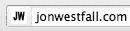
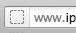
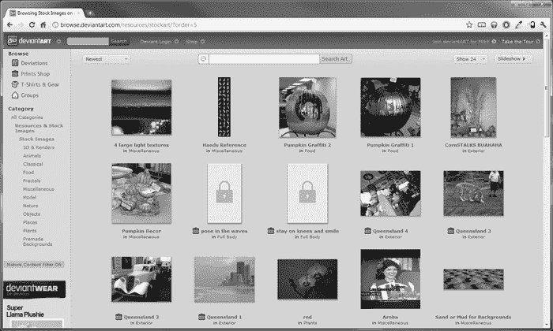
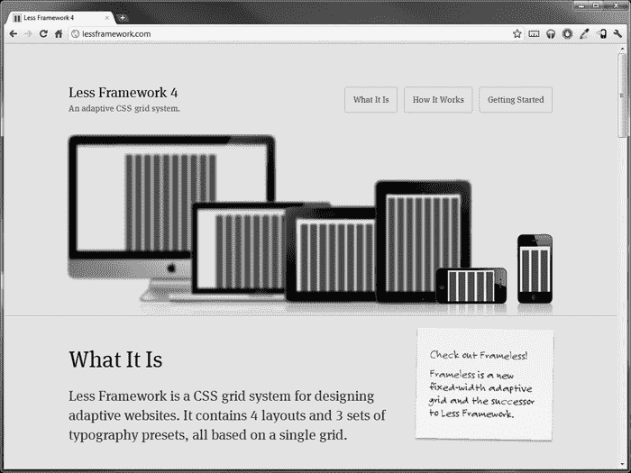
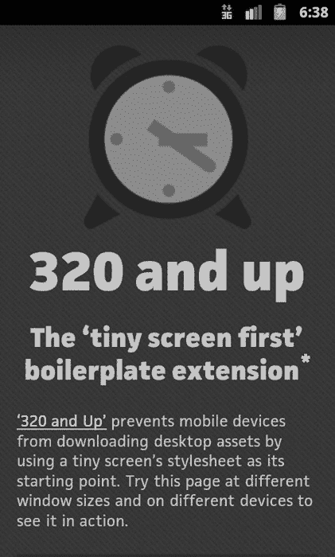
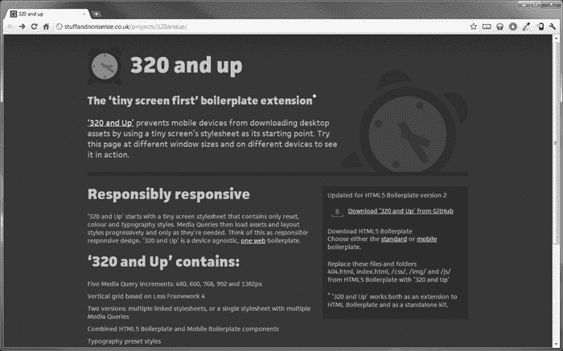
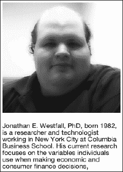
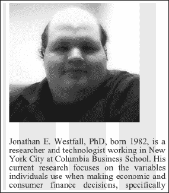
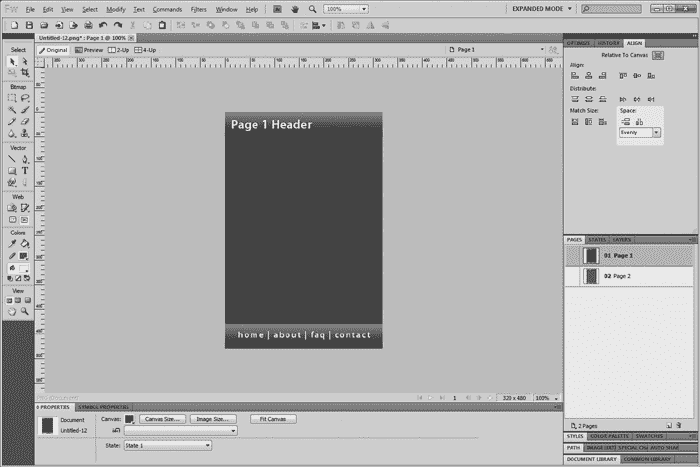

# 八、构建视觉丰富的互联网应用

既然我们已经更好地掌握了 JavaScript 和各种面向移动的 JavaScript 框架可以做些什么来增强我们的用户体验，那么是时候深入其中，用一点数字手指画来弄脏我们的手了。构建优秀的 web 应用不仅仅是编程和逻辑。相当多的网页开发从设计领域获得了很多线索。以 CSS 为例。它让开发人员疯狂的一个主要原因是因为 CSS 是一个设计工具，而不是真正的开发工具。当然，我们必须编写代码使一切看起来漂亮，但实际上我们正在做的是精心设置边距、填充、颜色、字体等。

记住这一点，在这一章中，我们将探索开发中更多涉及设计的有趣方面。我们将看看 Creative Commons 图标和图形的资源，web 字体的资源，CSS 框架，甚至是一个面向 web 开发人员和 web 设计人员的漂亮的位图和矢量图形编辑器，叫做 Adobe Fireworks `([www.adobe.com/products/fireworks.html](http://www.adobe.com/products/fireworks.html)).`

### 查找和使用图标和库存照片

让网站看起来更有吸引力的最简单的方法之一是在你的项目中添加一些图标或吸引人的图片。有大量的资源，艺术家们乐意提供他们创作的图标集或他们拍摄的宏伟照片，免费使用，不问任何问题。

在这一节中，我们将看看一些更受欢迎的网站，这些网站迎合了设计师、开发人员和所有其他爱好者对有吸引力和有趣的事物的需求。

#### 图标查找器

Iconfinder ( `[www.iconfinder.com](http://www.iconfinder.com)` /，见[Figure 8–1](#fig_8_1))是我个人最喜欢的一个，可以在开源图标的知识共享空间中找到。这个搜索引擎可以让你从 150，000 多个不同的图标中挑选出你的下一个项目。

从 12 像素到高达 512 像素的图标和图形，这个搜索引擎几乎可以保证有一些东西可以用来直观地提升你正在进行的任何项目。

虽然此搜索引擎中的图标可以免费使用，但并非所有商业网站(即，为营利团体而非非营利团体建立的网站)上的图标都可以免费使用，因此请确保阅读您可能想要使用的任何图标的许可协议。到目前为止，我们已经提到过几次 Creative Commons 许可，所以花点时间考虑一下它和其他许可是有意义的。首先，你必须记住，无论是谁最初设计了一件艺术品(无论是图标、照片等等)，都保留着该艺术品的版权。很容易想到“嘿，这是在互联网上；必须是免费的。”然而，如果主人发现了，这种想法会让你很快陷入麻烦。许多艺术家和设计师不希望为他们的内容创建一个独特的许可证，他们决定使用知识共享许可证`([http://creativecommons.org](http://creativecommons.org)`。这些许可证允许艺术家自由使用他们的作品，有或没有某些限制。你不能仅仅假设在知识共享下许可的东西是免费使用的——它可能对商业使用有限制(NC 是知识共享团队使用的简写),或者它可能要求在你的应用中归属(这里使用的简写是将图标或图像归功于所有者)。此外，所有者可能会指定应该知道的其他选项。

总而言之，如果你不确定是否可以使用一个图标，不要害怕接触作者并询问。最坏的情况是他们会说不！

**图 8–1。** *Iconfinder 搜索引擎首页。超过 158，184 个图标，并且还在增长！*

#### 查找图标

find Icons([Figure 8–2](#fig_8_2))是另一个搜索引擎，它迎合了开发人员和设计人员对网站的需求。功能和布局类似于图标查找，所以如果你熟悉一个搜索引擎，你可以很容易地适应使用另一个搜索引擎。

我发现当搜索一个图标时，同时使用两个站点总是好的，因为每个站点都有一系列在另一个站点上没有的图标。您可以在`[http://findicons.com/](http://findicons.com/)`浏览查找图标搜索引擎

**图 8–2。** *在查找图标网站上搜索“暂停”图标*

#### 使用图标

假设你已经找到了一个你喜欢的图标，或者你已经使用 favicon.ico Generator `([www.favicon.cc/](http://www.favicon.cc/)),`这样的服务创建了一个图标，你可以通过在 HTML Header 部分放置以下 HTML 代码来轻松地为你的 web 应用指定这个图标:

`<link rel="shortcut icon"  href="http://yourdomain.com/app.ico" />`

这一行告诉所有现代浏览器你的应用的图标位于`[http://yourdomain.com/app.ico](http://yourdomain.com/app.ico)`(你可以把图标放在你选择的任何地方)。这将导致浏览器显示你的图标(而不是常用的“书签”图标),只要用户将你的页面加入书签或者(在某些浏览器中)浏览到它。[图 8–3](#fig_8_3)和[8–4](#fig_8_4)分别显示了查看有图标和无图标的网站时 Mozilla Firefox 浏览器的地址栏。

**图 8–3。** *火狐显示一个带有指定图标的网址*

**图 8–4。** *火狐显示一个没有图标的网址*

您可能还想添加一行:

`<link rel="apple-touch-icon" href="/image.png" />`

这一行明确告诉移动浏览器(如苹果的 Safari 和安卓的浏览器)应该在锁定主屏幕快捷方式的功能中使用参考图像文件(通常是 57×57 像素图像或 114×114 图像文件(对于较新的系统))。对于 web 应用来说，这可以给用户一个完美的外观，让他们更接近原生应用的体验。

既然我们已经选择并使用了一个图标，让我们来讨论一下如何通过查找和使用库存照片来使我们的应用更加图像友好。我们将从最古老的图像搜索工具之一 deviantART 开始。

#### 猜猜

似乎 deviantART `([www.deviantart.com/](http://www.deviantart.com/)`，见[图 8–5](#fig_8_5)已经存在了很长时间，从技术角度来说，的确如此。这个 2000 年的古老遗迹经受住了互联网时代的考验，是业余和专业艺术家以及平面设计师创造力的一个闪亮支柱。

除此之外，一些社交媒体功能允许用户评论或与其他用户分享作品或艺术，你会有一个令人上瘾的用户体验，提供了大量的资源...有时并不是很好的资源。

一定要去看看他们的摄影区，那里有很多免费的库存摄影作品，可以在你即将到来的项目中使用。另外，一定要查看提供的库存照片的许可协议。有些艺术家可能有特殊的要求，在你利用他们的作品之前，必须先满足这些要求。这些要求可能相当普通(即无商业用途)或非常具体(即必须用于公共服务公告或慈善事业)。

**图 8–5。** *查看 deviantART* 的股票摄影版块

#### 组合拳

另一个更专业也更昂贵的解决方案是 iStockphoto `([www.istockphoto.com/](http://www.istockphoto.com/))`，它可以为你的 web 应用提供出色的库存照片。这是一项我已经使用多年的服务，为客户项目购买免版税的图像。

虽然与 deviantART 不同，这种资源不是免费使用的，但您将购买的图像来自专业人士，并且往往比您在其他地方找到的业余人士的图像质量更好。

除此之外，还有一个很大的图像存档，可以很容易地搜索到你想要的东西，你有一个应该总是放在手边的资源！你永远不知道什么时候，有一天，你的一个客户可能会打电话给你说“嘿，我已经决定我们真的要在我们的网站上添加一个巨大的粉红色电话”，尽管这听起来很疯狂和可笑，但你很可能会在 iStockphoto 上找到一个巨大的粉红色电话的图像。

除了 iStockphoto 和 deviantART，你还可以在 Shutterstock ( `[www.shutterstock.com](http://www.shutterstock.com))`和 Flickr ( `[www.flickr.com](http://www.flickr.com)).`)找到图片，特别是 Flickr，它有一个非常好的高级搜索功能(`[www.flickr.com/search/advanced/?](http://www.flickr.com/search/advanced/?)`)，允许你指定你只想要 Creative Commons 许可的内容(而且，你只想要 CC 许可的内容，这些内容可以免费用于商业用途，并可以进行改编)。这是为您的应用获得非常好的用户提交照片的简单方法。

在我们结束讨论照片之前，讨论一下什么时候应该和不应该选择使用照片可能是有用的。在许多不同的空间中使用图片来推广你的应用和/或让它大放异彩是很有诱惑力的；但是，有一条必须要走的细线。

#### 在 Web 应用中使用照片的指南

在找到我们在前面几节中讨论的服务后，很容易就能找到应用每个部分的照片。例如，你可能在应用的主屏幕上有很大的导航按钮，这些大的正方形在里面放照片会不会比文字或简单的图标看起来更好？也许……但是，我们建议您首先考虑以下几点:

*   我给每张照片增加了多少加载时间？回想一下，当我们测试时，我们的应用通常驻留在我们的计算机上。这使得加载时间的争论很大程度上没有实际意义——我们只是不知道在特定情况下我们的应用会如何加载。考虑到这一点，漂亮的照片有时会导致应用加载缓慢。我们建议使用适当大小的照片(例如，必要时调整大小；不要简单地指定高度和宽度，这将使它们呈现得更小，但实际上文件大小不会更小(如果可能的话，小于 10 千字节)，并在各种条件下测试页面的照片和非照片版本(例如，从生产 web 服务器提供给 WiFi 和蜂窝数据连接上的设备)。
*   我的图片会分散用户的注意力吗？是的，虽然一张图片抵得上 1000 字，但有些图片在用户中引起的争论更有价值。在某些情况下，停止标志的照片对用户来说可能很容易理解，但在其他情况下可能会令人困惑(例如，在游戏中，停止标志是否意味着一轮结束？退出游戏？阻止我的小男人走路？).图像应该只是帮助用户更快地找到东西，而不是通过分散注意力、混淆视听或质量低劣来迷惑用户。
*   使用图片会引起用户刻板印象吗？图像可能很强大，但在某些情况下，它们可能与我们熟知的传统刻板印象有关，也可能与一些你可能没有想到的刻板印象有关。例如，使用可靠的“穿西装的男人”和“使用笔记本电脑的女人”可能看起来适合你的应用；然而，用户通常已经看过这些股票图片，可能会认为你的 web 应用和其他使用过相同图片的人一样没有创意。这就是为什么现在许多网站倾向于极简设计趋势——这比“努力工作的主管”或“足球妈妈”更难预测

假设你已经考虑了前面列表中讨论的问题，使用照片可能是增强你的应用吸引力的好方法。注意你的用途！现在我们来看一个更微妙的图像操作:在我们的 web 应用中使用自定义字体。

### 网络资源

你可能还记得，在第二章中，我们在构建“那条推文是谁？”时，简要地提到了使用网络字体的基础申请。在过去的一年半时间里，所有最流行的桌面浏览器都推出了更新，现在可以在标记中使用网络字体。几乎所有 Android 的移动浏览器都可以使用它们。

将 web 字体添加到您的网站或应用非常简单，如[清单 8–1](#list_8_1)所示。

**清单 8–1。** *用一点 CSS 魔法将 Droid Sans 字体加载到我们的网络浏览器中。*

``

让我们快速看一下[清单 8–1](#list_8_1)中的代码，这样你就能理解我们在这里做什么了。我们将在`@font-face`代码中定义的第一个属性是`font-family`属性。在这里，我们可以随意命名字体。我们在这里使用字体的真名，Droid Sans，但是如果我真的想的话，我可以称它为“龟蜡”。如果您希望使用内部命名结构，使用自定义名称可能会有所帮助，尽管如果您希望对两种不同的产品使用相同的字体，这可能会造成混淆。

接下来，我们将定义新字体的`font-style`。这很重要，因为根据`font-style`是什么，我们可以有不同的 Droid Sans 字体加载变体。作为一名开发人员，这是你需要小心的地方，确保你不会在不需要的时候加载 10 种不同的字体。这不仅会弄乱你的代码，还会加载不必要的资源，从而降低用户体验。在这种情况下，我们只想使用这种字体的默认或“正常”外观；也就是说，我们不想要斜体。

在我们的`font-style`之后，我们有我们的`font-weight`。这就像它前面的属性一样，可以用来加载不同版本的字体，比如 Droid Sans Bold。

最后，但并非最不重要的，我们有我们的`src,`，它用来告诉你的计算机在服务器上哪里可以找到我们的字体，以及在用户的计算机上该字体可能被称为什么。如果字体在用户的机器上，这可以为我们节省一些带宽，因为不必下载我们已经拥有的文件。虽然在大多数情况下本地加载更可取，但是您可能会遇到希望从另一个位置加载字体的情况，例如当您测试各种字体样式以确定最合适的字体时。

#### 谷歌网页字体

你可能还记得，在我们之前的一章中，我们从谷歌网络字体中抓取了 Droid Sans 字体。当时，我们并没有详细介绍谷歌网页字体，也没有说明它对设计者和开发者来说是多么不可思议的资源。

在你的下一个项目中使用谷歌网络字体(如图 8–6 所示)最有趣的一点是，所有的字体都是开源的，任何人都可以使用，不用担心违反许可和欠别人钱。

**图 8–6。** *新设计的谷歌网页字体网站的登陆页面*

我听到的关于反对使用 web 字体的开发人员的最大抱怨之一是，字体往往有点笨重，这确实增加了加载时间。虽然由于有限的带宽，这在移动设备上可能很烦人，但谷歌已经考虑到这一点，并创建了一种简单的方法来缩小加载到用户浏览器中的字体文件的大小。

快速浏览一下[清单 8–2](#list_8_2)。这里我们有了将 Chivo Google Web 字体添加到我们的 Web 应用所需的基本 HTML 标记。

**清单 8–2。** *将非优化版本的 Chivo 字体加载到我们用户的浏览器中。*

`<linkhref='http://fonts.googleapis.com/css?family=Chivo' rel='stylesheet'
type='text/css'>`

现在，如果你看一下[清单 8–3](#list_8_3)，你可以看到我们是如何优化字体大小的，只加载我们需要组成单词“Hello World”的字母如果你需要在你的网站上加载一个只使用一次的字体，比如 logo，并且只使用几个字母，这是非常完美的。

**清单 8–3。** *加载 Chivo 字体的优化版本，只从字体中加载我们需要的字母*

`<link href='http://fonts.googleapis.com/css?family=Chivo&text=Hello%20World'
rel='stylesheet' type='text/css'>`

除了允许你优化你的字体，谷歌还会定期向谷歌网络字体目录添加新的字体。当我无聊的时候，它无疑是我最喜欢浏览的地方之一，因为你永远不知道什么时候你会发现一种神奇的字体，它会激励你坐下来开始编写新的代码。

#### 要考虑的字体问题

就像使用照片一样，使用不同的字体和文本样式时，需要考虑和计划一些注意事项:

*   **不同的风格是什么意思？**我们之前提到过，我们可以指定字体的风格变化，比如将文本变为斜体或粗体，甚至使用不同的字体变体，比如使用印刷体。虽然这些变体提供了很大的灵活性，但是如果没有一致地应用，它们也会使用户困惑。您应该考虑是否希望块文本引用动作(例如，视频或音频剪辑的播放按钮)，或者是否希望块文本以斜体显示(尽管如果文本不够大，在移动屏幕上很难阅读斜体)。但是，如果动作是斜体，照片下面的标题应该如何显示？粗体可能看起来太强了，或者可能意味着文本是一个链接。看到这是如何变得有点复杂了吗？为你的应用创建一个非正式的“风格指南”可以创造奇迹，产生一致和漂亮的输出，并有效地使用字体。
*   风格是否值得用流畅来交换？认知心理学——或大脑如何解读信息的心理学——的研究人员使用术语“流畅性”来指处理信息的难易程度。一个字体的粗细足以保持其行的分离，并且没有衬线，这是非常流畅的，这意味着读者可以很容易地快速解析它并理解你在说什么。另一方面,“优雅”笔迹的波浪形字体或非常方方正正的块状字体(字母开始相互碰撞)非常不流畅。这意味着用户将需要更长的时间来阅读这些部分。在某些情况下，这是一件好事——我们可能希望将注意力吸引到应用的某个部分，并确保用户花足够的时间来考虑它(例如，所有数据都将被删除的通知可能是一个很好的块字体候选，假设它不会如此不流畅，以至于导致人们出于沮丧而绕过它！).然而，在其他情况下，我们可能希望关注速度而不是风格。
*   **颜色不仅仅意味着字体**。虽然在应用中使用不同的字体来创建不同的外观很有诱惑力，但是人们应该考虑简单地改变文本的颜色是否足够了。在一个方案中使用颜色搭配得很好(也许使用颜色组合(`[www.colorcombos.com/](http://www.colorcombos.com/)`)比改变字体更能创造丰富的外观。前面讨论的规则同样适用于颜色(即，颜色应该一致地向读者传达相同的信息——这是警告、行动还是描述？);但是从加载和配置上来说，成本比使用字体的成本要小。

现在，我们已经讨论了如何使用字体、图像和图标来创建您想要的外观，我们将进入一个更广泛的环境——CSS 框架，在这个环境中，我们可以获得一个完整的 CSS“皮肤”来包裹我们的应用，具有深远的影响和后果！

### CSS 框架

不管你喜欢还是讨厌它们，在过去的几年里，CSS 网格框架越来越受 web 设计新手和开发人员的欢迎。我把这一切都归咎于 Blueprint，一个在 2008 年左右变得非常流行的 CSS 框架。Blueprint 的创建是为了减少开发时间，并防止开发人员在忘记边距和填充之间的区别时沮丧地拔掉自己的头发 [1](#CHP-8-FN-1) 。最后一部分对我来说可能是一个小笑话，但它离真相不远。

正如我们在本章开始时所讨论的，像级联样式表这样的工具被开发人员广泛使用，但实际上是设计人员使用的工具。开发人员可能不会对 CSS 感到舒服——有点类似于让一个木匠来管理家里的电线。他可能知道足够去做，但话说回来，他可能会把事情搞得比他从未开始做时更糟。

虽然这听起来可能有点荒谬，但我已经多次为客户承担了一个项目，处理已经由开发人员或工程师编写的样式，很明显，他们已经用编写代码逻辑的相同方式处理了编写 CSS 的整个方法。将 CSS 视为设计标准，而不是代码中的规则。

如果你听起来像是那些似乎不“理解”CSS 的人之一，那么你可能想看看已经被创建来使你的生活更容易的一些框架。从长远来看，它们将帮助您快速解决开发人员在尝试将他们的内容样式化到网格中时遇到的许多常见问题，从而节省您的时间和金钱。它们也是很好的工具，可以用来如饥似渴地了解它们是如何工作的。

__________

对罗科来说，这不是什么大问题。对乔恩来说，他需要所有他能得到的大块头发！

谁知道呢，在玩了一会儿 CSS 框架并学习了它们是如何操作的之后，你可能最终会对样式表语言产生真正的热情，并且最终会比你实现一个已经做好的解决方案更快地手工编写你自己的 CSS！

在下文中，我们强调了三个框架，从最简单的开始，它为你解决了许多桌面/移动 CSS 难题——1140 像素网格。其次是*更少的框架 4* ，它提供了一些支持，但有更多的修改空间。最后，我们讨论一下 *320 和更高版本*，Less Framework 4 的一个版本，它允许您快速启动并运行，而无需大量的调整！

#### 1140 像素网格

1140px 网格是另一个 CSS 框架，目前在互联网上运行，拥有相当大的追随者。该框架本身是在 Creative Commons 许可下发布的，可以随意使用、复制、分发和操作。

创建该框架是为了适应屏幕分辨率的最新变化，特别是当前 1280 × 800 计算机屏幕的突出地位，同时也是为了适应更小的显示器。直到最近，大多数网站都是围绕这样一个理念设计的，即普通用户的浏览器应该有大约 1024 像素宽和 800 像素高的分辨率。然而，在过去的几年中，许多开发者已经注意到，平均用户屏幕分辨率一直在缓慢地提高。

记住这一点，1140 像素网格的设计是为了利用现在更常见的屏幕分辨率，并使用响应式 web 设计以流畅的方式缩小，正如本书第 5 章所讨论的。这对开发人员来说意味着，如果您正在为桌面用户体验设计和构建一个 web 应用，那么您只需要为一个更大的显示器设计一次应用。然后，对于任何分辨率较低的浏览器，框架会智能地缩小应用。

然而，这并不总是一劳永逸的过程，有时它确实需要你进去对 CSS 做一些修改，让它看起来完全像你想要的样子。例如，网格将允许你使用许多列；但是，如果您希望您的应用在桌面和小浏览器上都有吸引力(类似于我们在本书前面讨论的，当讨论专用移动版本而不是一个页面同时提供两者时)，您可能希望将自己限制在一个网格中。总而言之，如果你必须先做大再做小，你可以在`[http://cssgrid.net/](http://cssgrid.net/)`查看 1140px 网格框架，让你的生活变得轻松一点

#### 少框架 4

Less 框架(`[http://lessframework.com/](http://lessframework.com/)`，[图 8–7](#fig_8_7))是 CSS 网格系统中的另一个例子。Less Framework 包含三种不同的排版预设和四种不同类型的布局，比一些竞争对手更强大。与 1140px 网格框架不同，该框架是根据平板电脑和智能手机的想法构建的。如果您正在构建一个只需要在手机或平板电脑上显示的应用或页面，那么 Less Framework 4 是比 1140px Grid 更好的选择。虽然这个框架是为 iPad 和 iPhone 用户开发的，但它仍然可以在基于 Android Webkit 的浏览器上很好地工作。

然而，Less 框架并不像其他一些选择那样是一个为你做任何事情的框架。为了更好地利用这个框架，建议您熟悉 HTML 和 CSS。你们三个不一定要成为最好的朋友，也不一定要邀请对方来吃圣诞晚餐，但是偶尔在饮水机旁聊聊天，看看孩子们过得怎么样，也不会有什么坏处。

作为我们意思的一个例子:考虑 Less Framework 4 有两种移动布局:普通和宽。宽布局适用于横向移动电话。考虑到用户可能会因为各种原因在不同时间切换手机的方向，您可能希望在 JavaScript 或 HTML 中采取措施，根据方向重新呈现或重新组织材料。一个在 wide 上看起来不错的应用在正常情况下可能看起来很糟糕——这是你应该确定、测试和调试的事情。

**图 8–7。** *少了谷歌 Chrome 桌面浏览器中看到的框架 4 主页*

#### 320 及以上

另一个知识共享许可框架 320 和更高版本`([http://stuffandnonsense.co.uk/projects/320andup/](http://stuffandnonsense.co.uk/projects/320andup/))`从一开始就考虑到了更小的观看门户。正如 320 和 Up 网站所说，这个框架是“小屏幕优先”。由安迪·克拉克和基思·克拉克创建，基于 Less Framework 4，这个 CSS 样式集合带有预设的排版样式和一些额外的 JavaScript 代码，用于调整图像大小和提高网站在旧浏览器中的综合性能。正如您在[图 8–8](#fig_8_8)、[8–9](#fig_8_9)和[8–10](#fig_8_10)中所看到的，它可以很好地适应当今 Android 设备上使用的不同常见方向和屏幕。

当您希望避免桌面和移动版本的应用之间的任何重叠，并且当响应是您的主要目标时，320 和更高版本是一个不错的选择。320 和更高版本还包括比 Less Framework 4 更多的定制，例如用于调整照片大小的内置 JavaScript 库，以及应用适当优化的 CSS。如果 Less Framework 4 的定制让您望而生畏，那么您可能希望从 320 开始，看看您是否真的需要深入了解！

**图 8–8。** *在安卓 2.3.4 姜饼手机上以纵向模式查看的 360 及以上网站*

**图 8–9。** *在 Android 2.3.4 姜饼手机上以横向模式浏览 360 及以上网站*

**图 8-10。** *在桌面浏览器中用谷歌 Chrome 查看 360 及以上网站。请注意，该图和之前的图都显示了相同的标记代码，但页面看起来却因用户浏览器分辨率的不同而有所不同。*

#### 对比框架:关于乔恩！！

选择正确的框架可能很难，所以在这个例子中，我们将采用相同的内容并在所有三个框架中呈现它。材料是我(乔恩的)个人网站上的简历。据推测，这将是我的移动 Jon 应用中的一个页面。首先，让我们看看在桌面网络浏览器中呈现的原始页面(参见[Figure 8–11](#fig_8_11))——这是我们试图在某种程度上在移动版本中模仿的。

**图 8–11。** *乔恩的 Biosketch 渲染在桌面上。*

首先，我们将在 1140 像素的网格中渲染它。回想一下，这个框架的优势是我们可以从桌面到移动设备获得类似的东西。首先，移动视图([图 8–12](#fig_8_12)):

**图 8–12。** *Jon 的 Biosketch 使用 1140px 网格在手机上渲染*

现在，让我们看看桌面浏览器中的视图([Figure 8–13](#fig_8_13)):

**图 8–13。** *乔恩的 Biosketch 使用 1140px 网格渲染在桌面上*

这并不完全理想——两个单栏布局在 Mobile 中堆叠在一起。然而，在桌面视图中，它们是并排显示的，非常“拥挤”。通过调整 HTML 代码，我们可以缓解这种情况，并使桌面版本看起来更好(见[图 8–14](#fig_8_14))，同时也保持移动版本。在这种情况下，问题很简单，我们使用了两个“`onecol`”框，而不是左边的`onecol`和右边的`elevencol`(填满屏幕的其余部分)。1140 像素的网格要求从一开始就知道要填充多少列，并使用适当的 div 语句。有 12 列，所以无论您使用什么组合，总共应该是 12 列(即，在本例中，1 个 onecol 和 1 个 elevencol)。您还会注意到，最后一列的 div 语句中有单词“last ”(参见[清单 8–2](#list_8_2)),它让 1140px Grid 知道它是行中的最后一列，因此应该填充页面的其余部分。

**图 8–14。** *乔恩的 Biosketch 的桌面视图片段，修复*

1140px 示例的代码可以在[清单 8–2](#list_8_2)中看到:

**清单 8–2。** *乔恩的 biosketch 使用了 1140px 的网格。*

`<!DOCTYPE HTML>
<html lang="en">

<head>
    <meta charset="utf-8" />
    <title>The 1140px Grid &middot; Fluid down to mobile</title>
    <meta name="viewport" content="width=device-width, initial-scale=1.0" />
    <link rel="stylesheet" href="css/9781430239574.css" type="text/css" media="screen" />
    
    

</head>

<body>

    

        

            

        

        

            
Jonathan E. Westfall, PhD, born 1982, is a researcher and technologist
working in New York City at Columbia Business School. His current research focuses on` `the variables individuals use when making economic and consumer finance decisions,
specifically strength of handedness, a variable correlated with a number of decision-
making and cognitive psychology tasks and measures. Dr. Westfall also conducts research
on consumer financial decision making, and applications to both marketing and public
policy. His current appointment is as the Associate Director for Research and Technology
at the Center for Decision Sciences, a center within Columbia Business School at
Columbia University in New York City. Additionally, he holds an appointment as a
Lecturer in the Columbia University Psychology department, periodically teaching a
course in Judgment and Decision Making

        

    

</body>

</html>`

现在，让我们在 Less Framework 4 中看看这个。首先，你会注意到 Less Framework 擅自应用了一些基本的字体格式，这是 1140px 允许我们手动完成的，或者如果我们愿意的话，根本不用。如果你想要那种“移动”的感觉，这可能会帮助你更快地起床和跑步，如图[图 8–15](#fig_8_15)所示。

**图 8–15。** *乔恩的 biosketch 使用了少框架 4 的框架*

代码实现起来也相当简单，主要是因为我们不用担心桌面版本。[清单 8–3](#list_8_3)给出了完整的代码，引用了 Less Framework 4 包中提供的 CSS。

**清单 8–3。** *乔恩的 biosketch 使用了少框架 4 的框架*

`<!DOCTYPE HTML>
<html>

    <head>
        <meta charset="utf-8"/>` `        <title></title>

        <link rel="stylesheet" href="main-16px.css"/>
        <meta name="viewport" content="width=device-width, initial-scale=1"/>
        

        
Jonathan E. Westfall, PhD, born 1982, is a researcher and technologist
working in New York City at Columbia Business School. His current research focuses on
the variables individuals use when making economic and consumer finance decisions,
specifically strength of handedness, a variable correlated with a number of decision-
making and cognitive psychology tasks and measures. Dr. Westfall also conducts research
on consumer financial decision making, and applications to both marketing and public
policy. His current appointment is as the Associate Director for Research and Technology
at the Center for Decision Sciences, a center within Columbia Business School at
Columbia University in New York City. Additionally, he holds an appointment as a
Lecturer in the Columbia University Psychology department, periodically teaching a
course in Judgment and Decision Making

    </head>

    <body>

    </body>

</html>`

最后，我们来看看我的 320 以上的 biosketch。它使用背景图像和自定义字体进一步应用格式，如您在[Figure 8–16](#fig_8_16)中所见。

**图 8–16。** *乔恩的 biosketch 采用 320 及以上框架*

与 1140 像素的网格相比，代码更简单，因为我们不关心桌面渲染。参见[清单 8–4](#list_8_4)。

**清单 8–4。** *乔恩的 biosketch 使用了 320 和 Up 框架*

`<!DOCTYPE HTML>
<head>
<meta charset="utf-8">

<title>320 and Up Version</title>
<!-- http://t.co/dKP3o1e -->
<meta name="HandheldFriendly" content="True">
<meta name="MobileOptimized" content="320">
<meta name="viewport" content="width=device-width, target-densitydpi=160dpi, initial-
scale=1.0">

<!-- For all browsers -->
<link rel="stylesheet" href="css/style.css">

</head>

<body class="clearfix">

    

        
Jonathan E. Westfall, PhD, born 1982, is a researcher and technologist
working in New York City at Columbia Business School. His current research focuses on
the variables individuals use when making economic and consumer finance decisions,
specifically strength of handedness, a variable correlated with a number of decision-
making and cognitive psychology tasks and measures. Dr. Westfall also conducts research
on consumer financial decision making, and applications to both marketing and public
policy. His current appointment is as the Associate Director for Research and Technology
at the Center for Decision Sciences, a center within Columbia Business School at
Columbia University in New York City. Additionally, he holds an appointment as a
Lecturer in the Columbia University Psychology department, periodically teaching a
course in Judgment and Decision Making

<!-- Scripts -->

</body>
</html>`

如您所见，每个框架的格式略有不同，允许您选择自己喜欢的格式。虽然 Less Framework 4 和 320 及更高版本在外观上看起来非常“移动”，但它们缺乏与桌面版本的任何交叉功能。另一方面，1140 像素的网格在风格上不是很“移动”，这意味着你需要手动添加。然而，作为一个加号，你在一个文件中得到一个桌面和移动版本。

为自己选择合适的 CSS 框架可能会很困难；然而，考虑到我们在这里讨论的框架，它应该给你一个为你的应用选择正确的框架的起点！

### 土坯烟花

Adobe Fireworks，如[Figure 8–17](#fig_8_17)所示，可能是我的 Web 开发实用工具带中第二常用的工具，这是有充分理由的。这个非常容易使用的矢量和位图编辑程序非常适合润色或压缩图形，以及模拟设计和新项目的原型。

最初由 Macromedia 创建并拥有，后来于 2009 年被 Adobe 收购，这款面向各地网页设计师的神奇应用没有像 Adobe 的旗舰照片编辑程序 Photoshop 那样受到如此多的关注，但这没关系，因为它有许多精彩的功能，很容易使它成为一个应该包含在您的军火库中的程序。事实上，对于 web 开发人员和设计人员处理的许多任务来说，Fireworks 是更好的产品。

就像 Adobe Photoshop 一样，Fireworks 也布满了键盘快捷键，以满足高级用户的需求，同时保留了一个稀疏的 UI，其中包含易于查找的工具、选项和属性，使 Adobe Fireworks 的任何新用户都可以轻松地找到应用。

**图 8–17。** *运行在 Windows 7 电脑上的 Adobe Fireworks CS5*

Adobe Fireworks 最酷的功能之一是能够在其特殊格式的 PNG 文件类型中创建页面，这将允许设计人员非常整洁地创建漂亮的布局，并传递给他们的本地开发人员。这些页面的工作原理是，每当您需要一个新页面时，它都会为您提供一个新的画布。您可以在 Fireworks 中按 F5 键轻松访问您的页面。

查看页面时，如[图 8–18](#fig_8_18)所示，只需点击鼠标，即可选择您正在查看和处理的页面。一旦你进入了新选择的页面，你可以跳到 Layers 标签页，查看与当前选择的页面相关的所有层，而不是在一个画布中处理五个或更多页面的层。

**图 8–18。***Adobe Fireworks 页面面板的特写*

当终于到了开始写代码的时候，保持你的设计更整洁会对你有所帮助。你必须花越少的时间在无尽的层中滚动，试图从你的模型中找到合适的资源用于你的网站，越好！

最重要的是，当要向客户展示你的原型时，给他们留下你整洁有序的印象总是一个好主意(如图 8–19 和 T2 图 8–20)，并且你将把你在模型和原型上花费的同样的关心和考虑用于构建他们的站点或应用。

**图 8–19。** *Adobe Fireworks CS5 在 Windows 7 机器上查看设计作品的第 1 页*

**图 8–20。** *Adobe Fireworks CS5 在 Windows 7 机器上查看设计作品的第 1 页*

### 总结

嘿，看那个！看起来我们又下了一章，你有了更多的知识和其他美味的珍闻在你的脑壳里浮动。现在，您已经有了一个更好的想法，知道如何让您的移动 web 应用长出爵士乐手并在房间里跳舞。

在这个世界上，我们的时装设计师甚至可以让无家可归者的服装看起来很时尚，无论你走到哪里，都有人在称赞他们的新设备有多“漂亮”，应用和网站越来越不可接受这种“新设计”的外观和气味。随着 Google+的发布和新 Google+主题在他们提供的无数产品中的推出，甚至谷歌也清理了其设计丑陋但功能强大的产品的行为！然而，正如我们到目前为止讨论的所有概念一样，权力越大，责任也就越大。通过以一致的方式使用这些工具，您可以生成一个视觉上令人惊叹且有用的应用！