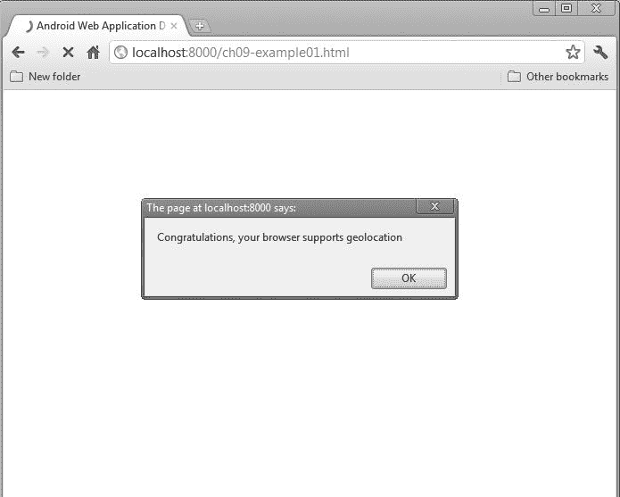
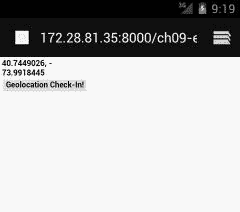
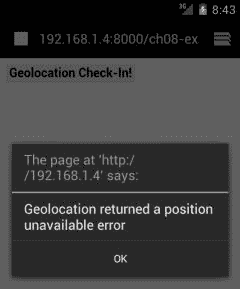
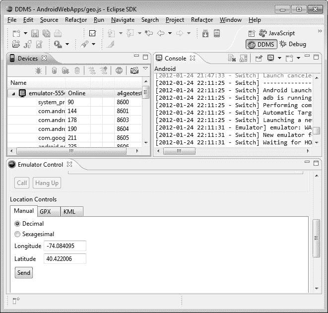

# 九、基于位置的应用

移动开发者面临的最大机遇之一是手机和平板电脑等 Android 设备的本质所带来的丰富选择:它们是移动的！虽然传统桌面应用的用户位置可能很有趣，但很少有人会拿起一台台式机并整天带着它到处走。但是移动设备会移动，它们的位置(也就是设备用户的位置)会影响一切，从游戏到搜索产品和信息，从语言设置和设备行为等各种事物的细微差别和选项。

在这一章中，我们将探索 Android 设备的 HTML5、CSS 和 JavaScript 中的地理定位。我们将探索一个简单的支持位置的应用，并了解如何利用 HTML5 的特性和功能。所以，让我们开始行动吧！

### 地理定位的机制

为了让你的地理定位想法成为现实，了解所有移动部件的功能是很重要的(抱歉，我们忍不住开了这个玩笑)。在任何以 Android 为目标的地理定位 web 应用中，有两组功能非常重要。首先，给定的 Android 设备向任何基于 web 的定位应用提供了什么功能？第二，HTML5(以及在较小程度上，CSS3 和 JavaScript)的哪些特性提供了定位功能？最终，一个设备能告诉我们它的位置，一个 Web 应用能利用这些信息做什么，这两者的结合将会为你所能达到的目标设定界限。让我们来看看两者的背景。

#### 了解设备功能

无论你有什么样的设备，它都可以依靠一系列令人惊讶的技术来提供基于位置的数据。即使对于缺乏专用硬件的设备，选项仍然存在。您使用的设备(以及我们将使用的示例)通常可以访问以下一项或多项功能:

*   **全球定位系统(GPS)**—设备中接收和解码 GPS 卫星信号(或类似的竞争服务，如伽利略或 Glonass)的硬件。精度可以精确到 1 米，尽管这可能会因缓存和其他影响而降低。
*   **WiFi 三角测量**—您的设备使用 WiFi 进行网络连接，但它也可以结合使用已知的 WiFi 网络 SSID 名称以及 dBm 中的信号强度来进行三角测量。这往往比 GPS 粗糙，并且在建筑物较少的区域或有许多瞬时热点的区域受到影响。请注意，您的用户可能会因为功耗或节能原因而禁用 WiFi。
*   **蜂窝塔三角测量**—与 WiFi 技术类似，您的设备知道它在任何给定时间注册了哪个蜂窝，也知道其他哪些蜂窝是可检测的(以及信号强度和相关定时信息)。即使附近只有一个手机信号发射塔，该信号发射塔服务区的粗略水平仍然可以知道您设备的位置。
*   **IP 地址分配**—虽然您的设备在连接到 WiFi 或移动网络时很可能会收到一个动态 IP 地址，但您的提供商通常拥有一组已知的 IP 地址块，以及在不同地理区域的已知分布模式。虽然这不会将你的设备定位到最近的米，但它可以很好地确定你是在堪萨斯州还是加德满都。

如您所见，有多种方法支持确定设备位置的实际机制。不管设备支持哪种方法，在编写 web 应用时，您都不必考虑选择给定的机制。您必须考虑的是地理定位应用的另外两个管理约束。

第一个这样的约束是用户对设备范围的位置特征的设置的选择。确切地说，用户是否启用或禁用了 GPS，就此而言，他们是否允许或禁止其他位置确定机制精确定位设备？[图 9–1](#fig_9_1)显示了用户可以控制的正常设置

**图 9–1。** *安卓 4.0 中的安卓设备位置服务设置*

这些设置的功能非常明显。关闭 GPS 卫星，它将无法用于任何服务，包括浏览器的位置相关功能。这就是我们第二个约束的来源。仅仅因为 HTML5 规范概述了地理定位的 API，并不意味着用户的浏览器已经实现了所有(或者任何！)的特性。

#### 了解 HTML5 的功能

对于一个给定的设备来说，拥有一系列的定位功能当然很好，但是这些功能如何与您实际的 web 应用联系起来呢？答案来自 HTML5 对文档对象模型(DOM)所做的更改，它现在包含了一个 API 来支持一系列专门用于位置相关活动的 DOM 事件。这是一个相当重要的微妙之处。HTML5 本身并没有实现位置感知特性。相反，它包含了一个 API 规范，用于说明 web 浏览器和 web 服务器或应用如何处理位置数据。这影响到作为开发人员的您，因为您不仅需要考虑 HTML5 规范所说的地理定位活动应该发生什么，还需要考虑每个浏览器是如何实现来实际支持这些功能的。不要想得太远，一个例子是，如果一个 web 应用要求定位，那么一个给定的浏览器可能会使用什么样的第三方地理定位服务。

#### 检测浏览器地理位置支持

浏览器中几乎所有地理定位活动的基础都是`navigator.geolocation`对象。我们可以使用这个基础作为一个简洁的简写来确定浏览器是否至少实现了 HTML5 地理定位规范的基础。[清单 9–1](#list_9_1)展示了我们的第一个代码示例:一个确定给定浏览器是否理解`navigator.geolocation`对象的基本 HTML 和 JavaScript 示例。

**清单 9–1。** *简单地理定位支持检查*

`<html>
    <head>
        <title>Android Web Application Development–Geolocation example 1</title>
    </head>
    <body>
        
    </body>
</html>`

您可以在文件`ch09–example01.html`中找到这段代码。只需将它置于您选择的 web 服务器的控制之下，然后将您的浏览器(桌面或移动)指向它以查看结果。

 **注:**这个例子，以及本章中的其他例子，通常应该从 web 服务器上运行，而不是直接从桌面或移动浏览器上作为文件打开。这是因为大多数当代浏览器阻止任何基于`file://`的 URL 访问地理位置 API。简而言之，任何访问一个`navigator.geolocation`对象、它的方法或者数据成员的尝试都会无声无息地失败。这主要是出于安全考虑，这本身就足以构成一个章节。选择一个你觉得合适的 web 服务器，比如 Apache 或者 Nginx，你就不会看到任何问题。

[图 9–2](#fig_9_2)和[9–3](#fig_9_3)分别显示了在桌面浏览器和移动浏览器中运行我们的第一个示例时应该看到的结果。

**图 9–2。** *我们简单的桌面浏览器地理定位支持测试结果*

**图 9–3。** *我们简单的移动浏览器地理定位支持测试结果*

关于我们测试地理定位支持的第一段代码，有两点需要注意。首先，确定给定浏览器的支持真的很简单(尽管参见“什么可能出错？”本章稍后将对支持地理定位的设备实际上何时不合作进行更细致的分析)。第二是在桌面应用中使用 JavaScript `alert`函数大部分时间都很烦人，在小屏幕移动设备上就更烦人了。你们当中有经验的一般 web 开发人员会知道这一点，而对于新手来说，这是一个考虑将工作代码推送到一个功能中的好时机，这个功能可以方便地重用，而不会打扰好用户。[清单 9–2](#list_9_2)重新分解我们的检测示例，创建一个单独的`geoSupport()`函数，我们可以根据需要重用它。

**清单 9–2。** *简单地理定位支持检查修订版*

`<html>
    <head>
        <title>Android Web Application Development–Geolocation example 2</title>
        
    </head>
    <body>
        
    </body>
</html>`

当然，您可以更进一步，将这个函数放到一个单独加载的 JavaScript 源文件中。如果你愿意，你可以这样做并修改本章后面的代码。

### 探索我们的示例应用

是时候介绍我们的示例应用了。除非你一直生活在岩石下，否则你可能知道随着移动设备的爆炸，流行的“签到”风格的应用的范围。无论是 Foursquare、Latitude、TripIt 还是其他类似的应用，这些都允许你向全世界宣布你的位置——大概是为了让你的粉丝和狗仔队可以跟踪你的著名动作。这些应用中有许多是作为给定设备的本机应用实现的，但是没有什么可以阻止我们开发与任何设备的浏览器中可用的 web 应用相同风格的应用。

我们的应用在`ch09–example03.html`中是完全独立的，您可以从您选择的 web 浏览器中运行它。让我们先从用户的角度来看看它(显然)做了什么。将我们的浏览器指向该页面，会弹出我们新的基于位置的签到风格应用的非常简单但实用的主页，您可以在[图 9–4](#fig_9_4)中看到。

**图 9–4。** *调用地理定位之前的示例应用*

目前，这还不完全是平面设计的杰作，但我们会做到这一点。现在，让我们看看当我们点击“地理位置登记”时会发生什么按钮。[Figure 9–5](#fig_9_5)显示了我们的页面动态更新，看起来像是一组纬度和经度坐标。之所以看起来是这样，是因为这正是它的本来面目——而且它们正是来自这个测试进行的地方。

**图 9–5。** *由于我们的示例应用，我们的位置暴露了出来。*

#### 构建我们的基本地理定位应用

此时，您可能想知道到底需要多少逻辑和代码才能让这个看似简单的应用工作。让我们看一下[清单 9–3](#list_9_3)，在这里我们将看到 ch09–example03.html 文件的完整代码集。

**清单 9–3。** *地理位置登记示例*

`<html>
    <head>
        <title>Android Web Application Development–Geolocation example 3</title>
        
    </head>
    <body>
    <h1>
        

            <!-- This is where your check-in will display -->
            
Ready to check in...

        

        <form name="checkInFrm">
            <input type="button" name="checkInBtn" value="Geolocation Check-In!"
             onClick="checkIn()">
    </h1>
    </body>
</html>`

让我们把它分成四个部分，这样你就可以理解正在发生的事情，也可以自己修补和修改代码，这样你就可以在我们进行的过程中探索各种可能性。

##### 地理定位支持测试，Redux

我们在本章前面介绍的`supportsGeo()`函数已经被调整为返回一个布尔值，所以我们可以在其他表达式中使用它的结果:

`function supportsGeo () {
    if (navigator.geolocation) {
        **return true;**
    } else {
        return false;
    }
}`

这比前一个返回字符串值的版本提供了更多的实用工具。

##### 为动态页面更改创建实用函数

接下来，我们引入了一个简单的实用函数来控制代码中任何地方的`
`元素的动态 HTML 行为。`changeDiv()`函数接受一个`
`元素的名称和所需的文本更改，并执行必要的更改:

`function changeDiv (name, data) {
    var div = document.getElementById(name);
    if(div)
    {
        div.innerHTML = data;
    }
}`

这与地理定位并不严格相关，但是我们认为您会同意，通过从主逻辑中移除这些变化的机制，这将使我们的代码示例更加清晰。

##### 复习基本的 HTML

在我们的例子中，我们的 HTML 代码几乎是无辜的旁观者。它提供了一个名为`
`的元素`myCheckIn`，我们的函数将在这个元素上施展它们的地理定位魔法。

`<h1>
    

        <!-- This is where your check-in will display -->
        
Ready to check in...

    

    <form name="checkInFrm">
        <input type="button" name="checkInBtn" value="Geolocation Check-In!"
         onClick="checkIn()">
</h1>`

表单和输入按钮调用我们的中心函数`checkIn()`，它将执行实际的地理定位工作。

##### 钻研坐标

好了，别在边缘跳舞了！在我们的小例子中，`checkIn()`函数执行关键任务。

`function checkIn () {
    var geoData = "";
    if (supportsGeo()) {
        navigator.geolocation.getCurrentPosition(function(position) {
            geoData = position.coords.latitude + ", " + position.coords.longitude;
        });
        <!-- alert("Confirm geolocation access before clicking OK"); -->
    } else {
        geoData = "Your browser does not support HTML5 geolocation";
    }
    changeDiv ("myCheckIn",geoData);
}`

`geoData`变量最终保存我们得到的纬度和经度。我们调用我们的`supportsGeo()`函数来确保我们的浏览器能够支持我们的意图。然后我们通过调用`navigator.geolocation.getCurrentPosition()`函数进入正题。这是 HTML 地理定位的核心功能之一，在`http://` `[http://dev.w3.org/geo/api/spec-source.html](http://dev.w3.org/geo/api/spec-source.html)`有一页又一页的重载定义。

现在，您需要知道的是`navigator.geolocation.getCurrentPosition()`是一个异步函数，在这里使用的形式中，它传递一个回调函数，一旦浏览器和底层硬件对调用者当前位置的请求作出响应，就调用这个函数。我们的`position`回调为我们的`geoData`变量分配了两个数据成员:`position.coords.latitude`和`position.coords.longitude`值，它们相当于调用者的纬度和经度。

剩下的就是我们调用实用程序`changeDiv()`函数来更新我们的 HTML 页面，瞧！当然，我们也确保不支持地理定位的浏览器有适当的信息，表明不支持我们的地理定位工作。

 **注意:**您可能会注意到我们有一个注释掉的对`alert()`的调用，要求用户在继续之前确认地理位置访问。如果你不允许网页自由询问你的位置(你没有理由这样做)，那么当你的浏览器询问时，你需要确认访问。但是，即使是最快的人也无法在对`navigator.geolocation.getCurrentPosition()`的调用返回之前做到这一点，即使这是异步的。此时，回调将返回一个我们的代码当前没有捕捉到的错误(但请参阅本章后面的“可能出错的内容”一节)，我们的示例将会无声地失败。在测试中取消对此警告的注释，以便更好地控制`navigator.geolocation.getCurrentPosition()`的异步行为。

#### 应对安卓地理定位世界的四个角落

我们最初的示例应用介绍了几乎所有利用地理定位的 web 应用的一些关键构件。为了完善地理定位的世界，我们需要解决四个问题:我在哪里？，*我是什么？*，*还能出什么差错？*，还有*我要去哪里？*

##### 我在哪里？

我们在前面的例子中使用了`position.coords.latitude`和`position.coords.longitude`数据成员，已经触及了确定设备位置的基本原理。您可能会想，除此之外，确定位置没有更多的事情，但是您应该考虑一些额外的数据点。

虽然纬度和经度可以告诉你是在夏威夷还是在喜马拉雅山，但你可能会同意在这两个地方你都关心另一个维度:海拔！HTML5 规范包括一个`position.coords.altitude`数据成员来提供高于名义海平面的高度。注意，对它的支持是不完整的，甚至 Android 模拟器和它的浏览器在 Android 开发工具(ADT)的许多版本中都不支持它。

除了纬度、经度和高度，你可能还会关心你得到的读数有多准确。我们在本章开始时介绍了四种可能的定位机制，每一种都有不同的精确度。两个额外的数据成员是可用的，`position.coords.accuracy`和`position.coords.altitudeAccuracy`，为所提供的任何地理位置数据提供误差容限。

有趣的是，没有直接的方法可以确定哪个定位机制被用来提供坐标。如果您询问另一个数据值`position.coords.satellites`，您可以推断它是 GPS，如果您的浏览器和设备支持，它将返回用于提供 GPS 定位的卫星数量。唯一的问题是，如果你的设备缺乏 GPS 支持，或者无法获得 GPS 定位，这两种情况都将返回 NULL。因此，对于是什么导致了卫星计数的缺失，你将处于一种模糊的状态。

##### 我是什么？

我们已经在很大程度上讨论了回答*我是什么的最佳方式。*提问。HTML5 地理定位规范没有提供确定设备上存在什么特定硬件的详尽方法。处理这个问题的最好方法是使用`supportsGeo()`函数，或者类似的函数，我们在上一节中已经介绍过了。这就把我们的问题变成了:*我是什么？设备和浏览器组合是否支持地理定位？*

##### 有什么可能出错？

想象一下，你编写了一个很棒的签到应用，来处理 Foursquare 和 company 这样的公司。你的用户是快乐的，世界是美好的。不会出什么差错的，对吧？或许我们很快会联系上。

在任何设备上，在任何时间，您都会发现自己不得不处理一系列问题，这些问题会阻止您的地理位置代码返回准确的值，甚至根本不返回任何值。这可能是天气、太阳和行星的排列(实际上，这并不像你想象的那样是个笑话)，甚至是用户干预。不管是什么原因，都有明确定义的错误状态，您应该在代码中处理它们。

在 HTML5 规范下可能出现的四种主要错误情况是:

*   **超时**:在允许的时间内没有定位机制响应定位数据。
*   **POSITION_UNAVAILABLE** :您的设备有一个或多个有效的定位机制(如 GPS 或 WiFi)，但没有一个能提供有效的位置数据。
*   **PERMISSION_DENIED** :由于权限的原因，浏览器被阻止访问 HTML5 地理定位 API。用户在提示时阻止了访问，或者浏览器被明确配置为阻止访问。
*   **未知 _ 错误**:由于未知原因，位置数据不可用。

知道错误条件是什么当然很好，但是如何利用它们呢？你会记得我们说过`getCurrentPosition()`函数有无数的重载版本。其中一个重要的子集包括一个常见的模式，接受一个用于报告位置的回调函数作为第一个参数，接受一个用于错误处理的回调函数作为第二个参数。看看我们的示例应用的下一个迭代，在文件 ch09–example03.html 中。关键的变化是我们的`checkIn()` JavaScript 函数，现在看起来像这样。

`function checkIn () {
    var geoData = "";
    if (supportsGeo()) {
        navigator.geolocation.getCurrentPosition(
            function(position) {
                geoData = position.coords.latitude + ", " + position.coords.longitude;
**              },**
**            function(error) {**
**                switch(error.code) {**
**                    case error.TIMEOUT:**
**                        alert ('Geolocation returned a timeout error');**
**                        break;**
**                    case error.POSITION_UNAVAILABLE:**
**                        alert ('Geolocation returned a position unavailable error');**
**                        break;**` `**                    case error.PERMISSION_DENIED:**
**                        alert ('Geolocation returned permission denied (did you deny access?)');**
**                        break;**
**                    case error.UNKNOWN_ERROR:**
**                        alert ('Geolocation encountered an unknown error');**
**                        break;**
**                }**
**            }**
        );
        <! -- alert("Confirm geolocation access before clicking OK"); -->
    } else {
        geoData = "Your browser does not support HTML5 geolocation";
    }
    changeDiv ("myCheckIn",geoData);
}`

在粗体文本中，您将看到我们已经更改了`getCurrentPosition()`函数的方法签名(重载版本),以注册我们的错误回调，并在返回任何错误条件时提醒用户。我们处于一个幸运的位置(好吧，我们在这里是在讽刺)，Android 模拟器在响应地理定位请求时是出了名的慢和不稳定。出于这个原因，在真实设备上测试您的代码，以及在模拟器上测试，总是一个好的做法。在我们的第一次尝试中，作者没有真正尝试就设法触发了一个`POSITION_UNAVAILABLE`错误。您可以在[图 9–6](#fig_9_6)中看到结果。

**图 9–6。** *地理定位尝试返回 POSITION_UNAVAILABLE 错误*

正如我们对`supportsGeo()`函数所做的那样，您应该将这种错误检查方式转变成一种实用函数，在整个代码中使用，而不是用警告式的错误轰炸用户——尽管在这种情况下，这可能是有保证的。

##### 我要去哪里？

为了完善我们正在探索的功能，我们可以问自己——或者更准确地说是设备——*我要去哪里？*有两种方法值得一提。首先，我们可信的地理位置数据成员包括两个更有用的值，`position.coords.speed`和`position.coords.heading`。这些指示设备的最后已知速度和最后已知方向。这些值对于像在地图上绘制运动这样的任务来说听起来很棒，理论上，这正是它们的设计目的。然而，实际上，令人不安的是，大量设备要么不报告这些值的数据，要么使用如此简单的 GPS 芯片组，以至于一开始就不支持收集数据。

这给我们带来了另一种方法。到目前为止，我们一直在展示`navigator.geolocation`的`getCurrentPosition()`方法。这个方法有一个对等方法，在确定随时间变化的位置以及随之发生的运动时，这个对等方法稍微复杂一些，也更有用。这就是`watchPosition()`法。

在各种重载形式中，`watchPosition()`方法的行为与我们的`getCurrentPosition()`方法非常相似。它注册了一个回调函数用于正常定位，另一个回调函数用于错误处理，但它也接受一系列选项，包括一个定时器选项，说明它应该多长时间休眠和唤醒一次，以及*继续调用*您的回调。`watchPosition()`将继续运行，直到被对`clearWatch()`的调用停止，或者其父进程终止。清单 9–4 展示了我们正在进行的示例应用的下一次迭代，来自 ch09–example05.html。

**清单 9–4。** *地理位置追踪随时间(和运动！)*

`<html>
    <head>
        <title>Android Web Application Development–Geolocation example 5</title>
        
    </head>
    <body>
    <h1>
        

            <!-- This is where your check-in will display -->
            
Ready to check in...

        

        <form name="watchFrm">
            <input type="button" name="watchBtn" value="Start Watching"
             onClick="startWatch()">
    </h1>
    </body>
</html>`

我们的实用函数`supportsGeo()`和`changeDiv()`是相同的，HTML 布局只是表面上的改变。关键是按钮现在调用我们的`startWatch()`函数，它本身最终调用`watchPosition()`。我们将它传递给常规回调函数和错误回调函数——`onWatchSuccess()`和`onWatchError()`——以及一个选项构造。在这种情况下，我们的选项如下所示

`var watchOptions = { frequency: 5000 };`

这有效地用于将 5 秒刷新频率传递给`watchPosition()`功能。如果您自己运行代码，并选择您看到的开始监视按钮，您的浏览器应该大约每五秒钟更新一次您的位置。这在静态屏幕截图中有点难以展示，所以您必须自己尝试一下。如果你不是真的在移动，不要担心:你仍然应该看到坐标的更新，因为每个读数的精度会略有不同，这取决于用于定位的 GPS 卫星的数量，变化的本地干扰等。即使您正躺在沙发上休息，您也应该看到最低有效位的微小变化！

### 用地图拓展你的视野

到目前为止，您几乎肯定会同意，我们的示例应用并不完全是一件艺术品。因此，让我们添加一点活力，并介绍几乎无处不在的地理定位附件:地图！

#### 向我们的应用添加地图

我们最新的例子来自 file ch09–example06.html，它使用谷歌地图将我们之前的签到例子提升到一个新的水平。它不只是报告数字坐标，而是将数字坐标与 Google Maps APIhosted at `[http://maps.googleapis.com/](http://maps.googleapis.com/)`一起使用来加载地图，并在地图上放置一个标记来突出显示您的位置。[清单 9–5](#list_9_5)是我们修改后的 JavaScript、CSS 和 HTML5。

**清单 9–5。** *地理定位和地图协同工作*

`<html>
    <head>
        <title>Android Web Application Development–Geolocation example 6</title>
        <meta name="viewport" content="initial-scale=1.0, user-scalable=no" />
        
        
        
    </head>
    <body>
    <h1>
    <body onload="initialize()">
        

            <!-- Your map goes here! -->
        

    </body>
</html>`

您会注意到，我们的代码以一些 CSS 开始，以非常简单的 HTML 结束，它在页面加载后立即调用我们新的`initialize()`方法。CSS 是 Google 的样板文件，允许 div 充当地图对象的容器。接下来，您将看到对 Google Maps API 的 JavaScript 引用(下面一行修改了格式以更好地适应此页面):

``

这将调用带有特定 API 键的 Maps API。这是 Google 的技术，用于唯一地识别其 API 的用户，并限制对各种 API 的调用次数。你一定要注册自己的 API 密匙，这样你就可以控制自己的 API 访问，监控使用情况等等。

 **提示:**在印刷的时候，免费的谷歌地图 API 被限制在每天 25000 次调用。要获得自己的地图 API 密钥，请访问[http://developer.google.com/](http://developer.google.com/)并按照说明进行操作。

我们的`initialize()`函数与旧的`checkIn()`函数非常相似，所以我们在这里不再赘述。关键的区别是它填充了纬度和经度两个局部变量，然后调用我们的新函数`mapMe()`，来完成所有艰难的映射工作。

`function mapMe(thisLat, thisLong) {
    var myLatlong = new google.maps.LatLng(thisLat, thisLong);
    var myOptions = {
        center: new google.maps.LatLng(thisLat, thisLong),
        zoom: 12,
        mapTypeId: google.maps.MapTypeId.ROADMAP
    };
    var map = new google.maps.Map(document.getElementById("mapContainer"), myOptions);
    var marker = new google.maps.Marker({
                    position: myLatlong,
                    map: map,
                    title:"Hello World!"
    });
}`

在`mapMe()`中，我们完成了四个主要动作来展示我们的地图和位置标记。首先，我们使用从 HTML5 地理定位调用中收到的纬度和经度创建一个`google.maps.LatLng`对象。接下来，我们构建一个名为`myOptions`的选项对象，它由一个中心对象组成，用于选择浏览器中显示的地图的中心。`zoom`值决定了地图中的起始缩放设置——这在移动设备上非常重要，因为默认缩放的比例太高，让用户使用不精确的捏和缩放技术放大几次。

然后，我们得到我们的映射的肉。我们创建一个新的`google.maps.Map`对象，并传递将保存地图的元素(“`mapContainer`是我们的 HTML 中的`
`的 ID)，以及我们构造的选项对象。这实际上在用户的浏览器中创建和显示了地图。创建之后，我们在地图上的相同坐标处创建一个`google.maps.Marker`对象，并给它一个有意义的标签。[图 9–7](#fig_9_7)中的结果不言自明。

**图 9–7。** *我们的 HTML 地理定位应用适应使用谷歌地图*

##### 其他基于位置的服务

我们已经了解了一种流行的地图服务，但是值得考虑将您的视野扩展到基本地理定位服务的其他提供商，以及地图切片(实际显示的图形“切片”)之类的提供商。

有几个原因可以让您考虑两面下注，至少确保您可以对其他服务执行相同的操作:

*   免费服务、规模和成本:许多服务，如谷歌、雅虎、必应、MapQuest、诺基亚/Ovi 等。提供某种程度的免费服务。通常的条款规定，在被限制和/或被要求付费之前，你和你的用户每天可以消费一定数量的地图展示。
*   不同的优势和劣势:一些服务，如谷歌，提供一些有用的东西，如一些地点的方向，公共交通的细节等。但在其他地方，像 Open Street Map 这样的服务提供了更详细、更新的数据，对于 OpenCycleMap 这样的服务，整个地图渲染和数据都专注于专业用途:在这种情况下，就是骑自行车的人。
*   抽象您的映射意味着您可以混合和匹配以满足您的需求。

提取地图数据和影像提供者的最重要原因可能是该领域正在快速发展和变化，良好的软件工程应该引导您尽可能将所有其他代码与这种易变的依赖关系隔离开来。这种不稳定性也可能是由提供者自己进行版本升级和更改的结果。

以下是一些有用的数据提供程序、地图切片提供程序、一体化服务，甚至是现成的制图抽象 JavaScript 库，您可能也想和通常的怀疑一起考虑:

*   开放街道地图(openstreetmap . org)-最初的开放数据提供商之一，现在也在众包基础地理位置数据的基础上提供其他服务
*   cloud made(cloud made . com)-用于开放街道地图数据的地图切片提供程序。也是传单的提供者，一个开源的瓦片集合服务。
*   map Nik(map Nik . org)-其他工具中常见的地图渲染器(包括此处列出的一些其他工具)。
*   carto db(carto db . com)——一个基于云的地理空间数据库
*   maps action(maps action . com)-一个现成的 JavaScript 库，提供地图服务和数据提供者的抽象。
*   wax(map box . com/wax)——另一个现成的抽象层。来自同一家公司，TileMill 为瓦代。

这份清单可能会占满几页，但你会明白其中的意思。更令人兴奋的是，我们意识到，每周都有数十家这样的公司和服务提供商涌现出来。

### 游戏您的位置

即使你正在开发一个移动应用，也不要忘记你可以使用的工具来帮助测试和改进你的地理定位代码。例如，Eclipse 的 Android 开发人员工具插件中的 DDMS 为您提供了为仿真器设备设置任意坐标/位置数据的能力。当模拟器中有一个正在运行的项目时，您可以切换到 DDMS 模式，并打开模拟器控制台选项卡。您将看到设置原始坐标或直接提供 GMX 或 KML 数据的能力，如图[Figure 9–8](#fig_9_8)所示，您的仿真器浏览器可以使用这些数据。

**图 9–8。** *使用 ADT 和 Eclipse 在 Android 模拟器中设置坐标*

如果运行 Eclipse 不是您的首选开发方式，您还可以使用 Android 的 adb 工具发出`geo fix`命令来提供纬度、经度和高度。最后，如果你在没有连接到电脑的设备上调试应用，你可以使用免费的应用 Fake GPS location ( `[https://market.android.com/details?id=com.lexa.fakegps](https://market.android.com/details?id=com.lexa.fakegps)`)来设置你的位置。

### 畅游您的位置——尽情享受！

探索 web 应用地理定位功能的一个很好的方法是制作一个游戏——真的！使用上一节中的简单构建块，您可以构建游戏和活动，包括寻宝、定向活动，甚至驾驶、赛车和航海游戏。你会发现将我们的`startWatch()`示例与我们的谷歌地图示例结合起来非常简单，可以创建一个“地图轨迹”风格的应用，在地图上实时绘制你的运动，并且根据游戏或比赛，还可以显示其他玩家的运动和位置，甚至整个其他游戏正在哪里进行。

在流行的“地理藏宝”运动中，可以找到地理定位功能的一个有趣的应用，比如我们在这里展示的那些。通过您喜欢的搜索引擎进行搜索以获得更多详细信息，或者继续阅读第 10 章并使用您自己的搜索界面进行搜索！

天空真的是无限的(事实上，你的地理定位数据也可以在你最喜欢的热气球上工作！).

### 总结

在这一章中，我们探索了作为移动 Web 开发者的你可以使用的基于位置的特性。我们的示例应用演示了如何使用许多核心地理定位功能，包括您在哪里，您的用户设备可能具有哪些功能，以及如何处理不断变化的位置。在第 10 章中，我们将探索更多关于地理定位应用开发的内容，也将涵盖其他在线服务和 API。