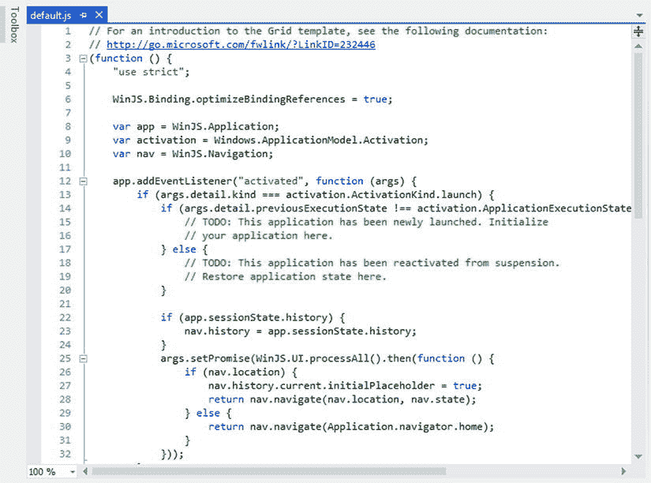
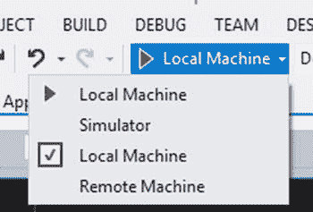
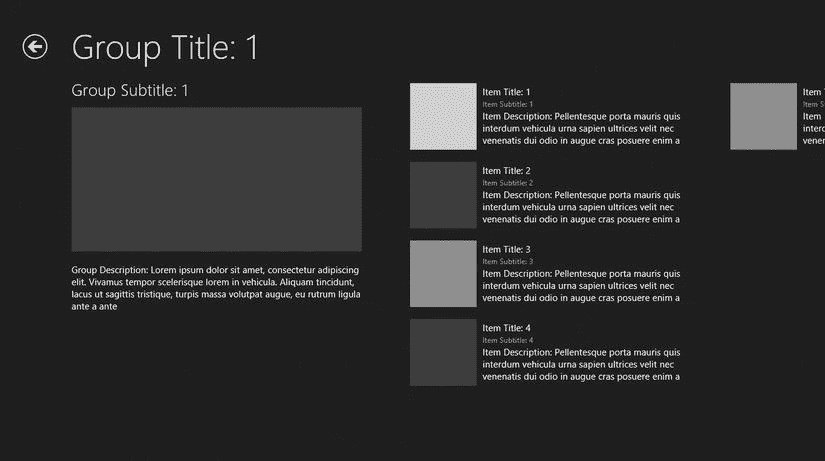
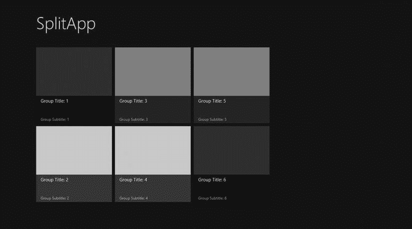

# 四、Visual Studio 2012 和 Windows 应用商店应用类型

在应用开发中，集成开发环境(IDE)可以让您感觉轻松工作并专注于应用应该解决的问题，也可以让您感觉非常分心，试图找出如何在 IDE 中操作，以至于无法专注于制作软件的实际任务。随着 Visual Studio 最近几个版本的发布，微软逐渐建立起了拥有可用的最佳开发 ide 之一的声誉。甚至许多不关心为微软平台开发的开发人员也会说(如果不情愿的话)很难找到更好的开发环境。在本章中，您将了解 Visual Studio 2012，这是该系列中的最新版本。因为完整地介绍这些工具和特性需要一本独立的书，所以我将在本章中介绍一些我认为对您很好地了解环境以完成本书中的练习最重要的主题。除了了解 Visual Studio 的一般知识，您还将了解用于 Windows 应用商店应用开发的项目模板。

Visual Studio 版本

Visual Studio 通常被用来描述在微软平台上开发应用的集成开发环境，但它不是一个单一的产品，而是指整个产品线。除了免费提供的速成版，Visual Studio 2012 阵容还包括:

*   适用于 Windows 8 的 Visual Studio 速成版 2012
*   Visual Studio 网络版速成版
*   适用于 Windows 桌面的 Visual Studio 速成版 2012
*   适用于 Windows Phone 8 的 Visual Studio 速成版 2012
*   Visual Studio 测试专业版 2012
*   Visual Studio 专业版 2012
*   Visual Studio 高级版 2012
*   Visual Studio 旗舰版 2012

Visual Studio 速成版 2012 每个版本都提供了一个开发针对 Microsoft 堆栈不同部分的应用的环境，并且可以在不投资于完整的 Visual Studio 2012 产品的情况下使用。visual Studio Express 2012 for Windows 8 专注于提供必要的工具来构建和测试 Windows 应用商店应用，并为在 Windows 应用商店中共享和销售您的 Windows 应用商店应用提供支持。visual Studio Express 2012 for Windows 8 足以完成本书中的练习，此版本中可用的功能将是本章讨论的重点。以下是适用于 Windows 8 的 Visual Studio Express 2012 的主要功能:

*   对代码进行基本分析，找出可能会阻止 Windows 应用商店认证的错误或做法
*   集成调试器
*   运行 Windows 应用商店应用的模拟器
*   探查器帮助识别需要调整的代码
*   单元测试支持

除了 Visual Studio Test Professional 2012 是为应用开发组织中被分配了测试角色的人员设计的之外，Visual Studio 2012 的非速成版是为专业开发人员设计的。Visual Studio Professional 2012、Visual Studio Premium 2012 和 Visual Studio Ultimate 2012 都在应用开发的以下领域逐步增加了功能:

*   设计
*   建筑
*   测试
*   分析
*   解决纷争

您可以在`www.microsoft.com/visualstudio`找到每个 Visual Studio 2012 版本的完整功能对比。您还可以在该网站上找到 Visual Studio Express 2012 for Windows 8。如果您尚未安装 Visual Studio 2012 版，我建议您在进一步阅读之前安装 Visual Studio Express 2012 for Windows 8。

Visual Studio 入门

首次打开 Visual Studio 2012 Express 时，会出现默认视图，如图[图 4-1](#Fig1) 所示。此时，用户界面中最重要的功能是菜单栏(图中标为 A)和起始页(标为 B)。菜单栏提供了对许多命令的访问，但是当第一次打开 Visual Studio 时，你很可能会去文件菜单(如图[图 4-2](#Fig2) 所示)，在那里你会选择新建项目或打开项目。起始页提供了开发人员感兴趣的项目的链接，例如关于如何在 Visual Studio 中提高工作效率或执行某些开发任务的文章。

[图 4-1](#_Fig1) 。Visual Studio 初始用户界面

[图 4-2](#_Fig2) 。文件菜单

 **注意**如果您将 Visual Studio 的设置更改为非默认设置，或者如果您使用的是 Visual Studio 的不同版本，如高级版或旗舰版，您的用户体验(如工具窗口、菜单和工具栏)可能会与本章中显示的不同。例如，当我开始使用 Visual Studio 2012 Express for Windows 8 编写这本书时，我从 Visual Studio 的不同版本导入的配置在文件菜单中有一个“新建项目…”项，而不是在文件菜单中有一个“新建”子菜单，并且在该子菜单中有一个“项目…”项。我已经将我的配置重置为 Express edition 的默认配置，因此本章和后续章节将说明 Visual Studio 2012 Express for Windows 8 的默认状态。

从文件菜单中选择新建项目，打开新建项目对话框，如图[图 4-3](#Fig3) 所示。此对话框在窗口的左侧显示按类别分组的可用项目类型。选择一个类别会在窗口的中间部分显示该类别中的项目类型列表。窗口底部是用于为项目指定名称的字段、项目在磁盘上的位置以及要创建和添加项目的解决方案的名称。本书没有涉及解决方案，所以在这一点上，我将把它们描述为同时打开和使用的相关项目的集合。默认情况下，在解决方案中创建新项目的选项是启用的，因为许多应用会将业务逻辑、数据访问代码和用于向用户提供界面的代码分离到他或她自己的项目中，以帮助创建这些职责的清晰划分。解决方案的另一个常见用途是在解决方案中有一个单独的项目来测试应用。

[图 4-3](#_Fig3) 。新建项目对话框

一旦创建或打开了一个项目，就会显示附加的功能。在屏幕的右侧，解决方案资源管理器窗口(如图 4-4 中的[所示)填充了您项目的文件/文件夹结构，允许您导航到项目中的任何文件，双击打开代码编辑器](#Fig4)。[图 4-5](#Fig5) 显示`default.js`在代码编辑器中打开。

[图 4-4](#_Fig4) 。解决方案资源管理器窗口

[图 4-5](#_Fig5) 。代码编辑器

图 4-6 中的[所示的](#Fig6)属性窗口包含不同的内容，这取决于 Visual Studio 中当前选择的内容。如果当前选定的项是 HTML 文件中的控件，则显示附加到该控件的属性。如果选定项是解决方案资源管理器中的文件，则显示选定文件的属性。

[图 4-6](#_Fig6) 。属性窗口

我将在本章讨论的最后一个用户界面元素是工具栏上的调试按钮，如图[图 4-7](#Fig7) 所示。此按钮用于在本地计算机、内置 Windows 8 模拟器或网络上的远程计算机中启动应用的构建和调试会话。通过激活此按钮中的下拉菜单，您可以更改应用的默认运行时环境。

[图 4-7](#_Fig7) 。调试按钮

在开发过程中，我经常在我的本地机器上运行我的应用，但模拟器很方便，因为它提供了在不同分辨率下测试的能力，改变方向，在不支持触摸的显示器上模拟触摸事件，并捕捉屏幕截图，当你准备在第 23 章中向 Windows 商店提交应用时，这些将会派上用场。如果您有一台平板电脑，或任何其他机器，您想用它来调试您的应用，那么一旦您配置了远程机器和 Visual Studio 项目，使用远程机器选项是非常无缝的。你可以在`http://msdn.microsoft.com/en-us/library/windows/apps/hh441469.aspx`的 MSDN 上找到这个过程的一个很好的演示。我按照这些说明在几分钟内配置了我的 Windows RT 平板电脑进行调试。

我刚刚引导您浏览了 Visual Studio 界面，只是停下来向您展示成功使用本书所需的那些特性。我强烈建议您探索 Visual Studio 中可用的不同窗口、菜单和选项，并了解每种窗口、菜单和选项如何帮助您完成开发任务。

Windows 应用商店应用类型

在本节中，我将介绍可以使用 Visual Studio 2012 附带的项目模板创建的不同应用类型。你可以在新项目对话框中找到这些模板，分类在已安装的模板 JavaScript  Windows Store 下。我将在此仅介绍这些应用类型:

*   空白应用
*   固定布局应用
*   网格应用
*   拆分应用
*   导航应用

我将在第 18 章中使用 C#语言介绍 Windows 运行时组件项目类型。

空白应用

空白应用是所有可用的 Windows 应用商店应用项目模板中最基本的。它创建的项目包括一组开始的图像，这些图像将被替换为应用徽标和闪屏的自定义图像，以及一个标准样式表和一个空白页。当您的单页应用不需要其他模板提供的布局时，这种项目类型非常适用。

固定布局应用

与空白应用一样，固定布局应用项目模板为您的 Windows 应用商店应用提供了一个非常基本的起点。事实上，空白应用和固定布局应用模板之间的唯一区别是，固定布局应用模板适用于需要固定纵横比的应用。您的应用的内容包含在一个`ViewBox`控件中，该控件可以缩放其内容以适应应用。

这是推荐给游戏的，因为你可以用 1366 x 768 的分辨率来设计你的场景，这在今天的平板电脑上很常见。如果设备具有不同的分辨率，您的游戏将相应地缩放，以便在所有设备上对用户显示相同的效果。

网格应用

网格应用模板提供了空白应用模板所提供的一切，但它也为应用提供了屏幕和应用代码，该应用通过不同级别的细节来浏览分层数据。该应用由三个页面组成:一个显示所有组的高级视图，其中包含每个组内项目的汇总视图(如图[图 4-8](#Fig8) 所示)，一个提供有关该组的附加信息及其包含的项目列表的组详细信息页面(如图[图 4-9](#Fig9) 所示)，以及一个项目详细信息页面，其中提供了该组中单个项目的最详细信息(如图[图 4-10](#Fig10) 所示)。正如您在图中看到的，这个项目模板提供了一个实际上已经为您预构建的应用，只需要您修改它以适合您的数据。

[图 4-8](#_Fig8) 。默认网格应用分组项目视图

[图 4-9](#_Fig9) 。默认网格应用组详细信息视图

[图 4-10](#_Fig10) 。默认网格应用项目详细信息视图

拆分应用

Split App 项目模板与 Grid App 模板一样，提供了一个现成的应用，用于浏览分层数据。Grid 应用和 Split 应用的主要区别在于 Split 应用仅使用两个视图来显示信息。第一个视图如图 4-11 中的[所示，显示了物品被分类到的组列表。与 Grid App 不同，这个视图只包含关于组的信息，不显示任何项目信息。选择任意组导航到该组的项目屏幕(如图](#Fig11)[图 4-12](#Fig12) 所示)，在屏幕左侧提供该组中的项目列表，在屏幕右侧显示所选项目的详细信息。

[图 4-11](#_Fig11) 。默认拆分应用群组视图

[图 4-12](#_Fig12) 。默认拆分应用项目视图

导航应用

导航 App 项目模板是我个人的最爱。它包括必要的组件，以支持 Windows 应用商店应用常见的导航风格，而不会在您的解决方案中填充大量不必要或过于特殊的文件。这个项目类型将是你在第 9 章开始构建的应用的基础，随着你学习更多可以应用到应用中的概念，你将在几个章节中继续构建。通过创建页面控件，新的屏幕被添加到你的应用中，这个过程我将在第 5 章的[中介绍，并将在本书的其余部分继续介绍。](05.html)

如果空白应用模板是一张白色打印纸，导航应用模板将是一张绘图纸——两者本质上都是空的，但其中一个提供了一些有用的结构。相比之下，Grid 应用或 Split 应用模板可能是一本涂色书中的页面，其中提供了应用的轮廓，只需填写细节。

结论

在本章中，向您介绍了 Visual Studio 2012 以及可以使用内置项目模板构建的 Windows 应用商店应用类型。为了进一步学习，请考虑 Grid 应用和 Split 应用模板，检查一些现有的 Windows 应用商店应用。您可能会惊讶于您经常看到这两种方法的组件。例如，Windows 8 安装的新闻和商店应用都采用了网格应用的方法，而邮件应用是基于拆分应用模板设计的。