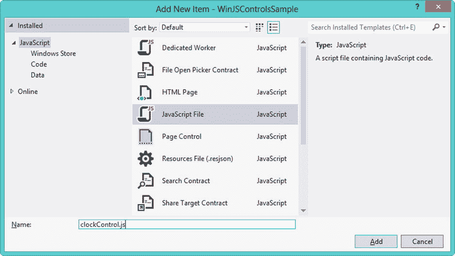

# 八、WinJS 自定义控件

使用我在最后三章中提到的控件，你可以构建一个应用来满足几乎所有的需求，并且当我们深入研究这些控件和其他概念的更多细节时，你将会看到，这正是你从[第九章](09.html)开始要做的事情。也就是说，有时您可能会发现自己希望获得一些额外的控件，而定制控件可能正是您所需要的。

在这一章中，我将研究在你的应用中需要一些时钟功能的情况。虽然使用一些基本的 HTML 和 JavaScript 构建一个时钟并不困难，但是您虚构的应用需求表明您在整个应用的多个地方都有时钟。无论是现成的控件还是自定义控件，使用控件的最大好处之一就是它们很容易重用。如果生成一个表示时钟的控件，就可以多次使用它，就像可以向应用中添加多个文本输入框一样。

自定义控件

简而言之，控件可以被认为是用户界面的任何一部分，以某种方式捆绑在一起，允许你将它添加到你的应用中。至少就本章而言，自定义控件是指在开发 Windows 应用商店应用时没有提供的现成控件。通常，当开发人员提到自定义控件时，他们指的是使用这些控件的应用的开发人员编写的控件。这当然没有错，但该术语也可以指从第三方控件供应商处购买的控件。不缺少第三方控件，例如，可以用来显示图表或图形，您可以在您最喜欢的 web 搜索引擎的帮助下找到许多这样的控件。

也就是说，本章的重点不是那些第三方控件。相反，我将介绍构建您自己的控件的步骤，特别是 WinJS 控件，以满足您自己的特定需求。我将讨论构建自定义控件的两种常用方法。

*   我将用本章的大部分时间讨论如何用 JavaScript 构建自定义 WinJS 控件。
*   我将简要介绍如何使用 WinJS 提供的`PageControl`构建定制的 WinJS 控件，您已经在前几章中看到了。

您当然可以不使用 WinJS 库来创建自定义控件。如果您是一名经验丰富的 JavaScript 开发人员，这是一个完全合理的选择，尽管这超出了本书的范围。因为 Windows Store 应用是用 HTML 和 JavaScript 构建的，所以您可以在应用中使用许多流行的 JavaScript 库和几乎所有常见的 JavaScript 技术。但是，使用 WinJS 的功能来构建自定义控件也有好处。WinJS 库提供了一种模式，可以帮助您维护代码的一致性并避免与 JavaScript 语言相关的常见缺陷，从而使您能够将更多的精力放在业务需求上，而不是控制构建的内部工作。像任何软件抽象一样，它并不总是正确的选择，但我发现几乎总是，我更喜欢构建自定义 WinJS 控件，而不是纯粹用 JavaScript 构建控件。

用 JavaScript 定制 WinJS 控件

正如我上面提到的，我们将用本章的大部分时间用 JavaScript 和 WinJS 库构建一个自定义时钟控件。让我们首先确定这种控制的一些要求。

*   时钟可以以 12 小时或 24 小时格式显示当前本地时间。
*   当用于显示当前时间时，用户可以选择显示或隐藏秒。
*   该时钟可以用作倒计时或“向上计数”计时器，以测量经过的时间。
*   当用作倒计时或递增计时时，可以指定初始时间。
*   当用作倒计时或计数计时器时，计时器可以在创建时自动启动。
*   时钟可以通过编程启动、停止或复位。
*   包含时钟控件的页面可以通过事件得到通知，例如时钟开始、停止或重置的时间，以及倒计时结束的时间。

 **注**本书附带的源代码包括一个名为 WinJSControlsSample 的完整项目，其中包含了在[第 5 章](05.html)、[第 6 章](06.html)、[第 7 章](07.html)和[第 8 章](08.html)中使用的样本代码。你可以在本书的 press 产品页面(`www.apress.com/9781430257790`)的 Source Code/Downloads 选项卡上找到本章的代码示例。

在前几章中，您将在现有的 WinJSControlsSample 项目中构建此功能。在我进入构建这个控件的细节之前，您必须做一些项目设置。在 Visual Studio 中打开项目后，按照第 5 章[中的步骤添加一个名为`customcontrols.html`](05.html) 的页面控件。确保将所有的示例代码放在页面控件的`<section aria-label="Main content" role="main">`和`</section>`元素之间。您还必须为这个页面控件添加一个导航按钮到`home.html`。

接下来，添加一个名为`controls`的新文件夹到你的项目的根目录，并在其中添加另一个名为`js`的文件夹(见[图 8-1](#Fig1) )。这是您将要创建自定义控件的地方，所以右键单击该文件夹，并选择向项目添加新项的选项。添加一个名为`clockControl.js`的新 JavaScript 文件(参见[图 8-2](#Fig2) )。


[图 8-1](#_Fig1) 。JavaScript 控件的主页



[图 8-2](#_Fig2) 。在项目中创建 JavaScript 控件

JavaScript 自定义 WinJS 控件的剖析

WinJS JavaScript 控件只需创建一个新的类，遵循一些特定的约定。虽然面向对象的开发任务，比如创建类，可以用 JavaScript 来完成，但是与使用许多其他语言(比如 C#)相比，这样做要冗长得多。对面向对象概念的全面介绍，更不用说 JavaScript 了，已经超出了本书的范围。(如果你想探索这个话题，请参阅罗斯·哈梅斯和达斯汀·迪亚兹的《Pro JavaScript 设计模式》。)幸运的是，WinJS 抽象掉了这种冗长的麻烦，允许您以更简单的方式创建类和控件。[清单 8-1](#list1) 展示了一个简单的模板，当你在应用中定义控件时，你可以使用它。

[***清单 8-1。***](#_list1) 定义控件的模板

```js
(function () {
    "use strict";

    var controlDefinition = WinJS.Class.define(
        function Control_ctor(element, options) {
            this.element = element || document.createElement("div");
            this.element.winControl = this;

            // control initialization
        },
        {
            // instance members
        },
        {
            // static members
        }
    );

    WinJS.Namespace.define("WinJSControlsSample.UI", {
        HelloWorld: controlDefinition
    });
})();
```

如果你有相当多的 JavaScript 经验，你可能会自己弄清楚清单 8-1 中的代码在做什么，如果是这样的话，我邀请你跳到下一节。但是，如果您是 JavaScript 新手，或者接触的内容有限，我将逐步介绍这段代码，让您大致了解一下发生了什么。让我们从顶部开始……从底部开始。

第一行`(function () {`和最后一行`})();`构成了通常所说的自执行功能。如果这对你来说看起来有点奇怪，你并不孤单。第一次看的时候，我也有点不知所措。用技术术语来说，这段代码定义了一个匿名 JavaScript 函数，并立即执行它。从最后一行的末尾开始，向后看，你会看到左括号和右括号，后面跟着一个分号，就像你在一行代码的末尾看到你调用了你写的函数一样。这就是“自执行功能”的“执行”部分那么，正在执行的功能是什么？在右括号后面再后退一个字符。这与[清单 8-1](#list1) 第一行的第一个左括号匹配。这两个括号之间的所有内容都是匿名函数，正如它听起来的那样，是一个没有名字或不需要名字的函数。一旦定义了这个函数，这段代码就会立即执行它。在[清单 8-2](#list2) 和[清单 8-3](#list3) 中，你会看到两种手段殊途同归。这两个代码块做同样的事情，并向用户显示一个对话框。

[***清单 8-2。***](#_list2) 示例函数定义和函数调用

```js
function myFunction() {
    alert("foo");
}

myFunction();
```

[***清单 8-3。***](#_list3) 样本自动执行功能

```js
 (function() {
    alert("foo");
})();
```

我们为什么要这么做？有几个原因，网上有很多关于这个主题的详细文章可以阅读，但简单地说，我们这样做是为了界定范围。函数内定义的变量对该函数外的任何代码都不可用。这意味着我们可以安全地创建自己的成员——变量、属性和函数——而不用担心与另一个同名成员冲突。在[清单 8-1](#list1) 中，名为`controlDefinition`的变量不会对我们应用中名为`controlDefinition`的任何其他变量产生任何影响，也不会受其影响。通过以这种方式保护我们的函数成员，我们可以有选择地以一种有意义的方式公开它们。如果您熟悉 C#之类的语言，这是一个类似于定义私有变量和函数的概念，这些变量和函数在定义它们的类之外不可用，并且提供公共成员，以便其他代码仍然可以以有意义的方式使用该类。你会在整本书中看到更多这样的内容。如果现在有点雾，不用担心。等你看了几遍，就更清楚了。现在，重要的一点是记住在自执行函数中定义控件。

 **注**对于自执行函数应该叫什么，不同的人有不同的看法。其他常见的名字还有*立即调用函数表达式(IIFE)、立即执行函数、*或*自执行匿名函数。只要你知道不同的名字，并且理解这个概念，任何名字都可以。为了保持一致，在本书的其余部分，我将把它们称为*自执行函数*。*

清单 8-1 中[代码的下一行是字符串文字`"use strict";`。这声明该范围内的代码处于严格模式，这允许更好的错误检查。在严格模式下，某些做法是不允许的，通常是那些可能导致歧义或其他意外行为的做法。这使您能够更快地发现代码中的潜在错误，而不是部署一个在测试中似乎可以工作的应用，结果却导致问题。它有助于减少“它在我的机器上工作”的错误。](#list1)

到目前为止，在本节中，我已经讨论了自执行函数和`"use strict"`指令。这两个概念都是常见的现代 JavaScript 开发实践，关于它们的文章层出不穷。在[清单 8-1](#list1) 中，接下来是 WinJS 开发特有的东西。我们使用`WinJS.Class.define`方法定义一个类，并将该类定义赋给一个名为`controlDefinition`的私有变量。

 **注意**如果你的背景是 C#这样的静态类型语言，那么给一个变量赋值函数和类定义可能看起来很奇怪，尽管在 C#中类似的模式越来越常见。这里需要注意的是，JavaScript 中的类和函数与任何其他值一样，可以作为变量值赋值。描述这一点的常用短语是说函数是 JavaScript 中的*一级对象*。

用三个参数调用`WinJS.Class.define`方法。第一个是构造函数，在这里命名为`Control_ctor`。每次创建该类的新实例时，都会调用该函数。定义控件时，此构造函数需要两个参数。我们的例子，以及通常的约定，将这些参数命名为`element`和`options`。第一个是对用于将控件放置在页面上的 HTML 元素的引用。正如你在第 6 章中看到的，第二个用于在你的 HTML 标记中使用`data-win-options`属性为你的控件提供特定的选项。

第二个参数是描述类的实例成员的对象，第三个参数是定义类的静态成员的对象。示例场景可能是描述实例和静态成员的最简单的方法。

假设您正在创建一个`Person`类。在这种情况下，您可能有一个名为`firstName`的实例属性。它被称为实例属性，因为`firstName`是描述一个`Person`的单个实例的东西。您的`Person`类也可能有一个名为`search`的静态方法，您可以调用它来查找符合某些标准的单个`Person`或一组`Person`对象。[清单 8-4](#list4) 展示了一个如何引用这些属性的例子。注意，`firstName`属性需要一个`Person`类的实例，对于这个类，`search`函数可以直接从`Person`类获得，而不需要该类的任何特定实例。随着本章的进行，您将看到如何为实例成员构造传递给`WinJS.Class.define`方法的对象的例子。我们在本章中的例子不需要任何静态成员，但是指定它们是以同样的方式完成的。

[***清单 8-4。***](#_list4) 你的虚构人物类的属性和方法

```js
var myPerson = new Person();
myPerson.firstName = "Scott";

var searchResults = Person.search("Scott");
```

清单 8-1 中剩余的代码用于定义一个名称空间，其中包括你的类定义。这就是如何向应用中需要引用它的其他代码公开私有的`controlDefinition`类。您的代码调用了带有两个参数的`WinJS.Namespace.define`方法。第一个是名称空间本身的名称，它用于对相关功能进行分组并防止命名冲突(两个类可以各有一个同名的属性)。第二个参数是一个对象，描述您向其他代码公开的不同内容。在这种情况下，您将您的私有`controlDefinition`类暴露给应用的其余部分，并在`WinJSControlsSample.UI`名称空间中给它一个公共名称`HelloWorld`。这样，您的基本控件定义就完成了，您可以在应用的其他地方使用它，要么以声明方式将控件添加到您的 HTM 页面(您将在下一节看到)，要么在 JavaScript 中使用类似于[清单 8-5](#list5) 的代码。

[***清单 8-5。***](#_list5) 创建你的控件类的实例

```js
var myControl = new WinJSControlsSample.UI.HelloWorld();
```

版本 1:一个简单的 12 小时时钟

好了，你已经在前面的部分制作了一个控件，但是它实际上并不做任何事情。让我们在这个例子的基础上创建一些真正的功能。打开`clockControl.js` JavaScript 文件，添加来自[清单 8-6](#list6) 的代码。你会认出我在[清单 8-1](#list1) 中描述的模式，有一些不同。首先，我没有将你的类公开为`HelloWorld`，而是将名字改为`Clock,`来表示这个控件将提供的功能。其次，也是最值得注意的，我已经为`WinJS.Class.define`的实例成员参数提供了相当多的定义。

[***清单 8-6。***](#_list6) 你的第一个“真实”自定义控件

```js
(function () {
    "use strict";

    var controlDefinition = WinJS.Class.define(
        function Control_ctor(element, options) {
            this.element = element || document.createElement("div");
            this.element.winControl = this;

            this._init();
        },
        {
            // instance members

            _init: function () {
                this.start();
            },

            start: function () {
                setInterval(this._refreshTime.bind(this), 500);
            },

            _refreshTime: function () {
                var dt = new Date();

                var hr = dt.getHours();
                var min = dt.getMinutes();
                var sec = dt.getSeconds();
                var ampm = (hr >= 12) ? " PM" : " AM";

                hr = hr % 12;
                hr = (hr === 0) ? 12 : hr;

                min = ((min < 10) ? "0" : "") + min;
                sec = ((sec < 10) ? "0" : "") + sec;

                var formattedTime = new String();
                formattedTime = hr + ":" + min + ":" + sec + ampm;

                this.element.textContent = formattedTime;
            },
        }
    );

    WinJS.Namespace.define("WinJSControlsSample.UI", {
        Clock: controlDefinition,
    });

})();
```

这个实例成员对象是使用 JavaScript 对象表示法(JSON)语法定义的。JSON 允许您直接指定一个对象，就地定义它，而不是创建一个类定义，然后设置许多属性。它也是一种广泛使用的格式，用于在应用之间传输数据，因为它很容易与任何编程语言可读的文本表示进行相互转换。在 JSON 中，对象的成员用逗号分隔，每个成员都用模式`memberName: memberDefinition`定义。您可以在我们的示例中看到这一点，其中您的类的实例成员的对象有三个自己的成员:`_init`函数、`start`函数和`_refreshTime`函数。

 **注意**使用 WinJS 实用程序定义类时使用的惯例是，私有成员(仅在类本身中可用的变量和函数)的名称以下划线字符(_)开头，而公共成员(使用类的代码中可用的变量和函数)的名称以字母开头。

我作为构造函数的最后一行调用的`_init`函数非常简单:它只是调用了`start`函数。反过来，`start`函数创建一个间隔，这是一个 JavaScript 特性，允许代码在一定时间后重复执行，在本例中是 500 毫秒。`_refreshTime`函数获取当前时间，对其进行格式化，然后通过设置用于将该控件添加到页面的 HTML 元素的`textElement`属性，在页面上显示该时间。

说到那个元素，是时候看看怎么做这个了。第一步是将自定义控件 JavaScript 文件的引用添加到 HTML 页面中。将[清单 8-7](#list7) 中的代码添加到`customcontrols.html`的`head`部分的末尾。然后将[清单 8-8](#list8) 中的代码添加到主部分。

[***清单 8-7。***](#_list7) 给 HTML 文件添加脚本引用

```js
<head>
    <!-- SNIPPED -->
    <script src="/controls/js/clockControl.js"></script>
</head>
```

[***清单 8-8。***](#_list8) 添加您的自定义控件

```js
<div id="myClock12" data-win-control="WinJSControlsSample.UI.Clock"></div>
```

如果你仔细看看你刚刚在`customcontrols.html`中做了什么，你会发现，一旦定义了一个自定义控件，将它添加到页面就像添加你在[第 6 章](06.html)和[第 7 章](07.html)中看到的 WinJS 控件一样。添加一个对定义控件的脚本文件的引用——本例中为`clockControl.js`,前面章节中为`base.js`或`ui.js`——然后添加一个`div`元素，并将`data-win-control`属性设置为控件的全名。当您运行应用时，您应该会看到一个显示当前本地时间的时钟(参见[图 8-3](#Fig3) )，并且它会随着时间的流逝而更新。


[图 8-3](#_Fig3) 。自定义时钟控件

版本 2:增加 24 小时时钟 选项

到目前为止，您已经完成了我在本章开始时为您的自定义控件定义的需求的一半。您制作了一个时钟，它以 12 小时制显示本地时间，但不是 24 小时制。在本节中，您将完成该需求的其余部分，并添加可选地显示或隐藏当前时间的秒数的功能。

让我们从描述你的时钟控制可以使用什么模式开始。在[清单 8-9](#list9) 中高亮显示的代码定义了一个包含两种不同时钟模式的变量，这是你当前开发任务的一部分。您将使用`Object.freeze` JavaScript 函数来防止`clockModes`变量被更改。这与在名称空间中公开`clockModes`一起，有效地允许您使用`WinJSControlsSample.UI.ClockModes`作为值的枚举。这将允许您以后通过变量名来指定模式，而不是使用数字或字符串，这样更容易被开发人员在将控件添加到页面时键入错误。

[***清单 8-9。***](#_list9) 定义不同时钟模式的选项

```js
(function () {
    "use strict";

    var controlDefinition = WinJS.Class.define(
        // SNIPPED
    );

    // clockModes is an enum(eration) of the different ways our clock control can behave
    var clockModes = Object.freeze({
        CurrentTime12: "currenttime12",
        CurrentTime24: "currenttime24",
    });

    WinJS.Namespace.define("WinJSControlsSample.UI", {
        Clock: controlDefinition,
        ClockModes: clockModes,
    });

})();
```

既然您已经定义了可供时钟选择的不同模式，那么您需要一种方法来设置您的时钟的每个实例所需的单独模式。现在，让我们添加一种方法来显示或隐藏当前时间的秒数。这样做有三个步骤，如清单 8-10 中的[所示。](#list10)

*   *为* *模式*和 *showClockSeconds* 添加实例属性定义:在我们的示例中，`mode`属性同时定义了`get`和`set`函数，因此它对于使用控件的代码是可读和可写的。然而，`showClockSeconds`属性只是可写的，因为它只定义了一个`set`函数。在本章的后面，您将创建一个只有`get`函数的属性，使它成为一个只读属性。
*   *在我们的构造函数中为这些属性设置默认值:*默认情况下，您的时钟将处于 12 小时模式，并将显示当前时间的秒数。
*   调用`WinJS.UI.setOptions`方法，该方法将`options` 传递给我们的构造函数，并设置`mode, showClockSeconds` *和任何其他属性:*您将在本节的后面看到这是如何工作的。

[***清单 8-10。***](#_list10) 给你的时钟控件添加一个模式属性

```js
var controlDefinition = WinJS.Class.define(
    function Control_ctor(element, options) {
        this.element = element || document.createElement("div");
        this.element.winControl = this;

        // Set option defaults
        this._mode = clockModes.CurrentTime12;
        this._showClockSeconds = true;

        // Set user-defined options
        WinJS.UI.setOptions(this, options);

        this._init();
    },
    {
        // instance members

        mode: {
            get: function () {
                return this._mode;
            },
            set: function (value) {
                this._mode = value;
            }
        },

        showClockSeconds: {
            set: function (value) {
                this._showClockSeconds = value;
            }
        },

        _init: function () {
            this.start();
        },

        // SNIPPED

    }
);
```

现在让我们向您的页面添加另一个时钟控件。将清单 8-11 中[的代码添加到`customcontrols.html`中。请注意，我将模式设置为显示当前时间，24 小时格式，并且我已经决定隐藏该时钟的秒数。](#list11)

[***清单 8-11。***](#_list11) 添加 24 小时时钟

```js
<div id="myClock24"
    data-win-control="WinJSControlsSample.UI.Clock"
    data-win-options="{
        mode: WinJSControlsSample.UI.ClockModes.CurrentTime24,
        showClockSeconds: false
    }">
</div>
```

继续运行应用。不是你所期望的？到目前为止，您已经描述了时钟可以使用的模式，并且在新的时钟控件上设置了属性，以选择 24 小时时钟模式并隐藏秒。然而，您还没有更改实际呈现时间的代码。用清单 8-12 中的[高亮代码更新`_refreshTime`函数后，再次运行应用。这一次，你应该看到一个新的 24 小时时钟，没有秒(见](#list12)[图 8-4](#Fig4) )。尽管我没有为您最初的时钟控制指定`mode`或`showClockSeconds`的值，但它仍然表现相同，因为我在清单 8-10 中的[构造函数中设置了默认值。](#list10)

***[清单 8-12](#_list12) 。*** 根据属性值渲染不同的时钟

```js
_refreshTime: function () {
    var dt = new Date();

    var hr = dt.getHours();
    var min = dt.getMinutes();
    var sec = dt.getSeconds();
    var ampm = (hr >= 12) ? " PM" : " AM";

    if (this._mode === clockModes.CurrentTime12) {
        hr = hr % 12;
        hr = (hr === 0) ? 12 : hr;
    } else {
        ampm = "";
    }

    min = ((min < 10) ? "0" : "") + min;
    sec = ((sec < 10) ? "0" : "") + sec;

    var formattedTime = new String();
    formattedTime = hr + ":" + min
        + ((this._showClockSeconds) ? ":" + sec : "") + ampm;

    this.element.textContent = formattedTime;
},
```


[图 8-4](#_Fig4) 。自定义时钟控件的两个实例

版本 3:增加定时器选项和引发事件

完成了两个要求，还有五个。你有一个完美的工作控件来显示当前时间。剩下的需求将让你选择使用这个控件作为一个定时器。对于本教程来说，更重要的是，您将添加对控件上调用方法的支持，并从控件中引发事件，这些事件可以在显示控件的页面上处理。

让我们首先将清单 8-13 中的代码添加到`clockControl.js`中。这个清单包括该文件的完整源代码，突出显示了不同的部分。我将在本节的剩余部分介绍这些变化。它有几页长，但我建议你在继续之前通读一遍。当您通读它时，您会注意到向您的控件添加新模式的更改，以允许它用作计时器，并提供为计时器设置初始值的能力。此外，您将看到新的代码，它将使您能够启动、停止和重置计时器，并根据控件的状态引发事件。

[***清单 8-13。***](#_list13)clock control . js 的完整来源

```js
(function () {
    "use strict";

    var controlDefinition = WinJS.Class.define(
        function Control_ctor(element, options) {
            this.element = element || document.createElement("div");
            this.element.winControl = this;

            // Set option defaults
            this._mode = clockModes.CurrentTime12;
            this._showClockSeconds = true;
            this._initialCounterValue = [0, 0, 0];
            this._autoStartCounter = false;

            // Set user-defined options
            WinJS.UI.setOptions(this, options);

            this._init();
        },
        {
            // instance members

            _intervalId: 0,
            _counterValue: 0,

            isRunning: {
                get: function () {
                    return (this._intervalId != 0);
                }
            },

            mode: {
                get: function () {
                    return this._mode;
                },
                set: function (value) {
                    this._mode = value;
                }
            },

            autoStartCounter: {
                get: function () {
                    return this._autoStartCounter;
                },
                set: function (value) {
                    this._autoStartCounter = value;
                }
            },

            initialCounterValue: {
                set: function (value) {
                    if (isNaN(value)) {
                        // if not a number, value is an array of hours minutes and seconds
                        this._counterValue = (value[0] * 3600) + (value[1] * 60) + (value[2]);
                        this._initialCounterValue = value;
                    } else {
                        this._counterValue = value;
                        this._initialCounterValue = [0, 0, value];
                    }
                }
            },

            showClockSeconds: {
                set: function (value) {
                    this._showClockSeconds = value;
                }
            },

            _init: function () {
                if (this._mode === clockModes.CurrentTime12
                        || this._mode === clockModes.CurrentTime24) {
                    this.start();
                } else {
                    this._updateCounter();
                    if (this._autoStartCounter) {
                        this.start();
                    }
                }
            },

            start: function () {
                if (!this.isRunning) {
                    if (this._mode === clockModes.CurrentTime12
                            || this._mode === clockModes.CurrentTime24) {
                        this._intervalId =
                            setInterval(this._refreshTime.bind(this), 500);
                    } else {
                        this._intervalId =
                            setInterval(this._refreshCounterValue.bind(this), 1000);
                    }
                    this.dispatchEvent("start", {});
                }
            },

            stop: function () {
                if (this.isRunning) {
                    clearInterval(this._intervalId);
                    this._intervalId = 0;
                    this.dispatchEvent("stop", {});
                }
            },

            reset: function () {
                this.initialCounterValue = this._initialCounterValue;
                this._updateCounter();
                this.dispatchEvent("reset", {});
            },

            _refreshTime: function () {
                var dt = new Date();

                var hr = dt.getHours();
                var min = dt.getMinutes();
                var sec = dt.getSeconds();
                var ampm = (hr >= 12) ? " PM" : " AM";

                if (this._mode === clockModes.CurrentTime12) {
                    hr = hr % 12;
                    hr = (hr === 0) ? 12 : hr;
                } else {
                    ampm = "";
                }

                min = ((min < 10) ? "0" : "") + min;
                sec = ((sec < 10) ? "0" : "") + sec;

                var formattedTime = new String();
                formattedTime = hr + ":" + min
                    + ((this._showClockSeconds) ? ":" + sec : "") + ampm;

                this.element.textContent = formattedTime;
            },

            _refreshCounterValue: function () {
                if (this._mode === clockModes.CountDown) {
                    this._counterValue--;
                    if (this._counterValue <= 0) {
                        this._counterValue = 0;
                        this.stop();
                        this.dispatchEvent("countdownComplete", {});
                    }
                } else {
                    this._counterValue++;
                }

                this._updateCounter();

                this.dispatchEvent("counterTick", {
                    value: this._counterValue
                });
            },

            _updateCounter: function () {
                var sec = this._counterValue % 60;
                var min = ((this._counterValue - sec) / 60) % 60;
                var hr = ((this._counterValue - sec - (60 * min)) / 3600);

                min = ((min < 10) ? "0" : "") + min;
                sec = ((sec < 10) ? "0" : "") + sec;

                var formattedTime = new String();
                formattedTime = hr + ":" + min + ":" + sec;

                this.element.textContent = formattedTime;
            },
        }
    );

    // clockModes is an enum(eration) of the different ways our clock control can behave
    var clockModes = Object.freeze({
        CurrentTime12: "currenttime12",
        CurrentTime24: "currenttime24",
        CountDown: "countdown",
        CountUp: "countup",
    });

    WinJS.Namespace.define("WinJSControlsSample.UI", {
        Clock: controlDefinition,
        ClockModes: clockModes,
    });

    WinJS.Class.mix(WinJSControlsSample.UI.Clock,
        WinJS.Utilities.createEventProperties("counterTick"),
        WinJS.Utilities.createEventProperties("countdownComplete"),
        WinJS.Utilities.createEventProperties("start"),
        WinJS.Utilities.createEventProperties("stop"),
        WinJS.Utilities.createEventProperties("reset"),
        WinJS.UI.DOMEventMixin);

})();
```

你都明白了吗？从技术的角度来看，清单 8-13 的大部分内容与上一节相似，设置默认值并添加实例成员。让我们在这里快速浏览一下这些变化。

*   我们在构造函数中为两个私有属性`_initialCounterValue`和`_autoStartCounter`设置默认值。然后我们将这些作为实例属性公开，分别命名为`initialCounterValue`和`autoStartCounter`。
*   在我们对`initialCounterValue`的定义中，我们利用了 JavaScript 是一种动态类型语言这一事实，允许将值设置为整数秒或表示小时、分钟和秒的三个数字的数组。
*   我们添加了一个名为`_counterValue`的私有属性来跟踪计数器的当前值，以秒为单位。一个名为`reset`的新方法被用来(出人意料地)将`_counterValue`重置为`_initialCounterValue`。
*   我们添加了名为`_intervalId`的属性来跟踪让计数器滴答作响的 JavaScript 间隔。根据是否设置了`_intervalId`属性，`isRunning`属性指示计数器当前是否正在运行。属性在我们修改后的`start`方法中被设置，并在新的`stop`方法中被清除。
*   我们修改了`start`和`_init`方法，使得当控件处于我们现有的时钟模式之一时，它们的行为不变，但是当控件处于新添加的计数器模式之一`CountDown`和`CountUp`时，它们的行为会有所不同。
*   我们添加了一个新的`_updateCounter`方法来格式化和显示计数器的当前值。同样，每隔 1000 毫秒，`start`函数调用`_refreshCounterValue`方法来递增或递减计数器值。

虽然所有这些更改确实为您的控件添加了相当多的新功能，但实现它们的过程与我在上一节中讨论的过程非常相似。然而，在[清单 8-13](#list13) 中有一些新概念，我想更详细地介绍一下。在文件末尾，我定义了五个新的事件混合，并用`WinJS.Class.mix`方法将它们附加或合并到您的控制中:`counterTick`、`countdownComplete`、`start`、`stop,`和`reset`。清单 8-14 是一个例子，摘录自清单 8-13 中的[，它创建事件并将它们附加到你的控件中。`WinJS.Class.mix`方法将您的控件作为第一个参数，后面是我们想要附加的 mixin 对象列表。](#list13)

[***清单 8-14。***](#_list14) 定义一个事件，摘自[清单 8-13](#list13)

```js
WinJS.Class.mix(WinJSControlsSample.UI.Clock,
    WinJS.Utilities.createEventProperties("counterTick"),
    WinJS.Utilities.createEventProperties("countdownComplete"),
    WinJS.Utilities.createEventProperties("start"),
    WinJS.Utilities.createEventProperties("stop"),
    WinJS.Utilities.createEventProperties("reset"),
    WinJS.UI.DOMEventMixin);
```

 **注意**mixin 是定义可重用功能的对象，在这里，定义事件。然后，可以将这些 mixins 附加到其他类，以添加这种可重用的功能。如果您熟悉面向对象编程，这有点类似于在您的类中实现接口。主要区别在于 mixin 包括可重用功能的实现，而接口描述了您的类必须实现的功能。

这些事件使您能够在类中发生某些事情时通知调用代码。然而，简单地定义这些事件没有任何作用。您必须决定在您的控制范围内何处引发这些事件。理论上，您可以在`_init`方法中引发`countdownComplete`事件，但是，当然，这没有意义。相反，你使用从`WinJS.UI.DOMEventMixin` mixin 添加到你的类中的`dispatchEvent`方法来引发`start`方法中的`start`事件(参见[清单 8-15](#list15) )和`stop`方法中的`stop`事件。

[***清单 8-15。***](#_list15) 引发开始事件

```js
this.dispatchEvent("start", {});
```

在`_refreshCounterValue`方法中引发了`countdownComplete`事件和`counterTick`事件。请特别关注一下`counterTick`。对`dispatchEvent`的调用带有两个参数:要引发的事件的名称和要传递给事件处理程序的特定于事件的数据参数的对象。对于所有其他事件，没有任何数据传递给事件处理程序，但是在`counterTick`的情况下，事件处理程序知道私有`_counterValue`属性的当前值可能是有用的(参见[清单 8-16](#list16) )。在本节的后面，您将看到如何利用这个论点。

[***清单 8-16。***](#_list16) 用数据参数引发 counterTick 事件

```js
this.dispatchEvent("counterTick", {
    value: this._counterValue
});
```

随着您的控制最终完成，让我们看看如何利用这些新功能。将[清单 8-17](#list17) 和[清单 8-18](#list18) 中的代码添加到`customcontrols.html`中。请注意，在[清单 8-17](#list17) 中，计数器将从 10 秒的初始值开始倒数，而在[清单 8-18](#list18) 中，计数器将自动开始向上计数，测量经过的时间，从 10 小时 59 分 50 秒开始。运行应用，看看发生了什么(参见[图 8-5](#Fig5) )。

[***清单 8-17。***](#_list17) 增加一个“倒计时”计时器

```js
<div id="myCountDown"
    data-win-control="WinJSControlsSample.UI.Clock"
    data-win-options="{
        mode: WinJSControlsSample.UI.ClockModes.CountDown,
        initialCounterValue: 10 }">
</div>
<button id="downStart">Start</button>
<button id="downStop" disabled>Stop</button>
<button id="downReset" disabled>Reset</button>
<span id="downEventStatus"></span>
```

[***清单 8-18。***](#_list18) 增加一个“倒计时”计时器

```js
<div id="myCountUp"
    data-win-control="WinJSControlsSample.UI.Clock"
    data-win-options="{
        mode: WinJSControlsSample.UI.ClockModes.CountUp,
        initialCounterValue: [10, 59, 50],
        autoStartCounter: true }">
</div>
<div id="upEventStatus">10 second ticks: </div>
```


[图 8-5](#_Fig5) 。增加了计时器

此时，您的 12 小时时钟、24 小时时钟和“countup”计时器都在更新。倒计时器不算了，因为还没开始。你有按钮，但是它们还不做任何事情，所以让我们将清单 8-19 中突出显示的代码添加到`customcontrols.js`中的`ready`函数。因为`myCountDown`是我们在[清单 8-17](#list17) 中添加的`div`元素的 id，我们使用`winControl`属性来引用该元素表示的控件。有了那个引用，我们可以调用你的控件的`start`、`stop,`和`reset`方法。

[***清单 8-19。***](#_list19) 添加按钮点击处理程序

```js
ready: function (element, options) {
    downStart.addEventListener("click", function (e) {
        myCountDown.winControl.start();
    }, false);
    downStop.addEventListener("click", function (e) {
        myCountDown.winControl.stop();
    }, false);
    downReset.addEventListener("click", function (e) {
        myCountDown.winControl.reset();
        downReset.disabled=true;
    }, false);
},
```

既然您可以控制“倒计时”计时器，那么我要介绍的最后一件事就是处理您的控件引发的事件。你会注意到在[清单 8-17](#list17) 和[清单 8-18](#list18) 中占位符分别被命名为`downEventStatus`和`upEventStatus`。您将使用它们来显示控件引发的每个事件的结果。检查清单 8-20 中更新的`ready`函数，你会注意到的第一个变化是一个名为`handleCountDownEvent`的函数。在一个真实的应用中，你可以用自己的逻辑来处理每一个事件，但是我现在想保持事情简单。因此，`handleCountDownEvent`函数将事件的名称作为参数，并将其显示在`downEventStatus`占位符中，然后根据正在处理的事件切换按钮的状态。在`myCountDown`上处理的四个事件中的每一个都简单地调用`handleCountDownEvent`，将事件类型作为参数传入。最后，当我们处理`myCountUp`控件的`counterTick`事件时，我们检查我们在[清单 8-16](#list16) 中设置的值数据参数，并且每当另一个 10 秒过去时，向`upEventStatus`占位符添加一个“tick”字符。

***[清单 8-20](#_list20) 。**T5 为你的定时器事件添加事件处理程序*

```js
ready: function (element, options) {
    downStart.addEventListener("click", function (e) {
        myCountDown.winControl.start()
    }, false);
    downStop.addEventListener("click", function (e) {
        myCountDown.winControl.stop()
    }, false);
    downReset.addEventListener("click", function (e) {
        myCountDown.winControl.reset()
    }, false);

    var handleCountDownEvent = function (eventName) {
        downEventStatus.textContent = eventName;
        var enableStart = (eventName === "start") ? false : true;
        downStart.disabled = !enableStart;
        downStop.disabled = enableStart;
        downReset.disabled = !enableStart;
    };

    myCountDown.addEventListener("countdownComplete", function (e) {
        handleCountDownEvent(e.type);
    }, false);
    myCountDown.addEventListener("start", function (e) {
        handleCountDownEvent(e.type);
    }, false);
    myCountDown.addEventListener("stop", function (e) {
        handleCountDownEvent(e.type);
    }, false);
    myCountDown.addEventListener("reset", function (e) {
        handleCountDownEvent(e.type);
    }, false);

    myCountUp.addEventListener("counterTick", function (e) {
        if (e.value % 10 === 0) upEventStatus.textContent += "'";
    }, false);
},
```

至此，您的`Clock`控件的所有四个实例现在都完全正常了。您可以为每个控件设置属性、调用方法和处理事件。再次运行应用，看看它们是如何组合在一起的(见[图 8-6](#Fig6) )。


[图 8-6](#_Fig6) 。您的全功能时钟控制

使用 PageControl 自定义 WinJS 控件

之前用 JavaScript 创建 WinJS 控件的方法可能非常强大。事实上，它本质上是用来创建我在第 6 章中讨论的所有控件的过程。然而，正如我在本章开始时提到的，在 JavaScript 中还有其他创建自定义控件的方法。我将在这里简要介绍的另一种方法是使用`PageControl`创建控件。在前几章中，您已经使用了`PageControl`向您的应用添加新的屏幕，但是在这里，您将看到一个如何创建一个简单的`Contact`控件的示例，您可以在您的应用的页面上显示这个控件，将一个`PageControl`嵌套在另一个`PageControl`中。我们的`Contact`控制不了多少。这个版本的控件的唯一要求是显示一个人的名字、姓氏和生日，但这可以扩展到包括更多关于这个人的数据，甚至包括编辑一个人的联系信息的控件。

您将按照前几章中使用的相同步骤添加一个`PageControl`，但在此之前，让我们为控件创建一个更符合逻辑的 home。实际上，您几乎可以在 Visual Studio 项目中的任何位置添加该控件，但是像任何项目一样，将文件组织到适当的文件夹中有助于保持有序，尤其是当您的项目变大并且有许多文件时。让我们从在现有的`controls`文件夹中创建一个名为`pages`的文件夹开始。然后，在该文件夹中，创建一个`contactControl`文件夹，并在该文件夹中添加一个名为`contactControl.html`的新`PageControl`。当你完成后，你的解决方案资源管理器应该看起来像图 8-7 。现在，用清单 8-21 中的代码替换`contactControl.js`的内容。

[***清单 8-21。***](#_list21) 新页面控件的代码隐藏文件

```js
(function () {
    "use strict";

    var controlDefinition = WinJS.UI.Pages.define(
        "/controls/pages/contactControl/contactControl.html",
        {
            // This function is called whenever a user navigates to this page. It
            // populates the page elements with the app's data.
            ready: function (element, options) {
                options = options || {};
                this._first = "";
                this._last = "";
                this._birthday = "";

                // Set user-defined options
                WinJS.UI.setOptions(this, options);

                firstContent.textContent = this.first;
                lastContent.textContent = this.last;
                birthdayContent.textContent = this.birthday;
            },

            first: {
                get: function () { return this._first; },
                set: function (value) {
                    this._first = value;
                }
            },

            last: {
                get: function () { return this._last; },
                set: function (value) { this._last = value; }
            },

            birthday: {
                get: function () { return this._birthday; },
                set: function (value) { this._birthday = value; }
            },

            unload: function () {
                // TODO: Respond to navigations away from this page.
            },

            updateLayout: function (element, viewState, lastViewState) {
                /// <param name="element" domElement="true" />

                // TODO: Respond to changes in viewState.
            }
        }
    );

    WinJS.Namespace.define("WinJSControlsSample.UI", {
        Contact: controlDefinition,
    });
})();
```


[图 8-7](#_Fig7) 。您的新页面控件

浏览这个文件，你会发现它与我们在[清单 8-13](#list13) 中创建的 JavaScript 控件有些不同，但是有一些相似的概念。要注意的第一个区别是，我们不是定义一个类，而是使用`WinJS.UI.Pages.define`方法来定义一个`PageControl`。然而，我们仍然将该控件公开作为我们的`WinJSControlsSample.UI`名称空间的一部分。另一个区别是`PageControl`没有构造函数；然而，它有一个`ready`函数，用来初始化你的控件属性。最后，虽然实例成员没有对象，但是您的`first`、`last`和`birthday`属性是在`ready`函数旁边声明的。

JavaScript 控件和`PageControl`的显著区别在于`PageControl`还包括一个 HTML(和 CSS)文件，允许您在标记中定义更多的控件布局和设计。[清单 8-22](#list22) 包含了您需要为您的`PageControl`添加到`contactControl.html`中的代码。如果你熟悉使用 ASP.NET 进行 web 开发，JavaScript 控件在概念上类似于 ASP.NET 服务器控件，而`PageControl`在概念上类似于 ASP.NET 用户控件。像 ASP.NET 服务器控件一样，JavaScript 控件可以并且经常被定义在一个代码文件中。这使得项目之间的可重用性非常简单。另一方面，`PageControl`的定义分布在多种类型的多个文件中，通常一个文件包含表示逻辑——HTML 用于`PageControl`和 ASCX 用于 ASP.NET 用户控件——另一个文件包含行为逻辑——JavaScript 用于`PageControl`和. NET 语言，如 C#或 VB.NET，用于 ASP.NET 用户控件。虽然这提供了一种更简单的方法来控制控件的表示，但它确实使项目之间的可重用性稍显不便。

[***清单 8-22。***](#_list22) 页面控件的标记

```js
<script src="/controls/pages/contactControl/contactControl.js"></script>

<body>
    <div class="contactControl">
        <p class="contactControl-first">
            <strong>First name:</strong>
            <span id="firstContent">First name goes here</span>
        </p>
        <p class="contactControl-last">
            <strong>Last name:</strong>
            <span id="lastContent">Last name goes here</span>
        </p>
        <p class="contactControl-birthday">
            <strong>Birthday:</strong>
            <span id="birthdayContent">Birthday goes here</span>
        </p>
    </div>
</body>
```

一旦创建了页面控件，向页面添加控件并设置选项的过程与添加自定义 JavaScript 控件或 WinJS 提供的现成控件没有任何不同。将[清单 8-23](#list23) 中的代码添加到`customcontrols.html`中。在本例中，您在标记中以声明方式设置了`first`、`last,`和`birthday`属性。实际上，你可能会在 JavaScript 中设置这些值，可能是在数据绑定的过程中，这个主题我将在第 11 章中更全面地讨论。

[***清单 8-23。***](#_list23) 将页面控件添加到 customcontrols.html

```js
<div id="myContact"
    data-win-control="WinJSControlsSample.UI.Contact"
    data-win-options="{
        first: 'Scott',
        last: 'Isaacs',
        birthday: 'December 1' }">
</div>
```

当然，这个`PageControl`例子非常简单，但是您可以看到开发一个`PageControl`与开发一个定制的 JavaScript 控件是多么相似。当您需要一个可重用的复合控件(一个本身包含多个控件的控件)时，这尤其有用。如果你想一想，这正是我们从《T4》第五章开始对《T2》所做的事情。您一直使用它来包含示例应用的整个屏幕的内容，其中包含几个子控件。您将控件视为独立的单元，彼此独立。然而，通过定义一些额外的属性，您可以看到如何使用清单 8-21 中的`PageControl`和清单 8-22 中的[来显示从其自身定义之外提供的数据(参见](#list22)[图 8-8](#Fig8) )。


[图 8-8](#_Fig8) 。你的页面控件和你的自定义 JavaScript 控件一起显示

结论

在本章中，我介绍了两种在应用中创建可重用控件的技术。通过将一些用户界面和行为封装到一个包中，自定义控件提供了方便的可重用性，无论是在您的项目中还是在您将来可能开发的其他项目中。每当您发现自己多次构建同一个界面时，都应该考虑自定义控件。这一章的大部分时间我都在构建一个自定义的 JavaScript WinJS 控件，您将在本书的后面再次使用它，并简要介绍了`PageControl`，您已经在几章中使用了它。