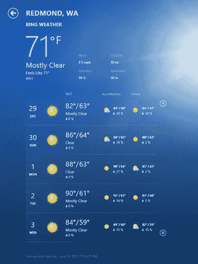
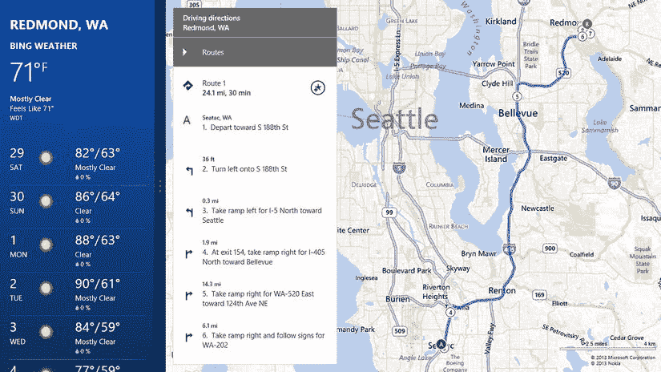
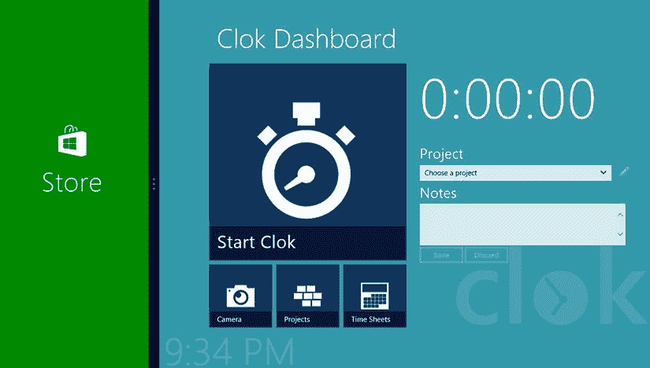
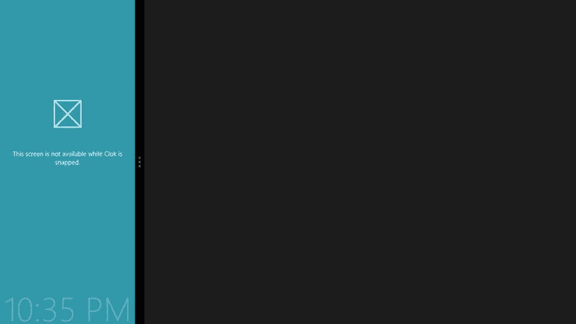

# 十七、处理状态变化

可以说，任何应用最重要的要求是它在任何情况下都能按照用户的期望工作。显然，正确地执行核心任务对您的应用来说很重要，但这不是我在这里讨论的内容。

你添加到你的应用中使其看起来“正常工作”的细节或小改动会让用户一次又一次地回来。类似于我在第 10 章中描述的微妙的动画，这种对细节的关注对大多数用户来说可能从来都不明显，但是如果你忽略它，他们肯定会注意到。在这一章中，我将讨论两个方面，你可以在这两个方面做些小工作，使你的应用看起来更加完美。

首先要考虑应用的激活状态。你的应用是如何开始的？用户以前是如何与你的应用交互的？由于资源限制，用户是否认为你的应用仍然在后台运行，即使 Windows 已经终止了它？第二个方面是考虑应用的视图状态。用户是横向还是纵向浏览你的应用？当他们看着你的应用旁边的另一个应用时，他们有没有在一个狭窄的窗格中抓取你的应用？当他们看着你旁边的应用时，他们是否在一个狭窄的窗格中抓拍了另一个应用？

在构建应用时考虑这些类型的问题将允许您做出有助于满足用户期望的决策。幸运的是，所需的代码通常很容易实现。因此，只需相对较小的努力，您就可以解决任何应用最重要的需求。

应用激活状态

有几种方法可以让用户激活你的应用。最简单也是最常见的方式是通过点击开始屏幕上的一个磁贴来启动它。但是，您的应用也可以通过以下方式之一启动:

*   当用户使用 Windows Search charm 在您的应用中查找内容时
*   当用户使用 Windows Share charm 与您的应用共享某些内容时
*   当用户在`FileOpenPicker`或`FileSavePicker`中指定您的应用时，从另一个应用打开或保存文件

这些只是你的应用被激活的许多方式中的一部分。有十几种方法可以激活 Windows 应用商店应用。枚举定义了所有不同类型的应用激活方式。正如我提到的，从开始屏幕上的磁贴启动你的应用是最常见的一种激活方式，也是我在本章中讨论的唯一一种。在[第 19 章](19.html)，我将演示如何在你的应用中搜索，以及如何与你的应用共享文档。

 **注**MSDN(`http://msdn.microsoft.com/en-us/library/windows/apps/windows.applicationmodel.activation.activationkind`)上有`Windows.ApplicationModel.Activation.ActivationKind`枚举的文档。

当你在第九章的[中第一次从导航应用模板创建 Clok Visual Studio 项目时，`default.js`被添加到你的项目中，包含了许多样板代码。这段代码包括处理应用的`activated`事件。很容易忽略添加的内容，但现在让我们仔细看看。如果你打开`default.js`，你会看到激活的事件处理程序(见](09.html)[清单 17-1](#list1) )。

[***清单 17-1。***](#_list1) 应用的激活事件处理程序

```js
var app = WinJS.Application;
var activation = Windows.ApplicationModel.Activation;

// SNIPPED

app.addEventListener("activated", function (args) {
    if (args.detail.kind === activation.ActivationKind.launch) {
        // SNIPPED
    }
});
```

该处理程序的第一行检查应用是如何激活的。在这个生成的代码中，事件处理程序只在应用启动时做一些事情，很可能是从开始屏幕启动。

扩展闪屏

每个 Windows Store 应用都有一个闪屏。当你在 Visual Studio 中使用第 4 章中讨论的项目模板创建一个新项目时，Visual Studio 会在灰色背景上添加一个占位符图像。这是默认的 Clok 闪屏，可以在[图 17-1](#Fig1) 中看到。在第 23 章中，我将向你展示如何用定制的闪屏来打造你的应用。


[图 17-1](#_Fig1) 。默认锁定闪屏

在应用的第一个屏幕可见之前，Windows 会自动显示该初始屏幕一小段时间。但是，有时您可能需要在用户能够与您的应用交互之前执行一些任务。例如，您可能需要将数据加载到内存中，从 web 服务请求数据，或者打开一个大文档。在这些情况下，如果这些任务没有在您的第一个屏幕可见之前完成，您的应用可能会出现故障。这正是我们在第 14 章中遇到的问题。

当 Clok 启动时，数据从我们的 IndexedDB 数据库加载到`WinJS.Binding.List` 中，用于填充 Clok 仪表板上的项目下拉列表。因为这些数据是异步加载的，所以仪表板屏幕通常在必要的数据出现在`List`之前就加载了。在[第 15 章](15.html)中，我将`home.js`改为先初始化`List`，然后将`ready`函数的内容包装在`Promise`的`done`函数中(见[清单 17-2](#list2) )。

[***清单 17-2。***](#_list2)home . js 中的当前就绪功能

```js
ready: function (element, options) {
    storage.initialize().done(function () {
        // SNIPPED
    }.bind(this));
},
```

在这一节中，我将向您展示如何在 Clok 的激活过程中使用扩展闪屏来加载这些数据。一个扩展的闪屏并不像名字最初暗示的那样。这不是对 Windows 默认显示的闪屏的更改。它也不一定是一个单独的屏幕，尽管理论上你可以在一个单独的屏幕上实现它。实现扩展闪屏最常见的方式是在`default.html`的`div`元素中定义它。`div`被配置成和默认的闪屏一模一样，可以选择显示额外的控件，比如一个进度条来告诉用户应用还在加载。

这是我们将在 Clok 中使用的技术。首先从`home.js`中删除[清单 17-2](#list2) 中高亮显示的代码行。然后将清单 17-3 中的代码从[添加到`default.html`，紧跟在开始的`body`标签之后。](#list3)

[***清单 17-3。***](#_list3) 标记为扩展闪屏

```js
<div id="extendedSplash" class="hidden">
    
    <progress id="splashProgress" style="color: white;"></progress>
</div>
```

参考图像`splashscreen.png` 与[图 17-1](#Fig1) 中默认启动画面上使用的图像相同。这个文件可以在`package.appxmanifest`中配置，我会在[第 23 章](23.html)中介绍。在图像下方，我添加了一个不确定的进度条，当扩展闪屏可见时，它将继续显示动画。为了使扩展闪屏与默认闪屏的外观相匹配，将清单 17-4 中的 CSS 添加到`default.css`中。

[***清单 17-4。***](#_list4) CSS 为扩展闪屏

```js
.hidden {
    display: none;
}

#extendedSplash {
    background-color: #3399aa;
    height: 100%;
    width: 100%;
    position: absolute;
    top: 0px;
    left: 0px;
    text-align: center;
}

    #extendedSplash #splashImage {
        position: absolute;
    }
```

我们将利用绝对定位来确保`splashscreen.png`显示在扩展闪屏中与默认闪屏相同的位置。我一会儿会展示这个。此外，我还设置了扩展闪屏的背景色，以匹配 Clok 的背景色。如果你没有好的理由，微软的建议是让扩展闪屏的背景色与默认闪屏的背景色匹配，默认闪屏在`package.appxmanifest`中指定。目前，Clok 的默认闪屏是灰色背景，但我会在第 23 章中告诉你如何改变。因此，虽然背景颜色目前与默认启动屏幕的颜色不匹配，但最终会在 Clok 准备好用于 Windows 商店之前匹配。

 **注**微软的闪屏指南可在 MSDN ( `http://msdn.microsoft.com/en-us/library/windows/apps/hh465338.aspx`)上获得。

我将向您展示如何创建一个管理扩展闪屏的类。这个新类将负责在需要时显示和隐藏闪屏，并确保长时间运行的初始化代码在进程中的正确位置运行。为了做好准备，在`default.js`中需要一点重构。为了帮助确保我们的代码在本节结束时仍然可读和可理解，从[清单 17-1](#list1) 中截取的代码必须被移到它自己的函数中。在`default.js`中，修改`activated`事件处理程序并创建一个新函数，如[清单 17-5](#list5) 所示。

[***清单 17-5。***](#_list5) 重构激活事件处理程序

```js
app.addEventListener("activated", function (args) {
    if (args.detail.kind === activation.ActivationKind.launch) {
        launchActivation(args);
    }
});

var launchActivation = function (args) {
    if (args.detail.previousExecutionState
            !== activation.ApplicationExecutionState.terminated) {
        // TODO: This application has been newly launched. Initialize
        // your application here.
    } else {
        // TODO: This application has been reactivated from suspension.
        // Restore application state here.
    }

    if (app.sessionState.history) {
        nav.history = app.sessionState.history;
    }

    initializeRoamingSettings();

    // add our SettingsFlyout to the list when the Settings charm is shown
    WinJS.Application.onsettings = function (e) {
        e.detail.applicationcommands = {
            "options": {
                title: "Clok Options",
                href: "/settings/options.html"
            },
            "about": {
                title: "About Clok",
                href: "/settings/about.html"
            }
        };

        if (roamingSettings.values["enableIndexedDbHelper"]) {
            e.detail.applicationcommands.idbhelper = {
                title: "IndexedDB Helper",
                href: "/settings/idbhelper.html"
            };
        }

        WinJS.UI.SettingsFlyout.populateSettings(e);
    };

    args.setPromise(WinJS.UI.processAll().then(function () {
        configureClock();

        if (nav.location) {
            nav.history.current.initialPlaceholder = true;
            return nav.navigate(nav.location, nav.state);
        } else {
            return nav.navigate(Application.navigator.home);
        }
    }));
}
```

到目前为止，这在功能上等同于您刚才替换的代码。现在，我们将更改`activated`事件处理程序来实例化一个新类`Clok.SplashScreen.Extender` ，它将管理扩展的闪屏。用清单 17-6 中突出显示的代码更新`default.js` 。

[***清单 17-6。***](#_list6) 修改激活事件处理程序

```js
app.addEventListener("activated", function (args) {
    if (args.detail.kind === activation.ActivationKind.launch) {

        var extender = new Clok.SplashScreen.Extender(
            extendedSplash,
            args.detail.splashScreen,
            function (e) {
                args.setPromise(Clok.Data.Storage.initialize());
                simulateDelay(2000);
                launchActivation(args);
            });
    }
});
```

这个新类的构造函数有三个参数。第一个是对`div`的引用，代表`default.html`中扩展的闪屏。第二个是对默认闪屏的引用，可以从`activated`事件的参数中获得。第三个参数是初始化应用的函数。在此功能完成之前，将显示扩展的闪屏。

 **注意**[清单 17-6](#list6) 中的代码引用了一个名为`simulateDelay`的函数。实际上，Clok 的初始化非常快。此功能用于模拟更长的初始化过程，应在扩展闪屏经过全面测试后删除。本书附带的源代码中提供了`simulatedDelay`函数的定义。你可以在该书的 press 产品页面的源代码/下载选项卡上找到本章的代码示例(`www.apress.com/9781430257790`)。

当然，`Clok.SplashScreen.Extender`类还不存在。在 Visual Studio 的`js`文件夹中添加一个名为`extendedSplash.js` 的 JavaScript 文件。将清单 17-7 中的代码从[添加到`extendedSplash.js`。](#list7)

[***清单 17-7。***](#_list7) 定义闪屏扩展器类

```js
(function () {
    "use strict";

    var util = WinJS.Utilities;

    var extenderClass = WinJS.Class.define(
        function constructor(extendedSplash, defaultSplash, loadingFunctionAsync) {
            this._extendedSplash = extendedSplash;
            this._defaultSplash = defaultSplash;
            this._loadingFunctionAsync = loadingFunctionAsync;

            this._defaultSplash.ondismissed = this._splash_dismissed.bind(this);

            this._show();
        },
        {
            _splash_dismissed: function (e) {
                WinJS.Promise.as(this._loadingFunctionAsync(e))
                    .done(function () {
                        this._hide();
                    }.bind(this));
            },

            _show: function () {
                this._updatePosition();
                util.removeClass(this._extendedSplash, "hidden");
            },

            _hide: function () {
                if (this._isVisible()) {
                    util.addClass(this._extendedSplash, "hidden");
                }
            },

            _isVisible: function () {
                return !util.hasClass(this._extendedSplash, "hidden");
            },

            _updatePosition: function () {
                var imgLoc = this._defaultSplash.imageLocation;

                var splashImage = this._extendedSplash.querySelector("#splashImage");
                splashImage.style.top = imgLoc.y + "px";
                splashImage.style.left = imgLoc.x + "px";
                splashImage.style.height = imgLoc.height + "px";
                splashImage.style.width = imgLoc.width + "px";

                var splashProgress = this._extendedSplash.querySelector("#splashProgress");
                splashProgress.style.marginTop = (imgLoc.y + imgLoc.height) + "px";
            },
        },
        { /* no static members */ }
    );

    WinJS.Namespace.define("Clok.SplashScreen", {
        Extender: extenderClass,
    });
})();
```

当默认启动画面关闭时，执行[清单 17-6](#list6) 中指定的初始化功能`_loadingFunctionAsync` ，当该功能完成时，扩展启动画面被隐藏。用`WinJS.Promise.as`包装对`_loadingFunctionAsync`的调用允许`Extender`类将初始化函数视为已经返回了一个`Promise`，即使它没有返回。`_updatePosition`功能用于根据图像在默认闪屏上的位置，确定扩展闪屏中的图像和进度条在屏幕上的位置。

完成扩展闪屏的最后一步是添加对`extendedSplash.js`到`default.html`的引用。此外，其他脚本引用的顺序可能需要修改，以确保在尝试使用它们之前定义了类和数据。用来自[清单 17-8](#list8) 的代码更新`default.html`的`head`元素。

[***清单 17-8。*【default.html】**](#_list8)剧本参考文献

```js
<head>
    <meta charset="utf-8" />
    <title>Clok</title>

    <!-- WinJS references -->
    <link href="//Microsoft.WinJS.1.0/css/ui-dark.css" rel="stylesheet" />
    <script src="//Microsoft.WinJS.1.0/js/base.js"></script>
    <script src="//Microsoft.WinJS.1.0/js/ui.js"></script>

    <!-- Clok references -->
    <link href="/css/default.css" rel="stylesheet" />
    <link href="/css/themeroller.css" rel="stylesheet" />

    <!-- Clok generic scripts -->
    <script src="/js/extensions.js"></script>
    <script src="/js/utilities.js"></script>
    <script src="/js/navigator.js"></script>

    <!-- Clok data and extended splash screen -->
    <script src="/data/project.js"></script>
    <script src="/data/timeEntry.js"></script>
    <script src="/data/storage.js"></script>
    <script src="/data/bingMapsWrapper.js"></script>
    <script src="/js/extendedSplash.js"></script>

    <!-- Clok controls -->
    <script src="/controls/js/timerControl.js"></script>
    <script src="/controls/js/clockControl.js"></script>

    <script src="/js/default.js"></script>
</head>
```

现在，当您启动 Clok 时，在初始闪屏关闭后，会显示带有进度条的扩展闪屏(参见[图 17-2](#Fig2) )。


[图 17-2](#_Fig2) 。带有进度条的扩展闪屏

一旦`Clok.Data.Storage`类被初始化，先前的激活码，现在在`launchActivation`函数中，被执行，然后闪屏被隐藏。

先前执行状态

当用户启动你的应用时，让他们得到他们期望的体验是很重要的。最有可能的是，他们的期望是基于他们最后一次看到你的申请。在[第 15 章](15.html)中，我介绍了会话状态，并展示了如何将应用的当前状态保存到会话状态，这样当用户返回到你的应用时，它可以被恢复。恢复终止的会话将大大有助于提供预期的体验，尤其是因为用户可能没有意识到会话在一开始就被终止了。

当您的应用被激活时，用户可能会有其他期望。如果他们通过在触摸屏上向下滑动或按下键盘上的 Alt+F4 来手动关闭应用，他们可能希望在下次启动应用时看到主屏幕。如果激活是点击第二个磁贴(我将在第 21 章中讨论这个话题)或 Windows Search charm 的结果，他们可能不希望看到主屏幕。此外，最明智的行为可能会有所不同，这取决于他们是否已经在使用该应用。

`launchActivation`函数中的第一段代码演示了如何确定用户最后一次与应用交互的方式。我已经将该块复制到清单 17-9 的[中。](#list9)

[***清单 17-9。***](#_list9) 检查上一次执行状态

```js
if (args.detail.previousExecutionState
        !== activation.ApplicationExecutionState.terminated) {
    // TODO: This application has been newly launched. Initialize
    // your application here.
} else {
    // TODO: This application has been reactivated from suspension.
    // Restore application state here.
}
```

您可以使用`previousExecutionState` 的值来决定如何处理应用的激活。虽然我们还没有在 Clok 中实现任何基于`previousExecutionState`的定制逻辑，但是这段代码展示了如果它的`previousExecutionState`是`terminated`，我们可以如何不同地初始化 Clok。在`Windows.ApplicationModel.Activation.ApplicationExecutionState`枚举中定义了五个选项。除了`terminated`，其他可能的`previousExecutionState`值如下:

*   `notRunning`:应用尚未运行，因为用户登录到了 Windows，或者从未运行过(新安装)。
*   应用最后一次运行时，用户通过向下滑动或按 Alt+F4 关闭了它。
*   `running`:当用户通过例如从 Windows Search charm 中进行搜索或其他类型的激活(例如点击次级磁贴或通知)来激活应用时，该应用当前正在运行。
*   `suspended`:当用户通过例如从 Windows Search charm 进行搜索或其他类型的激活(例如点击辅助磁贴或通知)来激活应用时，该应用当前被挂起。

MSDN ( `http://msdn.microsoft.com/en-us/library/windows/apps/windows.applicationmodel.activation.applicationexecutionstate.aspx`)上提供了`Windows.ApplicationModel.Activation.ApplicationExecutionState`枚举的完整定义。查看[清单 17-9](#list9) 中的代码，你会注意到，默认情况下，从 Visual Studio 项目模板创建的项目对所有这些都一视同仁，除了`terminated`。这是一个合理的缺省值，但是在开发应用时要记住这个属性。当您的应用按预期运行时，您将改善用户体验。特别是，我将在第 19 章中讨论一些情况，对于不同的`previousExecutionState`值，您的应用应该有不同的行为。

处理应用暂停

当用户离开您的应用时，Windows 会挂起它。当他或她切换回来时，Windows 将恢复您的应用，对用户来说它将是无缝的。但是，有时如果您的应用被挂起，并且当前使用的应用需要额外的资源，Windows 将终止您的应用。当用户切换回你终止的应用时，你有责任利用会话状态让它看起来无缝，正如在第 15 章中所讨论的。

正如我在《T2》第 15 章中提到的，当 Windows 挂起你的应用时会引发`WinJS.Application.oncheckpoint`事件。但是，当应用终止时，不会引发任何事件。理想情况下，当用户在应用中进行更改时，您应该保持会话状态最新。然而，`oncheckpoint`事件在应用被挂起时被调用，允许您保存对会话状态的任何未保存的更改。

需要明确的是，当保存会话状态并在应用挂起时处理`oncheckpoint`事件时，目的不是为了恢复一个*挂起的*应用。Windows 会自动为您处理这些问题。因为您的应用在终止时没有得到通知，保存会话状态并处理`oncheckpoint`事件使您能够恢复一个*终止的*应用。

当 Visual Studio 第一次创建 Clok 项目时，它在`default.js`中包含了一个用于`oncheckpoint`事件的处理程序，该处理程序可用于在挂起时将应用级设置存储到会话状态。例如，用户的导航历史被保存到`default.js`中的会话状态。此外，如第 15 章中的[所示，您可以在页面控件中处理`oncheckpoint`事件，并在那里解决页面级会话状态问题。更多关于`oncheckpoint`事件的信息可以在 MSDN ( `http://msdn.microsoft.com/en-us/library/windows/apps/br229839.aspx`)上找到。](15.html)

应用视图状态

应用的另一种状态是视图的状态。您的应用可以处于几种不同的视图状态之一:横向([图 17-3](#Fig3) )、纵向([图 17-4](#Fig4) )、对齐或填充([图 17-5](#Fig5) )。


[图 17-3](#_Fig3) 。天气在景观中的应用



[图 17-4](#_Fig4) 。16 纵向视图中的天气应用



[图 17-5](#_Fig5) 。快照视图中的天气应用和填充视图中的地图应用

查看[图 17-3](#Fig3) 、[图 17-4](#Fig4) 和[图 17-5](#Fig5) 中的天气应用，您会看到应用的布局随着视图的变化而变化。在横向视图中，天气预报从左到右显示。在纵向视图中，从上到下显示。在捕捉视图中，它也从上到下显示，但细节较少。虽然这些更改是必须遵循的规则，但考虑用户可能与应用交互的不同方式并相应地更改它也很重要。

到目前为止，在 Clok 中，我们只考虑了用户在横向视图中运行 Clok 的选项。如果在 Windows 模拟器中运行 Clok，可以在纵向视图中模拟运行 Clok([图 17-6](#Fig6) )。


[图 17-6](#_Fig6) 。纵向视图中的 Clok 仪表板屏幕

这看起来不太好，是吗？不幸的是，它在快照视图中看起来更糟(见[图 17-7](#Fig7) )。


[图 17-7](#_Fig7) 。在快照视图中锁定仪表板屏幕

在纵向视图和快照视图中都无法访问核心功能。正如你可能想象的那样，Clok 中的其他屏幕在除了风景以外的视图中看起来同样糟糕。

用 CSS 媒体查询更新布局

更新 Clok Dashboard 屏幕以在其他视图状态下工作可以完全在 CSS 中完成，使用 CSS 媒体查询。我在第 9 章中简要介绍了 CSS 媒体查询，当时我描述了如何根据用户屏幕的宽度以不同的尺寸在背景中显示 Clok 徽标。简而言之，媒体查询允许您指定仅在满足特定条件时才生效的 CSS 规则。在[第 9 章](09.html)中，你添加了仅在屏幕宽度小于等于 1400 像素时应用的 CSS 规则(参见[清单 17-10](#list10) )。

[***清单 17-10。***](#_list10) CSS 媒体查询示例来自[第九章](09.html)

```js
@media screen and (max-width: 1400px) {
    #contenthost {
        background-size: 40%;
    }
}
```

除了使用屏幕宽度作为条件，我们还可以使用当前视图状态。清单 17-11 中的 CSS 规则仅在 Clok 以纵向视图运行时适用。将此 CSS 添加到`home.css`的末尾。

[***清单 17-11。***](#_list11)

```js
@media screen and (-ms-view-state: fullscreen-portrait) {

    .homepage section[role=main] {
        margin-left: 100px;
        display: block;
    }

        .homepage section[role=main] #rightPane {
            display: none;
        }

    .homepage #mainMenu {
        height: 424px;
        -ms-flex-direction: column;
    }

    .homepage #elapsedTime #elapsedTimeClock {
        font-size: 6em;
        font-weight: 200;
    }
}
```

因为 Clok Dashboard 屏幕的大部分样式在纵向视图中仍然有效，所以您只需要指定正在变化的规则。例如，当 Visual Studio 创建一个新的页面控件时，它会在 CSS 文件中包含媒体查询，以更改主`section`的边距。在此媒体查询之前，我们可能对主`section`的 CSS 所做的任何其他更改仍然适用，即使屏幕处于纵向视图。因此，在[清单 17-11](#list11) 中，我不需要指定所有的 CSS 来配置`mainMenu`元素来使用 flexbox 布局。相反，我只需要改变 flexbox 的高度和方向。

在 Windows 模拟器中运行 Clok now，并将其旋转至纵向视图(参见[图 17-8](#Fig8) )。


[图 17-8](#_Fig8) 。在纵向视图中修改了 Clok 仪表板屏幕

通过对 flexbox 定义的一个简单更改，相机、项目和时间表菜单选项现在显示在开始/停止时钟菜单选项旁边，而不是在它下面。

在您的 CSS 媒体查询中，`-ms-view-state`的其他选项包括`fullscreen-portrait`、`snapped`、`filled`、`fullscreen-landscape`。此外，可以使用许多其他媒体查询，如纵横比。媒体可能提出的问题可在 MSDN ( `http://msdn.microsoft.com/en-us/library/windows/apps/hh453556.aspx`)上找到。

在本书附带的源代码中，我对快照和填充视图中的 Clok Dashboard 屏幕进行了类似的更改，还对项目、项目细节和文档库屏幕进行了更改。我不会在本书中讨论这些变化，因为使用 CSS 媒体查询的技术是相同的，CSS 覆盖本身也非常简单。

用 JavaScript 更新布局

一些适应不同视图状态的更改可以很容易地完全通过 CSS 更改来完成。然而，其他更改也需要更改 JavaScript 代码。回到第 7 章的[，当我第一次介绍`ListView`控件时，我展示了一个将`layout`属性](07.html)设置为`GridLayout` 和`ListLayout` 的例子。在`GridLayout`中，如果没有指定`layout`属性，这是默认设置，条目以网格格式从上到下，然后从左到右填充`ListView`。使用`ListLayout`时，`ListView`中的项目在一列中从上到下显示。天气应用使用`ListLayout`在纵向视图(参见[图 17-4](#Fig4) )和抓图视图(参见[图 17-5](#Fig5) )中显示天气预报，在本节中，我将向您展示如何更新 Clok 的项目屏幕以在抓图视图中使用`ListLayout`，尽管它将继续在纵向视图中使用`GridLayout`。

为了实现这一改变，在`list.html`中不需要更新。在`list.css`的媒体查询中需要一些 CSS 规则，但是我不会在这里讨论这些。它们类似于前一节中所做的 CSS 更改，包含在本书附带的源代码中。为项目屏幕添加肖像和快照支持所需的大部分工作将在`list.js`完成。将[清单 17-12 中高亮显示的代码](#list12)添加到`list.js`。

[***清单 17-12。***](#_list12) 修改 ListView 绑定，基于视图状态

```js
filter_value_changed: function (e) {
    this.filteredProjects = storage.projects.getGroupedProjectsByStatus(this.filter.value);

    listView.winControl.itemDataSource = this.filteredProjects.dataSource;
    listView.winControl.groupDataSource = this.filteredProjects.groups.dataSource;
    zoomedOutListView.winControl.itemDataSource = this.filteredProjects.groups.dataSource;

    this.configureListViewLayout();
},

configureListViewLayout: function () {
    var viewState = Windows.UI.ViewManagement.ApplicationView.value;

    if (viewState === Windows.UI.ViewManagement.ApplicationViewState.snapped) {
        listView.winControl.layout = new WinJS.UI.ListLayout();
        semanticZoom.winControl.enableButton = false;
    } else {
        listView.winControl.layout = new WinJS.UI.GridLayout();
        zoomedOutListView.winControl.layout = new WinJS.UI.GridLayout();
        semanticZoom.winControl.enableButton = true;
    }
},
```

在为`ListView`控件设置数据源后，调用一个新函数`configureListViewLayout`来确定`ListView`应该如何显示。当前视图状态在`Windows.UI.ViewManagement.ApplicationView.value`中可用。如果 Clok 是`snapped`，那么`SemanticZoom`控件被禁用，并且`ListView`对象的`layout`属性被设置为`ListLayout`。否则，`ListView`控件将继续使用`GridLayout`，并且`SemanticZoom`被启用。

您需要采取的最后一步是在视图状态改变时处理这种情况。如果你添加一个名为`updateLayout` 的函数到你的页面控件定义中，当屏幕尺寸改变时，该方法将被调用。将清单 17-13 中的代码从[添加到`list.js`](#list13)

[***清单 17-13。***](#_list13) 处理视图状态变化

```js
updateLayout: function (element, viewState, lastViewState) {
    this.configureListViewLayout();
},
```

现在，当屏幕大小发生变化时，比如当 Clok 被抓取或取消抓取时，将调用`configureListViewLayout`函数来确定`ListView`是否应该用`ListLayout`或`GridLayout`来渲染。

现在运行 Clok 并导航到项目屏幕。`ListView`现在将在一个单列列表中显示所有项目(参见[图 17-9](#Fig9) )。


[图 17-9](#_Fig9) 。项目屏幕现在捕捉时使用列表布局

在本书附带的源代码中，您会发现对文档库屏幕的类似更改。因为用于更新该屏幕的技术与我刚才介绍的技术相同，所以我不会在本书中再次介绍。

不支持捕捉视图时

有时候，由于某种原因，应用中的某些屏幕，或者整个应用，可能无法在快照视图中实现。一个常见的例子是必须在风景视图中玩的游戏。甚至商店应用在快照视图中也被禁用(见[图 17-10](#Fig10) )。



[图 17-10](#_Fig10) 。商店应用在快照视图中被禁用

在 Clok 的情况下，有几个屏幕在 snapped 视图中不受支持:方向屏幕、时间表屏幕和时间表图表屏幕。类似于图 17-10 中[所示的商店应用，当你不打算为一个特定的屏幕启用快照视图时，你应该显示一些东西来告诉用户这个屏幕不可用。如果不可用，你不应该保留图 17-7](#Fig10) 中的默认行为。此外，您不应该将用户重定向到另一个屏幕。当他们取消你的应用的快照时，他们希望仍然在他们快照前的屏幕上。

我们可以为快照视图中不支持的每个屏幕单独实现“不可用屏幕”功能。这将为在每种情况下显示不同的内容提供一些灵活性。然而，在 Clok 中，我们将构建这一功能，以便可以轻松地重用它。第一步是定义用户在捕捉视图中不支持的屏幕时应该看到的内容。将清单 17-14 中[的代码添加到`default.html`中，在本章前面添加的扩展闪屏之后。](#list14)

[***清单 17-14。***](#_list14) 【屏幕不可用】消息

```js
<div id="snappedNotSupported" class="hidden">
    
    <div>This screen is not available while Clok is snapped.</div>
</div>
```

类似于图 17-10 中的商店应用，Clok 将显示其徽标，我们的信息位于徽标下方的中心。将[清单 17-15](#list15) 中的代码添加到`default.css`中，以设置消息的样式。

[***清单 17-15。***](#_list15) 消息样式

```js
#snappedNotSupported {
    background-color: #3399aa;
    height: 100%;
    width: 100%;
    padding-top: 200px;
    text-align: center;
}
```

消息现在已经定义好了，但是默认情况下我用 CSS 隐藏了它。我们需要一种方法，在需要的时候轻松显示这个消息。将清单 17-16 中[的功能添加到`utilities.js`中。](#list16)

[***清单 17-16。***](#_list16) 功能在截图时显示“屏幕不可用”信息

```js
DisableInSnappedView: function () {
    var viewState = Windows.UI.ViewManagement.ApplicationView.value;
    var appViewState = Windows.UI.ViewManagement.ApplicationViewState;

    var snappedNotSupported = document.getElementById("snappedNotSupported");

    if (snappedNotSupported) {
        if (viewState === appViewState.snapped) {
            WinJS.Utilities.removeClass(snappedNotSupported, "hidden");
        } else {
            WinJS.Utilities.addClass(snappedNotSupported, "hidden");
        }
    }
},
```

这个新函数，`DisableInSnappedView` ，将决定 Clok 的当前视图状态。如果调用 Clok 时它处于快照视图中，将显示“不可用屏幕”消息。此时，在不支持快照视图的屏幕上调用`DisableInSnappedView`就很简单了。将清单 17-17[中突出显示的代码添加到`directions.js`中。](#list17)

[***清单 17-17。***](#_list17) 在不支持快照视图的屏幕上调用新功能

```js
ready: function (element, options) {

    // SNIPPED

    Clok.Utilities.DisableInSnappedView();
},

updateLayout: function (element, viewState, lastViewState) {
    Clok.Utilities.DisableInSnappedView();
},
```

该屏幕调用了两次`DisableInSnappedView`函数。当屏幕第一次加载时，它在`ready`函数中被调用，并且每当在`updateLayout`函数中视图状态改变时，它被再次调用。在这两个地方调用它将确保显示消息，无论用户在已经处于 snapped 视图时试图导航到该屏幕，还是他或她首先导航到该屏幕，然后试图 snap Clok。

因为在快照视图中不支持时间表屏幕和时间表图表屏幕，所以清单 17-17 中的代码也应该添加到这些屏幕的 JavaScript 文件中。一旦你完成了这些，运行 Clok 并导航到时间表屏幕并抓取应用(见[图 17-11](#Fig11) )。



[图 17-11](#_Fig11) 。在快照视图中，时间表屏幕不可用

 **注意**当我在[第 23 章](23.html)中介绍准备您的应用在 Windows 商店中共享的步骤时，当前显示的`logo.png`文件将被替换。

Windows 的未来版本

在撰写本文时，Windows 下一版本的预览版已经发布。在 Windows 8 中，可以同时查看两个 Windows 应用商店应用，其中一个在预定义宽度的快照视图中。从 Windows 8.1 开始，可以同时查看两个以上的应用，每个视图的宽度可以由用户设置。因此，命名视图状态(如快照)将被弃用，并可能在 Windows 的未来版本中被删除。

对于 Windows 8.1，微软建议更改你的 CSS 媒体查询(见[清单 17-18](#list18) )和 JavaScript(见[清单 17-19](#list19) )来检查特定的宽度，并根据这些值更新界面。

***[清单 17-18](#_list18)*** 。CSS 媒体查询更改示例

```js
/* replace media queries that check for named view states like this ... */
@media screen and (-ms-view-state: snapped) {
    /* SNIPPED */
}

/* ... with media queries that check for specific widths like this */
@media (max-width: 500px) {
    /* SNIPPED */
}
```

***[清单 17-19](#_list19)*** 。示例 JavaScript 更改

```js
// replace JavaScript that checks for named view states like this ...
var viewState = Windows.UI.ViewManagement.ApplicationView.value;
if (viewState === Windows.UI.ViewManagement.ApplicationViewState.snapped) {
    // SNIPPED
}

// ... with JavaScript that checks for specific widths like this
var windowWidth = document.documentElement.offsetWidth;
if (windowWidth <= 500) {
    // SNIPPED
}
```

MSDN ( `http://msdn.microsoft.com/en-us/library/windows/apps/dn263112.aspx`)上描述了下一个版本的 Windows 将会做出的这些和其他一些改变。

结论

本章涵盖的主题——了解应用的激活状态和视图状态——可以总结为“做用户期望的事情”知道用户最后一次是如何与你的应用交互的将允许你适当地初始化应用。注意应用的视图状态，以及应用运行时视图状态可能如何变化，这将允许您设置屏幕格式以适应适当的空间。这些小细节是你的用户可能会忽略的，但是如果你没有做，他们会注意到的。