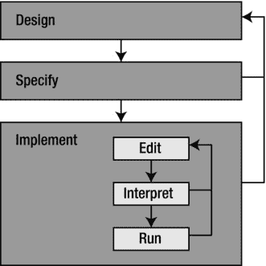
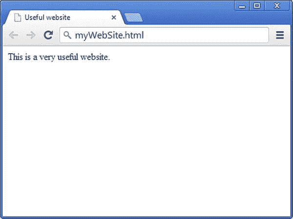
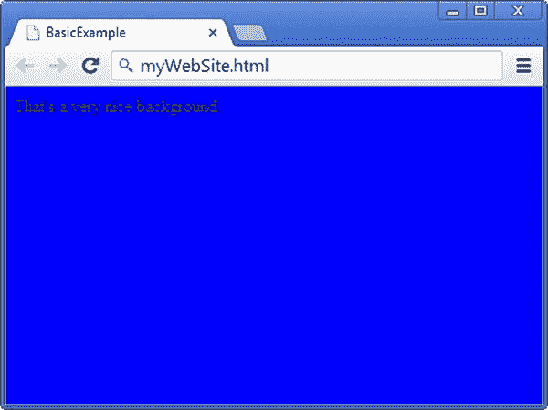
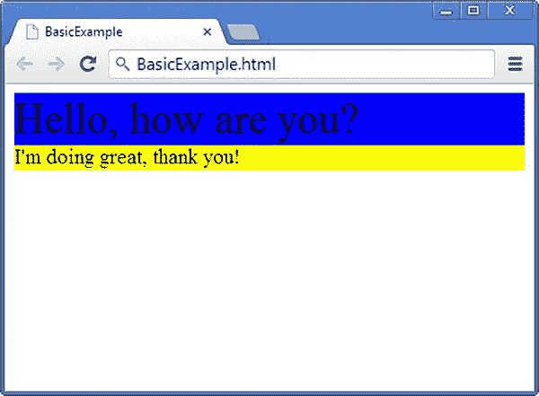
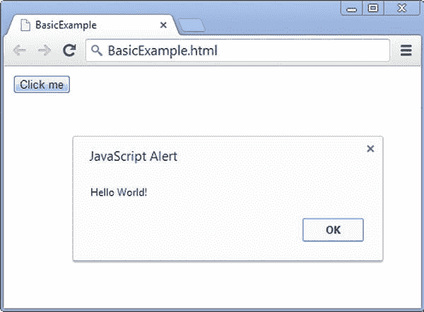
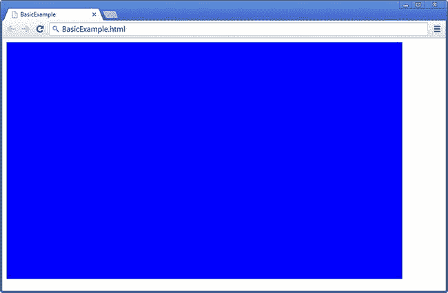

# 一、设计

本章讲述了编程语言是如何随着时间的推移而演变的。自从 20 世纪 90 年代互联网兴起以来，已经开发了许多语言和工具来支持它。最著名的语言之一是 HTML，用于创建网站。与 JavaScript 和 CSS 样式表一起，它允许创建可由浏览器显示的动态网站。我将在本章中详细讨论 HTML 和 JavaScript，您将看到如何结合使用 HTML5 画布和 JavaScript 创建一个简单的 web 应用。

计算机和程序

在你开始处理 HTML 和 JavaScript 之前，这一部分简要介绍了计算机和编程的一般知识。之后，您将学习如何结合 JavaScript 创建一个简单的 HTML 页面。

处理器和内存

一般来说，计算机由一个*处理器*和*存储器*组成。这适用于所有现代电脑，包括游戏机、智能手机和平板电脑。我把内存定义为你可以*读取和/或写入的东西。内存有不同的种类，主要区别在于数据传输和数据访问的速度。有的内存可以读写任意多次，有的内存只能读，有的内存只能写。计算机中的主处理器称为*中央处理器*。计算机上最常见的其他处理器是*图形处理单元(GPU)* 。甚至现在的 CPU 本身也不再是一个单一的处理器，而是通常由许多核心组成。*

输入输出设备，比如鼠标、游戏手柄、键盘、显示器、打印机、触摸屏等等，乍一看似乎不属于*处理器*和*内存*的范畴。然而，抽象地说，它们实际上是内存。触摸屏是*只读*存储器，打印机是*只写*存储器。

处理器的主要任务是执行*指令*。执行这些指令的效果是记忆被改变了。特别是我对内存的定义非常宽泛，处理器执行的每条指令都会以某种方式改变内存。你可能不希望计算机只执行一条指令。一般来说，你有一个很长的要执行的指令列表——“把这部分内存移到那边，清空这部分内存，在屏幕上画这个精灵，检查玩家是否按了游戏手柄上的一个键，当你在那里的时候煮点咖啡”——而且(正如你可能预料的那样)，这样一个由计算机执行的指令列表被称为*程序*。

程序

总之，程序是一长串改变计算机内存的指令。但是，程序本身也存储在内存中。在程序中的指令被执行之前，它们被存储在硬盘、DVD 或 u 盘上；或在云端；或者任何其他存储介质上。当它们需要被执行时，程序被移动到机器的内部存储器。

组合在一起形成程序的指令需要以某种方式表达。计算机不能掌握用简单英语输入的指令，这就是为什么你需要 JavaScript 之类的编程语言。在实践中，指令被编码为文本，但是你需要按照一种非常严格的方式写下来，根据一套定义编程语言的规则。存在许多编程语言，因为当有人想到一种稍微好一点的方式来表达某种类型的指令时，他们的方法通常会成为一种新的编程语言。很难说有多少种编程语言，因为那取决于你是否把一种语言的所有版本和方言都计算在内；但可以说有成千上万个。

幸运的是，没有必要学习所有这些不同的语言，因为它们有许多相似之处。在早期，编程语言的主要目标是利用计算机的新的可能性。然而，最近的语言致力于使编写程序可能引起的混乱变得有序。共享相似属性的编程语言被认为属于相同的*编程范例*。范式指的是一组常用的实践。

早期:命令式编程

一大群编程语言属于*命令式范式*。因此，这些语言被称为*祈使语*T5】。命令式语言是基于改变计算机内存的指令。因此，它们非常适合上一节描述的处理器-内存模型。JavaScript 是命令式语言的一个例子。

在早期，编写电脑游戏程序是一项非常困难的任务，需要高超的技巧。像流行的雅达利 VCS 游戏机只有 128 字节的 RAM(随机存取存储器),可以使用最多 4096 字节的 ROM(只读存储器),其中必须包含程序和游戏数据。这大大限制了可能性。例如，大多数游戏都有一个对称的关卡设计，因为这样可以将内存需求减半。这些机器也非常慢。

编写这样的游戏是用汇编语言完成的。汇编语言是第一种命令式编程语言。每种类型的处理器都有自己的汇编指令，所以每种处理器的汇编语言都是不同的。因为可用的内存量如此有限，游戏程序员擅长挤出最后一点内存，并执行极其聪明的黑客操作来提高效率。然而，最终的程序是不可读的，除了最初的程序员，任何人都不能理解。幸运的是，这不是问题，因为在那时，游戏通常是由一个人开发的。

一个更大的问题是，因为每个处理器都有自己的汇编语言版本，所以每当一个新的处理器出现时，所有现有的程序都必须为该处理器完全重写。因此，出现了对独立于处理器的编程语言的需求。这就产生了诸如 *Fortran* (公式翻译器)和 *BASIC* (初学者通用符号指令代码)等语言。BASIC 在 20 世纪 70 年代非常流行，因为它出现在早期的个人电脑中，如 1978 年的 Apple II、1979 年的 IBM-PC 以及它们的后代。不幸的是，这种语言从未被标准化过，所以每个计算机品牌都使用自己的 BASIC 方言。

**注意**我努力确定命令式编程语言的范例，这一事实意味着还有其他不基于指令的编程范例。这可能吗？处理器不执行指令怎么办？处理器总是执行指令，但这并不意味着编程语言包含指令。例如，假设您构建了一个非常复杂的电子表格，在表格中的不同单元格之间有许多链接。您可以将这个活动称为*编程*，将空的电子表格称为*程序*，准备处理数据。在这种情况下，程序不是基于指令，而是基于细胞之间的功能链接。除了这些*函数式编程语言*，还有基于命题逻辑的语言——逻辑编程语言*——比如 Prolog。这两种类型的编程语言一起形成了*声明性范例*。*

过程化编程:命令式+过程

随着程序变得越来越复杂，显然需要一种更好的方法来组织所有这些指令。在*过程化编程范式* 中，相关指令被分组在*过程*(或*函数*，或*方法*，后者是更常见的现代名称)。因为过程化编程语言仍然包含指令，所以所有的过程化语言也是命令式的。

一种众所周知的过程语言是 C. 这种语言是由贝尔实验室定义的，贝尔实验室在 20 世纪 70 年代末致力于 Unix 操作系统的开发。因为操作系统是一种非常复杂的程序，贝尔实验室想用过程语言来编写它。该公司定义了一种叫做 C 的新语言(因为它是早期叫做 A 和 B 的原型的继承者)。Unix 的哲学是每个人都可以为操作系统编写自己的扩展，用 C 编写这些扩展也是有意义的。结果，C 成为 20 世纪 80 年代最重要的过程语言，也是在 Unix 世界之外。

c 仍然被大量使用，尽管它正在缓慢但肯定地为更现代的语言让路，尤其是在游戏行业。这些年来，游戏变成了更大的程序，它们是由团队而不是个人创建的。游戏代码的可读性、可重用性和易调试性非常重要。此外，从财务角度来看，减少程序员在游戏上的工作时间变得越来越重要。尽管 C 语言在这方面比汇编语言好得多，但以结构化的方式编写非常大的程序仍然很困难。

面向对象编程:过程+对象

像 C 这样的过程语言允许你在过程中对指令进行分组(也称为*方法*)。就在他们意识到指令属于同一组的时候，程序员发现一些方法也属于同一组。*面向对象的范例* 让程序员将方法组合成一个叫做*类*的东西。这几组方法可以改变的内存叫做*对象*。一个类可以描述像吃豆人游戏中的幽灵一样的东西。那么每个单独的幽灵对应于该类的一个对象。这种思考编程的方式在应用于游戏时是非常强大的。

每个人都已经在用 C 编程了，所以一种新的语言诞生了，这种语言很像 C，除了它允许程序员使用类和对象。这种语言被称为 *C++* (两个加号表示它是 C 的继承者)。C++的第一个版本可以追溯到 1978 年，官方标准出现在 1981 年。

尽管语言 C++是标准的，但 C++并不包含在不同类型的操作系统上编写基于 Windows 的程序的标准方法。在苹果电脑、Windows 电脑或 Unix 电脑上编写这样的程序是完全不同的任务，这使得在不同的操作系统上运行 C++程序成为一个复杂的问题。最初，这不被认为是一个问题；但是随着互联网变得越来越流行，在不同的操作系统上运行相同的程序变得越来越方便。

一种新的编程语言的时机已经成熟:一种可以在不同操作系统上标准化使用的语言。这种语言需要类似于 C++，但这也是一个很好的机会，从语言中删除一些旧的 C 语言的东西，以简化事情。语言 *Java* 履行了这个角色(Java 是一个以咖啡闻名的印尼岛屿)。Java 是硬件制造商 Sun 在 1995 年推出的，当时采用了一种革命性的商业模式:软件是免费的，公司计划通过支持来赚钱。对 Sun 来说同样重要的是需要与日益流行的微软软件竞争，微软软件不能在 Sun 生产的 Unix 计算机上运行。

Java 的新奇之处之一是，这种语言被设计成程序不会意外地干扰同一台计算机上运行的其他程序。在 C++中，这变成了一个严重的问题:如果出现这样的错误，它可能会使整个计算机崩溃，或者更糟——邪恶的程序员可能会引入病毒和间谍软件。

网络应用

Java 的一个有趣的方面是它可以在浏览器中作为一个所谓的“T1”小程序“T2”运行。这使得在互联网上共享程序成为可能。但是，运行 Java 小程序需要安装插件；此外，Java 小应用无法直接与浏览器的元素进行交互。当然，浏览器的另一个主要任务是显示 *HTML 页面*。 HTML 是一种文档格式化语言，是*超文本标记语言*的缩写。它的目标是提供一种根据一组标记来组织文档的方法，这些标记表示文档的不同部分，如标题或段落。HTML 是由当时在欧洲粒子物理研究所工作的物理学家蒂姆·伯纳斯·李在 20 世纪 80 年代末发明的。他想为 CERN 的研究人员提供一种方便使用和共享文件的方式。因此，在给同事的备忘录中，他提出了一个基于互联网的超文本系统。Berners-Lee 指定了一小组 HTML 查看器可以识别的标签。HTML 的第一个版本包含了 18 个这样的标签，其中 11 个仍然存在于现代 HTML 中。

随着因特网变得可以公开访问，HTML 成了全世界建立网站的通用语言。当时非常流行的浏览器 Mosaic 引入了一个新的标签、`img`、，它可以用来在 HTML 文档中加入一张图片。此外，HTML 语言的许多新版本是由不同的组织起草的，这些组织提议对一些浏览器已经实现的某些元素进行标准化，如表格或填写表单。1995 年，HTML 工作组设计了 HTML 2.0 标准，将所有这些元素合并成一个标准。在那之后，万维网联盟(W3C) 被创建来维护和更新 HTML 标准。HTML 的新版本 HTML 3.2 是在 1997 年 1 月定义的。同年 12 月，W3C 推荐 HTML4 最后，HTML4.01 在 2000 年 5 月成为新接受的标准。目前，W3C 正在敲定 HTML 的第五个版本，HTML5，，在你阅读这本书的时候，它很可能会成为新的官方 HTML 标准。

以防你从未建立过网站，这是一个简单的 HTML 页面的样子:

```js
<!DOCTYPE html>
<html>
<head>
<title>Useful website</title>
</head>
<body>
This is a very useful website.
</body>
</html>

```

开发浏览器的公司很快意识到他们需要一种方法来使页面更加动态。第一个 HTML 标准(2.0)主要是针对标记文本的(这也是 HTML 最初被发明的原因)。然而，网站用户需要按钮和字段，并且需要一个规范来指示如果用户与页面交互会发生什么。换句话说，网站需要变得更加动态。当然，Java 也有它的小程序，但是这些小程序是完全独立运行的。applet 无法修改 HTML 页面的元素。

网景公司开发了网景导航器浏览器，与微软公司就哪种浏览器将成为人人使用的主要浏览器展开了激烈的竞争。Netscape 在其现有的一些工具中使用了编程语言 Java，该公司希望设计一种轻量级的解释语言，以吸引非专业程序员(如网站设计师)。这种语言将能够与网页接口，并动态地读取或修改其内容。网景公司发明了一种叫做 T3 的语言 LiveScript 来完成这个角色。不久之后，该公司将这种脚本语言的名称改为 *JavaScript* ，因为它源于 Java 语言，也可能是因为人们已经认识到了 Java 这个名字。 JavaScript 包含在 Netscape Navigator 2.0 中。

JavaScript 作为一种脚本语言很快获得了广泛的成功，使网站变得更加动态。微软也将它包含在 Internet Explorer 3.0 中，但将其命名为 *JScript* ，因为它与 Netscape 最初定义的版本略有不同。1996 年，Netscape 向 ECMA 标准化组织提交了 JavaScript，该组织将这种语言重新命名为 ECMAScript(尽管大家仍然称它为 JavaScript)。最终在 1999 年被接受为标准的版本是当前所有浏览器都支持的版本。ECMAScript 标准的最新版本是 2011 年发布的 5.1 版。正在开发中的 ECMAScript 6 引入了许多有用的新特性，比如类和函数参数的默认值。

由于所有主流浏览器都支持它，JavaScript 已经成为网站的主要编程语言。因为它最初被认为是一种轻量级的解释脚本语言，直到现在程序员才开始使用 JavaScript 来开发更复杂的基于 web 的应用。尽管 JavaScript 可能没有 Python 和 C#等现代编程语言的所有特性，但它仍然是一种非常强大的语言，这一点你会在阅读本书时发现。目前，JavaScript 是唯一一种与 HTML 集成的语言，可以在不同平台的不同浏览器上工作。与 HTML5 一起，它已经成为 web 开发的强大框架。

编程游戏

这本书的目的是教你如何编写游戏程序。游戏很有趣(有时也很有挑战性！)节目。他们处理大量不同的输入和输出设备，游戏创造的想象世界可能极其复杂。

直到 20 世纪 90 年代初，游戏都是为特定平台开发的。例如，如果程序员不花大力气使游戏程序适应不同的硬件，为特定游戏机编写的游戏就不能在任何其他设备上使用。对于 PC 游戏来说，这种影响甚至更糟。如今，操作系统提供了一个*硬件抽象层* ，所以程序不必处理计算机内部所有不同类型的硬件。在此之前，每个游戏都需要为每个显卡和声卡提供自己的驱动程序；因此，为某个特定游戏编写的代码并不能被另一个游戏重用。在 20 世纪 80 年代，街机游戏极其流行，但由于计算机硬件的不断变化和改进，为它们编写的代码几乎没有一个可以被重新用于更新的游戏。

随着游戏变得越来越复杂，操作系统变得越来越独立于硬件，游戏公司开始重用早期游戏的代码是有意义的。如果您可以简单地使用以前发布的游戏中的程序，为什么要为每个游戏编写全新的渲染程序或碰撞检查程序呢？*游戏引擎* 这个术语是在 20 世纪 90 年代创造的，当时《毁灭战士》和《雷神之锤》等第一人称射击游戏成为非常受欢迎的流派。这些游戏非常受欢迎，以至于它们的制造商 id Software 决定将部分游戏代码作为单独的软件授权给其他游戏公司。转售核心游戏代码作为游戏引擎是一项有利可图的努力，因为其他公司愿意花大价钱购买许可证，将引擎用于他们自己的游戏。这些公司不再需要从头开始编写他们自己的游戏代码——他们可以重用游戏引擎中包含的程序，并更多地关注图形模型、角色、关卡等。

今天有许多不同的游戏引擎。一些游戏引擎是专门为游戏控制台或操作系统等平台构建的。其他游戏引擎可以在不同的平台上使用，而不必更改使用游戏引擎代码的程序。这对于希望在不同平台上发布游戏的游戏公司来说尤其有用。现代游戏引擎为游戏开发人员提供了许多功能，如 2D 和 3D 渲染引擎，粒子和灯光、声音、动画、人工智能、脚本等特殊效果。游戏引擎被频繁使用，因为开发所有这些不同的工具是一项繁重的工作，游戏公司更愿意将时间和精力投入到创造美丽的环境和挑战关卡上。

由于核心游戏功能和游戏本身(关卡、角色等等)之间的严格分离，许多游戏公司雇佣的艺术家比程序员多。然而，程序员对于改进游戏引擎代码仍然是必要的，对于编写程序来处理游戏引擎中不包含的或特定于游戏的事情也是必要的。此外，游戏公司经常开发软件来支持游戏的开发，例如关卡编辑程序、以正确格式导出模型和动画的 3D 建模软件的扩展、原型工具等等。

对于 JavaScript，还没有一个人人都在使用的引擎。大多数人用 JavaScript 编写相对简单的游戏，以确保游戏可以在不同的设备上运行，尤其是功能有限的设备。因此，程序员不使用引擎，而是直接使用 HTML5 元素如`canvas`来编写游戏。然而，这种情况正在迅速改变。如果你在谷歌中输入 *javascript 游戏引擎* ，你会发现许多引擎可以作为开发自己游戏的基础。这本书的目标是教你如何编程游戏；但是你不会用引擎，因为我想教你语言的核心和它的可能性。这不是游戏引擎的手册。事实上，读完这本书后，你将能够建立自己的游戏引擎。我不是说你应该这样做，但是你可以更好地从头开始编写游戏程序，更快地理解游戏引擎库是如何工作的。

开发游戏

开发游戏通常使用两种方法。图 1-1 说明了这些方法:外部方法包含内部方法。当人们第一次学习编程时，他们通常会立即开始编写代码，这导致了一个编写、测试、修改的紧密循环。相比之下，专业程序员在写第一行代码之前，会花大量的前期时间做设计工作。



[图 1-1](#_Fig1) 。小规模和大规模编程

小规模:编辑-解释-运行

当你想用 JavaScript 构建一个游戏时，你需要编写一个包含多行指令的程序。使用文本编辑器，您可以编辑正在处理的脚本。一旦你写下这些指令，你就启动浏览器(最好是一个常用浏览器程序的最新版本)并尝试运行该程序。当一切正常时，浏览器解释并执行脚本。

然而，大多数时候，事情并不那么容易。首先，你给浏览器/解释器的源代码应该包含有效的 JavaScript 代码，因为你不能指望浏览器执行一个包含随机胡扯的脚本。浏览器检查源代码是否符合 JavaScript 语言的语言规范。否则，它会产生一个错误，脚本会停止。当然，程序员努力写出正确的 JavaScript 程序，但是很容易出现错别字，而且写出正确程序的规则非常严格。因此，在解释阶段，您肯定会遇到错误。

在解决小错误的几次迭代之后，浏览器会解释整个脚本，而不会遇到任何问题。下一步，浏览器*执行*或者*运行*脚本。在许多情况下，您会发现脚本并没有完全按照您想要的那样运行。当然，您努力正确地表达了您希望脚本做的事情，但是很容易犯概念性的错误。

所以你回到编辑那里，修改剧本。然后你再次打开浏览器，尝试解释/运行脚本，希望你没有犯新的打字错误。你可能会发现早先的问题已经解决了，只是意识到虽然脚本在做一些不同的事情，但它仍然没有完全按照你想要的那样去做。又回到了编辑那里。欢迎来到程序员的生活！

大规模:设计-指定-实施

一旦你的游戏变得越来越复杂，就开始敲键盘直到你完成不再是一个好主意。在你开始*实现*(编写和测试游戏)之前，还有另外两个阶段。

首先，你必须*设计*游戏。你在开发什么类型的游戏？你的游戏的目标受众是谁？这是 2D 游戏还是 3D 游戏？你想要什么样的游戏模式？游戏中有哪些类型的角色，他们的能力如何？特别是当你和其他人一起开发一个游戏时，你必须写一些包含所有这些信息的设计文档，这样每个人都同意他们在开发什么游戏！即使是你自己开发游戏，写下游戏的设计也是一个好主意。*设计*阶段实际上是游戏开发中最困难的任务之一。

一旦明确了游戏应该做什么，下一步就是为程序提供一个全局结构。这被称为*规范*阶段。你还记得面向对象编程范式在方法中组织指令，在类中组织方法吗？在规格说明阶段，您需要概述游戏所需的类以及这些类中的方法。在这个阶段，你只需要描述一个方法将做什么，而不是它是如何完成的。然而，请记住，你不能指望方法做不可能的事情:它们必须在以后实现。

当游戏规范完成后，你可以开始*实现*阶段，这通常意味着要经历几次编辑-解释-运行循环。之后，你可以让其他人玩你的游戏。在很多情况下，你会意识到游戏设计中的一些想法并不那么有效。所以，你重新开始，改变设计，然后改变规格，最后做一个新的实现。你让其他人再玩你的游戏，然后…嗯，你明白了。编辑-解释-运行循环包含在一个更大规模的循环中:设计-指定-实现循环(见[图 1-1](#Fig1) )。尽管这本书主要关注于实现阶段，你可以在[第 30 章](30.html)中读到更多关于设计游戏的内容。

构建您的第一个 Web 应用

在本节中，您将使用 JavaScript 构建几个非常简单的示例应用。在本章的前面，你看到了一个基本的 HTML 页面:

```js
<!DOCTYPE html>
<html>
<head>
<title>Useful website</title>
</head>
<body>
This is a very useful website.
</body>
</html>

```

打开文本编辑程序，如记事本，将此文本复制粘贴到其中。将文件另存为扩展名为`.html`的文件。然后双击该文件，在浏览器中打开它。你会看到一个几乎是空的 HTML 页面，如图 1-2 所示。在 HTML 中，标签用于组织文档中的信息。您可以识别这些标签，因为它们被放在尖括号中。每种不同类型的内容都放在这样的标签之间。通过检查标记名前面是否有斜杠，可以区分开始标记和结束标记。例如，文档的标题放在开始标签`<title>`和结束标签`</title>`之间。标题本身又是由`<head>`和`</head>`标记分隔的*标题*、 的一部分。标题包含在 *html* 部分，由`<html>`和`</html>`标记分隔。如您所见，HTML 标记系统允许您逻辑地组织文档内容。总的 HTML 文档有一种树形结构，其中`html`元素是树的根；根由`head`和`body`等元素组成，这些元素又由更多的分支组成。



[图 1-2](#_Fig2) 。一个非常简单的 HTML 页面

一旦你创建了一个 HTML 文档，你可以对它应用一个*样式*。例如，您可能想要更改 HTML 文档各部分的布局，或者您可能想要使用不同的字体或应用背景色。样式可以被定义为 HTML 文档的一部分，或者你可以使用 CSS(层叠样式表)文件来定义样式。

虽然我们没有在本书中详细介绍样式表(CSS 文件) ，但我有限地使用它们来正确定位浏览器窗口中的游戏内容。例如，这个简单的样式表将 html 页面及其正文的边距设置为 0:

```js
html, body {
    margin: 0;
}

```

如果您希望您的 HTML 页面使用 CSS 文件(样式表)，您只需将下面一行添加到`<head>`部分:

```js
<link rel="stylesheet" type="text/css" href="game-layout.css"/>

```

我将在本书的大部分游戏示例中使用前面的样式表。在第 13 章的[中，我将扩展样式表以允许内容自动缩放和定位到不同的设备。](13.html)

您还可以在 HTML 文档本身中更改样式，而不是使用 CSS 文件来定义样式。这是通过设置标签的*属性*来实现的。例如，以下 HTML 页面的主体有一个属性标签`style`，该标签被设置为将背景色更改为蓝色(显示的页面见[图 1-3](#Fig3) ):

```js
<!DOCTYPE html>
<html>
<head>
<title>BasicExample</title></head>
<body style="background:blue">
That's a very nice background.
</body>
</html>

```



[图 1-3](#_Fig3) 。蓝色背景的简单网页

你可以通过使用一个`style`属性来改变样式的不同方面，如示例所示。例如，看看下面的 HTML 文档:

```js
<!DOCTYPE html>
<html>
<head>
<title>BasicExample</title></head>
<body>
<div style="background:blue;font-size:40px;">Hello, how are you?</div>
<div style="background:yellow;font-size:20px;">I'm doing great, thank you!</div>
</body>
</html>

```

如果您查看`body`的内容，您会看到它包含两个部分。每个部分都包含在`div`标签中，这些标签是`div`用来将一个 HTML 文档分成*个部分*。您可以为每个分区应用不同的风格。在本例中，第一个分区的背景为蓝色，字体大小为 40 像素，第二个分区的背景为黄色，字体大小为 20 像素(参见[图 1-4](#Fig4) )。



[图 1-4](#_Fig4) 。由两个部分组成的网页，每个部分都有不同的背景颜色和字体大小

除了给 HTML 元素添加一个`style`属性，您还可以使用 JavaScript 来修改该元素的样式。例如，您可以使用 JavaScript 更改正文的背景颜色，如下所示:

```js
<!DOCTYPE html>
<html>
<head>
<title>BasicExample</title><script>
    changeBackgroundColor = function () {
        document.body.style.background = "blue";
    }
    document.addEventListener('DOMContentLoaded', changeBackgroundColor);
</script>
</head>
<body>
That's a very nice background.
</body>
</html>

```

浏览器显示的页面看起来和第一个例子完全一样(如图 1-2 所示)，但是使用 JavaScript 来做这件事和给`body`标签添加一个属性有一个重要的区别:JavaScript 脚本动态地改变颜色*。发生这种情况是因为脚本包含以下行:*

```js
document.addEventListener('DOMContentLoaded', changeBackgroundColor);

```

在 JavaScript 应用中，您可以访问 HTML 页面中的所有元素。而当事情发生时，你可以指示浏览器执行指令。在这里，您指出当页面完成加载时应该执行`changeBackgroundColor`函数。

HTML 和 JavaScript 中有许多不同类型的事件。例如，您可以在 HTML 文档中添加一个按钮，并在用户单击该按钮时执行 JavaScript 指令。这里有一个说明这一点的 HTML 文档(参见[图 1-5](#Fig5) ):

```js
<!DOCTYPE html>
<html>
<head>
<title>BasicExample</title>
<script>
    sayHello = function () {
        alert("Hello World!");
    }
    document.addEventListener('click', sayHello);
</script>
</head>
<body>
<button>Click me</button>
</body>
</html>

```



[图 1-5](#_Fig5) 。包含按钮的 HTML 页面。当用户单击该按钮时，会显示一个警告

这种动态交互 之所以成为可能，是因为浏览器可以执行 JavaScript 代码。如果你想设计游戏，能够定义玩家应该如何与游戏互动是至关重要的。

HTML5 画布

新 HTML 标准的一个优点是它提供了一些标签，使得 HTML 文档更加灵活。添加到标准中的一个非常重要的标签是`canvas`标签，它允许您在 HTML 文档中绘制 2D 和 3D 图形。这里有一个简单的例子:

```js
<!DOCTYPE html>
<html>
<head>
<title>BasicExample</title>
</head>
<body>
<div id="gameArea">
    <canvas id="mycanvas" width="800" height="480"></canvas>
</div>
</body>
</html>

```

这里你可以看到身体包含了一个名为`gameArea`的分部。在这个 division 中有一个`canvas`元素，它有许多属性。它有一个标识符(`mycanvas`，它有一个宽度和高度。您可以使用 JavaScript 再次修改这个`canvas`元素中的内容。例如，下面的代码通过使用一些 JavaScript 指令改变了`canvas`元素的背景颜色:

```js
<!DOCTYPE html>
<html>
<head>
<title>BasicExample</title>
<script>
    changeCanvasColor = function () {
        var canvas = document.getElementById("mycanvas");
        var context = canvas.getContext("2d");
        context.fillStyle = "blue";
        context.fillRect(0, 0, canvas.width, canvas.height);
    }
    document.addEventListener('DOMContentLoaded', changeCanvasColor);
</script>
</head>
<body>
<div id="gameArea">
    <canvas id="mycanvas" width="800" height="480"></canvas>
</div>
</body>
</html>

```

在`changeCanvasColor`函数中，首先找到`canvas`元素。这是一个 HTML 文档元素，你可以在上面绘制 2D 和 3D 图形。在代码中准备好这个元素非常有用，因为这样就可以轻松地检索画布的信息，比如它的宽度或高度。为了在画布上执行操作(比如在上面画画)，你需要一个画布*上下文*。画布上下文提供了在画布上绘图的功能。当您检索画布上下文时，您需要指明您是想要在二维还是三维空间中进行绘制。在本例中，您将获得一个二维画布上下文。您可以使用它来选择背景填充颜色，并用该颜色填充画布。图 1-6 显示了浏览器显示的 HTML 页面。接下来的章节将更详细地介绍`canvas`元素，以及如何用它来创建游戏。



[图 1-6](#_Fig6) 。在网页上显示 HTML5 画布并用颜色填充它

单独文件中的 JavaScript

除了在 HTML 文档中编写所有的 JavaScript 代码，您还可以在一个单独的文件中编写 JavaScript 代码，并将该文件包含在 HTML 文档中:

```js
<!DOCTYPE html>
<html>
<head>
<title>BasicExample</title>
<script src="BasicExample.js"></script>
</head>
<body>
<div id="gameArea">
    <canvas id="mycanvas" width="800" height="480"></canvas>
</div>
</body>
</html>

```

JavaScript 文件`BasicExample.js`包含以下代码:

```js
changeCanvasColor = function () {
    var canvas = document.getElementById("mycanvas");
    var context = canvas.getContext("2d");
    context.fillStyle = "blue";
    context.fillRect(0, 0, canvas.width, canvas.height)
}
document.addEventListener('DOMContentLoaded', changeCanvasColor);

```

在许多情况下，这样做是可取的。通过将脚本代码从 HTML 文档中分离出来，在不同的网站上查找或使用代码就容易多了。本书中使用的所有例子都将 JavaScript 代码从 HTML 文档中分离出来，很好地组织在一个或多个 JavaScript 文件中。

你学到了什么

在本章中，您学习了:

*   计算机是如何工作的，它们由处理器计算事物和内存存储事物组成
*   编程语言是如何从汇编语言发展到现代编程语言如 JavaScript 的
*   如何使用 HTML5 和 JavaScript 创建一个简单的 web 应用*