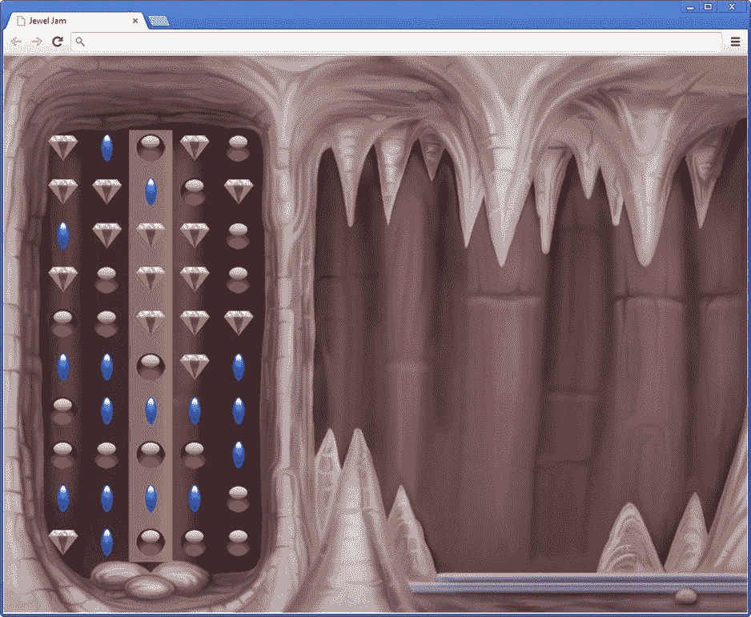
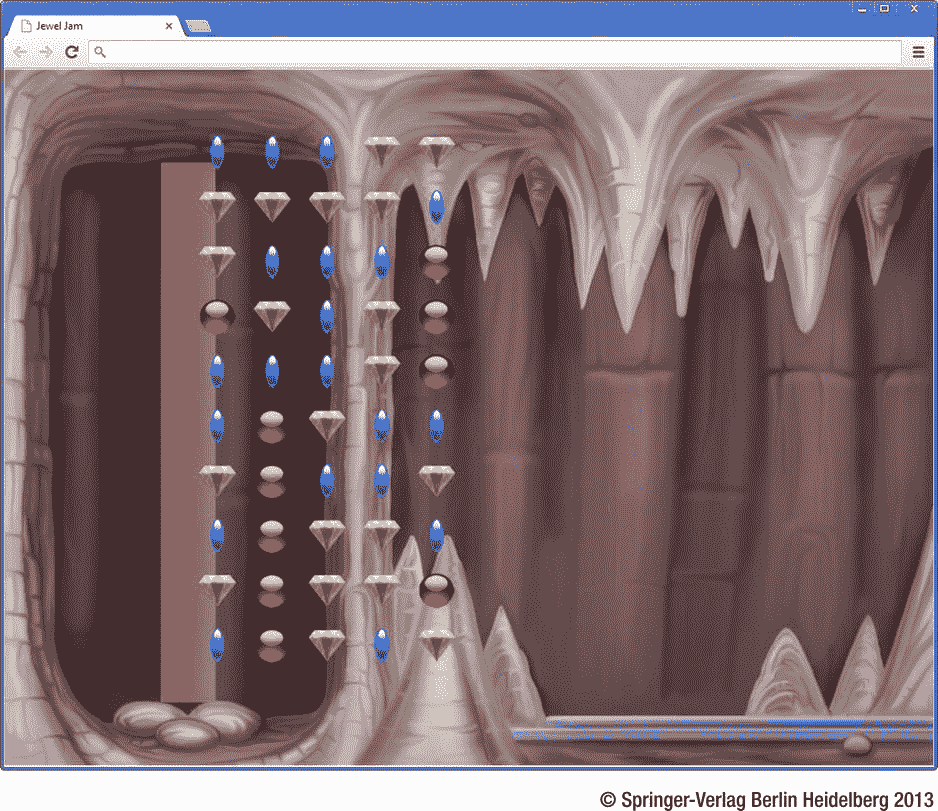

# 十四、结构中的游戏对象

在前一章中，你看到了如何使用数组来表示事物的列表。例如，您使用一个数组来跟踪玩家触摸触摸屏的位置，或者玩家当前在键盘上按了多少个键。

数组也可以用在很多其他情况下。您可以使用它们来存储更复杂的对象，如画家游戏中的球或颜料罐。一般来说，为游戏对象提供一些结构是有用的，而不是简单地将它们都声明为游戏世界中的成员变量。许多游戏将它们的游戏对象放在某种游戏层级中。例如，你可以有一个游戏对象`Car`，它由其他游戏对象组成，比如轮子、传动系统、马达、窗户、座椅等等。这些对象中的每一个又可以由更小的游戏对象组成，等等。

在某些情况下，游戏对象必须遵守游戏世界中的某种结构。很多桌游或者益智游戏都有这个要求。这些游戏强加了一套规则，将棋子绑定到棋盘上的特定位置或配置。例如，在国际象棋游戏中，棋子只能(有意义地)放在棋盘上的白格子和黑格子上。你不能把你的皇后放在两个方格中间。在电脑游戏中，这种限制更容易实施:你只需要确保你放置游戏对象的位置是有效的。在这一章中，你将看到如何将层次和结构融入到电脑游戏中。

网格中的游戏对象

通常，棋盘游戏和益智游戏是基于将物体放置在某种网格中。这种游戏有很多例子:国际象棋、俄罗斯方块、井字游戏、数独游戏、糖果粉碎游戏等等。通常这些游戏的目标是以某种方式修改网格的配置以获得分数。在俄罗斯方块中，必须构建完全填充的行；在数独游戏中，数字属性必须适用于行、列和子网格。游戏 *JewelJam* 也采用了网格结构。问题是，你如何在你的游戏中表现这些网格状的结构？

首先让我们来看一个简单的例子，你想画一个背景精灵，在这个基础上，画一个十行五列的网格，网格中的每个位置都填充了一个精灵。做这件事的程序叫做 *JewelJam2* ，你可以在属于本章的示例代码文件夹中找到它。

创建精灵网格

前一章展示了如何创建数组。让我们在下一个例子中使用这个特性来创建一个二维游戏场。程序 *JewelJam2* 包含了创建一个游戏世界的指令，这个游戏世界由一个可以被操纵的精灵网格组成。在这个特殊的例子中，你没有在网格中存储实际的精灵，而是一个代表它们的*整数*。这样，你可以根据这个数字选择画哪个精灵，甚至可以用网格中的数字进行计算。当你开始游戏时，你加载了三个宝石精灵和背景精灵:

```js
Game.loadAssets = function () {
    var loadSprite = function (sprite) {
        return Game.loadSprite("../assets/sprites/" + sprite);
    };
    sprites.background = loadSprite("spr_background.jpg");
    sprites.single_jewel1 = loadSprite("spr_single_jewel1.png");
    sprites.single_jewel2 = loadSprite("spr_single_jewel2.png");
    sprites.single_jewel3 = loadSprite("spr_single_jewel3.png");
};

```

在`JewelJamGameWorld`类中，创建了一个表示二维游戏场的数组。在上一章中，您看到了如何使用一维数组来表示二维网格:

```js
var myGrid = new Array(rows * cols);
var someElement = myGrid[i * cols + j];

```

因此，让我们在`JewelJamGameWorld`类中创建这样一个网格:

```js
this.rows = 10;
this.columns = 5;
this.grid = new Array(this.rows * this.columns);

```

为了在访问该网格时使事情变得简单一些，定义以下两种方法来获取和设置网格中的值:

```js
JewelJamGameWorld.prototype.setGridValue = function (x, y, value) {
    var index = y * this.columns + x;
    this.grid[index] = value;
};
JewelJamGameWorld.prototype.getGridValue = function (x, y) {
    var index = y * this.columns + x;
    return this.grid[index];
};

```

正如你所看到的，你只需应用上一章解释的技巧。最初，你用你装载的三个宝石精灵中的一个随机填充网格。您可以这样做:

```js
for (var i = 0; i < this.rows * this.columns; i++) {
    var randomval = Math.floor(Math.random() * 3) + 1;
    if (randomval === 1)
        this.grid[i] = sprites.single_jewel1;
    else if (randomval === 2)
        this.grid[i] = sprites.single_jewel2;
    else
        this.grid[i] = sprites.single_jewel3;
}

```

`for`循环体中的第一条指令从集合{1，2，3}中生成一个随机数。在这条指令中，使用`Math.random`得到一个介于 0 和 1 之间的值，将该值乘以 3(得到一个介于 0 和 3 之间的值)，然后将其向下舍入并加 1，得到一个介于 1 和 3 之间的值。根据随机数的值，在`if`指令中选择不同的精灵。在网格数组中存储一个对 sprite 的引用。

JavaScript 中有一种很好的方法可以缩短这段代码，因为 JavaScript 允许您通过使用类似数组的语法来访问对象的成员变量。例如，假设您定义了以下对象:

```js
var person = {
    name : "Arjan",
    gender : "male",
    married : true
};

```

您可以按常规方式访问成员变量，如下所示:

```js
person.name = "John";

```

有一个指令是等价的。看起来是这样的:

```js
person["name"] = "John";

```

因此，当访问对象的成员变量时，可以使用常规语法，或者可以将成员作为用字符串索引的数组来访问。你会问，这为什么有用？嗯，字符串可以连接起来，所以你可以写一些聪明的代码，根据随机生成的数字选择不同的精灵。这里是和以前一样的`for`循环，但是现在你使用这个特性来编写更短的代码——这很容易适应四个或更多的宝石类型！

```js
for (var i = 0; i < this.rows * this.columns; i++) {
    var randomval = Math.floor(Math.random() * 3) + 1;
    this.grid[i] = sprites["single_jewel" + randomval];
}

```

绘制网格

现在你有了一个随机选择的宝石精灵网格，你可以在屏幕上画网格了。这里的挑战是，你需要计算每个宝石应该画的位置。该位置取决于您要绘制的宝石的行和列索引。因此，您使用一个嵌套的`for`循环遍历所有的行和列，然后在每个行和列的索引处绘制宝石。要取回珠宝，您可以使用之前定义的`getGridValue`方法。下面是完整的`draw`方法:

```js
JewelJamGameWorld.prototype.draw = function (delta) {
    Canvas2D.drawImage(sprites.background);
    for (var row = 0; row < this.rows; row++) {
        for (var col = 0; col < this.columns; col++) {
            var position = new Vector2(85 + col * 85, 150 + row * 85);
            Canvas2D.drawImage(this.getGridValue(col, row), position);
        }
    }
};

```

在这段代码中，您可以看到使用网格的优势。通过使用索引，你可以非常方便地计算出精灵的位置。整个网格应该以(85，150)的偏移量绘制，所以您将 85 加到本地`position`变量的*x*-坐标，150 加到*y*-坐标。要计算精灵的实际位置，将指数乘以 85 (精灵的宽度和高度)得到最终位置。偏移值可以存储在脚本开始时的配置变量中。这样，如果不同的级别使用不同的背景精灵，您只需要更新该变量，而不必通过绘制代码来更新偏移量。后来，你看到了另一种处理方式。[图 14-1](#Fig1) 显示了 *JewelJam2* 示例的截图。



[图 14-1](#_Fig1) 。JewelJam2 示例程序的屏幕截图

网格操作

因为你已经在网格中组织了游戏世界的一部分，你现在可以聪明地使用`for`循环来将*行为*添加到网格中。在本例中，您添加了一个将每一行下移一行的特性。这意味着最后一行消失了，您需要为第一行生成新的(随机)值。让我们添加一个名为`moveRowDown`的方法来做这件事。“下移”一行是什么意思？基本上，您只需将索引为`y`的行中的值复制到索引为`y + 1`的行中。让我们把它放在一个`for`循环中:

```js
for (var y = 1; y < this.rows - 1; y++) {
    for (var x = 0; x < this.columns; x++) {
        this.setGridValue(x, y + 1, this.getGridValue(x, y));
    }
}

```

外部的`for`循环从第 0 行开始迭代，直到`this.rows` - 1。这意味着最后一行不会向下移动。而这就是你想要的，因为最后一行下面没有行！内部的`for`循环遍历列(从 0 到`this.columns`，并将位置(`x`、`y`)处的值复制到位置(`x`、`y + 1`)。在这个内部`for`循环完成后，行`y`的内容被复制到行`y + 1`。然而，如果您尝试运行这个`for`循环，您会注意到它没有您想要的行为:第一行的内容被复制到它下面的所有行！这怎么可能？

这是一个为什么思考循环如何工作很重要的例子。这种情况下的问题是你忘记了循环是顺序的。让我们看看发生了什么。第一次进入循环时，将第 0 行的内容复制到第 1 行。第二次进入循环时，将第 1 行的内容复制到第 2 行。但是，第 1 行已经被第 0 行的内容替换了，所以您正在将第 0 行的内容复制(间接)到第 2 行！

你如何解决这个问题？实际上，你只需要对算法做一个简单的改变。不是从第 0 行开始，一直到最后一行，而是从最后一行开始，一直向上，直到第一行。修改后的算法如下所示:

```js
for (var y = this.rows - 2; y >=0; y--) {
    for (var x = 0; x < this.columns; x++) {
        this.setGridValue(x, y + 1, this.getGridValue(x, y));
    }
}

```

在这种情况下，从索引 8 处的行开始，将其内容复制到索引 9 处的行。之后，将第 7 行复制到第 8 行，依此类推。与以前版本的算法不同，这种方法是可行的，因为您是从底部向上工作的，并且只对您不再需要考虑的行进行修改:一旦您将值从第 7 行复制到第 8 行，在算法的剩余部分中就不会再看到第 8 行。

当你在你的程序中使用循环时，你会遇到那些刚刚描述的错误。当发生这种情况时，最好的办法是在纸上画一个图，看看发生了什么，并写下循环正在做什么，一次又一次地迭代。调试器也很有帮助，因为它允许您在任何地方停止代码并检查变量的值。

向下移动所有行后，剩下唯一要做的就是为第一行生成新的随机值。这可以通过一条`for`指令来完成，该指令为行中的每一项检索一个随机数:

```js
for (x = 0; x < this.columns; x++) {
     var randomval = Math.floor(Math.random() * 3) + 1;
     this.setGridValue(x, 0, sprites["single_jewel" + randomval]);
}

```

网格带来更多可能性

为了熟悉多维数组是如何工作的，您可以尝试自己编写一些其他的网格操作。例如，您能否编写一个方法`void removeRow(int i)`来删除给定索引处的一行，并为顶行创建新值？能不能写一个方法，对行执行一个循环操作(所有行下移，最后一行变成第一行)？向上移动行怎么样？还是动柱？可以在这样的网格上创建许多不同的操作。这些操作对许多不同的游戏都很有用。例如，从网格中删除一行是在*俄罗斯方块*游戏中经常使用的操作。像*宝石迷阵*这样的游戏需要能够从一行或一列中移除一些项目并再次填充网格的操作。

除了可以在网格上执行的操作之外，您还必须考虑网格包含的项目。在本例中，您使用了一个包含子画面引用的二维网格。对于更复杂的游戏，用一个由*个游戏对象*组成的网格来代替是很有用的，这样你就可以向网格中的对象添加更多的行为和交互。

游戏对象的层次结构

这一节向你展示如何创建一个游戏对象的层次结构。首先定义一个非常基本的`GameObject`类，然后添加支持将游戏对象放入层次结构的代码。

游戏对象的剖析

大多数游戏都有相当复杂的游戏对象结构。首先，可能有一个由各种运动物体层组成的背景(山脉、空气、树木等等)。然后是玩家可以与之互动的四处移动的物体。这些物体可能是玩家的敌人，所以它们需要一定程度的智能；它们也可以是更静态的，如电源、树、门或梯子。

有时物体甚至没有精灵形状的物理外观。例如，玩家的当前得分也可以是一个游戏对象，但不是有一个小精灵与之相关联，而是有一个字体在某处显示当前得分。或者想象一个游戏，其中一个看不见的敌人必须被击败，它的位置只能通过它对周围环境的影响来看。其他游戏对象甚至更复杂:由其他游戏对象组成的游戏对象。

假设你有一个代表房子的游戏对象。它可能由许多其他游戏对象组成，如门、楼梯、窗户和厨房(厨房本身又由不同的游戏对象组成)。

在益智游戏的情况下，代表游戏场地的网格也可以被认为是由其他游戏对象的网格组成的游戏对象。给定这些不同类型的游戏对象以及它们之间的关系，你可以说游戏对象通常形成了*层次*的一部分。这个层级可以是完全扁平化的，就像第一个示例游戏，画师；但是在接下来的章节中解释的宝石果酱游戏有一个复杂的游戏对象层次结构。

许多游戏使用游戏对象的层次结构。特别是在 3D 游戏中，由于三维环境的复杂性，这样的层次非常重要。3D 游戏中的对象通常不是由精灵来表示，而是由一个或多个 3D 模型来表示。层次结构的优点是这些对象可以组合在一起，这样，如果你拿起一个花瓶，里面有一个写有魔法文字的卷轴，卷轴会随着花瓶一起移动。这种层次也被称为*场景图* ，因为它们将场景(环境)呈现为一个类似图形的结构。

在画师游戏中，游戏对象的基本类型由`ThreeColorGameObject`类表示。很明显，不是所有的游戏对象都有三种可能的颜色，一个当前位置和一个当前速度。到目前为止，这是你表示游戏对象的方式，仅仅是因为这对于你正在处理的基本例子来说已经足够了。如果你想开发更大、更复杂的游戏，你必须放弃一个游戏对象是三色精灵的基本前提。但是，什么是游戏对象呢？从某种意义上说，游戏对象可以是你想要的任何东西。因此，您可以定义以下类来表示游戏对象:

```js
function GameObject() {
}

```

好吧，这可能有点过了。现在，让我们假设任何游戏对象都有一个位置和一个速度，但是游戏对象如何出现(如果它出现)是你还没有处理的事情。此外，您希望能够设置一个可见性标志，以便您可以选择不绘制某些游戏对象。因此，让我们用这三个成员变量创建一个通用的`GameObject`类:

```js
function GameObject() {
    this.position = Vector2.zero;
    this.velocity = Vector2.zero;
    this._visible = true;
}

```

如果你想要一个由精灵代表的游戏对象，你可以从这个基类继承并添加必要的成员变量。

您还添加了主要的游戏循环方法:`handleInput`、`update`和`draw`。因为您还不知道游戏对象应该如何处理输入，以及它应该如何在屏幕上绘制，所以您将这两个方法留空。在`update`方法中，就像在`ThreeColorGameObject`类中一样，根据游戏对象的速度和经过的时间来更新它的当前位置:

```js
GameObject.prototype.update = function (delta) {
    this.position.addTo(this.velocity.multiply(delta));
};

```

游戏对象之间的关系

如果你想在游戏对象之间建立某种层次，你需要识别哪个游戏对象*是哪个游戏对象*的一部分。就层次而言，这意味着你需要建立一个游戏对象可以有一个*父游戏对象*。对于游戏对象本身来说，知道父母是谁是非常有用的。因此，`GameObject`类需要一个引用游戏对象父对象的成员变量:

```js
this.parent = null;

```

例如，想象一个名为`playingField`的物体，它包含了游戏场上的所有珠宝。然后`playingField`对象可以被认为是这些珠宝的*父*。但并非所有游戏对象都有父对象。例如，根对象没有父对象。你怎么能表明一个游戏对象没有父对象呢？您需要将`parent`成员变量的值设置为“nothing”——用 JavaScript 编程术语来说，就是`null`。

既然您已经向 game-object 类添加了一个父类，那么您必须处理一些管理上的麻烦，以确保游戏对象之间的父子关系得到正确维护；但是你过会儿回到那个。因为游戏对象的等级制度，你需要对一些事情做出决定。

本地与全球立场

如你所知，每个游戏对象都有一个包含其位置的变量。直到现在，每个游戏对象都被直接定位在游戏世界中。尽管这种方法很好，但它可能不是理想的解决方案。考虑运动场游戏对象。为了将游戏区域与背景精灵对齐，您希望将它放置在位置(85，150)。然而，所有的子对象(网格中的珠宝)可能也有相同的位置偏移量(85，150)。事实上，在前面的示例中，您必须将这个偏移量应用于网格中的所有项目:

```js
var position = new Vector2(85 + col * 85, 150 + row * 85);
Canvas2D.drawImage(this.getGridValue(col, row), position);

```

尽管将该偏移应用于所有游戏对象(游戏场对象的子对象)有点麻烦，但这是可行的。一旦子对象变得更加复杂，并且子对象本身也需要正确定位，问题就变得更加严重。如果你改变比赛场地的位置会发生什么？你必须更新挂在它下面的所有游戏物体的位置。有一个更好的方法来做到这一点:你必须区分*本地和世界位置*。游戏对象的*世界位置*是其在游戏世界中的绝对 *x* -和*y*-坐标。游戏对象的*局部位置*是其相对于父游戏对象位置的位置。那么，你需要在每个游戏对象中存储这两个位置吗？否:您只需要存储*本地位置*。您可以通过将游戏对象的本地位置添加到父对象的世界位置来计算世界位置。如果没有父位置，那么本地位置与世界位置相同。您可以向`GameObject`类添加一个属性来为您完成这项工作:

```js
Object.defineProperty(GameObject.prototype, "worldPosition",
    {
        get: function () {
            if (this.parent !== null)
                return this.parent.worldPosition.addTo(this.position);
            else
                return this.position.copy();
        }
    });

```

使用该属性，您现在可以获得游戏对象的本地位置(存储在`position`成员变量中)和世界位置(通过`worldPosition`属性访问)。如您所见，您通过将本地位置添加到父对象的世界位置来计算世界位置。反过来，父对象的世界位置是通过获取其本地位置并将其添加到其父对象的世界位置来计算的。这一直持续到你到达一个没有父对象的游戏对象，在这种情况下，世界位置是本地位置的副本。例如，宝石的世界位置是通过将根对象的(本地)位置、游戏场对象的本地位置加上它自己的本地位置相加来计算的。这正是当您访问它的`worldPosition`属性时得到的行为。在`worldPosition`属性本身中调用`worldPosition`属性可能看起来很奇怪，但这是完全有效的 JavaScript 代码。事实上，您正在使用一种叫做*递归*的编程技术(稍后您将了解更多)。

游戏对象的层

当你想要绘制一个游戏对象时，你可以使用`worldPosition`属性作为一种便捷的方式来找出在屏幕上的何处绘制游戏对象。唯一的问题是你不知道游戏对象在层级中的绘制顺序。看着宝石果酱游戏，你明明希望背景先画，游戏场才画；否则，玩家只会看到背景。

如果你能以某种方式作为游戏对象的一部分指出它应该在什么时候被绘制，那就太好了。一种方法是引入*层*。您可以为每个游戏对象分配一个层，分配给它的层决定了何时应该绘制该对象。您可以使用整数以非常简单的方式表示这些层。较低的图层编号表示将较早绘制对象。因此，您可以将第 0 层指定给背景精灵游戏对象，将第 1 层指定给运动场游戏对象，确保在运动场之前绘制背景。直接在属于`GameObject`类的成员变量中存储层:

```js
this.layer = 0;

```

使用层的一个小缺点是无法保证同一层中对象的绘制顺序。所以，如果你希望一个对象总是在另一个之后被绘制，那么这个对象必须在一个更高的层中。

关于`GameObject`类的完整视图，请参见 *JewelJam3* 示例中的代码。当然，简单地给`GameObject`类添加一个`layer`成员变量是不够的:你必须*用这个信息做一些事情*。下一节看几个不同的游戏对象子类。其中之一是`GameObjectList`类，它由多个其他游戏对象组成。在这个类中，您将看到如何使用`layer`变量以正确的顺序绘制对象。

不同种类的游戏对象

本节介绍几个有用的游戏对象，它们都被定义为`GameObject`的子类。首先定义一个简单的基于精灵的游戏对象。然后你移动到游戏对象的列表和网格。

精灵游戏对象

最常见的游戏对象之一是一个有位置和速度的精灵。因为 position 和 velocity 是两个已经在`GameObject`类中可用的成员变量，所以您可以从这个类继承，然后添加一个成员变量来存储 sprite 和一个成员变量来存储 sprite 的原点。在这个类的构造函数中，你必须将 sprite 作为参数传递，因为你在继承，你必须调用基类的构造函数，这样对象的`GameObject`部分也被构造。此构造函数需要一个表示层的参数。最后，您必须替换/覆盖`draw`方法。这个方法在`GameObject`中是空的，因为你决定游戏对象不一定有一个附属的精灵。在被覆盖的`draw`方法中，在屏幕上绘制精灵，并使用`worldPosition`属性计算精灵在屏幕上的实际位置。下面是`SpriteGameObject`类的简化版本:

```js
function SpriteGameObject(sprite, layer) {
    GameObject.call(this, layer);
    this.sprite = sprite;
    this.origin = Vector2.zero;
}

SpriteGameObject.prototype = Object.create(GameObject.prototype);

SpriteGameObject.prototype.draw = function () {
    if (!this.visible)
        return;
    Canvas2D.drawImage(this.sprite, this.worldPosition, 0, 1, this.origin);
};

```

请看一下 *JewelJam3* 示例代码中该类的完整版本。该版本增加了一些有用的属性，例如用于检索 sprite 游戏对象宽度的属性。

游戏对象列表

下一种类型的游戏对象由其他游戏对象的列表组成。这是一个非常有用的类型，因为它允许你创建游戏对象的层次结构。例如，*根*游戏对象需要是其他游戏对象的列表，因为它包含背景精灵游戏对象以及游戏场。要表示一个包含其他游戏对象列表的游戏对象，可以使用一个名为`GameObjectList`的类。这个类继承自`GameObject`类，所以游戏对象列表本身也是一个游戏对象。这样，你可以把它当作一个普通的游戏对象，给它一个位置，一个速度，一个绘图层，或者一个父游戏对象。此外，列表中的游戏对象本身可以是其他游戏对象的列表。这个`GameObjectList`类的设计允许你定义游戏对象的层次结构。要管理游戏对象列表，您需要添加一个包含(子)游戏对象的数组成员变量。这里是`GameObjectList`的完整构造器:

```js
function GameObjectList(layer) {
    GameObject.call(this, layer);
    this._gameObjects = [];
}

```

`GameObjectList`类的目标之一是处理列表中的游戏对象。这意味着，如果你调用一个`GameObjectList`实例的`draw`方法，这个实例将绘制列表中的所有游戏对象。如果调用了`handleInput`方法或`update`方法，需要遵循相同的程序。下面是`GameObjectList` : 中定义的`update`方法

```js
GameObjectList.prototype.update = function (delta) {
    for (var i = 0, l = this._gameObjects.length; i < l; ++i)
        this._gameObjects[i].update(delta);
};

```

所以，`GameObjectList`本身并不定义任何行为；它只是管理它所包含的游戏对象的行为。对于`update`方法，你不关心游戏对象自我更新的顺序。对于`draw`方法，你确实关心，因为你想先画出层数最少的游戏对象。最健壮的方法是在每次调用`draw`方法的开始对游戏对象列表进行排序。之后，你可以使用一个`for`循环，根据游戏对象在列表中的顺序，一个接一个地绘制它们。`draw`方法的主体看起来像这样:

```js
if (!this.visible)
    return;
// sort the list of game objects
...
for (var i = 0, l = this._gameObjects.length; i < l; ++i)
    this._gameObjects[i].draw();

```

因为排序可能相当复杂，所以不是在绘制游戏对象时进行排序(每秒必须进行 60 次)，而是在将游戏对象添加到列表中时进行排序。这样，你只需要在必要的时候对游戏对象列表进行排序。在 JavaScript 中对数组进行排序非常容易。数组有一个你可以调用的`sort`函数。比如:

```js
var myArray = ["named", "must", "your", "fear", "be", "before", "banish", "it", "you", "can"];
myArray.sort();
/* myArray now refers to ["banish", "be", "before", "can", "fear", "it", "must", "named", "you", "your"]; */

```

默认情况下，`sort`函数按字母顺序对数组进行排序。然而，如果你有一个数组包含比字符串更复杂的东西，比如游戏对象，会发生什么呢？在这种情况下，您可以为`sort`提供一个排序函数作为参数。这个函数应该指示数组中任意两个对象的顺序。你可以自己写这个函数。例如，下面是对`sort`函数的调用，该函数根据游戏对象所在的层对其进行排序:

```js
this._gameObjects.sort(function (a, b) {
        return a.layer - b.layer;
    });

```

当排序函数返回正数时，`a`比`b`要“大”，应该放在`b`之后，反之亦然。您可以编写一个名为`add`的方法，将一个游戏对象添加到列表中，然后对列表进行排序。该方法还将游戏对象列表指定为您添加的游戏对象的父对象。下面是完整的方法:

```js
GameObjectList.prototype.add = function (gameobject) {
    this._gameObjects.push(gameobject);
    gameobject.parent = this;
    this._gameObjects.sort(function (a, b) {
        return a.layer - b.layer;
    });
};

```

因为您确保游戏对象被添加到正确的位置，`draw`方法只包含一个`for`循环:

```js
GameObjectList.prototype.draw = function () {
    if (!this.visible)
        return;
    for (var i = 0, l = this._gameObjects.length; i < l; ++i)
        this._gameObjects[i].draw();
};

```

这样，你的绘制操作保持非常高效，因为你不用每次都对游戏对象列表进行排序！不过，这样做有一个小小的缺点。考虑下面的代码片段:

```js
var obj1 = new SpriteGameObject(spr, 1);
var obj2 = new SpriteGameObject(spr, 2);
var objects = new GameObjectList(0);
objects.add(obj1);
objects.add(obj2);
obj2.layer = 0;

```

这个片段创建了两个 sprite 游戏对象，并将它们添加到游戏对象列表中。`add`方法调用确保它们被添加到正确的位置(在这种情况下，添加的顺序恰好与层排序一致)。然而，在那之后你改变了对象`obj2`的层索引，但是游戏对象的列表没有改变，这意味着`obj1`仍然会在`obj2`之前绘制。因此，有可能破坏系统。在这种情况下，强烈推荐清晰的文档来指导开发人员不要做这种讨厌的事情！例如，你可以在`add`方法的定义上添加一个警告注释，告诉用户只考虑对象的当前图层值。另一个选择是给`layer`变量声明添加一个注释，说明当图层改变时，绘制顺序不会自动更新。处理这个问题的一个更好、更可靠的方法是添加一个属性，通过该属性可以更改层，该属性会自动对对象所属父对象的绘制顺序进行排序。

为了完整起见，`GameObjectList`类还包含一些其他有用的方法。方法从列表中删除所有的游戏对象。方法从列表中删除一个对象；因为对象不再是列表的一部分，它的父对象被设置为`null`。

现在，您可以从自己创建的分层绘制机制以及层次结构中获益。为了让你的代码更清晰，你可以定义几个不同的层作为一个变量(完整代码见`JewelJam.js`):

```js
var ID = {};
...
ID.layer_background = 1;
ID.layer_objects = 20;

```

现在看一下下面的代码片段:

```js
function JewelJamGameWorld(layer) {
    GameObjectList.call(this, layer);
    this.add(new SpriteGameObject(sprites.background, ID.layer_background));
    var rows = 10, columns = 5;
    var grid = new JewelGrid(rows, columns, ID.layer_objects);
    grid.position = new Vector2(85, 150);
    grid.cellWidth = 85;
    grid.cellHeight = 85;
    this.add(grid);
    for (var i = 0; i < rows * columns; i++) {
        grid.add(new Jewel());
    }
}

JewelJamGameWorld.prototype = Object.create(GameObjectList.prototype);

```

这是重新创建宝石果酱游戏层次结构所需的部分代码。`JewelJameGameWorld`类继承自`GameObjectList`。因此，您可以使用`add`方法将游戏对象添加到游戏世界中！

首先添加一个代表背景的 sprite 游戏对象。你将图层`ID.layer_background`分配给这个对象。然后，你在`ID.layer_objects`层创建一个`JewelGrid`(稍后会详细讨论)。最后，用`Jewel`对象填充这个网格。这样，您就创建了一个相关游戏对象的层次结构，这些对象是按照正确的顺序自动绘制的！此外，因为您还处理了其他游戏循环方法的调用，所以在创建层次结构时，您不必再考虑这一点。

游戏对象的网格

正如您创建了一个类`GameObjectList`来表示游戏对象列表一样，您也可以创建一个类`GameObjectGrid`来表示游戏对象的*网格*。然而，这两个类别在概念上有很大的不同。首先，`GameObjectList`类没有说明它所包含的游戏对象的位置。另一方面，`GameObjectGrid`将所有游戏对象关联到一个网格，这反过来意味着它们都在网格上有一个位置。但是每个游戏对象也有一个`position`成员变量。

位置看起来是一式两份存储的，但事实上游戏对象在世界中的位置不一定总是与它们在网格中的位置相同。由网格指示的位置可以被认为是游戏对象的*锚位置* (它们所属的位置)。然而，游戏对象的*实际*位置可以不同。通过将锚点位置与实际的游戏对象位置结合使用，您可以获得很好的运动效果，其中游戏对象在网格上平滑移动，同时仍然属于特定的网格位置。这种效果被大量使用的一个游戏的例子是*俄罗斯方块*:玩家可以将方块移动到网格上的不同位置，但是因为网格锚点位置与实际的游戏对象位置不同，所以方块移动很平稳。如果您运行 *JewelJam3* 示例，如果您使用鼠标或手指(在带有触摸屏的设备上)向左或向右拖动其中一行，您也可以看到这种效果的演示。

因为可以用常规数组表示二维结构，`GameObjectGrid`类是`GameObjectList`的子类。您需要做一些额外的事情来使`GameObjectGrid`类按照您想要的方式运行。首先，您需要能够计算锚点位置，这意味着您需要知道网格中单个元素(*单元格*)的大小。因此，还要添加两个成员变量来存储网格中单个单元格的大小。此外，您可以在成员变量中存储所需的行数和列数。当创建一个`GameObjectGrid`实例时，这些值必须作为参数传递给构造函数。这是完整的构造函数方法:

```js
function GameObjectGrid(rows, columns, layer) {
    GameObjectList.call(this, layer);
    this.cellWidth = 0;
    this.cellHeight = 0;
    this._rows = rows;
    this._columns = columns;
}
GameObjectGrid.prototype = Object.create(GameObjectList.prototype);

```

此外，向该类添加两个属性，以便可以读取行数和列数:

```js
Object.defineProperty(GameObjectGrid.prototype, "rows", {
    get: function () {
        return this._rows;
    }
});
Object.defineProperty(GameObjectGrid.prototype, "columns", {
    get: function () {
        return this._columns;
    }
});

```

因为你继承了`GameObjectList`，所以你已经有了一个添加游戏对象的方法。然而，在这门课上，你需要做一些稍微不同的事情。因为游戏对象被放置在一个(平面)网格中，绘制顺序不再重要。当你添加一个游戏对象时，你不想对数组进行排序。此外，您希望将游戏对象的位置设置为它在网格中的期望位置。要做到这一点，您可以重写来自`GameObjectList`的`add`方法，如下所示:

```js
GameObjectGrid.prototype.add = function (gameobject) {
    var row = Math.floor(this._gameObjects.length / this._columns);
    var col = this._gameObjects.length % this._columns;
    this._gameObjects.push(gameobject);
    gameobject.parent = this;
    gameobject.position = new Vector2(col * this.cellWidth, row * this.cellHeight);
};

```

正如您在这个示例中看到的，您从数组中的目标位置计算行和列的索引。然后，将游戏对象放入数组，设置其父对象，并使用计算出的行和列索引来确定其位置。为了方便起见，添加另一个方法，允许您在网格中的特定行和列索引处添加游戏对象:

```js
GameObjectGrid.prototype.addAt = function (gameobject, col, row) {
    this._gameObjects[row * this._columns + col] = gameobject;
    gameobject.parent = this;
    gameobject.position = new Vector2(col * this.cellWidth, row * this.cellHeight);
};

```

珠宝网格

对于 Jewel Jam 游戏，您希望在网格上执行一些基本操作，包括将一行中的元素向左或向右移动。比如，当玩家向左拖动网格中的第三行时，除了最左边的元素之外，所有的元素都要向左移动，最左边的元素就变成了最右边的元素。因为这种操作并不是每个使用网格的游戏都需要的，所以让我们创建一个继承自`GameObjectGrid`的类`JewelGrid`，然后将您需要的操作添加到该类中。下面是`JewelGrid`类的构造方法:

```js
function JewelGrid(rows, columns, layer) {
    GameObjectGrid.call(this, rows, columns, layer);
    this.dragging = false;
    this._dragRow = 0;
    this._draggingLastX = 0;
    this._touchIndex = 0;
}
JewelGrid.prototype = Object.create(GameObjectGrid.prototype);

```

它包括一些成员变量，您需要这些变量来存储与用户正在进行的拖动相关的信息。稍后当您学习如何获得这种拖动行为时，您会看到更多的细节。

通过将第一个元素存储在临时对象中，将其他对象向左移动一列，最后将存储在临时对象中的元素放在最后一列，可以将一行中的列向左移动。您可以添加一个方法`shiftRowLeft`来做这件事。因为该方法只应用于一行，所以必须将行索引作为参数传递。完整的方法如下:

```js
JewelGrid.prototype.shiftRowLeft = function (selectedRow) {
    var firstObj = this.at(0, selectedRow);
    var positionOffset = firstObj.position.x;
    for (var x = 0; x < this._columns - 1; x++) {
        this._gameObjects[selectedRow * this._columns + x]
            = this._gameObjects[selectedRow * this._columns + x + 1];
    }
    this._gameObjects[selectedRow * this._columns + (this._columns - 1)] = firstObj;
    firstObj.position = new Vector2(this._columns * this.cellWidth + positionOffset,
        selectedRow * this.cellHeight);
};

```

除了将最左边的元素移动到最右边的列并移动所有其他元素之外，您还可以更改从最左边的对象更改为最右边的对象的对象的位置。通过在执行移位操作之前将第一个元素的任何现有位置偏移存储在局部变量中，然后将该偏移添加到新位置，可以考虑第一个元素的任何现有位置偏移。这种位置变化的结果是一个很好的运动效果，稍后你会看到。方法`shiftRowRight`与此方法类似；参见 *JewelJam3* 的示例代码。

您还想添加一个方法，为您提供任意游戏对象在网格中的锚点位置。这个方法以后会有用的。作为参数，这个方法需要一个游戏对象，它返回一个包含锚点位置的`Vector2`对象。下面是完整的方法:

```js
GameObjectGrid.prototype.getAnchorPosition = function (gameobject) {
    var l = this._gameObjects.length;
    for (var i = 0; i < l; i++)
        if (this._gameObjects[i] === gameobject) {
            var row = Math.floor(i / this.columns);
            var col = i % this.columns;
            return new Vector2(col * this.cellWidth, row * this.cellHeight);
        }
    return Vector2.zero;
};

```

这个方法使用一个`for`指令来寻找作为参数传递的游戏对象。一旦找到这个对象，就可以根据网格中的行和列索引以及单元格大小来计算它的锚位置。如果没有找到对象，则返回零向量(`Vector2.Zero`)。因为这种方法对几乎所有的网格都有用，所以将它添加到`GameObjectGrid`类中。

在网格上平稳移动

为了让对象在网格上平滑移动，可以使用属于`GameObject`类的`velocity`和`position`成员变量。您使用从`GameObjectGrid`实例中检索的锚点位置来计算属于该位置的游戏对象的速度。其效果是，当游戏对象不完全在锚点位置时，它会自动开始向该位置移动。

为此，您引入了另一个名为`Jewel`的类，它表示网格中的一个游戏对象(在本例中，是一种宝石)。这个游戏对象是`SpriteGameObject`的子类。在该类的构造函数中，随机选择三个宝石精灵中的一个，如下所示:

```js
function Jewel(layer) {
    var randomval = Math.floor(Math.random() * 3) + 1;
    var spr = sprites["single_jewel" + randomval];
    SpriteGameObject.call(this, spr, layer);
}

```

在这个游戏对象中唯一需要改变的是`update`方法，因为绘制精灵已经在基类中被正确处理了。`update`方法需要做什么？首先你需要调用`update`方法的原始版本，这样物体的位置总是根据它的速度更新:

```js
SpriteGameObject.prototype.update.call(this, delta);

```

然后你需要找出这个游戏对象的锚点位置。您可以通过从父实例(通常应该是一个`JewelGrid`实例)调用`getAnchorPosition`来实现这一点:

```js
var anchor = this.parent.getAnchorPosition(this);

```

最后，修改游戏对象的速度，使其向锚点位置移动:

```js
this.velocity = anchor.subtractFrom(this.position).multiplyWith(15);

```

如您所见，您通过获取目标位置(即锚点位置)和当前位置之间的差值来计算速度。要获得更快的运动效果，请将该值乘以 15。当游戏对象的位置被更新时，该速度被添加到位置向量，结果游戏对象向目标位置移动。对于完整的`Jewel`类，参见*珠宝 3* 示例。

拖动网格中的行

在这一章中你要做的最后一件事是添加拖拽行为到网格中，这样玩家就可以左右移动行。您可以分两步定义拖动行为。首先，根据玩家用鼠标或手指拖动的位置，确定行中元素的新位置。然后，根据玩家拖动行的距离，向左或向右移动元素。

您可以为鼠标和触摸输入定义这种拖动行为。因此，您将`handleInput`方法分成两部分，每一部分都在一个特定的输入类型方法中定义:

```js
JewelGrid.prototype.handleInput = function (delta) {
    if (Touch.isTouchDevice)
        this.handleInputTouch(delta);
    else
        this.handleInputMouse(delta);
};

```

因为拖动行为是特定于宝石果酱游戏的，所以您在`JewelGrid`中处理输入。让我们先来看看鼠标拖动行为。您需要检测到玩家已经开始在网格中拖动。只有当鼠标左键被按下并且玩家没有拖动时，这才是可能的。如果是这种情况，您需要确定玩家是在网格内拖动还是在网格外拖动。在后一种情况下，您不需要做任何事情。在前一种情况下，您需要存储一些与播放器拖动位置相关的信息。以下是完整的代码:

```js
if (Mouse.left.down && !this.dragging) {
    var rect = new Rectangle(this.worldPosition.x, this.worldPosition.y, this.columns * this.cellHeight, this.rows * this.cellWidth);
    if (Mouse.containsMouseDown(rect)) {
        this.dragging = true;
        this._dragRow = Math.floor((Mouse.position.y - this.worldPosition.y) / this.cellHeight);
        this._draggingLastX = Mouse.position.x - this.worldPosition.x;
    }
}

```

您使用`dragging`变量来跟踪玩家是否在拖动。如果玩家已经开始拖动，您计算玩家正在拖动哪一行，并将其存储在`_dragRow`成员变量中。最后，您计算鼠标当前拖动的网格中的*本地 x 位置*。当你根据玩家拖动的多少重新放置所有的宝石时，这将是有用的。

接下来检查第二种情况，玩家没有拖动。如果是这种情况，您将`dragging`变量设置为`false`:

```js
if (!Mouse.left.down) {
    this.dragging = false;
}

```

现在，您已经执行了准备步骤来确定玩家是否在拖动，如果玩家确实在拖动，您需要采取行动。第一步是根据玩家向左或向右拖动了多少来重新定位宝石。计算鼠标的新位置:

```js
var newpos = Mouse.position.x - this.worldPosition.x;

```

然后通过将新位置和最后拖动位置之间的差值加到每个宝石的*x*-坐标上，重新定位该行中的每个宝石:

```js
for (var i = 0; i < this.columns; i++) {
    var currObj = this.at(i, this._dragRow);
    currObj.position.x += (newpos - this._draggingLastX);
}

```

现在您检查是否需要向左或向右移动一行。首先检查最左边的对象是否被向左拖动了超过单元格宽度的一半。拖动时检查`newpos`是否小于最后一个*x*-位置，可以判断玩家是否向左拖动。如果是这种情况，则将该行向左移动:

```js
var firstObj = this.at(0, this._dragRow);
if (firstObj.position.x < -this.cellWidth / 2 && newpos - this._draggingLastX < 0)
    this.shiftRowLeft(this._dragRow);

```

类似地，检查最右边的对象是否向右拖动了超过一半的单元格宽度。如果是这种情况，您将该行向右移动:

```js
var lastObj = this.at(this.columns - 1, this._dragRow);
if (lastObj.position.x > (this.columns - 1) * this.cellWidth + this.cellWidth / 2 &&
    newpos - this._draggingLastX > 0)
    this.shiftRowRight(this._dragRow);

```

最后，更新最后一个拖动位置，使其包含新计算的位置。这样，您可以在下一次调用`update`时执行相同的拖动和移动操作:

```js
this._draggingLastX = newpos;

```

处理触摸拖动的方式非常类似于鼠标拖动。你需要做一些额外的行政工作。首先，您需要跟踪当前在网格中拖动的手指。当玩家开始拖动时，将属于该手指的触摸指数存储在成员变量中:

```js
this._touchIndex = Touch.getIndexInRect(rect);

```

然后，您可以使用存储的触摸指数来检索手指的位置:

```js
pos = Touch.getPosition(this._touchIndex);

```

然后你做同样的事情来处理鼠标拖动。有关处理触摸和鼠标拖动的完整代码，请参见 *JewelJam3* 示例中的`JewelGrid`类。

创建游戏对象

既然您已经定义了所有这些不同类型的游戏对象，您可以将它们创建为游戏世界的一部分。您已经简要了解了如何做到这一点。首先你添加一个背景图片:

```js
this.add(new SpriteGameObject(sprites.background, ID.layer_background));

```

然后创建一个网格来包含珠宝:

```js
var rows = 10, columns = 5;
var grid = new JewelGrid(rows, columns, ID.layer_objects);
grid.position = new Vector2(85, 150);
grid.cellWidth = 85;
grid.cellHeight = 85;
this.add(grid);

```

最后，使用一个`for`循环用`Jewel`对象填充网格:

```js
for (var i = 0; i < rows * columns; i++) {
    grid.add(new Jewel());
}

```

由于您创建的游戏对象的层次结构，游戏循环调用会自动传播到层次结构中的所有游戏对象。由于这种层次结构，您可以做的另一件好事是修改父对象的位置，之后子对象会相应地自动移动。例如，尝试将`grid`对象放在另一个位置:

```js
grid.position = new Vector2(300, 100);

```

这一变化的结果如图 14-2 中的[所示。正如您所看到的，所有的子对象都被移动了，行拖动机制和以前一样工作。在这里，你可以看到在这样一个层次中放置游戏对象的真正力量:你可以很好地控制对象在屏幕上的放置方式。你甚至可以完全疯狂，给网格一个速度，让它在屏幕上移动！](#Fig2)



[图 14-2](#_Fig2) 。将比赛场地移动到另一个位置

你学到了什么

在本章中，您学习了:

*   如何在场景图中组织游戏对象
*   如何创建游戏对象的结构化集合，比如网格和列表
*   本地和全球位置之间的差异
*   如何利用场景图绘制和更新游戏对象，使场景图成为游戏不可分割的一部分
*   如何定义鼠标和触摸输入的拖动行为