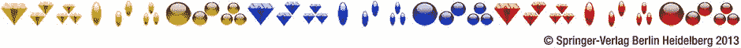
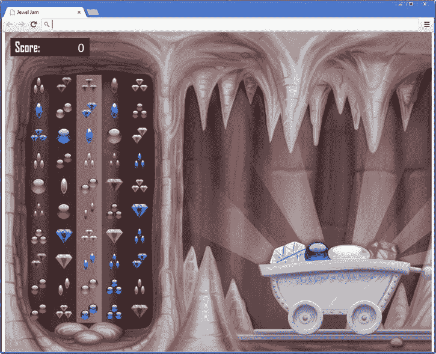

第十五章

游戏编程

这一章研究了宝石果酱游戏的游戏性编程。首先，它谈到了游戏对象之间的互动。然后，它介绍了几个新的游戏对象，在游戏中使用。最后，你处理这个游戏的主要游戏元素:找到珠宝的组合并正确处理它们。

游戏对象之间的交互

本节着眼于游戏对象如何相互通信。在游戏对象可以做到这一点之前，你首先需要一种方法让这些对象*找到彼此的*。

前一章将游戏世界描述为游戏对象的层级结构。这些游戏对象中的每一个都可以处理用户输入，并且可以表现出某种行为。例如，宝石网格游戏对象检查玩家是否拖动了网格中的一行，并在需要时执行行移动操作。这是一个典型的例子，说明游戏中的游戏对象是如何设计的。它们处理来自玩家的输入，并对其作出反应，这反过来会影响其他游戏对象(例如珠宝在网格上的位置)。在 Painter 游戏中，您看到球和颜料罐以类似的方式相互作用。在更复杂的游戏中，许多不同的游戏对象相互交互。

挑战在于，这些游戏对象是如何找到彼此的？在画家游戏的情况下，`PainterGameWorld`类 具有引用每个游戏对象的成员变量。这不是一个很好的解决方案，因为它让游戏世界完全依赖于它所在的游戏。在 Jewel Jam 游戏世界中，您只有一个`GameObject`实例的层次结构，这使得查找特定的游戏对象变得更加复杂。

你应该以这样一种方式设计你的类，使得它们可以在许多不同的游戏中使用。在游戏《宝石果酱》的上一个版本中，游戏对象之间的交互非常少，所以你可以通过简单的设计逃脱。这已经行不通了。例如，宝石网格需要能够找到代表玩家分数的对象，以便当玩家组合出有效的宝石时，它可以更新这个分数。网格还需要找到移动的宝石车，以便在需要时可以将宝石车移回左侧。要做到这些，你需要一种方法在游戏世界中找到对象，而不使游戏世界依赖于特定于游戏的代码。

给游戏对象分配标识符

当你想找到游戏对象时，给它们分配*标识符*会很有帮助。 不是所有的对象都需要标识符；一般来说，只有那些与其他物体相互作用的物体才会这样。您可以使用之前用于图层的相同类型的标识符。例如，在这里您可以看到一些对宝石果酱游戏有用的标识符:

```js
ID.title = 1;
ID.help_frame = 2;
ID.jewel_cart = 3;
ID.grid = 4;
ID.game_over = 5;
ID.score = 6;
ID.double_timer = 7;
ID.triple_timer = 8;

```

你需要做的就是扩展游戏对象类，这样你就可以给游戏对象分配一个标识符。先说`GameObject`类。在这个类中，您添加了一个成员变量来存储一个标识符，并向`GameObject`构造函数方法添加了一个参数，这样您就可以在创建对象时将 ID 与对象相关联:

```js
function GameObject(layer, id) {
    this.layer = typeof layer !== 'undefined' ? layer : 0;
    this.id = typeof id !== 'undefined' ? id : 0;
    this.parent = null;
    this.position = Vector2.zero;
    this.velocity = Vector2.zero;
    this._visible = true;
}

```

因为不是所有的对象都需要一个 ID(或一个层)，所以如果没有定义参数，就给这些变量分配默认值。

因为所有游戏对象都继承自`GameObject`类，所以它们也有一个标识符。在许多情况下，您必须更新`GameObject`子类的构造函数，以便它们将标识符传递给基类(`GameObject`)的构造函数。例如，更新后的`SpriteGameObject`构造函数如下:

```js
function SpriteGameObject(sprite, layer, id) {
    GameObject.call(this, layer, id);
    this.sprite = sprite;
    this.origin = Vector2.zero;
}

```

大多数`GameObject`子类都是这样更新的。看一下`JewelJam4`的例子，看看所有不同的游戏对象类型是如何做到这一点的。

寻找游戏对象

尽管给游戏对象分配标识符可能是个好主意，但只有当你也提供一种方法让*找到*这些游戏对象时，它才是有用的。 为了了解如何做到这一点，让我们向`GameObjectList`类添加一个方法`find`，该方法查看游戏对象列表，以查看它们中是否有任何一个具有所请求的标识符。如果找到游戏对象，则该方法返回对该游戏对象的引用；否则，它返回`null`。该方法的标题如下:

```js
GameObjectList.prototype.find = function (id)

```

现在你唯一要做的就是编写*算法*，它检查列表中的游戏对象，如果列表中包含匹配标识符的游戏对象，就返回它。您可以使用一条`for`指令来做这件事(尽管您也可以使用一条`while`指令来做同样的事情)。在`for`循环中，检查当前游戏对象的标识符是否与作为参数传递给方法的请求标识符相匹配。如果是，则返回该对象。如果你没有从`for`循环体中的方法返回，这意味着列表中没有一个游戏对象有请求的 ID，所以方法返回`null`。然后，`find`方法的主体变成了

```js
for (var i = 0, l = this._gameObjects.length; i < l; i++) {
    if (this._gameObjects[i].id === id)
        return this._gameObjects[i];
}
return null;

```

注意，一旦执行了`return`指令，就立即从该方法返回。这意味着剩余的游戏对象不再被检查。此外，你不检查游戏对象是否有重复的 id。如果多个游戏对象具有相同的 ID，这个方法返回它找到的第一个。

递归

有一件事你没有考虑到。当然，列表中的一个或多个游戏对象本身也可能是类型`GameObjectList`。如果该游戏对象包含一个具有您所寻找的 ID 的游戏对象，那么上一节中的方法将找不到它，因为该方法只检查存储在当前对象列表中的游戏对象(`this`)。你如何解决这个问题？首先你需要检查一个对象是否是某种类型的实例。为此，您可以使用`instanceof`关键字:

```js
if (someObject instanceof GameObjectList)
   // do something

```

在`instanceof`关键字之前，你把要检查的对象；在关键字后面输入。如果对象是给定的类型，那么表达式产生`true`。如果没有，结果就是`false`。因此，您可以像前面的例子一样在`if`指令中使用它。如果你知道这个对象属于`GameObjectList`类型，你可以试着在这个对象代表的游戏对象列表中找到你要找的游戏对象。下面的代码正是这样做的:

```js
for (var i = 0, l = this._gameObjects.length; i < l; ++i) {
    if (this._gameObjects[i].id === id)
        return this._gameObjects[i];
    if (this._gameObjects[i] instanceof GameObjectList) {
        var list = this._gameObjects[i]._gameObjects;
        for (var i2 = 0, l2 = list.length; i2 < l2; ++i) {
            if (list[i2].id === id)
                return list[i2];
        }
    }
}
return null;

```

因此，现在您检查每个游戏对象，以确定它是否属于类型`GameObjectList`。如果是这样，就遍历列表中的 _ `gameObjects`变量，在其中寻找游戏对象。

你现在完成了吗？不完全是。如果`list`中的一个游戏对象是`GameObjectList`类型的怎么办？这意味着你必须添加另一层来检查*列表中的某个游戏对象是否可能对应于你正在寻找的 ID。但是其中一个游戏对象也可以是`GameObjectList`类型。显然，这种方法并不理想。但是，您可以做些事情来避免这种无限搜索问题。为什么不再用`find`的方法？请看下面的代码:*

```js
for (var i = 0, l = this._gameObjects.length; i < l; ++i) {
    if (this._gameObjects[i].id === id)
        return this._gameObjects[i];
    if (this._gameObjects[i] instanceof GameObjectList) {
        var obj = this._gameObjects[i].find(id);
        if (obj !== null)
            return obj;
    }
}
return null;

```

这段代码看起来可能有点奇怪。你实际上是在调用你正在编写的方法。为什么会这样？想想当对一个对象调用`find`方法时会发生什么。如果你正在寻找的游戏对象在列表中，那么这个方法返回那个对象。此外，该方法对同样属于`GameObjectList`类型的每个对象调用`find`方法。如果这些方法调用都没有找到对象，方法返回`null`。并且每个`find`方法调用也调用属于它的类型为`GameObjectList`的对象上的`find`方法。这个`find`方法调用的大树在你到达游戏对象层级的底部时结束。换句话说，在某个时候不再有列表:只有游戏对象。然后所有的`find`方法调用的结果(每个调用要么是`null`要么是一个游戏对象)通过返回值被发送回来。最后，该方法的第一个调用者获取对象(如果在树中的某个地方找到了它)，或者如果没有找到携带所请求 ID 的对象，则获取`null`。这种搜索策略也被称为*深度优先*，因为您在检查列表中的其余对象之前调用子对象上的`find`方法。

当一个方法调用自己时，这被称为*递归*。递归是一个非常强大的工具，因为它允许你执行这些复杂的搜索算法，而不必写很多代码。然而，要注意递归，因为你可能会写一个无限调用自己的方法。假设您想使用递归计算两个(正)整数的乘积，方法是将它们相加:

```js
function product(a, b) {
    return b + product(a-1, b);
}

```

这段代码没有检查如果`a`等于 0，乘积是否应该返回 0。因此，该方法无限地调用自己，导致一个无限循环，类似于如果您忘记在`while`指令中递增计数器会发生的情况。当然，这种递归方法的正确版本是

```js
function product(a, b) {
    if (a === 0)
        return 0;
    else
        return b + product(a-1, b);
}

```

关键是递归方法应该在某个地方有一个*终止条件*，这样在某些情况下，方法不会调用自己，而是做其他事情。在这个例子中，终止条件是`a === 0`。如果发生这种情况，该方法不会调用自身，而是返回 0(这是正确的，因为任何数字乘以 0 都会得到 0)。

进入游戏世界

虽然您可以在一个`GameObjectList`实例中寻找一个具有特定 ID 的游戏对象，但是您需要访问到代表游戏世界的对象。引用该对象的变量是`Game`类的成员变量。所以，每当你想寻找一个特定的对象时，你可以在`Game.gameWorld`对象上调用`find`方法，因为该对象也继承自`GameObjectList`。虽然你在画家和宝石果酱游戏中都只有一个单一的游戏世界，但对于更复杂的游戏来说肯定不是这样。游戏中的每个关卡都可以是一个独立的游戏世界。甚至一个关卡可以包含几个不同的游戏世界。所以，明智的做法是做好准备，这样你写的类在这些情况下也会有用。

为了做到这一点，您依赖于编码到泛型`GameObject`类中的父子关系。对于每一个游戏对象，你可以假设如果你到达了游戏对象所属的层级的根，这个根就是那个特定游戏对象的游戏世界。因此，您可以通过遍历父列表来找到根，从而轻松检索游戏世界。您将一个名为`root`的属性添加到`GameObject`类中来完成这项工作，它依赖于递归:

```js
Object.defineProperty(GameObject.prototype, "root",
    {
        get: function () {
            if (this.parent === null)
                return this;
            else
                return this.parent.root;
        }
    });

```

属性中的代码非常简单。如果你的当前父级不是`null`(意味着你有一个父级)，你向那个父级请求根游戏对象。如果父对象是`null`，这意味着你当前操作的游戏对象是层次的根，这意味着它是游戏世界。在这种情况下，您返回当前对象。

既然您已经为游戏对象创建了一种找到彼此的简单方法，接下来的部分将介绍宝石果酱游戏所需的几种游戏对象类型。

珠宝班

为了让`Jewel`类更好地为游戏做准备，你需要改变这个类中的一些东西。最大的变化是，你想引入更多种类的珠宝，这个对象可以代表。基本上，有三种变化:宝石的形状可以变化，宝石的颜色可以变化，宝石的数量可以变化(一个、两个或三个宝石)。所以，宝石可以有三种属性(形状、颜色和数量)。同样，对于每个属性，有三种变化:三种不同的形状、三种不同的颜色和三个不同的数字。总的来说，这意味着有 3 × 3 × 3 = 27 种可能的宝石配置(参见[图 15-1](#Fig1) )。



[图 15-1](#_Fig1) 。宝石果酱游戏 中使用的不同宝石类型概述

不用创建 27 个不同的图像文件，您可以将所有不同的种类存储在一个图像文件中(同样，参见[图 15-1](#Fig1) 中的图像)。在单个图像文件中存储多个图像有几个好处。首先，它为艺术家提供了一种将相关图像组合在一个文件中的方法；其次，就内存使用和加载速度而言，加载单个文件并绘制该文件的一部分比单独加载所有图像要高效得多。

在这种情况下，图像文件中珠宝的顺序很重要，您将在后面看到。当您创建一个`Jewel`实例时，您通过在成员变量`variation`中存储一个 0 到 26 之间的随机数(覆盖 27 个品种)来随机选择要表示的宝石。因此，`Jewel`构造者变成了

```js
function Jewel(layer, id) {
    SpriteGameObject.call(this, sprites.jewels, layer, id);
    this.variation = Math.floor(Math.random() * 27);
}

```

因为`Jewel`类知道它将使用哪个 sprite，所以您将 sprite ( `sprites.jewels`)直接传递给基类构造函数。

现在唯一需要修改的就是`draw`方法。你不想画整个精灵，而只是它的一部分:包含这个对象代表的宝石的部分。为此，首先必须扩展`Canvas2D.drawImage`方法，因为它需要能够只绘制精灵的一部分。幸运的是，这很容易做到。HTML5 canvas 元素的`drawImage`方法有四个参数 ，用它们可以指定想要绘制的 sprite 部分。要指出你想画精灵的哪一部分，你可以使用一个`Rectangle`对象。`Canvas2D.drawImage`方法的头如下:

```js
Canvas2D_Singleton.prototype.drawImage = function (sprite, position, rotation,
    scale, origin, sourceRect)

```

该方法的最后一个参数是矩形，它定义了应该绘制源图像的哪一部分。在方法体中，使用这个`Rectangle`对象的成员变量如下:

```js
this._canvasContext.drawImage(sprite, sourceRect.x, sourceRect.y,
    sourceRect.width, sourceRect.height, -origin.x * scale, -origin.y * scale,
    sourceRect.width * scale, sourceRect.height * scale);

```

第二到第五个参数表示应该绘制图像的哪一部分。最后两个参数表示图像在画布上投影的宽度和高度。您将矩形的宽度和高度乘以缩放比例，以便用户可以根据需要缩放所绘制的图像。因为您正在缩放精灵，所以您还需要缩放原点，这发生在第三行代码中。

在`Jewel`类的`draw`方法中，您需要根据`variation`成员变量的值来确定您想要绘制宝石精灵的哪一部分:

```js
var imagePart = new Rectangle(this.variation * this.height, 0, this.height,
    this.height);

```

这里你要画的线段是一个正方形，它的宽度和高度与原始精灵的高度相同。矩形的位置(由`Rectangle`构造函数中的前两个参数给出)通过将 sprite 的高度乘以变化指数来计算。因此，变化指数越高，矩形越向右移动。最后，调用`Canvas2D.drawImage`方法在屏幕上绘制宝石。下面是完整的`draw`方法:

```js
Jewel.prototype.draw = function () {
    if (!this.visible)
        return;
    var imagePart = new Rectangle(this.variation * this.height, 0,
        this.height, this.height);
    Canvas2D.drawImage(this.sprite, this.worldPosition, 0, 1, this.origin,
        imagePart);
};

```

保持当前分数

让这个游戏变得更有趣的下一步是添加一些游戏对象，这些对象与游戏的玩法以及奖励如何给予玩家有关。在这个游戏中，你将给予玩家的奖励表示为点数:分数。玩家每找到一个有效的珠宝组合，就获得 10 分。这个当前分数应该存储在一个变量或对象中。同样，分数应该写在屏幕上，这样玩家就知道他们得了多少分。

现在，您看到了另一个优点，即不需要特别假设每个游戏对象都由一个精灵来表示。游戏对象使用*字体*在屏幕上显示自己。为了使这个更加通用，首先引入一个名为`Label` 的类，它只是在屏幕的某个位置写一些文本。这个类非常类似于`SpriteGameObject`类，除了你在屏幕上绘制文本而不是精灵。为此，您需要存储要书写的文本和使用的字体。您还可以存储其他文本属性，例如文本的对齐方式和字体大小。下面是`Label`的构造器:

```js
function Label(fontname, fontsize, layer, id) {
    GameObject.call(this, layer, id);

    this.color = Color.black;
    this.origin = Vector2.zero;
    this._fontname = typeof fontname !== 'undefined' ?
        fontname : "Courier New";
    this._fontsize = typeof fontsize !== 'undefined' ? fontsize : "20px";
    this._contents = "";
    this._align = "left";
    this._size = Vector2.zero;
}

```

您在构造函数中赋值的最后一个成员变量是`_size`。了解文本的大小(以像素为单位的高度和宽度)对于在正确的位置绘制文本非常有用。因为只有在知道文本是什么的情况下才能计算出文本的大小，所以最初将这个值设置为`Vector2.zero`。

你如何计算文字的大小？在 HTML 中没有一种简单的方法可以做到这一点。这段代码使用了一个简单的技巧:动态地将文本添加到 HTML 页面，在绘制时计算它的大小，然后再次移除它。下面是为您完成这项工作的函数:

```js
function calculateTextSize(fontname, fontsize, text) {
    var div = document.createElement("div");
    div.style.position = "absolute";
    div.style.left = -1000;
    div.style.top = -1000;
    document.body.appendChild(div);
    text = typeof text !== 'undefined' ? text : "M";
    div.style.fontSize = "" + fontsize;
    div.style.fontFamily = fontname;
    div.innerHTML = text;
    var size = new Vector2(div.offsetWidth, div.offsetHeight);
    document.body.removeChild(div);
    return size;
}

```

首先创建一个`div`元素，在其中放置文本。您将元素的位置设置为(-1000，1000)，以便将其绘制在屏幕之外。放置文本并计算其大小，然后存储在一个`Vector2`对象中。该对象作为该函数的结果返回。虽然这不是解决问题的好方法，但是它很容易做到，而且效果很好。当你编程时，有时这些快速而肮脏的方法是可以接受的，但是要小心不要总是使用它们。在这种情况下，您别无选择，因为在 HTML 中没有替代方法。

在`Label`类中，当文本内容被设置时，你计算文本的大小。这是在`text`属性中完成的:

```js
Object.defineProperty(Label.prototype, "text",
    {
        get: function () {
            return this._contents;
        },
        set: function (value) {
            this._contents = value;
            this._size = calculateTextSize(this._fontname, this._fontsize,
                value);
        }
    });

```

为了在屏幕上绘制文本，`Label`类还需要一个`draw`方法。在屏幕上绘制文本是通过调用`Canvas2D.drawText`方法完成的。绘制文本时使用文本标签的*世界位置*，这样基于文本的游戏对象也可以成为层次的一部分。下面是完整的`draw`方法:

```js
Label.prototype.draw = function () {
    if (!this.visible)
        return;
    Canvas2D.drawText(this._contents, this.worldPosition, this.origin,
        this.color, this._align, this._fontname, this._fontsize);
};

```

现在您定义了一个继承自`Label`类的`ScoreGameObject`类。分数由文本内容表示。好的一点是 JavaScript 在画图的时候会自动把一个整数转换成文本。因此，您只需将文本设置为 0:

```js
function ScoreGameObject(fontName, fontSize, layer, id) {
    Label.call(this, fontName, fontSize, layer, id);
    this.text = 0;
    this._align = "right";
}
ScoreGameObject.prototype = Object.create(Label.prototype);

```

您还添加了一个`score`属性，允许您检索或修改当前分数:

```js
Object.defineProperty(ScoreGameObject.prototype, "score",
    {
        get: function () {
            return this._contents;
        },
        set: function (value) {
            if (value >=0)
                this.text = value;
        }
    });

```

最后，你添加一个`reset`方法，这样当游戏结束时，你就可以调用这个方法将分数重置为零:

```js
ScoreGameObject.prototype.reset = function () {
    this.text = 0;
};

```

现在您已经有了这个类，您可以简单地创建它的一个实例并将其添加到游戏世界中。将这些指令放在`JewelJamGameWorld`类中，并添加一个框架覆盖图，您可以在上面绘制当前的分数。这些指令完成了所有工作:

```js
var scoreFrame = new SpriteGameObject(sprites.frame_score, ID.layer_overlays);
scoreFrame.position = new Vector2(20, 20);
this.add(scoreFrame);

var score = new ScoreGameObject("Segoe UI Mono", "40px", ID.layer_overlays_1,
    ID.score);
score.position = new Vector2(270, 35);
score.color = Color.white;
this.add(score);

```

您将分数游戏对象分配给层`ID.layer_overlays`，因此它被绘制在背景和分数框的顶部。您还可以为框架和乐谱选择适当的位置。最后，您为`score`游戏对象分配一个 ID `ID.score`，以便其他对象可以在需要时检索它。

一辆移动的珠宝车

为了让游戏更刺激，你可以给玩家增加一种压力感。在珠宝果酱游戏中，这是通过绘制一辆缓慢离开屏幕的珠宝车来完成的。一旦宝石车在屏幕之外，游戏就结束了。每当玩家找到一个正确的珠宝组合时，珠宝车就会向后移动一点。

珠宝车出现在`JewelCart`类中。你在里面定义了一些东西。首先，您定义当玩家找到正确的组合时，宝石车应该向后移动多少。这存储在`push`成员变量中。您还需要设置一个最小的 *x* 位置，这样宝石车就不会被拖过游戏场地。你可以在`minxpos`变量中这样做。你添加一个`pushCart`方法，当玩家找到正确的宝石组合时可以调用。因为这个类已经继承了`SpriteGameObject`的大部分特性，所以这个类相当小。请看一下`JewelJam4`的例子，看看这个类的代码。

将该类的一个实例添加到游戏世界，如下所示:

```js
var jewelCart = new JewelCart(sprites.jewelcart, ID.layer_objects, ID.jewel_cart);
jewelCart.position = new Vector2(410, 230);
jewelCart.minxpos = 410;
this.add(jewelCart);

```

jewel cart 对象也有一个 ID，这样以后需要推送时就可以找到它。您还可以将其位置和最小 *x* 位置设置为适当的值。如果您查看`JewelCart.js`文件，您会看到您给购物车分配了一个正的*x*-速度。因为`JewelCart`是`SpriteGameObject`的子类，而后者又是`GameObject`的子类，`update`方法根据它的速度更新购物车的位置(假设这个方法是从其他地方调用的)。图 15-2 显示了带有新游戏对象(珠宝、分数和珠宝车)的游戏截图。



[图 15-2](#_Fig2) 。JewelJam4 示例的屏幕截图

处理珠宝组合

每当玩家通过拖动行在中间一列构建了一个有效的组合时，游戏检查该组合是否有效。如果是这样，游戏会增加分数，将珠宝车推回，从格子中移除珠宝组合，并添加新的珠宝。`JewelGrid`类有一个处理行拖动的`handleInput`方法。在该类的`update`方法中，你需要确定玩家是否做出了有效的珠宝组合。

查找有效组合

在`update`方法中，您需要检查中间一列中所有三颗相邻宝石的组合，看它们是否形成有效的组合。为了帮助实现这一点，您添加了一个方法`isValidCombination`，它有如下的头:

```js
JewelGrid.prototype.isValidCombination = function (a, b, c)

```

这个方法接受三个`Jewel`对象，它返回一个布尔值，表明这三个宝石是否形成一个有效的组合。所以现在的问题是，你如何评估三个珠宝是否形成有效的组合？回想一下，有效的组合意味着每个属性(颜色、形状、数量)，所有三个珠宝应该具有相同或不同的价值。为了让事情变得简单一点，让我们用从 0 到 2 的三个整数对每个宝石进行编码。假设第一个整数代表颜色(黄色、蓝色或红色)，第二个整数代表形状(菱形、椭圆形或圆形)，最后一个整数代表珠宝的数量(一个、两个或三个)。例如，使用这种编码方案，您可以将蓝色椭圆形单颗宝石编码为(1，0，0)。黄色圆形单宝石定义为(0，2，0)，红色椭圆形三宝石定义为(2，1，2)。

**注意**人类可能会试图以不同的方式找到有效的珠宝组合，只需简单地查看刚刚移动的那一行以及上面和下面的那一行。计算机可以在主循环中运行定期检查，以检查中间一列中三个的所有组合，即使玩家没有碰它，就像这里所做的那样。计算机可以做到这一点，所以程序员这样写；但是如果你是编程新手，你可能需要一段时间来适应这种思维方式。

现在让我们看看您是否可以使用这种编码方案来找到三个宝石的有效组合(让我们称它们为宝石 A、B 和 C)。对于每一颗宝石，你必须比较颜色、形状和数量。这些属性中的每一个要么对所有的珠宝都相同，要么对所有的珠宝都不同。例如，如果 A 的颜色编码值为 0，B 的值为 0，C 的值也为 0，则该条件适用于该颜色，因为所有三种宝石都具有相同的颜色(黄色)。如果珠宝都是蓝色(A 色= 1，B 色= 1，C 色= 1)或红色(A 色= 2，B 色= 2，C 色= 2)，情况也是如此。最后，如果所有颜色都不相同，则条件成立:A 色、B 色和 C 色的顺序是 0、1 和 2。如果你观察这些不同组合的总和，你会看到一个有趣的性质:0 + 0 + 0 = 0，1 + 1 + 1 = 3，2 + 2 + 2 = 6，0 + 1 + 2 = 3。换句话说:*总和能被三*整除。此外，任何其他可能的值组合都是*而不是*能被 3 整除。所以你可以说，对于每个属性(颜色、形状、数量)，*每个宝石的编码值之和一定能被三整除。*如果这个总和由变量`sum`表示，那么在 JavaScript 代码中，条件`sum % 3 === 0`必须成立！所以，如果你计算每个财产的总和，并确定它能被三整除，你就找到了三个珠宝的有效组合。如您所见，有时基础数学对于编写高效代码非常有用。在这种情况下，另一种选择是编写大量处理不同情况的`if`指令，这肯定会导致代码变慢。

剩下唯一要做的就是从每颗宝石上检索编码。到目前为止，您只有一个数字:精灵中宝石的偏移量。这是一个从 0 到 26 的数字。如果你再看一遍[图 15-1](#Fig1) ，你会看到前面九颗宝石是黄色的，后面九颗是蓝色的，最后九颗是红色的。因此，如果将`variation`变量除以 9，就会得到一个介于 0 和 2 之间的值，该值代表颜色！除法的其余部分是一个从 0 到 8 的数。如果你把这个数除以 3，你会得到一个从 0 到 2 的数来代表这个形状。除法的其余部分是一个从 0 到 2 的数字，它代表珠宝的数量。通过使用这个概念，您可以构造一个算法来计算每个属性的这些值，并检查这些属性的总和是否能被 3 整除。请看下面的算法:

```js
var curra = a.variation;
var currb = b.variation;
var currc = c.variation;
var divider = 9;

for (var i = 0; i < 3; i += 1) {
    if ((Math.floor(curra / divider) + Math.floor(currb / divider)
         + Math.floor(currc / divider)) % 3 !== 0)
        return false;
    curra = curra % divider;
    currb = currb % divider;
    currc = currc % divider;
    divider = Math.floor(divider / 3);
}
return true;

```

首先，使用每个宝石的`variation`成员变量，检索代表您正在处理的宝石的值。然后定义一个等于 9 的`divider`数(首先除以 9)。接下来定义一条运行三次的`for`指令。在`for`指令的主体中，您设置了一个条件，即三个变化指数的总和除以`divider`应该能被 3 整除。如果不是这种情况，则返回`false`，因为组合条件对于其中一个属性不成立。将除数的剩余部分分配给包含当前变化指数的每个变量。然后，将除数除以 3。如果您退出`for`指令，这意味着在所有情况下`if`指令中的条件都是`true`，意味着您找到了一个有效的组合。因为找到了有效的组合，所以返回值`true`。

从网格中移除宝石

在`update`方法中，您现在可以使用`isValidCombination`方法来确定是否存在有效的组合。为此，您使用一条`while`指令来评估中间一列中三颗宝石的所有序列:

```js
var middleCol = Math.floor(this._columns / 2);
var i = 0;
while (i < this._rows - 2) {
    if (this.isValidCombination(this.at(middleCol, i),
        this.at(middleCol, i + 1), this.at(middleCol, i + 2))) {
        // do something
    }
    else
        i++;
}

```

当您找到一个有效的组合时，您需要从网格中移除这些宝石，并插入新的宝石。为此，您定义了一个名为`removeJewel`的方法，它从网格中移除一个宝石并插入一个新的宝石。为了创造一个漂亮的“落下”动作，你把这些宝石放在格子上方的不同位置。您将期望的 *y* 位置作为参数传递给`removeJewel`方法 ，这样它就知道新宝石应该位于何处。完整的方法就变成了

```js
JewelGrid.prototype.removeJewel = function (x, y, newYPosition) {
    for (var row = y; row > 0; row -= 1)
        this._gameObjects[row * this._columns + x] =
            this._gameObjects[(row - 1) * this._columns + x];
    var jewel = new Jewel();
    this.addAt(jewel, x, 0);
    jewel.position.y = newYPosition;
};

```

在`update`方法中，您调用`removeJewel`三次来移除形成有效组合的三个宝石:

```js
this.removeJewel(middleCol, i, -this.cellHeight);
this.removeJewel(middleCol, i + 1, -this.cellHeight * 2);
this.removeJewel(middleCol, i + 2, -this.cellHeight * 3);

```

随着网格的更新，宝石对象和它们在网格上的目标位置之间的位置差异导致了期望的下落效果。最后，因为引入新的宝石可能意味着有三个宝石的新的有效组合，所以使用指令`i = 0;`将计数器`i`重置为零。

更新其他游戏对象

现在网格已经更新了，您可以将注意力集中在其他需要更新的游戏对象上。第一个需要更新的游戏对象是`score`，因为如果你处理一个有效的组合，分数应该会增加。您使用`find`方法来检索 score 对象，并为分数增加 10 分，如下所示:

```js
var score = this.root.find(ID.score);
score.score += 10;

```

此外，因为您找到了有效的组合，所以您推回了珠宝车:

```js
var jewelCart = this.root.find(ID.jewel_cart);
jewelCart.pushCart();

```

关于完整的程序，参见本章的`JewelJam4`示例。

你学到了什么

在本章中，您学习了:

*   如何组织游戏对象并给它们分配 id
*   如何编程游戏性方面和游戏对象之间的交互
*   如何检测宝石果酱游戏中有效的宝石组合