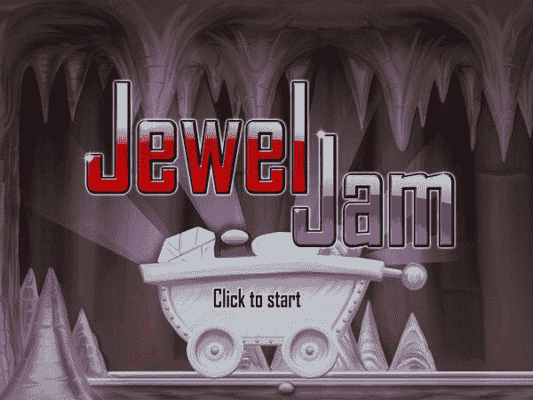
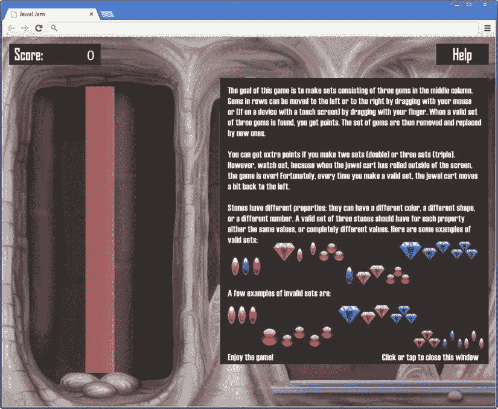
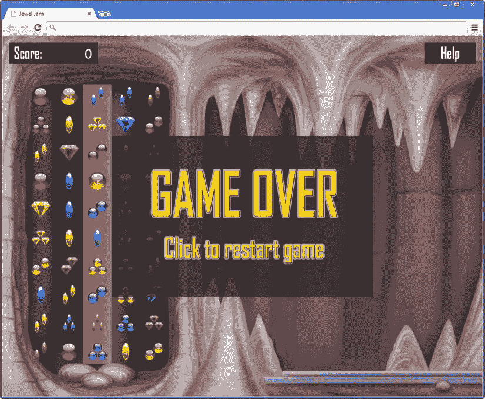

第十六章

游戏状态

在前一章中，你编写了宝石果酱游戏的主要游戏元素。然而，这场游戏还远未结束。例如，当珠宝车从屏幕上消失时，什么也没有发生。同样，当你启动程序时，游戏立即开始，没有任何警告。仍然需要的是一种在游戏中加入菜单和覆盖的方法，这样玩家可以改变设置、获得帮助或开始玩游戏。例如，当玩家在一个菜单屏幕中时，与游戏的交互类型与玩家在解决一个关卡或试图尽可能长时间生存时非常不同。在编写游戏程序时，你必须考虑如何将这些不同的*游戏状态*融合在一起，并在它们之间切换。

现代游戏有许多不同的游戏状态，比如菜单、地图、清单、闪屏、介绍电影等等。这一章展示了如何给宝石果酱游戏添加不同的游戏状态。因为这个游戏还不是很复杂，所以您可以对当前的类进行一些简单的扩展。然而，如果你想构建一个商业游戏，游戏状态管理需要被恰当地处理。在第 20 章中，这本书讨论了一个使用类的软件设计，这些类能够以一种非常好的通用方式处理游戏状态。

添加标题屏幕

为了让游戏更加完整，你可以做的第一件事就是添加一个标题画面。标题屏幕允许玩家做好玩游戏的准备，而不是立即进入游戏。您可以扩展`JewelJamGameWorld`类，这样它就可以加载并显示由单个图像组成的标题屏幕。您为此创建了一个`SpriteGameObject`实例，为其分配 ID `ID.title`，并将其添加到游戏世界中:

```js
var titleScreen = new SpriteGameObject(sprites.title, ID.layer_overlays_2,
    ID.title);
this.add(titleScreen);

```

你分配图层`ID.layer_overlays_2`,这样你可以确保标题被绘制在所有东西的上面。但是您必须做一些额外的工作来正确处理输入和更新游戏世界，因为您希望游戏只在标题屏幕不再可见时才开始。你可以通过给`handleInput`方法添加一些指令来区分两种状态:显示标题屏幕的状态和玩游戏的状态:

```js
var titleScreen = this.root.find(ID.title);
if (titleScreen.visible) {
    if (Mouse.left.pressed || Touch.isPressing)
        titleScreen.visible = false;
    return;
}
GameObjectList.prototype.handleInput.call(this, delta);

```

查看`if`指令，你可以看到如果标题屏幕可见，你只有在玩家按下鼠标左键或触摸屏幕时才会做出反应。在这种情况下，您将标题屏幕的可见性标志设置为`false`,这样它就不再被绘制了。在此之后，您从方法返回，因此每当标题屏幕可见时，游戏唯一的反应是玩家按下鼠标左键或触摸屏幕。如果标题屏幕不可见，您可以对游戏世界中的所有游戏对象调用`handleInput`方法:换句话说，当玩家在玩游戏时，游戏会对玩家做出应有的反应。

对于`update`方法，你遵循非常相同的过程，只有当标题不可见时，你才更新游戏世界:

```js
var titleScreen = this.root.find(ID.title);
if (titleScreen.visible)
    return;
GameObjectList.prototype.update.call(this, delta);

```

当玩家开始游戏时，他们现在会在游戏开始前看到一个标题屏幕(见[图 16-1](#Fig1) )。你还没说完。在下一节中，您将添加一个简单的按钮 GUI 元素来显示一个帮助框架。



[图 16-1](#_Fig1) 。珠宝果酱标题屏幕

添加按钮以显示帮助框

本节解释了如何在游戏中添加一个按钮，用来显示帮助框。为此，您需要在程序中添加另一个类`Button`。您继承了`SpriteGameObject`类，并添加了一些简单的行为来检查玩家是否按下了按钮。在`Button`类中，你声明了一个布尔成员变量来指示按钮是否被按下。然后你覆盖`handleInput`方法来检查玩家是否点击了鼠标左键或者触摸了屏幕上的按钮。如果当时鼠标或触摸位置在 sprite 的边界内，您知道玩家已经按下按钮，并且您将成员变量的值设置为`true`。如何检查鼠标位置是否在 sprite 的边界内？通过使用`Rectangle`类。第一步，构建一个包含精灵的`Rectangle`对象。这个矩形的位置应该是精灵的世界位置减去它的原点。矩形的宽度和高度与精灵的宽度和高度相同。为了方便起见，让我们给`SpriteGameObject`添加一个名为`boundingBox`的属性，它会为您计算这个矩形:

```js
Object.defineProperty(SpriteGameObject.prototype, "boundingBox",
    {
        get: function () {
            var leftTop = this.worldPosition.subtractFrom(this.origin);
            return new Rectangle(leftTop.x, leftTop.y, this.width,
                this.height);
        }
    });

```

您必须在这里使用世界位置，因为您想要检查鼠标指针或触摸是否在 sprite 的实际世界位置上。您添加一个简单的方法`contains`到`Rectangle`，它检查一个点是否在矩形内:

```js
Rectangle.prototype.contains = function (v) {
    v = typeof v !== 'undefined' ? v : new Vector2();
    return (v.x >=this.left && v.x <= this.right &&
        v.y >=this.top && v.y <= this.bottom);
};

```

这段代码的第一行检查参数`v`是否已经定义。如果没有，你只需要给它赋一个零矢量。然后检查 *x* 值是否位于矩形的左右两边，以及 *y* 值是否位于上下两边。

您还可以向`Mouse`和`Touch`类添加方法，帮助您轻松解决问题。例如，这是检查玩家是否在给定的矩形内按下了鼠标左键的方法:

```js
Mouse_Singleton.prototype.containsMousePress = function (rect) {
    return this._left.pressed && rect.contains(this._position);
};

```

在`Button`类中，您使用这些方法来确定按钮是否被按下和/或按下。下面是`Button`的`handleInput`方法:

```js
Button.prototype.handleInput = function (delta) {
    var boundingBox = this.boundingBox;
    this.pressed = this.visible && (Touch.containsTouchPress(boundingBox) ||
        Mouse.containsMousePress(boundingBox));
    this.down = this.visible && (Touch.containsTouch(boundingBox) ||
        Mouse.containsMouseDown(boundingBox));
};

```

现在你有了一个按钮类，你可以给游戏世界添加一个帮助按钮(见`JewelJamGameWorld`类):

```js
this.helpButton = new Button(sprites.button_help, ID.layer_overlays);
this.helpButton.position = new Vector2(1268, 20);
this.add(this.helpButton);

```

因为您希望在玩家按下帮助按钮时显示一个帮助框，所以您也向游戏世界添加了一个帮助框。您将它的可见性标志设置为`false`，因此它还不可见:

```js
var helpFrame = new SpriteGameObject(sprites.frame_help, ID.layer_overlays,
    ID.help_frame);
helpFrame.position = new Vector2(636, 120);
helpFrame.visible = false;
this.add(helpFrame);

```

现在你必须确保当玩家按下帮助按钮时，帮助框的可见性被切换。您可以在`JewelJamGameWorld`类的`handleInput`方法中使用下面的`if`指令来实现这一点:

```js
var helpFrame = this.root.find(ID.help_frame);
if (this.helpButton.pressed) {
    helpFrame.visible = !helpFrame.visible;
}

```

请注意，`if`正文中的指令是一个开关。基本上是一种更短的写法。

```js
if (helpFrame.visible)
    helpFrame.visible = false;
else
    helpFrame.visible = true;

```

当帮助框可见时，您希望能够通过按下鼠标左键或触摸屏幕来移除它。所以，最后的`if`指令稍微复杂一些:

```js
var helpFrame = this.root.find(ID.help_frame);
if (this.helpButton.pressed ||
    (helpFrame.visible && (Mouse.left.pressed || Touch.isPressing))) {
    helpFrame.visible = !helpFrame.visible;
}

```

最后，你必须确保游戏在显示帮助框时不会更新。只有当帮助框不可见时，你才可以通过更新游戏对象在`update`方法中做到这一点:

```js
var helpFrame = this.root.find(ID.help_frame);
if (!helpFrame.visible)
    GameObjectList.prototype.update.call(this, delta);

```

还有一件事你必须注意，按下帮助按钮，玩家暂停游戏。如果你一直显示宝石格子，这为玩家提供了一种方法来获得额外的时间来尝试寻找宝石组合。当然，这不是你想要的！幸运的是，在目前的阶级结构中，这是非常容易解决的。将下面两行添加到`update`方法中:

```js
var grid = this.root.find(ID.grid);
grid.visible = !helpFrame.visible;

```

这些行确保无论何时帮助框架可见，网格不可见，反之亦然。[图 16-2](#Fig2) 显示了显示帮助框时的游戏。



[图 16-2](#_Fig2) 。游戏中帮助框显示截图

遮掩

向玩家展示信息的一种非常常见的方式是使用*覆盖图*。覆盖图基本上是图像,可以显示在游戏世界的顶部，以呈现信息或提供用户界面，如菜单、小地图、状态信息等。上一节中介绍的帮助框是覆盖的另一个例子。

覆盖图可以呈现全新的游戏状态(例如“游戏结束”覆盖图)，或者它们可以通过向玩家提供信息来补充游戏世界。例如，许多策略游戏提供关于选择的单位数量、可用资源、正在进行的建造过程、收集的物品等信息。这种覆盖通常总是在屏幕上，它们一起被称为*平视显示器* (HUD)。 Jewel Jam 有一个非常基本的 HUD:它由一个显示当前分数的框架和一个帮助按钮组成，用户可以按下该按钮来查看带有帮助信息的框架。

在 HUD 旁边，当珠宝车移出屏幕时，您想要显示一个“游戏结束”覆盖图。您将这个覆盖图添加到游戏世界，并将其可见性设置为`false`:

```js
var gameOver = new SpriteGameObject(sprites.gameover, ID.layer_overlays_1,
    ID.game_over);
gameOver.visible = false;
gameOver.position = gameOver.screenCenter;
this.add(gameOver);

```

您希望将覆盖图很好地放置在屏幕的中间。因为这是您可能会经常使用的东西，所以让我们给`SpriteGameObject`添加一些有用的属性来处理它。首先，如果您想在屏幕中央绘制 sprite，可以添加一个计算 sprite 位置的属性。一旦你知道了屏幕的大小，精灵的大小和它的来源，这就相对容易计算了。以下是完整的属性:

```js
Object.defineProperty(SpriteGameObject.prototype, "screenCenter",
    {
        get: function () {
           return Game.size.subtract(this.size).divideBy(2).addTo(this.origin);
        }
    });

```

特别是在 HUD 元素的情况下，你有时不想在中间显示一个 sprite 相反，例如，您可能希望它位于屏幕底部的中间。为了适应这种情况，您可以将以下两个属性添加到`SpriteGameObject` :

```js
Object.defineProperty(SpriteGameObject.prototype, "screenCenterX",
    {
        get: function () {
            return (Game.size.x - this.width) / 2 + this.origin.x;
        }
    });
Object.defineProperty(SpriteGameObject.prototype, "screenCenterY",
    {
        get: function () {
            return (Game.size.y - this.height) / 2 + this.origin.y;
        }
    });

```

现在让我们扩展`JewelJamGameWorld`以在需要时显示“游戏结束”覆盖图。首先，添加一个方法来检查宝石车是否在屏幕之外:

```js
JewelJamGameWorld.prototype.gameOver = function () {
    var jewelCart = this.root.find(ID.jewel_cart);
    return jewelCart.position.x > Game.size.x;
};

```

然后你可以在`handleInput`方法中使用这个方法，这样玩家就可以按下鼠标左键或者触摸屏幕来重新开始游戏:

```js
if (this.gameOver()) {
    if (Mouse.left.pressed || Touch.isPressing)
        this.reset();
    return;
}

```

您覆盖了`reset`方法，因为您需要在游戏重启时做一点额外的工作。值得注意的是，你必须将一些覆盖图的可见性设置为`false`，这样当游戏重启时它们就不会显示在屏幕上。除此之外，您只需从基类中调用`reset`方法，这样游戏世界中的所有游戏对象都会被重置:

```js
JewelJamGameWorld.prototype.reset = function () {
    GameObjectList.prototype.reset.call(this);
    var gameOver = this.root.find(ID.game_over);
    gameOver.visible = false;
    var titleScreen = this.root.find(ID.title);
    titleScreen.visible = false;
    var helpFrame = this.root.find(ID.help_frame);
    helpFrame.visible = false;
};

```

现在只剩下一件事要做了。如果游戏结束，您必须将“游戏结束”覆盖的可见性设置为`true`。你在`JewelJamGameWorld`的`update`方法中这样做:

```js
var gameOver = this.root.find(ID.game_over);

if (this.gameOver()) {
    gameOver.visible = true;
}

```

[图 16-3](#Fig3) 显示了“游戏结束”状态的截图。



[图 16-3](#_Fig3) 。太糟糕了…

设计游戏

虽然在游戏开发团队中，程序员通常不负责游戏的设计，但是对这个过程有一个基本的了解仍然是非常有用的。程序员必须将游戏设计转化为代码，并且必须能够向设计师建议什么可行，什么难以实现。为了合作成功，每个人都必须说同一种语言。

设计一个游戏主要包括定义游戏机制、游戏设置和游戏关卡。游戏机制包括游戏规则、玩家控制游戏的方式、目标和挑战以及奖励结构。心理学和教育科学在这里扮演着重要的角色。他们帮助你理解玩家如何进入状态(他们完全投入到游戏中的情绪)；目标、挑战和奖励如何相互支持；以及如何改变和适应游戏的难度。

游戏的设定涉及故事、人物和游戏发生的虚拟世界。一个好的故事对玩家来说是一个强大的动力，在玩的时候发现这个故事是一个非常令人满意的任务。角色需要引起玩家的共鸣，从而赋予必须执行的任务以意义。游戏世界增强了这些方面，并使游戏适应特定的人口统计。

关卡设计有时由特殊的关卡设计师来完成，但在较小的团队中，这通常是游戏设计师的责任。精心的关卡设计会带来良好的学习曲线。它让玩家不断受到挑战和激励，应该会带来惊喜。

已经有很多关于游戏设计的书，强烈建议你去读一些。你也可以在像`www.gamasutra.com`这样的网站上找到很多关于游戏开发各个方面的信息。最后，本书[第 30 章](30.html)和[第 31 章](31.html)讲的是游戏制作和出版。

你学到了什么

在本章中，您学习了:

*   如何添加一个 HUD 和覆盖到游戏中
*   如何定义一个显示框架的简单按钮
*   如何处理一些不同的游戏状态，比如标题屏幕和“游戏结束”状态