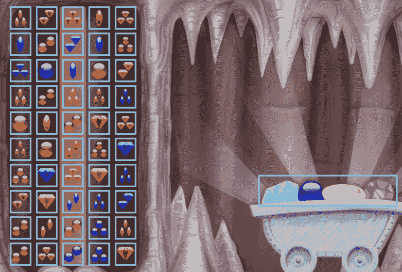
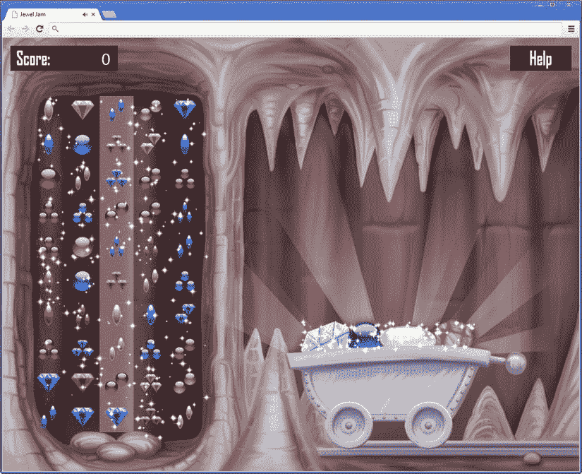

# 十七、完成宝石果酱游戏

在这一章中，你将完成宝石果酱游戏。作为第一步，当出现三个宝石的多个组合时，你给玩家额外的分数。第二，你通过在游戏中显示宝石上的闪光来增加一个漂亮的视觉效果。最后，你添加声音和音乐。

多个组合的额外积分

当出现多个组合时，您希望给玩家额外的分数。每当玩家组合三颗宝石时，新的随机宝石会被添加到游戏场上。这些宝石可以形成新的组合。此外，宝石落下还可以形成新的组合。在有两个或三个组合的情况下，你奖励玩家额外的分数。为了做到这一点，你必须计算一个玩家找到了多少种组合。你可以在`JewelGrid`类中通过引入一个额外的变量`nrCombis` : 来做到这一点

```js
var nrCombis = 0;

```

每当你找到一个有效的组合，你就增加这个变量。现在，您可以使用`if`指令来检查何时应该奖励额外积分:

```js
if (nrCombis === 2) {
    score.score += 50;
}
else if (nrCombis >= 3) {
    score.score += 100;
}

```

您还想向玩家显示一条消息，说明他们在两次或三次组合的情况下获得了额外的分数。为此，您可以显示一个覆盖几秒钟。作为第一步，让我们加载两个覆盖图，并将它们添加到游戏世界的`JewelJamGameWorld`类:

```js
var doubleOverlay = new SpriteGameObject(sprites.double, ID.layer_overlays);
doubleOverlay.position = new Vector2(800, 400);
this.add(doubleOverlay);
var tripleOverlay = new SpriteGameObject(sprites.triple, ID.layer_overlays);
tripleOverlay.position = new Vector2(800, 400);
this.add(tripleOverlay);

```

一旦玩家得到多种组合，你需要在屏幕上显示这个覆盖图几秒钟。为了能够做到这一点，你首先需要了解更多关于你如何在游戏中处理时间的知识。

游戏时间

时间是游戏中非常重要的概念。例如，它用于测量玩家执行任务的速度，根据物体的速度更新物体的位置，记录玩家上次击败敌人的时间，确定游戏中当前是白天还是夜晚，等等。为了适应这些事情，游戏引擎通常包含许多类来处理时间的不同方面。因为时间在游戏中非常重要，游戏循环方法如`handleInput`和`update`总是有一个参数`delta`来指示自上次游戏循环迭代以来已经过了多长时间。游戏时间不一定要和现实世界的时间一样。在游戏中，时间可以走得快三倍，或者慢十倍，或者是游戏设计者想要的任何速度。例如，一个游戏设计者可以决定在一个模拟游戏中，晚上的时间过得更快，因为晚上没有太多事情发生。游戏时间只有在游戏开始后才开始。此外，游戏时间可以被中断。例如，如果玩家切换到浏览器中的另一个标签，游戏时间暂停，因为浏览器停止执行脚本(而实时继续)。

游戏开始，游戏时间为零:零小时，零分钟，零秒已经过去。每次执行游戏循环方法时，您都会得到一个参数，表示已经过了多长时间。本书中的例子遵循*固定时间步长*范式，这意味着你假设每秒游戏循环迭代次数是固定的，而不管机器有多快或多慢。当您查看`Game`对象中的这行代码时，您可以看到这一点:

```js
var delta = 1 / 60;

```

因此，即使游戏循环每秒运行不到 60 次，游戏中的所有对象都表现得好像游戏循环每秒正好运行 60 次。这种方式的好处是用户中断(比如切换到另一个标签页)只是暂停游戏时间，这样当用户回来时，他们就可以像什么都没发生一样继续玩。缺点是在非常慢的电脑上，游戏可能会慢很多。

另一个选择是使用实时。这样一来，无论电脑的速度有多快(或者玩家是否切换到另一个标签)，游戏总是会继续。当使用实时时，每秒钟调用游戏循环方法的次数也可能超过 60 次。中断问题可以通过跟踪游戏是否暂停来解决。基本上，当游戏暂停时，你需要保持一个增加的时间偏移量。许多第一人称射击游戏遵循这一策略，因为在这类游戏中，拥有高帧率至关重要，这样玩家才能与游戏世界自然互动。在第一人称射击游戏中，玩家很可能会完全投入到游戏中，他们不会梦想中断游戏来看新闻或玩数独游戏！

控制游戏对象的可见性

在本节中，您将创建一个基于计时器控制游戏对象可见性的类。我们把这个类叫做`VisibilityTimer`。这个类的思想是你可以给它分配一个目标游戏对象，默认情况下可见性设置为`false`；当您启动计时器时，目标对象变得可见，直到计时器达到其最大值。您可以将这样的计时器连接到一个覆盖图，以便在屏幕上显示该覆盖图一段时间。看看属于这一章的`JewelJamFinal`节目；它包含一个名为`VisibilityTimer.js`的文件，该文件包含完整的`VisibilityTimer`类。

可见性计时器对象需要跟踪几件事情。首先，您需要存储您想要控制其可见性的目标对象。您还可以存储该对象在计时器启动时应该可见的总时间。最后，当计时器运行时，你必须在它停止之前保持时间的剩余。每次调用`update`方法时，该值都会更新。因此，`VisibilityTimer`类继承了`GameObject`类。

创建计时器时，假设它没有运行，因此剩余时间被设置为 0。您还可以将计时器运行的总时间设置为 1 秒:

```js
function VisibilityTimer(target, layer, id) {
    GameObject.call(this, layer, id);
    this._target = target;
    this._timeLeft = 0;
    this.totalTime = 1;
}

```

在`update`方法中，然后从`_timeLeft`变量中减去以秒为单位的游戏时间。如果该变量包含一个小于零的值，您将目标可见性设置为`false`:

```js
VisibilityTimer.prototype.update = function (delta) {
    if (this._timeLeft > 0) {
        this._timeLeft -= delta;
        this._target.visible = true;
    } else
        this._target.visible = false;
};

```

最后，添加一个名为`startVisible`的方法，将总时间分配给变量`_timeLeft`，并将目标可见性状态设置为`true`。

现在你可以使用`VisibilityTimer`类来控制宝石果酱游戏中双重和三重组合覆盖的可见性。当您创建覆盖对象时，您也创建了以这些覆盖为目标的`VisibilityTimer`实例:

```js
var doubleOverlay = new SpriteGameObject(sprites.double, ID.layer_overlays);
doubleOverlay.position = new Vector2(800, 400);
var doubleTimer = new VisibilityTimer(doubleOverlay, ID.layer_overlays, ID.double_timer);
this.add(doubleOverlay);
this.add(doubleTimer);

var tripleOverlay = new SpriteGameObject(sprites.triple, ID.layer_overlays);
tripleOverlay.position = new Vector2(800, 400);
var tripleTimer = new VisibilityTimer(tripleOverlay, ID.layer_overlays, ID.triple_timer);
this.add(tripleOverlay);
this.add(tripleTimer);

```

当两个或三个宝石组合出现时，你启动该特定覆盖层的能见度计时器。例如，这是 double 组合的代码(参见`JewelGrid`类的`update`方法):

```js
if (nrCombis === 2) {
    score.score += 50;
    var doubleTimer = this.root.find(ID.double_timer);
    doubleTimer.startVisible();
}

```

您可以通过运行本章提供的`JewelJamFinal`程序来查看计时器的运行情况。

一片闪光的地方

在这一节中，您将为游戏添加一些视觉效果。 目前，宝石是显示在屏幕上的精灵。让我们给它们添加一个漂亮的视觉效果:闪光。你可以通过在屏幕上指定一个矩形，在随机的位置画出闪光，用一种通用的方法来实现。你也希望能够指出这个矩形的闪光物有多密集*。然后你可以创建不同大小的矩形，并将其附加到游戏对象上。[图 17-1](#Fig1) 显示了屏幕上你想要添加闪光的区域。在本章的后面，[图 17-2](#Fig2) 显示了将会显示给玩家的最终输出。*

 *

[图 17-1](#_Fig1) 。矩形表示你想在游戏 中添加闪光的地方

构造函数

让我们创建一个`GlitterField`类，允许你给游戏对象添加闪光。这个类继承自`GameObject`类，因此您可以很容易地将其附加到场景图中。`GlitterField`类的构造函数有几个参数。下面是构造函数的头和部分体:

```js
function GlitterField(density, width, height, layer, id) {
    GameObject.call(this, layer, id);
    this.width = width;
    this.height = height;
    // To do: initialize the glitter field
}

```

第一个参数是闪光场的密度。这表示同时可以看到多少闪光。然后是`width`和`height`参数，它们表示矩形的大小。最后，`layer`和`id`参数被传递给基本构造函数。在构造函数的主体中，您将 glitter 字段的宽度和高度存储在成员变量中。

添加闪光物

闪光场是一个包含多个闪光的矩形，取决于所需的密度。因此，你需要一个数组来维护这些闪光的位置。这是在成员变量`positions`中完成的，该变量是在构造函数 中初始化的数组

```js
this.positions = [];

```

你用一些随机产生的位置来填充这个列表。要在字段中随机生成一个位置，您可以添加一个方法`createRandomPosition`来完成这项工作。这种方法很简单；您只需在闪光矩形内生成一个随机位置:

```js
GlitterField.prototype.createRandomPosition = function () {
    return new Vector2(Math.random() * this.width, Math.random() *
        this.height);
};

```

要用随机值填充`position`数组，可以使用一条`for`指令:

```js
for (var i = 0; i < density; i++) {
    this.positions.push(this.createRandomPosition());
}

```

要画出闪光的部分，你需要的不仅仅是一个位置。您希望添加一种视觉效果，让闪光平滑地出现和消失。你可以通过先增大后减小的比例来画出它们。这意味着你也需要为你正在画的每个闪光保持当前的比例。你可以在另一个名为`scales`的变量数组中这样做，这个数组也在构造函数中初始化:

```js
this.scales = [];

```

每当您向`positions`数组添加一个新位置时，您也向`scales`数组添加一个小数位数 0。所以最后的`for`指令变成了

```js
for (var i = 0; i < density; i++) {
    this.positions.push(this.createRandomPosition());
    this.scales.push(0);
}

```

更新闪光区域

在构造函数中，将每个闪光的比例设置为 0。结果是当闪光被画出时，玩家看不到它们。在`update`方法中，您再次增加和减少该刻度，直到它回到零。当这种情况发生时，你为那个闪光产生另一个随机位置，所以它出现在其他地方。将以下两个成员变量添加到`GlitterField`类中:

```js
this._scaleMax = 1;
this._scaleStep = 0.05;

```

第一个变量指定闪光的最大比例(1 是原始大小)。第二个变量`_scaleStep`表示*标尺应该增加或减少多快*。

你不希望同时增加每个闪光的比例——你希望闪光随机出现。因此，在`update`方法中，你遍历列表中所有闪光的位置和比例，根据一个随机数的值，开始增加比例:

```js
for (var i = 0; i < this.scales.length; i += 1) {
    if (this.scales[i] === 0 && Math.random() < 0.01)
        this.scales[i] += this._scaleStep;
}

```

只有当比例为零且随机数值小于 0.01 时，才开始增加比例。这确保了不是所有的比例都立即增加。当一个标度不再为零时，你增加它:

```js
else if (this.scales[i] !== 0) {
    this.scales[i] += this._scaleStep;
    // more code to come here
}

```

您不能无限地增加比例，您需要再次减少比例。但是你怎么知道你应该增加还是减少规模呢？在`update`方法中，你不知道你是在斜率的上升部分还是下降部分。这里可以用一个小技巧:让刻度从零运行到两倍于最大刻度的*，然后，在`draw`方法中，从那个值计算真实刻度(零到最大刻度意味着增加刻度，最大刻度到两倍最大刻度意味着减少刻度)。在`update`方法中，您添加了一条`if`指令来处理当规模大于最大规模两倍时的情况:*

```js
if (this.scales[i] >=this._scaleMax * 2) {
    this.scales[i] = 0;
    this.positions[i] = this.createRandomPosition();
}

```

当这种情况发生时，你重置比例为零，并为一个新的闪光产生一个新的随机位置。

绘制闪光区域

在闪光区域的`draw`方法中，你必须在屏幕上以想要的比例画出所有的闪光。你想把这些闪光画在中心，因为否则缩放动画不会给出想要的结果。所以，你计算这个原点曾经在方法调用开始时:

```js
var origin = new Vector2(sprites.glitter.width / 2,
    sprites.glitter.height / 2);

```

然后添加一个`for`指令，遍历所有闪光的刻度和位置。您仍然需要在`update`方法中根据数组中存储的小数位值来计算实际的小数位值。如果该值在 0 和最大刻度之间，您不必做任何事情(刻度在增加)。如果该值介于最大刻度和两倍最大刻度之间，则需要将该值转换为递减刻度。这是使用以下说明完成的:

```js
var scale = this.scales[i];
if (this.scales[i] > this._scaleMax)
    scale = this._scaleMax * 2 - this.scales[i];

```

每个闪光都应该根据闪光区域的世界位置来绘制。因此，计算闪光位置如下:

```js
var pos = this.worldPosition. addTo(this.positions[i]);

```

剩下唯一要做的事情就是使用`Canvas2D`中的`drawImage`方法，在期望的位置以期望的比例绘制闪光:

```js
Canvas2D.drawImage(sprites.glitter, pos, 0, scale, origin);

```

完整的`GlitterField`类，看属于本章的`JewelJamFinal`程序。

给游戏对象添加闪光

现在你已经创建了通用的`GlitterField`类，你可以给你的游戏对象添加一些简单的扩展来给它们添加闪光。你想做到这一点与品味，而不是盲目的球员，增加一些闪光的宝石网格以及移动的宝石车。

您希望闪光在宝石网格的顶部显示为矩形。为了简洁地做到这一点，您将宝石网格和伴随的闪光区域存储在一个单独的`GameObjectList`实例中。然后，您可以将一个位置分配给该实例一次，闪烁字段和宝石网格将在该位置绘制。首先你创建这个实例，名为`playingField`:T3】

```js
var playingField = new GameObjectList(ID.layer_objects);
playingField.position = new Vector2(85, 150);
this.add(playingField);

```

然后你创建网格，就像你在游戏的前几个版本中做的那样。然而，现在你将它添加到`playingField`列表中，而不是直接添加到游戏世界中:

```js
var rows = 10, columns = 5;
var grid = new JewelGrid(rows, columns, ID.layer_objects, ID.grid);
grid.cellWidth = 85;
grid.cellHeight = 85;
grid.reset();
playingField.add(grid);

```

最后，将一个`GlitterField`实例添加到游戏区域，如下所示:

```js
playingField.add(new GlitterField(2, columns * grid.cellWidth,
    rows * grid.cellHeight, ID.layer_overlays_1));

```

请注意，你把闪光领域的覆盖层，所以它的顶部绘制的宝石网格。

让我们也添加一些闪光的宝石车。这个例子做的有点不同，向您展示了将游戏对象附加到其他游戏对象的各种可能性。在宝石车的例子中，您向`JewelCart`类引入了一个名为`glitters`的额外成员变量。这个变量指的是与宝石车相关联的`GlitterField`实例:

```js
this.glitters = new GlitterField(2, 435, 75);

```

您可以为闪光场指定适当的密度、宽度和高度。因为您希望根据购物车的位置绘制 glitter 字段，所以您使购物车成为 glitter 字段的父字段:

```js
this.glitters.parent = this;

```

最后，你给闪光区域一个相对于购物车的局部位置，这样闪光就被画在了正确的位置(在购物车顶部闪亮宝石的周围):

```js
this.glitters.position = new Vector2(275, 475);

```

剩下唯一要做的就是确保闪光的部分被画出来。为此，您需要扩展`draw`方法，并在购物车绘制完成后显式调用 glitter 字段的`draw`方法。下面是完整的方法:

```js
JewelCart.prototype.draw = function () {
    SpriteGameObject.prototype.draw.call(this);
    this.glitters.draw();
};

```

关于完整的`JewelCart`类，请参见`JewelJamFinal`示例。摆弄闪光场的参数设置。您可以看到更改密度、比例和比例步长变量的效果。[图 17-2](#Fig2) 有点过火了！



[图 17-2](#_Fig2) 。非常闪亮的宝石截图

添加音乐和声音效果

就像在画师游戏中，你想在游戏中加入音乐和音效，让游戏更吸引人。如您所见，在 JavaScript 中播放音乐和声音非常容易。您可以使用之前为 Painter 创建的`Sound`类。这是重用代码的另一个很好的例子:您曾经创建了`Sound`类，并且您正在将它用于本书中的所有游戏！

许多为宝石果酱设计的类将对本书中的其他游戏有用。当你开始构建自己的游戏时，你可能会得到一个你使用的相似类的集合。在构建游戏时，提前考虑是个好主意。哪些类可以在其他项目中重用？设计一个类的最好方法是什么，这样你以后可以再次使用它？随着您开发越来越多的类，保留一个您可以重用的这些类的列表可能会很有用。然后，当你开发新项目和实现你可能没有想到的事情时，你可以快速浏览列表。

当游戏开始时，一旦加载了资源，就开始播放背景音乐，如下所示:

```js
sounds.music.volume = 0.3;
sounds.music.play();

```

当你得到一个有效的宝石组合(单个、两个或三个)时，你可以播放不同的音效(参见`JewelGrid`类):

```js
if (nrCombis === 1) {
    sounds.combi.play();
}
else if (nrCombis === 2) {
    score.score += 50;
    var doubleTimer = this.root.find(ID.double_timer);
    doubleTimer.startVisible();
    sounds.double.play();
}
else if (nrCombis >=3) {
    score.score += 100;
    var tripleTimer = this.root.find(ID.triple_timer);
    tripleTimer.startVisible();
    sounds.triple.play();
}

```

最后，你在游戏结束时播放一个声音(见`JewelJamGameWorld`类):

```js
var gameOver = this.root.find(ID.game_over);
if (this.gameOver() && !gameOver.visible) {
    gameOver.visible = true;
    sounds.gameover.play();
    return;
}

```

这就完成了宝石果酱游戏。运行属于本章的`JewelJamFinal`应用就可以玩游戏了。作为一个练习，看看你是否能够用新的特性来扩展这个游戏。例如，您可以在制作宝石组合时添加额外的动画效果。或者加个排行榜/高分榜怎么样？在任何情况下，快乐的宝石狩猎！

排行榜

为什么游戏会有排行榜和高分榜？早期的游戏没有它们，因为游戏机中没有半永久存储。所以，在两次游戏之间，什么也记不住。这也是没有保存游戏选项的原因，这反过来对游戏机制产生了重要影响:玩家总是不得不从头开始，即使他们很有经验。

一旦有了储物空间，设计师们就开始推出排行榜。比其他人更好总是给人一种满足感，这为球员增加了一个重要的目标。但这只有在多人在同一台设备上玩游戏时才有意义。如果你是唯一的玩家，你唯一能做的就是努力打败自己。幸运的是，现在的电脑和游戏机都连上了互联网。这样一来，你就可以在网上储存排行榜，与全世界竞争。

但是这增加了一个额外的问题:一个目标只有在可以达到的时候才是有趣的。成为几百万玩家中的最佳玩家对大多数人来说是遥不可及的。所以，全球排行榜实际上会降低玩家的满意度。为了弥补这一点，游戏通常会引入子排行榜。例如，您看到一个仅限于您所在国家或本周得分的排行榜。还可以看到自己在朋友中的排名。精心设计你的游戏评分系统，以及这些分数在排行榜上的显示方式，可以极大地提高玩家的满意度。

你学到了什么

在本章中，您学习了:

*   如何建立一个短时间显示覆盖图的计时器
*   如何创建一个闪光的领域，并将其附加到游戏对象上
*   如何在宝石果酱游戏中播放音效和音乐**