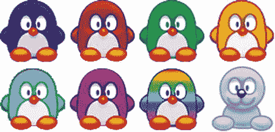
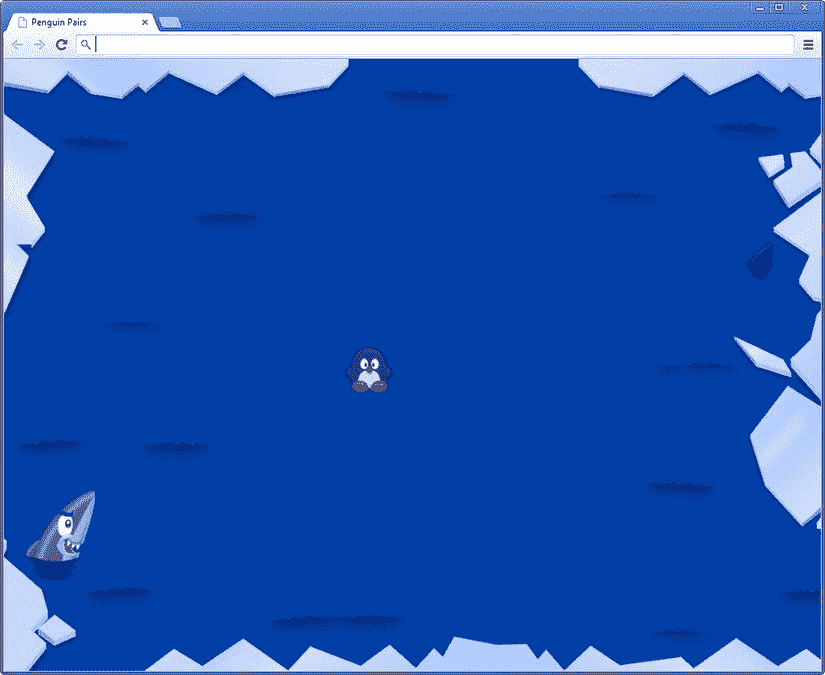

# 十八、精灵表

在这一章中，你开始构建企鹅配对游戏的第一个元素。这个游戏比前几个游戏要复杂得多。看看它使用的游戏素材数量就知道了。就像你在宝石果酱游戏中做的那样，你使用包含几个不同精灵的图像。这种技术在很多游戏中都有使用。在宝石果酱游戏中，你用它在一个精灵中存储一串宝石。然而，使用条带并不总是一个好主意。特别是当一个图像在一个条带中包含许多不同的子画面时，该条带可能会变得太长，以至于图形硬件无法处理。这可以通过将精灵存储在由多行和多列组成的*表*中来解决。[图 18-1](#Fig1) 显示了这样一个精灵表的例子。



[图 18-1](#_Fig1) 。一张子画面的示例(四列两行)

示例程序概述

为了测试一张精灵的加载和显示，让我们创建一个名为`PenguinPairs1`的简单示例程序。这个示例项目显示了一个背景，然后在背景的顶部绘制一只企鹅(或海豹)。使用向左和向右箭头键，您可以选择应该显示表单的哪一部分。

为了更容易上手，你可以从之前的游戏中复制几个类。首先你需要`GameObject`类和`GameObjectList`类。你还需要自己编写的用于编程游戏的基础类，比如`Keyboard`、`Touch`、`Mouse`、`Game`、`Canvas2D`、`Vector`等等。你修改了`SpriteGameObject`职业，这样它就可以处理精灵了。就像在宝石果酱游戏中，一个类代表游戏世界；在这种情况下，该类被称为`PenguinPairsGameWorld`。在该类的构造函数方法中，加载一个背景图像:

```js
this.add(new SpriteGameObject(sprites.background_level, ID.layer_background));

```

您还可以将企鹅精灵添加到游戏世界中，并将其放置在屏幕中间的某个位置:

```js
this.penguin = new SpriteGameObject(sprites.penguin, ID.layer_objects);
this.penguin.position = new Vector2(500, 420);
this.add(this.penguin);

```

加载精灵表

在 Jewel Jam 游戏中，`SpriteGameObject`实例保存了对 sprite 的引用，它由类型为`Image`的对象表示。为了处理 sprite 工作表，您创建了一个名为`SpriteSheet`的新类，您可以直接使用它来代替`Image`对象。向该类添加特定的功能，允许您维护工作表中的行数和列数，并可以选择要绘制的工作表的不同元素。在`loadAssets`方法中，背景和企鹅精灵都被加载；你在那里使用了`SpriteSheet`类，正如你在`loadAssets`方法的主体中看到的:

```js
Game.loadAssets = function () {
    var loadSprite = function (sprite) {
        return new SpriteSheet("../assets/sprites/" + sprite);
    };
    sprites.background_level = loadSprite("spr_background_level.jpg");
    sprites.penguin = loadSprite("spr_penguin@4x2.png");
};

```

企鹅雪碧(`spr_penguin@4x2.png`)的名字很奇特。这是因为您在`SpriteSheet`类中使用了一个技巧，让您在*文件名*中指定 sprite 工作表的尺寸。在本例中，企鹅精灵有四列两行。`SpriteSheet`构造函数分析精灵的名字并相应地确定尺寸。有三种可能性:

*   *图像是一个单独的精灵*:在这种情况下，文件名末尾没有定义。比如:`spr_wall.png`。
*   *图像是一条精灵*:在这种情况下，你在`@`字符后面提供一个整数。比如:`spr_field@2.png`。
*   *图像是一张精灵*的图片:文件名中提供了两个维度(列和行)。比如:`spr_penguin@4x2.png`。

**注意**如果您下载示例代码或开放源代码及相关素材，您可能会发现与本章中使用的命名约定类似的文件命名约定。这些命名约定看似随意，但它们可能是基于编程的。一定要分析这里使用的技巧类型的任何新代码。重命名文件可能看起来无害，但它可能会比您想象的更糟糕。

在一个`SpriteSheet`实例中，您必须像以前一样加载图像，并且您必须存储一些关于它所代表的 sprite 表的信息。首先加载图像，并在`SpriteSheet`实例中存储对它的引用:

```js
Game._spritesStillLoading += 1;
Game._totalSprites += 1;

this._image = new Image();
this._image.src = imageName;
this._image.onload = function () {
    Game._spritesStillLoading -= 1;
};

```

这段代码首先在`Game`对象中设置两个状态变量，这样你就可以跟踪有多少精灵仍在加载，以及总共有多少精灵。然后创建一个`Image`实例，设置它的源，并定义`onload`事件处理程序，这与您为之前的游戏所做的非常相似。

您还需要存储 sprite 表中的行数和列数。您可以从文件名中提取这些信息，但是让我们将这两项默认设置为 1:

```js
this._sheetColumns = 1;
this._sheetRows = 1;

```

要检索这些变量的实际值，需要从作为参数传递给构造函数的字符串中提取它们。JavaScript 有一个非常方便的方法叫做`split`,可以将字符串分割成小块。作为一个参数，`split`方法接受一个分隔符，它返回一个字符串数组。这里有几个`split`能做什么的例子:

```js
var s1 = "abcabcabc";
var s2 = "spring,summer,autumn,winter";
var s3 = "game";
var result = s1.split('c'); /* result now contains a 3 item array,
                               ["ab", "ab", "ab"] */
result = s2.split(','); /* result now contains a 4 item array,
                               ["spring", "summer", "autumn", "winter"] */
result = s2.split(','); /* result now contains a 1 item array, ["game"] */

```

您需要对文件名做的第一件事是删除其中的路径信息。为此，您使用斜杠(`/`)作为分隔符来拆分字符串。然后从数组中取出最后一个元素，它应该包含完整的文件名:

```js
var pathSplit = imageName.split('/');
var fileName = pathSplit[pathSplit.length - 1];

```

下一步是删除文件扩展名。这意味着您必须使用句点(`.`)作为分隔符来调用`split`方法。数组中的第一个元素将包含不带扩展名的文件名:

```js
var fileNameNoExt = fileName.split('.')[0];

```

然后，使用`@`-作为分隔符来拆分不带扩展名的文件名，如下所示:

```js
var fileSplit = fileNameNoExt.split("@");

```

`fileSplit`变量指的是一个数组。如果`@`-没有出现在字符串中，`fileSplit`变量中的元素个数为 1(原字符串)。如果数组中的元素数大于 1，则表明文件名包含了有关图纸尺寸的信息。您还知道，在这种情况下，数组的最后一个元素包含该信息。使用`x`字符作为分隔符再次拆分最后一个元素。这一切都在下面的`if`指令中表达出来:

```js
if (fileSplit.length <= 1)
    return;
var colRow = fileSplit[fileSplit.length - 1].split("x");
// deal with the sheet dimension data

```

现在有两种可能。`colRow`数组包含一个或两个元素。在这两种情况下，您都知道数组中的第一个元素表示工作表中的列数，所以您只需将它存储在`_sheetColumns`变量中:

```js
this._sheetColumns = colRow[0];

```

如果长度为 2，还需要在 _ `sheetRows`变量:中存储第二个字符串元素

```js
if (colRow.length === 2)
    this._sheetRows = colRow[1];

```

还有一种可能性是数组包含两个以上的元素。这里不处理这种情况(在这种情况下，只存储列数)。在`SpriteGameObject`类中，假设存储了对`SpriteSheet`的引用，而不是对`Image`的引用。创建`SpriteGameObject`实例时，sprite 工作表应该作为参数传递，这与您之前所做的非常相似。您还可以存储当前的工作表索引。这个数字表示`SpriteGameObject`应该从 sprite 表中提取哪个元素。下面是完整的构造函数:

```js
function SpriteGameObject(sprite, layer, id) {
    GameObject.call(this, layer, id);
    this.sprite = sprite;
    this.origin = Vector2.zero;
    this._sheetIndex = 0;
}

```

**注意**您已经看到了如何通过使用`split`方法来分析字符串内容。在 JavaScript 中，操纵字符串数据的方式还有很多。要获得更完整的概述，请访问`www.w3schools.com/js/js_strings.asp`，这是一个关于 JavaScript 字符串的优秀教程。

管理精灵表

你已经在宝石果酱游戏中看到了如何处理一条精灵。你必须改变`draw`方法来绘制精灵的一部分。这里你需要做一些额外的管理工作来确保 sprite 工作表的正常运行。首先要做的是向`SpriteSheet`类添加一个`width`属性和一个`height`属性，这两个属性考虑了 sprite 表的列号和行号:

```js
Object.defineProperty(SpriteSheet.prototype, "width",
    {
        get: function () {
            return this._image.width / this._sheetColumns;
        }
    });

Object.defineProperty(SpriteSheet.prototype, "height",
    {
        get: function () {
            return this._image.height / this._sheetRows;
        }
    });

```

此外，还会添加一个属性来计算工作表中的元素数，元素数定义为行数乘以列数:

```js
Object.defineProperty(SpriteSheet.prototype, "nrSheetElements",
    {
        get: function () {
            return this._sheetRows * this._sheetColumns;
        }
    });

```

还可以给`SpriteSheet`添加一些更有用的属性。看一下属于章节的`PenguinPairs1`例子，看完整的`SpriteSheet`类。

下一步是能够在 sprite 表中绘制一个元素。这是在`SpriteSheet`类的`draw`方法中完成的。这个方法需要几个参数，特别是应该绘制元素的位置、它的原点以及应该绘制哪个元素。后者由 sprite 表中的一个索引表示，并作为`sheetIndex`参数传递。首先，您需要将这个索引值转换成工作表中的列和行索引。您按如下方式计算列索引:

```js
var columnIndex = sheetIndex % this._sheetColumns;

```

基本上，您可以将工作表索引视为从左到右、从上到下传递给工作表中所有元素的值。通过在表索引上应用模数操作符，可以“丢弃”元素所在行之前的行，这样就只剩下列索引了。同样，通过将表索引除以列数来计算行索引:

```js
var rowIndex = Math.floor(sheetIndex / this._sheetColumns) % this._sheetRows;

```

为了确保索引在行数范围之内，您将根据行数执行取模运算。现在，您可以使用`width`和`height`属性构建一个矩形，指示应该绘制的 sprite 部分:

```js
var imagePart = new Rectangle(columnIndex * this.width, rowIndex * this.height,
    this.width, this.height);

```

最后，在屏幕上绘制精灵部件，如下所示:

```js
Canvas2D.drawImage(this._image, position, 0, 1, origin, imagePart, mirror);

```

`SpriteGameObject`类现在很简单。首先添加一些有用的属性来获取精灵的宽度和高度:

```js
Object.defineProperty(SpriteGameObject.prototype, "width",
    {
        get: function () {
            return this.sprite.width;
        }
    });
Object.defineProperty(SpriteGameObject.prototype, "height",
    {
        get: function () {
            return this.sprite.height;
        }
    });

```

您还可以添加一个属性来读取或写入 sprite 游戏对象的当前工作表索引。所选元素应在可能的元素索引范围内。您可以在属性的`set`部分检查这一点:

```js
Object.defineProperty(SpriteGameObject.prototype, "sheetIndex",
    {
        get: function () {
            return this._sheetIndex;
        },
        set: function (value) {
            if (value >=0 && value < this.sprite.nrSheetElements)
                this._sheetIndex = value;
        }
    });

```

查看`PenguinPairs1`示例中的`SpriteGameObject.js`文件，了解一些其他可以添加的属性示例。`SpriteGameObject`的最后一个方法是`draw`，这很简单，因为大部分工作已经在`SpriteSheet`类中完成了:

```js
SpriteGameObject.prototype.draw = function () {
    if (this._visible)
        this.sprite.draw(this.worldPosition, this.origin, this._sheetIndex);
};

```

最终确定示例

在`PenguinPairs1`的例子中，你在屏幕上画了一个背景和一只企鹅(见[图 18-2](#Fig2) )。要测试您的新`SpriteGameObject`类，通过按左右箭头按钮修改当前选择的工作表索引。这在`PenguinPairsGameWorld`类:中很容易做到

```js
if (Keyboard.pressed(Keys.left))
    this.penguin.sheetIndex--;
else if (Keyboard.pressed(Keys.right))
    this.penguin.sheetIndex++;

```



[图 18-2](#_Fig2) 。PenguinPairs1 示例程序的屏幕截图。那条鲨鱼看起来很饿，那只企鹅看起来很好吃！

因为您在`SpriteSheet`类中处理所有的 sprite-sheet 方面，所以直接在屏幕的正中央绘制企鹅，如下所示:

```js
this.penguin.position = this.penguin.screenCenter;

```

这将适用于任何尺寸的 sprite 工作表！尝试一下`PenguinPairs1`程序，并试验一下代码，看看它是如何工作的。

你学到了什么

在本章中，您学习了:

*   如何使用`split`方法分析字符串
*   如何处理游戏中的精灵表