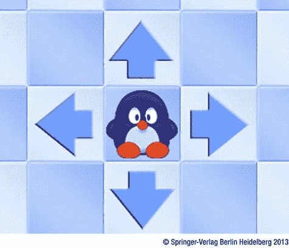
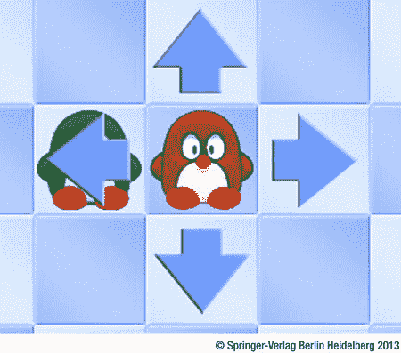

第二十二章

给企鹅配对

在这一章中，你将为企鹅配对游戏编写主要的游戏程序。您将学习如何在棋盘上移动企鹅，以及当企鹅与另一个游戏对象(如鲨鱼或另一只企鹅)发生碰撞时该怎么办。

选择企鹅

在你移动企鹅之前，你需要能够*选择*一只企鹅。当您单击企鹅或海豹等动物时，会出现四个箭头，允许您控制动物的移动方向。为了显示这些箭头并处理输入，您可以添加一个名为`AnimalSelector`的类。 因为动物选择器包含四个箭头，所以它继承自`GameObjectList`类。您还想添加一个漂亮的视觉效果，以便当玩家将鼠标移动到其中一个箭头上时，它会变得更暗。您可以通过添加一个包含两个精灵的类`Arrow`来实现这个效果:一个用于常规箭头，一个用于当您悬停在箭头上时的箭头图像。`Arrow`类还应该能够显示四个可能方向中的任何一个方向的箭头。

箭类

你可以有一个单一的箭头图像，并根据所需的方向旋转它，但是这个例子通过使用一个包含指向所有四个方向的箭头的图像使事情变得简单(见[图 22-1](#Fig1) )。因此，当你加载精灵时，*工作表索引*指示显示哪个箭头。对于悬停状态，加载另一个包含相同箭头图像的精灵，顺序相同，但颜色更深。


[图 22-1](#_Fig1) 。包含四个箭头的精灵，每个箭头指向不同的方向

注意我选择使用两个精灵来实现悬停状态并没有什么特别的原因。您也可以将八个箭头图像放在一个 sprite 工作表中，并使用它来代替这里使用的两个 sprite 工作表。

因为一个`Arrow`实例或多或少像一个按钮一样起作用，所以它继承自`Button`类。在构造函数中，首先通过调用超类的构造函数来创建实例的超类部分。这将加载第一个箭头图像。然后定义第二个 sprite，`arrowHover`，当鼠标悬停在它上面时，它包含箭头图像。默认情况下，这个精灵是不可见的，所以您将其可见性状态设置为`false`。您还将该 sprite 的父级设置为`Arrow`实例，以便它被绘制在正确的位置。下面是完整的构造函数:

```js
function Arrow(sheetIndex, layer, id) {
    Button.call(this, sprites.arrow, layer, id);
    this.sheetIndex = sheetIndex;
    this.arrowHover = new SpriteGameObject(sprites.arrow_hover);
    this.arrowHover.sheetIndex = sheetIndex;
    this.arrowHover.visible = false;
    this.arrowHover.parent = this;
}

```

作为参数传递给`Arrow`构造函数的工作表索引被传递给实际的子画面，以便选择正确的箭头方向。

在`handleInput`方法中，通过计算鼠标位置是否在箭头精灵的边界框内来检查悬停精灵是否应该可见。只有当游戏不在触摸设备上运行时，您才需要这样做，因此在计算可见性状态时，您需要考虑这个条件:

```js
Arrow.prototype.handleInput = function (delta) {
    Button.prototype.handleInput.call(this, delta);
    this.arrowHover.visible = !Touch.isTouchDevice &&
        this.boundingBox.contains(Mouse.position);
};

```

最后，覆盖`draw`方法,这样就可以添加一条线来绘制悬停精灵:

```js
Arrow.prototype.draw = function () {
    Button.prototype.draw.call(this);
    this.arrowHover.draw();
};

```

动物选择器

当玩家点击动物时，动物选择器使用`Arrow`类显示四个箭头(见[图 22-2](#Fig2) )。这四个箭头作为成员变量存储在`AnimalSelector`类中。因为选择器控制一种特定的动物，所以你也必须跟踪它控制哪一种动物。因此，您还添加了一个成员变量`selectedAnimal`，它包含了对目标动物的引用。在构造函数方法中，您创建了四个`Arrow`对象，并按如下方式适当地放置它们:

```js
function AnimalSelector(layer, id) {
    GameObjectList.call(this, layer, id);
    this._arrowright = new Arrow(0);
    this._arrowright.position = new Vector2(this._arrowright.width, 0);
    this.add(this._arrowright);
    this._arrowup = new Arrow(1);
    this._arrowup.position = new Vector2(0, -this._arrowright.height);
    this.add(this._arrowup);
    this._arrowleft = new Arrow(2);
    this._arrowleft.position = new Vector2(-this._arrowright.width, 0);
    this.add(this._arrowleft);
    this._arrowdown = new Arrow(3);
    this._arrowdown.position = new Vector2(0, this._arrowright.height);
    this.add(this._arrowdown);
    this.selectedAnimal = null;
    this.visible = false;
}

```



[图 22-2](#_Fig2) 。当玩家点击一只企鹅时，会显示四个箭头，这样玩家可以选择企鹅应该移动的方向

在`handleInput`方法中，首先检查选择器是否可见。如果不是，则不需要处理输入:

```js
if (!this.visible)
    return;

```

然后检查是否按下了其中一个箭头。如果是这样，你就可以计算出想要的动物速度:

```js
var animalVelocity = Vector2.zero;
if (this._arrowdown.pressed)
    animalVelocity.y = 1;
else if (this._arrowup.pressed)
    animalVelocity.y = -1;
else if (this._arrowleft.pressed)
    animalVelocity.x = -1;
else if (this._arrowright.pressed)
    animalVelocity.x = 1;
animalVelocity.multiplyWith(300);

```

如果玩家点击了鼠标左键或触摸了屏幕(在哪里并不重要)，您可以再次将动物选择器的状态设置为不可见:

```js
if (Mouse.left.pressed || Touch.containsTouchPress(Game.screenRect))
    this.visible = false;

```

最后，如果你计算的速度不为零，并且有一只目标企鹅，你更新它的速度:

```js
if (this.selectedAnimal !== null && animalVelocity.isZero)

    this.selectedAnimal.velocity = animalVelocity;

```

在`Animal`类的`handleInput`方法中，你必须处理点击动物。但是，在某些情况下，您不必处理这个问题:

*   这只动物在冰的一个洞里。
*   动物是看不见的。
*   这只动物已经在移动了。

在所有这些情况下，你不做任何事情，你从方法返回:

```js
if (!this.visible || this.boxed || !this.velocity.isZero)
    return;

```

如果玩家没有触摸或点击动物，你也可以从方法返回。因此，您添加下面的`if`指令来验证这一点:

```js
if (Touch.isTouchDevice) {
    if (!Touch.containsTouchPress(this.boundingBox))
        return;
} else {
    if (!Mouse.left.pressed || !this.boundingBox.contains(Mouse.position))
        return;
}

```

你需要考虑的最后一种情况是，如果玩家触摸或点击了动物，但动物选择器已经可见。在这种情况下，您不需要做任何事情，您可以从方法返回:

```js
var animalSelector = this.root.find(ID.animalSelector);
if (animalSelector.visible)
    return;

```

现在您已经处理了所有情况，您可以使选择器可见，设置其位置，并将动物指定为选择器的目标动物。以下说明涵盖了这些内容:

```js
animalSelector.position = this.position;
animalSelector.visible = true;
animalSelector.selectedAnimal = this;

```

如您所见，正确处理用户输入有时会很复杂。你需要考虑玩家可能采取的所有行动，并恰当地处理输入。如果你做得不好，你就冒着在游戏中引入错误的风险，这些错误会导致游戏崩溃(这很糟糕)或者玩家作弊(这甚至更糟，尤其是在在线多人游戏中)。

你刚刚写的指令允许玩家随意选择动物，并告诉它们向特定的方向移动。现在你需要处理动物、游戏场地和其他游戏对象之间的交互。

以相反的顺序处理输入

在屏幕上绘制对象的顺序很重要。例如，如果在绘制背景图像之前先绘制企鹅，玩家将永远看不到企鹅。然而，对象处理输入的顺序不应该和它们被绘制的顺序一样！在企鹅配对游戏中，这将导致意想不到的行为。

假设两只企鹅在操场上挨着，你点击其中一只。然后出现四个箭头。因为两只企鹅紧挨着，所以其中一个箭头画在了另一只企鹅的上方(见[图 22-3](#Fig3) )。如果你点击那个箭头，会发生什么？被选中的企鹅向左移动，还是你选择另一只企鹅？



[图 22-3](#_Fig3) 。点击左箭头会发生什么？

这个问题的结果取决于每个游戏对象处理输入的顺序。如果企鹅在企鹅选择器之前处理输入，那么企鹅选择器将移动到另一只企鹅。如果先调用选择器的`handleInput`方法，那么选中的企鹅会向左移动。一般来说，当你开发程序时，你想控制程序的行为。这意味着你必须选择处理输入的顺序，并确保总是这样。在这种情况下，期望的行为是选定的企鹅向左移动。一般来说，你会希望绘制在顶部的*对象首先处理输入*。换句话说，您需要在列表中的对象上调用`handleInput`方法，调用顺序与绘制顺序相反。这可以很容易地用下面的`for`指令来完成，你把它放在`GameObjectList.` `handleInput`方法体中:

```js
GameObjectList.prototype.handleInput = function (delta) {
    for (var i = this._gameObjects.length - 1; i >=0; i--)
        this._gameObjects[i].handleInput(delta);
};

```

因此，绘制在顶部的对象现在首先处理输入。这再次说明了在指定播放器界面时，获得这样的细节是多么重要。对玩家来说不直观的界面会很快导致挫败感——玩家可能会因为界面问题而不再想玩你的游戏。

更新动物

动物和其他游戏对象之间的交互是在`Animal`类的`update`方法中完成的。在`Animal`类中这样做的主要原因是每个动物处理自己的交互。如果你在游戏中添加了多个动物(就像你在这里所做的)，你不需要改变任何处理交互的代码。首先，如果动物不可见或者速度为零，你不必更新它。因此，`update`方法中的第一条指令是

```js
SpriteGameObject.prototype.update.call(this, delta);
if (!this.visible || this.velocity.isZero)
    return;

```

可以看到，首先调用基类的`update`方法。因为`SpriteGameObject`类没有覆盖`update`方法，所以它调用了`GameObject`类中定义的`update`方法，该方法通过添加速度乘以游戏时间来更新对象的位置。现在你要检查动物是否与另一个游戏对象发生碰撞。因为您在`update`方法开始时所做的检查，所以您只对可见和移动的动物进行检查。

如果动物在移动，你需要知道它正在移动到哪个格子。然后，您可以检查它是哪种类型的图块，以及是否有其他游戏对象位于该图块。为此，您向`Animal`类添加一个名为`currentBlock`的属性。你怎么能计算出动物正在进入的瓷砖呢？当一只企鹅向左移动时，可以计算出该瓷砖的 *x* 指数如下:

```js
var tileField = this.root.find(ID.tiles);
var xIndex = Math.floor(this.position.x / tileField.cellWidth);

```

因为`Math.floor`产生的最接近的整数比它作为参数得到的值小，所以你会在精灵的左边位置结束。然而，这只在动物向左移动*时找到正确的 *x* 指数。当动物移动到*右侧*时，您需要计算企鹅精灵的*最右侧像素*移动到的区块。为了解决这个问题，如果 *x* 速度为正，则在计算的 *x* 指数上加 1。你做一些类似的事情来计算 y 指数。以下是`currentBlock`属性的完整头部和主体:*

```js
Object.defineProperty(Animal.prototype, "currentBlock",
    {
        get: function () {
            var tileField = this.root.find(ID.tiles);
            var p = new Vector2(Math.floor(this.position.x /
                tileField.cellWidth),Math.floor(this.position.y /
                tileField.cellHeight));
            if (this.velocity.x > 0)
                p.x++;
            if (this.velocity.y > 0)
                p.y++;
            return p;
        }
    });

```

下一步是找出动物正在移动到哪种瓷砖。为此，您必须向 tile 字段添加一些方法。要正确地做到这一点，您需要添加一个继承自`GameObjectGrid`的名为`TileField`的类，并向该类添加一些方法。一种方法检查给定的 *x* 和 *y* 索引是否在图块区域之外。这种方法叫做`isOutsideField`，很简单:

```js
TileField.prototype.isOutsideField = function (pos) {
    return (pos.x < 0 || pos.x >=this.columns || pos.y < 0 || pos.y >=
        this.rows);
};

```

该方法在另一个方法`getTileType`中使用，该方法检索给定图块位置的图块类型。在这种方法中，首先要检查的是该点是否在平铺区域之外。如果是这种情况，则返回背景(透明)平铺类型:

```js
if (this.isOutsideField(pos))
    return TileType.background;

```

在所有其他情况下，您可以通过从图块字段获取`Tile`对象并返回其类型: 来检索图块类型

```js
return this.at(pos.x, pos.y).type;

```

现在你可以回到`Animal.update`的方法，检查动物是否从瓷砖地上掉了下来。如果是这样，你将动物的可见性设置为`false`并将其速度设置为零，以确保动物在不可见时不会无限移动:

```js
var target = this.currentBlock;
var tileField = this.root.find(ID.tiles);
if (tileField.getTileType(target) === TileType.background) {
    this.visible = false;
    this.velocity = Vector2.zero;
}

```

另一种可能是动物撞到了墙砖。如果是这样，它必须停止移动:

```js
else if (tileField.getTileType(target) === TileType.wall)
    this.stopMoving();

```

停止移动并不像听起来那么容易。您可以简单地将动物的速度设置为零，但这样动物的一部分就会在另一个图块中。你需要把动物放在刚刚离开的格子*上。方法`stopMoving`完成 正是如此。在这个方法中，你首先要计算旧瓷砖的位置。您可以从动物当前移动到的区块的 *x* 和 *y* 索引开始。这些是作为参数传递的。例如，如果动物的速度是向量 *(300，0)* (向右移动)，则需要从 *x* 索引中减去 1，以获得动物正在移出的图块的 *x* 索引。如果动物的速度是 *(0，-300)* (向上移动)，那么您需要*将* 1 加到 *y* 索引上，以获得动物正在移出的图块的 *y* 索引。你可以通过*标准化速度矢量*并从 *x* 和 *y* 索引中减去它来实现。这是可行的，因为规范化一个向量会产生一个长度为 1(单位长度)的向量。因为动物只能在 *x* 或 *y* 方向移动，而不能沿对角线方向移动，所以在第一个示例中，您最终得到一个矢量 *(1，0)* ，在第二个示例中得到一个矢量 *(0，-1)* 。因此，您将动物的位置设置为它刚刚移出的图块的位置，如下所示:*

```js
var tileField = this.root.find(ID.tiles);
this.velocity.normalize();
var currBlock = this.currentBlock;
this.position = new Vector2(Math.floor(currBlock.x - this.velocity.x) *
    tileField.cellWidth, Math.floor(currBlock.y - this.velocity.y) *
    tileField.cellHeight);

```

请注意，您将位置乘以平铺字段中单元格的宽度和高度。这是因为图块索引与屏幕上的实际像素位置不同。图块索引仅指示图块在网格中的位置，而动物位置需要以像素表示为屏幕上的位置。

最后，将动物的速度设置为零，使其保持在新位置:

```js
this.velocity = Vector2.zero;

```

遇见其他游戏对象

您仍然需要检查动物是否与另一个游戏对象发生碰撞，例如另一只企鹅或鲨鱼。有一些特殊类型的动物:

*   五彩企鹅
*   空盒子
*   密封

您可以向`Animal`类添加一些方法来确定您是否正在处理这些特殊情况。例如，如果纸张索引等于 7 并且没有装箱，您正在处理一个印章:

```js
Animal.prototype.isSeal = function () {
    return this.sheetIndex === 7 && !this.boxed;
};

```

如果工作表索引是 7 并且是有框的，则您处理的是一个空框:

```js
Animal.prototype.isEmptyBox = function () {
    return this.sheetIndex === 7 && this.boxed;
};

```

最后，如果纸张索引是 6 并且没有装箱，那么您将处理一只多色企鹅:

```js
Animal.prototype.isMulticolor = function () {
    return this.sheetIndex === 6 && !this.boxed;
};

```

首先，你要检查动物要进入的区域是否有鲨鱼。为此，您检索关卡并使用来自`Level`类的`findSharkAtPosition`方法来找出是否有鲨鱼:

```js
var s = this.root.findSharkAtPosition(target);
if (s !== null && s.visible) {
    // handle the shark interaction
}

```

`findSharkAtPosition`方法很简单；看看属于本章的示例代码中的方法。如果企鹅遇到鲨鱼，企鹅会被吃掉，鲨鱼会带着满满的肚子离开赛场。在游戏中，这意味着企鹅永远停止移动，鲨鱼和企鹅都变得看不见了。下面几行代码实现了这一点:

```js
s.visible = false;
this.visible = false;
this.stopMoving();

```

接下来要检查的是是否有另一只企鹅或海豹。为此，您可以使用来自`Level`类的`findAnimalAtPosition`方法。按如下方式取回动物:

```js
var a = this.root.findAnimalAtPosition(target);

```

如果方法返回`null`或者动物不可见，你不需要做任何事情，你可以从方法返回:

```js
if (a === null || !a.visible)
    return;

```

你解决的第一个案例是企鹅和海豹相撞。在这种情况下，企鹅什么都不用做——它只是停止移动:

```js
if (a.isSeal())
    this.stopMoving();

```

下一种情况是如果动物撞上一个空盒子。如果是这种情况，通过将盒子的纸张索引设置为动物的纸张索引来移动盒子内的动物，并使动物不可见:

```js
else if (a.isEmptyBox()) {
    this.visible = false;
    a.sheetIndex = this.sheetIndex;
}

```

如果动物`a`的表索引与企鹅的表索引相同，或者其中一只企鹅是多色的，则您拥有一对有效的企鹅，并使两只企鹅都不可见:

```js
else if (a.sheetIndex === this.sheetIndex || this.isMulticolor() || a.isMulticolor()) {
    a.visible = false;
    this.visible = false;
}

```

你还必须在屏幕的左上角显示一个额外的对子，但是你将在下一节中处理这个问题。最后，在所有其他情况下，企鹅停止移动:

```js
else
    this.stopMoving();

```

保持线对的数量

为了保持对子的数量并在屏幕上很好地绘制出来，您向游戏中添加了另一个名为`PairList`的类。`PairList`类继承自`SpriteGameObject`类。它由一个框架组成，在框架的顶部绘制了许多小精灵，指示所需的对子数。因为您想要指示配对的颜色，所以您将这些配对作为整数值存储在一个数组中。这个数组是`PairList`类的成员变量:

```js
this._pairs = [];

```

您将整数值放在这个数组中，因为您可以定义每一对的颜色以及总共需要多少对。在成员变量`pairSprite`中，存储代表一对的 sprite，并将对列表设置为该 sprite 的父级:

```js
this._pairSprite = new SpriteGameObject(sprites.penguin_pairs);
this._pairSprite.parent = this;

```

那个精灵的图像是一个精灵带，彩色的一对以和企鹅一样的方式排列(见[图 22-4](#Fig4) )。如果仍然需要制作一对，则条带(纸张索引 7)中最右边的图像是您显示的图像。因此，如果`_pairs`数组包含值`{0, 0, 2, 7, 7}`，这意味着玩家已经做了两对蓝色企鹅和一对绿色企鹅，玩家需要再做两对才能完成关卡。


[图 22-4](#_Fig4) 。包含所有可能的图像对的子画面

您将参数`nrPairs`传递给`PairList`类的构造函数，这样您就知道数组应该有多大。然后填充数组，以便将每个元素设置为空槽(工作表索引 7):

```js
for (var i = 0; i < nrPairs; i++)
    this._pairs.push(7);

```

您还向该类添加了一个方法`addPair`，该方法在数组中查找第一次出现的值 7，并用作为参数传递的索引来替换它:

```js
PairList.prototype.addPair = function (index) {
    var i = 0;
    while (i < this._pairs.length && this._pairs[i] !== 7)
        i++;
    if (i < this._pairs.length)
        this._pairs[i] = index;
};

```

这个例子使用了一个`while`指令来增加`i`变量，直到你找到一个空的点。

现在你添加一个有用的属性来检查玩家是否完成了关卡。如果配对列表不再包含任何值 7(意味着所有空位都已被配对替换)，则该级别完成:

```js
Object.defineProperty(PairList.prototype, "completed",
    {
        get: function () {
            for (var i = 0, l = this._pairs.length; i < l; i++)
                if (this._pairs[i] === 7)
                    return false;
            return true;
        }
    });

```

最后，你需要用`draw`方法在屏幕上画出对子。这里您使用一个`for`指令来遍历对列表中的所有索引。对于每个索引，在适当的位置绘制正确的精灵。请注意，您使用相同的精灵，并简单地用不同的工作表索引绘制多次:

```js
PairList.prototype.draw = function () {
    SpriteGameObject.prototype.draw.call(this);
    if (!this.visible)
        return;
    for (var i = 0, l = this._pairs.length; i < l; i++) {
        this._pairSprite.position = new Vector2(110 + i * this.height, 8);
        this._pairSprite.sheetIndex = this._pairs[i];
        this._pairSprite.draw();
    }
};

```

对 base `draw`方法的调用确保首先绘制背景帧。

现在您已经有了`PairList`类，您可以在`Level`类中创建它的一个实例，将它添加到游戏世界中，并将其放在屏幕左上角附近:

```js
var pairList = new PairList(levelData.nrPairs, ID.layer_overlays, ID.pairList);

pairList.position = new Vector2(20, 15);
this.add(pairList);

```

在`Animal`类中，如果一只动物遇到另一只相同颜色的企鹅，或者两只动物中有一只是多色企鹅，你就在列表中添加一对:

```js
else if (a.sheetIndex === this.sheetIndex || this.isMulticolor() ||
    a.isMulticolor()) {
    a.visible = false;
    this.visible = false;
    this.root.find(ID.pairList).addPair(this.sheetIndex);
}

```

完整示例见本章的`PenguinPairs5`程序。在下一章中，您将为企鹅配对游戏添加最后的润色，您将看到一种更好的方法来将游戏通用代码(如`SpriteGameObject`类或`GameStateManager`类)与游戏特定代码(如`PairList`类)分开。

你学到了什么

在本章中，您学习了:

*   如何编程一个游戏对象选择器
*   如何模拟不同种类的游戏对象之间的交互
*   如何保持和抽牌手所做的对子数*