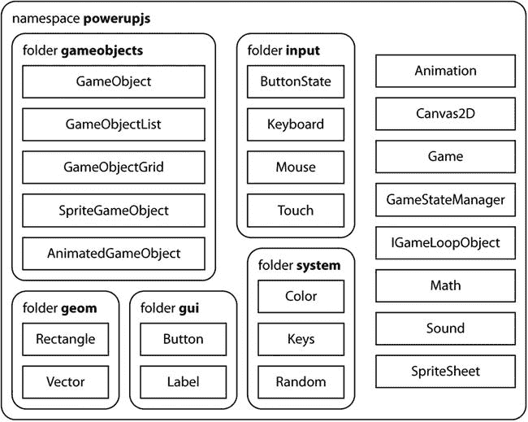
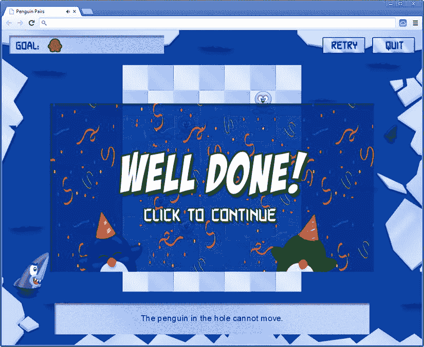

第二十三章

完成企鹅配对游戏

在这一章中，你将完成企鹅配对游戏。第一步是稍微重组一下你的代码，这样其他程序就可以更容易地使用其中的一部分。然后你通过扩展用户界面和添加音效来完成游戏。

将代码分成不同的模块

尤其是在开发更复杂的应用程序时，将相关的类组合在一起是有意义的。例如，如果你正在开发一个复杂的游戏，将会有与模拟物理相关的类，做人工智能如路径规划的类，提供网络可玩性的类，用户界面类，等等。尽管本书中使用的例子并不复杂，但是您仍然可以看到只对特定游戏有用的类和跨不同游戏使用的类之间的明显区别。例如，这三个游戏都有一些基本游戏对象的概念，宝石果酱游戏和企鹅配对游戏都使用网格作为其游戏场的基础。此外，在几层上绘制的游戏对象的层次结构的概念在不同的游戏中使用。总的来说，这本书坚持在不同的游戏中使用相似的类。事实上，您复制了珠宝果酱游戏中的类，并在企鹅配对游戏中使用它们。

正如本书前面几次讨论的那样，将代码复制到不同的项目中是一件坏事。复制代码意味着 bug 也可以被复制；如果您做了任何更改或改进，您将不得不在复制代码的所有地方都这样做。如何避免*不同游戏*之间复制代码？实现这一点的最佳方式是将游戏专用代码与游戏通用代码分开。通过将通用类放在一个单独的文件夹中，您可以更容易地在其他游戏项目中重用这些代码。通过在不同的游戏项目中选择智能文件夹结构，您可以轻松确保不必为每个项目复制通用代码。在本节中，您将建立这种结构，并看到一种在 JavaScript 中区分通用类和特定于游戏的类的简洁方法，即使用一种叫做*名称空间*的概念。

作为名称空间的变量

名称空间通常在编程语言中使用，为类的归属提供一些结构。许多编程语言都在语言规范中包含了名称空间支持。JavaScript 不属于这些语言中的一种，但是使用该语言中的现有功能来建立类似的东西是非常容易的。

您已经在示例代码中看到，变量是对象组。这些对象可以是对象文字、字符串、数字，甚至是函数。因为类是由 JavaScript 中的函数定义的，所以您可以将类组合在一个变量中，使该变量充当名称空间。例如，假设您想要创建一个 JavaScript 游戏引擎，其中包含您在本书中构建的所有通用类和对象。我们姑且称这个游戏引擎为`powerupjs`。您可以开始如下定义您的类:

```js
var powerupjs = {
    GameObject : function(layer, id) {
        ...
    },
    GameObjectList : function(layer, id) {
        ...
    }
};

```

现在，每当你想使用类`GameObject`，你输入`powerupjs.GameObject`。在 JavaScript 代码中，这会让用户清楚地知道`GameObject`属于`powerupjs`名称空间。这很棒，但是这意味着你必须把所有的类放在一个 JavaScript 文件中，这并没有真正提高你的程序的可读性。让我们研究一下如何以更聪明的方式做到这一点。

名称空间的设计模式

为了使在 JavaScript 中使用名称空间更容易，您使用了一个*设计模式*。第二十章在讨论单例(只允许一个实例的类)时简要地谈到了设计模式。这种单例设计模式使用如下:

```js
function MySingletonClass_Singleton () {
    ...
}

// add methods and properties here
MySingletonClass_Singleton.prototype.myMethod() = function () {
    ...
};
...
var MySingletonClass = new MySingletonClass_Singleton();

// now we can use the variable as a single instance
MySingletonClass.myMethod();

```

将类放入名称空间的设计模式使用 JavaScript 机制，让您可以同时定义和调用函数。也许您还记得以前在定义请求下一次游戏循环迭代的函数时使用过这个方法:

```js
var requestAnimationFrame = (function () {
        return window.requestAnimationFrame ||
            window.webkitRequestAnimationFrame ||
            window.mozRequestAnimationFrame ||
            window.oRequestAnimationFrame ||
            window.msRequestAnimationFrame ||
            function (callback) {
                window.setTimeout(callback, 1000 / 60);
            };
    })();

```

这里的变量`requestAnimationFrame`包含一个函数的结果，这个函数被定义并立即调用。以非常相似的方式，您可以将类的定义放在这样的函数中。看看下面的例子:

```js
var powerupjs = (function (module) {

    function Vector2(x, y) {
        this.x = typeof x !== 'undefined' ? x : 0;
        this.y = typeof y !== 'undefined' ? y : 0;
    }

    Object.defineProperty(Vector2, "zero",
        {
            get: function () {
                return new powerupjs.Vector2();
            }
        });

    Vector2.prototype.equals = function (obj) {
        return this.x === obj.x && this.y === obj.y;
    };

    // add more methods and properties
    ...

    module.Vector2 = Vector2;
    return module;

})({});

```

这个例子创建了一个函数，它需要一个对象文本`module`作为参数。在函数中，您创建了`Vector2`类并定义了它的属性和方法。您将该类赋给`module`变量中的一个变量，然后返回该变量。通过向函数传递一个空的对象文字来执行该函数。函数的结果存储在变量`powerupjs`中，该变量现在包含一个名为`Vector2`的变量，该变量引用类`Vector2`。对于您定义的下一个类，您将传递变量`powerupjs`,而不是一个空的对象文字，这样`powerupjs`变量就被所有应该在`powerupjs`名称空间中的类填充了。通过使用智能 JavaScript 语法，您可以让这变得更好。考虑下面的类定义:

```js
var powerupjs = (function (powerupjs) {

    function Vector2(x, y) {
        this.x = typeof x !== 'undefined' ? x : 0;
        this.y = typeof y !== 'undefined' ? y : 0;
    }
    // etc.

    powerupjs.Vector2 = Vector2;
    return powerupjs;

})(powerupjs || {});

```

为了清楚起见，这里您将参数`module`重命名为`powerupjs`；不是传递一个空的对象文字，而是传递表达式`powerupjs || {}`。如果定义了变量，这个表达式的结果是`powerupjs`，否则是一个空的对象文字。您将这个名称空间设计模式添加到所有通用游戏类中。不管这些类被添加到名称空间的顺序如何，第一次添加时，你从一个空的对象文字开始，之后，`powerupjs`变量被定义并用其余的类补充。属于本章的示例代码包括一个名为`powerupjs`的文件夹；在这个文件夹中是所有通用的游戏类，它们都在`powerupjs`名称空间中。本书剩余的例子重用了`powerupjs`模块(或库)作为示例游戏的基础。

名称空间模式对于将相关的类组合在一起是一个非常有用的模式。无论何时构建复杂的应用程序，使用名称空间都是一个好主意。这样，您就可以清楚地向代码的用户展示这些类是如何相互关联的。您甚至可以更极端，使用完全相同的设计模式将名称空间分组到其他更大的名称空间中。

名称空间还提供了一点额外的安全性。例如，看看命名空间中的以下类定义:

```js
var powerupjs = (function (powerupjs) {

    function GameStateManager_Singleton() {
        this._gameStates = [];
        this._currentGameState = null;
    }

    // add methods/properties here
    ...

    powerupjs.GameStateManager = new GameStateManager_Singleton();
    return powerupjs;

})(powerupjs || {});

```

这个例子展示了`GameStateManager`类的定义，它是一个单例类。这是一个 singleton 的事实可以通过你将类的一个*实例*分配给`powerupjs.GameStateManager`而不是类定义本身来看出来。真正好的是，类定义现在被命名空间封装了——不再可能在其他 JavaScript 文件中访问`GameStateManager_Singleton`,从而确保只能使用该类的单个实例，这正是 singleton 设计模式的要点！

封装是封闭类定义的函数的结果。您可以用其他方式来控制哪些函数或类在哪里可用。例如，也许一个类的一些方法应该是内部的(或者是私有的)。您可以这样做:

```js
var powerupjs = (function (powerupjs) {

    ...

    function privateMethod(obj) {
        // do something with the object
        obj._currentGameState = ...;
    }

    GameStateManager_Singleton.prototype.publicMethod() {
        privateMethod(this);
        ...
    }

    powerupjs.GameStateManager = new GameStateManager_Singleton();
    return powerupjs;

})(powerupjs || {});

```

在这个例子中，方法`privateMethod`可以在`GameStateManager`实例上执行操作，并且可以从对象中的其他方法调用它，但是该方法不能从其他 JavaScript 类访问。

在模块和文件夹中组织类有助于为一组相关类的结构提供更好的感觉。[图 23-1](#Fig1) 显示了如何将`powerupjs`模块组织到不同的文件夹中。当你创建一个模块时，为模块的用户提供一个如图[图 23-1](#Fig1) 所示的图表是一个好主意。此外，因为一个模块可以由许多不同的类组成，所以您可能还想提供一些文档来描述该模块的总体思想。在`powerupjs`的例子中，重要的是让用户知道该模块严重依赖于一个运行中的游戏循环，该循环具有更新和绘制自己的游戏对象。此外，最好详细描述每个方法做什么，它期望什么样的参数，调用方法做什么，以及任何特殊情况。本书的最后一部分更详细地讨论了文档，并且您还学习了一些使文档更容易阅读和更容易被您的类的用户访问的方法。



[图 23-1](#_Fig1) 。`powerupjs`模块 的模块和文件夹结构概述

整理用户界面

在本节中，您将完成用户界面。首先，您将看到如何在游戏中添加提示机制。然后，您将看到如何重置并进入下一个级别。你通过添加音效来完成游戏。

显示提示

既然你已经重组了你的代码，企鹅配对游戏中还会增加一些新的功能。首先，您希望能够在用户单击按钮时显示提示。该提示由一个可见一秒钟的橙色箭头组成。当您加载关卡时，您从`levelData`变量中读取提示位置和方向，并创建一个`SpriteGameObject`实例来加载箭头，选择正确的工作表索引，并在将其添加到游戏世界之前对其进行适当定位:

```js
var hint = new powerupjs.SpriteGameObject(sprites.arrow_hint, ID.layer_objects_2);
hint.sheetIndex = levelData.hint_arrow_direction;
hint.position = new powerupjs.Vector2(levelData.hint_arrow_x * 73,
    levelData.hint_arrow_y * 72);
playingField.add(hint);

```

为了临时显示箭头，您重用了宝石果酱游戏中的`VisibilityTimer`类。您创建了该类的一个实例，并将其添加到游戏世界中:

```js
this.hintVisible = new VisibilityTimer(hint);
playingField.add(this.hintVisible);

```

您还可以添加一个按钮，玩家可以单击该按钮在屏幕上显示提示:

```js
this.hintButton = new powerupjs.Button(sprites.button_hint, ID.layer_overlays);
this.hintButton.position = new powerupjs.Vector2(916, 20);
this.add(this.hintButton);

```

最后，您扩展了`Level`的`handleInput`方法来处理被按下的提示按钮:

```js
if (this.hintButton.pressed)
    this.hintVisible.startVisible();

```

提示按钮只有在可见的情况下才能被按下，在某些情况下它不应该是可见的:

*   玩家走完第一步后，提示按钮应该消失，重试按钮应该出现。
*   如果玩家选择关闭选项菜单中的提示，提示按钮应该永远不可见。

对于第一种情况，您需要跟踪玩家何时开始第一步行动。您向`Level`类添加了一个额外的成员变量`firstMoveMade`。当你给一个动物一个速度，这是在`AnimalSelector`类中完成的。一旦玩家点击了一个箭头，动物开始移动，你就将`firstMoveMade`变量设置为`true`:

```js
this.selectedAnimal.velocity = animalVelocity;
this.root.firstMoveMade = true;

```

第二，你必须处理游戏选项菜单中的提示设置。您可以在`Level`类的`update`方法中这样做。您只需检查`GameSettings`变量中提示设置的值，并相应地更新提示和重试按钮的可见性状态:

```js
this.hintButton.visible = GameSettings.hints && !this.firstMoveMade;
this.retryButton.visible = !this.hintButton.visible;

```

从这两行代码中可以看出，提示按钮只有在`GameSettings.hints`为`true`且玩家尚未迈出第一步的情况下才可见。重试按钮的可见性状态总是与提示按钮的可见性状态相反。因此，如果提示按钮可见，重试按钮不可见，反之亦然。

重置级别

在玩家移动了几个动物后，可能会出现关卡无法解决的情况。与其退出并重启游戏，不如给玩家一个重置关卡到初始状态的方法。

由于在游戏对象类中到处都正确地实现了`reset`方法，重置一个关卡到它的初始状态变得非常容易。你必须在所有的游戏对象上调用`reset`方法，然后在`Level`类本身中处理重置的事情。你唯一需要做的就是将`firstMoveMade`变量设置为`false`，这样玩家就可以再次查看提示:

```js
Level.prototype.reset = function () {
    powerupjs.GameObjectList.prototype.reset.call(this);
    this.firstMoveMade = false;
};

```

**注意**企鹅配对游戏有许多扩展方式。例如，您能否编写代码来确定某个级别是否仍然可解？如果发生这种情况，你可以通过向用户显示消息来延长游戏。你可能对如何改进游戏有自己的想法。通过修改和添加示例，您可以随意尝试它们。

进入下一阶段

当玩家完成一关(万岁！)，你想显示一个鼓励的覆盖图(截图见[图 23-2](#Fig2) )。当玩家点击或轻敲屏幕时，将显示下一关。因为您创建了`GameStateManager`类，所以让我们通过添加另一个状态来利用它:`LevelFinishedState`。这个状态唯一能做的就是显示覆盖图，并对玩家的点击做出反应。因为覆盖图显示在关卡的顶部，所以您仍然需要对游戏状态做一些事情。因此，您将它存储在成员变量中。此外，您加载一个覆盖图，将其放置在屏幕中央，并将其添加到游戏世界中。下面是完整的构造函数方法:

```js
function LevelFinishedState() {
    powerupjs.GameObjectList.call(this);
    this.playingState = powerupjs.GameStateManager.get(ID.game_state_playing);
    this.overlay = new powerupjs.SpriteGameObject(sprites.level_finished, ID.layer_overlays);
    this.overlay.position = this.overlay.screenCenter;
    this.add(this.overlay);
}

```



[图 23-2](#_Fig2) 。玩家完成一关后显示的覆盖图截图

您希望在播放状态上显示覆盖图，但是您不希望播放状态能够再处理输入(否则玩家仍然可以移动企鹅)。因此，您只需要在`playingState`对象上调用`update`和`draw`方法，而不是`handleInput`方法。

在`LevelFinishedState`的`handleInput`方法中，你检查玩家是否按下了鼠标键或者轻击了屏幕。如果是这样，你将当前状态设置为播放状态，并对其调用`nextLevel`方法:

```js
LevelFinishedState.prototype.handleInput = function (delta) {
    if (powerupjs.Touch.isTouchDevice) {
        if (!powerupjs.Touch.containsTouchPress(this.overlay.boundingBox))
            return;
    }
    else if (!powerupjs.Mouse.left.pressed)
        return;
    powerupjs.GameStateManager.switchTo(ID.game_state_playing);
    this.playingState.nextLevel();
};

```

`nextLevel`方法是如何工作的？它必须处理两种可能性。第一种可能是玩家完成了最后一关。在这种情况下，您将返回到级别菜单状态。在所有其他情况下，你增加当前级别索引，并为玩家解锁下一个级别。最后，因为您更改了关卡状态，所以您将它写入本地存储，以便玩家下次开始游戏时，游戏会记住玩家已经解决了哪些关卡。完整的`nextLevel`方法如下所示:

```js
PlayingState.prototype.nextLevel = function () {
    if (this.currentLevelIndex >=window.LEVELS.length - 1)
        powerupjs.GameStateManager.switchTo(ID.game_state_levelselect);
    else {
        this.goToLevel(this.currentLevelIndex + 1);
        window.LEVELS[this.currentLevelIndex].locked = false;
    }
    this.writeLevelsStatus();
};

```

你唯一需要做的就是确保当玩家获胜时，游戏进入关卡完成状态。您可以通过使用`Level`类的`completed`属性，在播放状态的`update`方法中实现这一点:

```js
if (this.currentLevel.completed) {
    window.LEVELS[this.currentLevelIndex].solved = true;
    powerupjs.GameStateManager.switchTo(ID.game_state_levelfinished);
}

```

如果玩家已经完成了关卡，您将该关卡的`solved`状态设置为`true`，并且您将当前游戏状态更改为关卡完成状态。

教程

正如你可能已经注意到的，企鹅配对游戏的前几关也是一个教程，解释这个游戏应该怎么玩。当你创造一个游戏时，玩家必须学会如何玩它。如果你不告诉玩家挑战和目标是什么，以及如何控制游戏，他们很可能会感到沮丧，停止游戏。

一些游戏提供了大量的帮助文件，用很长的文字解释故事和控制。玩家不再想阅读这样的文档或屏幕。他们想直接进入游戏。你必须在玩家玩的时候教育他们。

您可以创建几个特定的教程级别，玩家可以在其中练习控制，而不会严重影响游戏本身的进度。这种方法很受休闲游戏玩家的欢迎，作为对游戏的介绍。经验丰富的游戏玩家更喜欢立即投入行动。注意不要在教程中解释所有的内容。只解释基本的控制。解释游戏中需要的更高级的控制:例如，使用简单的弹出消息，或者在 HUD 中的可见位置。

教程在自然地融入游戏故事时效果最好。例如，游戏角色可能开始在他们安全的家乡跑来跑去，学习基本的移动控制。接下来角色和几个朋友一起练习格斗。之后，玩家进入树林，试图用弓射一些鸟。这将为游戏后期的战斗提供所有需要的练习。

你应该确保你的教程水平的工作，并确保玩家记住控制，即使他们把游戏放了几天。否则，他们可能再也不会回来玩游戏了。

添加声音效果

为了完成游戏，你应该在适当的地方添加声音和音乐。您可能还记得，选项菜单中的一个选项是更改背景音量。您可以使用下面的代码行来实现这一点:

```js
sounds.music.volume = this.musicSlider.value;

```

在`PenguinPairs`课上，你开始播放音乐:

```js
sounds.music.play();

```

同样，你在适当的时候播放音效，就像你在宝石果酱游戏中做的那样。例如，每当制作一对企鹅时，就播放一个声音效果(参见`Animal`类中的`update`方法):

```js
sounds.pair.play();

```

如果你看看属于这一章的`PenguinPairsFinal`例子，你就可以看到完整的游戏是如何工作的，音效是在哪里回放的，当然你也可以自己玩游戏。

团队合作

第一代游戏是由程序员创造的。他们做了所有的工作。他们设计了游戏机制，他们创造了艺术(仅由几个像素组成)，他们用汇编语言编写了游戏程序。所有的工作都集中在编程上。游戏机制经常被改编成可以有效编程的东西。

但是当更多的内存变得可用时，这种情况慢慢改变了。用有限数量的像素和颜色创建看起来很花哨的对象成为了一种艺术形式，这样的像素艺术家开始在开发游戏中发挥重要作用。在早期，没有绘图程序(没有足够强大的计算机能做到这一点)。像素化的角色被设计在绘图纸上，然后被转换成十六进制数字，输入到游戏代码中。

随着计算机能力和 CD 等存储媒体的增加，艺术变得越来越重要，艺术家也随之发展。3D 图形和动画变得普遍，导致新的专家可以使用新的工具和技术来支持这种工作。如今，艺术家构成了游戏制作团队的大多数。

在某种程度上，设计游戏成了一项独立的工作。游戏机制被调整到用户群的兴趣，并且越来越基于心理学和教育科学的原则。这需要单独的专业知识。故事扮演了一个重要的角色，导致了作家的加入。这些团队被扩展到包括制作人、音响工程师、作曲家和许多其他类型的人。今天，顶级游戏的团队可以由数百人组成。但是没有程序员，什么都做不了。

最后一点

在本书的这一部分，你已经创建了一个比之前的示例游戏更复杂的游戏，宝石果酱。你可能已经注意到职业的数量已经变得相当大了，你越来越依赖于游戏软件的某种设计。例如，你在一个树形结构中组织游戏对象，并使用一个类来处理游戏状态。在更基本的层面上，你假设游戏对象负责处理它们的输入，更新它们自己，并在屏幕上绘制它们自己。您可能不同意这些设计选择中的一些(或全部)。或许，在读完这本书之后，你已经对游戏软件应该如何设计有了自己的想法。这是一件好事。我在本书中提出的设计并不是做事的唯一方式。设计总是可以被评估和改进，甚至被抛弃，被完全不同的东西所取代。所以，不要犹豫，批判地看待我提出的设计，尝试其他设计。通过尝试不同的方法来解决问题，您可以更好地理解问题，并因此成为更好的软件开发人员。

你学到了什么

在本章中，您学习了:

*   如何将类分组到命名空间中
*   如何将一个级别重置为其初始状态，并处理进入下一个级别