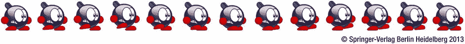
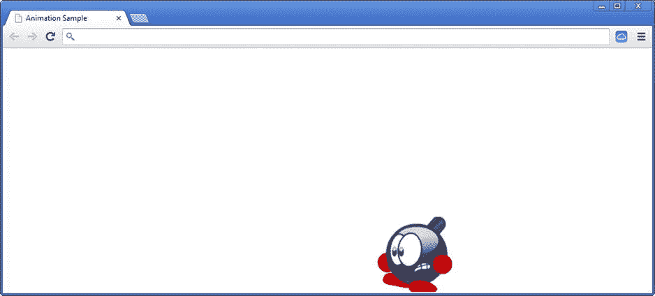

# 二十五、动画

在这一章中，你将看到如何给你的游戏添加动画。在你到目前为止开发的游戏中，游戏对象可以在屏幕上四处移动，但是在游戏中添加一些像跑步的角色稍微有点挑战性。在这一章中，你要编写一个程序，其中包含一个在屏幕上从左向右行走的角色。玩家按下左右箭头键来控制角色。在这个特殊的例子中，您没有添加触摸界面控件，但是稍后您将看到如何在触摸设备上控制移动的角色。

本书中没有明确涉及的另一件事是使用大多数现代设备内置的加速度计。您可以在 JavaScript 中通过处理诸如`ondeviceorientation`(或者 Firefox 中的`onmozorientation`)和`ondevicemotion`之类的事件来访问这些数据，这些事件提供了与设备当前加速度相关的数据。如果你觉得你能胜任，你可以尝试扩展本章中的例子，这样它就能以一种有意义的方式对这些事件做出反应。

什么是动画？

在你研究如何设计一个角色在屏幕上走来走去之前，你首先要考虑什么是动画。要理解这一点，你必须回到 20 世纪 30 年代，当时几家动画工作室(其中包括华特·迪士尼)制作了第一部黑白动画片。

一部卡通片实际上是一系列非常快速的静止图像，也称为*帧*。电视以非常高的速度绘制这些帧，大约每秒 25 次。当图像每次都发生变化时，你的大脑会将其解释为运动。人类大脑的这一特殊功能(也称为 *phi 现象*)非常有用，尤其是当你想要编写需要包含移动或动画对象的游戏时。

你已经在本书开发的游戏中使用过这个特性。每次调用`draw`方法，你就在屏幕上画一个新的“框架”。通过每次在不同的位置绘制精灵，你给人一种精灵在移动的感觉。然而，这并不是真正发生的事情:你只是在每秒钟内多次在不同的位置绘制精灵，这使得玩家认为精灵在移动。

以类似的方式，你可以画一个行走或奔跑的角色。除了移动精灵之外，您每次绘制的精灵都略有不同。通过绘制一系列精灵，每个精灵代表行走运动的一部分，您可以创建一个角色在屏幕上行走的幻觉。图 25-1 中给出了一个子画面序列的例子。



[图 25-1](#_Fig1) 。代表行走动作的图像序列

游戏中的动画

在游戏中放动画有不同的原因。当你创作 3D 游戏时，动画通常是增强真实感所必需的，但对于 2D 游戏来说，情况并非总是如此。尽管如此，动画可以极大地丰富游戏。

动画将物体变得栩栩如生。但是动画制作并不复杂。角色闭上和睁开眼睛的简单动画会产生一种强烈的感觉，即角色是活的。动画角色也更容易让人产生共鸣。如果你看一个类似*剪绳*的游戏，主角(名为 Om Nom)简直就是坐在一个角落里。但是这个角色时不时会做一些有趣的动作，让你知道它在那里，并希望你给它带食物。这为玩家创造了继续玩游戏的非常有效的动机。

动画还有助于将玩家的注意力吸引到某个对象、任务或事件上。例如，在按钮上有一个小动画可以让玩家更清楚地知道他们必须按下按钮。而一颗跳动的水滴或一颗旋转的星星表明这个物体应该被收集或避开。动画也可以用来提供反馈。当你用鼠标点击一个按钮向下移动时，很明显这个按钮点击成功了。

然而，制作动画是一项繁重的工作。因此，事先仔细考虑哪里需要动画，哪里可以避免动画，以节省时间和金钱。

动画课

对于动画角色，通常为每种类型的运动设计一个精灵。图 25-1 中的例子是一个动画角色的精灵。在企鹅配对游戏的开发过程中，您设计了代表一条或一张图片的`SpriteSheet`类。您可以将该类与一个新类`Animation`结合使用。除了精灵表，动画需要额外的信息。例如，您想要指示每一帧应该在屏幕上显示多长时间。你也希望能够*循环*你的动画，这意味着一旦你到达最后一帧，第一帧应该再次显示。循环动画非常有用:例如，在行走角色的情况下，您只需绘制一个行走循环，然后循环动画以获得连续的行走运动。然而，并不是所有的动画都应该是循环的。例如，一个垂死的动画不应该循环播放(那会对角色非常残忍)。下面是`Animation`类的完整构造函数:

```js
function Animation(sprite, looping, frameTime) {
    this.sprite = sprite;
    this.frameTime = typeof frameTime !== 'undefined' ? frameTime : 0.1;
    this.looping = looping;
}

```

动画游戏对象

`Animation`类提供了表现动画的基础。本节介绍一种新的游戏对象:动画游戏对象*，它使用了这个类。`AnimatedGameObject`类是`SpriteGameObject`的子类。*

动画游戏对象可能包含许多不同的动画，因此您可以拥有一个可以执行不同(动画)动作的角色，如行走、奔跑、跳跃等。每个动作都由一个动画来表示。根据玩家的输入，您可以更改当前活动的动画。然后，根据经过的时间和当前活动动画的属性(例如它是否循环)，确定应该在屏幕上显示的精灵的工作表索引。

要存储不同的动画，可以使用复合对象。对于每个动画，都要向该对象添加一个变量。您还需要一个变量来跟踪当前活动的动画。最后，还有一个额外的成员变量:`_time`。这个变量跟踪显示当前帧还需要多长时间，后面会解释。下面是`AnimatedGameObject`的完整构造器:

```js
function AnimatedGameObject(layer, id) {
    powerupjs.SpriteGameObject.call(this, null, layer, id);

    this._animations = {};
    this._current = null;
    this._time = 0;
}

```

您还向该类添加了两个方法:`loadAnimation`和`playAnimation`。第一种方法创建一个`Animation`对象，并将其添加到`_animations`变量:

```js
AnimatedGameObject.prototype.loadAnimation = function (animname, id, looping,
    frametime) {
    this._animations[id] = new powerupjs.Animation(animname, looping,
        frametime);
};

```

如前所述，`AnimatedGameObject`类是`SpriteGameObject`的子类。这意味着当这个对象被绘制在屏幕上时，它试图绘制成员变量`sprite`指向的 sprite 工作表。但是，请注意，当您在`AnimatedGameObject`构造函数中调用基构造函数时，您将`null`作为参数传递:

```js
function AnimatedGameObject(layer, id) {
    powerupjs.SpriteGameObject.call(this, null
, layer, id);
    ...
}

```

您需要将属于当前运行动画的精灵分配给`sprite`成员变量，这样这个动画就可以在屏幕上绘制了。您可以很容易地做到这一点，因为每个`Animation`实例都包含一个对它应该激活的 sprite 的引用。将这个精灵分配给精灵成员变量是在`playAnimation`方法中完成的。

在该方法中，您首先检查想要播放的动画是否已经在播放。如果是，您不必做任何其他事情，您可以从方法返回:

```js
if (this._current === this._animations[id])
    return;

```

接下来，将当前工作表索引和`_time`变量设置为 0，并根据作为参数传递的 ID 分配当前活动的动画:

```js
this._sheetIndex = 0;
this._time = 0;
this._current = this._animations[id];

```

最后，将`sprite`成员变量设置为应该绘制的 sprite:

```js
this.sprite = this._current.sprite;

```

播放动画

您已经定义了一些用于加载和选择动画的有用的类和方法。你仍然需要能够*播放*一个动画。*打*到底是什么意思？这意味着你必须根据已经过去的时间来确定应该显示哪一帧，并在屏幕上绘制该帧。计算应该画哪一帧是在`AnimatedGameObject`类的`update`方法中完成的。因为动画中的每一帧都对应于某个工作表索引，所以您只需计算哪个工作表索引对应于当前帧。从`SpriteGameObject`继承的`draw`方法不需要修改。

在`update`方法中，你要计算应该画哪一帧。但是这意味着你需要知道从最后一帧画出来到现在过了多长时间。如果在每次调用`update`方法时增加帧索引，动画会播放得太快。因此，你在成员变量`_time`中保存了自最后一帧被绘制以来已经过去的时间。您在`update`方法的开头更新这个变量:

```js
this._time += delta;

```

现在，您可以计算应该显示的帧的索引。为此，您使用一条`while`指令:

```js
while (this._time > this._current.frameTime) {
    this._time -= this._current.frameTime;
    this._sheetIndex++;
    if (this._sheetIndex >=this.sprite.nrSheetElements)
        if (this._current.looping)
            this._sheetIndex = 0;
        else
            this._sheetIndex = this.sprite.nrSheetElements - 1;
}

```

这里发生了什么？只要`_time`变量包含一个大于`frameTime`的值，`while`指令就会继续。在`while`指令中，你从`_time`变量中减去帧时间。假设每一帧显示的时间被设置为 1 秒。您输入`update`方法，并将经过的时间添加到`_time`成员变量中。假设这个变量现在包含值 1.02，这意味着您当前显示的帧已经显示了 1.02 秒。这意味着您应该显示下一帧。你可以通过增加当前显示的帧的索引来实现，这是`while`循环中的第二条指令。然后更新`_time`变量并减去帧时间(1 秒)，因此`_time`的新值变为 0.02。您将这段代码放在一个`while`指令中，而不是一个`if`指令中，这样您就可以确保始终显示正确的帧，即使自上次更新以来经过的时间是帧时间的数倍。例如，如果`_time`的新值是 3.4，您需要向前移动三帧，并从`_time`变量中减去三次帧时间。`while`指令会处理这一点。

在增加当前帧索引后，你必须注意在你过了最后一帧后会发生什么。为此，您需要检查纸张索引是否大于或等于`this.sprite.nrSheetElements`。根据您是否希望动画循环，您可以将工作表索引重置为 0，或者将其设置为工作表中的最后一个元素。

玩家阶层

要使用上一节中介绍的`AnimatedGameObject`类，您需要从它继承。因为玩家将控制动画角色，所以让我们定义一个`Player`类，它是`AnimatedGameObject`的子类。在这个类中，您加载属于播放器的动画并处理来自播放器的输入。在`Player`构造函数中，加载这个角色所需的动画。在本例中，您希望角色行走或静止不动。所以，你通过调用`loadAnimation`方法两次来加载两个动画。您希望这两个动画都循环，因此您将循环参数设置为`true` :

```js
this.loadAnimation(sprites.idle, "idle", true);
this.loadAnimation(sprites.run, "run", true, 0.05);

```

因为空闲动画只包含单个工作表元素，所以不需要指定帧时间。对于正在运行的动画，您指定每一帧应该显示五百分之一秒。当应用启动时，角色的空闲动画应该播放:

```js
this.playAnimation("idle");

```

你也改变了玩家的出身。如果你想画在地板上移动的动画角色，使用角色精灵底部的一个点作为它的原点是很有用的。此外，正如您稍后看到的，这对于冲突检查非常有用。由于这些原因，你将播放器的原点定义为 sprite 元素底部的中心点:

```js
this.origin = new powerupjs.Vector2(this.width / 2, this.height);

```

现在你需要在这个类中处理玩家的输入。当玩家按下左或右箭头键时，角色的速度应该改变。您可以在`handleInput`方法中使用`if`指令:来实现这一点

```js
var walkingSpeed = 400;
if (powerupjs.Keyboard.down(powerupjs.Keys.left))
    this.velocity.x = -walkingSpeed;
else if (powerupjs.Keyboard.down(powerupjs.Keys.right))
    this.velocity.x = walkingSpeed;
else
    this.velocity.x = 0;

```

**注意**我为`walkingSpeed`参数选择了 400 的值。摆弄这个值，看看它如何改变角色的行为。为这样的参数选择正确的值对游戏性有很大的影响。选择“恰到好处”的价值观很重要。用各种各样的玩家测试游戏可以帮助你决定这些值应该是什么，这样游戏才感觉自然。

使用图 25-1 所示的精灵可以让你制作一个向右走的角色的动画。要设置向左行走的角色的动画，可以使用另一个精灵。然而，有一个更简单的方法来实现这一点:当你绘制精灵时，镜像精灵。镜像精灵对于任何种类的精灵游戏对象都很有用，所以在`SpriteGameObject`类中，您添加了一个成员变量`mirror`，它指示精灵是否应该被镜像。在`SpriteSheet`的`draw`方法中，您将`mirror`变量的值传递给`Canvas2D.drawImage`，如下所示:

```js
powerupjs.Canvas2D.drawImage(this._image, position, 0, 1, origin, imagePart,
    mirror);

```

你必须扩展`Canvas2D`使其支持绘制镜像精灵。你可以通过使用下面的指令将精灵*负向*缩放来实现:

```js
if (mirror) {
    this._canvasContext.scale(scale * canvasScale.x * -1, scale *
        canvasScale.y);
    ...
}

```

下一步，你必须转换和旋转画布上下文，同时考虑精灵的镜像状态。这里没有详细介绍，但是您可以查看一下`Canvas2D`类，看看它是如何实现的。为了结束输入处理，如果玩家正在移动:，根据速度设置`mirror`状态

```js
if (this.velocity.x != 0)
    this.mirror = this.velocity.x < 0;

```

在`update`方法中，您根据速度选择播放哪个动画。如果速度为零，则播放空闲动画；否则，播放跑步动画:

```js
if (this.velocity.x === 0)
    this.playAnimation("idle");
else
    this.playAnimation("run");

```

最后，您调用基类中的`update`方法，以确保动画游戏对象版本的`update`方法也被调用。

为了测试您的动画类，您创建了一个单独的`AnimationState`实例，并将其添加到游戏状态管理器中:

```js
ID.game_state_animation = powerupjs.GameStateManager.add(new AnimationState());
powerupjs.GameStateManager.switchTo(ID.game_state_animation);

```

在`AnimationState`类中，您创建了一个`Player`实例，将其设置在所需的位置，并将其添加到游戏世界:

```js
function AnimationState(layer) {
    powerupjs.GameObjectList.call(this, layer);
    var player = new Player();
    player.position = new powerupjs.Vector2(50, 300);
    this.add(player);
}

```

如果你运行程序，你会看到一个可以用左右箭头键控制的动画角色(见[图 25-2](#Fig2) )。如果角色走出可见屏幕，它不只是在屏幕外“停止”——而是继续前进。因此，如果你按住右箭头键 5 秒钟，你需要按住左箭头键 5 秒钟，以及获得角色回来。



[图 25-2](#_Fig2) 。在画布底部从右向左移动的动画角色

绕过这种能够离开屏幕边缘的行为的一种方法是实现换行:如果角色离开屏幕的右侧，它会重新出现在左侧，反之亦然。通过在代码中添加一个`if`指令，可以很容易地实现换行，该指令检查字符的当前位置，并根据该位置选择将字符移动到屏幕的另一端。你能自己改变例子来添加包装吗？

你学到了什么

在本章中，您学习了:

*   如何创建和控制动画
*   如何构建一个由多个动画组成的动画游戏对象