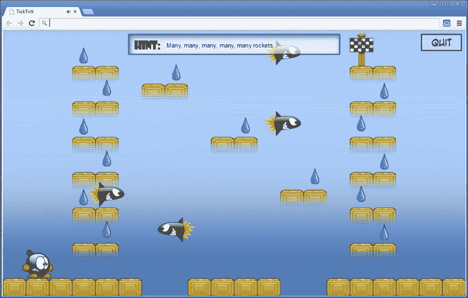
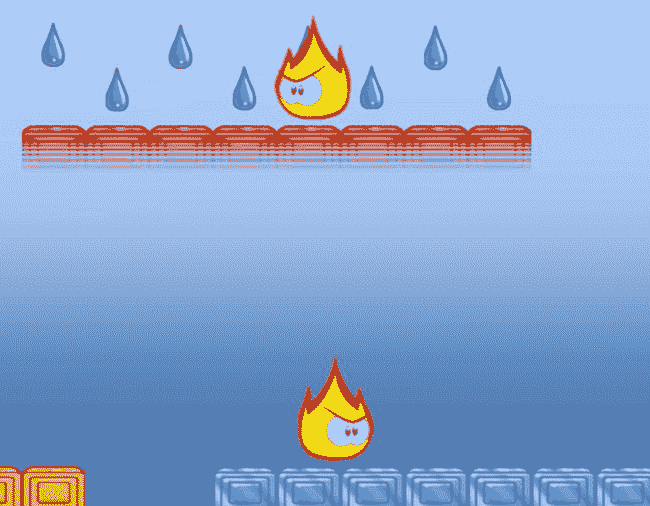
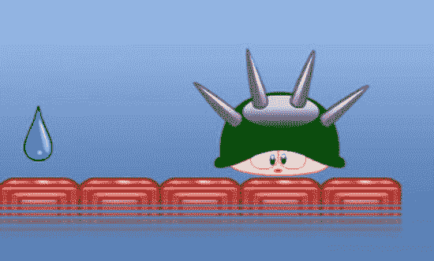
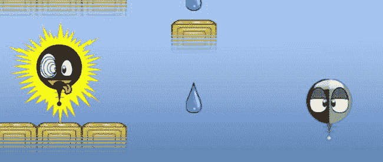

第二十七章

聪明的敌人

作为开发滴答滴答游戏的下一步，让我们通过添加危险的敌人给玩家带来一些危险。如果玩家接触到敌人，玩家死亡。敌人通常不受玩家控制(那会让事情变得太容易)。因此，你需要定义某种聪明(或者愚蠢)的行为。你不希望这些敌人太聪明:玩家应该能完成关卡。毕竟，这是玩游戏的目标:赢得游戏。好的是，你可以建立不同类型的敌人，表现出不同类型的行为。因此，玩家有不同的游戏选项，必须制定不同的策略来完成关卡。

定义敌人的行为会导致一些非常复杂的代码，有许多不同的状态、推理、路径规划等等。在这一章中，你会看到一些不同类型的敌人:一枚火箭，一只打喷嚏的乌龟(说真的)，斯巴基，和几个不同的巡逻敌人。这一章并不涉及玩家应该如何与敌人互动——你只需要定义他们的基本行为。

火箭

最基本的敌人之一是火箭。一枚火箭从屏幕的一边飞到另一边，过了一段时间后再次出现。如果玩家接触到火箭，玩家就会死亡。在关卡描述中，你用 *r* 和 *R* 人物来表示一个火箭敌人应该被放置在一个关卡中。例如，考虑以下级别描述:

```js
window.LEVELS.push({
    hint : "Many, many, many, many, many rockets...",
    locked : true,
    solved : false,
    tiles : ["....................",
                "r..W...........X....",
                "...--..W.......--...",
                "....W.--........W..R",
                "...--..........--...",
                "r..W......W....W....",
                "...--....--....--...",
                "....W...........W...",
                "...--........W.--...",
                "r..W........--.W....",
                "...--..........--...",
                "....W...........W..R",
                "...--..........--...",
                ".1..................",
                "######..####..######"]
});

```

小写的 *r* 表示火箭应该从左往右飞，大写的 *R* 表示应该从右往左飞(参见[表 24-1](24.html#Tab1) )。

制造和重置火箭

让我们创建一个代表这种特殊敌人的`Rocket`类。您继承了`AnimatedGameObject`类，因为火箭是动画的。在构造函数中，初始化`Rocket`对象。您需要加载火箭动画并播放它，然后您需要检查动画是否应该镜像。因为动画中火箭向右移动，如果火箭向左移动，您需要镜像它。您还可以存储火箭的起始位置，这样当它移出屏幕时，您可以将它放回那个位置。最后，您需要一个变量`spawnTime`来跟踪火箭应该何时出现。这是完整的构造函数:

```js
function Rocket(moveToLeft, startPosition, layer, id) {
    powerupjs.AnimatedGameObject.call(this, layer, id);
    this.spawnTime = 0;
    this.startPosition = startPosition;
    this.mirror = moveToLeft;

    this.loadAnimation(sprites.rocket, "default", true, 0.5);
    this.playAnimation("default");
    this.origin = new powerupjs.Vector2(this.width / 2, this.height);
    this.reset();
}

```

构造函数中的最后一条指令是对`reset`方法的调用。在这个方法中，您将火箭的当前位置设置为起始位置，将可见性设置为`false`(因此火箭最初是不可见的)，并将速度设置为零。您还可以使用随机数生成器来计算一个随机时间(以秒为单位),在该时间之后火箭应该出现并开始移动。你把这个时间存储在成员变量`spawnTime`中。您将这些指令放在一个单独的`reset`方法中，因为您稍后也会调用这个方法，在火箭飞出屏幕之后。

编程火箭行为

火箭的行为(像往常一样)编码在`update`方法中。基本上，火箭表现出两种主要类型的行为:要么它是可见的并从屏幕的一端移动到另一端，要么它是不可见的并等待出现。通过查看`spawnTime`变量的值，可以确定火箭处于两种状态中的哪一种。如果这个变量包含一个大于零的值，火箭就在等待生成。如果该值小于或等于零，则火箭可见，并从屏幕的一端移动到另一端。

我们来看第一种情况。如果火箭正在等待产卵，您只需从产卵时间中减去自最后一次`update`调用以来已经过去的时间:

```js
if (this.spawnTime > 0) {
    this.spawnTime -= delta;
    return;
}

```

第二种情况稍微复杂一些。火箭从屏幕的一端移动到另一端。因此，您将可见性状态设置为`true`，根据火箭移动的方向计算其速度，并更新其位置:

```js
this.visible = true;
this.velocity.x = 600;
if (this.mirror)
    this.velocity.x *= -1;

```

最后，你要检查火箭是否已经飞出屏幕。如果是这样的话，火箭应该重置。你可以使用边界框来检查火箭是否在屏幕之外。如果包围屏幕的边界框不与火箭的边界框相交，您知道火箭在屏幕之外，并重置它:

```js
var screenBox = new powerupjs.Rectangle(0, 0, powerupjs.Game.size.x,
powerupjs.Game.size.y);
if (!screenBox.intersects(this.boundingBox))
    this.reset();

```

这就完成了`Rocket`类，除了与玩家的交互，这是你在下一章会更详细看到的。有关完整的类，请参见属于本章的`TickTick3`示例代码。[图 27-1](#Fig1) 显示了本章第一节中定义的级别的屏幕截图。



[图 27-1](#_Fig1) 。一个有许多火箭飞来飞去的关卡

巡逻的敌人

火箭是一种基本上没有智能行为的敌人。它从左向右飞，或者从右向左飞，直到飞出屏幕，然后它自己复位。你也可以添加稍微聪明一点的敌人，比如一个*巡逻的*敌人。让我们设置一些不同类型的巡逻敌人，你可以添加到游戏中。

基本的巡逻敌人类

`PatrollingEnemy`类类似于`Rocket`类。你希望巡逻的敌人被动画化，所以它从`AnimatedGameObject`类继承而来。你还需要在被覆盖的`update`方法中定义敌人的*行为*。巡逻的敌人的基本行为是从左到右再走回来。如果敌人到达一个缺口或一面墙砖，敌人停止行走，等待一段时间，然后转身。你可以在关卡中的任意位置放置敌人。对于玩家来说，你需要定义一些基本的物理概念，比如下落和跳跃。你不会为`PatrollingEnemy`类这么做，因为你为这个游戏定义的敌人只会从左到右来回走动。

在`PatrollingEnemy`类的构造函数中，你为巡逻的敌人角色加载主动画(一个愤怒的火焰，如图[图 27-2](#Fig2) 所示)。最初，你设置一个正的速度，这样敌人开始向右走。你还初始化了另一个名为`_waitTime`的成员变量，它记录了敌人在它行走的平台的一边等待了多久:

```js
this._waitTime = 0;
this.velocity.x = 120;
this.loadAnimation(sprites.flame, "default", true);
this.playAnimation("default");

```



[图 27-2](#_Fig2) 。几个巡逻的敌人

在`update`方法中，你要区分两种情况:敌人是在走还是在等。您可以通过查看`_waitTime`变量来区分这些状态。如果这个变量包含正值，说明敌人在等待。如果变量包含零或更小的值，则敌人正在行走。当敌人在等待时，你不必做太多。就像你在`Rocket`类中做的一样，你从`_waitTime`变量中减去游戏时间。如果等待时间已经到了零，你需要把角色转过来。下面是实现这一点的代码:

```js
if (this._waitTime > 0) {
    this._waitTime -= delta;
    if (this._waitTime <= 0)
        this.turnAround();
}

```

`turnAround`方法简单地反转速度并镜像动画:

```js
PatrollingEnemy.prototype.turnAround = function () {
    this.mirror = !this.mirror;
    this.velocity.x = 120;
    if (this.mirror)
        this.velocity.x = -this.velocity.x;
};

```

如果敌人现在正在行走，而不是等待，你需要发现它是否已经到达它行走的平台的边缘。它在两种情况下达到了一个边缘:要么是有一个缺口，所以敌人无法进一步移动，要么是一个墙砖挡住了去路。你使用敌人的包围盒来找到这些信息。如果敌人向左走，你检查最左边的 *x* 值是否已经到达墙砖或平台的边界。如果敌人向右走，你检查最右边的 *x* 值。您可以如下计算这个 *x* 值:

```js
var tiles = this.root.find(ID.tiles);
var posX = this.boundingBox.left;
if (!this.mirror)
    posX = this.boundingBox.right;

```

现在，您计算这个 *x* 值所在的区块。你可以通过将 *x* 值除以图块的宽度来计算。为了确保您总是得到正确的(下限)瓦片索引，您使用了`Math.floor`方法:

```js
var tileX = Math.floor(posX / tiles.cellWidth);

```

用类似的方法，你可以计算出敌人当前所站的那张牌的 *y* 指数:。

```js
var tileY = Math.floor(this.position.y / tiles.cellHeight);

```

注意，因为你用雪碧的*底*来代表敌人的位置，所以你得到的 *y* 指数就是敌人下面的那个平铺*的指数。*

接下来你必须检查敌人是否已经到达墙砖或平台的边界。如果计算出的索引处的牌是背景牌，则敌人已经到达平台的边界，必须停止行走。如果索引`(tileX, tileY - 1)`处的瓷砖(换句话说，紧挨着敌人的瓷砖)是墙砖，敌人也必须停止行走。为了停止行走，您为等待时间指定一个正值，并将 *x* 速度设置为零:

```js
if (tiles.getTileType(tileX, tileY - 1) === TileType.normal ||
    tiles.getTileType(tileX, tileY) === TileType.background) {
    this._waitTime = 0.5;
    this.velocity.x = 0;
}

```

不同类型的敌人

可以通过引入几个品种让巡逻的敌人稍微有趣一点。这里你可以用继承的力量写几个`PatrollingEnemy`类的子类来定义不同的敌人行为。

例如，你可以通过让敌人偶尔改变方向来创造一个更难以预测的敌人。在这一点上，你也可以改变敌人的行走速度为一个随机值。您可以通过定义一个继承自`PatrollingEnemy`类的类`UnpredictableEnemy`来实现这一点。因此，默认情况下，它表现出与普通敌人相同的行为。您覆盖了`update`方法，添加了几行代码，随机改变敌人行走的方向和速度。因为您重用了大部分的`PatrollingEnemy`类代码，所以`UnpredictableEnemy`类相当短。下面是完整的类定义:

```js
"use strict";

function UnpredictableEnemy(layer, id) {
    PatrollingEnemy.call(this, layer, id);
}

UnpredictableEnemy.prototype = Object.create(PatrollingEnemy.prototype);

UnpredictableEnemy.prototype.update = function (delta) {
    PatrollingEnemy.prototype.update.call(this, delta);
    if (this._waitTime <= 0 && Math.random() < 0.01) {
        this.turnAround();
        this.velocity.x = Math.sign(this.velocity.x) * Math.random() * 300;
    }
};

```

如您所见，您使用了一个`if`指令来检查随机生成的数字是否低于某个值。因此，在少数情况下，条件会产生`true`。在`if`指令的主体中，你首先让敌人掉头，然后你计算一个新的 *x* 速度。请注意，您将随机生成的速度乘以旧速度值的符号。这是为了确保新的速度设置在正确的方向上。您还首先调用基类的`update`方法，以便选择正确的动画，处理与玩家的冲突，等等。

我能想到的另一个变种是跟随玩家的敌人，而不是简单地从左到右再回来。同样，您继承了`PatrollingEnemy`类。这里有一个类叫做`PlayerFollowingEnemy` :

```js
"use strict";

function PlayerFollowingEnemy(layer, id) {
    PatrollingEnemy.call(this, layer, id);
}

PlayerFollowingEnemy.prototype = Object.create(PatrollingEnemy.prototype);

PlayerFollowingEnemy.prototype.update = function (delta) {
    PatrollingEnemy.prototype.update.call(this, delta);

    var player = this.root.find(ID.player);
    var direction = player.position.x - this.position.x;
    if (Math.sign(direction) !== Math.sign(this.velocity.x) &&
        player.velocity.x !== 0 && this.velocity.x !== 0)
        this.turnAround();
};

```

这个职业定义了一个在玩家移动时跟随玩家的敌人。这是通过检查敌人当前是否在玩家站立的方向行走来完成的(只考虑 *x* 方向)。否则，敌人会掉头。只有当玩家不在 *x* 方向移动时(换句话说，玩家的 *x* 速度为零)，你才能限制敌人的智力。

你不应该让敌人太聪明。此外，不要让他们走得太快——如果敌人在跟踪他们时走得明显比玩家快，这将是一个短暂的游戏。玩家要打败敌人，这样玩家才能赢得游戏。玩一个敌人太聪明或者不可战胜的游戏并不好玩，除非你喜欢一次又一次地死去！

其他类型的敌人

你可以加入游戏的另一个敌人是打喷嚏的乌龟(见[图 27-3](#Fig3) )。你会问，为什么是乌龟？为什么是打喷嚏的那个？这个问题我真的没有答案。但这个敌人背后的想法是，它既有消极的一面，也有积极的一面。不好的一面是，乌龟打喷嚏的时候会长尖刺，你不要碰它。但是如果乌龟不打喷嚏，你可以用它跳得更高。因为您现在还没有处理交互，所以您现在只添加了动画乌龟。可以用乌龟跳 5 秒，然后它打喷嚏长尖刺 5 秒，之后又回到之前的状态 5 秒，以此类推。



[图 27-3](#_Fig3) 。不要跳到带刺的乌龟身上！

敌人由`Turtle`职业代表，它的设置方式与之前的敌人相似。一只海龟有两种状态:它是空闲的，或者它打了个喷嚏，因此有危险的刺。在这种情况下，您维护两个成员变量来跟踪海龟处于哪种状态以及在该状态下已经过了多长时间:`waitTime`变量跟踪当前状态下还剩多少时间，而`sneezing`变量跟踪海龟是否在打喷嚏。同样，在`update`方法中，你处理两个阶段之间的转换，就像你处理火箭和巡逻的敌人一样。我在这里不再赘述，因为代码和其他敌人职业非常相似。如果你想看完整的代码，可以查看本章解决方案中的`TickTick3`程序。

火花是你加入游戏的最后一种敌人。就像其他敌人一样，斯巴基有两种状态(见[图 27-4](#Fig4) )。Sparky 是一个非常危险的，喜欢电的敌人。他静静地悬在空中，直到他收到一束能量。当那发生时，他摔倒了。当斯巴基悬在空中时，他并不危险；但他一倒下，就不要碰他！看看`Sparky`类就知道代码了。



[图 27-4](#_Fig4) 。斯巴基通电时很危险

敌方软件架构

所有这些不同类型的敌人看起来不同，行为也不同，但他们通常有一个共同的职业设计。您也许可以设计一种更好的方法来定义这些敌人，使用几个泛型类来定义状态和它们之间的转换。每个过渡都可能有附加条件，例如必须经过一定的时间或者动画应该结束播放。这样的结构被称为*有限状态机*。这是人工智能系统中非常常见的技术。如果你准备好迎接挑战，试着写一个有限状态机库，并重新定义现有的敌人来使用它！

装载不同类型的敌人

现在你已经定义了不同种类的敌人，剩下唯一要做的就是在你读取等级数据变量时加载它们。不同敌人的精灵通过角色来识别。您将这些敌方角色存储在一个`GameObjectList`对象中，该对象是在`Level`类构造函数:中创建的

```js
this._enemies = new powerupjs.GameObjectList(ID.layer_objects);

```

根据你在加载关卡时读取的角色，你调用不同的方法来加载敌人，通过在`Level`类中的`switch`指令中添加一些情况:

```js
case 'R':
    return this.loadRocketTile(x, y, true);
case 'r':
    return this.loadRocketTile(x, y, false);
case 'S':
    return this.loadSparkyTile(x, y);
case 'T':
    return this.loadTurtleTile(x, y);
case 'A':
case 'B':
case 'C':
    return this.loadFlameTile(x, y, tileType);

```

装载敌人很简单。你只需创建一个你想要添加的敌人的实例，设置它的位置，并将其添加到游戏对象的`_enemies`列表中。举个例子，下面是龟敌的装载方法:

```js
Level.prototype.loadTurtleTile = function (x, y) {
    var tiles = this.find(ID.tiles);
    var enemy = new Turtle(ID.layer_objects);
    enemy.position = new powerupjs.Vector2((x + 0.5) * tiles.cellWidth,
        (y + 1) * tiles.cellHeight + 25);
    this._enemies.add(enemy);
    return new Tile();
};

```

你现在已经定义了一些不同种类的敌人，他们有着不同的智力和能力。根据你游戏的需要，由你来定义更聪明，更狡猾，甚至更愚蠢的敌人。你没有把任何物理学应用到敌人身上；然而，一旦你开始建造更聪明的敌人，例如，可以跳跃或跌倒，你将需要像你为玩家所做的那样实现物理。作为一个练习，试着去思考你如何能让这些敌人变得更有能力，而不必依赖物理。当玩家在附近时，你能让他们移动得更快吗？你能创造一个向玩家发射粒子的敌人吗？可能性是无穷无尽的，所以自己试试这些东西吧！

你学到了什么

在本章中，您学习了:

*   如何定义不同种类的敌人
*   如何使用继承来创造敌人行为的多样性