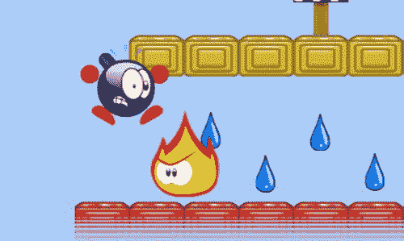

# 二十八、添加玩家互动

在这一章中，您将在玩家和关卡中的对象之间添加更多的交互。目前，玩家可以四处走动，一个基本的物理系统允许玩家跳跃，与墙砖碰撞，或从屏幕上摔下来。首先你看一种非常简单的互动:收集水滴。然后，您将看到如何创建允许玩家在冰上滑行的行为。最后，你要关注程序中处理游戏中各种玩家-敌人互动的部分。

收集水滴

首先要添加的是玩家收集水滴的可能性。如果炸弹人物与水滴碰撞，玩家收集水滴。在这种情况下，你使下降看不见。

一旦玩家收集了一个液滴，让它隐形并不是解决只画未收集的液滴问题的唯一方法，但这是最简单的方法之一。另一种方法是维护一个已经收集的水滴列表，然后只画那些玩家仍然需要找到的水滴，但是这种技术需要更多的代码。

检查玩家是否与水滴碰撞的地方在`WaterDrop`级。原因很清楚:和以前一样，每个游戏对象都要为自己的行为负责。如果在`WaterDrop`类中处理这些碰撞，每个水滴都会检查是否与玩家发生碰撞。你用`update`方法写这段代码。第一步是检索播放器:

```js
var player = this.root.find(ID.player);

```

如果水滴当前可见，使用`collidesWith`方法检查它是否与玩家碰撞。如果是，您将拖放的可见性状态设置为`false`。您还可以播放声音，让玩家知道水滴已被收集:

```js
if (this.collidesWith(player)) {
    this.visible = false;
    sounds.water_collected.play();
}

```

稍后，您可以通过检查每个水滴的可见性来确定关卡是否完成。如果所有的水滴都看不见，你知道玩家已经收集了所有的水滴。

冰块

你可以添加到游戏中的另一种互动是玩家在冰上行走时的特殊行为。当玩家在冰上移动时，您希望角色以恒定的速度继续滑动，并且在玩家释放箭头键时不停止移动。尽管继续滑行并不完全现实(在现实生活中，你会滑行并减速)，但它确实会导致玩家容易理解的可预测行为，这在许多情况下比实现现实主义更重要。要实现这一点，你必须做两件事:

*   扩展`handleInput`方法来处理在冰上移动。
*   计算玩家是否站在冰上。

你在`Player`类的成员变量`walkingOnIce`中跟踪玩家是否站在冰上。现在让我们假设这个变量在别的地方被更新了，让我们看看扩展`handleInput`方法。当角色在冰上行走时，你首先要做的是增加玩家的行走速度。你可以这样做:

```js
var walkingSpeed = 400;
if (this.walkingOnIce) {
    walkingSpeed *= 1.5;
}

```

速度乘以的值是一个影响游戏性的变量。选择正确的值很重要——太快，关卡就变得不可玩了；太慢了，而且冰面在任何有意义的方面都和普通的人行道没有什么不同。

如果玩家不是在冰上行走，而是站在地上，你需要将 *x* 速度设置为零，这样当玩家不再按下箭头键或某个触摸按钮时，角色就会停止移动。为了实现这一点，您将前面的`if`指令扩展如下:

```js
var walkingSpeed = 400;
if (this.walkingOnIce) {
    walkingSpeed *= 1.5;
    this.velocity.x = Math.sign(this.velocity.x) * walkingSpeed;
} else if (this.onTheGround)
    this.velocity.x = 0;

```

然后你处理玩家的输入。如果玩家按下左或右箭头键，您设置适当的 *x* 速度:

```js
if (powerupjs.Keyboard.down(powerupjs.Keys.left))
    this.velocity.x = -walkingSpeed;
else if (powerupjs.Keyboard.down(powerupjs.Keys.right))
    this.velocity.x = walkingSpeed;

```

类似地，如果游戏是在触摸设备上进行的，您可以检查玩家是否正在触摸其中一个按钮，并相应地调整玩家角色的速度。

你唯一需要做的就是找出玩家是否在冰上行走，并相应地更新`walkingOnIce`成员变量。您已经在`handleCollisions`方法中查看了玩家周围的瓷砖，所以要扩展该方法来检查玩家是否在冰上行走，您只需要添加几行代码。在这个方法的开始，你假设玩家不是在冰上行走:

```js
this.walkingOnIce = false;

```

玩家只有在地面上才能在冰上行走。你在下面的`if`指令中检查它们是否在地面上:

```js
if (this._previousYPosition <= tileBounds.top && tileType !== TileType.background) {
    this.onTheGround = true;
    this.velocity.y = 0;
}

```

要检查玩家所站的瓷砖是否是冰瓷砖，您必须从瓷砖字段中检索瓷砖并检查其`ice`属性。这样做很简单:

```js
var currentTile = tiles.at(x, y);

```

最后，您更新了`walkingOnIce`变量。你使用一个逻辑*或*操作符，这样如果玩家只是部分在冰砖上，变量也被设置为`true`:

```js
if (currentTile !== null) {
    this.walkingOnIce = this.walkingOnIce || currentTile.ice;
}

```

只有当`currentTile`变量没有指向`null`时，才执行这条指令。你使用逻辑*或*来计算玩家是否在冰上行走，以便考虑所有周围的牌。效果是角色继续移动，直到它不再站在冰砖上(甚至不是部分地)。

敌人与玩家相撞

最后一种要添加的互动是与敌人的碰撞。在很多情况下，当玩家与敌人发生碰撞时，会导致玩家死亡。在某些情况下，你必须做一些特殊的事情(比如跳到海龟身上时跳得特别高)。在玩家方面，你必须加载一个额外的显示玩家死亡的动画。因为您不想在玩家死亡后处理玩家输入，所以您需要更新玩家当前的存活状态。您可以使用在`Player`类的构造函数中设置为`true`的成员变量`alive`来做到这一点。在`handleInput`方法中，你检查玩家是否还活着。如果不是，你从方法返回，所以你不处理任何输入:

```js
if (!this.alive)
    return;

```

你还加了一个叫`die`的方法让玩家死掉。玩家有两种死法:掉进游戏屏幕外的洞里和与敌人相撞。因此，您向`die`方法传递一个布尔参数，以指示玩家是因摔倒还是因与敌人相撞而死亡。

在`die`方法中，您要做几件事情。首先你要检查玩家是否已经死亡。如果是这样，你什么都不做就从方法返回(毕竟一个玩家只能死一次)。你将变量`alive`设置为`false`。然后你将 *x* 方向的速度设置为零，以阻止玩家向左或向右移动。你没有重置 y 的速度，所以玩家继续下落:当你死亡时，重力并没有消失。接下来，你决定玩家死亡时播放哪种声音。如果玩家摔死，产生的声音和死于敌人之手截然不同(不要真实尝试这个；相信我的话)。如果玩家因为与敌人碰撞而死亡，你也给玩家一个向上的速度。这种向上的速度不太现实，但它确实提供了一个很好的视觉效果(见[图 28-1](#Fig1) )。最后，你播放`die`动画。完整的方法如下:

```js
Player.prototype.die = function (falling) {
    if (!this.alive)
        return;
    this.alive = false;
    this.velocity.x = 0;
    if (falling) {
        sounds.player_fall.play();
    }
    else {
        this.velocity.y = -900;
        sounds.player_die.play();
    }
    this.playAnimation("die");
};

```



[图 28-1](#_Fig1) 。玩家在与敌人相撞后死亡

您可以在`update`方法中通过计算玩家的 *y* 位置是否落在屏幕之外来检查玩家是否会摔死。如果是这种情况，你调用`die`方法:

```js
var tiles = this.root.find(ID.tiles);
if (this.boundingBox.top >=tiles.rows * tiles.cellHeight)
    this.die(true);

```

在`update`方法的开始，您调用超类的`update`方法来确保动画被更新:

```js
powerupjs.AnimatedGameObject.prototype.update.call(this, delta);

```

接下来你做物理和碰撞(即使玩家死了，仍然需要做)。然后你检查玩家是否还活着。如果没有，就完成了，从方法返回。

现在玩家可以以各种可怕的方式死去，你必须扩展敌人的职业来处理碰撞。在`Rocket`类中，您添加了一个名为`checkPlayerCollision`的方法，您在 rocket 的`update`方法中调用该方法。在`checkPlayerCollision`方法中，你只是简单的检查玩家是否与火箭相撞。如果是这种情况，您可以在`Player`对象上调用`die`方法。完整的方法如下:

```js
Rocket.prototype.checkPlayerCollision = function () {
    var player = this.root.find(ID.player);
    if (this.collidesWith(player))
        player.die(false);
};

```

在巡逻的敌人的情况下，你做完全相同的事情。您向该类添加相同的方法，并从`update`方法中调用它。`Sparky`类中的版本略有不同:只有当 Sparky 正在通电时，玩家才会死亡。因此，你改变方法如下:

```js
Sparky.prototype.checkPlayerCollision = function () {
    var player = this.root.find(ID.player);
    if (this.idleTime <= 0 && this.collidesWith(player))
        player.die(false);
};

```

最后，敌人增加了更多的行为。你从检查乌龟是否与玩家发生碰撞开始。如果不是这样，你只需从`checkPlayerCollision`方法返回，因为你已经完成了:

```js
var player = this.root.find(ID.player);
if (!this.collidesWith(player))
    return;

```

如果发生碰撞，有两种可能。首先是乌龟目前在打喷嚏。在这种情况下，玩家死亡:

```js
if (this.sneezing)
    player.die(false);

```

第二种情况是乌龟处于等待模式，玩家正跳到乌龟身上。在这种情况下，玩家应该做一个超高的跳跃。检查玩家是否跳到海龟身上的一个简单方法是看一下 *y* 速度。假设速度为正，玩家跳到海龟身上。所以，你调用`jump`方法让玩家跳得特别高:

```js
else if (player.velocity.y > 0 && player.alive)
    player.jump(1500);

```

当然，只有当玩家还活着的时候你才想这么做。

现在你有了主要的交互编程。在下一章中，你通过在背景中添加山脉和移动的云来完成这个游戏。您还可以添加管理级别之间转换的代码。

死还是不死？

我在这一节做了一个选择，玩家接触敌人时会立即死亡。另一个选择是给玩家几条命，或者给玩家增加一个健康指标，每次玩家碰到一个敌人，健康指标就会减少。

在游戏中加入多个生命或健康指标可以让游戏变得更有趣，但你也必须确保关卡仍然具有足够的挑战性。只有当游戏的等级比本章例子中的等级高得多时，健康条才有意义。您还需要添加侧滚动，以便级别可以比单个屏幕更大。

实现侧边滚动并不困难:你可以根据随玩家移动的相机偏移量来绘制游戏世界中的所有游戏对象。作为一个挑战，尝试用侧滚来扩展滴答滴答游戏，并为玩家添加一个健康栏。

你学到了什么

在本章中，您学习了:

*   如何设计各种玩家与水滴和敌人的互动
*   如何编程 ice tile 行为
*   如何在某些情况下导致玩家死亡