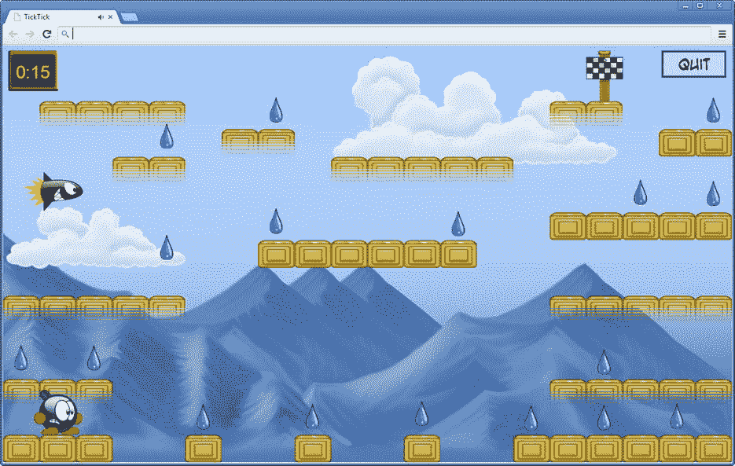

# 二十九、完成滴答滴答游戏

在这一章，你完成滴答滴答游戏。首先你添加一个计时器，这样玩家就有有限的时间来完成每一关。然后你在背景中添加一些山和云，使游戏在视觉上更有趣。最后，您通过添加两个额外的游戏状态来完成关卡:“游戏结束”状态和“关卡完成”状态。

添加计时器

我们先来看看给游戏添加一个*定时器*。您不希望计时器占用太多的屏幕空间，所以您使用它的文本版本。因此，`TimerGameObject`类继承了`Label`类。您希望能够暂停计时器(例如，当关卡完成时)，所以您添加了一个布尔变量`running`来指示计时器是否正在运行。您还将剩余时间存储在一个名为`_timeLeft`的变量中。您重写了`reset`方法来初始化定时器对象。你需要给玩家 30 秒来完成每一关。结果，下面是完整的`reset`方法:

```js
TimerGameObject.prototype.reset = function () {
    powerupjs.Label.prototype.reset.call(this);
    this._timeLeft = 30;
    this.running = true;
};

```

为了方便起见，您还添加了一个属性`gameOver`,指示计时器是否已经到达零。稍后使用该属性来处理玩家没有及时完成关卡的事件:

```js
Object.defineProperty(TimerGameObject.prototype, "gameOver",
    {
        get: function () {
            return this._timeLeft <= 0;
        }
    });

```

现在您唯一需要做的就是实现`update`方法来编程定时器行为。作为第一步，您只需更新正在运行的计时器。因此，如果计时器没有运行，那么从方法:返回

```js
if (!this.running)
    return;

```

然后，像往常一样，从当前剩余时间中减去经过的游戏时间:

```js
this._timeLeft -= delta;

```

接下来，创建要在屏幕上打印的文本。您可以简单地在屏幕上打印秒数，但是让我们使计时器更通用一些，这样也可以定义一个既能处理分钟又能处理秒钟的计时器。例如，如果您想定义一个从两分钟开始倒计时的计时器，您可以按如下方式初始化它:

```js
this._timeLeft = 120;

```

你想在屏幕上显示“2:00”而不是“120”。为此，您需要在`update`方法中计算还剩多少分钟。你用`Math.floor`方法来做这个:

```js
var minutes = Math.floor(this._timeLeft / 60);

```

使用这种方法，您可以确保分钟数不会超过允许值。例如，`Math.floor(119)`给出的结果是 1，这正是您所需要的，因为剩余 119 秒转化为 1 分钟，剩余 119–60 = 59 秒。

通过计算`_timeLeft`除以 60 后的余数，得到秒数。为了只有整数，您还需要对秒数进行舍入，但是您使用了`Math.ceil`方法。这个方法总是向上取整:例如，`Math.ceil(1.2)`的结果是 2。你总是想取整，因为你需要确保只有在真的没有剩余时间的时候才显示零秒。下面是你计算秒数的方法:

```js
var seconds = Math.ceil(this._timeLeft % 60);

```

因为您不想显示负时间，所以您添加了下面的`if`指令:

```js
if (this._timeLeft < 0)
    minutes = seconds = 0;

```

注意，这里使用*运算符链接*T3 来设置分钟和秒钟。下面的`if`指令做的完全一样:

```js
if (this._timeLeft < 0) {
    minutes 0;
    seconds = 0;
}

```

现在您已经计算了剩余的分钟数和秒数，您可以创建一个在屏幕上绘制的字符串:

```js
this.text = minutes + ":" + seconds;
if (seconds < 10)
    this.text = minutes + ":0" + seconds;

```

您将文本的颜色设置为黄色，以便更好地适应游戏的设计:

```js
this.color = powerupjs.Color.yellow;

```

最后，如果玩家剩下的时间不多了，你要警告他们。当在屏幕上打印文本时，您可以通过在红色和黄色之间交替来做到这一点。您可以通过一条`if`指令和对模数运算符的巧妙使用来做到这一点:

```js
if (this._timeLeft <= 10 && seconds % 2 === 0)
    this.color = powerupjs.Color.red;

```

尽管以这种方式计算时间对于 Tick Tick 游戏来说已经足够了，但是您可能会发现自己想要进行更复杂的时间计算。JavaScript 有一个`Date`对象，它代表时间并允许更高级的时间处理，包括时区、转换为字符串等等。

使计时器走得更快或更慢

根据玩家所走的瓷砖种类，时间应该走得更快或更慢。在热瓷砖上行走会加快时间流逝的速度，而在冰瓷砖上行走会减慢时间流逝的速度。为了允许计时器以不同的速度运行，您在`TimerGameObject`类中引入了一个*乘数*值。这个值存储为一个成员变量，您最初将乘数设置为 1:

```js
this.multiplier = 1;

```

在计时器运行时考虑这个乘数是相当容易的。您只需用`update`方法中的乘数乘以经过的时间，就可以了:

```js
this._timeLeft -= delta * this.multiplier;

```

现在你可以改变时间流逝的速度，你可以根据玩家行走的瓷砖类型来改变时间流逝的速度。在`Player`类中，您已经维护了一个变量`walkingOnIce`，它指示玩家是否在冰砖上行走。为了处理热瓷砖，您定义了另一个变量`walkingOnHot`，其中您跟踪玩家是否在热瓷砖上行走。要确定这个变量的值，您可以使用与`walkingOnIce`变量相同的方法。在`handleCollisions`方法中，您最初将这个变量设置为`false` :

```js
this.walkingOnHot = false;

```

然后，添加一行代码，根据玩家当前所处的区块更新变量的值:

```js
this.walkingOnHot = this.walkingOnHot || currentTile.hot;

```

关于完整的代码，请参见属于`TickTickFinal`示例的`Player`类。

使用`walkingOnIce`和`walkingOnHot`变量，您现在可以更新计时器乘数。你在玩家的`update`方法:中这样做

```js
var timer = this.root.find(ID.timer);
if (this.walkingOnHot)
    timer.multiplier = 2;
else if (this.walkingOnIce)
    timer.multiplier = 0.5;
else
    timer.multiplier = 1;

```

从游戏设计的角度来看，明确地让玩家知道在热瓷砖上行走可以缩短完成关卡的时间，这可能是个好主意。您可以通过短暂显示一个警告叠层或更改计时器的显示颜色来实现这一点。您也可以播放警告声音。另一种可能是将背景音乐改为更疯狂的音乐，让玩家意识到有些事情已经改变了。

适应玩家的技能

改变计时器的速度可以使关卡更容易或更难。你可以延长游戏时间，这样在某些情况下，如果玩家拿起一个特殊的物品，计时器就会停止或者向后移动几秒钟。你甚至可以让等级进程自适应，这样如果玩家死得太频繁，每级 30 秒的最大时间就会增加。但是，这样做要小心。如果你以一种过于明显的方式帮助玩家，玩家会意识到这一点并调整他们的策略(换句话说，玩家会为了让关卡更容易而玩得更差)。此外，玩家可能觉得他们没有被认真对待。一个更好的处理适应每一关最大时间的方法是允许玩家(部分)将以前关卡剩余的时间转移到当前关卡。这样，困难的水平可以变得更容易，但玩家必须做一些事情来实现这一点。你也可以考虑增加难度等级，难度越高，计时越快，好处也越多，比如可以获得更多点数、额外物品或玩家的额外能力。休闲游戏玩家可以选择“我可以玩吗，爸爸？”难度级别，而熟练的玩家可以选择极具挑战性的“我是死亡化身”级别。

当计时器到达零时

当玩家没有按时完成关卡时，炸弹爆炸，游戏结束。`Player`类中的一个布尔成员变量表示播放器是否已经爆炸。然后，将名为`explode`的方法添加到启动爆炸的类中。这是完整的方法:

```js
Player.prototype.explode = function () {
    if (!this.alive || this.finished)
        return;
    this.alive = false;
    this.exploded = true;
    this.velocity = powerupjs.Vector2.zero;
    this.playAnimation("explode");
    sounds.player_explode.play();
};

```

首先，如果玩家角色一开始就不存在，或者玩家完成了关卡，那么玩家角色就不能爆炸。在这两种情况下，您只需从方法返回。然后，将活动状态设置为`false`，将分解状态设置为`true`。您将速度设置为零(爆炸不会移动)。然后，播放“爆炸”动画。该动画存储在一个 sprite 表中，由爆炸的 25 帧组成。最后，你播放一个合适的声音。

因为重力也不再影响爆炸的角色，所以只有当玩家没有爆炸时才进行重力物理:

```js
if (!this.exploded)
    this.velocity.y += 55;

```

在`Level`类的`update`方法中，您检查计时器是否已经到零，如果是，您调用`explode`方法:

```js
if (timer.gameOver)
    player.explode();

```

画山画云

为了让关卡背景更有趣一点，我们给它加上山和云。您可以在`Level`构造函数中这样做。先来看看怎么加几座山。为此，您可以使用一条`for`指令。在指令体中，创建一个精灵游戏对象，给它一个位置，并将其添加到`backgrounds`列表中。这是完整的`for`指令:

```js
for (var i = 0; i < 5; i++) {
    var sprid = "mountain_" + (Math.ceil(Math.random()*2));
    var mountain = new powerupjs.SpriteGameObject(sprites[sprid], ID.layer_background_2);
    mountain.position = new powerupjs.Vector2(Math.random() *
        powerupjs.Game.size.x - mountain.width / 2,
        powerupjs.Game.size.y - mountain.height);
    backgrounds.add(mountain);
}

```

第一步是创建精灵游戏对象。你想在不同的山精灵中随机选择。因为有两个山精灵，所以创建一个随机数(1 或 2)在它们之间进行选择。您使用这个数字来创建对应于这个 sprite 的 ID。

然后你计算山的位置。 *x* 位置是随机选择的，你使用一个固定的 *y* 位置，这样山就在合适的高度(你不希望山悬在空中)。最后，山脉对象被添加到`backgrounds`列表中。

对于云，你做一些稍微复杂的事情。你希望云从左向右移动，反之亦然，如果云从屏幕上消失，你希望新的云出现。要做到这一点，您需要在游戏中添加一个`Clouds`类。在`Level`构造函数中创建这个类的一个实例，并赋予它一个比背景本身和山脉更高的层值。这确保了云被画在山的前面:

```js
var clouds = new Clouds(ID.layer_background_3);
backgrounds.add(clouds);

```

因为`Clouds`类包含许多移动的云，所以它是`GameObjectList`类的子类。在构造函数中，您使用一个`for`指令来创建一些云并将它们添加到列表中。每个云都被赋予一个随机的位置和一个随机的速度。看看`TickTickFinal`例子中`Clouds`类的构造函数，看看这是如何实现的。

`Clouds`类也有一个`update`方法，在这个方法中，您可以检查云是否已经退出屏幕。因为您需要为每个云游戏对象做这件事，所以您使用一个`for`指令来遍历列表中的所有云对象。如果云已经退出屏幕，您可以创建一个具有随机位置和速度的新云对象。云可以出现在屏幕的左侧或右侧。如果一朵云位于屏幕外的*左侧*，并且它的 *x* 速度为*负*，你就知道它已经退出了屏幕。如果云位于屏幕外的右侧*且其速度为正*时也是如此。您可以在下面的`if`指令中为云`c`捕获这两种情况:**

```js
if ((c.velocity.x < 0 && c.position.x + c.width < 0) ||
   (c.velocity.x > 0 && c.position.x > powerupjs.Game.size.x)) {
    // remove this cloud and add a new one
}

```

移除云很容易:

```js
this.remove(c);

```

然后创建一个新的云游戏对象:

```js
var cloud = new powerupjs.SpriteGameObject(sprites["cloud_" + Math.ceil(Math.random()*5)]);

```

你给这个云分配一个 *x* 的速度，它可以是正的也可以是负的。云的 *y* 速度总是为零，所以云只水平移动:

```js
cloud.velocity = new powerupjs.Vector2(((Math.random() * 2) - 1) * 20, 0);

```

请注意，在本指令中，您计算一个介于-1 和 1 之间的随机数，然后将该数乘以 20。这允许你随机创建速度为正或负的云。通过将屏幕高度乘以 0 到 1 之间的一个随机数，你可以计算出一个随机的云 *y* 位置。从这个数字中减去云高度的一半，以确保不会生成完全绘制在屏幕下方的云:

```js
var cloudHeight = Math.random() * powerupjs.Game.size.y - cloud.height / 2;

```

根据云移动的方向，您可以将云放置在屏幕的左边界或右边界:

```js
if (cloud.velocity.x < 0)
    cloud.position = new powerupjs.Vector2(powerupjs.Game.size.x, cloudHeight);
else
    cloud.position = new powerupjs.Vector2(-cloud.width, cloudHeight);

```

现在，您将新的云添加到列表中:

```js
this.add(cloud);

```

图 29-1 显示了一个背景中有山脉和移动的云的关卡的截图。



[图 29-1](#_Fig1) 。背景中有山脉和移动的云的滴答滴答水平

在您完成本节之前，让我们再看一遍完整的代码:

```js
for (var i = 0, l = this.length; i < l; ++i) {
    var c = this.at(i);
    if (/* c is outside of the screen */) {
        this.remove(c);
        var cloud = new powerupjs.SpriteGameObject(...);
        // calculate cloud position and velocity
        // ...
        this.add(cloud);
    }
}

```

仔细看看这个循环:在用一条`for`指令遍历列表时，您正在向列表中添加和删除对象。这可能很危险，因为您在`for`指令体中修改了列表的长度，而`i`的值取决于列表的长度。如果不小心的话，您可能会遇到这样的情况:您从正在遍历的列表中删除了一个项目，但是`i`仍然会递增，直到它达到列表的旧长度，当您试图访问超出其界限的列表时，会导致错误。在这种特殊的情况下，你不会遇到麻烦，因为每当你删除一个云，你添加了一个新的；但是在编写这类操作的程序时，你必须非常小心。确保程序在所有情况下都能正确运行的一个方法是使用`break`或`return`调用简单地跳出循环。这样，一旦以某种方式修改了列表，就停止了循环。

最终确定级别晋升

为了完成游戏，您仍然需要添加游戏状态来处理玩家输掉或赢得一个级别的事件。除了“关卡完成”游戏状态之外，这里还有一个明确的“游戏结束”游戏状态。这些状态以一种相当简单的方式编码，就像你在以前的游戏中那样。您可以在属于本章的`TickTickFinal`示例中的`GameOverState`和`LevelFinished`状态类中找到完整的代码。

为了确定玩家是否已经完成了一个关卡，您需要向`Level`类添加一个`completed`属性来检查两件事情:

*   玩家收集了所有的水滴了吗？
*   玩家到达出口标志了吗？

这两件事都很容易检查。要检查玩家是否到达结束符号，您可以查看他们的边界框是否相交。检查玩家是否收集了所有的水滴可以通过验证所有的水滴都是不可见的来完成。这是完整的属性:

```js
Object.defineProperty(Level.prototype, "completed",
    {
        get: function () {
            var player = this.find(ID.player);
            var exit = this.find(ID.exit);
            if (!exit.collidesWith(player))
                return false;
            for (var i = 0, l = this._waterdrops.length; i < l; ++i) {
                if (this._waterdrops.at(i).visible)
                    return false;
            }
            return true;
        }
    });

```

在`Level`类的`update`方法中，您检查该级别是否完成。如果是这样，你调用`Player`类中的`levelFinished`方法，它播放“庆典”动画:

```js
if (this.completed && timer.running) {
    player.levelFinished();
    timer.running = false;
    window.LEVELS[this._levelIndex].solved = true;
}

```

你也停止了计时器，因为播放器完成了。再者，你把这一关的已解决状态设置为`true`，这样下次玩家开始游戏时，浏览器就会记住。在`PlayingState`类中，你根据关卡的状态处理切换到其他状态。下面是该类的`update`方法中相应的代码行:

```js
PlayingState.prototype.update = function (delta) {
    this.currentLevel.update(delta);

    if (this.currentLevel.gameOver)
        powerupjs.GameStateManager.switchTo(ID.game_state_gameover);
    else if (this.currentLevel.completed)
        powerupjs.GameStateManager.switchTo(ID.game_state_levelfinished);
};

```

处理等级转换的代码相当简单，几乎是企鹅配对游戏中使用的代码的翻版。看看`TickTickFinal`例子中的代码，看看这是如何做到的。

您现在已经看到了如何使用常见的元素来构建平台游戏，例如收集物品、躲避敌人、游戏物理、从一个级别进入另一个级别等等。到此为止了吗？那要看你了。要让 Tick Tick 成为商业上可行的游戏，还有很多工作要做。你可能想定义更多的东西:更多的关卡，更多的敌人，更多不同的物品，更多的挑战，更多的声音。你可能还想介绍一些我没有提到的东西:通过网络与其他玩家一起玩，侧边滚动，维护高分列表，在关卡之间播放游戏电影，以及你能想到的其他有趣的东西。使用 Tick Tick 游戏作为您自己游戏的起点。

这本书的最后一部分涵盖了在用 JavaScript 开发游戏和应用程序时需要了解的一些有用的东西。我将更详细地讨论文档，以及一些保护游戏代码和让玩家更快下载游戏的方法。

你学到了什么

在本章中，您学习了:

*   如何给关卡添加计时器
*   如何创建由山和云组成的动画背景*