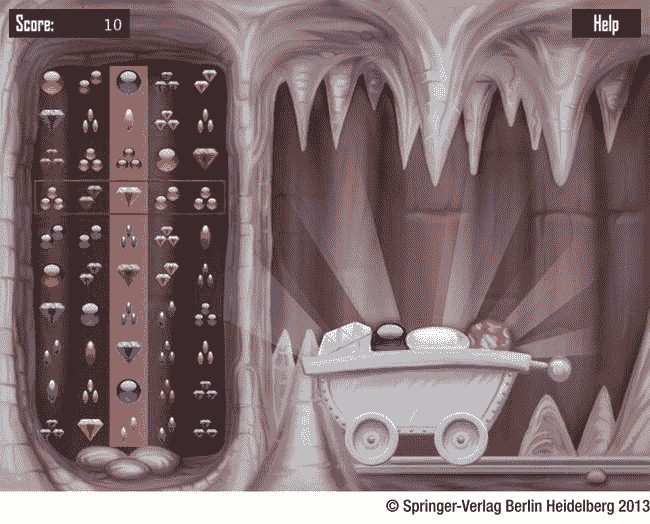

第三部分

珠宝果酱

*宝石果酱*是一款益智游戏，在其中你试图找到宝石的组合(见图 [III-1](#Fig1) )。不过要小心:珠宝车正在慢慢移动。一旦购物车离开屏幕，你的时间就到了！棋盘由十行五列组成。游戏场上的宝石根据三种属性而不同:颜色(红色、蓝色或黄色)、形状(菱形、球形或椭圆形)和数量(一颗、两颗或三颗宝石)。

[图三-1](#_Fig1) 。珠宝果酱游戏

玩家可以使用鼠标或触摸屏(如果在手机或平板电脑上玩游戏)向左或向右移动行。目标是找到中间一列中三个相邻宝石的匹配组合。如果所有对象的每个属性都相同或不同，则三个宝石的组合是有效的。例如，黄色单菱形对象、蓝色单菱形对象和红色单菱形对象形成有效的组合，因为每个对象的颜色不同，而所有对象的形状和数量都相同。黄色的球体对象、黄色的双菱形对象和黄色的三椭圆对象也形成了一个有效的组合，因为这三个对象具有相同的颜色、不同的形状和不同的数字。黄色菱形、红色双球体和蓝色双椭圆的组合是无效的，因为尽管每个对象的颜色和形状都不同，但菱形对象的数量与其他两个不同。另一方面，黄色菱形、红色双球体和蓝色三椭圆的组合是有效的。

一旦玩家通过移动行找到了一个有效的组合，他们按下空格键，组成该组合的珠宝就会消失，剩下的珠宝会落下来填充空槽，三个新的珠宝会从屏幕顶部落下。当玩家按下空格键时，如果中间栏中同时出现两个或三个组合，则会获得额外的分数，并且屏幕上会显示一个覆盖图，指示出现了两个或三个组合。

在接下来的章节中，你开发这个游戏。如果你想玩完整版来感受一下游戏是如何运作的，运行属于第 17 章的例子！