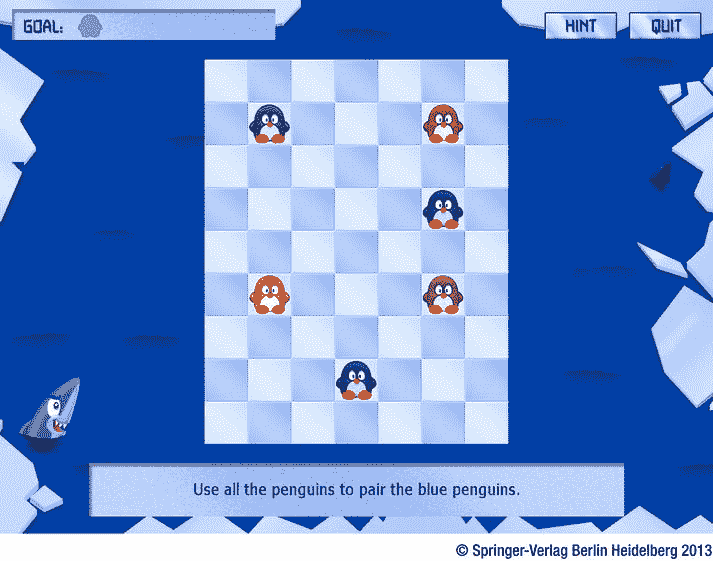

# 第四部分：企鹅配对

<!-- ch 18~23 -->

在书的这一部分，你开发游戏*企鹅配对*(见图 [IV-1](#Fig1) )。我介绍了一些游戏编程的新技术，比如精灵表、更好的游戏状态管理、在会话之间存储游戏数据等等。

[图四-1](#_Fig1) 。企鹅配对游戏

企鹅配对是一个益智游戏，目标是让成对的企鹅颜色相同。玩家可以通过点击或轻拍企鹅来移动它们，并选择企鹅应该移动的方向。企鹅移动，直到它被游戏中的另一个角色(可以是企鹅、海豹、鲨鱼或冰山)阻止，或者它从游戏场地掉落，在这种情况下，它会掉进水里，被饥饿的鲨鱼吃掉。在游戏的不同关卡中，你引入新的游戏元素来保持游戏的刺激。例如，有一种特殊的企鹅可以与任何其他企鹅匹配，企鹅可以卡在一个洞里(意味着它们不能移动)，吃企鹅的鲨鱼可以放在板上。你可以通过尝试属于第 23 章的示例程序来运行这个游戏的最终版本。在浏览器中打开`PenguinPairs.html`文件，即可立即开始播放。