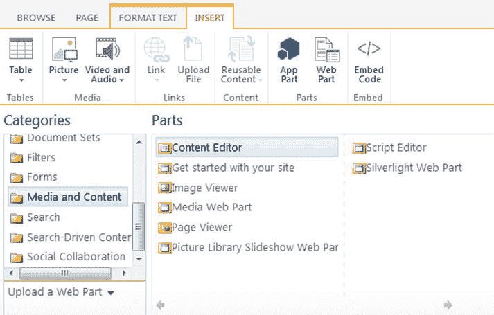
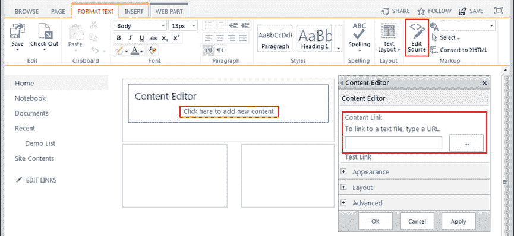
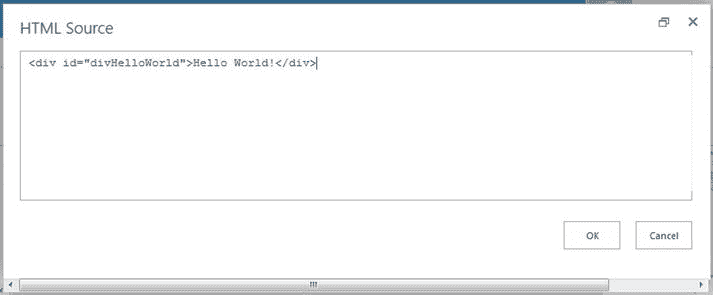
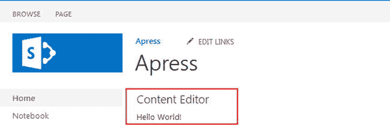
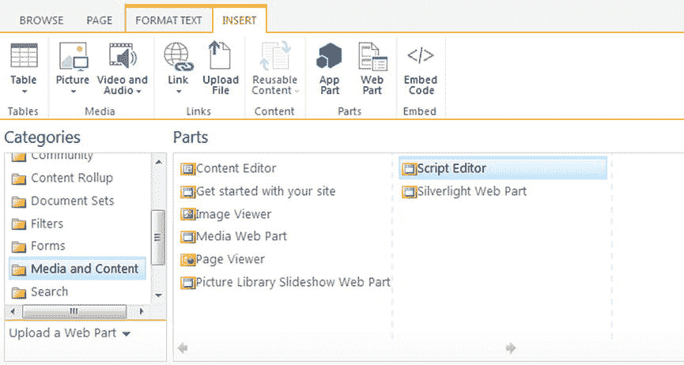
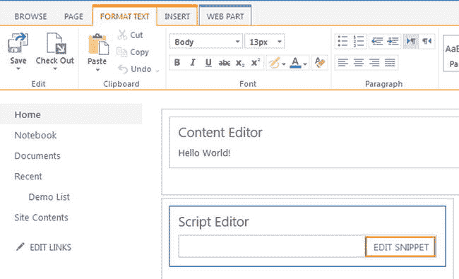
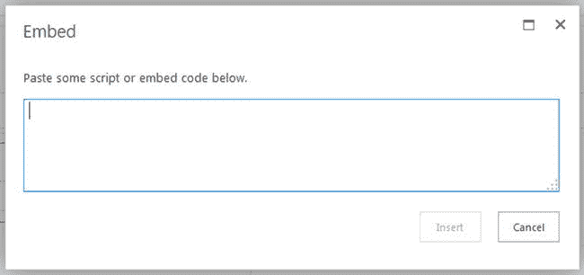
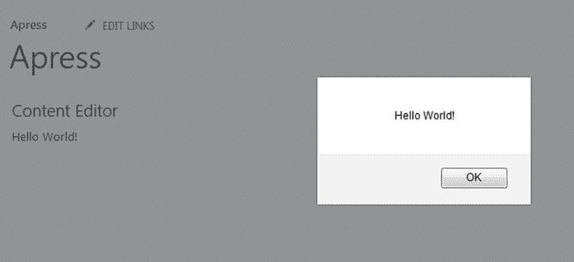
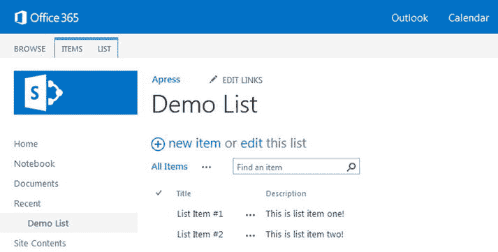
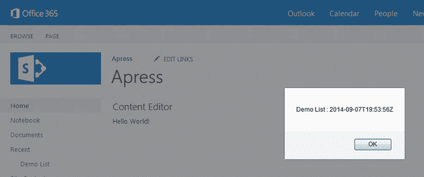

# 三、内容编辑器和脚本编辑器 Web 部件

此时，您应该已经安装了所有需要的工具，并拥有了一个 SharePoint 开发环境。您还了解了服务器端开发和前端开发之间的差异。我们还研究了构成前端开发的一些部分。现在是时候实际开始使用我们所学的一些东西并构建一些东西了！

在本章中，我们将了解如何使用内容编辑器和脚本编辑器 Web 部件。如果您使用 SharePoint 已经有一段时间了，那么您应该已经了解了内容编辑器 Web 部件，并且知道它如何允许您轻松地向任何页面添加 HTML。SharePoint 的最新版本带来了脚本编辑器 Web 部件，它允许您轻松地将 JavaScript 添加到任何页面。我们将了解这些 web 部件如何工作以及如何相互交互。到本章结束时，你将理解使用这些 web 部件的利弊，并且你将已经使用 HTML 和 JavaScript 构建了一些自定义解决方案。

## 内容编辑器 Web 部件

内容编辑器 Web 部件(CEWP)是 SharePoint 领域中的主力；它已经存在很长时间了，大多数用户都很熟悉它。顾名思义，CEWP 用于在 SharePoint 的页面上放置内容。使用此 web 部件，您可以轻松地将 HTML 放在页面上，向用户发布内容、链接列表等等。

通过 CEWP，您可以使用预定义的样式和类似于 Microsoft Word 的编辑工具从功能区添加丰富的内容。您可以直接将 HTML 编写到编辑器中，或者将它指向保存您的标记的 HTML 文件。通过功能区插入 web 部件时，可以在“媒体和内容”类别下找到 CEWP，如图 [3-1](#Fig1) 所示。

图 3-1。

The Media and Content category where you can find the Content Editor Web Part

在页面中插入一个 CEWP，并将其置于编辑模式。您将看到有三种方式可以添加和编辑内容，如下所述，如图 [3-2](#Fig2) 所示。

图 3-2。

The various ways you can add content in a Content Editor Web Part

*   丰富的内容——当你第一次添加一个 CEWP 到一个页面时，那里显然没有内容。在这种情况下，您将看到一个标题为“单击此处添加新内容”的链接。单击此链接会将光标直接放在 web 部件上，您可以使用功能区添加丰富的内容，就像在 Microsoft Word 中一样。这是向页面添加内容的一种简单而方便的方法，但不是构建使用 SharePoint 数据的自定义解决方案的好方法。
*   HTML 标记-插入内容的另一种方法是单击“单击此处添加新内容”链接，然后单击功能区中的“编辑源”按钮。这将打开一个对话框，您可以在其中直接在 CEWP 中键入 HTML 内容。对于快速 HTML 插入或测试 HTML 标记，这是一个很好的选择。对于构建定制解决方案来说，这是一个更好的选择，但不是最好的。
*   链接到 HTML 文件-您也可以直接链接到 HTML 文件以显示 web 部件中的内容。在 CEWP 工具窗格中，第一个属性的标题为内容链接。在此文本框中，只需将 URL 添加到 HTML 文件中，当呈现 web 部件时，就会显示其内容。这是构建定制解决方案时的首选用法，我们将在下一章中讨论。

现在，让我们使用功能区中的 Edit Source 按钮放置一些 HTML。将 CEWP 置于编辑模式，单击“单击此处添加新内容”链接，然后单击功能区中的编辑源按钮。图 [3-3](#Fig3) 显示了点击该按钮后显示的对话框。

图 3-3。

Dialog that is presented after clicking the Edit Source button in the Ribbon

在这个对话框中，我们可以简单地输入我们的 HTML 内容。在这个例子中，我们将添加一个包含 ID 和一些文本的`DIV`元素。下面的 HTML 是所有需要的:

`
Hello World!
`

添加这些内容并保存页面将会产生一个漂亮的“Hello World！”页面上显示的消息，如图 [3-4](#Fig4) 所示。

图 3-4。

HTML content displayed in the Content Editor Web Part

这是一个向页面添加 HTML 内容的非常简单也不太令人兴奋的例子。然而，如果你是添加自定义 HTML 的新手，这将是本章和后续章节的一个很好的起点。现在页面上有了一些 HTML，让我们看看脚本编辑器 Web 部件，并了解如何将自定义 JavaScript 和 HTML 一起注入到页面中。

## 脚本编辑器 Web 部件

脚本编辑器 Web 部件(SEWP)是 SharePoint 2013 的新增功能；顾名思义，它是为在 SharePoint 中向页面添加脚本而设计的。在此 web 部件出现之前，如果您想在页面上插入脚本，可以使用 CEWP。如果您链接到一个包含脚本的文件，这非常有用，但是如果您想要编辑源代码并手动放置脚本，您经常会遇到问题。有时，脚本不会运行，或者会抛出错误，或者更糟的是，CEWP 会更改您输入的代码。这不是一次愉快的经历。

有了 SEWP，这些不再是你需要担心的问题。现在，您可以使用 SEWP 轻松地将 JavaScript 放到页面上，因为它就是为此而构建的。您还可以在此 web 部件中放置其他项目，包括对象标记、HTML 等。通过功能区插入 web 部件时，可以在“媒体和内容”类别下找到 SEWP，如图 [3-5](#Fig5) 所示。

图 3-5。

The Media and Content category where you can find the Script Editor Web Part

在页面中插入一个 SEWP，并将其置于编辑模式。您将看到有一种方法可以添加和编辑脚本——通过单击编辑片段链接，如图 [3-6](#Fig6) 所示。

图 3-6。

Click Edit Snippet to add or edit your JavaScript

点击编辑代码片段链接会打开一个名为嵌入的对话框，你可以在这里写你的 JavaScript，如图 [3-7](#Fig7) 所示。放入此 web 部件的 JavaScript 必须有效，并且包含``标记，才能正常运行。SEWP 甚至还可以用来在页面上放置 HTML。如果您正在放置 HTML，对话框将在您正在工作的文本框下方显示内容的预览。如果您正在编写 JavaScript，则不会显示预览，因为该代码通常在页面中不可见。

图 3-7。

Embed dialog for writing scripts inside the Script Editor Web Part Note

尽管脚本编辑器 web 部件可用于注入 HTML，但您应该将此 Web 部件视为仅用于脚本。将 HTML 和脚本分离到不同的 web 部件中是更好的做法。也就是说，如果您只需要对脚本进行快速测试，它会非常有用。

在本例中，我们将使用 jQuery 添加一些 JavaScript，在页面加载时显示警告:

``

如您所见，这段代码包含一个开始和结束的``

在本例中，我们将调用包装在我们现在熟悉的 document.ready 函数中。AJAX 调用是使用`$.ajax()`函数进行的。它非常简单，只包含几个属性:

*   这是 REST API URL，可以请求您需要的任何特定数据。在这个例子中，我们所请求的只是列表属性。
*   `type` -类型代表标准的 HTTP 方法，即:GET、POST、PUT 和 DELETE。对于这个例子，我们只是请求数据，所以我们使用 GET。
*   `headers`——如前所述，REST API 可以返回 XML 或 JSON。如果您没有指定想要的格式，它将返回缺省值，即 XML。通过指定一个头部`"accept": "application/json;odata=verbose"`，我们告诉 REST API 我们希望 JSON 返回。

在`$.ajax`调用的末尾，我们附加了一个`success`函数，它处理从 REST API 返回的“数据”。jQuery 使得处理 AJAX 调用变得非常容易，并根据调用执行各种功能。例如，你可以附加其他功能，比如一个`failure`和一个`finally`。稍后我们将更详细地讨论这些。

在我们的`success`函数中，我们传递从 REST API 返回的`data`对象。我们现在要做的就是弹出一个带有列表标题和创建数据的警报。我们使用以下代码行来实现这一点:

*   `data.d.Title`
*   `data.d.Created`

`data`对象是查询返回的所有数据。这件物品中有很多我们不会用到的东西。`d`属性保存了我们正在寻找的所有列表属性。这可能看起来很奇怪，但这就是你将如何访问所有通过 REST API 返回的数据。例如，如果您在查询中请求列表项，您可以访问`data.d.results`。将该代码放入 SEWP 并保存页面将会导致如图 [3-10](#Fig10) 所示的警告。

图 3-10。

JavaScript alert showing the Demo List title and date created

现在我们已经建立了 AJAX 调用，并且正在返回数据，您应该会看到令人讨厌的警告弹出窗口。这很好，因为它让我们知道一切都正常工作。然而，在现实生活中，你可能不会仅仅为了弹出提示而调用 REST。让我们用更多的 jQuery 魔法将这些数据放入 CEWP。

### 把它们都连接起来

此时，您的页面上应该有一个 CEWP 和一个 SEWP。CEWP 正在显示一些基本的 HTML，SEWP 正在进行 REST API 调用并弹出一个警告。现在是时候让它们一起工作了，让 SEWP 调用以获取列表数据，然后用结果更新 CEWP 中的 HTML。看完这个示例后，您应该会看到让这两个 web 部件协同工作来创建解决方案是多么容易。

幸运的是，我们不需要对 CEWP 做任何修改！如果你使用了本章这一节中的 HTML，你就已经准备好了。如果不是，应该是这样的:

`
Hello World!
`

这行代码的关键是 DIV 标签中的 ID 属性:`"divHelloWorld"`。通过给 DIV 一个 ID，我们可以很容易地使用 jQuery 在 HTML 中找到元素并更新其内容。还有其他方法可以做到这一点；例如，我们可以在 DIV 上放置一个 CSS 类，并以这种方式进行搜索。无论哪种方式，只要我们能容易地找到元素，我们就能容易地更新它！

现在让我们更新 SEWP 脚本来更新 CEWP。变化很小，但应该会产生很大的影响。用以下代码更新您的脚本；唯一的变化是在`success`函数中，用一些新的 jQuery 代码替换了警告:

``

这一新行只是搜索一个 ID 为`"divHelloWorld"`的 HTML 元素。`#`符号用于指示 jQuery 我们正在寻找一个 ID，而不是其他属性。用这些更改更新 SEWP，点击页面上的保存，将导致 CEWP 的 HTML 被更新，如图 [3-11](#Fig11) 所示。我们在结果中显示创建的日期；您的日期将不同于示例中显示的日期。

图 3-11。

Content Editor Web Part has been updated via the Script Editor Web Part

如果您的眼睛一直盯着 CEWP，您可以在屏幕上看到“Hello World”消息，然后它会更新为列表信息。这是因为我们正在使用 jQuery document.ready 函数，该函数在页面(文档)加载之前不会触发。如果你第一次没有看到，只需点击浏览器中的刷新按钮就可以再次看到。在现实世界中，您的 HTML 可能只是空的，以避免这种类型的可见变化。

## 不是一刀切的解决方案

CEWP 和 SEWP 是将自定义 HTML 和脚本注入页面的快捷方式。此时，你可能会想:我还需要什么？我现在就可以开始构建定制解决方案！当然，这两个 web 部件给了你一个很好的机会为你的用户构建解决方案，它们很容易使用，并且它们可以很好地协同工作。但是，对于更复杂的定制开发来说，这种解决方案不一定是一个很好的选择。

随着您的开发工作的进展，不仅在本书中，而且在您自己的工作中，您可能会发现解决方案需求变得更大、更复杂。您可能会发现需要多个 JavaScript 文件、自定义样式表，甚至可能需要多个 HTML 文件。这种情况会使 CEWP 和 SEWP 的使用变得非常难以控制和管理。此外，您可能会发现需要在多个页面上使用相同的功能。不得不将多个 web 部件放在多个页面上并将它们连接起来是一个挑战。这也为其他用户修改您的 HTML 和 JavaScript 打开了大门。请记住，任何拥有编辑 web 部件权限级别的人都可以编辑这些代码，这可能是一件非常糟糕的事情。

这种解决方案可能非常有效，但应该谨慎使用。对于执行少量工作的简单一次性脚本，或者显示有限数据量的简单 HTML，这是一个很好的解决方案。由于这是一个快速的解决方案，它非常适合测试一些 HTML 和脚本，以确保它们能够正常工作。无论您决定使用这种方法，请花点时间考虑一下，对于您的需求和您的用户来说，这是否是最佳选择。

## 摘要

在本章中，我们探讨了内容编辑器 Web 部件及其新的对应部件，脚本编辑器 Web 部件。我们研究了如何使用这些 web 部件在页面上放置定制的 HTML 和 JavaScript，以及这样做有多容易。您了解了如何通过 jQuery 将 AJAX 调用连接到 REST API 并检索关于列表的数据。最后，我们看了如何将两个 web 部件结合成一个解决方案。

在下一章中，我们将继续使用我们目前所学的知识来构建定制解决方案。我们将看看如何将这种开发转移到更易维护的结构中，并接触一些更高级的脚本。我们还将扩展 REST API 调用，以及 JavaScript 对象模型调用。