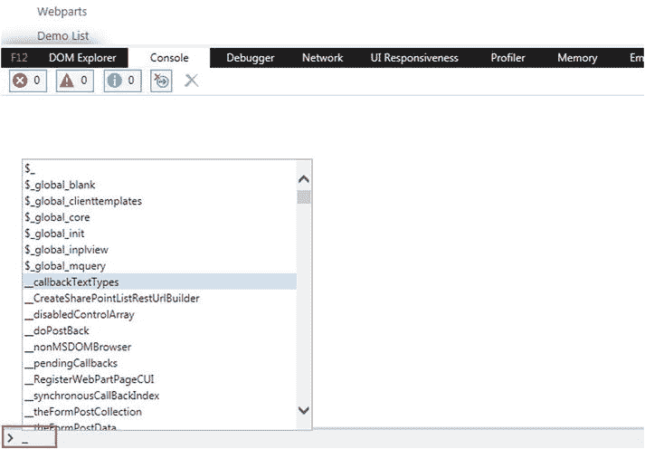
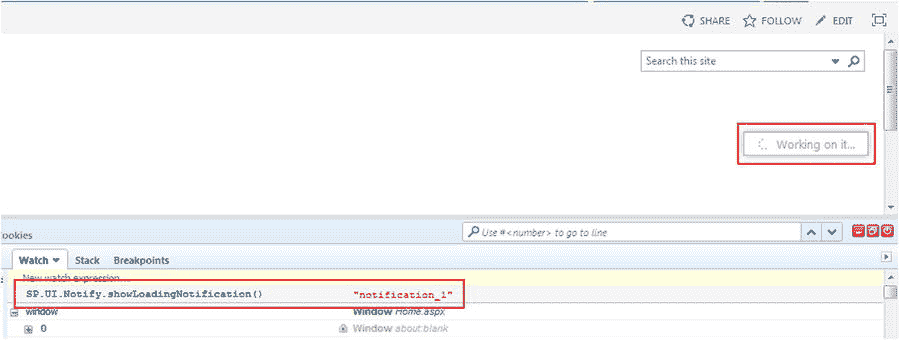
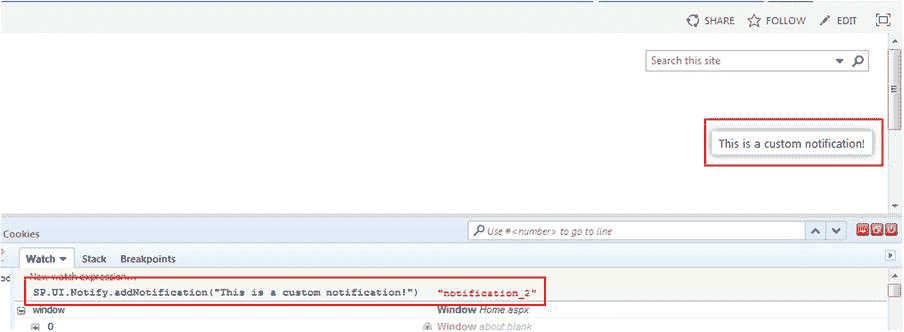
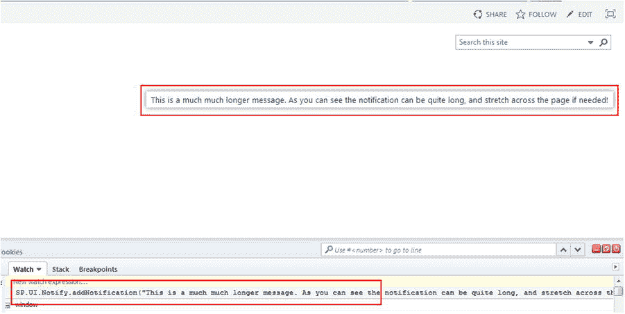
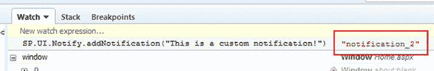

# 7.使用 SharePoint 的内置 JavaScript 函数和属性

当使用 JavaScript 构建定制解决方案时，经常需要其他库的帮助来完成您的工作。我们已经看到了 jQuery 库的强大功能，以及它如何帮助我们在页面上定位 HTML 元素、更新它们的值，甚至使用 AJAX 调用数据。使用 SharePoint 时，您经常需要构建 URL、向用户显示通知等。幸运的是，微软提供了大量的 JavaScript 来帮助你完成这些任务。我不是简单地谈论 JavaScript 对象模型或 REST API。在这一章中，我们将探索一些内置的 JavaScript 函数和属性，它们可以很容易地帮助你构建你的定制解决方案。

## 探索 JavaScript

SharePoint 附带了一长串内置的 JavaScript 方法和属性，您可以在代码中使用它们。事实上，这份清单太长了，一旦你开始钻研，它似乎会让人不知所措。然而，在您的日常编码工作中，您将很快习惯其中的一些，并且当需要时，您可以放心地知道有更多的帮助。让我们首先使用 Internet Explorer 11 的开发工具来探索一些文件。正如本书前面提到的，每种浏览器都有自己的一套开发工具，每种工具都略有不同。你完全可以在每一个中执行相同的任务，但是一旦你开始在 JavaScript 控制台中键入，IE11(和 Chrome)会显示一个可用功能的便捷列表，如图 [7-1](#Fig1) 所示。

图 7-1。

Developer tools in IE11\. Typing an underscore in the console window will display a list of available JavaScript functions

通过按键盘上的 F12 打开 IE11 中的开发工具。您也可以通过浏览器中的设置按钮来访问它们。单击控制台选项卡，并在底部的文本框中键入下划线。将打开一个列表，显示所有以下划线开头的 JavaScript 函数。您可以使用箭头键在列表中上下移动。

花几分钟时间浏览你在这里看到的一切。它应该给你一个很好的指示，说明在 SharePoint 中使用 JavaScript 的可能性。您已经看到了其中一些功能的运行；例如，当使用 JSLink 时，我们利用了`SPClientTemplates`功能来覆盖 web 部件呈现。

Note

可供您使用的 JavaScript 方法和属性非常广泛。以至于没有办法在一个单独的章节中恰当地涵盖它；这需要一整本书。我们将查看一些功能，并在示例代码中使用它们。你应该花些时间充分探索开发者工具中的功能，并使用 Google 或 Bing 追踪更多信息。

## _spBodyOnLoadFunctions

`_spBodyOnLoadFunctions`是一个数组，它保存了一组 JavaScript 函数，这些函数应该在页面加载时被触发。我们在[第 5 章](5.html)中看到过，当我们需要连接一个函数来触发页面加载时。该数组包含一个名为`push`的方法，您可以在其中传入应该被触发的函数的名称:

`_spBodyOnLoadFunctions.push(<FUNCTION_NAME>);`

当您无法访问 jQuery `Document.ready()`函数时，这是一个非常有用的函数。还有一个等价的函数叫做`ExecuteOrDelayUntilBodyLoaded`，它执行相同的任务，甚至有相同的签名:

`ExecuteOrDelayUntilBodyLoaded(<FUNCTION_NAME>);`

## _spPageContextInfo

在编写任何类型的代码时，无论是 JavaScript 还是 C#之类的，总会有需要了解页面、位置或其他环境变量的时候。`_spPageContextInfo`对象可以轻松地提供大量有用的信息。在本书的大多数例子中，它被用来提供位置信息，以便构建请求数据的 URL。起初，这似乎不是非常重要的信息，但是当进行 REST API 调用或者通过 JavaScript 对象模型定位另一个站点时，它变得极其重要。

Note

在 Firebug 或开发工具中，可以很容易地访问`_spPageContextInfo`对象的所有属性。只需打开 JavaScript 控制台窗口，在每个窗口中键入内容，就可以看到您的环境的结果。

### _ sppagecontext info . site absolute URL

此属性提供用户所在的当前网站集的绝对 URL。绝对 URL 是完全限定的 URL，它包含协议(`http://`或`https://`)和域名( [`www.` `yoursite` `.com`](http://www.yoursite.com/) )。由于 SharePoint 可以利用备用访问映射，从而允许您对相同的内容使用不同的域，因此该功能提供了一种非常有用的方法来构建 URL，而不必担心用户从哪里访问页面。

由于这是网站集的路径，因此生成的 URL 可能类似于以下内容:

*   `http://www.<DOMAIN>.com`
*   `http://www.<DOMAIN>.com/sites/<SITE_NAME` `>`

### _ sppagecontext info . site server relative URL

此属性为用户所在的当前网站集提供相对于服务器的 URL。相对 URL 只是从 URL 中省略了协议和域。这是一个方便的工具，因为很多时候你需要网站集的相对 URL。如前所述，由于 SharePoint 内容能够在许多不同的域上被访问，因此以相对 URL 为目标允许您跨多个域发布相同的代码，而不用担心代码将在哪里运行。

例如，如果您要在根站点集合中调用该属性，那么产生的 URL 将只是`/`。

### _ sppagecontextinfo . webabsoluteurl

此属性提供用户所在的当前网站的绝对 URL。这是包括协议和域的完全限定的 URL。URL 生成的代码如下所示:

*   `http://www.<DOMAIN>.com`
*   `http://www.<DOMAIN>.com/<SUBSITE` `>`
*   `http://www.<DOMAIN>.com/sites/<SITE_COLLECTION>/<SUBSITE` `>`

### _ sppagecontextinfo 服务器相对关系

此属性为用户所在的当前网站提供相对于服务器的 URL。与相对于站点的 URL 一样，它从 URL 中省略了协议和域。URL 生成的代码如下所示:

*   `/`
*   `/<SUBSITE>`
*   `/sites/<SITE_COLLECTION>/<SUBSITE>`

## ExecuteOrDelayUntilScriptLoaded

这个函数允许您指定一个 JavaScript 函数延迟，直到另一个脚本被完全加载。本质上，我们是在告诉 SharePoint:“我想运行这个特定的函数，但是我需要等到这个脚本被加载。”它有以下签名:

`ExecuteOrDelayUntilScriptLoaded(<FUNCTION_NAME>, <SCRIPT_FILE>);`

SharePoint 首先检查是否加载了指定的 JavaScript 文件；如果是，它会立即执行指定的函数。如果文件没有被加载，它将函数调用放入一个队列中，稍后再执行。我们将在下一章使用 JavaScript 对象模型查询用户数据时用到它:

`$(function () {`

`ExecuteOrDelayUntilScriptLoaded(getUserProfileProperties, "sp.userprofiles.js");`

`});`

`function getUserProfileProperties() {`

`var clientContext = new SP.ClientContext();`

`...`

正如您在这个代码片段中看到的，我们有一个 jQuery `Document.ready()`函数，我们在其中放置了`ExecuteOrDelayUntilScriptLoaded`函数。我们传入函数`getUserProfileProperties`和 JavaScript 文件`sp.userprofiles.js`。我们需要在这里实现这个函数，因为函数中包含的代码只有在加载了`sp.userprofiles.js`文件的情况下才能运行。SharePoint 提供了一种确保代码功能的简单方法！

Note

`ExecuteOrDelayUntilScriptLoaded`功能是 SharePoint 2010 的延续，它位于`SP.SOD`对象下。SharePoint 2013 中存在较新版本无法正常工作的情况，通常是在发布门户页面上。如果您发现此功能不起作用，您可以恢复到 2010 年的实现。更多信息请访问 [`http://msdn.microsoft.com/en-us/library/office/ff408081%28v=office.14%29.aspx`](http://msdn.microsoft.com/en-us/library/office/ff408081%28v=office.14%29.aspx) 。

## 物种 UI .通知

`SP.UI.Notify`对象提供了多种方式来通知用户有事情发生。此功能提供了一种利用现成 SharePoint 通知的方式，并允许您的自定义解决方案无缝融入环境。虽然本书中的示例没有利用这种通知框架，但是可以很容易地对它们进行重构，以便在发生创建或删除操作时包含通知。如果可能的话，通知用户事件的发生总是一个好的做法。

### SP(存储处理器)。ui . notify . showloadingnotification

`SP.UI.Notify.showLoadingNotification`功能是显示熟悉的“正在处理中...”的一种快速简单的方式通知。如果你使用 SharePoint 有一段时间了，你肯定会看到这些信息中的一条，它会从屏幕的右侧弹出。它包括一个“旋转器”图标，如图 [7-2](#Fig2) 所示。

图 7-2。

Loading notification launched via Firebug

您可以随时在代码中使用以下代码行启动此通知:

`SP.UI.Notify.showLoadingNotification();`

事实上，您也可以启动 Firebug 或开发人员工具，并在浏览器中直接调用它。图 [7-2](#Fig2) 显示了从控制台通过 Firebug 触发的通知。

这是一种快速便捷的方式，通过您的代码通知用户有事情发生。虽然这种一般的通知在某些情况下肯定是足够的，但是您可能需要提供更多关于正在发生的事情的解释。为此，您可以使用`SP.UI.Notify.addNotification`方法。

### 物种 UI.Notify.addNotification

与前面的函数非常相似，`SP.UI.Notify.addNotification`用于在同一位置向用户显示通知，但带有自定义消息。当您需要通知用户一个动作正在发生，但需要比简单的“正在进行中...”更具描述性时，这是非常完美的消息。图 [7-3](#Fig3) 显示了正在显示的自定义信息。

图 7-3。

A custom message being displayed to notify the user

您可以使用以下命令行启动此通知:

`SP.UI.Notify.addNotification("Your Custom Message");`

如您所见，通过 JavaScript 添加自定义通知再简单不过了。您显示的消息没有最大长度限制。然而，随着消息变长，它最终会到达屏幕的另一侧，文本开始换行。这可能并不总是正确的布局，所以最好保持你的信息简短。图 [7-4](#Fig4) 显示了一条更长的信息。

图 7-4。

A longer message can be displayed via a notification

通知只会在页面上停留大约 6 秒钟。如果您只需要通知用户发生了一个动作，但不需要等待响应，这就很好。然而，有时候你需要开始一个行动，然后等待一个结果。在这种情况下，你可能需要你的通知多留一会儿。您可以使用以下行包含一个布尔值来指示通知应该保留:

`SP.UI.Notify.addNotification("Your Custom Message", true);`

通过使用前面的代码行，通知将一直存在，直到被手动关闭。您可以通过调用`SP.UI.Notify.removeNotification`函数，从`addNotification`函数调用传入通知 ID 来实现这一点。当您调用`addNotification`函数时，您会得到刚刚创建的通知的 ID，如图 [7-5](#Fig5) 所示。

图 7-5。

The Notification ID that is returned when you create a new notification

如果我们在代码中使用它，该行将如下所示:

`var notifyId = SP.UI.Notify.addNotification("Hello World", true);`

当我们执行这一行时，`notifyId`变量现在有了新创建的通知的 ID。稍后，我们可以使用以下代码行来关闭通知:

`SP.UI.Notify.removeNotification(notifyId);`

`SP.UI.Notify.removeNotification`只是获取通知的 ID 并将其从屏幕上删除。当调用`showLoadingNotification`函数时，也可以使用布尔标志:

`SP.UI.Notify.showLoadingNotification(true);`

传入布尔值触发通知 ID 的相同返回，如图 [7-6](#Fig6) 所示。

图 7-6。

A Notification ID is returned when using the Boolean flag

这些函数提供了一种简单的方式，通过 JavaScript 通知用户正在发生什么。例如，如果您需要执行一个长时间运行的 AJAX 调用，您可以让用户知道这正在发生，这样他们就不会对您的 web 部件失去耐心。

## 摘要

微软已经走了很长一段路，不仅为开发人员提供了通过 JavaScript 访问数据的方法，还开发了核心的 SharePoint 功能。在这一章中，我们探索了一些内置的 JavaScript 函数和属性。我们看到了如何访问位置数据来更容易地为 REST API 调用和超链接构建 URL。我们看到了如何将函数调用加载到 SharePoint 内的 body onload 事件中，以及如何确保在执行代码之前功能对代码可用。最后，我们看了一些不同的方法来通知你的用户你的代码正在做什么来提供更好的用户体验。