# 8.使用 JavaScript 对象模型

到目前为止，已经向您介绍了使用 HTML 和 JavaScript 在 SharePoint 中创建自定义解决方案的几种不同方法。在这一章中，我们将继续探索使用 Etherson 方法来创建定制的 web 部件以及 JavaScript 对象模型。在第二章中，我们简要地看了一下 JavaScript 对象模型，或 JSOM。在这一章中，我们将了解如何使用 JSOM 处理列表、库、文件、网站和社交数据。将向您介绍使用 SharePoint 数据的各种方法，并开始全面了解这项技术的威力。

JSOM 有能力为您的发展需求提供广泛的选择。您可以创建新列表和网站；你可以读取文件，与社交数据互动。到本章结束时，你将对如何编写 JSOM 代码有一个坚实的掌握，并知道它能做什么。

Note

利用 JavaScript 对象模型的代码在登录用户的上下文中运行。这意味着代码只能执行用户权限级别允许的操作。例如，如果您有在网站集中创建新的子网站的代码，但登录的用户没有该权限，它将运行但会产生错误。在构建解决方案时请记住这一点，并确保不向用户展示他们无法利用的选项。

## 正在设置

在开始之前，我们需要在本书中一直使用的演示列表中添加一些额外的数据。添加一些额外的数据将允许我们查询更多的数据和应用过滤器。导航到演示列表，并添加更多具有不同状态的列表项。更新后的列表如图 [8-1](#Fig1) 所示。

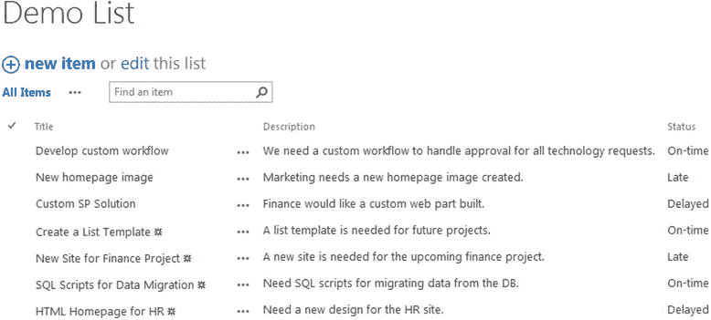

图 8-1。

Demo List with more items added to it

现在我们在列表中有了一些额外的数据，让我们开始看看如何使用 JSOM 查询数据。本章中的例子将利用第 4 章中介绍的 Etherson 方法。导航到站点中的 Webparts 文件夹，新建一个名为 Chapter 8 的文件夹，如图 [8-2](#Fig2) 所示。

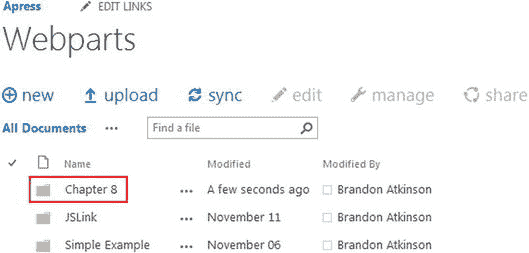

图 8-2。

Chapter 8 folder in the Webparts document library

本章中的每个例子都将遵循相同的模式。我们将查看在内容编辑器 Web 部件中呈现的 HTML 文件，用于检索和呈现数据的 JavaScript 文件，最后是结果。在这个过程中，我们将深入每个文件并解释发生了什么。

## 使用列表

SharePoint 中到处都是列表！作为用户，您将在 SharePoint 中与列表进行交互。下面的例子将演示通过代码与列表交互的各种方式。

### 获取列表数据

在这个例子中，我们将简单地检索一些列表数据来显示给用户。

#### 超文本标记语言

在 Visual Studio 中创建新的 HTML 文件，并将其命名为 JSOMGetListData.html。本例的 HTML 非常简单，仅包含以下几行:

``

``

``

`

`

首先，您会注意到我们必须加载两个 SharePoint JavaScript 文件:`sp.runtime.js`和`sp.js`。这两个文件非常重要，因为它们提供了正确运行 JSOM 代码所需的必要代码。在 SharePoint 2010 中，所有需要的 JavaScript 总是加载在每个页面上。这使得 JavaScript 开发变得更加容易，因为您不必担心核心 SharePoint 脚本是否被加载。在 SharePoint 2013 中，只加载页面所需的基本代码。这有助于 SharePoint 更快地加载页面；但这也意味着，如果你需要一个特定的库，你需要确保它是加载的。在我们的例子中，我们需要这两个文件。

接下来，我们加载名为`JSOMGetListData`的自定义 JavaScript 文件。该文件包含将数据加载到页面上的 DIV 的所有代码，该页面的 ID 为`divGetListData`。总而言之，这一页没有多少内容。

#### Java Script 语言

在 Visual Studio 中创建一个新的 JavaScript 文件，并将其命名为 JSOMGetListData.js。相比之下，该 JavaScript 文件更复杂，由以下几行组成:

`$(function () {`

`getListData();`

`});`

`function getListData() {`

`var clientContext = new SP.ClientContext();`

`var oWebsite = clientContext.get_web();`

`this.collList = oWebsite.get_lists();`

`clientContext.load(collList);`

`clientContext.executeQueryAsync(`

`Function.createDelegate(this, this.onQuerySucceeded),`

`Function.createDelegate(this, this.onQueryFailed)`

`);`

`}`

`function onQuerySucceeded() {`

`var listInfo = '';`

`var listEnumerator = collList.getEnumerator();`

`while (listEnumerator.moveNext()) {`

`var oList = listEnumerator.get_current();`

`listInfo += 'Title: ' + oList.get_title() + ' - Created: ' +`

`oList.get_created().toString() + ' ';`

`}`

`$("#divGetListData").html(listInfo);`

`}`

`function onQueryFailed(sender, args) {`

`alert('Request failed. ' + args.get_message() +`

`'\n' + args.get_stackTrace());`

`}`

本书中的大多数 JSOM 例子都遵循与这个例子相同的模式。让我们深入到每一行的细节，以充分了解发生了什么。该脚本以一个 jQuery `Document.ready`方法开始，该方法简单地调用一个名为`getListData`的自定义函数，该函数进行 JSOM 调用，并且是主要代码所在的位置。

首先，我们创建一个名为`clientContext`的新变量，并使用以下代码行设置它:

`var clientContext = new SP.ClientContext();`

客户端上下文是一个 SharePoint 对象，它实际上是所有 JSOM 调用的入口点。它保存了大量关于当前站点、用户、web 等的上下文信息。在这个例子中，我们只是要求返回上下文，而不传递任何参数。这将自动返回当前站点的上下文。您也可以通过传入一个 URL 来询问其他站点的上下文；比如，`SP.ClientContext('` [`http://www.site.com`](http://www.site.com/) `')`。

接下来，我们创建另一个名为`oWebsite`的变量，并使用以下代码行设置它:

`var oWebsite = clientContext.get_web();`

这将为我们提供用户执行代码的站点集合中的当前站点或网站。我们需要这个网站来获取所有的列表。接下来，我们使用下面的代码行创建另一个名为`collList`的变量:

`this.collList = oWebsite.get_lists();`

该变量由来自`oWebsite`变量的所有列表填充。`collList`变量的声明与其他变量略有不同，因为这里没有`var`关键字，而是`this`。这样做的原因是，`this`关键字将使这个变量成为全局变量，以便以后处理数据所需的函数可以访问它。

当您第一次开始使用 JSOM 时，下一行通常会让您感到头疼:

`clientContext.load(collList);`

这一行将查询“加载”到客户端上下文中，以发送到 SharePoint。这意味着此时您实际上还没有向 SharePoint 发送任何数据请求。在大多数 JavaScript 开发中，您可能会认为像`this.collList = oWebsite.get_lists();`这样的行会立即返回所有列表，您可以开始使用它们了。在 JSOM，情况并非如此。您必须加载您想要发出的任何请求，然后使用下面的行提交它们:

`clientContext.executeQueryAsync(`

`Function.createDelegate(this, this.onQuerySucceeded),`

`Function.createDelegate(this, this.onQueryFailed)`

`);`

直到调用`executeQueryAsync`函数，对 SharePoint 的请求才真正发生。在使用 JSOM 时，理解这一点非常重要，这也是很多开发人员第一次起步时会犯的错误。在提交请求之前必须加载所有请求的原因是一个称为批处理的特性。基本上，SharePoint 允许您加载多个数据请求，然后只进行一次执行调用来获取您需要的所有数据。这使得实际处理 JSOM 调用的服务器性能更好。本书中没有一个例子真正利用了批处理，但这是一个需要了解的重要概念。

`executeQueryAsync`方法允许您指定一个`success`函数和一个`failure`函数，它们在 SharePoint 返回查询结果后被调用。这些是使用`Function.createDelegate`方法声明的，如前所示。一旦指定了这些，就需要创建函数来实际处理结果。

`function onQuerySucceeded() {`

`var listInfo = '';`

`var listEnumerator = collList.getEnumerator();`

`while (listEnumerator.moveNext()) {`

`var oList = listEnumerator.get_current();`

`listInfo += 'Title: ' + oList.get_title() + ' - Created: ' +`

`oList.get_created().toString() + ' ';`

`}`

`$("#divGetListData").html(listInfo);`

`}`

这个函数以一个名为`listInfo`的新变量开始，这个变量将用于保存查询的所有结果，然后将它们显示在页面上。接下来，我们使用`collList.getEnumerator()`方法从`collList`变量中获取一个枚举器，并将其放入一个名为`listEnumerator`的变量中。我们需要遍历返回的所有结果，枚举器允许我们这样做。使用`while`循环，我们遍历使用`listEnumerator.get_current()`方法返回的每个项目。在每个循环中，我们从当前项目中获取标题和创建日期。我们包含更多的 HTML，并使用`+=`将内容添加到`listInfo`变量中。这允许我们不断向`listInfo`变量添加内容，而不是每次都覆盖它。

最后，我们使用`$("#divGetListData").html(listInfo);`将`listInfo`变量的内容输出到 HTML 页面中的 DIV。

#### 结果

将内容编辑器 Web 部件的内容链接属性设置为 HTML 文件，并保存页面。结果将显示当前站点的所有列表，如图 [8-3](#Fig3) 所示。

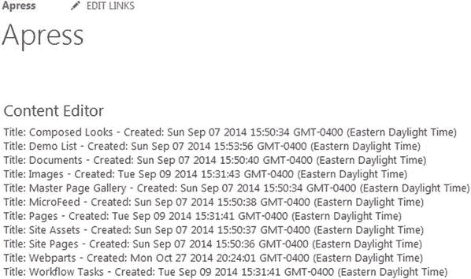

图 8-3。

Get List Data results in the Content Editor Web Part

### 创建新列表

在本例中，我们将创建一个新列表。我们不会做任何花哨的事情，只是创建一个新的列表并设置它的标题。

#### 超文本标记语言

在 Visual Studio 中创建新的 HTML 文件，并将其命名为 JSOMCreateList.html。这个示例的 HTML 比上一个示例稍微复杂一些，它由以下几行组成:

``

``

``

`
`

`<strong>Enter a name for the list:</strong>`

`<input type="text" id="txtListName" />`

`<input type="button" id="btnSubmitListName" value="Submit" />`

`
`

`

`

和以前一样，我们需要加载`sp.runtime.js`和`sp.js`文件，以及对我们定制的 JavaScript 文件的引用。HTML 稍微复杂一点，页面上有几个元素。首先，一些简单的文本被包装在一个`<strong>`标签中，使其在页面上加粗。接下来，有一个文本类型的输入，它只是一个简单的文本框，供用户输入他们希望创建的列表的名称。有一个按钮供用户提交新的列表请求，最后还有一个 DIV，我们可以在其中输出列表创建的结果。每个元素都有一个 ID，所以我们可以很容易地用 jQuery 找到它。

Note

为了通过 JSOM 创建新列表，执行代码的用户必须至少拥有 SharePoint 中的“管理列表”权限。无论权限级别如何，都将呈现该页面；但是，如果用户没有足够的权限，SharePoint 将引发错误。

#### Java Script 语言

在 Visual Studio 中创建新的 JavaScript 文件，并将其命名为 JSOMCreateList.js。相比之下，JavaScript 文件更复杂，它由以下几行组成:

`$(function () {`

`bindButtonClick();`

`});`

`function bindButtonClick() {`

`$("#btnSubmitListName").on("click", function () {`

`var listName = $("#txtListName").val();`

`createList(listName);`

`});`

`}`

`function createList(listName) {`

`var clientContext = new SP.ClientContext();`

`var oWebsite = clientContext.get_web();`

`var listCreationInfo = new SP.ListCreationInformation();`

`listCreationInfo.set_title(listName);`

`listCreationInfo.set_templateType(SP.ListTemplateType.genericList);`

`this.oList = oWebsite.get_lists().add(listCreationInfo);`

`clientContext.load(oList);`

`clientContext.executeQueryAsync(`

`Function.createDelegate(this, this.onQuerySucceeded),`

`Function.createDelegate(this, this.onQueryFailed)`

`);`

`}`

`function onQuerySucceeded() {`

`var results = oList.get_title() + ' successfully created!';`

`$("#divCreateListResults").html(results);`

`}`

`function onQueryFailed(sender, args) {`

`alert('Request failed. ' + args.get_message() +`

`'\n' + args.get_stackTrace());`

`}`

在这个例子中，我们不需要在页面加载上触发任何动作；然而，我们确实需要在页面加载时连接一个按钮点击事件。在`Document.ready`函数中，我们触发了`bindButtonClick`函数。在这个函数中，我们使用 jQuery `on`操作符在 HTML 中的`btnSubmitListName`按钮上连接一个点击事件。当用户点击按钮时，我们从页面上的文本框中获取文本，并使用以下代码行将其传递给`createList()`函数:

`function bindButtonClick() {`

`$("#btnSubmitListName").on("click", function () {`

`var listName = $("#txtListName").val();`

`createList(listName);`

`});`

`}`

`createList()`函数接受一个名为`listName`的变量，它是用户在页面上输入的文本。接下来，我们获取对当前客户端上下文的引用，并获取当前 web。然后，我们使用以下代码创建列表:

`var listCreationInfo = new SP.ListCreationInformation();`

`listCreationInfo.set_title(listName);`

`listCreationInfo.set_templateType(SP.ListTemplateType.genericList);`

`this.oList = oWebsite.get_lists().add(listCreationInfo);`

`clientContext.load(oList);`

为了创建一个新的列表，我们使用了一个`SP.ListCreationInformation()`对象。我们可以使用下面的代码实例化一个新的`ListCreationInformation`对象:

`var listCreationInfo = new SP.ListCreationInformation();`

这一行所做的就是创建一个新对象，并给它分配一个名为`listCreationInfo`的新变量。接下来，我们使用以下代码行设置标题和模板:

`listCreationInfo.set_title(listName);`

`listCreationInfo.set_templateType(SP.ListTemplateType.genericList);`

`set_title`方法接受传递给函数的`listName`。`set_templateType`方法接受一个内置值`SP.ListTemplateType`，在本例中，我们传入的是`genericList`。如果使用 SharePoint UI 在浏览器中创建列表，这里的可用值将是您期望看到的任何值，例如:公告、日历、任务等等。接下来，我们使用以下代码行将列表添加到 web:

`this.oList = oWebsite.get_lists().add(listCreationInfo);`

`clientContext.load(oList);`

就像前面的例子一样，在我们将列表添加到站点之后，我们将列表“加载”到客户端上下文中。最后，我们调用`executeQueryAsync`函数，该函数实际上会调用 SharePoint 来创建列表。调用完成后，我们使用以下函数处理结果:

`function onQuerySucceeded() {`

`var results = oList.get_title() + ' successfully created!';`

`$("#divCreateListResults").html(results);`

`}`

在这个函数中，使用`oList.get_title()`方法，我们可以获得刚刚创建的列表的标题。这是一个很好的检查，可以确保列表确实被创建了，因为我们从列表本身获得标题，而不是使用用户输入的文本。一旦我们有了列表标题，我们使用 jQuery 将成功消息添加到页面上的`divCreateListResults` DIV 中。

#### 结果

将内容编辑器 Web 部件的内容链接属性设置为 HTML 文件，并保存页面。该页面现在将显示文本框和按钮，供用户输入新的列表名称。键入我的自定义列表，然后单击提交按钮。结果将显示成功信息，如图 [8-4](#Fig4) 所示。

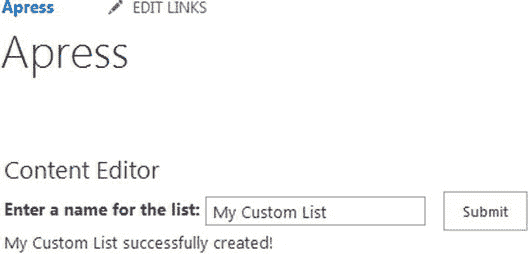

图 8-4。

Create new list code after it has been run

因为这些都是使用 JavaScript 和 AJAX 完成的，所以列表会被创建，用户会得到预期的通知。但是，页面上的左侧导航将不会更新，因为页面尚未刷新。您完全可以更改这段代码，以便在成功时刷新页面，但是在本例中，我们只是在浏览器中刷新页面。图 [8-5](#Fig5) 显示了刷新后的页面，新列表显示在左侧导航中。

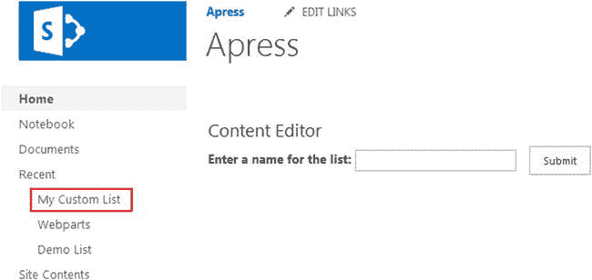

图 8-5。

The new list as displayed in the left navigation pane

### 删除列表

在本例中，我们将简单地删除我们在上一节中刚刚创建的列表。

#### 超文本标记语言

在 Visual Studio 中创建新的 HTML 文件，并将其命名为 JSOMDeleteList.html。此示例的 HTML 与上一个示例几乎相同，它由以下几行组成:

``

``

``

`
`

`<strong>Enter the name of the list to delete:</strong>`

`<input type="text" id="txtListName" />`

`<input type="button" id="btnSubmitListName" value="Submit" />`

`
`

`

`

这里唯一的不同是，我们更新了页面上的文本，以表明这是将删除列表的 web 部件，并且我们将结果 DIV 的 ID 更改为`divDeleteListResults`。

#### Java Script 语言

在 Visual Studio 中创建一个新的 JavaScript 文件，并将其命名为 JSOMDeleteList.js。

`$(function () {`

`bindButtonClick();`

`});`

`function bindButtonClick() {`

`$("#btnSubmitListName").on("click", function () {`

`var listName = $("#txtListName").val();`

`deleteList(listName);`

`});`

`}`

`function deleteList(listName) {`

`var clientContext = new SP.ClientContext();`

`var oWebsite = clientContext.get_web();`

`this.oList = oWebsite.get_lists().getByTitle(listName);`

`oList.deleteObject();`

`clientContext.executeQueryAsync(`

`Function.createDelegate(this, this.onQuerySucceeded),`

`Function.createDelegate(this, this.onQueryFailed)`

`);`

`}`

`function onQuerySucceeded() {`

`$("#divDeleteListResults").html("List successfully deleted!");`

`}`

`function onQueryFailed(sender, args) {`

`alert('Request failed. ' + args.get_message() +`

`'\n' + args.get_stackTrace());`

`}`

该脚本从熟悉的 jQuery `Document.ready`函数开始，它将按钮点击绑定到一个函数:

`function bindButtonClick() {`

`$("#btnSubmitListName").on("click", function () {`

`var listName = $("#txtListName").val();`

`deleteList(listName);`

`});`

`}`

这个函数与上一个例子几乎相同——除了删除列表的新函数名`deleteList`。这个函数更小也更切题，只有几行相关的代码:

`this.oList = oWebsite.get_lists().getByTitle(listName);`

`oList.deleteObject();`

在获得对客户端上下文和当前 web 的引用后，我们使用 web 对象上的`getByTitle()`方法来定位我们希望删除的列表，然后将它赋给一个名为`oList`的变量。接下来，我们调用`oList.deleteObject()`方法来实际执行删除。您会注意到，在客户端上下文对象上没有“load”方法。删除列表时，不需要执行此步骤。在`deleteObject()`行之后，您可以简单地调用`executeQueryAsync()`方法来执行删除操作。

#### 结果

将内容编辑器 Web 部件的内容链接属性设置为 HTML 文件，并保存页面。该页面现在将显示文本框和按钮，供用户输入要删除的列表名称。键入我的自定义列表，然后单击提交按钮。结果将显示成功信息，如图 [8-6](#Fig6) 所示。

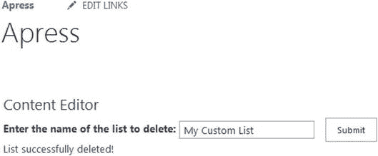

图 8-6。

Delete List code after it has successfully run

因为这些都是使用 JavaScript 和 AJAX 完成的，所以列表将被删除，用户将得到预期的通知。但是，页面上的左侧导航将不会更新，因为页面尚未刷新。和以前一样，我们可以更新这段代码以在成功时刷新页面，但是对于这个例子，我们只是在浏览器中刷新页面。图 [8-7](#Fig7) 显示了刷新后的页面，其中列表不再显示在左侧导航中。

图 8-7。

The deleted list has been removed from the left navigation

## 使用列表项目

SharePoint 中唯一比列表更丰富的是列表项。您会发现，您在 SharePoint 中的许多交互都与列表项有关，因此您的许多代码也会涉及到它们。在这一节中，我们将探索一些通过代码使用列表项的方法。

### 获取列表项目

在这个例子中，我们将简单地检索一些列表项，并将它们显示给用户。

#### 超文本标记语言

在 Visual Studio 中创建新的 HTML 文件，并将其命名为 JSOMGetListItems.html。这个示例的 HTML 继续遵循前面示例的极简模式，它由以下几行组成:

``

``

``

`

`

对于这个例子，我们将简单地从演示列表中获取所有的列表项，并将它们显示在页面上的`divListItems` DIV 中。

#### Java Script 语言

在 Visual Studio 中创建一个新的 JavaScript 文件，并将其命名为 JSOMGetListItems.js。检索列表项的脚本应该与我们到目前为止看到的其他脚本非常相似，它由以下几行组成:

`$(function () {`

`retrieveListItems();`

`});`

`function retrieveListItems() {`

`var clientContext = new SP.ClientContext();`

`var oList = clientContext.get_web().get_lists().getByTitle('Demo List');`

`var camlQuery = new SP.CamlQuery();`

`this.collListItem = oList.getItems(camlQuery);`

`clientContext.load(collListItem);`

`clientContext.executeQueryAsync(`

`Function.createDelegate(this, this.onQuerySucceeded),`

`Function.createDelegate(this, this.onQueryFailed)`

`);`

`}`

`function onQuerySucceeded(sender, args) {`

`var listItemInfo = '';`

`var listItemEnumerator = collListItem.getEnumerator();`

`while (listItemEnumerator.moveNext()) {`

`var oListItem = listItemEnumerator.get_current();`

`listItemInfo += '<strong>ID: </strong> ' + oListItem.get_id() +`

`' <strong>Title:</strong> ' + oListItem.get_item('Title') +`

`' ';`

`}`

`$("#divListItems").html(listItemInfo);`

`}`

`function onQueryFailed(sender, args) {`

`alert('Request failed. ' + args.get_message() +`

`'\n' + args.get_stackTrace());`

`}`

对于这个例子，由于我们将从列表中获取所有的条目，我们将使用 jQuery `Document.ready`函数调用`retrieveListItems()`函数。在获得对客户端上下文的引用后，我们用下面的代码行获得对演示列表的引用:

`var oList = clientContext.get_web().get_lists().getByTitle('Demo List');`

乍一看，这一行似乎很吓人，因为它很长。然而，它实际上很容易阅读。首先，我们获取当前网站，然后获取网站中的所有列表，最后，我们根据标题获取列表。JSOM 和 REST 在查询对象时都遵循这种类型的模式，使得代码易于理解。接下来，我们需要创建一个 CAML 查询，让 SharePoint 知道我们正在查找哪些项目:

`var camlQuery = new SP.CamlQuery();`

`this.collListItem = oList.getItems(camlQuery);`

CAML(协作应用程序标记语言)查询是一种在 SharePoint 中用于定义列表项查询的查询语言。您可以根据类似 SQL 查询的标准指定要返回的项目，尽管它们看起来一点也不像。在这个例子中，我们简单地使用新的`SP.CamlQuery()`方法创建一个空查询。查询列表时，即使没有定义参数，也必须提供 CAML 查询。如果您传递一个空的查询，就像在这个例子中，您实际上是要求返回所有的条目。实际上，这不是一个好主意，因为很多列表包含成百上千的条目。在我们创建了查询之后，我们将它传递给`oList.getItems()`方法来执行查询。正如在其他例子中一样，我们使用了一个名为`collListItems`的全局变量，并使用了`this`关键字。最后，我们“加载”查询并执行它。

Note

CAML 查询是一个相当复杂和深刻的话题。在这本书里，我们只触及 CAML 的皮毛；它有那么大。我们将在下一节更深入地探讨 CAML，但是您可以在 [`http://msdn.microsoft.com/en-us/library/ms467521(v=office.15).aspx`](http://msdn.microsoft.com/en-us/library/ms467521(v=office.15).aspx) 了解更多关于如何构建这些查询的信息。

一旦我们检索到列表项，我们就在`onQuerySucceeded`函数中处理它们:

`function onQuerySucceeded(sender, args) {`

`var listItemInfo = '';`

`var listItemEnumerator = collListItem.getEnumerator();`

`while (listItemEnumerator.moveNext()) {`

`var oListItem = listItemEnumerator.get_current();`

`listItemInfo += '<strong>ID: </strong> ' + oListItem.get_id() +`

`' <strong>Title:</strong> ' + oListItem.get_item('Title') +`

`' ';`

`}`

`$("#divListItems").html(listItemInfo);`

`}`

这个函数从声明一个名为`listItemInfo`的空变量开始。这个变量将保存将在页面上显示的整个 HTML。接下来，我们获得了`collListItem`变量的枚举器，您会记得它在从 SharePoint 返回的任何项目集合上都可用。我们使用`listItemEnumerator.moveNext()`方法循环遍历条目。在循环内部，我们使用`listItemEnumerator.get_current()`方法获取每个项目。然后，我们为结果集中显示 ID 和标题的每一项构建一些 HTML，并将其填充到`listItemInfo`变量中。最后，我们用 jQuery 将 HTML 设置为页面上的`divListItems` DIV。

#### 结果

将内容编辑器 Web 部件的内容链接属性设置为 HTML 文件，并保存页面。页面现在将显示演示列表中的所有项目，如图 [8-8](#Fig8) 所示。

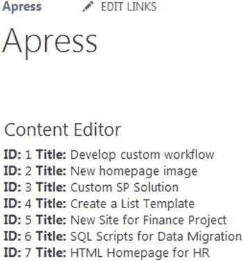

图 8-8。

List items from the Demo List displayed in the Content Editor Web Part

### 用 CAML 查询限制结果

正如我提到的，查询列表中的所有项目通常不是一个好主意。当然，有时候这是需要的或者有意义的；例如，您可能有一个项目很少的列表，或者您有一个需要查看所有项目的管理员任务。如果您过去使用过 SharePoint，您应该知道 SharePoint 会自动限制列表结果，默认情况下一个查询会有 2，000 个结果。在任一情况下，大多数用户都不需要查看列表中的所有项目，并且查询将被限制为仅显示用户需要查看的项目。

CAML 允许您基于各种各样的参数来限制结果，这使您可以完全控制向用户显示什么。在前面的例子中，我们通过创建一个新的`SP.CamlQuery`对象来传递一个空的 CAML 查询，该对象返回所有的列表项。您可以通过对`CamlQuery`对象使用`set_viewXml()`方法来传递 CAML 查询，如下面的“JavaScript”部分所示。

#### Java Script 语言

更新前一个示例中的`JSOMGetListItems.js`,并用以下代码行更新声明`SP.CamlQuery()`对象的部分:

`var camlQuery = new SP.CamlQuery();`

`camlQuery.set_viewXml(`

`'<View><Query><Where><Geq><FieldRef Name=\'ID\'/>' +`

`'<Value Type=\'Number\'>5</Value></Geq></Where></Query>' +`

`'<RowLimit>10</RowLimit></View>'`

`);`

`this.collListItem = oList.getItems(camlQuery);`

在本例中，我们通过指定只需要 ID 大于或等于 5 的项目来限制结果。这是通过使用代表“大于或等于”的`GEQ`元素来完成的在`GEQ`元素之前，我们使用一个`Where`元素并指定 ID 的`FieldRef`，它是列表项的 ID。如果这些看起来像拉丁语，不要担心，你可以下载一些工具来帮助你写 CAML。我们不会深入研究编写 CAML 查询的细节；对于这一部分，您应该明白，您可以非常详细地调整您的查询。

Note

乍一看，CAML 可能显得相当混乱和过于复杂。当你和 CAML 一起工作了一段时间后，你可能还在想同样的事情！幸运的是，有几个很棒的免费工具可以帮助你制作你的 CAML 报表。我个人喜欢 SharePoint CAML 查询助手，它是免费的，可以在 CodePlex 上下载。访问 [`https://spcamlqueryhelper.codeplex.com`](https://spcamlqueryhelper.codeplex.com/) 下载一份。

#### 结果

更新 JavaScript 文件并上传，覆盖之前的版本。使用内容编辑器 Web 部件刷新页面，您将看到结果现在只显示 ID 大于或等于 5 的项目，如图 [8-9](#Fig9) 所示。

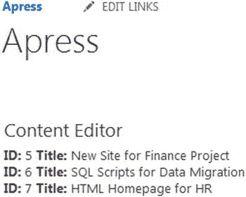

图 8-9。

The results of the Demo List query limited by a CAML query

### 添加列表项目

在本例中，我们将向演示列表添加一个新项目。

#### 超文本标记语言

在 Visual Studio 中创建新的 HTML 文件，并将其命名为`JSOMAddListItems.html`。该页面的标记将允许用户向演示列表添加一个项目，提供标题和描述。它由以下几行组成:

``

``

``

`
`

`
`

`Title:`

` `

`<input type="text" id="txtTitle" />`

`
`

`
`

`Description:`

` `

`<textarea cols="20" id="txtDesc"></textarea>`

`
`

` `

`
`

`<input id="btnSubmit" type="button" value="Submit" />`

`
`

`
`

`

`

我们为列表项标题提供文本类型的输入，并为描述提供文本区域。页面上的每个元素都有一个 ID，这样我们就可以很容易地用 jQuery 找到它。

#### Java Script 语言

在 Visual Studio 中创建一个新的 JavaScript 文件，并将其命名为 JSOMADDListItems.js。它由以下几行组成:

`$(function () {`

`bindButtonClick();`

`});`

`function bindButtonClick() {`

`$("#btnSubmit").on("click", function () {`

`addListItem();`

`});`

`}`

`function addListItem() {`

`var title = $("#txtTitle").val();`

`var desc = $("#txtDesc").val();`

`var clientContext = new SP.ClientContext();`

`var oList = clientContext.get_web().get_lists().getByTitle('Demo List');`

`var itemCreateInfo = new SP.ListItemCreationInformation();`

`this.oListItem = oList.addItem(itemCreateInfo);`

`oListItem.set_item('Title', title);`

`oListItem.set_item('Description', desc);`

`oListItem.set_item('Status', 'On-time');`

`oListItem.update();`

`clientContext.load(oListItem);`

`clientContext.executeQueryAsync(`

`Function.createDelegate(this, this.onAddSucceeded),`

`Function.createDelegate(this, this.onAddFailed)`

`);`

`}`

`function onAddSucceeded(sender, args) {`

`$("#divResult").html("Item successfully added!");`

`}`

`function onAddFailed(sender, args) {`

`alert('Request failed. ' + args.get_message() +`

`'\n' + args.get_stackTrace());`

`}`

在我们用 jQuery 附加了一个按钮点击事件之后，我们在点击事件上做的第一件事就是获取用户用下面几行提供的值:

`var title = $("#txtTitle").val();`

`var desc = $("#txtDesc").val();`

接下来，我们获取对当前客户端上下文的引用，以及演示列表。然后，为了创建一个新的列表项，我们必须实例化一个`SP.ListItemCreationInformation`对象。此对象允许您为列表创建新的列表项并设置其属性。这是通过以下代码完成的:

`var itemCreateInfo = new SP.ListItemCreationInformation();`

`this.oListItem = oList.addItem(itemCreateInfo);`

`oListItem.set_item('Title', title);`

`oListItem.set_item('Description', desc);`

`oListItem.set_item('Status', 'On-time');`

`oListItem.update();`

一旦我们创建了一个新的`SP.ListItemCreationInformation`对象，我们使用 list 对象上的`addItem()`方法将它添加到列表中。接下来，我们使用`set_item()`方法在列表项对象上设置单独的属性。这个方法有两个参数。第一个参数是要为其设置值的字段或列，第二个参数是值本身。对于标题和描述，我们只需传入之前检索到的值。对于 Status 列，我们简单地将 On-time 硬编码为一个值。最后，我们使用`update()`方法更新项目，然后将其加载到客户机上下文中并执行查询。在`success`函数中，我们简单地向屏幕输出列表项创建成功。

#### 结果

将内容编辑器 Web 部件的内容链接属性设置为 HTML 文件，并保存页面。页面将显示供用户输入详细信息的文本框，然后在添加项目时显示成功消息，如图 [8-10](#Fig10) 所示。

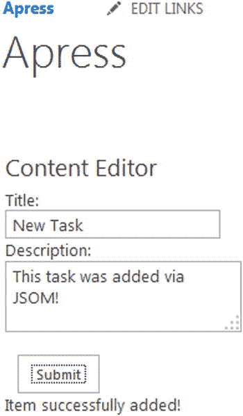

图 8-10。

Adding a new item to the Demo List

然后，我们可以导航到演示列表，以确认添加了新项目。图 [8-11](#Fig11) 显示了添加了新列表项和 HTML 页面提供的值的演示列表。

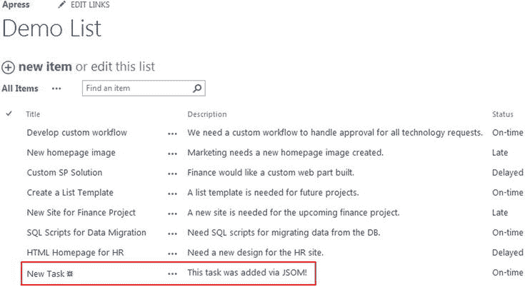

图 8-11。

A new list item added to the Demo List

### 删除列表项目

这个例子将向你展示如何删除列表项，在这种情况下，我们将删除我们在上一个例子中添加的项目。

#### 超文本标记语言

在 Visual Studio 中创建新的 HTML 文件，并将其命名为 JSOMDeleteListItems.html。这个文件的 HTML 要小得多，因为我们需要从用户那里获取的只是一个对应于他们想要删除的列表项的 ID。这是通过以下代码行实现的:

``

``

``

`
`

`Enter ID to Delete: <input type="text" id="txtId" />`

`
`

`
`

`<input id="btnSubmit" type="button" value="Submit" />`

`
`

`

`

这个例子过于简单，因为用户很可能不知道要删除的某个列表项的 ID。一个更真实的例子可能是向用户显示一个项目列表，并允许他们单击一个项目来删除它。在这种情况下，页面上会有列表项 id，并且可以很容易地访问它。我们将保留一个简单的文本框来简化这个例子。

#### Java Script 语言

在 Visual Studio 中创建新的 JavaScript 文件，并将其命名为 JSOMDeleteListItems.js 包括以下代码:

`$(function () {`

`bindButtonClick();`

`});`

`function bindButtonClick() {`

`$("#btnSubmit").on("click", function () {`

`deleteListItem();`

`});`

`}`

`function deleteListItem() {`

`var id = $("#txtId").val();`

`var clientContext = new SP.ClientContext();`

`var oList = clientContext.get_web().get_lists().getByTitle('Demo List');`

`this.oListItem = oList.getItemById(id);`

`oListItem.deleteObject();`

`clientContext.executeQueryAsync(`

`Function.createDelegate(this, this.onQuerySucceeded),`

`Function.createDelegate(this, this.onQueryFailed)`

`);`

`}`

`function onQuerySucceeded(sender, args) {`

`$("#divResult").html("Item successfully deleted!");`

`}`

`function onQueryFailed(sender, args) {`

`alert('Request failed. ' + args.get_message() +`

`'\n' + args.get_stackTrace());`

`}`

页面上的按钮点击事件将调用`deleteListItem()`函数。使用下面的代码行，我们要做的第一件事是获取用户在页面上输入的 ID:

`var id = $("#txtId").val();`

接下来，我们获得当前的客户端上下文和对演示列表的引用。删除项目是通过以下几行完成的:

`this.oListItem = oList.getItemById(id);`

`oListItem.deleteObject();`

我们在 list 对象上使用`getItemById()`方法，传递用户提交的 ID。然后，我们调用`deleteObject()`方法来实际执行删除。与本章前面的删除列表类似，这是删除列表项所需的全部内容。我们不需要将删除调用加载到客户端上下文中；我们只需要执行查询。`success`函数将简单地通知用户删除成功。

#### 结果

将内容编辑器 Web 部件的内容链接属性设置为 HTML 文件，并保存页面。页面会显示供用户输入 ID 的文本框，当删除一项时会显示成功消息，如图 [8-12](#Fig12) 所示。

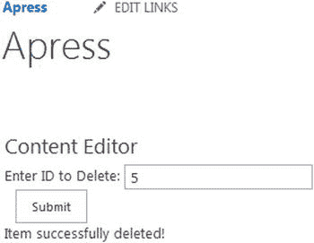

图 8-12。

Deleting a list item using JSOM

## 使用文档库

因为 SharePoint 的优势之一在于文档管理，所以您需要知道如何通过代码使用文档库。因为文档库实际上只是 SharePoint 中的列表，所以您在这方面已经有了一些经验！

### 创建新文件夹

在本例中，我们将演示如何在现有文档库中创建新文件夹。

#### 超文本标记语言

在 Visual Studio 中创建新的 HTML 文件，并将其命名为 JSOMCreateFolder.html。这个页面的标记非常简单，允许用户输入他们希望创建的文件夹的名称。它由以下几行组成:

``

``

``

`
`

`<strong>Enter a name for the folder:</strong>`

`<input type="text" id="txtFolderName" />`

`<input type="button" id="btnSubmit" value="Submit" />`

`
`

`

`

#### Java Script 语言

在 Visual Studio 中创建新的 JavaScript 文件，命名为 JSOMCreateFolder.js 包括以下代码:

`$(function () {`

`bindButtonClick();`

`});`

`function bindButtonClick() {`

`$("#btnSubmit").on("click", function () {`

`createFolder();`

`});`

`}`

`function createFolder() {`

`var folderName = $("#txtFolderName").val();`

`var clientContext = new SP.ClientContext();`

`var oWebsite = clientContext.get_web();`

`var oList = oWebsite.get_lists().getByTitle("Documents");`

`var folderCreateInfo = new SP.ListItemCreationInformation();`

`folderCreateInfo.set_underlyingObjectType(SP.FileSystemObjectType.folder);`

`folderCreateInfo.set_leafName(folderName);`

`this.oListItem = oList.addItem(folderCreateInfo);`

`this.oListItem.update();`

`clientContext.load(oList);`

`clientContext.executeQueryAsync(`

`Function.createDelegate(this, this.onQuerySucceeded),`

`Function.createDelegate(this, this.onQueryFailed)`

`);`

`}`

`function onQuerySucceeded() {`

`$("#divResults").html("Folder successfully created!");`

`}`

`function onQueryFailed(sender, args) {`

`alert('Request failed. ' + args.get_message() +`

`'\n' + args.get_stackTrace());`

`}`

在使用 jQuery 连接按钮点击之后，`createFolder()`函数从获取用户在页面上输入的文件夹名称开始:

`var folderName = $("#txtFolderName").val();`

接下来，我们获取一个对当前客户端上下文和当前站点的引用，然后用下面一行引用共享文档文件夹:

`var oList = oWebsite.get_lists().getByTitle("Documents");`

本示例将在共享文档库中新建一个文件夹。因为所有文档库实际上都是 SharePoint 中的列表，所以我们可以使用`getLists().getByTitle()`方法来检索该库。接下来，我们为文件夹创建一个新的`SP.ListItemCreationInformation`对象:

`var folderCreateInfo = new SP.ListItemCreationInformation();`

乍一看，这似乎很奇怪，因为我们正在创建一个新文件夹，而不是一个列表项。在 SharePoint 中，文件夹是列表项，尽管它们的外观和行为就像您对文件夹的期望一样。因此，使用相同的`SP.ListItemCreationInformation`对象。既然已经创建了对象，我们需要使用下面几行设置一些属性:

`folderCreateInfo.set_underlyingObjectType(SP.FileSystemObjectType.folder);`

`folderCreateInfo.set_leafName(folderName);`

`this.oListItem = oList.addItem(folderCreateInfo);`

`this.oListItem.update();`

首先，由于这不是一个标准的列表项，我们需要使用`set_underlyingObjectType()`方法指定对象类型，将`SP.FileSystemObjectType.folder`作为参数传入。接下来，我们使用`set_leafName()`方法设置文件夹名称，传递用户从页面提交的名称。最后，我们将新文件夹添加到列表中并更新它，然后在客户机上下文中加载查询。`success`功能将简单地向屏幕输出一条消息，通知用户文件夹已成功创建。

#### 结果

将内容编辑器 Web 部件的内容链接属性设置为 HTML 文件，并保存页面。页面会显示文本框，供用户输入要创建的文件夹的名称，完成后会显示成功消息，如图 [8-13](#Fig13) 所示。

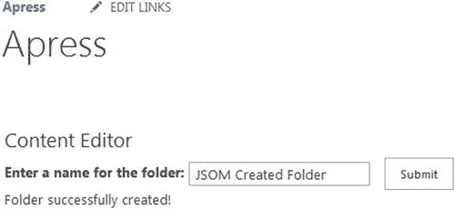

图 8-13。

Creating a new folder with JSOM

然后，我们可以导航到文档库，直观地验证新文件夹是否已创建，如图 [8-14](#Fig14) 所示。

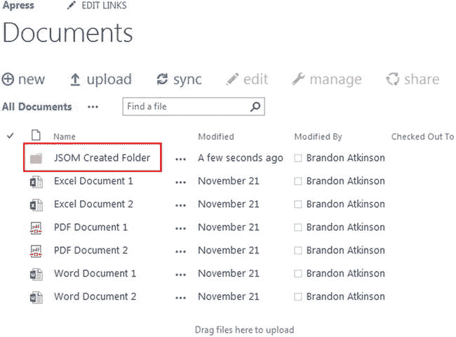

图 8-14。

New folder created via JSOM

## 使用文件

列表和库并不是您的编码技能将被使用的唯一领域。在这一节中，我们将看看如何通过代码处理文件。

### 创建新文件

在本例中，我们将创建一个新的文本文件，并将其添加到文档库中。

#### 超文本标记语言

在 Visual Studio 中创建新的 HTML 文件，并将其命名为 JSOMCreateDocument.html。该页面的标记将允许用户输入新文本文件的名称，以及文件本身的内容。它由以下几行组成:

``

``

``

`
`

`
`

`<strong>Enter a title for the document:</strong>`

` `

`<input type="text" id="txtDocumentTitle" />`

`
`

`
`

`<strong>Enter content for the document:</strong>`

` `

`<textarea cols="20" id="txtDocumentContent"></textarea>`

`
`

` `

`<input type="button" id="btnSubmit" value="Submit" />`

`
`

`

`

#### Java Script 语言

在 Visual Studio 中创建新的 JavaScript 文件，命名为 JSOMCreateDocument.js 包括以下代码:

`$(function () {`

`bindButtonClick();`

`});`

`function bindButtonClick() {`

`$("#btnSubmit").on("click", function () {`

`createDocument();`

`});`

`}`

`function createDocument() {`

`var docTitle = $("#txtDocumentTitle").val() + ".txt";`

`var docContent = $("#txtDocumentContent").val();`

`var clientContext = new SP.ClientContext();`

`var oWebsite = clientContext.get_web();`

`var oList = oWebsite.get_lists().getByTitle("Documents");`

`var fileCreateInfo = new SP.FileCreationInformation();`

`fileCreateInfo.set_url(docTitle);`

`fileCreateInfo.set_content(new SP.Base64EncodedByteArray());`

`for (var i = 0; i < docContent.length; i++) {`

`fileCreateInfo.get_content().append(docContent.charCodeAt(i));`

`}`

`this.newFile = oList.get_rootFolder().get_files().add(fileCreateInfo);`

`clientContext.load(this.newFile);`

`clientContext.executeQueryAsync(`

`Function.createDelegate(this, this.onQuerySucceeded),`

`Function.createDelegate(this, this.onQueryFailed)`

`);`

`}`

`function onQuerySucceeded() {`

`$("#divResults").html("Document successfully created!");`

`}`

`function onQueryFailed(sender, args) {`

`alert('Request failed. ' + args.get_message() +`

`'\n' + args.get_stackTrace());`

`}`

我们需要做的第一件事是获取用户在页面上输入的文档标题和内容。这是通过以下代码行实现的:

`var docTitle = $("#txtDocumentTitle").val() + ".txt";`

`var docContent = $("#txtDocumentContent").val();`

注意，我们在文档标题的末尾添加了`.txt`。这将让 SharePoint 知道我们打算创建一个文本文件，因为它将使用名称中的扩展名来确定文件类型。接下来，我们获得对当前客户机上下文的引用，以及我们想要保存新文档的 web 和文档库。现在我们需要创建一个新的`SP.FileCreationInformation`对象并设置它的属性:

`var fileCreateInfo = new SP.FileCreationInformation();`

`fileCreateInfo.set_url(docTitle);`

`fileCreateInfo.set_content(new SP.Base64EncodedByteArray());`

现在，您应该开始看到使用 SharePoint 在 JavaScript 中创建对象的模式。您创建的任何东西都有一个与之相关联的`CreationInformation`对象。一旦创建了对象，我们就使用`set_url()`方法设置文件的 URL。最后，我们使用`SP.Base64EncodedByteArray()`对象将文件的内容设置为一个空字节数组。你暂时不需要太担心这个对象的细节；要知道这是 JSOM 代码在设置新文件内容时所期望的。现在我们已经创建了空数组，我们需要使用以下代码填充它:

`for (var i = 0; i < docContent.length; i++) {`

`fileCreateInfo.get_content().append(docContent.charCodeAt(i));`

`}`

这是一个简单的循环，将用户提交的文本中的每个字符添加到文件内容的空数组中。一旦循环完成，文本被输入到文档中，我们就将它添加到库中:

`this.newFile = oList.get_rootFolder().get_files().add(fileCreateInfo);`

然后，我们在客户机上下文中加载查询并执行它。`success`功能将简单地向屏幕输出文件创建成功。

Note

在本例中，我们正在创建一个简单的文本文件。在大多数实际情况下，文本文件可能不是预期的结果，但可能是 Word 文件或 Excel 文件。您完全可以通过简单地将`.txt`更改为`.docx`来更改这个示例以生成一个 Word 文档。实际上，这个简单的更改会创建一个包含内容的新 Word 文档。但是，它只能在客户端计算机上的 Word 中打开，而不能在 Office Web Apps 中打开。幸运的是，微软提供了 Office JavaScript 文件，允许您从浏览器创建和操作 Office 文件。你可以在 [`http://msdn.microsoft.com/en-us/library/office/fp160953%28v=office.15%29.aspx`](http://msdn.microsoft.com/en-us/library/office/fp160953%28v=office.15%29.aspx) 找到更多信息。

#### 结果

将内容编辑器 Web 部件的内容链接属性设置为 HTML 文件，并保存页面。页面将显示文本框，供用户输入文档的标题和内容，然后在新文档创建完成后显示成功消息，如图 [8-15](#Fig15) 所示。

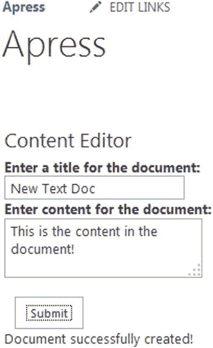

图 8-15。

Creating a new document from a Content Editor Web Part

我们可以导航到 Documents 文件夹，发现新的文本文档已经创建。您可以单击该文档，它将在浏览器中打开，并显示用户从页面中输入的内容，如图 [8-16](#Fig16) 所示。

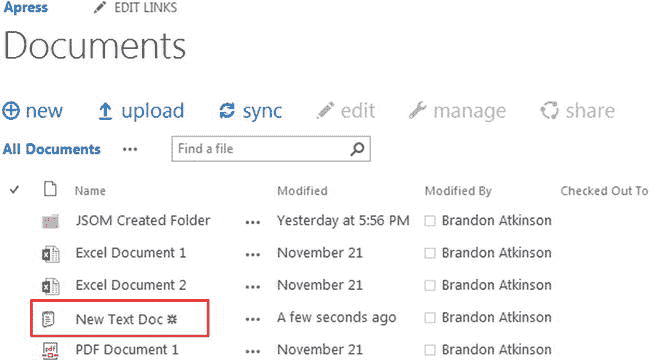

图 8-16。

New text document created in the Documents folder

### 阅读文件

在这一节中，我们将看到如何读取我们在前一个例子中创建的文件。

#### 超文本标记语言

在 Visual Studio 中创建新的 HTML 文件，并将其命名为 JSOMReadDocument.html。这个页面的标记非常简单，只有一个对定制 JavaScript 文件的引用和一个输出文档内容的 DIV。它由以下几行组成:

``

`
`

#### Java Script 语言

在 Visual Studio 中创建新的 JavaScript 文件，命名为 JSOMReadDocument.js 包括以下代码:

`$(function () {`

`readDocument();`

`});`

`function readDocument() {`

`var siteUrl = _spPageContextInfo.webAbsoluteUrl;`

`var documentLibrary = "/Shared Documents/"`

`var fileUrl = "New Text Doc.txt";`

`var fullUrl = siteUrl + documentLibrary + fileUrl;`

`$.ajax({`

`url: fullUrl,`

`type: "GET"`

`})`

`.done(function (data) {`

`$("#divReadDocument").html(data);`

`})`

`.fail(function () {`

`alert("error");`

`});`

`}`

乍一看，这段代码应该很简洁，您会注意到这里根本没有 JSOM 代码。从 SharePoint 读取文本文件的美妙之处在于，您所需要的只是 jQuery。因为这是关于 JSOM 的一章，这段代码应该在别的地方，但是因为我们创建了一个文档，你也应该知道如何阅读它。有一个简单的 jQuery `Document.ready`函数，它将触发代码来读取文件。我们有意保持代码简单，并对我们刚刚创建的文档的文件名进行硬编码:

`var siteUrl = _spPageContextInfo.webAbsoluteUrl;`

`var documentLibrary = "/Shared Documents/"`

`var fileUrl = "New Text Doc.txt";`

`var fullUrl = siteUrl + documentLibrary + fileUrl;`

我们做的第一件事是通过使用`_spPageContextInfo.webAbsoluteUrl`获得当前网站的完整 URL。接下来，我们对 URL 的文档库部分和文件名进行硬编码。最后，我们将它们放入一个名为`fullUrl`的新变量。您完全可以在一行中完成所有这些工作，但是您会发现，如果您将代码分成几行，以后调试代码会更容易。一旦我们有了文件的 URL，我们就使用 jQuery AJAX 调用来获取文档:

`$.ajax({`

`url: fullUrl,`

`type: "GET"`

`})`

`.done(function (data) {`

`$("#divReadDocument").html(data);`

`})`

`.fail(function () {`

`alert("error");`

`});`

当在 jQuery 中通过 AJAX 检索文本文件时，内容将以文本形式返回，我们可以简单地将它输出到页面，无需任何修改。我们使用 jQuery `.done`函数，将文件内容设置为一个名为`data`的新变量。然后，我们将数据设置为页面上结果 DIV 的 HTML。

Note

和以前一样，当创建一个新文件时，我们通过使用文本文件来保持事情的简单。这也适用于本节和读取文件。使用上述方法无法读取 Office 文件。您需要利用 Office JavaScript 文件在浏览器中正确读取 Word 文件或 Excel 文件。你可以在 [`http://msdn.microsoft.com/en-us/library/office/fp160953%28v=office.15%29.aspx`](http://msdn.microsoft.com/en-us/library/office/fp160953%28v=office.15%29.aspx) 找到更多信息。

#### 结果

将内容编辑器 Web 部件的内容链接属性设置为 HTML 文件，并保存页面。页面将显示文本文件的内容，如图 [8-17](#Fig17) 所示。

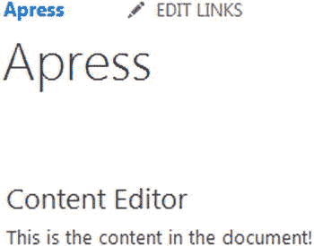

图 8-17。

Contents of the text file displayed on the page

#### 更新文件

您还可以使用 JSOM 轻松更新文件。事实上，更新文件与创建文件的代码基本相同，只是增加了一行代码:

`fileCreateInfo.set_overwrite(true);`

这一行只是告诉 SharePoint 覆盖以前的同名文件。使用它，您可以轻松地将文本文件的内容读入页面上的文本框，并允许用户修改内容。当用户希望保存文件时，使用与创建文件相同的代码，并包含覆盖命令。

### 删除文件

在这个例子中，我们将看到如何删除一个文件。

#### 超文本标记语言

在 Visual Studio 中创建新的 HTML 文件，并将其命名为 JSOMDeleteDocument.html。该页面的标记有一个文本框，用户可以输入他们希望删除的文件的名称。它由以下几行组成:

``

``

``

`
`

`
`

`<strong>Enter the name of document to delete:</strong>`

` `

`<input type="text" id="txtDocumentTitle" />`

`
`

` `

`<input type="button" id="btnSubmit" value="Submit" />`

`
`

`

`

#### Java Script 语言

在 Visual Studio 中创建新的 JavaScript 文件，命名为 JSOMDeleteDocument.js 包括以下代码:

`$(function () {`

`bindButtonClick();`

`});`

`function bindButtonClick() {`

`$("#btnSubmit").on("click", function () {`

`deleteDocument();`

`});`

`}`

`function deleteDocument() {`

`var docTitle = $("#txtDocumentTitle").val() + ".txt";`

`var clientContext = new SP.ClientContext();`

`var oWebsite = clientContext.get_web();`

`var fileUrl = _spPageContextInfo.webServerRelativeUrl +`

`"/Shared Documents/" + docTitle;`

`this.fileToDelete = oWebsite.getFileByServerRelativeUrl(fileUrl);`

`this.fileToDelete.deleteObject();`

`clientContext.executeQueryAsync(`

`Function.createDelegate(this, this.onQuerySucceeded),`

`Function.createDelegate(this, this.onQueryFailed)`

`);`

`}`

`function onQuerySucceeded() {`

`$("#divResults").html("Document successfully deleted!");`

`}`

`function onQueryFailed(sender, args) {`

`alert('Request failed. ' + args.get_message() +`

`'\n' + args.get_stackTrace());`

`}`

在连接了按钮点击事件之后，我们做的第一件事就是获取用户想要删除的文档的标题:

`var docTitle = $("#txtDocumentTitle").val() + ".txt";`

我们将保持这个例子的简单，删除之前创建的文本文件，从而将`.txt`扩展硬编码到代码中。接下来，我们执行引用当前客户端上下文和 web 的惯例，然后我们构造文档的路径:

`var fileUrl = _spPageContextInfo.webServerRelativeUrl +`

`"/Shared Documents/" + docTitle;`

对于这个路径，我们只需要文档的相对路径，而不需要完整的 URL。我们可以通过使用`_spPageContextInfo.webServerRelativeUrl`获得当前网页的相对路径。因为我们知道这个文档位于 Documents 文件夹中，所以我们将对其进行硬编码，并添加用户提交的文档标题。就像 SharePoint 中的其他删除操作一样，我们不需要在客户端上下文中加载这个请求，只需调用`deleteObject`方法并执行查询。`success`功能将向用户输出一条消息，通知他们文档已被删除。

与我们之前看到的创建、读取和更新文档的功能不同，假设用户拥有删除权限，您可以使用 JSOM 删除您想要的任何文件。SharePoint 在删除文档方面是相当不可知的。您可以很容易地使用相同的代码删除 Office 文档，而没有任何问题或额外的 JavaScript 库。

#### 结果

将内容编辑器 Web 部件的内容链接属性设置为 HTML 文件，并保存页面。页面将显示一个文本框，供用户输入文档标题，并显示结果消息，如图 [8-18](#Fig18) 所示。

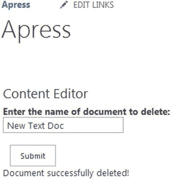

图 8-18。

Deleting a file via JSOM

## 使用站点

在这一点上，你可能会想，JSOM 是相当强大的！事实上是的，为了证明这一点，我们将创建一个新的网站！使用列表和库很酷，但是能够通过 JavaScript 创建一个新的站点将真正展示 JSOM 的力量。

### 创建网站

在本例中，我们将创建一个新的团队站点。除了创建新站点，我们还将设置它的许多属性，包括标题、描述和站点模板。

#### 超文本标记语言

在 Visual Studio 中创建新的 HTML 文件，并将其命名为 JSOMCreateSite.html。该页面的标记有一个供用户输入新站点名称的文本框，以及一个用于站点描述的文本框。它由以下几行组成:

``

``

``

`
`

`
`

`<strong>Enter the name of the site:</strong>`

` `

`<input type="text" id="txtSiteTitle" />`

`
`

` `

`
`

`<strong>Enter site description:</strong>`

` `

`<textarea cols="20" id="txtSiteDescription"></textarea>`

`
`

` `

`<input type="button" id="btnSubmit" value="Submit" />`

`
`

`

`

#### Java Script 语言

在 Visual Studio 中创建新的 JavaScript 文件，命名为 JSOMCreateSite.js 包括以下代码:

`$(function () {`

`bindButtonClick();`

`});`

`function bindButtonClick() {`

`$("#btnSubmit").on("click", function () {`

`createSite();`

`});`

`}`

`function createSite() {`

`var siteTitle = $("#txtSiteTitle").val();`

`var siteDesc = $("#txtSiteDescription").val();`

`var siteUrl = siteTitle.replace(/\s/g, "");`

`var clientContext = new SP.ClientContext();`

`var collWeb = clientContext.get_web().get_webs();`

`var webCreationInfo = new SP.WebCreationInformation();`

`webCreationInfo.set_title(siteTitle);`

`webCreationInfo.set_description(siteDesc);`

`webCreationInfo.set_language(1033);`

`webCreationInfo.set_url(siteUrl);`

`webCreationInfo.set_useSamePermissionsAsParentSite(true);`

`webCreationInfo.set_webTemplate('STS#0');`

`var oNewWebsite = collWeb.add(webCreationInfo);`

`clientContext.executeQueryAsync(`

`Function.createDelegate(this, this.onQuerySucceeded),`

`Function.createDelegate(this, this.onQueryFailed)`

`);`

`}`

`function onQuerySucceeded() {`

`$("#divResults").html("Site successfully created!");`

`}`

`function onQueryFailed(sender, args) {`

`alert('Request failed. ' + args.get_message() +`

`'\n' + args.get_stackTrace());`

`}`

创建一个新的站点需要更多的代码，但是现在应该已经非常熟悉了。首先，我们使用下面几行获取用户提交的标题和描述:

`var siteTitle = $("#txtSiteTitle").val();`

`var siteDesc = $("#txtSiteDescription").val();`

`var siteUrl = siteTitle.replace(/\s/g, "");`

创建网站时，除了标题之外，还必须提供网站的 URL。对于这个例子，我们将简单地获取用户为标题输入的文本，并删除所有空格以生成 URL。这是使用 JavaScript 中的`replace()`方法完成的，第一个参数是我们要搜索的内容，第二个参数是应该替换的内容。`/\s/g`文本表示一个空格，必须用于此功能才能正常工作。

一旦我们有了创建站点所需的变量，我们就引用当前的客户端上下文，然后获取当前站点中的站点集合:

`var collWeb = clientContext.get_web().get_webs();`

方法返回当前站点中所有子站点的集合。我们最终要将新站点添加到这个集合中。接下来，我们创建一个`SP.WebCreationInformation`对象:

`var webCreationInfo = new SP.WebCreationInformation();`

`webCreationInfo.set_title(siteTitle);`

`webCreationInfo.set_description(siteDesc);`

`webCreationInfo.set_language(1033);`

`webCreationInfo.set_url(siteUrl);`

`webCreationInfo.set_useSamePermissionsAsParentSite(true);`

`webCreationInfo.set_webTemplate('STS#0');`

就像我们之前看到的其他`CreationInformation`对象一样，我们创建一个新的`WebCreationInformation`对象并设置它的各种属性。幸运的是，在这个对象上配置属性所需的所有方法都是不言自明的；例如，`set_useSamePermissionsAsParentSite()`决定这个新站点是否应该继承父站点的权限。有一些您可能不熟悉的棘手参数，例如`1033`(在为站点设置语言时表示“英语”)和`STS#0`(在设置站点模板时表示团队站点模板)。所有其他属性应该看起来很熟悉。

设置好属性后，我们只需将新站点添加到集合中:

`var oNewWebsite = collWeb.add(webCreationInfo);`

创建新站点也是另一个不需要在客户机上下文中加载查询的领域。您可以简单地执行查询来创建新站点。`success`功能将简单地通知用户站点已经创建。

Note

同样，这些示例中的代码在当前用户的权限级别下运行。由于这些示例中有许多执行更高级的功能，如创建和删除 SharePoint 对象，因此用户需要有适当的权限来执行这些功能。值得再次指出这一点，因为站点创建需要用户对创建新站点的站点拥有完全控制权限。

#### 结果

将内容编辑器 Web 部件的内容链接属性设置为 HTML 文件，并保存页面。页面将显示文本框供用户输入新的站点标题和描述，并显示结果消息，如图 [8-19](#Fig19) 所示。

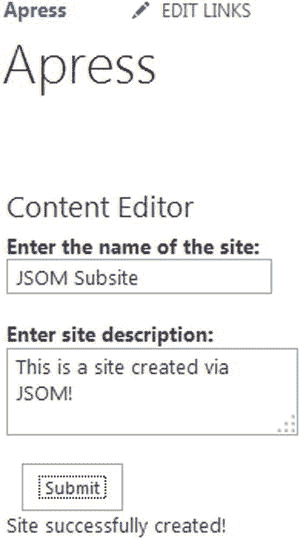

图 8-19。

Creating a new site via JSOM

然后，我们可以打开创建新站点的站点内容页面，并滚动到底部。在子站点部分，我们可以看到新站点已经创建，如图 [8-20](#Fig20) 所示。

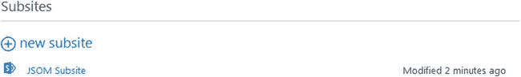

图 8-20。

The newly created subsite in the Site Contents page

### 删除网站

在这一节中，我们将删除我们在前一个例子中创建的站点。

#### 超文本标记语言

在 Visual Studio 中创建新的 HTML 文件，并将其命名为 JSOMDeleteSite.html。这个页面的标记有一个文本框，用户可以输入他们想要删除的站点的名称。它由以下几行组成:

``

``

``

`
`

`
`

`<strong>Enter the name of the site to delete:</strong>`

` `

`<input type="text" id="txtSiteTitle" />`

`
`

` `

`<input type="button" id="btnSubmit" value="Submit" />`

`
`

`

`

#### Java Script 语言

在 Visual Studio 中创建新的 JavaScript 文件，命名为 JSOMDeleteSite.js 包括以下代码:

`$(function () {`

`bindButtonClick();`

`});`

`function bindButtonClick() {`

`$("#btnSubmit").on("click", function () {`

`deleteSite();`

`});`

`}`

`function deleteSite() {`

`var siteTitle = $("#txtSiteTitle").val();`

`var siteTitleNoSpaces = siteTitle.replace(/\s/g, "");`

`var siteUrl = _spPageContextInfo.webAbsoluteUrl + "/" + siteTitleNoSpaces;`

`var clientContext = new SP.ClientContext(siteUrl);`

`var oWebsite = clientContext.get_web();`

`oWebsite.deleteObject();`

`clientContext.executeQueryAsync(`

`Function.createDelegate(this, this.onQuerySucceeded),`

`Function.createDelegate(this, this.onQueryFailed)`

`);`

`}`

`function onQuerySucceeded() {`

`$("#divResults").html("Site successfully deleted!");`

`}`

`function onQueryFailed(sender, args) {`

`alert('Request failed. ' + args.get_message() +`

`'\n' + args.get_stackTrace());`

`}`

就像前面的例子一样，我们获取用户输入的网站标题，然后删除所有空格:

`var siteTitle = $("#txtSiteTitle").val();`

`var siteTitleNoSpaces = siteTitle.replace(/\s/g, "");`

`var siteUrl = _spPageContextInfo.webAbsoluteUrl + "/" + siteTitleNoSpaces;`

一旦我们有了标题，并删除了空格，我们需要构建一个完整的网站 URL。我们可以通过使用`_spPageContextInfo.webAbsoluteUrl`获得当前站点的完整 URL，只需附加一个`/`和站点标题，末尾不带空格。我们需要构造一个完整的 URL，以便我们可以请求我们希望删除的站点的客户端上下文，而不是用户所在的当前站点:

`var clientContext = new SP.ClientContext(siteUrl);`

`var oWebsite = clientContext.get_web();`

到目前为止，我们一直使用用户查看页面的当前站点的客户端上下文。但是，您可以通过将 URL 作为参数传递给`SP.ClientContext()`方法来请求另一个站点的上下文，就像我们在本例中所做的那样。一旦我们有了站点的上下文，我们就可以通过使用`clientContext.get_web()`获得对该站点中根站点的引用。就像所有其他删除操作一样，我们简单地调用`deleteObject()`方法来请求删除操作:

`oWebsite.deleteObject();`

`success`功能将向用户显示一条消息，通知他们删除已经发生。

#### 结果

将内容编辑器 Web 部件的内容链接属性设置为 HTML 文件，并保存页面。页面会显示一个文本框供用户输入站点标题，并显示结果信息，如图 [8-21](#Fig21) 所示。

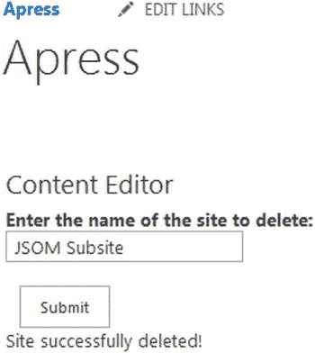

图 8-21。

Deleting a subsite via JSOM

在本例中，我们将删除刚刚创建的站点。导航回站点内容页面将显示该子站点已被成功删除，如图 [8-22](#Fig22) 所示。

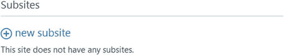

图 8-22。

The site has been removed from the root site

## 使用社交数据

SharePoint 的一大新领域是社交数据。如果你要为 SharePoint 编写定制的解决方案，你肯定会在某些时候遇到访问社交数据的需求。本节将演示如何提取这些数据用于您的解决方案。

### 超文本标记语言

在 Visual Studio 中创建新的 HTML 文件，并将其命名为 JSOMGetSocialData.html。这个页面的标记将包括几个 div 和一个输出数据的 SPAN。它由以下几行组成:

``

``

``

``

`<link rel="stylesheet" type="text/css" href="/apress/Webparts/chapter 8/JSOMGetSocialData.css" />`

`
`

`Welcome back `

`
`

`
`

到目前为止，这个例子比其他任何例子都有更多的引用。你会注意到，除了引用`sp.js`和`sp.runtime.js`，我们还引用了`sp.userprofiles.js`。正如本章前面提到的，JSOM 功能包含在许多满足特定需求的不同文件中。在这个例子中，因为我们想要获得用户的社交数据，所以我们必须包含对`sp.userprofiles.js`文件的引用，以便访问该功能。

我们还将包含一个名为`JSOMGetSocialData.css`的定制 CSS 文件。这将用于设置脚本输出的样式。所有其他的例子都可以很容易地包含 CSS 样式。在您的定制开发工作中，您会发现样式将在您的许多 web 部件中扮演重要角色；所以这个例子将向你展示包含它是多么容易。

#### Java Script 语言

在 Visual Studio 中创建新的 JavaScript 文件，命名为 JSOMGetSocialData.js 包括以下代码:

`$(function () {`

`ExecuteOrDelayUntilScriptLoaded(getUserProfileProperties, "sp.userprofiles.js");`

`});`

`function getUserProfileProperties() {`

`var clientContext = new SP.ClientContext();`

`var peopleManager = new SP.UserProfiles.PeopleManager(clientContext);`

`this.userProperties = peopleManager.getMyProperties();`

`clientContext.load(userProperties);`

`var followingManager = new SP.Social.SocialFollowingManager(clientContext);`

`this.following = followingManager.getFollowed(15);`

`clientContext.executeQueryAsync(`

`Function.createDelegate(this, this.onQuerySucceeded),`

`Function.createDelegate(this, this.onQueryFailed)`

`);`

`}`

`function onQuerySucceeded() {`

`$("#WelcomeMessageUserName").text(userProperties.get_displayName());`

`var followedItems = "Items you are following: ";`

`$.each(following, function( index, value ) {`

`followedItems += "<a href='" + value.get_uri() + "'>" + value.get_name() + "</a> ";`

`});`

`$("#UserFollows").append(followedItems);`

`}`

`function onQueryFailed(sender, args) {`

`alert('Request failed. ' + args.get_message() +`

`'\n' + args.get_stackTrace());`

`}`

在 jQuery `Document.ready`函数中，我们包含了`ExecuteOrDelayUntilScriptLoaded`内置函数。我们需要使用它，因为我们的 JavaScript 代码依赖于在`sp.userprofiles.js`中找到的功能，如果它在文件被加载之前运行会导致错误:

`ExecuteOrDelayUntilScriptLoaded(getUserProfileProperties, "sp.userprofiles.js");`

一旦触发了`getUserProfileProperties`函数，我们就获得一个对当前客户端上下文的引用，然后用下面的代码创建一个新的`PeopleManager`对象:

`var peopleManager = new SP.UserProfiles.PeopleManager(clientContext);`

`this.userProperties = peopleManager.getMyProperties();`

`clientContext.load(userProperties);`

我们可以通过使用`SP.UserProfiles.PeopleManager()`方法创建一个新的`PeopleManager`对象，将客户端上下文作为其参数传入。`PeopleManager`对象提供了访问用户数据的方法。在这种情况下，我们可以通过使用`peopleManager.getMyProperties()`方法，并在客户端上下文中加载`userProperties`变量来获取当前用户的所有属性。

接下来，我们将通过使用`SocialFollowingManager()`对象获取用户关注的所有项目:

`var followingManager = new SP.Social.SocialFollowingManager(clientContext);`

`this.following = followingManager.getFollowed(15);`

我们可以使用`SP.Social.SocialFollowingManager()`方法创建一个新的`SocialFollowingManager`对象，将客户端上下文作为其参数传入。然后，我们可以通过使用`getFollowed()`方法获得用户关注的所有“演员”。“参与者”实际上就是用户追随的任何东西，可以是用户、文档、站点或标签。当您调用`getFollowed()`方法时，您需要传入一个数字，该数字对应于您想要返回的参与者。在这个例子中，我们使用 15，这表示所有的参与者。您可以在 [`http://msdn.microsoft.com/en-us/library/microsoft.sharepoint.client.social.socialactortypes(v=office.15).aspx`](http://msdn.microsoft.com/en-us/library/microsoft.sharepoint.client.social.socialactortypes(v=office.15).aspx) 看到完整的值列表。

这个例子中的`success`方法是迄今为止最复杂的，因为我们需要显示比其他例子更多的数据。首先，我们将获取当前用户的用户名以显示在页面上:

`$("#WelcomeMessageUserName").text(userProperties.get_displayName());`

`userProperties`对象有许多方法来检索数据；为了获得用户名，我们可以调用`get_displayName()`方法。接下来，我们将遍历所有跟随的项目，以构建一个列表来显示给用户:

`var followedItems = "Items you are following: ";`

`$.each(following, function( index, value ) {`

`followedItems += "<a href='" + value.get_uri() + "'>" + value.get_name() + "</a> ";`

`});`

首先，我们创建一个新变量来保存所有后续的项目。接下来，我们使用 jQuery `each`循环遍历每个项目。对于每一项，我们调用`get_uri()`和`get_name()`方法来构造一个链接，这样用户就可以从页面直接跳转到该项。最后，我们用下面一行将所有 HTML 附加到页面上:

`$("#UserFollows").append(followedItems);`

#### 半铸钢ˌ钢性铸铁(Cast Semi-Steel)

在 Visual Studio 中创建新的 CSS 文件，并将其命名为 JSOMGetSocialData.css 包括以下代码:

`#WelcomeMessage {`

`margin-bottom: 20px;`

`}`

`#WelcomeMessageUserName {`

`font-weight: bold;`

`}`

`#UserFollows {`

`border:dashed 1px #C0C0C0;`

`width:240px;`

`padding: 6px;`

`}`

这个 CSS 非常简单，只是为了提供一个简单的样式演示。我们将对用户的欢迎消息应用底部边距，并将用户名用粗体显示。为了强调，下面的项目将用虚线边框包裹起来。

#### 结果

将内容编辑器 Web 部件的内容链接属性设置为 HTML 文件，并保存页面。该页面将向用户显示“欢迎回来”的消息，并以粗体显示他们的姓名。正下方是他们关注的所有项目的列表，显示为超链接，如图 [8-23](#Fig23) 所示。

图 8-23。

Social data being retrieved via JSOM

## 摘要

在这一章中，我们深入探讨了 JavaScript 对象模型(JSOM ),并研究了如何使用 Etherson 方法来创建自定义 web 部件。我们查看了各种各样的示例:查询列表数据、创建新列表和网站，以及查询用户的社交数据。尽管与本书中的其他章节相比，这是一个很长的章节，但它只是触及了 JSOM 在 SharePoint 中的可能性的皮毛。然而，在完成了这里给出的所有示例之后，您应该对使用 JSOM 以及 HTML、JavaScript 和 CSS 如何在自定义 web 部件中协同工作有了非常深刻的理解。现在，你应该可以开始使用 JSOM 制作你自己的定制解决方案了。在下一章，我们将看很多相同的例子，并学习如何使用 REST API 执行任务。