# 9.使用 REST API

在前一章中，我们看到了如何使用 JavaScript 对象模型(JSOM)和 Etherson 方法执行大量的任务。在这一章中，我们将看看相同的任务，除了如何使用 REST API 来执行它们。为此，上一章的很多 HTML 都是相似的，结果也是一样的。然而，JavaScript 将完全不同。如果你跳过了 JSOM 那一章，不要担心；所有代码的解释都在，所以你不会对任何例子一无所知。

REST 代表具象状态转移，这是一种奇特的说法，“Web 服务允许任何东西通过 Web 连接到它们。”可以从任何能够通过互联网发出 HTTP 请求的设备上调用 REST 服务。这种类型的服务最近获得了很大的吸引力，因为它是任何系统都可以访问数据的简单方法。SharePoint 2013 引入了新的 REST API 来为应用程序公开数据。幸运的是，该 API 也可以通过 HTML 和 JavaScript 轻松使用。

Note

利用 REST API 的代码在登录用户的上下文中运行。这意味着代码只能执行用户权限级别允许的操作。例如，如果您有在网站集中创建新子网站的代码，但登录的用户没有该权限，则代码将运行，但会产生错误。在构建解决方案时请记住这一点，并确保不向用户展示他们无法利用的选项。

## 正在设置

本章中的例子继续使用第 4 章中介绍的 Etherson 方法。导航到您站点中的 Webparts 文件夹，创建一个名为 Chapter 9 的新文件夹，如图 [9-1](#Fig1) 所示。

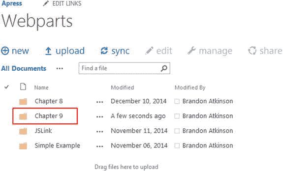

图 9-1。

Chapter 9 folder in the Webparts document library

本章中的每个例子都将遵循相同的模式。我们将查看在内容编辑器 Web 部件中呈现的 HTML 文件、用于检索和呈现数据的 JavaScript 文件，以及最终的结果。我们将深入研究每个文件，同时我将解释每个文件中发生了什么。

## 使用列表

如前一章所述，列表在 SharePoint 中随处可见！没有列表，你的开发工作不会走得很远。在这一节中，我们将探索使用 REST API 与列表交互的一些方法。

### 获取列表数据

在这个例子中，我们将简单地检索一些列表数据来显示给用户。

#### 超文本标记语言

在 Visual Studio 中创建新的 HTML 文件，并将其命名为 RESTGetListData.html。这个例子中的 HTML 非常简单。它仅由以下几行组成:

``

`

`

如果您研究过 JSOM 的例子，您会注意到这个 HTML 更简洁，JavaScript 引用更少。这样做的主要原因是，当使用 REST API 时，您不需要像 JSOM 一样加载任何 SharePoint JavaScript 文件。对 REST API 的所有调用都是通过 JavaScript AJAX 调用来执行的。在我们的例子中，我们将使用 jQuery 的 AJAX 方法。

接下来，我们加载名为`RESTGetListData`的自定义 JavaScript 文件。该文件包含将数据加载到页面上的 DIV 的所有代码，该页面的 ID 为`divGetListData`。总而言之，这一页没有多少内容。

#### Java Script 语言

在 Visual Studio 中创建新的 JavaScript 文件，并将其命名为 RESTGetListData.js。它由以下几行组成:

`$(function () {`

`getListData();`

`});`

`function getListData() {`

`var siteUrl = _spPageContextInfo.webAbsoluteUrl;`

`var fullUrl = siteUrl + "/_api/web/lists";`

`$.ajax({`

`url: fullUrl,`

`type: "GET",`

`headers: {`

`"accept": "application/json;odata=verbose",`

`"content-type": "application/json;odata=verbose",`

`},`

`success: onQuerySucceeded,`

`error: onQueryFailed`

`});`

`}`

`function onQuerySucceeded(data) {`

`var listItemInfo = '';`

`$.each(data.d.results, function (key, value) {`

`listItemInfo += 'Title: ' + value.Title + ' - Created: ' +`

`value.Created + ' ';`

`});`

`$("#divGetListData").html(listItemInfo);`

`}`

`function onQueryFailed() {`

`alert('Error!');`

`}`

对于这个文件，您会注意到的第一件事是这里只有很少的 SharePoint 代码。该文件中绝大多数代码是 JavaScript 和 jQuery，只有`_spPageContextInfo.webAbsoluteUrl`调用引用任何 SharePoint JavaScript。对于那些不熟悉 SharePoint 前端开发，但有 jQuery 经验的人来说，这似乎是一条不错的道路！如果您熟悉 jQuery 和 AJAX 调用，它确实提供了一种更快的方式来开始创建定制解决方案。

本书中的大多数例子都遵循与这个例子相同的模式。让我们深入到每一行的细节，以充分了解发生了什么。该脚本以一个 jQuery `Document.ready`方法开始，该方法简单地调用一个名为`getListData`的定制函数，在这里我们首先构建 REST API 的 URL:

`var siteUrl = _spPageContextInfo.webAbsoluteUrl;`

`var fullUrl = siteUrl + "/_api/web/lists";`

我们使用`_spPageContextInfo.webAbsoluteUrl`方法来获取用户当前所在的完整 URL。接下来，我们使用`/_api/web/lists`为这个站点中的列表添加 REST API 的路径。这将生成一个类似于以下内容的 URL:

`http://<DOMAIN>/<SITE>/_api/web/lists`

这是所有 REST URLs 的基本结构。`_api`表示这是对 REST API 的调用。当 SharePoint 将此视为 AJAX 调用中 URL 的一部分时，它知道将请求路由到 REST API 进行处理。对于这个特殊的例子，我们询问当前网站上的列表集合。如果您将此与 JSOM 的请求进行比较，您会发现一些相似之处:

`var collList = clientContext.get_web().get_lists();`

如您所见，REST API 遵循类似的模式“获取 web，然后获取列表”这种模式在整章中重复出现。接下来，我们进行一个标准的 jQuery AJAX 调用来获取 web 中的列表:

`$.ajax({`

`url: fullUrl,`

`type: "GET",`

`headers: {`

`"accept": "application/json;odata=verbose",`

`"content-type": "application/json;odata=verbose",`

`},`

`success: onQuerySucceeded,`

`error: onQueryFailed`

`});`

对于这个 AJAX 调用，我们传入的第一件事是调用的 URL。这是我们之前创建的`fullUrl`变量，它保存了 REST API 的完整 URL。接下来，我们指定呼叫的“类型”，在本例中是一个`GET`。我们必须在调用中提供一些“头”,以便 SharePoint 知道我们期待 JSON 返回结果。为此，我们为`accept`和`content-type`头传入了`application/json;odata=verbose`。这两个头将出现在几乎所有的 REST 调用中。最后，我们指定一旦调用完成应该触发的`success`和`failure`函数。`success`函数只是显示每个列表及其创建的时间戳:

`function onQuerySucceeded(data) {`

`var listItemInfo = '';`

`$.each(data.d.results, function (key, value) {`

`listItemInfo += 'Title: ' + value.Title + ' - Created: ' +`

`value.Created + ' ';`

`});`

`$("#divGetListData").html(listItemInfo);`

`}`

一开始，从 REST 调用返回的数据结构可能会令人困惑。如果您打开 Firebug 并查看该对象，您会发现返回了大量数据。比你需要向用户展示的还要多。此外，您希望向用户显示的数据嵌套在一个名为`d`的属性中。例如，在这个例子中，列表集合位于一个名为`data.d.results`的属性中。如果您要查询单个列表，就不会有`results`属性，您可以直接从`d`属性访问数据，就像`data.d.Title`一样。在这一章中，你会看到更多这样的例子。

#### 结果

将内容编辑器 Web 部件的内容链接属性设置为 HTML 文件，并保存页面。结果将显示当前站点的所有列表，如图 [9-2](#Fig2) 所示。

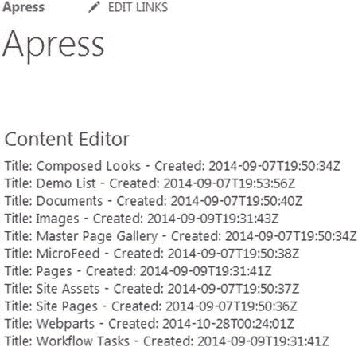

图 9-2。

Get List Data results in the Content Editor Web Part

### 创建新列表

我们可以很容易地使用 REST 创建新的列表，正如您将在这个例子中看到的。

#### 超文本标记语言

在 Visual Studio 中创建新的 HTML 文件，并将其命名为 RESTCreateList.html。这个例子的 HTML 比前一个例子稍微复杂一些。它由以下几行组成:

``

`
`

`<strong>Enter a name for the list:</strong>`

`<input type="text" id="txtListName" />`

`<input type="button" id="btnSubmitListName" value="Submit" />`

`
`

`

`

HTML 稍微复杂一点，页面上有几个元素。首先，有一些简单的文本包装在一个`<strong>`标签中，使其在页面上加粗。接下来，有一个文本类型的输入，它只是一个简单的文本框，供用户输入他们希望创建的列表的名称。有一个按钮供用户提交新的列表请求，最后还有一个 DIV，我们可以在其中输出列表创建的结果。每个元素都有一个 ID，所以我们可以很容易地用 jQuery 找到它。

Note

为了通过 REST 创建新列表，执行代码的用户必须至少拥有 SharePoint 中的管理列表权限。无论权限级别如何，都将呈现该页面；但是，如果用户没有足够的权限，SharePoint 将引发错误。

#### Java Script 语言

在 Visual Studio 中创建新的 JavaScript 文件，命名为 RESTCreateList.js，相比之下 JavaScript 文件更复杂。它由以下几行组成:

`$(function () {`

`bindButtonClick();`

`});`

`function bindButtonClick() {`

`$("#btnSubmitListName").on("click", function () {`

`var listName = $("#txtListName").val();`

`createList(listName);`

`});`

`}`

`function createList(listName) {`

`var siteUrl = _spPageContextInfo.webAbsoluteUrl;`

`var fullUrl = siteUrl + "/_api/web/lists";`

`$.ajax({`

`url: fullUrl,`

`type: "POST",`

`data: JSON.stringify({`

`'__metadata': { 'type': 'SP.List' },`

`'BaseTemplate': 100,`

`'Title': listName`

`}),`

`headers: {`

`"accept": "application/json;odata=verbose",`

`"content-type": "application/json;odata=verbose",`

`"X-RequestDigest": $("#__REQUESTDIGEST").val()`

`},`

`success: onQuerySucceeded,`

`error: onQueryFailed`

`});`

`}`

`function onQuerySucceeded(data) {`

`$("#divCreateListResults").html(data.d.Title + " successfully created!");`

`}`

`function onQueryFailed() {`

`alert('Error!');`

`}`

在这个例子中，我们不需要在页面加载上触发任何动作；然而，我们确实需要在页面加载时连接一个按钮点击事件。在`Document.ready`函数中，我们触发了`bindButtonClick`函数，我们使用 jQuery `on`操作符在 HTML 中的`btnSubmitListName`按钮上连接一个点击事件。当用户点击按钮时，我们从页面的文本框中抓取文本，并将其传递给`createList()`函数。这是使用以下代码行完成的:

`function bindButtonClick() {`

`$("#btnSubmitListName").on("click", function () {`

`var listName = $("#txtListName").val();`

`createList(listName);`

`});`

`}`

`createList()`函数接受一个名为`listName`的变量，它是用户在页面上输入的文本。接下来，我们使用以下代码构建 REST 调用的 URL:

`var siteUrl = _spPageContextInfo.webAbsoluteUrl;`

`var fullUrl = siteUrl + "/_api/web/lists";`

您会注意到，这与上一个示例中的 URL 相同，因为我们的目标是 web 中的列表集合。然而，AJAX 看起来完全不同:

`$.ajax({`

`url: fullUrl,`

`type: "POST",`

`data: JSON.stringify({`

`'__metadata': { 'type': 'SP.List' },`

`'BaseTemplate': 100,`

`'Title': listName`

`}),`

`headers: {`

`"accept": "application/json;odata=verbose",`

`"content-type": "application/json;odata=verbose",`

`"X-RequestDigest": $("#__REQUESTDIGEST").val()`

`},`

`success: onQuerySucceeded,`

`error: onQueryFailed`

`});`

就像前面的例子一样，我们将变量`fullUrl`作为要调用的 URL 传入，现在类型是一个`POST`。因为我们在这个例子中创建了一个新列表，所以我们使用`POST`向 SharePoint 表明这是一个创建操作。接下来，我们使用以下代码行传入新列表的数据:

`data: JSON.stringify({`

`'__metadata': { 'type': 'SP.List' },`

`'BaseTemplate': 100,`

`'Title': listName`

`})`

当我们使用 REST API 而不是`GET`执行任何类型的操作时，我们都是在向 SharePoint 传递数据。这些数据是 JSON 格式的。`JSON.stringify`方法是一个标准的 JavaScript 方法，它将 JavaScript 数据结构转换成 JSON 文本。这有助于确保我们传递给 SharePoint 的数据格式正确。我们做的第一件事是将“类型”设置为“SP”。List”并将“BaseTemplate”设置为“100”，这是一个通用列表。最后，我们为标题传入`listName`变量。接下来，我们添加头并包含一个名为`X-RequestDigest`的新头:

`"X-RequestDigest": $("#__REQUESTDIGEST").val()`

这个头允许我们为页面上的 FormDigest 控件传入值。该控件在 SharePoint 中用作安全措施，以确保`POST`请求确实来自有效的 SharePoint 页面。您不需要知道这个控件的所有细节，只需要使用 jQuery 行`$("#__REQUESTDIGEST").val()`获取它的值。一旦头部就位，我们就指定成功和失败函数。`success`函数只显示列表名和一条成功消息:

`function onQuerySucceeded(data) {`

`$("#divGetListData").html(data.d.Title + " successfully created!");`

`}`

这个函数接受一个名为`data`的参数。这个变量将由刚刚创建的列表中的数据填充。这个变量的命名没有什么特别之处；我们可以称之为“列表”，或“我的数据”。如果您愿意，您甚至可以不指定参数，只显示一条成功消息！

#### 结果

将内容编辑器 Web 部件的内容链接属性设置为 HTML 文件，并保存页面。该页面现在将显示文本框和按钮，供用户输入新的列表名称。键入我的自定义 REST 列表，然后单击提交按钮。结果将显示成功消息，如图 [9-3](#Fig3) 所示。

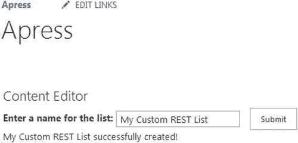

图 9-3。

Create new list code after it has been run

因为这些都是使用 JavaScript 和 AJAX 完成的，所以列表会被创建，用户会得到预期的通知。但是，页面上的左侧导航将不会更新，因为页面尚未刷新。您完全可以更改这段代码，以便在成功时刷新页面，但是对于本例，我们只是在浏览器中刷新页面。图 [9-4](#Fig4) 显示了刷新后的页面，新列表显示在左侧导航中。

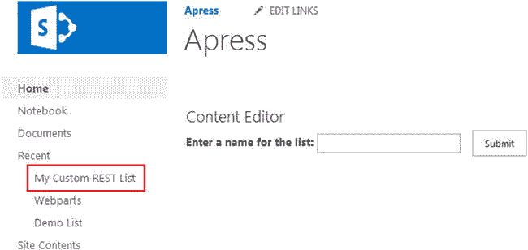

图 9-4。

The new list as displayed in the left navigation pane

### 删除列表

在本例中，我们将简单地删除刚刚创建的列表。

#### 超文本标记语言

在 Visual Studio 中创建新的 HTML 文件，并将其命名为 RESTDeleteList.html。这个例子的 HTML 几乎和前面的例子一样。它由以下几行组成:

``

`
`

`<strong>Enter the name of the list to delete:</strong>`

`<input type="text" id="txtListName" />`

`<input type="button" id="btnSubmitListName" value="Submit" />`

`
`

`

`

这里唯一的不同是，我们更新了页面上的文本以指示该 web 部件将删除一个列表，并将结果 DIV 的 ID 更改为`divDeleteListResults`。

#### Java Script 语言

在 Visual Studio 中创建一个新的 JavaScript 文件，并将其命名为 RESTDeleteList.js。

`$(function () {`

`bindButtonClick();`

`});`

`function bindButtonClick() {`

`$("#btnSubmitListName").on("click", function () {`

`var listName = $("#txtListName").val();`

`deleteList(listName);`

`});`

`}`

`function deleteList(listName) {`

`var siteUrl = _spPageContextInfo.webAbsoluteUrl;`

`var fullUrl = siteUrl + "/_api/web/lists/GetByTitle('" + listName + "')";`

`$.ajax({`

`url: fullUrl,`

`type: "POST",`

`headers: {`

`"accept": "application/json;odata=verbose",`

`"content-type": "application/json;odata=verbose",`

`"X-RequestDigest": $("#__REQUESTDIGEST").val(),`

`"X-HTTP-Method": "DELETE",`

`"IF-MATCH": "*"`

`},`

`success: onQuerySucceeded,`

`error: onQueryFailed`

`});`

`}`

`function onQuerySucceeded() {`

`$("#divDeleteListResults").html("List successfully deleted!");`

`}`

`function onQueryFailed(sender, args) {`

`alert('Error!');`

`}`

jQuery 按钮连接与上一个示例中的相同。接下来，我们需要为 REST 调用创建 URL，这次请求一个特定的列表:

`var siteUrl = _spPageContextInfo.webAbsoluteUrl;`

`var fullUrl = siteUrl + "/_api/web/lists/GetByTitle('" + listName + "')";`

这个 URL 添加了额外的`GetByTitle`命令，传入我们正在寻找的列表的名称。最终的 URL 将如下所示:

`http://<DOMAIN>/<SITE>/_api/web/lists/GetByTitle('<LISTNAME>')`

接下来，我们需要添加几个额外的头:

`"X-HTTP-Method": "DELETE",`

`"IF-MATCH": "*"`

您会注意到请求的类型是一个`POST`，就像我们创建一个新列表一样。然而，这里我们想要发起一个“删除”请求，所以我们需要包含`X-HTTP-Method`头，让 SharePoint 知道我们想要删除列表，而不是对它采取一些其他的动作。接下来，我们包括了`IF-MATCH`头。当通过 REST 进行更新和删除时，需要这个头。该标题有助于防止并发更新的发生。例如，如果您试图更新一个列表项，您可以传入一个类似如下的`etag`属性:

`"If-Match": data.d.__metadata.etag`

在这个头中传递`*`基本上是告诉 SharePoint 不要担心并发性，只需执行更新。在这个例子中，我们删除了列表，所以我们不需要担心这个检查。`success`函数只是通知用户删除成功。

#### 结果

将内容编辑器 Web 部件的内容链接属性设置为 HTML 文件，并保存页面。该页面现在将显示文本框和按钮，供用户输入要删除的列表名称。键入我的自定义 REST 列表，然后单击提交按钮。结果将显示成功消息，如图 [9-5](#Fig5) 所示。

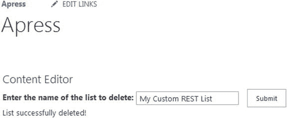

图 9-5。

Delete List code after it has successfully run

因为这些都是使用 JavaScript 和 AJAX 完成的，所以列表将被删除，用户将得到预期的通知。但是，页面上的左侧导航将不会更新，因为页面尚未刷新。如前所述，您可以更新此代码以在成功时刷新页面，但是对于本例，我们将简单地在浏览器中刷新页面。图 [9-6](#Fig6) 显示了刷新后的页面，其中列表不再显示在左侧导航中。

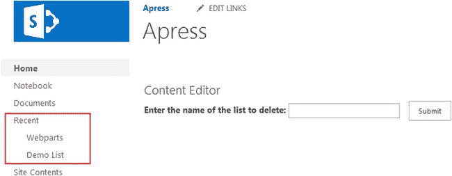

图 9-6。

Deleted list has been removed from the left navigation

## 使用列表项目

由于在 SharePoint 开发中使用列表是一项非常常见的任务，因此使用列表项更加常见。在这一节中，我们将探索一些使用 REST API 与列表项交互的方法。

### 获取列表项目

这个例子将向你展示如何使用 REST 来检索列表项。

#### 超文本标记语言

在 Visual Studio 中创建新的 HTML 文件，并将其命名为 RESTGetListItems.html。这个例子的 HTML 继续遵循前面例子的极简模式。它由以下几行组成:

``

`

`

对于这个例子，我们将简单地从演示列表中获取所有的列表项，并将它们显示在页面上的`divListItems` DIV 中。

#### Java Script 语言

在 Visual Studio 中创建一个新的 JavaScript 文件，并将其命名为 RESTGetListItems.js。检索列表项的脚本应该与我们到目前为止看到的其他脚本非常相似。它由以下几行组成:

`$(function () {`

`retrieveListItems();`

`});`

`function retrieveListItems() {`

`var siteUrl = _spPageContextInfo.webAbsoluteUrl;`

`var fullUrl = siteUrl + "/_api/web/lists/GetByTitle('Demo List')/items";`

`$.ajax({`

`url: fullUrl,`

`type: "GET",`

`headers: {`

`"accept": "application/json;odata=verbose",`

`"content-type": "application/json;odata=verbose",`

`},`

`success: onQuerySucceeded,`

`error: onQueryFailed`

`});`

`}`

`function onQuerySucceeded(data) {`

`var listItemInfo = '';`

`$.each(data.d.results, function (key, value) {`

`listItemInfo += '<strong>ID: </strong> ' + value.Id +`

`' <strong>Title:</strong> ' + value.Title +`

`' ';`

`});`

`$("#divListItems").html(listItemInfo);`

`}`

`function onQueryFailed(sender, args) {`

`alert('Error!');`

`}`

此时，获取列表项的 REST 调用的 URL 应该看起来非常熟悉:

`var siteUrl = _spPageContextInfo.webAbsoluteUrl;`

`var fullUrl = siteUrl + "/_api/web/lists/GetByTitle('Demo List')/items";`

与删除 URL 一样，我们通过使用`GetByTitle`命令获得列表的标题，然后添加`items`命令，该命令告诉 SharePoint 返回列表中的所有项目。AJAX 调用是一个简单的`GET`,包含了熟悉的 JSON 头。`success`函数使用 jQuery 遍历结果:

`$.each(data.d.results, function (key, value) {`

`listItemInfo += '<strong>ID: </strong> ' + value.Id +`

`' <strong>Title:</strong> ' + value.Title +`

`' ';`

`});`

就像我们访问站点中的列表一样，我们使用`data.d.results`集合来访问查询结果。在 jQuery `each`循环中，我们取出每个列表项的 ID 和标题，并在页面上显示这些结果。

#### 结果

将内容编辑器 Web 部件的内容链接属性设置为 HTML 文件，并保存页面。页面现在将显示演示列表中的所有项目，如图 [9-7](#Fig7) 所示。

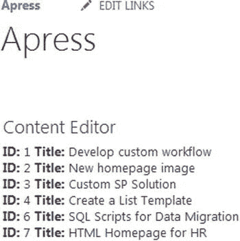

图 9-7。

List items from the Demo List displayed in the Content Editor Web Part

### 使用查询运算符限制结果

在前一章中，我们讨论了这样一个事实:在大多数情况下，你不应该从一个列表中请求所有的项目；无论是使用 JSOM 还是休息，这都不是一个好主意。我们看到了如何使用 CAML 查询在 JSOM 限制结果。使用 REST API 时，可以使用查询操作符来限制返回的结果。查询操作符基本上是添加到 AJAX 调用中 REST URL 末尾的查询字符串参数。

#### Java Script 语言

更新前面示例中的`RESTGetListItems.js`,并使用以下代码行更新声明 REST URL 的部分:

`var siteUrl = _spPageContextInfo.webAbsoluteUrl;`

`var fullUrl = siteUrl + "/_api/web/lists/GetByTitle('Demo List')/items?$filter=Id ge 4";`

这里唯一的附加内容是在 URL 的末尾，带有下面的查询字符串:`$filter=Id ge 4`。我们使用`filter`操作符来过滤结果。我们指定要过滤大于或等于(`ge` ) 4 的 ID。这是一个非常简单的加法，但是对查询操作符是一个很好的介绍。

Note

查询操作符是一个很大的主题——对于本书来说太大了。这些运算符允许您进行选择、过滤、排序、排序等操作。通过使用这些运算符，您甚至可以告诉 SharePoint 仅返回有关 SharePoint 中项目的特定数据。有关使用查询运算符的更多信息，请访问 [`http://msdn.microsoft.com/en-us/library/office/fp142385%28v=office.15%29.aspx`](http://msdn.microsoft.com/en-us/library/office/fp142385%28v=office.15%29.aspx) 。

#### 结果

更新 JavaScript 文件并上传，覆盖之前的版本。使用内容编辑器 Web 部件刷新页面，您将看到结果现在只显示 ID 大于或等于 4 的项目，如图 [9-8](#Fig8) 所示。

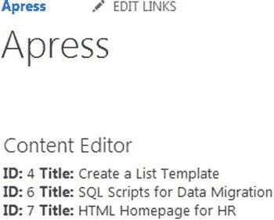

图 9-8。

The results of the Demo List query limited by a query operator

### 添加列表项目

在这个例子中，我们将看看如何向列表中添加新的列表项。

#### 超文本标记语言

在 Visual Studio 中创建新的 HTML 文件，并将其命名为 RESTAddListItems.html。该页面的标记将允许用户向演示列表添加一个项目，提供标题和描述。它由以下几行组成:

``

`
`

`
`

`Title:`

` `

`<input type="text" id="txtTitle" />`

`
`

`
`

`Description:`

` `

`<textarea cols="20" id="txtDesc"></textarea>`

`
`

` `

`
`

`<input id="btnSubmit" type="button" value="Submit" />`

`
`

`
`

`

`

我们为列表项标题提供文本类型的输入，并为描述提供文本区域。页面上的每个元素都有一个 ID，所以我们可以很容易地用 jQuery 找到它。

#### Java Script 语言

在 Visual Studio 中创建一个新的 JavaScript 文件，并将其命名为 RESTADDListItems.js，添加列表项的脚本看起来类似于创建新列表的脚本。它由以下几行组成:

`$(function () {`

`bindButtonClick();`

`});`

`function bindButtonClick() {`

`$("#btnSubmit").on("click", function () {`

`addListItem();`

`});`

`}`

`function addListItem() {`

`var title = $("#txtTitle").val();`

`var desc = $("#txtDesc").val();`

`var siteUrl = _spPageContextInfo.webAbsoluteUrl;`

`var fullUrl = siteUrl + "/_api/web/lists/GetByTitle('Demo List')/items";`

`$.ajax({`

`url: fullUrl,`

`type: "POST",`

`data: JSON.stringify({`

`'__metadata': { 'type': 'SP.Data.Demo_x0020_ListListItem' },`

`'Title': title,`

`'Description': desc,`

`'Status':'On-time'`

`}),`

`headers: {`

`"accept": "application/json;odata=verbose",`

`"content-type": "application/json;odata=verbose",`

`"X-RequestDigest": $("#__REQUESTDIGEST").val()`

`},`

`success: onQuerySucceeded,`

`error: onQueryFailed`

`});`

`}`

`function onQuerySucceeded(sender, args) {`

`$("#divResult").html("Item successfully added!");`

`}`

`function onQueryFailed() {`

`alert('Error!');`

`}`

在我们用 jQuery 附加了一个按钮点击事件之后，我们在点击事件上做的第一件事就是获取用户提供的值。这是通过以下代码行实现的:

`var title = $("#txtTitle").val();`

`var desc = $("#txtDesc").val();`

接下来，我们创建 REST URL，目标是演示列表和列表中的列表项:

`var siteUrl = _spPageContextInfo.webAbsoluteUrl;`

`var fullUrl = siteUrl + "/_api/web/lists/GetByTitle('Demo List')/items";`

然后我们创建一个 jQuery AJAX `POST`调用，为新的列表项传入数据:

`data: JSON.stringify({`

`'__metadata': { 'type': 'SP.Data.Demo_x0020_ListListItem' },`

`'Title': title,`

`'Description': desc,`

`'Status':'On-time'`

`})`

这段代码与本章前面的创建列表代码非常相似。我们做的第一件事是指定要创建的项目的类型；在这种情况下，一个`SP.Data.Demo_x0020_ListListItem`。项目的类型总是包括创建它的列表的名称，它遵循以下模式:

`SP.Data.<LISTNAME>ListItem`

在本例中，由于我们的列表名为演示列表，我们必须包含 SharePoint 用来表示空间的`_x0020_`。对于标题和描述，我们只需传入之前检索到的值。对于 Status 列，我们简单地将 On-time 硬编码为一个值。因为我们正在执行一个`POST`，我们包括了`X-RequestDigest`头。`success`功能将简单地向用户显示一条消息，说明该项目已被添加到列表中。

#### 结果

将内容编辑器 Web 部件的内容链接属性设置为 HTML 文件，并保存页面。该页面将显示供用户输入详细信息的文本框。当添加一个项目时，会显示一条成功信息，如图 [9-9](#Fig9) 所示。

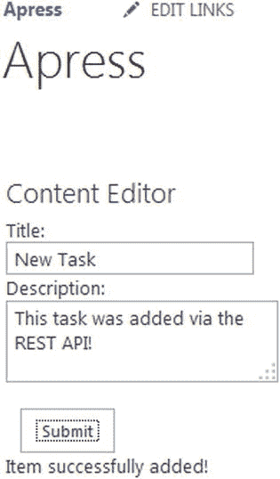

图 9-9。

Adding a new item to the Demo List

然后，我们可以导航到演示列表，以确认添加了新项目。图 [9-10](#Fig10) 显示了添加了新列表项和 HTML 页面提供的值的演示列表。

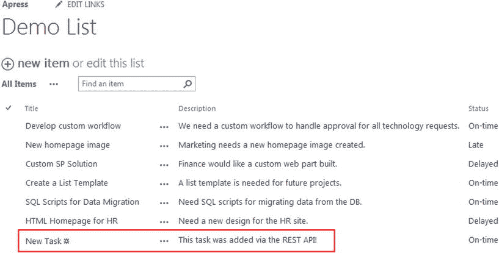

图 9-10。

A new list item added to the Demo List

### 删除列表项目

对于这个例子，我们将简单地删除我们在上一节中创建的新列表项。

#### 超文本标记语言

在 Visual Studio 中创建新的 HTML 文件，并将其命名为 RESTDeleteListItems.html。这个文件的 HTML 要小得多，因为我们需要从用户那里获取的只是一个对应于他们想要删除的列表项的 ID。这是通过以下代码行实现的:

``

`
`

`Enter ID to Delete: <input type="text" id="txtId" />`

`
`

`
`

`<input id="btnSubmit" type="button" value="Submit" />`

`
`

`

`

这个例子过于简单，因为用户很可能不知道要删除的某个列表项的 ID。一个更真实的例子可能是向用户显示一个项目列表，并允许他们单击一个项目来删除它。在这种情况下，页面上会有列表项 id，并且可以很容易地访问它。我们将保留一个简单的文本框来简化这个例子。

#### Java Script 语言

在 Visual Studio 中创建一个新的 JavaScript 文件，并将其命名为 RESTDeleteListItems.js。

`$(function () {`

`bindButtonClick();`

`});`

`function bindButtonClick() {`

`$("#btnSubmit").on("click", function () {`

`deleteListItem();`

`});`

`}`

`function deleteListItem() {`

`var id = $("#txtId").val();`

`var siteUrl = _spPageContextInfo.webAbsoluteUrl;`

`var fullUrl = siteUrl + "/_api/web/lists/GetByTitle('Demo List')/items(" + id + ")";`

`$.ajax({`

`url: fullUrl,`

`type: "POST",`

`headers: {`

`"accept": "application/json;odata=verbose",`

`"content-type": "application/json;odata=verbose",`

`"X-RequestDigest": $("#__REQUESTDIGEST").val(),`

`"X-HTTP-Method": "DELETE",`

`"IF-MATCH": "*"`

`},`

`success: onQuerySucceeded,`

`error: onQueryFailed`

`});`

`}`

`function onQuerySucceeded(sender, args) {`

`$("#divResult").html("Item successfully deleted!");`

`}`

`function onQueryFailed() {`

`alert('Error!');`

`}`

页面上的按钮点击事件将调用`deleteListItem()`函数。我们做的第一件事是获取用户在页面上输入的 ID。这是使用以下代码行完成的:

`var id = $("#txtId").val();`

接下来，我们创建 REST URL，通过 ID 定位特定的列表项:

`var siteUrl = _spPageContextInfo.webAbsoluteUrl;`

`var fullUrl = siteUrl + "/_api/web/lists/GetByTitle('Demo List')/items(" + id + ")";`

您可以通过在 URL 末尾的括号中包含其 ID 来请求或定位单个列表项。完整的 URL 如下所示:

`http://<DOMAIN>/<SITE>/_api/web/lists/GetByTitle('<LISTNAME>')/items(<ID>)`

和以前一样，当删除一个列表时，我们在进行 AJAX 调用时包含了`"X-HTTP-Method": "DELETE"`和`IF-MATCH": "*"`头。`success`方法将简单地向用户显示一条消息，通知他们删除已经完成。

#### 结果

将内容编辑器 Web 部件的内容链接属性设置为 HTML 文件，并保存页面。页面将显示供用户输入 ID 的文本框，然后在删除项目时显示成功消息，如图 [9-11](#Fig11) 所示。

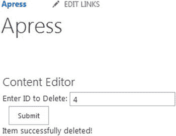

图 9-11。

Deleting a list item using REST

## 使用文档库

SharePoint 的主要优势之一在于文档管理及其文档库。您肯定会发现需要通过代码使用库的需求。在这一节中，我们将研究一些使用 REST API 与文档库交互的方法。

### 创建新文件夹

SharePoint 用户喜欢创建文件夹，在这个例子中，我们将看到如何通过代码创建一个文件夹。

#### 超文本标记语言

在 Visual Studio 中创建新的 HTML 文件，并将其命名为 RESTCreateFolder.html。这个页面的标记非常简单，允许用户输入他们希望创建的文件夹的名称。它由以下几行组成:

``

`
`

`<strong>Enter a name for the folder:</strong>`

`<input type="text" id="txtFolderName" />`

`<input type="button" id="btnSubmit" value="Submit" />`

`
`

`

`

#### Java Script 语言

在 Visual Studio 中创建一个新的 JavaScript 文件，并将其命名为 RESTCreateFolder.js。

`$(function () {`

`bindButtonClick();`

`});`

`function bindButtonClick() {`

`$("#btnSubmit").on("click", function () {`

`createFolder();`

`});`

`}`

`function createFolder() {`

`var folderName = $("#txtFolderName").val();`

`var siteUrl = _spPageContextInfo.webAbsoluteUrl;`

`var fullUrl = siteUrl + "/_api/web/folders";`

`$.ajax({`

`url: fullUrl,`

`type: "POST",`

`data: JSON.stringify({`

`'__metadata': { 'type': 'SP.Folder' },`

`'ServerRelativeUrl': 'Shared Documents/' + folderName`

`}),`

`headers: {`

`"accept": "application/json;odata=verbose",`

`"content-type": "application/json;odata=verbose",`

`"X-RequestDigest": $("#__REQUESTDIGEST").val()`

`},`

`success: onQuerySucceeded,`

`error: onQueryFailed`

`});`

`}`

`function onQuerySucceeded() {`

`$("#divResults").html("Folder successfully created!");`

`}`

`function onQueryFailed() {`

`alert('Error!');`

`}`

在使用 jQuery 连接按钮点击之后，`createFolder()`函数从获取用户在页面上输入的文件夹名称开始:

`var folderName = $("#txtFolderName").val();`

接下来，我们创建 REST URL，但这一次我们的目标是站点的文件夹集合:

`var siteUrl = _spPageContextInfo.webAbsoluteUrl;`

`var fullUrl = siteUrl + "/_api/web/folders";`

这打破了我们到目前为止看到的熟悉模式，因为我们请求的 URL 不是我们想要创建文件夹的特定位置。我们在`data`属性中指定文件夹应该位于何处:

`data: JSON.stringify({`

`'__metadata': { 'type': 'SP.Folder' },`

`'ServerRelativeUrl': 'Shared Documents/' + folderName`

`})`

`ServerRelativeUrl`属性用于告诉 SharePoint 应该在哪里创建文件夹。在本例中，我们将在 Shared Documents 文件夹中创建它，并附加用户在页面上输入的文件夹名称。与前面的例子一样，我们为项目指定一个“类型”，在本例中是一个`SP.Folder`。我们包含了熟悉的标题，并在`success`方法中通知用户文件夹的创建。

#### 结果

将内容编辑器 Web 部件的内容链接属性设置为 HTML 文件，并保存页面。页面会显示文本框，供用户输入要创建的文件夹的名称，完成后会显示成功消息，如图 [9-12](#Fig12) 所示。

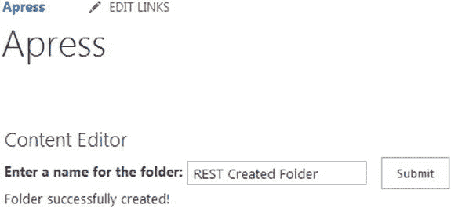

图 9-12。

Creating a new folder with REST

然后，我们可以导航到文档库，直观地验证新文件夹是否已创建，如图 [9-13](#Fig13) 所示。

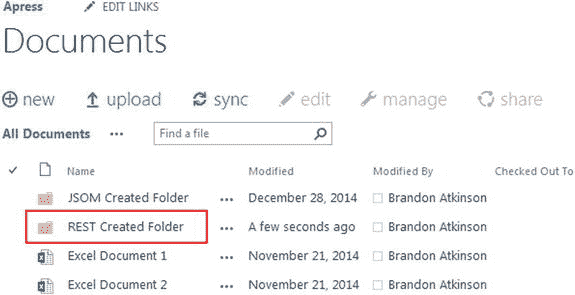

图 9-13。

New folder created via REST

## 使用文件

有时候，您需要在自定义解决方案中处理文件。在这一节中，我们将看到如何使用 REST 创建、读取和删除文本文件。

### 创建新文件

在这个例子中，我们将看到如何通过代码创建一个新的文本文件。

#### 超文本标记语言

在 Visual Studio 中创建新的 HTML 文件，并将其命名为 RESTCreateDocument.html。该页面的标记将允许用户输入新文本文件的名称，以及文件本身的内容。它由以下几行组成:

``

`
`

`
`

`<strong>Enter a title for the document:</strong>`

` `

`<input type="text" id="txtDocumentTitle" />`

`
`

`
`

`<strong>Enter content for the document:</strong>`

` `

`<textarea cols="20" id="txtDocumentContent"></textarea>`

`
`

` `

`<input type="button" id="btnSubmit" value="Submit" />`

`
`

`

`

#### Java Script 语言

在 Visual Studio 中创建一个新的 JavaScript 文件，并将其命名为 RESTCreateDocument.js。

`$(function () {`

`bindButtonClick();`

`});`

`function bindButtonClick() {`

`$("#btnSubmit").on("click", function () {`

`createDocument();`

`});`

`}`

`function createDocument() {`

`var docTitle = $("#txtDocumentTitle").val() + ".txt";`

`var docContent = $("#txtDocumentContent").val();`

`var siteUrl = _spPageContextInfo.webAbsoluteUrl;`

`var fullUrl = siteUrl + "/_api/web/GetFolderByServerRelativeUrl('Shared Documents')/Files/add(url='" + docTitle + "',overwrite=true)";`

`$.ajax({`

`url: fullUrl,`

`type: "POST",`

`data: docContent,`

`headers: {`

`"accept": "application/json;odata=verbose",`

`"content-type": "application/json;odata=verbose",`

`"X-RequestDigest": $("#__REQUESTDIGEST").val()`

`},`

`success: onQuerySucceeded,`

`error: onQueryFailed`

`});`

`}`

`function onQuerySucceeded() {`

`$("#divResults").html("Document successfully created!");`

`}`

`function onQueryFailed() {`

`alert('Error!');`

`}`

我们需要做的第一件事是获取用户在页面上输入的文档标题和内容。这是通过以下代码行实现的:

`var docTitle = $("#txtDocumentTitle").val() + ".txt";`

`var docContent = $("#txtDocumentContent").val();`

注意，我们在文档标题的末尾添加了`.txt`。这将让 SharePoint 知道我们打算创建一个文本文件，因为它将使用名称中的扩展名来确定文件类型。接下来，我们构建 REST URL:

`var siteUrl = _spPageContextInfo.webAbsoluteUrl;`

`var fullUrl = siteUrl + "/_api/web/GetFolderByServerRelativeUrl('Shared Documents')/Files/add(url='" + docTitle + "',overwrite=true)";`

这是迄今为止我们制作的最复杂的 REST URL。为了引用我们想要创建文件的文件夹，我们需要包含`GetFolderByServerRelativeUrl`命令，传递文件夹名；在这种情况下，共享文档。然后，我们将文件夹中的文件集合作为目标，并使用`add`命令实际创建文件。我们可以传入文件的属性；在这种情况下，URL 和覆盖标志。文件的内容通过 AJAX 调用中的`data`属性传入:

`$.ajax({`

`url: fullUrl,`

`type: "POST",`

`data: docContent,`

`headers: {`

`"accept": "application/json;odata=verbose",`

`"content-type": "application/json;odata=verbose",`

`"X-RequestDigest": $("#__REQUESTDIGEST").val()`

`}`

`success`功能向用户显示文件已创建的消息。

Note

在本例中，我们正在创建一个简单的文本文件。在大多数实际情况下，文本文件可能不是预期的结果，但可能是 Word 文件或 Excel 文件。您完全可以通过简单地将`.txt`更改为`.docx`来更改这个示例以生成一个 Word 文档。这个简单的更改实际上会创建一个包含内容的新 Word 文档。但是，它只能在客户端计算机上的 Word 中打开，而不能在 Office Web Apps 中打开。幸运的是，微软提供了 Office JavaScript 文件，允许您从浏览器创建和操作 Office 文件。你可以在 [`http://msdn.microsoft.com/en-us/library/office/fp160953%28v=office.15%29.aspx`](http://msdn.microsoft.com/en-us/library/office/fp160953%28v=office.15%29.aspx) 找到更多信息。

#### 结果

将内容编辑器 Web 部件的内容链接属性设置为 HTML 文件，并保存页面。页面将显示文本框，供用户输入文档的标题和内容，然后在新文档创建完成后显示成功消息，如图 [9-14](#Fig14) 所示。

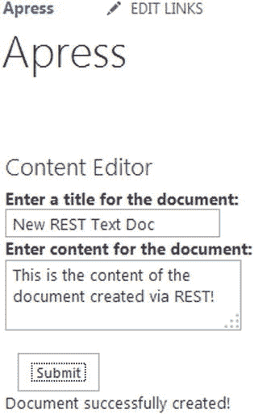

图 9-14。

Creating a new document from a Content Editor Web Part

我们可以导航到 Documents 文件夹，发现新的文本文档已经创建，如图 [9-15](#Fig15) 所示。您可以单击该文档，它将在浏览器中打开，并显示用户从页面输入的内容。

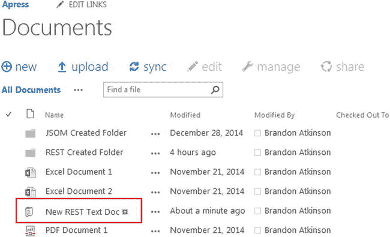

图 9-15。

New text document created in the Documents folder

### 阅读文件

在这个例子中，我们将看到如何读取我们刚刚创建的文本文件并向用户显示内容。

#### 超文本标记语言

在 Visual Studio 中创建新的 HTML 文件，并将其命名为 RESTReadDocument.html。它由以下几行组成:

``

`
`

#### Java Script 语言

在 Visual Studio 中创建一个新的 JavaScript 文件，并将其命名为 RESTReadDocument.js。

`$(function () {`

`readDocument();`

`});`

`function readDocument() {`

`var siteUrl = _spPageContextInfo.webAbsoluteUrl;`

`var documentLibrary = "/Shared Documents/"`

`var fileUrl = "New Text Doc.txt";`

`var fullUrl = siteUrl + documentLibrary + fileUrl;`

`$.ajax({`

`url: fullUrl,`

`type: "GET"`

`})`

`.done(function (data) {`

`$("#divReadDocument").html(data);`

`})`

`.fail(function () {`

`alert("error");`

`});`

`}`

这是上一章的相同代码示例，因为它不需要 JSOM 或 REST！如果你跳过了 JSOM 这一章，请继续读下去；否则，唯一改变的是文件引用。

从 SharePoint 读取文本文件的美妙之处在于，您只需要 jQuery。有一个简单的 jQuery `Document.ready`函数将触发代码来读取文件。我们有意保持代码简单，并对我们刚刚创建的文档的文件名进行硬编码:

`var siteUrl = _spPageContextInfo.webAbsoluteUrl;`

`var documentLibrary = "/Shared Documents/"`

`var fileUrl = "New REST Text Doc.txt";`

`var fullUrl = siteUrl + documentLibrary + fileUrl;`

我们做的第一件事是使用`_spPageContextInfo.webAbsoluteUrl`获取当前网站的完整 URL。接下来，我们对 URL 的文档库部分和文件名进行硬编码。最后，我们将它们放入一个名为`fullUrl`的新变量。您完全可以在一行中完成所有这些工作，但是您会发现，如果您将代码分成几行，以后调试代码会更容易。一旦我们有了文件的 URL，我们就使用 jQuery AJAX 调用来获取文档:

`$.ajax({`

`url: fullUrl,`

`type: "GET"`

`})`

`.done(function (data) {`

`$("#divReadDocument").html(data);`

`})`

`.fail(function () {`

`alert("error");`

`});`

当在 jQuery 中通过 AJAX 检索文本文件时，内容将以文本形式返回，我们可以简单地将它输出到页面，无需任何修改。我们使用 jQuery `.done`函数，将文件内容设置为一个名为`data`的新变量。然后，我们将数据设置为页面上结果 DIV 的 HTML。

Note

和以前一样，当创建一个新文件时，我们通过使用一个文本文件来保持事情的简单。这也适用于本节和读取文件。使用前面介绍的方法无法读取 Office 文件。您需要利用 Office JavaScript 文件在浏览器中正确读取 Word 文件或 Excel 文件。你可以在 [`http://msdn.microsoft.com/en-us/library/office/fp160953%28v=office.15%29.aspx`](http://msdn.microsoft.com/en-us/library/office/fp160953%28v=office.15%29.aspx) 找到更多信息。

#### 结果

将内容编辑器 Web 部件的内容链接属性设置为 HTML 文件，并保存页面。页面将显示文本文件的内容，如图 [9-16](#Fig16) 所示。

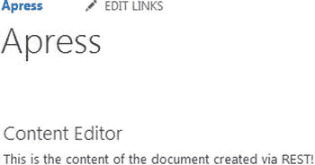

图 9-16。

Contents of the text file displayed on the page

### 删除文件

在本例中，我们将简单地删除新创建的文本文件。

#### 超文本标记语言

在 Visual Studio 中创建新的 HTML 文件，并将其命名为 RESTDeleteDocument.html。该页面的标记有一个文本框，用户可以输入他们希望删除的文件的名称。它由以下几行组成:

``

`
`

`
`

`<strong>Enter the name of document to delete:</strong>`

` `

`<input type="text" id="txtDocumentTitle" />`

`
`

` `

`<input type="button" id="btnSubmit" value="Submit" />`

`
`

`

`

#### Java Script 语言

在 Visual Studio 中创建一个新的 JavaScript 文件，并将其命名为 RESTDeleteDocument.js。

`$(function () {`

`bindButtonClick();`

`});`

`function bindButtonClick() {`

`$("#btnSubmit").on("click", function () {`

`deleteDocument();`

`});`

`}`

`function deleteDocument() {`

`var docTitle = $("#txtDocumentTitle").val() + ".txt";`

`var siteUrl = _spPageContextInfo.webAbsoluteUrl;`

`var webRelUrl = _spPageContextInfo.webServerRelativeUrl;`

`var fullUrl = siteUrl + "/_api/web/GetFileByServerRelativeUrl('" + webRelUrl + "/Shared Documents/" + docTitle + "')";`

`$.ajax({`

`url: fullUrl,`

`type: "POST",`

`headers: {`

`"accept": "application/json;odata=verbose",`

`"content-type": "application/json;odata=verbose",`

`"X-RequestDigest": $("#__REQUESTDIGEST").val(),`

`"X-HTTP-Method": "DELETE",`

`"IF-MATCH": "*"`

`},`

`success: onQuerySucceeded,`

`error: onQueryFailed`

`});`

`}`

`function onQuerySucceeded() {`

`$("#divResults").html("Document successfully deleted!");`

`}`

`function onQueryFailed(sender, args) {`

`alert('Error!');`

`}`

在连接按钮点击事件之后，我们做的第一件事是获取用户希望删除的文档的标题:

`var docTitle = $("#txtDocumentTitle").val() + ".txt";`

我们将保持这个例子的简单，删除之前创建的文本文件，从而将`.txt`扩展硬编码到代码中。接下来，我们像在前面所有示例中一样构建 REST URL:

`var siteUrl = _spPageContextInfo.webAbsoluteUrl;`

`var webRelUrl = _spPageContextInfo.webServerRelativeUrl;`

`var fullUrl = siteUrl + "/_api/web/GetFileByServerRelativeUrl('" + webRelUrl + "/Shared Documents/" + docTitle + "')";`

对于这个例子，除了获得网站的绝对 URL`webAbsoluteUrl`，我们还需要获得服务器相对 URL`webServerRelativeUrl`。绝对 URL 看起来像`http://<DOMAIN>/<SITE>`，站点的服务器相对 URL 看起来像`/<SITE>`。我们需要这个值来正确定位 REST URL 中的文件。为了删除文件，我们需要使用`GetFileByServerRelativeUrl`命令，传递文件的相对 URL。在这种情况下，我们将服务器相对 URL、`/Shared Documents/`和用户传入的文档标题结合起来。

与其他删除操作一样，我们包括了`"X-HTTP-Method": "DELETE"`和`"IF-MATCH": "*"`头。`success`函数将简单地通知用户删除已经发生。

#### 结果

将内容编辑器 Web 部件的内容链接属性设置为 HTML 文件，并保存页面。页面将显示一个文本框供用户输入文档标题，并显示结果消息，如图 [9-17](#Fig17) 所示。

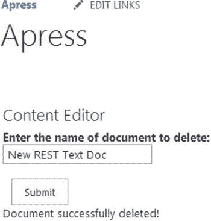

图 9-17。

Deleting a file via REST

## 使用站点

在 SharePoint 中创建新网站是一项常见任务。在这一节中，我们将看到如何使用 REST API 创建和删除站点。前面的例子明确说明了 REST API 的强大，这一节应该让您明白它为您的开发工作提供了多大的力量。

### 创建网站

在本例中，我们将创建一个新站点并设置它的几个属性。

#### 超文本标记语言

在 Visual Studio 中创建新的 HTML 文件，并将其命名为 RESTCreateSite.html。该页面的标记有一个供用户输入新站点名称的文本框，以及一个用于站点描述的文本框。它由以下几行组成:

``

`
`

`
`

`<strong>Enter the name of the site:</strong>`

` `

`<input type="text" id="txtSiteTitle" />`

`
`

` `

`
`

`<strong>Enter site description:</strong>`

` `

`<textarea cols="20" id="txtSiteDescription"></textarea>`

`
`

` `

`<input type="button" id="btnSubmit" value="Submit" />`

`
`

`

`

#### Java Script 语言

在 Visual Studio 中创建一个新的 JavaScript 文件，并将其命名为 RESTCreateSite.js。

`$(function () {`

`bindButtonClick();`

`});`

`function bindButtonClick() {`

`$("#btnSubmit").on("click", function () {`

`createSite();`

`});`

`}`

`function createSite() {`

`var newSiteTitle = $("#txtSiteTitle").val();`

`var newSiteDesc = $("#txtSiteDescription").val();`

`var newSiteUrl = newSiteTitle.replace(/\s/g, "");`

`var siteUrl = _spPageContextInfo.webAbsoluteUrl;`

`var fullUrl = siteUrl + "/_api/web/webinfos/add";`

`$.ajax({`

`url: fullUrl,`

`type: "POST",`

`data: JSON.stringify({`

`'parameters': {`

`'__metadata':  {'type': 'SP.WebInfoCreationInformation' },`

`'Url': newSiteUrl,`

`'Title': newSiteTitle,`

`'Description': newSiteDesc,`

`'Language':1033,`

`'WebTemplate':'sts#0',`

`'UseUniquePermissions': false`

`}`

`}),`

`headers: {`

`"accept": "application/json;odata=verbose",`

`"content-type": "application/json;odata=verbose",`

`"X-RequestDigest": $("#__REQUESTDIGEST").val()`

`},`

`success: onQuerySucceeded,`

`error: onQueryFailed`

`});`

`}`

`function onQuerySucceeded() {`

`$("#divResults").html("Site successfully created!");`

`}`

`function onQueryFailed(sender, args) {`

`alert('Error!');`

`}`

创建一个新的站点需要更多的代码，但是现在应该已经非常熟悉了。首先，我们获取用户提交的标题和描述。这是使用以下代码行完成的:

`var newSiteTitle = $("#txtSiteTitle").val();`

`var newSiteDesc = $("#txtSiteDescription").val();`

`var newSiteUrl = newSiteTitle.replace(/\s/g, "");`

创建网站时，除了标题之外，还必须提供网站的 URL。对于这个例子，我们将简单地获取用户为标题输入的文本，并删除所有空格以生成 URL。这是使用 JavaScript 中的`replace()`方法完成的，第一个参数是我们要搜索的内容，第二个参数是应该替换的内容。`/\s/g`文本表示一个空格，必须用于此功能才能正常工作。

一旦我们有了创建站点所需的变量，我们就创建 REST URL，但是这次我们的目标是站点的 Webinfos 集合:

`var siteUrl = _spPageContextInfo.webAbsoluteUrl;`

`var fullUrl = siteUrl + "/_api/web/webinfos/add";`

与我们创建新文件夹时类似，我们的目标位置不同于站点最终所在的位置。我们还在 URL 中包含了`add`命令；这不同于迄今为止的其他创建脚本。接下来，我们在 jQuery 中创建 AJAX 调用:

`$.ajax({`

`url: fullUrl,`

`type: "POST",`

`data: JSON.stringify({`

`'parameters': {`

`'__metadata':  {'type': 'SP.WebInfoCreationInformation' },`

`'Url': newSiteUrl,`

`'Title': newSiteTitle,`

`'Description': newSiteDesc,`

`'Language':1033,`

`'WebTemplate':'sts#0',`

`'UseUniquePermissions': false`

`}`

`})`

当使用`JSON.strigify()`方法传递数据时，这个例子不同于前面的例子。您会注意到我们必须创建一个`parameters`对象，然后包含创建新站点的所有信息。其他示例不需要这样做。这个对象没有什么值得注意的，因为它只是作为内部数据的包装器；但是，SharePoint 期望它，并且不会创建没有此结构的网站。

首先，我们指定“类型”，在本例中是一个`SP.WebInfoCreationInformation`类型。如果你研究过前一章中的 JSOM 例子，你会发现这和用 JSOM 创建站点的对象是一样的。其余的属性相当简单:我们传入先前创建的站点标题、URL 和描述变量。我们还传入了语言设置(`1033`表示英语)，以及 WebTemplate ( `sts#0`，这是一个团队站点模板)。站点创建完成后,`success`功能将显示成功消息。

Note

同样，这些示例中的代码在当前用户的权限级别下运行。由于这些示例中有许多执行更高级别的功能，如创建和删除 SharePoint 对象，因此用户需要有适当的权限来执行这些功能。值得再次指出这一点，因为站点创建要求用户对创建新站点的站点拥有完全控制权限。

#### 结果

将内容编辑器 Web 部件的内容链接属性设置为 HTML 文件，并保存页面。页面将显示文本框供用户输入新的站点标题和描述，并显示结果消息，如图 [9-18](#Fig18) 所示。

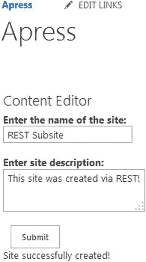

图 9-18。

Creating a new site via REST

然后，我们可以打开创建新站点的站点内容页面，并滚动到底部。在子站点部分，我们可以看到新站点已经创建，如图 [9-19](#Fig19) 所示。

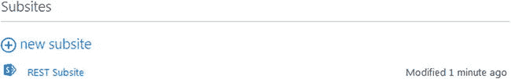

图 9-19。

The newly created sub-site in the Site Contents page

### 删除网站

在本例中，我们将删除在上一节中创建的站点。

#### 超文本标记语言

在 Visual Studio 中创建新的 HTML 文件，并将其命名为 RESTDeleteSite.html。这个页面的标记有一个文本框，用户可以输入他们想要删除的站点的名称。它由以下几行组成:

``

`
`

`
`

`<strong>Enter the name of the site to delete:</strong>`

` `

`<input type="text" id="txtSiteTitle" />`

`
`

` `

`<input type="button" id="btnSubmit" value="Submit" />`

`
`

`

`

#### Java Script 语言

在 Visual Studio 中创建一个新的 JavaScript 文件，并将其命名为 RESTDeleteSite.js。

`$(function () {`

`bindButtonClick();`

`});`

`function bindButtonClick() {`

`$("#btnSubmit").on("click", function () {`

`deleteSite();`

`});`

`}`

`function deleteSite() {`

`var siteTitle = $("#txtSiteTitle").val();`

`var siteTitleNoSpaces = siteTitle.replace(/\s/g, "");`

`var siteUrl = _spPageContextInfo.webAbsoluteUrl;`

`var fullUrl = siteUrl + "/" + siteTitleNoSpaces + "/_api/web";`

`$.ajax({`

`url: fullUrl,`

`type: "POST",`

`headers: {`

`"accept": "application/json;odata=verbose",`

`"content-type": "application/json;odata=verbose",`

`"X-RequestDigest": $("#__REQUESTDIGEST").val(),`

`"X-HTTP-Method": "DELETE",`

`"IF-MATCH": "*"`

`},`

`success: onQuerySucceeded,`

`error: onQueryFailed`

`});`

`}`

`function onQuerySucceeded() {`

`$("#divResults").html("Site successfully deleted!");`

`}`

`function onQueryFailed(sender, args) {`

`alert('Error!');`

`}`

就像前面的例子一样，我们获取用户输入的网站标题，然后删除所有空格:

`var siteTitle = $("#txtSiteTitle").val();`

`var siteTitleNoSpaces = siteTitle.replace(/\s/g, "");`

一旦我们有了标题并删除了空格，我们需要构建站点的其余 URL:

`var siteUrl = _spPageContextInfo.webAbsoluteUrl;`

`var fullUrl = siteUrl + "/" + siteTitleNoSpaces + "/_api/web";`

删除站点与迄今为止执行的任何其他删除操作没有什么不同。我们需要做的就是包含`"X-HTTP-Method": "DELETE"`和`"IF-MATCH": "*"`头。`success`功能将向用户显示一条消息，通知他们删除已经发生。

#### 结果

将内容编辑器 Web 部件的内容链接属性设置为 HTML 文件，并保存页面。页面会显示一个文本框供用户输入站点标题，并显示结果信息，如图 [9-20](#Fig20) 所示。

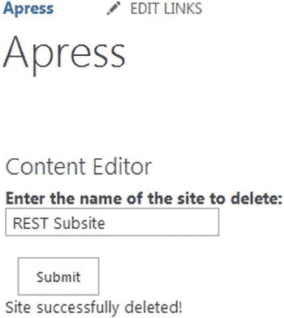

图 9-20。

Deleting a subsite via REST

在本例中，我们将删除刚刚创建的站点。导航回站点内容页面将显示该子站点已被成功删除，如图 [9-21](#Fig21) 所示。

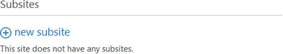

图 9-21。

Site has been removed from the root site

## 使用社交数据

社交数据是 SharePoint 2013 中的热门话题，在您开始创建自定义解决方案时，您应该对此有所了解。在这一节中，我们将看到如何检索一些社会数据，并将其显示给当前登录的用户。

### 超文本标记语言

在 Visual Studio 中创建新的 HTML 文件，并将其命名为 RESTGetSocialData.html。这个页面的标记将包括几个 div 和一个输出数据的 SPAN。它由以下几行组成:

``

`<link rel="stylesheet" type="text/css" href="/apress/Webparts/chapter 9/RESTGetSocialData.css" />`

`
`

`Welcome back `

`
`

`
`

我们将包含一个名为`RESTGetSocialData.css`的定制 CSS 文件。它将用于设置脚本输出的样式。所有其他的例子都可以很容易地包含 CSS 样式。在您的自定义开发工作中，您会发现样式将在许多 web 部件中扮演重要角色，因此这个示例将向您展示包含样式是多么容易。

#### Java Script 语言

在 Visual Studio 中创建一个新的 JavaScript 文件，并将其命名为 RESTGetSocialData.js。

`$(function () {`

`getUserProfileInfo();`

`getUserFollows();`

`});`

`function getUserProfileInfo() {`

`var siteUrl = _spPageContextInfo.webAbsoluteUrl;`

`var fullUrl = siteUrl + "/_api/social.feed/my";`

`$.ajax({`

`url: fullUrl,`

`type: "GET",`

`headers: {`

`"accept": "application/json;odata=verbose",`

`"content-type": "application/json;odata=verbose",`

`},`

`success: onUserInfoQuerySucceeded,`

`error: onQueryFailed`

`});`

`}`

`function getUserFollows() {`

`var siteUrl = _spPageContextInfo.webAbsoluteUrl;`

`var fullUrl = siteUrl + "/_api/social.following/my/followed(types=15)";`

`$.ajax({`

`url: fullUrl,`

`type: "GET",`

`headers: {`

`"accept": "application/json;odata=verbose",`

`"content-type": "application/json;odata=verbose",`

`},`

`success: onFollowQuerySucceeded,`

`error: onQueryFailed`

`});`

`}`

`function onUserInfoQuerySucceeded(data) {`

`$("#WelcomeMessageUserName").text(data.d.Me.Name);`

`}`

`function onFollowQuerySucceeded(data) {`

`var following = data.d.Followed.results;`

`var followedItems = "Items you are following: ";`

`$.each(following, function (index, value) {`

`followedItems += "<a href='" + value.Uri + "'>" + value.Name + "</a> ";`

`});`

`$("#UserFollows").append(followedItems);`

`}`

`function onQueryFailed(sender, args) {`

`alert("Error");`

`}`

这个例子给你的第一个印象是引入了第二个函数来检索数据。我们有一个函数来检索用户配置文件信息，另一个函数来检索“后续”信息。这是因为该数据的 REST 端点是不同的，因此需要两个调用来检索我们希望在页面上显示的所有内容。

Note

在前一章中，我们讨论了如何使用批处理来“批处理”JSOM 请求。这允许您将所有不同的数据请求打包到一个调用中，从而提高性能。当通过`$batch`查询操作符使用 REST API 时，SharePoint Online 和 Office 365 支持批处理。使用它，您可以优化这个示例的性能。然而，使用 REST API 的批处理是一个深入的主题，超出了本书的范围。更重要的是你知道它是可用的。您可以在 [`http://msdn.microsoft.com/EN-US/library/office/dn903506%28v=office.15%29.aspx`](http://msdn.microsoft.com/EN-US/library/office/dn903506%28v=office.15%29.aspx) 了解更多信息。

第一个函数`getUserProfileInfo`用于检索用户的显示名称。为了获得这些信息，我们将利用社交 feed REST API:

`var siteUrl = _spPageContextInfo.webAbsoluteUrl;`

`var fullUrl = siteUrl + "/_api/social.feed/my";`

这个 URL 看起来与 REST API 中的所有其他端点有点不同，因为 URL 的一部分有一个`social.feed`。社交 feed 有两个组成部分，Feed 和 Following，这种格式是我们定位每个组成部分的方式。用户信息可以在`my`端点下找到，您可以找到每个用户的其他信息，比如新闻、喜欢等等。

Note

社交 feed 暴露了大量用户数据。在本例中，我们将只显示用户的显示名称，但是您可以访问更多内容。您可以在 [`http://msdn.microsoft.com/EN-US/library/office/dn155789%28v=office.15%29.aspx`](http://msdn.microsoft.com/EN-US/library/office/dn155789%28v=office.15%29.aspx) 找到更多信息。

`success`函数从结果中提取显示名称:

`$("#WelcomeMessageUserName").text(data.d.Me.Name);`

来自社交 feed 的结果也与之前的例子略有不同。正如你所看到的，我们有熟悉的`data.d`对象，但是用户数据进一步嵌套在一个名为`Me`的对象下，从中我们可以获得`Name`属性。

第二个函数`getUserFollows`用于检索用户正在关注的所有项目。为了获得这些信息，我们将利用`social.following`提要:

`var siteUrl = _spPageContextInfo.webAbsoluteUrl;`

`var fullUrl = siteUrl + "/_api/social.following/my/followed(types=15)";`

然后，我们可以使用`followed`端点获得用户关注的所有参与者。参与者实际上就是用户关注的任何东西，可以是用户、文档、站点或标签。当您调用`followed`端点时，您需要传入一个与您想要返回的参与者相对应的数字。在这个例子中，我们使用 15，这表示所有的参与者。

您可以在 [`http://msdn.microsoft.com/en-us/library/microsoft.sharepoint.client.social.socialactortypes(v=office.15).aspx`](http://msdn.microsoft.com/en-us/library/microsoft.sharepoint.client.social.socialactortypes(v=office.15).aspx) 查看完整的值列表。

Note

下面的 feed 也暴露了很多关于用户的数据。你可以在 [`http://msdn.microsoft.com/EN-US/library/office/dn194080%28v=office.15%29.aspx`](http://msdn.microsoft.com/EN-US/library/office/dn194080%28v=office.15%29.aspx) 找到更多信息。

`success`函数包含一个 jQuery 循环，我们在其中构建 HTML 来显示用户关注的所有项目:

`var following = data.d.Followed.results;`

`var followedItems = "Items you are following: ";`

`$.each(following, function (index, value) {`

`followedItems += "<a href='" + value.Uri + "'>" + value.Name + "</a> ";`

`});`

`$("#UserFollows").append(followedItems);`

与用户信息非常相似，下面的数据嵌套在名为`Followed`的对象中的`data.d`对象内。这包含了我们熟悉的`results`对象，它保存了所有的条目。我们创建一个新的变量来保存所有后续的项目。接下来，我们使用 jQuery `each`循环遍历每个项目。对于每一项，我们获取 Uri、该项的 URL 和名称，以便构造一个链接，使用户可以从页面直接跳转到该项。最后，我们用下面一行将所有 HTML 附加到页面上:

`$("#UserFollows").append(followedItems);`

#### 半铸钢ˌ钢性铸铁(Cast Semi-Steel)

在 Visual Studio 中创建一个新的 CSS 文件，并将其命名为 RESTGetSocialData.css。

`#WelcomeMessage {`

`margin-bottom: 20px;`

`}`

`#WelcomeMessageUserName {`

`font-weight: bold;`

`}`

`#UserFollows {`

`border:dashed 1px #C0C0C0;`

`width:240px;`

`padding: 6px;`

`}`

这个 CSS 是非常基础的，它只是为了提供一个简单的样式演示。我们将对用户的欢迎消息应用底部边距，并将用户名用粗体显示。为了强调，下面的项目将用虚线边框包裹起来。

#### 结果

将内容编辑器 Web 部件的内容链接属性设置为 HTML 文件，并保存页面。该页面将向用户显示“欢迎回来”的消息，并以粗体显示他们的姓名。正下方是他们关注的所有项目的列表，显示为超链接，如图 [9-22](#Fig22) 所示。

图 9-22。

Social data being retrieved via REST

## 摘要

在这一章中，我们深入研究了 REST API，并了解了如何使用 Etherson 方法来创建定制 web 部件。我们查看了各种各样的例子:查询列表数据、创建新的列表和网站，以及查询用户的社交数据。尽管与本书中的其他章节相比，这是一个很长的章节，但它仅仅触及了 SharePoint 中 REST 的皮毛。然而，在学习完这里给出的所有示例之后，您应该对使用 REST API 以及 HTML、JavaScript 和 CSS 如何在一个定制 web 部件中协同工作有了很深的理解。现在，您应该可以开始使用 REST 创建自己的定制解决方案了。