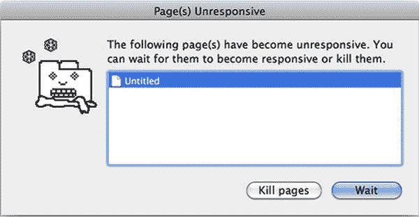
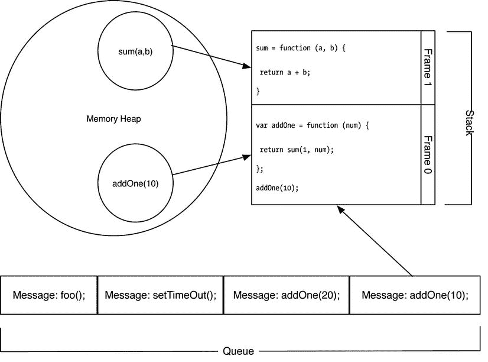

# 5.异步生活

Abstract

那些武断地认为互联网将走向何方的人在过去几年里花了很多时间谈论响应式网络的兴起。与网页设计相关的响应能力取决于开发人员设计网站的能力，该网站能够智能地适应无数用来访问其内容的设备。理想情况下，一个响应式网站不仅仅适合给定的屏幕大小；它还改变了网站的功能、视觉流程和美学，以适应平台或设备的功能。

那些武断地认为互联网将走向何方的人在过去几年里花了很多时间谈论响应式网络的兴起。与网页设计相关的响应能力取决于开发人员设计网站的能力，该网站能够智能地适应无数用来访问其内容的设备。理想情况下，一个响应式网站不仅仅适合给定的屏幕大小；它还改变了网站的功能、视觉流程和美学，以适应平台或设备的功能。

与 JavaScript 相关的响应性就是编写代码，最大限度地减少用户对界面被锁定或冻结的感觉。让界面有响应感可能很难做到，因为现代 web 应用程序越来越需要访问外部应用程序编程接口(API)或不能立即返回结果的长时间运行的流程。大多数语言允许开发人员使用线程或并发操作将这些扩展流程推到所谓的后台。

然而，JavaScript 是单线程的，这意味着开发人员必须更聪明地处理长时间运行的流程。本章解释了通过 JavaScript 或浏览器帮助正确规划和编写响应代码的各种机制。

## 理解 JavaScript 中的并发性

在研究这个主题时，我意识到许多人将并发执行与运行异步代码的能力混为一谈。虽然异步执行通常用于实现并发的外观，但这两者并不相同。在讨论使用 JavaScript 编写并发和异步代码的具体技术方法和限制之前，先讨论一下并发的基本定义会有所帮助。

### 并发

在编程环境中，并发是指两个或多个计算过程在共享资源的同时同时执行的能力。这些进程(有时称为线程)可以共享一个处理器，也可以分布在网络上，稍后由执行管理器进行同步。并行进程之间的通信通常是显式的，要么通过消息传递进行，要么通过共享变量进行。一般来说，并发进程应该只用于不确定的问题，这意味着状态的排序并不重要。代码的并发执行提供了许多优点和一些缺点，我在下面的小节中对此进行了概述。

#### 并发的优势

*   增加一次可以运行的程序数量。
*   允许具有独立于资源的顺序步骤的程序被无序地处理。如果中间步骤的持续时间未知，这尤其有用。
*   当长时间运行的任务完成时，应用程序不会变得无响应。
*   具有执行先决条件的任务可以稍后排队，直到满足这些依赖关系。

#### 并发的缺点

*   两个将对方列为先决条件的进程可以无限期地等待对方。这有时被称为死锁。
*   当进程的结果依赖于由于并行执行而无法保证的特定序列或时序时，可能会出现争用情况。
*   并发操作的管理和同步比顺序执行更复杂。
*   并发程序通常需要多倍的资源。多个进程可以并行执行。并且需要将它们编组和同步在一起的开销。
*   当并发操作由于未能正确同步而破坏了彼此的状态时，数据完整性可能会丢失。

#### JavaScript 中并发的硬道理

只有单线程，JavaScript 不可能有真正的并发。这一现实并不是过去必须支持功能不足的浏览器的遗留问题。Brendan Eich 指出，Java 在 1995 年给 Netscape 增加了线程，但是用他的话说“我绝不会在 JS 中放共享可变状态抢先线程。”他觉得线索对观众来说是错误的。然而，为这个决定辩护，我认为 JavaScript 的流行部分是因为缺乏经验的程序员可以融入这种语言。如果每个 JavaScript 新手一开始就必须担心死锁和竞争条件，那么这种语言的采用将会慢得多。单线程意味着死锁是不可能的，除非在顺序进程无法结束的情况下。如果程序有循环依赖，就会发生这种情况。

只有一个线程有明显的缺点。也就是说，当计算机上的单个内核达到极限时，程序可能会达到任意的处理阈值(即使有其他内核可用)。此外，当在浏览器中运行时，脚本必须定期服从浏览器的用户界面(UI)进程，以保持网页的响应性。一个闲置时间过长的脚本很可能会被浏览器误解为失控脚本，此时用户会看到如图 [5-1](#Fig1) 所示的弹出窗口。

图 5-1。

Unresponsive script pop-up

随着时间的推移，JavaScript 社区和语言已经发展到最大化单线程。例如，尽管 JavaScript 没有真正的并发性，但通过战略性地使用诸如`setInterval()`、`setTimeout()`或异步版本的`XMLHttpRequest()`等函数，可以模拟其效果。当这些技术不能满足需要时，可以部署后台工作人员(我将在本章后面介绍)。为了更好地理解如何构建程序以最大化类似并发的行为，您必须理解 JavaScript 中事件循环的工作方式。

## 理解 JavaScript 事件循环

现在您已经大致了解了并发性，您可以评估 JavaScript 运行程序的方法，即不断寻找要处理的传入事件消息。JavaScript 的单线程意味着每个运行时进程只有一个事件循环。JavaScript 的事件循环深受两个概念的影响，即运行到完成和非阻塞输入/输出(I/O)。

### 运行至完成

JavaScript 的事件循环被设计成一个从运行到完成的环境。实际上，这意味着一旦 JavaScript 开始执行一个任务，它就不能被中断，直到它完成。没有运行到完成，您就不能确定对象的状态，因为它可能在正常的事件循环周期之外被访问。Mozilla 这样描述运行到完成的目标:

> Fully process each message before processing any other messages. When reasoning programs, this provides some good properties, including the fact that whenever a function runs, it can't be preempted, and it will run completely before any other code runs (and the data of the function operation can be modified). For example, this is different from C, where if a function runs in one thread, it can stop at any time to run other code in another thread. [2](#Fn2) T5】

### 蓄意制造的事件

在 JavaScript 中，正在运行的程序为事件循环创建要处理的消息。这些消息由事件发生时触发的侦听器创建。乍一看，这似乎不起眼，但它暗示了 JavaScript 事件循环的一个强大特性。JavaScript 使用监听器来监控事件，这意味着输入可以同时从许多地方到达。监听器允许事件并行展开。Mozilla 是这样解释事件化设计的:

> A very interesting feature of the event loop model is that unlike many other languages, JavaScript never blocks. Processing I/O is usually performed by events and callbacks, so when the application waits for the return of IndexedDB query or XHR request, it can still process other things, such as user input. Legacy exceptions exist, such as alarms or synchronous XHR, but it is considered a good practice to avoid them. Please note that the exception of exception does exist (but it is usually an implementation error, not something else). [3](#Fn3) T5】

非阻塞 I/O 是 JavaScript 中的一种机制，它允许在等待另一个操作的结果完成时对传入的消息进行排序。基于事件的消息传递还允许 JavaScript 捕获同时发生的动作，但要确保它们被事件循环按顺序处理。这种能力是 JavaScript 中模拟并发的方式，它允许通过巧妙使用回调、闭包或承诺来减轻执行缓慢的操作的影响。

### 在事件循环内部

在事件循环中，传入的消息被提取到一个帧堆栈中，并按照特定的顺序进行处理。当一个帧被添加到堆栈中时，该帧所需的任何对象和变量都被添加到共享内存堆中，或者从共享内存堆中检索。任何当前没有被执行的代码都被添加到队列中以备后用。一旦整个堆栈完成，不需要的变量将从堆中删除，队列中的下一条消息将被提取到堆栈中。事件循环生命周期如图 [5-2](#Fig2) 所示。

图 5-2。

Diagram of the JavaScript event loop

#### 许多

堆是内存中一个顺序不可知的容器。堆是 JavaScript 存储当前正在使用的变量和对象的地方，或者是垃圾收集过程尚未收获的地方。

#### 基本框架

帧是事件循环周期中需要执行的连续工作单元。框架包含一个执行上下文，它将堆中的函数对象和变量链接在一起。

#### 堆

事件循环堆栈包含消息执行所需的所有顺序步骤(帧)。事件循环从上到下处理帧。基于帧的依赖链将帧添加到堆栈中。具有从属关系的框架会将它们的从属框架添加到顶部。该过程确保在被偶发代码引用之前满足依赖关系。考虑以下示例:

`var sum = function (a, b) {`

`return a + b;`

`}, addOne = function (num) {`

`return sum(1, num);`

`};`

`// => 11`

`addOne(10);`

在`addOne()`消息从队列移动到堆栈的时候，它成为了基础帧。我称这个`frame0\. Frame0`包含了对`addOne()`函数的引用和`num`参数的值(目前是`10)`)。因为`addOne()`依赖于`sum()`函数，所以创建了一个新的帧(`frame1)`，它包含对`sum()`函数的引用以及传入参数`"a"`和`"b"`的值。在本例中，`frame1`没有其他需要满足的依赖关系，所以现在可以从`frame1`开始向下展开堆栈。一旦事件循环处理了一个帧，它就会从堆栈顶部弹出。这种情况一直持续到堆栈为空，此时从队列中检索一个新项。

#### 长队

队列是等待处理的消息列表。每条消息引用一个 JavaScript 函数。当堆栈为空时，队列中最早的消息将作为下一个基础帧添加到堆栈中。

## 回收

JavaScript 事件循环的设计迫使代码按顺序执行。了解这一点意味着编写同步代码将为开发人员提供大量的清晰度，因为他们可以按照代码运行的方式编写代码。由于使用了同步结构，下面的源代码的意图非常清楚。该流反映了事件循环处理它时将会发生的情况:

`var person = {};`

`var bank = {`

`funds: 0`，

`receiveDepositFrom: function(person) {`

`this.funds += person.funds;`

`person.funds = 0;`

`}`

`};`

`// => undefined`

`console.log(person.funds);`

`person.funds = (function work() {`

`return 100;`

`})();`

`// => 100`

`console.log(person.funds);`

`bank.receiveDepositFrom(person);`

`// => 0`

`console.log(person.funds);`

用 JavaScript 编写同步代码有一些明确的优势:

*   代码更容易理解，因为程序可以按顺序阅读。
*   同步函数返回值并在词法上下文中抛出异常，使它们更容易调试。

然而，大多数复杂程度不同的 JavaScript 程序不应该仅仅由一系列连续的步骤组成。这样做会导致性能和代码质量方面的问题。让我们分别来看看这两个问题。

### 感知性能

许多程序依赖于不立即返回值的函数。想象一下，如果前一个例子中的`work()`函数花了一些时间来完成，而不是立即返回:

`person.funds = (function work() {`

`// Simulate a long running task.`

`var end = Date.now() + 4000;`

`while (Date.now() < end){`

`//noop`

`}`

`return 100;`

`})();`

代码继续按预期执行，但是用户体验会下降，因为在`work()`函数返回值之前，程序看起来是冻结的。执行中的同步延迟不是您可能面临的唯一问题。准则期望员工在尝试存钱之前先有钱。有可能`work()`函数改为轮询一个远程服务，它不会像前面的例子那样直到完成才阻塞。在这种情况下，代码会中断，因为`person.funds`在它被访问时会是`undefined`:

`var person = {};`

`var bank = {`

`funds: 0`，

`receiveDepositFrom: function(person) {`

`// Now NaN because person.funds is undefined.`

`this.funds += person.funds;`

`person.funds = 0;`

`}`

`};`

`// => undefined`

`console.log(person.funds);`

`(function work(person) {`

`// Assumes you have jQuery installed`

`$.ajax({`

`url: "` [`http://some.webservice.com/work.json`](http://some.webservice.com/work.json) `"`，

`context: document.body`

`}).done(function() {`

`person.funds = 100;`

`});`

`})(person);`

`// => undefined`

`console.log(person.funds);`

`bank.receiveDepositFrom(person);`

`// => 0`

`console.log(person.funds);`

一旦 AJAX 请求完成，您可以发送一个函数回调到之前的上下文，而不是将`person`对象作为参数传递给`work()`函数。回调是控制数据流最流行的模式之一。JavaScript 中的回调是将一个函数对象作为参数传递给另一个函数的行为，该函数将用于返回值。实际上，回调允许您将当前词法上下文从代码的同步执行中分离出来。回调是延续传递风格的一种形式，您将在下一节中了解到。

### 连续传球风格

延续传递风格(CPS)是函数式编程范例中流行的一个概念，其中程序的状态是通过使用延续来控制的。就你的目的而言，延续将是你的回调。延续对于异步编程非常流行，因为程序可以等待数据，然后通过提供的延续来推进状态。JavaScript 可以支持延续，因为函数是语言中的一等公民。使用 continuations(回调),您可以推迟存款操作，直到 AJAX 方法返回:

`var person = {};`

`var bank = {`

`funds: 0`，

`receiveDepositFrom: function(person) {`

`this.funds += person.funds;`

`person.funds = 0;`

`}`

`};`

`// => undefined`

`console.log(person.funds);`

`(function work(callback) {`

`$.ajax({`

`url: "` [`http://some.webservice.com/work.json`](http://some.webservice.com/work.json) `"`，

`context: document.body`

`}).done(function() {`

`callback(100);`

`});`

`})(function(amount) {`

`person.funds = amount;`

`// => 100`

`console.log(person.funds);`

`bank.receiveDepositFrom(person);`

`// => 0`

`console.log(person.funds);`

`});`

这种编码风格应该看起来很熟悉，因为 CPS 被许多最流行的库和运行时大量使用，以至于它们几乎是不可避免的。尽管代码的执行仍然反映了自顶向下的布局，但它的表达能力明显下降了。读者现在需要在代码体内来回思考，以理解执行流程。然而，现在代码的响应性更好了，您可以努力提高方法的质量。

### 回调地狱

同步设计使代码基础扁平化，这可以提高清晰度，但随着时间的推移，它会降低您组织和重用代码的能力。CPS 可以解决这个问题，但它不是万能的。如果不加以检查，延续会变成算法套娃，无限地嵌套在另一个套娃里。这里有一个假设的例子:

`login('user','password', function(result) {`

`if (result.ok) {`

`getProfile(function(result) {`

`if (result.ok) {`

`updateProfile(result.user, function(result) {`

`if (result.ok) {`

`callback(user);`

`}`

`});`

`}`

`});`

`}`

`}, callback);`

虽然这段代码是响应性的，但由于异步结构，它几乎不可读。这种编码风格有时被称为末日金字塔或回调地狱 [4](#Fn4) ，因为代码向右延伸的速度比向下移动的速度快。回调地狱之所以被恰当地命名，是因为它执行以下操作:

*   使得代码更难阅读和维护
*   降低了代码的模块化程度，也更难划分成关注点
*   使得错误传播和异常处理更加困难
*   缺乏正式的 API，所以回调可能返回，也可能不返回，它们产生的结果可能是一个大杂烩。

当然，导致回调地狱的设计决策并不是 JavaScript 独有的问题。在许多方面，开发人员不断使用新的语言和技术重新发明过去的反模式。在 20 世纪 70 年代和 80 年代，许多程序因过度使用`goto`语句而遭受损失。`goto`语句“执行控制到另一行代码的单向转移。” [5](#Fn5) 就像回调一样，使用`goto`跳转到代码中的其他地方破坏了源代码的线性。生成的代码通常需要程序员在思想上展开堆栈来理解当前的上下文。对`goto`最广泛引用的批评是 Edsger Dijkstra 写的:

> My second comment is that our intelligence is more inclined to master static relationships, while our ability to visualize the process of evolution over time is relatively poor. For this reason, we should (as wise programmers, aware of our limitations) try our best to shorten the conceptual gap between static programs and dynamic processes, and make the correspondence between programs (expanded in text space) and processes (expanded in time) as simple as possible. Ed W. Dijestra (Dijkstra, 1968).

回调或 CPS 本身并没有什么问题。然而，当过度使用时，CPS 增加了程序员在编写功能的原始意图和最终执行它的上下文之间的认知不一致。这是因为 CPS 的目标绝不是将控制权交还给调用者。相反，延续使用回调作为有状态的烫手山芋，总是试图将它传递给其他人。

想象一下，如果一个延续的优先级被颠倒了。该流程没有强调传递当前上下文的能力，而是立即返回一个表示延迟的未来状态的令牌。这形成了一种计算 I.O.U，它提供了与 CPS 相同的异步执行，同时保持了高度的声明性。我描述的是 Promise 模式，您将在下一节中对其进行测试。

## 承诺:从未来回来

promise 是一个令牌对象，它表示尚未返回的函数的未来值或异常。Promises 提供了一种清晰易读的方法，将异步执行转换成可视化的顺序控制流。任何阻塞事件循环的流程都是 promise 模式的候选者。考虑这个程序，首先使用 CPS 编写，然后使用 promise 重写:

`// CPS style`

`var user;`

`login('user', 'password', function(result) {`

`if (result.ok) {`

`user = result.user;`

`}`

`});`

`// Promise style and assumes login returns a promise object.`

`var promise = login('user', 'password');`

`promise.then(function(result) {`

`if (result.ok) {`

`user = result.user;`

`}`

`});`

正如您在前面的代码中看到的，承诺并不像 CPS 那样将执行状态作为函数参数传递。相反，未来上下文的占位符会立即返回到当前词法范围。这允许代码像 CPS 一样保持非阻塞，但具有缩短静态程序和动态过程之间的概念差距的优势，正如 Dijkstra 恳求我们做的那样。

虽然我将抽象地提到承诺，但实际上有几种实现。在本章中，当我说 promise 时，我在技术上指的是 Promise A+， [6](#Fn6) ，这非常适合 JavaScript。根据规范，承诺对象由以下部分组成:

*   Promise 是一个带有`then`方法的对象或函数，其行为符合这个规范。
*   表是一个定义了一个`then`方法的对象或函数。
*   Value 是任何合法的 JavaScript 值(包括`undefined`、一个 thenable 或一个承诺)。
*   异常是使用`throw`语句抛出的值。
*   Reason 是一个值，表示拒绝承诺的原因。

### 信守承诺

在现实生活中，承诺对象提供了定义事件预期的契约。因为 promise 对象代替实际值被立即返回，所以它们提供了比 CPS 更好的组合。具体来说，承诺可以连锁或连接在一起，并在各种环境下执行。然而，创建这些链需要一些样板代码才能工作。令人欣慰的是，其他人已经将这些比特抽象成了库。下面的例子利用 Kristopher Kowal 的 Q [7](#Fn7) 库来演示承诺链和连接。

Note

在开始之前，你需要通过 npm: `npm install q`安装 Q。

#### 连锁和延迟执行

承诺优于 CPS 的一个主要用例是当一个程序有一系列需要以特定顺序运行的异步功能时。在下面的例子中，您将看到一个连续的承诺链是如何以特定的顺序执行的。在解析过程中，计算出的数字被传递到链中的下一个环节。比较和对比该序列的能力也作为一系列嵌套回调来实现:

`Q = require('q');`

`// Simulates a long running process`

`var sleep = function(ms) {`

`return function(callback) {`

`setTimeout(callback, ms);`

`};`

`};`

`// Using Continuation Passing Style.`

`var squareCPS = function(num, callback){`

`sleep(1000).call(this, function(){`

`callback(num * num);`

`});`

`};`

`// => 100000000`

`squareCPS(10, function(num){`

`squareCPS(num, function(num){`

`squareCPS(num, function(num){`

`console.log(num);`

`});`

`});`

`});`

`// Using Promises.`

`var square = function(num) {`

`var later = Q.defer();`

`sleep(1000).call(this, function() {`

`later.resolve(num * num);`

`});`

`return later.promise;`

`};`

`// => 100000000`

`square(10)`

`.then(square)`

`.then(square)`

`.then(function(total){`

`console.log(total);`

`});`

#### 并行连接

如果您有一系列不确定的函数，您可以使用`Q`并行执行您的函数，如下例所示:

`Q.allSettled([`

`square(10)`，

`square(20)`，

`square(30)`

`]).then(function(results){`

`results.forEach(function (result) {`

`// => 100`

`// => 400`

`// => 900`

`console.log(result.value);`

`});`

`});`

这一部分是对承诺对象的简要介绍，所以如果你在承诺中看到了承诺，那么有一些重要的话题值得深入探讨。如果你很好奇，我鼓励你去看看 Q 上的文档，因为它提供了比我在这里介绍的更完整的承诺介绍。

## 生成器和协程程序

虽然本章是关于异步代码和并发性的，但这两个主题的软肋实际上是关于控制执行流的。作为一个思维实验，现在试着在你的头脑中提取 JavaScript 的基本成分。你会允许什么特征蒸发到以太中，如果去除，什么会彻底打破语言？我打赌你不会碰那些控制执行流程的组件。在其他组件中，JavaScript 中的控制流机制为您的应用程序提供了以下功能:

*   满足前提条件时执行语句
*   语句之间的条件分支
*   有条件地从一个语句继续到另一个语句
*   将执行流转移出一个上下文，然后在预定的位置继续执行。

这一部分是关于列表中的最后一个要点。语言——包括 Python、Lua 和 small talk——通过使用协程和生成器来处理结构化的非局部控制流 [8](#Fn8) 。协程和生成器允许使用预定的入口和出口点来暂停和恢复代码的执行。ECMAScript 6 准备将这两个概念引入到语言中。本节探讨它们是如何工作的，并演示如何使用它们。

### 发电机

生成器是在维护集合自身内部状态的同时对集合进行迭代的函数。生成器可以有自己的状态，并暂时将它们的执行让给另一个进程，这一事实意味着它们对于如下各种任务非常有用:

*   共享多任务处理
*   元素的顺序处理
*   将有一定等待时间的多个流程排序作为其设计的一部分
*   简单的状态机

在 JavaScript 中，任何包含`yield`操作符的函数都被认为是生成器。下面是一个简单的例子，演示了生成器如何维护自己的内部状态:

`var sequence, sq;`

`sq = function* (initialValue) {`

`var current, num, step;`

`num = initialValue || 2;`

`step = 0;`

`while (true) {`

`current = num * step++;`

`yield current`

`}`

`};`

`sequence = sq(20);`

`// => 0`

`console.log(sequence.next().value);`

`// => 20`

`console.log(sequence.next().value);`

`// => 40`

`console.log(sequence.next().value);`

`// => 60`

`console.log(sequence.next().value);`

Note

根据 ECMAScript 规范， [9](#Fn9) 协程/生成器通过在函数关键字:`Function*(){...}`后加一个星号来定义。在 V8 中，您可以使用`--harmony-generators`标志:`$ node --harmony-generators foo.js`来启用生成器。在撰写本文时，只有 node 0.11。+支持和声发生器。

前面的生成器不断迭代，直到达到 JavaScript 所能支持的最大值(`1.7976931348623157e+308`)。)生成器也可以定义可能值的范围。当所有可能性都用尽时，会出现一个`StopIteration`异常:

`var a, alphabet, sequence;`

`alphabet = function*() {`

`var charCode = 65;`

`while (charCode < 91) {`

`yield String.fromCharCode(charCode++);`

`}`

`throw new Error("StopIteration")`

`};`

`sequence = alphabet();`

`a = 0;`

`while (a < 27) {`

`try {`

`// => a..z`

`console.log(sequence.next().value);`

`} catch (e) {`

`// => [Error: StopIteration]`

`console.log(e);`

`}`

`a++;`

`}`

不得不担心捕捉可选的越界错误会使您的代码变得脆弱。事实证明，发生器有一个内置的布尔`done`值，可以通过检查来确定是否到达了序列的末尾。知道了这一点，你可以这样重写前面的例子:

`var letter, alphabet, sequence;`

`function* alphabet() {`

`var charCode = 65;`

`while (charCode < 91) {`

`yield String.fromCharCode(charCode++);`

`}`

`};`

`sequence = alphabet()`，

`letter = sequence.next();`

`while (!letter.done) {`

`// => A..Z`

`console.log(letter.value);`

`letter = sequence.next();`

`}`

### 惯例协程

协程有时被称为协同调度线程，因为它们允许在单个进程上共享执行。在 JavaScript 中，协程是用于流控制的生成器。像生成器一样，协程是可以通过使用`yield`操作符挂起和恢复它们的执行上下文的对象。与生成器不同，协程可以控制让步后返回哪个执行上下文；这种能力使它们非常适合控制程序的流程。Wikipedia 更进一步地描述了这一点:“由于生成器主要用于简化迭代器的编写，所以生成器中的 yield 语句并不指定要跳转到的协程，而是将值传递回父例程。” [10](#Fn10)

在许多语言中，协同程序是在生成器之外明确定义的。在 JavaScript 中，协同例程是作为一种模式实现的，而不是作为语言的一个独特特性。这是可能的，因为 JavaScript 本身支持延续，正如您在回调部分所了解的。下面是一些如何用 JavaScript 实现协同程序的例子。最基本的协程是二进制切换，可以这样写:

`var toggle = (function*(){`

`while(true){`

`yield true`

`yield false`

`}`

`})();`

`for(var x = 0; x < 5; x++){`

`// => true, false, true, false, true`

`console.log(toggle.next().value)`

`}`

这个例子使用多个`yield`语句作为控制流机制，在真和假状态之间振荡。注意，这个协程形成了一个非常基本的状态机，它处理两个位置(on，off ),而不需要显式定义一个布尔变量。您可以使用这个协程反复切换 UI 元素。Harold Cooper 指出，这个“变量只能被避免，因为协程给语言增加了一种全新形式的状态，即协程当前被挂起的状态。” [11](#Fn11) 虽然这个例子很有指导性，但它的用处有限。让我们看一个更复杂的用例。

### 可延续生成元

Tim Caswell 最近发布了一个有用的库，名为 Gen-run [12](#Fn12) ，根据 Caswell 的说法，它“消耗可延续的产出生成器，并将其自己的延续传递给可延续的，以便当它们解决时，生成器主体将恢复并返回一个值或抛出一个错误。”通俗地说，Gen-run 在让步和恢复行为周围注入控制流规则，以同时处理异步和同步功能。整个库足够小，可以在这里内联显示:

`function run(generator, callback) {`

`// Pass in resume for no-wrap function calls`

`var iterator = generator(resume);`

`var data = null, yielded = false;`

`var next = callback ? nextSafe : nextPlain;`

`next();`

`check();`

`function nextSafe(item) {`

`var n;`

`try {`

`n = iterator.next(item);`

`if (!n.done) {`

`if (typeof n.value === "function") n.value(resume());`

`yielded = true;`

`return;`

`}`

`}`

`catch (err) {`

`return callback(err);`

`}`

`return callback(null, n.value);`

`}`

`function nextPlain(item) {`

`var cont = iterator.next(item).value;`

`// Pass in resume to continuables if one was yielded.`

`if (typeof cont === "function") cont(resume());`

`yielded = true;`

`}`

`function resume() {`

`var done = false;`

`return function () {`

`if (done) return;`

`done = true;`

`data = arguments;`

`check();`

`};`

`}`

`function check() {`

`while (data && yielded) {`

`var err = data[0];`

`var item = data[1];`

`data = null;`

`yielded = false;`

`if (err) return iterator.throw(err);`

`next(item);`

`yielded = true;`

`}`

`}`

`}`

为了理解这个库是如何工作的，考虑这个简单的例子，它对一系列对`sleep`函数的调用进行排序:

`function sleep(ms) {`

`return function (callback) {`

`setTimeout(callback, ms);`

`};`

`}`

`// => Prints "Started", "Almost Done", and "Done" on indvidual lines.`

`run(function* () {`

`console.log("Started");`

`yield sleep(1000);`

`console.log("Almost Done")`

`yield sleep(1000);`

`console.log("Done!");`

`});`

如果不使用 Gen-run，就不会有控制流机制，因此控制台语句会立即显示在屏幕上。但是，因为生成器将它们的执行上下文让给了传入的 sleep 函数，所以您可以暂停，然后以同步方式恢复执行。

Gen-run 的设计得到了增强，因为生成器本身可以将自己的 yield 上下文委托给其他生成器。这是使用`yield*`语法完成的。考虑这个例子，其中`run`包装器委托给`sub`生成器:

`function* sub(n) {`

`while (n) {`

`console.log(n--);`

`yield sleep(10);`

`}`

`}`

`// => Prints "Start", "[10..1]","End" on individual lines.`

`run(function* () {`

`console.log("Start");`

`yield* sub(10);`

`console.log("End");`

`});`

从前面的例子中可以看出，Gen-run 最擅长的是控制任意数量的函数的执行，其中执行顺序至关重要。

## 网络工作者

Web workers 是 JavaScript 进程，可以在所谓的浏览器后台运行。实际上，每个新工人都有自己的全局上下文，这允许他们执行长时间运行的流程，而不必让步来更新用户界面。值得注意的是，workers 是 HTML 规范的一部分， [13](#Fn13) 不是 ECMAScript 的一部分。从 JavaScript 的角度来看，web workers 没有什么特别之处，除了它们可以由浏览器按需创建并由主浏览器上下文控制。本节详细探讨了 web workers，以及当需要大量计算时，如何使用它们来最小化对用户体验的影响。

Note

不要将 worker 的全局上下文与仅仅是一个操作系统线程相混淆。全球环境实际上是一个更加资源密集型的过程。

### 并发

将 web workers 视为 JavaScript 中实现并发的一种方式可能很有诱惑力，但是真正的并发的一部分是共享执行上下文的能力。尽管工作人员确实可以访问父浏览器上下文的一些属性，但他们的访问是作为消息传递 API 来处理的，这与共享资源不是一回事。这个 API 确保后台工作人员在沙箱中运行，不会破坏主窗口文档环境的状态。Mozilla 自己的文档详细阐述了对线程安全的需求:[14](#Fn14)

> Worker interface produces real OS-level threads, and concurrency may produce interesting effects in code if not careful. However, in the case of web workers, careful control of communication points with other threads means that it is actually difficult to cause concurrency problems. Without access to non-thread-safe components or DOM, you must serialize objects to transfer specific data to and from threads. So you have to work very hard to cause problems in your code.

### 知道什么时候当工头

就像在现实生活中一样，知道何时雇佣某人是你作为经理所能做出的最大决定之一。在正确的时间招聘可能意味着成功和失败的区别；不幸的是，反过来也是如此。下面是在程序中使用 web workers 之前要考虑的利弊列表。对于不需要来自 UI 层的频繁消息的问题，Web workers 是一个极好的选择；例如，物理模拟、长轮询网络操作、图像处理或密集数据解析。然而，它们并不是万灵药，如果用错了数量或者用错了问题，它们实际上会损害应用程序的性能。在某些情况下，工作人员甚至可以使浏览器崩溃，因为他们返回到主脚本的消息没有被限制。 [十五](#Fn15)

#### 优势

*   它们允许长时间运行或计算密集型任务从 UI 事件循环中分离出来，这使得程序感觉响应更快。
*   工作人员可以按需启动，因此可以根据需要增加或减少后台资源。

#### 不足之处

*   Workers 启动时是资源密集型的，每个实例的内存占用都很高。
*   它们独立于主 UI 线程工作，因此它们不能访问 DOM 的许多部分或全局变量。
*   并不是所有的运行时环境都支持所有类型的 web workers，所以开发人员在测试跨平台时必须小心。
*   缩小脚本时必须格外小心，防止它破坏对 workers 的引用。

### 雇佣工人

了解网络工作者的最好方式是看他们的实际行动。事实证明，规范中实际上描述了两种形式的工作人员:专用型和共享型。这些工人几乎是相同的；它们只有几个方面不同:

*   创建专用工作线程后，它只能访问创建它的父线程。然而，共享工作者可以有多个关注点。
*   专用工作器也只在它们的父工作器持续的时间内持续，而共享工作器必须被显式终止。

#### 基础

所有工人都是通过使用`Worker`构造函数创建的:

`worker = new Worker("worker.js");`

一旦创建好，就可以通过一个简单的消息传递 API 来管理工人。通过使用两种方法的基本握手来促进消息传递:`postMessage()`和`onmessage()`。一个简单的乒乓示例只需要两个文件，如下所示:

`// ping.html`

`<!DOCTYPE HTML>`

`<html>`

`<body>`

``

`</body>`

`</html>`

`// pong.js`

`onmessage = function(event) {`

`postMessage('pong');`

`};`

一旦这个程序运行，您将看到`"ping"`和`"pong"`被写到开发人员控制台。因为这个简单的例子是一个专用的工作器，所以只要 web 浏览器一关闭，它就会自动结束。

#### 敬业的工人

专用 web workers 是后台进程，只对调用它们的脚本可用。由于它们的隔离性质，它们没有共享 web workers 复杂，因此拥有最广泛的浏览器支持。同样，web 工作者的目标是让开发人员能够将计算密集型或长时间运行的流程推到后台。如果没有 web workers，这些进程通常会阻塞事件循环，使程序感觉冻结了。

下面的代码示例演示了 web 工作人员如何加速众所周知的资源密集型图像处理程序。这个示例使用一个独立的 worker 创建非常详细的画布动画，该 worker 接受画布像素的集合，然后修改它们并将其返回给父脚本。整个过程使用`requestAnimationFrame function`来完成，它允许更新仅在主机平台准备好接收新帧时发生。这种方法无缝地扩展了动画的流畅性，因为只有当计算机有可用资源时，才会调用工作者。动画的一个静止帧如图 [5-3](#Fig3) 所示。

图 5-3。

Still frame of the canvas animation

`// index.html`

`<html>`

`<head>`

`<title>index</title>`

`</head>`

`<body>`

``

`</body>`

`</html>`

`// worker.js`

`setPixel = function() {`

`var index;`

`index = (x + y * imageData.width) * 4;`

`imageData.data[index + 0] = r;`

`imageData.data[index + 1] = g;`

`imageData.data[index + 2] = b;`

`imageData.data[index + 3] = 255;`

`};`

`onmessage = function(event) {`

`var b, d, g, height, imageData, pos, r, seed, t, width, x, x2, xoff, y, y2, yoff;`

`pos = 0;`

`imageData = event.data.pixels;`

`seed = event.data.seed;`

`width = imageData.width;`

`height = imageData.height;`

`xoff = width / 2;`

`yoff = height / 2;`

`y = 0;`

`while (y < height) {`

`x = 0;`

`while (x < width) {`

`x2 = x - xoff;`

`y2 = y - yoff;`

`d = Math.sqrt(x2 * x2 + y2 * y2);`

`t = Math.sin(d / 6.0 * (+new Date() - seed) / 5000);`

`r = t * 200 + y;`

`g = t * 200 - y;`

`b = t * 255 - x / height;`

`imageData.data[pos++] = Math.max(0, Math.min(255, r));`

`imageData.data[pos++] = Math.max(0, Math.min(255, g));`

`imageData.data[pos++] = Math.max(0, Math.min(255, b));`

`imageData.data[pos++] = 255;`

`x++;`

`}`

`y++;`

`}`

`postMessage({`

`pixels: imageData`，

`seed: seed`

`});`

`};`

Note

工作者文件所在的 URI 不能违反浏览器的同源策略。 [16](#Fn16)

#### 共享工人

与范围仅限于父文档的专用工作器不同，共享工作器可以跨许多浏览器上下文共享。通过调用构造函数时分配的唯一端口传递消息来处理通信。下面是一个简单的公共/私人聊天应用程序，演示了共享工作者是如何工作的。

Note

浏览器对共享工作者的支持不如专用工作者。 [17](#Fn17)

`// chat.html`

`<!DOCTYPE HTML>`

`<html>`

`<head>`

`<title>Chat Room</title>`

``

`</head>`

`<body>`

`<h2>Public Chat</h2>`

`<h1>Welcome </h1>`

`<h4>public</h4>`

`

`

`<h4>private</h4>`

`

`

`<form onsubmit="sendMessage(message.value);message.value = ''; return false;">`

`
`

`<input id='message' type="text" name="message" size="50">`

`<button>Post</button>`

`
`

`</form>`

`</body>`

`</html>`

`// chat_worker.js`

`/*`

`Simplified example from:`

[T2`http://www.whatwg.org/specs/web-apps/current-work/multipage/workers.html`](http://www.whatwg.org/specs/web-apps/current-work/multipage/workers.html)

`*/`

`var getMessage, getNextName, nextName, onconnect, viewers;`

`getNextName = function() {`

`nextName++;`

`return "Guest" + nextName;`

`};`

`getMessage = function(event) {`

`var channel, from, to, viewer, _results;`

`switch (event.data.action) {`

`case "txt":`

`_results = [];`

`for (viewer in viewers) {`

`_results.push(viewers[viewer].port.postMessage({`

`action: "txt"`，

`envelope: {`

`from: event.target.session.name`，

`body: event.data.envelope.body`

`}`

`}));`

`}`

`return _results;`

`break;`

`case "msg":`

`from = event.target.session;`

`to = viewers[event.data.envelope.to];`

`if (to) {`

`channel = new MessageChannel();`

`from.port.postMessage({`

`action: "msg"`，

`envelope: {`

`to: to.name`，

`from: from.name`，

`body: "private message sent to: " + event.data.envelope.to`

`}`

`}, [channel.port1]);`

`return to.port.postMessage({`

`action: "msg"`，

`envelope: {`

`to: from.name`，

`from: to.name`，

`body: "private message: " + event.data.envelope.body`

`}`

`}, [channel.port2]);`

`}`

`}`

`};`

`nextName = 0;`

`viewers = {};`

`onconnect = function(event) {`

`var name;`

`name = getNextName();`

`event.ports[0].session = {`

`port: event.ports[0]`，

`name: name`

`};`

`viewers[name] = event.ports[0].session;`

`event.ports[0].postMessage({`

`action: "cfg"`，

`envelope: {`

`from: name`，

`body: "connected"`

`}`

`});`

`return event.ports[0].onmessage = getMessage;`

`};`

#### 分包商

主文档上下文并不是可以产生工人的唯一元素。Web 工作者可以将复杂的处理任务委派给他们自己的一组下属，这些下属被称为子工作者。就像 web workers 一样，子 worker 不能违反浏览器的同源策略，尽管子 worker 的源基于实例化 worker 的位置，而不是主文档。不幸的是，对子工作者的支持非常少，所以我不会给出一个示例用例。我包含这个主题主要是为了完整性。

#### 建筑师鲍勃

作为部署过程的一部分，现代工作流通常将单个脚本缩小并连接到单个主文件中。这样做会破坏对上一个示例中的 worker 源文件的引用，因为 worker 文件不存在于生产环境中。解决这个问题的一种方法是编写工作代码，使它与应用程序的其余部分一起内联执行。使用 Blob API，这个过程几乎没有痛苦。 [18](#Fn18) 我们来看一个例子:

`var blobTheBuilder, winUrl, worker;`

`winUrl = window.URL || window.webkitURL;`

`blobTheBuilder = new Blob(["self.onmessage=function(e){postMessage(Math.round(Math.sqrt(e.data)))}"]);`

`worker = new Worker(winUrl.createObjectURL(blobTheBuilder));`

`worker.onmessage = function (e) {`

`return console.log(e.data);`

`};`

`// Find the closest square root of a number`

`// => 6`

`worker.postMessage(42);`

## 摘要

以下部分将本章中的概念归纳为一系列要点:

*   编程中的并发性是指两个或多个计算过程在共享资源的同时执行的能力。
*   并发进程应该只用于不确定的问题，这意味着状态的排序并不重要。
*   JavaScript 是一种单线程语言，这意味着并发性通常是用其他方法伪造的。
*   JavaScript 的事件循环被设计成非阻塞的 I/O 操作。
*   JavaScript 中的回调是将函数对象作为参数传递给另一个函数的行为，该函数将在返回值上使用。
*   promise 是一个令牌对象，它表示尚未返回的函数的未来值或异常。
*   协程和生成器允许使用预定的入口和出口点来暂停和恢复代码的执行。
*   Web workers 是 JavaScript 进程，可以在所谓的浏览器后台运行。

### 额外资源

以下是关于本章讨论的各种主题的有用帖子和文章的列表。

#### 回收

*   [T2`http://docs.nodejitsu.com/articles/getting-started/control-flow/what-are-callbacks`](http://docs.nodejitsu.com/articles/getting-started/control-flow/what-are-callbacks)
*   [T2`http://matt.might.net/articles/by-example-continuation-passing-style/`](http://matt.might.net/articles/by-example-continuation-passing-style/)

#### 发电机

*   [T2`http://devsmash.com/blog/whats-the-big-deal-with-generators`](http://devsmash.com/blog/whats-the-big-deal-with-generators)
*   [T2`http://jlongster.com/A-Study-on-Solving-Callbacks-with-JavaScript-Generators`](http://jlongster.com/A-Study-on-Solving-Callbacks-with-JavaScript-Generators)

#### 协同程序

*   [T2`http://syzygy.st/javascript-coroutines/`](http://syzygy.st/javascript-coroutines/)
*   [T2`http://www.dabeaz.com/coroutines/Coroutines.pdf`](http://www.dabeaz.com/coroutines/Coroutines.pdf)
*   [T2`http://calculist.org/blog/2011/12/14/why-coroutines-wont-work-on-the-web/`](http://calculist.org/blog/2011/12/14/why-coroutines-wont-work-on-the-web/)

#### 承诺

*   [T2`http://promises-aplus.github.io/promises-spec/`](http://promises-aplus.github.io/promises-spec/)
*   [T2`https://github.com/kriskowal/q`](https://github.com/kriskowal/q)

#### 网络工作者

*   [T2`http://www.html5rocks.com/en/tutorials/workers/basics/`](http://www.html5rocks.com/en/tutorials/workers/basics/)
*   [T2`https://developer.mozilla.org/en-US/docs/Web/Guide/Performance/Using_web_workers`](https://developer.mozilla.org/en-US/docs/Web/Guide/Performance/Using_web_workers)

Footnotes [1](#Fn1_source)

[https://Brenda neich . com/2007/02/threads-suck/](https://brendaneich.com/2007/02/threads-suck/)

  [2](#Fn2_source)

[T2`https://developer.mozilla.org/en-US/docs/Web/JavaScript/Guide/EventLoop`](https://developer.mozilla.org/en-US/docs/Web/JavaScript/Guide/EventLoop)

  [3](#Fn3_source)

[T2`https://developer.mozilla.org/en-US/docs/Web/JavaScript/Guide/EventLoop`](https://developer.mozilla.org/en-US/docs/Web/JavaScript/Guide/EventLoop)

  [4](#Fn4_source)

[T2`http://callbackhell.com/`](http://callbackhell.com/)

  [5](#Fn5_source)

[T2`http://en.wikipedia.org/wiki/Goto`](http://en.wikipedia.org/wiki/Goto)

  [6](#Fn6_source)

[T2`http://promises-aplus.github.io/promises-spec/`](http://promises-aplus.github.io/promises-spec/)

  [7](#Fn7_source)

[T2`https://github.com/kriskowal/q`](https://github.com/kriskowal/q)

  [8](#Fn8_source)

[T2`http://en.wikipedia.org/wiki/Control_flow#Structured_non-local_control_flow`](http://en.wikipedia.org/wiki/Control_flow#Structured_non-local_control_flow)

  [9](#Fn9_source)

[T2`http://wiki.ecmascript.org/doku.php?id=harmony:generators`](http://wiki.ecmascript.org/doku.php?id=harmony:generators)

  [10](#Fn10_source)

[T2`http://en.wikipedia.org/wiki/Coroutine#Comparison_with_generators`](http://en.wikipedia.org/wiki/Coroutine#Comparison_with_generators)

  [11](#Fn11_source)

[T2`http://syzygy.st/javascript-coroutines/`](http://syzygy.st/javascript-coroutines/)

  [12](#Fn12_source)

[T2`https://github.com/creationix/gen-run`](https://github.com/creationix/gen-run)

  [13](#Fn13_source)

[T2`http://www.whatwg.org/specs/web-apps/current-work/multipage/workers.html#workers`](http://www.whatwg.org/specs/web-apps/current-work/multipage/workers.html#workers)

  [14](#Fn14_source)

[T2`https://developer.mozilla.org/en-US/docs/Web/Guide/Performance/Using_web_workers`](https://developer.mozilla.org/en-US/docs/Web/Guide/Performance/Using_web_workers)

  [15](#Fn15_source)

[T2`http://blog.sethladd.com/2011/09/box2d-and-web-workers-for-javascript.html`](http://blog.sethladd.com/2011/09/box2d-and-web-workers-for-javascript.html)

  [16](#Fn16_source)

[T2`https://developer.mozilla.org/en-US/docs/Web/JavaScript/Same_origin_policy_for_JavaScript`](https://developer.mozilla.org/en-US/docs/Web/JavaScript/Same_origin_policy_for_JavaScript)

  [17](#Fn17_source)

[T2`http://caniuse.com/#feat=sharedworkers`](http://caniuse.com/#feat=sharedworkers)

  [18](#Fn18_source)

[T2`https://developer.mozilla.org/en-US/docs/Web/API/Blob`](https://developer.mozilla.org/en-US/docs/Web/API/Blob)