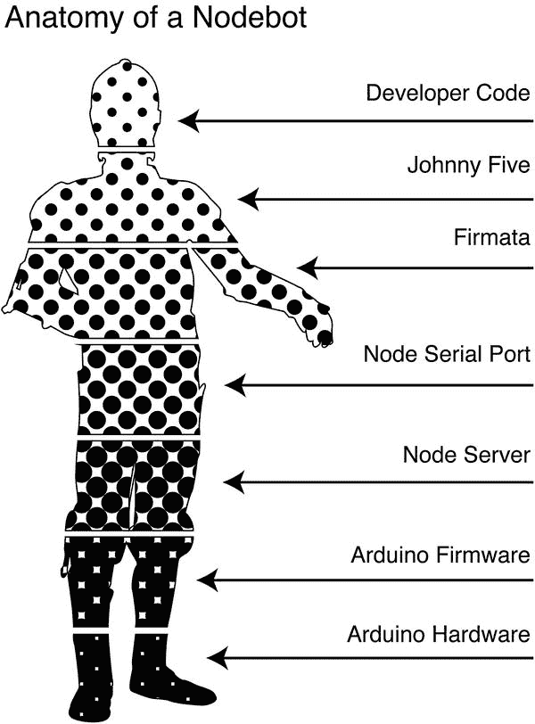
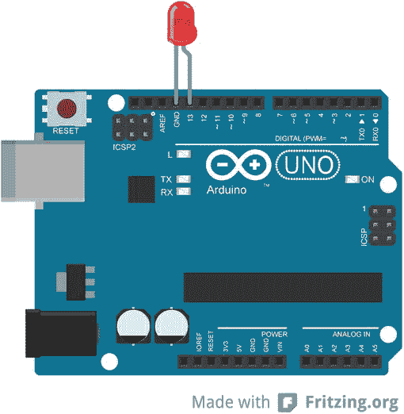
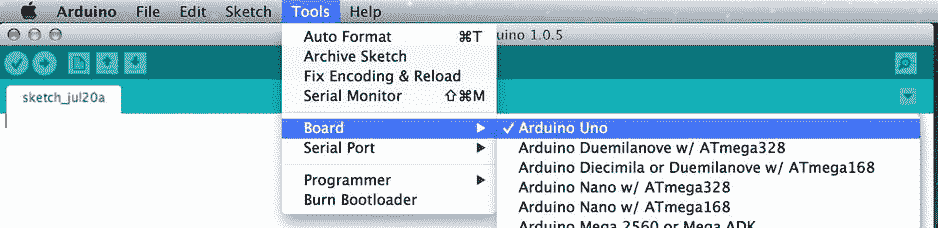
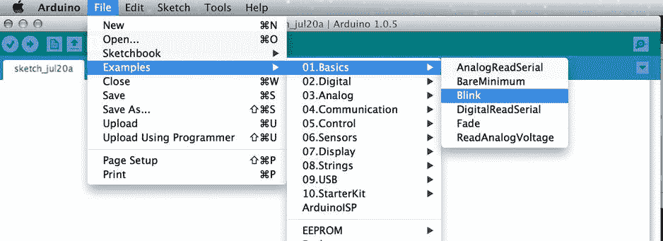
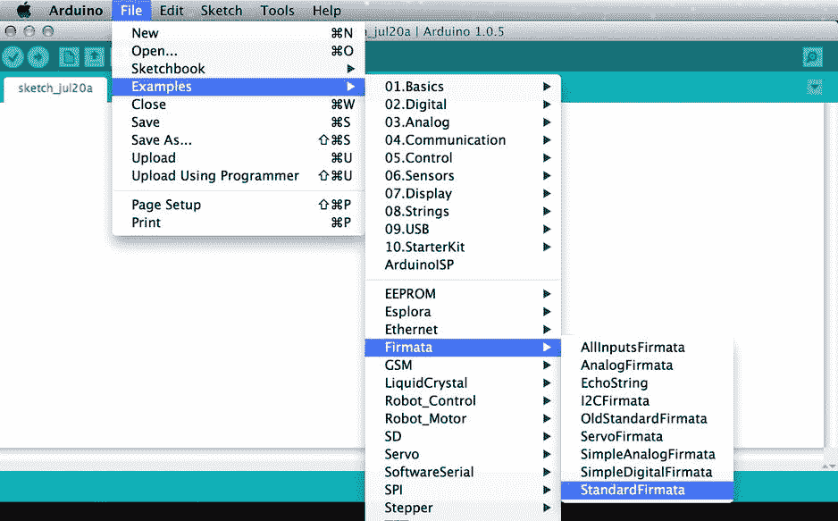
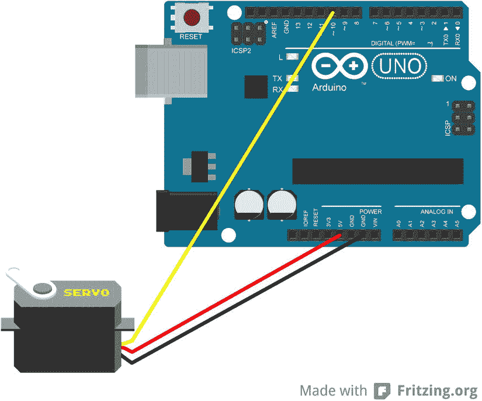

# 6.JavaScript IRL

Abstract

"头脑是模拟自己的模拟物."

-埃罗尔·奥扎恩

头脑是一种模拟自己的模拟物—埃罗尔·奥赞

兴奋起来；这一章是关于机器人、JavaScript 和其他的。不过说真的，机器人和 JavaScript 应该足够了。在这一章中，我将快速调查物理计算领域，以及用 JavaScript 编写的机器人如何融入其中。本章的大部分内容涵盖了使用监听 JavaScript 的机器与周围世界进行交互的方式。

## 硬件爱好者的日记

在我成长的过程中，我的弟弟马特得到了所有的二手技术。每当我们家升级一件消费电子产品时，旧版本就会被马特拿走，他几乎会立刻抱着它蜷缩在房间的地毯上，用双腿缠住猎物。然后，就像一只患有强迫症的秃鹰，他会开始用他的儿童螺丝刀有条不紊地拆开塑料尸体。最终，机器会停止运转，小的塑料齿轮、电线和电路板会散落出来。有时他会试着把它重新组装起来，或者把零件留着以后用。马特对一种完全不同的机器学习感兴趣。

硬件黑客并不是一个他已经超越的阶段。他变成了一个男孩巫师，用一把直角牧田螺旋枪代替了魔杖。15 岁时，他在一家名为 Dashboard Stereo 的公司找到了一份安装汽车音响系统的工作。他纠缠着老板达雷尔，直到他让步给了马特一份工作。马特是至少十年来最年轻的技术人员，但他已经比他们中的大多数人都要好。他是有史以来最年轻的移动电子认证专业(MECP)安装人员，年仅 15 岁。他在音响店工作到大学毕业，然后去了弗吉尼亚理工大学。毫不奇怪，马特成为了一名电气工程师，现在是麻省理工学院研究人员的一员。

### 消防水管

作为一名高中生，我被北卡罗莱纳艺术学校录取，这意味着我住在离家大约两个小时的地方。今年年初，马特把他的电动低音炮借给我，让我带回宿舍。不幸的是，我一到学校就意识到我把扬声器的插头忘在家里了。我去 Radio Shack 买了一个通用电源适配器，它看起来像一个手里剑，但有各种大小的插头，而不是金属点。我回到学校，把手里剑插在扬声器的后面，站在那里，手里拿着线的另一端看着墙壁。

从小到大，我一直梦想着像马特一样打开硬件，但在这里，我甚至被插上东西吓住了。我意识到我不知道我在做什么，所以我打电话给我爸爸。事实证明，这是个坏主意。我的父亲是另一个天才的机器语者；有时，当我哥哥和他没有任何共同语言时，他们至少会说瓦特和欧姆这两种共同语言。我解释了我不知道该用哪个插头的问题，这是他告诉我的:

> Your problem is that you don't know the correct voltage or current to power the speakers. Imagine that your loudspeaker is running on water, so you hang it on the fire hose. Water flowing through the hose is the voltage, and the speed of water flow is the amperage.

我知道他觉得他已经用一个一年级学生就能理解的方式解释了。但我站在那里，把公用电话听筒贴在耳朵上，试图想象他刚才说的话。不过，我还不如打电话给中国，因为他在消防水管那里把我搞糊涂了。我回到我的宿舍，再次拿起线的一端。我想，会有多糟呢？

我在可用选项中选择了一个电源设置，并将电源线插入墙上的插座。我立刻听到扬声器里传来微弱的嗡嗡声，然后是一声巨响，然后就什么也没有了。我很快意识到我已经销毁了我哥哥的扬声器，我对我们家族拥有的与硬件交流的能力抱有的任何幻想都烟消云散了。灰色的烟雾慢慢地从扬声器的舷窗飘出。当然，马特发现后非常生气，可能是因为我没有问他，也可能是因为他不明白怎么会有人对电学基础知识如此无知。从那以后，我不敢再尝试了——也就是说，直到成年后我发现了 Arduino。

### 其他人的硬件

我在加州大学洛杉矶分校参加了一个演讲，我去听凯西·雷耶斯讲述他的项目“处理”Processing 是他和 Ben Fry 创建的一个程序，使艺术家能够用代码进行素描。Reas 最近加入了加州大学洛杉矶分校的设计媒体艺术系，我很有兴趣见到他本人，因为他在麻省理工学院上学时，我就一直关注着他的工作。作为那天晚上演讲的一部分，另一个人谈到了一种新的努力，那就是创造一种可以安装在单板上的廉价微控制器。该委员会和项目的名称是 Arduino，它试图让外行人也能接触到硬件，就像处理程序一样。目标是通过生产开源硬件来解放物理计算设备。

我作为一个感兴趣的观察者随意地关注着这个项目，并最终在一段时间后购买了自己的主板。当冲浪板到达时，它被放在我办公室的一个架子上，就像一个我没玩过的运动的奖杯一样放在那里。我不时地看着 Arduino，在电话会议期间把它从架子上拿下来，用手指触摸 PCB 的边缘，用拇指按压跳线引脚，就好像它们是一个迷你钉床一样。对我来说，这块小小的金属和硅胶包含了硬件的希望和危险。我非常想通过自己设计的硬件与这个世界互动，但我所能想象的只有从我哥哥的扬声器中飘出的灰色烟雾。

### 让我们开始身体接触吧

软件编程的一个很大的优点是很难把计算机的硬件搞砸。当然，你可能会不经意地通过写`rm -rf /`而不是`rm -rf ./`来擦除你的硬盘(我在这里是凭经验说的)，但是硬盘仍然工作正常。软件更加宽容，允许更多的尝试和错误。硬件可以像火的审判(字面意思)。不小心放错线有可能会烧坏您的 Arduino 或电脑(或两者)。然而，硬件通过压电蜂鸣器播放的不可否认的警笛声在召唤我。在我的控制下，一个闪烁的 LED 灯的潜力比它应有的更有价值。

第一部分的大部分内容都是关于我个人在硬件方面的挫折和恐惧。我把这一节作为鼓励那些坐在硬件池边、戴着 JavaScript floaty 翅膀的人的一种方式。如果我能在这里学会游泳，你也能。进来吧；水(我是说电压)没问题。

## 物理计算

我知道我承诺过机器人，我会实现的，但是你在这一章学到的大部分东西都被归入物理计算的范畴。这个名字本身听起来非常模糊，几乎毫无意义。从定义开始会帮助你找到方向。维基百科是这样定义物理计算的:

> Physical computing, in the broadest sense, refers to the construction of interactive physical systems by using software and hardware that can sense and respond to the simulated world. Although this definition is broad enough to cover intelligent car traffic control systems or factory automation processes, it is not often used to describe them. Broadly speaking, physical computing is a creative framework for understanding the relationship between human beings and the digital world. In practical use, this term usually describes handicraft art, design or DIY hobby projects, which use sensors and microcontrollers to convert analog inputs into software systems and/or control electromechanical devices such as motors, servo systems, lighting or other hardware. [1](#Fn1) T5】

在流行文化中，物理计算通常与工程局外人或新媒体艺术家联系在一起，他们不受专业工程的引力影响。许多最有趣的物理计算例子都采用了两种方法中的一种:

*   他们以一种意想不到的方式将计算机交织成一个现有的模拟物理过程。
*   他们将虚拟世界的规则、比喻或人工制品映射到物理空间。

尽管维基百科的定义暗示了物理计算的 DIY 性质，但这并不是说该领域没有消费级、大众市场电子产品的位置。微软 Kinect 是这种设备的一个完美例子。

Kinect 这个名字巧妙地影射了它的目的，那就是利用它的摄像头来读取玩家的身体手势，作为控制游戏的手段。这个名字是动力学(运动)和连接(数据传输)的融合，这是物理计算的两个关键方面。Kinect 是一个非常精致和非常复杂的物理计算设备的例子。

你可能会问自己这样一个问题:硅胶中区分物理计算设备和非物理计算设备的线是什么？考虑一下 Kinect 和数码摄像机之间的区别。两者之间的重要区别不是技术复杂性的不对称，而是 Kinect 使用视频捕捉作为更大的反馈处理循环的一部分，涉及玩家、游戏系统和潜在的远程服务器。或者，摄像机仅仅不加区别地存储所有可用的输入，并等待进一步的指令。

物理计算的意义不在于制造更多的东西。目标是在现实世界和虚拟世界之间建立新的通道，允许用户阅读、混合和转播他们周围的世界。

### 物联网

物理计算设备通常被称为“物联网”的一部分凯文·阿什顿(Kevin Ashton)创造了这个术语，他用这个术语来理论化一个世界，在这个世界中，所有设备将通过无所不在的网络和低功耗、廉价和混杂的传感器持续连接在一起。他感兴趣的是这些设备如何跟踪和分类自己，或者在用户需要时大声说话。他的重点是新兴的射频识别(RFID)标签领域，这是一种由外部电源供电时可以读写的小电路。RFID 标签现在在日常生活中无处不在。从信用卡到家庭宠物的颈背，它们被嵌入到一切事物中。阿什顿在 2009 年 7 月版的 RFID 杂志中解释了他的概念:

> Today, computers-and the Internet-depend almost entirely on human beings to obtain information. About 50 gigabytes (one gigabyte is equal to 1024 megabytes) of data on the Internet are almost all captured and created by humans for the first time by typing, pressing the recording button, taking digital photos or scanning bar codes. Traditional diagram of Internet. . . Save the largest and most important routers among all people. The problem is that people's time, attention and accuracy are limited-all these mean that they are not very good at capturing data about things in the real world. This is a big event. We are material, so is our environment. . . You can't eat a little, burn them to keep warm or put them in your fuel tank. Ideas and information are important, but things are more important. However, today's information technology relies so much on data generated by people that our computers know more about ideas than things. If we have computers that know everything-using the data they collected without any help from us-we will be able to track and calculate everything, and greatly reduce waste, loss and cost. We will know when things need to be replaced, repaired or recalled, whether they are fresh or in the best condition. The Internet of Things has the potential to change the world, just like the Internet. Maybe even more so. [2](#Fn2) —Kevin Ashton

今天，这个术语已经被其他几个领域所采用。根据你的对话对象，物联网现在同时描述:

*   阿什顿定义中的库存和履行系统
*   像 Kinect 这样的物理计算设备
*   增强现实设备，将虚拟对象叠加到特定的真实空间中，只能通过虚拟舷窗(即智能手机)进行查看
*   虚拟物体以图案的形式存在，使用 3D 打印机等快速成型工具生产。

因为这是关于 JavaScript 机器人的一章，所以我将使用第二个定义。

## 为什么是 JavaScript

如前所述，物理计算不仅仅是硬件的事情。它实际上是物理和虚拟之间精心编排的 I/O 循环之舞。您选择的语言决定了舞蹈在用户看来有多轻松。事实证明，JavaScript 让这两个伙伴几乎毫不费力地拥抱在一起，但原因可能出乎你的意料。JavaScript 具有适合物理计算的技术和语义特征，并且不断增加的库使得硬件变得不那么困难。本节解释了为什么 JavaScript 是物理计算的最佳选择。

### 建造桥梁

NodeBots 的创始人克里斯·威廉姆斯(我将在后面讨论)已经思考了很多关于 JavaScript 如何增强机器人技术的问题。在从事一个使传感器能够通过各种无线频谱进行通信的项目时，他对其他图书馆使用的方法感到不满。他觉得这种方法虽然在技术上很熟练，但在语义上却很笨拙。在他看来，这些图书馆在他们期望的世界行为方式和实际运作方式之间遭遇了脱节。一段时间后，Williams 审阅了 Nikolai Onken 和 rn Zaefferer 关于“机器人 JavaScript”的演示提案。他们的提议宣称 JavaScript 可以用来控制现实世界中的设备。这激发了他的想象力，他制定了一个最小但富有表现力的语法:

`$("livingroom").bind("motion", function() {`

`$(this).find("lights").brightness("75%").dimAfter("120s");`

`});`

这个简单代码片段的美妙之处在于，用 Williams 的话来说:“将现实世界的对象和动作建模为可链接的、事件化的流程几乎是自然而然的事情。”这个被提议的语法激发了 Williams 编写 node-serialport，他把它看作是“硬件的网关”

### 反应式编程范例

Williams 的起居室灯光示例暗示了现实世界的一个基本特性，即它是在不同持续时间内执行的异步操作的集合。在他的模型中，起居室对象将事件监听器绑定到发生在其中的任何运动。一旦被触发，绑定的函数调用一个方法来打开灯。这些灯依次有自己的反应任务链要完成，首先打开，然后在给定的时间框架后变暗。

在前面的代码片段中提到的这种事件观察者模式在很多 JavaScript 库中非常常见，比如 jQuery。这种熟悉是 Williams 认为 JavaScript 是控制硬件的好选择的原因之一，因为即使没有硬件经验的开发者也可以利用他们的知识来构建交互式网页。

该代码片段还暗示，需要编写该框架来处理一个事件同时来自许多输入的世界。反应式系统的目标是响应被监视对象的状态变化，并将这些变化传播到任何其他相关对象。反应式系统的经典例子是一个电子表格，其中“c”列中的总和取决于“a”和“b”列的相加。通常，这种计算只会发生一次。如果“a”或“b”的值发生变化，“c”将不再正确。除非“c”被告知这一变化，否则它永远不会更新，从而永远不同步。然而，在反应式系统中，“c”会观察“a”和“b”的变化。一旦检测到变化，它将再次对“a”和“b”求和。重新计算其值的过程反过来会触发依赖于事件流中较高“c”的对象也做出反应。

给机器人编程时，机器人可能会使用各种不同的传感器同时跟踪许多不同的环境变量。然而，这些传感器可能在不同的时间间隔返回结果。因此，在硬件必须做出响应之前，反应式系统将有助于对输入进行聚合、重新处理和潜在的无效处理。与机器人相关的反应式编程系统的目标是处理现实世界的异步性质，并将其重新表述为硬件可以执行的一系列顺序步骤。在下一节中，您将开始使用 NodeBots 软件栈构建您的反应式系统。

## 节点机器人:快速、廉价、伺服控制

节点机器人是使用不可见的 JavaScript 系绳控制的机器人。这个系绳由一个节点服务器和一组库组成，这些库抽象了与硬件通信的大部分繁重工作。您将构建的节点机器人利用 Arduino 板来控制输出外设。但是，在您开始构建您的机器人之前，您必须首先了解所有这些技术是如何协同工作的。考虑图 [6-1](#Fig1) 所示的下图。它解释了您最终将构建的 Nodebot 的结构。

图 6-1。

Anatomy of a Nodebot

幸运的是，你将在这一章花大部分时间编写代码。这是因为当你在你的机器人图上移动到更低的位置时，创造奇迹所需的代码变得更加机器专用，表达性更差，而且表面上看起来写起来也没什么意思。但是，为了让您知道自己有多好，并确保您完全理解堆栈的各个部分如何协同工作，您将从膝盖以下开始向上编写代码。该过程将是重复编写使 LED 闪烁所需的代码，这在硬件上相当于“Hello world”。

您将首先使用本机 IDE 直接为 Arduino 编写，然后过渡到编写与节点串行端口握手的固件。最后，你会去 Firmata 然后是 Johnny-Five。

### 取代

我前面提到过，机器将使用 JavaScript 连接到主机。这与典型的方法有很大不同，典型的方法是编辑源文件，然后将其编译成字节码，这样就可以直接存储在 Arduino 的芯片上。只有这样，程序才能运行。这个开发周期被称为编辑-编译-运行-调试(ECRD)，大多数 Arduino 机器人就是这样构建的。相比之下，节点机器人将机器人的大脑保存在主机上，并使用读取-评估-打印-循环(REPL)环境。这种方法有一些优点和缺点，我将在这里一一列举。

#### 优势

*   由于主机和硬件之间的实时交互，鼓励实验。
*   降低了调试的复杂性，因为代码仍然可以在主机上访问，并且不会被编译成不同的形式，这可能会导致不一致。
*   在硬件的低级控制和高级业务逻辑之间提供了一个清晰的关注点分离。
*   由于主机提供的额外资源，程序可能会更复杂。

#### 不足之处

*   需要持久的系绳，这可能会限制机器人的自主性。
*   增加了机器人运行所需的依赖性。
*   可能导致主机和机器人之间的响应延迟，这是由于通过系链发送消息需要时间。

### 何必呢？

多年来，当我在电话里缠着我的哥哥马特，向他咨询我最新的不切实际的硬件想法时，他通常会以同样的方式回答:“你为什么要这么做？”他的话总是戳破我的精神泡沫，我会沮丧地回到现实，因为真正的工程师会认为我的想法是愚蠢的。有几次他试图回答我的问题，我很快就迷失在概念和细节中，因为我没有参照系来理解。我知道他不是有意伤害我的感情，也许在他看来，他是在为我节省时间和精力，让我去追求他认为是幼稚的方法。当我开始对 JavaScript 机器人感到兴奋时，我问自己这个问题:真正的机器人工程师会对节点机器人嗤之以鼻，认为它们没有价值吗？为了找到答案，我问了一位真正的机器人工程师。

Raquel Vélez 是一名机械工程师，曾在加州理工学院接受培训，此后在机器人领域工作了近十年。她在 NodeBots 社区也非常活跃。因为 Vélez 是专业和业余机器人社区的内部人士，我觉得她可以回答“为什么这么麻烦”这个问题。当我向她提出这个问题时，她是这样说的:

> Indeed, the node robot is still in its infancy; We won't run driverless cars with node soon. But the point is not that node will replace C++/Python-instead, by opening the robot community to JavaScript community, we are making robots that didn't exist before available to people all over the world. This influx, in turn, increases the diversity of people trying to solve difficult problems, thus promoting the development of all technologies (networks, robots).

她继续以这种方式比较和对比这两个社区:

> Basically, you can't get it in the "traditional" robot industry with the ability of real open source and super-fast turnaround time. When I work in academia/industry, you must have a lot of money, experience and time to complete any important work. With NodeBots, you don't need any of these things-you can just start.

由于她提到的所有原因，甚至在 Vélez 给专家竖起大拇指之前，我就接受了这个想法，还因为我不需要征求任何人的许可就可以开始。如果你能凑齐不到 100 美元的零件和工具，基本上没有进入的障碍，我将在下面介绍。

### 先决条件

本章有各种外部和特定于系统的先决条件，需要满足这些条件才能逐步完成。在尝试复制 Nodebot 示例之前，请确保您已经花了必要的时间来确认您的环境满足以下先决条件。

#### 一般

在安装任何东西之前，确保您的系统能够编译 Node 的任何和所有本机模块。在撰写本文时，需要 Python 2.x 使用 3.x 版本会导致失败，因为`node-serialport`依赖于`node-gyp`，而后者需要 Python 2.x

#### Windows 操作系统

必须安装 Visual Studio 2010+(速成版就可以)。如果您将使用 Arduino，请确保您安装了必要的驱动程序。 [4](#Fn4)

#### Mac OS X

你必须确保你已经安装了 xCode 命令行工具 [5](#Fn5) (最低限度)。

#### Linux 操作系统

最有可能的是，除了一般的先决条件之外，您的系统不存在任何特殊的依赖关系。

#### 购物单

在你建立你的机器人军队之前，你必须有一套基本的零件和少量的工具。以下是复制本章示例所需的最低购物清单。如果你认为 JavaScript 机器人可能会吸引你一段时间的兴趣，你可能会考虑购买一个预捆绑的工具包。这些包包括您需要的零件和一些其他好的组件。很多时候，这些工具以探索者、发明家或入门者的名字出售；并且可以通过各种本地和在线电子产品零售商获得。

*   一个 Arduino Uno R3 板卡 [6 个](#Fn6)
*   10 英尺。USB 2.0 认证的 480Mbps 型公到 B 型公电缆
*   几个基本的红色 5 毫米发光二极管
*   一包试验板跳线
*   微型伺服电机
*   安全眼镜

### Arduino IDE

在本节中，您将使用本机 IDE 创建一个 Arduino 闪烁。您将编写一个简单的脚本，然后必须上传到 Arduino 板上。只有在使用 IDE 时才需要这两步过程；一旦您将一个节点串行端口添加到堆栈中，您就可以创建到 Arduino 板的持久连接。

#### 设置

你首先需要下载 Arduino IDE [7](#Fn7) 并成功安装。安装完成后，您需要将 LED 的较长引脚(正极)放在引脚插槽 13 中，较短引脚(负极)放在接地插槽中。您使用引脚 13 的原因是因为它已经内置了一个电阻。一旦安装完毕，你的电路板看起来应该如图 [6-2](#Fig2) 所示。

图 6-2。

Board layout for the blink example

#### 烟气试验

要执行此测试，您需要按照一系列步骤让您的 LED 闪烁。

##### 步骤 1:连接电路板

将 USB 线连接到 Arduino 和电脑。您应该会看到板上有一个小 LED 灯，并且一直亮着。此 LED 表示电源正在流向主板。

Note

在 Windows 机器上，硬件向导可能会提示您安装 Arduino 的驱动程序。您需要解压缩`FTDI USB Drivers.zip`，它可以在您随 IDE 下载的 Arduino 发行版的`drivers`文件夹中找到。从(高级)菜单选项中将向导指向这些驱动程序。

##### 步骤 2:选择正确的电路板

确保您在 ide 中选择了正确的板。这可以通过从工具➤板子菜单中选择板来完成，如图 [6-3](#Fig3) 所示。

图 6-3。

Arduino IDE board selection menu Note

本章假设您正在使用 Arduino Uno。如果您使用的是另一种类型的主板，前面的截图不会 100%准确。

##### 步骤 3:编写固件

Arduino IDE 使用了速写本的比喻，其中每一页都是可以加载到 Arduino 中的草图。草图以文件扩展名`.ino`保存。以下是您将上传到 Arduino 的草图。幸运的是，你不需要转录它，因为这个代码可以在 ide 的`examples`文件夹中找到(见图 [6-4](#Fig4) )。

图 6-4。

Arduino IDE example selection menu

`/*`

`Blink`

`Turns on an LED on for one second, then off for one second, repeatedly.`

`This example code is in the public domain.`

`*/`

`// Pin 13 has an LED connected on most Arduino boards.`

`// give it a name:`

`int led = 13;`

`// the setup routine runs once when you press reset:`

`void setup() {`

`// initialize the digital pin as an output.`

`pinMode(led, OUTPUT);`

`}`

`// the loop routine runs over and over again forever:`

`void loop() {`

`digitalWrite(led, HIGH); // turn the LED on (HIGH is the voltage level)`

`delay(1000); // wait for a second`

`digitalWrite(led, LOW); // turn the LED off by making the voltage LOW`

`delay(1000); // wait for a second`

`}`

这段代码应该是不言自明的；它只是初始化电路板，然后开始重复循环。在每次循环中，代码都会发出一个调用，将高值或低值写入 Arduino 的引脚 13。这段代码很难理解的一个方面是常量`OUTPUT`、`HIGH`和`LOW`实际上做了什么。

##### 步骤 4:编译并上传固件

选择眨眼教程后，将出现一个新的草图窗口。这个新窗口的顶部有几个图标。找到复选标记图标并按下它。此操作告诉 IDE 验证代码并将其编译成适合上传到 Arduino 板的格式。如果一切正常，您应该会在界面底部看到编译完成的消息。

单击顶部菜单中的右箭头图标，这将把代码上传到 Arduino。您会看到底部附近出现一个进度指示器，它会随着代码传输到电路板而更新。一旦你看到完成上传，你应该会看到你的 Arduino 有节奏地为你闪烁一个 LED。

##### 第五步:拔掉 Arduino

成功完成测试后，从计算机上拔下 USB 电缆，这将切断 Arduino 的电源。

### 节点串行端口

节点串口是 NodeBot 层蛋糕的基础。本章涉及的所有其他库都会以某种方式依赖于这个库。但是，在使用节点串行端口与 Arduino 通信之前，您需要创建自定义的`.ino`固件，它允许节点代码和 Arduino 之间的握手。

#### 烟气试验

##### 步骤 1:连接电路板

使用 USB 电缆将您的主板重新连接到计算机。您应该会看到板载 LED 变亮，表示主板已通电。

Note

如果您跳过了前面的 Arduino 示例，请参考该部分以确保您已经安装了所有必需的驱动程序。

##### 步骤 2:选择正确的电路板

确保您在 ide 中选择了正确的电路板，就像您在前面的 Arduino IDE 示例中所做的那样。

##### 步骤 3:编写固件

在 Arduino IDE 中打开一个新的草图文件，并转录以下代码:

`int bytesRead = 0;`

`boolean isPinSet;`

`byte stored[2];`

`void setup()`

`{`

`Serial.begin(57600);`

`}`

`void loop()`

`{`

`while (Serial.available()) {`

`int data = Serial.read();`

`stored[bytesRead] = data;`

`bytesRead++;`

`if (bytesRead == 2) {`

`if (isPinSet == false) {`

`isPinSet = true;`

`pinMode(stored[0], OUTPUT);`

`} else {`

`digitalWrite(stored[0], stored[1]);`

`}`

`bytesRead = 0;`

`}`

`}`

`}`

##### 步骤 4:编译并上传固件

将前面的代码转录到草图文件中后，单击复选标记图标验证并编译源代码。如果您已经正确输入了所有内容，您应该会在界面底部看到消息“Done compiling”。接下来，单击右箭头将编译后的代码上传到 Arduino。当它传输代码时，您应该会看到一个进度指示器出现。一旦一切完成，您应该会在界面底部看到“上传完成”的消息。

##### 步骤 5:安装节点串行端口

如果您的计算机上已经安装了节点和 npm，您可以像这样安装节点串行端口:

`npm install serialport`

##### 第六步:编写程序

从您喜欢的文本编辑器中创建新文件，并键入以下代码。一旦转录，保存它为`serial-blinky.js`到你安装节点串口的同一个文件夹。

`var serial = require("serialport")`，

`raddress = /usb|acm|com/i`，

`pin = 13;`

`serial.list(function(err, result) {`

`var read = new Buffer(0)`，

`address, port, bite;`

`if (result.length) {`

`address = result.filter(function(val) {`

`// Match only address that Arduino cares about`

`// ttyUSB#, cu.usbmodem#, COM#`

`if (raddress.test(val.comName)) {`

`return val;`

`}`

`}).map(function(val) {`

`return val.comName;`

`})[0];`

`port = new serial.SerialPort(address, {`

`baudrate: 57600`，

`buffersize: 1`

`});`

`port.on("open", function() {`

`var bite;`

`function loop() {`

`port.write([pin, (bite ^= 0x01)]);`

`}`

`setInterval(loop, 500);`

`});`

`} else {`

`console.log("No valid port found");`

`}`

`});`

现在使用以下命令从命令行运行您的代码:

`node serial-blinky.js`

如果一切正常，LED 应该开始为您闪烁。

Caution

如果出现“找不到模块‘串行端口’”错误，您需要将此草图保存在包含节点串行端口库的‘node _ modules’文件夹旁边。

##### 第七步:拔掉 Arduino

成功完成该测试后，从计算机上拔下 USB 电缆。这样做应该会切断 Arduino 的电源。

#### 近得危险

这种方法实际上比只为 Arduino 编写更麻烦，因为它需要两个紧密耦合的文件才能工作。如果您对 JavaScript 文件进行了实质性的修改，那么您需要在。ino 文件。这是因为节点串行端口是一个低级的库，只是为了通过串行端口进行通信，仅此而已；一分不少。值得庆幸的是，当您继续使用 Firmata 时，您将在抽象上更上一层楼。

### 格式(formata)

Firmata 是用于 Arduino 和主机之间通信的通用协议。在本例中，您将使用两种形式的 Firmata。第一个是固件。您将直接加载到 Arduino 上。第二个 Firmata 是与固件握手的节点库。在本节中，您将重新创建 blinking 示例，但是这次使用 Firmata 作为桥梁。

#### 烟气试验

##### 步骤 1:连接电路板

使用 USB 电缆将您的主板重新连接到计算机。您应该会看到板载 LED 变亮，表示该板已通电。

Note

如果您跳过了前面的 Arduino 示例，请参考该部分以确保您已经安装了所有必需的驱动程序。

##### 步骤 2:选择正确的电路板

确保在 ide 中选择了正确的电路板，就像在 Arduino IDE 示例中一样。

##### 步骤 3:找到串行端口

节点串行端口需要知道 Arduino 连接到哪个端口。要找到端口的路径，查看工具➤串口子菜单下，如图 [6-5](#Fig5) 所示。Arduino 将连接到带有复选标记的端口。记下这份参考资料，以便以后使用。

图 6-5。

Arduino IDE serial port selection menu

##### 步骤 4:安装固件

要设置 REPL 开发环境，您必须在 Arduino 上安装 StandardFirmata 固件。幸运的是，这些代码与 IDE 捆绑在一起。只需选择文件➤范例➤ Firmata ➤标准 Firmata，如图 [6-6](#Fig6) 所示。这将打开一个新的草图窗口，所需的代码已经存在。现在点击右箭头，将编译好的代码上传到板上。

图 6-6。

Arduino IDE Firmata selection menu

上传完成后，您的 REPL 环境就可以使用了。此时，可以关闭原生 Arduino IDE 在本章的其余部分，您将不再需要它。

##### 步骤 5:安装 Firmata 库

现在，您已经将标准 Firmata 固件加载到您的主板上，您需要安装 Firmata 节点库，它能够理解如何与之通信。从安装 node-serialport 的同一目录中，键入以下内容:

`npm install firmata`

##### 第六步:编写程序

如果 Firmata 安装正确，你就可以重写你的闪烁程序了。在文本编辑器中，转录以下代码，并将其作为'`firmata-blinky.js`'保存在您用来存储之前示例的同一文件夹中:

`/**`

`* Sample script to blink LED 13`

`*/`

`console.log('blink start ...');`

`var pin = 13;`

`var firmata = require('firmata');`

`var board = new firmata.Board('/dev/cu.usbmodem1411', function(err) {`

`var bite;`

`board.pinMode(pin, board.MODES.OUTPUT);`

`function loop() {`

`board.digitalWrite([pin, (bite ^= 0x01)]);`

`}`

`setInterval(loop, 500);`

`});`

现在，使用以下命令从命令行运行您的代码:

`node firmata-blinky.js`

如果一切正常，您应该会看到 LED 开始为您闪烁。

##### 第七步:拔掉 Arduino

成功完成该测试后，从计算机上拔下 USB 电缆，这将切断 Arduino 的电源。

#### 真实的 REPL

现在您已经安装了 Firmata 固件，并与主机上的 Firmata 库进行了通信，您已经有了一个真正的 REPL 开发环境设置。这意味着(与您的节点串行端口版本不同),您不必在每次更改主机上的源代码时都更新固件。不幸的是，尽管 Firmata 很棒，但您必须编写的 JavaScript 代码仍然非常特定于领域。就像在 Arduino IDE 示例中一样，在您的代码正确运行之前，您需要理解几个不明确的常量和模式。要编写更加与硬件无关的代码，您需要在堆栈上再往上爬一层。前进到强尼五号！

### 强尼五号

里克·沃尔德伦对机器人很认真，以至于他造了自己的机器人来向妻子求婚。她不是工程师，也没有自己的机器人使者，而是用她最好的机器人声音告诉了沃尔德伦这个好消息。就我个人而言，我认为 Waldron 是 JavaScript 社区中一个崩溃的人物——一个愉快地利用自己的智力来取乐而不是牟利的人，但却认真地致力于推动社区和语言向前发展。

Waldron 创建了 Johnny-Five，这是一个开源的 Arduino 编程框架，位于 Firmata 和 Node 串行端口堆栈之上。Johnny-Five 有一个清晰的表达 API，感觉就像大多数开发人员习惯在其他环境中编写的 JavaScript。这是最接近柏拉图式的理想，是克里斯·威廉姆斯在他的假想起居室例子中提出的。我问了沃尔德伦关于 Johnny-Five 的事情，以及为什么他和其他人一样，认为 JavaScript REPL 环境是机器人编程的理想环境。他是这样回应的:

> All hardware is implicitly synchronized; It exists in the real world. If you let something move, it takes real time to move. This means that any program interacting with hardware must know these time constraints and be able to provide an effective control mechanism. Traditionally, this is realized by multithreading and interrupt-based programming model. I believe that the single-threaded, round-based execution model can provide the same level of efficient control. Consider a simple sensor connected to Arduino; Traditionally, we call some functions repeatedly to read and process the values of analog sensors, and conditionally execute other parts of the program according to the changes of the values. When using Johnny-Five framework to write the same program in JavaScript, the programming model becomes an observer in the form of event bus. If the value of the sensor changes, the listener will be notified. When programming output, the idea is the same, but it has greater influence. Suppose we want our program to move a servo mechanism back and forth from 0 degrees to 180 degrees; Using our servo data manual, we calculate that the whole journey of 180 degrees takes 1000 milliseconds. If you write in Arduino C, you need a delay (1000) after the first move, which will block the whole one-second execution process. If this is in a loop, then each loop has a pause time of 1 second. If the program must also read sensors for certain conditions, these sensors will also be blocked for 1000 milliseconds. In JavaScript on Node.js, using Johnny-Five, tasks that need "delay" or "loop" will not prevent execution. Instead, they are scheduled tasks that will be called in a later execution round, allowing the rest of the program to continue normally. Round-based execution model is actually not a part of JavaScript language; This is an example of an embedded environment, such as browser, or in this case, the round-based execution of Node.js. Node.js is implemented in the form of libuv, which provides an asynchronous, event-based execution environment. This model is an implicit simulation of the explicit loop () in Arduino C.

Waldron 的方法非常符合本章前面提到的反应式编程范例的精神。状态变化在整个框架中传播的方式意味着您可以编写更少的代码来有效地为真实世界建模。在下一节中，您将重新创建闪烁的 LED。然后，您将通过创建一个更高级的示例来探索 Johnny-Five 的 REPL 环境。

#### 烟气试验

##### 步骤 1:连接电路板

使用 USB 电缆将您的主板重新连接到计算机。您应该会看到板载 LED 变亮，表示该板已通电。

##### 第二步:安装强尼五号

此步骤假设您已经将 StandardFirmata 固件刷新到 Arduino 上。如果您尚未完成此步骤，请参考本章前面的 Firmata 部分。在安装 node-serialport 和 Firmata 的同一目录中，键入以下内容:

`npm install johnny-five`

##### 第三步:写一个程序

假设 Johnny-Five 安装正确，您就可以重写闪烁的 led 示例了。在文本编辑器中，转录以下代码，并将其作为'`johnny-blinky.js`'保存在您用来存储之前示例的同一文件夹中:

`var five = require("johnny-five")`，

`board = new five.Board();`

`board.on("ready", function() {`

`(new five.Led(13)).strobe();`

`});`

现在，使用以下命令从命令行运行您的代码:

`node johnny-blinky.js`

如果一切正常，LED 应该开始为您闪烁。

##### 第四步:拔掉 Arduino

成功完成测试后，从计算机上拔下 USB 电缆，这将切断 Arduino 的电源。

#### 摆弄强尼五号

只要看看 Johnny-Five 闪烁 LED 所需的行数，就应该很清楚，这个框架确实使 Arduino 的编写变得更加容易。然而，你才刚刚开始！在下一个示例中，您将使用 REPL 控制台实时控制微型服务器电机。通过这个过程，你将更多地了解 Johnny-Five 如何在内部对硬件建模，以及如何利用这些知识来改进你自己的程序。

##### 第一步:准备板子

在这个例子中，你将使用 Johnny-Five 控制一个微型伺服系统。如果你有你的马达，将数据线插入第 10 号插脚，将电源线插入第 5 号插脚。最后，将接地线插入其中一个可用的接地引脚(参见图 [6-7](#Fig7) )。

图 6-7。

Wiring diagram for servo example Note

此图显示了直接连接到 Arduino 引脚插槽的电线。然而，在现实中你可能需要使用跳线来连接你的伺服到 Arduino。

##### 第二步:连接电路板

使用 USB 电缆将您的主板重新连接到计算机。您应该会看到板载 LED 变亮，表示主板已通电。

##### 第三步:写一个程序

现在，您将编写一个简单的程序来与您的伺服系统进行交互。在文本编辑器中，将以下代码转录到一个文件中。将文件另存为“`servo.js`”，保存在示例中使用的同一目录下。

`var five = require("johnny-five")`，

`board = new five.Board();`

`board.on("ready", function() {`

`var servo = new five.Servo(10);`

`this.repl.inject({`

`servo: servo`

`});`

`servo.center();`

`servo.on("move", function(err, degrees) {`

`console.log("move", degrees);`

`});`

`});`

现在，使用以下命令从命令行运行您的代码:

`node servo.js`

如果一切正常，您应该在终端窗口中看到伺服中心和以下输出:

`1374513199929 Board Connecting...`

`1374513199933 Serial Found possible serial port /dev/cu.usbmodem1411`

`1374513199934 Board -> Serialport connected /dev/cu.usbmodem1411`

`1374513203157 Board <- Serialport ready /dev/cu.usbmodem1411`

`1374513203158 Repl Initialized`

`>>`

在 REPL 控制台中，键入以下内容:

`this.servo.move(90)`

应该发生两件事:您应该看到伺服旋转了 90 度，并看到 Johnny-Five 呈现给控制台的硬件状态的表示(您将在下一节中详细探讨)。

##### 第四步:拔掉 Arduino

成功完成测试后，从计算机上拔下 USB 电缆，这将切断 Arduino 的电源。

#### 五号还活着

当您向 Johnny-Five 的 REPL 实例发出命令时，它会返回一个表示当前环境状态的 JavaScript 对象。在您的伺服示例中，在您发出移动命令后，Johnny-Five 返回了一个看起来有点像这样的对象:

`{`

`board: {`

`ready: true`，

`firmata: {...}`，

`register: [ [Circular] ]`，

`id: '98880E34-5D9E-49A9-8BA0-89496E54F765'`，

`debug: true`，

`pins: { '0': [Object], '1': [Object], '2': [Object], '3': [Object], '4': [Object], '5': [Object], '6': [Object], '7': [Object], '8': [Object], '9': [Object], '10': [Object], '11': [Object], '12': [Object], '13': [Object], '14': [Object], '15': [Object], '16': [Object],'17': [Object], '18': [Object], '19': [Object] }`，

`repl: {`

`context: [Object]`，

`ready: false`，

`_events: {}`

`}`，

`_events: { ready: [Function] }`，

`port: '/dev/cu.usbmodem1411'`

`}`，

`firmata: {...}`，

`_maxListeners: 10`，

`MODES: {`

`INPUT: 0`，

`OUTPUT: 1`，

`ANALOG: 2`，

`PWM: 3`，

`SERVO: 4`

`}`，

`I2C_MODES: {`

`WRITE: 0`，

`READ: 1`，

`CONTINUOUS_READ: 2`，

`STOP_READING: 3`

`}`，

`STEPPER: {`

`TYPE: [Object]`，

`RUNSTATE: [Object]`，

`DIRECTION: [Object]`

`}`，

`HIGH: 1`，

`LOW: 0`，

`pins: [ [Object], [Object], [Object], [Object], [Object], [Object], [Object], [Object], [Object], [Object], [Object], [Object], [Object], [Object], [Object], [Object], [Object], [Object], [Object], [Object]]`，

`analogPins: [14, 15, 16, 17, 18, 19]`，

`version: { major: 2, minor: 3 }`，

`firmware: { version: [Object], name: 'StandardFirmata.ino'}`，

`currentBuffer: []`，

`versionReceived: true`，

`sp: {`

`domain: null`，

`_events: [Object]`，

`_maxListeners: 10`，

`options: [Object]`，

`path: '/dev/cu.usbmodem1411'`，

`fd: 11`，

`readStream: [Object]`

`}`

`}`，

`id: '946C9829-5DB0-4EA2-8283-6249CC8E25F6'`，

`pin: 10`，

`mode: 4`，

`range: [0, 180]`，

`type: 'standard'`，

`specs: {`

`speed: 0.17`

`}`，

`history: [{ timestamp: 1374513576399, degrees: 90 }]`，

`interval: null`，

`isMoving: true`，

`_events: {`

`move: [Function]`

`}`

`}`

在这个对象中，您不仅可以看到 Arduino 硬件在引脚和端口方面的表现，还可以看到所描述的 Firmata 以及您所连接的伺服系统的功能。除了棋盘的当前状态，还有一个历史数组，其中包含一段时间内的变化列表。当然，当您试图调试一段时间内多个输入和输出之间的复杂交互时，这是非常宝贵的。

我不能过分夸大在飞行中摆弄约翰尼五 REPL 环境的能力是多么神奇。正如 Raquel Vélez 早些时候指出的那样，她对 NodeBots 的部分兴奋之处在于，你可以快速构建原型。使用 REPL 环境，你可以在控制台上交互式地测试硬件直觉，在你把东西提炼成精确组合的程序之前，先粗略地画出草图。

## 福克斯机器人

虽然你确实得到了一个在你控制下旋转的伺服系统，但我很难称之为机器人。实际上，你可以花一整本书来解释和构建节点机器人。因此，我将这一章的范围限制在解释足以给你必要的背景来自己探索它们。以下是使用这种方法对机器人编程的几个关键概念:

*   在对硬件进行编程时，有可能发生火灾或其他现实世界中的灾难，但这并不意味着它会发生。
*   当你以一种意想不到的方式将计算机交织到现有的模拟物理过程中时，有趣的事情就发生了。
*   当你将虚拟世界的特性映射到物理空间时，有趣的事情就会发生。
*   网络感知对象可以被视为物联网的一部分。
*   反应式编程范式通过观察聚合对象之间的数据流来处理状态变化。
*   反应式编程特别适合于将异步世界转换成一系列可链接的事件流程。
*   许多传统的硬件开发使用编辑-编译-运行-调试(ECRD)过程，该过程允许硬件在独立的环境中运行，但是开发和调试可能会很慢。
*   节点机器人使用读取-评估-打印-循环(REPL)环境，这允许更快的开发和实时编码。然而，这种方法要求硬件被持久地束缚。

JS 社区的一部分人对 JavaScript 机器人的兴趣显而易见。以至于 NodeBot 开发人员已经产生了他们自己的网站、聚会和会议；甚至创造了一个国际节点机器人日，让书呆子们聚在一起互相焊接。如果你像我一样被这种潜力所吸引，我鼓励你去寻找其他有相似兴趣的人，然后开始建设！

## 额外资源

本章中的 Arduino 图表是使用 Fritzing 制作的，Fritzing 是一种开源硬件计划，旨在支持设计师、艺术家、研究人员和爱好者使用交互式电子设备进行创造性工作。它有一套很棒的工具和教程来帮助硬件新手规划并最终制作出他们自己的设计。点击这里了解更多:[http://fritzing.org/](http://fritzing.org/)。

Footnotes [1](#Fn1_source)

[T2`http://en.wikipedia.org/wiki/Physical_computing`](http://en.wikipedia.org/wiki/Physical_computing)

  [2](#Fn2_source)

[T2`http://en.wikipedia.org/wiki/Internet_of_Things`](http://en.wikipedia.org/wiki/Internet_of_Things)

  [3](#Fn3_source)

[T2`http://voodootikigod.com/nodebots-the-rise-of-js-robotics/`](http://voodootikigod.com/nodebots-the-rise-of-js-robotics/)

  [4](#Fn4_source)

[T2`http://arduino.cc/en/Main/Software`](http://arduino.cc/en/Main/Software)

  [5](#Fn5_source)

[T2`https://developer.apple.com/xcode/`](https://developer.apple.com/xcode/)

  [6](#Fn6_source)

[T2`http://arduino.cc/en/Main/arduinoBoardUno`](http://arduino.cc/en/Main/arduinoBoardUno)

  [7](#Fn7_source)

[T2`http://arduino.cc/en/Main/Software`](http://arduino.cc/en/Main/Software)