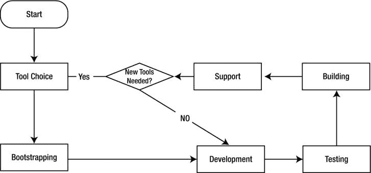

# 8.工作流程

Abstract

一场反常的暴风雪让我明白了如何通过改进我的工作流程来使 JavaScript 应用程序开发更快、更有趣、表面上更有利可图。本章的目标是教其他人如何做同样的事情。

一场反常的暴风雪让我明白了如何通过改进我的工作流程来使 JavaScript 应用程序开发更快、更有趣、表面上更有利可图。本章的目标是教其他人如何做同样的事情。

## 不要铲雪

不要把行动和成就混为一谈。—约翰·伍登

我们在堪萨斯州遇到了一场巨大的暴风雪，人们亲切地称之为“奥兹国的暴风雪”像许多有学龄儿童的人一样，我们的房子是分开的。我们的孩子期待着放学后的一天，在外面嬉戏，回到温暖的可可杯，舒适地坐在炉火旁。我和妻子担心这场暴风雪会把我们淹没在工作的雪崩中。

像所有善良的堪萨斯人一样，在暴风雨的那一天，我尽职尽责地准备好与大自然母亲战斗。我给自己穿了好几次衣服，让我的四肢裹上层层温暖。然后我摇摇摆摆地走进车库，从挂着塑料红色雪铲的挂板上取下它。我想象自己是一个维京人，从石制壁炉上方打开他沾满鲜血的战斧。我打开车库门，走向车道上洁白的原始景观。

铲了几分钟后，“诚实劳动”的新鲜感已经消失了。取而代之的是麻木地意识到，我将不得不做一上午挖掘车道的苦差事。像许多其他非专业铲雪人员一样，我做的是这项工作，而不是支付我的账单，即设计和开发软件。然后，我开始计算在我已经浪费的计费时间里，我本可以购买多少台吹雪机，深感沮丧。

在这一点上，我对我的情况以及它与软件开发的关系有了一个顿悟。我遇到的是工作流程问题。我从事的是一项暂时重要但从长远来看毫无价值的任务。上午的大部分时间，我都在把车道上的雪沿着我的院子边缘堆成令人印象深刻的白色小山。这个过程花了我几个小时，但很快太阳就会抹去这一艰苦工作的所有证据。

我开始想，在我的日常开发过程中，有哪些任务是像铲雪一样的。这些任务似乎是必不可少且不可避免的，但最终可以通过更好的工具或更清晰的视角来更快地完成。

## 什么是工作流

当用 JavaScript 或任何语言开发一个项目时，每个项目都会经历不同的阶段。经理们发现给这些阶段命名很有用(例如，“计划”、“开发”、“测试”和“部署”)。然后，他们将日常任务分成一个阶段或另一个阶段。当他们这样做时，他们采用了工作流，简单地说就是定义和应用规则的过程，以控制任务、数据和附属资料如何以及何时从一个人传递到另一个人。

工作流通常与团队遵循的更大的开发方法紧密结合。例如，敏捷团队可能会遵循强调紧密迭代和较小开发阶段的工作流。而瀑布团队可能会强制执行一个工作流规则，确保在没有完整的规范之前不能构建任何东西。工作流的目标是最大化生产力和最小化复杂性。

然而，这种愿望说起来容易做起来难。通常，工作流的正确实现是一种平衡行为，只有通过定义足够精确的规则才能完全遵循，而不会限制正在开发的过程或产品中的创新或改进。当一个工作流减慢了开发速度的时候，就是它需要被重新评估的时候。

## 明智的 JavaScript 开发工作流程

尽管我之前说过工作流通常是由团队或者开发方法决定的，但是开发人员也有自己的工作流。本节描述了 JavaScript 开发的合理的个人工作流程，它分为六个阶段:工具选择、引导、开发、测试、构建和支持。图 [8-1](#Fig1) 显示了该工作流程。

图 8-1。

A diagram that visualizes the workflow process

## 工具选择

在你建造任何东西之前，你必须选择合适的工具。在这一阶段，开发人员通过对编码环境做出重要选择，并确定所需的任何外部资源(例如，库或应用程序框架)，为应用程序奠定基础。工具的选择对应用程序有持久的影响，甚至在选择工具的人离开之后。您不仅是在为自己选择开发栈，也是在为后来的其他开发人员选择开发栈。本节致力于了解如何选择正确的工具，从哪里获得它，以及如何使它保持最新。

在我年轻的时候，我受训成为一名艺术家。我们画画时，我的绘画教授克莱德·福勒给学生们讲课。我们把画架随意地放在房间中央的模型或静物周围。克莱德会慢慢地绕着画室的外环转，停下来向某个学生提供反馈；但通常只是自言自语。有一天，当我正沉迷于正确地渲染袋子褶皱中形成的阴影时，他对全班同学说，对艺术知之甚少的人会说这样的话:“我不懂艺术，但我知道我喜欢什么。”事实上，他断言他们真的在说，“我不懂艺术，但我喜欢我所知道的。”直到后来，我才真正理解这个概念。当选择正确的工具时，你喜欢你所知道的东西的心态是不稳定的。如果你正处于压力之下，要尽可能快地表现出进步，那就更是如此。在这个阶段，目标应该是选择适合项目的工具，而不是适合开发人员的工具。

我知道开发人员很容易选择他们最熟悉或最擅长的工具。这具有直观的意义，因为如果你精通一种工具，那么你在使用它时会更有效率。虽然这可能是真的，但它也让开发人员成为被称为“工具法则”的思维定势的牺牲品这意味着你总是选择你最喜欢的工具，即使它对于手头的任务来说是错误的选择。

亚伯拉罕·马斯洛完美地总结了这一点，他说:“我认为，如果你唯一的工具是一把锤子，那么把一切都当成钉子是很诱人的。”换一种说法，你可能是用锤子的专家，但没人愿意住在只用锤子盖的房子里。

### 订购工具

直到最近，如果您想将外部 JavaScript 添加到您的应用程序中，您要么复制代码并粘贴到您现有的脚本文件中，要么下载源代码的副本并使用 Script 标记将其包含到您的页面中。在我讨论这些工具的实际集成之前，让我快速地转移话题，首先讨论如何对它们进行排序。

选好工具后，你需要知道去哪里买。作为一个思维实验，想象一下你在现实生活中可能会如何购买一把锤子。最有可能的是，你会选择一家商店购买。选择商店时，你要考虑商店本身的几个因素——可能是价格、便利性和退货政策。现在想象一下，我们把这三个方面重新投射到软件工具上。

#### 价格

价格是将这个工具集成到您的项目代码库中所花费的成本(时间、精力、理智)。当评估一个软件工具的价格时，你想知道它的编写、支持和测试有多好。将价格视为使用该工具所承担风险的一个因素。目标是以最小的代价获得最大的价值。考虑一下使用 jQuery 的代价，它是世界上最流行的 JavaScript 库之一。它拥有庞大的用户基础(支持)，由该领域的专家编写(代码质量)。最后，开发人员已经将它集成到几乎所有可以运行 JavaScript 的平台中(经过测试)。因此，jQuery 很可能比你自己花一个周末写的库价格更低。

#### 便利

对我来说，在网上买锤子比开车去当地的大商店要方便得多。除非我马上需要它；然后当地商店轻而易举地赢了。假设我想要的软件工具是 jQuery。去它的网站下载我自己的副本并把它直接放在我的应用程序的源文件夹中似乎很方便。这样做相当于去附近的五金店买一把锤子。但是，如果我后来想更改 jQuery 的版本，会发生什么情况呢？我需要回到网站重新下载吗？我如何首先知道是否有新版本？我需要一次又一次地去它的网站等待新的发布吗？突然，这似乎不太方便。在软件世界中，这个任务通常由包管理器来处理，我将在后面详细解释。

#### 退货政策

拿到锤子后讨厌了怎么办？如果我买它的商店不接受退货，我已经有效地把这个锤子的价格加到了我买的下一个锤子上，因为我不能退货。发展中也是如此。如果将一个工具集成到您的代码库中需要花费大量的精力，那么以后提取它也很可能需要同样多(或者更多)的精力。对于一个软件工具来说，有一个好的返回策略，意味着从你的代码库中提取它是很容易的。这就是包管理器的用武之地。

#### JavaScript 包管理器

包管理器是管理软件工具集合的应用程序，它实现自动安装、配置、更新和从各种平台上删除它们的方法。包管理器解决了工作流开发中的三个主要问题:依赖性管理、升级路径保护和软件工具管理。包管理并不是什么新鲜事。许多编程语言，如 Perl 或 Ruby，多年来一直享有完善的包管理器。

直到最近，人们还很少意识到 JavaScript 需要类似的解决方案。许多人认为脚本语言不需要额外的开销，处理这种情况的最好方法就是复制并粘贴到一个工作应用程序中。随着 JavaScript 的流行和使用的增长，包管理的需求和选择也在增长。这里只是 JavaScript 包管理的流行选择的一个例子:NPM、鲍尔、安德和组件！

为了说明为什么在 JavaScript 开发工作流中集成包管理器是值得努力的，我将一次一个地探索它们解决的隐含问题。我将以鲍尔为例。

##### 人民的凉亭

我选择 Bower 作为包管理器来演示，不仅因为它提供了完美的双关语，还因为 Bower 专注于前端。对于许多 JavaScript 开发人员来说，前端是他们花费大部分时间的地方。Bower 支持许多不同的包类型，它甚至拥有一个强大的 API，开发人员可以与之交互并对其进行编程。让我们来看看如何让 Bower 运行起来。讽刺的是，Bower 是通过另一个包管理器(npm)分发的。因此，首先您需要安装 npm。npm 准备就绪后，Bower 可以安装在一条线上:

`npm install -g bower`

要安装最新的最棒的 jQuery，您可以简单地这样写:

`bower install jquery`

这个命令使 Bower 从远程服务器克隆适当的存储库。Bower 在开发人员系统的本地缓存中维护自己的组件目录。在本地缓存后，Bower 会制作一份软件副本，并将其放在与运行安装命令的路径相关的 bower_components/目录中。

您可以轻松地查看特定版本的 jQuery:

`bower install jquery#1.6.0`

如果您检查签出的代码，您会发现一个 jquery 目录。在这个文件中，您只会发现两个文件:component.json 和 jquery.js。

##### 鲍尔小心

在继续之前，必须说明的是，Bower 不对上传到其存储库的包进行任何验证或确认。很容易认为这些工具集合是经过审查的，或者是以某种方式正式提供的。他们不是。你不会因为某样东西适合你的嘴而吃它。你也不应该仅仅因为 Bower 有可用的包就安装它。

### 依赖性管理

到目前为止，我一直用锤子来比喻软件工具。诚然，这种心理形象有点做作，但也有误导性。锤子的伟大之处在于，在你理解了它的工作原理之后，每次你使用它时，它的表现都是一样的。你不必担心你选择的螺丝刀会影响锤子的功能。不幸的是，发展中的情况并非如此。大多数软件工具依赖于一系列其他程序。这种分层是编程的本质所固有的，意味着这些工具之间形成了依赖链。这些链条经常缠绕在你的电脑内部。如果另一个程序修改了共享链中的一个链接，它会对你的系统造成严重破坏。而且作为一个额外的奖励，它经常默默地做到这一点。

包管理器试图通过使用配置文件来保护这些链，它们就像一个配方一样遵循这些配置文件。配置中的每个属性都告诉软件包管理器如何安装软件，以及它所依赖的程序(如果有的话)。在包管理器中有一个惯例，将一个配方放在源代码树的根中。Bower 将这些配置文件称为 bower.json 文件。下面是一个 jQuery 的 bower.json 文件的例子:

`{`

`"name": "jquery"`，

`"version": "1.8.0"`，

`"main": "./jquery.js"`，

`"ignore": []`，

`"dependencies": {}`，

`"devDependencies": {}`，

`"gitHead": "a81132c96b530736a14a48aad3916b676d102368"`，

`"_id": "jquery@1.8.0"`，

`"repository": {`

`"type": "git"`，

`"url": "git://github.com/components/jquery.git"`

`}`

`}`

这个对象的结构非常简单:

*   名称:这是必需的。当然，这也是你项目的名字。
*   版本:这是一个语义版本号。
*   main:这是可以在其中找到软件的端点的字符串或数组。
*   忽略:一些应用程序定期生成文件作为开发人员的辅助，例如记录文件的异常或创建隐藏的资源文件夹。通常，这些文件只对工具的创建者重要，安装软件包的开发人员可以忽略它们。该指令允许您指定要忽略的各种路径。
*   依赖性:这是 Bower 开始为您做繁重工作的地方。这个指令是一个 JavaScript 散列，它定义了其他工具及其细节的列表，比如软件在生产中运行所需的版本号。Bower 要么在本地缓存中查找兼容版本，要么从远程位置下载。
*   devDependencies:一些工具指定只在开发期间需要的依赖。许多编写良好的工具还附带了验证功能的单元测试。创建者可以将测试框架添加到依赖列表中，然后 Bower 会在开发过程中包含它，在为产品编译代码时忽略它。
*   gitHead:随着项目的发展，新的代码会取代旧的代码。Git 为每个提交分配一个唯一的散列，这允许 Bower 引用软件项目生命周期中的一个精确时刻。通过这种方式，Bower 可以检查特定版本的 jQuery 或任何其他项目。
*   _id:用于引用特定组件的内部 id。
*   存储库:描述用于存储软件工具的源代码控制的位置和类型的散列。

### 保护升级路径

许多软件包管理器，比如 Homebrew，在系统范围内安装软件包。这通常意味着您不能同时安装一个以上版本的工具。

如前所述，鲍尔采取了不同的方法。Bower 试图只管理前端所需的软件，并且一次只管理一个应用程序。通过划分每个应用程序的依赖关系，开发人员不必担心指定最新版本的 jQuery 会如何影响以前使用旧版本的应用程序。早些时候，Bower 检查了 jQuery 的一个旧版本。如果您后来决定签出 jQueryUI，您可以这样做:

`bower install jquery-ui`

在检查 bower_components 目录时，您会看到 bower 添加了一个新文件夹:jquery-ui。等待；还有呢！如果您重新调查 jquery 文件夹，请注意 Bower 自动将它更新为较新的版本，因为在 jquery-ui 的 bower.json 文件中，它列出了 jQuery 的一个特定依赖项:

`"dependencies": {`

`"jquery": ">= 1.8"`

`}`，

如您所见，它需要新版本的 jQuery。任何高于 1.8 的版本都可以工作。Bower 签出了 jQuery 的最新版本，并替换了旧版本。

相对于自己动手的方法，包管理器提供的最后一个好处是，它们提供了一种方法来轻松处理关于查找、集成和删除工具的常见任务。您已经看到了安装工具是多么容易。卸载一个也很容易:

`bower uninstall jquery`

`conflict jquery-ui depends on jquery`

`bower warn To proceed, run uninstall with the --force flag`

请参见已卸载...哦，等等，实际上这个命令失败了，因为 jQuery-ui 依赖于 jQuery。如果现在卸载 jQuery，将不再满足 jQuery-ui 的一个依赖项。如果您仍然希望看到世界毁灭，您可以通过在命令末尾提供- force 标志来强制卸载。

除了 Bower 能够节省您的时间之外，它还具有一些节省时间的功能，可以让您更容易地找到并安装软件。Bower 提供了一个强大的界面来搜索和查找与您的兴趣相关的包。例如，如果您想查看有哪些 jQuery 或相关插件可用，您可以首先像这样搜索 Bower:

`bower search jque`

`Search results:`

`- jquery git://github.com/components/jquery.git`

`- jquery-ui git://github.com/components/jqueryui`

`jquery.cookie git://github.com/carhartl/jquery-cookie.git`

`... results continue...`

如果您想查看您已经在本地安装了哪些包，您可以让 Bower 为您列出它们:

`bower ls`

`/Users/heavysixer/Desktop/bower`

■t0]

ε□□□□□□□□□□□

ε──t0″

请注意，Bower 不仅列出了您已经安装的包，还列出了每个包的依赖项。

之前您试图卸载 jQuery，但是被 Bower 的依赖管理器阻止了。如果这个命令成功了，Bower 仍然有一个隐藏的包的本地缓存，您可以使用它在以后重新安装。如果您想清除本地缓存，您可以这样做:

`bower cache-clean`

Bower 致力于解决整个包管理问题的一小部分:前端开发的组件控制。Bower 的开发人员明白，尽管这是一个有待解决的开放性问题，但他们的部分成功取决于 Bower 与构建堆栈中的其他流程集成的能力。

如今，许多应用程序都经历了一个分层部署过程，在这个过程中，代码被发送到一个编程传送带上，进行净化、缩小、模糊、打包和部署。为了让开发人员采用 Bower，它必须找到一种方法与其他外部流程共存。Bower 的解决方案是公开一个简单的高级 API，允许程序员编写脚本。难道你不知道吗，它是用 JavaScript 写的！下面是它如何工作的一个例子:

`var bower = require('bower');`

`bower.commands`

`.search('jquery', {})`

`.on('packages', function(packages) {`

`/* `packages` is a list of packages returned by searching for 'jquery' */`

`});`

在这个片段中，您可以看到一些外部脚本需要 Bower。一旦定义完毕，Bower 实例就会被发出一个命令，要求它搜索任何名称中带有“jquery”的可用包。Bower 的 API 被设计成可选地发出事件来响应发出的命令。调用脚本可以为这些发出的事件注册一个侦听器。

在玩具脚本中，您正在监听“packages”事件，当调用该事件时，它允许您遍历 Bower 返回的 jQuery 包列表。Bower 发出的其他一些常见事件是数据、结束、结果和错误。

在这一节中，您学习了如何选择工具，从哪里获得工具，以及如何将管理这些工具的繁重工作交给像 Bower 这样的包管理人员。

在下一节中，您将探索如何使用工具来生成代码，这将帮助您进行开发。开始自举吧！

## 拔靴带

在道格拉斯·恩格尔巴特(Douglas Engelbart)通过他的 Bootstrap Alliance 推广“Bootstrap”概念之前，这个术语描述的是独自完成一项通常需要多人完成的任务的不合理尝试。想象一下靠自己努力奋斗的荒谬。随着时间的推移，这个词开始反映企业家不屈不挠的内在精神，他们利用有限的资源快速创业。自力更生的努力就像建造一架通往天堂的梯子，它主要是用胶带粘在一起的。

与开发相关的自举涉及到程序员试图用代码生成器、插件、框架和现有代码快速启动代码库。在这个阶段不编写自定义代码。相反，开发人员利用任何现成的东西来解决他们项目的一般特性。

自举不仅仅是通过将一套部件组合在一起来解决一般性的问题，还包括使用代码来编写代码。像 Ruby on Rails 这样的框架将代码生成的概念融入到了它们的 DNA 中。它们有接受自定义参数的生成器，允许开发人员快速创建定制的代码块。由于其剪切粘贴文化，JavaScript 很难理解这个概念。相反，JavaScript 中的自举通常包括将大量的库转储到一个文件夹中，并将它们连接到 HTML 页面中。在过去的两年里，JavaScript 社区对生成器充满了兴趣。

这种对生成器的支持在 Yeoman 中表现得最为明显，这是一个由 Google 开发人员编写的固执己见的工作流工具。和 Rails 一样，Yeoman 强调代码编写代码的概念。历史上，自耕农是王室的一种文书随从。顾名思义，Yeoman 项目试图将一些管理开发工作流的单调工作从开发人员身上剥离出来。

正如我用 Bower 解释了关于工具选择的突出问题一样，我将同样用 Yeoman 解释与 JavaScript 开发工作流相关的引导和任务自动化。本演示将带您完成安装和配置 Yeoman 的过程，并搭建一个基本的 AngularJS 应用程序。

### 使用约曼

在让约曼开始工作之前，你必须安装它。npm 已经就绪，您只需在控制台中键入以下命令:

`npm install -g yo grunt-cli bower`

Note

如果您使用的是 Yeoman 之前的版本，您可能需要清除 npm 缓存才能使用该命令。以前，您不能使用-g 标志来指定全局安装。您可以强制 npm 清除缓存并像这样更新 Yeoman:NPM 缓存清除&& npm 更新-g yo

这段代码安装了 Yeoman、grunt 命令行界面(CLI)和 Bower 包管理器(如果您正在学习，应该已经安装了)。从 install 命令就可以看出，Yeoman 通过将一系列相关技术结合在一起来帮助开发人员。美国约曼公司利用这些项目为四个主要目标服务，这些目标将在下面的章节中讨论。

#### 脚手架

Yeoman 让开发者有机会使用各种预定义的模板作为构建的基础。这些模板中有许多是基于知名项目构建的，比如 HTML5 样板、Twitter Bootstrap 或 AngularJS。

现成的 Yeoman 官方支持几个生成器:webapp、angular、backbone、bbb、ember、chromeapp、chrome-extension、bootstrap、mocha 和 karma。我把它作为一个练习留给读者去探索每一个。

约曼提供了一种直接从 npm 下载和安装新发电机的机制。在搭建 AngularJS 应用程序之前，必须确保安装了 AngularJS 生成器:

`npm install generator-angular`

安装后，您可以使用以下代码搭建 AngularJS 应用程序:

`yo angular`

这段代码调用 AngularJS 生成器。一旦运行，程序通过一系列是或否的问题提示开发人员，同时试图确定更多关于项目基本需求的信息。为了简单起见，我对所有这些问题的回答都是否定的。完成后，Yeoman 会生成类似如下的输出:

`create app/styles/bootstrap.css`

`create app/index.html`

`create component.json`

`create package.json`

`create Gruntfile.js`

`invoke angular:common:/Users/heavysixer/Desktop/yeomanapp/node_modules/generator-angular/app/index.js`

`create .bowerrc`

`create .editorconfig`

`create .gitattributes`

`create .jshintrc`

`create app/.buildignore`

`create app/.htaccess`

`create app/404.html`

`create app/favicon.ico`

`create app/robots.txt`

`create app/styles/main.css`

`create app/views/main.html`

`create test/runner.html`

`create .gitignore`

`invoke angular:main:/Users/heavysixer/Desktop/yeomanapp/node_modules/generator-angular/app/index.js`

`create app/scripts/app.js`

`invoke angular:controller:/Users/heavysixer/Desktop/yeomanapp/node_modules/generator-angular/app/index.js`

`create app/scripts/controllers/main.js`

`create test/spec/controllers/main.js`

这是一个很好的开始！Yeoman 创建了一个合理的应用程序结构，并连接了所有 AngularJS 依赖项。就像电视上的那个人说的，“但是等等；还有呢！”

虽然这个生成器创建了一个完整的 AngularJS 应用程序，但也有一些更小的生成器可以用来创建 AngularJS 框架的各个方面。以下是一些例子:

`yo angular:controller myController`

`yo angular:directive myDirective`

`yo angular:filter myFilter`

#### 包装管理

如果您需要向项目中添加一个新的依赖项，使用 Yeoman 很容易，因为它集成了 Bower。让我们将 Angular-UI 项目添加到应用程序中。此代码添加了一组有用的 AngularJS 过滤器和指令:

`bower install angular-ui`

同样，如果一切正常，您应该会在终端窗口看到如下输出:

`bower cloning git://github.com/angular-ui/angular-ui.git`

`bower caching git://github.com/angular-ui/angular-ui.git`

`bower fetching angular-ui`

`bower checking out angular-ui#v0.4.0`

`bower copying /Users/heavysixer/.bower/cache/angular-ui/bd4cf7fc7bfe2a2118a7705a22201834`

`bower installing angular-ui#0.4.0`

在 Bower 为自己的目的缓存 angular-ui 源代码之后，它会在 Yeoman 创建的 app 目录中的 bower_components 文件夹中放置一个副本。Bower 将这种浅层复制作为依赖性管理过程的一部分。

#### 内置服务器

Yeoman AngularJS 生成器的目的是快速搭建一个基本的 AngularJS 应用程序，开发人员可以开始修改它以满足自己的需求。像许多现代 JavaScript 框架一样，AngularJS 是数据驱动的。这通常意味着连接到一个服务器来拉回资源以显示给用户。不幸的是，浏览器中的安全限制阻止您将本地文件拖到浏览器中，然后发出远程 AJAX 请求。幸运的是，Yeoman 内置了一个很棒的服务器。

从项目的根文件夹中，您可以通过在控制台中键入以下命令来快速启动 AngularJS 应用程序:

`grunt server`

Note

如果您没有安装 Ruby 或 Compass gem，您可能会在尝试运行服务器时收到一条警告消息。您可以安装 Ruby 和 Compass gem，或者使用`-- force`环境标志:`grunt server --force`强制服务器在没有它们的情况下启动。

您应该看到 Grunt 在您的计算机上启动一个作为进程运行的服务器，然后打开您的默认浏览器，其中已经加载了您的应用程序。无需首先将网站部署到网络上就能快速启动服务器的能力可以节省大量时间，但这还不是最酷的部分。Yeoman 服务器实际上是一个 LiveReload 服务器。这意味着除了提供站点的本地文件，服务器还会监视它们的变化。当它发现你改变了一个文件，它会自动重新加载浏览器。

虽然这看起来是一个微不足道的增加，但是想象一下你浪费了多少时间，让你的 IDE 移动到你的浏览器并点击重新加载。从长远来看，杀死这种重复的任务真的会增加。既然我们新开发的应用程序已经在浏览器中启动并运行，是时候进入工作流程的下一个阶段了:开发。

## 发展

在开发阶段，程序员编写代码，测试产品断言，并追踪 bug。这些任务中有许多涉及大量重复的体力劳动。这样，开发人员就成了瓶颈，因为他们一次只能完成一项任务。正如您在引导阶段所看到的，任务自动化在提高开发过程中的生产速度和质量方面起着重要的作用。

它在两个方面提高了速度:它通常可以比开发人员更快地完成这些任务，并且许多任务可以并行运行，这改善了曾经是一系列连续步骤的情况。

引导部分主要关注编写代码的代码。在开发阶段，您探索通过捕捉简单错误或实施最佳实践来提高开发人员编写的代码质量的工具。

### 一箱咖啡脚本

CoffeeScript 是编译成 JavaScript 的精品语言。CoffeeScript 深受 Ruby 的影响，并从它那里借用了很多简洁的语法。与 Ruby 不同，CoffeeScript 中的代码缩进很重要。这是因为 CoffeeScript 在编译过程中使用缩进来帮助定义代码的词法范围。

CoffeeScript 有时会被严肃的 JavaScript 程序员认为是不必要的抽象，只是用另一种要学习的微语言来搅浑开发的水。在他们看来，JavaScript 作为一种语言已经很容易编写和阅读了。因此，让另一种语言为他们做这件事没有任何好处。让我在下一节阐述我支持 CoffeeScript 的理由。

Note

以下示例假设您已经安装了 CoffeeScript。关于安装 CoffeeScript 的更多信息可以在这里找到: [`http://coffeescript.org/`](http://coffeescript.org/)

#### 少写

如果说写代码是最花时间的过程，那么少写代码，得到同样的结果是好事，对吧？CoffeeScript 有一个非常简洁的语法，允许您编写如下内容:

`square = (x) -> x * x`

根据 CoffeeScript 编译器的设置，它会将前面一行编译成如下所示:

`(function() {`

`var square;`

`square = function(x) {`

`return x * x;`

`};`

`}).call(this)`

本节的目的是解释为什么应该使用 CoffeeScript，而不是如何编写它。现在，我要说的是，在 CoffeeScript 中，单箭头定义了一个函数，圆括号定义了该函数可以接受的参数。重要的一点是，CoffeeScript 可以将一条非常简洁的语句外推到任何 JavaScript 开发人员都应该能够阅读的 JavaScript 源文件中。

#### 固执己见的翻译

正如您在前面的例子中看到的，CoffeeScript 编译器不仅仅是创建了我们函数的一对一翻译。CoffeeScript 试图遵循 JavaScript 中常见的最佳实践，并在可能的情况下，为您实施这些实践。在培训团队中的新开发人员时，我经常让他们先从 CoffeeScript 开始，然后再转到 JavaScript。通过这种方式，我可以谈论 CoffeeScript 修改代码背后的原因。CoffeeScript 对这个简单的方法做了几个重要的修改，值得一次讨论一个。

第一个修改是 CoffeeScript 编译器将函数包装到一个立即调用的函数表达式(IIFE)中。通过将函数封装到一个闭包中，CoffeeScript 保护代码不被其他脚本意外覆盖。

IIFE 还为与其他源文件的连接准备代码。文件的连接和缩小是自动构建系统中的常见任务。通过将所有文件合并成一个文件，浏览器必须发出更少的请求，这加快了站点的呈现速度。不幸的是，有时连接会破坏代码。出现这种情况有多种原因，但一个常见的错误是一个或多个文件在开头或结尾没有换行符。这可能导致代码一起运行，从而产生错误。

CoffeeScript 对我们代码的下一个增强更加微妙，因为它是关于如何编写代码的意见。在原始函数中，您使用了函数表达式而不是函数声明。CoffeeScript 使得编写函数声明变得几乎不可能，但是它这样做有一个很好的理由。

早期版本的 Internet Explorer(版本 8 和更低版本)有一个作用域问题，即命名函数可以同时被视为声明和表达式。

CoffeeScript 通过几乎完全使用函数表达式来回避整个问题。事实上，CoffeeScript 允许函数声明的唯一地方是在定义类的时候。

除了执行函数表达式，CoffeeScript 还将变量定义为局部变量，并将其声明移到了函数块的顶部。通过这样做，CoffeeScript 可以保护您避免任何不可预见的变量提升问题，这些问题可能是在定义函数之前调用函数而引起的。

最后但同样重要的是，CoffeeScript 从函数中返回值，即使您没有明确请求它。就像在 Ruby 中一样，CoffeeScript 假设函数体中的最后一个元素应该是返回值。因为 CoffeeScript 实施了这个约定，所以所有的函数签名都受益于基本级别的一致性。

#### 快速失败

乍一看，这似乎有悖常理，但 CoffeeScript 无法编译成 JavaScript 实际上是一件好事。顾名思义，JavaScript 是一种脚本语言，浏览器不需要编译就可以执行。

CoffeeScript 只有在语法正确的情况下才会编译成 JavaScript。现在，这并不意味着代码会如你所愿，但至少在浏览器执行它时，它将是有效的 JavaScript。

#### 统一团队代码

大多数专业开发人员作为团队的一部分以小组的形式编写代码。通常，团队有一个风格指南，他们遵循该指南来保持代码的可读性和统一性。这些约定可以涵盖从如何命名变量到代码缩进多少个空格的范围。使用 CoffeeScript 不会解决所有这些问题，但它至少会保证编译后的 JavaScript 具有某种程度的一致性。

我推广 CoffeeScript 的一个原因是它遵循了一系列旨在提高代码质量的最佳实践。CoffeeScript 通过控制源代码的最终形式(就像它在生命中包装我们的代码时一样)或通过限制您可以首先编写的代码类型(就像他们使编写函数声明变得困难时一样)来实施它的最佳实践集。

CoffeeScript 通常被认为是一种爱它或恨它的技术。不幸的是，许多人甚至在尝试之前就下定了决心。有时候，当我哄骗一个固执的开发者时，我觉得我在和我的孩子说话，“你不一定要喜欢它，但是你一定要试一试。”

不管你个人对 CoffeeScript 的感觉如何，这种语言的流行是不可否认的，支持它的工具生态系统也在不断发展。默认情况下，Yeoman 会自动观察 CoffeeScript 文件并为您编译它们，现在许多生成器最近也增加了对 CoffeeScript 的支持。例如，如果您想使用 CoffeeScript 而不是普通的 JavaScript 生成 AngularJS 项目，您可以提供可选的“- coffee”参数。完整的命令如下所示:

`yo angular --coffee`

#### 棉绒收集器

CoffeeScript 对代码风格的自动执行为源代码提供了一层事实上的代码分析。就好像有人越过你的肩膀看着你说，“你不会真的想这么写的；我来帮你修吧。”这种做法疏远了一些人。对那些开发人员来说幸运的是，有其他工具可以提供静态代码分析，而无需为您编写代码。

JSHint 最初是由 Anton Kovalyov 编写的，是代码分析任务的另一个很好的选择。JSHint 最初是道格拉斯·克洛克福特 JSLint 项目的一个分支。这两个程序的工作方式基本相同:一行一行地遍历源文件，并列出潜在问题或偏离可接受风格的地方。

许多人觉得 JSLint 太固执己见了。尽管 JSLint 的目标是检测 JavaScript 程序中的潜在错误和疏忽，但它也迫使开发人员以任意形式编写 JavaScript，这并不一定是对他们现有方法的改进。JSLint 的源代码暗示了这种紧张:

`"WARNING: JSLint will hurt your feelings."`

Kovalyov 松开了 JSLint 的螺钉，并试图将关于风格的观点与静态代码分析的需要分开。通过这样做，JSHint 成为了原版的一个更友好、更温和的版本。JSHint 的网站在描述目标时提到了这一点:

> Our goal is to help JavaScript developers write complex programs without worrying about spelling mistakes and language traps. I believe that static code analysis programs-and other code quality tools-are important and beneficial to the JavaScript community, so we should not alienate their users.

JSHint 的目标之一是提供一种配置 linter 的方法，以便它只强制执行团队或个人寻求推广的编码约定。JSHint 的选项分为三个主要类别:可实施的、可放松的和环境选项。

每个类别包含许多不同的选项；事实上，不胜枚举。相反，我将为每个类别提供几个典型的例子来说明这一点，但是我鼓励那些感兴趣的人详细阅读文档。

#### 可执行期权

顾名思义，这些额外的选项可以由 JSHint 强制执行。这里有两个例子:

*   `camelcase (true | false) //`:此选项允许您对所有变量名强制使用 camelCase 样式。
*   `undef (true | false) //`:防止您定义最初未定义的变量。这种情况经常发生，一个变量被声明了，但是从来没有被使用过

#### 可放宽的选项

对一个人来说是最佳实践的规则对另一个人来说却很烦人。JSHint 知道这一点，并提供了一组选项来减少默认情况下由 linter 触发警告的情况。这里有两个例子:

*   几乎所有人都认为使用 eval 是个坏主意，因为它暴露了第三方注入恶意代码并让宿主应用程序执行代码的渠道。
*   `debug (true | false) //`:该选项允许您禁止在代码中使用调试器语句的警告。

#### 环境选项

此类别中的选项定义了由其他库(如 jQuery 或 Nodejs)公开的任何全局变量。这里有一个例子:

*   `jquery (true | false) //`:是公开全局$还是 jQuery 变量。

幸运的是，作为自动化构建过程的一部分，Yeoman 被自动配置为 lint 任何 JavaScript，这一点我将在后面介绍。您可以通过编辑 JSHint 资源文件来修改默认的 JSHint 设置，该文件位于应用程序目录的根目录中。该文件被命名为. jshintrc。

在继续之前有一个警告:静态代码分析工具，比如 JSHint，只验证代码的语法结构。这对于捕捉小错误或风格不一致是一个巨大的资产，否则可能会从日常开发的裂缝中溜走。然而，这些工具无法告诉您所编写的代码是否真的达到了预期的目的。为此，开发人员需要在各种不同的环境下测试代码，以确保代码按预期执行。

## 测试

测试可能意味着任何事情，从断言应用程序执行了它被设计的任务，到它在各种平台(如桌面、电话或平板电脑)上看起来是否正确。编写有效的测试并知道首先要测试什么可以改进工作流程的这个阶段。同样，自动化是关键，不仅在为开发人员运行测试时如此，在跨多个平台分布测试用例时也是如此。

我还应该提到，测试并不总是遵循开发过程。包含测试驱动开发(TDD)或行为驱动开发(BDD)的方法遵循测试优先的范例。这些开发人员从编写描述需要编写的功能的测试开始。然后运行测试以确保它们失败。一旦编写了一个测试，编码才开始。

许多方法还指出，开发人员应该只编写足够通过测试的代码。希望代码库可以更精简，因为不需要的功能不会被添加。我把开发之后的测试放在这一章中，主要是因为我相信这是大多数人认为的流程一起流动的顺序。实际上，开发和测试可以是紧密耦合的阶段，它们一起振荡。

在这一节中，我将介绍几个与测试相关的工具，并演示如何将它们有效地集成到您的工作流程中。

### 如何测试

我敢打赌，除了 JavaScript 之外，大多数使用其他语言的专业开发人员都会将测试作为他们正常工作流程的一部分。JavaScript 在这方面仍然落后的原因与典型的 JavaScript 开发人员的素质关系不大，更多的是因为 JavaScript 可以在如此多的不同平台和上下文中运行。在大多数语言中，编写测试是最难的部分，但是在 JavaScript 中是运行测试。幸运的是，许多聪明的开发人员一直在努力工作，慢慢解决这个问题。以自动化的方式可靠地运行 JavaScript 测试有几个可行的选择。

JavaScript 测试人员通常分为两个阵营:使用独立引擎(如 V8 或 Rhino)进行测试的，以及在浏览器中运行的。我将演示两个测试程序:Karma 和 PhantomJS。

### 因果报应

Karma 是一个最初由 AngularJS 团队在编写 AngularJS 时并行开发的测试运行程序。它是测试框架不可知的，这意味着您可以使用任何您最熟悉的 JavaScript 测试库。它有一个内置的文件监视器，开发人员可以对其进行配置，以便在监视器看到源文件发生变化时自动运行相关的测试。

Karma 被设计成在实际的设备和浏览器上运行测试，这意味着测试得到了代码在目标设备/平台上将如何执行的真实表示。Karma 构建时考虑到了更大的工作流程，并为持续集成工具(如 Jenkins、Travis 和 Teamcity)提供了各种入口点。

Karma 唯一的依赖项是 Node.js，您应该已经安装了它。Karma 团队建议您通过 npm 在全球范围内安装项目，可以这样做:

`$ npm install -g karma`

`# Start Karma`

`$ karma start`

运行 start 命令应该会打开一个浏览器，在活动选项卡中运行 Karma。您应该会在控制台中看到类似这样的内容:

`INFO [karma]: Karma server started at` `http://localhost:8080/`

`INFO [launcher]: Starting browser Chrome`

`INFO [Chrome 26.0 (Mac)]: Connected on socket id TPVQXqXCvrM2XhRwABfC`

到目前为止，业力并没有那么有帮助；它只是闲置在打开的浏览器中，因为没有测试要运行——或者有吗？如果查看 Yeoman 生成的目录结构，应该会看到一个 main.js 文件。它位于/test/spec/controllers/目录中。现在您有一个测试要运行，您只需要配置 Karma 来运行它，这需要一点点配置。

作为引导过程的一部分，Yeoman 已经为您生成了一个配置文件。如果您查看根目录，您应该看到一个名为 karma.conf.js 的文件。幸运的是，开发人员对该文件进行了很好的注释，并且选项非常容易理解。

默认情况下，Karma 被设置为以集成模式运行，但是如果您在 Karma 配置文件中手动将 singleRun 更改为 true，您可以指示 Karma 按需运行测试:

`// Karma configuration`

`// base path, that will be used to resolve files and exclude`

`basePath = '';`

`// list of files / patterns to load in the browser`

`files = [`

`JASMINE`，

`JASMINE_ADAPTER`，

`'app/components/angular/angular.js'`，

`'app/components/angular-mocks/angular-mocks.js'`，

`'app/scripts/*.js'`，

`'app/scripts/**/*.js'`，

`'test/mock/**/*.js'`，

`'test/spec/**/*.js'`

`];`

`// list of files to exclude`

`exclude = [];`

`// test results reporter to use`

`// possible values: dots || progress || growl`

`reporters = ['progress'];`

`// web server port`

`port = 8080;`

`// cli runner port`

`runnerPort = 9100;`

`// enable / disable colors in the output (reporters and logs)`

`colors = true;`

`// level of logging`

`// possible values: LOG_DISABLE || LOG_ERROR || LOG_WARN || LOG_INFO || LOG_DEBUG`

`logLevel = LOG_INFO;`

`// enable / disable watching file and executing tests whenever any file changes`

`autoWatch = false;`

`// Start these browsers, currently available:`

`// - Chrome`

`// - ChromeCanary`

`// - Firefox`

`// - Opera`

`// - Safari (only Mac)`

`// - PhantomJS`

`// - IE (only Windows)`

`browsers = ['Chrome'];`

`// If browser does not capture in given timeout [ms], kill it`

`captureTimeout = 5000;`

`// Continuous Integration mode`

`// if true, it capture browsers, run tests and exit`

`singleRun = false;`

保存更改后，当您重新运行 Karma start 命令时，您应该会看到不同的结果:

`karma start`

浏览器应该出现一瞬间，然后又消失了。检查控制台，您应该看到相关的位应该在底部，看起来应该有点像这样:

`INFO [karma]: Karma server started at``http://localhost:8080`T2】

`INFO [launcher]: Starting browser Chrome`

`INFO [Chrome 26.0 (Mac)]: Connected on socket id UpRyiPnI-M9x4d35NiqQ`

`Chrome 26.0 (Mac): Executed 1 of 1 SUCCESS (0.084 secs / 0.013 secs)`

如你所见，你启动了 Karma，它又启动了 Chrome，Chrome 最终为你运行了 Jasmine 测试。你明白我说的依赖管理是什么意思吗？在控制台输出的最后，您可以看到您的单个测试在几分之一秒内运行。

### 拥有最多的鬼魂

PhantomJS 是您将调查的下一个测试跑步者。不像 Karma，它是一个顽固的测试者，PhantomJS 试图在一个不可见的接口中复制整个 web 栈(DOM 遍历、CSS 选择、JSON 解析、Canvas 和 SVG 处理)。这有时被称为无头浏览器。PhantomJS 通过在上面放置一个强大的 JavaScript API 来增强普通浏览器的特性。

开发人员可以使用 API 来完成各种有用的任务，例如以编程方式捕获屏幕截图、监控网站性能或模拟用户与网站的交互。PhantomJS API 还允许开发人员使用熟悉的库(如 jQuery)来编写 API 脚本，这使得启动和运行速度更快。

在被单下，PhantomJS 只是 Webkit。这意味着，当编写测试时，程序员必须意识到，结果可能不会真实地反映代码在其他浏览器(例如，Internet Explorer)上的行为。与 Karma 不同，它只是一个测试运行者，PhantomJS 认为测试运行只是它擅长的许多用例之一。

测试运行基础设施不像 Karma 中那样容易访问。幸运的是，PhantomJS 拥有活跃的用户群，并且已经编写了几个附加项目来让 phantom 轻松运行测试。PhantomJS 生态系统中有几个测试项目值得一提，包括 casperJS、Poltergeist 和 GhostDriver。

不幸的是，让它们运行起来超出了本章的范围。相反，让我们专注于将幻像整合到因果报应中。当 Karma 之前运行测试时，浏览器弹出一瞬间运行测试，然后自动关闭。

通过切换到 PhantomJS，您可以完全避免这种情况，因为测试将在一个不可见的无头浏览器中运行。幸运的是，这种集成很容易实现。您只需要重新打开 karma.conf.js 文件，并将 browsers 数组中的单个条目改为 PhantomJS。

一旦保存并关闭文件，您应该再次触发 Karma start 命令。这一次，不会出现浏览器窗口，您应该会在控制台输出中看到略有不同的结果:

`INFO [karma]: Karma server started at``http://localhost:8080`T2】

`INFO [launcher]: Starting browser PhantomJS`

`INFO [PhantomJS 1.7 (Mac)]: Connected on socket id 2WUOvjjU9KSbb442Kkt9`

`PhantomJS 1.7 (Mac): Executed 1 of 1 SUCCESS (0.034 secs / 0.007 secs)`

Karma 这次使用了幻想曲，作为奖励，用了将近一半的时间来运行测试！既然您已经了解了如何作为 JavaScript 开发工作流的一部分可靠地运行测试，那么让我们花一点时间来探索能够并且应该编写的测试类型。

### 测试什么

要正确测试应用程序，您必须从各种不同的方面着手。您希望单独测试代码，然后在集成到最终部署的环境中时再测试一次。同时，您还可以关注另一个测试流，看看代码执行得有多好。

通常，测试属于四个测试类别之一:单元、集成、性能和兼容性。我将在本节的剩余部分介绍每一类工具。

#### 单元测试

单元测试测试单个代码单元，例如，一个较大类的特定函数。单元测试使您能够孤立地进行测试，以确保您的函数在最基本的级别上完成了预期的任务。有几个优秀的 JavaScript 测试框架:Mocha、QUnit 和 Jasmine，仅举三个例子。下面是在每个框架中编写的相同测试:

`/* Written in Mocha */`

`var assert = require("assert")`

`describe('truth test', function(){`

`it('should know that true is equal to true', function(){`

`assert.equal(true, true);`

`})`

`})`

`/* Written in QUnit */`

`test( "truth test", function() {`

`ok( true === true, "is true!" );`

`});`

`/* Written In Jasmine */`

`describe("truth test", function() {`

`it("should know true is equal to true", function() {`

`expect(true).toBe(true);`

`});`

`});`

#### 集成测试

集成测试有时被称为端到端测试，因为它们一起测试一组较小的功能，以确保较大的任务按计划进行。集成测试主要用于执行一个场景，该场景代表了软件可能如何使用的潜在用例。这些测试通常需要访问额外的资源，比如外部 API 或浏览器 cookies。碰到这些外部元素会导致测试变慢，所以它们经常被模拟出来，用一个代表预期结果的虚拟对象来代替。

接下来是 AngularJS 应用程序主控制器的源代码。这段代码后面是一个 Jasmine 测试，也是 Yeoman 自动创建的。巧合的是，这个测试是您在检查各种测试跑步者时重复运行的相同测试。

`'use strict';`

`/* app/scripts/controllers/main.js */`

`angular.module('DesktopApp')`

`.controller('MainCtrl', function ($scope) {`

`$scope.awesomeThings = [`

`'HTML5 Boilerplate'`，

`'AngularJS'`，

`'Karma'`

`];`

`});`

`/* /test/spec/controllers/main.js */`

`'use strict';`

`describe('Controller: MainCtrl', function () {`

`// load the controller's module`

`beforeEach(module('DesktopApp'));`

`var MainCtrl`，

`scope;`

`// Initialize the controller and a mock scope`

`beforeEach(inject(function ($controller, $rootScope) {`

`scope = $rootScope.$new();`

`MainCtrl = $controller('MainCtrl', {`

`$scope: scope`

`});`

`}));`

`it('should attach a list of awesomeThings to the scope', function () {`

`expect(scope.awesomeThings.length).toBe(3);`

`});`

`});`

请注意，这个测试中的大部分代码实际上是在模拟应用程序实际运行时的状态。这就是我所说的模拟大环境的方方面面。

一旦创建了主控制器的实例，测试就验证了包含三个元素的数组被绑定到$scope 变量的预期。测试框架将此计入通过的测试，并最终向测试运行人员报告这些结果。

#### 性能测试

性能测试确保代码尽可能高效地工作。如前所述，PhantomJS 可用于自动化网站的网络监控。典型的用例是使用 onResourceRequested 和 onResourceReceived 属性来测量请求和响应周期的持续时间。然而，这对于程序员来说没有 devOps 中的人有用。

当我想到开发人员级别的性能测试时，它通常包括像在单元测试中一样隔离单个功能，并测量各种不同浏览器的性能。这种测试不需要每次迭代都运行一次，因为一旦你建立了结果，它就不会改变(除非你改变你的函数)。出于这个原因，我通常只使用 jsPerf 网站，它获取一个代码片段，在各种不同的浏览器中运行它，并向您返回一个报告。

#### 兼容性测试

JavaScript 应用程序被部署到平台和主机应用程序的多样化生态系统中。兼容性测试是对开发一次并在任何地方部署的不合理愿望的考验。通过兼容性测试，开发人员可以看到相同的代码如何在各种不同的设备、浏览器等上执行。这些测试主要关注各种平台之间的差异，这通常意味着应用程序如何可视化地呈现，以及平台提供或限制哪些启示。因此，这些测试通常依赖于可视化的报告，而不是简单的通过-失败统计数据，这些统计数据会显示在控制台窗口中。

在一个屋檐下收集(更不用说购买和维护)不断增长的设备和浏览器列表，并对它们进行单独测试，将是最不具生产力的事情。幸运的是，有几种技术已经出现来满足这种需求。然而不幸的是，你可能需要带上你的信用卡。下面是一些提供兼容性测试的产品的简要介绍。

##### 浏览器堆栈

根据其网站，该公司提供“所有桌面和移动浏览器的即时访问”它的付费服务让开发者可以访问各种虚拟机，从那里他们可以测试他们正在开发的产品。Browserstack 还提供屏幕截图服务，开发者可以提供一个 URL，Browserstack 反过来在许多不同的浏览器上创建结果页面的屏幕截图。

##### 邦伊普

该工具可用于自动化多浏览器设备测试。Bunyip 可用于在您自己的设备农场上收集浏览器，但它也提供了与 Browserstack 等其他工具的集成。

##### Adobe Inspect

Inspect 是一项免费增值服务，允许您同步各种设备。使用 Inspect，作为开发人员，您可以更改代码，保存结果，然后观察所有连接的设备和浏览器的更新。就像 Browserstack 一样，Adobe Inspect 提供截图服务，还提供远程检查工具，可用于在远程设备上动态更改 HTML、CSS 和 JavaScript。

您可能想知道为什么我没有提到 PhantomJS，特别是因为它是免费和开源的。诚然，PhantomJS 确实提供了截图功能，而且因为它可以通过编程来捕捉它们，它们甚至可以被串成一个视频。然而，PhantomJS 只是 Webkit，因此不是真正的兼容性测试工具。

## 建筑物

一旦开发人员完成了一个特性并准备好与世界共享，他们就将代码部署到生产中。运输代码的艺术可以是一整本书的主题，并且已经超出了本书和一般 JavaScript 的范围。相反，本节将关注创建本地构建，这意味着将源代码准备成适合上传到 Web 或包含到更大的部署流中的形式。

如您所见，大部分 JavaScript 工作流都是以一种让程序员尽可能容易开发的形式编写代码。这可能意味着使用本地包管理器来编组依赖项或高级语言，如 CoffeeScript 作为 JavaScript 的代理。通常，其他工具如 HAML 被用来代替 HTML，SASS 被用来代替 CSS。这些工具的存在是为了让开发更有趣、更高效、更少出错。

然而，这些技术有一个巨大的缺点:没有浏览器能理解它们。因此，构建阶段的大部分时间致力于将人类易于阅读的代码转换成机器能够理解的源代码。在典型的构建过程中有几个共同的步骤:编译、分析、连接、优化、测试和通知。像往常一样，我将在接下来的部分中详细解释每个步骤。

### 汇编

JavaScript 只有在以 CoffeeScript 等其他形式启动时才会被编译。构建器进程通常遍历 CoffeeScript 文件，并将它们发送给编译器。然后，结果通常会保存到临时的构建目录中。

### 分析

如前所述，静态代码分析在确保交付的代码满足或超过预定的质量阈值，并且符合大型团队定义的风格惯例方面起着重要的作用。这种分析通常由 JSHint 之类的工具来执行，我在前面已经介绍过了。这一阶段的失败可以暂停构建，或者只是在通知阶段通过向控制台或日志文件写入报告来警告开发人员。

除了代码的静态分析，这个过程还可以使用伊斯坦布尔等工具，这是一个 JavaScript 的测试覆盖工具。伊斯坦布尔可以报告任何在测试期间没有被调用的代码区域。

### 串联

感觉到的应用程序的缓慢很大程度上是由于下载应用程序所依赖的所有相关源文件所需的请求数量。通过将整个源代码连接成一个文件，网站的性能将会提高。

通常，框架代码和库会跳过这一步，因为它们中的许多已经托管在其他地方的内容分发网络(cdn)上。Web 浏览器允许跨多个域的并行下载，这意味着利用 CDN 至少有两个好处。它可以通过并行浏览器请求加速初始下载，并减少剩余连接代码的文件大小。

### 最佳化

一旦原始 JavaScript 被编译成单个文件，构建器进程就会尽可能地减小文件大小。通常，这意味着使用诸如 UglifyJS 或 Google 的 closure 编译器之类的程序。这些压缩机中的一些比其他的更具侵略性。例如，闭包编译器试图在转换过程中使源代码“更好”。这可能意味着重写代码的某些方面，或者删除它认为没有使用的代码。

### 测试

所有这些对源代码的压缩、优化和美化可能会无意中破坏某些东西。因此，在发布代码之前，最好最后一次测试代码。大多数构建过程被设计为在测试失败时停止，从而降低了用错误版本覆盖生产中的代码的风险。

### 通知

有几个受众对构建过程的结果感兴趣。第一类是开发人员，第二类是等待将编译好的代码循环到更大的部署周期中的任何外部流程。对于感兴趣的人来说，通知可能意味着创建一个描述构建结果的报告，这可能简单到是失败还是通过。

该报告还可以概述关于代码质量和测试覆盖率的发现。一旦代码变得干净，它就可以被提交回源代码库，此时任何提交后挂钩都可以被触发。任何持续集成工具，如 Travis 或 Cruise Control 监听这些触发器，现在都知道一个新的构建已经准备好了。

继续学习 Yeoman，您现在将了解它是如何处理构建过程的。约曼实际上将这项任务委托给了其他人——同样，选择的工具是 Grunt。在引导过程中，Yeoman 为 Grunt 创建了一个配置文件，名为 Gruntfile.js，这并不奇怪。您已经尝试了其中的两个:grunt 服务器和 grunt 测试。然而，默认任务是构建过程。您可以通过在控制台中键入以下命令来开始构建过程:

`grunt`

当各个任务被单独调用时，您的控制台开始滚动，在过程结束时，您应该看到消息“完成，没有错误”在控制台里。现在，在应用程序目录中应该有一个名为 Dist 的新文件夹。该文件夹包含运行 AngularJS 应用程序所需的所有新编译的 JavaScript 文件。

恭喜你！您几乎已经到达了开发工作流的末尾。剩下的最后一点是如何在代码离开巢穴时支持它。

## 支持

一个开发人员生活中的悲哀事实是，在某个时候，软件将被发布到野外，在源代码内部的某个地方有一个非故意的故障。本章研究了将这些错误的检查和保护集成到开发工作流中的各种方法。

然而，有时这些技术是不够的，因此支持部署的代码必须是工作流的一部分。在这个阶段，开发人员使用工具和技术来尽可能快地跟踪和消除任何错误。

支持分两个阶段:当异常发生时得到通知和按需重新创建 bug，这样就可以隔离出有问题的来源。首先，我将讨论一个用于触发异常通知的工具，然后我将简要介绍如何将生产中的 bug 映射到开发源代码。

### JavaScript 中的错误报告

许多现代应用程序框架都内置了异常通知。通常，当发生错误时，异常被代码块捕获，以便堆栈跟踪和环境变量可以被打包成报告，该报告通常被邮寄给开发人员。从这个报告中，开发人员有更好的机会来拼凑出哪里出错了。有完整的产品，如 errorCeption，专门为您解析、绘制和报告这些内容。错误报告器的基础很容易组合在一起。本质上，您只想将侦听器绑定到窗口对象的 onerror 事件。

以下是一个过于简化的示例，只是为了让您了解大致情况:

`window.onerror = function(msg, url, lineNum) {`

`$.ajax({`

`url: "` [`http://someserver.com/exception-notifier`](http://someserver.com/exception-notifier) `"`，

`type: "get"`，

`data: {`

`message: msg`，

`url: url`

`lineNumber: lineNum`

`}`，

`success: function(data) {`

`alert(“Error Reported”);`

`}`

`});`

`}`

### 解开毛衣

不幸的是，这种方法并不完全安全。还记得构建过程修改 JavaScript 源代码的时候吗？所有这些压缩、混淆和连接会使调试产品代码变得像穿毛衣上的松线一样困难。过不了多久，你就只剩下一堆纱线，其他什么都没有了。这是因为压缩程序通常会缩短变量名，并从源代码中删除换行符。因此，通告程序返回的变量、方法名和行号将与未压缩的 JavaScript 不匹配。可以想象，这使得开发人员更难将错误的原因追溯到原始代码。幸运的是，近年来开发者，更重要的是浏览器，已经开始接受一个叫做源地图的概念。

源映射是编译后的文件和未压缩的 JavaScript 源之间的映射。这个映射是在编译时通过向编译器提供特殊指令而生成的。一旦编译器创建了映射，它就可以被支持浏览器的开发工具自动解析。

现在，对生成源地图的支持仍然不稳定，但是主要的编译器，包括 Google 的 Closure 编译器，都可以生成它们。另外很重要的一点是，源代码地图并不是 JavaScript 的专利。它们旨在成为任何可以缩小的文件类型的标准；所以 CSS 也支持源码图。

## 摘要

本章详细剖析了构建 JavaScript 应用程序的现代开发工作流程。有几个关键点希望你带走。

你应该尽量减少铲雪，这意味着做一些目前可能是必不可少的工作，但对项目的长期进展没有任何好处。

明智地选择您的技术组合；你经常不仅为你自己，也为你之后的每一个人做决定。选择适合工作的工具；不仅仅是你最擅长的那个。

拥抱自动化；如果你发现自己一天要手动完成一个过程好几次，那就想办法将其机械化。寻找在代码质量和编程风格方面实施社区标准的工具。这些工具不仅能帮助你发现小错误，还能为所有团队成员之间的一致性提供基线。

编写测试并持续运行它们。它们不仅证明了你的软件是可行的，而且给了你和你的团队信心去做未来的改变，而不用担心它会悄悄地破坏现有的特性。为人类而写，让构建过程去操心如何让它更小更高效。

当代码上线时，开发人员的工作流程不会停止；总会有不被考虑的边缘情况或平台。因此，当这些错误发生时，建立支持流程是很重要的。