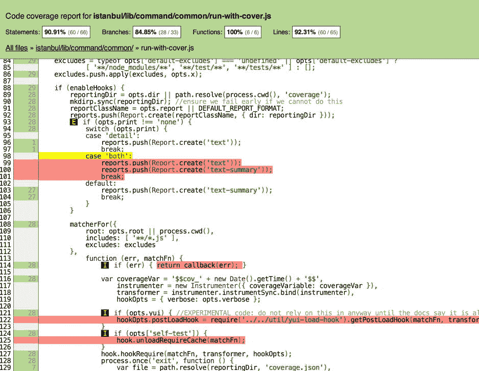
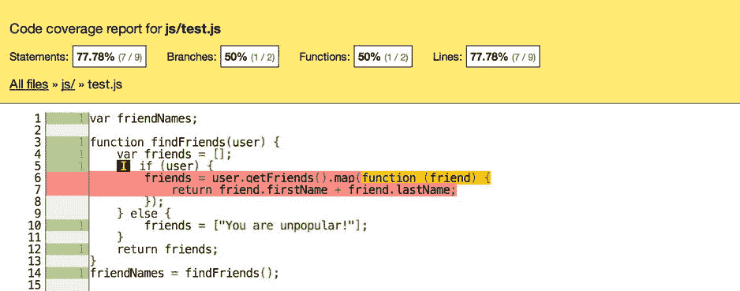
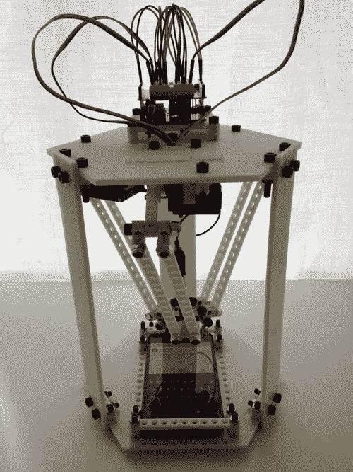

# 10.提高可测试性

Abstract

对于每一个复杂的问题，都有一个简单、简洁而错误的解决方案。

门肯

每一个复杂的问题都有一个简单、简洁而错误的解决方案。—H. L .门肯

在一本书里完全涵盖 JavaScript 测试可能是不可能的，更不用说一章了。如果做得正确，测试应该是一个全神贯注的挑战，提供了一个令人信服的创造性和技术障碍的组合来克服。计算机科学中许多最聪明的头脑已经致力于工具、方法和模式的创造，这些工具、方法和模式使测试人员能够提高他们所负责的程序的质量和可靠性。因此，将测试排除在本书之外至少是对读者的一种伤害，并且可能会从整体上降低测试 JavaScript 的重要性。

鉴于测试是一本书大小的主题，我将本章的范围浓缩为提高 JavaScript 的可测试性。通过我的研究和作为开发人员的个人经验，我已经确定了几个通常阻止开发人员成功测试代码的因素。通常，失败是由于代码编写和评估中的各种偏见，当错误的测试目标被应用时，这些偏见就更加严重了。本章将指出开发人员在测试代码时不知不觉中陷入的各种偏见和盲点。本章的剩余部分将集中在通过重新聚焦测试来帮助减轻这些问题并提高代码质量的工具和过程上。

## 为什么测试失败了

当测试套件通过时，JavaScript 测试失败。测试的目标不是写测试，而是通过让程序失败来发现 bug。稍后我会更详细地探讨这个断言，但现在我想把这个想法放入你的头脑中。知道如何编写测试不仅仅包括这样做的技术能力。为了正确地测试一个程序，你必须有正确的心理定势，以及一个在技术资料中很少讨论的测试目标的清晰定义。尽管如此，正如 Glenford Myers 在他的书《软件测试的艺术》中所指出的，“对测试采用适当的心态似乎比纯粹的技术考虑更有助于测试的成功”(Myers，1979)。

偶尔，我会遇到一些开发人员，他们把测试推迟到他们的程序完成之后。他们没有把最好的留到最后，就好像写测试是一顿饭最后的甜点。相反，他们正在拖延他们认为是一项不幸的苦差事，只需要找到他们代码中偶尔的迟钝错误。如果你是一个有好奇心和创造力的程序员，并且编写测试不是饭后甜点，那么你很可能做错了。然而，为了完全公开，我对 JavaScript 测试的感觉已经发展到这种观点。在过去的十年中，我花了很多时间尝试热爱测试 JavaScript。

2005 年，我加入了我的第一个敏捷开发团队。我们练习了测试驱动开发(TDD)和结对编程。当时，我们主要编写 Ruby web 应用程序，它们有一个开发良好的测试生态系统。TDD 就像任何新工具一样；一旦我知道如何使用它，我就想在所有东西上试一试。然而，当我从服务器级 Ruby 代码转移到控制视图的 JavaScript 时，我的测试变得几乎不存在了。在公开场合，当谈到 TDD 和 JavaScript 测试的重要性时，我继续热情地挥舞着拳头，但是私下里，我实际上没有编写任何测试。

我记得我被其他高级开发人员中的一个人骂了一顿。在我的辩护中，我声称 JavaScript 测试是一种棘手的问题，由语言特有的问题交织在一起。我认为，这些隐含的困难会棘手地阻碍任何开发人员准确测试程序的尝试。这些复杂性使得测试 JavaScript 成为一个耗时的过程，几乎没有回报的机会。为了说明我的观点，我列举了可测试性结中的线程。

*   JavaScript 社区不像其他语言那样拥有测试代码所需的同等质量的工具。没有质量工具，编写测试是不切实际的，甚至是不可能的。
*   JavaScript 通常与用户界面有着千丝万缕的联系，用于产生必须由人类体验和评估的视觉效果。对手工评估的需求使得 JavaScript 无法以编程方式进行测试。
*   您无法像使用其他语言中的命令行调试器那样快速通过正在运行的测试。如果没有这种能力，调试 JavaScript 就是一场噩梦。
*   不断变化的主机环境(浏览器)使测试变得不切实际，因为开发人员必须为每个主机环境重复测试相同的程序逻辑。

在 2005 年，我并不是唯一一个对测试 JavaScript 的现实进行失望评估的人。然而，今天，JavaScript 已经有了一个强大而充满活力的测试社区，有了越来越多的工具和框架来寻找程序缺陷。然而，即使是经验丰富的开发人员仍然抱怨 JavaScript 很难测试。在最近的一篇博客文章中，Rebecca Murphy 要求举例说明为什么开发人员不测试他们的 JavaScript。在她发布的回复列表中，你会发现近十年前我给我同事的每一个借口都有不同的版本。但是有一个例外:不是测试工具太少，而是抱怨工具太多了！事实上，JavaScript 语言和测试工具是程序员误用和误解测试的方便替罪羊。这种误用很大程度上可以归结为使用了错误的测试定义，这反过来设定了错误的目标，并最终产生了错误的结果。

### 测试谬误

本节列举并纠正关于测试的常见误解。这些误解经常导致开发人员采用错误的测试目标，这决定了他们如何以及何时编写测试。为了充分理解这些决策最终如何影响最终产品的质量，我将解开这些谬误，并解释它们对测试实践的影响。

#### 测试证明程序中没有错误

程序测试可以用来显示缺陷的存在，但永远不能显示缺陷的不存在！艾兹格·迪科斯彻

在继续之前，简要考虑一下 Dijkstra 关于测试的引用。它打破了测试确保程序没有错误的普遍误解。这是一个谬误，因为正如 Dijkstra 指出的，它是无法证明的。更重要的是，当一个目标基于一个无法量化的指标时，这个目标就变得无法实现。从理性的角度来看，在无法达到的目标下进行测试意味着测试过程注定要失败，因为任务没有逻辑结论。因此，经理、程序员和利益相关者对测试过程充满矛盾，因为它永远不会结束。这使得测试成为事实上的资源税，随着时间的推移，各方都会对此不满。

#### 成功的测试是那些没有错误地完成的测试

Glenford Myers 详细描述了通过测试给开发团队带来的虚假的安全感。他断言，许多开发人员和管理人员以完全错误的方式衡量测试的成功，指出没有发现 bug 的测试套件是他们程序健康的标志。迈尔斯用了一个绝妙的类比来贬低这种相关性:

> Consider the analogy of a person going to see a doctor because of general malaise. If doctors have conducted some laboratory tests without positioning problems, we don't call these laboratory tests "successful"; They are unsuccessful experiments. .. the patient is still ill, and the patient now questions the doctor's ability as a diagnostician. (Miles, 1979)

很明显，为什么这个特殊的测试神话在我们的行业中如此根深蒂固。编写软件通常是高度个人化和详尽的努力。当发现错误时，很容易理解程序员会觉得错误是他们自身能力的反映。所以程序员必须抵制这种把 bug 个人化的冲动。这种对代码的个人依恋感是他们经常编写肤浅的构象测试的原因，这种测试更多的是保护脆弱的自我，而不是真正地询问程序。正如 Boris Beizer 所写:

> Programmer! Throw away your guilt! Spend half the time on happy testing and debugging! Track bugs with care, methods and reasons. Build traps for them. More cunning than those cunning bugs, enjoy the fun of innocent programming! (Baesel, Software Testing Technology, 1990)

#### 测试确保程序是高质量的

当管理人员使用测试作为对低质量软件的防御封锁时，他们可能会确保相反的结果。当测试成为程序员需要克服的障碍时，它们就变成了障碍，而不是素材。虽然识别 bug 的测试确实提供了提高程序质量的机会，但是当测试成为一种正式的质量度量时就有危险了。测试作为质量的衡量标准是有问题的，原因如下:

*   作为质量度量的测试挫伤了程序员的士气，因为他们推断他们的源代码从一开始就是低质量的。
*   它在测试和开发过程之间构建了一个无用的二分法。这也可能会加剧团队中的紧张气氛，将测试人员和开发人员分开。
*   这表明测试本身可以增加代码库的质量。
*   如果测试是质量的仲裁者，他们推断测试人员和开发人员之间的权力是不对称的，就好像开发人员代表他们的程序向测试人员恳求一样。

你不能仅仅通过测试来提高程序的质量。Beizer 再次指出了测试作为质量度量的误用，他写道:

> Programmers are responsible for software quality-the quality of their own work, including the quality of the products they work on, and the quality of interfaces between components. Quality has never been and will never be. This is not only a moral responsibility, but also a professional responsibility. (Baesel 1990)

#### 测试防止未来的错误

测试用例是程序执行环境的开发工件，它们是用来测试的。随着计划目标的发展，在早期测试中做出的假设可能不再有效。在这些情况下，测试中断是受欢迎的，因为它说明了测试套件在哪里已经与代码库分离。

在其他情况下，对程序的新修改可能会破坏仍然有效的旧测试。在这些情况下，通过之前的测试覆盖，新的 bug 会立即被发现。经理们经常使用这样的事件作为测试防止未来错误的证据。这种观点将测试视为一种程序化的免疫系统，保护应用程序免受未来未知错误的影响。

这种观点的谬误在于，它假设测试应该具有某种预测性。这导致开发人员编写多余的假设测试，这是对测试目的的打击。

#### 测试证明该程序按设计运行

许多开发方法，如 TDD，使用测试作为一种验证程序是否按设计运行的手段。从业者首先编写解释方法预期功能的测试。在 TDD 中，测试套件总是在运行，所以新的测试最初会失败，因为它验证的方法还不存在。TDD 的支柱之一是编写足够的代码来通过测试。这样做可以确保额外的和不需要的功能不会作为所谓的自由功能添加到程序中。此外，如果开发人员只是试图推断特性需要什么，那么将测试作为规范与源代码紧密耦合会限制引入的代码量。

TDD 的盲点是它会导致一些开发人员狭隘地考虑他们的测试，并且仅仅作为一种事实上的文档形式来证明函数做了它应该做的事情。“按规格测试”方法的意想不到的结果是，将编写测试来确保该方法是有效的。毕竟，规范应该是表达性的和简洁的，所以测试可能会肯定一种方法，而不是发现其局限性。以证明功能为目的的测试忽略了一个事实，即一个功能可以工作，但仍然包含 bug。没有发现任何错误的肤浅的肯定测试最终是浪费时间和精力。

对于像 TDD 这样的方法来说，要正确地工作，他们依赖于一个程序员，这个程序员可以一边写代码，一边试图破解它。也就是说，设计测试的行为与编写通过测试的代码一样重要。再次引用 Boris Biezer 的话:

> Design behavior is one of the best known error prevention measures. Thinking necessary to create a useful test can find and eliminate errors before they are coded-in fact, test design thinking can find and eliminate errors in every stage of software creation, from concept to specification, to design, coding and so on. (Baesel 1990)

单独一个人并不总是能够充分设计测试。确认偏差——我将在下一节解释——经常阻止开发人员深入思考测试。许多方法通过让开发人员一前一后地编写代码来减轻这种偏见。当一个程序员试图证明一种方法时，另一个程序员会试图寻找例外。只有当参与者在技能和等级上相对平等时，这种结对程序员才起作用；否则，两者中的较低者将倾向于服从领导。

### 确认偏差

确认偏差描述了一个人倾向于支持其世界观的信息而忽视相反证据的可能性。政治家和宗教狂热者是两个以生活在泡沫中而闻名的群体，这实际上是他们确认偏见的表现。毫不奇怪，花大量时间思考的程序员也会遭受确认偏差，尽管它的表达可能更微妙。

本节解释了软件开发过程中导致编程中确认偏差的各种因素。这些原因包括开发人员固有的认知失调，测试框架中经常未被认识到的偏见，以及测试人员在错误的地方寻找 bug 的倾向。

#### 选择性观看

当我完成这本书时，我花了几个小时写和重写段落，尽一切努力解除我早先埋下的语法和拼写地雷。在把每一章提交给我的编辑之前，我会先默读一遍，然后再大声朗读。然而，毫无疑问，当这一章被归还时，它充满了更正。我敢打赌，你们中的许多人都有过类似的经历，因为这种有选择地看东西的倾向在人类生活中相当普遍。

写软件和写书一样，应该是作者手艺的个人表现。因此，程序员和其他工匠一样，倾向于在他们的工作产品中看到自己的影子。程序员倾向于对自己的能力持乐观态度，进而对他们编写的软件持乐观态度。程序员和他们的工作之间的这种亲密关系会阻止他们诚实地评估它。他们倾向于有选择地从他们打算运行的参考框架中看到他们的功能，而不是他们实际实现的。

#### 知识的诅咒

知识的诅咒有时被描述为不能敲钟。这个比喻提供了一个令人愉快的视觉效果:声波永远向外传播到太空中。显而易见，声波一旦在空气中荡漾，就无法被吸回钟口。在编程中，知识的诅咒是程序员不能从一个不太了解的用户的角度考虑他们的软件。

你可能认为对一个程序的深入理解会给开发人员提供围绕它编写健壮测试的能力。然而，在现实中，这些测试不太可能发现函数中隐藏的边缘情况，因为程序员无法从他们的方法中获得足够的临界距离。知识的诅咒增加了缺陷密度，缺陷密度是 bug 挤在一起的可能性。这些错误被一个关于应用程序如何工作的错误假设从程序员的角度屏蔽了。

#### 如果一开始你成功了

假设您是一名开发人员，任务是对一个具有大量测试覆盖的应用程序中的现有功能进行微小的更改。在做出改变并运行测试之后，你会因为它们都通过了而感到欣慰。你觉得代码仍然是健康的，这是可以理解的，尤其是当一个大规模的测试套件重申了这一信念。然而，这被称为“无错误谬误”,意思是仅仅因为你的测试没有发现任何错误并不意味着没有错误可找。为了确保您的更改实际上是安全的，您必须将您的更改与测试的意图进行交叉引用。所写的测试是为了覆盖你的变化，还是因为不相关的原因而继续通过？对抗这种偏见时，我遵循的座右铭是:如果你第一次成功，尝试，再尝试。

#### 农药悖论

Boris Beizer 的软件测试第一定律陈述如下:

> "Every method you use to prevent or find mistakes will leave more subtle mistakes that are ineffective." (Baesel 1990)

杀虫剂悖论解释了过去的测试会发现未来错误的谬论。事实上，这些测试想要捕捉的错误已经被捕捉到了。这并不是说这些测试没有回归测试的价值，回归测试可以确保这些已知的错误不会再次出现。然而，你不应该期望通过在旧的地方寻找测试来发现新的错误。

#### 缺陷簇

在现实世界中，bug 并不是均匀分布在整个场景中的。相反，他们挤在角落里，冰箱下面，以及其他难以触及的地方。冒险进入太空的虫子很容易被鞋子碰到并被压扁。在软件中，这被称为帕累托原则，该原则指出，几乎 80%的结果来自 20%的原因。 [3](#Fn3) 简单来说，bug 就是其他 bug 在的地方。

Bug 集群经常是由于开发人员成为他们自己的知识诅咒的牺牲品而出现的。然而，一旦程序员识别出这种偏差，群集就可以指导程序员在哪里应用未来的努力。例如，如果相同数量的测试在一个模块中发现了六个错误，而在另一个模块中只发现了一个，那么您很可能会在前者中发现更多的错误。这是因为 bug 集群可以向程序员揭示关于他们程序的关键误解。

#### 框架偏差

测试自动化框架是为了捕捉软件缺陷而有计划地运行测试用例的软件工具。这些框架通过使测试运行更容易来降低维护成本。通常，这些框架成为开发工作流程链中的一个环节，它允许测试在最大化其有效性的环境中运行。测试框架是现代开发生活的重要组成部分，应该尽可能地被接受。

然而，测试框架不是在真空中创建的；他们受到创造者认为正确的关于测试的一套假设和哲学的影响。就像任何通过隐喻联系起来的过程一样，测试框架有可能使一项任务变得更简单，而使另一项任务变得更困难。这是因为隐喻允许你把对一个主题的理解移植到对陌生事物的理解中。然而，隐喻所提供的启示并不总是与它要解释的主题完全重叠。

例如，浏览器供应商最初用一本书的比喻来解释互连服务器的网络，这对于非技术人员来说很难概念化。被告知浏览器是阅读互联书籍的工具，新用户可以利用他们现有的关于书籍如何工作的知识。阅读网页和在浏览器中放置书签变得很自然。不幸的是，书的比喻掩盖了访问网络的许多更有趣的潜力，例如不要将数据视为一系列不同的页面，而是视为一个持续流动的信息流，用户将其捕获到池中使用，然后发布。

当程序员将他们的测试范围限制在框架的能力之内时，就会出现框架偏差。例如，许多应用程序依赖远程 API 提供的数据。然而，在测试过程中对 API 进行实时调用是不可接受的，因为这会降低测试运行程序的速度，并对实时 API 进行不必要的调用。相反，许多框架提供了模拟或剔除 API 集成的机制，从而允许测试接受与被测试的上下文相关的固定答案。如果您的测试框架没有为测试编写人员提供这些功能，他们必须通过重载函数来缩短生产代码以使测试工作，或者(更糟糕的是)避免一起测试这些特性。

#### 减轻确认偏差

上一节详细介绍了无意偏差渗入测试实践的各种方式。这些偏见中的大多数会导致开发人员忽视或忽略他们可能会捕捉到的潜在错误。本节描述了纠正措施，这些措施有助于减轻测试中的确认偏差。

##### 测试失败

许多偏见的根源在于这样一个事实，即程序员将失败的测试视为他们自己无知的标志，而不是他们追踪缺陷的坚韧的证明。测试的目标是让程序失败。运行时没有引发异常的测试套件应该被视为资源浪费，就像不能诊断问题的机械师的旅行被视为浪费金钱一样。

##### 获得临界距离

当开发人员失去了对他们测试的代码进行批判的能力时，就会出现确认偏差。这在测试自己代码的开发人员中尤其明显。让一个独立的团体编写测试，或者开发一系列概念性的提示或程序性的步骤来帮助构建测试环境，对于保持临界距离是有帮助的。

##### 找到边缘

测试通常是探索未知，验证假设，然后使用这些发现来重新调整你对程序如何工作的心理模型。为了找到边缘案例，开发人员需要抵制有选择地查看他们认为代码在做什么的倾向。找到一个函数的边界情况的一个方法是列举你对这个方法的假设，然后分别测试它们。这种系统化的方法可以迫使开发人员在更全面的环境中考虑这些功能。这种方法有助于减轻掩盖功能细节的倾向，因为这些细节已经变得太熟悉而不能进行批判性的考虑。第二种选择是实现特定类型的测试，这些测试旨在以开发人员可能不希望的方式使用该函数。模糊测试——您将在后面详细讨论——是一种找到程序边缘的方法。

## 寻找基线

测试套件在覆盖所有重要部分的能力方面被认为是床罩。当通过应用程序的所有路径都被至少一个测试覆盖时，程序被认为是测试良好的。具有足够测试覆盖率的程序被认为不太可能包含错误，因此经常被用作程序质量的衡量标准。开发人员维护足够的测试覆盖率的能力是累积测试实践中的一个重要因素。

然而，测试写作中的几个倾向会导致覆盖率降低。当测试没有与应用程序代码并行编写时，它们可能会失去同步。随着大量开发下的程序的发展，测试可能会落后。此外，很难一眼看出测试是否真正覆盖了程序中的所有不同路径。对一个快速发展的应用程序的整体测试覆盖率进行精确的度量有点像在某人跑步的时候测量他的身高。

幸运的是，测试覆盖率可以通过使用代码覆盖工具来自动计算。这些工具库可以与测试运行程序进程一起运行。当测试运行时，覆盖率工具会跟踪程序源代码的哪些部分在测试执行时被调用。

在测试套件完成之后，覆盖工具可以生成一个报告供程序员查看。许多最强大的覆盖报告是交互式的和高度可视化的。它们允许读者衡量整个应用程序的整体覆盖范围，或者深入到特定的源文件。在文件级别，报告通常会进行注释和颜色编码，以反映代码覆盖率的各个方面。图 [10-1](#Fig1) 显示了伊斯坦布尔覆盖工具的截图，我将在本章的后面演示。这个视图代表一个单一文件的覆盖率报告。较黑的线条代表文件中没有被测试触发的区域。

图 10-1。

The Istanbul coverage tool in action

本节将讨论这些工具用来测量测试覆盖率的几种常见的覆盖率算法。一旦您有了理解代码覆盖率计算如何工作的基线，我将演示如何在您自己的 JavaScript 应用程序中使用它。最后，为了与本章的主题保持一致，我还将讨论这些工具可能引入的意想不到的偏见。

### 报表覆盖范围

语句覆盖是代码覆盖最直接的形式。它只是记录语句执行的时间。考虑下面的例子，其中测试在`user`为`undefined`的上下文中运行。在本例中，加粗的语句表示使用语句覆盖率计算的行数。

`var friendNames;`

`function findFriends(user) {`

`var friends = [];`

`if (user) {`

`friends = user.getFriends().map(function (friend) {`

`return friend.firstName + " " + friend.lastName;`

`});`

`} else {`

`friends = ["You are unpopular!"];`

`}`

`return friends;`

`}`

`friendNames = findFriends();`

### 功能覆盖

代码覆盖的另一个基本形式是函数覆盖，它决定任何测试是否至少调用一次函数。函数覆盖并不跟踪测试如何摆弄函数的内部结构；它只是关心函数是否被调用。这个度量标准的一个派生叫做`function call coverage`，它计算测试调用的函数的总百分比。要使用函数调用覆盖率达到 100%的分数，每个函数必须至少调用一次。继续前面的例子，您可以看到代码的哪些部分将被函数覆盖:

`var friendNames;`

`function findFriends(user) {`

`var friends = [];`

`if (user) {`

`friends = user.getFriends().map(function (friend) {`

`return friend.firstName + " " + friend.lastName;`

`});`

`} else {`

`friends = ["You are unpopular!"];`

`}`

`return friends;`

`}`

`friendNames = findFriends();`

### 分支覆盖

为了有足够的分支覆盖率，测试中必须覆盖通过一个函数的每一条路径。在我的代码示例中，只有`else`分支会被覆盖。这意味着至少应该添加一个其他的测试来获得这个功能的完整的分支覆盖。分支覆盖对于突出可能未被测试的边缘案例非常有用。下面的代码演示了分支覆盖率指标将计算的内容:

`var friendNames;`

`function findFriends(user) {`

`var friends = [];`

`if (user) {`

`friends = user.getFriends().map(function (friend) {`

`return friend.firstName + " " + friend.lastName;`

`});`

`}` `else {`

`friends = ["You are unpopular!"];`

`}`

`return friends;`

`}`

`friendNames = findFriends();`

### 伊斯坦布尔

使用上一节中的覆盖率度量，很明显可以将它们结合起来为一个程序创建一个总的覆盖率分数。在测试运行过程中，这些指标的编组是代码覆盖工具的工作。在这一节中，我将介绍伊斯坦布尔， [4](#Fn4) 这是克里希南·阿南瑟瓦兰创造的一个覆盖工具。伊斯坦布尔是用 JavaScript 为 JavaScript 写的。因此，与许多其他覆盖工具不同，伊斯坦布尔被设计为在 JavaScript 可以运行的任何地方运行，因此支持基于浏览器的执行和命令行工具。根据文档，伊斯坦布尔的设计考虑了以下使用案例:

*   为了提供`nodejs`单元测试的透明覆盖
*   为了适应`npm`测试脚本的使用，以允许有条件的覆盖
*   允许批量检测测试，这对浏览器测试很有用
*   支持与自定义 Node.js 中间件的集成，该中间件支持服务器端的代码覆盖

#### 安装伊斯坦布尔

伊斯坦布尔需要 Node.js 才能运行，可以像这样作为`npm`包安装:

`npm install -g istanbul`

在下一节中，我将演示伊斯坦布尔的`cover`命令，这只是伊斯坦布尔提供的几个有用工具中的一个。

##### 涉及

命令为任意文件生成一个覆盖对象和报告。coverage 对象不仅是程序的单个元素(即函数和语句)的 JSON 表示，也是描述执行路径的分支图。伊斯坦布尔使用 coverage 对象作为它创建的可视报告的输入。例如，您可以像这样通过`cover`命令运行`findFriend`程序:

`istanbul cover find-friend.js`

此时，伊斯坦布尔不仅会生成`coverage`对象，还会将一些有用的概述统计数据打印到终端窗口:

`=============================================================================`

`Writing coverage object [/Users/heavysixer/Desktop/js/coverage/coverage.json]`

`Writing coverage reports at [/Users/heavysixer/Desktop/js/coverage]`

`=============================================================================`

`=============================== Coverage summary ===============================`

`Statements : 77.78% ( 7/9 )`

`Branches : 50% ( 1/2 )`

`Functions : 50% ( 1/2 )`

`Lines : 77.78% ( 7/9 )`

`================================================================================`

请注意，这个覆盖率总结与您之前可以确认的内容相一致——通过手动逐步执行各种覆盖率度量标准。因为用户变量是`undefined`，所以从来没有执行过`findFriends`函数。这种未开发的路径解释了为什么您在分支和功能上都只有 50%的覆盖率，以及为什么超过 20%的代码没有运行。

为了更清楚地可视化测试覆盖率，打开伊斯坦布尔创建的覆盖率报告。它应该位于相对于测试文件的 coverage 文件夹中。首先，在浏览器中打开索引文件；根据您的系统，您可能能够像这样打开和查看文件:

`open coverage/lcov-report/index.html`

打开后，进入`js`文件夹，查看相关文件的覆盖报告。从这个屏幕上(见图 [10-2](#Fig2) ，应该很清楚哪些行没有被执行。

图 10-2。

Istanbul coverage report for a single file Note

图 [10-2](#Fig2) 中被黑框包围的“I”是伊斯坦布尔用来描述缺乏保险原因的术语的一部分。在这种情况下，I 代表未被采用的分支。

### 覆盖偏差

像伊斯坦布尔这样的代码覆盖工具对于快速和可视化地探索一个程序的覆盖是非常棒的。他们使观众不费吹灰之力就能发现测试中的不足。然而，覆盖工具有它们自己的偏见，你应该知道。执行一行代码与测试一行代码有很大的不同。代码覆盖率度量会给人一种 100%覆盖率等同于 100%测试的虚假安全感。为了不陷入这种偏见，开发人员应该使用覆盖工具来发现测试覆盖的缺失，而不是作为证明它的一种方式。

## 偏差破坏测试

程序的可测试性很大程度上取决于开发人员克服各种偏见的能力，否则这些偏见可能会阻止应用程序得到充分的测试。正如我所讨论的，这些偏见可能包括心理障碍，如知识诅咒或选择性观看，这阻止了测试人员客观地思考测试。或者，开发人员可能在对抗另一个工具中隐含的偏见；例如，一个测试框架支持一种类型的测试，同时阻碍另一种类型的测试。本节提供了三个偏差消除测试，您可以使用它们来增强您的测试方法。

### 模糊测试

正如我之前详述的，当开发人员不能客观地思考他们自己的代码时，测试偏差经常发生。在这些情况下，程序员可能不再编写测试来使代码失败，而是编写测试来证明功能按设计运行。为了减少这种偏见，开发人员从不测试他们自己的代码。然而，这并不总是可能的，甚至不是所期望的。另一种方法是使用测试实践，强制程序以意想不到的方式使用。

模糊测试(Fuzz testing)， [5](#Fn5) 或 fuzzing，是一种软件分析技术，它试图通过向应用程序提供意外的、无效的或随机的输入，然后评估其行为，来自动发现缺陷。巴顿·米勒创造了“模糊”一词。当被问及这个名字的由来时，他说这个[T5 6T7:](#Fn6)

> [The original work was inspired by logging into a modem in a storm with a lot of line noise. The line noise produced garbage characters, which seemed to cause the program to crash. Noise is reminiscent of the word "fuzzy".](#Fn6)

模糊化对于黑盒测试特别有用，黑盒测试的目标是发现程序的功能边界。模糊化也被黑帽和白帽安全专家广泛用作挖掘系统漏洞的工具。

模糊测试的两种最常见的形式是基于突变的和基于生成的。基于突变的模糊器对其数据的格式或结构知之甚少。他们盲目地修改他们的数据，仅仅在异常发生时记录下来。由于这个原因，这些模糊器通常被称为(哑模糊器。)基于生成的模糊器理解它们的数据格式的语义，因此在那些约束内创建它们的输入。在预定义的规则空间内操作通常意味着它们的结果会更精确。然而，正如你所料，制作一个基于世代的模糊器比基于突变的模糊器需要更多的时间。

JavaScript fuzz tester 的目标是强制主机环境在运行时执行或至少编译模糊的输入。为了实现这一目标，模糊器必须遵守语言的句法规则。否则，解释器将无法执行代码，这与发现错误是不同的。jsfunfuzzer(由杰西·鲁德曼 [7](#Fn7) 编写)是最著名的 JavaScript fuzzers 之一。Jsfunfuzz 被证明在寻找漏洞方面有点太有效了，并且不再公开提供。在针对火狐浏览器的最初模糊测试活动中，jsfunfuzz 在火狐 JavaScript 引擎中发现了 280 个错误 [8](#Fn8) 。从那以后，它已经找到了 1000 多个漏洞。想一想。这个测试工具在 JavaScript 解释器中发现了数百个错误，解释器的开发是由语言的创造者管理的！鲁德曼推测为什么 jsfunfuzz 能找到这么多 bug:

*   它知道 JavaScript 语言的规则，这使得它能够很好地覆盖语言特性的组合。
*   它打破了规则，允许它在语法错误处理中找到错误，如 bug 350415，并且更普遍地帮助 fuzzer 避免出现“盲点”。
*   它不怕以相当复杂的方式嵌套 JavaScript 结构，比如当它发现 bug 353079 时。
*   它允许通过在循环中创建和运行函数来累积状态。(请参见 bug 361346，它是一个很难找到的 bug 的例子。)
*   它测试正确性，而不仅仅是崩溃和断言。

自从 jsfunfuzz 发布以来，出现了其他著名的模糊工具，如 LangFuzz 和 Crossfuzz。 [9](#Fn9) Crossfuzz 甚至可以直接在浏览器中运行，这大大方便了使用。许多模糊器不仅触发异常，还能够将导致失败的步骤转录到生成的测试中。例如，以下测试 [10](#Fn10) 由 LangFuzz 生成，以在 Google V8 JavaScript 引擎中产生断言失败:

`var loop_count = 5;`

`function innerArrayLiteral(n) {`

`var a = new Array(n);`

`for (var i = 0; i < n; i++) {`

`a[i] = void ! delete 'object' % ∼ delete 4;`

`}`

`}`

`function testConstructOfSizeSize(n) {`

`var str = innerArrayLiteral(n);`

`}`

`for (var i = 0; i < loop_count; i++) {`

`for (var j = 1000; j < 12000; j += 1000) {`

`testConstructOfSizeSize(j);`

`}`

`}`

然而，尽管这些模糊器在寻找程序中的安全漏洞和盲点方面非常强大和有效，但它们有几个缺点:

*   基于突变的模糊器可以永远运行。因此，很难选择一个持续时间，给你一个有意义的机会在不消耗太多时间的情况下找到 bug。
*   大多数 JavaScript fuzzers 主要针对主机环境，如浏览器和 JavaScript 引擎；将模糊引向独立 JavaScript 程序的选择有限。
*   模糊器可以通过一个共同的故障点找到数百个相关的 bug，这意味着得到数百个有不必要重叠的测试。因此，在将生成的测试添加到永久测试套件之前，每个缺陷都必须被单独考虑，并放在整个 bug 集合的上下文中。
*   模糊器不仅能发现程序中的错误，还能发现底层语言中的错误。因此，很难区分程序中的错误和 JavaScript 解释器中的错误。

尽管模糊化 JavaScript 应用程序确实会让程序员对他们根除 bug 的能力大吃一惊，但很难让他们直接关注您的应用程序。然而，有一些“fuzzeresque”工具可以以意想不到的方式扭曲应用程序，并且只关注程序，在下一节介绍 JSCheck 时，您将会看到这一点。

### JSCheck

JSCheck [11](#Fn11) 是由道格拉斯·克洛克福特编写的测试工具，灵感来自 QuickCheck。在模糊化部分，我解释了基于生成的模糊化器使用约束和规则空间来限制它们产生的随机数据的类型。JSCheck 以类似的方式工作，但是调用这些约束规范。它使用规范来验证关于程序的声明。由于这个原因，JSCheck 被认为是一个规范驱动的测试工具。JSCheck 通过处理关于程序的声明来生成测试，试图根除边缘情况和异常。就像模糊测试一样，这种方法的优势在于打破了程序员对他们程序的偏见。为了更好地理解 JSCheck 是如何工作的，我将带您看一个基本的例子。

#### 安装 JSCheck

不幸的是，JSCheck 不能通过任何您喜欢的包或依赖项管理器获得，所以您必须从 git repo:

[T2`https://github.com/douglascrockford/JSCheck/archive/master.zip`](https://github.com/douglascrockford/JSCheck/archive/master.zip)

#### 基本示例

我将使用 Node.js 来运行测试，所以如果您想继续的话，请确保您已经安装了它。首先，我需要一个函数来测试。将以下代码另存为`flip-test.js`:

`function flipSign(val) {`

`return ∼(val - 1);`

`}`

这个函数的目的是取任意一个数字并相应地翻转符号。我现在的目标是使用 Node.js 用 JSCheck 对此进行严格的测试。为了将 JSCheck 包含到测试中，我需要求助于一些`eval`诡计，因为它不能作为 Node.js 模块导出。(当然，除了在示例中瞎搞之外，不建议做任何其他事情。)如果您想将 JSCheck 作为集成测试工作流的一部分，您必须首先为它创建一个合适的导出工具。`flip-test.js`文件现在应该看起来像这样:

`eval(require('fs').readFileSync('./jscheck.js', 'utf8'));`

`function flipSign(val) {`

`return ∼(val - 1);`

`}`

Note

请确保 JSCheck 的路径是正确的。如果您直接下载了 zip 文件，`jscheck.js`可能会嵌套在另一个文件夹中。

测试文件中包含了 JSCheck，并且编写了`flipSign`函数，我已经准备好对该功能做一些声明，JSCheck 将会验证这些声明。

#### 提出索赔

声明由三个必需属性和第四个可选属性组成。

##### 名字

JSCheck 总是期望第一个参数是`name`。JSCheck 报告功能使用它来简要解释索赔的上下文。

##### 述语

所有的声明都需要一个`predicate`参数，它指定了一个能够返回布尔值的函数，这取决于声明是否能够被证实。在这种情况下，您需要确保符号被翻转，这样函数看起来就像这样:

`function predicate(verdict, value) {`

`return verdict(value === flipSign(flipSign(value)));`

`}`

`predicate()`方法至少有两个参数。第一个参数总是`verdict`函数，JSCheck 使用它来报告比较的结果。`verdict`功能非常健壮，旨在支持需要网络事务或异步请求的功能。其余的参数是 JSCheck 根据您在签名数组中配置的说明符为您生成的值。

##### 签名

签名是描述参数范围的说明符数组，可以提供给`predicate`函数。JSCheck 提供了一系列说明符模板，可用于约束随机值。例如，`JSC.integer(0,10)`会生成一个 0 到 10 之间的整数。其他说明符可能相当复杂。`object`说明符接受一个对象作为模板，它反过来利用其他说明符:

`JSC.object({`

`left: JSC.integer(640)`，

`top: JSC.integer(480)`，

`color: JSC.one_of(['black', 'white', 'red', 'blue', 'green', 'gray'])`

`})`

在您的程序中，您只需要一个数字，因此签名数组可能是这样的:

`[JSC.integer(-10, 10)]`

##### 分类者

`classifier`是唯一可选的参数，根据 JSCheck 文档，它有两个主要用途:

*   它可以检查参数并返回一个对案例进行分类的字符串。该字符串是描述性的。该报告可以包括显示属于每个分类的案例数量的摘要。它可以用来识别琐碎的或有问题的类，或者帮助分析结果。
*   因为案例是随机生成的，所以有些案例可能没有意义或没有用。分类器可以通过返回`false`拒绝案例。JSCheck 将尝试生成另一个案例来替换它。建议分类器拒绝少于 90%的情况。如果你接受的潜在案例少于 10 %,你也许应该重新阐述你的主张。

因为你的函数很琐碎，所以 JSCheck 提供的几乎任何值都是可用的；因此，测试不需要分类器。

#### 核实索赔

现在我有了一个`predicate`和一个合适的签名数组，我准备像这样连接 JSCheck 测试:

`eval(require('fs').readFileSync('./jscheck.js', 'utf8'));`

`function flipSign(val) {`

`return ∼ (val - 1);`

`}`

`function predicate(verdict, value) {`

`return verdict(value === flipSign(flipSign(value)));`

`}`

`JSC.on_report(function(str) {`

`console.log(str);`

`});`

`JSC.test("flips integers", predicate, [JSC.integer(-10, 10)]);`

注意，我为`JSC`变量提供了一点配置。现在，每当 JSCheck `b`对`on_report`事件进行广播时，结果都会被写入控制台。配置完成后，脚本调用`test`函数，并为其提供各种所需的属性。将更改保存到文件，然后从命令行以如下方式运行它:

`node flip-test.js`

该命令完成后，JSCheck 会将套件的结果输出到终端窗口:

`flips integers: 100 cases tested, 100 pass`

`Total pass 100`

优秀；不出差错，正如我所料！不过，为了确保安全，我将添加另一个测试，除了整数之外，它还使用了数字说明符。这将允许我测试浮点数。测试文件现在应该如下所示:

`eval(require('fs').readFileSync('./jscheck.js', 'utf8'));`

`function flipSign(val) {`

`return ∼ (val - 1);`

`}`

`JSC.on_report(function(str) {`

`console.log(str);`

`});`

`function predicate(verdict, value) {`

`return verdict(value === flipSign(flipSign(value)));`

`}`

`JSC.test("flips integers", predicate, [JSC.integer(-10, 10)]);`

`JSC.test("flips numbers", predicate, [JSC.number(-10,10)]);`

我将再次从命令行对这个文件运行 JSCheck。然而，这次我遇到了一些意想不到的失败:

`node flip-test.js`

`flips integers: 100 cases tested, 100 pass`

`Total pass 100`

`flips numbers: 100 cases tested, 0 pass, 100 fail`

`FAIL [1] (-4.945855345577002)`

`FAIL [2] (0.6835379591211677)`

`...`

`FAIL [100] (0.6536271329969168)`

更仔细地看一下`flipSign`函数，它在浮点数上失败的原因就清楚了。虽然按位`NOT`运算符像我希望的那样反转操作数的位，但它也将结果转换为整数。这种副作用正是 JSCheck 擅长发现的错误类型，因为它发生在我对该函数的心理模型之外。现在我已经确定了函数中的盲点，我可以这样重写它:

`function flipSign(val) {`

`return val * -1;`

`}`

再次运行测试，我可以看到修改达到了预期的效果，我的函数现在可以很好地处理浮点数和整数了:

`node flip-test.js`

`flips integers: 100 cases tested, 100 pass`

`Total pass 100`

`flips numbers: 100 cases tested, 100 pass`

`Total pass 100`

### 自动化测试

许多工业制造商使用机器人作为产品测试的一个组成部分。如果你走进任何一家宜家商场，你都有可能看到他们的机器人在展示。在一个巨大的玻璃盒子里，机器人将重复地、有条不紊地把它的模拟屁股坐在一把椅子上。宜家希望其消费者将机器人的严格重新安置与宜家自己彻底测试其产品的尝试联系起来。

在自动化软件测试领域，大多数用户交互都是使用 PhantomJS 之类的无头浏览器或 Selenium 之类的浏览器插件模拟的。这些工具被编写成像人一样与应用程序交互。然而，他们假设用户使用鼠标和键盘通过计算机进行交互，并且交互由点击和按键组成。在当今世界，这是一个过时的假设，一个节目可以在数百种不同的设备上观看，这些设备的屏幕大小、输入能力和响应能力各不相同。此外，许多设备现在支持复杂的手势；例如在屏幕上滑动手指。

我毫不怀疑，像苹果电脑这样的主要硬件和软件制造商拥有私人机器人测试人员大军，他们可以通过以脚本化和自动化的方式物理地使用他们的设备来不断地回归测试他们的产品。不幸的是，对于一般的开发团队来说，在目标设备上对其产品进行物理回归测试的唯一方法是以一种痛苦且耗时的方式进行。由于没有办法在设备上合理地测试应用程序，许多团队选择让最终用户为他们测试，当他们报告任何错误时，让他们自己去调查。显然，这不是一个理想的方法。幸运的是，即使是小团队也可以成为机器人测试革命的一部分，只要他们懂一点 JavaScript。

#### 酒吧的酒保

Jason Huggins 接受自动化测试的程度可能让许多开发人员感到敬畏。他是 Sauce Labs 的首席技术官，该公司提供各种不同的产品，允许客户将设备测试外包给他们。Huggins 的部分工作是找到从他们的测试流程中剔除手动过程的方法，同时确保测试尽可能高保真。因此，必须在使用软件模拟用户选择的速度和通过物理控制设备手动重建用户交互之间取得平衡。他可能已经找到了 Tapster 项目的最佳切入点。 [13](#Fn13) Tapster 是图 [10-3](#Fig3) 中看到的机器人，它以可脚本化和自动化的方式模拟用户的物理交互。

图 10-3。

Tapster robot

在《连线》杂志最近的一篇文章中， [14](#Fn14) 哈金斯解释了为什么他认为 Tapster 这样的项目是必不可少的:

> Future tests will be more and more difficult to replicate in laboratory or software simulator. My favorite example is Zipcar's iPhone application, which can open your car for you. To really test it, you need an iPhone and a car-not something easy to virtualize in the cloud. You can also use your mobile phone to buy coffee or control TV at Starbucks. I believe that in the future, the mobile phone will be the remote control of everything. However, with the application of the world, many new problems have emerged. Digital systems are more complex and fragile than analog systems. With complexity comes a higher risk of mistakes. The way to avoid this risk is to conduct more tests-lots of tests-faster and more "real". This is where robots appear.

驱动 Tapster 的技术都是开源的。事实上，大部分技术，包括 johnny-five、grunt 和 node-serialport，已经在前面的章节中详细介绍过了。甚至 Tapster 的实体零件都可以用你最喜欢的 3D 打印机打印出来。

Tapster 提供了一个创造性的尝试来解决测试中最普遍的问题之一，即框架偏差。正如我前面提到的，开发人员倾向于不测试程序中因测试过程而变得困难的方面。Tapster 代表了一个坚实的尝试，我认为这是一个社区开发和开源物理测试设备的新领域。当我们寻找新的方式将技术嵌入到我们的日常生活中时，我们也必须同时确保这些新的形式是经过精心设计和充分测试的。

## 摘要

知道如何编写测试不仅仅包括这样做的技术能力。要正确地测试一个程序，你必须有正确的心理定势和清晰的测试目标定义。这些目标经常被各种测试谬误所混淆，程序员可能会错误地推广这些谬误。在其他情况下，程序员自己的确认偏差可能会影响他们为自己的工作准确编写测试的能力。

幸运的是，程序员可以通过使用帮助他们对代码进行分析性思考的工具来克服这些偏见。例如，通过使用代码覆盖工具，开发人员可以快速可视化他们代码覆盖中的缺陷。此外，开发人员可以使用模糊测试或 JSCheck 以他们从未想到的方式以编程方式扭曲他们的代码。最后，程序员可以混合和匹配测试框架，以抵消一个框架可能对测试产生的任何偏见。当所有这些技术以一种深思熟虑的令人信服的方式一起使用时，你会发现你的代码的可测试性必然会提高。

Footnotes [1](#Fn1_source)

[T2`http://bob.ippoli.to/archives/2005/06/02/javascript-sucks-volume-1/`](http://bob.ippoli.to/archives/2005/06/02/javascript-sucks-volume-1/)

  [2](#Fn2_source)

[T2`http://storify.com/rmurphey/what-s-making-it-hard-to-get-started-with-js-testi`](http://storify.com/rmurphey/what-s-making-it-hard-to-get-started-with-js-testi)

  [3](#Fn3_source)

[T2`http://en.wikipedia.org/wiki/Pareto_principle#In_software`](http://en.wikipedia.org/wiki/Pareto_principle#In_software)

  [4](#Fn4_source)

[T2`http://gotwarlost.github.io/istanbul/`](http://gotwarlost.github.io/istanbul/)

  [5](#Fn5_source)

[T2`http://en.wikipedia.org/wiki/Fuzz_testing`](http://en.wikipedia.org/wiki/Fuzz_testing)

  [6](#Fn6_source)

[T2`http://resources.infosecinstitute.com/fuzzing-mutation-vs-generation/`](http://resources.infosecinstitute.com/fuzzing-mutation-vs-generation/)

  [7](#Fn7_source)

[T2`http://www.squarefree.com/2007/08/02/introducing-jsfunfuzz/`](http://www.squarefree.com/2007/08/02/introducing-jsfunfuzz/)

  [8](#Fn8_source)

[T2`https://bugzilla.mozilla.org/show_bug.cgi?id=jsfunfuzz`](https://bugzilla.mozilla.org/show_bug.cgi?id=jsfunfuzz)

  [9](#Fn9_source)

[T2`http://lcamtuf.blogspot.com/2011/01/announcing-crossfuzz-potential-0-day-in.html`](http://lcamtuf.blogspot.com/2011/01/announcing-crossfuzz-potential-0-day-in.html)

  [10](#Fn10_source)

[T2`https://www.usenix.org/system/files/conference/usenixsecurity12/sec12-final73.pdf`](https://www.usenix.org/system/files/conference/usenixsecurity12/sec12-final73.pdf)

  [11](#Fn11_source)

[T2`http://www.jscheck.org/`](http://www.jscheck.org/)

  [12](#Fn12_source)

[T2`http://en.wikipedia.org/wiki/QuickCheck`](http://en.wikipedia.org/wiki/QuickCheck)

  [13](#Fn13_source)

[T2`https://github.com/hugs/tapsterbot`](https://github.com/hugs/tapsterbot)

  [14](#Fn14_source)

[T2`http://www.wired.com/insights/2012/12/robots-at-the-intersection-of-cool-and-useful/`](http://www.wired.com/insights/2012/12/robots-at-the-intersection-of-cool-and-useful/)