# 一、开始 enchant.js 开发

enchant.js 框架由位于东京的泛在娱乐公司(UEI)秋叶原研究中心开发，最初于 2011 年 4 月发布。从那以后，它在日本相当受欢迎，并拥有越来越多来自其他国家的粉丝。enchant.js 框架是一个基于 HTML5 和 JavaScript 的游戏引擎和独立代码库，使您能够开发可以在 PC 或 Mac 或 iPhone、iPad 和 Android 设备上运行的应用。虽然使用该引擎创建的游戏应用可以在许多不同类型的设备上运行，但大多数都是为智能手机的使用而创建和优化的。

近年来，Adobe Flash 作为交互平台的衰落导致现代网页游戏开发者转向其他基于浏览器的无处不在的平台，如 HTML5 和 JavaScript，为他们的用户创建基于浏览器的体验。然而，虽然 JavaScript 最初被开发为非专业开发人员可访问的语言，但是今天在浏览器中用于游戏创作的 JavaScript 的复杂性通常需要投入大量时间来学习和有效使用。作为一个开源的游戏库，enchant.js 通过为开发人员提供游戏创作功能来降低这种复杂性，这大大减少了您编写基于浏览器的游戏的学习曲线，并提高了您的游戏开发速度。

有了这本书，你可以开始快速轻松地创建和发布游戏。如果你完全是编程初学者，也不用担心。我们将带您了解所有基础知识，以便您可以快速上手并运行。如果您处于中级水平，我们也为您提供高级内容。我们描述了 enchant.js 框架的不同部分，并创建了几个游戏，包括经典游戏，如打地鼠和街机射击游戏，同时让您熟悉 enchant.js 库提供的所有功能。

访问 enchant.js 网站

要快速开始使用 enchant.js，请看一下三个主要的 enchant.js 网站。每个网站都有特定的功能，可以帮助你更快更容易地创建和分享游戏。

*   `http://enchantjs.com`:下载 enchant.js 代码库，查找资源，阅读编程技巧
*   在基于云的在线环境中开发、编辑和测试游戏
*   `http://9leap.net`:上传、玩和分享游戏

在 enchant.js 主网站上，您可以了解该库并下载源代码来开发自己的游戏。您还可以在`code.9leap.net`上的在线环境中开发游戏，以获得流畅的体验。开发完你的游戏，就可以发布到`9leap.net`了。[图 1-1](#Fig1) 显示了站点的基本关系。

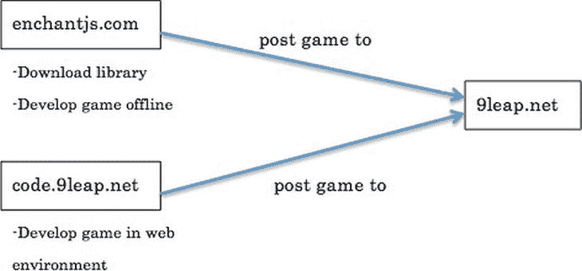

[图 1-1](#_Fig1) 。网站之间的关系

enchantjs.com

位于`http://enchantjs.com`的 enchant.js 官方网站提供了关于库、教程、技巧和资源的参考信息。该网站定期更新来自 enchant.js 开发人员的关于新版本和新特性的帖子，并且完全是日语和英语双语。该网站的默认语言是英语。如果碰巧出现了日语版本，并且您希望显示英语版本，请使用屏幕右侧的旗帜图标将语言改回英语。[图 1-2](#Fig2) 显示 enchant.js 的主页

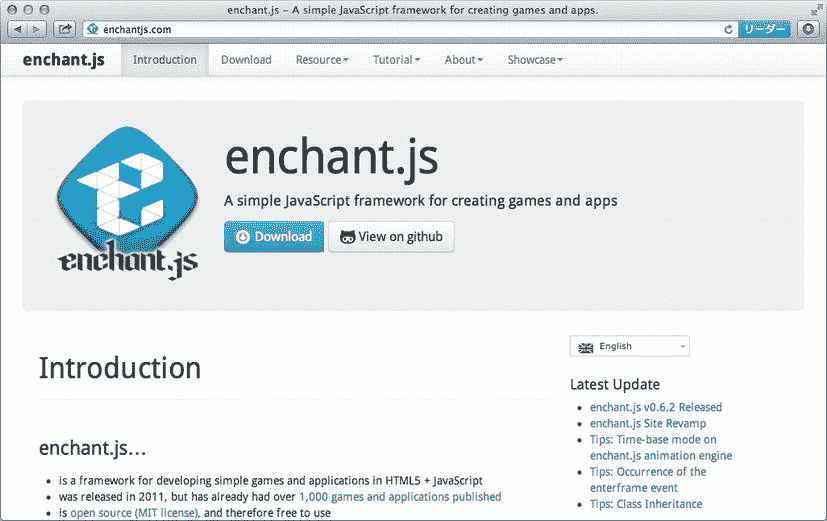

[图 1-2](#_Fig2) 。`enchantjs.com`首页

`code.9leap.net`

在`http://code.9leap.net`网站上，您可以直接在 web 浏览器中执行 HTML/JavaScript 编辑、测试和共享。`code.9leap.net`网站支持 enchant.js 的导入，也可以轻松上传到`9leap.net`，允许整个游戏开发周期，从编程到发布，都在浏览器中进行。它可以在 PC 或 Mac 上使用，也可以在 iPad 等设备上使用。

[图 1-3](#Fig3) 显示了`code.9leap.net`登录页面。在本书出版时，该网站正处于测试开发阶段。

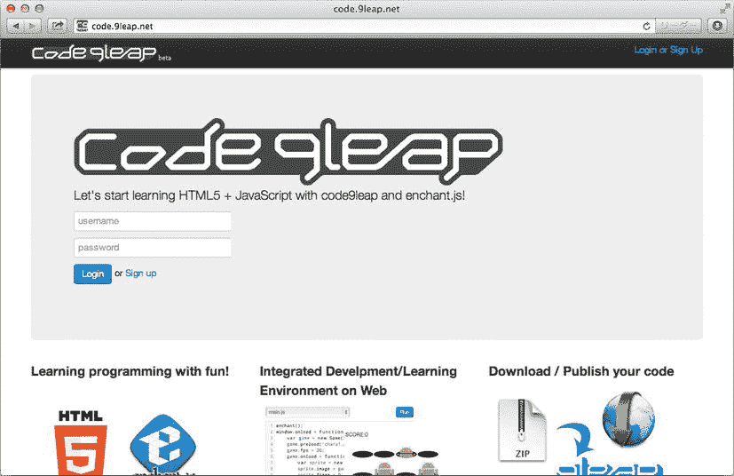

[图 1-3](#_Fig3) 。【code.9leap.net】登录页面

`9leap.net`

位于`http://global.9leap.net`的 9leap 网站由 UEI 和 D2 通信公司(`www.d2c.co.jp/en`)主办，旨在发现和提升年轻开发者。该网站允许你上传、玩和分享游戏。9leap 网站包括许多像您一样的开发人员用 enchant.js 创建的游戏。在您开始创建自己的游戏之前，尝试一下该网站上的一些游戏，感受一下 enchant.js。[图 1-4](#Fig4) 显示的是 9leap 主页。


[图 1-4](#_Fig4) 。【9leap.net T2】首页

你也可以在网站上参加游戏开发竞赛。竞赛决赛入围者赢得奖品，如最新的 PC 和 Mac 电脑、书店礼品卡等。此外，作为 9leap 项目的一部分，UEI 定期在日本举办 9leap 游戏编程训练营，并开始在美国举办训练营。通常，这些夏令营以游戏编程研讨会开始，并提供指导以帮助参与者创建他们自己的简单游戏。有关更多信息，请访问`enchantjs.com`网站。

兼容性和版本

以下浏览器和设备支持 enchant.js:

*   Internet Explorer (IE) 9.0 和更高版本
*   适用于 Mac OS X、Windows 和 Linux 的 Chrome 10 及更高版本
*   适用于 Mac OS X 和 Windows 的 Safari 5 及更高版本
*   适用于 Mac OS X 和 Windows 的 Firefox 3.6 及更高版本
*   适用于 iPhone 和 iPad 的 iOS 4 及更高版本
*   Android 2.1 及更高版本

[表 1-1](#Tab1) 显示了 enchant.js 的主要版本，在本书出版时，enchant.js 的最新版本是 0.6.2 版。

[表 1-1](#_Tab1) 。enchant.js 的最新版本和新增功能

| 版本 | 添加的功能 |
| --- | --- |
| 0.6.2(当前) | 

*   Do better on Android
*   Improved key binding.

 |
| 0.6.1 | 

*   改良网络音频
*   Improved timeline

 |
| 0.6.0 | 

*   web 音频 API
*   唐/坎瓦斯科
*   Animation engine
*   Core class

 |
| 0.5.2 |  |
| 0.5.1 | 

*   [bug fix]

 |
| 0.5.0 | 

*   Sound support on iPhone
*   Support rotation & scaling attribute
*   Support canvas
*   经过时间支持

 |

 **注**从 0.6.1 版本开始，enchant.js 在 MIT 许可下授权。联系 Ubiquitous Entertainment ( `http://global.uei.co.jp/`)咨询有关公司使用 enchant.js 代码的问题。

enchant.js 的特性

enchant.js 旨在使游戏编程更简单，它提供了几个功能，使开发人员(无论是专家还是新手)更容易创建游戏。该库的主要特点是它的面向对象的方法，它处理游戏代码的特定方式，它通过插件的可扩展性，以及它的内容库。

面向对象编程

面向对象编程(OOP) 是一种强调被操作对象而不是操作过程的方法论。为了说明这个概念，enchant.js 中可以在屏幕上显示的每个图形都是一个对象。屏幕上实际可见的是另一个对象的一部分，称为显示对象树。通过发出将图形对象加入显示对象树的命令，图形对象在屏幕上变得可见。

[列表 1-1](#list1) 显示了一个玩家对象和一个敌方角色对象通过在显示对象树中注册而被创建并显示在屏幕上。现在，不要担心这段代码如何工作的细节。我们在这里提供一个代码示例，只是为了让您快速了解 OOP 的实际应用。稍后，我们将带您详细了解代码示例。

[***清单 1-1。***](#_list1) 使用面向对象编程创建两个对象并在屏幕上添加它们

```js
//Player object creation
var player = new Sprite(32, 32);
player.image = game.assets['player.png'];

//Enemy character object creation
var enemy = new Sprite(32, 32);
enemy.image = game.assets['enemy.png'];

//Registration in the display object tree
var scene = game.currentScene;
scene.addChild(player);
scene.addChild(enemy);
```

异步处理

异步处理是独立于主代码集运行的处理。把这当成多任务处理。如果计算机正在接收要一个接一个运行的命令行，然后在第一组命令仍在运行时开始接收运行其他命令的命令，这就是异步处理的一个例子。

enchant.js 异步处理用户或其他程序发起的操作或事件。当用户不发出任何命令时，程序只是等待而不做任何事情，而不是在后台连续运行代码。此外，当用户被迫等待一个程序完成处理时，这种异步特性使得同时发出其他命令成为可能。

[清单 1-2](#list2) 显示了指定在特定事件发生时运行的代码段。这被称为*事件处理*。在这个代码示例中，我们处理每一帧中的玩家对象，同时也处理触摸事件。具体来说，每次绘制一个帧，我们都希望运行一些代码(或者像开发人员有时说的那样“被执行”)。当玩游戏的用户点击或“触摸”角色时，我们希望执行不同的代码。我们将在第 3 章中详细介绍这一过程。

[***清单 1-2。***](#_list2) 异步处理用于创建、设置和处理一个角色

```js
//player (character) object creation
var player = new Sprite(32, 32);

//handling of the character in each frame
player.addEventListener(Event.ENTER_FRAME, function() {
    ...
});

//handling touch events
player.addEventListener(Event.TOUCH_START, function(e) {
    var x = e.localX;
    var y = e.localY;
    ...
});
```

插件扩展性

您可以通过各种插件来扩展 enchant.js 的功能，以添加更多功能。例如，一些插件允许你开发支持 D-pad 和模拟棒等设备的游戏，或者创建看起来像漫画书的互动游戏。在本书后面的章节中，我们将向您展示如何使用几个插件。

我们在这里没有提供所有 enchant.js 插件的详尽列表，因为您可以在`enchantjs.com`网站上找到该列表以及每个插件的详细信息。您可以从网站下载插件(参见 enchant.js 下载包)。

图像和声音

如果你是一个独立的游戏程序员，寻找用于角色、怪物、风景等的图像可能是一个挑战。由于 enchant.js 附带了一个免版税(用于非商业游戏)的原始游戏图像分类，以及来自以前 UEI 游戏版本的材料，您可以通过使用图像库为自己的游戏创建图像。图像包含在主 enchant.js 包中。[图 1-5](#Fig5) 展示了几个广泛可用的角色形象的例子。

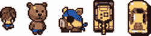

[图 1-5](#_Fig5) 。enchant.js 包中的角色图像示例

你也可以从`enchantjs.com`的下载页面下载独立于主库的 zip 文件中的声音。例如，您可以包括背景音乐、爆炸声、激光射击、枪声、当角色捡起物品时可以使用的信号等等。

JavaScript、HTML5 和 CSS

现代网站通常由三种类型的代码组合而成:JavaScript、HTML5 和层叠样式表(CSS)。通常，HTML 提供核心内容，CSS 用于样式和格式，JavaScript 用于与页面元素交互并提供动画。我们在这一章中提供了 HTML5 和 CSS 的简要总结，但这本书总体上主要关注 JavaScript，因为这是编写 enchant.js 游戏的语言。

JavaScript

JavaScript 是一种面向对象的解释型编程语言，最初的开发目的是增加网页的交互性和动态性。JavaScript 的一个例子在[清单 1-3](#list3) 中显示。你可能听说过一种叫做 Java 的编程语言，但它与 JavaScript 完全不同。JavaScript 保证可以在所有主流浏览器上运行，无需安装任何额外的软件。如果您以前从未见过 JavaScript，请不要担心！我们会在[第二章](2.html)中详细介绍。

[***清单 1-3。***](#_list3) 显示“Hello，World！”在屏幕上

```js
document.write('<p>Hello, World!</p>');
```

HTML 和 HTML5

HTML 是超文本标记语言的缩写，是一种用于描述 Web 上文本的标记语言。在 enchant.js 中，HTML 用于加载 JavaScript 并控制智能手机上的某些浏览器操作(如缩放)。清单 1-4 中显示了一个例子。如果你打开一个普通的文本文件，在其中键入来自[清单 1-4](#list4) 的代码，并将其保存为“index.html”，该文件可以通过你的浏览器打开。浏览器会显示“Hello World！这是 HTML 页面的内容部分。

[***清单 1-4。***](#_list4) HTML 示例在浏览器中显示内容

```js
<!DOCTYPE html>
<html>
    <head>
        <meta charset="utf-8">
        <meta name="viewport" content="width=device-width, user-scalable=no">
        <meta name="apple-mobile-web-app-capable" content="yes">
        <meta name="apple-mobile-web-app-status-bar-style" content="black-translucent">
        <title>HelloWorld</title>
        <style type="text/css">
            body {
                margin: 0;
            }
        </style>
    </head>
    <body>
<p>Hello World! This is the content part of an HTML page.</p>
    </body>
</html>
```

HTML5 是 HTML 几个新特性的统称。[表 1-2](#Tab2) 显示了主要特征的例子。

[表 1-2。【HTML5 的新特性](#_Tab2)

| 新的 HTML 功能 | 描述 |
| --- | --- |
| `<canvas>`元素 | 支持二维图形的绘制 |
| `<audio>`元素 | 允许声音回放 |
| `<video>`元素 | 支持视频播放 |
| 应用缓存 | 允许脱机执行应用 |
| 跨域消息传递 | 允许在域之间传输信息 |
| `XMLHttpRequest`二级 |  |
| 网络存储 | 使用客户端保存数据 |
| SQL 数据库 |  |
| 索引数据库 |  |
| Web 工作器 | 支持后台处理以改善用户体验 |
| 服务器发送事件 | 允许与服务器进行双向通信 |
| Web 套接字 |  |
| 文件 API | 允许访问本地文件 |

在 enchant.js 中，不直接使用 HTML5 函数，而是通过 enchant.js 库访问。在本书中，我们不提供 HTML 和 HTML5 的详细讨论。

半铸钢ˌ钢性铸铁(Cast Semi-Steel)

CSS 代表级联样式表，和 HTML 一起用来定义网页的外观，比如颜色、文本和大小。HTML 也可以用来指定页面的外观，但是它的正确用法是使用 CSS 来指定内容和定义内容的外观。使用 CSS 编辑动态网页尤其容易。清单 1-5 展示了如何将网页主体元素的背景改为灰色并指定字体。

[***清单 1-5。***](#_list5) 改变网页背景并指定字体

```js
body { background-color: #DDDDDD; font: 30px sans-serif; }
```

在 enchant.js 中，CSS 函数不是直接使用的，而是通过 enchant.js 库访问的。在本书中，我们不提供 CSS 的详细讨论。

制作“Hello World！”出现在屏幕上

对于我们的第一个 enchant.js 应用，我们将向您展示如何创建一个非常简单的程序来创建一个标签“Hello World！”这个练习的目的是用简单的方式向你展示 enchant.com 游戏的元素是如何组合在一起的。我们稍后会创建更复杂的游戏。

1.  去 enchantjs.com 点击下载按钮下载最新的 enchant.js 包(不是开发版)。
2.  After unzipping the file, open a text editor, copy and paste the code shown in [Listing 1-6](#list6), and save the file as “index.html” inside the folder the enchant.js package unzipped to.

    [***清单 1-6。***](#_list6) Index.html:加载 enchant.js 和主游戏代码

    ```js
    <!DOCTYPE html>
    <html>
        <head>
            <meta charset="utf-8">
            <title>HelloWorld</title>
            <script type="text/javascript" src="enchant.js"></script>
            <script type="text/javascript" src="main.js"></script>
        </head>
        <body>
        </body>
    </html>
    ```

    代码将文件指定为 HTML 文件，告诉浏览器我们使用的是 UTF-8 字符编码(enchant.js 就是用这种编码编写的)，给它一个标题“HelloWorld”，然后告诉它从一个名为“main.js”的文件加载我们的游戏代码，我们接下来将创建这个文件。

3.  Create a new file in your text editor, copy and paste the code shown in [Listing 1-7](#list7), and save the file as “main.js” inside the same folder.

    [***清单 1-7。***](#_list7) 简单的 enchant.js 应用显示“Hello World！”屏幕上的

    ```js
    enchant();
    var game;

    window.onload = function(){
           game = new Core(320, 320);
           game.onload = function(){
                   sign = new Label();
                   sign.text = "Hello World!";
                   game.rootScene.addChild(sign);
           };
           game.start();
    };
    ```

[清单 1-7](#list7) 中的代码告诉 enchant.js 用`enchant();`命令启动，创建游戏，并指定游戏屏幕的尺寸。页面完全加载后，我们指定创建名为“sign”的新标签的指令，指定文本为“Hello World！”，然后将其添加到游戏屏幕。最后，用`game.start()`，我们运行那些指令。

现在，如果你在浏览器中打开 index.html，你应该会看到“你好，世界！”显示在屏幕上。在这个例子中，唯一使用的文件是 enchant.js、index.html 和 main.js

这是一个非常基本的例子，但从中你可以看到 index.html 加载了 enchant.js，index.html 也加载了我们用 main.js 编写的游戏代码。我们的下一个例子本质上将更加图形化，并向你介绍在线编程环境，`code.9leap.net`。

创造一只滑冰熊

对于我们的第二个 enchant.js 应用，我们让一只熊在屏幕上从左向右滑动，并优化应用以在智能手机上显示。您可以找到我们在`http://code.9leap.net/codes/show/19822`创建的代码示例。

正如我们之前提到的，`code.9leap.net`为 enchant.js 中的游戏编码准备了所有必要的元素。我们在这个应用中使用了`code.9leap.net`,我们将带您完成所有必要的步骤。请注意`code.9leap.net`仍处于测试阶段，可能会与本节中的截图略有不同。

以下步骤展示了在`code.9leap.net`上创建 enchant.js 应用的整个开发过程。我们将在接下来的小节中详细介绍每个步骤。

1.  开始使用您的应用
2.  导入 enchant.js 库
3.  编辑源代码
4.  预览您的结果
5.  完成编辑您的源代码

开始使用您的应用

在`code.9leap.net`上开发游戏的第一步是创建一个账户。以下步骤向您展示了如何创建帐户。如果您已经创建了一个帐户，那么您可以跳过这一步，登录并继续创建项目。

当使用 enchant.js 编程时，我们强烈建议使用 Google Chrome 作为您的首选浏览器。虽然使用 Safari 和 Firefox 也有不错的结果，但我们不能保证 Internet Explorer 在与 enchant.js 库或与 enchant.js 相关的网站交互时的稳定性。

*   1.  Open `http://code.9leap.net` in your favorite browser and click the Sign up link, which is located below the username and password input areas. See [Figure 1-6](#Fig6). (If the Japanese site appears, scroll down and click Switch To English).

    

    [图 1-6](#_Fig6) 。code.9leap.net 登录屏幕

*   2.选择用户名和密码，并将其输入到相应的字段中。阅读服务条款后，选择“我同意服务条款”。完成后，点击位于输入表单下方的注册按钮。
*   3.  You will be redirected to the dashboard of your new account. An explanation of this screen follows in the next step. The next time you visit the site, you can just enter in your login information to log in.

    创建帐户或登录后，您将被重定向到仪表板，如[图 1-7](#Fig7) 所示。仪表板提供了关于您的帐户的所有必要信息。在右边你会发现你已经创建的所有项目的列表。(当然，创建新帐户后，该列表最初将为空。)在左侧，您会发现一个包含各种类别的示例项目列表。

    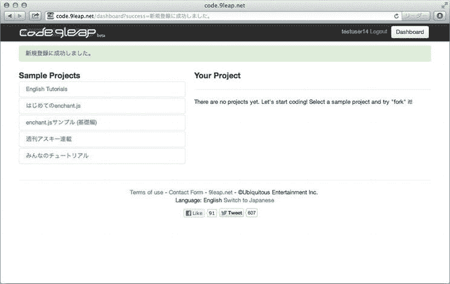

    [图 1-7](#_Fig7) 。code.9leap.net 仪表板

    要创建 enchant.js 应用，首先需要创建一个项目。项目是包含管理应用所需的所有文件的包。要开发一个应用，您需要一个项目。

*   4.  Click the English Tutorials category in the Sample Projects list, shown in [Figure 1-8](#Fig8).

    

    [图 1-8](#_Fig8) 。英语教程

*   5.  After you click a category, it will expand, displaying all projects in the category. You will see a list of Beginner projects that you can fork or view. Forking the project creates a copy in your project list. Viewing a project allows you to see the code together with a screen showing the result of the code when executed. Click Fork next to the Beginner 01 project. In the pop-up, confirm your action by clicking Fork again, as shown in [Figure 1-9](#Fig9).

    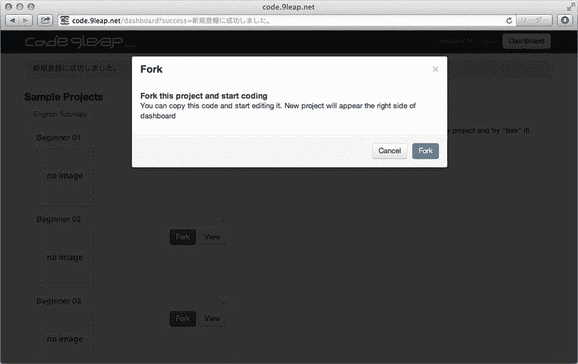

    [图 1-9](#_Fig9) 。叉子弹出

*   6.  After you click Fork for the second time, a source code editing screen is displayed with code already populated inside it. Shown in [Listing 1-8](#list8), this code displays the string “Hello,Bear” using enchant.js, similar to the way we created the “Hello World!” program in a preceding section.

    [***清单 1-8。***](#_list8) 屏幕上显示“你好，小熊”

    ```js
    enchant(); //the magic words that start enchant.js

    window.onload = function() {
        game = new Game();
        game.onload = function() {          //Prepares the game
            hello = new Label("Hello,Bear");   //Create a new label with the words "Hello,Bear"
            hello.x = 10;                   //Place the label 10 pixels to the right (0 will always be the left border)
            hello.y = 150;                  //Place the label 150 pixels from the top (0 will always be the top border)
            game.rootScene.addChild(hello); //Show the label on the active screen
        }
        game.start(); //Begin the game
    }
    ```

就像我们前面的例子一样，这段代码在屏幕上创建了一个标签。这里，我们将标签放在离屏幕中心更近的地方，并将文本指定为“Hello，Bear！”而不是“你好，世界！”这一次我们不会使用源代码，而是重写它来制作我们自己的 enchant.js 程序。[图 1-10](#Fig10) 和[表 1-3](#Tab3) 显示了代码编辑屏幕的不同区域。


[图 1-10](#_Fig10) 。源代码编辑屏幕

[表 1-3](#_Tab3) 。源代码编辑屏幕的元素

| **标题编辑区** | 你的申请的标题。 |
| **账户区域** | 注销和仪表板访问。 |
| **代码预览区** | 显示应用预览的代码区域。 |
| **提示区** | 这里将显示教程的提示或说明。 |
| **资源选择** | 一个下拉菜单，使您能够在 JavaScript (main.js)、HTML (index.html)、级联样式表(style.css)和提示(tips.json)之间切换。默认情况下，该菜单设置为 main.js。下拉菜单位于代码预览区域的正上方。 |
| **运行按钮** | 在预览区域执行源代码。 |
| **格式按钮** | 格式化源代码编辑区域中的源代码。 |
| **添加资源按钮** | 用于添加项目中使用的资源(图像、声音等)。 |
| **完成按钮** | 完成源代码编辑并返回仪表板。 |
| **源代码编辑区** | JavaScript 源代码、HTML 文件和编辑技巧。导入库时也使用。 |
| **图像区域** | 显示项目的所有本地图像。 |

接下来，您需要编辑标题(应用名称)。

*   7.在源代码编辑屏幕上的标题编辑区(直接位于右上角 code.9leap 徽标的右侧)更改标题。现在输入“HelloEnchant”。
*   8.  Change the title of the HTML file. Select index.html, which is the HTML file of the application, in the resource selection. The file will be displayed in the source code editing area, and should be prepopulated with some code. There you will find the title of the HTML file. In this case it is currently set to `<title>untitled</title>`. As shown in [Figure 1-11](#Fig11), change it to `<title>HelloEnchant</title>` for our current application.

    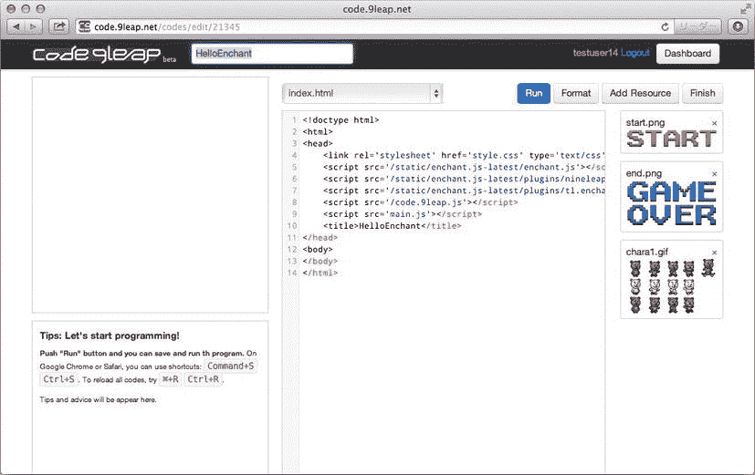

    [图 1-11](#_Fig11) 。编辑标题

导入 enchant.js 库

库是一个文件或一组文件，它允许其他程序使用特定的功能。为了构建我们的应用，我们使用 enchant.js 库。通过 HTML 文件中的脚本标签将库加载到项目中。有时库需要将图像添加到项目中，但是我们现在不需要这样做。

请记住，enchant.js 中的插件也是库，因此它们需要加载自己的脚本标签。这就是为什么您会在下面的清单中看到引用诸如 *tl.enchant.js* 等文件的行。

要添加 enchant.js 库，请执行以下操作:

1.  Remove the lines of code containing `nineleap.enchant.js` and `tl.enchant.js`. You should already be at index.html from the preceding steps. These lines of code will be inside the script tags (sections of code marked by `<script>`). These tags tell the browser that everything between `<script>` and `</script>` should be treated as a line of code. When `src=` is included in the script tag, it tells the browser to load lines of code from a file outside index.html. After removing the two lines of code, your `<script>` tags should match [Listing 1-9](#list9).

    [***清单 1-9。***](#_list9) 脚本标签加载 enchant.js，插件，游戏代码

    ```js
    <script src='/static/enchant.js-latest/enchant.js'></script>
    <script src='/code.9leap.js'></script>
    <script src='main.js'></script>
    ```

 **注意**main . js 脚本标签导入应用代码，所以这个标签始终是必需的。切勿更改或删除它。

您可以使用`code.9leap.js`库添加在`code.9leap.net`中开发 enchant.js 应用时所需的任何特性；但是，对于我们当前的应用，不要对库进行更改。`/static/enchant.js-latest/enchant.js`标签导入 enchant.js 库。当你在`code.9leap.net`中开发应用时，你可以使用`/static/enchant.js-latest/`路径引用最新发布的 enchant.js。enchant.js 插件`nineleap.enchant.js`和`tl.enchant.js`也是如此。

编辑源代码

要编辑源代码，请从资源下拉列表中选择 main.js。该屏幕应如[图 1-12](#Fig12) 所示。


[图 1-12](#_Fig12) 。编辑源代码

删除源代码编辑区域中显示的所有内容，因为您需要在此复制并粘贴一些代码。JavaScript 区分大小写，所以复制代码时要小心。接下来，执行以下步骤。

1.  Initialize the enchant.js library. This allows you to use all the classes and methods included in the library. [Listing 1-10](#list10) shows how to initialize the enchant.js library. The parentheses after the word “enchant” indicate that the previous word is a method, which runs a predefined set of code, and the semicolon at the end (;) indicates the end of a single statement of code.

    [***清单 1-10。***](#_list10) 初始化 enchant.js 库

    ```js
    enchant();
    ```

2.  On a new line under the `enchant()` method, designate code to be run after the page has loaded completely, as shown in [Listing 1-11](#list11). Assigning code to the `onload` function of an object called the `window`, which, as you may suspect, represents the window in the browser, specifies that code to be run after loading.

    [***清单 1-11。***](#_list11) 指定加载完成后运行的代码

    ```js
    window.onload = function() {
        //code to be executed
    };
    ```

3.  Create the core object by replacing “`//code to be executed`” with the code shown in [Listing 1-12](#list12). The line that begins with two forward slashes indicates that the line is a comment, and will not be processed as code. To create a game, enchant.js needs a core object to add game elements to. Typing in “Core(320,320)” creates a game screen with a width of 320 pixels and a height of 320 pixels, respectively. The format of “`new Core(320,320)`” is called a constructor, and we use constructors to create new objects.

    [***清单 1-12。***](#_list12) 创建核心对象

    ```js
    var game = new Core(320, 320);
    ```

4.  Preload the required image of a bear skating, as shown in [Listing 1-13](#list13). To use images in enchant.js, you must preload them first. The image we load for this application is shown in [Figure 1-13](#Fig13). Normally, this image must be uploaded into the code.9leap project or included in the same folder as your index.html file, but because we forked the project, this image is already in the project.

    [***清单 1-13。***](#_list13) 预载一只滑冰熊的形象

    ```js
    game.preload('chara1.gif');
    ```

    

    [图 1-13](#_Fig13) 。熊图片:chara1.gif

5.  Designate a function to be run once the game has loaded completely, as shown in [Listing 1-14](#list14). We create this in much the same way as we did with `window.onload`, and we do this because any game object we create can be created successfully only if the core object has completely loaded.

    [***清单 1-14。***](#_list14) 创建`game.onload`功能

    ```js
    game.onload = function() {
    };
    ```

6.  Create the bear sprite, as shown in [Listing 1-15](#list15). We must first create a new variable as a new `Sprite` object, with dimensions of 32 pixels wide by 32 pixels high, specify the image we preloaded to be used as the image of the bear, and then specify which part of the image we want to use. We want to use the image of the skating bear, which is the fifth image counting from the top left. Frame numbering begins with 0, so the skating bear is frame number 4 within the image. Note that this code must be typed inside the curly braces of the `game.onload` function.

    [***清单 1-15。***](#_list15) 创造熊精灵

    ```js
    var bear = new Sprite(32, 32);
    bear.image = game.assets['chara1.gif'];
    bear.frame=4;
    ```

7.  Create an event listener to move the bear by three pixels to the right every frame, as shown in [Listing 1-16](#list16). We cover event listeners in more detail later, but for now simply be aware that this code tells the program to move the bear every frame. Add it after the code you entered in [Listing 1-16](#list16), still inside the `game.onload` curly braces.

    [***清单 1-16。***](#_list16) 创建事件监听器来移动熊

    ```js
    bear.addEventListener(Event.ENTER_FRAME, function() {
        this.x += 3; //move by 3 pixels
    });
    ```

8.  Add the bear to the game’s root scene, as shown in [Listing 1-17](#list17). We’ve created the bear, but it still won’t be shown on the screen unless we add it to the game’s root, or main, scene. Enter this code after the code you entered in [Listing 1-16](#list16), still inside the `game.onload` curly braces.

    [***清单 1-17。***](#_list17) 将熊添加到游戏的根场景

    ```js
    game.rootScene.addChild(bear);
    ```

9.  Under the `game.onload` curly braces, but still inside the `window.onload` curly braces, start the game. See [Listing 1-18](#list18).

    [***清单 1-18。***](#_list18) 开始游戏

    ```js
    game.start();
    ```

10.  Check your code. Your code should match what is shown in [Listing 1-19](#list19). You can ignore the comments (lines starting with two forward slashes). If it all matches, hit the Run button in the upper-right corner, and you should see your bear skate across the screen!

    [***清单 1-19。***](#_list19) 让熊滑过屏幕

    ```js
    //initialization of enchant.js
    enchant();

    //code written here will be executed once the HTML file is completely loaded
    window.onload = function() {
        //game object creation
        var game = new Core(320, 320);

        //image loading
        game.preload('chara1.gif');

        //execution once the image has loaded completely
        game.onload = function() {
            //Sprite creation
            var bear = new Sprite(32, 32);
            bear.image = game.assets['chara1.gif'];
            bear.frame=4;

            //frame loop to move the bear every frame
            bear.addEventListener(Event.ENTER_FRAME, function() {
                this.x += 3; //move by 3 pixels
            });

            //add the bear to the display object tree
            game.rootScene.addChild(bear);
        };
        game.start();
    };
    ```

    现在让我们添加一些信息来优化智能手机上的玩家体验。

11.  Select the index.html file from the resource drop-down menu. Adjust the content of your file to match the content shown in [Listing 1-20](#list20).

    [***清单 1-20。***](#_list20) 为智能手机调整 HTML】

    ```js
    <!doctype html>
    <html>
    <head>
        <meta charset="utf-8">
        <meta name="viewport" content="width=device-width, user-scalable=no">
        <meta name="apple-mobile-web-app-capable" content="yes">
        <meta name="apple-mobile-web-app-status-bar-style" content="black-translucent">
        <style type="text/css">
            body {
                margin: 0;
            }
        </style>
        <link rel='stylesheet' href='style.css' type='text/css'>
        <script src='/static/enchant.js-latest/enchant.js'></script>
        <script src='/code.9leap.js'></script>
        <script src='main.js'></script>
        <title>HelloEnchant</title>
    </head>
    <body>
    </body>
    </html>
    ```

让我们来看看我们添加的新 HTML 标签。以下代码将字符编码设置为 UTF-8 (unicode)，这种字符编码与大多数现代语言中使用的几乎所有字符都兼容。

*   `<meta charset="utf-8">`

下面的代码禁止用户缩放(zoom)以确保游戏看起来总是正确的。

*   `<meta name="viewport" content="width=device-width, user-scalable=no">`

下面的代码将显示设置为全屏。

*   `<meta name="apple-mobile-web-app-capable" content="yes">`

下面的代码更改了状态栏的显示方式。

*   `<meta name="apple-mobile-web-app-status-bar-style" content="black-translucent">`

下面的代码将 HTML 正文边距设置为 0，以保持不同浏览器之间的外观一致。

*   `<style type="text/css"> body { margin: 0; } </style>`

我们将在本书的所有应用中使用这个 HTML 文件。除了改变我们导入的库，我们唯一改变的是标题。

预览您的结果

如[图 1-14](#Fig14) 所示，当您编辑完源代码后，点击屏幕右上角的运行按钮保存您的进度。如果你输入的源代码正确，熊应该从左向右滑。


[图 1-14](#_Fig14) 。展示预览

如果预览看起来很奇怪，请检查您的源代码以确保它匹配。特别要注意丢失的分号(；)、放错位置的句号、拼错的名字。

我们可以将字符串打印到控制台，这是一个专门为开发人员提供的特殊输出屏幕,方法是使用一种叫做 log output 的东西。它可以用来检查变量值和程序执行的方式。要在日志屏幕上打印名为`sum`的变量的值，使用[列表 1-21](#list21) 中的符号。

[***清单 1-21。***](#_list21) 显示控制台中变量的名称

```js
console.log("Total = " + sum); console.log("sum = " + sum);
```

如果您使用 Google Chrome 作为浏览器，您可以使用以下步骤来查看日志的输出。

1.  Open the console by right-clicking the part of the window running the game and select Inspect Element, shown in [Figure 1-15](#Fig15).

    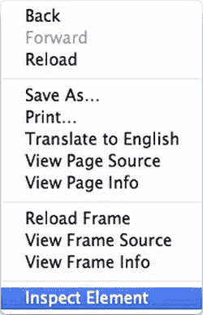

    [图 1-15](#_Fig15) 。从下拉菜单中选择检查元素

2.  将会打开“开发工具”窗口。单击控制台按钮显示控制台。如果您的应用由于 JavaScript 语法错误而无法运行，错误类型和行号将显示在控制台中。

完成源代码编辑

要完成源代码编辑，请单击源代码编辑屏幕上的 finish 按钮。您将被重定向回您的仪表板。

在设备上执行并上传到`9leap.net`

正如我们在本章开始时所说的，到目前为止，许多用 enchant.js 创作的游戏都是为在移动浏览器上玩而设计的。一旦你完成了游戏编码，我们建议你检查你的源代码，在移动设备上测试你的游戏，如果你愿意的话，在`9leap.net`上分享你的游戏。

源代码查看屏幕

点击仪表板上的项目名称，打开您自己的项目或示例项目的源代码视图，如图 1-16 所示。在那里，你可以查看和执行源代码，获得在其他设备上运行代码的 URL，创建一个标签嵌入博客，并在`9leap.net`上发布游戏。在您的仪表板上，单击 HelloEnchant 打开您刚刚创建的项目的源代码视图。在屏幕的上部，您会发现各种按钮，其功能在[表 1-4](#Tab4) 中有说明。


[图 1-16](#_Fig16) 。源代码查看屏幕

[表 1-4](#_Tab4) 。源代码查看屏幕上的按钮

| **编辑按钮** | 返回源代码编辑屏幕进行编辑。 |
| **叉形按钮** | 用这个源代码开始一个新项目。 |
| **下载按钮** | 将项目使用的源代码和资源下载到本地硬盘上。 |
| **发布到`9leap.net`** | 在`9leap.net` (beta)上分享您的应用。 |
| **嵌入按钮** | 创建一个标签，用于将应用嵌入到博客、网站等中。 |
| **删除按钮** | 删除此项目。 |

在这些按钮下面，您可以在左侧看到应用的预览，当您打开屏幕时，会自动执行该预览。源代码出现在右边。

在设备上执行

要在 iPhone、Android 或其他设备上通过`code.9leap.net`执行 enchant.js 应用，请执行以下步骤。

1.  Check the project ID by looking at the URL of the project, as shown in [Figure 1-17](#Fig17). In this case, the ID is 21345.

    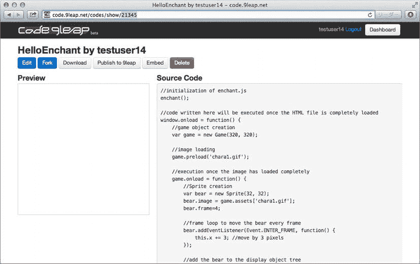

    [图 1-17](#_Fig17) 。检查项目 ID

2.  Use this ID to create a URL that can be opened on mobile devices. If the URL shown in the window is `http://code.9leap.net/codes/show/21345`, then the mobile URL will be `http://coderun.9leap.net/codes/21345`. This example is shown in [Figure 1-18](#Fig18).

    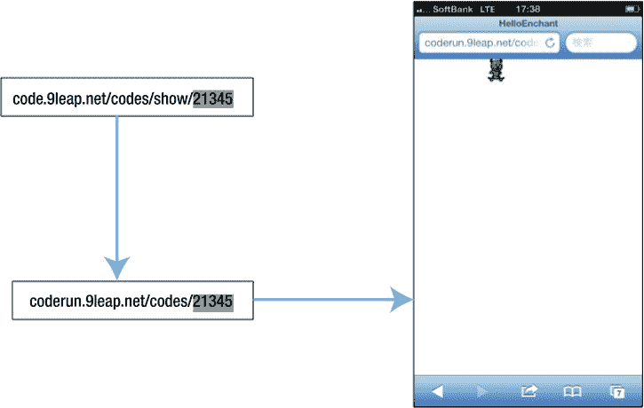

    [图 1-18](#_Fig18) 。在设备上运行代码

嵌入博客

要创建标签以将 enchant.js 应用嵌入到博客或网站中，请在源代码视图中单击“嵌入”按钮。将出现一个嵌入标签，如图[图 1-19](#Fig19) 所示。将此标签复制并粘贴到您的网站或博客的 HTML 代码中。如果你有一个简单的网站，你可以将标签直接粘贴到网站的`<div>`或`<body>`标签中，但是如果你使用一个内容管理系统，比如 WordPress，你可能需要在编写或编辑一个新的页面或文章时启用 HTML 编辑来成功粘贴这个标签。


[图 1-19](#_Fig19) 。嵌入弹出

提交到`9leap.net`

当你的 enchant.js 应用完成后，试试在`9leap.net`上分享吧！你可以先把它设置为私有模式，这样你就有机会在公开之前测试它。按照以下步骤共享您的应用。(在撰写本书时，发布到 9leap 按钮仍在测试中。)

1.  单击源代码查看屏幕中的下载按钮。你的浏览器会下载游戏的压缩文件。
2.  Go to `9leap.net`, shown in [Figure 1-20](#Fig20), and log in using your Twitter account. (If you don’t have one, you’ll need to register one before you can use `9leap.net`.) The button might appear in English or Japanese because the site is still in the beta stage.

    

    [图 1-20](#_Fig20) 。9leap.net 上的登录按钮

3.  Click Game Upload/Edit Screen, as shown at the top of the screen in [Figure 1-21](#Fig21).

    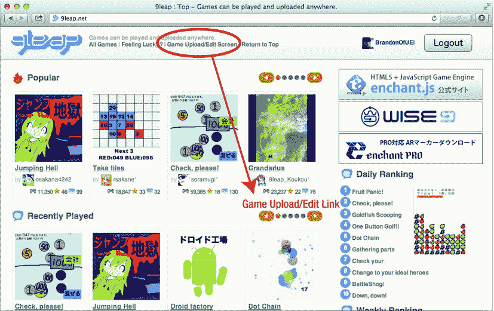

    [图 1-21](#_Fig21) 。游戏上传/编辑链接

4.  Click on Add New, as shown in [Figure 1-22](#Fig22).

    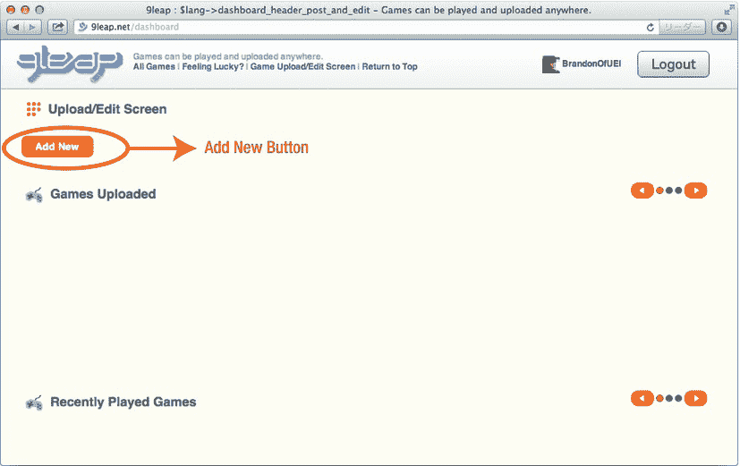

    [图 1-22](#_Fig22) 。添加新按钮

5.  Accept the terms of service, fill in your information, and click Send, as shown in [Figure 1-23](#Fig23). This information is used to consider the game for contests on the site.

    

    [图 1-23](#_Fig23) 。发送按钮

6.  在空白处填入你的游戏信息。这些字段在[表 1-5](#Tab5) 中解释。对于游戏文件，找到从`code.9leap.net`保存的游戏的 zip 文件。你需要包括一个截图，可以是游戏的图片文件或者截图。(请参见`http://bit.ly/11m6e4`了解 Mac 的屏幕截图信息，参见`http://bit.ly/ZFSdT`了解 PC 的屏幕截图信息。)请确保指明您希望使用哪种许可证来许可您的游戏。完成后，点击游戏后按钮，如图[图 1-24](#Fig24) 所示。

[表 1-5](#_Tab5) 。游戏信息字段

| **游戏标题** | 输入不超过 40 个字符的游戏名称。 |
| 型 | 为你的游戏选择一个流派。 |
| **游戏解说** | 用不超过 1000 个字符的篇幅解释你的游戏目标以及如何玩。 |
| **游戏文件** | 包含游戏的小于 10MB 的 zip 文件。 |
| **截图** | 你的游戏截图(小于 1MB - jpg/png/gif)。 |
| **运行时环境** | 指出游戏浏览器的兼容性。 |
| **推特设置** | 指明您是否希望 9leap 在 Twitter 上发布您的游戏。 |
| **设为私有** | 如果您希望您的游戏只有您一个人可以查看，请选择此选项。 |
| **提交参赛作品** | 如果你的游戏有资格参加目前正在 9leap 上举行的比赛，它们将会出现在这里。 |
| **源代码许可** | 如果你想指定一个许可证来保护你的游戏，请在这里指定。 |

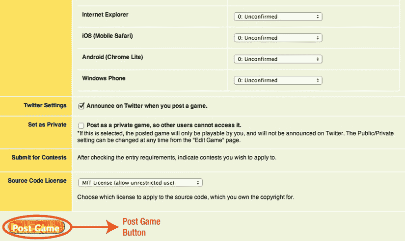

[图 1-24](#_Fig24) 。上传按钮

私人设置可以在任何时候从游戏编辑设置页面更改。

成功上传游戏后，将显示共享完成屏幕，您可以在游戏上传/编辑屏幕上查看您的游戏。参见图 1-25 。

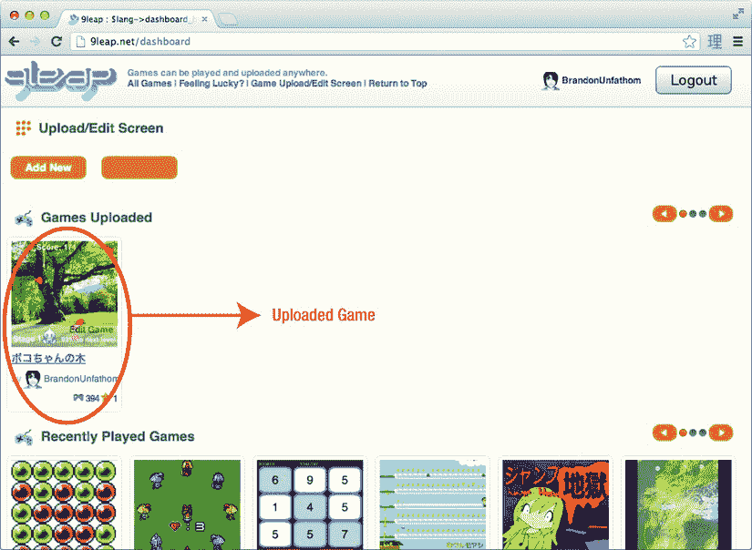

[图 1-25](#_Fig25) 。上传的游戏出现在游戏上传/编辑界面

结论

在本章中，我们介绍了 enchant.js 的基本特性，并展示了 enchant.js 游戏如何融入网页结构。我们在`code.9leap.net`上谈到了 JavaScript、HTML5 和 CSS，以及如何开始编写游戏代码。最后，我们看了看如何在`global.9leap.net`上与 enchant.js 社区分享你的游戏，以及玩其他用户创建的游戏如何给你自己的游戏带来灵感。

在下一章中，我们将介绍 JavaScript 的构建模块，这是编写 enchant.js 的语言。学习 JavaScript 将为你开始用 enchant.js 创建自己的游戏打下基础。