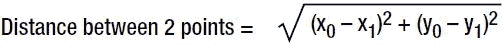
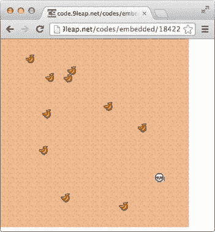

# 四、enchant.js 的高级功能

enchant.js 的基础允许简单的游戏创建。更高级的功能，如在单个游戏中的场景之间导航，需要使用 enchant.js 更复杂的功能。在本章中，我们将演示如何创建场景过渡，以包括多个级别或环境，在屏幕上开始和游戏以美化游戏外观，以及地图和声音以增加交互性。

汇总列表

1.  场景之间的转换
2.  创建开始、游戏结束和分数共享屏幕
3.  使用碰撞检测
4.  创建交互式地图

场景之间的过渡

虽然单个场景对于简单的游戏来说可能已经足够了，但是任何类型的冒险或基于对话的游戏都需要多个场景来保持适合类型的感觉。

本节的示例代码展示了如何创建一个简单的程序，该程序使用场景转换使玩家能够在三个不同的场景之间切换。图 4-1 说明了玩家如何通过点击橙色导航文本在三个场景之间导航。


[图 4-1](#_Fig1) 。场景转换

解剖一个场景

场景可能是一个挑战，因为它们有自己的结构，不同于 enchant.js 中的其他实体。因此，我们在本节中为您提供一些关于场景如何工作的基本信息，然后是示例代码，以显示场景如何在实际的 enchant.js 游戏中使用。

场景创建

场景是一个屏幕单元，可以在其中添加显示对象，如精灵、标签、贴图和组。一个游戏可以有多个场景，通过切换场景，可以完全改变画面的内容。常见的场景类型包括标题屏幕、播放屏幕和游戏结束屏幕。为了创建场景，使用了`Scene`对象构造函数(`var scene1 = new Scene();`)。

场景堆栈

创建场景后，可以将背景、带文本的标签和精灵添加到场景中。一旦完成，用`addChild()`函数将场景添加到场景堆栈中。

场景以堆栈结构组织。正如术语“堆叠”所暗示的，多个场景堆叠在彼此之上。最上面的场景是可见场景。你用`push()`方法在栈顶添加一个场景，用`pop()`方法移除最顶层的场景，如图[图 4-2](#Fig2) 所示。


[图 4-2](#_Fig2) 。烟囱建造

场景属性和方法

在一个游戏内部，可以用`currentScene`引用当前场景，用`rootScene`引用根场景。这两个名字使得跟踪游戏场景堆栈中发生的事情变得容易。

[表 4-1](#Tab1) 显示了`Scene`对象的方法。

[表 4-1。](#_Tab1)场景对象方法

| 代码(参数) | 描述 |
| --- | --- |
| `pushScene(Scene)` | 切换到新场景，将其添加到场景堆栈的顶部。 |
| `popScene()` | 通过将当前场景从屏幕堆栈中移除来结束当前场景。底层场景(如果有)将成为新的当前场景。 |
| `removeScene(scene)` | 从堆栈中移除指定的场景。 |
| `replaceScene(scene)` | 用另一个场景替换当前场景。 |

进行场景转换

要创建允许玩家在三个场景之间切换的代码，请执行以下操作:

1.  Fork the code from `http://code.9leap.net/codes/show/27650`. If you cannot access the code, copy it from [Listing 4-1](#list1).

    [***清单 4-1。***](#_list1) 场景设置

    ```js
    enchant();
    window.onload = function() {
        //Core object creation
        var game = new Core(320, 320);
        game.fps = 16;

        //Image loading
        game.preload('http://enchantjs.com/assets/img/bg/bg01.jpg',
            'http://enchantjs.com/assets/img/bg/bg02.jpg',
            'http://enchantjs.com/assets/img/bg/bg03.jpg');

        //Called when pre-loading is complete
        game.onload = function() {

            //Background creation
            var bg = makeBackground(game.assets        ['http://enchantjs.com/assets/img/bg/bg01.jpg'])
            game.rootScene.addChild(bg);

            //Message creation
            game.rootScene.addChild(makeMessage("This is the root scene."));

            //Choice button creation
            var select=makeSelect("[Move to Scene 1]", 320 - 32 * 2);
            select.addEventListener(Event.TOUCH_START, function(e) {
                game.pushScene(game.makeScene1());
            });
            game.rootScene.addChild(select);
        };

        //Scene 1 creation
        game.makeScene1 = function() {
            var scene = new Scene();

            //Background creation
            var bg = makeBackground(game.assets        ['http://enchantjs.com/assets/img/bg/bg02.jpg'])
            scene.addChild(bg);

            //Message creation
            scene.addChild(makeMessage("This is Scene 1."));

            //Choice button creation
            var select = makeSelect("[Move to Scene 2]", 320 - 32 * 2);
            select.addEventListener(Event.TOUCH_START, function(e) {
                game.pushScene(game.makeScene2());
            });
            scene.addChild(select);
            scene.addChild(makeReturn(1));
            return scene;
        };

        //Scene 2 creation
        game.makeScene2 = function() {
            var scene = new Scene();

            //Background creation
            var bg = makeBackground(game.assets        ['http://enchantjs.com/assets/img/bg/bg03.jpg'])
            scene.addChild(bg);

            //Label creation
            scene.addChild(makeMessage("This is Scene 2."));
            scene.addChild(makeReturn(0));
            return scene;
        };

        //Start game
        game.start();
    };

    //Background creation
    function makeBackground(image) {
        var bg = new Sprite(320, 320);
        bg.image = image;
        return bg;
    }
    //Message creation
    function makeMessage(text) {
        var label = new Label(text);
        label.font  = "16px monospace";
        label.color = "rgb(255,255,255)";
        label.backgroundColor = "rgba(0,0,0,0.6)";
        label.y     = 320 - 32 * 3;
        label.width = 320;
        label.height = 32 * 3;
        return label;
    }

    //Choice button creation
    function makeSelect(text, y) {
        var label = new Label(text);
        label.font  = "16px monospace";
        label.color = "rgb(255,200,0)";
        label.y     = y;
        label.width = 320;
        return label;
    }

    //Return button creation
    function makeReturn(lineNumber) {
        var game = enchant.Game.instance;
        var returnLabel = makeSelect("[Return]", 320 - 32 * (2-lineNumber));
        returnLabel.addEventListener(Event.TOUCH_START, function(e) {
            game.popScene();
        });
        return returnLabel;
    }
    ```

在这个程序中，当玩家点击移动到场景 1 按钮时，游戏显示场景 1。方法 `pushScene()`应该有道理，但是`game.pushScene(game.makeScene1());`呢？

在前面的示例代码中，我们为我们的`Core`对象类显式定义了`makeScene1()`和`makeScene2()`方法。当调用这些方法时，它们会创建并返回一个场景。

该函数中所发生的只是创建一个`Scene`对象，然后创建各种元素并添加到场景中。首先，代码创建一个背景并将其添加到场景中。接下来，代码创建一个标签并添加到场景中，特别是使用我们已经创建的`makeMessage()`函数。然后，代码用`addChild().`将它添加到场景中。之后，代码用同样的方法创建另一个标签，这允许导航到场景 2。

该方法的最后一行返回场景。请记住，向场景添加元素实际上并不会使场景活跃，这就是为什么这里有这个返回。这样做允许我们将它放在`pushScene()`函数中，该函数将调用`makeScene1()`，然后使用它创建的场景，将它推到堆栈的顶部。

当玩家在场景 1 或场景 2 中点击返回按钮时，场景堆栈顶部的场景将通过`popScene()`移除。

场景允许多个环境存在于同一个游戏中。您可以在基于对话框的游戏中使用它们来设置关卡或图像。然而，你不一定要把它们包含在你的游戏中。enchant.js 中很多流行的游戏都是在没有场景具体使用的情况下创建的。

创建一个有屏幕、时间限制和分数 的游戏

开始和游戏结束屏幕是向玩家传达游戏开始和结束的有用工具。幸运的是，enchant.js 附带了一个官方插件 nineleap.enchant.js，用于使这些屏幕易于实现。

在本节的示例代码中，我们创建了一个以开始屏幕开始的游戏。当玩家点击开始屏幕时，会切换到根场景。在根场景中，玩家可以使用 d-pad 来控制熊的左右移动，以接住从屏幕顶部落下的苹果。收集苹果会增加玩家的分数。达到 10 秒钟的时间限制后，游戏停止，并显示游戏结束屏幕。[图 4-3](#Fig3) 显示了屏幕转换的顺序。


[图 4-3](#_Fig3) 。nineleap 示例项目代码的屏幕序列

如果你上传你的游戏到 9leap.net，游戏结束后会出现另一个显示玩家分数的屏幕。

设置一个示例游戏

我们首先需要一个游戏来实现开始和结束屏幕。要创建此游戏，请执行以下操作:

1.  Fork the code from `http://code.9leap.net/codes/show/23342` to your own project on code.9leap.net. If you are not using code.9leap.net, copy and paste the code from [Listing 4-2](#list2). This code is for a simple apple-catching game.

    [***清单 4-2。***](#_list2) 抓苹果游戏

    ```js
    enchant();
    window.onload = function() {
        //Game object creation
        var game = new Core(320, 320);
        game.fps = 16;
        game.score = 0;
        var label;
        var bear;

        //Image loading
        game.preload('chara1.gif',
            'http://enchantjs.com/assets/img/map0.gif',
            'http://enchantjs.com/assets/img/icon0.gif');

        //Called when the loading is complete
        game.onload = function() {
            //Background creation
            var bg = new Sprite(320, 320);
            bg.backgroundColor = "rgb(0, 200, 255)";
            var maptip = game.assets['http://enchantjs.com/assets/img/map0.gif'];
            var image = new Surface(320, 320);
            for (var i = 0; i < 320; i += 16) {
                image.draw(maptip, 7 * 16, 0, 16, 16, i, 320 - 16, 16, 16);
            }
            bg.image = image;
            game.rootScene.addChild(bg);

            //Virtual pad creation
            var pad = new Pad();
            pad.x   = 0;
            pad.y   = 220;
            game.rootScene.addChild(pad);

            //Label creation
            label = new Label("");
            game.rootScene.addChild(label);

            //Bear creation
            bear = new Sprite(32, 32);
            bear.image  = game.assets['chara1.gif'];
            bear.x      = 160 - 16;
            bear.y      = 320 - 16 - 32;
            bear.anim   = [10, 11, 10, 12];
            bear.frame  = bear.anim[0];
            game.rootScene.addChild(bear);

            //Periodic processing of the bear sprite
            bear.addEventListener(Event.ENTER_FRAME, function() {
                //Left
                if (game.input.left)  {
                    bear.x -= 3;
                    bear.scaleX = -1;
                }
                //Right
                else if (game.input.right) {
                    bear.x += 3;
                    bear.scaleX =  1;
                }

                //Frame settings
                if (!game.input.left && !game.input.right) {
                    bear.frame = bear.anim[0];
                } else {
                    bear.frame = bear.anim[bear.age %  bear.anim.length];
                }
            });
        };

        //Adds an apple
        game.addApple = function(x, speed) {
            //Create apple
            var apple = new Sprite(16, 16);
            apple.image = game.assets['http://enchantjs.com/assets/img/icon0.gif'];
            apple.x = x;
            apple.y = -16;
            apple.frame = 15;
            apple.speed = speed;
            game.rootScene.addChild(apple);

            //Periodic processing of the sprite
            apple.addEventListener(Event.ENTER_FRAME, function() {
                apple.y += apple.speed;
                //Collision with the bear

                //Collision with the ground
                else if (apple.y > 320 - 32) {
                    game.rootScene.removeChild(apple);
                }
            });
        };

        //Periodic processing of the scene
        game.framesLeft = 10*game.fps; // 10 seconds
        game.rootScene.addEventListener(Event.ENTER_FRAME, function() {
            game.framesLeft--;
            if (game.framesLeft > 0) {
                //Apple creation
                if ((game.frame % 10) === 0) {
                    var x     = rand(300);
                    var speed = 3 + rand(6);
                    game.addApple(x,speed);
                }
                label.text = "Time left:" + Math.floor(game.framesLeft / game.fps)  +
                    "<BR />Score:" + game.score;
            } else {
                //Display Game Over
                game.end(game.score, "Your score is " + game.score);
            }
        });

        //Start game
        game.start();
    };

    //Generates a random number
    function rand(num){
        return Math.floor(Math.random() * num);
    }
    ```

如果你运行这段代码，你可以用 d-pad 在屏幕上移动一只熊，然后看到苹果从屏幕顶部落下。然而，开始和游戏结束屏幕还没有出现。在下一节中，我们将向您展示如何添加这些屏幕。

添加所需的插件

随着 nineleap.enchant.js 插件的添加，开始和游戏结束屏幕会自动出现。执行以下操作将其添加到项目中:

1.  点击屏幕顶部的下拉菜单，选择`index.html`。
2.  Type in the code in [Listing 4-3](#list3) under `<script src='/static/enchant.js-latest/enchant.js'></script>`.

    [***清单 4-3。***](#_list3) 添加 nine leap . ench . js 插件

    ```js
    <script src='/static/enchant.js-latest/plugins/nineleap.enchant.js'></script>
    ```

3.  单击运行。由于添加了插件，开始和游戏结束屏幕会自动出现。

创建分数共享屏幕

只有当你将游戏上传到 9leap.net 时，分数共享界面才会出现。这个屏幕允许玩家看到他们的最终分数，并让他们能够通过 9leap.net 在 Twitter 上分享分数。要设置游戏使用分数共享屏幕，请执行以下操作:

1.  Near the end of the code, change `game.end();` to what is shown in [Listing 4-4](#list4).

    [***清单 4-4。***](#_list4) 使用计分屏

    ```js
    game.end(game.score, "Your score is " + game.score);
    ```

接下来，把你的游戏上传到 9leap.net。当你玩游戏时，游戏结束后会出现一个屏幕，显示你的分数和你指定的信息(如“你的分数是…”)。

正如你所看到的，开始和游戏结束屏幕很容易在你的游戏中实现，只需要一个额外的插件。添加这个插件可以润色你的游戏，让你的玩家更容易理解确切的起点和终点。

使用碰撞检测

正如我们已经看到的，我们的游戏包括让一个熊角色收集从屏幕顶部落下的苹果。就苹果而言，我们知道如何创造它们，如何让它们随着时间的推移而掉落，甚至如何让它们消失。然而，我们需要一些方法来判断我们的熊角色何时接触到苹果。为此，我们使用特定的方法，这些方法是所有实体对象的一部分。

碰撞检测的方法

[表 4-2](#Tab2) 显示了用于碰撞检测的两种方法。这些方法是`Entity`对象的一部分，因此可以在场景中的任何地方调用。

[表 4-2。](#_Tab2)碰撞检测方法

| 方法(参数) | 描述 |
| --- | --- |
| `intersect(otherEntity)` | 根据实体(调用`intersect()`的实体和另一个实体)的边界矩形是否相交来执行碰撞检测。另一个实体必须具有属性`x`、`y`、`width`和`height`。 |
| `within(otherEntity, distance)` | 根据两个实体中心点之间的距离执行碰撞检测。 |

用内部方法检测碰撞

第一种碰撞检测方法是`within()`。在抓苹果游戏中执行以下操作:

1.  Beneath the line `//Collision with the bear`, type in the code in [Listing 4-4](#list4).

    [***清单 4-4。***](#_list4) 利用内()

    ```js
    if (bear.within(apple, 16)) {
        game.score+=30;
        game.rootScene.removeChild(apple);
    }
    ```

这将计算每一帧苹果的中心点和熊的中心点，然后计算两者之间的距离。如果距离小于或等于 16 个像素，游戏分数增加 30，苹果从`rootScene`中移除。

用相交方法检测碰撞

存在另一种检测物体之间碰撞的方法。请执行以下操作，了解如何使用该方法:

1.  将[清单 4-4](#list4) 中的`bear.within`(苹果，16)替换为`bear.intersect`(苹果)。

这导致程序查看熊和苹果的总面积。如果这些区域相交，分数增加 30，苹果从`rootScene`中移除。

碰撞检测是游戏的重要组成部分。抓苹果、击落船只或任何涉及一个精灵与另一个精灵接触的事情都需要碰撞检测。如果您在创建本节中的代码时遇到任何问题，您可以在`http://code.9leap.net/codes/show/27891`找到一个完整的工作副本。

创建交互式地图

我们在第 3 章的[中看到了一个地图的基本示例，它在屏幕上复制了一个单幅图块，但需要进一步设置才能在 enchant.js 中创建交互式地图。然而，原理是相同的，仍然使用`draw()`方法用地图图块平铺给定的表面。](3.html)

在本节的示例代码中，我们使用地图创建了一个简单的迷宫程序。我们的主角将只能穿过浅棕色的路面砖，而不能走过绿色的草地砖。一旦主角到达宝箱，游戏就结束了。图 4-4 和 [4-5](#Fig5) 说明了该程序。


[图 4-4](#_Fig4) 。地图示例项目的开始屏幕


[图 4-5](#_Fig5) 。地图示例项目的结束画面

创建地图对象

创建地图的第一步是创建一个`Map`对象。执行以下操作来设置游戏并创建一个`Map`对象:

*   1.从`http://code.9leap.net/codes/show/27204`派生出空白模板，以获得一个项目来输入您的代码。
*   2.  Type in the code in [Listing 4-5](#list5) to set up the basics of the game.

    [***清单 4-5。***](#_list5) 侧滚器基础知识

    ```js
    var DIR_LEFT  = 0;
    var DIR_RIGHT = 1;
    var DIR_UP    = 2;
    var DIR_DOWN  = 3;

    enchant();
    window.onload = function() {
        var game = new Core(320, 320);
        game.fps = 16;
        game.preload(
            'http://enchantjs.com/assets/img/map0.gif',
            'http://enchantjs.com/assets/img/chara0.gif');

        game.onload = function() {
            var player = new Sprite(32, 32);
            player.image = game.assets['http://enchantjs.com/assets/img/chara0.gif'];
            player.x = 2 * 16;
            player.y = 16;
            player.dir   = DIR_DOWN;
            player.anim  = [
                 9, 10, 11, 10, //Left
                18, 19, 20, 19, //Right
                27, 28, 29, 28, //Up
                 0,  1,  2,  1];//Down

                //Frame setting
                if (!game.input.up && !game.input.down &&
                    !game.input.left && !game.input.right) player.age = 1;//Standing Still
                player.frame = player.anim[player.dir * 4 + (player.age % 4)];

            });

            var pad = new Pad();
            pad.y = 220;
            game.rootScene.addChild(pad);

        };
        game.start();
    };
    ```

*   3.  Under `game.onload = function() {`, type in the code in [Listing 4-6](#list6) to create the `Map` object and assign the tile set image to it.

    [***清单 4-6。***](#_list6) 创建地图对象

    ```js
    var map = new Map(16, 16);
    map.image = game.assets['http://enchantjs.com/assets/img/map0.gif'];
    ```

填充图块并设置碰撞和

现在您已经创建了地图，您需要用切片填充它。在前面的例子中，我们使用了一个循环来用相同的绿草瓦片填充地图中的所有瓦片。在此地图中，我们以特定的排列方式使用不同的图块，因此必须手动输入。执行以下操作来复制和粘贴图块数据:

*   4.  Copy the code from `http://code.9leap.net/codes/show/27905` and insert it into the line after [Listing 4-6](#list6). If you are not using 9leap, copy the code from [Listing 4-7](#list7).

    [***清单 4-7。***](#_list7) 载入磁贴数据

    ```js
     map.loadData([
    [0,0,0,0,0,0,0,0,0,0,0,0,0,0,0,0,0,0,0,0,0,0,0],
    [0,2,2,2,2,0,0,0,0,0,0,0,0,0,0,0,0,0,2,2,2,2,0],
    [0,2,2,2,2,0,0,2,2,2,2,2,2,2,2,0,0,0,2,2,2,2,0],
    [0,2,2,2,2,0,0,2,2,2,2,2,2,2,2,0,0,0,2,2,2,2,0],
    [0,0,2,2,0,0,0,2,2,0,0,0,0,2,2,0,0,0,0,2,2,0,0],
    [0,0,2,2,0,0,0,2,2,0,0,0,0,2,2,0,0,0,0,2,2,0,0],
    [0,0,2,2,0,0,0,2,2,0,0,0,0,0,0,0,0,2,2,2,2,0,0],
    [0,0,2,2,2,2,2,2,2,2,2,2,2,2,0,0,0,2,2,2,2,0,0],
    [0,0,2,2,2,2,2,2,2,2,2,2,2,2,0,0,0,2,2,0,0,0,0],
    [0,0,0,0,0,2,2,0,0,0,0,0,2,2,2,2,2,2,2,0,0,0,0],
    [0,0,0,0,0,2,2,0,0,0,0,0,2,2,2,2,2,2,2,0,0,0,0],
    [0,0,0,2,2,2,2,0,0,0,0,0,2,2,0,0,0,0,0,0,0,0,0],
    [0,0,2,2,2,2,2,0,0,0,0,0,2,2,2,2,2,2,2,2,2,0,0],
    [0,0,2,2,2,0,0,0,0,0,0,0,2,2,2,2,2,2,2,2,2,0,0],
    [0,0,2,2,2,0,0,0,0,0,0,0,0,0,0,0,0,0,0,2,2,0,0],
    [0,0,0,2,2,0,0,0,0,0,0,0,0,0,0,0,0,0,0,2,2,0,0],
    [0,0,0,2,2,0,0,0,0,0,0,0,0,0,0,0,0,0,2,2,2,2,0],
    [0,0,0,2,2,2,2,2,2,2,2,2,2,2,2,2,0,0,2,2,2,2,0],
    [0,0,0,2,2,2,2,2,2,2,2,2,2,2,2,2,0,0,2,2,2,2,0],
    [0,0,0,0,0,0,0,0,0,0,0,0,0,0,0,0,0,0,0,0,0,0,0]
    ],[
    [-1,-1,-1,-1,-1,-1,-1,-1,-1,-1,-1,-1,-1,-1,-1,-1,-1,-1,-1,-1,-1,-1,-1],
    [-1,-1,-1,-1,-1,-1,-1,-1,-1,-1,-1,-1,-1,-1,-1,-1,-1,-1,-1,-1,-1,-1,-1],
    [-1,-1,-1,-1,-1,-1,-1,-1,-1,-1,-1,-1,-1,-1,-1,-1,-1,-1,-1,18,-1,-1,-1],
    [-1,-1,-1,-1,-1,-1,-1,-1,-1,-1,-1,-1,-1,-1,-1,-1,-1,-1,-1,-1,-1,-1,-1],
    [-1,-1,-1,-1,-1,-1,-1,-1,-1,-1,-1,-1,-1,-1,-1,-1,-1,-1,-1,-1,-1,-1,-1],
    [-1,-1,-1,-1,-1,23,-1,-1,-1,-1,-1,-1,-1,-1,-1,-1,-1,-1,-1,-1,-1,-1,-1],
    [-1,-1,-1,-1,-1,-1,-1,-1,-1,-1,-1,-1,-1,-1,-1,-1,-1,-1,-1,-1,-1,-1,-1],
    [-1,-1,-1,-1,-1,-1,-1,-1,-1,-1,-1,-1,-1,-1,-1,23,-1,-1,-1,-1,-1,-1,23],
    [-1,-1,-1,-1,-1,-1,-1,-1,-1,-1,-1,-1,-1,-1,-1,-1,-1,-1,-1,-1,-1,-1,23],
    [-1,-1,-1,-1,-1,-1,-1,-1,-1,-1,-1,-1,-1,-1,-1,-1,-1,-1,-1,-1,-1,-1,-1],
    [-1,-1,-1,-1,-1,-1,-1,-1, 1, 1, 1,-1,-1,-1,-1,-1,-1,-1,-1,-1,-1,-1,-1],
    [-1,-1,-1,-1,-1,-1,-1,-1, 1, 1, 1,-1,-1,-1,-1,-1,-1,-1,-1,-1,-1,-1,-1],
    [-1,-1,-1,-1,-1,-1,-1,-1, 1, 1, 1,-1,-1,-1,-1,-1,-1,-1,-1,-1,-1,-1,-1],
    [-1,-1,-1,18,-1,-1,-1,-1,-1, 1, 1,-1,-1,-1,-1,-1,-1,-1,-1,-1,-1,-1,-1],
    [-1,-1,-1,-1,-1,-1,-1,-1,-1,-1,-1,-1,-1,-1,-1,-1,-1,-1,-1,-1,-1,-1,-1],
    [-1,-1,-1,-1,-1,-1,-1,-1,-1,-1,-1,-1,-1,-1,-1,-1,-1,-1,-1,-1,-1,-1,-1],
    [-1,-1,-1,-1,-1,-1,-1,-1,-1,-1,-1,-1,-1,-1,-1,-1,-1,-1,-1,-1,-1,-1,-1],
    [-1,23,-1,-1,-1,-1,-1,-1,-1,-1,-1,-1,-1,-1,-1,-1,-1,-1,-1,-1,25,-1,-1],
    [-1,23,-1,-1,-1,-1,-1,-1,-1,-1,-1,-1,-1,-1,-1,-1,-1,-1,-1,-1,-1,-1,-1],
    [-1,-1,-1,-1,-1,-1,-1,-1,-1,-1,-1,-1,-1,-1,-1,-1,-1,-1,-1,-1,-1,-1,-1]
    ]);
    ```

这段代码展示了如何使用`loadData()`函数来填充地图。它由两部分数组组成，由一个右括号、一个逗号和一个左括号“`],[`”分隔。因为这是两个独立的组，所以让我们从第一组开始。

以`[0,0,0,0 . . .]`开始的第一个数组组指定在第 1 个<sup>第 1 个</sup>位置(绿草瓷砖)开始布局瓷砖，作为瓷砖地图的第一行。这些图块来自图块集图像，该图像先前被分配给`map.image`。使用的图块大小(`16x16`)是在第一次用`Map`对象构造器(`var map = new Map(16, 16);`)创建地图时指定的。

第一行图块名称后的右括号和逗号(…2，2，2，0)，)指定开始新的一行图块。这个平铺过程一直持续到我们到达清单 4-10 中的[大约一半的位置`],[`。](#list10)

然后我们再次开始这个过程。但是，这一次，指定的图块将覆盖当前位于指定要平铺的位置的任何图块。值 1 表示不在指定位置放置任何单幅图块。这种分层技术允许将诸如花、树和宝箱之类的物体放在地图上，放在绿草地或褐色的路面砖上。

 **注意**手动输入定义地图平铺顺序的二维数组或用于碰撞检测的二维数组是相当费力的。为了自动创建这些数据，enchant.js 支持地图编辑器，我们建议您在为游戏创建地图时使用该编辑器。你可以在`http://enchantjs.com/resource/the-map-editor/`找到地图编辑器和使用说明。

下一步是在地图上指定碰撞点。在地图上，既会有绿色的草地瓦片，也会有棕色的道路瓦片。主角应该只能在棕色的路面砖上行走，所以我们设置了碰撞来实现这一点。这是用另一个数组设置的，用`0`表示可以通行，`1`表示不可以通行，指定了角色是否可以在瓷砖上行走。

*   5.  Create the collision data for the map by copying it from `http://code.9leap.net/codes/show/27909` and pasting it beneath the `loadData` array you just entered. You can also copy it from [Listing 4-8](#list8) if necessary.

    [***清单 4-8。***](#_list8) 设置碰撞数据

    ```js
    map.collisionData = [
        [1,1,1,1,1,1,1,1,1,1,1,1,1,1,1,1,1,1,1,1,1,1,1],
        [1,0,0,0,0,1,1,1,1,1,1,1,1,1,1,1,1,1,0,0,0,0,1],
        [1,0,0,0,0,1,1,0,0,0,0,0,0,0,0,1,1,1,0,0,0,0,1],
        [1,0,0,0,0,1,1,0,0,0,0,0,0,0,0,1,1,1,0,0,0,0,1],
        [1,1,0,0,1,1,1,0,0,1,1,1,1,0,0,1,1,1,1,0,0,1,1],
        [1,1,0,0,1,1,1,0,0,1,1,1,1,0,0,1,1,1,1,0,0,1,1],
        [1,1,0,0,1,1,1,0,0,1,1,1,1,1,1,1,1,0,0,0,0,1,1],
        [1,1,0,0,0,0,0,0,0,0,0,0,0,0,1,1,1,0,0,0,0,1,1],
        [1,1,0,0,0,0,0,0,0,0,0,0,0,0,1,1,1,0,0,1,1,1,1],
        [1,1,1,1,1,0,0,1,1,1,1,1,0,0,0,0,0,0,0,1,1,1,1],
        [1,1,1,1,1,0,0,1,1,1,1,1,0,0,0,0,0,0,0,1,1,1,1],
        [1,1,1,0,0,0,0,1,1,1,1,1,0,0,1,1,1,1,1,1,1,1,1],
        [1,1,0,0,0,0,0,1,1,1,1,1,0,0,0,0,0,0,0,0,0,1,1],
        [1,1,0,0,0,1,1,1,1,1,1,1,0,0,0,0,0,0,0,0,0,1,1],
        [1,1,0,0,0,1,1,1,1,1,1,1,1,1,1,1,1,1,1,0,0,1,1],
        [1,1,1,0,0,1,1,1,1,1,1,1,1,1,1,1,1,1,1,0,0,1,1],
        [1,1,1,0,0,1,1,1,1,1,1,1,1,1,1,1,1,1,0,0,0,0,1],
        [1,1,1,0,0,0,0,0,0,0,0,0,0,0,0,0,1,1,0,0,0,0,1],
        [1,1,1,0,0,0,0,0,0,0,0,0,0,0,0,0,1,1,0,0,0,0,1],
        [1,1,1,1,1,1,1,1,1,1,1,1,1,1,1,1,1,1,1,1,1,1,1]
    ];
    ```

使用运动碰撞检测

现在我们游戏中的地图存在了，但是我们需要一种方法来根据数据移动我们的角色。enchant.js 中的地图支持查找地图上特定位置是否可以行走的方法。这用于确定角色是否可以在瓷砖上行走。执行以下操作来实现它:

1.  Under the line `player.anim  = [...];//Down`, type in the code in [Listing 4-9](#list9).

    [***清单 4-9。***](#_list9) 人物移动与地图碰撞检测

    ```js
    player.addEventListener(Event.ENTER_FRAME, function() {
        //Move up
        if (game.input.up) {
            player.dir = DIR_UP;
            player.y -= 4;
            if (map.hitTest(player.x + 16, player.y + 32)) player.y += 4;
        }
        //Move down
        else if (game.input.down) {
            player.dir = DIR_DOWN;
            player.y += 4;
            if (map.hitTest(player.x + 16, player.y + 32)) player.y -= 4;
        }
        //Move left
        else if (game.input.left) {
            player.dir = DIR_LEFT;
            player.x -= 4;
            if (map.hitTest(player.x + 16, player.y + 32)) player.x += 4;
        }
        //Move right
        else if (game.input.right) {
            player.dir = DIR_RIGHT;
            player.x += 4;
            if (map.hitTest(player.x + 16, player.y + 32)) player.x -= 4;
        }

        //Frame setting
        if (!game.input.up && !game.input.down &&
            !game.input.left && !game.input.right) player.age = 1;//Standing Still
        player.frame = player.anim[player.dir * 4 + (player.age % 4)];

    });
    ```

`hitTest()`方法使用我们分配给`collisionData`的数据阵列来查找地图上给定 XY 坐标处是否存在障碍物。虽然这种方法可以告诉我们在地图上的给定位置是否存在障碍物，但是如果障碍物确实存在，我们必须手动指定应该做什么。

这些代码都在一个定期处理的事件侦听器中，所以它随着每个新帧的出现而执行。玩家角色在 d-pad 指定的方向上移动四个像素。

但是，如果角色的水平中点与包含障碍物的牌相邻，则角色不能在该障碍物的方向上继续移动。你有没有注意到清单 4-12 中嵌套的`if`语句是如何从移动的相反方向增加角色的位置的？通过使用相反的计算，角色位置的值不会改变，角色保持静止(如果`map.hitTest()`返回`true`)。

滚动地图

我们为我们的角色使用的地图比游戏屏幕大，这意味着地图的一部分在屏幕外被遮住了。当角色在屏幕上移动时，地图应该在某个点滚动，这样角色就可以探索整个地图。

要做到这一点，我们需要做的第一件事是将角色和地图合并成一个单元，这样两者可以同时滚动。为此，请执行以下操作:

1.  Above var `pad = new Pad();`, combine the map and the player into a single `Group` by typing in the code in [Listing 4-10](#list10).

    [***清单 4-10。***](#_list10) 将地图和玩家组合成一组

    ```js
    var stage = new Group();
    stage.addChild(map);
    stage.addChild(player);
    game.rootScene.addChild(stage);
    ```

2.  Set the map to scroll with the player by typing in the code in [Listing 4-11](#list11) after `game.rootScene.addChild(pad);`.

    [***清单 4-11。***](#_list11) 滚动地图

    ```js
    game.rootScene.addEventListener(Event.ENTER_FRAME, function(e) {
        //Set stage XY coordinates
        var x = Math.min((game.width  - 16) / 2 - player.x, 0);
        var y = Math.min((game.height - 16) / 2 - player.y, 0);
        x = Math.max(game.width,  x + map.width)  - map.width;
        y = Math.max(game.height, y + map.height) - map.height;
        stage.x = x;
        stage.y = y;
    });
    ```

如果我们反过来看，这可能是最容易理解的。

首先，我们知道我们正在重新定位上面创建的`stage`组，通过给舞台的 x 和 y 位置分配一个`x`和`y`值。记住`stage`包含了地图和角色，并且会同时移动它们。

接下来，我们指定“从两个值中的一个减去地图的宽度，并将其赋给 x”(`x = Math.max(game.width,  x + map.width)  - map.width;`)。这里要注意的主要概念是，如果游戏的宽度大于某个其他值(x + `map.width`)，x 会被赋一个值，等于游戏的宽度减去地图的宽度。如果队伍移动了这个数字(一个负数)，地图的右边将与游戏屏幕的右边对齐。

最后，直接在事件监听器声明下，我们指定“要么使 x 的值为零，要么等于游戏宽度的一半减去玩家(在地图上)的当前 x 位置。”如果角色在地图上，但没有向右移动至少相当于游戏屏幕一半的量，则分配零分。

这有点复杂，但最终的结果是，地图随着角色的移动以一种总是充满游戏屏幕的方式滚动。在`http://9leap.net/games/3004`可以看到一个更简单的游戏《Heart_Runner》中滚动背景的例子，玩家快速点击屏幕，使角色跑过一片滚动到角色身后左侧的森林。

对目标使用碰撞检测

在游戏的这一点上，地图和角色应该会正确的出现。这个角色可以用 d-pad 控制，地图会滚动。然而，如果角色走过宝箱，什么也不会发生。要结束游戏，我们必须以不同的方式使用碰撞检测。

我们已经看到了如何在两个实体(`intersect()`或`within()`)之间执行碰撞检测，并且我们已经看到了如何执行基本的碰撞检测来查看角色是否可以在给定的图块上移动。但是，因为宝箱一旦平铺到地图上，就没有自己的实体容器，所以我们不能使用像`intersect`或`within()`这样的实体方法。

无论从哪方面来看，宝箱都只是地图上的一组坐标。要确定角色是否与宝箱接触，我们需要确定角色所在位置与地图上宝箱位置之间的距离。[图 4-6](#Fig6) 显示了这个等式。



[图 4-6](#_Fig6) 。距离公式

请执行以下操作，了解如何创建和使用此公式:

1.  Add the function to calculate the distance between two points on the map by typing in the code in [Listing 4-12](#list12) at the very end of your existing code, outside the `game.onload` function.

    [***清单 4-12。***](#_list12) 创建函数计算长度

    ```js
    function calcLen(x0, y0, x1, y1) {
        return Math.sqrt((x0 - x1) * (x0 - x1) + (y0 - y1) * (y0 - y1));
    }
    ```

    函数`Math.sqrt()`计算作为参数传递的任何值的平方根，它是`Math`对象的函数，可以在 JavaScript 中随时调用。

2.  Check if the character is touching the treasure chest panel by typing in the code in [Listing 4-13](#list13) after `player.frame = player.anim[player.dir * 4 + (player.age % 4)];`.

    [***清单 4-13。***](#_list13) 检查与宝箱的碰撞

    ```js
    if (calcLen(player.x + 16, player.y + 16, 20 * 16 + 8, 17 * 16 + 8) <= 16) {
        game.end(0, "Goal");
    }
    ```

    在这里，我们正在测量玩家精灵的 XY 坐标与宝箱之间的距离。“+16”和“+8”是为了让程序根据这两个对象的中心而不是左上角来测量它们之间的距离。

    用于藏宝箱的 XY 位置(x1 和 y1)的乘法使用单个区块的大小(16 像素)乘以藏宝箱区块之前的区块数，来找到 x 和 y 位置的值。

3.  单击运行。当角色接触到宝箱时，游戏结束。

在本节中，我们创建了一个游戏，使角色能够在地图上行走，但只能在特定的瓷砖上行走。我们还让地图随着角色的移动而滚动。最后，我们让游戏在角色到达地图上的宝箱后结束。所有这些功能和动作都涉及到交互式地图。互动地图非常适合二维游戏，尤其是二维角色扮演游戏。

如果您在设置本节中的地图时遇到任何问题，您可以在`http://code.9leap.net/codes/show/23344`找到完整的工作代码示例。

实现声音

本章的最后一个高级功能是声音。声音可以在 enchant.js 中实现，用于游戏中的背景音乐和事件，例如一艘船射击，一个特殊的能力被激活，等等，以使你的游戏身临其境，具有交互性。

本节的练习只是在屏幕上放几个香蕉，以及一个头骨。如果玩家点击一个香蕉，香蕉就会消失，并播放声音效果。如果玩家点击头骨，游戏将结束。游戏的目标是收集所有的香蕉。[图 4-7](#Fig7) 显示了这个简单游戏的开始状态。[图 4-8](#Fig8) 显示游戏画面。



[图 4-7](#_Fig7) 。香蕉游戏主屏幕


[图 4-8](#_Fig8) 。香蕉游戏结束画面

下载声音

由于声音文件很大，默认情况下它们不包含在 enchant.js 包中，但是可以从同一个页面下载。执行以下操作来下载它们:

1.  转到`http://enchantjs.com`并点击下载。从页面底部的链接下载包含所有声音的 zip 文件。
2.  播放一些声音，看看文件中包含了什么。

设置游戏

对于这个例子，我们将复制一个完整游戏的代码，然后在其中实现声音。执行以下操作来设置游戏:

1.  Fork the code at `http://code.9leap.net/codes/show/27917` for the complete game. If you are not using 9leap.net, copy and paste the code from [Listing 4-14](#list14) into a blank enchant.js game.

    [***清单 4-14。***](#_list14) 香蕉游戏

    ```js
    enchant();
    window.onload = function() {
        //Game object creation
        var game = new Core(320, 320);
        game.fps = 16;
        game.score = 0;
        game.bananaNum = 10;
        game.time = 0;

        //Sound and image loading
        game.preload(['se1.wav',
                      'http://enchantjs.com/assets/img/icon0.gif',
                      'http://enchantjs.com/assets/img/map0.gif']);

        //Called when the loading is complete
        game.onload = function() {

            //Background creation
            var bg = new Sprite(320, 320);
            var maptip = game.assets['http://enchantjs.com/assets/img/map0.gif'];
            var image = new Surface(320, 320);
            for (var j = 0; j < 320; j += 16) {
                for (var i = 0; i < 320; i += 16) {
                    image.draw(maptip, 16 * 2, 0, 16, 16, i, j, 16, 16);
                }
            }
            bg.image = image;
            game.rootScene.addChild(bg);

            //Add bananas
            for (var k = 0; k < 10; k++) game.addBanana();

            //Add skull
            game.addDokuro();

            //Periodic scene processing
            game.rootScene.addEventListener(Event.ENTER_FRAME, function(){
                game.time ++;
            });
        };

        //Adds a skull
        game.addDokuro = function(){
            var dokuro = new Sprite(16, 16);
            dokuro.x = rand(260) + 20;
            dokuro.y = rand(260) + 20;
            dokuro.image = game.assets['http://enchantjs.com/assets/img/icon0.gif'];
            dokuro.frame = 11;
            dokuro.addEventListener(Event.TOUCH_START, function(e) {
                game.end(0, "Game Over");
            });
            game.rootScene.addChild(dokuro);
        };

        //Adds a banana
        game.addBanana = function(){
            var banana = new Sprite(16, 16);
            banana.x = rand(260) + 20;
            banana.y = rand(260) + 20;
            banana.image = game.assets['http://enchantjs.com/assets/img/icon0.gif'];
            banana.frame = 16;

            //Event handling when the banana is touched
            banana.addEventListener(Event.TOUCH_START, function(e) {
                game.rootScene.removeChild(this);

                game.bananaNum--;
                if (game.bananaNum === 0){
                    game.end(1000000 - game.time,
                        (game.time / game.fps).toFixed(2) + " seconds to Clear!");
                }
            });
            game.rootScene.addChild(banana);
        };

        //Start game
        game.start();
    };

    //Generates a random number
    function rand(num){
        return Math.floor(Math.random() * num);
    }
    ```

装载声音

就像处理图像一样，你可以通过使用`Core`对象的`preload()`函数将声音加载到内存中。尽管`Sound`对象支持用`load()`方法直接加载，我们还是建议用`preload()`方法加载你的声音元素，因为这样可以避免玩家在游戏中等待元素加载的问题，如果他们的连接速度很慢的话。

一旦你的元素被预加载，它们可以通过使用`Sound`对象构造函数在你的游戏中被创建为声音对象。请执行以下操作来了解如何操作:

1.  After `game.onLoad = function() {`, type in the code in [Listing 4-15](#list15).

    [***清单 4-15。***](#_list15) 创建声音对象

    ```js
    game.se = game.assets['se1.wav'];
    ```

播放声音

一旦创建了声音对象，就可以用特定的方法来播放它:

1.  After `game.rootScene.removeChild(this);`, type in the code in [Listing 4-16](#list16).

    [***清单 4-16。***](#_list16) 奏出声音

    ```js
    game.se.play();
    ```

2.  单击运行。当你点击香蕉时，会有声音播放。点击头骨结束游戏。

在本节中，我们创建了一个游戏，当玩家点击游戏中的香蕉时，游戏会发出声音。声音为游戏增加了互动元素，为玩家提供了额外的感官反馈元素。利用 enchant.js 主页上提供的免费声音库，很容易在游戏中加入声音。

结论

祝贺您通过了高级部分！您现在应该了解了 enchant.js 更高级的功能，包括如何在游戏中组织和导航场景，如何在屏幕上创建开始和游戏，如何实现地图和滚动地图，以及如何启用声音播放。这将允许你在游戏中增加更多的互动，让你的游戏更吸引玩家。

在下一章，我们从 enchant.js 的具体功能上退一步，看看游戏设计。制作自己的原创游戏需要创造力，因此我们向您介绍一个示例工作流，您可以使用它来创建自己的游戏，带您完成设计过程的每一步。