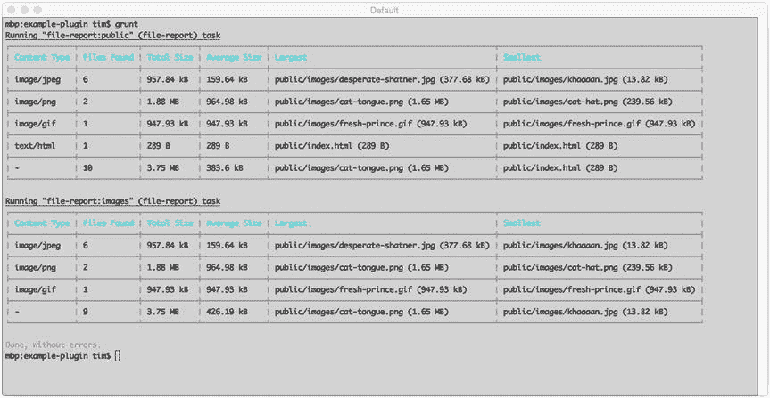

# 二、Grunt

我很懒。但是是懒人发明了轮子和自行车，因为他们不喜欢走路或搬运东西。—波兰前总统莱赫·瓦文萨

在《编程 Perl》一书中，拉里·沃尔(这种语言的著名创造者)提出了这样一个观点，即所有成功的程序员都有三个重要特征:懒惰、急躁和傲慢。乍一看，这些特点听起来都很消极，但深入一点，你会发现他的说法中隐藏的含义:

*   懒惰:懒惰的程序员讨厌重复自己。因此，他们倾向于投入大量精力来创建有用的工具，为他们执行重复的任务。他们也倾向于很好地记录这些工具，以省去以后回答关于它们的问题的麻烦。
*   不耐烦:不耐烦的程序员已经学会对他们的工具期望过高。这种期望教会他们创建软件，不仅对用户的需求做出反应，而且实际上试图预测这些需求。
*   傲慢:优秀的程序员对自己的工作非常自豪。正是这种自豪感促使他们编写别人不愿批评的软件——这是我们都应该努力争取的工作。

在这一章中，我们将关注这三个特征中的第一个，懒惰，以及 Grunt，一个流行的 JavaScript“任务运行器”,它通过为开发人员提供自动化软件开发中经常出现的重复构建任务的工具包来支持开发人员培养这一特征，例如:

*   脚本和样式表编译和缩小
*   测试
*   林挺
*   数据库迁移
*   部署

换句话说，Grunt 帮助那些努力工作得更聪明而不是更努力的开发人员。如果你对这个想法感兴趣，请继续读下去。当你读完这一章后，你将会很快掌握咕噜。在本章中，您将学习如何执行以下操作:

*   创建可配置的任务，使几乎每个项目都伴随的软件开发的重复方面自动化
*   使用 Grunt 提供的简单而强大的抽象与文件系统交互
*   发布普通插件，其他开发者可以从中受益，也可以为之做出贡献
*   利用 Grunt 现有的社区支持插件库，在撰写本文时已经有超过 4400 个例子

## 安装咕噜声

在继续之前，您应该确保已经安装了 Grunt 的命令行实用程序。作为一个 npm 包，安装过程如清单 [2-1](#FPar1) 所示。

Listing 2-1\. Installing the `grunt` Command-Line Utility via `npm`

`$ npm install -g grunt-cli`

`$ grunt --version`

`grunt-cli v0.1.13`

## Grunt 是如何工作的

Grunt 为开发人员提供了一个工具包，用于创建执行重复性项目任务的命令行实用程序。这类任务的例子包括 JavaScript 代码的缩减和 Sass 样式表的编译，但是 Grunt 的使用没有限制。Grunt 可以用来创建满足单个项目特定需求的简单任务，也就是您不打算共享或重用的任务，但是 Grunt 真正的强大之处在于它能够将任务打包成可重用的插件，然后其他人可以发布、共享、使用和改进这些插件。在撰写本文时，有超过 4400 个这样的插件。

Grunt tick 由四个核心组件组成，我们现在将介绍这四个组件。

### 格朗蒂尔

Grunt 的核心是 Gruntfile，一个保存为项目根目录下的`Gruntfile.js`(见清单 [2-2](#FPar2) )的节点模块。在这个文件中，我们可以加载 Grunt 插件，创建我们自己的定制任务，并根据我们项目的需要配置它们。每次运行 Grunt 时，它的第一个任务就是从这个模块中检索行军命令。

Listing 2-2\. Sample Gruntfile

`// example-starter/Gruntfile.js`

`module.exports = function(grunt) {`

`/**`

`* Configure the various tasks and plugins that we’ll be using`

`*/`

`grunt.initConfig({`

`/* Grunt’s 'file' API provides developers with helpful abstractions for`

`interacting  with the file system. We’ll take a look at these in greater`

`detail later in the chapter. */`

`'pkg': grunt.file.readJSON('package.json'),`

`'uglify': {`

`'development': {`

`'files': {`

`'build/app.min.js': ['src/app.js', 'src/lib.js']`

`}`

`}`

`}`

`});`

`/**`

`* Grunt plugins exist as Node packages, published via npm. Here, we load the`

`* 'grunt-contrib-uglify' plugin, which provides a task for merging and minifying`

`* a project’s source code in preparation for deployment.`

`*/`

`grunt.loadNpmTasks('grunt-contrib-uglify');`

`/**`

`* Here we create a Grunt task named 'default' that does nothing more than call`

`* the 'uglify' task. In other words, this task will serve as an alias to`

`* 'uglify'. Creating a task named 'default' tells Grunt what to do when it is`

`* run from the command line without any arguments. In this example, our 'default'`

`* task calls a single, separate task, but we could just as easily have called`

`* multiple tasks (to be run in sequence) by adding multiple entries to the array`

`* that is passed.`

`*/`

`grunt.registerTask('default', ['uglify']);`

`/**`

`* Here we create a custom task that prints a message to the console (followed by`

`* a line break) using one of Grunt’s built-in methods for providing user feedback.`

`* We’ll look at these in greater detail later in the chapter.`

`*/`

`grunt.registerTask('hello-world', function() {`

`grunt.log.writeln('Hello, world.');`

`});`

`};`

### 任务

任务是 Grunt 的基本构件，只不过是通过 Grunt 的`registerTask()`方法注册了指定名称的函数。在清单 [2-2](#FPar2) 中，显示了一个简单的`hello-world`任务，它向控制台打印一条消息。这个任务可以从命令行调用，如清单 [2-3](#FPar3) 所示。

Listing 2-3\. Running the `hello-world` Task Shown in Listing [2-2](#FPar2)

`$ grunt hello-world`

`Running "hello-world" task`

`Hello, world.`

`Done, without errors.`

多个任务也可以用一个命令按顺序运行，如清单 [2-4](#FPar4) 所示。每个任务将按照传递的顺序运行。

Listing 2-4\. Running Multiple Grunt Tasks in Sequence

`$ grunt hello-world uglify`

`Running "hello-world" task`

`Hello, world.`

`Running "uglify:development" (uglify) task`

`>> 1 file created.`

`Done, without errors.`

我们刚刚看到的`hello-world`任务是一个基本的、独立的繁重任务的例子。此类任务可用于实现特定于单个项目需求的简单操作，您不打算重用或共享这些操作。然而，大多数时候，你会发现自己不是与独立的任务交互，而是与打包成 Grunt 插件并发布到 npm 的任务交互，以便其他人可以重用它们并为它们做出贡献。

### 插件

Grunt 插件是可配置任务的集合(作为 npm 包发布),可以在多个项目中重用。存在成千上万个这样的插件。在清单 [2-2](#FPar2) 中，Grunt 的`loadNpmTasks()`方法用于加载`grunt-contrib-uglify`节点模块，这是一个 Grunt 插件，它将一个项目的 JavaScript 代码合并成一个适合部署的小型文件。

Note

可以在 [`http://gruntjs.com/plugins`](http://gruntjs.com/plugins) 找到所有可用的 Grunt 插件列表。名称以`contrib-`为前缀的插件由 Grunt 背后的开发者官方维护。

### 配置

Grunt 以强调“配置胜于代码”而闻名:任务和插件的创建，其功能由每个项目中指定的配置定制。正是这种代码与配置的分离，使得开发人员能够创建易于被其他人重用的插件。在这一章的后面，我们将会看到配置 Grunt 插件和任务的各种方法。

## 向您的项目添加 Grunt

在本章的前面，我们通过将`grunt-cli` npm 包作为一个全局模块来安装 Grunt 的命令行实用程序。我们现在应该可以从命令行访问`grunt`实用程序了，但是我们仍然需要为我们打算使用它的每个项目添加一个本地`grunt`依赖项。下面显示了从项目的根文件夹中调用的命令。这个例子假设 npm 已经在项目中初始化，并且一个`package.json`文件已经存在。

`$ npm install grunt --save-dev`

我们项目的`package.json`文件现在应该包含一个类似于清单 [2-5](#FPar6) 所示的`grunt`条目。

Listing 2-5\. Our Project’s Updated `package.json` File

`// example-tasks/package.json`

`{`

`"name": "example-tasks",`

`"version": "1.0.0",`

`"devDependencies": {`

`"grunt": "0.4.5"`

`}`

`}`

将 Grunt 与我们的项目集成的最后一步是创建一个 Gruntfile(参见清单 [2-6](#FPar7) )，它应该保存在项目的根文件夹中。在我们的 Gruntfile 中，有一个方法叫做`loadTasks()`，这将在下一节中讨论。

Listing 2-6\. Contents of Our Project’s Gruntfile

`// example-tasks/Gruntfile.js`

`module.exports = function(grunt) {`

`grunt.loadTasks('tasks');`

`};`

### 保持正常的咕噜声结构

我们希望当你读完这一章的时候，你会发现 Grunt 是一个很有价值的工具，可以自动完成你在日常工作流程中遇到的许多重复、乏味的任务。也就是说，如果我们告诉你我们对咕噜声的最初反应是积极的，那我们就是在撒谎。事实上，一开始我们对这个工具很反感。为了帮助解释原因，让我们来看看 Grunt 官方文档中突出显示的 Grunt 文件(参见清单 [2-7](#FPar8) )。

Listing 2-7\. Example Gruntfile Provided by Grunt’s Official Documentation

`module.exports = function(grunt) {`

`grunt.initConfig({`

`pkg: grunt.file.readJSON('package.json'),`

`concat: {`

`options: {`

`separator: ';'`

`},`

`dist: {`

`src: ['src/**/*.js'],`

`dest: 'dist/<%= pkg.name %>.js'`

`}`

`},`

`uglify: {`

`options: {`

`banner: '/*! <%= grunt.template.today("dd-mm-yyyy") %> */\n'`

`},`

`dist: {`

`files: {`

`'dist/<%= pkg.name %>.min.js': ['<%= concat.dist.dest %>']`

`}`

`}`

`},`

`qunit: {`

`files: ['test/**/*.html']`

`},`

`jshint: {`

`files: ['Gruntfile.js', 'src/**/*.js', 'test/**/*.js'],`

`options: {`

`// options here to override JSHint defaults`

`globals: {`

`jQuery: true,`

`console: true,`

`module: true,`

`document: true`

`}`

`}`

`},`

`watch: {`

`files: ['<%= jshint.files %>'],`

`tasks: ['jshint', 'qunit']`

`}`

`});`

`grunt.loadNpmTasks('grunt-contrib-uglify');`

`grunt.loadNpmTasks('grunt-contrib-jshint');`

`grunt.loadNpmTasks('grunt-contrib-qunit');`

`grunt.loadNpmTasks('grunt-contrib-watch');`

`grunt.loadNpmTasks('grunt-contrib-concat');`

`grunt.registerTask('test', ['jshint', 'qunit']);`

`grunt.registerTask('default', ['jshint', 'qunit', 'concat', 'uglify']);`

`};`

清单 [2-7](#FPar8) 中显示的 Gruntfile 是一个相对简单的项目。我们已经发现这个例子有点笨拙，但是在更大的项目中，我们已经看到这个文件膨胀到这个大小的许多倍。结果是一片混乱，难以阅读和维护。有经验的开发人员绝不会以一种将不相关领域的功能组合到一个单一的整体文件中的方式编写他们的代码，所以我们为什么要以不同的方式处理我们的任务运行程序呢？

保持一个合理的 Grunt 结构的秘密在于 Grunt 的`loadTasks()`函数，如清单 [2-6](#FPar7) 所示。在这个例子中，`tasks`参数引用了一个相对于我们项目的 Gruntfile 的`tasks`文件夹。一旦这个方法被调用，Grunt 将加载并执行它在这个文件夹中找到的每个节点模块，每次传递一个对`grunt`对象的引用。这种行为为我们提供了将项目的普通配置组织成一系列独立模块的机会，每个模块负责加载和配置单个任务或插件。清单 [2-8](#FPar9) 中显示了其中一个较小模块的示例。这个任务可以通过从命令行运行`grunt uglify`来执行。

Listing 2-8\. Example Module (`uglify.js`) Within Our New `tasks` Folder

`// example-tasks/tasks/uglify.js`

`module.exports = function(grunt) {`

`grunt.loadNpmTasks('grunt-contrib-uglify');`

`grunt.config('uglify', {`

`'options': {`

`'banner': '/*! <%= grunt.template.today("dd-mm-yyyy") %> */\n'`

`},`

`'dist': {`

`'files': {`

`'dist/app.min.js': ['src/index.js']`

`}`

`}`

`});`

`};`

## 使用任务

如前所述，任务是构建 Grunt 的基础——一切都从这里开始。您很快就会发现，Grunt 插件只不过是一个或多个打包到节点模块中并通过 npm 发布的任务。我们已经看到了一些演示创建基本任务的例子，所以让我们来看看一些可以帮助我们充分利用它们的附加特性。

### 管理配置

Grunt 的`config()`方法既作为配置的“获取者”又作为配置的“设置者”。在清单 [2-9](#FPar10) 中，我们看到一个基本的 Grunt 任务如何通过使用这个方法来访问它的配置。

Listing 2-9\. Managing Configuration Within a Basic Grunt Task

`module.exports = function(grunt) {`

`grunt.config('basic-task', {`

`'message': 'Hello, world.'`

`});`

`grunt.registerTask('basic-task', function() {`

`grunt.log.writeln(grunt.config('basic-task.message'));`

`});`

`};`

Note

在清单 [2-9](#FPar10) 中，“点符号”用于访问嵌套的配置值。同样，点符号可以用来设置嵌套的配置值。如果 Grunt 在配置对象中遇到一个不存在的路径，Grunt 将创建一个新的空对象，而不会抛出错误。

### 任务描述

随着时间的推移，项目有增加复杂性的趋势。伴随着这种额外的复杂性，通常会出现新的繁重任务。随着新任务的增加，经常很容易忘记哪些任务是可用的，它们做什么，以及它们是如何被调用的。幸运的是，Grunt 通过为我们的任务分配描述，为我们提供了解决这个问题的方法，如清单 [2-10](#FPar12) 所示。

Listing 2-10\. Assigning a Description to a Grunt Task

`// example-task-description/Gruntfile.js`

`module.exports = function(grunt) {`

`grunt.config('basic-task', {`

`'message': 'Hello, world.'`

`});`

`grunt.registerTask('basic-task', 'This is an example task.', function() {`

`grunt.log.writeln(grunt.config('basic-task.message'));`

`});`

`grunt.registerTask('default', 'This is the default task.', ['basic-task']);`

`};`

通过向`registerTask()`方法传递一个额外的参数，Grunt 允许我们为正在创建的任务提供描述。当从命令行请求帮助时，Grunt 会很有帮助地提供这些信息，如清单 [2-11](#FPar13) 所示，其中包括 Grunt 提供的信息的摘录。

Listing 2-11\. Requesting Help from the Command Line

`$ grunt --help`

`...`

`Available tasks`

`basic-task  This is an example task.`

`default  This is the default task.`

`...`

### 异步任务

默认情况下，普通任务应该同步运行。任务的函数一返回，就被认为完成了。然而，有时您会发现自己在一个任务中与其他异步方法交互，这些方法必须首先完成，然后您的任务才能将控制权交还给 Grunt。这个问题的解决方案如清单 [2-12](#FPar14) 所示。在一个任务中，对`async()`方法的调用将通知 Grunt 它异步执行。该方法将返回一个回调函数，在我们的任务完成后调用。在此之前，Grunt 将暂停任何附加任务的执行。

Listing 2-12\. Asynchronous Grunt Task

`// example-async/tasks/list-files.js`

`var glob = require('glob');`

`module.exports = function(grunt) {`

`grunt.registerTask('list-files', function() {`

`/**`

`* Grunt will wait until we call the `done()` function to indicate that our`

`* asynchronous task is complete.`

`*/`

`var done = this.async();`

`glob('*', function(err, files) {`

`if (err) {`

`grunt.fail.fatal(err);`

`}`

`grunt.log.writeln(files);`

`done();`

`});`

`});`

`};`

### 任务相关性

复杂的工作流程最好被认为是一系列协同工作以产生最终结果的步骤。在这种情况下，指定一个任务需要一个或多个单独的任务在它之前通常会很有帮助，如清单 [2-13](#FPar15) 所示。

Listing 2-13\. Declaring a Task Dependency

`// example-task-dependency/tasks/step-two.js`

`module.exports = function(grunt) {`

`grunt.registerTask('step-two', function() {`

`grunt.task.requires('step-one');`

`});`

`};`

在这个例子中，`step-two`任务要求`step-one`任务在继续之前先运行。任何直接调用`step-two`的尝试都会导致错误，如清单 [2-14](#FPar16) 所示。

Listing 2-14\. Grunt Reporting an Error When a Task Is Called Before Any Tasks on Which It Depends Have Run

`$ grunt step-two`

`Running "step-two" task`

`Warning: Required task "step-one" must be run first. Use --force to continue.`

`Aborted due to warnings.`

### 多任务

除了基本任务之外，Grunt 还支持它所谓的“多任务”多重任务很容易成为 Grunt 最复杂的方面，所以如果你一开始就发现自己很困惑，你并不孤单。然而，在回顾了几个例子之后，它们的目的应该开始变得清晰起来——这时，你就可以很好地掌握 Grunt 了。

在我们继续之前，让我们先看一个简单的例子(参见清单 [2-15](#FPar17) ),它展示了一个简单的多任务及其配置。

Listing 2-15\. Grunt Multi-Task

`// example-list-animals/tasks/list-animals.js`

`module.exports = function(grunt) {`

`/**`

`* Our multi-task’s configuration object. In this example, 'mammals'`

`* and 'birds' each represent what Grunt refers to as a 'target.'`

`*/`

`grunt.config('list-animals', {`

`'mammals': {`

`'animals': ['Cat', 'Zebra', 'Koala', 'Kangaroo']`

`},`

`'birds': {`

`'animals': ['Penguin', 'Sparrow', 'Eagle', 'Parrot']`

`}`

`});`

`grunt.registerMultiTask('list-animals', function() {`

`grunt.log.writeln('Target:', this.target);`

`grunt.log.writeln('Data:', this.data);`

`});`

`};`

多任务非常灵活，因为它们被设计为支持单个项目中的多个配置(称为“目标”)。清单 [2-15](#FPar17) 所示的多任务有两个目标:`mammals`和`birds`。该任务可以针对特定目标运行，如清单 [2-16](#FPar18) 所示。

Listing 2-16\. Running the Grunt Multi-Task Shown in Listing [2-15](#FPar17) Against a Specific Target

`$ grunt list-animals:mammals`

`Running "list-animals:mammals" (list-animals) task`

`Target: mammals`

`Data: { animals: [ 'Cat', 'Zebra', 'Koala', 'Kangaroo' ] }`

`Done, without errors.`

多任务也可以在没有任何参数的情况下被调用，在这种情况下，它们被执行多次，每个可用的目标执行一次。清单 [2-17](#FPar19) 显示了在没有指定目标的情况下调用这个任务的结果。

Listing 2-17\. Running the Multi-Task Shown in Listing [2-15](#FPar17) Without Specifying a Target

`$ grunt list-animals`

`Running "list-animals:mammals" (list-animals) task`

`Target: mammals`

`Data: { animals: [ 'Cat', 'Zebra', 'Koala', 'Kangaroo' ] }`

`Running "list-animals:birds" (list-animals) task`

`Target: birds`

`Data: { animals: [ 'Penguin', 'Sparrow', 'Eagle', 'Parrot' ] }`

在这个例子中，我们的多任务运行了两次，每个可用目标运行一次(`mammals`和`birds`)。注意在清单 [2-15](#FPar17) 中，我们在多任务中引用了两个属性:`this.target`和`this.data`。这些属性允许我们的多任务获取当前运行的目标的信息。

### 多任务选项

在多任务的配置对象中，存储在`options`键下的任何值(参见清单 [2-18](#FPar20) )都会得到特殊处理。

Listing 2-18\. Grunt Multi-Task with Configuration Options

`// example-list-animals-options/tasks/list-animals.js`

`module.exports = function(grunt) {`

`grunt.config('list-animals', {`

`'options': {`

`'format': 'array'`

`},`

`'mammals': {`

`'options': {`

`'format': 'json'`

`},`

`'animals': ['Cat', 'Zebra', 'Koala', 'Kangaroo']`

`},`

`'birds': {`

`'animals': ['Penguin', 'Sparrow', 'Eagle', 'Parrot']`

`}`

`});`

`grunt.registerMultiTask('list-animals', function() {`

`var options = this.options();`

`switch (options.format) {`

`case 'array':`

`grunt.log.writeln(this.data.animals);`

`break;`

`case 'json':`

`grunt.log.writeln(JSON.stringify(this.data.animals));`

`break;`

`default:`

`grunt.fail.fatal('Unknown format: ' + options.format);`

`break;`

`}`

`});`

`};`

多任务选项为开发人员提供了一种为任务定义全局选项的机制，然后可以在目标级别覆盖这些选项。在本例中，列出动物(`'array'`)的全局格式是在任务级别定义的。目标`mammals`已经选择覆盖这个值(`'json'`)，而任务`birds`没有。因此，`mammals`将显示为 JSON，而`birds`由于继承了全局选项，将显示为数组。

你将会遇到的绝大多数 Grunt 插件都可以配置为多任务。这种方法提供的灵活性允许您在不同的情况下以不同的方式应用相同的任务。一个经常遇到的场景涉及到为每个构建环境创建单独的目标。例如，在编译应用时，您可能希望根据是针对本地开发环境进行编译还是准备发布到生产环境来修改任务的行为。

### 配置模板

Grunt 配置对象支持模板字符串的嵌入，模板字符串可以用来引用其他配置值。Grunt 喜欢的模板格式遵循 Lodash 和下划线工具库的格式，这将在后面的章节中详细介绍。关于如何使用该功能的示例，请参见清单 [2-19](#FPar21) 和清单 [2-20](#FPar22) 。

Listing 2-19\. Sample Gruntfile That Stores the Contents of Its Project’s `package.json` File Under the `pkg` Key Within Grunt’s Configuration Object

`// example-templates/Gruntfile.js`

`module.exports = function(grunt) {`

`grunt.initConfig({`

`'pkg': grunt.file.readJSON('package.json')`

`});`

`grunt.loadTasks('tasks');`

`grunt.registerTask('default', ['test']);`

`};`

Listing 2-20\. A Subsequently Loaded Task with Its Own Configuration That Is Able to Reference Other Configuration Values Through the Use of Templates

`// example-templates/tasks/test.js`

`module.exports = function(grunt) {`

`grunt.config('test', {`

`'banner': '<%= pkg.name %>-<%= pkg.version %>'`

`});`

`grunt.registerTask('test', function() {`

`grunt.log.writeln(grunt.config('test.banner'));`

`});`

`};`

清单 [2-19](#FPar21) 显示了一个样例 Gruntfile，它使用几个与文件系统交互的内置方法之一来加载项目的`package.json`文件的内容，这些方法将在本章后面详细讨论。这个文件的内容存储在 Grunt 配置对象的`pkg`键下。在清单 [2-20](#FPar22) 中，我们看到一个任务能够通过使用配置模板直接引用这些信息。

### 命令行选项

可以使用以下格式将附加选项传递给 Grunt:

`$ grunt count --count=5`

清单 [2-21](#FPar23) 中的例子展示了一个普通任务如何通过`grunt.option()`方法访问这些信息。调用该任务的结果如清单 [2-22](#FPar24) 所示。

Listing 2-21\. Simple Grunt Task That Counts to the Specified Number

`// example-options/tasks/count.js`

`module.exports = function(grunt) {`

`grunt.registerTask('count', function() {`

`var limit = parseInt(grunt.option('limit'), 10);`

`if (isNaN(limit)) grunt.fail.fatal('A limit must be provided (e.g. --limit=10)');`

`console.log('Counting to: %s', limit);`

`for (var i = 1; i <= limit; i++) console.log(i);`

`});`

`};`

Listing 2-22\. Result of Calling the Task Shown in Listing [2-21](#FPar23)

`$ grunt count --limit=5`

`Running "count" task`

`Counting to: 5`

`1`

`2`

`3`

`4`

`5`

`Done, without errors.`

### 提供反馈

Grunt 提供了许多在任务执行过程中向用户提供反馈的内置方法，其中一些您已经在本章中看到过。虽然我们不会在这里列出所有的例子，但是在表 [2-1](#Tab1) 中可以找到一些有用的例子。

表 2-1。

Useful Grunt Methods for Displaying Feedback to the User

<colgroup><col> <col></colgroup> 
| 方法 | 描述 |
| --- | --- |
| `grunt.log.write()` | 将消息打印到控制台 |
| `grunt.log.writeln()` | 向控制台打印一条消息，后跟一个换行符 |
| `grunt.log.oklns()` | 将成功消息打印到控制台，后跟一个换行符 |
| `grunt.log.error()` | 向控制台输出一条错误消息，后跟一个换行符 |
| `grunt.log.subhead()` | 将粗体消息打印到控制台，后跟换行符 |
| `grunt.log.debug()` | 仅当`--debug`标志通过时，才打印一条消息到控制台 |

### 处理错误

在任务执行过程中，可能会出现错误。当他们这样做时，知道如何恰当地处理他们是很重要的。当遇到错误时，开发人员应该利用 Grunt 的`error` API，它很容易使用，因为它只提供了两种方法，如表 [2-2](#Tab2) 所示。

表 2-2。

Methods Available via Grunt’s `error` API

<colgroup><col> <col></colgroup> 
| 方法 | 描述 |
| --- | --- |
| `grunt.fail.warn()` | 显示警告并立即中止Grunt。如果通过了`--force`选项，任务将继续运行。 |
| `grunt.fail.fatal()` | 显示警告并立即中止Grunt。 |

## 与文件系统交互

作为一个构建工具，Grunt 的大多数插件都以这样或那样的方式与文件系统交互，这并不奇怪。鉴于其重要性，Grunt 提供了有用的抽象，允许开发人员用最少的样板代码与文件系统进行交互。

虽然我们不会在这里列出所有的方法，表 [2-3](#Tab3) 显示了 Grunt 的`file` API 中最常用的几种方法。

表 2-3。

Useful Grunt Methods for Interacting with the File System

<colgroup><col> <col></colgroup> 
| 方法 | 描述 |
| --- | --- |
| `grunt.file.read()` | 读取并返回文件的内容 |
| `grunt.file.readJSON()` | 读取文件内容，将数据解析为 JSON，并返回结果 |
| `grunt.file.write()` | 将指定的内容写入文件，必要时创建中间目录 |
| `grunt.file.copy()` | 将源文件复制到目标路径，必要时创建中间目录 |
| `grunt.file.delete()` | 删除指定的文件路径；递归删除文件和文件夹 |
| `grunt.file.mkdir()` | 创建一个目录，以及任何缺失的中间目录 |
| `grunt.file.recurse()` | 递归到一个目录中，对找到的每个文件执行回调 |

### 源-目标映射

许多与文件系统交互的繁重任务严重依赖于源-目的地映射的概念，这种格式描述了一组要处理的文件和每个文件对应的目的地。构建这样的映射可能会很乏味，但是谢天谢地，Grunt 提供了解决这一需求的有用快捷方式。

想象一下，您正在处理一个根目录下有一个`public`文件夹的项目。在这个文件夹中是项目部署后将通过 Web 提供的文件，如清单 [2-23](#FPar25) 所示。

Listing 2-23\. Contents of an Imaginary Project’s `public` Folder

`// example-iterate1`

`.`

ε──t0″

ε──t0″

■t0]

■t0]

ε──t0″

如您所见，我们的项目有一个包含三个文件的`images`文件夹。了解了这一点，让我们看看 Grunt 可以帮助我们遍历这些文件的几种方式。

在清单 [2-24](#FPar26) 中，我们发现一个单调的多任务，类似于我们最近被介绍的那些。这里的关键区别是在我们的任务配置中有一个`src`键。Grunt 特别关注包含这个键的多任务配置，我们很快就会看到。当出现`src`键时，Grunt 在我们的任务中提供一个`this.files`属性，该属性提供一个数组，该数组包含通过`node-glob`模块找到的每个匹配文件的路径。该任务的输出如清单 [2-25](#FPar27) 所示。

Listing 2-24\. Grunt Multi-Task with a Configuration Object Containing an `src` Key

`// example-iterate1/tasks/list-files.js`

`module.exports = function(grunt) {`

`grunt.config('list-files', {`

`'images': {`

`'src': ['public/**/*.jpg', 'public/**/*.png']`

`}`

`});`

`grunt.registerMultiTask('list-files', function() {`

`this.files.forEach(function(files) {`

`grunt.log.writeln('Source:', files.src);`

`});`

`});`

`};`

Listing 2-25\. Output from the Grunt Task Shown in Listing [2-24](#FPar26)

`$ grunt list-files`

`Running "list-files:images" (list-files) task`

`Source: [ 'publimg/cat1.jpg',`

`'publimg/cat2.jpg',`

`'publimg/cat3.png' ]`

`Done, without errors.`

`src`配置属性和`this.files`多任务属性的结合为开发人员提供了一个简洁的语法来迭代多个文件。我们刚刚看到的这个人为的例子相当简单，但是 Grunt 也为处理更复杂的场景提供了额外的选项。让我们来看看。

与清单 [2-24](#FPar26) 中用于配置我们的任务的 src 键相反，清单 [2-26](#FPar28) 中的例子演示了文件数组的使用——这是一种稍微冗长但更强大的选择文件的格式。这种格式接受额外的选项，允许我们更好地调整我们的选择。特别重要的是扩展选项，您将在清单 [2-27](#FPar29) 中看到。由于使用了扩展选项，请密切注意输出与清单 [2-26](#FPar28) 的不同之处。

Listing 2-26\. Iterating Through Files Using the “Files Array” Format

`// example-iterate2/tasks/list-files.js`

`module.exports = function(grunt) {`

`grunt.config('list-files', {`

`'images': {`

`'files': [`

`{`

`'cwd': 'public',`

`'src': ['**/*.jpg', '**/*.png'],`

`'dest': 'tmp',`

`'expand': true`

`}`

`]`

`}`

`});`

`grunt.registerMultiTask('list-files', function() {`

`this.files.forEach(function(files) {`

`grunt.log.writeln('Source:', files.src);`

`grunt.log.writeln('Destination:', files.dest);`

`});`

`});`

`};`

Listing 2-27\. Output from the Grunt Task shown in Listing [2-26](#FPar28)

`$ grunt list-files`

`Running "list-files:images" (list-files) task`

`Source: [ 'publimg/cat1.jpg' ]`

`Destination: timg/cat1.jpg`

`Source: [ 'publimg/cat2.jpg' ]`

`Destination: timg/cat2.jpg`

`Done, without errors.`

当`expand`选项与`dest`选项配对时，它指示 Grunt 为找到的每个条目遍历一次任务的`this.files.forEach`循环，在循环中我们可以找到相应的`dest`属性。使用这种方法，我们可以轻松地创建源-目标映射，用于将文件从一个位置复制(或移动)到另一个位置。

### 监视文件更改

Grunt 最受欢迎的插件之一`grunt-contrib-watch`，让 Grunt 能够在创建、修改或删除匹配指定模式的文件时运行预定义的任务。当与其他任务结合使用时，`grunt-contrib-watch`使开发人员能够创建强大的工作流，自动执行以下操作

*   检查 JavaScript 代码中的错误(即“林挺”)
*   编译 Sass/L 样式表
*   运行单元测试

让我们看几个例子，展示这样的工作流付诸行动。

#### 自动化 JavaScript 林挺

清单 [2-28](#FPar30) 显示了一个基本的咕噜声设置，与本章中已经显示的相似。注册了一个`default`任务，作为`watch`任务的别名，允许我们通过简单地从命令行运行`$ grunt`来开始观察我们项目中的变化。在这个例子中，Grunt 将观察`src`文件夹中的变化。当它们发生时，`jshint`任务被触发，它将扫描我们项目的`src`文件夹，搜索 JavaScript 错误。

Listing 2-28\. Automatically Checking for JavaScript Errors As Changes Occur

`// example-watch-hint/Gruntfile.js`

`module.exports = function(grunt) {`

`grunt.loadTasks('tasks');`

`grunt.registerTask('default', ['watch']);`

`};`

`// example-watch-hint/tasks/jshint.js`

`module.exports = function(grunt) {`

`grunt.loadNpmTasks('grunt-contrib-jshint');`

`grunt.config('jshint', {`

`'options': {`

`'globalstrict': true,`

`'node': true,`

`'scripturl': true,`

`'browser': true,`

`'jquery': true`

`},`

`'all': [`

`'src/**/*.js'`

`]`

`});`

`};`

`// example-watch-hint/tasks/watch.js`

`module.exports = function(grunt) {`

`grunt.loadNpmTasks('grunt-contrib-watch');`

`grunt.config('watch', {`

`'js': {`

`'files': [`

`'src/**/*'`

`],`

`'tasks': ['jshint'],`

`'options': {`

`'spawn': true`

`}`

`}`

`});`

`};`

#### 自动化 Sass 样式表编译

清单 [2-29](#FPar31) 显示了一个例子，Grunt 被指示观察我们项目的变化。然而，这一次，Grunt 被配置为观察我们项目的 Sass 样式表，而不是观察我们的 JavaScript。随着变化的发生，`grunt-contrib-compass`插件被调用，它将我们的样式表编译成它们的最终形式。

Listing 2-29\. Automatically Compiling Sass Stylesheets As Changes Occur

`// example-watch-sass/Gruntfile.js`

`module.exports = function(grunt) {`

`grunt.loadTasks('tasks');`

`grunt.registerTask('default', ['watch']);`

`};`

`// example-watch-sass/tasks/compass.js`

`module.exports = function(grunt) {`

`grunt.loadNpmTasks('grunt-contrib-compass');`

`grunt.config('compass', {`

`'all': {`

`'options': {`

`'httpPath': '/',`

`'cssDir': 'public/css',`

`'sassDir': 'scss',`

`'imagesDir': 'public/images',`

`'relativeAssets': true,`

`'outputStyle': 'compressed'`

`}`

`}`

`});`

`};`

`// example-watch-compass/tasks/watch.js`

`module.exports = function(grunt) {`

`grunt.loadNpmTasks('grunt-contrib-watch');`

`grunt.config('watch', {`

`'scss': {`

`'files': [`

`'scss/**/*'`

`],`

`'tasks': ['compass'],`

`'options': {`

`'spawn': true`

`}`

`}`

`});`

`};`

Note

为了让这个示例正常工作，您必须安装 Compass，这是一个开源的 CSS 创作框架。您可以在 [`http://compass-style.org/install`](http://compass-style.org/install) 找到关于如何安装指南针的更多信息。

#### 自动化单元测试

我们关于`grunt-contrib-watch`的最后一个例子是关于单元测试的。在清单 [2-30](#FPar33) 中，我们看到一个观察我们项目的 JavaScript 变化的 Gruntfile。随着这些变化的发生，在 Grunt 的`grunt-mocha-test`插件的帮助下，我们项目的单元测试立即被触发。

Listing 2-30\. Automatically Running Unit Tests As Changes Occur

`// example-watch-test/Gruntfile.js`

`module.exports = function(grunt) {`

`grunt.loadTasks('tasks');`

`grunt.registerTask('default', ['watch']);`

`};`

`// example-watch-test/tasks/mochaTest.js`

`module.exports = function(grunt) {`

`grunt.loadNpmTasks('grunt-mocha-test');`

`grunt.config('mochaTest', {`

`'test': {`

`'options': {`

`'reporter': 'spec'`

`},`

`'src': ['test/**/*.js']`

`}`

`});`

`};`

`// example-watch-test/tasks/watch.js`

`module.exports = function(grunt) {`

`grunt.loadNpmTasks('grunt-contrib-watch');`

`grunt.config('watch', {`

`'scss': {`

`'files': [`

`'src/**/*.js'`

`],`

`'tasks': ['mochaTest'],`

`'options': {`

`'spawn': true`

`}`

`}`

`});`

`};`

## 创建插件

一个大型的社区支持插件库是 Grunt 真正闪耀的地方——这个库可以让你立即从 Grunt 中受益，而不需要从头开始创建复杂的任务。如果您需要在您的项目中自动化一个构建过程，很有可能有人已经完成了“繁重”的工作(zing！)给你。

在这一节中，您将发现如何通过自己创建的 Grunt 插件来回馈社区。

### 入门指南

你首先要做的事情之一是创建一个公共的 GitHub 库来存储你的新插件。我们将要引用的例子包含在本书的源代码中。

一旦您的新存储库准备就绪，将其克隆到您的计算机上。接下来，按照本章前面的“将 Grunt 添加到您的项目中”一节中概述的相同步骤，在其中初始化 Grunt。之后，您的新 Grunt 插件的文件结构应该类似于清单 [2-31](#FPar34) 中所示。

Listing 2-31\. File Structure of Your New Grunt Plugin

`.`

■t0]

■t0]

■t0]

ε──t0″

Note

这里要注意的最重要的一点是，创建 Grunt 插件不需要特殊的结构或知识(除了本章已经介绍过的)。这个过程反映了将 Grunt 集成到一个现有项目中的过程——创建一个 Gruntfile 来加载任务以及任务本身。一旦发布到 npm，其他 Grunt 项目将能够加载你的插件，就像本章中提到的其他插件一样。

### 创建任务

举例来说，让我们创建一个 Grunt 插件，它能够生成一个报告，详细说明一个项目中包含的文件的类型、大小和数量。清单 [2-32](#FPar36) 中显示了一个演示这个插件配置的例子。

Listing 2-32\. Example Demonstrating the Configuration of Our Plugin

`// example-plugin/Gruntfile.js`

`module.exports = function(grunt) {`

`grunt.config('file-report', {`

`'options': {`

`},`

`'public': {`

`'src': ['public/**/*']`

`},`

`'images': {`

`'src': ['public/**/*.jpg', 'public/**/*.png', 'public/**/*.gif']`

`}`

`});`

`grunt.loadNpmTasks('grunt-file-reporter');`

`grunt.registerTask('default', ['file-report']);`

`};`

我们插件的源代码如清单 [2-33](#FPar37) 所示。在我们的插件中，注册了一个名为`file-report`的 Grunt 多任务。当被调用时，任务将遍历清单 [2-32](#FPar36) 中指定的各种目标文件。当它这样做时，插件将编译一个报告，详细说明它找到的文件的类型、数量和大小。

Listing 2-33\. Source Code for Our Plugin

`// example-plugin/node_modules/grunt-file-reporter/Gruntfile.js`

`var fs = require('fs');`

`var filesize = require('filesize');`

`var _ = require('lodash');`

`_.mixin(require('underscore.string'));`

`module.exports = function(grunt) {`

`var mime = require('mime');`

`var Table = require('cli-table');`

`grunt.registerMultiTask('file-report', 'Generates a report of file types & sizes used within a project', function() {`

`var report = {`

`'mimeTypes': {},`

`'largest': null,`

`'smallest': null`

`};`

`var table = new Table({`

`'head': ['Content Type', 'Files Found', 'Total Size',`

`'Average Size', 'Largest', 'Smallest']`

`});`

`var addFile = function(file) {`

`if (grunt.file.isDir(file)) return;`

`var mimeType = mime.lookup(file);`

`if (!report.mimeTypes[mimeType]) {`

`report.mimeTypes[mimeType] = {`

`'count': 0,`

`'sizes': [],`

`'largest': null,`

`'smallest': null,`

`'oldest': null,`

`'newest': null`

`};`

`}`

`var details = report.mimeTypes[mimeType];`

`details.count++;`

`var stats = fs.statSync(file);`

`details.sizes.push(stats.size);`

`if (!details.largest || stats.size > details.largest.size) {`

`details.largest = { 'file': file, 'size': stats.size };`

`}`

`if (!report.largest || stats.size > report.largest.size) {`

`report.largest = { 'file': file, 'size': stats.size };`

`}`

`if (!details.smallest || stats.size < details.smallest.size) {`

`details.smallest = { 'file': file, 'size': stats.size };`

`}`

`if (!report.smallest || stats.size < report.smallest.size) {`

`report.smallest = { 'file': file, 'size': stats.size };`

`}`

`};`

`var sum = function(arr) {`

`return arr.reduce(function(a, b) {`

`return a + b;`

`});`

`};`

`var displayReport = function() {`

`var totalSum = 0;`

`var totalFiles = 0;`

`var totalSizes = [];`

`_.each(report.mimeTypes, function(data, mType) {`

`var fileSum = sum(data.sizes);`

`totalSum += fileSum;`

`totalFiles += data.sizes.length;`

`totalSizes = totalSizes.concat(data.sizes);`

`table.push([mType, data.count, filesize(fileSum),`

`filesize(fileSum / data.sizes.length),`

`_.sprintf('%s (%s)', data.largest.file, filesize(data.largest.size)),`

`_.sprintf('%s (%s)', data.smallest.file, filesize(data.smallest.size)),`

`]);`

`});`

`table.push(['-', totalFiles, filesize(totalSum),`

`filesize(totalSum / totalSizes.length),`

`_.sprintf('%s (%s)', report.largest.file, filesize(report.largest.size)),`

`_.sprintf('%s (%s)', report.smallest.file, filesize(report.smallest.size)),`

`]);`

`console.log(table.toString());`

`};`

`this.files.forEach(function(files) {`

`files.src.forEach(addFile);`

`});`

`displayReport();`

`});`

`};`

我们插件的`file-report`任务生成的输出如图 [2-1](#Fig1) 所示。

图 2-1。

The output generated by the `file-report` task

### 发布到国家预防机制

一旦我们的插件准备好了，我们的 Git 库也用最新的代码更新了，向其他人提供它的最后一步是通过 npm 发布它:

`$ npm publish`

Note

如果这是您第一次向 npm 发布模块，您将被要求创建一个帐户。

## 摘要

在这一章中，我们已经了解了 Grunt 如何为开发人员提供了一个强大的工具包，用于自动化许多经常伴随软件开发的重复、乏味的任务。你发现了

*   是什么让 Grunt 滴答作响(任务、插件和配置对象)
*   如何配置任务和插件
*   如何使用 Grunt 提供的许多有用的内置实用程序来提供用户反馈和与文件系统交互
*   如何创建和分享你自己的 Grunt 插件

## 相关资源

*   Grunt: [`http://gruntjs.com`](http://gruntjs.com/)
*   JSHint: [`http://jshint.com`](http://jshint.com/)
*   `grunt-contrib-watch`:[T1](https://github.com/gruntjs/grunt-contrib-watch)
*   `grunt-contrib-jshint`:[T1](https://github.com/gruntjs/grunt-contrib-jshint)
*   `grunt-contrib-uglify`:[T1](https://github.com/gruntjs/grunt-contrib-uglify)
*   `grunt-contrib-compass`:[T1](https://github.com/gruntjs/grunt-contrib-compass)
*   `grunt-mocha-test`:[T1](https://github.com/pghalliday/grunt-mocha-test)
*   语法上令人敬畏的样式表(Sass): [`http://sass-lang.com`](http://sass-lang.com/)
*   指南针: [`http://compass-style.org`](http://compass-style.org/)