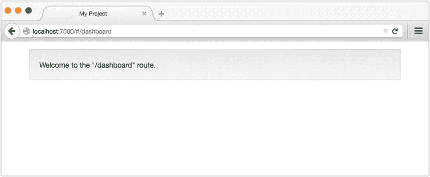

# 3.自耕农

一个人一生中只需要两种工具:让事情进展的 WD-40 和让事情停止的管道胶带。—G. Weilacher

近年来，发展界目睹了各种角色的转换。与本地应用相比，曾经被许多人视为二等公民的 web 应用已经在很大程度上取代了传统的桌面应用，这在很大程度上要归功于现代 Web 开发技术的广泛采用和移动 Web 的兴起。但是随着 web 应用程序变得越来越复杂，它们所依赖的工具和引导它们存在的步骤也越来越复杂。

这一章的主题是 Yeoman，它是一个流行的项目“脚手架”工具，通过自动化与启动新应用程序相关的繁琐任务来帮助缓解这个问题。Yeoman 提供了一种创建可重用模板的机制，这些模板描述了项目的初始文件结构、HTML、第三方库和任务运行器配置。这些模板可以通过 npm 与更广泛的开发社区共享，允许开发人员在几分钟内启动遵循一致同意的最佳实践的新项目。

在本章中，您将学习如何:

*   安装约曼
*   利用社区已经发布的约曼生成器
*   用你自己的约曼发电机回馈社区

Note

这一章建立在本书前两章关于鲍尔和咕噜的主题之上。如果您不熟悉这些工具中的任何一个，您可能希望在继续之前阅读该工具的相应章节。

## 安装约曼

约曼的命令行实用程序`yo`可通过 npm 获得。如果您还没有安装 Yeoman，您应该在继续之前安装，如清单 [3-1](#FPar2) 所示。

Listing 3-1\. Installing the `yo` Command-Line Utility via npm

`$ npm install -g yo`

`$ yo --version`

`1.4.6`

## 创建您的第一个项目

Yeoman 允许开发人员通过使用可重用的模板快速创建应用程序的初始结构，Yeoman 称之为“生成器”为了更好地理解这个过程如何改进您的工作流，让我们在专门为本章创建的`modernweb`生成器的帮助下创建一个新项目。之后，我们将看看这个生成器是如何创建的，为您提供创建和与更广泛的开发社区共享您自己的定制 Yeoman 生成器所需的知识。

我们将使用的生成器将创建一个项目的初始基础，该项目使用以下工具和库:

*   咕哝
*   凉亭
*   框架
*   安古斯
*   浏览
*   指南针

约曼发电机作为全球 npm 模块安装。既然如此，安装我们的生成器的命令应该看起来很熟悉:

`$ npm install -g generator-modernweb`

Note

这个生成器的名字以`generator-`为前缀，这是所有约曼生成器都必须遵循的重要约定。在运行时，Yeoman 将通过搜索名称遵循这种格式的全局模块来确定安装了什么(如果有的话)生成器。

现在安装好了我们的发电机，我们可以继续设置我们的第一个项目了。首先，我们创建一个新文件夹来包含它。之后，我们指示 Yeoman 基于我们刚刚安装的生成器创建一个新项目。清单 [3-2](#FPar4) 展示了这些步骤，以及生成器设计用来提示您的几个问题。

Listing 3-2\. Creating Our First Project with the `modernweb` Generator

`$ mkdir my-app`

`$ cd my-app`

`$ yo modernweb`

`? Project Title: My Project`

`? Package Name: my-project`

`? Project Description: My awesome project`

`? Project Author: John Doe`

`? Express Port: 7000`

在回答了生成器的问题之后(您可以放心地接受默认值)，Yeoman 将继续创建项目。之后，我们可以使用项目的默认 Grunt 任务轻松地构建和启动它，我们的生成器已经为我们方便地设置了这个任务(参见清单 [3-3](#FPar5) )。

Listing 3-3\. Our New Project’s Default Grunt Task Will Trigger Various Build Steps and Open the Project Within Our Browser

`$ grunt`

`Running "concat:app" (concat) task`

`File public/dist/libs.js created.`

`Running "compass:app" (compass) task`

`unchanged scss/style.scss`

`Compilation took 0.002s`

`Running "browserify" task`

`Running "concurrent:app" (concurrent) task`

`Running "watch" task`

`Waiting…`

`Running "open:app" (open) task`

`Running "server" task`

`Server is now listening on port: 7000`

`Done, without errors.`

如您所见，我们新项目的默认 Grunt 任务为我们执行了几个额外的构建步骤:

*   JavaScript 库被编译成一个简单的脚本。
*   Sass 样式表被编译。
*   应用程序本身的源代码通过 Browserify 编译。
*   创建一个 Express 实例来服务我们的项目。
*   各种各样的观察脚本被初始化，它们将在发生变化时自动重新编译我们的项目。

我们项目的默认 Grunt 任务的最后一个动作是在一个新的浏览器窗口中启动我们的项目，如图 [3-1](#Fig1) 所示。

图 3-1。

Our new project’s home page, opened for us by the default Grunt task

既然我们的新项目已经为进一步开发做好了准备，让我们花点时间熟悉一下我们的生成器为我们准备的各种模板、脚本和简单任务，特别注意这些文件的内容:

*   `bower.json`
*   `Gruntfile.js`
*   `package.json`
*   `public/index.html`

在 Yeoman 对用户提示和模板支持的帮助下(我们将在下一节详细讨论)，生成器将我们对其初始问题的回答与我们项目文件的内容进行了适当的合并。例如，我们项目的`package.json`文件中的`name`、`description`和`author`的值已经为我们设置好了(见清单 [3-4](#FPar6) )。

Listing 3-4\. Contents of Our Project’s `package.json` File

`// package.json`

`{`

`"name": "my-project",`

`"description": "My awesome project",`

`"author": "John Doe",`

`"files": [],`

`"keywords": [],`

`"dependencies": {},`

`"browserify": {`

`"transform": [`

`"brfs",`

`"bulkify",`

`"folderify"`

`]`

`},`

`"browser": {}`

`}`

### 子命令

最简单的形式是，发生器充当可配置的项目模板，简化了新项目的创建，但这不是它们的唯一目的。除了协助新项目的初始创建，生成器还可以包含其他命令，项目维护人员会发现这些命令在整个开发过程中都很有用。

在清单 [3-2](#FPar4) 中，我们使用`modernweb`生成器创建了一个使用 AngularJS 框架构建的新的单页面应用程序。如果你不熟悉 Angular，不要担心——这个框架的细节现在并不重要。然而，重要的是项目的`public/app/routes`文件夹的内容。请注意，在这个位置已经为我们创建了一个名为`dashboard`的文件夹。该文件夹的内容如清单 [3-5](#FPar7) 所示。

Listing 3-5\. Contents of Our Project’s `public/app/routes/dashboard` Folder

`.`

■t0]

ε──t0″

`// public/app/routes/dashboard/index.js`

`module.exports = {`

`'route': '/dashboard',`

`'controller': function() {`

`},`

`'templateUrl': '/app/routes/dashboard/template.html',`

`'resolve': {}`

`};`

`// public/app/routes/dashboard/template.html`

`
`

`Welcome to the "/dashboard" route.`

`
`

这个项目的设置使得`public/app/routes`中的每个文件夹在应用程序中定义一个不同的“hashbang”路径。在这个例子中，项目的`dashboard`文件夹定义了一条可以在`http://localhost:7000/#/dashboard`访问的路线。知道了这一点，假设我们想在我们的应用程序中添加一个新的`users`路由。为此，我们可以在适当的位置手动创建必要的文件。或者，我们可以使用生成器提供的附加命令来简化这个过程(参见清单 [3-6](#FPar8) )。

Listing 3-6\. Example of Calling the `route` Sub-generator to Automate the Process of Creating New Routes Within Our Angular Application

`$ yo modernweb:route users`

`create public/app/routes/users/index.js`

`create public/app/routes/users/template.html`

`Route `users` created.`

运行该命令后，参考项目的`/public/app/routes`文件夹，注意名为`users`的新文件夹的存在。在这个文件夹中，我们的 Yeoman 生成器已经为我们创建了合适的文件。如果您碰巧还在运行我们在清单 [3-3](#FPar5) 中创建的服务器，那么您应该也能够看到为我们启动的观察脚本已经检测到了这一变化，并自动重新编译了我们的应用程序(参见清单 [3-7](#FPar9) )。

Listing 3-7\. Grunt Automatically Recompiles Application As Changes Are Made

`>> File "public/app/routes/users" added.`

`Running "browserify" task`

`Done, without errors.`

## 创造你的第一台发电机

本章的剩余部分将集中于创建一个定制的 Yeoman 生成器——与上一节中用于引导一个围绕 AngularJS(以及其他工具)构建的新项目的生成器相同。之后，您将准备好开始创建您自己的生成器，这将允许您快速启动并运行满足您特定需求的工作流。

### 约曼发电机是节点模块

约曼生成器只不过是一个简单的节点模块，它遵循约曼规定的准则。因此，创建生成器的第一步是创建一个新的节点模块。清单 [3-8](#FPar10) 显示了所需的命令，以及生成的`package.json`文件。

Listing 3-8\. Creating a New Node Module to Contain the Contents of Our First Yeoman Generator

`$ mkdir generator-example`

`$ cd generator-example`

`$ npm init`

`// generator-example/package.json`

`{`

`"name": "generator-example",`

`"version": "1.0.0",`

`"description": "An example Yeoman generator",`

`"files": [],`

`"keywords": [`

`"yeoman-generator"`

`],`

`"dependencies": {}`

`}`

Note

尽管我们遵循的步骤与本章前面提到的创建`modernweb`生成器的步骤相同，但是我们为新模块分配了一个不同的名称，以免与已经安装的模块冲突。还要注意在我们模块的关键字列表中包含了`yeoman-generator`。Yeoman 的网站维护了一个列表，列出了 npm 中所有可用的生成器，使得开发人员可以很容易地找到预先存在的生成器来满足他们的需求。如果一个生成器要包含在这个列表中，它必须包含这个关键字，以及在它的`package.json`文件中的描述。

与任何其他节点模块一样，Yeoman 生成器可以选择依赖外部依赖项。然而，最起码，每个生成器都必须将`yeoman-generator`模块指定为本地依赖项。本模块将为我们提供由 Yeoman 提供的核心功能，用于创建用户交互、与文件系统交互以及其他重要任务。使用以下命令将该模块安装为本地依赖项:

`$ npm install yeoman-generator --save`

### 子发电机

Yeoman 生成器由一个或多个命令组成，每个命令都可以从命令行单独调用。这些命令被 Yeoman 称为“子生成器”，它们被定义在模块根级的文件夹中。对于一些额外的上下文，请回头参考清单 [3-2](#FPar4) ，其中我们通过从命令行运行`$ yo modernweb`创建了一个基于`modernweb`生成器的新项目。在那个例子中，我们没有指定命令——我们只是将生成器的名称传递给了 Yeoman。因此，约曼执行了该生成器的默认子生成器，按照惯例它总是被命名为`app`。我们可以通过运行以下命令完成同样的事情:

`$ yo modernweb:app`

为了更好地理解这是如何工作的，让我们继续创建生成器的默认`app`子生成器。我们分四步完成:

Create a folder named `app` at the root level of our module.   Create a folder named `templates` within our new `app` folder.   Place various files within our `templates` folder that we want to copy into the target project (e.g., HTML files, Grunt tasks, a Bower manifest, and so forth).   Create the script shown in Listing [3-9](#FPar12), which is responsible for driving the functionality for this command.   Listing 3-9\. Contents of Our Generator’s Default `app` Command (“Sub-generator”)

`// generator-example/app/index.js`

`var generators = require('yeoman-generator');`

`/**`

`* We create our generator by exporting a class that extends`

`* from Yeoman’s `Base` class.`

`*/`

`module.exports = generators.Base.extend({`

`'prompting': function() {`

`/**`

`* Indicates that this function will execute asynchronously. Yeoman`

`* will wait until we call the `done()` function before continuing.`

`*/`

`var done = this.async();`

`/**`

`* Our generator’s `prompt` method (inherited from Yeoman’s `Base``

`* class) allows us to define a series of questions to prompt the`

`* user with.`

`*/`

`this.prompt([`

`{`

`'type': 'input',`

`'name': 'title',`

`'message': 'Project Title',`

`'default': 'My Project',`

`'validate': function(title) {`

`return (title.length > 0);`

`}`

`},`

`{`

`'type': 'input',`

`'name': 'package_name',`

`'message': 'Package Name',`

`'default': 'my-project',`

`'validate': function(name) {`

`return (name.length > 0 & /^[a-z0-9\-]+$/i.test(name));`

`},`

`'filter': function(name) {`

`return name.toLowerCase();`

`}`

`},`

`{`

`'type': 'input',`

`'name': 'description',`

`'message': 'Project Description',`

`'default': 'My awesome project',`

`'validate': function(description) {`

`return (description.length > 0);`

`}`

`},`

`{`

`'type': 'input',`

`'name': 'author',`

`'message': 'Project Author',`

`'default': 'John Doe',`

`'validate': function(author) {`

`return (author.length > 0);`

`}`

`},`

`{`

`'type': 'input',`

`'name': 'port',`

`'message': 'Express Port',`

`'default': 7000,`

`'validate': function(port) {`

`port = parseInt(port, 10);`

`return (!isNaN(port) & port > 0);`

`}`

`}`

`], function(answers) {`

`this._answers = answers;`

`done();`

`}.bind(this));`

`},`

`'writing': function() {`

`/**`

`* Copies files from our sub-generator’s `templates` folder to the target`

`* project. The contents of each file is processed as a Lodash template`

`* before being written to the disk.`

`*/`

`this.fs.copyTpl(`

`this.templatePath('**/*'),`

`this.destinationPath(),`

`this._answers`

`);`

`this.fs.copyTpl(`

`this.templatePath('pkg.json'),`

`this.destinationPath('package.json'),`

`this._answers`

`);`

`this.fs.delete(this.destinationPath('pkg.json'));`

`this.fs.copyTpl(`

`this.templatePath('.bowerrc'),`

`this.destinationPath('.bowerrc'),`

`this._answers`

`);`

`/**`

`* Writes a Yeoman configuration file to the target project’s folder.`

`*/`

`this.config.save();`

`},`

`'install': function() {`

`/**`

`* Installs various npm modules within the project folder and updates`

`* `package.json` accordingly.`

`*/`

`this.npmInstall([`

`'express', 'lodash', 'underscore.string', 'browserify',`

`'grunt', 'grunt-contrib-concat', 'grunt-contrib-watch',`

`'grunt-contrib-compass', 'grunt-concurrent', 'bulk-require',`

`'brfs', 'bulkify', 'folderify', 'grunt-open'`

`], {`

`'saveDev': false`

`});`

`/**`

`* Installs dependencies defined within `bower.json`.`

`*/`

`this.bowerInstall();`

`},`

`'end': function() {`

`this.log('Your project is ready.');`

`}`

`});`

我们的生成器的`app`文件夹的内容如图 [3-2](#Fig2) 所示。

图 3-2。

The contents of our generator’s `app` folder. The contents of the `templates` folder will be copied into the target project

在清单 [3-9](#FPar12) 中，我们的生成器的默认`app`命令是通过导出一个从 Yeoman 的`Base`类扩展而来的类来创建的。在这个类中，定义了四个实例方法:

*   `prompting()`
*   `writing()`
*   `install()`
*   `end()`

这些方法名在执行过程中起着重要的作用(它们不是随意选择的)。当 Yeoman 运行一个生成器时，它会搜索其名称与下面列出的名称相匹配的原型方法:

*   `initializing()`:初始化方法(检查项目状态，获取配置)。
*   `prompting()`:提示用户输入信息
*   `configuring()`:保存配置文件。
*   `default()`:名称不在此列表中的原型方法将在此步骤中执行。
*   `writing()`:特定于该发生器的写操作发生在这里。
*   冲突在这里处理(由约曼内部使用)。
*   安装程序在这里进行(npm，bower)。
*   `end()`:最后调用的函数。清理/关闭消息。

一旦 Yeoman 编译了我们的生成器中存在的各种原型方法的列表，它将按照前面列表中显示的优先级执行它们。

#### Lodash 模板

在清单 [3-9](#FPar12) 中，Yeoman 的`fs.copyTpl()`方法用于将文件从子生成器的`templates`文件夹复制到目标项目。这种方法不同于约曼的`fs.copy()`方法，因为它也将找到的每个文件作为 Lodash 模板进行处理。清单 [3-10](#FPar13) 显示了我们的子生成器的`templates/pkg.json`文件的内容，在以`package.json`保存到新项目的文件夹之前，将以这种方式进行处理。

Listing 3-10\. Contents of Our Sub-generator’s `templates/pkg.json` File

`// generator-example/app/templates/pkg.json`

`{`

`"name": "<%= package_name %>",`

`"description": "<%= description %>",`

`"author": "<%= author %>",`

`"files": [],`

`"keywords": [],`

`"dependencies": {},`

`"browserify": {`

`"transform": [`

`"brfs",`

`"bulkify",`

`"folderify"`

`]`

`},`

`"browser": {}`

`}`

Note

Yeoman 生成器可以根据用户对提示的回答修改它们的行为和改变模板的内容，这一过程开辟了许多令人兴奋的可能性。它允许创建根据用户的特定需求动态配置的新项目。正是 Yeoman 的这一方面，比其他任何方面都更让这个工具真正有用。

我们现在准备使用新的生成器创建我们的第一个项目。为此，请打开一个新的终端窗口，并创建一个文件夹来包含它。接下来，移动到新文件夹并运行生成器，如清单 [3-11](#FPar15) 所示。

Listing 3-11\. Running Our New Generator for the First Time

`$ mkdir new-project`

`$ cd new-project`

`$ yo example`

`Error example`

`You don’t seem to have a generator with the name example installed.`

`You can see available generators with npm search yeoman-generator and then install the`

`with npm install [name].`

显然，这不是我们希望的结果。为了理解是什么导致了这个错误，回想一下本章前面的内容，当调用 Yeoman 时，它通过搜索已经安装在全局上下文中的名称以`generator-`开头的模块来定位生成器。因此，约曼目前不知道我们的新发电机的存在。幸运的是，npm 提供了一个方便的命令来解决这个问题。`npm link`命令在我们的新模块和节点的全局模块文件夹之间创建一个符号链接。该命令在我们新模块的根级别执行(参见清单 [3-12](#FPar16) )。

Listing 3-12\. Creating a Symbolic Link with the `npm link` Command

`$ npm link`

`/Users/tim/.nvm/v0.10.33/lib/node_modules/generator-example -> /opt/generator-example`

Npm 的`link`命令在运行它的文件夹和存储全局安装的节点模块的文件夹之间创建一个符号链接。通过运行这个命令，我们在一个 Yeoman 可以找到的位置放置了一个对新生成器的引用。有了这个链接，让我们再次运行我们的生成器(参见清单 [3-13](#FPar17) )。

Listing 3-13\. Successfully Running Our New Generator for the First Time

`$ yo example`

`? Project Title: My Project`

`? Package Name: my-project`

`? Project Description: My awesome project`

`? Project Author: John Doe`

`? Express Port: 7000`

在回答了生成器的问题后，约曼将继续构建我们的新项目，就像我们在本章前半部分使用的`modernweb`生成器一样。一旦这个过程完成，运行 Grunt 的默认任务—`$ grunt`—来构建和启动这个项目。

### 定义辅助命令

在本章的前半部分，您了解了 Yeoman 生成器可以包含多个命令，这些命令的用途远远超出了新项目的初始创建。`modernweb`生成器通过包含一个`route`命令来演示这一点，该命令可以在 Angular 应用程序中自动创建新路线(参见本章前面的清单 [3-6](#FPar8) )。创建这个命令所涉及的步骤与我们创建生成器的默认`app`命令时所采取的步骤非常相似:

Create a folder named `route` at the root level of our module.   Create a folder named `templates` within our new `route` folder.   Place various files within our `templates` folder that we want to copy into the target project.   Create the script shown in Listing [3-14](#FPar18), which is responsible for driving the functionality for the `route` command.   Listing 3-14\. A `route` Sub-generator That Automates the Creation of New Angular Routes

`// generator-example/route/index.js`

`var generators = require('yeoman-generator');`

`/*`

`Our generator’s default `app` command was created by extending Yeoman’s `Base` class. In this example, we extend the `NamedBase` class, instead. Doing so alerts Yeoman to the fact that this command expects one or more arguments. For example: $ yo example:route my-new-route`

`*/`

`module.exports = generators.NamedBase.extend({`

`'constructor': function(args) {`

`this._opts = {`

`'route': args[0]`

`};`

`generators.NamedBase.apply(this, arguments);`

`},`

`'writing': function() {`

`this.fs.copyTpl(`

`this.templatePath('index.js'),`

`this.destinationPath('public/app/routes/' + this._opts.route + '/index.js'),`

`this._opts`

`);`

`this.fs.copyTpl(`

`this.templatePath('template.html'),`

`this.destinationPath('public/app/routes/' + this._opts.route + '/template.html'),`

`this._opts`

`);`

`},`

`'end': function() {`

`this.log('Route `' + this._opts.route + '` created.');`

`}`

`});`

清单 [3-14](#FPar18) 中显示的脚本看起来与清单 [3-9](#FPar12) 中显示的非常相似，主要区别是使用了约曼的`NamedBase`类。通过创建一个从`NamedBase`扩展而来的子生成器，我们提醒 Yeoman 这个命令需要接收一个或多个参数。

清单 [3-15](#FPar19) 展示了我们的生成器的新`route`命令的使用。

Listing 3-15\. Creating a New Angular Route Using Our Generator’s `route` Command

`$ yo example:route users`

`create public/app/routes/users/index.js`

`create public/app/routes/users/template.html`

`Route `users` created.`

### 可组合性

在创建 Yeoman 生成器时，经常会遇到这样的情况:能够从一个子生成器中执行另一个子生成器是非常有用的。例如，考虑我们刚刚创建的生成器。很容易想象这样一个场景，我们可能希望生成器在运行时自动创建几条默认路由。为了实现这个目标，如果我们能够从生成器的`app`命令中调用它的`route`命令，那将会很有帮助。约曼的`composeWith()`方法就是因为这个原因而存在的(见清单 [3-16](#FPar20) )。

Listing 3-16\. Yeoman’s `composeWith()` Method Allows One Sub-generator to Call Another

`// generator-example/app/index.js (excerpt)`

`'writing': function() {`

`this.fs.copyTpl(`

`this.templatePath('**/*'),`

`this.destinationPath(),`

`this._answers`

`);`

`this.fs.copy(`

`this.templatePath('.bowerrc'),`

`this.destinationPath('.bowerrc'),`

`this._answers`

`);`

`/*`

`Yeoman’s `composeWith` method allows us to execute external generators.`

`Here, we trigger the creation of a new route named "dashboard".`

`*/`

`this.composeWith('example:route', {`

`'args': ['dashboard']`

`});`

`this.config.save();`

`}`

在约曼`composeWith()`方法的帮助下，简单的子生成器可以相互组合(即“组合”)以创建相当复杂的工作流。通过利用这种方法，开发人员可以创建复杂的多命令生成器，同时避免跨命令使用重复的代码。

## 摘要

Yeoman 是一个简单但功能强大的工具，它自动化了与启动新应用程序相关的繁琐任务，加快了开发人员从概念到原型的过程。使用时，它允许开发人员将他们的注意力集中在最重要的地方——应用程序本身。

据最新统计，已有超过 1，500 个 Yeoman 生成器发布到 npm，这使得开发人员可以轻松地试验他们可能没有经验的各种工具、库、框架和设计模式(例如，Bower、Grunt、AngularJS、Knockout、React)。

### 相关资源

*   约曼: [`http://yeoman.io/`](http://yeoman.io/)