# 四、PM2

不要等待；时间永远不会“恰到好处”。从你所站的地方开始，使用你所掌握的任何工具，随着你的前进，你会发现更好的工具。—乔治·赫伯特

本节的前几章已经介绍了各种有用的 web 开发工具，我们主要关注客户端开发。在这一章中，我们将通过把我们的焦点转移到服务器上来完善我们对开发工具的介绍。我们将探索 PM2，这是一个命令行实用程序，它简化了许多与运行节点应用程序、监控它们的状态以及高效地扩展它们以满足不断增长的需求相关的任务。涵盖的主题包括:

*   使用流程
*   监控日志
*   监控资源使用情况
*   高级流程管理
*   跨多个处理器的负载平衡
*   零停机部署

## 装置

PM2 的命令行实用程序`pm2`可以通过 npm 获得。如果您还没有安装 PM2，您应该在继续之前安装，如清单 [4-1](#FPar1) 所示。

Listing 4-1\. Installing the `pm2` Command-line Utility via npm

`$ npm install -g pm2`

`$ pm2 --version`

`0.12.15`

Note

Node 的软件包管理器(npm)允许用户在两种环境中安装软件包:本地或全局。在本例中，`bower`安装在全局上下文中，该上下文通常是为命令行实用程序保留的。

## 使用流程

清单 [4-2](#FPar3) 显示了一个简单节点应用程序的内容，它将构成我们与 PM2 最初几次交互的基础。当被访问时，它只显示消息“Hello，world”给用户。

Listing 4-2\. Simple Express Application

`// my-app/index.js`

`var express = require('express');`

`var morgan = require('morgan');`

`var app = express();`

`app.use(morgan('combined'));`

`app.get('/', function(req, res, next) {`

`res.send('Hello, world.\n');`

`});`

`app.listen(8000);`

图 [4-1](#Fig1) 展示了我们在`pm2`命令行实用程序的帮助下启动该应用程序的过程。在这个例子中，我们指示 PM2 通过执行它的`index.js`脚本来启动我们的应用程序。我们还为我们的应用程序向 PM2 提供了一个(可选的)名称(`my-app`)，以便于我们以后引用它。在这样做之前，确保通过运行`$ npm install`安装项目的依赖项。

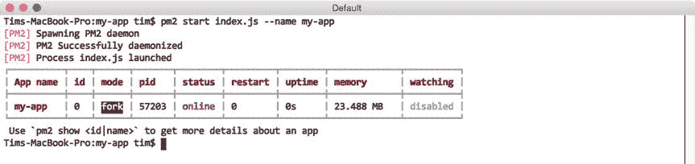

图 4-1。

Launching the application shown in Listing [4-2](#FPar3) with PM2

在调用了 PM2 的`start`命令后，PM2 显示了一个表格，其中包含了它当前知道的每个节点应用程序的信息，然后才让我们返回到命令提示符。表 [4-1](#Tab1) 总结了我们在本例中看到的列的含义。

表 4-1。

Summary of Columns Shown in Figure [4-1](#Fig1)

<colgroup><col> <col></colgroup> 
| 标题 | 描述 |
| --- | --- |
| `App name` | 进程的名称。默认为执行的脚本的名称。 |
| `id` | 由 PM2 分配给进程的唯一 ID。可以通过名称或 ID 引用进程。 |
| `mode` | 执行的方法(`fork`或`cluster`)。默认为`fork`。在本章的后面会有更详细的探讨。 |
| `pid` | 操作系统分配给进程的唯一编号。 |
| `status` | 流程的当前状态(如`online`、`stopped`等)。). |
| `restart` | PM2 重新启动进程的次数。 |
| `uptime` | 自上次重新启动以来，进程已经运行的时间长度。 |
| `memory` | 进程消耗的内存量。 |
| `watching` | 指示 PM2 在检测到项目文件结构中的更改时是否会自动重新启动该过程。在开发过程中特别有用。默认为`disabled`。 |

如清单 [4-3](#FPar5) 中 PM2 提供的输出所示，我们的应用程序现在已经上线，可以使用了。我们可以通过使用`curl`命令行实用程序调用我们的应用程序的唯一路由来验证这一点，如图 [4-2](#Fig2) 所示。

图 4-2。

Accessing the sole route defined by our Express application Note

图 [4-2](#Fig2) 假设在您的环境中存在`curl`命令行实用程序。如果您碰巧在没有该实用程序的环境中工作，您也可以通过在 web 浏览器中直接打开它来验证该应用程序的状态。

除了`start`命令，PM2 还提供了许多有用的命令，用于与 PM2 已经知道的进程进行交互，其中最常见的命令如表 [4-2](#Tab2) 所示。

表 4-2。

Frequently Used Commands for Interacting with PM2 Processes

<colgroup><col> <col></colgroup> 
| 命令 | 描述 |
| --- | --- |
| `list` | 显示清单 [4-4](#FPar6) 中所示表格的最新版本 |
| `stop` | 停止进程，但不将其从 PM2 列表中删除 |
| `restart` | 重新启动该过程 |
| `delete` | 停止进程并将其从 PM2 列表中删除 |
| `show` | 显示有关指定进程的详细信息 |

简单的命令如`stop`、`start`和`delete`不需要额外的注释。另一方面，图 [4-3](#Fig3) 显示了当通过`show`命令请求关于特定 PM2 过程的信息时，您可以期望收到的信息。

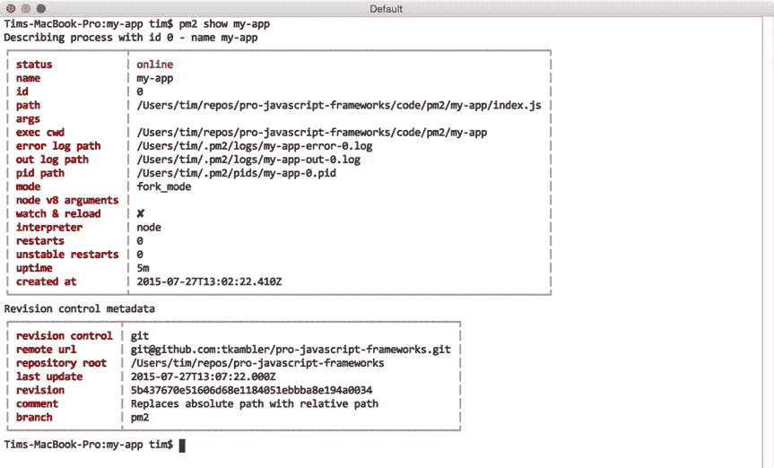

图 4-3。

Viewing details for a specific PM2 process

### 从错误中恢复

至此，您已经熟悉了与 PM2 互动的一些基本步骤。你已经学会了如何在 PM2 的`start`命令的帮助下创建新流程。您还发现了如何在诸如`list`、`stop`、`restart`、`delete`和`show`等命令的帮助下管理正在运行的进程。然而，我们还没有讨论 PM2 在管理节点流程方面带来的真正价值。我们将从发现 PM2 如何帮助节点应用程序从致命错误中自动恢复开始讨论。

清单 [4-3](#FPar5) 显示了我们最初在清单 [4-2](#FPar3) 中看到的应用程序的修改版本。然而，在这个版本中，一个未被捕获的异常被定期抛出。

Listing 4-3\. Modified Version of Our Original Application That Throws an Uncaught Exception Every Four Seconds

`// my-bad-app/index.js`

`var express = require('express');`

`var morgan = require('morgan');`

`var app = express();`

`app.use(morgan('combined'));`

`app.get('/', function(req, res, next) {`

`res.send('Hello, world.\n');`

`});`

`setInterval(function() {`

`throw new Error('Uh oh.');`

`}, 4000);`

`app.listen(8000);`

如果我们在没有 PM2 的帮助下，通过将它直接传递给`node`可执行文件来启动这个应用程序，我们会很快发现自己在第一个错误被抛出的时候就已经不走运了。在将我们转储回命令提示符之前，Node 会简单地将错误消息打印到控制台，如图 [4-4](#Fig4) 所示。

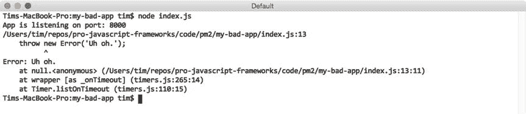

图 4-4。

Output provided by Node after crashing from the error shown in Listing [4-3](#FPar5)

这种行为在真实的使用场景中不会让我们走得太远。理想情况下，已经发布到生产环境中的应用程序应该经过彻底的测试，并且没有这种无法捕获的异常。然而，在这种崩溃的情况下，应用程序至少应该能够在不需要人工干预的情况下恢复在线。PM2 可以帮助我们实现这一目标。

在图 [4-5](#Fig5) 中，我们通过`delete`命令从 PM2 的列表中删除了我们现有的流程，并创建了一个清单 [4-3](#FPar5) 中所示的糟糕的应用程序的新实例。之后，我们等待几秒钟，然后向 PM2 请求最新的进程列表。

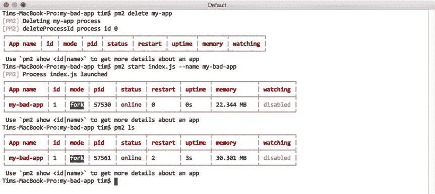

图 4-5。

PM2 helps Node applications recover from fatal errors

注意到这里有什么有趣的吗？基于`status`、`restart`和`uptime`列中的值，我们可以看到我们的应用程序已经崩溃了三次。每一次，PM2 都帮助我们重新启动它。最近的进程总共运行了两秒钟，这意味着从现在起两秒钟后我们可以预期另一个崩溃(和自动重启)。

PM2 帮助应用程序从生产环境中的致命错误中恢复的能力虽然有用，但只是该实用程序提供的几个有用功能之一。PM2 在开发环境中同样有用，我们很快就会看到。

### 响应文件更改

设想一个场景，您最近开始了一个新的节点项目。我们假设它是一个用 Express 构建的 web API。如果没有其他工具的帮助，您必须手动重启相关的节点流程，才能看到正在进行的工作的效果——这是一项令人沮丧的工作，很快就会过时。在这种情况下，PM2 可以通过自动监控项目的文件结构来帮助您。当检测到变化，PM2 可以自动重启你的应用程序，如果你指示它这样做。

图 [4-6](#Fig6) 展示了这一过程。在这个例子中，我们首先删除当前正在运行的实例`my-bad-app`。接下来，我们创建一个应用程序的新实例，如我们最初的例子所示(参见清单 [4-2](#FPar3) )。然而，这一次，我们传递了一个额外的标志，`--watch`，它指示 PM2 监控我们的项目的变化并做出相应的响应。

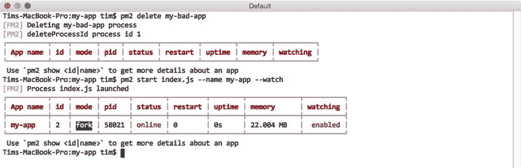

图 4-6。

Creating a new PM2 process that will automatically restart itself as changes are detected

随着更改被保存到这个项目的文件中，对 PM2 的`list`命令的后续调用将显示 PM2 已经重新启动了这个应用程序多少次，如前面的例子所示。

## 监控日志

回头参考清单 [4-2](#FPar3) ，注意这个应用程序使用了`morgan`，一个用于记录传入 HTTP 请求的模块。在本例中，`morgan`被配置为将此类信息打印到控制台。我们可以通过`node`可执行文件直接运行我们的应用程序来查看结果，如图 [4-7](#Fig7) 所示。

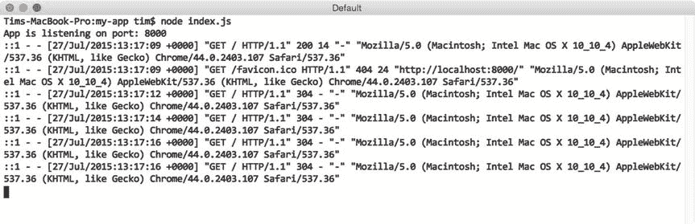

图 4-7。

Logging incoming requests to Express with `morgan`

我们最近探索了如何允许 PM2 通过`start`命令为我们管理这个应用程序的执行(见图 [4-1](#Fig1) )。这样做为我们提供了一些好处，但是它也使我们失去了对应用程序向控制台生成的输出的即时洞察力。幸运的是，PM2 为我们提供了一个监控这种输出的简单机制。

在图 [4-3](#Fig3) 中，我们通过`show`命令向 PM2 请求有关其控制下的特定过程的信息。所提供的信息中包含了 PM2 为该流程自动创建的两个日志文件的路径，一个标记为“输出日志路径”，另一个标记为“错误日志路径”，PM2 会将该流程的标准输出和错误消息分别保存到这两个日志文件中。我们可以直接查看这些文件，但是 PM2 提供了一个更方便的方法来与它们交互，如图 [4-8](#Fig8) 所示。

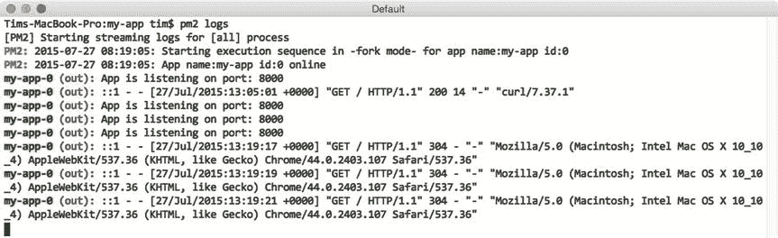

图 4-8。

Monitoring the output from processes under PM2’s control

在这里，我们可以看到如何通过`logs`命令根据需要监控 PM2 控制下的流程的输出。在本例中，我们监控 PM2 控制下的所有进程的输出。请注意 PM2 是如何在每个条目前添加关于每行输出来源的信息的。当使用 PM2 管理多个流程时，这些信息特别有用，我们将在下一节开始这样做。或者，我们也可以通过将特定进程的名称(或 ID)传递给`logs`命令来监控该进程的输出(参见图 [4-9](#Fig9) )。

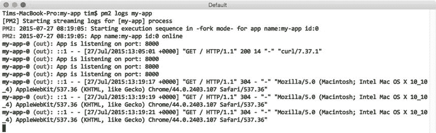

图 4-9。

Monitoring the output from a specific process under PM2’s control

如果您希望随时清除 PM2 生成的日志文件的内容，可以通过调用 PM2 的`flush`命令来快速完成。该实用程序的`logs`命令的行为也可以通过使用两个可选参数进行微调，这两个参数在表 [4-3](#Tab3) 中列出。

表 4-3。

Arguments Accepted by PM2’s `logs` Command

<colgroup><col> <col></colgroup> 
| 争吵 | 描述 |
| --- | --- |
| `–raw` | 显示日志文件的原始内容，去掉进程中带前缀的进程标识符 |
| `–lines <``N`T2】 | 指示 PM2 显示最后 N 行，而不是默认的 20 行 |

## 监控资源使用情况

在上一节中，您了解了 PM2 如何帮助您监控标准输出以及在其控制下的流程所生成的错误。同样，PM2 还提供了易于使用的工具来监控这些进程的健康状况，以及监控运行这些进程的服务器的整体健康状况。

### 监控本地资源

图 [4-10](#Fig10) 展示了调用 PM2 的`monit`命令时产生的输出。在这里，我们可以看到一个持续更新的视图，它允许我们跟踪 CPU 处理能力的大小以及由 PM2 管理的每个进程消耗的 RAM 的大小。

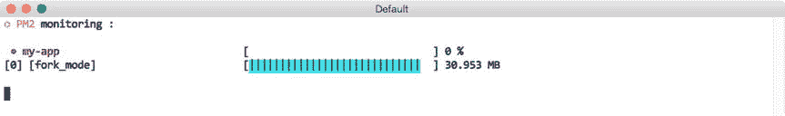

图 4-10。

Monitoring CPU and memory usage via PM2’s `monit` command

### 监控远程资源

PM2 的`monit`命令提供的信息为我们提供了一种快速简单的方法来监控其进程的健康状况。在开发过程中，当我们主要关注在我们自己的环境中消耗的资源时，这个功能特别有用。然而，当一个应用程序转移到一个远程的生产环境中时，它就没那么有用了，这个环境很容易由多台服务器组成，每台服务器都运行自己的 PM2 实例。

PM2 考虑到这一点，还提供了一个内置的 JSON API，可以通过端口 9615 访问。默认禁用，启用过程如图 [4-11](#Fig11) 所示。

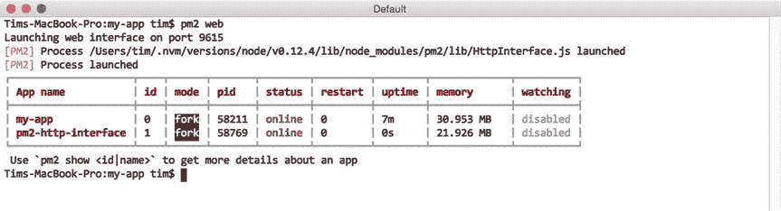

图 4-11。

Enabling PM2’s JSON web API

在这个例子中，我们通过调用实用程序的`web`命令来启用 PM2 的 web 可访问的 JSON API。PM2 将此功能作为独立于 PM2 本身运行的独立应用程序的一部分来实现。结果，我们可以看到一个新的进程，`pm2-http-interface`，现在在 PM2 的控制之下。如果我们希望禁用 PM2 的 JSON API，我们可以像删除其他进程一样删除这个进程，将它的名字(或 ID)传递给`delete`(或`stop`)命令。

清单 [4-4](#FPar6) 显示了通过端口 9615 向运行 PM2 的服务器发出 GET 请求时所提供的输出摘录。正如您所看到的，PM2 为我们提供了许多关于当前在其控制下的每个进程的详细信息，以及运行它的系统。

Listing 4-4\. Excerpt of the Information Provided by PM2’s JSON API

`{`

`"system_info": {`

`"hostname": "iMac.local",`

`"uptime": 2186`

`},`

`"monit": {`

`"loadavg": [1.39794921875],`

`"total_mem": 8589934592,`

`"free_mem": 2832281600,`

`"cpu": [{`

`"model": "Intel(R) Core(TM) i5-4590 CPU @ 3.30GHz",`

`"speed": 3300,`

`"times": {`

`"user": 121680,`

`"nice": 0,`

`"sys": 176220,`

`"idle": 1888430,`

`"irq": 0`

`}`

`}],`

`"interfaces": {`

`"lo0": [{`

`"address": "::1",`

`"netmask": "ffff:ffff:ffff:ffff:ffff:ffff:ffff:ffff",`

`"family": "IPv6",`

`"mac": "00:00:00:00:00:00",`

`"scopeid": 0,`

`"internal": true`

`}],`

`"en0": [{`

`"address": "10.0.1.49",`

`"netmask": "255.255.255.0",`

`"family": "IPv4",`

`"mac": "ac:87:a3:35:9c:72",`

`"internal": false`

`}]`

`}`

`},`

`"processes": [{`

`"pid": 1163,`

`"name": "my-app",`

`"pm2_env": {`

`"name": "my-app",`

`"vizion": true,`

`"autorestart": true,`

`"exec_mode": "fork_mode",`

`"exec_interpreter": "node",`

`"pm_exec_path": "/opt/my-app/index.js",`

`"env": {`

`"_": "/usr/local/opt/nvm/versions/node/v0.12.4/bin/pm2",`

`"NVM_IOJS_ORG_MIRROR": "`[`https://iojs.org/dist`](https://iojs.org/dist)T2】

`"NVM_BIN": "/usr/local/opt/nvm/versions/node/v0.12.4/bin",`

`"LOGNAME": "user",`

`"ITERM_SESSION_ID": "w0t0p0",`

`"HOME": "/Users/user",`

`"COLORFGBG": "7;0",`

`"SHLVL": "1",`

`"XPC_SERVICE_NAME": "0",`

`"XPC_FLAGS": "0x0",`

`"ITERM_PROFILE": "Default",`

`"LANG": "en_US.UTF-8",`

`"PWD": "/opt/my-app",`

`"NVM_NODEJS_ORG_MIRROR": "`[`https://nodejs.org/dist`](https://nodejs.org/dist)T2】

`"PATH": "/usr/local/opt/nvm/versions/node/v0.12.4/bin",`

`"__CF_USER_TEXT_ENCODING": "0x1F5:0x0:0x0",`

`"SSH_AUTH_SOCK": "/private/tmp/com.apple.launchd.kEqu8iouDS/Listeners",`

`"USER": "user",`

`"NVM_DIR": "/usr/local/opt/nvm",`

`"NVM_PATH": "/usr/local/opt/nvm/versions/node/v0.12.4/lib/node",`

`"TMPDIR": "/var/folders/y3/2fphz1fd6rg9l4cg2t8t7g840000gn/T/",`

`"TERM": "xterm",`

`"SHELL": "/bin/bash",`

`"TERM_PROGRAM": "iTerm.app",`

`"NVM_IOJS_ORG_VERSION_LISTING": "`[`https://iojs.org/dist/index.tab`](https://iojs.org/dist/index.tab)T2】

`"pm_cwd": "/opt/my-app"`

`},`

`"versioning": {`

`"type": "git",`

`"url": "git@github.com:tkambler/pro-javascript-frameworks.git",`

`"revision": "18104d13d14673652ee7a522095fc06dcf87f8ba",`

`"update_time": "2015-05-25T20:53:50.000Z",`

`"comment": "Merge pull request #28 from tkambler/ordered-build",`

`"unstaged": true,`

`"branch": "pm2",`

`"remotes": ["origin"],`

`"remote": "origin",`

`"branch_exists_on_remote": false,`

`"ahead": false,`

`"next_rev": null,`

`"prev_rev": "b0e486adab79821d3093c6522eb8a24455bfb051",`

`"repo_path": "/Users/user/repos/pro-javascript-frameworks"`

`}`

`},`

`"pm_id": 0,`

`"monit": {`

`"memory": 32141312,`

`"cpu": 0`

`}`

`}]`

`}`

## 高级流程管理

到目前为止，本章的大部分重点都围绕着主要通过命令行与 PM2 进行的交互。像`start`、`stop`、`restart`和`delete`这样的命令本身为我们提供了简单的机制，以快速、一次性的方式管理流程。但是更复杂的场景呢？也许应用程序需要在运行时指定额外的参数，或者它期望设置一个或多个环境变量。

### JSON 应用程序声明

为了满足这些需求，需要额外的配置，而实现这一点的最佳方式是借助 PM2 所说的“JSON 应用程序配置”文件。清单 [4-5](#FPar7) 中显示了一个示例配置文件，它展示了大多数可用的各种选项。

Listing 4-5\. Sample of the Various Options Available Within a JSON Application Configuration File

`{`

`"name"              : "my-app",`

`"cwd"               : "/opt/my-app",`

`"args"              : ["--argument1=value", "--flag", "value"],`

`"script"            : "index.js",`

`"node_args"         : ["--harmony"],`

`"log_date_format"   : "YYYY-MM-DD HH:mm Z",`

`"error_file"        : "/var/log/my-app/err.log",`

`"out_file"          : "/var/log/my-app/out.log",`

`"pid_file"          : "pids/my-app.pid",`

`"instances"         : 1, // or 0 => 'max'`

`"max_restarts"      : 10, // defaults to 15`

`"max_memory_restart": "1M", // 1 megabytes, e.g.: "2G", "10M", "100K"`

`"cron_restart"      : "1 0 * * *",`

`"watch"             : false,`

`"ignore_watch"      : ["node_modules"],`

`"merge_logs"        : true,`

`"exec_mode"         : "fork",`

`"autorestart"       : false,`

`"env": {`

`"NODE_ENV": "production"`

`}`

`}`

JSON 应用程序配置文件为我们提供了一种标准格式，以一种易于重复和与他人共享的方式将高级设置传递给 PM2。根据之前的示例(例如，`name`、`out_file`、`error_file`、`watch`等)，您在这里看到的几个选项应该很熟悉。).其他的将在这一章的后面提到。表 [4-4](#Tab4) 中提供了每一个的描述。

表 4-4。

Descriptions of the Various Configuration Settings Shown in Listing [4-5](#FPar7)

<colgroup><col> <col></colgroup> 
| 环境 | 描述 |
| --- | --- |
| `name` | 应用程序的名称。 |
| `cwd` | 将从中启动应用程序的目录。 |
| `args` | 要传递给应用程序的命令行参数。 |
| `script` | PM2 启动应用程序的脚本路径(相对于`cwd`)。 |
| `node_args` | 传递给`node`可执行文件的命令行参数。 |
| `log_date_format` | 生成日志时间戳的格式。 |
| `error_file` | 标准错误消息将被记录到的路径。 |
| `out_file` | 将记录突出输出消息的路径。 |
| `pid_file` | 应用程序的 PID(进程标识符)将被记录到的路径。 |
| `instances` | 要启动的应用程序实例的数量。将在下一节详细讨论。 |
| `max_restarts` | 在放弃之前，PM2 将尝试重新启动(连续)失败的应用程序的最大次数。 |
| `max_memory_restart` | 如果应用程序消耗的内存量超过这个阈值，PM2 将自动重启应用程序。 |
| `cron_restart` | PM2 将按照指定的计划自动重启应用程序。 |
| `watch` | PM2 是否应该在检测到文件结构更改时自动重新启动应用程序。默认为`false`。 |
| `ignore_watch` | 如果启用了监视，PM2 应该忽略文件更改的位置数组。 |
| `merge_logs` | 如果创建了一个应用程序的多个实例，PM2 应该为所有实例使用一个输出和错误日志文件。 |
| `exec_mode` | 执行方法。默认为`fork`。将在下一节详细讨论。 |
| `autorestart` | 自动重启崩溃或退出的应用程序。默认为`true`。 |
| `vizon` | 如果启用，PM2 将尝试从应用程序的版本控制文件中读取元数据(如果它们存在)。默认为`true`。 |
| `env` | 包含要传递给应用程序的环境变量键/值的对象。 |

本章包括一个`microservices`项目，它提供了 JSON 配置文件的工作演示。这个项目包含两个应用程序:一个是带有 API 的`weather`应用程序，它返回指定邮政编码的随机温度信息；另一个是`main`应用程序，它每两秒钟向 API 发出一次请求，并将结果打印到控制台。清单 [4-6](#FPar8) 显示了每个应用程序的主要脚本。

Listing 4-6\. Source Code for the `main` and `weather` Applications

`// microservices/main/index.js`

`var request = require('request');`

`if (!process.env.WEATHER_API_URL) {`

`throw new Error('The `WEATHER_API_URL` environment variable must be set.');`

`}`

`setInterval(function() {`

`request({`

`'url': process.env.WEATHER_API_URL + '/api/weather/37204',`

`'json': true,`

`'method': 'GET'`

`}, function(err, res, result) {`

`if (err) throw new Error(err);`

`console.log('The temperature is: %s', result.temperature.fahrenheit);`

`});`

`}, 2000);`

`// microservices/weather/index.js`

`if (!process.env.PORT) {`

`throw new Error('The `PORT` environment variable must be set.');`

`}`

`var express = require('express');`

`var morgan = require('morgan');`

`var app = express();`

`app.use(morgan('combined'));`

`var random = function(min, max) {`

`return Math.floor(Math.random() * (max - min + 1) + min);`

`};`

`app.get('/api/weather/:postal_code', function(req, res, next) {`

`var fahr = random(70, 110);`

`res.send({`

`'temperature': {`

`'fahrenheit': fahr,`

`'celsius': (fahr - 32) * (5/9)`

`}`

`});`

`});`

`app.listen(process.env.PORT);`

一个 JSON 应用程序配置文件也包含在`microservices`项目中，其内容如清单 [4-7](#FPar9) 所示。

Listing 4-7\. JSON Application Configuration File for this Chapter’s `microservices` Projectmicroservices/pm2/development.json

`[`

`{`

`"name"              : "main",`

`"cwd"               : "../microservices",`

`"script"            : "main/index.js",`

`"max_memory_restart": "60M",`

`"watch"             : true,`

`"env": {`

`"NODE_ENV": "development",`

`"WEATHER_API_URL": "``http://localhost:7010`T2】

`}`

`},`

`{`

`"name"              : "weather-api",`

`"cwd"               : "../microservices",`

`"script"            : "weather/index.js",`

`"max_memory_restart": "60M",`

`"watch"             : true,`

`"env": {`

`"NODE_ENV": "development",`

`"PORT": 7010`

`}`

`}`

`]`

此处显示的应用程序配置文件为 PM2 提供了如何启动该项目中包含的每个应用程序的说明。在本例中，如果检测到任何一个应用程序的文件结构发生变化，或者如果它们开始消耗超过 60MB 的内存，PM2 将被指示重新启动每个应用程序。该文件还为 PM2 提供了要传递给每个进程的单独的环境变量。

Note

在运行这个示例之前，您需要调整这个文件中的`cwd`设置的值，以便它们引用您计算机上的`microservices`文件夹的绝对路径。在做了适当的调整后，用一个对 PM2 的调用启动这两个应用程序，如图 [4-12](#Fig12) 所示。

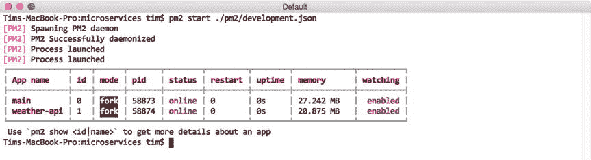

图 4-12。

Launching the `main` and `weather-api` applications with PM2

不出所料，PM2 为我们创建了两个实例，配置文件中引用的每个应用程序都有一个。和前面的例子一样，我们可以在 PM2 的`logs`命令的帮助下监控生成的输出(见图 [4-13](#Fig13) )。

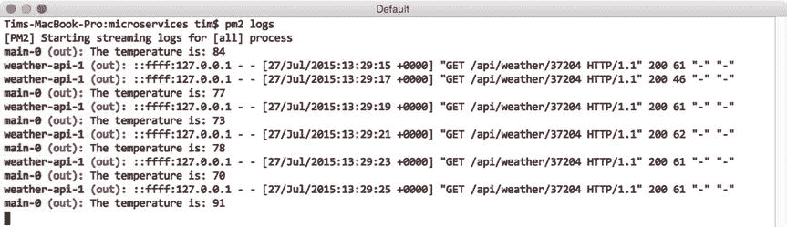

图 4-13。

Excerpt of the output generated by PM2’s `logs` command

## 跨多个处理器的负载平衡

Node I/O 模型的单线程、非阻塞特性使开发人员能够相对轻松地创建能够处理数千个并发连接的应用程序。虽然 Node 处理传入请求的效率令人印象深刻，但它也带来了一项巨大的开销:无法将计算分散到多个 CPU 上。幸运的是，Node 的核心`cluster`模块提供了解决这一限制的方法。有了它，开发人员可以编写能够创建自己的子进程的应用程序——每个子进程运行在单独的处理器上，每个子进程都能够与其他子进程和启动它的父进程共享端口的使用。

在我们结束这一章之前，让我们看一下由 PM2 提供的 Node 的`cluster`模块的一个方便的抽象。有了这个功能，最初没有利用 Node 的`cluster`模块的应用程序可以以一种允许它们充分利用多处理器环境的方式启动。因此，开发人员可以快速扩展他们的应用程序以满足不断增长的需求，而不必立即被迫增加服务器。

清单 [4-8](#FPar11) 显示了一个简单的 Express 应用程序的源代码，我们将在 PM2 的帮助下跨多个处理器进行扩展，而清单 [4-9](#FPar12) 显示了附带的 JSON 应用程序配置文件。

Listing 4-8\. Express Application to be Scaled Across Multiple CPUs

`// multicore/index.js`

`if (!process.env.port) throw new Error('The port environment variable must be set');`

`var express = require('express');`

`var morgan = require('morgan');`

`var app = express();`

`app.use(morgan('combined'));`

`app.route('/')`

`.get(function(req, res, next) {`

`res.send('Hello, world.');`

`});`

`app.listen(process.env.port);`

Listing 4-9\. JSON Application Configuration File with Which Our Application Will Be Launched

`// multicore/pm2/development.json`

`{`

`"name": "multicore",`

`"cwd": "../multicore",`

`"max_memory_restart": "60M",`

`"watch": false,`

`"script": "index.js",`

`"instances": 0, // max`

`"exec_mode": "cluster",`

`"autorestart": true,`

`"merge_logs": true,`

`"env": {`

`"port": 9000`

`}`

`}`

清单 [4-9](#FPar12) 中所示的应用程序配置文件包含两个感兴趣的关键项目。首先是`instances`属性。在这个例子中，我们指定了一个值`0`，它指示 PM2 为它找到的每个 CPU 启动一个单独的进程。第二个是`exec_mode`地产。通过指定`cluster`的值，我们指示 PM2 启动它自己的父进程，它将在节点的`cluster`模块的帮助下依次为我们的应用程序启动单独的子进程。

在图 [4-14](#Fig14) 中，我们通过将应用程序配置文件的路径传递给 PM2 的`start`命令来启动应用程序。之后，PM2 显示了所有已知进程的列表，和前面的例子一样。在本例中，我们看到 PM2 为我们环境中的八个可用 CPU 分别启动了一个单独的进程。我们可以通过使用`monit`命令监控每个新进程的 CPU 使用情况来验证这一点，如图 [4-15](#Fig15) 所示。

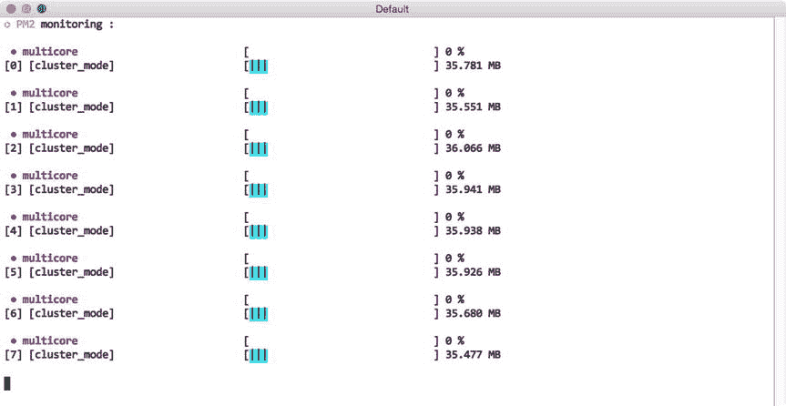

图 4-15。

Monitoring CPU usage with PM2’s `monit` command

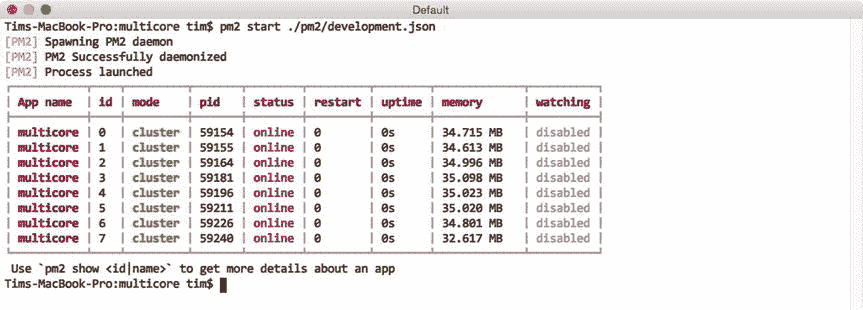

图 4-14。

Launching the application on cluster mode with PM2 Note

当以集群模式启动应用程序时，PM2 会向控制台打印一条消息，警告该功能仍是测试版功能。然而，据 PM2 的首席开发人员称，只要使用 Node v0.12.0 或更高版本，这种功能对于生产环境来说就足够稳定了。

在继续之前，您可以通过运行`$ pm2 delete multicore`快速删除本例启动的八个进程中的每一个。

### 零停机部署

在集群模式下启动应用程序后，PM2 将开始以循环方式将传入的请求转发给它所控制的八个进程中的每一个——为我们提供了巨大的性能提升。一个额外的好处是，让我们的应用程序分布在多个处理器上还允许我们发布更新，而不会导致任何停机，我们马上就会看到这一点。

想象一个场景，在 PM2 的控制下，一个应用程序运行在一个或多个服务器上。随着该应用程序的更新变得可用，向公众发布它们将涉及两个关键步骤:

*   将更新的源代码复制到适当的服务器
*   在 PM2 的控制下重新启动每一个进程

随着这些步骤的进行，将引入一段短暂的停机时间，在此期间，对应用程序的传入请求将被拒绝——除非采取特殊的预防措施。幸运的是，在集群模式下使用 PM2 启动应用程序为我们提供了采取这些预防措施所需的工具。

为了避免重新启动我们之前在清单 [4-8](#FPar11) 中看到的应用程序时的任何停机时间，我们首先需要对我们的应用程序的源代码和应用程序配置文件做一个小的调整。更新后的版本如清单 [4-10](#FPar14) 所示。

Listing 4-10\. Application Designed to Take Advantage of PM2’s `gracefulReload` Command

`// graceful/index.js`

`if (!process.env.port) throw new Error('The port environment variable must be set');`

`var server;`

`var express = require('express');`

`var morgan = require('morgan');`

`var app = express();`

`app.use(morgan('combined'));`

`app.route('/')`

`.get(function(req, res, next) {`

`res.send('Hello, world.');`

`});`

`process.on('message', function(msg) {`

`switch (msg) {`

`case 'shutdown':`

`server.close();`

`break;`

`}`

`});`

`server = app.listen(process.env.port, function() {`

`console.log('App is listening on port: %s', process.env.port);`

`});`

`// graceful/pm2/production.json`

`{`

`"name": "graceful",`

`"cwd": "../graceful",`

`"max_memory_restart": "60M",`

`"watch": false,`

`"script": "index.js",`

`"instances": 0, // max`

`"exec_mode": "cluster",`

`"autorestart": true,`

`"merge_logs": false,`

`"env": {`

`"port": 9000,`

`"PM2_GRACEFUL_TIMEOUT": 10000`

`}`

`}`

前面的例子已经演示了 PM2 的`restart`命令的使用，它可以立即停止和启动指定的进程。虽然这种行为在非生产环境中通常不是问题，但是当我们考虑它对我们的应用程序在发出该命令时可能正在处理的任何活动请求的影响时，问题就开始出现了。当稳定至关重要时，PM2 的`gracefulReload`指令是一个更合适的选择。

当被调用时，`gracefulReload`首先向其控制下的每个进程发送一个`shutdown`消息，为它们提供采取任何必要预防措施的机会，以确保任何活动连接都不会受到干扰。只有在经过了一段可配置的时间(通过`PM2_GRACEFUL_TIMEOUT`环境变量指定)后，PM2 才会继续重启进程。

在这个例子中，在收到`shutdown`消息后，我们的应用程序通过调用 Express 为我们创建的 HTTP 服务器上的`close()`方法进行响应。这个方法指示我们的服务器停止接受新的连接，但是允许已经建立的连接完成。只有在十秒钟后(通过`PM2_GRACEFUL_TIMEOUT`指定)，PM2 才会重新启动该进程，此时该进程管理的任何连接都应该已经完成。

图 [4-16](#Fig16) 展示了通过使用`gracefulReload`命令启动和随后重启该应用程序的过程。通过这样做，我们能够在不中断应用程序用户的情况下发布更新。

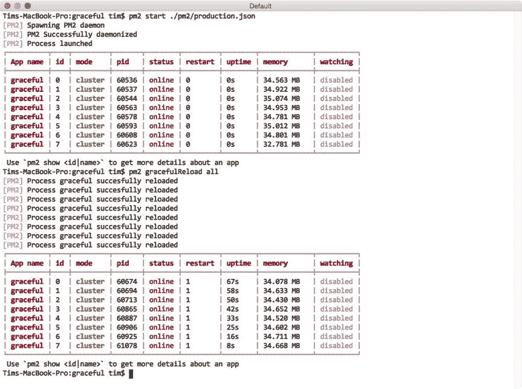

图 4-16。

Gracefully reloading each of the processes under PM2’s control

## 摘要

PM2 为开发人员提供了一个强大的管理节点应用程序的实用工具，无论是在生产环境还是非生产环境中，它都同样适用。一些简单的方面，例如当源代码发生变化时，该实用程序能够自动重启其控制下的进程，这在开发过程中可以节省大量时间。更高级的功能，如跨多个处理器负载平衡应用程序的能力，以及以不会对用户产生负面影响的方式正常重启这些应用程序的能力，也为使用大量节点提供了关键功能。

## 相关资源

*   PM2:[`https://github.com/Unitech/pm2`T2】](https://github.com/Unitech/pm2)