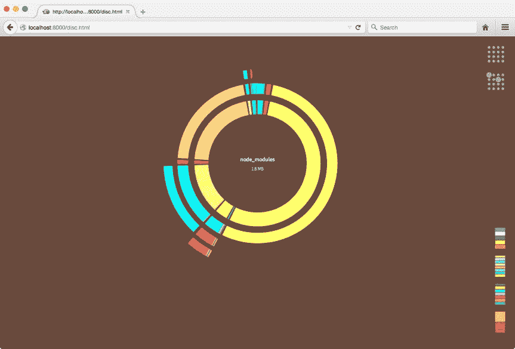
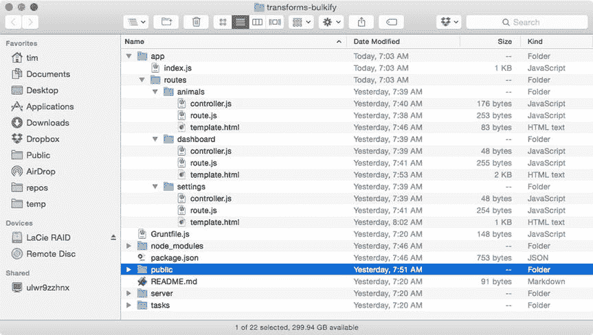

# 6.浏览

少即是多。—路德维希·密斯·凡·德罗

Browserify 是一个 JavaScript 模块加载器，它通过充当代码的“预处理程序”来解决该语言当前缺乏对浏览器中导入模块的支持的问题。与 CSS 扩展(如 SASS 和 LESS)为样式表带来了增强的语法支持一样，Browserify 通过递归扫描源代码来增强客户端 JavaScript 应用程序对全局`require()`函数的调用。当 Browserify 找到这样的调用时，它会立即加载引用的模块(使用 Node.js 中可用的相同的`require()`函数)并将它们组合成一个单一的、缩小的文件——一个“包”——然后可以在浏览器中加载。

这种简单而优雅的方法为浏览器带来了 CommonJS(在 Node.js 中加载模块的方法)的强大和便利，同时也消除了异步模块定义(AMD)加载器(如 RequireJS)所需的额外复杂性和样板代码(在第 5 章中描述)。

在本章中，您将学习如何

*   区分 AMD 和 CommonJS 模块加载器
*   创建模块化前端 JavaScript 应用程序，这些应用程序遵循由 Node.js 等工具普及的简单模块管理模式
*   可视化项目的依赖关系树
*   使用 Browserify 的姊妹应用 Watchify，在发生变化时尽快编译您的应用程序
*   使用第三方浏览器插件(“转换”)来扩展工具的核心功能

Note

本章的部分内容讨论了本书前几章已经涉及的概念，包括凉亭([第一章](01.html))和咕噜声([第二章](02.html))。如果您不熟悉这些工具，建议您在继续之前先了解这些材料。

## AMD API 与 CommonJS

异步模块定义 API，在第 5 章的[中有所介绍，是 JavaScript 当前缺乏对内联加载外部模块支持的一个巧妙的解决方案。通常被称为“浏览器优先”的方法，AMD API 通过要求开发人员将他们的每个模块包装在回调函数中，然后可以根据需要异步加载(即“延迟加载”)来实现其将模块带到浏览器的目标。清单](05.html) [6-1](#FPar2) 中所示的模块演示了这一过程。

Listing 6-1\. Defining and Requiring an AMD Module

`// requirejs-example/public/app/weather.js`

`define([], function() {`

`return {`

`'getForecast': function() {`

`document.getElementById('forecast').innerHTML = 'Partly cloudy.';`

`}`

`};`

`});`

`// requirejs-example/public/app/index.js`

`define(['weather'], function(weather) {`

`weather.getForecast();`

`});`

AMD API 既聪明又有效，但是许多开发人员也发现它有点笨拙和冗长。理想情况下，JavaScript 应用程序应该能够引用外部模块，而不会像 AMD API 那样增加复杂性和样板代码。幸运的是，有一种流行的替代方法 CommonJS 可以解决这个问题。

虽然大多数人倾向于将 JavaScript 与 web 浏览器联系在一起，但事实是，JavaScript 已经在许多其他环境中广泛使用了一段时间——远在 Node.js 出现之前。这种环境的例子包括 Rhino，一个由 Mozilla 创建的服务器端运行时环境，以及 ActionScript，一个由 Adobe 曾经流行的 Flash 平台使用的衍生品，近年来已经失宠。这些平台都通过创建自己的方法来解决 JavaScript 缺乏内置模块支持的问题。

意识到这个问题需要一个标准的解决方案，一组开发人员聚集在一起，提出了 CommonJS，一种定义和使用 JavaScript 模块的标准化方法。Node.js 遵循类似的方法，JavaScript 的下一个重大更新也是如此(ECMAScript 6，也就是 ES6 Harmony)。这种方法也可以用来编写模块化的 JavaScript 应用程序，这些程序可以在今天使用的所有 web 浏览器中运行，尽管还需要一些其他工具的帮助，比如本章的主题 Browserify。

## 安装浏览器

在进一步操作之前，您应该确保已经安装了 Browserify 的命令行实用程序。作为一个 npm 包，安装过程如清单 [6-2](#FPar3) 所示。

Listing 6-2\. Installing the `browserify` Command-Line Utility via npm

`$ npm install -g browserify`

`$ browserify --version`

`10.2.4`

Note

Node 的软件包管理器(npm)允许用户在两种环境中安装软件包:本地或全局。在本例中，`browserify`安装在全局上下文中，该上下文通常是为命令行实用程序保留的。

## 创建您的第一个包

Browserify 的吸引力在于它的简单性；熟悉 CommonJS 和 Node 的 JavaScript 开发人员会发现自己很快就能如鱼得水。举例来说，考虑清单 [6-3](#FPar5) ，它显示了我们在清单 [6-1](#FPar2) 中看到的简单的基于 RequireJS 的应用程序的基于 CommonJS 的等价物。

Listing 6-3\. Front-End Application That Requires Modules via CommonJS

`// simple/public/app/index.js`

`var weather = require('./weather');`

`weather.getForecast();`

`// simple/public/app/weather.js`

`module.exports = {`

`'getForecast': function() {`

`document.getElementById('forecast').innerHTML = 'Partly cloudy.';`

`}`

`};`

与我们基于 RequireJS 的例子不同，这个应用程序不能直接在浏览器中运行，因为浏览器缺少通过`require()`加载模块的内置机制。在浏览器能够理解这个应用程序之前，我们必须首先借助于`browserify`命令行实用程序或者通过 Browserify 的 API 将它编译成一个包。

使用 Browserify 的命令行实用程序编译该应用程序的命令如下:

`$ browserify app/index.js -o public/dist/app.js`

在这里，我们将应用程序主文件 public/ `app/index.js`的路径传递给`browserify`实用程序，并指定编译后的输出应该保存到`public/dist/app.js`，这个脚本在项目的 HTML 中引用(参见清单 [6-4](#FPar6) )。

Listing 6-4\. HTML File Referencing Our Compiled Browserify Bundle

`// simple/public/index.html`

`<!DOCTYPE html>`

`<html>`

`<head>`

`<meta charset="utf-8">`

`<meta http-equiv="X-UA-Compatible" content="IE=edge">`

`<meta name="viewport" content="width=device-width, initial-scale=1">`

`<title>Browserify - Simple Example</title>`

`</head>`

`<body>`

`

`

``

`</body>`

`</html>`

除了使用 Browserify 的命令行实用程序，我们还可以选择通过 Browserify 的 API 以编程方式编译这个应用程序。这样做将允许我们轻松地将这个步骤合并到一个更大的构建过程中(使用 Grunt 等工具开发)。清单 [6-5](#FPar7) 显示了这个项目的`browserify`繁重任务。

Listing 6-5\. Grunt Task That Compiles the Application via Browserify’s API

`// simple/tasks/browserify.js`

`module.exports = function(grunt) {`

`grunt.registerTask('browserify', function() {`

`var done = this.async();`

`var path = require('path');`

`var fs = require('fs');`

`var src = path.join('public', 'app', 'index.js');`

`var target = path.join('public', 'dist', 'app.js');`

`var browserify = require('browserify')([src]);`

`browserify.bundle(function(err, data) {`

`if (err) return grunt.fail.fatal(err);`

`grunt.file.mkdir(path.join('public', 'dist'));`

`fs.writeFileSync(target, data);`

`done();`

`});`

`});`

`};`

## 可视化依赖关系树

如果你碰巧更喜欢视觉学习，图 [6-1](#Fig1) 所示的图表可能会对传达 Browserify 编译过程中发生的事情大有帮助。这里我们看到 Browserify 在编译本章的`advanced`项目时遇到的各种依赖关系的可视化。

图 6-1。

Visualizing the `advanced` project’s dependency tree

将此图表视为页面上的静态呈现并不公平。为了获得完整的效果，您应该编译项目，并通过在项目的文件夹中运行`npm start`在浏览器中查看图表。这样做将允许您将鼠标悬停在图表的各个部分上，每个部分都代表 Browserify 在编译过程中遇到的一个依赖项。虽然在图 [6-1](#Fig1) 中并不明显，但对图表的深入分析表明，我们应用程序的定制代码只占 Browserify 生成的包总大小的很小一部分(9.7kB)。这个项目将近 2MB 的代码中的绝大部分由第三方依赖项组成(例如 Angular、jQuery、Lodash 等。)，这是一个重要的事实，将在本章后面再次引用。

Note

您可能还对研究`browserify-graph`和`colony`命令行实用程序(也可以通过 npm 获得)感兴趣，您可以使用它们来生成项目依赖树的额外可视化。

## 发生变化时创建新的包

利用 Browserify 的项目不能直接在浏览器中运行，它们必须首先被编译。为了最有效地使用该工具，重要的是项目的设置方式要能够在源代码发生变化时自动触发这一步骤。让我们来看看实现这一点的两种方法。

### 用 Grunt 监视文件变化

在 Grunt 的[第 2 章](02.html)中，您发现了像`grunt-contrib-watch`这样的插件是如何让开发者在应用程序源代码发生变化时触发构建步骤的。很容易理解如何将这些工具应用到使用 Browserify 的项目中，并在检测到变更时触发新包的创建。通过运行本章的`simple`项目的默认 Grunt 任务，可以看到这个过程的一个例子，如清单 [6-6](#FPar9) 所示。

Listing 6-6\. Triggering the Creation of New Browserify Builds with Grunt

`$ grunt`

`Running "browserify" task`

`Running "concurrent:serve" (concurrent) task`

`Running "watch" task`

`Waiting...`

`Running "server" task`

`App is now available at:` `http://localhost:7000`

`>> File "app/index.js" changed.`

`Running "browserify" task`

`Done, without errors.`

`Completed in 0.615s at Fri Jun 26 2015 08:31:25 GMT-0500 (CDT) - Waiting...`

在这个例子中，运行默认的 Grunt 任务触发了三个步骤:

*   立即创建了 Browserify 包。
*   启动了一个 web 服务器来托管该项目。
*   执行一个监视脚本，当检测到源代码更改时，该脚本触发新 Browserify 包的创建。

这种简单的方法通常可以很好地服务于大多数小型项目；然而，随着小项目逐渐演变成大项目，开发人员通常会对随之而来的不断增长的构建时间感到沮丧，这是可以理解的。在你尝试每一个更新之前必须等待几秒钟，这可能会很快破坏你可能希望达到的任何“流畅”感。幸运的是，Browserify 的姐妹应用 Watchify 可以在这些情况下帮助我们。

### 使用 Watchify 监视文件更改

如果说 Browserify(完整编译应用程序)可以被认为是切肉刀，那么 Watchify 可以被认为是削皮刀。当被调用时，Watchify 最初完整地编译指定的应用程序；然而，这个过程完成后，Watchify 并没有退出，而是继续运行，观察项目源代码的变化。当检测到更改时，Watchify 只重新编译那些已更改的文件，从而大大加快构建时间。Watchify 通过在每次构建中维护自己的内部缓存机制来实现这一点。

与 Browserify 一样，Watchify 可以通过命令行或提供的 API 调用。在清单 [6-7](#FPar10) 中，本章的`simple`项目是在 Watchify 命令行实用程序的帮助下编译的。在本例中，传递了参数`-v`来指定 Watchify 应该以详细模式运行。因此，Watchify 会在检测到更改时通知我们。

Listing 6-7\. Installing Watchify via npm and Running It Against This Chapter’s `simple` Project

`$ npm install -g watchify`

`$ watchify public/app/index.js -o public/dist/app.js -v`

`778 bytes written to public/dist/app.js (0.03 seconds)`

`786 bytes written to public/dist/app.js (0.01 seconds)`

与 Browserify 一样，Watchify 提供了一个方便的 API，允许我们将其集成到一个更大的构建过程中(参见清单 [6-8](#FPar11) )。我们只需对先前在清单 [6-7](#FPar10) 中显示的 Browserify 任务做一些小小的调整就可以做到。

Listing 6-8\. Grunt Task Demonstrating the Use of Watchify’s API

`// simple/tasks/watchify.js`

`module.exports = function(grunt) {`

`grunt.registerTask('watchify', function() {`

`var done = this.async();`

`var browserify = require('browserify');`

`var watchify = require('watchify');`

`var fs = require('fs');`

`var path = require('path');`

`var src = path.join('public', 'app', 'index.js');`

`var target = path.join('public', 'dist', 'app.js');`

`var targetDir = path.join('public', 'dist');`

`var browserify = browserify({`

`'cache': {},`

`'packageCache': {}`

`});`

`browserify = watchify(browserify);`

`browserify.add(src);`

`var compile = function(err, data) {`

`if (err) return grunt.log.error(err);`

`if (!data) return grunt.log.error('No data');`

`grunt.file.mkdir(targetDir);`

`fs.writeFileSync(target, data);`

`};`

`browserify.bundle(compile);`

`browserify.on('update', function() {`

`browserify.bundle(compile);`

`});`

`browserify.on('log', function(msg) {`

`grunt.log.oklns(msg);`

`});`

`});`

`};`

在这个例子中，我们用`watchify`包装我们的`browserify`实例。之后，我们根据需要通过订阅由我们包装的实例发出的`update`事件来重新编译项目。

## 使用多个包

在前面的“可视化依赖关系树”一节中，我们看了一个交互式图表，它允许我们可视化 Browserify 在编译本章的`advanced`项目时遇到的各种依赖关系(见图 [6-1](#Fig1) )。我们可以从这个图表中得到的最重要的事实之一是，项目的定制代码(在`/app`中找到)只占捆绑包总大小 1.8MB 的很小一部分(9.7kB)，换句话说，这个项目的绝大部分代码由第三方库(例如 Angular、jQuery、Lodash 等)组成。)不太可能经常改变。让我们来看看如何利用这些知识。

本章的`extracted`项目在各方面都与`advanced`项目相同，除了一个例外:`extracted`项目的构建过程创建了两个独立的包，而不是编译一个单独的 Browserify 包:

*   `/dist/vendor.js`:第三方依赖关系
*   `/dist/app.js`:自定义应用代码

通过采用这种方法，浏览器可以更有效地访问发布的项目更新。换句话说，当项目的定制代码发生变化时，浏览器只需要重新下载`/dist/app.js`。将这种方法与`advanced`项目的方法进行对比，在该项目中，每次更新(无论多小)都迫使客户重新下载该项目的近 2MB 包。

清单 [6-9](#FPar12) 显示了`extracted`项目的 HTML 文件。如您所见，这里我们引用了两个独立的包，`/dist/vendor.js`和`/dist/app.js`。

Listing 6-9\. HTML for This Chapter’s `extracted` Project

`// extracted/public/index.html`

`<!DOCTYPE html>`

`<html ng-app="app">`

`<head>`

`<meta charset="utf-8">`

`<meta http-equiv="X-UA-Compatible" content="IE=edge">`

`<meta name="viewport" content="width=device-width, initial-scale=1">`

`<title>Browserify - Advanced Example</title>`

`<link rel="stylesheet" href="/css/style.css">`

`</head>`

`<body class="container">`

`<navbar ng-if="user_id"></navbar>`

`

`

`<footer><a href="/disc.html">View this project’s dependency tree</a></footer>`

``

``

`</body>`

`</html>`

清单 [6-10](#FPar13) 显示了`extracted`项目的 Gruntfile。注意正在设置的特殊配置值(`browserify.vendor_modules`)。

Listing 6-10\. Gruntfile for This Chapter’s `extracted` Project

`// extracted/Gruntfile.js`

`module.exports = function(grunt) {`

`grunt.initConfig({`

`'browserify': {`

`'vendor_modules': [`

`'angular',`

`'bootstrap-sass',`

`'jquery',`

`'angular-route',`

`'angular-sanitize',`

`'restangular',`

`'jquery.cookie',`

`'lodash',`

`'underscore.string',`

`'lodash-deep'`

`]`

`}`

`});`

`grunt.loadTasks('tasks');`

`grunt.registerTask('default', ['compass', 'browserify', 'browserify-vendor', 'init-db', 'concurrent']);`

`};`

清单 [6-11](#FPar14) 显示了`extracted`项目的`browserify`任务的内容。这个任务很大程度上模仿了`advanced`项目中的相应任务，只有一个主要的例外。在这个任务中，我们遍历在项目的 Gruntfile 中定义的第三方模块，对于每个条目，我们指示 Browserify 从编译的包中排除引用的模块。

Listing 6-11\. The `extracted` Project’s `browserify` Grunt Task

`// extracted/tasks/browserify.js`

`module.exports = function(grunt) {`

`grunt.registerTask('browserify', function() {`

`var done = this.async();`

`var path = require('path');`

`var fs = require('fs');`

`var target = path.join('public', 'dist', 'app.js');`

`var vendorModules = grunt.config.get('browserify.vendor_modules') || [];`

`var browserify = require('browserify')([`

`path.join('app', 'index.js')`

`], {`

`'paths': ['app'],`

`'fullPaths': true,`

`'bundleExternal': true`

`});`

`vendorModules.forEach(function(vm) {`

`grunt.log.writelns('Excluding module from application bundle: %s', vm);`

`browserify.exclude(vm);`

`});`

`browserify.bundle(function(err, data) {`

`if (err) return grunt.fail.fatal(err);`

`grunt.file.mkdir(path.join('public', 'dist'));`

`fs.writeFileSync(target, data);`

`grunt.task.run('disc');`

`done();`

`});`

`});`

`};`

最后，清单 [6-12](#FPar15) 显示了`extracted`项目的`browserify-vendor`繁重任务的内容。当运行时，这个任务将创建一个单独的 Browserify 包，只包含我们在清单 [6-10](#FPar13) 中定义的第三方模块。

Listing 6-12\. The `extracted` Project’s `browserify-vendor` Grunt Task

`// extracted/tasks/browserify-vendor.js`

`module.exports = function(grunt) {`

`grunt.registerTask('browserify-vendor', function() {`

`var done = this.async();`

`var path = require('path');`

`var fs = require('fs');`

`var target = path.join('public', 'dist', 'vendor.js');`

`var vendorModules = grunt.config.get('browserify.vendor_modules') || [];`

`var browserify = require('browserify')({`

`'paths': [`

`'app'`

`],`

`'fullPaths': true`

`});`

`vendorModules.forEach(function(vm) {`

`browserify.require(vm);`

`});`

`browserify.bundle(function(err, data) {`

`if (err) return grunt.fail.fatal(err);`

`grunt.file.mkdir(path.join('public', 'dist'));`

`fs.writeFileSync(target, data);`

`done();`

`});`

`});`

`};`

要查看这个过程的运行情况，在您的终端中导航到`extracted`项目并运行`$ npm start`。将安装任何缺少的 npm 模块，并运行项目的默认 Grunt 任务。随着这一过程的进行，将会创建两个独立的包。包含项目定制代码`/dist/app.js`的包只有 14kB 大小。

## 节点方式

正如本章介绍中提到的，Browserify 通过递归扫描源代码来编译项目，以搜索对全局`require()`函数的调用。当找到这些调用时，Browserify 通过 Node 使用的同一个`require()`函数加载它们引用的模块。之后，Browserify 将它们合并成一个浏览器能够理解的包。

在这方面，使用 Browserify 的项目最好被认为是客户端节点应用程序。当这个概念——以及它所包含的一切——被牢记在心时，浏览器功能的许多方面往往会让新来者感到困惑，从而变得更容易理解。现在让我们来看两个这样的方面:模块解析和依赖关系管理。

### 模块解析和 NODE_PATH 环境变量

节点应用程序能够以多种方式引用模块。例如，这里我们看到一个简单的节点应用程序，它需要一个模块，方法是提供其位置的相对路径:

`var animals = require('./lib/animals');`

以类似的方式，这个示例也可以提供这个模块的完整的绝对路径。无论哪种方式，期望节点找到该模块的位置都是相当明显的。现在考虑下面的例子，其中模块仅由名称引用:

`var animals = require('animals');`

在这种情况下，Node 将首先尝试在其核心库中定位被引用的模块。这个过程可以在加载模块时看到，比如节点的文件系统模块`fs`。如果没有找到匹配，Node 将继续搜索名为`node_modules`的文件夹，从调用`require()`的模块的位置开始，沿着文件系统向上搜索。当遇到这些文件夹时，Node 将检查它们是否包含与所请求的相匹配的模块(或包)。这个过程将一直持续到找到匹配为止，如果没有找到匹配，就会抛出异常。

这种简单而强大的方法几乎完全围绕着`node_modules`文件夹，通过这种方法可以在 Node 中进行模块解析。然而，Node 提供了一个经常被忽略的方法，该方法允许开发人员通过定义额外的文件夹来增强这种行为，如果前面的步骤一无所获，则应该允许 Node 在这些文件夹中搜索模块。让我们看看本章的`path-env`项目，它演示了如何实现这一点。

清单 [6-13](#FPar16) 显示了该项目的`package.json`文件的摘录。特别重要的是已经定义的`start`脚本。基于此处显示的设置，当`$ npm start`在这个项目中运行时，在应用程序运行之前，`NODE_PATH`环境变量将被更新，以包含对这个项目的`/lib`文件夹的引用。因此，Node 会将此文件夹添加到它用来解析命名模块位置的文件夹中。

Listing 6-13\. This Project’s `npm start` Script Updates the `NODE_PATH` Environment Variable

`// path-env/package.json`

`{`

`"name": "path-env",`

`"version": "1.0.0",`

`"main": "./bin/index.js",`

`"scripts": {`

`"start": "export NODE_PATH=$NODE_PATH:./lib && node ./bin/index.js"`

`}`

`}`

Note

在 OS X 和 Linux 上，通过运行`export ENVIRONMENT_VARIABLE=value`从终端设置环境变量。在 Windows 命令行中使用的命令是`set ENVIRONMENT_VARIABLE=value`。

设置`NODE_PATH`环境变量的意义乍一看可能并不明显；然而，这样做可以对复杂项目的整洁性和可维护性产生显著的积极影响。为什么呢？因为当使用这种方法时，它基本上允许开发人员创建一个名称空间，通过该名称空间，应用程序的模块(那些不是作为独立 npm 包存在的模块)可以按名称引用，而不是按冗长的相对路径引用。清单 [6-14](#FPar18) 展示了一个简单的例子，展示了它在实践中的样子。

Listing 6-14\. Several of the Modules Contained Within the `path-env` Project

`// path-env/bin/index.js`

`var api = require('app/api');`

`// path-env/lib/app/api/index.js`

`var express = require('express');`

`var path = require('path');`

`var app = express();`

`var animals = require('app/models/animal');`

`app.use('/', express.static(path.join(__dirname, '..', '..', '..', 'public')));`

`app.get('/animals', function(req, res, next) {`

`res.send(animals);`

`});`

`app.listen(7000, function() {`

`console.log('App is now available at:``http://localhost:7000`T2】

`});`

`module.exports = app;`

`// path-env/lib/app/models/animal/index.js`

`module.exports = [`

`'Aardvarks', 'Cats', 'Dogs', 'Lemurs', 'Three-Toed Sloths', 'Zebras'`

`];`

注意这个例子缺少相对的模块引用。例如，注意这个项目的主脚本`bin/index.js`如何能够通过`require('app/api');`加载一个负责初始化 Express 的定制模块。另一种方法是使用相对路径:`require('../lib/app/api');`。任何在复杂的节点应用程序中工作过并且遇到过类似于`require('../../../../models/animal');`的模块引用的人都会很快体会到这种方法带来的代码清晰度的提高。

Note

重要的是要记住，`NODE_PATH`环境变量的使用只在节点(或浏览器)应用程序的上下文中有意义——而不是包。当创建旨在与其他人共享的可重用包时，您应该只依赖于 Node 的默认模块解析行为。

#### 利用 Browserify 中的 NODE_PATH

到目前为止，我们已经关注了`NODE_PATH`环境变量如何对服务器端节点应用程序产生积极的影响。既然我们已经打下了基础，那么让我们看看如何在用 Browserify 编译的基于浏览器的客户端应用程序的上下文中应用这个概念。

清单 [6-15](#FPar23) 显示了本章`advanced`项目的`browserify` Grunt 任务，它负责通过 Browserify 的 API 编译应用程序。特别重要的是使用了`paths`选项，它允许我们为 Browserify 提供一组路径，这些路径应该在编译开始前附加到`NODE_PATH`环境变量中。正是这种设置使我们能够轻松利用本节前面的示例中展示的相同优势。

Listing 6-15\. The `browserify` Grunt Task for This Chapter’s `advanced` Project

`// advanced/tasks/browserify.js`

`module.exports = function(grunt) {`

`grunt.registerTask('browserify', function() {`

`var done = this.async();`

`var path = require('path');`

`var fs = require('fs');`

`var target = path.join('public', 'dist', 'app.js');`

`var browserify = require('browserify')([`

`path.join('app', 'index.js')`

`], {`

`'paths': [`

`'app'`

`],`

`'fullPaths': true`

`});`

`browserify.bundle(function(err, data) {`

`if (err) return grunt.fail.fatal(err);`

`grunt.file.mkdir(path.join('public', 'dist'));`

`fs.writeFileSync(target, data);`

`grunt.task.run('disc');`

`done();`

`});`

`});`

`};`

为了简单地展示这种方法如何对这个项目产生积极的影响，请考虑清单 [6-16](#FPar21) 。这里我们看到一个小模块，它负责加载`lodash`和集成两个第三方工具`underscore.string`和`lodash-deep`。最终导出的值是包含所有三个模块的组合功能的单个对象。

Listing 6-16\. Module Responsible for Loading Lodash and Integrating Various Third-Party Plugins

`// advanced/app/utils/index.js`

`var _ = require('lodash');`

`_.mixin(require('underscore.string'));`

`_.mixin(require('lodash-deep'));`

`module.exports = _;`

作为提供给 Browserify 的`paths`值的结果，我们的应用程序现在可以通过简单地调用`require('app/utils');`从任何位置引用这个模块。

### 依赖性管理

直到最近，“依赖管理”的概念(在很大程度上)在基于浏览器的客户端项目环境中还是一个陌生的概念。然而，这种趋势已经迅速转变，这在很大程度上要归功于 Node 的迅速普及，以及在它之上构建的其他实用程序——本书已经介绍了其中的一些(例如，Bower、Grunt 和 Yeoman)。这些实用程序有助于将急需的工具和指导带到曾经是(现在仍然是)客户端开发的蛮荒的“西部”。

关于依赖性管理，Bower 通过为客户端开发人员提供一种易于使用的机制来管理应用程序所依赖的各种第三方库，从而帮助解决了这一需求。对于不熟悉这个概念并且没有使用 Browserify 等客户端编译器的开发人员来说，Bower 一直是并且将继续是管理项目依赖项的一个可行选项；然而，随着开发人员开始看到 Browserify 等工具提供的优势，Bower 已经开始显示出年龄的迹象。

在本节的开始，我们提到使用 Browserify 的项目最好被认为是客户端节点应用程序。关于依赖性管理，这种说法尤其重要。回想一下，在 Browserify 的编译过程中，项目的源代码被扫描以寻找对全局`require()`函数的调用。找到后，这些调用在 Node 中执行，随后返回值可供客户端应用程序使用。这里的重要含义是，当使用 Browserify 时，当开发人员只依赖 npm(节点的包管理器)时，依赖性管理会大大简化。虽然从技术上来说，是的，可以指导 Browserify 如何加载由 Bower 安装的包，但通常情况下，这只是比它的价值更麻烦。

## 定义浏览器特定的模块

考虑一个场景，您想要创建一个新模块，并打算通过 npm 发布和共享它。您希望这个模块在节点和浏览器中都可以工作(通过 Browserify)。为此，Browserify 支持在项目的`package.json`文件中使用`browser`配置设置。定义后，该设置允许开发人员覆盖用于定位特定模块的位置。为了更好地理解这是如何工作的，让我们看两个简单的例子。

清单 [6-17](#FPar22) 显示了一个简单包的内容。在这个包中，有两个模块，`lib/node.js`和`lib/browser.js`。根据这个包的`package.json`文件，这个包的`main`模块是`lib/node.js`。换句话说，当这个包在一个节点应用程序中被名字引用时，这就是节点将要加载的模块。但是，请注意，已经定义了一个额外的配置设置:`"browser": "./lib/browser.js"`。该设置的结果是，Browserify 将加载该模块，而不是由`main`指定的模块。

Listing 6-17\. Module Exposing Two Distinct Entry Points: One for Node, the Other for Browserify

`// browser1/package.` `json`

`{`

`"name": "browser1",`

`"version": "1.0.0",`

`"main": "./lib/node.js",`

`"browser": "./lib/browser.js"`

`}`

`// browser1/lib/browser.js`

`module.exports = {`

`'run': function() {`

`console.log('I am running within a browser.');`

`}`

`};`

`// browser1/` `lib/node.js`

`module.exports = {`

`'run': function() {`

`console.log('I am running within Node.');`

`}`

`};`

正如您马上会看到的，Browserify 的`browser`配置设置不需要局限于简单地覆盖一个包的`main`模块的位置。它还可以用来覆盖一个包中多个模块的位置。举例来说，考虑列出 [6-18](#FPar23) 。在这个例子中，我们没有为我们的`package.json`文件的`browser`设置提供一个字符串，而是提供了一个对象，允许我们指定多个特定于浏览器的覆盖。

Listing 6-18\. Module Exposing Multiple, Distinct Modules for Node and Browserify

`// browser2/package.json`

`{`

`"name": "browser2",`

`"version": "1.0.0",`

`"main": "./lib/node.js",`

`"browser": {`

`"./lib/node.js": "./lib/browser.js",`

`"./lib/extra.js": "./lib/extra-browser.js"`

`}`

`}`

如清单 [6-17](#FPar22) 所示，实现该模式的模块将向自身公开不同的入口点:一个用于节点，另一个用于通过 Browserify 编译的应用程序。然而，这个例子将这个概念向前推进了一步。当这个模块被编译时，如果它试图加载位于`lib/extra.js`的模块，位于`lib/extra-browser`的模块将被替换。通过这种方式，`browser`设置允许我们创建具有不同行为的模块，这取决于这些模块是在节点中运行还是在浏览器中运行。

## 使用转换扩展浏览器功能

开发人员可以在 Browserify 的核心功能基础上创建插件，称为转换，在创建新的包时利用编译过程。此类转换通过 npm 安装，一旦它们的名称包含在应用程序的`package.json`文件中的`browserify.transform`数组中，它们就被启用。让我们看几个有用的例子。

### 短消息

`brfs`转换简化了内联加载文件内容的过程。它扩展了 Browserify 的编译过程来搜索对`fs.` `readFileSync()`方法的调用。找到后，引用文件的内容会立即加载并返回。

清单 [6-19](#FPar24) 显示了本章`transforms-brfs`项目的`package.json`文件的摘录。在本例中，`brfs`模块已经安装并包含在`browserify.transform`配置设置中。

Listing 6-19\. Excerpt from the `package.json` File for This Chapter’s `transforms-brfs` Project

`// transforms-brfs/package.json`

`{`

`"name": "transforms-brfs",`

`"dependencies": {`

`"browserify": "^10.2.4",`

`"brfs": "^1.4.0"`

`},`

`"browserify": {`

`"transform": [`

`"brfs"`

`]`

`}`

`}`

清单 [6-20](#FPar25) 显示了该项目的`/app/index.js`模块的内容。在这个例子中，`brfs`转换将加载`/app/templates/lorem.html`的内容，该内容随后被分配给`tpl`变量。

Listing 6-20\. Loading a Template via `fs.readFileSync()`

`// transforms-brfs/app/index.js`

`var fs = require('fs');`

`var $ = require('jquery');`

`var tpl = fs.readFileSync(__dirname + '/templates/lorem.html', 'utf8');`

`$('#container').html(tpl);`

### 文件夹化

与`brfs`转换非常相似，`folderify`转换允许您以内联方式加载文件的内容。然而，`folderify`允许你快速加载多个文件的内容，而不是一次只操作一个文件。举例来说，考虑清单 [6-21](#FPar26) ，它显示了本章的`transforms-folderify`应用程序的内容。

Listing 6-21\. Loading the Contents of Multiple Files with `folderify`

`// transforms-folderify/app/index.js`

`var $ = require('jquery');`

`var includeFolder = require('include-folder');`

`var folder = includeFolder(__dirname + '/templates');`

`for (var k in folder) {`

`$('#container').append('
' + k + ': ' + folder[k] + '
');`

`}`

和前面的例子一样，这个项目的`package.json`文件已经被修改，在它的`browserify.transform`数组中包含了`folderify`。编译时，Browserify 将搜索对`include-folder`模块的引用。当调用它返回的函数时，Browserify 将加载它在指定文件夹中找到的每个文件的内容，并以对象的形式返回它们。

### 使膨胀

使用`bulkify`转换，开发人员可以通过一次调用导入多个模块。为了更好地理解这是如何工作的，请看清单 [6-22](#FPar27) ，它显示了本章`transforms-bulkify`项目的主应用程序文件内容的摘录。

Listing 6-22\. Main Application File for This Chapter’s `transforms-bulkify` Project

`// transforms-bulkify/app/index.js`

`var bulk = require('bulk-require');`

`var app = angular.module('app', [`

`'ngRoute'`

`]);`

`var routes = bulk(__dirname, [`

`'routes/**/route.js'`

`]).routes;`

`app.config(function($routeProvider) {`

`var defaultRoute = 'dashboard';`

`_.each(routes, function(route, route_name) {`

`route = route.route;`

`route.config.resolve = route.config.resolve || {};`

`$routeProvider.when(route.route, route.config);`

`});`

`$routeProvider.otherwise({`

`'redirectTo': defaultRoute`

`});`

`});`

这个特殊的例子演示了 Browserify 在 Angular 应用程序的上下文中的使用。如果你不熟悉 Angular(在第 8 章的[中有所涉及)，不要担心——这个例子的重要方面是`bulk()`方法允许我们`require()`多个模块匹配一个或多个指定的模式(在这个例子中是`routes/**/route.js`)。](08.html)

图 [6-2](#Fig2) 显示了该项目的文件结构。如您所见，`app/routes`模块包含三个文件夹，每个文件夹代表我们的 Angular 应用程序中的一条路线。`bulkify`转换允许我们通过对`bulk()`的一次调用来快速`require()`每个模块。之后，我们能够迭代生成的对象，并将每条路线传递给 Angular。

图 6-2。

File structure for this chapter’s `transforms-bulkify` project

### 浏览器填充垫片

使用 Browserify 的开发人员偶尔会发现他们需要导入不符合一般做事方式的模块。考虑一个第三方的`Foo`库，一旦被加载，它就把自己分配给全局`window.Foo`变量(参见清单 [6-23](#FPar28) )。这样的库可以在`browserify-shim`转换的帮助下导入。

Listing 6-23\. Third-Party `Foo` Library That Assigns Itself to the Global `Foo` Variable

`// transforms-shim/app/vendor/foo.js`

`function Foo() {`

`console.log('Bar');`

`}`

在通过 npm 本地安装了`browserify-` `shim`模块之后，通过将它的名称添加到项目的`package.json`文件中的已启用转换列表中来启用它，如清单 [6-19](#FPar24) 所示。接下来，在应用程序的`package.json`文件的根级别创建一个`browserify-shim`对象，它将作为这个转换的配置对象(参见清单 [6-24](#FPar29) )。在这个例子中，这个对象中的每个键都代表一个不正确暴露的模块的路径，而相应的值指定了该模块为自己分配的全局变量。

Listing 6-24\. Configuring `browserify-shim` Within a Project’s `package.json` File

`// transforms-shim/package.json`

`{`

`"name": "transforms-shim",`

`"version": "1.0.0",`

`"main": "server.js",`

`"browserify": {`

`"transform": [`

`"browserify-shim"`

`]`

`},`

`"browserify-shim": {`

`"./app/vendor/foo.js": "Foo"`

`}`

`}`

随着`browserify-shim`转换的安装和配置，位于`app/vendor/foo.js`的模块现在可以通过`require()`正确导入。

## 摘要

Browserify 是一个强大的实用程序，它扩展了在节点内创建模块并将其导入浏览器的直观过程。在它的帮助下，基于浏览器的 JavaScript 应用程序可以被组织成一系列小的、易于理解的、紧密集中的模块，这些模块一起工作形成一个更大、更复杂的整体。更重要的是，目前没有模块管理系统的应用程序可以立即使用 Browserify。将一个完整的应用程序重构为更小的组件的过程不是一蹴而就的，最好一步一步来。在 Browserify 的帮助下，只要时间和资源允许，您就可以做到这一点。

## 相关资源

*   浏览: [`http://browserify.org`](http://browserify.org/)
*   浏览变换: [`https://github.com/substack/node-browserify/wiki/list-of-transforms`](https://github.com/substack/node-browserify/wiki/list-of-transforms)
*   brfs: [`https://github.com/substack/brfs`](https://github.com/substack/brfs)
*   Watchify: [`https://github.com/substack/watchify`](https://github.com/substack/watchify)