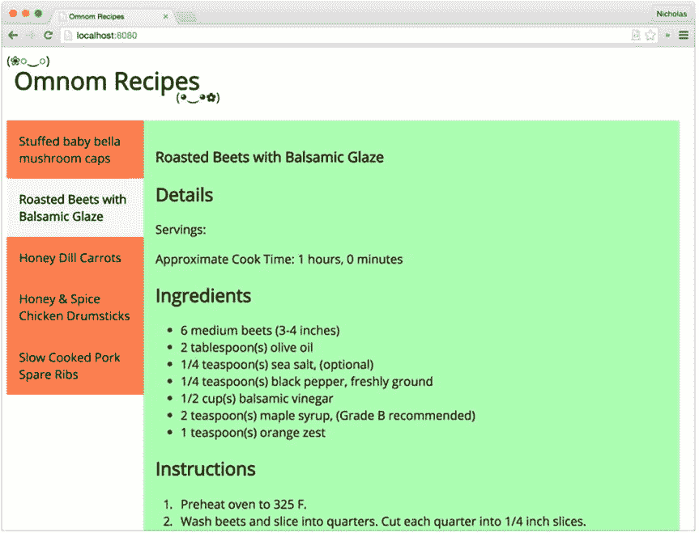
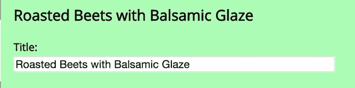
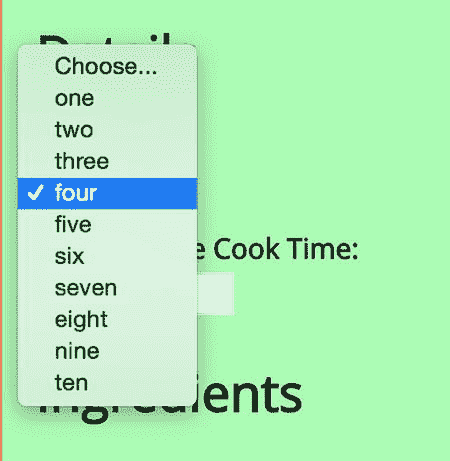
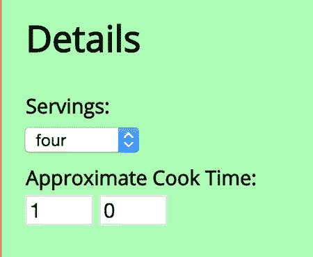
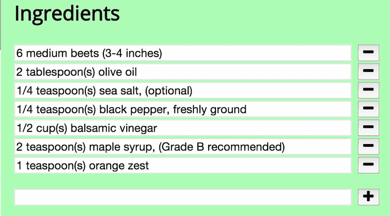
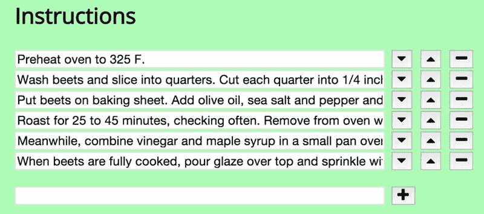
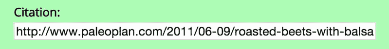

# 七、Knockout

复杂系统的特征是简单的元素，按照本地规则作用于本地知识，产生复杂的、模式化的行为。—大卫·韦斯特

Knockout 是一个 JavaScript 库，负责将 HTML 标记绑定到 JavaScript 对象。它不是一个完整的框架。它没有状态路由器、HTTP AJAX 功能、内部消息总线或模块加载器。相反，它侧重于 JavaScript 对象和 DOM 之间的双向数据绑定。当 JavaScript 应用程序中的数据发生变化时，绑定到挖空视图的 HTML 元素会收到自动更新。同样，当 DOM 输入发生时——例如通过表单域操作——Knockout 捕获输入变化并相应地更新应用程序状态。

Knockout 使用称为 observables 的专用对象和自定义绑定语法来表达应用程序数据与标记的关系，而不是低级的命令式 HTML 元素操作。内部机制是完全可定制的，因此开发人员可以使用定制的绑定语法和行为来扩展 Knockout 的功能。

作为一个独立的 JavaScript 库，Knockout 没有依赖关系。要实现 Knockout 不能执行的应用程序功能，通常需要其他库的存在，因此它可以很好地与许多其他常用库一起使用，如 jQuery、下划线、Q 等。与严格的 DOM 操作相比，Knockout API 在更高的层次上表示数据绑定操作，因此从抽象的角度来看，Knockout 更接近主干或角度，但其纤细的、面向视图的特性集意味着它的占用空间要小得多。

Knockout 将在所有现代浏览器中完全发挥作用，并且在撰写本文时，还将扩展到 Firefox 3+、Internet Explorer 6+和 Safari 6+。鉴于它的最新特性，它的向后兼容性尤其令人印象深刻，即带有自定义标记标签的 HTML5 兼容组件。淘汰赛团队煞费苦心地让淘汰赛开发体验在各种浏览器环境中无缝衔接。

本章通过一个管理厨房食谱的示例应用程序来探索 Knockout 的特性和 API。所有章节代码示例都将带有注释前缀，以表明示例代码实际驻留在哪个文件中。例如，在清单 [7-1](#FPar1) 中，`index.js`文件可以在本书源代码分发的`knockout/example-000`目录中找到。

Listing 7-1\. Not a Real Example

`// example-000/index.js`

`console.log('this is not a real example');`

要运行示例，首先安装 Node.js(参考您系统的 Node.js 文档)，然后运行`knockout`目录中的`npm install`来安装所有示例代码依赖项。每个示例目录将包含一个运行简单 Node.js web 服务器的`index.js`文件。要运行每个示例，需要启动该服务器，然后在 web 浏览器中导航到指定的 URL。例如，要运行清单 [7-1](#FPar1) 中的`index.js`文件，在终端提示符下导航到`knockout/example-000`目录并运行`node index.js`。

所有示例页面都在一个`<script>`标签引用中包含核心剔除脚本。您可以从 [`http://knockoutjs.com`](http://knockoutjs.com/) 或一些著名的内容交付网络下载该脚本。Knockout 也可以作为 Bower 包或 npm 模块安装，并且与 AMD 和 CommonJS 兼容。敲除文档包含所有这些安装方法的详细说明。

## 视图、模型和视图模型

Knockout 区分应用程序用户界面中的两种信息来源:数据模型，表示应用程序的状态；视图模型，表示该状态如何显示或传达给用户。这两种模型都是作为 JavaScript 对象在应用程序中创建的。Knockout 为视图模型提供了一种以视图(HTML)友好方式表示数据模型的方法，同时在视图和数据模型之间建立了双向通信，以便输入影响应用程序状态，而应用程序状态影响视图表示数据的方式。

因为 HTML 是在 web 浏览器中表示数据的技术，所以挖空视图模型可以直接绑定到预先存在的 HTML 文档元素，也可以使用 HTML 模板创建新元素。Knockout 甚至可以创建完整的可重用 HTML 组件(带有自己的属性和行为的自定义 HTML 标签)。

本章包含的示例应用程序 Omnom Recipes 在可浏览的主/详细用户界面中显示配方数据(“数据模型”)。该界面的两个部分——配方列表和每个配方的详细信息——都是逻辑组件，非常适合挖空视图模型。每一个都有自己的视图模型，应用程序将协调它们之间的交互。最终，用户会想要添加或编辑食谱，因此将为此引入额外的 HTML 标记和视图模型。

清单 [7-2](#FPar2) 显示了作为`tree`命令输出的`example-001`目录中的示例应用程序结构。

Listing 7-2\. Example Application Structure

`example-001$ tree --dirsfirst`

`.`

■t0]

◆θ★★★★★★★★★★★★★★★★★★★★★★

──μ──t0∮

──ζ──t0∮

──★★★★★★★★★★★★★★★★★★★★★★★★★

──μ──t0∮

──μ──t0∮

──★t0∮

◆θ★★★★★★★★★★★★★★★★★★★★★★

──★t0∮

◆θ★★★★★★★★★★★★★★★★★★★★★★

■t0]

ε──t0″

`index.js`文件负责启动一个 web 服务器，该服务器将服务于对`public`目录中文件的请求。当应用程序的 web 页面向 AJAX 请求食谱数据时，web 服务器将在`recipes.json`中序列化数据并将其返回给客户端。

在`public`目录中，当用户访问`http://localhost:8080`时，默认情况下会提供`index.html`文件。该文件包含用挖空属性增强的应用程序标记。`index.html`文件还引用了`public/styles`中的`app.css`样式表、`public/scripts/vendor`中的两个供应商脚本和`public/scripts`中的三个应用程序脚本。

挖空视图模型可以应用于整个页面，也可以应用于页面上的特定元素。对于重要的应用程序，建议使用多视图模型来保持模块化。在 Omnom Recipes 应用程序中，用户界面作为两个逻辑“组件”存在:配方列表和所选配方的详细视图。应用程序没有对整个页面使用单一的视图模型，而是将剔除逻辑分成两个 JavaScript 模块，分别位于`public/scripts` : `recipe-list.js`和`recipe-details.js`。`app.js`模块使用这两种视图模型，并协调它们在页面上的活动。

图 [7-1](#Fig1) 显示了应用程序的屏幕截图，配方列表清晰可见，配方详情在左侧。

图 7-1。

Omnom Recipes screenshot Note

为了避免混淆，示例应用程序使用简单的 JavaScript 闭包，而不是客户端框架或面向模块的构建工具来组织模块。这些闭包通常将单个对象分配给全局`window`对象的一个属性，该属性将被其他脚本使用。例如，`recipe-list.js`文件创建了一个全局对象`window.RecipeList`，用于`app.js`文件。虽然完全有效，但是应该根据示例应用程序的简单需求来看待这个架构决策。

### 食谱清单

包含整页标记和挖空模板的`index.html`文件分为三个关键的顶级元素:

*   `<header>`元素，它包含静态 HTML 内容，不会被 Knockout 操作
*   `<nav id="recipe-list">`元素，包含一个无序的食谱列表，将由 Knockout 操作
*   `<section id="recipe-details">`元素，显示配方信息，也将被剔除操作

虽然配方列表元素很小，但它包含了许多不同的特定于淘汰的绑定。这部分 HTML 的视图模型将被绑定到`<nav>`元素。记住这一点，通过检查清单 [7-3](#FPar4) 中的标记，可以推断出许多关于淘汰绑定如何工作的事情。

Listing 7-3\. Recipe List Markup and Bindings

`<!-- example-001/public/index.html -->`

`<nav id="recipe-list">`

`<ul data-bind="foreach: recipes">`

`<li data-bind="text: title,`

`click: $parent.selectRecipe.bind($parent),`

`css: {selected: $parent.isSelected($data)}"></li>`

`</ul>`

`</nav>`

首先，很明显，淘汰绑定应用于带有`data-bind`属性的 HTML 元素。这不是唯一的装订方法，但却是最常见的。元素`<ul>`和`<li>`都有形式为`binding-name: binding-value`的绑定。

第二，多个绑定可以作为逗号分隔的列表应用于一个元素，如`<li>`元素所示，它有对`text`、`click`和`css`的绑定。

第三，具有更复杂值的绑定，比如`<li>`元素上的`css`绑定，使用键/值散列(`{key: value, ... }`)来定义特定的绑定选项。

最后，绑定值可以引用 JavaScript 原语、视图模型属性、视图模型方法或任何有效的 JavaScript 表达式。

配方列表剔除绑定揭示了将被绑定到`<nav>`元素的剔除视图模型的某些事情。开发人员将立即识别出`foreach`流控制语句，并正确推断出`recipes`将是由视图模型公开的某个集合，`foreach`将在其上循环。

无序列表中的`<li>`元素没有自己的 HTML 内容，因此也可以推断出该元素是一种模板元素，将为`recipes`集合中的每一项进行绑定和呈现。与大多数`foreach`循环一样，期望循环中的对象(循环的“上下文”)是集合的一个元素是合理的。列表项的`text`绑定引用了当前迭代的 recipe 对象的`title`属性，并将在呈现时作为`<li>`元素的文本内容注入。

`click`和`css`绑定都引用了特殊的`$parent`对象，这告诉 Knockout 绑定值应该针对与`foreach`绑定的视图模型，而不是当前的配方对象。(视图模型是“父”上下文，配方是它的“子”上下文。)

每当列表项的`click`事件被触发时，`click`绑定就调用视图模型上的`selectRecipe()`方法。它通过将`$parent`引用传递给方法的`bind()`函数，将方法绑定到视图模型。这确保了`selectRecipe()`方法中`this`的值不会引用处理程序执行时附加的 DOM 元素(DOM 的默认行为)。

相比之下，`$parent`(视图模型)对象上的`isSelected()`方法由`css`绑定调用，但是 Knockout 而不是 DOM 管理调用，确保方法中的`this`值引用视图模型而不是 DOM 元素。

`css`绑定指示 Knockout 在满足特定条件时将特定的 CSS 类应用于 DOM 元素。`css`绑定值是选择器/函数对的散列，每当呈现 DOM 元素时，Knockout 都会对其进行评估。如果`isSelected()`方法返回`true`，那么`selected` CSS 类将被添加到列表项元素中。另一个特殊变量`$data`被传递给`isSelected()`。`$data`变量总是指当前对象上下文，在此例中是一个单独的配方对象。一些敲除绑定，如`text`，默认在当前对象上下文上操作；其他的，像`foreach`，作为副作用会引起上下文切换。

在清单 [7-4](#FPar5) 中，每个特殊变量的上下文对象和值都显示在 HTML 注释中。为清楚起见，绑定已被缩写。

Listing 7-4\. Changing Contexts with Knockout Bindings

`<!-- example-001/public/index.html -->`

`<nav id="recipe-list">`

`<!-- context: viewmodel -->`

`<!-- $parent === undefined -->`

`<!-- $data === viewmodel -->`

`<ul data-bind="foreach: ...">`

`<! -- context: recipe -->`

`<!-- $parent === viewmodel -->`

`<!-- $data === recipe -->`

`<li data-bind="text: ..."></li>`

`</ul>`

`</nav>`

清单 [7-5](#FPar6) 中的配方列表模块创建视图模型对象，当页面被渲染时，挖空将绑定到配方列表标记。该模块的`create()`方法接受一系列配方对象——从服务器加载的 JSON 数据——并返回一个带有数据属性和方法的视图模型对象。几乎所有的挖空视图模型都需要访问全局`window.ko`对象上的辅助函数，所以它被作为参数传递给模块的闭包函数。

Listing 7-5\. Recipe List View Model

`// example-001/public/scripts/recipe-list.js`

`'use strict';`

`window.RecipeList = (function (ko) {`

`return {`

`create: function (recipes) {`

`var viewmodel = {};`

`// properties`

`viewmodel.recipes = recipes;`

`viewmodel.selectedRecipe = ko.observable(recipes[0]);`

`// methods`

`viewmodel.selectRecipe = function (recipe) {`

`this.selectedRecipe(recipe);`

`};`

`viewmodel.isSelected = function (recipe) {`

`return this.selectedRecipe() === recipe;`

`};`

`return viewmodel;`

`}`

`};`

`}(window.ko));`

Note

视图模型对象本身可以以开发者选择的任何方式来创建。在示例代码中，每个视图模型都是由工厂方法创建的简单对象文字。经常可以看到 JavaScript 构造函数模式被用来创建视图模型，但是视图模型仅仅是对象，可以按照开发人员认为合适的方式来构造。

除了`selectedRecipe`属性，食谱列表视图模型完全不起眼。模板的`foreach`绑定被应用到`recipes`属性(一个普通 JavaScript 对象的数组)，每个列表项上的`click`绑定调用`selectRecipe()`方法(传递给它一个特定的配方)，当每个列表项被呈现时，调用`isSelected()`方法来确定被评估的配方是否已经被分配给`selectedRecipe`属性。事实上，这并不完全正确。`selectedRecipe`的值实际上不是一个配方对象，而是一个函数——一个引人注目的可观察对象。

可观察值是一种特殊类型的函数，它保存一个值，并且可以在该值发生变化时通知潜在的订阅者。HTML 元素和 observables 之间的绑定会自动创建由 Knockout 在后台管理的订阅。观察值是用全局`ko`对象上的特殊工厂函数创建的。清单 [7-5](#FPar6) 中的`selectedRecipe`是在调用`ko.observable(recipes[0])`时创建的。它的初始值是`recipes`数组中的第一个元素。当不带参数调用`selectedRecipe()`时，它返回它包含的值(在本例中，是`recipes[0]`中的对象)。传递给`selectedRecipe()`的任何值都将成为它的新值。虽然`selectedRecipe()`属性没有绑定到配方列表模板中的任何元素，但是当用户通过视图模型的方法与配方列表交互时，它会被操纵。这个元素的变化值将被用作下一个页面组件的输入:recipe details。

### 食谱详情

当点击配方列表中的配方时，配方详情显示在右窗格中(参见图 [7-1](#Fig1) )。清单 [7-6](#FPar8) 中的标记显示了用于在 DOM 中呈现菜谱细节视图模型的 HTML 元素和剔除绑定。

Listing 7-6\. Recipe Details Markup and Bindings

`<!-- example-001/public/index.html -->`

`<section id="recipe-details">`

`<h1 data-bind="text: title"></h1>`

`<h2>Details</h2>`

`
Servings: 
`

`
Approximate Cook Time: 
`

`<h2>Ingredients</h2>`

`<ul data-bind="foreach: ingredients">`

`<li data-bind="text: $data"></li>`

`</ul>`

`<h2>Instructions</h2>`

`<ol data-bind="foreach: instructions">`

`<li data-bind="text: $data"></li>`

`</ol>`

`<a data-bind="visible: hasCitation,`

`attr: {href: citation, title: title}"`

`target="_blank">Source</a>`

`</section>`

有些绑定，如`<h1> text`绑定，从视图模型属性中读取一个值，并将其字符串值注入 HTML 元素。

因为“细节”标题下的段落具有静态内容(文本“服务:”和“大约烹饪时间:”等)，所以在每个段落的末尾使用``标签来锚定`servings`和`cookingTimes`属性的挖空绑定。

配料列表使用`foreach`绑定遍历字符串集合，因此每个循环中的上下文对象是由`$data`变量表示的字符串。每个字符串都成为列表项的文本内容。

底部的`<a>`标签作为引用链接到食谱的来源网站。如果配方没有引用，锚将不会显示。元素的`visible`绑定检查视图模型的`hasCitation`可观察值，如果值为空，隐藏锚元素。像菜谱列表中使用的`css`绑定一样，`attr`绑定将一个键/值散列作为它的绑定值。散列键(`href`和`title`)是要在锚点上设置的元素属性，值是视图模型上将被绑定到每个属性的属性。

配方细节视图模型比配方列表视图模型有更多的成员。清单 [7-7](#FPar9) 显示了配方细节视图模型是以类似的方式创建的，通过调用带有特定配方对象的`RecipeDetails.create()`函数，该配方对象将用于向视图模型添加数据。这个模块在全局`ko`对象上使用了几个函数，因此，像食谱列表一样，它作为参数传递给模块闭包。

Listing 7-7\. Recipe Details View Model

`// example-001/public/scripts/recipe-details.js`

`'use strict';`

`window.RecipeDetails = (function (ko) {`

`return {`

`create: function (recipe) {`

`var viewmodel = {};`

`// add properties and methods...`

`return viewmodel;`

`}`

`};`

`}(window.ko));`

对于 recipe 对象上的每个属性，recipe details 视图模型都有相应的可观察属性，如清单 [7-8](#FPar10) 所示。只有当它们包含的值预计会改变时，可观测量才真正有用。如果值应该是静态的，那么可以使用普通的 JavaScript 属性和值。在 recipe details 视图模型中使用 Observables，因为只有一个视图模型实例绑定到页面。当在配方列表中选择一个新配方时，配方细节视图模型将用新配方的值进行更新。因为它的属性是可观察的，所以页面的标记会立即改变。

Listing 7-8\. Recipe Details View Model Properties

`// example-001/public/scripts/recipe-details.js`

`// properties`

`viewmodel.title = ko.observable(recipe.title);`

`viewmodel.servings = ko.observable(recipe.servings);`

`viewmodel.hours = ko.observable(recipe.cookingTime.hours);`

`viewmodel.minutes = ko.observable(recipe.cookingTime.minutes);`

`viewmodel.ingredients = ko.observableArray(recipe.ingredients);`

`viewmodel.instructions = ko.observableArray(recipe.instructions);`

`viewmodel.citation = ko.observable(recipe.citation);`

`viewmodel.cookingTime = ko.computed(function () {`

`return '$1 hours, $2 minutes'`

`.replace('$1', this.hours())`

`.replace('$2', this.minutes());`

`}, viewmodel);`

清单 [7-8](#FPar10) 显示了两种新的可观测量:`ko.observableArray()`和`ko.computed()`。

可观察数组监视它们的值(普通的 JavaScript 数组)的添加、删除和索引变化，因此如果数组发生变化，可观察数组的任何订户都会得到通知。虽然本例中的成分和指令没有改变，但稍后将引入代码来操作集合，并显示可观察数组的自动绑定更新。

计算的可观察值基于视图模型上可观察值公开的其他值生成或计算一个值。`ko.computed()`函数接受回调，该回调将被调用来生成计算出的可观察值，并且可选地接受一个上下文对象，该对象在回调中充当`this`的值。当被模板绑定引用时，计算出的可观察值将是其回调返回的值。清单 [7-8](#FPar10) 中的`cookingTime`属性创建一个格式化的字符串，其中插入了来自`hours`和`minutes`观察值的值。如果`hours`或`minutes`发生变化，`cookingTime`计算出的可观测值也将更新其订户。

Note

因为`hours`和`minutes`实际上是函数(尽管它们在剔除绑定表达式中被视为属性)，所以必须在计算出的可观察对象的主体中调用每一个函数，以便检索其值。

清单 [7-9](#FPar12) 中的菜谱细节视图模型方法相当简单。`hasCitation()`方法测试`citation`属性的非空值，而`update()`方法接受配方并用新值更新视图模型上的可观察属性。该方法不绑定到视图，但是当选择配方列表视图模型中的配方时，将使用该方法。

Listing 7-9\. Recipe Details View Model Methods

`// example-001/public/scripts/recipe-details.js`

`// methods`

`viewmodel.hasCitation = function () {`

`return this.citation() !== '';`

`};`

`viewmodel.update = function (recipe) {`

`this.title(recipe.title);`

`this.servings(recipe.servings);`

`this.hours(recipe.cookingTime.hours);`

`this.minutes(recipe.cookingTime.minutes);`

`this.ingredients(recipe.ingredients);`

`this.instructions(recipe.instructions);`

`this.citation(recipe.citation);`

`};`

## 将视图模型绑定到 DOM

这两个视图模型工厂都被附加到全局`window`对象上，并且可以用来创建将被绑定到页面上的单独的视图模型实例。清单 [7-10](#FPar13) 中所示的`app.js`文件是将两个配方视图模型联系在一起的主脚本。

Listing 7-10\. Binding View Models to the DOM

`// example-001/public/scripts/app.js`

`(function app ($, ko, RecipeList, RecipeDetails) {`

`// #1`

`var getRecipes = $.get('/recipes');`

`// #2`

`$(function () {`

`// #3`

`getRecipes.then(function (recipes) {`

`// #4`

`var list = RecipeList.create(recipes);`

`// #5`

`var details = RecipeDetails.create(list.selectedRecipe());`

`// #6`

`list.selectedRecipe.subscribe(function (recipe) {`

`details.update(recipe);`

`});`

`// #7`

`ko.applyBindings(list, document.querySelector('#recipe-list'));`

`ko.applyBindings(details, document.querySelector('#recipe-details'));`

`}).fail(function () {`

`alert('No recipes for you!');`

`});`

`});`

`}(window.jQuery, window.ko, window.RecipeList, window.RecipeDetails));`

`app`模块负责从服务器加载一组初始配方数据，等待 DOM 进入就绪状态，然后实例化视图模型实例并将每个实例绑定到适当的元素。下表描述了清单 [7-10](#FPar13) 中显示的每个步骤注释(例如`// #1`)。

A jQuery promise is created that will resolve at some point in the future, when the data obtained from the `GET /recipes` request becomes available.   The function passed to `$()` will be triggered when the DOM has been completely initialized to ensure that all Knockout template elements will be present before any binding attempts.   When the jQuery promise resolves, it passes the list of recipes to its resolution handler. If the promise fails, an alert is shown to the user indicating that a problem occurred.   Once the recipe data has been loaded, the list view model is created. The recipe array is passed as an argument to `RecipeList.create()`. The return value is the actual recipe list view model object.   The recipe details view model is created in a similar fashion. Its factory function accepts a single recipe, and so the `selectedRecipe` property on the recipe list is queried for a value. (The recipe list view model chooses the very first recipe in its data array for this value, by default.)   After the recipe details view model has been created, it subscribes to change notifications on the recipe list’s `selectedRecipe` observable. This is the manual equivalent of a DOM subscription created by Knockout when an observable is bound to an HTML element. The function provided to the `subscribe()` method will be invoked whenever `selectedRecipe` changes, receiving the new value as an argument. When the callback fires the recipe details view model uses any newly selected recipe to update itself, thereby changing the values of its own observable properties.   Finally, view models are bound to the DOM when the global `ko.applyBindings()` function is invoked. In Listing [7-10](#FPar13) this function receives two arguments: the view model to be bound, and the DOM element to which the view model will be bound. Any binding attribute Knockout encounters on this element or its descendants will be applied to the specified view model. If no DOM element is specified, Knockout assumes that the view model applies to the entire page. For simplistic pages this might be appropriate, but for more complex scenarios, using multiple view models that encapsulate their own data and behavior is the better option.  

## 查看模型和表单

挖空视图模型属性可以绑定到表单控件。许多控件，如`<input>`元素，共享类似`value`的标准绑定；但是其他的像`<select>`有特定于元素的绑定。例如，`options`绑定控制着`<select>`标签中`<option>`元素的创建。一般来说，到目前为止，表单字段绑定的行为很像示例代码中看到的绑定，但是复杂的表单可能很棘手，有时需要更有创意的绑定策略。

本节中的示例建立在 recipe details 模板和视图模型上。具体来说，引入了“编辑”模式，由此查看特定配方的用户可以选择通过表单字段来改变其细节。使用了相同的视图模型，但是在 recipe details 模板中添加了新的表单域元素，增加了两者的复杂性。

### 切换到“编辑”模式

配方详细信息标记的顶部和底部添加了三个按钮。图 [7-2](#Fig2) 和 [7-3](#Fig3) 显示了按钮呈现时的外观。

图 7-3。

In “edit” mode, the Save and Cancel buttons are visible

图 7-2。

In “view” mode, the Edit button is visible

编辑按钮将页面从查看模式切换到编辑模式(并为正在查看的配方的每个部分显示适当的表单字段)。在编辑模式下,“编辑”按钮本身是隐藏的，但另外两个按钮,“保存”和“取消”是可见的。如果用户单击保存按钮，对配方所做的任何更改都将被保存；相反，如果用户点击取消按钮，编辑会话将被中止，配方细节将恢复到其原始状态。

清单 [7-11](#FPar14) 中显示的每个按钮的敲除绑定与目前讨论的绑定略有不同。

Listing 7-11\. Editing Button Markup

`<!-- example-002/public/index.html -->`

`
`

`<!-- in read-only view -->`

`<button data-bind="click: edit, visible: !isEditing()">Edit</button>`

`<!-- in edit view -->`

`<button data-bind="click: save, visible: isEditing">Save</button>`

`<button data-bind="click: cancelEdit, visible: isEditing">Cancel</button>`

`
`

首先，每个按钮都有一个 click 事件处理程序，它调用视图模型上的一个方法:`edit()`、`save()`和`cancelEdit()`。但是与前面的例子不同，这些方法不使用`bind()`函数来确保视图模型中`this`的值。相反，视图模型中所有出现的关键字`this`都被替换为对对象文字`viewmodel`的引用，如清单 [7-12](#FPar15) 所示。这些按钮的新属性和方法也被添加到 recipe details 视图模型中。为了简洁起见，清单 [7-12](#FPar15) 省略了`recipe-list.js`中没有改变的部分。

Listing 7-12\. Methods reference the `viewmodel` object, not `this`

`// example-002/public/scripts/recipe-details.js`

`// properties`

`viewmodel.previousState = null;`

`viewmodel.isEditing = ko.observable(false);`

`// methods`

`viewmodel.edit = function () {`

`viewmodel` `.previousState = ko.mapping.toJS(viewmodel);`

`viewmodel` `.isEditing(true);`

`};`

`viewmodel.save = function () {`

`// TODO save recipe`

`viewmodel` `.isEditing(false);`

`};`

`viewmodel.cancelEdit = function () {`

`viewmodel` `.isEditing(false);`

`ko.mapping.fromJS(viewmodel.previousState, {}, viewmodel);`

`};`

因为视图模型本身被赋给了`RecipeDetails.create()`闭包中的一个变量，所以它的方法可以通过名字来引用它。通过完全避免`this`，事件绑定被简化，潜在的错误被避免。

其次，每个按钮都有一个附加到视图模型的`isEditing` observable 的`visible`绑定，但是只有 Edit 按钮作为函数直接调用该方法。它还拥有唯一一个使用否定(`!`)运算符的绑定，该运算符将绑定值转换为表达式。表达式中计算的任何可观察值都必须作为函数调用，以检索其值。如果一个可观察对象本身被用作绑定值，就像保存和取消按钮的`visible`绑定一样，当剔除评估绑定时，它将被自动调用。

所有这三种方法，`edit()`、`save()`和`cancelEdit()`，都操纵`isEditing`可观察值的值，该值决定了在表单上显示哪个或哪些按钮(以及，稍后将演示的，显示哪些表单字段)。当调用`edit()`方法时，编辑开始，当用户保存配方或取消编辑会话时，编辑结束。

为了确保当用户取消编辑会话时对配方的改变被丢弃，当编辑会话开始时，视图模型序列化其状态，以预期可能的回复。如果编辑会话被取消，则先前的状态被反序列化，并且每个可观察属性的值被有效地重置。

挖空映射插件用于在`edit()`和`cancelEdit()`方法中序列化和反序列化视图模型的状态:

`// serializing the view model`

`viewmodel.previousState = ko.mapping.toJS(viewmodel);`

`// deserializing the view model`

`ko.mapping.fromJS(viewmodel.previousState, {}, viewmodel);`

Tip

Knockout 的贴图插件与核心的 Knockout 库分开发布。当前版本可从 [`http://knockoutjs.com/documentation/plugins-mapping.html`](http://knockoutjs.com/documentation/plugins-mapping.html) 下载。要安装插件，只需在 HTML 页面的核心剔除标签`<script>`之后添加一个`<script>`标签引用到插件脚本。它将自动在全局`ko`对象上创建`ko.mapping`名称空间属性。

映射插件序列化/反序列化拥有可观察属性的对象，在序列化过程中读取它们的值，在反序列化过程中设置它们的值。当`edit()`方法调用`ko.mapping.toJS(viewmodel)`时，它接收一个普通的 JavaScript 对象文字，其属性名称与视图模型的属性名称相同，但是包含普通的 JavaScript 数据，而不是可观察的函数。当编辑会话被取消时，为了将这些值推回到视图模型自己的可观察值中，`cancelEdit()`方法使用三个参数调用`ko.mapping.fromJS()`:

*   包含要写入视图模型的可观察属性的数据的普通 JavaScript 对象文字
*   一个对象文字，将普通 JavaScript 状态对象上的属性映射到视图模型上的可观察属性(如果该对象为空，则假定两者的属性共享相同的名称)
*   将接收对象文字数据的视图模型

Note

Knockout mapper 插件可以通过其`toJS()`和`fromJS()`函数将视图模型序列化/反序列化为普通的 JavaScript 对象文字，或者通过其`toJSON()`和`fromJSON()`函数将其序列化/反序列化为 JSON 字符串。这些函数对于将 JSON 数据绑定到简单表单的 CRUD(创建+读取+更新+删除)视图模型特别有用。

虽然表单上有 Save 按钮，但是它的方法只在视图模型中被存根化。它的功能将在后面的示例中添加。

### 更改配方标题

无论配方详细信息视图处于编辑模式还是只读模式，配方标题均可见。当用户点击编辑按钮时，标签和输入字段在`<h1>`标签下变得可见，因此用户可以在必要时更新配方标题。包含`
`元素控件上的`visible`绑定通过订阅视图模型上的`isEditing`可观察对象来显示和隐藏该字段。输入字段的值通过`value`绑定绑定到视图模型的`title`可观察值。默认情况下，`value`绑定只会在可观察对象绑定的字段失去焦点时刷新可观察对象中的数据。当清单 [7-13](#FPar18) 中的标题输入失去焦点时，`<h1>`标签的内容将立即用新的标题值更新，因为两者都绑定到了`title`可观察对象。渲染后的场景如图 [7-4](#Fig4) 所示。

图 7-4。

Editing the recipe title Listing 7-13\. Recipe Title Markup

`<!-- example-002/public/index.html -->`

`<h1 data-bind="text: title"></h1>`

`<!-- in edit view -->`

`
`

`<label for="recipe-title">Title:</label>`

`<input data-bind="value: title" name="title" id="recipe-title" type="text" />`

`
`

### 更新食谱和烹饪时间

在清单 [7-14](#FPar19) 中，当表单进入编辑模式时，食谱的只读食用量`
`元素被隐藏。在它的位置上显示了一个`<select>`元素，其中有许多可供用户选择的份量选项。再一次，`isEditing`被用来决定显示哪些元素。

Listing 7-14\. Serving Size Markup

`<!-- example-002/public/index.html -->`

`<h2>Details</h2>`

`<!-- in read-only view -->`

`
`

`Servings: `

`
`

`<!-- in edit view -->`

`
`

`<label for="recipe-servings">Servings:</label>`

`<select data-bind="options: servingSizes,`

`optionsText: 'text',`

`optionsValue: 'numeral',`

`value: servings,`

`optionsCaption: 'Choose...'"`

`name="recipeServings"`

`id="recipe-servings">`

`</select>`

`
`

清单 [7-14](#FPar19) 中的`<select>`标签声明了新的特定于元素的剔除绑定，以控制它使用视图模型数据的方式。`options`绑定告诉 Knockout 视图模型上的哪个属性持有将用于在标签内创建`<option>`元素的数据集。绑定值是属性的名称(在本例中是`servingSizes`)，一个只读引用数据的简单数组。

对于原始值，比如字符串或数字，`options`绑定假设每个原始值都应该是其`<option>`元素的文本和值。对于复杂的对象，`optionsText`和`optionsValue`绑定告诉 Knockout 数组中每个对象的哪些属性将用于生成每个`<option>`元素的文本和值。清单 [7-15](#FPar20) 中定义了服务量对象。请注意，文本值是每个数字的名称，而数字值是相应的数字。当用户选择一份食物时，数字值将被分配给`viewmodel.servings()`。

Listing 7-15\. Recipe Serving Size Data in the View Model

`// example-002/public/scripts/recipe-details.js`

`// properties`

`viewmodel.servings = ko.observable(recipe.servings);`

`viewmodel.servingSizes = [`

`{text: 'one', numeral: 1},`

`{text: 'two', numeral: 2},`

`{text: 'three', numeral: 3},`

`{text: 'four', numeral: 4},`

`{text: 'five', numeral: 5},`

`{text: 'six', numeral: 6},`

`{text: 'seven', numeral: 7},`

`{text: 'eight', numeral: 8},`

`{text: 'nine', numeral: 9},`

`{text: 'ten', numeral: 10}`

`];`

`<select>`标签的`value`绑定将下拉列表的选定值与视图模型上的可观察值联系起来。当`<select>`标签被渲染时，这个值会在 DOM 中自动为用户选择；当用户选择一个新值时，有界可观测值将被更新。

最后，`optionsCaption`绑定在 DOM 中创建一个特殊的`<option>`元素，它出现在下拉选项列表的顶部，但是永远不会被设置为视图模型上的选定值。这仅仅是一个装饰性的增强，给用户一些关于如何使用下拉菜单的指导。

图 [7-5](#Fig5) 和 [7-6](#Fig6) 显示了折叠和展开的食用量下拉菜单。

图 7-6。

Choosing a new value from the Servings drop-down

图 7-5。

Servings drop-down with a pre-selected value

烹饪时间字段也如图 [7-5](#Fig5) 所示，不包含特殊绑定。清单 [7-16](#FPar21) 中显示的两个输入字段(小时和分钟)都是数字字段，它们使用简单的`value`绑定来更新视图模型上的可观察值。它们通过前面讨论的相同的可见性机制来显示和隐藏。

Listing 7-16\. Cooking Time Markup

`<!-- example-002/public/index.html -->`

`<!-- in read-only view -->`

`
`

`Approximate Cook Time: `

`
`

`<!-- in edit view -->`

`
`

`<label for="recipe-hours">Approximate Cook Time:</label>`

`<input data-bind="value: hours"`

`name="hours"`

`id="recipe-hours"`

`type="number" />`

`<input data-bind="value: minutes"`

`name="minutes"`

`id="recipe-minutes"`

`type="number" />`

`
`

回想一下，当烹饪时间以只读模式显示给用户时，使用清单 [7-17](#FPar22) 中的`cookingTime`计算可观测值，而不是`hours`和`minutes`可观测值。当这些可观测量的值基于清单 [7-16](#FPar21) 中的输入绑定发生变化时，计算出的可观测量会为视图重新生成格式化字符串。还要注意，计算的可观察对象不再有上下文参数，因为在可观察对象内部，视图模型变量是通过名称引用的，而不是通过关键字`this`来解析。

Listing 7-17\. View Model Hours, Minutes, and Computed Cooking Time

`// example-002/public/scripts/recipe-details.js`

`// properties`

`viewmodel.hours = ko.observable(recipe.cookingTime.hours);`

`viewmodel.minutes = ko.observable(recipe.cookingTime.minutes);`

`viewmodel.cookingTime = ko.computed(function () {`

`return '$1 hours, $2 minutes'`

`.replace('$1',``viewmodel`T2】

`.replace('$2',``viewmodel`T2】

`});`

### 添加和移除配料

在只读模式下，配方成分呈现为无序列表。为了维护表单，当 recipe details 视图进入编辑模式时，为列表中的每个项目生成一个输入，如图 [7-7](#Fig7) 所示。每个配料旁边的减号按钮允许用户删除任何或所有配料，而输入列表下方的空输入字段和加号按钮可用于添加新配料。任何成分输入中的文本更改都会更新视图模型的`ingredients`数组中的值。

图 7-7。

Creating and editing recipe ingredients

添加新的配料比就地编辑现有的配料更直接。清单 [7-18](#FPar23) 中的标记显示了对表单配料部分的部分更改。出现了一个只读无序列表，在它下面是一个包含所有新表单字段的`
`元素。一个注释块指出了现有成分的`<input>`元素将会放在哪里(稍后讨论)，但是新的成分字段显示在它的下面。

Listing 7-18\. New Ingredients Markup

`<!-- example-002/public/index.html -->`

`<h2>Ingredients</h2>`

`<!-- in read-only view -->`

`<ul data-bind="foreach: ingredients, visible: !isEditing()">`

`<li data-bind="text: $data"></li>`

`</ul>`

`<!-- in edit view -->`

`
`

`<!-- ingredient list inputs here... -->`

`<input data-bind="value: newIngredient"`

`type="text"`

`name="new-ingredient"`

`id="recipe-new-ingredient"/>`

`<button data-bind="click: commitNewIngredient"`

`class="fa fa-plus"></button>`

`
`

为了添加新的配料，用户在新的配料`<input>`字段中输入文本，然后点击它旁边的加号按钮。`<input>`被绑定到视图模型上可观察的`newIngredient`，加号按钮的`click`事件调用`commitNewIngredient()`方法，如清单 [7-19](#FPar24) 所示。

Listing 7-19\. Creating a New Ingredient in the View Model

`// example-002/public/scripts/recipe-details.js`

`// properties`

`viewmodel.ingredients = ko.observableArray(recipe.ingredients);`

`viewmodel.newIngredient = ko.observable('');`

`// methods`

`viewmodel.commitNewIngredient = function () {`

`var ingredient = viewmodel.newIngredient();`

`if (ingredient === '') return;`

`viewmodel.ingredients.push(ingredient);`

`viewmodel.newIngredient('');`

`};`

`commitNewIngredient()`方法评估`newIngredient`可观察值的内容，以确定它是否为空。如果是，用户没有在`<input>`中输入任何文本，因此该方法过早返回。如果不是，则将`newIngredient`的值推入`ingredients`可观测值数组，并清除`newIngredient`可观测值。

Tip

可观察数组与普通 JavaScript 数组共享一个几乎相同的 API。大多数数组操作，比如`push()`、`pop()`、`slice()`、`splice()`等等，都可以在可观察数组上进行，并且在被调用时会触发更新通知给可观察数组的订阅者。

当新的成分被添加到`ingredients`后，Knockout 会更新 DOM 以反映这一变化。在编辑模式下隐藏的只读列表会自动获取一个新的列表项元素，现有的`<input>`元素的可编辑列表，如清单 [7-20](#FPar26) 所示，也会获得一个新条目。

Listing 7-20\. Ingredients Markup

`<!-- example-002/public/index.html -->`

`<h2>Ingredients</h2>`

`<!-- in read-only view -->`

`<ul data-bind="foreach: ingredients, visible: !isEditing()">`

`<li data-bind="text: $data"></li>`

`</ul>`

`<!-- in edit view -->`

`
`

`<ul data-bind="foreach: ingredients" class="listless">`

`<li>`

`<input data-bind="value: $data,`

`valueUpdate: 'input',`

`attr: {name: 'ingredient-' + $index()},`

`event: {input: $parent.changeIngredient.bind($parent, $index())}"`

`type="text" />`

`<button data-bind="click: $parent.removeIngredient.bind($parent, $index())"`

`class="fa fa-minus"></button>`

`</li>`

`</ul>`

`<!-- new ingredient input here... -->`

`
`

对于`ingredients`可观察数组中的每个成分，在新的成分字段上方呈现一个输入。这些输入嵌套在一个无序列表中，它们的值都绑定到数组中的特定成分，由`foreach`循环中的`$data`变量表示。通过将字符串“ingredient-”与特殊的`$index` observable 公开的循环的当前索引连接起来，`attr`绑定用于为每个`<input>`元素命名。像绑定表达式中使用的任何可观察对象一样，必须调用`$index`来检索它的值。

由可观察数组公开的绑定只适用于数组本身，而不适用于它们包含的元素，这一点怎么强调都不为过。当每个成分被绑定到一个 DOM `<input>`元素时，它被包装在`$data`可观察对象中，但是在这个可观察对象和包含它的可观察数组之间没有通信。如果`$data`中的值因为输入而改变，数组将会被忽略，并且仍然包含它自己的未改变数据的副本。这是一个令人惊恐的来源，但有几个应对策略可以让它变得可以忍受。

首先，observable `ingredients`数组可以填充对象，每个对象将成分文本公开为可观察属性(类似于`{ ingredient: ko.observable('20 mushrooms') }`)。每个`<input>`的`value`绑定将使用每个对象的`$data.ingredient`属性来建立一个双向绑定。可观察数组仍然不知道其成员的变化，但因为每个元素都是一个通过可观察对象跟踪其自身数据的对象，所以这成为一个争论点。

清单 [7-20](#FPar26) 中采用的第二种方法是通过`valueUpdate`和`event`绑定监听每个`<input>`元素上的变化事件，然后告诉视图模型在`ingredients`可观察数组中的特定成分值发生变化时替换它们。两种方式都不“正确”——两者都有各自的优点和缺点。

每次 DOM `input`事件在每个`<input>`元素上触发时，`valueUpdate`绑定首先指示 Knockout 更改`$data`的值。(记住:一旦一个元素失去焦点，Knockout 通常会更新`$data`，而不是当它收到输入时。)其次，添加了一个 Knockout `event`绑定，它在每次 DOM `input`事件触发时调用视图模型上的`changeIngredient()`方法。默认情况下，Knockout 将`$data`的当前值提交给`changeIngredient()`，但是由于新值将替换旧值，视图模型必须知道`ingredients`数组中的哪个索引是目标。使用`bind()`,`$index`的值作为第一个参数绑定到方法，确保`$data`的值是第二个。

清单 [7-21](#FPar27) 中的代码显示了`changeIngredient()`方法访问`ingredients`可观察数组中的实际底层数组，以替换给定索引处的值。

Listing 7-21\. Changing a Recipe Ingredient in the View Model

`// example-002/public/scripts/recipe-details.js`

`// properties`

`viewmodel.ingredients = ko.observableArray(recipe.ingredients);`

`// methods`

`viewmodel.changeIngredient = function (index, newValue) {`

`viewmodel.ingredients()[index] = newValue;`

`};`

不幸的是，当可观察数组的底层数组结构发生变化时，可观察数组不会自动通知任何订阅者，这意味着其他 DOM 元素，比如显示成分的只读无序列表，将保持不变。为了减轻这一点，视图模型监听它自己的`isEditing`可观察值，如清单 [7-22](#FPar28) 所示。当传递给可观察对象的值是`false`(意味着用户或者保存了对配方的更改，或者取消了编辑会话)时，视图模型通过调用其`valueHasMutated()`方法，强制通知`ingredients`可观察对象数组的任何订阅者。这确保了在“查看”模式下显示的只读无序列表将准确地反映出`ingredients`数组中任何改变的值。

Listing 7-22\. Forcing Observable Arrays to Notify Their Subscribers of Underlying Changes

`// example-002/public/scripts/recipe-details.js`

`// properties`

`viewmodel.isEditing = ko.observable(false);`

`viewmodel.isEditing.subscribe(function (isEditing) {`

`if (isEditing) return;`

`// force refresh`

`//`

`viewmodel.ingredients.valueHasMutated();`

`});`

每个配方`<input>`旁边是一个减号按钮，用于从`ingredients`可观察数组中删除给定的配料。它的 click 事件被绑定到`removeIngredient()`方法，像`changeIngredient()`一样，该方法也必须接收`$index`的值，以便视图模型知道要删除哪个元素。可观察数组公开了一个`splice()`方法，如清单 [7-23](#FPar29) 所示，该方法可用于移除特定索引处的元素。使用这种方法而不是直接操作底层数组，可以确保`ingredients`可观察数组的订阅者立即得到变化的通知。

Listing 7-23\. Removing a Recipe Ingredient

`// example-002/public/scripts/recipe-details.js`

`// properties`

`viewmodel.ingredients = ko.observableArray(recipe.ingredients);`

`// methods`

`viewmodel.removeIngredient = function (index) {`

`viewmodel.ingredients.splice(index, 1);`

`};`

### 说明

配方说明与配方成分非常相似，但有两个显著的不同。首先，指令以有序列表的形式呈现，因为指令必须一步一步地执行。第二，指令可以在列表中升级或降级。图 [7-8](#Fig8) 显示了订购说明字段和与之相关的按钮的屏幕截图。

图 7-8。

Creating and editing recipe instructions

将不讨论与配料用例(创建指令、删除指令、更新现有指令)重叠的配方指令用例，因为两者的标记、剔除绑定和视图模型结构本质上是相同的，但操作的是`instructions`可观察数组。然而，数组内的指令降级和升级是新特性，在清单 [7-24](#FPar30) 中增加了 up 和 down `<button>`标记。

Listing 7-24\. Instructions Markup

`<!-- example-002/public/index.html -->`

`<h2>Instructions</h2>`

`<!-- in read-only view -->`

`<ol data-bind="foreach: instructions, visible: !isEditing()">`

`<li data-bind="text: $data"></li>`

`</ol>`

`<!-- in edit view -->`

`
`

`<!-- existing instructions -->`

`<ul data-bind="foreach: instructions" class="listless">`

`<li>`

`<input data-bind="value: $data,`

`valueUpdate: 'input',`

`attr: {name: 'instruction-' + $index()},`

`event: {input: $parent.changeInstruction.bind($parent, $index())}"`

`type="text" />`

`<button data-bind="click: $parent.demoteInstruction.bind($parent, $index())"`

`class="fa fa-caret-down"></button>`

`<button data-bind="click: $parent.promoteInstruction.bind($parent, $index())"`

`class="fa fa-caret-up"></button>`

`<button data-bind="click: $parent.removeInstruction.bind($parent, $index())"`

`class="fa fa-minus"></button>`

`</li>`

`</ul>`

`<!-- new instruction input here... -->`

`
`

像减号按钮一样，up 和 down 按钮都使用 Knockout `click`绑定来调用视图模型上的方法，将相关的项目索引作为参数传递给每个按钮。

清单 [7-25](#FPar31) 展示了这两种方法是如何操作`instructions`可观察数组的。`promoteInstruction()`方法计算索引，如果索引为零，则提前退出(第一条指令不能被提升)。然后，它使用其`splice()`方法从可观察数组中选取给定索引处的指令，通过减 1 计算该指令的新索引(例如，从索引 2 到 1 将是列表中的提升)，然后将该指令拼接回新索引处的可观察数组。`demoteInstruction()`方法正好相反。它防止在列表“末端”的指令被进一步降级；否则，它会通过重新拼接可观察数组来将指令在列表中下移。在这两种情况下，任何绑定到`instructions`属性的 DOM 元素都会自动得到变更通知。

Listing 7-25\. Promoting and Demoting Recipe Instructions in the View Model

`// example-002/public/scripts/recipe-details.js`

`// properties`

`viewmodel.instructions = ko.observableArray(recipe.instructions);`

`viewmodel.promoteInstruction = function (index) {`

`if (index === 0) return;`

`var instruction = viewmodel.instructions.splice(index, 1);`

`var newIndex = index - 1;`

`viewmodel.instructions.splice(newIndex, 0, instruction);`

`};`

`viewmodel.demoteInstruction = function (index) {`

`var lastIndex = (viewmodel.instructions.length - 1);`

`if (index === lastIndex) return;`

`var instruction = viewmodel.instructions.splice(index, 1);`

`var newIndex = index + 1;`

`viewmodel.instructions.splice(newIndex, 0, instruction);`

`};`

### 引用

考虑到指令和成分的复杂性，添加引用字段是一件相当普通的事情。单个文本`<input>`使用`value`绑定来更新视图模型的`citation`可观察值。渲染后的场景如图 [7-9](#Fig9) 所示。

图 7-9。

Updating a Recipe’s Citation

引文超链接上的`visible`绑定已被更改为复合表达式。现在，清单 [7-26](#FPar32) 中的超链接只有在配方详情视图处于只读模式(`!isEditing()`)且配方实际上有引用时才会显示。

Listing 7-26\. Citation Field Markup

`<!-- example-002/public/index.html -->`

`<a data-bind="visible: hasCitation() && !isEditing(),`

`attr: {href: citation, title: title}"`

`target="_blank">Source</a>`

`
`

`<label>Citation:</label>`

`<input name="citation" type="text" data-bind="value: citation" />`

`
`

## 定制组件

受流行的 web components . js poly fill([`http://webcomponents.org`](http://webcomponents.org/))的启发，Knockout 提供了一个定制的组件系统，该组件系统使用定制的标签名称、标记和行为来生成可重用的 HTML 元素。

在 Omnom Recipes 应用程序中，recipe details 视图包含两个可编辑的列表，即配料和说明，它们在标记和视图模型属性和方法方面有许多相似的特征。只需一点努力，自定义组件就可以在应用程序中替换这两个列表。目标是将 DOM 中复杂的标记和绑定表达式简化为新的定制元素，如清单 [7-27](#FPar33) 中所设想的。

Listing 7-27\. Input List Element

`<!-- example-003/public/index.html -->`

`<!-- editable ingredients list -->`

`<input-list params="items: ingredients,`

`isOrdered: false"></input-list>`

`<!-- ... -->`

`<!-- editable instructions list -->`

`<input-list params="items: instructions,`

`isOrdered: true"></input-list>`

淘汰组件是几个东西的交集:

*   为页面上自定义组件的每个实例创建视图模型的工厂函数
*   一个 HTML 模板，它有自己的挖空绑定，将在使用组件的任何地方注入
*   一个定制的标签注册，告诉 Knockout 在哪里可以找到模板，以及当它在页面上遇到组件标签时如何实例化它的视图模型

### 输入列表视图模型

recipe details 视图模型已经拥有了用于操作其`ingredients`和`instructions`数组的属性和方法，但是有必要将这段代码抽象出来，并将其移动到自己的模块`input-list.js`中，以便 Knockout 可以将它专门用于新的输入列表组件。

清单 [7-28](#FPar34) 显示了输入列表模块的简化版本。它的结构与其他视图模型工厂模块相同，在全局`InputList`对象上公开了一个`create()`方法。这个工厂方法接受一个`params`参数，该参数将用于向输入列表组件传递一个对可观察数组(`params.items`)的引用，以及一系列可选设置，这些设置将决定输入列表在绑定到呈现模板时的行为:`params.isOrdered`、`params.enableAdd`、`params.enableUpdate`和`params.enableRemove`。

`defaultTo()`函数是一个简单的实用函数，它返回`params`对象上缺失属性的默认值。

Listing 7-28\. Input List View Model

`// example-003/public/scripts/input-list.js`

`'use strict';`

`window.InputList = (function (ko) {`

`function defaultTo(object, property, defaultValue) {/*...*/}`

`return {`

`create: function (params) {`

`var viewmodel = {};`

`// properties`

`viewmodel.items = params.items; // the collection`

`viewmodel.newItem = ko.observable('');`

`viewmodel.isOrdered = defaultTo(params, 'isOrdered', false);`

`viewmodel.enableAdd = defaultTo(params, 'enableAdd', true);`

`viewmodel.enableUpdate = defaultTo(params, 'enableUpdate', true);`

`viewmodel.enableRemove = defaultTo(params, 'enableRemove', true);`

`// methods`

`viewmodel.commitNewItem = function () {/*...*/};`

`viewmodel.changeItem = function (index, newValue) {/*...*/};`

`viewmodel.removeItem = function (index) {/*...*/};`

`viewmodel.promoteItem = function (index) {/*...*/};`

`viewmodel.demoteItem = function (index) {/*...*/};`

`return viewmodel;`

`}`

`};`

`}(window.ko));`

`params.items`和`params.isOrdered`属性对应于清单 [7-27](#FPar33) 中的绑定属性。当在页面上使用一个组件时，它的绑定属性的值通过`params`对象被引用传递给组件的视图模型。在这个场景中，输入列表组件将被赋予访问配方细节视图模型上的`ingredients`和`instructions`可观察数组的权限。

清单 [7-28](#FPar34) 中的输入列表方法已经被修订，因为它们与清单 [7-25](#FPar31) 中的方法几乎相同。然而，这些方法不是引用成分或指令，而是引用抽象的`items`可观察数组。组件用从`params.items`接收的数据填充这个数组。与`recipe-details.js`模块中的`newIngredient`和`newInstruction`可观察对象的行为方式完全相同，`newItem`可观察对象保存新项目输入的值。然而，它并不与 recipe details 视图模型共享，因为它只与输入列表相关。

因为输入列表组件现在将处理页面上的配料和说明列表的操作，所以之前执行这些操作的 recipe details 视图模型中的属性和方法已经被移除。

### 输入列表模板

一个可重用的组件需要一个抽象的、可重用的模板，所以与编辑指令和成分相关的标记也被收集到一个 HTML 模板中。每次在页面上创建输入列表组件的实例时，Knockout 都会将模板注入 DOM，然后将输入列表视图模型的新实例绑定到它。

由于输入列表组件可以容纳有序列表和无序列表，因此模板必须使用淘汰绑定来智能地决定显示哪种列表。只有有序列表才会有升级和降级按钮，而项目可以从这两种列表中添加和删除。由于输入列表视图模型公开了从其`params`对象接收的布尔属性，模板可以根据这些属性的值改变其行为。例如，如果视图模型属性`isOrdered`是`true`，模板将显示一个有序列表；否则它将显示一个无序列表。同样，与添加新项目或删除现有项目相关的字段和按钮分别由`enableAdd`和`enableRemove`属性切换。

模板标记通常被添加到 DOM 的非解析元素中，如`<template>`或`<script type="text/html">`元素。在清单 [7-29](#FPar35) 中，完整的组件标记和所有绑定都显示在一个`<template>`标签中。当组件注册到框架时，Knockout 将使用元素的`id`在 DOM 中查找模板内容。

Listing 7-29\. Input List Component Template

`<!-- example-003/public/index.html -->`

`<template id="item-list-template">`

`<!-- ko if: isOrdered -->`

`<!-- #1 THE ORDERED LIST -->`

`<ol data-bind="foreach: items" class="listless">`

`<li>`

`<input data-bind="value: $data,`

`valueUpdate: 'input',`

`attr: {name: 'item-' + $index()},`

`event: {input: $parent.changeItem.bind($parent, $index())}"`

`type="text" />`

`<button data-bind="click: $parent.demoteItem.bind($parent, $index())"`

`class="fa fa-caret-down"></button>`

`<button data-bind="click: $parent.promoteItem.bind($parent, $index())"`

`class="fa fa-caret-up"></button>`

`<button data-bind="click: $parent.removeItem.bind($parent, $index()),`

`visible: $parent.enableRemove"`

`class="fa fa-minus"></button>`

`</li>`

`</ol>`

`<!-- /ko -->`

`<!-- ko ifnot: isOrdered -->`

`<!-- #2 THE UN-ORDERED LIST -->`

`<ul data-bind="foreach: items" class="listless">`

`<li>`

`<input data-bind="value: $data,`

`valueUpdate: 'input',`

`attr: {name: 'item-' + $index()},`

`event: {input: $parent.changeItem.bind($parent, $index())}"`

`type="text" />`

`<button data-bind="click: $parent.removeItem.bind($parent, $index()),`

`visible: $parent.enableRemove"`

`class="fa fa-minus"></button>`

`</li>`

`</ul>`

`<!-- /ko -->`

`<!-- ko if: enableAdd -->`

`<!-- #3 THE NEW ITEM FIELD -->`

`<input data-bind="value: newItem"`

`type="text"`

`name="new-item" />`

`<button data-bind="click: commitNewItem"`

`class="fa fa-plus"></button>`

`<!-- /ko -->`

`</template>`

在输入列表模板中有许多标记需要消化，但它实际上只是无序成分列表和有序说明列表的组合，带有一个共享的新项目字段。

特殊绑定注释—`ko if`和`ko ifnot`注释块——包装模板的一部分，以确定注释块中的元素是否应该添加到页面中。这些注释块评估视图模型的属性，并相应地改变模板处理控制流。这不同于`visible`元素绑定，后者仅仅隐藏已经存在于 DOM 中的元素。

Tip

在`ko`注释块绑定中使用的语法被称为无容器控制流语法。

输入列表模板中的所有字段和按钮都绑定到输入列表视图模型上的属性和方法。例如，如果点击一个降级按钮，输入列表视图模型将操作其内部的`items`集合，该集合实际上是对配方细节视图模型中的`instructions`可观察数组的引用，通过`items`绑定共享。该模板基于`isOrdered`属性确定显示哪种类型的列表，而添加和移除控件基于`enableAdd`和`enableRemove`属性进行切换。因为这些属性是从视图模型中的`params`对象读取的，所以它们中的任何一个都可以作为绑定属性添加到`<input-list>`组件标签中。通过这种方式，组件抽象并封装了针对任何集合的所有操作，这些操作可以表示为输入列表。

### 注册输入列表标签

一旦定义了组件视图模型和模板，组件本身必须用挖空注册。这告诉 Knockout 在 DOM 中遇到组件的自定义标记时如何解析组件实例，以及在呈现组件内容时使用什么模板和视图模型。

清单 [7-30](#FPar37) 中的`app.js`脚本已经更新，可以在 DOM 准备好之后，但在任何剔除绑定应用到页面之前(使用`ko.applyBindings()`)立即注册输入列表组件。这确保了 Knockout 有时间在 DOM 中呈现组件的标记，所以在任何视图模型被绑定到它之前。

Listing 7-30\. Registering the Input List Component

`// example-003/public/scripts/app.js`

`(function app ($, ko, InputList /*...*/) {`

`// ...`

`$(function () {`

`// register the custom component tag before`

`// Knockout bindings are applied to the page`

`ko.components.register('input-list', {`

`template: {`

`element: 'item-list-template'`

`},`

`viewModel: InputList.create`

`});`

`// ...`

`});`

`}(window.jQuery, window.ko, window.InputList /*...*/));`

在清单 [7-30](#FPar37) 中，`ko.components.register()`函数接收两个参数:新组件定制标签的名称，`input-list`和一个选项散列，该散列为 Knockout 提供构建组件所需的信息。

Knockout 使用自定义标记名来标识 DOM 中的`<input-list>`元素，并用 options hash 中指定的模板内容替换它。

因为输入列表元素的标记已经在一个`<template>`元素中定义，所以淘汰组件系统只需要知道它应该使用什么元素 ID 来在 DOM 中查找该元素。选项散列中的`template`对象在其`element`属性中包含这个 ID。对于较小的组件，整个 HTML 模板可以作为一个字符串直接分配给`template`属性。

为了构建组件的视图模型，一个工厂函数被分配给选项散列的`viewModel`属性。该属性还可以引用常规的构造函数，但是使用工厂函数可以避免当事件绑定在视图模型中重新分配关键字`this`时出现的潜在问题。不管采用哪种方法，视图模型函数都将接收一个`params`对象，其中填充了来自模板绑定声明的值。

Tip

Knockout 可以通过 RequireJS 自动加载组件模板和查看模型功能。有关更多详细信息，请参考脱模组件文档。RequireJS 模块加载器包含在第 5 章的[中。](05.html)

既然输入列表组件已经用 Knockout 注册了，那么可编辑成分和说明列表的复杂标记可以用简单的`<input-list>`实例代替。清单 [7-31](#FPar39) 展示了产生的更轻、更干净的页面标记。

Listing 7-31\. Editing Instructions and Ingredients with the Input List Component

`<!-- example-003/public/index.html -->`

`<h2>Ingredients</h2>`

`<!-- in read-only view -->`

`<ul data-bind="foreach: ingredients, visible: !isEditing()">`

`<li data-bind="text: $data"></li>`

`</ul>`

`<!-- in edit view -->`

`
`

`<input-list params="items: ingredients,`

`isOrdered: false"></input-list>`

`
`

`<h2>Instructions</h2>`

`<!-- in read-only view -->`

`<ol data-bind="foreach: instructions, visible: !isEditing()">`

`<li data-bind="text: $data"></li>`

`</ol>`

`<!-- in edit view -->`

`
`

`<input-list params="items: instructions,`

`isOrdered: true"></input-list>`

`
`

不仅输入列表的复杂性被隐藏在新的`<input-list>`标签后面，而且列表的某些方面，比如添加和删除项目的能力，都是通过绑定属性来控制的。这提高了灵活性和可维护性，因为常见的行为被捆绑到单个元素中。

## 订阅:廉价信息

此时，recipe details 视图模型操作配方数据，但不保存更改。它也无法将配方更改传递给配方列表，因此，即使用户修改了配方的标题，配方列表也会继续显示配方的原始标题。从用例的角度来看，只有当菜谱细节被发送到服务器并成功持久化时，菜谱列表才应该被更新。需要一种更复杂的机制来促进这一工作流程。

淘汰可观察对象实现了淘汰可订阅对象的行为，这是一个更抽象的对象，它不保存值，但充当一种其他对象可能订阅的事件机制。Observables 利用了 subscribable 接口，通过 subscribable 发布自己的更改，DOM 绑定(甚至其他视图模型)会监听 subscribable。

可订阅性可以直接作为属性附加到视图模型上，或者通过引用对其事件感兴趣的任何对象来传递。在清单 [7-32](#FPar40) 中，一个 subscribable 在`app.js`文件中构造，并作为参数传递给配方列表和配方细节模块。注意，与可观察对象不同，可订阅对象必须用关键字`new`进行实例化。

Listing 7-32\. Knockout Subscribable Acting As a Primitive Message Bus

`// example-004/public/scripts/app.js`

`var bus = new ko.subscribable();`

`var list = RecipeList.create(recipes, bus);`

`var details = RecipeDetails.create(list.selectedRecipe(), bus);`

为了有效地将更新的配方发布到订户，配方细节视图模型已经以多种方式进行了修改。

首先，subscribable 作为一个名为`bus`的参数传递给 recipe details 工厂函数。当配方细节改变时，配方细节模块将使用这个可订阅的来引发事件。

其次，视图模型现在跟踪配方的 ID，因为这个值将用于更新服务器上的配方数据。保存更改后，配方列表也将使用 ID 来替换过时的配方数据。

最后，`save()`方法已经更新，可以触发`bus`订户的`recipe.saved`事件，将修改后的配方数据作为参数传递给任何订户。修改后的`save()`方法如清单 [7-33](#FPar41) 所示。

Listing 7-33\. Recipe Details View Model Saving a Modified Recipe

`// example-004/public/scripts/recipe-details.js`

`viewmodel.save = function () {`

`var savedRecipe = {`

`id: viewmodel.id,`

`title: viewmodel.title(),`

`ingredients: viewmodel.ingredients(),`

`instructions: viewmodel.instructions(),`

`cookingTime: {`

`hours: viewmodel.hours(),`

`minutes: viewmodel.minutes()`

`},`

`servings: viewmodel.servings(),`

`citation: viewmodel.citation()`

`};`

`bus.notifySubscribers(savedRecipe, 'recipe.saved');`

`viewmodel.isEditing(false);`

`};`

subscribers 上的`notifySubscribers()`方法接受两个参数——订户将收到的数据对象和引发的事件的名称。`app.js`模块订阅可订阅的`bus`上的`recipe.saved`事件，如清单 [7-34](#FPar42) 所示，并发起一个 AJAX 请求将修改后的食谱数据发送到服务器。因为配方细节视图模型和`app.js`模块共享对`bus`对象的引用，所以配方细节视图模型触发的任何事件都可以在`app.js`模块中处理。

Listing 7-34\. Saved Recipe Is Persisted to the Server

`// example-004/public/scripts/app.js`

`var bus = new ko.subscribable();`

`bus.subscribe(function (updatedRecipe) {`

`$.ajax({`

`method: 'PUT',`

`url: '/recipes/' + updatedRecipe.id,`

`data: updatedRecipe`

`}).then(function () {`

`bus.notifySubscribers(updatedRecipe, 'recipe.persisted');`

`})`

`}, null, 'recipe.saved');`

subscribable 的`subscribe()`方法接受三个参数:

*   当指定的事件在 subscribable 上被触发时要执行的回调函数
*   将被绑定到回调函数中的`this`关键字的上下文对象(或者`null`，如果`this`关键字在回调函数中从未被使用)
*   订阅回调的事件的名称(例如，`recipe.saved`)

如果 AJAX 更新成功，app.js 模块会在 subscribable 上触发一个`recipe.persisted`事件来通知侦听器。对`bus`subscribe 的引用也被传递给了 recipe list 视图模型，它主动监听`recipe.persisted`事件。当事件触发时，配方列表接收保存在列表 [7-35](#FPar43) 中的数据，并根据持久化的接收者 ID 更新其内部配方集合和选定的配方。

Listing 7-35\. Updating the Recipe List with a Persisted Recipe

`// example-004/public/scripts/recipe-list.js`

`window.RecipeList = (function (ko) {`

`return {`

`create: function (recipes, bus) {`

`var viewmodel = {};`

`// properties`

`viewmodel.recipes = ko.observableArray(recipes);`

`viewmodel.selectedRecipe = ko.observable(recipes[0]);`

`// ...`

`bus.subscribe(function (updatedRecipe) {`

`var recipes = viewmodel.recipes();`

`var i = 0,`

`count = recipes.length;`

`while (i < count) {`

`if (recipes[i].id !== updatedRecipe.id) {`

`i += 1;`

`continue;`

`}`

`recipes[i] = updatedRecipe;`

`viewmodel.recipes(recipes);`

`viewmodel.selectRecipe(recipes[i]);`

`break;`

`}`

`}, null, 'recipe.persisted');`

`// ...`

`}`

`};`

`}(window.ko));`

尽管可订阅性并不是在应用程序中引发事件的唯一方式，但是它们对于简单的用例来说是有效的，可以在模块之间创建一个解耦的通信链。

## 摘要

许多前端框架提供了引人注目的特性和插件套件，但 Knockout 真正关注的是应用程序中 HTML 视图和数据模型之间的交互。Knockout 的可观察性减轻了从 HTML DOM 元素手动提取数据和将数据推入 HTML DOM 元素的痛苦。开发人员可以向页面上的任何元素添加`data-bind`属性，通过双向绑定将标记粘合到一个或多个视图模型。

虽然表单数据可以直接绑定到视图模型属性，但是 DOM 事件绑定也可以调用挖空视图模型上的方法。这些方法对查看模型可观察属性所做的任何更改都会立即反映在 DOM 中。像`visible`和`css`这样的绑定决定元素如何显示给用户，而像`text`和`value`这样的绑定决定元素的内容。

可观察对象是保存视图模型数据值的特殊对象。当它们的值改变时，observables 会通知任何感兴趣的订阅者，包括绑定的 DOM 元素。原始可观察值保存单个值，而可观察数组保存集合。发生在可观察数组上的突变可以被绑定到集合的 HTML 元素跟踪和镜像。当迭代一个可观察数组的元素时,`foreach`绑定特别有用，尽管如果一个可观察数组的单个成员被改变或替换，必须要特别考虑。

敲除模板和视图模型可以抽象成具有独特 HTML 标签的可重用组件。可以将这些组件添加到页面中，并绑定到其他视图模型属性，就像绑定任何标准 HTML 元素一样。将状态和行为封装在组件中减少了页面上的总标记，还保证了应用程序的类似部分(例如，绑定到集合的输入列表)无论在哪里使用都具有相同的行为。

最后，可订阅对象 observables 背后的基本构件——可以用作原始消息总线，通知订阅者已发布的事件，并可能在需要的地方传递有效数据。

## 相关资源

*   淘汰赛网站: [`http://knockoutjs.com/`](http://knockoutjs.com/)
*   KnockMeOut.net: [`http://www.knockmeout.net/`](http://www.knockmeout.net/)