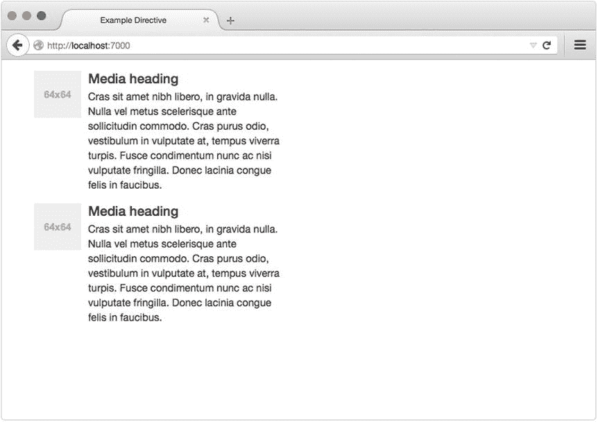
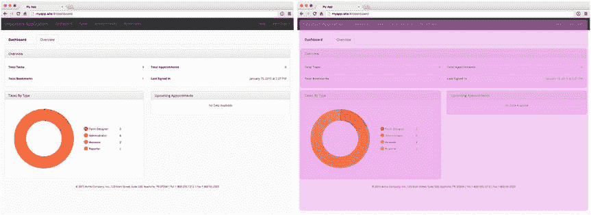
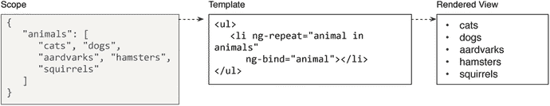
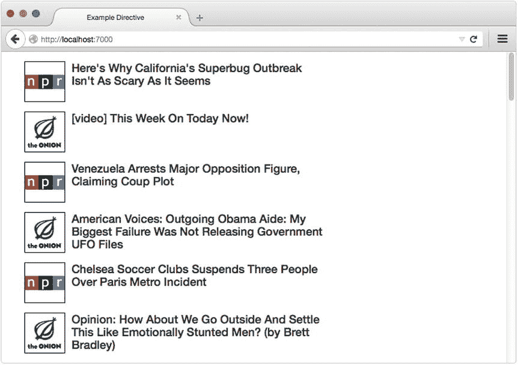
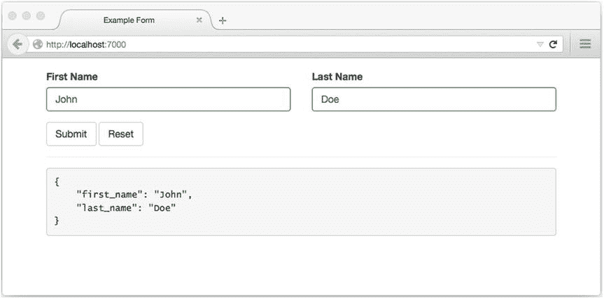
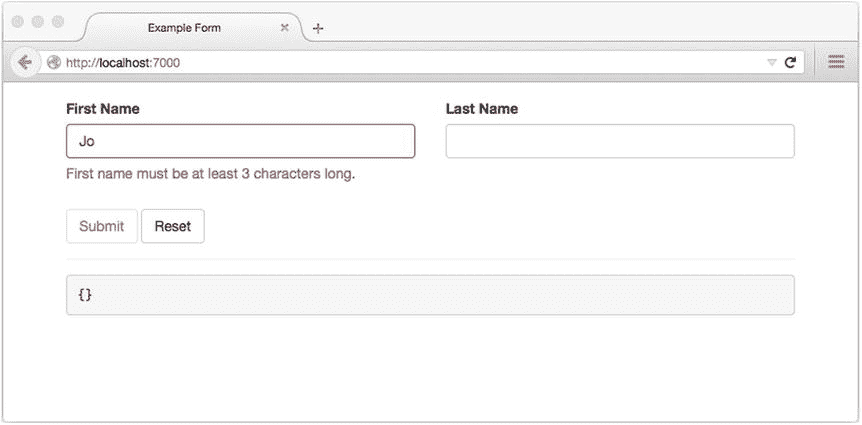
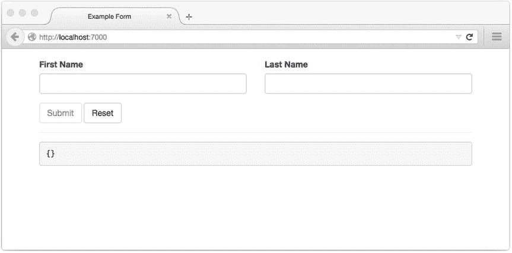
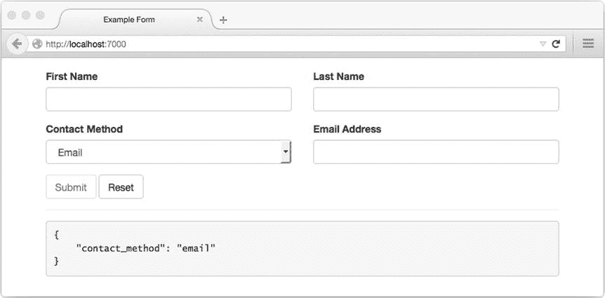
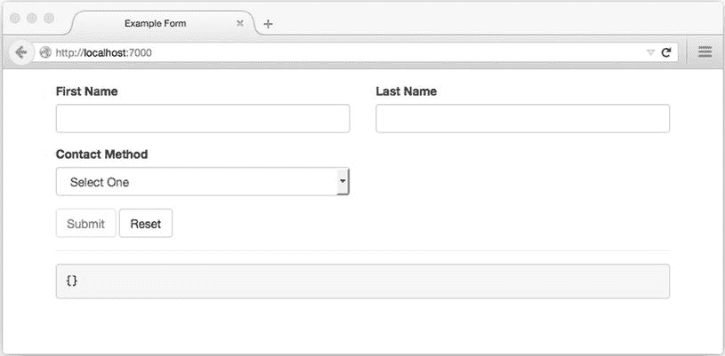
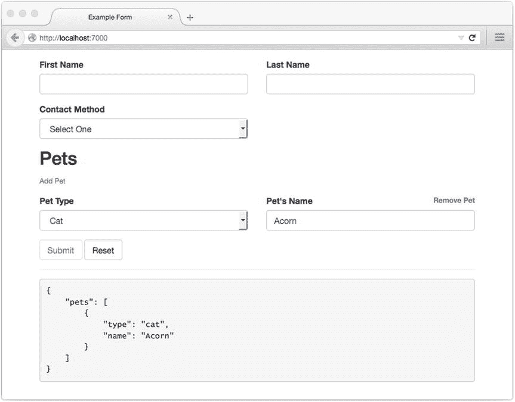

# 八、AngularJS

构建大型应用的秘密是永远不要构建大型应用。将你的应用分成小块。然后，将这些可测试的小部分组装到您的大应用中。—贾斯汀·迈耶，JavaScriptMVC 的创造者

AngularJS 成功吸引了开发人员社区的大量关注，这是有充分理由的:该框架解决许多通常与单页面应用开发相关的挑战的独特方法与流行的替代方法有很大不同。这些差异为 Angular 赢得了一大批忠实粉丝，以及越来越多直言不讳的评论家。

随着本章的深入，你将会了解到 Angular 区别于其他单页面应用框架的一些独特的特性。我们还将提供一些指导，说明什么类型的项目可能最能从 Angular 中受益，以及其他替代方案可能更适合什么类型的项目。在我们结束这一章之前，我们还将花一点时间讨论 Angular 的历史，它的当前状态，以及这个框架的未来。

## 构建 Web 应用的声明式方法

Angular 最显著的特点是它允许开发人员以一种所谓的“声明式”方式创建 web 应用，而不是大多数开发人员习惯的“命令式”方法。这两种方法之间的差别是微妙的，但必须理解它才能真正体会 Angular 给桌面带来的独特好处。让我们看一下演示每种方法的两个例子。

### 命令式方法

命令式的:具有表达命令而不是陈述或问题的形式的—Merriam-Webster.com

当大多数人想到“编程”时，命令式方法通常是他们所想到的。使用这种方法，开发者指导计算机如何做某事。结果，期望的行为(有希望)得以实现。举例来说，考虑清单 [8-1](#FPar1) ，它显示了一个简单的 web 应用，该应用使用命令式方法来显示一个无序的动物列表。

Listing 8-1\. Simple, Imperative Web Application

`// example-imperative/public/index.html`

`<!DOCTYPE html>`

`<html lang="en">`

`<head>`

`<meta charset="utf-8">`

`<title>Imperative App</title>`

`</head>`

`<body>`

`<ul id="myList">`

`</ul>`

``

``

`</body>`

`</html>`

在这个例子中，我们的应用所期望的行为——创建一个动物列表——是由于我们明确地指示计算机如何着手创建它而实现的:

We start our application by creating a new instance of the `App` class and calling its `init()` method.   We specify our list’s entries in the form of an array (`animals`).   We create a reference to the desired container of our list (`$list`).   Finally, we iterate through each of our array’s entries and append them, one by one, to the container.  

当使用命令式方法创建应用时，该应用的源代码是控制该应用做什么以及何时做的主要来源。简而言之，命令式应用告诉计算机如何运行。

### 声明式方法

陈述性的:具有陈述的形式而不是问题或命令的形式的—Merriam-Webster.com

编程的声明性方法采用大多数人熟悉的传统的命令式方法，并彻底颠覆了它。当开发人员使用这种方法时，他们将精力集中在描述想要的结果上，而将实现该结果的必要步骤留给计算机本身。

举例来说，清单 [8-2](#FPar2) 显示了一个简单的 web 应用，与清单 [8-1](#FPar1) 中显示的非常相似。这里，在 Angular 的帮助下，使用更具声明性的方法显示了一个无序的动物列表。

Listing 8-2\. Declarative Web Application Developed with Angular

`// example-declarative/public/index.html`

`<!DOCTYPE html>`

`<html lang="en" ng-app="app">`

`<head>`

`<meta charset="utf-8">`

`<title>Declarative App</title>`

`</head>`

`<body>`

`
`

`<ul>`

`<li ng-repeat="animal in animals">{{animal}}</li>`

`</ul>`

`
`

``

``

`</body>`

`</html>`

清单 [8-2](#FPar2) 中显示的 HTML 包含了几项重要的内容，但是现在，请注意页面中使用的各种非标准属性(例如，`ng-app`、`ng-controller`和`ng-repeat`)。这些属性演示了指令的使用，这是 Angular 最突出和最受欢迎的特性之一。

简而言之，Angular 指令允许开发人员用他们自己的定制扩展来增强 HTML 的语法。这些扩展可以以类、定制属性、注释甚至全新的 DOM 元素的形式出现，我们很快就会看到。当 Angular 遇到这些指令时，它会自动执行与它们相关联的任何功能。这可能包括函数的执行、模板的加载等等。Angular 还包括几个自己的内置指令(比如清单 [8-2](#FPar2) 中使用的指令)，其中很多我们将在本章中讨论。

当使用声明性方法创建 web 应用时，确定该应用中的控制流的责任从源代码转移到了接口。我们没有明确说明应用加载后需要发生什么(如清单 [8-1](#FPar1) 所示)，而是让应用的界面自己描述需要发生什么。角度指令有助于实现这一点。

对于新手来说，应用开发的命令式方法和声明式方法之间的差异可能看起来很微妙，但是随着我们的继续，我想您会发现有很多令人兴奋的地方。

## 模块:构建松耦合应用的基础

当我们不再把复杂的应用作为一个单一的实体来对待，而是作为一个小组件的集合来一起工作以达到预期的目标时，它们就不再复杂了。Angular 模块是所有 Angular 项目的基本构建模块，它为我们提供了一种以这种方式构建应用的便捷模式。

再看一下清单 [8-2](#FPar2) 并注意这个例子对 Angular 的`module()`方法的调用，它既是 setter 又是 getter。在这里，我们创建了一个模块，将我们的应用作为一个整体。为了使用 setter 语法定义新模块，我们提供了新模块的名称，以及引用该模块所依赖的其他模块的名称数组。在这个例子中，我们的模块没有依赖项，但是为了使用 setter 语法，我们仍然传递了一个空数组。另一方面，清单 [8-3](#FPar3) 展示了一个具有两个依赖关系的新`app`模块的创建。

Listing 8-3\. Creating a New Angular Module with Dependencies

`/**`

`* Creates a new module that depends on two other modules - `module1` and `module2``

`*/`

`var app = angular.module('app', ['module1', 'module2']);`

一旦定义了一个模块，我们就可以通过使用`module()`方法的 getter 语法来获取对它的引用，如清单 [8-4](#FPar4) 所示。

Listing 8-4\. Angular’s `module()` Method Serves As a Getter when No Dependencies Array Is Passed

`/**`

`* Returns a reference to a pre-existing module named `app``

`*/`

`var app = angular.module('app');`

在这一章中，我们将会看到 Angular 为构建应用提供的许多工具。当我们这样做时，请记住这些工具总是在模块的上下文中使用。每个 Angular 应用本身就是一个依赖于其他模块的模块。了解了这一点，我们可以将角度应用的一般结构想象成如图 [8-1](#Fig1) 所示。

图 8-1。

Every Angular application is a module, and Angular modules may specify other modules as dependencies

### 指定引导模块

物理世界中的重大建筑项目通常始于基石的铺设，即所有其他块围绕其设置的第一块基石。类似地，每个 Angular 项目都有自己的基石——代表应用本身的模块。初始化该模块(及其依赖项)的过程被称为 Angular 的“引导”过程，可以通过两种可能的方式之一启动。

#### 自动引导

回头参考清单 [8-2](#FPar2) ，注意附在页面`html`标签上的`ng-app`指令。当这个页面完成加载后，Angular 将自动检查这个指令是否存在。如果找到了，它引用的模块将作为应用的基础模块——代表应用本身的模块。该模块将自动初始化，此时应用将准备就绪。

#### 手动引导

对于大多数应用，Angular 的自动引导过程应该足够了。然而，在某些情况下，对该过程何时发生进行更大程度的控制可能是有用的。在这种情况下，可以手动启动 Angular 的引导过程，如清单 [8-5](#FPar5) 所示。

Listing 8-5\. Deferring Angular’s Bootstrap Process Until the Completion of an Initial jQuery-based AJAX Request

`$.ajax({`

`'url': '/api/data',`

`'type': 'GET'`

`}).done(function() {`

`angular.bootstrap(document, ['app']);`

`});`

在这个例子中，我们推迟 Angular 的引导过程，直到一个初始 AJAX 请求完成。只有这样，我们才调用 Angular 的`bootstrap()`方法，传递一个 DOM 对象作为我们应用的容器(它的“根元素”)，以及一个数组，指定一个名为`app`(代表我们应用的模块)的模块作为依赖项。

Note

大多数情况下，角度应用将作为页面中唯一的应用存在；但是，多个角度应用可以在同一页面中共存。当他们这样做时，只有一个人可以利用 Angular 的自动引导过程，而其他人必须在适当的时间手动引导自己。

## 指令:DOM 的抽象层

通过使用原型继承，JavaScript 为开发人员提供了一种创建带有自定义内置行为的命名函数(类的 JavaScript 等价物)的机制。然后，其他开发人员可以实例化和使用这样的类，而不需要理解它们的内部工作原理。清单 [8-6](#FPar7) 中的例子演示了这个过程。

Listing 8-6\. Prototypal Inheritance in Action

`// example-prototype/index.js`

`function Dog() {`

`}`

`Dog.prototype.bark = function() {`

`console.log('Dog is barking.');`

`};`

`Dog.prototype.wag = function() {`

`console.log('Tail is wagging.');`

`};`

`Dog.prototype.run = function() {`

`console.log('Dog is running.');`

`};`

`var dog = new Dog();`

`dog.bark();`

`dog.wag();`

`dog.run();`

这个将复杂行为抽象到简单接口背后的过程是一个基本的面向对象编程概念。同样，Angular 指令可以被视为 DOM 的抽象层，它为开发人员提供了一种创建复杂 web 组件的机制，只需使用简单的 HTML 标记就可以使用这些组件。清单 [8-7](#FPar8) 提供了一个例子，应该有助于澄清这个概念。

Listing 8-7\. Example Demonstrating the Creation of a Simple Angular Directive

`// example-directive1/public/index.html`

`<!DOCTYPE html>`

`<html lang="en" ng-app="app">`

`<head>`

`<meta charset="utf-8">`

`<title>Example Directive</title>`

`<link rel="stylesheet" href="/css/style.css">`

`<link rel="stylesheet" href="/bower_components/bootstrap/dist/css/bootstrap.css">`

`</head>`

`<body class="container">`

`<news-list></news-list>`

``

``

`</body>`

`</html>`

在为我们的应用创建了一个模块之后，我们通过调用我们的模块的`directive()`方法，传递一个名称和一个工厂函数来定义一个新的指令，这个工厂函数负责将描述我们的新指令的对象返回给 Angular。我们的工厂函数返回的对象可能会指定几个不同的选项，但是在这个简单的示例中，只使用了三个选项:

*   `restrict`:指定该指令是否应该与 Angular 找到的匹配属性(`A`)、类(`C`)或 DOM 元素(`E`)成对出现(或者三者的任意组合)。在这个例子中，`E`的值指定 Angular 应该只将我们的指令与标记名匹配的 DOM 元素配对。通过传递`AEC`，我们可以很容易地指定所有三个。
*   `replace`:值为`true`表示我们的组件应该完全替换与之配对的 DOM 元素。值`false`将允许我们创建一个指令，以某种方式简单地增加一个现有的 DOM 元素，而不是用别的东西完全替换它。
*   Angular 在这个 URL 上找到的标记一旦被插入到 DOM 中，就会代表我们的指令。也可以通过使用`template`选项直接传递模板的内容。

Note

关于我们新指令的名称，注意当我们在 Angular 中创建它时使用了 camelCase 格式，当我们在 HTML 中引用它时使用了破折号分隔的格式。这种差异是由于 HTML 标记不区分大小写的特性造成的。当 Angular 解析我们的 HTML 时，它会自动为我们解决命名约定中的这些差异。

现在，当我们在浏览器中加载应用时，Angular 会自动将新定义的指令与它找到的任何匹配的 DOM 元素配对。因此，`<news-list>`标签的所有实例将被图 [8-2](#Fig2) 中所示的元素替换。

图 8-2。

Our newly defined directive

我们刚刚讨论的基本示例只不过是用不同的模板替换了一个定制的 DOM 元素(我们将在下一节中通过添加我们自己的定制逻辑来构建这个示例)。但是，您应该已经开始注意到角度指令给开发人员带来的强大功能和便利。通过使用清单 [8-7](#FPar8) 中所示的简单标签将复杂组件注入应用的能力为开发人员提供了一种方便的机制，用于抽象简单外观背后的复杂功能，从而更易于管理。

## 掌握控制权

在上一节中，我们逐步创建了一个简单的 Angular 指令，最终，它只是用我们选择的单独模板替换了一个自定义 DOM 元素。这是指令本身的一个有用的应用，但是为了理解指令的全部功能，我们需要通过应用我们自己的定制逻辑来进一步应用这个例子，这将允许我们的指令实例以有趣的方式运行。我们可以在示波器和控制器的帮助下做到这一点。

### 范围和原型继承

一开始，角度范围可能有点难以理解，因为它们直接关系到 JavaScript 的一个更令人困惑的方面:原型继承。Angular 的新手经常会发现作用域是一个比较混乱的概念，但是对它们的深入理解对于使用这个框架来说是必不可少的。在我们继续之前，让我们花几分钟时间来探索它们的目的和工作原理。

在大多数“经典的”面向对象语言中，继承是通过使用类来完成的。另一方面，JavaScript 实现了一种完全不同的继承结构，称为原型继承，其中所有的继承都是通过使用对象和函数来完成的。清单 [8-8](#FPar10) 展示了这个过程的一个实例。

Listing 8-8\. Example of Prototypal Inheritance, in Which `Car` Extends `Vehicle`

`// example-prototype2/index.js`

`/**`

`* @class Vehicle`

`*/`

`var Vehicle = function Vehicle() {`

`console.log(this.constructor.name, 'says: I am a vehicle.');`

`};`

`Vehicle.prototype.start = function() {`

`console.log('%s has started.', this.constructor.name);`

`};`

`Vehicle.prototype.stop = function() {`

`console.log('%s has stopped.', this.constructor.name);`

`};`

`/**`

`* @class Car`

`*/`

`var Car = function Car() {`

`console.log(this.constructor.name, 'says: I am a car.');`

`Vehicle.apply(this, arguments);`

`};`

`Car.prototype = Object.create(Vehicle.prototype);`

`Car.prototype.constructor = Car;`

`Car.prototype.honk = function() {`

`console.log('%s has honked.', this.constructor.name);`

`};`

`var vehicle = new Vehicle();`

`vehicle.start();`

`vehicle.stop();`

`var car = new Car();`

`car.start();`

`car.honk();`

`car.stop();`

`/* Result:`

`Vehicle says: I am a vehicle.`

`Vehicle has started.`

`Vehicle has stopped.`

`Car says: I am a car.`

`Car says: I am a vehicle.`

`Car has started.`

`Car has honked.`

`Car has stopped.`

`*/`

在这个例子中，定义了一个`Vehicle`函数。我们通过扩充它的原型来给它分配`start()`和`stop()`实例方法。之后，我们定义了一个`Car`函数，只是这一次，我们用一个继承自`Vehicle`的函数替换了它的原型。最后，我们给`Car`分配一个`honk`实例方法。当运行这个例子时，请注意这样一个事实，即`Vehicle`的新实例可以启动和停止，而`Car`的新实例可以启动、停止和鸣响。这是工作中的原型继承。

这是一个需要掌握的重要概念——在 Angular 的引导阶段，会发生一个类似的过程，创建一个父对象(称为`$rootScope`)并附加到应用的根元素。之后，Angular 将继续解析 DOM 以搜索指令(Angular 将这个过程称为“编译”)。当遇到这些指令时，Angular 将创建继承自其最近祖先的新对象，并将它们分配给每个指令所附加的 DOM 元素。实际上，Angular 为我们应用中的每个组件创建了一个特殊的沙箱——用 Angular 的术语来说，就是一个“范围”。结果可以被可视化为类似于图 [8-3](#Fig3) 所示的东西。

图 8-3。

A web application with various components created with the help of directives. On the right, portions of the DOM are highlighted where new scopes have been created

### 用控制器操纵范围

角度控制器只不过是一个函数，它的唯一目的是操纵一个范围对象，在这里我们可以开始为我们的应用组件添加一些智能。清单 [8-9](#FPar11) 展示了我们在清单 [8-7](#FPar8) 中看到的例子的扩展版本。唯一的区别是向负责描述我们的指令的对象添加了一个`controller`属性。该指令使用的模板内容如清单 [8-10](#FPar12) 所示。

Listing 8-9\. Extended Version of Listing [8-7](#FPar8) Example That Adds Custom Behavior to Our New Directive

`// example-directive2/public/index.html`

`<!DOCTYPE html>`

`<html lang="en" ng-app="app">`

`<head>`

`<meta charset="utf-8">`

`<title>Example Directive</title>`

`<link rel="stylesheet" href="/css/style.css">`

`<link rel="stylesheet" href="/bower_components/bootstrap/dist/css/bootstrap.css">`

`</head>`

`<body class="container">`

`<news-list></news-list>`

``

``

`</body>`

`</html>`

Listing 8-10\. Contents of Our Directive’s Template

`// example-directive2/public/templates/news-list.html`

`
`

`
`

`
`

`
`

`
`

`<a href="#">`

``

`</a>`

`
`

`
`

`<h4 class="media-heading" ng-bind="item.title"></h4>`

`
`

`
`

`
`

`
`

`
`

在清单 [8-9](#FPar11) 中，请特别注意我们为指令的`controller`属性分配函数的部分。请注意，我们的控制器函数接收两个参数:`$scope`和`$http`。目前，不要关心这些参数是如何传递给我们的控制器的——我们将在接下来的服务部分讨论这个问题。现在，要意识到的重要事情是，在我们的控制器中，`$scope`变量指的是 Angular 在 DOM 中第一次遇到我们的指令时自动为我们创建的对象。在这一点上，我们的控制器有机会改变该对象，结果，由于 Angular 对双向数据绑定的支持，可以看到这些变化反映在 DOM 中。

#### 双向数据绑定

数据绑定描述了 Angular 将模板与 JavaScript 对象(即范围)链接起来的能力，允许模板引用范围内的属性，然后将这些属性呈现给浏览器。图 [8-4](#Fig4) 说明了这一过程。

图 8-4。

Process by which data binding allows Angular applications to render data that is referenced within a scope object

Angular 对数据绑定的支持并不仅限于这种单向过程，即在一个范围内引用的数据显示在一个视图中。该框架还提供实现相反效果的指令，允许指令的范围随着其视图内发生的变化而更新(例如，当表单字段的值改变时)。当 Angular 的数据绑定实现被描述为“双向”时，这就是所指的。

Note

双向数据绑定的主题将在本章后面的“创建复杂表单”一节中详细讨论。

在清单 [8-9](#FPar11) 中，我们的控制器使用 Angular 的`$http`服务从我们的 API 中获取一个数组，该数组包含来自国家公共电台和 The Onion 的标题。然后，它将该数组赋给我们指令的`$scope`对象的`items`属性。要查看这些信息如何在 DOM 中得到反映，请注意清单 [8-10](#FPar12) 中显示的`ng-repeat`指令。这个核心 Angular 指令允许我们从模板中迭代数组，为数组中包含的每一项创建新的`
...
`元素。最后，Angular 内置的`ng-src`和`ng-bind`指令允许我们动态地将图像 URL 和文本内容分配给模板中适当的元素。

在浏览器中加载该应用后的最终结果如图 [8-5](#Fig5) 所示。

图 8-5。

Our application after having been loaded in the browser

## 通过服务和依赖注入实现松散耦合

在上一节中，我们介绍了将 Angular 应用组织为一系列嵌套作用域的基本过程，这些作用域可以由控制器操作，并通过双向数据绑定由模板引用。仅使用这些概念，有可能构建相当简单的应用(如本章中包含的一些示例所示)，但是如果没有计划，构建任何更复杂的应用的尝试将很快陷入成长的烦恼。在这一节中，我们将发现服务如何支持开发人员构建松散耦合的角度应用，以适应增长。

### 依赖注入

在我们深入研究服务之前，有必要花一点时间来讨论一下依赖注入，这是一个对于客户端框架来说相当新的概念，Angular 非常依赖它。

首先，看一下清单 [8-11](#FPar14) ，它显示了一个非常基本的 Node.js 应用，只有一个依赖项，即`fs`模块。在这个例子中，我们的模块负责通过`require()`方法检索`fs`模块。

Listing 8-11\. Node.js Application That Depends on the `fs` Module

`var fs = require('fs');`

`fs.readFile('∼/data.txt', 'utf8', function(err, contents) {`

`if (err) throw new Error(err);`

`console.log(contents);`

`});`

我们在这里看到的模式，其中一个模块“需要”一个依赖，直观上是有意义的。一个模块需要另一个组件，所以它出去得到它。然而，依赖注入的概念颠覆了这个概念。清单 [8-12](#FPar15) 显示了 Angular 中依赖注入的一个简单例子。

Listing 8-12\. Dependency Injection in Action Within Angular

`var app = angular.module('app', []);`

`app.controller('myController', function($http) {`

`$http.get('/api/news').then(function(result) {`

`console.log(result);`

`});`

`});`

像 Angular 这样实现依赖注入的框架规定了一个通用的模式，通过这个模式，模块可以将自己注册到一个中心控制点。换句话说，当一个应用被初始化时，模块有机会说，“这是我的名字，你可以在这里找到我。”之后，在程序执行的整个过程中，加载的模块可以简单地通过将它们指定为构造函数(或类)的参数来引用它们的依赖关系。它们被指定的顺序没有区别。

回头参考清单 [8-12](#FPar15) 。在这个例子中，我们创建了一个新的`app`模块来表示我们的应用。接下来，我们在应用的模块中创建一个名为`myController`的控制器，传递一个构造函数，每当需要一个新实例时就会调用这个函数。注意传入控制器构造函数的`$http`参数；这是工作中依赖注入的一个例子。我们的控制器所指的`$http`依赖项是 Angular 的核心代码库中包含的一个模块。在我们的应用的引导阶段，Angular 以服务的形式注册了这个模块——与您将要学习如何为自己创建的服务类型相同。

Note

按照惯例，Angular 提供的核心服务、API、属性都以`$`为前缀。为了防止可能的冲突，最好在您自己的代码中避免遵循此约定。

### 瘦控制器和胖服务

再看一下清单 [8-9](#FPar11) ，它展示了使用控制器为应用的指令增加智能的过程。在这个例子中，我们的控制器创建了一个 AJAX 请求，从我们的 API 返回一组新闻标题。虽然这样做可行，但是这个例子并没有解决在整个应用中共享这些信息的真实和可预见的需求。

虽然我们可以让其他感兴趣的组件自己复制这个 AJAX 请求，但这并不理想，原因有很多。如果我们能够将收集这些标题的逻辑抽象到一个可以在整个应用中重用的集中式 API 中，我们会处于一个更好的位置。这样做将为我们提供许多好处，包括能够在 API 的消费者不知道的情况下，在单个位置更改获取这些信息的 URL。

我们马上就会看到，角度服务为我们提供了实现这一目标所需的工具。服务为我们提供了一种创建定义良好的接口的机制，这些接口可以在整个应用中共享和重用。当 Angular 应用的大部分逻辑以这种方式构建时，我们可以开始看到控制器的真实面目:只不过是一层薄薄的胶水，负责以对特定视图最有意义的方式将范围与服务绑定在一起。

在 Angular 中，存在三大类服务类型(其中一个被命名为“服务”)，即工厂、服务和提供者。让我们来看看每一个。

#### 工厂

清单 [8-13](#FPar17) 中所示的例子是在清单 [8-9](#FPar11) 的基础上构建的，它将获取标题所需的逻辑移到了一个工厂中。

Listing 8-13\. Angular `headlines` Factory That Provides an API for Fetching News Headlines

`// example-directive3/public/index.html`

`<!DOCTYPE html>`

`<html lang="en" ng-app="app">`

`<head>`

`<meta charset="utf-8">`

`<title>Example Directive</title>`

`<link rel="stylesheet" href="/css/style.css">`

`<link rel="stylesheet" href="/bower_components/bootstrap/dist/css/bootstrap.css">`

`</head>`

`<body class="container">`

`<news-list></news-list>`

``

``

`</body>`

`</html>`

在清单 [8-13](#FPar17) 中，`headlines`工厂用一个`fetch()`方法返回一个对象，当这个方法被调用时，它将查询我们的 API 以获取标题，并以承诺的形式返回它们。

在大多数角度应用中，工厂是最常用的服务类型。工厂第一次作为依赖项被引用时，Angular 将调用工厂的函数并将结果返回给请求者。对该服务的后续引用将收到与第一次引用该服务时最初返回的结果相同的结果。换句话说，工厂可以被认为是单例的，因为它们从来不会被调用超过一次。

#### 服务

清单 [8-14](#FPar18) 中所示的例子是在清单 [8-9](#FPar11) 的基础上构建的，它将获取标题所需的逻辑转移到了一个服务中。

Listing 8-14\. Angular `headlines` Service That Provides an API for Fetching News Headlines

`// example-directive4/public/index.html`

`<!DOCTYPE html>`

`<html lang="en" ng-app="app">`

`<head>`

`<meta charset="utf-8">`

`<title>Example Directive</title>`

`<link rel="stylesheet" href="/css/style.css">`

`<link rel="stylesheet" href="/bower_components/bootstrap/dist/css/bootstrap.css">`

`</head>`

`<body class="container">`

`<news-list></news-list>`

``

``

`</body>`

`</html>`

在 Angular 中，服务的功能几乎和工厂一样，只有一个关键的区别。虽然简单地调用工厂函数，但是服务函数是通过关键字`new`作为构造函数调用的，允许它们以实例化的类的形式定义。您选择使用哪一种很大程度上取决于风格偏好，因为两者可以实现相同的最终结果。

在这个例子中，我们没有像在工厂中那样返回一个对象，而是将一个`fetch()`方法分配给`this`，这个对象最终由我们的服务的构造函数返回。

#### 提供者

清单 [8-15](#FPar19) 中所示的例子是在清单 [8-9](#FPar11) 的基础上构建的，它将获取标题所需的逻辑移到了一个提供者中。

Listing 8-15\. Angular `headlines` Provider That Provides an API for Fetching News Headlines

`// example-directive5/public/index.html`

`<!DOCTYPE html>`

`<html lang="en" ng-app="app">`

`<head>`

`<meta charset="utf-8">`

`<title>Example Directive</title>`

`<link rel="stylesheet" href="/css/style.css">`

`<link rel="stylesheet" href="/bower_components/bootstrap/dist/css/bootstrap.css">`

`</head>`

`<body class="container">`

`<news-list></news-list>`

``

``

`</body>`

`</html>`

与工厂和服务完全负责确定自己的设置不同，Angular 提供程序允许开发人员在其父模块的配置阶段配置它们。这样，提供者可以被认为是可配置的工厂。在这个例子中，我们定义了一个`headlines`提供者，它的功能与我们在清单 [8-13](#FPar17) 中创建的工厂相同，只是这一次，`fetch()`方法将一个可配置的`limit`参数传递给我们的 API，允许它指定它将接收的结果数量的限制。

在清单 [8-15](#FPar19) 中，我们在提供者中的`this.$get`处定义了一个工厂函数。当`headlines`提供者作为依赖项被引用时，Angular 将调用这个函数并将其结果返回给请求者，就像它在清单 [8-13](#FPar17) 中对我们的工厂所做的那样。相比之下，请注意我们的提供者的`fetch()`方法是如何引用在模块的`config`块中定义的`limit`属性的。

## 创建路线

用 Angular 等框架构建的所谓“单页应用”为用户提供了更类似于传统桌面应用的流畅体验。他们通过预加载所有(或大部分)所需的各种资源(例如，脚本、样式表等)来实现这一点。)在单个预先页面加载中。然后，对不同 URL 的后续请求被拦截，并通过后台 AJAX 请求进行处理，而不需要完全刷新页面。在本节中，您将学习如何在 Angular 的`ngRoute`模块的帮助下管理这样的请求。

清单 [8-16](#FPar20) 建立在之前清单 [8-13](#FPar17) 中显示的例子之上。然而，这一次，我们在应用中添加了两条路径，允许用户导航到标有“仪表板”和“新闻标题”的部分只有在用户导航到`/#/headlines`路线后，我们的`newsList`指令才会被注入页面。为实现这一目标，采取了以下步骤:

Define a configuration block that will be executed during our application’s bootstrap phase. Within this function, we reference the `$routeProvider` service provided by Angular’s `angular-route` package, which must be installed in addition to Angular’s core library.   Define an array, `routes`, within which objects are placed that define the various routes to be made available by our application. In this example, each object’s `route` property defines the location at which the route will be loaded, while the `config` property allows us to specify a controller function and template to be loaded at the appropriate time.   Iterate through each entry of the `routes` array and pass the appropriate properties to the `when()` method made available by the `$routeProvider` service. This approach provides us with a simple method by which multiple routes can be defined. Alternatively, we could have made two separate, explicit calls to the `$routeProvider.when()` method without using an array.   Utilize the `$routeProvider.otherwise()` method to define a default route to be loaded in the event that no route (or an invalid route) is referenced by the user.   Listing 8-16\. Angular Application That Defines Two Routes, `dashboard` and `headlines`

`// example-router1/public/index.html`

`<!DOCTYPE html>`

`<html lang="en" ng-app="app">`

`<head>`

`<meta charset="utf-8">`

`<title>Routing Example</title>`

`<link rel="stylesheet" href="/css/style.css">`

`<link rel="stylesheet" href="/bower_components/bootstrap/dist/css/bootstrap.css">`

`</head>`

`<body class="container">`

`<ng-view></ng-view>`

``

``

``

``

`</body>`

`</html>`

### 路线参数

实际上，在典型的角度应用中存在的大多数路线被设计成提供基于每条路线期望的一个或多个参数值而变化的动态内容。清单 [8-17](#FPar21) 中所示的例子演示了如何实现这一点。

Listing 8-17\. Angular Application with Routes That Vary Their Content Based on the Value of an Expected Parameter

`// example-router2/public/index.html`

`<!DOCTYPE html>`

`<html lang="en" ng-app="app">`

`<head>`

`<meta charset="utf-8">`

`<title>Routing Example</title>`

`<link rel="stylesheet" href="/css/style.css">`

`<link rel="stylesheet" href="/bower_components/bootstrap/dist/css/bootstrap.css">`

`</head>`

`<body class="container">`

`<ng-view></ng-view>`

``

``

``

`</body>`

`</html>`

### 路线解析

如果操作正确，单页应用可以为用户提供比标准应用更好的体验。也就是说，这些改进不是没有代价的。在单页应用的整个生命周期中，协调各种 API 调用是非常具有挑战性的。在我们继续之前，让我们接触一下 Angular 的`ngRoute`模块提供的一个特别有用的特性，它可以帮助我们驯服这种复杂性:分辨率。

解决方案允许我们定义一个或多个步骤，这些步骤必须在转换到特定路线之前发生。如果为路径定义的任何解析碰巧返回承诺，则只有在每个解析完成后，到所需路径的转换才会完成。清单 [8-18](#FPar22) 中所示的示例显示了实际的路由解析。

Listing 8-18\. Route Resolutions in Action

`// example-router3/public/index.html`

`<!DOCTYPE html>`

`<html lang="en" ng-app="app">`

`<head>`

`<meta charset="utf-8">`

`<title>Routing Example</title>`

`<link rel="stylesheet" href="/css/style.css">`

`<link rel="stylesheet" href="/bower_components/bootstrap/dist/css/bootstrap.css">`

`</head>`

`<body class="container">`

`<ng-view></ng-view>`

``

``

``

`</body>`

`</html>`

在本例中，定义了一条路线，在对 API 进行两次相应的调用以获取该信息后，该路线显示动物和颜色的列表。我们在 route 的`resolve`对象中创建请求，而不是直接从 route 的控制器中请求这些信息。因此，当我们的路由控制器函数被调用时，我们可以肯定地知道请求已经完成。

## 创建复杂表单

HTML 表单很难管理。一个主要关注点是验证，通过该过程，用户可以意识到问题(例如，未填写的必填字段)并被引导到问题的解决方案。此外，复杂的表单经常需要额外的逻辑，允许它们根据用户对前面问题的回答来改变内容。在接下来的几页中，我们将通过几个例子来展示 Angular 如何帮助简化这些挑战。

### 确认

设计良好的 HTML 表单会仔细考虑用户体验。他们没有假设用户完全理解他们被要求做什么。当存在问题时，他们还会特意通知用户，以及解决问题所需的步骤。幸运的是，Angular 的声明性语法允许开发人员轻松创建遵守这些规则的表单。

清单 [8-19](#FPar23) 显示了我们第一个例子的 HTML，而清单 [8-20](#FPar24) 显示了附带的控制器。

Listing 8-19\. HTML Form That Implements Validation and Displays Dynamic Feedback to the User

`// example-form1/public/index.html`

`<!DOCTYPE html>`

`<html lang="en" ng-app="app">`

`<head>`

`<meta charset="utf-8">`

`<title>Example Form</title>`

`<link rel="stylesheet" href="/css/style.css">`

`</head>`

`<body ng-controller="formController">`

`<form name="myForm" ng-class="formClass" ng-submit="submit()" novalidate>`

`
`

`
`

`<label>First Name</label>`

`<input`

`type="text"`

`name="first_name"`

`ng-model="model.first_name"`

`class="form-control"`

`ng-minlength="3"`

`ng-maxlength="15"`

`ng-required="true">`

`
`

`First name is required.`

`
`

`
`

`First name must be at least 3 characters long.`

`
`

`
`

`First name can have no more than 15 characters.`

`
`

`
`

`
`

`<label>Last Name</label>`

`<input`

`type="text"`

`name="last_name"`

`ng-model="model.last_name"`

`class="form-control"`

`ng-minlength="3"`

`ng-maxlength="15"`

`ng-required="true">`

`
`

`Last name is required.`

`
`

`
`

`Last name must be at least 3 characters long.`

`
`

`
`

`Last name can have no more than 15 characters.`

`
`

`
`

`
`

`
`

`
`

`<button type="submit" ng-disabled="myForm.$invalid">Submit</button>`

`<button type="button" ng-click="reset()">Reset</button>`

`
`

`
`

`</form>`

`
`

`

`

``

``

`</body>`

`</html>`

Listing 8-20\. Controller That Has Been Attached to the Document’s `<body>` Element

`// example-form1/public/app/index.js`

`var app = angular.module('app', []);`

`app.controller('formController', function($scope, $http, $log) {`

`$scope.formClass = null;`

`$scope.model = {};`

`$http.get('/api/model').then(function(result) {`

`$scope.model = result.data;`

`});`

`$scope.submit = function() {`

`if (!$scope.myForm.$valid) return;`

`$http.post('/api/model', {`

`'model': $scope.model`

`}).then(function() {`

`alert('Form submitted.');`

`}).catch(function(err) {`

`alert(err);`

`});`

`};`

`$scope.reset = function() {`

`$scope.model = {};`

`$http.post('/api/model', {`

`'model': $scope.model`

`});`

`};`

`/**`

`* Angular’s built-in `$watch()` method (available within every controller)`

`* enables us to watch for and respond to changes that occur within variables`

`* defined at the `$scope` level. Here we save the contents of our a form as`

`* a JSON string to `$scope.output`, which is referenced by our template.`

`*/`

`$scope.$watch('model', function() {`

`$scope.output = angular.toJson($scope.model, 4);`

`}, true);`

`});`

当 Angular 编译我们的应用时，它会将一个内置的`form`指令应用到模板中包含的`<form>`元素。该指令将创建一个特殊控制器`FormController`的新实例，该实例用于管理表单实例。最后，基于我们表单的`name`属性的值(在本例中是`myForm`)，Angular 将把对新创建的`FormController`实例的引用分配给表单的父范围，允许我们的控制器在`$scope.myForm`与我们新创建的表单进行交互。

`FormController`的实例提供了许多有用的属性和方法，您可以在清单 [8-19](#FPar23) 和清单 [8-20](#FPar24) 中看到这些属性和方法。例如，请注意我们如何在`ng-disabled`指令的帮助下动态地启用或禁用表单的提交按钮。在这个例子中，我们设置了这个指令来引用表单的`$invalid`属性，该属性将总是返回`TRUE`或`FALSE`来指示表单中包含的任何输入是否处于无效状态。

清单 [8-19](#FPar23) 还应用了额外的内置角度指令(`ng-minlength`、`ng-maxlength`和`ng-required`)来在我们的表单中实现一些简单的验证规则。在每个输入的正下方，我们的模板引用了`myForm`对象上的各种属性来确定当前存在什么错误(如果有的话)。基于这些信息，它可以向用户隐藏或显示适当的反馈。

请注意清单 [8-19](#FPar23) 中的`ng-model`指令在我们表单的每个输入字段上的使用。这个指令(专门设计用于表单控件)允许我们实现双向数据绑定，这个概念在本章前面已经简单提到过。随着在每个字段中输入的值发生变化，我们的范围也将更新，属性由`ng-model`引用。由于双向数据绑定，相反的效果也成立。如果我们的控制器要修改由`ng-model`引用的值，匹配的表单输入也会相应地更新。值得注意的是，`ng-model`指令是我们确定表单输入值的首选方法。在 Angular 中，输入的`name`属性仅用于验证目的。

图 [8-6](#Fig6) 、图 [8-7](#Fig7) 和图 [8-8](#Fig8) 显示了用户将在其浏览器中看到的最终结果。

图 8-8。

Our form in its final state, after the user has entered all of their information

图 8-7。

As the user enters their information, the form dynamically displays the appropriate feedback, based on the information that has been submitted. Here we notify the user that the “First Name” field should be at least three characters long

图 8-6。

Our form in its initial state. The example that is included with this chapter includes a preview of our scope’s `model` object that will automatically update as data is entered into the form

### 条件逻辑

表单通常需要额外的逻辑来确定在什么情况下应该显示某些问题或其他信息。一种常见的情况是，只有在用户选择了“电子邮件”作为首选联系方式后，表单才会要求用户输入电子邮件地址。我们的下一个例子，如清单 [8-21](#FPar25) 所示，将建立在前一个例子的基础上，展示如何通过使用`ng-if`指令来实现这样的逻辑。图 [8-9](#Fig9) 和图 [8-10](#Fig10) 显示了浏览器中渲染的最终结果。

图 8-10。

Our form displaying the appropriate input field once a value has been chosen for “Contact Method”

图 8-9。

The initial state of our form, before a value has been selected for “Contact Method” Listing 8-21\. Excerpt from Our Example’s Template Showing the HTML Added to Our Previous Example

`// example-form2/public/index.html`

`
`

`
`

`<label>Contact Method</label>`

`<select`

`name="contact_method"`

`ng-model="model.contact_method"`

`ng-required="true">`

`<option value="">Select One</option>`

`<option value="email">Email</option>`

`<option value="phone">Phone</option>`

`</select>`

`
`

`Contact method is required.`

`
`

`
`

`
`

`<label>Email Address</label>`

`<input`

`type="email"`

`name="email"`

`ng-model="model.email"`

`ng-required="true">`

`
`

`Email address is required.`

`
`

`
`

`
`

`<label>Phone Number</label>`

`<input`

`type="tel"`

`name="phone"`

`ng-model="model.phone"`

`ng-required="true">`

`
`

`Phone number is required.`

`
`

`
`

`
`

### 可重复部分

对于最后一个例子，让我们看看 Angular 如何帮助我们根据用户的输入创建一个使用可重复部分的表单。在清单 [8-22](#FPar26) 中，我们创建了一个表单，要求用户为他们的每只宠物创建“类型”和“名字”条目。添加后，每个条目还会提供一个链接，允许用户删除它。

Listing 8-22\. Template (and Accompanying Controller) Demonstrating the use of Repeatable Sections

`// example-form3/public/index.html`

`
`

`
`

`<h2>Pets</h2> <small><a ng-click="addPet()">Add Pet</a></small>`

`
`

`
`

`
`

`
`

`<label>Pet Type</label>`

`<select`

`ng-attr-name="pet_type{{$index}}"`

`ng-model="pet.type"`

`required>`

`<option value="">Select One</option>`

`<option value="cat">Cat</option>`

`<option value="dog">Dog</option>`

`<option value="Goldfish">Goldfish</option>`

`</select>`

`
`

`
`

`<label>`

`Pet’s Name <small class="pull-right">`

`<a ng-click="removePet(pet)">Remove Pet</a></small>`

`</label>`

`<input`

`type="text"`

`ng-attr-name="pet_name{{$index}}"`

`ng-model="pet.name"`

`ng-minlength="3"`

`ng-maxlength="15"`

`required>`

`
`

`Last name is required.`

`
`

`
`

`Last name must be at least 3 characters long.`

`
`

`
`

`Last name can have no more than 15 characters.`

`
`

`
`

`
`

`// example-form5/public/app/index.js`

`$scope.addPet = function() {`

`$scope.model.pets.push({});`

`};`

`$scope.removePet = function(pet) {`

`$scope.model.pets.splice($scope.model.pets.indexOf(pet), 1);`

`};`

在清单 [8-22](#FPar26) 中，我们使用 Angular 的`ng-repeat`指令来迭代作用域的`model.pets`数组中的条目。注意我们如何能够在由`ng-repeat`创建的范围内引用`{{$index}}`来确定我们在数组中的当前位置。使用这些信息，我们为每个条目分配一个唯一的名称，以便进行验证。

我们的模板在该部分的顶部为用户提供了一个全局的“添加宠物”链接，当单击该链接时，调用已经在我们的控制器中定义的`addPet()`方法。这样做会将一个空对象附加到我们的作用域的`model.pets`数组中。当我们的`ng-repeat`指令遍历每个条目时，我们也为用户提供了一个删除链接。单击这个链接将当前条目从我们的`model.pets`数组传递给我们作用域的`removePet()`方法，后者将它从数组中移除。

图 [8-11](#Fig11) 显示了浏览器中渲染的最终结果。

图 8-11。

Our final example, as presented to the user

## 摘要

在这一章的开始，我们花了一点时间来比较传统的，“命令式”开发方法和 Angular 喜欢的“声明式”方法。虽然每种方法都有其优点和缺点，但很难否认 Angular 的方法特别适合解决与表单开发相关的问题。这不是巧合。

随着时间的推移，Angular 已经慢慢发展成为一个能够支持大型应用的框架，但这并不是它的初衷。Angular 最初的重点实际上是形式发展，Angular 背后的共同创造者之一 miko he very 欣然承认。这是一个需要注意的重要事实，因为它说明了 Angular 特别适合的项目类型(以及那些可能存在更合适的替代方案的项目)。

自从最初发布以来，Angular 吸引了大量的评论，大部分是正面的。该框架对指令和依赖注入的实现对客户端开发的前景产生了巨大的影响，并提出了开发人员应该从类似框架中得到什么的巨大问题。

也就是说，一段时间以来，对框架提出合理批评的开发人员数量一直在稳步增长。这种批评主要围绕着与 Angular 使用所谓的“脏检查”作为双向数据绑定实现的一部分有关的性能问题。这种批评是公平的，因为 Angular 的双向数据绑定实现效率很低。然而，根据作者的经验，Angular 的性能对于它所设计的绝大多数用例来说是绰绰有余的。在这本书出版的时候，一个重要的重写版本(2.0 版)也正在进行中，这将解决许多问题，如果不是全部的话。

如果你目前想知道 Angular 是否适合你的项目，没有简单的“是”或“否”的答案；这完全取决于你的具体需求。不过，总的来说，我是个超级粉丝。基于 Web 的应用变得越来越复杂，功能也越来越丰富。只有当开发人员拥有工具，能够抽象出简单接口背后的复杂性时，他们才能创建和维护这样的应用。通过使用诸如指令之类的工具，Angular 以非常令人兴奋的方式将这个广为人知的概念扩展到了 DOM。

## 相关资源

*   角度:T1、T0、T2