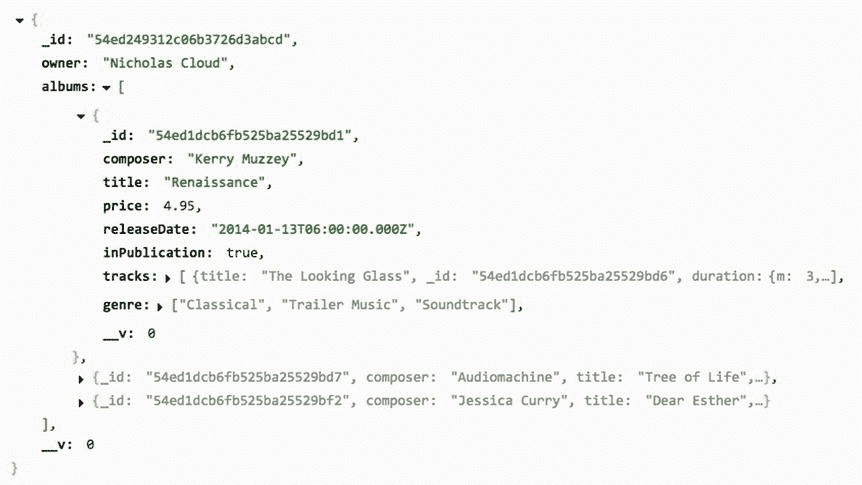

# 十一、Mongoose

如果[陌生感]没有表现出有趣的行为，人类的大脑会很快适应陌生感。—丹·西蒙斯

MongoDB 是一个流行的跨平台文档数据库，通常与其他非关系数据存储(如 CouchDB、Cassandra、RavenDB 等)归为“NoSQL”类。它是 Node.js 开发人员中数据存储的流行选择，因为它的“记录”存储为普通的 JSON 对象，它的查询接口和存储函数是用普通的 JavaScript 编写的。

在 MongoDB 中存储、访问和操作数据并不十分复杂，但是 Node.js 库(如 Mongoose)可以帮助应用程序开发人员将 MongoDB 文档映射到具有明确模式、验证和行为的应用程序对象上——所有这些概念(从设计上讲)都不是 MongoDB 的一部分。Mongoose 实现了 MongoDB 原生的查询接口，但也为开发人员提供了一个可组合的、流畅的接口，该接口简化了部分查询 API。

虽然 MongoDB 不是本章的直接主题，但是在深入研究 Mongoose 之前，有必要建立一些关于 MongoDB 如何工作的基本概念。如果您已经熟悉 MongoDB，可以跳过下一节。

## 基本 MongoDB 概念

关系数据库服务器托管数据库模式(有时简称为数据库)，它封装了相关的实体，如表、视图、存储过程、函数等。数据库表又包含元组(也称为行或记录)。元组由多个字段组成，每个字段包含预定数据类型的值。元组是一维的，它的定义(它的字段可以保存的数据类型)是在表级别确定的。因此，一个表中的所有元组共享相同的结构，尽管它们各自的字段值可能不同。元组字段的名称和数据类型被称为元组的模式。

MongoDB 有一个表面上相似的数据层次，如表 [11-1](#Tab1) 所示。

表 11-1。

Understanding MongoDB by Analogy to Relational Database Systems

<colgroup><col> <col></colgroup> 
| 关系型数据库管理系统 | MongoDB |
| --- | --- |
| 计算机网络服务器 | 计算机网络服务器 |
| 计划 | 数据库ˌ资料库 |
| 桌子 | 募捐 |
| 元组 | 文件 |
| 田 | 财产 |

表 [11-2](#Tab2) 定义了描述 Mongoose 组件的关键术语以及它们之间的关系。清单 [11-1](#FPar1) 中的代码展示了这些术语是如何出现在代码中的。本章将详细介绍每一个，但是因为其中许多是密切相关的，所以随着本章的进行，您可能希望回头参考这一部分。

表 11-2。

Mongoose Terms and Definitions

<colgroup><col> <col></colgroup> 
| 学期 | 定义 |
| --- | --- |
| 计划 | 为文档实例的属性定义数据类型、约束、默认值、验证等。在应用程序级别实施 |
| 模型 | 创建或获取文档实例的构造函数 |
| 文件 | 由 Mongoose 模型创建或获取的实例对象；将拥有 Mongoose 特有的属性和方法以及数据属性 |
| 对象 | 仅包含文档中数据属性的普通 JavaScript 对象 |

Listing 11-1\. Mongoose Terms and Definitions in Code

`// albumSchema is a schema`

`var albumSchema = mongoose.Schema({/*...*/});`

`// Album is a model`

`var Album = mongoose.model('Album', albumSchema);`

`// Album is a model`

`Album.findById(/*...*/, function (err, album) {`

`// album is a document`

`console.log(album);`

`});`

`// Album is a model`

`Album.findById(/*...*/)`

`.lean(true)`

`.exec(function (err, album) {`

`// album is a JSON object (because of `lean(true)`)`

`console.log(album);`

`});`

`// Album is a model`

`Album.findById(/*...*/)`

`.exec(function (err, album) {`

`// album is a document`

`// toObject() returns a JSON object`

`console.log(album.toObject());`

`});`

与 RDBMS 元组不同，MongoDB 文档不是一维的。它们是完整的 JSON 对象，可能包含其他对象或数组。事实上，同一集合中的文档甚至不需要具有相同的属性，因为 MongoDB 集合实际上是无模式的。MongoDB 集合可以保存任何形状或大小的文档对象(在 MongoDB 的存储限制内)。然而在实践中，集合倾向于保存相似“形状”的文档，尽管有些可能有可选属性，或者可能包含表示一些任意数据的属性。但是一般来说，应用程序通常假设数据存在于特定的“形状”中，所以尽管 MongoDB 不强制文档模式，但是应用程序经常这样做。

默认情况下，MongoDB 文档被自动分配一个名为`_id`的代理主键。这个键有一个特殊的类型(MongoDB 的`ObjectId`类型)，被用作 MongoDB 的主集合索引。如果需要，MongoDB 可以使用不同的字段作为主键。附加字段可以作为简单键或复合键添加到集合中的辅助索引中。

MongoDB 不支持外键的概念，这是 RDBMS 数据库的一个强大特性。相反，MongoDB 依靠嵌套文档的能力来存储数据关联。考虑所有 RDBMS 示例的经典三位一体:客户、邮政地址和购物车订单。在 RDBMS 系统中，可能会有从邮政地址到客户的外键(用于标识居住地)，以及从订单到一个或多个邮政地址的外键(用于标识送货和帐单地址)。然而，在 MongoDB 客户文档中，将邮政地址作为嵌套对象存储在客户文档和订单文档中就足够了。考虑列出 [11-2](#FPar2) 。

Listing 11-2\. Duplication Sometimes Acceptable in MongoDB

`// customer`

`{`

`"_id": 1001,`

`"name": "...",`

`"postalAddress" {`

`"street": "...",`

`"city": "...",`

`"state": "...",`

`"zip": "..."`

`}`

`}`

`// order`

`{`

`"_id": 2001,`

`"customer": 1001,`

`"items": [`

`{"sku": 3001, "qty": 2}`

`],`

`"shippingAddress" {`

`"street": "...",`

`"city": "...",`

`"state": "...",`

`"zip": "..."`

`}`

`}`

从商业角度来看，这种对参照完整性的“违反”是可以接受的，原因有很多:

*   也许命令永远不会改变。如果订单中有错误—例如，送货地址错误—整个订单将被重新创建以抵消错误订单。新订单中会添加正确的送货地址。
*   如果客户更改了邮政地址，旧订单不会更新为新地址，因此不存在数据完整性问题。
*   也许更改邮政地址总是发生在客户领域，而不是订单领域。
*   也许客户可以用一个不应该添加到客户记录中的“临时”地址(运送礼品)来覆盖送货地址。
*   如果来自订单的邮政指标不同于来自客户的邮政指标(例如，一位 C 级主管想知道上个月有多少订单被运送到密苏里州，而不管这个月谁实际上住在密苏里州)，则该数据已经被隔离。
*   也许磁盘空间很便宜，不实施参照完整性所获得的速度超过了任何潜在的成本。

虽然外键和参照完整性对 RDBMS 数据库至关重要，但强大的 MongoDB 文档设计往往会使这个问题变得没有实际意义。

最后，尽管 MongoDB 的查询 API 对于 SQL 从业者来说可能看起来有点令人畏惧，但很快就会发现，在大多数情况下，查找数据涉及相同的概念:选择(`find`)、过滤(`where`)、应用复合条件(`and`、`or`、`in`)、聚合(`group`)、分页(`skip`、`limit`)等等。查询的组成和执行方式主要在语法上有所不同。

## 一个简单的Mongoose例子

Mongoose 是 Node.js 应用程序的库。要使用 Mongoose 进行开发(并遵循本章中的示例)，您需要在您选择的平台上安装 Node.js 和 MongoDB。两者的默认安装过程和配置应该足以运行本章的示例代码。

Note

本章假设您熟悉 Node.js 应用程序和模块，并且知道如何用`npm`安装它们。MongoDB 的工作知识会很有帮助，但这不是必需的，因为在示例章节中，与 MongoDB 的交互主要是通过 Mongoose 进行的。一些例子将演示如何直接查询 MongoDB 来验证 Mongoose 操作的结果。

本节演示了 Mongoose 的基本概念，这些概念将在本章的后面部分详细讨论。这个例子包括三个步骤:

Create a basic Mongoose schema that reflects the structured data in a JSON file.   Read the JSON file and import the data into MongoDB with a Mongoose model.   Run a basic web server that will use a Mongoose model to fetch data from MongoDB and deliver it to a web browser.  

下面每个清单的第一行将显示示例代码所在的文件路径。后续示例将说明是否应该在终端中使用 Node.js 执行特定的示例文件。

### 为 JSON 数据创建一个 Mongoose 模式

Mongoose 文档表示应用程序中的领域数据。对于本章的示例应用程序，音乐专辑的 JSON 文件定义了要添加到 MongoDB 的初始数据集。清单 [11-3](#FPar4) 显示了`example-001/albums.json`的结构:一个相册对象的数组，每个包含关于作曲家、标题、出版年份、曲目列表等等的信息。

Listing 11-3\. Album JSON Data File

`// example-001/albums.json`

`[`

`{`

`"composer": "Kerry Muzzey",`

`"title": "Renaissance",`

`"price": 4.95,`

`"releaseDate": "2014-01-13T06:00:00.000Z",`

`"inPublication": true,`

`"genre": ["Classical", "Trailer Music", "Soundtrack"],`

`"tracks": [`

`{`

`"title": "The Looking Glass",`

`"duration": {`

`"m": 3,`

`"s": 20`

`}`

`}`

`//additional tracks...`

`]`

`}`

`//additional albums...`

`]`

mongose 是一个对象数据映射器(ODM ),所以 mongose 数据访问的核心是模型函数，可以用来查询它们所代表的 MongoDB 集合。Mongoose 模型必须有一个可以引用它的名称，以及一个强制它将访问和操作的数据形状的模式。清单 [11-4](#FPar6) 中的代码创建了一个与`example-001/albums.json`中的 JSON 数据紧密匹配的相册模式。稍后将详细介绍模式，但是很明显模式定义了给定 Mongoose 模型的属性及其数据类型。最后，通过将名称(“相册”)与模式配对来创建模型函数。这个模型函数被分配给`example-001/album-model.js`文件中的`module.exports`，这样它就可以根据需要导入 Node.js 应用程序中的其他模块。

Tip

Mongoose 模式定义了模型的数据结构。模型功能提供了处理存储的文档数据的查询界面。模型必须有名称和模式。

Listing 11-4\. Mongoose Album Schema and Model

`// example-001/album-model.js`

`'use strict';`

`var mongoose = require('mongoose');`

`var albumSchema = mongoose.Schema({`

`composer: String,`

`title: String,`

`price: Number,`

`releaseDate: Date,`

`inPublication: Boolean,`

`genre: [String],`

`tracks: [`

`{`

`title: String,`

`duration: {`

`m: Number,`

`s: Number`

`}`

`}`

`]`

`});`

`var Album = mongoose.model('Album', albumSchema);`

`module.exports = Album;`

### 使用 Mongoose 导入数据

既然已经定义了`Album`模式和模型，Node.js 脚本就可以从`albums.json`读取数据，并使用`Album`模型在 MongoDB 中创建文档。导入脚本需要做三件事:

Connect to a running MongoDB server with Mongoose   Read and parse the contents of the `albums.json` file.   Use the `Album` model to create documents in MongoDB.  

mongose 通过一个 URI 连接到 MongoDB，它标识了 mongose 将使用的协议、服务器和数据库。在清单 [11-5](#FPar7) 中，URI 简单地指向本地 MongoDB 实例:`mongodb://localhost/music`。如果在 MongoDB 实例上还没有数据库，Mongoose 将主动创建数据库，因此不需要手动创建。如果 MongoDB 连接失败，mongose 将引发一个`error`事件，如果成功，mongose 将引发一个`open`事件。清单 [11-5](#FPar7) 展示了如何用回调函数处理这两个事件。一旦发出`open`事件，就会读取并解析`albums.json`文件，并将相册数组传递给`Album`模型的`Album.create()`方法。这将在 MongoDB 中创建相册文档，稍后可以使用`Album`模型对其进行查询。

Listing 11-5\. Importing Album Data with Mongoose

`// example-001/import-albums.js`

`'use strict';`

`var mongoose = require('mongoose');`

`var Album = require('./album-model');`

`var file2json = require('./file2json');`

`var fs = require('fs');`

`var path = require('path');`

`// connect to the "music" database on localhost;`

`// the database will be automatically created`

`// if it does not exist`

`mongoose.connect('mongodb://localhost/music');`

`var db = mongoose.connection;`

`db.on('error', function (err) {`

`console.error(err);`

`process.exit(1);`

`});`

`db.once('open', function importAlbums() {`

`var albumsFile = path.join(__dirname, 'albums.json');`

`file2json(albumsFile, 'utf8', function (err, albums) {`

`if (err) {`

`console.error(err);`

`return process.exit(1);`

`}`

`console.log('creating %d albums', albums.length);`

`// use the model to create albums in bulk;`

`// the collection will be automatically created`

`// if it does not exist`

`Album.create(albums, function (err) {`

`if (err) {`

`console.error(err);`

`return process.exit(1);`

`}`

`process.exit(0);`

`});`

`});`

`});`

在运行脚本之前，MongoDB 需要在本地运行。一些 MongoDB 安装会将 MongoDB 配置为自动启动，但其他安装会将决定权留给用户。要确定 MongoDB 是否正在运行，只需在终端中执行`mongo`命令。如果 MongoDB 正在运行，您应该会看到类似于清单 [11-6](#FPar8) 的输出。你可以在任何时候按 Ctrl+c 来终止这个进程。

Listing 11-6\. MongoDB Terminal Client, `mongo`

`$ mongo`

`MongoDB shell version: 2.6.7`

`connecting to: test`

`>`

如果您收到一个错误，通过执行`mongod -f`,后跟默认 MongoDB 配置文件的位置，手动启动 MongoDB 服务器。该文件的位置因系统而异，因此您可能需要查阅 MongoDB 安装文档。例如，在安装了家酿 MongoDB 的 OS X 系统上，可以在`/usr/local/etc/mongod.conf`找到配置文件。清单 [11-7](#FPar9) 展示了如何使用这个配置文件路径手动启动守护进程。

Listing 11-7\. Starting `mongod` Manually.

`$ mongod -f /usr/local/etc/mongod.conf`

一旦启动了`mongod`服务器，您就可以使用 Node.js 运行`example-001/import-albums.js`脚本。

Listing 11-8\. Running the Import Script

`example-001$ node import-albums.js`

`creating 3 albums`

在清单 [11-9](#FPar11) 中，启动了`mongo`终端客户端，随后是一系列命令(在每个`>`提示符后),以验证已经创建了`music`数据库和`albums`集合。`show dbs`命令显示正在运行的 MongoDB 实例托管的所有数据库。要查看数据库中的集合，首先通过发出`use <db>`命令切换到该数据库上下文，其中`<db>`是目标数据库的名称。接下来，执行`show collections`来查看数据库拥有的集合列表——在本例中是`albums`和`system.indexes`(MongoDB 管理的集合)。

Listing 11-9\. Verifying Album Data Has Been Added to MongoDB

`$ mongo`

`MongoDB shell version: 2.6.7`

`connecting to: test`

`> show dbs`

`admin     (empty)`

`local     0.078GB`

`music     0.078GB`

`> use music`

`switched to db music`

`> show collections`

`albums`

`system.indexes`

`>`

选择了`music`数据库后，您可以发出一些基本的查询来查看导入过程中添加的专辑数据。在数据库上下文中，通过`db`对象访问数据库集合。集合作为`db`对象的属性存在，对集合执行的操作分别是每个集合对象上的方法。例如，要查看`albums`集合中的记录数量，可以对集合调用`db.albums.count()`方法，如清单 [11-10](#FPar12) 所示。同样，为了查询相册记录，可以使用`db.albums.find()`方法和 criteria(“where”子句)和 projection(“select”子句)参数来控制返回什么数据。

Listing 11-10\. Querying Album Data in the `albums` Collection

`> db.albums.count()`

`3`

`> db.albums.find({}, {composer: 1})`

`{ "_id" : ObjectId("54c537ca46a13e0f4cebda82"), "composer" : "Kerry Muzzey" }`

`{ "_id" : ObjectId("54c537ca46a13e0f4cebda88"), "composer" : "Audiomachine" }`

`{ "_id" : ObjectId("54c537ca46a13e0f4cebdaa3"), "composer" : "Jessica Curry" }`

因为在清单 [11-10](#FPar12) 中，criteria 参数(传递给`db.albums.find()`的第一个对象)为空，所以返回所有记录。然而，projection 对象指定了查询返回的单个属性:`composer`。除了默认情况下返回的`_id`，所有其他属性都被排除，除非投影参数另有规定，否则将始终包括在内。

### 用 Mongoose 查询数据

一旦相册数据被加载到 MongoDB 中，您就可以使用清单 [11-4](#FPar6) 中的相同模型来查询该数据。

清单 [11-11](#FPar13) 中的代码使用 Node.js `http`模块创建一个基本的 web 服务器，它可以接收 HTTP 请求并返回 JSON 数据作为响应。在这个例子中，web 服务器对任何 URL 查询都返回相同的响应(为了简单起见)。当接收到请求时，使用`Album`mongose 模型来查询 MongoDB 中的相册文档。它的`find()`函数由一个标准参数、一个投影参数和一个回调函数调用。除了回调之外，这个语法与清单 [11-10](#FPar12) 中用于检查相册文档的`db.albums.find()`方法相同。

Listing 11-11\. Querying MongoDB with Mongoose

`// example-001/http-server.js`

`'use strict';`

`var mongoose = require('mongoose');`

`var Album = require('./album-model');`

`var http = require('http');`

`var url = require('url');`

`/*`

`* The http server will handle requests and responses`

`*/`

`var server = http.createServer(function (req, res) {`

`Album.find({}, {composer: 1}, function (err, albums) {`

`var statusCode = err ? 500 : 200;`

`var payload = err ? err : albums;`

`res.writeHead(statusCode, {'Content-Type': 'application/json'});`

`res.write(JSON.stringify(payload, null, '  '));`

`res.end();`

`});`

`});`

`/*`

`* Connect to the MongoDB instance and report`

`* errors if any occur.`

`*/`

`mongoose.connect('mongodb://localhost/music');`

`var db = mongoose.connection;`

`db.on('error', function (err) {`

`console.error(err);`

`process.exit(1);`

`});`

`db.once('open', function () {`

`/*`

`* The MongoDB connection is open, start`

`* listening for HTTP requests.`

`*/`

`server.listen(8080);`

`console.log('listening on port 8080');`

`});`

在清单 [11-12](#FPar14) 中，使用命令`node http-server.js`从`example-001`目录启动 web 服务器。按 Ctrl+c 将停止服务器。

Listing 11-12\. Running the HTTP Server

`example-001$ node http-server.js`

`listening on port 8080`

从 MongoDB 获取的相册数据现在可以通过导航到`http://localhost:8080`或者通过发出清单 [11-13](#FPar15) 中所示的`curl`终端命令在网络浏览器中查看。

Listing 11-13\. Sending a `curl` Request to the HTTP Server

`$ curl -v` `http://localhost:8080/`

`* Hostname was NOT found in DNS cache`

`*   Trying 127.0.0.1...`

`* Connected to localhost (127.0.0.1) port 8080 (#0)`

`> GET / HTTP/1.1`

`> User-Agent: curl/7.37.1`

`> Host: localhost:8080`

`> Accept: */*`

`>`

`< HTTP/1.1 200 OK`

`< Content-Type: application/json`

`< Date: Thu, 29 Jan 2015 01:20:09 GMT`

`< Connection: keep-alive`

`< Transfer-Encoding: chunked`

`<`

`[`

`{`

`"_id": "54c7020c342ee81670b261ef",`

`"composer": "Kerry Muzzey"`

`},`

`{`

`"_id": "54c7020c342ee81670b261f5",`

`"composer": "Audiomachine"`

`},`

`{`

`"_id": "54c7020c342ee81670b26210",`

`"composer": "Jessica Curry"`

`}`

本章的其余部分将基于存储在 Mongoose 数据库中的这个 Mongoose 模式、模型和相册数据。

## 使用模式

Mongoose 模式是描述 MongoDB 文档的结构和数据类型的简单对象。虽然 MongoDB 本身是无模式的，但是 Mongoose 在应用程序级别强制文档使用模式。模式是通过调用 Mongoose 模块的`Schema()`函数来定义的，传递给它一个对象散列，其中键表示文档属性，值表示每个属性的数据类型。返回值是一个类型为`Schema`的对象，带有额外的助手属性和函数，用于扩展或增加模式的定义。

### 数据类型

对于标量属性，Mongoose 使用本地 JavaScript 数据类型`String`、`Boolean`、`Number`和`Date`，如清单 [11-14](#FPar16) 所示。

Listing 11-14\. Primitive Types in a Mongoose Schema

`// example-001/album-model.js`

`var albumSchema = mongoose.Schema({`

`composer: String,`

`title: String,`

`price: Number,`

`releaseDate: Date,`

`inPublication: Boolean`

`// other properties...`

`});`

作为对象文字或数组的属性使用每种类型的文字符号(`{}`和`[]`)。嵌套的对象文字是内联编写的，对它们自己的属性使用相同的 Mongoose 模式类型。数组类型只包含一个元素，它定义了将占用数组的对象的类型。这种类型可以是任何有效的 Mongoose 数据类型，包括内联定义为数组第一个元素的对象文字。在清单 [11-15](#FPar17) 中，`genre`被声明为一个字符串数组，而`tracks`被声明为一个对象文字数组。

Listing 11-15\. Complex Types in a Mongoose Schema

`// example-001/album-model.js`

`var albumSchema = mongoose.Schema({`

`// ...other properties`

`genre: [String],`

`tracks: [`

`{`

`title: String,`

`duration: {`

`m: Number,`

`s: Number`

`}`

`}`

`]`

`});`

Mongoose 本身提供了两种特殊的对象类型:`ObjectId`和`Mixed`。

当在 MongoDB 中创建一个文档时，它会被分配一个`_id`属性，作为记录的惟一标识符。这个属性使用 MongoDB 自己的`ObjectId`数据类型。Mongoose通过`mongoose.Schema.Types.ObjectId`暴露这种类型。这种类型很少直接使用。例如，当通过 ID 查询文档时，通常使用标识符的字符串表示。

Note

当模式属性包含任意数据时(记住，MongoDB 是无模式的)，可以用类型`mongoose.Schema.Types.Mixed`来声明它。如果一个属性被标记为`Mixed`，Mongoose 将不会跟踪对它所做的更改。当 mongose 持久化一个文档时，它会在内部创建一个查询，该查询只添加或更新已经更改的属性，由于没有跟踪一个`Mixed`属性，应用程序必须在属性发生更改时通知 mongose。由 mongose 模型创建的文档公开了一个`markModified(path)`方法，该方法将迫使 mongose 认为由`path`参数标识的属性是脏的。

将 mongose 模式属性设置为空对象文字(没有属性的文字)将导致 mongose 将其视为`Mixed`。

最后，因为 Mongoose 是一个 Node.js 库，所以它利用 Node 的`Buffer`类型来存储大块的二进制数据，比如图像、音频或视频素材。因为二进制数据可能非常大，所以许多应用程序将二进制素材的 URL 引用存储在内容交付网络上，如亚马逊的简单存储服务(S3)，而不是将二进制数据存储在数据存储中，如 MongoDB。然而，不同的应用程序有不同的用例，Mongoose 模式足够灵活，可以支持任何一种方法。

### 嵌套模式

Mongoose 模式可能是嵌套的；也就是说，一个模式可以引用另一个模式作为属性类型。如果较大的模式共享通用的自定义数据类型，例如客户和订单模式共享邮政地址数据类型，这可能特别有用。在清单 [11-16](#FPar19) 中，专辑曲目模式被声明为独立于专辑模式，并被指定为`albumSchema.tracks`属性的数据类型。

Listing 11-16\. Nested Mongoose Schemas

`// breaking apart schemas...`

`var trackSchema = mongoose.Schema({`

`title: String,`

`duration: {`

`m: Number,`

`s: Number`

`}`

`});`

`var albumSchema = mongoose.Schema({`

`// ...`

`tracks: [trackSchema]`

`});`

### 默认属性值

向模式属性中添加合理的默认值可以指示 Mongoose 在创建文档时填充缺失的数据。这对于不是可选的但通常保存一些已知值的文档属性很有用。

在清单 [11-17](#FPar20) 中，专辑模式的`m`和`s`属性(分和秒)缺省为零，因为一首曲目完全可能不到一分钟长，或者正好是 X 分零秒。相册模式中的`releaseDate`属性也有一个默认值:函数`Date.now`。当默认值是一个函数时，Mongoose 将调用该函数，将其返回值转换为属性的`type`，然后将该值赋给属性。

Listing 11-17\. Default Property Values

`// adding default property values...`

`var trackSchema = mongoose.Schema({`

`// ...`

`duration: {`

`m: {type: Number, default: 0},`

`s: {type: Number, default: 0}`

`}`

`});`

`var albumSchema = mongoose.Schema({`

`// ...`

`price: {type: Number, default: 0.0},`

`releaseDate: {type: Date, default: Date.now},`

`// ...`

`});`

向属性添加默认值要求类型赋值看起来有点不同。注意`m: Number`已经变成了`m: {type: Number, default: 0}`。通常，给属性分配一个对象散列会导致属性具有一个`Mixed`或对象类型，但是对象文字中出现的`type`属性会缩短处理过程，并告诉 Mongoose 散列中的其他键/值对是属性设置。

### 必需的属性

`required`属性可用于非可选属性的类型定义。保存文档时，文档模式所需的任何缺少的属性都将引发验证错误，该错误将被传递给保存操作的回调。在清单 [11-18](#FPar21) 中，专辑作曲者、专辑标题、音轨标题、甚至音轨时长对象都是必需的。

Listing 11-18\. Required Properties

`// adding required attributes`

`var trackSchema = mongoose.Schema({`

`title: {type: String, required: true},`

`duration: {`

`required: true,`

`type: {`

`m: {type: Number, default: 0},`

`s: {type: Number, default: 0}`

`}`

`}`

`});`

`var albumSchema = mongoose.Schema({`

`composer: {type: String, required: true},`

`title: {type: String, required: true},`

`// ...`

`});`

如果使用一个字符串来代替一个必需属性的布尔值，那么当出现验证错误时，该字符串将被用作错误消息，如清单 [11-19](#FPar22) 所示。(文档验证将很快介绍。)

Listing 11-19\. Custom Error Message for a Required Property

`var trackSchema = mongoose.Schema({`

`title: {type: String, required: 'Missing track title!'},`

`// ...`

`});`

### 次要索引

Mongoose 文档在保存到 MongoDB 时会自动获得一个索引属性`_id`。但是，可以将辅助索引添加到模式中，以提高查询其他字段时的性能。

MongoDB 支持简单(单字段)和复合(多字段)索引。在清单 [11-20](#FPar23) 中，以下索引被添加到曲目和专辑模式中:

*   音轨标题(简单)
*   专辑作者(简单)
*   相册标题(简单)
*   专辑名称+专辑作者(复合)
*   类型专辑(简单)

Listing 11-20\. Adding Secondary Indexes to Schemas

`// adding secondary indexes...`

`var trackSchema = mongoose.Schema({`

`title: {type: String, required: true, index: true},`

`// ...`

`});`

`var albumSchema = mongoose.Schema({`

`composer: {type: String, required: true, index: true},`

`title: {type: String, required: true, index: true},`

`// ...`

`genre: {type: [String], index: true},`

`// ...`

`});`

`albumSchema.index({composer: 1, title: 1});`

通过将一个`index`字段附加到属性类型声明并将其设置为`true`，可以在属性级别添加简单索引。另一方面，必须使用`Schema.index()`方法为模式整体定义复合索引。传递给`index()`的对象包含对应于要索引的模式属性的属性名，以及一个可能是`1`或`-1`的数值。

MongoDB 按升序或降序对索引进行排序。复合索引是用一个数值而不是一个布尔值(像简单索引一样)来定义的，以指示每个字段应该被索引的顺序。对于简单的索引，顺序并不重要，因为 MongoDB 可以用两种方式进行搜索。但是对于复合索引，顺序非常重要，因为它限制了当查询使用复合索引时 MongoDB 可以执行的排序操作的种类。MongoDB 文档深入介绍了复合索引策略。

在清单 [11-20](#FPar23) 中，除了作曲家和标题这两个字段的简单索引之外，还为这两个字段添加了一个复合索引。用户很可能会根据作曲家、标题或两者来搜索专辑。

### 模式验证

当文档被持久化时，Mongoose 将执行模式验证规则。验证规则是为特定模式属性定义的函数，它评估属性值并返回布尔值以指示有效性。清单 [11-21](#FPar24) 演示了如何将属性验证器附加到模式对象上。

Listing 11-21\. Validating Schema Properties

`// adding schema validation...`

`var trackSchema = mongoose.Schema({/*...*/});`

`var albumSchema = mongoose.Schema({`

`// ...`

`tracks: [trackSchema]`

`});`

`albumSchema.path('tracks').validate(function (tracks) {`

`return tracks.length > 0;`

`}, 'Album has no tracks.');`

模式的`path()`方法返回一个`SchemaType`的实例，该对象封装了模式属性的定义——在本例中是`tracks`属性，它是相册的 track 对象数组。`SchemaType.validate()`方法将验证函数附加到模式的属性上。第一个参数是实际的验证函数，它接收要验证的值作为唯一的参数。`validate()`的第二个参数是验证错误发生时使用的消息。

当保存一个相册文档时，这个函数将作为 Mongoose 验证过程的一部分执行，评估`tracks`属性以确保相册至少有一个音轨。

验证规则也可以作为属性定义的一部分附加到模式属性。清单 [11-22](#FPar25) 中的`tracks`定义包含了`validate`属性。此属性的值是一个两元素数组(元组)，其中验证函数是元素 0，错误消息是元素 1。

Listing 11-22\. Declaring Property Validators Inline

`function validateTrackLength (tracks) {`

`return tracks.length > 0;`

`}`

`var albumSchema = mongoose.Schema({`

`// ...`

`tracks: {`

`type: [trackSchema],`

`validate: [validateTrackLength, 'Album has no tracks.']`

`}`

`});`

虽然 Mongoose 验证过程本身是异步的，但简单的验证函数，如清单 [11-22](#FPar25) 中的那些，是同步的。对于大多数情况，同步验证是完全可以接受的，但是对于其他情况，可能需要异步验证器。异步验证函数接受第二个参数——一个名为`respond`(按照惯例)的回调——当异步验证完成时，这个回调将被调用。一个`true`或`false`值被传递到`respond`以分别指示成功或失败的验证。清单 [11-23](#FPar26) 展示了如何让专辑曲目的验证函数异步。

Listing 11-23\. Asynchronous Property Validators

`albumSchema.path('tracks').validate(function (tracks, respond) {`

`process.nextTick(function () {`

`respond(tracks.length > 0);`

`});`

`}, 'Album has no tracks.');`

为了查看工作中的验证功能，可以删除`example-002/albums.json`中每个专辑的曲目，这样 JSON 数据就类似于清单 [11-24](#FPar27) 。

Listing 11-24\. Albums Without Tracks

`// example-002/albums.json`

`[`

`{`

`"composer": "Kerry Muzzey",`

`"title": "Renaissance",`

`"price": 4.95,`

`"releaseDate": "2014-01-13T06:00:00.000Z",`

`"inPublication": true,`

`"genre": ["Classical", "Trailer Music", "Soundtrack"],`

`"tracks": []`

`},`

`{`

`"composer": "Audiomachine",`

`"title": "Tree of Life",`

`"price": 9.49,`

`"releaseDate": "2013-07-16T05:00:00.000Z",`

`"inPublication": true,`

`"genre": ["Classical", "Trailer Music"],`

`"tracks": []`

`},`

`{`

`"composer": "Jessica Curry",`

`"title": "Dear Esther",`

`"price": 6.99,`

`"releaseDate": "2012-02-14T06:00:00.000Z",`

`"inPublication": true,`

`"genre": ["Classical", "Video Game Soundtrack"],`

`"tracks": []`

`}`

`]`

只要文档被持久化，就会发生验证；也就是说，每当调用`Model.create()`或者在文档实例上调用`save()`方法时。如果验证失败，错误将作为第一个参数传递给每个方法的回调。(后面会详细讨论文档。)

如果再次运行导入过程，当调用`Album.create()`从不完整的 JSON 数据创建新的 Mongoose 文档时，验证器将在`example-002/import-albums.js`中触发。清单 [11-25](#FPar28) 中的控制台输出显示了引发的序列化`ValidationError`，以及出现在其`errors`集合中的`tracks`属性的`ValidatorError`。

Listing 11-25\. Console Output when Schema Validation Fails

`example-002$ node import-albums.js`

`creating 3 albums`

`{ [``ValidationError`T2】

`message: 'Validation failed',`

`name: 'ValidationError',`

`errors:`

`{ tracks:`

`{ [``ValidatorError`T2】

`message: 'Album has no tracks.',`

`name: 'ValidatorError',`

`path: 'tracks',`

`type: 'user defined',`

`value: [] } } }`

在拆分专辑和曲目模式并添加默认属性值、必需属性、二级索引和验证之后，专辑模式与`example-001`中的简单模式相比发生了很大变化。清单 [11-26](#FPar29) 显示了更健壮的版本。

Listing 11-26\. More Robust Album Schema

`// example-002/album.js`

`'use strict';`

`var mongoose = require('mongoose');`

`var trackSchema = mongoose.Schema({`

`title: {type: String, required: true, index: true},`

`duration: {`

`required: true,`

`type: {`

`m: {type: Number, default: 0},`

`s: {type: Number, default: 0}`

`}`

`}`

`});`

`var albumSchema = mongoose.Schema({`

`composer: {type: String, required: true, index: true},`

`title: {type: String, required: true, index: true},`

`price: {type: Number, default: 0.0},`

`releaseDate: {type: Date, default: Date.now},`

`inPublication: Boolean,`

`genre: {type: [String], index: true},`

`tracks: [trackSchema]`

`});`

`albumSchema.index({composer: 1, title: 1});`

`albumSchema.path('tracks').validate(function (tracks) {`

`return tracks.length > 0;`

`}, 'Album has no tracks.');`

`var Album = mongoose.model('Album', albumSchema);`

`module.exports = Album;`

### 模式引用

虽然 MongoDB 是一个无关系的数据存储，但是集合中文档之间的关系可以通过充当外键的非正式引用来创建。当然，对象外键的完整性强制和解析完全由应用程序来完成。Mongoose 通过群体引用构建这些非正式的关系——模式之间的链接，支持文档图的自动急切加载(和手动延迟加载)。以音乐应用程序为例，用户很可能会创建自己的个人专辑库。因为相册文档可能很大，所以最好避免在每个库文档中复制相册数据。取而代之的是，将从库文档创建对单个相册的引用，这是一种多对多的关系。当 Mongoose 加载库时，可以解析这些引用，以便返回填充了相册文档的完整库对象图。

为了简单起见，在`example-003/library.json`中定义了一个库。如清单 [11-27](#FPar30) 所示，这个库通过作曲家和标题引用专辑。当数据被导入时，每个相册都需要被解引用到相应的 MongoDB 相册文档中的一个文档 ID。

Listing 11-27\. Library JSON Data

`// example-003/library.json`

`{`

`"owner": "Nicholas Cloud",`

`"albums": [`

`{`

`"composer": "Kerry Muzzey",`

`"title": "Renaissance"`

`},`

`{`

`"composer": "Audiomachine",`

`"title": "Tree of Life"`

`},`

`{`

`"composer": "Jessica Curry",`

`"title": "Dear Esther"`

`}`

`]`

`}`

库导入脚本类似于专辑导入脚本，如清单 [11-28](#FPar31) 所示，但是它执行一个额外的重要步骤。在读取`library.json`文件并将其转换为普通的 JavaScript 对象后，相册数据被解析为在`example-001/import-albums.js`中导入的实际相册文档对象。

Listing 11-28\. Importing Library Data into MongoDB

`// example-003/import-library.js`

`'use strict';`

`var mongoose = require('mongoose');`

`var Album = require('./album-model');`

`var Library = require('./library-model');`

`var file2json = require('./file2json');`

`var fs = require('fs');`

`var path = require('path');`

`function handleError(err) {`

`console.error(err);`

`process.exit(1);`

`}`

`function resolveAlbums(libraryJSON, cb) {`

`/*`

`* [3] use a compound $or criteria to look up multiple`

`* album documents`

`*/`

`var albumCriteria = {`

`$or: libraryJSON.albums`

`};`

`Album.find(albumCriteria, cb);`

`}`

`mongoose.connect('mongodb://localhost/music');`

`var db = mongoose.connection;`

`db.on('error', handleError);`

`db.once('open', function importLibrary () {`

`/*`

`* [1] read the library.json file data and convert it to`

`* a normal JS object`

`*/`

`var libraryFile = path.join(__dirname, 'library.json');`

`file2json(libraryFile, 'utf8', function (err, libraryJSON) {`

`if (err) return handleError(err);`

`/*`

`* [2] look up album documents that match each composer/title`

`* in the library JSON data`

`*/`

`resolveAlbums(libraryJSON, function (err, albumDocuments) {`

`if (err) return handleError(err);`

`console.log('creating library');`

`/*`

`* [4] assign the album documents to the library object`

`*/`

`libraryJSON.albums = albumDocuments;`

`/*`

`* [5] then create a library document from the JSON data and`

`* save the document`

`*/`

`var libraryDocument = new Library(libraryJSON);`

`libraryDocument.save(function (err) {`

`if (err) return handleError(err);`

`process.exit(0);`

`});`

`});`

`});`

`});`

清单 [11-28](#FPar31) 中注释了导入流程中的每一步，但是有几个步骤涉及到尚未引入的概念。

在步骤[3]中，创建了一个复合的`$or` criteria 对象，用于根据作曲者和标题过滤 MongoDB 相册文档。本章稍后将介绍`$or` criteria 属性，但现在只需理解 MongoDB 将检查`albums`集合中的所有文档，并确定文档是否匹配`$or`数组中的任何作曲/标题对，如清单 [11-29](#FPar32) 所示。由于之前导入的所有三张专辑都至少与该标准中的一对匹配，因此它们都将作为结果返回。

Listing 11-29\. Library Import `$or` Criteria

`{ $or:`

`[ { composer: 'Kerry Muzzey', title: 'Renaissance' },`

`{ composer: 'Audiomachine', title: 'Tree of Life' },`

`{ composer: 'Jessica Curry', title: 'Dear Esther' } ] }`

在步骤[4]中，找到的专辑文档被分配给`libraryJSON.albums`属性，替换现有的作曲者/标题数据数组。当库文档被保存时，Mongoose 将执行清单 [11-30](#FPar33) 中的库模式。与前面的属性描述不同，`albums`属性是一个引用属性，它将保存一个由`type`属性定义的`ObjectId`数组。`ref`属性告诉 Mongoose，这个字段也可以在查询期间(如果指定的话)或者在保存库文档时用相册文档填充。

Listing 11-30\. Library Schema

`// example-003/library-model.js`

`'use strict';`

`var mongoose = require('mongoose');`

`var librarySchema = mongoose.Schema({`

`owner: String,`

`albums: [{type: mongoose.Schema.Types.ObjectId, ref: 'Album'}]`

`});`

`var Library = mongoose.model('Library', librarySchema);`

`module.exports = Library;`

mongose 文档可能都被转换为它们的`ObjectId`s。mongose 足够聪明，可以自动执行这种转换，因此将相册文档添加到`albums`属性将通过模式检查。或者，导入脚本可以从每个相册文档中提取`_id`属性，并将其放入`albums`数组中。结果将是相同的。

最后，在步骤[5]中，通过调用`Library`构造函数并传入原始 JSON 数据以分配给每个文档属性，创建了一个单独的文档实例。也可以在没有构造函数参数的情况下创建文档，强制地将数据分配给实例上的每个属性，但是使用构造函数参数简写是很常见的。在文档被创建之后，它的`save()`方法被一个回调函数调用，如果持久化过程失败，这个回调函数会被传递一个错误。这不同于相册导入脚本，在相册导入脚本中，通过使用模型的静态`create()`函数在 MongoDB 中一次创建多个相册文档。清单 [11-31](#FPar34) 展示了不同之处。

Listing 11-31\. Creating a Single Document and Multiple Documents

`// create a single document`

`var libraryDocument = new Library(plainJSONLibrary);`

`libraryDocument.save(function (err) {...});`

`// create multiple documents at once`

`Albums.create(arrayOfJSONAlbums, function (err) {...});`

在清单 [11-32](#FPar35) 中，库导入脚本的运行方式与专辑导入脚本完全相同。

Listing 11-32\. Running the Library Import Script

`example-003$ node import-library.js`

`creating library`

导入完成后，可通过`mongo`终端客户端验证库数据。清单 [11-33](#FPar36) 中的输出显示，Mongoose 确实通过将每个相册对象转换为其标识符来满足库模式。(下一节，使用模型和文档，将研究如何使用模式引用属性来急切地加载被引用的文档。)

Listing 11-33\. Verifying the Library Import in MongoDB

`example-003$ mongo`

`MongoDB shell version: 2.6.7`

`connecting to: test`

`> use music`

`switched to db music`

`> db.libraries.find()`

`{ "_id" : ObjectId("54ed1dfdb11e8ae7252af342"), "owner" : "Nicholas Cloud", "albums" : [ ObjectId("54ed1dcb6fb525ba25529bd1"), ObjectId("54ed1dcb6fb525ba25529bd7"), ObjectId("54ed1dcb6fb525ba25529bf2") ], "__v" : 0 }`

### 模式中间件

每当特定的 MongoDB 文档被验证、保存或从文档集合中删除时，Mongoose 都会在 schema 对象上引发事件。在这些操作的每一个之前和之后都会引发事件。对这些事件的订阅分别用模式的`pre()`和`post()`方法来分配。订阅只是一个接收与每个事件相关的参数的函数或中间件。事件后中间件只是在事件完成后观察文档，但事件前中间件实际上可能会在事件完全处理之前中断文档的生命周期。

在清单 [11-34](#FPar37) 中，一个持续时间对象被添加到库模式中，与每个专辑音轨中的`duration`对象相同。然而，这个对象将保存整个库的计算总长度。一个事件前中间件功能被附加到存储`event`的库模式。在库被保存之前，这个函数将迭代每个专辑和每个音轨来计算所有音轨的长度，然后将计算出的值赋给`duration`对象的属性。中间件函数接收一个参数，回调函数`next()`。当持续时间总和完成时，调用`next()`来触发任何附加到模式的中间件功能。

Listing 11-34\. Pre-save Middleware

`// example-004/library-model.js`

`'use strict';`

`var mongoose = require('mongoose');`

`var librarySchema = mongoose.Schema({`

`owner: String,`

`albums: [{type: mongoose.Schema.Types.ObjectId, ref: 'Album'}],`

`duration: {`

`h: {type: Number, default: 0},`

`m: {type: Number, default: 0}`

`}`

`});`

`librarySchema.pre('save', function (next) {`

`var hours = 0, mins = 0;`

`/*`

`* iterate over all albums and add hours`

`* and minutes`

`*/`

`this.albums.forEach(function (album) {`

`album.tracks.forEach(function (track) {`

`hours += track.duration.h;`

`mins += track.duration.m;`

`});`

`});`

`/*`

`* divide total mins by 60 seconds and`

`* add that to hours, then assign remaining`

`* minutes back to mins`

`*/`

`hours += (mins / 60);`

`mins = (mins % 60);`

`this.duration = {h: hours, m: mins};`

`next();`

`});`

`var Library = mongoose.model('Library', librarySchema);`

`module.exports = Library;`

事件前中间件可以以同步或异步方式执行。清单 [11-34](#FPar37) 中的代码是同步的，这意味着其他中间件功能只有在持续时间总和完成后才会被调度。为了改变这种行为并立即一个接一个地调度它们，用一个附加的布尔参数调用模式的`pre()`方法，该参数将处理函数标记为异步中间件。

中间件函数本身也接收一个额外的参数，如清单 [11-35](#FPar38) 所示的`done()`函数回调。在同步中间件中，当前一个中间件功能已经完成并调用`next()`时，控制被传递给下一个中间件功能。异步中间件仍然是这种情况，但是在未来的事件循环中，当异步操作完成时，也必须调用`done()`函数。清单 [11-35](#FPar38) 中的执行顺序是

Schedule the duration summation process for the next event loop pass.   Invoke `next()` to pass control to the next piece of middleware.   At some future point in time, signal that this middleware operation is complete by invoking `done()`.   Listing 11-35\. Asynchronous Pre-save Middleware

`// example-005/library-model.js`

`// ...`

`librarySchema.pre('save', true, function (next, done) {`

`var hours = 0, mins = 0;`

`process.nextTick(function () {                // #1`

`/*`

`* iterate over all albums and add hours`

`* and minutes`

`*/`

`this.albums.forEach(function (album) {`

`album.tracks.forEach(function (track) {`

`hours += track.duration.h;`

`mins += track.duration.m;`

`});`

`});`

`/*`

`* divide total mins by 60 seconds and`

`* add that to hours, then assign remaining`

`* minutes back to mins`

`*/`

`hours += (mins / 60);`

`mins = (mins % 60);`

`this.duration = {h: hours, m: mins};`

`done();                                     // #3`

`});`

`next();                                       // #2`

`});`

`var Library = mongoose.model('Library', librarySchema);`

`module.exports = Library;`

如果在同步、事件前中间件函数中出现错误，它应该作为唯一的参数传递给`next()`。然而，在异步函数中产生的错误应该传递给`done()`。传递给这些回调的任何错误都将导致触发事件的操作失败，并将被传递给最终的操作回调(例如，传递给文档的`save()`方法的回调)。

事件后中间件函数不接收控制流参数，而是在事件操作完成后接收文档的副本。

## 使用模型和文档

Mongoose 模型是一个创建文档实例的构造函数。这些实例符合 Mongoose 模式，并公开了一组用于文档持久性的方法。模型与 MongoDB 集合相关联。事实上，当保存一个 Mongoose 文档时，如果它所对应的集合还不存在的话，它将被创建。按照惯例，模型以它们所代表的名词的单数形式命名(例如，`Album`)，但是集合以复数形式命名(例如，`albums`)。

通过用模型名和模型模式调用`mongoose.model()`来创建模型构造函数。使用这个构造函数创建的所有文档，无论是直接在用户代码中创建，还是在 Mongoose 执行查询并返回文档实例时间接创建，都将符合模型的模式。清单 [11-36](#FPar39) 显示了负责创建`Album`构造函数的代码，导入脚本使用该函数在 MongoDB 中创建相册文档。

Listing 11-36\. Album Model

`// example-006/album-model.js`

`//...schema definition...`

`var Album = mongoose.model('Album', albumSchema);`

`module.exports = Album;`

当用`mongoose.model()`函数注册了一个 mongose 模型时，mongose 就可以通过在关系属性中引用的名称来解析该模型。这种技术早先被用于创建库模式和`Album`模型之间的引用，如清单 [11-37](#FPar40) 所示。

Listing 11-37\. Library Schema References Album Model

`// example-006/library-model.js`

`// ...`

`var librarySchema = mongoose.Schema({`

`// ...`

`albums: [{type: mongoose.Schema.Types.ObjectId, ref: 'Album'}],`

`// ...`

`});`

可以使用模型构造函数创建新文档，或者使用模型查询方法从 MongoDB 数据存储中获取新文档。每个文档都可以在 MongoDB 集合中保存或删除自己。这非常类似于 RDBMS 库中常用的 ActiveRecord 数据访问模式。在清单 [11-38](#FPar41) 中，用`Album`构造函数创建了一个新的相册文档实例。相册数据被分配给由相册架构定义的每个属性(具有适当的数据类型)。最后，在文档上调用`save()`方法，当在 MongoDB 中创建了相关联的文档时，调用它的回调。

Listing 11-38\. Creating and Saving a New Document Instance

`// example-006/add-album-instance.js`

`'use strict';`

`var mongoose = require('mongoose');`

`var Album = require('./album-model');`

`function handleError(err) {`

`console.error(err);`

`process.exit(1);`

`}`

`mongoose.connect('mongodb://localhost/music');`

`var db = mongoose.connection;`

`db.on('error', handleError);`

`db.once('open', function addAlbumInstance() {`

`var album = new Album();`

`album.composer = 'nervous_testpilot';`

`album.title = 'Frozen Synapse';`

`album.price =  8.99;`

`album.releaseDate = new Date(2012, 8, 6);`

`album.inPublication = true;`

`album.genre = ['Dance', 'DJ/Electronica', 'Soundtrack'];`

`album.tracks = [`

`{`

`title: 'Welcome to Markov Geist',`

`duration: {m: 1, s: 14}`

`},`

`// ...additional tracks...`

`];`

`album.save(function (err) {`

`if (err) return handleError(err);`

`console.log('album saved', album);`

`process.exit(0);`

`});`

`});`

保存相册后，脚本输出显示文档数据:

`example-006$ node add-album-instance.js`

`album saved { __v: 0,`

`inPublication: true,`

`title: 'Frozen Synapse',`

`composer: 'nervous_testpilot',`

`_id: 54f117e4a27cc5375e156c6d... }`

可以查询 MongoDB 来验证该文档实际上是在`albums`集合中创建的，如清单 [11-39](#FPar42) 所示。

Listing 11-39\. Verifying the Mongoose Document Has Been Created in MongoDB

`example-006$ mongo`

`MongoDB shell version: 2.6.7`

`connecting to: test`

`> use music`

`switched to db music`

`> db.albums.find({composer: 'nervous_testpilot'}, {_id: 1, composer: 1, title: 1})`

`{ "_id" : ObjectId("54f117e4a27cc5375e156c6d"), "title" : "Frozen Synapse", "composer" : "nervous_testpilot" }`

也可以通过将对象散列直接传递给模型构造函数来设置文档实例属性。当文档数据已经存在于普通 JavaScript 对象中时，例如反序列化的 JSON web 请求体，或者从平面文件解析的 JSON 数据，这可能特别有用。清单 [11-40](#FPar43) 修改了前面的例子，从一个 JSON 文件加载新的相册数据，然后使用`Album`模型构造函数从新的 JSON 数据创建一个文档。由于 JSON 数据符合相册模式(或者，在`releaseDate`日期字符串的情况下，可以直接转换为属性类型`Date`)，相册实例将被持久化而不会出错。

Listing 11-40\. Alternative Way to Create a Document with Property Data

`// example-007/add-album-instance-alt.js`

`'use strict';`

`var mongoose = require('mongoose');`

`var Album = require('./album-model');`

`var file2json = require('./file2json');`

`var path = require('path');`

`function handleError(err) {`

`console.error(err);`

`process.exit(1);`

`}`

`mongoose.connect('mongodb://localhost/music');`

`var db = mongoose.connection;`

`db.on('error', handleError);`

`db.once('open', function addAlbumInstance() {`

`var albumFile = path.join(__dirname, 'album.json');`

`file2json(albumFile, 'utf8', function (err, albumJSON) {`

`var album = new Album(albumJSON);`

`album.save(function (err) {`

`if (err) return handleError(err);`

`console.log('album saved', album);`

`process.exit(0);`

`});`

`});`

`});`

### 文档实例方法

文档不仅仅是数据:它们还可能包括自定义行为。创建文档实例时，Mongoose 会创建一个原型链，其中包含模式对象的`methods`属性上定义的函数的副本。以这种方式定义的文档方法可以用关键字`this`访问特定的文档实例。

清单 [11-41](#FPar44) 显示了在专辑模式中定义的两个实例方法:一个根据前一首曲目的标题查找下一首专辑曲目，另一个根据共享的流派查找相似的专辑。`findSimilar()`方法使用的查询语法将在处理查询一节中介绍，但现在您只需知道它能有效地找到与实例专辑风格重叠且与实例专辑不共享同一`_id`的专辑(因此实例本身被排除在列表之外)。

Listing 11-41\. Defining Document Instance Methods in a Schema

`// example-008/album-model.js`

`// ...`

`var albumSchema = mongoose.Schema({/*...*/});`

`albumSchema.methods.nextTrack = function (previousTrackTitle) {`

`var i = 0, len = this.tracks.length;`

`for (i; i < len; i += 1) {`

`if (this.tracks[i].title !== previousTrackTitle) {`

`continue;`

`}`

`// return the next track, or, if this is the last track,`

`// return the first track`

`return this.tracks[i + 1] || this.tracks[0];`

`}`

`throw new Error('unable to find track ' + previousTrackTitle);`

`};`

`albumSchema.methods.findSimilar = function (cb) {`

`var criteria = {`

`_id: {$ne: this._id},`

`genre: {$in: this.genre}`

`};`

`this.model('Album').find(criteria)`

`.exec(cb);`

`};`

`var Album = mongoose.model('Album', albumSchema);`

`module.exports = Album;`

清单 [11-42](#FPar45) 中的脚本加载名为“文艺复兴”的专辑，然后调用`album.nextTrack()`来确定“失宠”之后的曲目然后它调用`album.findSimilar()`加载与文艺复兴相关的专辑，并将它们的标题和流派打印到终端。输出显示，每个专辑确实有重叠的流派，并且实例专辑本身不包括在结果中。

Listing 11-42\. Using Document Instance Methods

`// example-008/index01.js`

`'use strict';`

`var mongoose = require('mongoose');`

`var Album = require('./album-model');`

`function handleError(err) {`

`console.error(err);`

`process.exit(1);`

`}`

`mongoose.connect('mongodb://localhost/music');`

`var db = mongoose.connection;`

`db.on('error', handleError);`

`db.once('open', function () {`

`Album.findOne({title: 'Renaissance'})`

`.exec(function (err, album) {`

`if (err) return handleError(err);`

`var nextTrack = album.nextTrack('Fall from Grace');`

`console.log('next track:', nextTrack.title);`

`album.findSimilar(function (err, albums) {`

`if (err) return handleError(err);`

`console.log('this album:', album.title, album.genre);`

`albums.forEach(function (album) {`

`console.log('similar album:', album.title, album.genre);`

`});`

`process.exit(0);`

`});`

`});`

`});`

`example-008$ node index01.js`

`next track: Fall from Grace (Choir Version)`

`this album: Renaissance ["Classical","Trailer Music","Soundtrack"]`

`similar album: Tree of Life ["Classical","Trailer Music"]`

`similar album: Dear Esther ["Classical","Video Game Soundtrack"]`

`similar album: Frozen Synapse ["Dance","Electronica","Soundtrack"]`

### 文档虚拟

像实例方法一样，虚拟 getter 和 setter 属性可以通过模式添加到文档中。这些虚拟属性的行为类似于普通的数据属性，但是在保存文档时不会持久化。对于基于文档数据计算和返回值，或者解析包含或可以转换为其他文档属性值的数据，它们非常有用。

清单 [11-43](#FPar46) 中的相册模式中添加了一个虚拟的 getter 和 setter，它们定义了一个属性`composerInverse`，该属性将获得作曲家名字的反转版本(“姓氏，名字”)，并在给定反转形式的情况下正确设置作曲家的名字(“名字，姓氏”)。

Listing 11-43\. Virtual Document Properties

`// example-08/album-model.js`

`var albumSchema = mongoose.Schema({/*...*/});`

`// ...`

`albumSchema.virtual('composerInverse').get(function () {`

`var parts = this.composer.split(' '); //first last`

`if (parts.length === 1) {`

`return this.composer;`

`}`

`return [parts[1], parts[0]].join(', '); //last, first`

`});`

`albumSchema.virtual('composerInverse').set(function (inverse) {`

`var parts = inverse.split(', '); //last, first`

`if (parts.length === 1) {`

`this.composer = inverse;`

`}`

`this.composer = [parts[1], parts[0]].join(' '); //first last`

`});`

`// ...`

传递给`Schema.virtual()`方法的字符串参数定义了文档实例创建后属性所在的文档路径。通过指定从根文档开始的完整路径，文档虚拟也可以分配给子文档和嵌套对象。例如，如果`composer`属性的值是一个具有`firstName`和`lastName`属性的对象，那么虚拟对象可能位于`composer.inverse`。

清单 [11-44](#FPar47) 中的脚本和后续输出显示了`composerInverse`属性的作用。

Listing 11-44\. Getting and Setting a Virtual Property

`// example-008/index02.js`

`'use strict';`

`var mongoose = require('mongoose');`

`var Album = require('./album-model');`

`function handleError(err) {`

`console.error(err);`

`process.exit(1);`

`}`

`mongoose.connect('mongodb://localhost/music');`

`var db = mongoose.connection;`

`db.on('error', handleError);`

`db.once('open', function () {`

`Album.find({}).exec(function (err, albums) {`

`if (err) return handleError(err);`

`albums.forEach(function (album) {`

`console.log('album.composer:', album.composer);`

`var inverse = album.composerInverse;`

`console.log('album.composerInverse:', inverse);`

`album.composerInverse = inverse;`

`console.log('album.composer:', album.composer);`

`console.log(/*newline*/);`

`});`

`process.exit(0);`

`});`

`});`

`example-008$ node index02.js`

`album.composer: Kerry Muzzey`

`album.composerInverse: Muzzey, Kerry`

`album.composer: Kerry Muzzey`

`album.composer: Audiomachine`

`album.composerInverse: Audiomachine`

`album.composer:  Audiomachine`

`album.composer: Jessica Curry`

`album.composerInverse: Curry, Jessica`

`album.composer: Jessica Curry`

`album.composer: nervous_testpilot`

`album.composerInverse: nervous_testpilot`

`album.composer:  nervous_testpilot`

### 静态模型方法

静态方法也可以添加到模型中(而不是文档实例中)，通常用于在查询集合时封装复杂的标准结构。清单 [11-45](#FPar48) 中的`inPriceRange()`方法被附加到相册模式的`statics`属性中。它接收两个数字参数，代表价格范围的下限和上限，并查找价格在该范围内的专辑。

Listing 11-45\. Adding a Static Method to a Model

`// example-009/album-model.js`

`var albumSchema = mongoose.Schema({/*...*/});`

`// ...`

`albumSchema.statics.inPriceRange = function (lower, upper, cb) {`

`var criteria = {`

`price: {$gte: lower, $lte: upper}`

`};`

`this.find(criteria)`

`.exec(cb);`

`};`

`// ...`

当稍后从模式中创建相册模型时，`statics`上的任何方法都将被绑定到该模型。实例方法中的`this`的值是文档本身，而静态方法中的`this`关键字的值是模型构造函数(例如`Album`)。任何可以在模型上调用的函数，比如`find()`和`create()`，都可以通过静态方法访问。

清单 [11-46](#FPar49) 中的脚本接收两个价格作为命令行参数，然后在这些价格范围内查找专辑。在`Album`模型上调用`inPriceRange()`方法，就像任何其他静态方法一样。以这种方式封装查询是维护独立关注点的好方法，因为查询逻辑被隔离到模型中，不会污染应用程序的其他部分。

Listing 11-46\. Using Static Model Methods// example-009/index.js

`'use strict';`

`var mongoose = require('mongoose');`

`var Album = require('./album-model');`

`var lower = Number(process.argv[2] || 0);`

`var upper = Number(process.argv[3] || lower + 1);`

`console.log('finding albums between $%s and $%s', lower.toFixed(2), upper.toFixed(2));`

`function handleError(err) {`

`console.error(err);`

`process.exit(1);`

`}`

`mongoose.connect('mongodb://localhost/music');`

`var db = mongoose.connection;`

`db.on('error', handleError);`

`db.once('open', function () {`

`Album.inPriceRange(lower, upper, function (err, albums) {`

`if (err) return handleError(err);`

`console.log('found albums:', albums.length);`

`albums.forEach(function (album) {`

`console.log(album.title, '$' + album.price.toFixed(2));`

`});`

`process.exit(0);`

`});`

`});`

`example-009$ node index.js 5.00 10.00`

`finding albums between $5.00 and $10.00`

`found albums: 3`

`Tree of Life $9.49`

`Dear Esther $6.99`

`Frozen Synapse $8.99`

`example-009$ node index.js 9.00 10.00`

`finding albums between $9.00 and $10.00`

`found albums: 1`

`Tree of Life $9.49`

`example-009$ node index.js 20.00`

`finding albums between $20.00 and $21.00`

`found albums: 0`

Note

下一节中的查询示例不使用静态模型方法进行封装。这样做是为了简化每个示例，尽管在真正的可维护应用程序中，这可能被认为是不好的做法。

## 使用查询

Mongoose 查询是由零个或多个指定查询参数的属性组成的普通对象。(空查询对象匹配所有内容。)这些 criteria 对象的属性共享 MongoDB 的原生查询语法。模型公开了几种不同的查询方法，它们使用 criteria 对象来过滤和返回 Mongoose 文档。

对于下面的例子，web 服务器通过 Mongoose 模型提供对 MongoDB 数据的访问。要启动 web 服务器，确保您的 MongoDB 实例正在运行，然后在每个示例目录中执行清单 [11-47](#FPar51) 中的命令。(每个代码示例顶部的注释揭示了它所在的目录。)脚本输出将通知您 web 服务器正在端口 8080 上运行。所有与 web 服务器的交互都将通过适用于大多数平台的 cURL 终端工具来演示，尽管每个示例都可以在任何标准的 HTTP 客户机上运行。

Listing 11-47\. Starting the Web Server in Example 10

`example-XYZ$ node index.js`

`listening on port 8080`

### Model.find()

基本的 CRUD 操作可以很容易地映射到相应的 Mongoose 模型函数。例如，清单 [11-48](#FPar52) 中的路径是一个通用路径，它使用`Album.find()`来定位包含与 criteria 对象中的属性相匹配的属性的相册文档。criteria 对象从 URL 查询字符串中获取`composer`和`title`参数，如果它们是作为请求的一部分发送的话。如果在 criteria 对象上设置了一个或两个参数，Mongoose 将只返回具有匹配属性的文档(类似于传统 SQL 中的一个`where`子句)。如果没有发送参数，criteria 对象将保持为空，Mongoose 将找到所有相册文档。

Listing 11-48\. Finding Albums That Match a Given Criteria

`// example-010/album-routes.js`

`/**`

`* GET /album(?composer={string}&title={string})`

`* @param req`

`* @param cb`

`*/`

`routes.GET['^\/album(?:\\?.+)?$'] = function (req, cb) {`

`cb = httpd.asJSON(cb);`

`var criteria = {};`

`if (req.query.composer) {`

`criteria.composer = req.query.composer;`

`}`

`if (req.query.title) {`

`criteria.title = req.query.title;`

`}`

`Album.find(criteria)`

`.sort({composer: 1, title: 1})`

`.lean(true)`

`.exec(function (err, albums) {`

`if (err) return cb(500, err);`

`cb(200, albums);`

`});`

`};`

`Album.find()`方法将返回一个 mongose`Query`对象，该对象公开了用于操作查找操作结果的其他方法。

Note

可以通过几种方式调用模型方法。第一个如清单 [11-48](#FPar52) 所示，返回一个带有流畅接口的`Query`对象，该接口允许查询选项链接在一起，直到调用`Query.exec()`方法。第二种方法完全避免了`Query`对象。如果回调作为最后一个参数传递给模型的查询方法(如`find({}, function () {...})`)，底层查询将立即执行，错误或结果将传递给回调。对于简单的查询，第二种方法更简洁。

第一个`Query`指令是`Query.sort()`，它接受一个使用 MongoDB 排序符号的对象。这个对象中的属性告诉 MongoDB 文档中的哪些属性应该用于排序，以及每个排序应该按哪个方向排序(`1`表示升序，`-1`表示降序)。当列表 [11-48](#FPar52) 中的结果被取出时，它们将首先按照作曲家排序，然后按照专辑名称排序。

在`Query.sort()`之后，调用`Query.lean()`方法来指示 mongose 提交普通 JSON 对象，而不是 mongose 文档作为结果。默认情况下，mongose 将总是获取文档，这些文档带有 mongose 特有的属性和方法，用于验证、持久化和管理文档对象。因为这个路由(以及这个文件中的大多数路由)只是序列化结果并将它们返回给客户机，所以最好将它们作为只填充了数据的普通旧 JavaScript 对象(或 JSON 对象)来获取。

一旦准备好了一个查询，它的`exec()`方法就会被传递一个回调来接收来自`Album.find()`操作的错误或数据。结果将是一个 album 对象数组，该数组匹配用于执行查询的任何标准(如果有的话)。

清单 [11-49](#FPar55) 中显示了几个`curl`命令以及各种查询字符串参数。在每种情况下，输出都是来自 web API 的序列化 JSON 数组。

Note

以下示例使用了在我的计算机上生成的 MongoDB 标识符。这些标识符在您的计算机上会有所不同。您可以使用`mongo`终端客户端来发现分配给 MongoDB 文档的标识符，如前面的示例所示。

Listing 11-49\. Using `curl` to Find Albums with Various Criteria

`example-010$ curl -X GET` `http://localhost:8080/album?composer=Kerry%20Muzzey`

`[{"_id":"54ed1dcb6fb525ba25529bd1","composer":"Kerry Muzzey","title":"Renaissance"... ]`

`example-010$ curl -X GET` `http://localhost:8080/album?title=Dear%20Esther`

`[{"_id":"54ed1dcb6fb525ba25529bf2","composer":"Jessica Curry","title":"Dear Esther"... ]`

`example-010$ curl -X GET "``http://localhost:8080/album?composer=Audiomachine&title=Tree%20of%20Life`T2】

`[{"_id":"54ed1dcb6fb525ba25529bd7","composer":"Audiomachine","title":"Tree of Life"... ]`

#### Model.findById（ ）

虽然`Album.find()`将总是获取一个文档数组(即使它的标准指定了一个惟一的标识符)，但是`Album.findById()`将只找到一个匹配给定标识符的文档(如果有的话)。清单 [11-50](#FPar56) 中的路径通过`albumID`获取单个相册——这是作为最后一个 URL 段而不是查询字符串传递的参数。在返回的`Query`上再次调用`lean()`方法，以消除整个 Mongoose 文档实例中不必要的属性和方法。

Listing 11-50\. Finding a Single Album That Matches a Given Criteria

`// example-010/album-routes.js`

`/**`

`* GET /album/{id}`

`* @param req`

`* @param cb`

`*/`

`routes.GET['^\/album\/([a-z0-9]+)$'] = function (req, cb) {`

`cb = httpd.asJSON(cb);`

`var albumID = req.params[0];`

`Album.findById(albumID)`

`.lean(true)`

`.exec(function (err, album) {`

`if (err) return cb(500, err);`

`cb(200, album);`

`});`

`};`

`example-010$ curl -X GET` `http://localhost:8080/album/54f3a4df056601726f867685`

`{"_id":"54f3a4df056601726f867685","composer":"nervous_testpilot","title":"Frozen Synapse"... }`

之前，导入脚本`example-007/add-album-instance-alt.js`创建了一个额外的相册，其中一个反序列化的 JSON 对象被传递给`Album`构造函数来创建一个相册实例。清单 [11-51](#FPar57) 演示了 HTTP POST 路由中的相同过程。请求的主体是序列化的相册数据，首先转换成 JSON 对象，然后传递给`Album`模型构造函数。一旦创建了文档实例，`save()`方法就会验证数据(使用 album 模式中定义的规则)并创建新的 MongoDB 文档。

Listing 11-51\. Creating a New Album Document

`// example-010/album-routes.js`

`/**`

`* POST /album`

`* @param req`

`* @param cb`

`*/`

`routes.POST['^\/album$'] = function (req, cb) {`

`console.log(req.body);`

`cb = httpd.asJSON(cb);`

`var albumJSON = req.body;`

`var album = new Album(albumJSON);`

`album.save(function (err) {`

`if (err) return cb(500, err);`

`cb(201, album.toObject());`

`});`

`};`

如果验证失败，或者如果相册不能被创建，一个错误将被传递给最终的回调，并作为一个`HTTP 500 Internal Server Error`传递给客户端。如果创建了相册文档，数据将作为序列化的 JSON 传递回客户机。与之前使用`Query.lean()`确保只有数据被序列化的方法不同，当调用`toObject()`方法时，相册文档会以 JSON 格式返回自己的数据。这相当于`lean()`在查询链中手动执行的过程。

清单 [11-52](#FPar58) 中的`curl`请求读取`example-010/new-album.json`的内容并将其设置为请求体。`Content-Type`通知 web 服务器相应地反序列化有效负载。

Listing 11-52\. Creating a New Album with a `curl` Request

`example-010$ curl -X POST``http://localhost:8080/album`T2】

`> -d @new-album.json \`

`> -H "Content-Type: application/json"`

`{"_id":"54f66ed2fa4af12b43fee49b","composer":"Aphelion","title":"Memento"... }`

`example-010/new-album.json`中的相册数据缺少`releaseDate`属性，这种情况不会导致模式验证在导入时失败，因为不需要`releaseDate`。的确，`releaseDate`默认为`Date.now`，如果用`mongo`客户端查询，也正是如此。不幸的是，事实上，专辑并没有在今天发布，所以有必要创建另一个路径来更新新制作的专辑文档。

#### model.findbyidandupdate()

相册实例可以用多种方式更新。`Album.findById()`方法可以获取文档，可以用更新的数据设置其属性，然后将其保存回数据存储。或者可以使用`Album.findByIdAndUpdate()`方法一次性完成所有工作，并返回最新更新的相册文档，这正是清单 [11-53](#FPar59) 中采用的方法。

Listing 11-53\. Finding and Updating an Album by ID

`// example-010/album-routes.js`

`/**`

`* PUT /album/{id}`

`* @param req`

`* @param cb`

`*/`

`routes.PUT['^\/album\/([a-z0-9]+)$'] = function (req, cb) {`

`cb = httpd.asJSON(cb);`

`var albumID = req.params[0];`

`var updatedFields = req.body;`

`Album.findByIdAndUpdate(albumID, updatedFields)`

`.lean(true)`

`.exec(function (err, album) {`

`if (err) return cb(500, err);`

`cb(200, album);`

`});`

`};`

像清单 [11-51](#FPar57) 一样，序列化的 JSON 对象在 HTTP 请求的主体中发送。然而，这个请求是一个 PUT 请求，并且在 URL 中包括专辑标识符。请求正文中发送的唯一数据是要更新的属性。没有必要通过网络发送完整的文档，因为 Mongoose 会适当地应用增量。一旦请求体被反序列化，相册 ID 和更新的字段就被传递给`findByIdAndUpdate()`。如果更新操作成功，更新后的文档将被传递给最终的查询回调，假设没有发生错误。

清单 [11-54](#FPar60) 中的`curl`命令创建一个 PUT 请求，该请求带有一个简单的 JSON 有效载荷，为`releaseDate`指定一个新值。当请求完成时，打印的响应显示更新的相册数据。

Listing 11-54\. Finding and Updating an Album by ID with curl

`example-010$ curl -X PUT http://localhost:8080/album/54f66ed2fa4af12b43fee49b \`

`> -d '{"releaseDate": "2013-08-15T05:00:00.000Z"}' \`

`> -H "Content-Type: application/json"`

`{"_id":"54f66ed2fa4af12b43fee49b"..."releaseDate":"2013-08-15T05:00:00.000Z"... }`

#### Model.findByIdAndRemove（ ）

为了从 MongoDB 中删除一个文档，`DELETE`路由使用`Album.findByIdAndRemove()`方法来查找 MongoDB 文档，然后将其从`albums`集合中删除。如果操作成功，被移除的专辑将被传递给清单 [11-55](#FPar61) 中的最终回调。

Listing 11-55\. Finding and Removing an Album by ID

`// example-010/album-routes.js`

`/**`

`* DELETE /album/{id}`

`* @param req`

`* @param cb`

`*/`

`routes.DELETE['^\/album\/([a-z0-9]+)$'] = function (req, cb) {`

`cb = httpd.asJSON(cb);`

`var albumID = req.params[0];`

`Album.findByIdAndRemove(albumID)`

`.lean(true)`

`.exec(function (err, album) {`

`if (err) return cb(500, err);`

`cb(200, album);`

`});`

`};`

`example-010$ curl -X DELETE` `http://localhost:8080/album/54f3aa9447429f44763f2603`

`{"_id":"54f66ed2fa4af12b43fee49b","composer":"Aphelion","title":"Memento"... }`

文档实例也有一个`remove()`方法，可以像它的`save()`方法一样被调用。在清单 [11-56](#FPar62) 中，通过 ID 获取一个相册实例。这次没有调用`Query.lean()`,因为它是拥有`remove()`方法的文档，而不是它的普通 JSON 表示。一旦获取了实例，就用回调函数调用`remove()`，如果失败，将收到一个错误，如果成功，将收到一个已删除文档实例的副本。

Listing 11-56\. Removing a Document Instance

`Album.findById(albumID)`

`.exec(function (err, albumInstance) {`

`albumInstance.remove(function (err, removedAlbum) {`

`// album has been removed`

`});`

`});`

#### Model.count()

另一个有用的模型方法是`count()`，它接收与`find*()`方法相同类型的 criteria 对象，但是返回简单的记录计数，而不是完整的对象。清单 [11-57](#FPar63) 中的 HTTP 路由使用与一般相册搜索相同的查询参数，并在 HTTP 响应中返回结果计数。

Listing 11-57\. Counting Albums That Match Criteria

`// example-011/album-routes.js`

`/**`

`* GET /album/count(?composer={string}&title={string})`

`* @param req`

`* @param cb`

`*/`

`routes.GET['^\/album\/count(?:\\?.+)?$'] = function (req, cb) {`

`cb = httpd.asJSON(cb);`

`var criteria = {};`

`if (req.query.composer) {`

`criteria.composer = req.query.composer;`

`}`

`if (req.query.title) {`

`criteria.title = req.query.title;`

`}`

`Album.count(criteria)`

`.exec(function (err, count) {`

`if (err) return cb(500, err);`

`cb(200, count);`

`});`

`};`

`example-011$ curl -X GET` `http://localhost:8080/album/count`

`4`

`example-011$ curl -X GET` `http://localhost:8080/album/count?composer=Jessica%20Curry`

`1`

#### 查询。填充( )

之前，在清单 [11-28](#FPar31) 中，一个脚本被用来向 MongoDB 添加一个音乐库。库模式定义了一个数组属性`albums`，它包含对相册文档的引用，如清单 [11-58](#FPar64) 所示。

Listing 11-58\. Album References in the Library Schema

`var librarySchema = mongoose.Schema({`

`// ...`

`albums: [{type: mongoose.Schema.Types.ObjectId, ref: 'Album'}],`

`// ...`

`});`

带有外部引用的 Mongoose 文档可以通过解析对其他文档对象的引用来获取，也可以不解析。清单 [11-59](#FPar65) 中的路径通过 ID 获取一个库，然后调用`Query.populate()`方法急切地获取该库的相关相册。Mongoose 很聪明，它知道尽管从技术上讲`albums`是一个数组，但它包含的对象实际上引用了其他相册文档。

Listing 11-59\. Populating Albums with a Library Model

`// example-011/library-routes.js`

`/**`

`* GET /library/(id)`

`* @param req`

`* @param cb`

`*/`

`routes.GET['^\/library\/([a-z0-9]+)$'] = function (req, cb) {`

`cb = httpd.asJSON(cb);`

`var libraryID = req.params[0];`

`Library.findById(libraryID)`

`.populate('albums')`

`.lean(true)`

`.exec(function (err, library) {`

`if (err) return cb(500, err);`

`if (!library) return cb(404, {`

`message: 'no library found for ID ' + libraryID`

`});`

`cb(200, library);`

`});`

`}`

图 [11-1](#Fig1) 显示了 HTTP 响应的格式化版本。`albums`系列中的每张专辑都已完全被取消引用。因为查询链中也调用了`Query.lean()`，所以 Mongoose 将库和相册数据转换成普通的 JSON 对象。

图 11-1。

Library population results

### 使用查询运算符查找文档

在这一点上，相册和库路径由基本的 CRUD 操作(创建、读取、更新和删除)组成，这些操作构成了许多 web APIs 的基础，但是还可以做更多的工作来使 API 更加健壮。MongoDB 支持许多有用的查询操作符，它们以特定的方式过滤数据。

#### $lt 和$gt 运算符

`$lt`和`$gt`操作符可用于查找值小于(`$lt`)或大于(`$gt`)某个值的文档。清单 [11-60](#FPar66) 中的路由允许客户端搜索在特定日期当天、之前或之后发行的专辑，该特定日期作为查询参数传递给该路由。

Listing 11-60\. Finding Albums by Release Date

`// example-011/album-routes.js`

`/**`

`* GET /album/released/MM-DD-YYYY`

`* GET /album/released/MM-DD-YYYY/before`

`* GET /album/released/MM-DD-YYYY/after`

`* @param req`

`* @param cb`

`*/`

`routes.GET['^\/album\/released\/([\\d]{2}-[\\d]{2}-[\\d]{4})(?:\/(before|after))?$'] = function (req, cb) {`

`cb = httpd.asJSON(cb);`

`var date = req.params[0];`

`var when = req.params[1];`

`var criteria = {releaseDate: {}};`

`if (when === 'before') {`

`criteria.releaseDate.$lt = new Date(date);`

`} else if (when === 'after') {`

`criteria.releaseDate.$gt = new Date(date);`

`} else {`

`when = null;`

`criteria.releaseDate = new Date(date);`

`}`

`Album.find(criteria)`

`.select('composer title releaseDate')`

`.lean(true)`

`.exec(function (err, albums) {`

`if (err) return cb(500, err);`

`if (albums.length === 0) {`

`return cb(404, {`

`message: 'no albums ' + (when || 'on') + ' release date ' + date`

`});`

`}`

`cb(200, albums);`

`});`

`};`

为了查找在特定日期发行的专辑，使用一个普通的 criteria 对象将日期值映射到`releaseDate`属性:

`{releaseDate: new Date(...)}`

但是，如果搜索日期之前或之后的专辑，criteria 对象将分别使用`$lt`或`$gt`运算符:

`{releaseDate: {$lt: new Date(...)} }`

`// or`

`{releaseDate: {$gt: new Date(...)} }`

要查找特定日期之前发行的专辑，可以使用`$lte`(“小于或等于”)操作符。同样，`$gte`操作符会查找从某个特定日期开始发行的专辑。为了找到除了提供的日期之外的任何一天发行的所有专辑，`$ne`(“不相等”)操作符会相应地进行过滤。如果单独使用的话，它的反函数`$eq`在功能上等同于直接在 criteria 对象上设置`releaseDate`值。

为了保持较小的响应，在执行查询之前调用了`Query.select()`方法。该方法限制从每个结果对象返回的属性。在这种情况下，查询只选择了`composer`、`title`和`releaseDate`属性，它们都包含在一个空格分隔的字符串中。所有其他属性都会被忽略。

清单 [11-61](#FPar67) 显示了为每种发布日期查询返回的经过过滤的 JSON 数据。

Listing 11-61\. Using `curl` to Find Albums by Release Date

`example-011$ curl -X GET` `http://localhost:8080/album/released/01-01-2013`

`{"message":"no albums on release date 01-01-2013"}`

`example-011$ curl -X GET` `http://localhost:8080/album/released/01-01-2013/before`

`[{"_id":"54ed1dcb6fb525ba25529bf2","composer":"Jessica Curry","title":"Dear Esther","releaseDate":"2012-02-14T06:00:00.000Z"},{"_id":"54f3a4df056601726f867685","composer":"nervous_testpilot","title":"Frozen Synapse","releaseDate":"2012-09-06T05:00:00.000Z"}]`

`example-011$ curl -X GET` `http://localhost:8080/album/released/01-01-2013/after`

`[{"_id":"54ed1dcb6fb525ba25529bd1","composer":"Kerry Muzzey","title":"Renaissance","releaseDate":"2014-01-13T06:00:00.000Z"},{"_id":"54ed1dcb6fb525ba25529bd7","composer":"Audiomachine","title":"Tree of Life","releaseDate":"2013-07-16T05:00:00.000Z"}]`

注意，即使`Query.select()`过滤器没有指定包含的`_id`属性，它仍然存在于每个响应中。要忽略此属性，需要在选择字符串中添加一个否定。在`_id`属性前加一个减号会阻止它被选中:

`Album.find(...)`

`.select('-_id composer title releaseDate')`

`// ...`

Note

当执行包含选择(指定要提取的属性)时，`_id`属性是唯一可以指定排除的属性。否则，排除的和包含的属性不能混合。查询要么只选择特定的属性，要么只排除特定的属性，但不能两者都选。如果`Query.select()`字符串中的任何属性被求反(除了`_id`，所有指定的属性都必须被求反，否则将引发错误。

#### $in 和$nin 运算符

选择属性值与某些可能性子集相匹配的文档通常很有帮助。`$in`操作符(及其逆操作符`$nin`)针对数组中的每个元素测试文档属性值。如果文档的属性与数组中的至少一个元素匹配，则该文档满足条件。例如，要查找两位作曲家的专辑，可以使用清单 [11-62](#FPar69) 中的 criteria 对象。

Listing 11-62\. Using the `$in` Query Operator to Filter by Composer

`{composer: {$in: ['Kerry Muzzey', 'Jessica Curry']}}`

`$nin`操作符的作用正好相反:只有当属性值不包含在指定的集合中时，它才会匹配。

`$in`和`$nin`都适用于具有标量值的属性(如字符串、数字、日期等)。)，但是它们也可以用于在集合中进行搜索。清单 [11-63](#FPar70) 中的 web route 接受一个音乐流派作为 URL 参数，并在 HTTP 响应中返回相关流派。

Listing 11-63\. Using the `$in` Query Operator to Filter by Genre

`// example-011/album-routes.js`

`/**`

`* GET /album/genre/(genre)/related`

`* @param req`

`* @param cb`

`*/`

`routes.GET['^\/album\/genre\/([a-zA-Z]+)/related$'] = function (req, cb) {`

`cb = httpd.asJSON(cb);`

`var principalGenre = req.params[0];`

`var criteria = {`

`genre: {$in: [principalGenre]}`

`};`

`Album.find(criteria)`

`.lean(true)`

`.select('-_id genre')`

`.exec(function (err, albums) {`

`if (err) return cb(500, err);`

`var relatedGenres = [];`

`albums.forEach(function (album) {`

`album.genre.forEach(function (albumGenre) {`

`// don’t include the principal genre`

`if (albumGenre === principalGenre) return;`

`// ensure duplicates are ignored`

`if (relatedGenres.indexOf(albumGenre) < 0) {`

`relatedGenres.push(albumGenre);`

`}`

`});`

`});`

`cb(200, {genre: principalGenre, related: relatedGenres});`

`});`

`};`

`example-011$ curl -X GET` `http://localhost:8080/album/genre/Dance/related`

`{"genre":"Dance","related":["Electronica","Soundtrack"]}`

为了确定什么构成“相关”流派，criteria 对象选择具有主要流派的专辑作为每个文档的`genre`数组中的元素。然后，它会编译结果集中已分配给专辑的所有其他流派的列表，并将该列表返回给客户端。虽然`Album.genre`是一个数组，但是 MongoDB 知道遍历它来寻找与`$in`操作符中的元素匹配的值。`Query.select()`方法排除了`_id`属性，只包含了`genre`属性，因为只有它包含了这条路线感兴趣的数据。

`$in`操作符对于查找标量值数组中的元素很有用，但是在搜索复杂对象数组时需要不同的方法。例如，`Album.tracks`中的每个子文档都有自己的属性和值。若要搜索包含符合某些条件的曲目的专辑，可以从专辑本身开始，使用曲目的完整属性路径来引用曲目的属性。在清单 [11-64](#FPar71) 中，将获取拥有任何具有与 criteria 对象中的值`tracks.title`相匹配的`title`属性的音轨的专辑。

Listing 11-64\. Using a Subdocument Path in a Criteria Object

`// example-012/album-routes.js`

`/**`

`* GET /album(?composer={string}&title={string}&track={string})`

`* @param req`

`* @param cb`

`*/`

`routes.GET['^\/album(?:\\?.+)?$'] = function (req, cb) {`

`cb = httpd.asJSON(cb);`

`var criteria = {};`

`// ...`

`if (req.query.track) {`

`criteria['tracks.title'] = req.query.track;`

`}`

`// ...`

`Album.find(criteria)`

`.lean(true)`

`.exec(function (err, albums) {`

`if (err) return cb(500, err);`

`cb(200, albums);`

`});`

`};`

`example-012$ curl -X GET` `http://localhost:8080/album?track=The%20Looking%20Glass`

`[{"_id":"54ed1dcb6fb525ba25529bd1","composer":"Kerry Muzzey","title":"Renaissance"... }`

#### $and 和$or 运算符

简单标准对象可以使用普通对象表示法来查询属性。例如，要查找出版中的专辑，清单 [11-65](#FPar72) 中的简单标准对象就足够了。

Listing 11-65\. Simple Criteria Object

`Album.find({inPublication: true}, function (err, albums) {/*...*/});`

然而，这种方法对于复杂的复合查询是不够的，比如清单 [11-66](#FPar73) 中的伪查询。

Listing 11-66\. Painful Pseudo-Query

`(select albums that`

`(`

`(are in publication and were released within the last two years) or`

`(are categorized as classical and priced between $9 and $10)`

`)`

`)`

幸运的是，`$and`和`$or`操作符可以用来构建一个 criteria 对象，该对象将产生所需的相册集。两个操作符都接受 criteria 对象的数组，这些对象可能包含简单查询，也可能包含复杂查询，这些复杂查询还包含`$and`、`$or`或任何其他有效的查询操作符。`$and`操作符使用其数组中的每个 criteria 对象执行逻辑`AND`操作，只选择匹配所有指定标准的文档。相比之下，`$or`操作符执行逻辑`OR`操作，选择符合任何标准的文档。

在清单 [11-67](#FPar74) 中，专辑推荐路径由一个使用两个复合操作符的 criteria 对象组成。注意，简单标准对象中的关键字是属性名，而复合标准对象中的关键字是复合运算符，后跟简单和/或复杂标准对象的数组。

Listing 11-67\. Using `$and` and `$or` to Find Album Recommendations

`// example-012/album-routes.js`

`/**`

`* GET /album/recommended`

`* @param req`

`* @param cb`

`*/`

`routes.GET['^\/album\/recommended$'] = function (req, cb) {`

`cb = httpd.asJSON(cb);`

`var nowMS = Date.now();`

`var twoYearsMS = (365 * 24 * 60 * 60 * 1000 * 2);`

`var twoYearsAgo = new Date(nowMS - twoYearsMS);`

`var criteria = {`

`$or: [`

`// match all of these conditions...`

`{ $and: [{inPublication: true}, {releaseDate: {$gt: twoYearsAgo}}] },`

`// OR`

`// match all of these conditions...`

`{ $and: [{genre: {$in: ['Classical']}}, {price: {$gte: 5, $lte: 10}}] }`

`]`

`};`

`Album.find(criteria)`

`.lean(true)`

`.select('-_id -tracks')`

`.exec(function (err, albums) {`

`if (err) return cb(500, err);`

`cb(200, albums);`

`});`

`};`

`example-012$ curl -X GET` `http://localhost:8080/album/recommended`

`[{"composer":"Kerry Muzzey","title":"Renaissance","price":4.95... },`

`{"composer":"Audiomachine","title":"Tree of Life","price":9.49... },`

`{"composer":"Jessica Curry","title":"Dear Esther","price":6.99... }]`

#### $regex 运算符

通常，搜索匹配精确文本字段查询的文档会产生次优结果。正则表达式可用于扩大这些搜索，以便选择具有类似特定查询参数的字段的文档。在基于 SQL 的语言中，`like`操作符可以用于这个目的，但是 MongoDB 更喜欢正则表达式。`$regex`操作符向 criteria 对象属性添加一个正则表达式，选择匹配正则表达式的文档，排除不匹配的文档。它通常与`$options`操作符成对出现，后者可能包含任何有效的正则表达式标志，如`i`(不区分大小写)。清单 [11-68](#FPar75) 中的路由接受一个查询参数`owner`，它被转换成一个正则表达式，并应用于每个库文档的`owner`属性。

Listing 11-68\. Finding a Library with a Regular Expression

`// example-012/library-routes.js`

`/**`

`* GET /library?`

`* @param req`

`* @param cb`

`*/`

`routes.GET['^\/library(?:\\?.+)?$'] = function (req, cb) {`

`cb = httpd.asJSON(cb);`

`var criteria = {};`

`if (req.query.owner) {`

`criteria.owner = {`

`$regex: '^.*' + req.query.owner + '.*$',`

`$options: 'i'`

`}`

`} else {`

`return cb(404, {message: 'please specify an owner'});`

`}`

`Library.find(criteria)`

`.populate('albums')`

`.exec(function (err, libraries) {`

`if (err) return cb(500, err);`

`cb(200, libraries);`

`});`

`};`

criteria 对象指定将应用正则表达式的属性，以及一个包含表达式(`$regex`属性)和匹配时要应用的任何选项(`$options`属性)的对象。在清单 [11-69](#FPar76) 中，`curl`命令使用所有者`cloud`作为查询字符串参数。由于上面清单 [11-68](#FPar75) 中的正则表达式用正则表达式通配符`.*`包围了查询参数，并且由于正则表达式选项指定了不区分大小写的选项`i`，所以 route 将返回 MongoDB 中唯一的库，归`Nicholas Cloud`所有。清单 [11-69](#FPar76) 显示了`curl`命令和 HTTP 响应输出。

Listing 11-69\. Finding a Library by Owner with cURL

`curl -X GET` `http://localhost:8080/library?owner=cloud`

`[{"_id":"54ed249312c06b3726d3abcd","owner":"Nicholas Cloud"... ]`

#### 高级查询运算符

在 Mongoose 查询中可以使用更多的 MongoDB 操作符，虽然对每一个操作符的深入分析都需要更多的页面，但是表 [11-3](#Tab3) 提供了对其他高级查询操作符的高级概述。

表 11-3。

Additional Advanced Query Operators

<colgroup><col> <col></colgroup> 
| 操作员 | 描述 |
| --- | --- |
| `$not`，`$nor` | 组合查询子句并选择相应匹配的文档的负逻辑运算符 |
| `$exists` | 选择存在指定属性的文档(记住，MongoDB 文档在技术上是无模式的) |
| `$type` | 选择指定属性属于给定类型的文档 |
| `$mod` | 选择指定字段上的模运算符返回指定结果的文档(例如，选择价格能被 3.00 整除的所有相册) |
| `$all` | 选择具有包含所有指定元素的数组属性的文档 |
| `$size` | 选择具有给定大小的数组属性的文档 |
| `$elemMatch` | 选择数组中子文档匹配多个条件的文档 |

## 摘要

MongoDB 是无模式的，在设计上非常灵活，但是应用程序开发人员经常在应用程序代码中添加对数据的约束，以实施业务规则、确保数据完整性、符合现有的应用程序抽象，或者实现任何数量的其他目标。Mongoose 认识到并接受了这一现实，并在应用程序代码和数据存储之间找到了平衡点。

Mongoose 模式给自由格式的数据增加了约束。它们定义要存储的数据的形式和有效性，实施约束，创建文档之间的关系，并通过中间件公开文档生命周期。

模型提供了完整但可扩展的查询接口。符合 MongoDB 查询语法的 Criteria 对象用于查找特定的数据。可链接的查询方法使开发人员能够控制属性选择、引用群体以及是检索完整文档还是普通 JSON 对象。可以将封装复杂标准对象和更复杂查询的定制静态方法添加到模型中，以保持应用程序关注点的适当分离。

最后，Mongoose 文档可以用包含域逻辑的定制实例方法，以及帮助计算属性操作的定制 getters 和 setters 进行扩展。