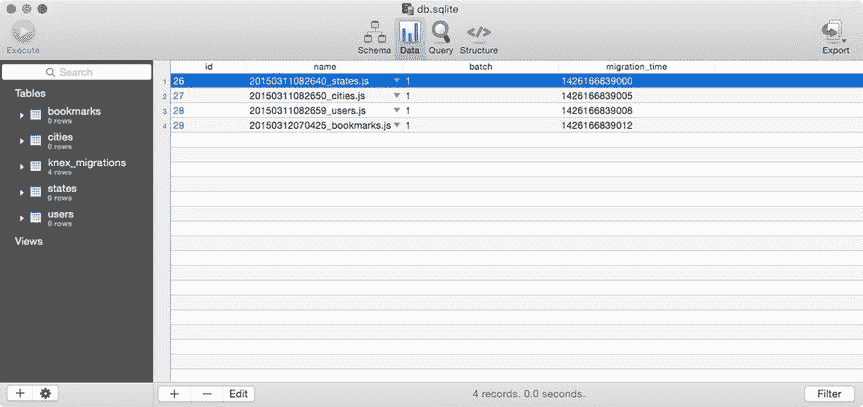
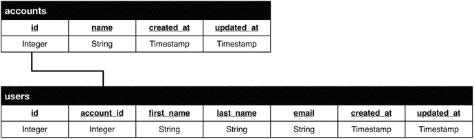
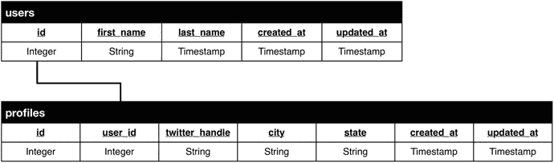
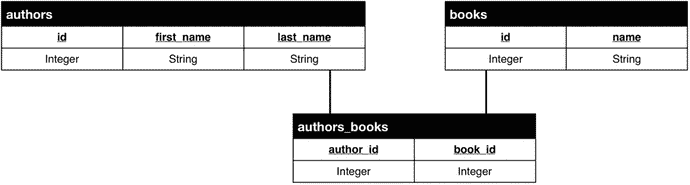

# 十二、Knex 和Bookshelf

关于我死亡的报道是夸大其词。——塞缪尔·兰霍恩·克莱门斯(马克·吐温)

在这一章中，我们将探索两个库，它们一起工作来减轻 Node.js 开发人员在使用关系数据库时经常遇到的许多困难。第一个是 Knex，它提供了一个灵活且一致的接口，用于与几个著名的 SQL 平台(如 MySQL 和 PostgreSQL)进行交互。第二个是 Bookshelf，它在此基础上为开发人员提供了一个强大的对象关系映射(ORM)库，该库简化了对组成应用数据结构的实体以及它们之间存在的各种关系进行建模的过程。熟悉 Backbone.js 及其对模型和集合中结构化数据的强调的读者将很快发现自己对 Bookshelf 如鱼得水，因为该库遵循许多相同的模式并提供许多相同的 API。

在本章中，您将学习如何执行以下操作:

*   使用 Knex 查询构建器创建 SQL 查询
*   在 promises 的帮助下，创建复杂的数据库交互，而不需要借助嵌套的回调函数
*   通过使用事务来确保应用数据的完整性
*   借助 Knex 迁移脚本管理对数据库模式的更改
*   使用 Knex 种子脚本用样本数据引导您的数据库
*   定义Bookshelf模型之间的一对一、一对多和多对多关系
*   基于Bookshelf关系，使用急切加载有效地检索复杂的对象图

Note

本章中的大多数例子都大量使用了Bookshelf和 Knex 提供的基于承诺和下划线的 API。因此，不熟悉这些概念的读者被鼓励先阅读第 17 章，它涵盖了 Q，以及第 19 章，它涵盖了下划线和连字符。

## 耐克斯

Knex 为 MySQL、PostgreSQL、MariaDB 和 SQLite3 提供了一个数据库抽象层(DBAL ),这是一个统一的接口，开发人员可以通过它与这些结构化查询语言(SQL)数据库进行交互，而不必关心每个平台之间存在的语法和响应格式的细微变化。由这种关系数据库支持的应用可以受益于 Knex 的许多特性，包括:

*   一个基于承诺的接口，允许对异步流程进行更清晰的控制
*   一个流接口，用于根据需要通过应用有效地传输数据
*   统一的界面，通过它可以为每个支持的平台创建查询和模式
*   交易支持

除了库本身之外，Knex 还提供了一个命令行工具，开发人员可以使用它来执行以下操作:

*   创建、实施和(必要时)恢复数据库迁移，脚本化的模式更改，然后可以用应用的源代码提交
*   创建数据库“种子”脚本，这是一种一致的方法，通过这种方法可以用本地开发和测试的样本数据填充应用的数据库

本章将更详细地介绍这些主题。

### 安装命令行工具

在进一步操作之前，您应该确保已经安装了 Knex 提供的命令行工具。作为一个 npm 包，安装过程如清单 [12-1](#FPar2) 所示。

Listing 12-1\. Installing the `knex` Command-Line Utility via npm

`$ npm install -g knex$ knex --version`

`Knex CLI version:  0.7.3`

### 将 Knex 添加到项目中

除了安装`knex`命令行工具，您还需要添加`knex` npm 模块，作为您打算使用它的每个项目中的本地依赖项，以及支持的数据库库，如清单 [12-2](#FPar3) 所示。

Listing 12-2\. Installing Knex and a Supported Database Library As a Local Project Dependency via npm

`$ npm install knex --save`

`# Supported database libraries include (be sure to --save):`

`$ npm install mysql`

`$ npm install mariasql`

`$ npm install pg`

`$ npm install sqlite3`

Note

SQLite 在磁盘上的单个文件中实现了一个独立的、无服务器的数据库，并且不需要额外的工具。如果您目前无法访问 MySQL 之类的数据库服务器，那么`sqlite3`库将为您提供一种快速而简单的方法来开始使用 Knex，而不需要额外的设置。本章引用的例子将使用这个库。

### 配置 Knex

现在有了依赖项，剩下的就是在项目中初始化 Knex。清单 [12-3](#FPar5) 展示了如果您碰巧使用 MySQL、PostgreSQL 或 MariaDB，这个过程会是什么样子，而清单 [12-4](#FPar6) 展示了如何初始化 Knex 以用于 SQLite3。

Listing 12-3\. Initializing Knex for Use with MySQL, PostgreSQL, or MariaDB (Substitute `mysql` for `pg` or `mariasql` As Needed)

`var knex = require('knex')({`

`'client': 'mysql',`

`'connection': {`

`'host': '127.0.0.1',`

`'user': 'user',`

`'password': 'password',`

`'database': 'database'`

`},`

`'debug': false // Set this to true to enable debugging for all queries`

`});`

Listing 12-4\. Initializing Knex for Use with SQLite3

`// example-sqlite-starter/lib/db.js`

`var knex = require('knex')({`

`'client': 'sqlite3',`

`'connection': {`

`'filename': 'db.sqlite'`

`}`

`});`

如您所见，SQLite3 所需的配置设置比其他功能更全的解决方案所需的配置设置要简单得多。我们不提供连接设置，而是简单地提供一个文件名(`db.sqlite`)，SQLite 将在其中存储数据。

### SQL 查询生成器

Knex 的主要重点是为开发人员提供一个统一的界面，通过这个界面，他们可以与多个基于 SQL 的数据库进行交互，而不必担心它们之间存在的语法和响应格式的微小变化。为此，Knex 提供了许多方法，其中大部分属于两类:查询构建器方法和接口方法。

#### 查询生成器方法

查询生成器方法是帮助开发人员创建 SQL 查询的方法。这种方法的例子包括`select()`、`from()`、`where()`、`limit()`和`groupBy()`。根据最新统计，Knex 提供了 40 多种这样的方法，使用这些方法可以创建与平台无关的查询。清单 [12-5](#FPar7) 展示了一个简单的 SQL 查询，以及一个演示如何使用 Knex 创建这样一个查询的例子。

Listing 12-5\. Example Demonstrating the Creation of a Simple SQL Query Using Knex

`// example-sqlite-starter/example1.js`

`// SELECT id, name, postal_code FROM cities;knex.select('id', 'name', 'postal_code').from('cities');`

虽然清单 [12-5](#FPar7) 中的例子展示了使用 Knex 创建 SQL 查询的基本方法，但它并没有传达库的真正价值。当我们看一看 Knex 提供的各种接口方法时，这个价值应该开始变得更加明显。有了这些方法，我们就可以开始提交我们的查询并处理它们产生的数据。

#### 接口方法

Knex 提供了许多接口方法，允许我们以几种方便的方式提交和处理我们的查询。在这一节中，我们将了解两种最有用的方法。

##### 承诺

JavaScript 的事件驱动特性使其非常适合高效处理复杂的异步任务。传统上，JavaScript 开发人员通过使用回调函数来管理异步控制流，如清单 [12-6](#FPar8) 所示。

Listing 12-6\. Simple Callback Function

`var request = require('request');`

`request({`

`'url': '`[`http://mysite.com`](http://mysite.com/)T2】

`'method': 'GET'`

`}, function(err, response) {`

`if (err) throw new Error(err);`

`console.log(response);`

`});`

回调函数允许我们将特定代码序列的执行推迟到适当的时候。这样的功能很容易理解和实现。不幸的是，随着应用复杂性的增加，它们也很难管理。想象一个场景，在清单 [12-6](#FPar8) 中收到初始响应后，必须运行额外的异步流程。这样做需要使用额外的嵌套回调函数。随着额外的异步步骤被添加到代码中，我们开始经历许多开发人员所称的“回调地狱”或“末日金字塔”，这些术语描述了这种方法经常导致的大量不可维护的代码。

幸运的是，JavaScript promises 为开发人员提供了一个解决这个问题的便捷方案 Knex 通过基于 promise 的接口广泛使用这个方案来提交和处理查询。清单 [12-7](#FPar9) 展示了这个 API 的实际应用。

Listing 12-7\. Demonstration of the Promise-Based API Provided by Knex

`// example-sqlite-starter/example2.js`

`knex.pluck('id').from('cities').where('state_id', '=', 1)`

`.then(function(cityIds) {`

`return knex.select('id', 'first_name', 'last_name').from('users')`

`.whereIn('city_id', cityIds);`

`})`

`.then(function(users) {`

`return [`

`users,`

`knex.select('*').from('bookmarks').whereIn('user_id', _.pluck(users, 'id'))`

`];`

`})`

`.spread(function(users, bookmarks) {`

`_.each(users, function(user) {`

`user.bookmarks = _.filter(bookmarks, function(bookmark) {`

`return bookmark.user_id = user.id;`

`});`

`});`

`console.log(JSON.stringify(users, null, 4));`

`})`

`.catch(function(err) {`

`console.log(err);`

`});`

在此示例中，连续提交了三个查询:

Cities within a particular state are selected.   Users who live within the returned cities are selected.   Bookmarks for each of the returned users are selected.  

在我们的最终查询返回后，我们将每个书签附加到适当的用户并显示结果，您可以在清单 [12-8](#FPar10) 中看到。

Listing 12-8\. Data Logged to the Console As a Result of the Code in Listing [12-7](#FPar9)

`[`

`{`

`"id": 1,`

`"first_name": "Steve",`

`"last_name": "Taylor",`

`"bookmarks": [`

`{`

`"id": 1,`

`"url": "`[`http://reddit.com`](http://reddit.com/)T2】

`"label": "Reddit",`

`"user_id": 1,`

`"created_at": "2015-03-12 12:09:35"`

`},`

`{`

`"id": 2,`

`"url": "`[`http://www.theverge.com`](http://www.theverge.com/)T2】

`"label": "The Verge",`

`"user_id": 1,`

`"created_at": "2015-03-12 12:09:35"`

`}`

`]`

`}`

`]`

感谢 Knex 提供的基于 promise 的接口，我们的代码永远不会超出一级缩进，从而确保我们的应用易于理解。更重要的是，如果在这个过程中的任何一点出现错误，我们最终的`catch`语句都会很方便地捕捉并处理它。

Note

JavaScript promises 是一个强大的工具，可以用一种易于遵循和维护的方式编写复杂的异步代码。如果你对这个概念不熟悉，建议你跳到第 17 章，阅读 Q promise 库以获得更多关于这个主题的信息。

##### 流

用 Node.js 编写应用的最大好处之一是平台能够以非常高效的方式执行 I/O 密集型过程。与 PHP、Python 或 Ruby 等同步语言不同，Node.js 能够在一个线程中同时处理数千个连接，允许开发人员编写能够满足巨大需求的应用，同时使用最少的资源。Node.js 为完成这一壮举提供了几个重要的工具，其中最重要的一个是 streams。

在我们看一看流之前，让我们检查另一个传统 JavaScript 回调函数的例子，如清单 [12-9](#FPar12) 所示。

Listing 12-9\. JavaScript Callback Function That Accepts the Contents of a Loaded File

`var fs = require('fs');`

`fs.readFile('data.txt', 'utf8', function(err, data) {`

`if (err) throw new Error(err);`

`console.log(data);`

`});`

在这个例子中，我们使用 Node.js 中可用的本机`fs`库的`readFile()`方法来读取文件的内容。一旦数据被加载到内存中(全部)，它就被传递给我们的回调函数进行进一步的处理。这种方法简单易懂。然而，这不是很有效，因为我们的应用必须首先将文件的全部内容加载到内存中，然后再将它传递给我们。对于较小的文件来说，这不是一个可怕的问题，但是较大的文件可能会引起问题，这取决于运行该应用的服务器的可用资源。

Node.js 流通过将数据以多个更小的块的形式通过一个或多个函数来解决这个问题。通过这样做，流允许开发人员避免将服务器的大部分可用资源用于任何单个请求。清单 [12-10](#FPar13) 中所示的例子实现了我们上一个例子的相同目标，没有将整个文件的内容一次性加载到内存中。

Listing 12-10\. Pair of Node.js Streams Working Together to Efficiently Load and Display the Contents of a File

`// example-read-file-stream/index.js`

`var fs = require('fs');`

`var Writable = require('stream').Writable;`

`var stream = fs.createReadStream('data.txt');`

`var out = Writable();`

`out._write = function(chunk, enc, next) {`

`console.log(chunk.toString());`

`next();`

`};`

`stream.pipe(out);`

流是 Node.js 的一个相对未被充分利用的特性，这很不幸，因为它们恰好是该平台更强大的方面之一。幸运的是，Knex 为消费查询结果提供了一个流接口，允许我们利用这些好处，如清单 [12-11](#FPar14) 所示。

Listing 12-11\. Processing the Results of a Query via the Streaming Interface Provided by Knex

`var Writable = require('stream').Writable;`

`var ws = Writable();`

`ws._write = function(chunk, enc, next) {`

`console.dir(chunk);`

`next();`

`};`

`var stream = knex.select('*').from('users').stream();`

`stream.pipe(ws);`

在这个例子中，我们对`users`表的查询结果(对于某些应用来说可能很大)以较小的块流传送到我们的可写流中，而不是完整地传递。这种方法也可以与库的 promise 接口配对，以创建一个更健壮的实现，如清单 [12-12](#FPar15) 所示。

Listing 12-12\. Combining the Streaming and Promise-Based Interfaces Provided by Knex for Better Error Handling

`var Writable = require('stream').Writable;`

`var ws = Writable();`

`ws._write = function(chunk, enc, next) {`

`console.dir(chunk);`

`next();`

`};`

`knex.select('*').from('users').stream(function(stream) {`

`stream.pipe(ws);`

`}).then(function() {`

`console.log('Done.');`

`}).catch(function(err) {`

`console.log(err);`

`});`

在这个例子中，我们结合了 Knex 提供的流和基于承诺的接口的能力。当回调函数被传递给库的`stream()`方法时，回调函数接收生成的承诺，而不是被直接返回。相反，会返回一个承诺，一旦流完成，这个承诺就会得到解决。

Note

Knex 提供的流接口兼容 MySQL、PostgreSQL 和 MariaDB 数据库。当前不支持 SQLite3。

##### 处理

使用与 ACID 兼容的关系数据库的最大好处之一在于，它们能够将多个查询分组到一个工作单元(即一个“事务”)中，这个工作单元要么整体成功，要么整体失败。换句话说，如果事务中的单个查询失败，则由于事务中先前运行的查询而发生的任何更改都将被恢复。

举例来说，考虑在你的银行发生的金融交易。假设你想在你表妹生日那天给她寄 25 美元。这些资金必须先从你的账户中取出，然后再存入你堂兄的账户。想象一下这样一个场景:在资金从您的帐户中移除之后，但在资金被插入您堂兄的帐户之前，支持资金交换的应用由于各种原因(例如，一行错误的代码或更大的系统故障)而崩溃。如果没有交易提供的安全网，这些资金基本上会消失得无影无踪。事务允许开发人员确保这样的过程完全发生，不会让数据处于不一致的状态。

Note

缩写 ACID(原子性、一致性、隔离性、持久性)指的是一组描述数据库事务的属性。原子性指的是这样一个事实，即这种事务要么整体成功，要么整体失败。这种事务被称为“原子的”

本章前面的例子已经演示了使用 Knex 创建和提交数据库查询的过程。在我们继续之前，让我们回顾一下另一个没有利用事务的例子。之后，我们将更新这个例子，以利用事务提供的安心感。

在清单 [12-13](#FPar18) 所示的例子中，声明了一个`moveFunds()`函数，当被调用时，使用`knex`对象将指定数量的资金从一个账户转移到另一个账户。该函数返回一个承诺，一旦该过程完成，该承诺将被解决或拒绝，这取决于调用的成功或失败。这里有一个明显的错误，你能发现吗？

Listing 12-13\. `moveFunds()` Function Demonstrating the Process of Moving Funds from One Account to Another Without the Security of Transactions

`// example-financial/bad.js`

`/**`

`* Moves the specified amount of funds from sourceAccountID to destAccountID`

`*/`

`var moveFunds = function(sourceAccountID, destAccountID, amount) {`

`return knex.select('funds').from('accounts')`

`.where('id', sourceAccountID)`

`.first(function(result) {`

`if (!result) {`

`throw new Error('Unable to locate funds for source account');`

`}`

`if (result.funds < amount) {`

`throw new Error('Not enough funds are available in account');`

`}`

`return knex('accounts').where('id', sourceAccountID).update({`

`'funds': result.funds - amount`

`});`

`}).then(function() {`

`return knex.select('funds').from('accounts')`

`.where('id', destAccountID);`

`}).first(function(result) {`

`if (!result) {`

`throw new Error('Unable to locate funds for destination account');`

`}`

`return knex('accounts').where('id', destAccountID).update({`

`'funds': result.funds + amount`

`});`

`});`

`};`

`/* Move $25 from account 1 to account 2\. */`

`moveFunds(1, 2, 25).then(function(result) {`

`console.log('Transaction succeeded.', result);`

`}).catch(function(err) {`

`console.log('Transaction failed!', err);`

`});`

在本例中，要实现将资金从源帐户转移到目标帐户的目标，需要执行以下步骤:

The total funds currently available within the source account are determined.   If insufficient funds are available to complete the process, an error is thrown.   The funds to be transferred are deducted from the source account.   The total funds currently available within the destination account are determined.   If the destination account cannot be found, an error is thrown.   The funds to be transferred are added to the destination account.  

如果你还没有发现错误，一个明显的问题会在第 5 步出现。如果找不到目标帐户，就会抛出一个错误，但是此时要转移的资金已经从源帐户中扣除了！我们可以尝试用多种方法来解决这个问题。我们可以捕获代码中的错误，然后将资金贷记回源帐户，但这仍然不能解决由于网络问题或应用服务器在此过程中断电并完全崩溃而可能出现的不可预见的错误。

正是在这一点上，数据库事务的威力开始变得明显。在清单 [12-14](#FPar19) 中，我们的`moveFunds()`函数被重构，将整个过程包装成一个单一的“原子”事务，这个事务要么成功，要么失败。请注意`trx`对象的创建，我们的事务感知查询就是从这个对象构建的。

Listing 12-14\. Transaction-Aware Implementation of Listing [12-13](#FPar18)

`// example-financial/index.js`

`/**`

`* Moves the specified amount of funds from sourceAccountID to destAccountID`

`*/`

`var moveFunds = function(sourceAccountID, destAccountID, amount) {`

`return knex.transaction(function(trx) {`

`return trx.first('funds')`

`.from('accounts')`

`.where('id', sourceAccountID)`

`.then(function(result) {`

`if (!result) {`

`throw new Error('Unable to locate funds for source account');`

`}`

`if (result.funds < amount) {`

`throw new Error('Not enough funds are available in account');`

`}`

`return trx('accounts').where('id', sourceAccountID)`

`.update({`

`'funds': result.funds - amount`

`});`

`})`

`.then(function() {`

`return trx.first('funds')`

`.from('accounts')`

`.where('id', destAccountID);`

`})`

`.then(function(result) {`

`if (!result) {`

`throw new Error('Unable to locate funds for destination account');`

`}`

`return trx('accounts').where('id', destAccountID)`

`.update({`

`'funds': result.funds + amount`

`});`

`});`

`});`

`};`

`/* Move $25 from account 1 to account 2\. */`

`displayAccounts()`

`.then(function() {`

`return moveFunds(1, 2, 25);`

`}).then(function() {`

`console.log('Transaction succeeded.');`

`}).catch(function(err) {`

`console.log('Transaction failed!', err);`

`});`

正如您所看到的，清单 [12-14](#FPar19) 中显示的事务感知示例很大程度上类似于清单 [12-13](#FPar18) 中显示的示例，但是它在一个重要方面有所不同。我们不是通过直接在 knex 对象上调用构建器方法来创建查询，而是首先通过调用 knex.transaction()来启动一个事务。然后，我们提供的回调函数被传递给一个“事务感知”的替身(trx ),我们从这个替身开始创建我们的一系列查询。从现在开始，我们从 trx 对象创建的任何查询要么成功，要么失败。knex.transaction()方法返回一个承诺，一旦事务作为一个整体完成，该承诺将被解决或拒绝，这使我们可以轻松地将该事务集成到一系列更大的基于承诺的操作中。

### 迁移脚本

正如应用的源代码注定会随着时间的推移而改变一样，它存储的信息结构也是如此。在进行此类更改时，重要的是要以一种可重复、可共享、必要时可回滚并可随时跟踪的方式来实现它们。数据库迁移脚本为开发人员实现这一目标提供了一种方便的模式。

Knex 迁移脚本由两个函数组成，`up`和`down`，如清单 [12-15](#FPar20) 所示。脚本的`up`函数负责以某种期望的方式修改数据库的结构(例如，创建一个表，添加一列)，而它的`down`函数负责将数据库的结构恢复到以前的状态。

Listing 12-15\. Knex Migration Script with up Function Creating a New Table and down Function Dropping the Table

`// example-sqlite-starter/migrations/20150311082640_states.js`

`exports.up = function(knex, Promise) {`

`return knex.schema.createTable('states', function(table) {`

`table.increments().unsigned().primary().notNullable();`

`table.string('name').notNullable();`

`table.timestamp('created_at').defaultTo(knex.fn.now()).notNullable();`

`});`

`};`

`exports.down = function(knex, Promise) {`

`return knex.schema.dropTable('states');`

`};`

#### 为迁移配置项目

Knex 命令行工具为开发人员提供了创建和管理迁移脚本的简单工具。首先，您需要通过在项目的根文件夹中运行以下命令来创建一个特殊的配置文件:

`$ knex init`

运行该命令后，将创建一个文件(`knexfile.js`)，其内容类似于清单 [12-16](#FPar22) 中所示。您应该根据需要修改该文件的内容。每当 Knex 迁移脚本运行时，Knex 将根据该文件的内容和`NODE_ENVIRONMENT`环境变量的值来确定其连接设置。

Note

在 OS X 和 Linux 上，通过运行`export ENVIRONMENT_VARIABLE=value`从终端设置环境变量。在 Windows 命令行中使用的命令是`set ENVIRONMENT_VARIABLE=value`。

Listing 12-16. `knexfile.js`

`// example-sqlite-starter/knexfile.js`

`module.exports = {`

`'development': {`

`'client': 'sqlite3',`

`'connection': {`

`'filename': './db.sqlite'`

`}`

`},`

`'seeds': {`

`'directory': './seeds'`

`}`

`},`

`'staging': {`

`'client': 'postgresql',`

`'connection': {`

`'database': 'my_db',`

`'user': 'username',`

`'password': 'password'`

`},`

`'pool': {`

`'min': 2,`

`'max': 10`

`}`

`}`

`}`

`};`

#### 创建您的首次迁移

现在有了 Knex 配置文件，我们可以继续创建我们的第一个迁移脚本了。执行此操作的命令如下所示:

`$ knex migrate:make users_table`

当创建您自己的迁移时，用描述您的迁移所实现的变化的术语来替换命令的`users_table`部分。运行这个命令后，Knex 将为您创建一个类似于清单 [12-17](#FPar23) 中所示的迁移脚本。

Listing 12-17\. New Knex Migration Script

`exports.up = function(knex, Promise) {`

`};`

`exports.down = function(knex, Promise) {`

`};`

创建第一个迁移脚本后，项目的文件结构应该类似于清单 [12-18](#FPar24) 所示。

Listing 12-18\. Excerpt of Project’s File Structure After Creating First Migration

`.`

■t0]

ε──t0″

ε──t0″

Note

Knex 迁移脚本存储在项目根级别的`migrations`文件夹中。如果这个目录不存在，Knex 会为您创建一个。Knex 自动为迁移脚本的文件名添加时间戳，如清单 [12-18](#FPar24) 所示。这确保了项目的迁移总是按照创建的顺序进行排序。

现在由我们来修改新创建的迁移脚本中的`up`和`down`函数。让我们来看看两种可供选择的方法。

##### 使用模式构建器方法定义模式更新

除了提供构造查询的方法，Knex 还提供定义数据库底层结构(模式)的方法。在这些“模式构建器”方法的帮助下，开发人员可以创建平台无关的蓝图，描述构成数据库的各种表、列、索引和关系。然后，这些蓝图可以应用于任何支持的平台，以生成所需的数据库。清单 [12-15](#FPar20) 中显示的迁移脚本展示了 Knex 模式构建器的运行，而清单 [12-19](#FPar26) 展示了由脚本的`up`方法生成的查询。

Listing 12-19\. SQL Query Generated Through Use of Schema Builder Methods, As Shown in Listing [12-15](#FPar20)

`// example-raw-migration/migrations/20150312083058_states.js`

`CREATE TABLE states (`

`id integer PRIMARY KEY AUTOINCREMENT NOT NULL,`

`name varchar(255) NOT NULL,`

`created_at datetime NOT NULL DEFAULT(CURRENT_TIMESTAMP)`

`);`

Schema builder 方法非常有用，因为它们允许开发人员以一种可以应用于 Knex 支持的每个平台的方式轻松定义模式。它们还需要最少的关于原始 SQL 查询的知识，这使得几乎没有直接使用 SQL 数据库经验的开发人员能够快速上手并运行。也就是说，模式构建器方法也有局限性。为了提供一个通用接口来定义跨多个平台工作的数据库模式，Knex 必须为您做出某些决定——这一点您可能不太适应。具有更多直接使用 SQL 数据库经验的开发人员可能希望完全绕过模式构建器方法，而选择创建自己的 SQL 查询。正如我们将要看到的，这很容易做到。

##### 用原始 SQL 查询定义模式更新

在清单 [12-20](#FPar27) 中，我们看到一个 Knex 迁移脚本，它通过使用原始 SQL 查询创建了一个新的`users`表。这是通过使用`knex.schema.raw()`方法完成的。调用时，此方法返回一个承诺，该承诺将被解析或拒绝，这取决于它接收到的查询是成功还是失败。

Listing 12-20\. Knex Migration Script Defined with Raw SQL Queries

`// example-raw-migration/migrations/20150312083058_states.js`

`var multiline = require('multiline');`

`exports.up = function(knex, Promise) {`

`var sql = multiline.stripIndent(function() {/*`

`CREATE TABLE states (`

`id integer PRIMARY KEY AUTOINCREMENT NOT NULL,`

`name varchar(255) NOT NULL,`

`created_at datetime NOT NULL DEFAULT(CURRENT_TIMESTAMP)`

`);`

`*/});`

`return knex.schema.raw(sql);`

`};`

`exports.down = function(knex, Promise) {`

`return knex.schema.raw('DROP TABLE states;');`

`};`

Note

清单 [12-20](#FPar27) 中所示的例子使用了一个与 Knex: `multiline`无关的附加库。`multiline`库非常有用，因为它允许我们定义跨越多行的大块文本，而不需要每行都以连续字符结尾。

#### 运行 Knex 迁移

现在，我们新创建的迁移脚本已经定义好并可以使用了，剩下的唯一任务就是运行迁移，用我们想要的更改更新我们的数据库。执行此操作的命令如下所示:

`$ knex migrate:latest`

该命令将指示 Knex 按照创建的顺序运行所有尚未运行的可用迁移脚本。一旦完成，我们的数据库将会完全更新我们想要的变化。如果你想知道 Knex 是如何跟踪哪些迁移已经运行，哪些没有运行，答案就在 Knex 自动为自己创建的`knex_migrations`表中(见图 [12-1](#Fig1) )。在这个表中，Knex 维护了一个已经实施的迁移的运行列表。这个表的名称可以通过修改我们用`knex init`命令创建的配置文件来更改。

图 12-1。

The `knex_migrations` table used by Knex to track which migration scripts have already been applied to your database

#### 恢复 Knex 迁移

运行 Knex 迁移脚本的行为不是单行道。它们也可以被撤销，这在开发过程中尤为重要。执行此操作的命令如下:

`$ knex migrate:rollback`

该命令将指示 Knex 恢复所有由于最近执行`knex migrate:latest`而运行的迁移脚本。要验证数据库在迁移脚本方面的状态，可以运行以下命令来确定数据库的当前迁移版本:

`$ knex migrate:currentVersion`

### 种子脚本

在上一节中，您了解了 Knex 迁移脚本如何使您能够编写数据库结构更改的脚本，这些脚本可以与他人共享，在必要时可以恢复，并在版本控制中进行跟踪。Knex 种子脚本也有类似的目的，但是关注的是数据而不是结构。Seed 脚本提供了一种一致的方式来指定如何用示例数据填充新创建的数据库，以启动并运行新的开发环境。清单 [12-21](#FPar29) 显示了本章的一个示例项目中包含的种子脚本的内容。

Listing 12-21\. Simple Knex Seed Script That Removes All Existing Records from the `states` Table and Inserts Two New Ones

`// example-sqlite-starter/seeds/01-states.js`

`exports.seed = function(knex, Promise) {`

`return Promise.join(`

`knex('states').del(),`

`knex('states').insert([`

`{`

`'id': 1,`

`'name': 'Georgia'`

`},`

`{`

`'id': 2,`

`'name': 'Tennessee'`

`}`

`]);`

`);`

`};`

#### 创建种子脚本

您可以使用以下命令指示 Knex 创建新的种子脚本:

`$ knex seed:make users`

默认情况下，Knex 将新创建的种子脚本保存到项目根路径的`seeds`文件夹中。您可以通过修改项目的`knexfile.js`配置文件的内容来自定义这个文件夹(参见清单 [12-16](#FPar22) )。

#### 运行种子脚本

为您的应用创建种子脚本后，您可以通过运行以下命令用它们填充您的数据库:

`$ knex seed:run`

Note

种子脚本总是按字母顺序运行。如果您的种子运行的顺序很重要，请注意给它们起一个合适的名字，以确保它们按照期望的顺序运行。

## Bookshelf

Bookshelf 建立在 Knex 的基础上，提供了一个灵活的 ORM 库，简化了创建类(“模型”)的过程，以表示组成应用的各种对象。本节探讨了开发人员使用 Bookshelf 完成以下任务的各种方式:

*   创建类(“模型”)来表示应用数据库中使用的各种表
*   使用定制行为扩展模型，以满足其应用的需求
*   定义模型之间的复杂关系(一对一、一对多、多对多)
*   在“急切加载”的帮助下，无需求助于复杂的 SQL 查询，即可轻松浏览模型之间存在的各种关系

熟悉 Backbone 的开发人员会很快发现自己对 Bookshelf 如鱼得水，因为它遵循许多相同的模式并实现许多相同的 API。你可以很容易地将 Bookshelf 描述为“服务器的主干”，而且你不会错得太离谱。

### 什么是对象关系映射器？

关系数据库将信息存储为一个或多个表中的一系列行，每个表都有一个或多个描述所包含记录的各种属性的列，就像您可能在电子表格中组织信息一样。在大多数应用中，创建单独的表来表示每种类型的可用实体(例如，“帐户”、“用户”、“注释”)。然后通过使用“外键”列来定义这些实体之间存在的各种关系，如图 [12-2](#Fig2) 所示。

图 12-2。

Here, the relationship between users and accounts (an account has one or more users, users belong to accounts) is described via the `account_id` foreign key column within the `users` table.

这种存储信息的方法非常强大，并且是应用存储数据的主要方法，这是有很多原因的(所有这些都超出了本书的范围)。不幸的是，这种方法也与大多数应用倾向于用面向对象的方法来查看数据不一致。

诸如 Bookshelf 之类的对象关系映射(ORM)工具允许开发人员与存储在关系数据库中的平面信息表进行交互，这些信息表是一系列相互连接的对象，开发人员可以通过这些对象进行交互和导航，以实现某些期望的目标。实际上，ORM 库为开发人员提供了一个“虚拟对象数据库”，允许他们更容易地与关系数据库表中包含的平面记录进行交互。

### 创建您的第一个Bookshelf模型

Bookshelf模型可以被认为是一个类，当它被实例化时，表示数据库中的一条记录。在其最简单的形式中，Bookshelf模型充当数据容器，为获取和设置属性(即列)值以及创建、更新和销毁记录提供内置功能。然而，正如我们将很快看到的，当我们用自己的定制方法扩展Bookshelf模型并定义它们之间存在的关系时，Bookshelf模型变得更加有用。

Bookshelf模型是通过`bookshelf.Model.extend()`方法定义的，如清单 [12-22](#FPar31) 所示。在这个简单的例子中，定义了一个`User`模型，它的记录将被持久化到我们数据库的`users`表中。

Listing 12-22\. Simple Bookshelf Model That Represents an Application’s Users

`// example-bookshelf1/lib/user.js`

`var knex = require('./db');`

`var bookshelf = require('bookshelf')(knex);`

`var User = bookshelf.Model.extend({`

`'tableName': 'users',`

`'idAttribute': 'id' // The primary key for our table. Defaults to: 'id'`

`});`

`module.exports = User;`

#### 创建新实例

在清单 [12-23](#FPar32) 中，`User`模型的一个新实例被创建、修改，然后保存到数据库中。

Listing 12-23\. Saving a New Instance of `User` to the Database

`// example-bookshelf1/create.js`

`var User = require('./lib/user');`

`var user = new User();`

`user.set({`

`'first_name': 'Steve',`

`'last_name': 'Taylor',`

`'email': 'steve.taylor@mydomain.com'`

`});`

`// Individual attributes can also be set as shown below`

`// user.set('first_name', 'Steve');`

`user.save().then(function(user) {`

`// user has been saved`

`console.log('User saved', user.toJSON());`

`/*`

`{`

`first_name: 'Steve',`

`last_name: 'Taylor',`

`email: 'steve.taylor@mydomain.com',`

`id: 1`

`}`

`*/`

`});`

Bookshelf提供了一个方便的`forge()`方法，允许我们稍微简化这个例子，如清单 [12-24](#FPar33) 所示。这个方法只是在幕后为我们创建并返回一个新的`User`实例，允许我们放弃使用`new`关键字。

Listing 12-24\. Creating a New Instance of the `User` Model via the `forge()` Method

`// example-bookshelf1/forge.js`

`User.forge({`

`'id': 1,`

`'first_name': 'John'`

`}).fetch().then(function(user) {`

`/* An object containing every attribute / value for`

`this model can be retrieved via the 'toJSON' method. */`

`console.log(user.toJSON());`

`});`

#### 获取实例

可以用类似的方式检索`User`模型的实例。在清单 [12-25](#FPar34) 中，创建了一个`User`的新实例，其`id`属性的值为`1`。当调用`fetch()`时，Bookshelf 将使用模型上设置的任何属性来构建用于获取所需记录的查询。在本例中，使用的查询将是

`SELECT * FROM users WHERE 'id' = 1;`

Listing 12-25\. Retrieving an Instance of the `User` Model from the Database

`// example-bookshelf1/fetch.js`

`User.where({`

`'id': 1`

`}).fetch().then(function(user) {`

`// Individual attributes get be retrieved with the get method`

`// console.log('first_name', user.get('first_name'));`

`console.log(user.toJSON());`

`});`

#### 销毁实例

正如模型实例可以被保存一样，它们也可以通过`destroy()`方法被删除，如清单 [12-26](#FPar35) 所示。

Listing 12-26\. Deleting an Instance of the `User` Model

`// example-bookshelf1/destroy.js`

`User.where({`

`'id': 1`

`}).fetch().then(function(user) {`

`return user.destroy();`

`}).then(function() {`

`console.log('User destroyed.');`

`});`

在这个例子中，`destroy`作为`user`上的一个实例方法被调用。然而，我们可以指示 Bookshelf 简单地查找并销毁记录，而不需要我们自己首先获取实例，如清单 [12-27](#FPar36) 所示。

Listing 12-27\. Instructing Bookshelf to Destroy the Specified Record

`User.where({`

`'id': 1`

`}).destroy().then(function() {`

`console.log('User destroyed.');`

`});`

#### 获取多个模型(集合)

除了通过`fetch()`方法检索模型的单个实例，我们还可以通过`fetchAll()`方法检索多个实例，如清单 [12-28](#FPar37) 所示。

Listing 12-28\. Fetching All Instances of `User` with a Value of `John` for `first_``name`

`// example-bookshelf1/fetch-collection.js`

`User.where({`

`'last_name': 'Doe'`

`}).fetchAll().then(function(users) {`

`console.log(JSON.stringify(users.toJSON(), null, 4));`

`/*`

`[{`

`"id": 3,`

`"first_name": "John",`

`"last_name": "Doe",`

`"email": "john.doe@mydomain.com"`

`},`

`{`

`"id": 4,`

`"first_name": "Jane",`

`"last_name": "Doe",`

`"email": "jane.doe@mydomain.com"`

`}]`

`*/`

`});`

在这个例子中，我们对`fetchAll()`的调用返回一个承诺，该承诺解析为多个用户的集合。该集合提供了许多专门为与多个模型交互而设计的内置方法。鉴于 Bookshelf 对遵循主干模式的强烈关注，主干集合中可用的大多数相同方法在这里也是可用的。清单 [12-29](#FPar38) 展示了一些常见的用例。

Listing 12-29\. Commonly Used Bookshelf Collection Methods

`/* Iterate through a collection */`

`users.each(function(user, index) {`

`console.log(user, index);`

`});`

`/* Create an array composed of models matching more specific criteria */`

`users = users.filter(function(user, index) {`

`if (user.get('last_name') === 'Smith') return true;`

`});`

`/* A simpler method for filtering models, when a function call is not needed */`

`users = users.where({`

`'last_name': 'Smith'`

`});`

`/* Return the first entry matching the specified criteria */`

`var johnSmith = users.find(function(user) {`

`if (user.get('last_name') === 'Smith') return true;`

`});`

`/* Returns an array containing the first name of every user */`

`var firstNames = users.pluck('first_name');`

#### 用自定义行为扩展

最简单的情况是，Bookshelf模型除了充当数据库中记录的容器之外，还提供了读写属性值和执行保存或销毁操作的内置方法。虽然这很有用，但是只有当我们开始用适合我们应用需求的独特行为来扩展Bookshelf模型时，Bookshelf模型才开始发挥其全部潜力。

清单 [12-30](#FPar39) 展示了这种行为的一个例子。在这里，我们更新了前面示例中的用户模型，以包含一个 sendEmail()方法。这样做可以让我们抽象出向应用的注册用户发送电子邮件所涉及的复杂性。

Listing 12-30\. Extending the `User` Model with a Method for Sending Outbound E-mails from Our Application

`var Promise = require('bluebird');`

`var Handlebars = require('handlebars');`

`var User = bookshelf.Model.extend({`

`'tableName': 'users',`

`/**`

`* Sends an e-mail to the user. Requires an `options` object`

`* with values for `subject` and `message`. These values will be`

`* compiled as Handlebars templates, passed this user’s attributes,`

`* and the result(s) will be used to generate the outgoing message.`

`*/`

`'sendEmail': function(options) {`

`var self = this;`

`return Promise.resolve`()。`then(function() {`

`var subject = Handlebars.compile(options.subject)(self.toJSON());`

`var message = Handlebars.compile(options.message)(self.toJSON());`

`// Use your e-mail library of choice here, along with the`

`// appropriate connection settings.     });`

`}`

`});`

`User.where({`

`'id': 1`

`}).fetch().then(function(user) {`

`return user.sendEmail({`

`'subject': 'Welcome, {{first_name}}',`

`'message': 'We are happy to have you on board, {{first_name}} {{last_name}}.'`

`});`

`});`

除了那些从 Backbone 继承的方法之外，Bookshelf收藏还提供了一些自己的方法。清单 [12-31](#FPar40) 展示了`invokeThen()`方法的使用，允许我们轻松地调用集合中包含的每个模型的方法。

Listing 12-31\. Invoking an Imagined sendEmail( ) Method on Each Model Contained Within a Collection

`// example-bookshelf1/invoke-then.js`

`User.where({`

`'last_name': 'Doe'`

`}).fetchAll().then(function(users) {`

`return users.invokeThen('sendEmail', {`

`'subject': 'Congratulations on having such a great name, {{first_name}}.',`

`'message': '{{first_name}} really is a great name. Seriously - way to go.'`

`});`

`}).then(function(users) {`

`console.log('%s users were complimented on their name.', users.length);`

`});`

本例中演示的 invokeThen()方法返回它自己的承诺，只有在集合模型上对 sendEmail()的所有调用都得到解决之后，这个承诺才会得到解决。这种模式也为我们提供了一种同时与多个模型交互的便捷方法。

#### 执行验证

熟悉 Backbone 的人会发现Bookshelf的事件系统相当熟悉。关于验证，特别感兴趣的是Bookshelf发出的`saving`和`destroying`事件。通过利用这些事件，Bookshelf模型可以定制独特的行为，根据一些期望的标准允许或拒绝这些操作。清单 [12-32](#FPar41) 显示了一个例子，其中电子邮件地址包含字符串“hotmail.com”的用户被阻止保存到数据库中。

Listing 12-32\. Demonstration of Bookshelf’s Event System, Which Allows for Implementation of Custom Validation Rules

`// example-bookshelf1/lib/user.js`

`var User = bookshelf.Model.extend({`

`'tableName': 'users',`

`'initialize': function() {`

`this.on('saving', this._validateSave);`

`},`

`'_validateSave': function() {`

`var self = this;`

`return Promise.resolve().then(function() {`

`if (self.get('email').indexOf('hotmail.com') >= 0) {`

`throw new Error('Hotmail email addresses are not allowed.');`

`}`

`});`

`}`

`});`

为了防止对`save`或`destroy`的调用成功，只需进入模型的`saving`或`destroying`事件，传递一个对您自己定制的验证函数的引用。如果抛出错误，调用将被阻止。通过使用承诺，异步验证也是可能的。在清单 [12-33](#FPar42) 中，一个定制的验证函数返回一个最终被拒绝的承诺。

Listing 12-33\. Custom Validation Function That Returns a Promise

`// example-bookshelf1/validation.js`

`User.forge({`

`'first_name': 'Jane',`

`'last_name': 'Doe',`

`'email': 'jane.doe@hotmail.com'`

`}).save().then(function() {`

`console.log('Saved.');`

`}).catch(function(err) {`

`/* Our call to `save` will result in an error, due to this user’s`

`hotmail.com e-mail address. */`

`console.log(err);`

`});`

#### 自定义导出过程

前面的例子已经展示了`toJSON()`方法的使用，该方法(默认情况下)返回一个对象，该对象包含对其进行调用的模型的所有可用属性/值(或者，如果对集合进行调用，则返回所有可用模型的属性/值)。如果您希望定制该方法返回的数据，您可以通过覆盖`toJSON()`方法来实现，如清单 [12-34](#FPar43) 所示。

Listing 12-34\. Customizing the Data Returned by Our Model’s `toJSON()` Method

`var User = bookshelf.Model.extend({`

`'tableName': 'users',`

`'toJSON': function() {`

`var data = bookshelf.Model.prototype.toJSON.call(this);`

`data.middle_name = 'Danger';`

`return data;`

`}`

`});`

在这个例子的被覆盖的`toJSON()`方法中，我们首先调用原型的`toJSON()`方法，给我们这个方法最初返回的数据，如果它没有被覆盖的话。然后，我们去掉想要隐藏的数据，添加一些我们自己的附加信息，并返回它。

这种模式经常出现的一个常见场景是使用一个`User`模型，其中保存了敏感的密码信息。修改模型的`toJSON()`方法来自动去除这些信息，如清单 [12-34](#FPar43) 所示，有助于防止这些信息在 API 请求中无意泄露。

#### 定义类属性

Bookshelf的`extend()`方法，我们在前面的例子中已经看到，接受两个参数:

*   由创建的模型实例继承的实例属性的对象
*   要直接分配给模型的类属性的对象

本章前面的例子已经演示了通过`extend()`分配实例属性的过程，但是我们还没有看到演示类属性使用的例子。清单 [12-35](#FPar44) 展示了活动中的类属性。

Listing 12-35\. Defining the `getRecent()` Class Method on the `User` Model

`// example-bookshelf1/lib/user.js`

`var User = bookshelf.Model.extend({`

`'tableName': 'users'`

`}, {`

`/**`

`* Returns a collection containing users who have signed in`

`* within the last 24 hours.`

`*/`

`'getRecent': function() {`

`return User.where('last_signin', '>=', knex.raw("date('now', '-1 day')")).fetch();`

`}`

`});`

`// example-bookshelf1/static.js`

`User.getRecent().then(function(users) {`

`console.log('%s users have signed in within the past 24 hours.', users.length);`

`console.log(JSON.stringify(users.toJSON(), null, 4));`

`});`

类级属性提供了一个方便的位置，在这里我们可以定义与所讨论的模型相关的各种帮助方法。在这个虚构的示例中，`getRecent()`方法返回一个承诺，该承诺解析为一个集合，其中包含在过去 24 小时内登录的所有用户。

#### 用子类扩展

Bookshelf的`extend()`方法正确设置了原型链。因此，除了创建直接从 Bookshelf 的`Model`类继承的模型，开发人员还可以创建相互继承的模型，如清单 [12-36](#FPar45) 所示。

Listing 12-36\. Creating a `Base` Model That Extends Directly from Bookshelf’s `Model` Class, from Which Other Models Can Also Extend

`// example-bookshelf-extend/lib/base.js`

`/**`

`* This model serves as a base from which all other models`

`* within our application extend.`

`*`

`* @class Base`

`*/`

`var Base = bookshelf.Model.extend({`

`'initialize': function() {`

`this._initEventBroadcasts();`

`},`

`'foo': function() {`

`console.log('bar', this.toJSON());`

`}`

`});`

`// example-bookshelf-extend/lib/user.js`

`/**`

`* @class User`

`*/`

`var User = Base.extend({`

`'tableName': 'users'`

`});`

`// example-bookshelf-extend/index.js`

`var User = require('./lib/user');`

`User.where({`

`'id': 1`

`}).fetch().then(function(user) {`

`user.foo();`

`});`

能够创建扩展到多个继承级别的模型提供了一些有用的机会。我们使用 Bookshelf 的大多数应用都遵循清单 [12-36](#FPar45) 中所示的方法，其中创建了一个基础模型，应用中的所有其他模型都是从这个基础模型扩展而来的。通过遵循这种模式，我们可以简单地通过修改我们的基类，轻松地将核心功能添加到应用中的所有模型。在清单 [12-36](#FPar45) 中，用户模型(以及其他从基础模型扩展而来的模型)将继承基础模型的 foo()方法。

### 关系

诸如 Bookshelf 之类的 ORM 库提供了方便的、面向对象的模式，用于与存储在平面关系数据库表中的数据进行交互。在 Bookshelf 的帮助下，我们可以指定应用模型之间存在的关系。例如，一个帐户可能有许多用户，或者一个用户可能有许多书签。一旦定义了这些关系，Bookshelf模型就开辟了新的方法，使我们能够更容易地浏览这些关系。

表 [12-1](#Tab1) 中所示的表格列出了一些更常用的关系。

表 12-1。

Commonly Used Bookshelf Relationships

<colgroup><col> <col> <col></colgroup> 
| 联合 | 关系类型 | 例子 |
| --- | --- | --- |
| 一对一 | `hasOne` | 用户有一个简档 |
| 一对一 | `belongsTo` | 简档有一个用户 |
| 一对多 | `hasMany` | 一个帐户有许多用户 |
| 一对多 | `belongsTo` | 一个用户属于一个帐户 |
| 多对多 | `belongsToMany` | 一本书有一个或多个作者 |

在下面几节中，您将发现这些关系之间的差异，它们是如何定义的，以及它们如何在应用中得到最好的应用。

#### 一对一

一对一的关联是可用的最简单的形式。顾名思义，一对一关联指定一个给定的模型只与另一个模型相关联。基于关联被遍历的方向，该关联可以采取`hasOne`关系或`belongsTo`关系的形式。

我们将很快看到的示例背后的数据库模式如图 [12-3](#Fig3) 所示。在这个例子中，`profiles`表有一个`user_id`外键列，它通过这个外键列与`users`表相关联。

图 12-3。

The database schema behind our one-to-one relationships

##### 有一个并且属于

一个`hasOne`关系指定一个模型“拥有”另一个模型，而`belongsTo`关系则相反，它属于另一个模型。换句话说，`belongsTo`关系与`hasOne`关系正好相反。用Bookshelf定义这些关系的过程如清单 [12-37](#FPar46) 所示。

Listing 12-37\. Defining the `hasOne` and `belongsTo` Bookshelf Relationships

`// example-bookshelf-relationships1/lib/user.js`

`/**`

`* @class User`

`*`

`* A User has one Profile`

`*/`

`var User = bookshelf.Model.extend({`

`'tableName': 'users',`

`/**`

`* Bookshelf relationships are defined as model instance`

`* methods. Here, we create a 'profile' method that will`

`* allow us to access this user’s profile. This method`

`* could have been named anything, but in this case -`

`* 'profile' makes the most sense.`

`*/`

`'profile': function() {`

`return this.hasOne(Profile);`

`}`

`});`

`// example-bookshelf-relationships1/lib/profile.js`

`/**`

`* @class Profile`

`*`

`* A Profile belongs to one User`

`*/`

`var Profile = bookshelf.Model.extend({`

`'tableName': 'profiles',`

`'user': function() {`

`return this.belongsTo(User);`

`}`

`});`

Bookshelf关系是通过使用特殊的实例方法来定义的，如清单 [12-37](#FPar46) 所示。有了这些关系的定义，我们现在可以开始以几种方便的方式使用它们。对于初学者，请参见清单 [12-38](#FPar47) ，它演示了在已经实例化的模型中加载关系的过程。运行这个例子的输出如清单 [12-39](#FPar48) 所示。

Listing 12-38\. Loading a Relationship on a Model That Has Already Been Instantiated

`// example-bookshelf-relationships1/index.js`

`User.where({`

`'id': 1`

`}).fetch().then(function(user) {`

`return user.load('profile');`

`}).then(function(user) {`

`console.log(JSON.stringify(user.toJSON(), null, 4));`

`});`

Listing 12-39\. The Resulting Output from Listing [12-38](#FPar47)

`{`

`"id": 1,`

`"first_name": "Steve",`

`"last_name": "Taylor",`

`"created_at": "2014-10-02`

`"profile": {`

`"id": 1,`

`"user_id": 1,`

`"twitter_handle":`“`staylor`”，

`"city": "Portland",`

`"state": "OR",`

`"created_at": "2014-10-02"`

`}`

`}`

在清单 [12-38](#FPar47) 中，检索了用户模型的一个实例。当获取时，Bookshelf模型的默认行为是仅检索关于其自身的信息，而不是关于其相关模型的信息。因此，在本例中，我们必须首先通过 load()方法加载模型的相关概要文件，该方法返回一个承诺，一旦获取了相关的模型，该承诺就会被解析。之后，我们可以通过用户的相关实例方法引用这个用户的概要文件。

当我们开始考虑Bookshelf关系可以被“急切加载”的方式时，Bookshelf关系变得更加有用，如清单 [12-40](#FPar47) 所示。在这个例子中，我们获取了`User`模型的一个实例以及它相关的`Profile`。我们可以通过向`fetch()`方法传递一个选项对象来做到这一点，在该对象中，我们指定一个或多个我们也感兴趣的关系。返回的承诺解析为已经填充了其`profile`关系的`User`的实例。

Listing 12-40\. Using “Eager Loading” to Fetch Our `User`, and Its Related `Profile`, with a Single Call

`// example-bookshelf-relationships1/eager.js`

`User.where({`

`'id': 1`

`}).fetch({`

`'withRelated': ['profile']`

`}).then(function(user) {`

`console.log(JSON.stringify(user.toJSON(), null, 4));`

`});`

#### 一对多

一对多关联构成了最常见的关系的基础。这种关联建立在我们刚刚看到的简单的一对一关联之上，允许我们将一个模型与许多其他模型相关联。这些关系可以采取`hasMany`或`belongsTo`关系的形式，我们很快就会看到。

我们将要回顾的例子背后的数据库模式如图 [12-4](#Fig4) 所示。在这个例子中，`users`表有一个`account_id`外键列，它通过这个外键列与`accounts`表相关联。

图 12-4。

The database schema behind our one-to-many relationships

##### hasMany 和 belongsTo

一个`hasMany`关系指定一个模型可能有多个(或者根本没有)特定的模型。我们在前面的例子中已经看到的`belongsTo`关系也适用于一对多的关联。用Bookshelf定义这些关系的过程如清单 [12-41](#FPar48) 所示。清单 [12-42](#FPar49) 展示了它们的用法。

Listing 12-41\. Defining the `hasMany` and `belongsTo` Bookshelf Relationships

`// example-bookshelf-relationships2/lib/account.js`

`/**`

`* @class Account`

`*`

`* An Account has one or more instances of User`

`*/`

`var Account = bookshelf.Model.extend({`

`'tableName': 'accounts',`

`'users': function() {`

`return this.hasMany(User);`

`}`

`});`

`// example-bookshelf-relationships2/lib/user.js`

`/**`

`* @class User`

`*`

`* A User belongs to an Account`

`* A User has one Profile`

`*/`

`User = bookshelf.Model.extend({`

`'tableName': 'users',`

`'account': function() {`

`return this.belongsTo(Account);`

`},`

`'profile': function() {`

`return this.hasOne(Profile);`

`}`

`});`

`// example-bookshelf-relationships2/lib/profile.js`

`/**`

`* @class Profile`

`*`

`* A Profile belongs to one User`

`*/`

`Profile = bookshelf.Model.extend({`

`'tableName': 'profiles',`

`'user': function() {`

`return this.belongsTo(User);`

`}`

`});`

Listing 12-42\. Loading an Instance of the `Account` Model, Along with All of Its Related Users

`// example-bookshelf-relationships2/index.js`

`Account.where({`

`'id': 1`

`}).fetch({`

`'withRelated': ['users']`

`}).then(function(account) {`

`console.log(JSON.stringify(account.toJSON(), null, 4));`

`});`

`{`

`"id": 1,`

`"name": "Acme Company",`

`"created_at": "2014-10-02",`

`"users": [`

`{`

`"id": 1,`

`"account_id": 1,`

`"first_name": "Steve",`

`"last_name": "Taylor",`

`"email": "steve.taylor@mydomain.com",`

`"created_at": "2014-10-02"`

`},`

`{`

`"id": 2,`

`"account_id": 1,`

`"first_name": "Sally",`

`"last_name": "Smith",`

`"email": "sally.smith@mydomain.com",`

`"created_at": "2014-10-02"`

`}`

`]`

`}`

在清单 [12-42](#FPar49) 中，我们看到了Bookshelf的另一个“急切加载”功能的例子，用它我们可以获取一个模型以及我们感兴趣的任何相关模型。当我们发现我们还可以加载嵌套关系时——那些存在于我们希望获取的对象内部更深处的关系——时,“急切加载”的概念变得更加有趣。只有当我们开始利用 Bookshelf 的急切加载功能时，我们才能开始欣赏它和类似的 ORM 工具提供的“虚拟对象数据库”。清单 [12-43](#FPar50) 中显示的例子应该有助于澄清这个概念。

Listing 12-43\. Eagerly Loading an Account, All of Its Users, and the Profile for Each User

`// example-bookshelf-relationships2/nested-eager.js`

`Account.where({`

`'id': 1`

`}).fetch({`

`'withRelated': ['users', 'users.profile']`

`}).then(function(account) {`

`console.log(JSON.stringify(account.toJSON(), null, 4));`

`});`

`/*`

`{`

`"id": 1,`

`"name": "Acme Company",`

`"created_at": "2014-10-02",`

`"users": [`

`{`

`"id": 1,`

`"account_id": 1,`

`"first_name": "John",`

`"last_name": "Doe",`

`"email": "john.doe@domain.site",`

`"created_at": "2014-10-02",`

`"profile": {`

`"id": 1,`

`"user_id": 1,`

`"twitter_handle": "john.doe",`

`"city": "Portland",`

`"state": "OR",`

`"created_at": "2014-10-02"`

`}`

`},`

`{`

`"id": 2,`

`"account_id": 1,`

`"first_name": "Sarah",`

`"last_name": "Smith",`

`"email": "sarah.smith@domain.site",`

`"created_at": "2014-10-02",`

`"profile": {`

`"id": 2,`

`"user_id": 2,`

`"twitter_handle": "sarah.smith",`

`"city": "Asheville",`

`"state": "NC",`

`"created_at": "2014-10-02"`

`}`

`}`

`]`

`}`

`*/`

#### 多对多

多对多关联不同于本章已经介绍的一对一和一对多关联，因为它们允许一个记录与一个或多个不同类型的记录相关联，反之亦然。为了帮助澄清这一点，见图 [12-5](#Fig5) ，图中举例说明了一个经常被引用的涉及作者和书籍的例子。

图 12-5。

A many-to-many association made possible through the use of a third join table. In this example, an author can write multiple books, and a book can have multiple authors

单个外键列，如前面的例子所示(见图 [12-5](#Fig5) )，在这里是不够的。为了对这种关系建模，需要第三个连接表(authors_books ),其中可以存储任何给定记录的多个关系。

##### belongsToMany

图 [12-5](#Fig5) 所示的数据库模式可以通过`belongsToMany`关系用 Bookshelf 建模，如清单 [12-44](#FPar51) 所示。

Listing 12-44\. Modeling a `belongsToMany` Relationship with Bookshelf

`// example-bookshelf-relationships3/lib/author.js`

`var Author = bookshelf.Model.extend({`

`'tableName': 'authors',`

`'books': function() {`

`return this.belongsToMany(require('./book'));`

`}`

`});`

`// example-bookshelf-relationships3/lib/book.js`

`var Book = bookshelf.Model.extend({`

`'tableName': 'books',`

`'authors': function() {`

`return this.belongsToMany(require('./author'));`

`}`

`});`

值得注意的是，当使用`belongsToMany`关系时，除非特别说明，否则 Bookshelf 会自动做出一些关于数据库模式的假设。Bookshelf将假设如下:

*   存在第三个连接表，其名称来自两个相关表的名称，用下划线分隔，并按字母顺序排序。本例:`authors_books`。
*   连接表中使用的列名来自两个相关表的单数形式，后跟`_id`。在这个例子中:`author_id`和`book_id`。

如果您喜欢遵循不同的命名约定，您可以通过修改对`this.belongsToMany`的调用来实现，如清单 [12-45](#FPar52) 所示。

Listing 12-45\. Modeling a `belongsToMany` Relationship with Bookshelf, While Providing Specific Table and Column Names

`var Author = bookshelf.Model.extend({`

`'tableName': 'authors',`

`'books': function() {`

`return this.belongsToMany(`

`require('./book'), 'authors_books', 'author_id', 'book_id');`

`}`

`});`

`var Book = bookshelf.Model.extend({`

`'tableName': 'books',`

`'authors': function() {`

`var Author = require('../author');`

`return this.belongsToMany(Author, 'authors_books', 'book_id', 'author_id');`

`}`

`});`

使用这种关系的过程如清单 [12-46](#FPar53) 所示。

Listing 12-46\. Example Usage (and Resulting Output) of Code from Listing [12-45](#FPar52)

`// example-bookshelf-relationships3/index.js`

`Book.fetchAll({`

`'withRelated': ['authors']`

`}).then(function(books) {`

`console.log(JSON.stringify(books.toJSON(), null, 4));`

`});`

`/*`

`[`

`{`

`id: 1,`

`name: 'Pro JavaScript Frameworks for Modern Web Development',`

`authors: [{`

`id: 1,`

`first_name: 'Tim',`

`last_name: 'Ambler',`

`_pivot_book_id: 1,`

`_pivot_author_id: 1`

`}, {`

`id: 2,`

`first_name: 'Nicholas',`

`last_name: 'Cloud',`

`_pivot_book_id: 1,`

`_pivot_author_id: 2`

`}]`

`}`

`]`

`*/`

## 摘要

如果您快速调查一下过去几年的数据库状况，很容易得出这样的印象，即所谓的“NoSQL”存储平台已经在很大程度上取代了 MySQL 和 PostgreSQL 等关系数据库的守旧派，但事实并非如此。就像马克·吐温在 1897 年过早报道的死亡一样，关系数据库的死亡也是一种夸张。

关系数据库提供了许多引人注目的特性，其中大多数远远超出了本章的范围。有许多精彩的书籍完全致力于这一主题，我们鼓励您在做出关于项目如何存储信息以及在哪里存储信息的关键决定之前阅读其中几本书。也就是说，在这种系统中要寻找的一个关键特性(本章前面已经介绍过)是对事务的支持:通过这个过程，多个查询可以被组合到一个工作单元中，这个工作单元要么整体成功，要么整体失败。我们在清单 [12-13](#FPar18) 和清单 [12-14](#FPar19) 中看到的涉及金融交易所的例子展示了这一概念在关键任务应用中的重要作用。

Knex 提供的平台无关的 API，结合其基于 promise 的接口、事务支持和迁移管理器，为开发人员提供了与关系数据库交互的便利工具。当与它的姐妹应用 Bookshelf(以前有过主干经验的人会立即熟悉的 ORM)配对时，形成了一个强大的组合，简化了处理复杂数据的过程。

## 相关资源

*   knx:[`http://knexjs.org`](http://knexjs.org/)
*   Bookshelf: [`http://bookshelfjs.org`](http://bookshelfjs.org/)
*   backbone . js:[T0](http://backbonejs.org/)
*   下划线. js: [`http://underscorejs.org`](http://underscorejs.org/)
*   MySQL: [`www.mysql.com`](http://www.mysql.com/)
*   PostgreSQL: [`www.postgresql.com`](http://www.postgresql.com/)
*   MariaDB: [`http://mariadb.org`](http://mariadb.org/)
*   SQLite: [`www.sqlite.org`](http://www.sqlite.org/)
*   多行： [`https://github.com/sindresorhus/multiline`](https://github.com/sindresorhus/multiline)