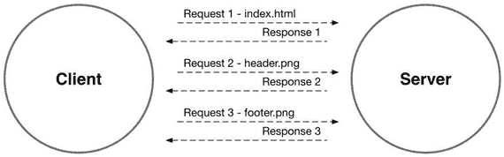
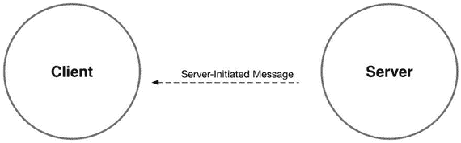
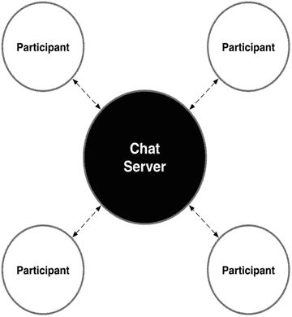
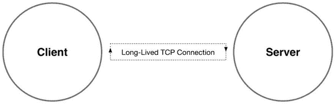
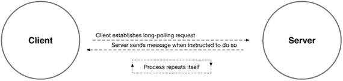
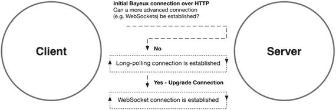
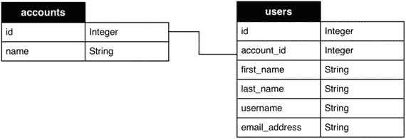
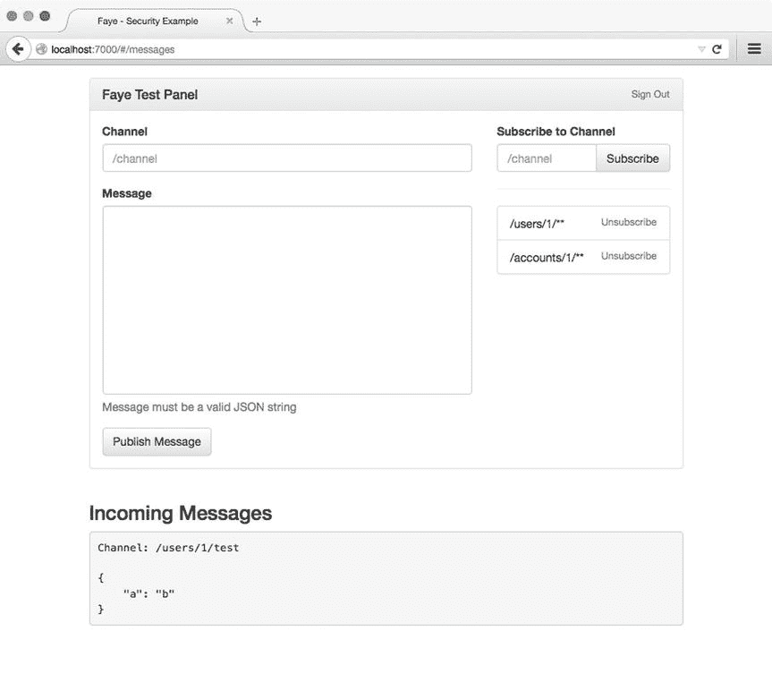

# 13.王菲

网上报价的问题是你永远无法确定它们是否真实可信。—亚伯拉罕·林肯

近年来，基于 web 的应用程序变得越来越复杂，这在很大程度上要归功于现代 Web 开发技术的广泛采用，如 HTML5、WebSockets 和新标准化的 JavaScript APIs(如地理定位、Web 存储和 Web 音频)。曾经是传统桌面应用程序专属领域的功能已经在浏览器中找到了新家，允许 web 开发人员创建仅在短短几年前还不可能实现的应用程序。

然而，随着 web 浏览器的不断成熟，Web 的基本协议 HTTP 已经开始显示出老化的迹象。它实现的简单的“请求-响应”通信模式(其中客户端(例如，web 浏览器)从服务器请求资源并接收响应作为回报)不再解决当今许多最具创新性的 web 应用程序寻求解决的问题的实时性。处理快速变化的数据的应用程序(例如多人游戏、社交网站和聊天室)强烈需要执行通常称为“数据推送”的功能，即启动从服务器到客户端的通信。

正如网络浏览器已经成熟一样，用户的期望也越来越高。那些只在用户需要时才提供信息的 Web 应用程序会很快发现自己被更主动的替代方法边缘化，这些替代方法会在用户感兴趣的事件发生时通知用户。

在本章中，我们将探索 Faye，一个 Node.js 的库和一个浏览器，它为开发人员提供了一个健壮的工具集，用于构建依赖于接近实时通信的应用程序。涵盖的主题包括

*   HTTP、Bayeux 和 WebSockets
*   通过 Faye 经由发布-订阅(PubSub)通道进行通信
*   开发 Faye 扩展
*   管理安全性

## HTTP、Bayeux 和 WebSockets

HTTP 被称为“请求-响应”协议，因为它允许客户端从服务器请求资源并接收响应。该协议也被描述为“无状态的”，因为这些消息对中的每一个都独立于其他消息对运行；没有跨请求维护“状态”(即内存)。这个概念如图 [13-1](#Fig1) 所示。

图 13-1。

HTTP is a stateless, request-response protocol

HTTP 最大的优势是它所支持的直观的交流模式，这使得网络发展到今天的巨大成功。不幸的是，协议的简单性也带来了很高的成本，因为它在解决事件驱动的消息传递的双向、异步本质方面远远不够。

举例来说，想象一个场景，其中多个用户正在参与一个聊天室(见图 [13-2](#Fig2) )。当其他成员发布新消息时，每个用户都需要得到通知，但是 HTTP 的请求-响应特性未能解决如何将来自服务器级的此类事件传递给客户端，如图 [13-3](#Fig3) 所示。

图 13-3。

HTTP does not allow a server to initiate communication with a client in this manner

图 13-2。

An event-driven messaging platform, in which users must be notified as soon as new messages are posted by fellow participants

### 求转发到

与 HTTP 不同，WebSocket 协议的目的是允许浏览器与远程服务器建立全双工(双向)的长期 TCP 连接(见图 [13-4](#Fig4) )。该协议于 2011 年标准化(RFC 6455 ),现在在大多数流行的 web 浏览器的最新版本中享有广泛的支持。因此，支持浏览器现在可以以真正异步的方式与服务器通信(假设那些服务器被配置为支持这种连接)。清单 [13-1](#FPar1) 中显示了一个演示 WebSocket API 用法的简单示例。

图 13-4。

The WebSocket Protocol allows clients to establish a long-lived connection with a remote server, with which messages may be passed in both directions Listing 13-1\. Simple Example Demonstrating the Use of the WebSocket API Within the Browser

`var connection = new WebSocket('ws://domain.com/app');`

`// The connection has been established`

`connection.onopen = function() {`

`connection.send('Hello, world.');`

`};`

`// A message has been received from the server`

`connection.onmessage = function(e) {`

`console.log('Incoming message', e);`

`};`

随着 WebSocket 协议的引入，Web 翻开了激动人心的新篇章，在这一篇章中，实时消息传递成为可能。然而，重要的是要记住，该协议确实有其局限性——这些局限性乍一看并不明显。这些限制将在关于 Bayeux 协议的下一节中更详细地讨论。

### 《贝叶议定书》

早在浏览器对 WebSockets 的广泛支持到来之前，Dojo Foundation 的开发人员就已经开始合作解决通过 HTTP 实现异步、事件驱动的消息传递的问题。其结果是一个被称为 Bayeux 协议的创新解决方案，至今仍有重要影响。

Bayeux 通过使用一种称为“长轮询”的技术，在标准 HTTP 请求上实现了低延迟、事件驱动的消息传递。使用这种方法，客户端向远程服务器提交一个 HTTP 请求，然后远程服务器无限期地挂起该请求，而不是立即返回一个响应(在标准 HTTP 事务中会发生这种情况)。当服务器保持这个打开的连接时，它等待被通知需要转发到客户端的任何消息。当消息到达时，服务器将消息转发给客户端并关闭连接。随后，客户端立即建立另一个到服务器的长轮询连接，此时该过程重复进行(见图 [13-5](#Fig5) )。

图 13-5。

Asynchronous messaging over HTTP, made possible by Bayeux’s use of long-polling

既然 WebSockets 得到了广泛的支持，你可能想知道为什么本章要讨论一个看似过时的概念，比如 Bayeux 协议。事实证明，贝叶并不像你最初认为的那样过时。尽管 WebSockets 很棒，但它们仍然有其局限性 Bayeux 恰好特别擅长解决这些局限性。

#### 网络挑战

尽管大多数流行的 web 浏览器的最新版本现在都支持 WebSockets，但并不总是能保证客户端和服务器之间的成功连接。WebSocket 协议旨在支持的长期连接与 Web 最初建立时所基于的短期“请求-响应”连接有很大不同，为了使这些连接正常工作，必须正确配置在客户端和服务器之间转发信息的各种网络和代理服务器。没有听说过配置不当的代理服务器会完全阻止这种连接，或者在长时间不使用时毫无警告地丢弃它们。

Bayeux，这一章的主题 Faye 所依赖的协议，从一开始就被设计得非常超前。尽管 Bayeux 最初被设计为通过长轮询 HTTP 连接将异步消息传递引入 Web，但该协议还支持在可能的情况下将这些连接“升级”到更高效、更现代的标准(见图 [13-6](#Fig6) )。这种行为的结果是，基于 Bayeux 的服务器能够将异步消息传递带到 Web 上，即使浏览器或网络限制试图从中作梗。

图 13-6。

Bayeux connections are established via HTTP and upgraded when possible

#### 传统浏览器支持

如前所述，WebSockets 现在在所有主流浏览器的最新版本中享有广泛的支持。根据应用程序的需要，您可能需要为不符合最新标准的浏览器提供支持。Bayeux 协议对标准 HTTP 连接的依赖(可能的话会升级)允许您这样做。

#### 掉线和错过的消息

WebSocket 协议没有提供内置的支持来检测在服务中断的情况下可能丢失了什么(如果有的话)消息。另一方面，基于 Bayeux 的服务器能够在服务中断时保留消息。一旦客户端能够成功地重新建立连接，服务器就可以转发这些消息，从而防止重要消息在此过程中丢失。

#### 关注渠道而非插座

WebSocket API 为开发人员提供了一个简单、定义明确的接口，用于在客户机和服务器之间建立套接字连接，以及在它们之间发送消息(如下一节所述)。但是，它没有为管理这些交互提供任何更高层次的抽象。Faye 采取了另一种方法，选择为用户提供一个通过发布-订阅(PubSub)通道进行交互的界面，同时完全隐藏网络层的内部工作方式。因此，Faye 能够透明地支持许多不同的连接方案，而无需在应用层进行任何更改。

## Faye 入门

Faye 包含两个不同的库:一个用于服务器(Node.js ),一个用于浏览器。在我们继续之前，让我们看看在服务器级安装和配置 Faye 的基本步骤。

以下示例演示了如何在现有 Node.js 项目中通过 npm 从命令行安装 Faye:

`$ npm install faye --save`

Faye 与 Node 内置的`http`和`https`模块协同工作，创建一个能够接受连接的端口。清单 [13-2](#FPar2) 展示了这一过程。在这个例子中，创建了一个 web 服务器，为我们项目的`public`文件夹中的静态文件提供服务。然后创建一个新的 Faye 实例并附加到这个服务器上，允许客户端在同一个端口上连接到 web 服务器和 Faye。

Listing 13-2\. Initializing Faye Within Node.js

`// faye-starter/lib/server.js`

`var faye = require('faye');`

`var http = require('http');`

`var express = require('express');`

`var app = express();`

`var server = http.createServer(app);`

`// Creating a new instance of Faye`

`var bayeux = new faye.NodeAdapter({`

`'mount': '/faye' // The path at which Faye can be reached`

`});`

`// Attaching Faye to the web server instance we have already created`

`bayeux.attach(server);`

`// Serving static files out of our project’s `/public` folder`

`app.use('/', express.static(__dirname + '/../public'));`

`// Our web server and Faye are both reachable at port 7000`

`server.listen(7000);`

现在我们的服务器已经准备好接受连接，我们可以继续在浏览器中配置 Faye(见清单 [13-3](#FPar3) )。我们首先创建一个脚本标签来加载 Faye 的客户端库(`client.js`)，它位于我们在清单 [13-2](#FPar2) 中指定的挂载路径下。接下来，我们创建一个新客户机，并将其配置为连接到挂载路径。

Listing 13-3\. Configuring Faye Within the Browser

`// faye-starter/public/index.html`

`<!DOCTYPE html>`

`<html lang="en">`

`<head>`

`<meta charset="utf-8">`

`<meta http-equiv="X-UA-Compatible" content="IE=edge">`

`<meta name="viewport" content="width=device-width, initial-scale=1">`

`<title>Faye - Starter Example</title>`

`</head>`

`<body>`

``

`</body>`

`</html>`

## 发布订阅消息

Faye 强调使用发布-订阅(PubSub)主题通道，而不是向开发人员提供直接与套接字连接交互的 API。要查看这个过程的运行情况，请重新访问清单 [13-2](#FPar2) (我们配置服务器的例子)并添加清单 [13-4](#FPar4) 中所示的代码。通过添加这段代码，我们指示我们的服务器每两秒钟向`/numbers`通道发布一个随机数。

Listing 13-4\. Publishing a Message to the `/numbers` Channel Every Two Seconds

`// faye-starter/lib/server.js`

`setInterval(function() {`

`// Pass a topic channel, along with a payload of data`

`bayeux.getClient().publish('/numbers', {`

`'number': Math.floor((Math.random() * 100) + 1)`

`});`

`}, 2000);`

现在重新看看清单 [13-3](#FPar3) 中显示的例子，其中我们配置了 Faye 以便在浏览器中使用。清单 [13-5](#FPar5) 显示了这个例子的更新版本，其中我们订阅了`/numbers`频道。当消息被接收时，它们的内容被附加到 DOM 中。还要注意，当我们创建这个订阅时，我们会收到一个带有`cancel()`方法的对象，允许我们随时取消订阅这个频道。在继续之前，花几分钟时间通过运行`faye-starter`文件夹中的`npm start`来看看这个例子。

Listing 13-5\. Listening for Messages on the `/numbers` Channel from Within the Browser

`// faye-starter/public/index.html`

`<!DOCTYPE html>`

`<html lang="en">`

`<head>`

`<meta charset="utf-8">`

`<meta http-equiv="X-UA-Compatible" content="IE=edge">`

`<meta name="viewport" content="width=device-width, initial-scale=1">`

`<title>Faye - Starter Example</title>`

`</head>`

`<body>`

`<a href="#" id="cancelbt">Cancel Subscription to `/numbers` channel</a>`

`<ul id="container"></ul>`

``

``

`</body>`

`</html>`

在清单 [13-4](#FPar4) 中，我们看到了如何在服务器级别发布消息的演示。客户端可以发布自己的消息的过程几乎以完全相同的方式工作。清单 [13-6](#FPar6) 中显示的例子演示了从基于浏览器的客户端向`/foo`通道发送`Hello, world`消息。

Listing 13-6\. Publishing a Message from the Browser

`client.publish('/foo', {`

`'text': 'Hello, world.'`

`}).then(function() {`

`// Message was received by server`

`});`

### 通配符频道

除了能够订阅特定通道上的消息，Faye 客户端还可以通过向`subscribe()`方法传递一个通配符模式来订阅多个通道，如清单 [13-7](#FPar7) 所示。

Listing 13-7\. Using Wildcard Syntax to Subscribe to Multiple Channels Matching a Specified Pattern

`/**`

`* Subscribes the client to a single channel segment. Messages received`

`* on any channel that exists directly beneath `/foo` will be logged.`

`*/`

`client.subscribe('/foo/*', function(message) {`

`console.log('Message received', message);`

`});`

`/**`

`* Subscribes the client to *all* channel segments beneath `/foo`.`

`*/`

`client.subscribe('/foo/**', function(message) {`

`console.log('Message received', message);`

`});`

Faye 对通配符通道的支持提供了几种有趣的可能性，包括创建专用于特定用户(或用户组)的命名空间主题通道。例如，假设一个应用程序以类似于图 [13-7](#Fig7) 所示的方式组织其用户。

图 13-7。

An application in which multiple users are grouped under a parent account

在这个应用程序中，每个用户都属于一个父帐户(可以有多个用户)。给定这种结构，很容易想象这样一种场景:我们可能希望向特定用户或特定帐户中的所有用户发布消息。借助通配符订阅和命名空间通道，我们可以轻松实现这个目标。

本章包含的`faye-security`项目(见图 [13-8](#Fig8) )建立在几个之前讨论过的主题(AngularJS、Knex 和 Bookshelf)之上，创建一个允许注册用户登录并测试 Faye 功能的各个方面的应用程序——包括通配符订阅和命名空间通道的使用。

图 13-8。

After signing in, users are presented with a view that allows them to manage channel subscriptions and to publish messages

当提交该应用程序的登录表单时，会向服务器发出一个请求，要求验证用户提供的用户名和密码。如果该请求成功，服务器将返回一个包含授权用户信息的对象，包括一个将用于验证所有未来请求的令牌。清单 [13-8](#FPar8) 中显示了`/login`路线的角度控制器(负责提出该请求)的摘录。

Listing 13-8\. A Token is Returned After a Successful Login Attempt

`// faye-security/public/app.js (excerpt)`

`$scope.login = function() {`

`if (!$scope.loginForm.$valid) return;`

`$http.post('/api/auth', $scope.model)`

`.then(function(result) {`

`$.cookie('token', result.data.token, { 'path': '/' });`

`$location.path('/messages');`

`})`

`.catch(function(err) {`

`alert('Unable to sign in. Please try again.');`

`});`

`};`

此外，`/messages`路由的控制器将自动为用户创建两个通配符订阅，如清单 [13-9](#FPar9) 所示。

Listing 13-9\. Angular Controller for the `/messages` Route Creates Two Subscriptions Using Faye’s Wildcard Syntax

`// faye-security/public/app.js (excerpt)`

`// Subscribe to channels pertaining to the user’s account`

`faye.client.subscribe('/accounts/' + me.account_id + '/**');`

`// Subscribe to channels pertaining directly to the user`

`faye.client.subscribe('/users/' + me.id + '/**');`

这些订阅将允许我们将消息发布给该用户帐户中的每个人(以及直接发布给用户)，方法是将这些消息定向到适当前缀的频道。清单 [13-10](#FPar10) 展示了这个过程的运行。

Listing 13-10\. A Message is Published to Each Available Account Every Ten Seconds by the Server

`// faye-security/lib/server.js (excerpt)`

`setInterval(function() {`

`db.models.Account.where({}).fetchAll().then(function(accounts) {`

`accounts.forEach(function(account) {`

`bayeux.getClient().publish(_.sprintf('/accounts/%s/random', account.id), {`

`'account': account.toJSON()`

`});`

`});`

`});`

`}, 10000);`

#### 用扩展实现安全性

默认情况下，Faye 对客户端允许与哪些通道进行交互没有任何限制。这可能会有问题，原因显而易见:如果没有额外的安全措施，没有什么可以阻止用户与其他用户的频道进行交互。幸运的是，在 Faye 对扩展的支持的帮助下，我们可以很容易地将这些安全措施落实到位。

Faye 提供了一个简单的 API 来创建扩展，这些扩展可以在消息在客户机和服务器之间移动时拦截和(可选地)修改消息。这种扩展既可以在服务器上创建，也可以在浏览器中创建。无论它们是在哪里创建的，过程都是相同的。清单 [13-11](#FPar11) 展示了一个简单的 Faye 扩展的例子。

Listing 13-11\. Simple Faye Extension That Logs All Incoming and Outgoing Messages to the Console

`client.addExtension({`

`'incoming': function(message, callback) {`

`console.log('Incoming message', message);`

`callback(message);`

`},`

`'outgoing': function(message, callback) {`

`console.log('Outgoing message', message);`

`callback(message);`

`}`

`});`

现在我们已经看到了一个简单的 Faye 扩展是什么样子，让我们将这个概念应用到本章包含的示例 web 应用程序中。回头参考清单 [13-9](#FPar9) 并注意这样一个事实:在用户登录后，一个允许我们授权后续请求的令牌作为 cookie 存储在用户的浏览器中。现在参考清单 [13-12](#FPar12) ，它展示了应用程序如何将这些信息集成到 Faye 扩展中。

Listing 13-12\. A Faye Extension Is Created That Automatically Appends the User’s Token to All Outgoing Messages

`// faye-security/public/app.js (excerpt)`

`client.addExtension({`

`'outgoing': function(message, callback) {`

`message.ext = message.ext || {};`

`message.ext.token = $.cookie('token');`

`callback(message);`

`}`

`});`

清单 [13-12](#FPar12) 中显示的 Faye 扩展就绪后，所有传出的消息，包括订阅请求，都会自动附加上用户的令牌。我们可以通过在服务器上创建相应的扩展来利用这个事实，如清单 [13-13](#FPar13) 所示。

Listing 13-13\. Server-side Faye Extension That Rejects Subscription Requests to Secure Channels when the Appropriate Credentials Are Not Provided

`// faye-security/lib/faye-extensions/auth.js`

`var db = require('../db');`

`module.exports = function(bayeux) {`

`bayeux.addExtension({`

`'incoming': function(message, callback) {`

`if (message.channel !== '/meta/subscribe') return callback(message);`

`var token = message.ext && message.ext.token;`

`var segments = message.subscription.split('/');`

`switch (segments[1]) {`

`case 'accounts':`

`db.models.User.where({`

`'token': token,`

`'account_id': segments[2]`

`}).fetch({`

`'require': true`

`}).then(function(user) {`

`return callback(message);`

`}).catch(function(err) {`

`message.error = 'Permission denied.';`

`return callback(message);`

`});`

`break;`

`case 'users':`

`db.models.User.where({`

`'token': token,`

`'id': segments[2]`

`}).fetch({`

`'require': true`

`}).then(function(user) {`

`return callback(message);`

`}).catch(function() {`

`message.error = 'Permission denied.';`

`return callback(message);`

`});`

`break;`

`default:`

`return callback(message);`

`break`

`}`

`}`

`});`

`};`

当服务器在`/meta/subscribe`通道上收到消息时，清单 [13-13](#FPar13) 中所示的扩展检查指定的通道是否属于我们的安全名称空间之一(`/accounts`或`/users`)。如果是，扩展会检查令牌是否存在，并使用该信息从数据库中查找相应的用户。如果找到匹配，则允许消息继续发送。否则，由于将`error`属性分配给消息，订阅将被拒绝。

## 摘要

在本章中，您已经熟悉了许多概念，这些概念允许您在基于浏览器的应用程序中实现接近实时的通信。您成功地在服务器和浏览器上安装和配置了 Faye。您发现了 Faye 如何通过使用发布-订阅主题通道来促进客户机之间的消息传递。然后，通过使用命名空间通道和通配符订阅，您将这个概念向前推进了一步。您还了解了如何扩展 Faye，允许您监视、修改和(可选地)拒绝在客户机和服务器之间传递的消息。

根据我们的经验，在 Web 上实现异步的、事件驱动的通信的最佳方法包括一个利用 WebSockets 的计划，有适当的后备解决方案，并在上面提供一个方便的抽象层，它不会强迫您考虑网络层。Faye 通过将 WebSockets 的速度和效率与 Bayeux 协议的稳定性结合起来，很好地满足了这些需求，从而创建了一种坚如磐石的方法来实现 Web 上的异步、事件驱动的通信。

## 相关资源

*   Faye: [`http://faye.jcoglan.com/`](http://faye.jcoglan.com/)
*   [`http://dojofoundation.org/` 【T2 道场基础】](http://dojofoundation.org/)
*   [`http://svn.cometd.org/trunk/bayeux/bayeux.html`](http://svn.cometd.org/trunk/bayeux/bayeux.html) 贝叶协议