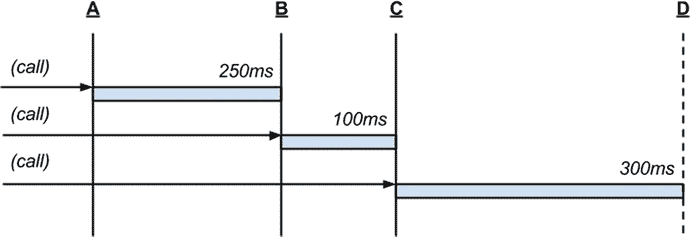
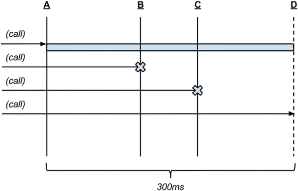

# 十六、Underscore 和 Lodash

你必须是那种能把事情做好的人。但是要把事情做好，你必须热爱做的过程，而不是次要的结果。—安·兰德

JavaScript 是一种实用的工具语言，由于其简单的 API 和稀疏的类型系统，它在很大程度上非常有用。这是一种容易学习和掌握的语言，因为它的表面积很小。虽然这一特性非常有助于提高生产率，但遗憾的是，这意味着 JavaScript 类型在历史上一直缺乏使语言更强大的高级特性，例如集合和散列的原生函数迭代构造。

为了填补这一空白，Jeremy Ashkenas 在 2009 年创建了一个名为 Underscore.js 的库，其中包含 100 多个用于操作、过滤和转换散列和集合的函数。这些函数中的许多，比如`map()`和`reduce()`，包含了函数式语言中常见的概念。其他的，像`isArguments()`和`isUndefined()`是特定于 JavaScript 的。

随着 Underscore 在许多 web 应用中变得无处不在，发生了两件令人兴奋的事情。首先，ECMAScript 5 规范在同一年发布。它在原生 JavaScript 对象上有许多类似 Underscore 的方法，比如`Array.prototype.map()`、`Array.prototype.reduce()`和`Array.isArray()`。虽然 ECMAScript 5(以及 ECMAScript 6 和 7)扩展了几个关键类型的 API，但它只包含了 Underscore. js 提供的一小部分功能。

其次，Underscore 被引入了一个名为 Lodash 的新项目，目标是显著提高性能并扩展其 API。因为 Lodash 在添加自己的函数的同时实现了所有的 Underscore 函数，所以 Underscore 是 Lodash 的子集。所有相应的 ECMAScript 规范函数也是 Lodash 的一部分。清单 [16-1](#FPar2) 中的表格显示了映射到其本地 ECMAScript 对应物的 Underscore 和 Lodash 函数。

表 16-1。

Underscore and Lodash Functions Compared to Current (and Proposed) Native JavaScript Implementations

<colgroup><col> <col></colgroup> 
| ECMAScript 5 | Underscore/Lodash |
| --- | --- |
| `Array.prototype.every()` | `all()` / `every()` |
| `Array.prototype.filter()` | `select()` / `filter()` |
| `Array.prototype.forEach()` | `each()` / `forEach()` |
| `Array.isArray()` | `isArray()` |
| `Object.keys()` | `keys()` |
| `Array.prototype.map()` | `map()` |
| `Array.prototype.reduce()` | `inject()` / `foldl()` / `reduce()` |
| `Array.prototype.reduceRight()` | `foldr()` / `reduceRight()` |
| `Array.prototype.some()` | `some()` |
| ECMAScript 6 | Underscore/Lodash |
| `Array.prototype.find()` | `find()` |
| `Array.prototype.findIndex()` | `findIndex()` |
| `Array.prototype.keys()` | `keys()` |
| ECMAScript 7 | Underscore/Lodash |
| `Array.prototype.contains()` | `include()` / `contains()` |

因为 Underscore 和 Lodash 共享一个 API，所以 Lodash 可以作为 Underscore 的替代。然而，反过来就不一定了，因为 Lodash 提供了额外的功能。例如，虽然 Underscore 和 Lodash 都有一个`clone()`方法，但是只有 Lodash 实现了一个`cloneDeep()`方法。由于这些额外的特性，开发人员通常选择 Lodash 而不是 Underscore，但是性能优势也是有形的。根据逐个函数的性能基准测试，Lodash 比 Underscore 平均快 35%。对于`forEach()`、`map()`、`reduce()`等函数，它通过支持简单循环而不是本地委托来实现这种性能提升。

本章主要关注还没有(或计划要)在 JavaScript 中实现的 Underscore 和 Lodash 的特性(清单 [16-1](#FPar2) 和清单 [16-2](#FPar3) 中的函数)。Mozilla 的优秀文档涵盖了每个本机函数，Underscore 和 Lodash API 文档也涵盖了它们的每个实现。

但是 Underscore 和 Lodash 为对象和集合提供的不仅仅是一些方便的函数，其中一些将在本章中探讨。

Note

为简洁起见，本章的其余部分仅提及 Underscore，但是要理解，除非另有说明，Underscore 和 Lodash 是可以互换的。

## 安装和使用

Underscore 可以作为库直接导入 web 浏览器或任何服务器端 JavaScript 环境，如 Node.js。它没有外部依赖性。

可以直接从 Underscore 网站( [`http://underscorejs.org`](http://underscorejs.org/) )下载 Underscore. js 脚本，或者用 npm、Bower、Component 之类的包管理器安装。

在浏览器中，您可以直接将 Underscore 作为脚本，或者使用 AMD 或 CommonJS 兼容的模块加载程序(如 RequireJS 或 Browserify)加载它。在 Node.js 中，这个包只是一个 CommonJS 模块。

访问 Underscore 对象(它的实用函数在其上)取决于库是如何加载的。当 Underscore 被加载到带有`script`标签的浏览器中时，库会将自己附加到`window._`上。对于模块加载器在任何环境下创建的变量，习惯上给模块分配实际的 Underscore 字符，如清单 [16-1](#FPar2) 所示。

Listing 16-1\. Loading the Underscore Library in a Node.js Module

`// example-001/index.js`

`'use strict';`

`var _ = require('underscore');`

`console.log(_.VERSION);`

`// 1.8.2`

所有 Underscore 函数都存在于`_`(“Underscore”)对象中。因为 Underscore 是一个工具库，除了一些设置之外，它不保存任何状态(但是我们将在本章后面详细介绍)。所有函数都是幂等的，这意味着多次向任何函数传递一个值都会产生相同的结果。一旦加载了 Underscore 对象，就可以立即使用它。

Underscore 的实用函数主要作用于集合(数组和类似数组的对象，如参数)、对象文字和函数。Underscore 最常用于过滤和转换数据。许多 Underscore 功能相互补充，可以协同工作以创建强大的组合。因为这非常有用，所以 Underscore 内置了对函数链的支持，函数链可以创建简洁的管道，一次对数据应用多种转换。

## 聚合和索引

集合中的数据片段通常共享相似的模式，但具有使每个模式都唯一的标识属性。在一组数据中区分这两种类型的关系(共性和个性)有助于快速筛选和处理与聚合标准匹配的对象子集。

Underscore 有许多执行这些任务的函数，但是在处理集合时，有三个特定的函数非常有用:`countBy()`、`groupBy()`和`indexBy()`。

### 计数比()

对具有某些共同特征的对象进行计数是归纳数据的一种常用方法。给定一个 URL 集合，可以设想一些分析过程来确定有多少 URL 属于特定的顶级域(例如。com，。组织，。edu 等。).Underscore 的`countBy()`函数是这项任务的理想候选函数。它对数组中的每个元素调用回调，以确定元素属于哪个类别(在本例中，URL 属于哪个顶级域)。回调返回一些表示这个类别的字符串值。最终结果是一个对象，其中的键表示从回调返回的所有类别，数字计数表示属于每个类别的元素数量。清单 [16-2](#FPar3) 展示了一个原始实现，它产生一个计数为 2 的对象。org 域名和一个。com 域。

Listing 16-2\. Counting Elements by Some Criteria

`// example-002/index.js`

`'use strict';`

`var _ = require('underscore');`

`var urls = [`

`'`[`http://underscorejs.org`](http://underscorejs.org/)T2】

`'`[`http://lodash.com`](http://lodash.com/)T2】

`'`[`http://ecmascript.org`](http://ecmascript.org/)T2】

`];`

`var counts = _.countBy(urls, function byTLD(url) {`

`if (url.indexOf('.com') >= 0) {`

`return '.com';`

`}`

`if (url.indexOf('.org') >= 0) {`

`return '.org';`

`}`

`return '?';`

`});`

`console.log(counts);`

`// { '.org': 2, '.com': 1 }`

如果集合中的项目是具有属性的对象，并且特定属性的值表示要计数的数据，则不需要迭代器函数。要测试的属性的名称可以作为替代。注意，在清单 [16-3](#FPar4) 中，最终结果中的键将是每个对象上检查的属性值。

Listing 16-3\. Counting Elements by Some Property

`// example-003/index.js`

`'use strict';`

`var _ = require('underscore');`

`var urls = [`

`{scheme: 'http', host: 'underscorejs', domain: '.org'},`

`{scheme: 'http', host: 'lodash', domain: '.com'},`

`{scheme: 'http', host: 'ecmascript', domain: '.org'},`

`];`

`var counts = _.countBy(urls, 'domain');`

`console.log(counts);`

`// { '.org': 2, '.com': 1 }`

如果集合中的一个或多个对象缺少要测试的属性，最终的结果对象将包含一个`undefined`键，并与这些对象的数量成对出现。

### groupby(群件)

Underscore 的`groupBy()`功能类似于`countBy()`，但是`groupBy()`没有将结果减少为数字计数，而是将元素放入结果对象的分类集合中。清单 [16-4](#FPar5) 中的 URL 对象分别被放入每个相应顶级域名的集合中。

Listing 16-4\. Grouping Elements by Some Property

`// example-004/index.js`

`'use strict';`

`var _ = require('underscore');`

`var urls = [`

`{scheme: 'http', host: 'underscorejs', domain: '.org'},`

`{scheme: 'http', host: 'lodash', domain: '.com'},`

`{scheme: 'http', host: 'ecmascript', domain: '.org'},`

`];`

`var grouped = _.groupBy(urls, 'domain');`

`console.log(grouped);`

`/*`

`{`

`'.org': [`

`{ scheme: 'http', host: 'underscorejs', domain: '.org' },`

`{ scheme: 'http', host: 'ecmascript', domain: '.org' }`

`],`

`'.com': [`

`{ scheme: 'http', host: 'lodash', domain: '.com' }`

`]`

`}`

`*/`

Note

如果需要更大程度的控制来对元素进行分类，那么`groupBy()`函数也可以使用迭代器函数作为它的第二个参数(而不是属性名)。

值得一提的是，通过简单地查询每个分组数组的长度，可以容易地从分组对象中导出计数。根据应用环境，分组可能比计数更有利。清单 [16-5](#FPar7) 展示了如何获得一组分组数据的计数，以及从`groupBy()`结果创建计数对象的函数。

Listing 16-5\. Deriving Counts from Grouped Objects

`// example-005/index.js`

`'use strict';`

`var _ = require('underscore');`

`var urls = [`

`{scheme: 'http', host: 'underscorejs', domain: '.org'},`

`{scheme: 'http', host: 'lodash', domain: '.com'},`

`{scheme: 'http', host: 'ecmascript', domain: '.org'},`

`];`

`var grouped = _.groupBy(urls, 'domain');`

`var dotOrgCount = grouped['.org'].length;`

`console.log(dotOrgCount);`

`// 2`

`function toCounts(grouped) {`

`var counts = {};`

`for (var key in grouped) {`

`if (grouped.hasOwnProperty(key)) {`

`counts[key] = grouped[key].length;`

`}`

`}`

`return counts;`

`}`

`console.log(toCounts(grouped));`

`// { '.org': 2, '.com': 1 }`

### indexBy()

识别集合中数据之间的差异也很有用，尤其是当这些差异可以作为唯一标识符时。根据已知的标识符从集合中找出单个对象是一个非常常见的场景。如果手动完成，这将需要遍历集合中的每个元素(可能用一个`while`或`for`循环)并返回第一个拥有匹配的惟一标识符的元素。

假设有一个航空公司网站，客户在上面选择出发机场和目的地机场。用户通过下拉菜单选择每个机场，然后显示每个机场的附加数据。这些附加数据是从数组中的 airport 对象加载的。在每个下拉菜单中选择的值是唯一的机场代码，应用将使用这些代码来查找完整、详细的机场对象。

幸运的是，创建这个应用的开发人员使用 Underscore 的`indexBy()`函数从`airports`数组创建了一个索引对象，如清单 [16-6](#FPar8) 所示。

Listing 16-6\. Indexing Objects by Property

`// example-006/index.js`

`'use strict';`

`var _ = require('underscore');`

`var airports = [`

`{code: 'STL', city: 'St Louis', timeZone: '-6:00'},`

`{code: 'SEA', city: 'Seattle', timeZone: '-8:00'},`

`{code: 'JFK', city: 'New York', timeZone: '-5:00'}`

`];`

`var selected = 'SEA';`

`var indexed = _.indexBy(airports, 'code');`

`console.log(indexed);`

`/*`

`{`

`STL: {code: 'STL', city: 'St Louis', timeZone: '-6:00'},`

`SEA: {code: 'SEA', city: 'Seattle', timeZone: '-8:00'},`

`JFK: {code: 'JFK', city: 'New York', timeZone: '-5:00'}`

`}`

`*/`

`var timeZone = indexed[selected].timeZone;`

`console.log(timeZone);`

`// -8:00`

`indexBy()`函数的行为有点像`groupBy()`，除了每个对象都有一个索引属性的唯一值，所以最终结果是一个对象，其键(必须是唯一的)是每个对象的指定属性的值，其值是拥有每个属性的对象。在清单 [16-6](#FPar8) 中，`indexed`对象的键是每个机场代码，值是相应的机场对象。

将索引对象与相对稳定的引用数据一起保存在内存中是一项基本的缓存实践。这导致了一次性的性能损失(索引过程)，以避免多次迭代损失(每次需要一个对象时都必须遍历数组)。

## 挑剔

开发人员经常从集合和对象中提取想要的数据，或者省略不想要的数据。这样做可能是为了易读性(当数据将被显示给用户时)，为了性能(当数据将通过网络连接发送时)，为了隐私(当从对象或模块的 API 返回的数据应该是稀疏的时)，或者为了一些其他目的。

### 从集合中选择数据

Underscore 有许多实用函数，可以根据某些标准从对象集合中选择一个或多个元素。在某些情况下，这个标准可能是一个函数，它评估每个元素并返回 true 或 false(元素是否“通过”标准测试)。在其他情况下，标准可以是将与每个元素(或每个元素的一部分)进行相等比较的一位数据，其成功或失败决定了元素是否“匹配”所使用的标准。

#### 过滤器( )

`filter()`函数使用标准函数方法。给定一个元素数组和一个函数，`filter()`将函数应用于每个元素，并返回一个只包含通过标准测试的元素的数组。在清单 [16-7](#FPar9) 中，一组扑克牌被过滤，因此只返回黑桃。

Listing 16-7\. Filtering an Array with a Criteria Function

`// example-007/index.js`

`'use strict';`

`var _ = require('underscore');`

`var cards = [`

`{suite: 'Spades', denomination: 'King'},`

`{suite: 'Hearts', denomination: '10'},`

`{suite: 'Clubs', denomination: 'Ace'},`

`{suite: 'Spades', denomination: 'Ace'},`

`];`

`var filtered = _.filter(cards, function (card) {`

`return card.suite === 'Spades';`

`});`

`console.log(filtered);`

`/*`

`[`

`{ suite: 'Spades', denomination: 'King' },`

`{ suite: 'Spades', denomination: 'Ace' }`

`]`

`*/`

#### 哪里( )

`where()`函数与`filter()`相似，但使用比较标准方法。它的第一个参数是一个对象数组，但它的第二个参数是一个 criteria 对象，它的键和值将与数组中每个元素的键和值进行比较。如果一个元素包含 criteria 对象中的所有键和相应的值(使用严格相等)，该元素将被包含在由`where()`返回的数组中。

在清单 [16-8](#FPar10) 中，一组棋盘游戏对象被一个指定最小玩家数量和游戏时间的对象过滤。疫情被排除在外，因为它与 criteria 对象的`playTime`值不匹配，尽管它与`minPlayer`值匹配。

Listing 16-8\. Filtering an Array by Criteria Comparison

`// example-008/index.js`

`'use strict';`

`var _ = require('underscore');`

`var boardGames = [`

`{title: 'Ticket to Ride', minPlayers: 2, playTime: 45},`

`{title: 'Pandemic', minPlayers: 2, playTime: 60},`

`{title: 'Munchkin Deluxe', minPlayers: 2, playTime: 45}`

`];`

`var filtered = _.where(boardGames, {`

`minPlayers: 2,`

`playTime: 45`

`});`

`console.log(filtered);`

`/*`

`[`

`{ title: 'Ticket to Ride', minPlayers: 2, playTime: 45 },`

`{ title: 'Munchkin Deluxe', minPlayers: 2, playTime: 45 }`

`]`

`*/`

#### find()和 findWhere()

`filter()`和`where()`函数总是返回集合。如果没有对象通过标准测试，则每个对象都返回一个空集。开发人员可以使用这些函数在集合中查找单个对象(例如，通过某个唯一标识符)，但随后必须使用索引零从结果数组中找出该对象。幸运的是，Underscore 提供了补充`filter()`和`where()`的`find()`和`findWhere()`功能。它们各自返回第一个通过标准检查的对象，或者如果集合中没有对象通过，则返回`undefined`。在清单 [16-9](#FPar11) 中，一个集合被搜索了两次以寻找特定的条目。请注意，即使多个项目满足传递给`findWhere()`的`{what: 'Dagger'}`标准对象，也只会返回集合中的第一个匹配项。

Listing 16-9\. Finding a Single Item in a Collection

`// example-009/index.js`

`'use strict';`

`var _ = require('underscore');`

`var guesses = [`

`{who: 'Mrs. Peacock', where: 'Lounge', what: 'Revolver'},`

`{who: 'Professor Plum', where: 'Study', what: 'Dagger'},`

`{who: 'Miss Scarlet', where: 'Ballroom', what: 'Candlestick'},`

`{who: 'Reverend Green', where: 'Conservatory', what: 'Dagger'}`

`];`

`var result = _.find(guesses, function (guess) {`

`return guess.where === 'Ballroom';`

`});`

`console.log(result);`

`// { who: 'Miss Scarlet', where: 'Ballroom', what: 'Candlestick' }`

`result = _.findWhere(guesses, {what: 'Dagger'});`

`console.log(result);`

`// { who: 'Professor Plum', where: 'Study', what: 'Dagger' }`

### 从对象中选择数据

到目前为止，当应用不需要一部分数据时，Underscore 函数会将较大的集合过滤成较小的集合(甚至是单个对象)。对象也是数据的集合，由字符串键而不是有序数字索引；和数组一样，过滤单个对象中的数据也非常有用。

#### 拔毛( )

开发人员可以从集合中的每个对象获取属性值，方法是循环遍历每个元素并在数组中捕获所需的属性值，或者使用`Array.prototype.map()`(或 Underscore 的等价形式`map()`)。但是更快、更方便的选择是使用 Underscore 的`pluck()`函数，它将一个数组作为第一个参数，将从每个元素中提取的属性名作为第二个参数。在清单 [16-10](#FPar12) 中使用了`pluck()`函数来提取正面朝上的数字。然后将这些值相加(用`Array.prototype.reduce()`)以确定滚动的总值。

Listing 16-10\. Plucking Properties from Objects in a Collection

`// example-010/index.js`

`'use strict';`

`var _ = require('underscore');`

`var diceRoll = [`

`{sides: 6, up: 3},`

`{sides: 6, up: 1},`

`{sides: 6, up: 5}`

`];`

`var allUps = _.pluck(diceRoll, 'up');`

`console.log(allUps);`

`// [ 3, 1, 5 ]`

`var total = allUps.reduce(function (prev, next) {`

`return prev + next;`

`}, 0);`

`console.log(total);`

`// 9`

虽然`pluck()`对于从对象中选择单个属性非常有用，但是它只对集合进行操作，对于处理单个对象不是很有用。

#### 值( )

ECMAScript 5 规范在`Object`构造函数上引入了`keys()`函数，这是一个方便的工具，可以将任何对象文字的键转换成字符串数组。Underscore 有一个相应的`keys()`实现，但也有一个`values()`函数，遗憾的是，在本地 JavaScript 中没有对应的函数。`values()`函数用于从一个对象中提取所有的属性值，对于保存一组“常数”的对象或者作为另一种语言中的枚举来说，它无疑是最有价值的(老爸的笑话)。清单 [16-11](#FPar13) 展示了这个提取是如何发生的。

Listing 16-11\. Extracting Values from an Object Literal

`// example-011/index.js`

`'use strict';`

`var _ = require('underscore');`

`var BOARD_TILES = {`

`IND_AVE: 'Indiana Avenue',`

`BOARDWALK: 'Boardwalk',`

`MARV_GARD: 'Marvin Gardens',`

`PK_PLACE: 'Park Place'`

`};`

`var propertyNames = _.values(BOARD_TILES);`

`console.log(propertyNames);`

`// [ 'Indiana Avenue', 'Boardwalk', 'Marvin Gardens', 'Park Place' ]`

参考数据(例如，美国各州缩写和名称的散列)经常被一次检索和缓存。这些数据通常会通过键来解引用，以便可以提取一些特定的值，但有时不管键是什么，使用所有的值都是有用的，如清单 [16-12](#FPar14) 中的 Underscore 模板所示。(Underscore 模板将在本章稍后讨论，但是清单 [16-12](#FPar14) 应该足以让你掌握基本用法。)在`BOARD_TILES`散列(瓦片名称)中的每个值被呈现为无序列表中的列表项。钥匙是无关紧要的；只有值是重要的，这是`values()`函数的完美场景。

Listing 16-12\. Extracting Values from an Object Literal

`<!-- example-011/index.html -->`

`

`

``

``

#### 挑选( )

最后，为了将一个对象削减到其键和值的子集，开发人员可以使用 Underscore 的`pick()`函数。当传入一个目标对象和一个或多个属性名时，`pick()`将从目标返回另一个仅由这些属性(及其值)组成的对象。在清单 [16-13](#FPar15) 中，`name`和`numPlayers`属性是从带有`pick()`的棋盘游戏细节中提取出来的。

Listing 16-13\. Picking Properties from an Object Literal

`// example-012/index.js`

`'use strict';`

`var _ = require('underscore');`

`var boardGame = {`

`name: 'Settlers of Catan',`

`designer: 'Klaus Teuber',`

`numPlayers: [3, 4],`

`yearPublished: 1995,`

`ages: '10+',`

`playTime: '90min',`

`subdomain: ['Family', 'Strategy'],`

`category: ['Civilization', 'Negotiation'],`

`website: '`[`http://www.catan.com`](http://www.catan.com/)T2】

`};`

`var picked = _.pick(boardGame, 'name', 'numPlayers');`

`console.log(picked);`

`/*`

`{`

`name: 'Settlers of Catan',`

`numPlayers: [ 3, 4 ]`

`}`

`*/`

#### 省略( )

`pick()`的逆运算是`omit()`，它返回一个由除指定属性之外的所有属性组成的对象。属性`designer`、`numPlayers`、`yearPublished`、`ages`和`playTime`都从清单 [16-14](#FPar16) 中`omit()`创建的结果对象中删除。

Listing 16-14\. Omitting Properties from an Object Literal

`// example-013/index.js`

`'use strict';`

`var _ = require('underscore');`

`var boardGame = {`

`name: 'Settlers of Catan',`

`designer: 'Klaus Teuber',`

`numPlayers: [3, 4],`

`yearPublished: 1995,`

`ages: '10+',`

`playTime: '90min',`

`subdomain: ['Family', 'Strategy'],`

`category: ['Civilization', 'Negotiation'],`

`website: '`[`http://www.catan.com`](http://www.catan.com/)T2】

`};`

`var omitted = _.omit(boardGame, 'designer', 'numPlayers',`

`'yearPublished', 'ages', 'playTime');`

`console.log(omitted);`

`/*`

`{`

`name: 'Settlers of Catan',`

`subdomain: [ 'Family', 'Strategy' ],`

`category: [ 'Civilization', 'Negotiation' ],`

`website: '`[`http://www.catan.com`](http://www.catan.com/)T2】

`}`

`*/`

除了属性名之外，`pick()`和`omit()`都接受一个谓词来评估每个属性和值。如果谓词返回`true`，该属性将包含在结果对象中；如果它返回`false`，该属性将被排除。清单 [16-15](#FPar17) 中`pick()`的谓词将只为数组值向结果对象添加属性；在这种情况下，属性`numPlayers`、`subdomain`和`category`。

Listing 16-15\. Picking Properties from an Object Literal with a Predicate Function

`// example-014/index.js`

`'use strict';`

`var _ = require('underscore');`

`var boardGame = {`

`name: 'Settlers of Catan',`

`designer: 'Klaus Teuber',`

`numPlayers: [3, 4],`

`yearPublished: 1995,`

`ages: '10+',`

`playTime: '90min',`

`subdomain: ['Family', 'Strategy'],`

`category: ['Civilization', 'Negotiation'],`

`website: '`[`http://www.catan.com`](http://www.catan.com/)T2】

`};`

`var picked = _.pick(boardGame, function (value, key, object) {`

`return Array.isArray(value);`

`});`

`console.log(picked);`

`/*`

`{`

`numPlayers: [ 3, 4 ],`

`subdomain: [ 'Family', 'Strategy' ],`

`category: [ 'Civilization', 'Negotiation' ]`

`}`

`*/`

## 链接

Underscore 包含许多常用于创建数据转换管道的实用函数。为了开始一个链，一个对象或集合被传递给 Underscore 的`chain()`函数。这将返回一个链式包装器，在该包装器上可以流畅地调用许多 Underscore 函数，每个函数都组合了前面函数调用的效果。

清单 [16-16](#FPar18) 显示了一系列的咖啡店以及每家咖啡店的营业时间。`whatIsOpen()`函数接受一个数字小时和一个句点(`'AM'`或`'PM'`)。然后，这些用于评估集合中的咖啡店，并返回在此期间营业的咖啡店的名称。

Listing 16-16\. Chaining Functions on a Collection

`// example-015/index.js`

`'use strict';`

`var _ = require('lodash');`

`/*`

`Note that lodash, not underscore, is used for`

`this example. The cloneDeep() function below`

`is unique to lodash.`

`*/`

`var coffeeShops = [`

`{name: 'Crooked Tree', hours: [6, 22]},`

`{name: 'Picasso\'s Coffee House', hours: [6, 24]},`

`{name: 'Sump Coffee', hours: [9, 16]}`

`];`

`function whatIsOpen(hour, period) {`

`return _.chain(coffeeShops)`

`.cloneDeep()                           // #1`

`.map(function to12HourFormat (shop) {  // #2`

`shop.hours = _.map(shop.hours, function (hour) {`

`return (hour > 12 ? hour – 12 : hour);`

`}`

`return shop;`

`})`

`.filter(function filterByHour (shop) { // #3`

`if (period === 'AM') {`

`return shop.hours[0] <= hour;`

`}`

`if (period === 'PM') {`

`return shop.hours[1] >= hour;`

`}`

`return false;`

`})`

`.map(function toShopName (shop) {      // #4`

`return shop.name;`

`})`

`.value();                              // #5`

`}`

`console.log(whatIsOpen(8, 'AM'));`

`// [ 'Crooked Tree', 'Picasso\'s Coffee House' ]`

`console.log(whatIsOpen(11, 'PM'));`

`// [ 'Picasso\'s Coffee House' ]`

在`chain()`将`coffeeShops`数组包装在 fluent API 中之后，调用以下函数来操作和过滤集合，直到生成所需的数据。

`cloneDeep()` recursively clones the array and all objects and their properties. In step 2 the array data is actually modified, so the array is cloned to preserve its original state.   `map(function to12HourFormat() {/*...*/})` iterates over each item in the cloned array and replaces the second 24-hour number in the `hours` array with its 12-hour equivalent.   `filter(function filterByHour() {/*...*/})` iterates over each modified coffee shop and evaluates its `hours` based on the period (`'AM'` or `'PM'`) specified: the first element for the opening hour and the second for the closing hour. The function returns `true` or `false` to indicate whether the coffee shop should be retained or dropped from the results.   `map(function toShopName() {/*...*/})` returns the name of each remaining coffee shop in the collection. The result is an array of strings that will be passed to any subsequent steps in the chain.   Finally, `value()` is called to terminate the chain and return the final result: the array of names of coffee shops that are open during the hour and period provided to `whatIsOpen()` (or an empty array if none match the criteria).  

这看起来似乎很难理解，但是 Underscore 链可以简化为几个容易记住的简单原则:

*   可以用任何初始值创建链，尽管对象和数组是最典型的起点。
*   任何对值进行操作的 Underscore 函数都可以作为链式函数使用。
*   链式函数的返回值成为链中下一个函数的输入值。
*   链式函数的第一个参数总是它所操作的值。例如，Underscore 的`map()`函数通常接受两个参数，一个集合和一个回调，但当作为链式函数调用时，它只接受一个回调。这种模式适用于所有的链式函数。
*   总是调用`value()`函数来终止一个链，并检索它的最终操作值。如果链不返回值，这是不必要的。

集合或对象的链接函数可能看起来很自然和显而易见，但是 Underscore 也有许多处理原语的函数。清单 [16-17](#FPar19) 展示了一个链如何包装数字 100，最终生成“99 瓶啤酒”的歌词

Listing 16-17\. Chaining Functions on a Primitive

`// example-016/index.js`

`'use strict';`

`var _ = require('underscore');`

`_.chain(100)`

`.times(function makeLyrics (number) {`

`if (number === 0) {`

`return '';`

`}`

`return [`

`number + ' bottles of beer on the wall!',`

`number + ' bottles of beer!',`

`'Take one down, pass it around!',`

`(number - 1) + ' bottles of beer on the wall!',`

`'` ♫ ♫ ♪ ♫ ♫ ♪ ♪ ♪ ♫ ♫ ♪ `',`

`].join('\n');`

`})`

`.tap(function orderLyrics (lyrics) {`

`// reverse the array so the song is in order`

`lyrics.reverse();`

`})`

`.map(function makeLoud (lyric) {`

`return lyric.toUpperCase();`

`})`

`.forEach(function printLyrics (lyric) {`

`console.log(lyric);`

`});`

`times()`函数将一个数字作为第一个参数，并为该数字的每个递减值调用一个回调函数。在这个例子中，回调`makeLyrics()`将被调用，从数字 99(不是 100)开始，以数字 0 结束，总共 100 次迭代。对于每个调用，返回一个重复的“99 瓶”。这会创建一个字符串数组，然后传递给链中的下一个函数。

因为最后链接的函数`forEach()`创建副作用而不是返回值，所以不需要通过调用`value()`来终止链。相反，清单 [16-18](#FPar20) 显示了打印到控制台的结果。

Listing 16-18\. The Song to Ruin All Road Trips

`99 BOTTLES OF BEER ON THE WALL!`

`99 BOTTLES OF BEER!`

`TAKE ONE DOWN, PASS IT AROUND!`

`98 BOTTLES OF BEER ON THE WALL!`

`♫ ♪ ♫ ♪ ♫ ♪ ♫ ♪ ♫ ♪ ♫`

`98 BOTTLES OF BEER ON THE WALL!`

`98 BOTTLES OF BEER!`

`TAKE ONE DOWN, PASS IT AROUND!`

`97 BOTTLES OF BEER ON THE WALL!`

`♫ ♪ ♫ ♪ ♫ ♪ ♫ ♪ ♫ ♪ ♫`

`...`

## 功能计时

函数在 JavaScript 的内部事件循环中被调度时执行。像`setTimeout()`、`setInterval()`和节点的`setImmediate()`这样的本地函数给了开发者一定程度的控制权，可以控制这些函数何时运行——哪一轮事件循环将处理它们的调用。Underscore 用许多控制功能增强了这些原语，增加了功能调度的灵活性。

### 延期()

Underscore 的`defer()`函数模仿 Node.js 环境中`setImmediate()`的行为；也就是说，`defer()`调度一个函数在事件循环的下一次循环中执行。这相当于使用延迟为 0 的`setTimeout()`。由于`setImmediate()`不是一个 JavaScript 标准函数，在浏览器和服务器环境中使用 Underscore`defer()`比在浏览器中多填充`setImmediate()`能提供更高程度的一致性。

清单 [16-19](#FPar21) 中的示例代码演示了用户界面中`defer()`的值。它为流行的纸牌游戏 Dominion 加载一个大型的纸牌信息数据集，然后用纸牌细节填充一个 HTML 表。

当从服务器获取数据并进行处理时，用户会看到这样的消息，“正在加载卡，请耐心等待！”一旦 GET 请求完成，`processCards()`处理器开始以 10 张为一组处理将近 200 张卡片。对于每个块(除了第一个)，处理程序都会推迟处理，这有两个好处。首先，它允许用户界面有时间绘制表中前 10 个已处理的行，其次，它允许用户在窗口绘制之间滚动。因为块大小这么小，所以滚动速度对用户来说相对正常。如果`processCards()`试图一次呈现所有的表格行，UI 将会冻结，直到所有的 DOM 元素都被添加到表格中。

Listing 16-19\. Deferring a Function

`<!-- example-017/views/defer.html -->`

`
Please be patient while cards are loading!
`

`<table id="cards">`

`<thead>`

`<tr>`

`<th>Name</th>`

`<th>Expansion</th>`

`<th>Cost</th>`

`<th>Benefit</th>`

`<th>Description</th>`

`</tr>`

`</thead>`

`<tbody></tbody>`

`</table>`

``

### debounce()

“去抖动”是指在一段时间内忽略系统中重复的调用、请求、消息等。在 JavaScript 中，如果开发人员预计可能会在短时间内连续进行重复、相同的函数调用，那么对函数进行去抖动会非常有帮助。例如，去抖功能的一个常见场景是，当用户意外地在网页上多次单击提交按钮时，防止表单的提交处理程序被多次调用。

定制的反跳实现将要求开发人员在短时间内(可能只有数百毫秒)使用`setTimeout()`和`clearTimeout()`对每个重复调用跟踪函数的调用。幸运的是，Underscore 为开发人员提供了处理这种管道的`debounce()`函数，如清单 [16-20](#FPar22) 所示。

Listing 16-20\. Debouncing a Function

`<!-- example-018/debounce.html -->`

`<button id="submit">Quickly Click Me Many Times!</button>`

``

在清单 [16-20](#FPar22) 中，通过调用`debounce()`创建了一个`onClick()`函数。`debounce()`的第一个参数是所有重复调用停止后实际运行的函数。第二个参数是以毫秒为单位的持续时间，在两次调用之间必须经过一段时间才能最终触发回调。例如，如果用户单击了一次`#submit`按钮，然后在 300 毫秒的时间间隔内再次单击它，那么第一次调用将被忽略，等待计时器将重新启动。一旦等待时间结束，就会调用`debounce()`回调，提醒用户点击已经被处理。

Note

每次调用去抖功能时，其内部定时器都会复位。指定的时间跨度表示在回调函数执行之前，最后一次调用与其前一次调用(如果有)之间必须经过的最小时间。

在图 [16-1](#Fig1) 中，超时 300ms 的去抖功能被调用三次。在 A 点的第一次呼叫之后，250 毫秒过去，此时在 B 点发生另一次呼叫，等待计时器复位。B 和下一个呼叫 C 之间的间隔更短:100ms。等待计时器再次复位。在 C 点，进行第三次呼叫，之后满足 300 毫秒的等待持续时间。在点 D，调用去抖动函数的回调。

图 16-1。

A debounced function invoked multiple times

去抖动函数的回调将接收传递给`debounce()`函数本身的任何参数。例如，在清单 [16-20](#FPar22) 中，jQuery 的事件对象`e`被转发给去抖动函数的回调。虽然每次调用可能传递不同的参数，但重要的是要认识到，只有在等待期间的最后一次调用中传递的参数才会被实际转发给回调。`debounce()`函数接收可选的第三个参数`immediate`，该参数可能为真或假。将该参数设置为`true`将调用第一次调用的回调，忽略等待期间的所有后续重复。如果传递给去抖函数的参数不同，捕获第一个传递的参数而不是最后一个可能在战略上是有益的。

### 油门()

Underscore 的`throttle()`功能类似于`debounce()`。它会在指定的时间段内忽略函数的后续调用，但不会在每次函数调用时重置其内部计时器。它有效地确保了在指定的时间段内只发生一次调用，而`debounce()`保证了在最后一次调用去抖动函数之后的某个时间只发生一次调用。如果一个函数可能会使用相同的参数被多次调用，或者当参数的粒度使得考虑该函数的每次调用没有用时，对该函数进行节流会特别有用。

内存中的 JavaScript 消息总线 postal.js 是通过应用路由消息的一个有用的库。一些应用模块发送消息的频率可能对人类消费没有用处，因此任何向用户显示这些消息的函数都可能是节流的良好候选。

清单 [16-21](#FPar24) 中的代码演示了这个场景的简化版本。不要担心完全理解 postal.js API 理解`postal.publish()`将把消息放到总线上，而`postal.subscribe()`将在收到消息时调用回调就足够了。在本例中，每 100 毫秒发布一次消息。但是，附加到订阅的回调被限制在 500 毫秒。因此，由于时间不一致(JavaScript 事件循环计时器的精度较低)，即使在消息总线上放置了 100 个更新，UI 也会显示大约 20 或 21 个更新(大约显示 1/5 的消息)。

Listing 16-21\. Using a Throttled Function to Control Status Updates

`<!-- example-019/throttle.html -->`

`<section id="friends"></section>`

``

``

图 [16-2](#Fig2) 展示了`throttle()`与`defer()`的不同之处。一旦在 A 点调用了节流函数，它将忽略所有进一步的调用(在 B 点和 C 点),直到等待时间结束——在本例中是 300 毫秒。一旦过去，D 点的下一个调用将调用 throttled 函数。

图 16-2。

A throttled function invoked multiple times

## 模板

Underscore 提供了一个微模板系统，可以将模板字符串(通常是 HTML)编译成函数。当用一些数据调用这个函数时，它使用模板字符串的绑定表达式来填充模板，返回一个新的 HTML 字符串。使用过模板工具如 Mustache 或 Handlebars 的开发人员会对这个过程很熟悉。然而，与这些更健壮的模板库不同，Underscore 的模板具有更小的特性集，并且没有真正的模板扩展点。当应用中的模板相当简单，并且您不希望或不需要在应用中产生特定于模板的库的开销时，Underscore 可以是作为模板库的一个强有力的选择。

模板系统通常以一些标记开始，Underscore 也不例外。数据绑定表达式被添加到带有“鳄鱼标签”的模板中(这样命名是因为开始和结束元素`<%`和`%>`，看起来有点像鳄鱼)。清单 [16-22](#FPar25) 显示了一个简单的 HTML 块，它稍后将被绑定到一个包含两个属性`title`和`synopsis`的对象文字。

Listing 16-22\. Template with “Gator Tags”

`<h1><%- title %></h1>`

`
<%- synopsis %>
`

鳄鱼标签有三种。清单 [16-22](#FPar25) 中使用的标签通过转义任何 HTML 标签序列来生成安全的 HTML 输出。如果电影概要包含一个 HTML 标签，如`<strong>`，它将被转换为`<strong>`。相比之下，鳄鱼标签`<%=`可以用来输出带有 HTML 标记的非转义字符串。第三个 gator 标记是 JavaScript evaluation 标记，它只是以`<%`开始(稍后将详细介绍这个标记)。所有鳄鱼标签共享同一个结束标签，`%>`。

为了将清单 [16-22](#FPar25) 中的 HTML 转换成一个填充模板，HTML 字符串首先通过传递给 Underscore 的`template()`函数进行编译。返回一个可重用的绑定函数。当一个数据对象被传递给这个绑定函数时，任何与原始模板字符串中的绑定表达式匹配的属性都将在最终的计算输出中被替换。Underscore 使用 JavaScript 的`with`关键字神奇地将这些属性带入模板的范围。清单 [16-23](#FPar26) 展示了如何将一个简单的模板字符串绑定到一个数据对象，并展示了结果产生的 HTML。

Listing 16-23\. Binding an Underscore Template

`<!-- example-020/index.html -->`

`

`

``

`
`

`<h1>Sunshine</h1>`

`
A team of scientists are sent to re-ignite a dying sun.
`

`
`

一旦模板字符串被编译成函数，就可以用不同的数据调用它任意次，以产生不同的呈现标记。应用通常在页面加载期间(或者在应用启动期间，如果 Node.js 是运行时环境)将模板字符串编译成函数，然后在应用的生命周期内根据需要调用每个函数。如果模板字符串没有改变，就没有必要重新编译它们。

### 模板中的循环和其他任意 JavaScript

许多模板库都包含了常见模板工作的速记标记，比如迭代集合。为了保持其模板系统简洁，Underscore 放弃了语法上的优势，而是允许开发人员用简单有效的 JavaScript 编写模板循环。

在清单 [16-24](#FPar27) 中，通过在模板中使用 Underscore 的`each()`函数创建了一个无序的演员列表。这里有两件重要的事情需要注意。首先，普通 JavaScript 在 gator 标记代码块中进行评估。这些块是通过使用 gator 标记创建的，在开始标记中没有 Lodash 符号(例如，`<% %>`而不是`<%- %>`)。第二，`each()`循环从中间分开，有效的模板标记用于在列表项元素中呈现由循环本身创建的`actor`变量。最后，循环由右大括号、括号和分号结束，就像普通的 JavaScript 循环一样。

Listing 16-24\. Looping in a Template

`<!-- example-021/index.html -->`

`

`

``

`
`

`<h1>Sunshine</h1>`

`
A team of scientists are sent to re-ignite a dying sun.
`

`<ul>`

`<li>Cillian Murphy</li>`

`<li>Hiroyuki Sanada</li>`

`<li>Chris Evans</li>`

`</ul>`

`
`

JavaScript 评估标记也可用于执行任意 JavaScript 代码。清单 [16-25](#FPar28) 中的模板根据影评人授予电影的 Y 个明星中的 X 个来计算电影的评分百分比。模板使用 Underscore 的内部`print()`函数在模板输出中呈现计算结果，这是 gator 标记插值的替代方法，有时用于更复杂的表达式中。

Listing 16-25\. Arbitrary JavaScript Within a Template

`<!-- example-022/index.html -->`

`

`

``

`
`

`
4 out of 5 stars! (80%)
`

`
`

Note

通常，在模板(应用的“视图”)中执行计算是不好的做法。相反，实际计算的值应该是传递给编译后的模板函数的数据的一部分。清单 [16-25](#FPar28) 仅用于演示目的。

### 没有鳄鱼标签的生活

在重要的模板中，Gator 标签可能有点难以控制。幸运的是，Underscore 允许开发人员用正则表达式改变模板标签的语法。将 Underscore 对象的`templateSettings`属性设置为键/值设置的散列会在页面(或 Node.js 进程)的生命周期内改变 Underscore 的行为，并影响所有呈现的模板。

清单 [16-26](#FPar30) 展示了如何将 Underscore 的鳄鱼标签语法改为更简洁的小胡子/车把语法。在这种情况下，三种不同类型的标记(求值、插值和转义插值)在全局设置对象上都被分配了一个正则表达式。

Listing 16-26\. Changing Template Syntax

`<!-- example-023/index.html -->`

`

`

``

模板系统编译的任何标记现在都必须支持指定的 Mustache 语法。仍然包含 gator 标记的模板将无法正确呈现。

表 [16-2](#Tab2) 是将模板设置与语法和支持每种语法的正则表达式相匹配的方便参考。

表 16-2。

Global Template Settings

<colgroup><col> <col> <col></colgroup> 
| 环境 | 模板语法 | 正则表达式 |
| --- | --- | --- |
| `evaluate` | `{{ ... }}` | `/{{(.+?)}}/g` |
| `interpolate` | `{{= ... }}` | `/{{=(.+?)}}/g` |
| `escape` | `{{- ... }}` | `/{{-(.+?)}}/g` |

### 访问模板中的数据对象

如前所述，Underscore 使用 JavaScript 的`with`关键字将模板范围内的数据对象属性作为“第一类”变量进行评估。但是对象本身也可能通过模板中的`obj`属性被引用。为了修改前面的例子，在清单 [16-27](#FPar31) 中，在试图计算百分比之前，模板在`if/else`块中测试数据属性`obj.percent`。如果数据对象上存在`percent`属性，则呈现该属性；否则，渲染计算值。

Listing 16-27\. The “obj” Variable

`<!-- example-024/index.html -->`

`

`

``

作为一种微优化(或许也是一种安全特性)，可以给作用域对象起一个名字，这样就可以完全避免使用`with`关键字。这使得模板函数运行得稍微快一些，但是也要求模板中的所有属性都作为命名数据对象的属性被引用。为了指定数据对象的名称，在编译模板时，可以将一个选项对象传递给 Underscore 的`template()`函数。这个对象的`variable`属性将分配数据对象的变量名，然后在模板中被引用。清单 [16-28](#FPar32) 展示了这个设置的实际应用。

Listing 16-28\. Setting the Data Object’s Variable Name

`<!-- example-025/index.html -->`

`

`

``

Note

可以在 Underscore 的全局设置中设置`variable`属性。然而，给变量起一个好的和相关的名字是很重要的，所以根据上下文给变量命名更有意义。本节中的示例没有定义像`data`或`item`这样的通用变量，而是使用变量名`movie`，并在编译电影模板时通过向`template()`传递一个设置对象来应用它。

### 默认模板数据

虽然不是模板系统的一部分，Underscore 的`defaults()`函数可以用来确保模板总是有默认数据。这将防止在数据对象缺少一个或多个引用属性的情况下绑定失败。`defaults()`函数的第一个参数是一个可能缺少属性的对象。任何后面的参数都可以是属性设置为默认值的对象，这将填充第一个对象上任何缺少的属性。返回值是表示所有参数的“合并”属性的对象。清单 [16-29](#FPar34) 展示了这种对丢失了`synopsis`属性的`data`对象的影响。当`data`和`DEFAULTS`对象被传递给`defaults()`函数时，返回的对象包含来自`data`的标题和来自`DEFAULTS`的概要。

Listing 16-29\. Default Template Values

`<!-- example-026/index.html -->`

`

`

``

如果多个默认对象被传递给`defaults()`，它们将被从头到尾评估。一旦在默认对象上发现缺少的属性，它将在任何后续默认对象上被忽略。

## 摘要

ECMAScript 的现代和未来实现已经为开发人员提供了大量关于原始类型的实用函数，如`String`、`Array`、`Object`和`Function`。不幸的是，世界发展的速度比规范实现的速度要快，所以像 Underscore 和 Lodash 这样的库占据了开发人员需求和语言成熟度的交叉点。

通过超过 100 个实用函数和一个微模板系统，Underscore 使开发人员能够操作、转换和呈现对象和集合中的数据。Underscore 可以在浏览器和服务器环境中使用，并且没有依赖性。它可以用一个简单的`script`标签添加到网页中，或者作为 AMD 或 CommonJS 模块导入。Bower、npm、component 和 NuGet 等流行的包管理器都可以为开发人员选择的平台下载预构建的 Underscore 包。

Underscore 的强大特性集和无处不在的可用性使其成为 JavaScript 项目的理想且不引人注目的瑞士军刀。

## 相关资源

*   Underscore: [`http://underscorejs.org/`](http://underscorejs.org/)
*   Loadash: [`https://lodash.com/`](https://lodash.com/)