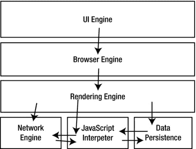
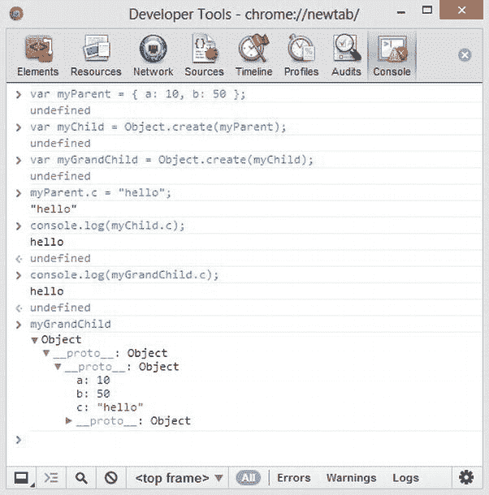

# 一、JavaScript 基础知识

在这一章中，我们将采用一种不同于大多数编程语言参考资料的第一章的方法。大多数书都会深入到语言的语法和其他细节，但是我们在这里不打算这样做。JavaScript 是一种非常难学的语言，也是一种相对容易让人讨厌的语言，所以我们首先想探究为什么有些人会纠结于它，然后我们将提供一种不同的、更直观的方法来掌握这门语言。

我们将从研究学习和使用 JavaScript 的挑战开始。我们将通过研究该语言的进化史和实现来介绍一些背景知识。然后，有了这些信息，我们将研究 JavaScript 面临挑战的三个特定领域:继承隐喻 、作用域隐喻和类型隐喻。最后，我们将研究 JavaScript 中两种非常常见的模式——这是一个大多数书籍直到很久以后才涉及的主题，但是我们认为在本章结束时，您已经为处理这个主题做好了充分的准备。这些模式也是你在本章中学到的所有东西的很好的应用。

当我们阅读本章时，我们将讨论 JavaScript 的基本框架，但是我们鼓励你在这个阶段不要在语法和其他细节的考虑上陷入太多。我们将在后面的章节中讨论这些主题。现在，专注于我们将要描绘的更大的图景。

难学，更难爱

JavaScript 是很多人憎恨的目标。如果你在你最喜欢的搜索引擎中输入“讨厌 JavaScript”或“JavaScript 烂透了”，你会立即得到一页又一页的关于为什么这种语言很糟糕的文章。你可以自己阅读这些文章——我们鼓励你这样做——但是在阅读了几篇之后，你会注意到投诉中出现的一种模式。人们不喜欢 JavaScript 的几个关键点是:

*   它的对象和继承的实现——原型与类
*   其范围规则
*   对数据类型的处理

这是真的，JavaScript 做这三件事与许多普通语言完全不同。更糟糕的是，JavaScript 采用了类似于 C 或 Java 的语法和结构，这助长了一种可以理解的期望，即 JavaScript 应该像 C 或 Java 那样运行，但事实并非如此。(这是 JavaScript 作用域规则的一个特殊问题，我们将在本章后面更详细地讨论。)

还有，因为 JavaScript 很像 C，一个熟悉类 C 语言 (C，C++，Java，C#等)的程序员。)可以快速轻松地达到精通 JavaScript 的水平，而无需真正理解其内部工作原理。经常会遇到一些有才华的开发人员，他们已经使用 JavaScript 很多年了(甚至可能认为自己是 JavaScript 专家)，但是他们对这种语言只有基本的了解，对它的真正力量几乎没有掌握。

所以 JavaScript 很容易被误解，很难掌握，并且三个重要的语言特性的实现有很大的不同。再加上不同浏览器之间不同的实现，难怪人们对这种语言评价不高。

以免我们把您从语言中吓跑，重要的是要认识到，很多时候这种低评价是由于误解了 JavaScript 的工作方式，或者试图应用其他语言的实践，而这些实践并不能很好地映射到 JavaScript 的行为。我们发现，开发人员越愿意学习 JavaScript，他们就越欣赏它。当然，这在某种程度上对任何语言都是正确的，但对 JavaScript 尤其如此。它的动态本质和真正的功能很难理解，但是一旦你理解了它，这种语言就开始呈现出很少语言所具有的美丽和简单。

我们教授 JavaScript 的方法旨在帮助您在我们开始讲述函数、数组和流控制等细节之前就形成对 JavaScript 的理解。我们也将非常详细地介绍这些内容，但在此之前，我们想正面解决人们对 JavaScript 感到困惑或困难的主要问题。这样做，我们希望你开始掌握 JavaScript 的旅程。精通的第一步是理解 JavaScript 的起源及其持续的发展。

JavaScript 是什么？

JavaScript 是一种编程语言，于 1995 年首次发布。尽管有它的名字，JavaScript 实际上和 Java 编程语言没有任何关系。从高层次来看，JavaScript 有几个显著的特性:

*   *它是一种脚本语言* : JavaScript 程序是由解释器(或*引擎*)读取并执行的“脚本”。这与编译语言不同，在编译语言中，程序由编译器读取并翻译成可执行文件。(注意，JavaScript 引擎本身通常是用编译语言编写的。)用脚本语言编写的程序具有高度的可移植性，因为它们可以在任何已经为该语言构建了解释器的环境中运行。
*   *是类 C*:JavaScript 的基本语法和结构大量借鉴 C。
*   它是一种面向对象的语言:JavaScript 不同于大多数面向对象的语言，因为它的继承模型是基于原型的，而不是基于类的。
*   *拥有一级函数* : JavaScript 函数是羽翼丰满的对象，有自己的属性和方法，可以作为参数传入其他函数，也可以从其他函数返回，赋给变量。
*   *它是动态的*:“动态编程语言”这个术语很宽泛，涵盖了很多特性。JavaScript 最动态的特性是其变量类型的实现(见下一点)及其`eval()`方法和其他功能方面。
*   *既有动态类型又有弱类型* : JavaScript 变量在解释时不进行类型检查(使 JavaScript 成为动态类型语言)，混合类型的操作数之间如何发生运算取决于 JavaScript 内部的特定规则(使 JavaScript 成为弱类型语言)。
*   *它是一个标准*的实现:正如下一节所描述的，JavaScript 实际上是 ECMA-262 标准的一个实现，就像 C 编程语言受 ISO 标准管理一样。

这些主要特性结合起来使 JavaScript 变得有些独特。如果您对类似 C 的语言稍有了解，它们也有助于使 JavaScript 基础知识变得相当容易学习，因为您对 JavaScript 的语法或结构不会有什么问题。

JavaScript 也深受 Scheme 的影响，Scheme 是另一种函数式编程语言，是 Lisp 的一种方言。JavaScript 的许多设计原则都来自 Scheme，包括它的作用域。

那么 JavaScript 是如何拥有这种独特的特性组合的呢？

JavaScript 和 ECMA-262 标准的发展

如前所述，JavaScript 实际上是一个标准的实现。不过，事情并不是那样开始的。1995 年 9 月，Netscape 发布了 Navigator 浏览器的 2.0 版本，它有一个新的特性:一种面向对象的脚本语言，可以访问和操作页面元素。这种新的脚本语言由网景工程师 Brendan Eich 创建，最初代号为“Mocha”，最初发布时名为“LiveScript”此后不久，它被重新命名为“JavaScript”，以借助 Sun 的 Java 编程语言。

1996 年，网景向欧洲计算机制造商协会(或简称 ECMA )提交了 JavaScript 作为标准考虑，见`http://www.ecma-international.org/memento/history.htm`。由此产生的标准 ECMA-262 于 1997 年 6 月被采用。ECMA-262 恰当地定义了 ECMAScript 脚本语言，JavaScript 被认为是 ECMAScript 的一种“方言”。ECMAScript 的另一个值得注意的方言是 ActionScript 的版本 3 或更高版本。从技术上讲，Internet Explorer 不实现 JavaScript(出于版权考虑)，而是实现微软自己的 ECMAScript 方言“JScript”

ECMAScript 的最新版本是 5.1，发布于 2011 年 6 月。从 ECMAScript 3 到 ECMAScript 5 的版本轨迹有一段有趣的政治历史，包括标准委员会(由 Brendan Eich 领导)和雅虎、微软和谷歌等行业利益相关者之间的分歧。我们不打算深入细节；可以说，最终各方都同意将 ECMAScript 5 作为一个统一的解决方案。

作为 ECMAScript 5 的一部分，ECMA International 发布了一套可由任何浏览器运行的一致性测试，并将显示浏览器支持哪些 ECMAScript 5 功能以及不支持哪些功能。该套件名为 Test262，可在`http://test262.ecmascript.org/`获得。请注意，运行全套测试可能需要几个小时，其中包含大约 11，500 个单独的测试。截至本文撰写时，没有一款浏览器在 Test262 中获得满分；目前最好的成绩属于 Safari 和 Internet Explorer，两者都只有 7 项测试不及格。Firefox 得分最低，目前未能通过 170 项测试(尽管这仍然是一个令人印象深刻的成就)。这些数字是在撰写本文时的数据，从现在到发表之前很可能会发生变化。我们鼓励您在自己喜欢的浏览器上运行测试套件，并探索在每种浏览器中失败的测试。这将让您对不同浏览器之间 JavaScript 实现的差异有所了解，以及它们到底有多小。

ECMAScript 的发展从第 6 版开始，代号为 ECMAScript Harmony。Harmony 还没有正式发布，在撰写本文时，还没有官方批准的发布日期。然而，规范草案都在`http://wiki.ecmascript.org/doku.php?id=harmony:specification_drafts`对公众开放，快速浏览它们表明，Harmony 将包含几个新特性，其中包括类的语法实现、函数的默认参数、新的字符串方法，以及在`Math`库中添加双曲三角函数。

许多浏览器制造商已经实现了一些 Harmony 特性，但是整体实现参差不齐，并且因制造商而异。在本书的大部分内容中，我们将把 JavaScript 作为 ECMAScript 5.1 的一种方言。在 ECMAScript 5 和 Harmony 重叠的地方，我们会注意到它们的区别，这样您就可以意识到潜在的支持陷阱。此外，在本书中，我们将使用“JavaScript”作为该语言及其实现的通用术语，除非我们需要引用特定的实现或标准本身。

由于 ECMA-262 的标准化影响，所有 JavaScript 的现代实现都非常相似。个别的实现会有所不同，特别是对于前沿的特性，但是核心标准是很好实现的。

JavaScript 实现 s

JavaScript 有几种不同的实现方式。例如，Adobe 的 Acrobat 文档系统实现了一个 JavaScript 版本，使用户能够在 Acrobat 文档中使用简单的脚本。JavaScript 引擎作为独立资源在 Windows、UNIX 和 Linux 上实现已经有一段时间了。在 1995 年首次引入 JavaScript 后不久，Netscape 在其企业服务器中包含了 JavaScript 的服务器端实现。今天，服务器端 JavaScript 最显著的实现是在 Node.js 软件系统中。

到目前为止，JavaScript 最常见的实现是在 web 浏览器中。web 浏览器的 JavaScript 引擎通常实现 ECMA-262 标准中规定的大多数功能。此外，浏览器经常用 ECMA 标准没有规定的其他特性来扩展 JavaScript。这些扩展中最值得注意的是文档对象模型(DOM ),它是由万维网联盟(W3C)维护的一个独立标准。重要的是要记住，DOM 和 JavaScript 是分开的、独立的标准，尽管 JavaScript 在浏览器中做的大部分工作都涉及到操纵 DOM。我们将在第 3 章更深入地讨论 DOM。

尽管 JavaScript 最初是一种基于浏览器的脚本语言，但是 JavaScript 的服务器端实现变得越来越普遍。在服务器端，JavaScript 实现将包括 ECMA-262 的大部分基本特性。而且，像基于浏览器的实现一样，服务器实现可以用其他特性扩展 JavaScript，比如库或框架。尽管服务器和浏览器的 JavaScript 实现在这些扩展特性上可能有所不同，但基本特性是相同的:无论是在浏览器中还是在服务器上实现，JavaScript `Array`对象都具有相同的方法和属性(当然，假设实现遵循 ECMA 标准)。

这使得您的 JavaScript 技能特别有价值。JavaScript 是少数同时拥有客户端和服务器端实现的语言之一，因此学习 JavaScript 是一项不错的投资。通过在服务器端使用 Node.js 以及客户端脚本，可以使用 JavaScript 作为主要语言来构建复杂的、数据驱动的应用，并提供丰富的用户交互。

可能在客户端和服务器端都使用 JavaScript 的两个最好的例子是微软的 Windows Azure 平台和 Windows 8 的 Windows 软件开发工具包(Windows SDK)。它们都支持使用 JavaScript 进行后端和前端实现，这使得用 JavaScript 构建 Windows 应用和利用微软平台的所有功能成为可能。

在本书中，我们不会讨论使用 Node.js 的服务器端 JavaScript，而是将重点放在 web 浏览器环境中的 JavaScript。

网络浏览器和 JavaScript

现代网络浏览器是复杂的软件。大多数人认为 web 浏览器是内容浏览器，可以说是“Web 上的窗口”。然而，对于理解 JavaScript 的程序员来说，web 浏览器变得更加强大:用户界面(UI) 平台。无论你是创建一个简单的网页还是一个复杂的数据驱动的应用，浏览器都是你的 UI 平台，JavaScript 是它使用的语言。

JavaScript 只是浏览器众多活动部件中的一个。在很高的层面上，浏览器由一堆独立的子程序(或称*引擎*)组成，每个子程序都有一个重要的功能:

*   *UI 引擎*:呈现给用户的实际可视界面，有地址栏、渲染窗口、后退和前进按钮、书签工具栏等等。
*   *浏览器引擎*:在 UI 层和渲染引擎之间工作的控制器。
*   *渲染引擎*:负责读取 HTML 文档及其相关素材(比如图像和级联样式表)并决定它们的外观。呈现引擎是 DOM 存在的地方。
*   *网络引擎*:负责接入网络。
*   *数据持久引擎*:管理应用的持久层，这是存储 cookies 的地方，也是 web 数据库和本地存储等 HTML 5 新特性存在的地方。
*   *JavaScript 引擎*:包括数据持久化、网络和渲染引擎的接口，可以观察和修改其中的任何一个或全部。

图 1-1 展示了 JavaScript 引擎是如何与浏览器的其他功能完全分离的，尽管它与浏览器的其他部分密切相关。



[图 1-1](#_Fig1) 。浏览器引擎堆栈

关于浏览器版本的一句话

在本书中，我们将使用 HTML5 语法作为我们的 HTML 标记。因此，一些例子在没有实现 HTML5 特性的旧浏览器上运行时会有问题。本书中的大多数例子都已经在 Chrome 的最新稳定版本中进行了测试，但也应该可以在最新版本的 Safari 、Firefox 和 Internet Explorer 10 中运行。

网页中的 JavaScript

Web 浏览器加载 JavaScript 或者作为文档本身的内容块(*内联脚本*)或者作为单独加载的链接脚本文件。

内联脚本使用`<script>`标签表示:

```js
<script>
/* Your JavaScript here */
</script>
```

链接的脚本也是使用`<script>`标签添加的:

```js
<script src="js/init-document.js"></script>
```

这指示浏览器获取被引用的文件，并将其直接提供给 JavaScript 引擎。

 **注意**你必须同时使用开始和结束标签。HTML5 标准不允许使用自结束标记(尽管有些浏览器可能允许)。

您可以在 HTML 文档的头或正文中的任何位置包含内联或链接脚本。

执行顺序

所以现在我们在网页中包含了 JavaScript，但是当浏览器加载并解析文档时，实际上发生了什么呢？

事实证明，web 浏览器有一个显而易见的特定解析顺序:浏览器从顶部开始解析 HTML 文档，然后一路向下，当特定的素材到达浏览器时就加载它们。这意味着一个脚本(无论是内联的还是链接的)只能引用一些东西(样式、其他脚本、HTML 元素等等)。)在文档中位于它之上。

考虑清单 1-1 中的简单 HTML 页面。

[***清单 1-1。***](#_list1) 基本 HTML 模板

```js
<!DOCTYPE html>
<html>
    <head>
        <title>JavaScript Developer's Guide</title>
    </head>
    <body>
        <h1>Hello World</h1>
    </body>
</html>
```

这将只是在浏览器中显示一个“Hello Word”消息。我们可以通过添加三个脚本来演示脚本执行的顺序，如[清单 1-2](#list2) 所示。

***[清单 1-2。](#_list2)*** 演示执行的顺序

```js
<!DOCTYPE html>
<html>
    <head>
        <title>JavaScript Developer's Guide</title>
        <script>
alert("This is the head.");
        </script>
    </head>
    <body>
        <script>
alert("This is the body, before the message.");
        </script>
        <h1>Hello World</h1>
        <script>
alert("This is the body, after the message.");
        </script>
    </body>
</html>
```

当载入浏览器时，这个页面会首先弹出一个提示窗口，上面写着`This is the head`。请注意，浏览器窗口本身中还没有任何内容；浏览器尚未解析文档的其余部分。

接下来，浏览器将向下移动到正文。下一条警告消息将会出现，但是浏览器窗口仍然是空的。然后浏览器窗口会出现“Hello World”的标题，然后会出现最后一条提示信息。

这个例子不仅展示了执行的顺序，还展示了一个重要的事实，即 JavaScript 可能会阻止对文档的解析。在我们的例子中，我们使用了阻塞函数`alert()`，但是如果我们在头部加载一个复杂的脚本，需要一些时间来下载和解析，它将阻塞对文档其余部分的解析。类似地，正文中的脚本会导致显示整个文档的延迟。对于复杂的 JavaScript 应用，解析顺序和阻塞的组合会导致一些不良影响。我们将在第 4 章[中探讨一些克服这些问题的技巧。](4.html)

简短的题外话:理解和运行示例

正如我们提到的，我们不打算在这一章中涉及语法的细节——那是本书其余部分的内容。但是在我们深入研究之前，我们确实想了解一些关于语法和运行这些示例的重要细节:

*   *变量声明*:在这些例子中，我们将使用`var`关键字来声明变量。语法很简单:`var variableName`声明变量`variableName`，并赋予它特殊的值`undefined`。可选地，您可以为您的变量提供一个值作为声明的一部分:`var variableName = myValue`将声明`variableName`并给它赋值`myValue`。在本章后面的“JavaScript 中的作用域”一节中，你会学到更多关于`var`关键字的知识，但是在深入之前，我们想简单地涉及一下。
*   *点符号* : JavaScript 使用点符号访问对象上的属性和方法:`myObject.propertyName`引用`myObject`上的`propertyName`，`myObject.methodName()`调用`myObject`上的`methodName`。
*   `alert`:浏览器为 JavaScript 提供了一个`alert`函数，提供了一种快速显示字符串的方法。当您调用`alert`方法并将一个字符串作为参数传递给它时，浏览器执行以下步骤:
    *   a.它会暂停脚本的执行。
    *   b.它会弹出一个小窗口，显示您提供的字符串。弹出窗口包括一个标记为 OK 的按钮，单击该按钮可以关闭弹出窗口。
    *   c.当弹出窗口关闭时，浏览器会在警报后的下一条语句处继续执行脚本。
*   这使得 alert 成为一种轻松检查脚本变量和属性的方法。它还有一个优点，几乎可以在所有现存的浏览器上工作，甚至是非常旧的浏览器。

运行示例

有几种方法可以运行这些示例。最简单的方法可能是使用清单 1-1 中的[模板，并在< `H1>`标签后添加一个< `script>`标签。然后将示例复制并粘贴到`script`标签中，保存文件，并将其加载到浏览器中。](#list1)

许多浏览器还提供了 JavaScript 控制台，您可以使用它直接输入示例。但是，JavaScript 控制台会在您按 Enter 键时评估您的代码，我们的许多示例都被分成多行。我们不建议使用控制台，但如果你想尝试一下，在你最喜欢的浏览器上访问控制台(通常 Control-或 Option-Shift-J 是键盘快捷键，但也有所不同)；例如:

*   在 Chrome 中，你可以通过“定制和配置谷歌浏览器”菜单访问控制台。选择工具 JavaScript 控制台。您还会看到用于访问控制台的键盘快捷键(Windows 为 Control-Shift-J)。您可以在此处直接键入代码示例。
*   在 Firefox 中，选择工具 Web Developer 错误控制台。您可以在标有“代码”的框中键入代码示例。如果要使用控制台，请确保在按 Enter 键之前键入完整的有效语句。要了解 JavaScript 中的语句是由什么组成的，你可以跳到第二章[。](2.html)

JavaScript 的三个困难特性

正如我们提到的，人们发现 JavaScript 的三个主要特性有问题:它实现继承的方式，它实现变量范围的方式，以及它实现数据类型的方式。我们不会回避这些特性，而是直接进入它们。

原型遗传

JavaScript 是一种面向对象的语言，但是，与大多数面向对象的语言不同，它的继承基于原型而不是类。这种差异经常被误解，并且很难解释。

最大的区别是在 JavaScript 中没有类这种东西。您可以用 JavaScript 构建类仿真，但是现成的 JavaScript 没有类。只有对象，你从其他对象实例化新对象。

JavaScript 中的继承是通过每个对象的一个特殊属性来处理的，这个属性叫做`prototype`。`prototype`属性引用它从其父对象继承的所有属性和方法——包括它的`prototype`。当您试图访问一个对象的属性或方法时，JavaScript 首先查看它是否存在于本地副本中。如果没有，JavaScript 会检查`prototype`。如果在`prototype`中没有找到请求的条目，它会检查`prototype's prototype`，依此类推，一直到继承链的顶端。

您可以覆盖`prototype`中的属性和方法。这将从本质上打破原型链，因此对象和任何从它实例化的子对象将继承覆盖，并且不再进一步搜索原型链。

在某种程度上，`prototype`链可以被认为是一个单向链表。`prototype`是对列表中前一个元素的引用。

原型继承的一个主要方面是，如果你改变一个对象的继承属性或方法，它的子对象也会反映这种改变，即使在它们被创建之后。这是因为子原型都引用了父属性和方法。

原型继承的另一个主要方面是，您可以更改任何全局对象的`prototype`,从而向它们添加您自己的属性和方法——甚至覆盖它们现有的属性和方法。但是请注意，覆盖全局对象的现有属性和方法可能是危险的。请记住，那些属性和方法是由标准定义的，所以如果您让它们做其他事情，那么您可能会失去遵循标准的好处。因此，通常认为覆盖这些属性和方法是不好的做法，除非您非常小心自己在做什么。

清单 1-3 提供了一个非常简单的原型继承的例子。

[***清单 1-3。***](#_list3) 原型继承的简单例子

```js
var myParent = {
    a: 10,
    b: 50
}

var myChild = Object.create(myParent);
var myGrandChild = Object.create(myChild);

alert(myGrandChild.a); // will alert 10
myParent.a = 20;
alert(myGrandChild.a); // will alert 20
alert(myChild.a); // will alert 20
```

一会儿我们会多谈一点关于`Object.create` 的语法；现在，只需关注脚本正在做的事情:首先，它创建一个具有属性`a`和`b`的父对象，然后从该父对象创建一个子对象，并从子对象创建一个孙对象。我们现在有三个对象，每个都继承自其父对象。当我们检查孙儿对象的值`a`时，JavaScript 遍历`prototype`链，直到在父对象中找到属性。

由于`prototype`只是一个引用，向父对象添加属性会立即使它们在子对象中可用，如[清单 1-4](#list4) 所示。

[***清单 1-4。***](#_list4) 给父节点添加一个属性使其对子节点可用

```js
var myParent = {
    a: 10,
    b: 50
}

var myChild = Object.create(myParent);
var myGrandChild = Object.create(myChild);

myParent.c = "hello";
alert(myChild.c); // will alert "hello"
alert(myGrandChild.c); // will alert "hello"
```

这个例子类似于[清单 1-3](#list3) ，但是我们在实例化了子对象之后给父对象添加了一个新的属性。

在一些浏览器中，你甚至可以直接检查`prototype`，因为它们在对象上提供了一个`__proto__`属性，你可以通过控制台查看(见[图 1-2](#Fig2) )。



[图 1-2](#_Fig2) 。在 Chrome 的控制台中查看原型

在[图 1-2](#Fig2) 中，我们看到`myGrandChild`是一个对象，展开后看到它有一个`__proto__`属性。当我们展开它时，我们看到它有另一个`__proto__`属性，当我们展开它时，我们找到了`a`和`b`属性。还有另一个`__proto__`属性，它引用全局对象 Object…因此，我们所有的对象都继承了全局对象 Object 的所有属性和方法。

原型继承的想法很简单，但是却很容易被误解。更复杂的问题是，在早期版本的 JavaScript 中，从其他对象创建新对象的方法和语法，如清单 1-5 所示，非常类似于传统继承语言的语法。

[***清单 1-5。***](#_list5) 旧语法用于创建新对象和修改原型

```js
function myObject() {}; // constructor function
var myInstance = new myObject; // instantiate a new instance
alert(myInstance.prop1); // will alert "undefined" because it doesn't exist
myObject.prototype.prop1 = "Here I am";
alert(myInstance.prop1); // will alert "Here I am"
```

这不仅有些不雅，关键字`new`还让人们从古典继承的角度思考问题，这只会让问题更加混乱。并且它要求任何你计划用来创建子对象的对象都是一个函数。

ECMAScript 5 在全局对象上定义了一个新属性:`Object.create()`。此方法将对象作为参数，并返回一个以参数对象为原型的新对象。这种语法更加整洁，如[清单 1-6](#list6) 所示，也有助于澄清继承链，并且消除了直接访问`prototype property`的需要。

[***清单 1-6。***](#_list6) 改进创建新对象的语法

```js
var myObject = {};
var myInstance = Object.create(myObject);
alert(myInstance.prop1); // will alert "undefined" because it doesn't exist
myObject.prop1 = "Here I am";
alert(myInstance.prop1); // will alert "Here I am"
```

这种新方法适用于现代浏览器，但是如果你发现自己在使用一个不支持这个标准版本的旧 JavaScript 引擎(最明显的是 Internet Explorer 8 和更早的版本)，你总是可以使用[清单 1-7](#list7) 中的代码片段来提供相同的功能。

[***清单 1-7。***](#_list7) 一种为不存在的对象添加创建方法的方法

```js
if (typeof Object.create !== 'function') {
    Object.create = function (o) {
        function F() {}
        F.prototype = o;
        return new F();
    };
}
```

[清单 1-7](#list7) 检查`Object.create`是否存在，如果不存在，就把它添加到全局对象 Object 中。这是一个安全扩展全局对象的好例子。

垫片

清单 1-7 是所谓的*填充*或*多填充*的一个例子，这些术语指的是为特定环境添加缺失功能或修复不正确实现的小脚本。清单 1-7 弥补了 JavaScript 的一个缺点；还有针对各种 CSS 问题甚至 HTML 问题的垫片。

JavaScript 库中通常包含垫片——事实上，许多库最初只是各种垫片的集合。

JavaScript 中的作用域

JavaScript 的另一个经常被误解和中伤的特性是它的作用域:JavaScript 如何限制和允许访问它的变量。因为 JavaScript 在许多方面与 C 语言非常相似，所以很自然地认为它使用了类似 C 语言的块级作用域，清单 1-8 给出了一个例子。

[***清单 1-8。***](#_list8)C 中的块级作用域

```js
#include <stdio.h>
int main() {
  int x = 1;
  printf("%d, ", x); // 1
  if (1) {
    int x = 2;
    printf("%d, ", x); // 2
  }
  printf("%d\n", x); // 1
}
```

在 C 中，每个代码块(`if`语句、`for`循环等)。)是它自己的作用域:在一个作用域中定义的变量在另一个作用域中不可用。假设 JavaScript 采用块级作用域是合乎逻辑的，因为它使用的语法非常类似于 C。。但事实并非如此。

相反，JavaScript 使用所谓的*函数作用域*，这意味着作用域是由函数声明的。函数中定义的变量在该函数中的任何地方都是可用的，甚至在其他块中，如`if`语句、`for`循环或嵌套函数。作为示范，下面的清单创建了一个函数范围，并在:中测试变量

[***清单 1-9。***](#_list9) 演示嵌套的功能范围

```js
function testScope() {
    var myTest = true;
    if (true) {
        var myTest = "I am changed!"
    }
    alert(myTest);
}
```

在[清单 1-9](#list9) 中显示的例子创建了一个简单的`testScope`函数。在这个函数中，我们声明了一个变量`myTest`，这给了它在函数中任何地方都可用的范围。然后我们在一个`if`语句块中重新声明这个变量，并给它一个不同的值。最后，我们测试看看结果是什么:脚本将提醒`I am changed!`

在 C 或另一种具有块级作用域的语言中，一个类似的例子会警告`true`，因为`if`语句中的`myTest`重新声明在作用域上将被限制到该块。

如果我们试图在`testScope`函数之外访问`myTest`变量，将会失败，如[清单 1-10](#list10) 所示。

[***清单 1-10。***](#_list10) 演示功能范围

```js
function testScope() {
    var myTest = true;
    if (true) {
        var myTest = "I am changed!"
    }
    alert(myTest);
}

testScope(); // will alert "I am changed!"
alert(myTest); // will throw a reference error, because it doesn't exist outside of the function
```

在`testScope`函数之外，`myTest`不存在。你可以让它存在，如[清单 1-11](#list11) 所示。

[***清单 1-11。***](#_list11) 展示全局范围

```js
var myTest = true;
function testScope() {
    if (true) {
       var myTest = "I am changed!"
    }
    alert(myTest);
}

testScope(); // will alert "I am changed!"
alert(myTest); // will alert "I am changed!"
```

通过在`testScope`函数之外定义`myTest`变量，它变得随处可用。这就是所谓的*全球范围*。全局函数和变量随处可用。这是 JavaScript 的一个非常强大的特性，但是很容易被滥用。一般来说，混淆全局范围被认为是不好的做法，主要是因为它会导致同名变量在脚本执行时互相碰撞对方的值，从而导致各种难以调试的问题。相反，建议尽可能将变量限制在私有范围内。

限制范围

到目前为止，我们已经用关键字`var`小心地声明了我们的新变量。但是`var`关键字在 JavaScript 中是可选的；你可以简单地通过提供一个值来声明一个新变量，如[清单 1-12](#list12) 所示。

[***清单 1-12。***](#_list12) 声明一个没有 var 关键字的变量

```js
var myNewVar = 1; // Using var to declare a variable.
myOtherNewVar = 2; // var is optional.
alert(myNewVar); // will alert 1
alert(myOtherNewVar); // will alert 2
```

然而，当你声明一个没有`var`关键字的变量时，JavaScript 假设你的意思是你在一个更高的作用域中定义了这个变量，并且你想要访问这个变量。因此 JavaScript 将查找包含范围，看看变量是否是使用关键字`var`声明的。如果不是，JavaScript 会继续查找作用域链，直到到达全局作用域。如果它到达了全局范围，仍然没有找到使用`var`关键字的声明，JavaScript 将为你把变量赋给全局范围，如[清单 1-13](#list13) 所示。

[***清单 1-13。***](#_list13) 杂糅全局范围

```js
function testScope() {
    myTest = true; // now myTest is global.
    alert(myTest);
}
testScope(); // will alert "true"
alert(myTest); // will alert "true" as well, because now myTest is global.
```

JavaScript 的这个特性叫做*隐含全局作用域*。它基本上意味着没有明确限定范围的变量被假定为全局变量。

为了限制变量的范围，在声明中使用`var`关键字，如[清单 1-14](#list14) 所示。使用`var`关键字指示 JavaScript 将变量的范围限制为当前变量。这可以防止意外弄乱全局范围。

[***清单 1-14。***](#_list14) 用 var 限制范围

```js
function testScope() {
    var myTest = true;
    function testNestedScope() {
        var myTest = false;
        alert(myTest);
    }
    testNestedScope();
    alert(myTest);
}

testScope(); // will alert false, and then true.
```

在[清单 1-14](#list14) 中，我们在不同的范围内定义了两个不同的`myTest`变量。在`testNestedScope`函数中，`myTest`有一个覆盖更高作用域的局部定义。这可以防止两个不同名称的变量互相取值。

你可能想知道如果我们交换`testNestedScope`函数中的两行会发生什么，如[清单 1-15](#list15) 所示——换句话说，如果我们在一个变量被定义在给定的作用域之前尝试访问它，会发生什么？

[***清单 1-15。***](#_list15) 在给定范围内定义变量之前访问变量

```js
function testScope() {
    var myTest = true;
    function testNestedScope() {
        alert(myTest);
        var myTest = false;
    }
    testNestedScope();
    alert(myTest);
}

testScope(); // will alert "undefined", and then true.
```

[清单 1-15](#list15) 将警告`undefined`然后是`true`。为什么呢？也就是说，`testNestedScope`里的第一条线为什么不报警`true`？毕竟`myTest`在更高的范围内设置为`true`，那么为什么在那里不可用呢？

原因是我们通过用`var`关键字定义变量`testNestedScope`来限制`myTest`的范围。但是当我们在给它一个值之前访问它时，它被设置为“未定义”所以这段代码相当于清单 1-16 中的代码。

[***清单 1-16。***](#_list16) 更明确的等价于清单 1-15 中的

```js
function testScope() {
    var myTest = true;
    function testNestedScope() {
        var myTest;
        alert(myTest);
        myTest = false;
    }
    testNestedScope();
    alert(myTest);
}

testScope(); // will alert "undefined", and then true.
```

[清单 1-16](#list16) 通过在变量作用域的最开始明确声明一个没有值的变量，说明了在[清单 1-15](#list15) 中发生了什么。在 JavaScript 中，在给定范围内声明的任何变量在该范围内的任何地方都是可用的，甚至在它被赋值之前。JavaScript 的这个特性通常被称为*提升*:变量被“提升”到声明它的作用域的开始。由于提升的原因，在 JavaScript 中，在变量作用域的开始显式声明变量通常被认为是一个好的做法，即使你很久以后才访问它们。

关闭

在大多数语言中，一旦一个函数返回，它的所有局部变量都被*解除分配*——从内存中移除并且不再可用。在 JavaScript 中，这不是必须发生的。由于 JavaScript 的动态特性和作用域规则，您可以编写这样的代码，即使在函数执行完毕后，函数中的局部变量仍然可用。考虑[清单 1-17](#list17) 中的例子。

[***清单 1-17。***](#_list17)

```js
function greet(myName) {
    var myAlertString = "Hello " + myName; // Local variable
    function doAlert() {
        alert(myAlertString);
    }
    return doAlert; // return the new function
}

var greetKitty = greet("Kitty"); // greetKitty is now a function
greetKitty(); // will alert "Hello Kitty"
```

[清单 1-17](#list17) 是一个有些做作的例子，这里有一些不寻常的事情，所以让我们一次看一个。第一件奇怪的事情是我们从函数中返回一个函数。这似乎有点奇怪，但在 JavaScript 中并不罕见。请记住，在 JavaScript 中，函数是对象，所以您可以返回它们，甚至可以像其他对象一样轻松地将它们赋给变量。

我们的`greet`函数将一个名称作为参数，在一个局部变量中将它连接成一个字符串，然后定义一个局部函数来警告该字符串。然后它返回本地函数。当我们调用`greet`函数时，我们将返回的函数赋给一个变量，然后执行返回的函数。

这种情况的特别之处在于，当我们将其结果赋给`greetKitty`变量时，`greet`函数被调用并完全执行。在大多数语言中，`myAlertString`变量会被释放并且不可用。但在 JavaScript 中，它仍然存在，因为我们已经创建了一个特定的情况，它需要保持在那里，以便当我们执行返回的函数时，一切都将按预期进行。换句话说，返回的函数及其直接的非局部函数作用域都被保留，即使创建它们的函数已经结束运行。这是 JavaScript 中变量作用域的副作用:解释器会维护一个作用域，直到不再需要它。

这也适用于我们创建的私有范围。清单 1-18 通过对另一只猫说“你好”来演示这一点。

[***清单 1-18。***](#_list18) 一个保持着隐私的范围

```js
function greet(myName) {
    var myAlertString = "Hello " + myName; // Local variable
    function doAlert() {
        alert(myAlertString);
    }
    return doAlert; // return the new function
}

var greetKitty = greet("Kitty"); // greetKitty is now a function
greetKitty(); // will alert "Hello Kitty"
var greetMax = greet("Max"); // greetMax is now a function
greetMax(); // will alert "Hello Max"
greetKitty(); // will alert "Hello Kitty"
```

`greetMax`和`greetKitty`函数都可以访问它们自己维护的作用域，这些作用域对于彼此和全局作用域都是私有的。

这个特殊例子的结果是由 JavaScript 的作用域规则造成的。如果我们允许使用一个全局变量，如[清单 1-19](#list19) 所示，那么我们就不再为每个函数保留一个私有的范围。

[***清单 1-19。***](#_list19) 使用全局变量

```js
function greet(myName) {
    myAlertString = "Hello " + myName; // Now a global variable
    function doAlert() {
        alert(myAlertString);
    }
    return doAlert; // return the new function
}

var greetKitty = greet("Kitty"); // greetKitty is now a function
greetKitty(); // will alert "Hello Kitty"
var greetMax = greet("Max"); // greetMax is now a function
greetMax(); // will alert "Hello Max"
greetKitty(); // will alert "Hello Max"
var greetLenore = greet("Lenore");
greetLenore(); // will alert "Hello Lenore"
greetKitty(); // will alert "Hello Lenore"
greetMax(); // will alert "Hello Lenore"
```

在[清单 1-19](#list19) 中，我们通过不对`myAlertString`变量施加范围限制来改变这种情况。这允许 JavaScript 暗示它是一个全局变量，每次调用`greet`函数时都会被覆盖。

即使在父函数已经执行完之后，仍然保持一个函数及其父作用域被称为*闭包*。闭包是 JavaScript 极其重要和强大的特性，我们将在本书中广泛使用它们。

因为您可以使用它们来加强隐私，所以闭包对于封装功能和管理范围非常有用。它们在一些最常见的 JavaScript 模式中扮演着重要的角色，我们将在本章后面介绍这些模式。

闭包非常强大，但是它们有一个重要的缺点:因为闭包需要浏览器为函数及其作用域保留分配的内存，一旦不再需要闭包，浏览器有时可能不会将所有的内存返回给系统。这种情况的主要症状是*内存泄漏*:随着脚本继续在浏览器中执行，浏览器消耗越来越多的内存，最终耗尽所有可用内存。内存泄漏假设浏览器不应该消耗越来越多的内存，或者消耗得比应该消耗的要快。

老版本的浏览器由于关闭而存在严重的内存泄漏问题。现代浏览器效率更高，但仍有问题。您应该在浏览器运行您的脚本时监控它的内存使用情况，以确保它没有问题。

属于那种软弱的类型，嗯？

正如我们前面提到的，JavaScript 是弱类型的。这意味着，如果表达式中存在类型不匹配问题，JavaScript 将根据自己的规则解决它。以清单 1-20 中的代码为例。

[***清单 1-20。***](#_list20) 弱打字演示

```js
var myNumber = 5; // Integer
var myString = "7"; // String
var myResult = myNumber + myString; // Type mismatch: integer + string = what?
alert(myResult); // Will alert "57"
```

解析这个脚本时，静态类型语言会抛出一个错误。但是 JavaScript 自己解决了类型不匹配的问题，允许程序继续运行而不会崩溃。

许多人认为弱类型是一个缺点，事实上，对于 JavaScript 开发新手来说，弱类型很容易犯很多错误。但是，一旦掌握了 JavaScript 的类型规则，您就可以充分利用这一特性，创建比用等效的强类型语言创建的脚本更小、更优雅的脚本。

基本数据类型和原语

我们将通过回顾 JavaScript 的基本数据类型来开始我们对 JavaScript 类型的探索。是的，尽管它是弱类型的，JavaScript 实际上有数据类型，只是比典型的数据类型更广泛。四种基本数据类型是:

*   *布尔*:为真或为假的变量或表达式。
*   *数字*:JavaScript 中所有的数字都是 64 位浮点数。
*   *字符串*:任意字符的字符串。
*   *对象*:属性和方法的集合。

JavaScript 使用这些数据类型作为所有类型管理的基础。要确定 JavaScript 中任何东西的类型，使用`typeof`操作符，如[清单 1-21](#list21) 所示(参见[第 7 章](7.html)了解关于`typeof`操作符的全部细节)。

[***清单 1-21。***](#_list21) 使用 typeof 运算符

```js
var myArrayOfThings = ["hello", 5, true, {}];
for (var i = 0; i < myArrayOfThings.length; i++) {
    alert(typeof myArrayOfThings[i]);
}
alert(typeof myArrayOfThings);
```

这将依次警告“字符串”、“数字”、“布尔”、“对象”和“对象”。(是的，在 JavaScript 中，数组就是对象。)注意，`typeof`将为函数返回“Function ”,尽管在 JavaScript 中没有函数类型。

另外，JavaScript 有*原语*的概念:非对象简单值。JavaScript 原语是构建更复杂数据类型的基础。他们是

*   *布尔*:关键字`true`和`false`本身就是布尔原语。
*   *Null* :关键字`null`。
*   *数*:一个数本身就是一个数本原。
*   *字符串*:用引号括起来的字符串是字符串原语。
*   *未定义的*:一个特殊的值，代表一个用`var`关键字创建的变量，但是没有给它赋值。

需要注意的是，在 JavaScript 中，任何不是原语的东西都是对象。例如，函数就是对象。

您还可以在 JavaScript 中的原语和对象之间进行转换。你会注意到布尔、数字和字符串原语有匹配的全局对象(见[第 5 章](5.html)关于布尔、数字和字符串全局对象以及如何使用它们的细节)。考虑在[清单 1-22](#list22) 中显示的例子。

[***清单 1-22。***](#_list22) 如此等等，到底是不是原始人？

```js
var myString = "hello there" // primitive
alert(myString.length); // will alert 11\. . .but length is a property of the String object
alert(typeof myString); // will alert "string"
```

这段代码片段提醒`11`，字符串的长度。但是为什么呢？如果“hello there”确实是一个原语，我们怎么能访问`myString.length`？

我们之所以能做到这一点，是因为在幕后，JavaScript 正在将我们的原始值转换为其关联的对象，从而使我们能够访问 String 的所有属性和方法。这种转换是短暂的，这就是为什么`typeof myString`仍然产生“字符串”而不是“对象”

这种幕后的转换在 JavaScript 中经常发生，这也是充分理解 JavaScript 如何做到这一点非常重要的另一个原因。

JavaScript 中的类型转换

现在我们已经定义了所有的基础知识，我们可以看看 JavaScript 实际上是如何处理类型不匹配的。JavaScript 有一组函数用于处理从一种类型到另一种类型的转换:`toPrimitive()`、`toNumber()`和`toBoolean()`。这些函数是*抽象的*，意味着它们是 JavaScript 内部工作的私有函数，不能被脚本直接调用。

`toPrimitive()`方法接受一个`input`参数，也可以接受一个可选的`preferredType`参数。它将非基元(也就是说，对象)转换为最接近的相关基元类型。如果`input`参数可以分解成多个原始类型，那么`preferredType`参数可以用来指定选择哪一个。[根据`input`参数类型:，表 1-1](#Tab1) 总结了`toPrimitive()`遵循的规则

[表 1-1。](#_Tab1)规则为原始

| `input`参数类型 | 结果 |
| --- | --- |
| 目标 | 如果`valueOf()`返回一个原语，则返回该原语；否则，如果`toString`返回原始值，则返回该值；否则，抛出一个错误 |
| 其他一切 | 无变化 |

`toNumber()`方法接受一个`input`参数并试图将其转换成一个数字，如[表 1-2](#Tab2) **所示。**

[表 1-2。【toNumber 规则](#_Tab2)

| `input`参数类型 | 结果 |
| --- | --- |
| 布尔代数学体系的 | `1`如果为真，`+0`如果为假 |
| 空 | `+0` |
| 数字 | 无转换 |
| 目标 | `toNumber(toPrimitive(object))` |
| 线 | 类似于`parseInt()`(参见第 5 章的[中的“其他全局函数和变量”以获得对`parseInt()`的完整解释)，除非原始值包含除数字、单个小数或前导+或-以外的任何内容，否则它返回`NaN`](5.html) |
| 不明确的 | `NaN` |

`toBoolean()`方法接受一个`input`参数，并试图将其转换为`true`或`false`，如[表 1-3](#Tab3)T6 所示。

[表 1-3。](#_Tab3)托布尔的规则

| `input`参数类型 | 结果 |
| --- | --- |
| 布尔代数学体系的 | 无转换 |
| 空 | `false` |
| 数字 | 如果`–0`、`+0`或`NaN`，返回`false`；否则，返回`true` |
| 目标 | `true` |
| 线 | 如果字符串为空，则返回`false`；否则，返回`true` |
| 不明确的 | `false` |

脚本中最常发生类型转换的地方是在评估一个`if (Expression) Statement`条件时，以及使用`==`比较时。在有条件的情况下，使用`toBoolean()`将表达式简化为布尔值。`==`的类型转换算法是 ECMA-262 标准定义的简单算法，在[表 1-4](#Tab4) **中有概述。**

[表 1-4。](#_Tab4)类型转换算法为==运算符

| x 的类型 | y 的类型 | 结果 |
| --- | --- | --- |
| 空 | 不明确的 | `true` |
| 不明确的 | 空 | `true` |
| 数字 | 线 | `x == toNumber(y)` |
| 线 | 数字 | `toNumber(x) == y` |
| 布尔代数学体系的 | 任何的 | `toNumber(x) == y` |
| 任何的 | 布尔代数学体系的 | `x = toNumber(y)` |
| 字符串或数字 | 目标 | `x == toPrimitive(y)` |
| 目标 | 字符串或数字 | `toPrimitive(x) == y` |

从这个算法中有几个重要的收获:首先，`null`和`undefined`彼此相等，其他都不相等，其次，最终所有其他的都被简化为数字以便于比较。

尽管这个算法实际上非常简单，但许多人不理解它，结果发现`==`的行为令人困惑。人们发现这非常令人困惑，以至于一个普遍推荐的 JavaScript 编码最佳实践是避免使用`==`(和`!=`)，而是始终使用`===`(和`!==`)。清单 1-23 是一个例子的版本，这个例子经常被引用作为在 JavaScript 中避免使用`==`的理由。

[***清单 1-23。***](#_list23)JavaScript 中令人困惑的类型转换

```js
if ("Primitive String") {
  alert("Primitive String" == true);
  alert("Primitive String" == false);
}
```

这段代码将首先向`false`发出警报，然后再次向`false`发出警报，因此不难理解为什么这可能会导致人们沮丧地举手投降。让我们一步一步来看:

1.  在`if`语句中，我们看到 JavaScript 在`"Primitive String"`上应用`toBoolean()`，其计算结果为`true`，因此执行移动到代码块中。
2.  我们将算法应用于`"Primitive String" == true`，它告诉我们检查`"Primitive String" == toNumber(true)`，这与`"Primitive String" == 1`相同。
3.  我们查`toNumber("Primitive String") == 1`，和`NaN == 1`一样，都是`false`。
4.  我们对`"Primitive String" == false`进行同样的处理，在应用了几次类似于步骤 2 的算法后，我们得到了`NaN == false`，也就是`false`。

现在我们理解了规则，清单 1-23 的结果实际上非常有意义。

考虑一下[清单 1-24](#list24) 中显示的通用代码模式，其中我们试图为函数中的参数提供一个默认值。

[***清单 1-24。***](#_list24) 一个常见的错误:检查某物是否未定义或为空

```js
function myFunction(arg1) {
    // Check if arg1 wasn't provided
    if ((arg1 === undefined) || (arg1 === null)) {
        // provide default value for arg1 here
    }
    // Continue with function. . .
}
```

[清单 1-24](#list24) 中常见的错误表明对一个最基本的类型转换规则缺乏理解:`null`和`undefined`彼此相等，除此之外别无其他。[清单 1-25](#list25) 展示了编写这段代码的一种更好的方法。

[***清单 1-25。***](#_list25)

```js
function myFunction(arg1) {
    // Check if arg1 wasn't provided
    if (arg1 == null) {
        // provide default value for arg1 here
    }
    // Continue with function. . .
}
```

您本来可以检查`arg1 == undefined`，但是因为`undefined`是一个变量，所以它有两个缺点:首先，与`undefined`比较需要范围链查找，这通常没什么大不了的，但是如果您深埋在范围中和/或在一个长循环中实现检查，它可能会影响性能；其次，它的值有可能被意外覆盖(这种情况很少发生，但确实会发生)。和`null`比更安全。

放在一起:两种常见的模式

每种语言都有常用的模式，JavaScript 也不例外。JavaScript 的通用模式利用了我们在本章中讨论的一个或多个特性，所以它们是这些特性的优秀的实际例子，也说明了它们有多么强大。第一种模式是一种语法模式，您将会在 JavaScript 中经常看到，并且您自己也会多次使用。第二种是同样非常常见的实现模式，它将帮助您开始将 JavaScript 组织成可管理的模块。

立即执行函数表达式

在本章的其他例子中，我们已经在函数中创建了函数，然后执行它们。有没有可能定义一个函数，然后立即执行它，而不必单独调用它？

在 JavaScript 中，调用一个函数的符号是在函数名后(或在它被赋值的变量名后)放置一对圆括号——参见[第 2 章](2.html)了解更多关于这种区别的细节。所以，如果我们只是在函数声明后放一对括号，会执行它吗？例如，[清单 1-26](#list26) 中的代码可以工作吗？

[***清单 1-26。***](#_list26) 试图立即调用一个函数

```js
function greet(myName) {
    var myAlertString = "Hello " + myName; // Local variable
    function doAlert() {
        alert(myAlertString);
    }()
}

greet("Kitty");
```

答案是*不*，这个不行。当 JavaScript 解释器看到关键字`function`时，它认为后面是一个要添加到作用域中的声明，而不是要计算的表达式。你必须明确地告诉解释器你的函数是一个要被求值的表达式，你可以用圆括号把它括起来，如清单 1-27 所示。

[***清单 1-27。***](#_list27) 立即调用功能

```js
function greet(myName) {
    var myAlertString = "Hello " + myName; // Local variable
    (function doAlert() {
        alert(myAlertString);
    })()
}

greet("Kitty");
```

这实际上会像你所期望的那样工作。你甚至不必命名你的函数，如清单 1-28 所示。

[***清单 1-28。***](#_list28) 立即调用匿名功能

```js
(function() {
    // do stuff here
})();
```

您还可以将变量传递到调用中，如清单 1-29 所示。

[***清单 1-29。***](#_list29) 传递变量到一个立即被调用的匿名函数中

```js
(function(var1, var2) {
    // do stuff here
})(myExternalVar1, myExternalVar2);
```

立即调用的匿名函数非常有用，因为它们提供了一种利用闭包和管理作用域的方法。表达式中的所有内容都是私有的，除非你明确地将某些内容返回到全局范围，这样可以更容易地将全局范围清除掉不必要的混乱。立即调用的匿名函数模式在整个 JavaScript 开发中使用，尤其是在模块模式中。

模块模式

假设您正与许多其他开发人员一起开发一个大型 JavaScript 应用。您需要一种方法来封装代码段，以便它们可以有一个私有的名称空间，这样您就可以避免与现有代码的冲突。你会怎么做？当然是模块模式。

模块模式使用一个立即调用的函数为所有封装的代码创建一个闭包。您可以拥有私有成员，甚至可以发布公共 API。基本模式如[清单 1-30](#list30) 所示。

[***清单 1-30。***](#_list30) 模块模式

```js
var Module = (function() {
    var _privateVariable = "This is private",
        _otherPrivateVariable = "So is this",
        public = {}; // This object will be returned
    function privateMethod() {
        alert("This method is private as well");
    }

    public.publicProperty = "This is a public property";
    public.publicMethod = function() {
        alert("This is a public method");
    }
    return public;
})()

alert(Module._privateVariable); // will alert "undefined"
// Module.privateMethod(); // would throw an error if we let it run
alert(Module.publicProperty); // will alert "This is a public property"
Module.publicMethod(); // will alert "This is a public method"
```

模块模式是使用闭包来管理范围的一个很好的例子。在模块中，有一个独立的私有作用域，不会被修改。

这还不是全部。您甚至可以通过直接调用的函数来重新处理模块，从而轻松地扩展模块。你所要做的就是将原始模块作为一个参数传递给新的立即被调用的函数，如清单 1-31 所示。

[***清单 1-31。***](#_list31) 扩展模块

```js
var Module = (function(oldModule) {
    oldModule.newMethod = function() {
        alert("This is a new method!");
    }
    return oldModule;
})(Module)
```

你也可以在模块上创建子模块，如清单 1-32 所示。

[***清单 1-32。***](#_list32) 创建子模块

```js
Module.sub = (function() {
    var _privateSubVariable = "This is a private variable in the submodule",
    public = {};
    public.publicSubVariable = "This is a public variable in the submodule";
    return public;
})();
```

因为它充分利用了 JavaScript 的动态特性，所以模块模式非常灵活。事实上，如果您看一看现代 JavaScript 库(例如 jQuery)的源代码，您会发现其中许多都是使用这种模式构建的。

摘要

在这一章中，我们正面解决了人们认为 JavaScript 最难的问题。我们没有回避许多人因为这些事情不喜欢 JavaScript 的事实，我们解释了 JavaScript 的历史和持续的演变，以便您理解 JavaScript 是如何结束的。阅读完本章后，您现在应该了解以下内容:

*   人们在学习 JavaScript 时最头疼的三件事是作用域、继承和类型。
*   JavaScript 的继承是原型的，而不是基于类的。
*   JavaScript 的范围是基于函数而不是代码块的。
*   JavaScript 的作用域和函数性质允许您创建闭包。
*   JavaScript 以非常具体和明确定义的方式处理类型。

您现在还应该熟悉立即执行的函数表达式和模块模式，以及模块模式如何使用闭包来维护范围和加强隐私。

有了这一章，你就可以更深入地研究 JavaScript 的具体细节了。在下一章中，我们将涵盖我们在本章中忽略的细节，从表达式和语句到对象，一直到函数和流控制。