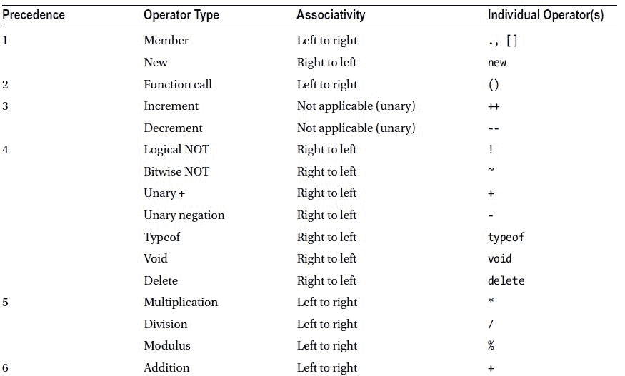

第二章


JavaScript 螺母和螺栓

在第 1 章中，我们讲述了 JavaScript 的一些基础知识。我们深入研究了一些人们在学习语言时会纠结的概念。不过，我们并没有真正把语言作为一个整体来处理，这就是我们现在要做的。在这一章中，我们将深入到我们在[第 1 章](1.html)中忽略的细节中，并了解这门语言的具体细节。我们还将更详细地讨论我们在《T4》第一章中提到的一些事情。

这一章将为你提供 JavaScript 语言的坚实基础，并且以一种既能让语言新手理解，又能让有经验的 JavaScript 开发人员有价值的参考的方式来完成。我们的希望是，随着您 JavaScript 开发技能的进步，您会参考这一章来提醒自己一些基础知识，并更深入地钻研特定的主题。

我们将首先回顾一些格式化 JavaScript 代码的基本问题，尤其是与本书中的例子相关的问题。然后我们将讨论表达式和语句，这是 JavaScript 的两个最基本的构件，所有的 JavaScript 程序都是从这两个构件构建的。有了这个基础，我们就可以讨论用操作符创建更复杂的语句了。我们将讨论变量以及如何在 JavaScript 程序中管理它们。然后我们将讨论对象和数组，这将为您提供所有其他内容的构建模块。然后我们将深入讨论函数:它们是什么，以及如何制作它们，我们将获得一些关于 JavaScript 动态本质的重要见解。最后，我们将讨论如何用条件和循环来控制我们的程序。

到本章结束时，你应该对 JavaScript 的词汇结构和语法有一个坚实的理解，并且应该对使用它的基本结构进行流控制和功能感到舒适。

 **注**在本章中，我们将引用甚至直接引用 ECMA-262 标准，其当前版本是 ECMAScript 语言规范 5.1 版。我们鼓励您在`www.ecma-international.org/ecma-262/5.1/`探索标准本身(它也提供了一个可下载的 PDF 版本的链接)，因为这是扩展您对 JavaScript 理解的一个极好的方式。

格式化 JavaScript 代码

格式化代码是众多不可避免地导致一屋子愤怒的开发人员相互争吵的主题之一。(有一次，我看到有人在关于空格缩进和制表符缩进的争论中差点把椅子扔了出去。)尽管这是一个敏感的话题，但如果没有至少为未来的争论打下基础，以及定义我们将在本书中使用的约定，这种引用将是不负责任的。

一般来说，JavaScript 使用类似 C 的格式。最值得注意的是，JavaScript 使用花括号(`{ }` ) 来表示代码块，比如循环或逻辑流控制。

JavaScript 还使用两种样式的注释分隔符。双斜杠(`//`)是单行分隔符，表示从该点到行尾的一切都是注释。JavaScript 还使用`/*`来表示多行注释的开始和`*/`来表示结束。包含在这些分隔符中的任何内容，不管新行是什么，都被视为注释。

空白，包括缩进，在很大程度上是不重要的。引用 ECMA-262 标准的第 7.2 节:“空白字符用于提高源文本的可读性，并将标记(不可分割的词汇单元)彼此分开，但在其他方面并不重要。”JavaScript 不在乎你是否用制表符或空格缩进，甚至根本不在乎你是否缩进。类似地，JavaScript 对新行没有要求。事实上，为了减小文件大小，通过删除所有空格并将所有内容放在一行来“压缩”JavaScript 是很常见的(参见[第 4 章](4.html)了解更多关于压缩 JavaScript 的信息)。

JavaScript 使用分号(`;` ) 来终止语句。然而，分号可以被认为是可选的，因为 JavaScript 解释器实践自动分号插入(ASI)，这意味着它们试图通过在需要时自动插入分号来纠正没有分号将不起作用的代码。因此，您可以选择不使用许多(甚至任何)分号来编写您的 JavaScript，而是依赖 ASI。传统上，显式使用分号来终止语句被认为是一种最佳实践。然而，随着 CoffeeScript 等新的元脚本语言的出现，许多人现在更喜欢编写尽量少用分号的简洁代码，而是尽可能依赖 ASI。

从实践的角度来看，这两种方法都是可以接受的，因为这两种方法都有助于生成一致的、功能性的代码。然而，正如任何涉及编程风格的事情一样，最近有许多关于显式使用分号还是依赖 ASI 的激烈争论。

依靠 ASI

ASI 遵循 ECMA-262 标准(第 5.1 版第 7.9 节)中规定的一套明确的规则。如果您想编写不带分号的 JavaScript，我们鼓励您回顾一下这个标准，这样您就能确切地知道您在做什么。我们不会在这里详细讨论这些规则，但是如果你想依赖 ASI，有一些重要的事情要记住。

一般来说，如果 JavaScript 引擎遇到一个新行(或者一个花括号，尽管 ASI 主要是为新行而调用的),这个新行用来分隔本来不属于一起的标记，JavaScript 就会插入一个分号——但是只有在为了创建语法上有效的代码(解释器可以成功解析和执行的代码)而需要这样做的时候。但是解释器并不关心代码在执行时是否会导致错误。它只关心代码能否被执行。

为了说明这一点，考虑清单 2-1 中的两行 JavaScript 代码。

[***清单 2-1。***](#_list1) 不带分号的 JavaScript

```js
myResult = argX - argY
myFunction()
```

如果解释器遇到这个代码，它将确定确实需要一个分号来使这个代码起作用，并且它将插入一个分号([清单 2-2](#list2) ):

[***清单 2-2。***](#_list2) 清单 2-1 上 ASI 的结果

```js
myResult = argX - argY;
myFunction()
```

另一方面，考虑清单 2-3 中的两行代码。

[***清单 2-3。***](#_list3) 更多 JavaScript 不带分号

```js
myResult = argX - argY
[myResult].myProperty = "foo"
```

在这种情况下，解释器不会插入分号，因为即使有新的一行，也不需要分号来使代码起作用。相反，解释器会假设我们指的是你在清单 2-4 中看到的内容。

[***清单 2-4。***](#_list4) 解释器认为[清单 2-3](#list3) 是什么意思

```js
myResult = argX - argY[myResult].myProperty = "foo";
```

如果您实际运行这个例子，您的浏览器将抛出一个引用错误，抱怨一个无效的赋值。`=`操作符是 JavaScript 的赋值操作符，JavaScript 期望赋值的形式是左操作数取右操作数的值。在这个例子中，JavaScript 甚至无法确定左操作数的含义，更不用说使用结果赋值了。

这是一个人为的例子，但是它确实暴露了依赖 ASI 时的主要考虑:为了有效地使用它，您必须理解规则，而显式地使用分号是毫无疑问的。你不仅要理解这些规则，任何和你一起工作的人也必须理解它们。

保持一致

每个程序员对编程风格都有自己的个人见解，这没问题；重要的是选择一种做事方式并保持一致。一致编写的代码比用多种括号样式、不一致的缩进规则和变量命名约定编写的代码更容易阅读和理解。为此，在本书中，为了保持一致性，我们采用了以下风格:

*   *分号*:我们显式使用分号(而不是依赖 ASI)。
*   *括号*:我们使用所谓的“一个真正的括号样式”，其中，左括号和它们的关联语句放在同一行，右括号和它们的关联语句在同一行。
*   *变量命名*:一般来说，属性是名词，方法是动词。在一些例子中，我们依赖于“匈牙利符号”的变体，其中变量名以它们的类型或功能性的指示为前缀(例如，`intCounter`或`strMessage`)，只是为了在例子中更加明确变量的用途或角色。

这些特殊的选择并不意味着比其他人更好。当决定在项目中使用哪种风格时，您应该选择最适合您、您的团队和您的情况的风格。一致性是最重要的。

表达和陈述

表达式和语句是理解 JavaScript 的第一步，因为它们是 JavaScript 程序的基本构件。表达式和语句之间的区别很简单，但是很微妙。

表情

从概念上讲，表达式就像口语中的单词或短语。它们是程序最简单的组成部分。在 JavaScript 中，*表达式*是解析为一个值的任何代码段。由于文字表达式的计算结果是实际值，JavaScript 支持与变量相同的表达式类型:布尔、数字、字符串和对象。表达式可以很简单，只是陈述一个值，也可以是数学或逻辑运算，如[清单 2-5](#list5) 所示:

[***清单 2-5。***](#_list5) JavaScript 文字表达式

```js
10            // Literal expression, resolves to 10
"Hello World" // Literal expression, resolves to the string "Hello World"
3+7           // Mathematical expression, resolves to 10
```

也可以写复合表达式。*复合表达式*是表达式中的一个(或多个)项是另一个表达式的表达式。复合表达式可以根据需要任意复杂和嵌套，如[清单 2-6](#list6) 所示:

[***清单 2-6。***](#_list6) 复合表情

```js
 (3+7)/(5+5)                      // evaluates to 1
Math.sqrt(100)                    // evaluates to 10
```

你最常遇到表达式的地方之一是在条件语句中，如清单 2-7 所示。

[***清单 2-7。***](#_list7) 条件句中的复合表达式

```js
if ((myString === "Hello World") && (myNumber > 10)) {
                                  // conditional code here
}
```

在本例中，我们有一个由两个表达式组成的复合表达式，一个测试`myString`的值，另一个测试`myNumber`的值，其值为 true 或 false。这些表达式包含在一个逻辑 AND 表达式中，因此如果两个表达式的计算结果都为 true，则条件代码将执行。(稍后我们将更多地讨论嵌套的多重表达式；现在，只要把注意力集中在每个单独的表达式上，就像它所代表的布尔值一样。)

最后，尽管表达式可以独立存在，如清单 2-8 所示，但这样的表达式通常不是很有用。

[***清单 2-8。***](#_list8) 一个不太有用的字面表达

```js
var myNumber = 10,
    myOtherNumber = 20;

"hello world";                    // um, okay?

if (myOtherNumber > myNumber) {
    alert("Condition was true!"); // will alert because conditional is true
}
```

这段代码将在不抛出错误的情况下执行，并发出警告“条件为真！”不出所料。清单 2-8 的第三行文字表达式完全有效，尽管它没有做任何有用的事情。为了实际做一些事情，文字表达式通常与操作符结合在一起:赋值(使用`=`操作符)、条件(使用逻辑操作符)等等。

关于表达式(甚至复合表达式)的底线是它们只表示值。如果你想用这些值做任何事情，你需要使用一个语句。

语句

在 JavaScript 中，*语句*是执行特定动作的一个或多个表达式的集合。回到口语类比，如果表达式是单词和短语，那么语句就是完整的句子。从概念上讲，最简单的语句类型是具有副作用的表达式，例如变量赋值或简单的数学运算。参见[清单 2-9](#list9) 中的一些例子。

[***清单 2-9。***](#_list9) 简单语句

```js
var x = 5,     // variable assignment, a statement
    y = 3,
    z = x + y; // mathematical operation, also a statement
```

有时这些简单的语句被称为*表达式语句*，以强调它们本质上是具有副作用的表达式。然而，这个术语会混淆表达式和语句之间的微妙区别，所以在本书中我们不会使用它。

就像 JavaScript 有复合表达式一样，它也有复合语句。复合语句是代码块中语句的集合，通常用花括号括起来。复合语句的优秀例子是`if`语句和循环，如[清单 2-10](#list10) 所示。

[***清单 2-10。***](#_list10) if 语句和循环是复合语句

```js
if (expression) {
    // conditional statement--often a compound statement because it contains multiple statements.
}
for (expression) {
    // repeated statement--often a compound statement because it contains multiple statements.
}
```

但是，请注意，并不是花括号中的每一段代码都一定是一条语句。例如，对象文字是表达式，而不是语句，尽管是用括号括起来的多个表达式，正如你在[清单 2-11](#list11) 中看到的。

[***清单 2-11。***](#_list11) 一个对象字面上不是一个语句

```js
{
    prop1: "value",
    prop2: "value2"
}
```

然而，只要你记住表达式(甚至复合表达式)代表的是值而不是别的，那么对象文字不是语句的事实就应该很清楚了，因为对象文字只是实际对象值的规范。有关对象文字的详细信息，请参阅本章后面的“对象”一节。

经营者

操作符对表达式执行操作，这也许并不奇怪。运算符对操作数执行它们的功能(“运算”)。大多数 JavaScript 操作符都是二进制的，也就是说它们有两个操作数，通常是这样的:

```js
operand1 operator operand2
```

JavaScript 中最常用的二元运算符可能是赋值运算符`=`。其他例子包括数学运算符和大多数逻辑运算符。

一些 JavaScript 操作符是一元的，这意味着它们只有一个操作数；例如:

```js
operand operator
```

或者

```js
operator operand
```

操作数和操作符的顺序取决于所讨论的操作符，有时还取决于你想对操作符做什么。示例包括逻辑“非”运算符或数学“非”运算符。

此外，JavaScript 还有一个*三元*运算符，称为*条件运算符* 。它接受三个操作数并执行条件测试:

```js
conditionalExpression  ? valueIfTrue : valueIfFalse
```

条件运算符允许您编写比显式使用`if-then-else`语句更简洁的代码，并且可以在任何使用标准运算符的地方使用。

JavaScript 操作符分为以下几大类:

*   *算术运算符*:对其操作数进行算术运算，如加、乘等。
*   *赋值操作符*:修改变量，要么赋值，要么根据特定规则改变它们的值。
*   *按位运算符*:将它们的操作数视为一组 32 位，并在该上下文中执行它们的运算。
*   *比较运算符*:比较它们的操作数，并根据比较结果是否为真返回一个逻辑值(真或假)。
*   *逻辑运算符*:对操作数执行逻辑运算，通常用于连接多个比较。
*   *字符串运算符*:对两个字符串进行运算，比如串联。
*   *其他运算符*:不属于以上任何一类的运算符。此类别包括条件运算符和运算符，如 void 运算符和逗号运算符。

在本章中，我们不打算详细讨论每一个操作符；该参考资料可在第 7 章中找到。然而，这里有一个重要的操作符概念我们想要讨论:优先级。

优先级

如果在一个语句中有多个操作符，如何确定它们的执行顺序？你严格从左到右评价他们吗？还有其他规则吗？根据操作符及其操作数的不同，不同的执行顺序会产生不同的结果，所以有一个处理这个问题的标准方法是很重要的。

考虑清单 2-12 中涉及数学运算符的例子。

[***清单 2-12。***](#_list12) 单个语句中的多个数学运算符

```js
var myVar = 5 + 7 * 3 + 4 - 2 * 8;
alert(myVar); // what will this alert?
```

如果你从左到右评估清单 2-12 中的语句，执行每一个操作，你会得到 304。然而，这个例子实际上警告了 14，因为根据一组称为*优先级*的规则，一些操作符在其他操作符之前被评估。在这个例子中，乘法比加法或减法具有更高的优先级，所以该语句实际上是如[清单 2-13](#list13) 所示进行求值的，清单 2-13 使用圆括号通过将实际求值的运算组合在一起来明确表示优先级。

[***清单 2-13。***](#_list13) 用括号明确表示优先顺序

```js
var myVar = ((5 + (7 * 3)) + 4) - (2 * 8);
alert(myVar); // will alert 14
```

碰巧的是，JavaScript 中的数学运算符优先级遵循数学本身的优先级规则:首先计算圆括号或方括号中的项，然后是指数和根，然后是乘法和除法，最后是加法和减法。

清单 2-14 提供了另一个例子，只涉及加法和减法，两个运算符具有相同的优先级。

[***清单 2-14。***](#_list14) 多个优先级相同的运算符

```js
var myVar = 5 + 6 - 7 + 10;
alert(myVar); // what will this alert?
```

`myVar`值多少？这取决于您执行操作的顺序。如果你从左到右评估它，它将是 14，如果你评估它为(5+6)-(7+10)，它将是-6。

当您有多个优先级相同的运算符时，它们将根据它们的结合性进行计算:或者从左到右，或者从右到左。数学运算符的话，都是从左到右求值，所以`myVar`的值是 14。

因为 JavaScript 不仅仅有数学运算符，它还有比数学更复杂的优先级规则，正如你在[表 2-1](#Tab1) 中看到的。

[表 2-1。](#_Tab1)JavaScript 中的运算符优先级


T2】

理解运算符优先级很重要；否则，您的语句可能会产生意想不到的结果。尽管如此，许多 JavaScript 最佳实践和风格指南都建议，对于包含多个操作符的复杂语句，应该用括号明确说明您想要的优先级。一般来说，这使得代码更可读，维护更容易，尽管如果你有一个非常复杂的语句，你可能会有很多括号。在这种情况下，将单个语句分解成一条或多条语句可能是有价值的，这样可以充分明确并减少括号的总数。

变量

广义地说，*变量*是一个带有关联值的命名存储位置。您可以通过使用名称来访问与存储位置关联的值。每种语言都有自己的变量实现:如何声明它们，它们的范围是什么，以及如何管理它们。

在 JavaScript 中声明变量

在 JavaScript 中，变量是使用`var`关键字声明的，如[清单 2-15](#list15) 所示。

[***清单 2-15。***](#_list15) 在 JavaScript 中声明变量

```js
var myVar = 1;
```

您也可以根据需要简单地访问变量，而不需要使用`var`关键字正式声明它们([清单 2-16](#list16) )。

[***清单 2-16。***](#_list16) 通过访问创建一个新变量

```js
var myVar = 1;
myOtherVar = 2;
```

这两种声明变量的方式在语法上都是有效的，但是它们对于变量的作用域有不同的含义(在下一节中描述)。

一次声明许多变量是常见的做法。您可以对每个变量使用`var`关键字，或者您可以使用一次`var`关键字并用逗号分隔变量声明。将每个变量声明放在自己的行上也是常见的做法，如[清单 2-17](#list17) 所示，以提高可读性。

[***清单 2-17。***](#_list17) 一次性声明多个变量

```js
var myObject = {},
    intCounter = 0,
    strMessage = "",
    isVisible = true;
```

JavaScript 风格指南通常建议在给定范围的开始声明该范围内的所有变量，主要是因为这有助于防止变量范围错误的问题。它还有助于 JavaScript 代码压缩器，它将获取变量列表并对每个项目运行搜索和替换，以将变量名更改为单字母或双字母名称，从而进一步减小文件的大小。

理解 JavaScript 中的变量范围

正如每种语言都有创建变量的规则一样，每种语言都有控制变量访问位置的规则。这就是所谓的*变量范围*。基本上，作用域规则决定了这个问题的答案，“如果我在这里创建这个变量，我还能在哪里访问它？”变量作用域对于任何语言来说都是一个重要的概念，因为它几乎影响到语言的方方面面，从调试到优化。

在第一章的[中提到，JavaScript 有函数作用域:当你使用`var`关键字正式声明一个变量时，它的作用域被限制在当前函数作用域以及当前函数作用域中包含的所有函数作用域。换句话说，如果你在一个给定的作用域内声明一个变量，你将能够在一个子作用域内访问它，但不能在任何包含它的作用域内访问它。清单 2-18](1.html) 提供了一个例子来说明这个概念。

[***清单 2-18。***](#_list18)JavaScript 中的功能范围

```js
function myFunction() {
    var myVariable = "Here"; // myVariable is now limited in scope to myFunction and any scopes we create within myFunction

    // Create a new function within myFunction to demonstrate scope nesting
    function myInternalFunction() {
        alert(myVariable);
    }
    myInternalFunction();    // call myInternalFunction when myFunction is called
}
myFunction();                // will alert "Here"
alert(myVariable);           // will throw an error; myVariable is not defined outside of myFunction().
```

当你在一个特定的作用域中声明一个变量时，这个作用域通常被称为这个变量的*局部作用域*。当您在一个函数中嵌套另一个函数时，您创建了嵌套的函数作用域，通常被称为*作用域链*。

每当您在程序中访问一个变量时，JavaScript 引擎都会在当前范围内查找，看它是否在当前范围内定义。如果在那里找不到定义，它就向上找到包含它的作用域，以此类推，沿着链向上找到程序的最顶层作用域。这通常被称为*范围链查找*，或者有时仅仅是*范围查找*。

任何 JavaScript 程序的最顶层作用域被称为*全局作用域*。在全局作用域中声明的任何变量对程序中的所有作用域都是可用的，如[清单 2-19](#list19) 所示。

[***清单 2-19。***](#_list19)JavaScript 中的全局作用域

```js
var myVariable = "This is a global variable";
function myFunction() {
    myVariable = "Global variable has been changed inside a function";
    alert(myVariable);
}

alert(myVariable);               // will alert "This is a global variable"
myFunction();                    // will alert "Global variable has been changed inside a function"
alert(myVariable);               // will alert "Global variable has been changed inside a function"
```

您总是可以通过在特定的函数范围内重新声明变量来覆盖更高范围的声明。这实质上创建了一个新的变量，其作用域仅限于该函数作用域；这通常被称为*局部范围优先级*。为了演示局部作用域优先级，请参见[清单 2-20](#list20) 。

[***清单 2-20。***](#_list20) 局部范围优先

```js
var myVariable = "This is a global variable";
function myFunction() {
    var myVariable = "Global variable has been overridden inside a function";
    alert(myVariable);
}

alert(myVariable);               // will alert "This is a global variable"
myFunction();                    // will alert "Global variable has been overridden inside a function"
alert(myVariable);               // will alert "This is a global variable"
```

由于局部作用域的优先性，JavaScript 变量(和函数声明，将在本章后面描述)在它们的作用域块的开始处立即可用，不管它们是否已经被定义。如果您试图在 JavaScript 变量初始化之前访问它们，您将得到一个未定义的值，但是它们会在那里，脚本不会抛出错误。这可能是相当出乎意料的行为，尤其是在覆盖已经在更高作用域中声明的变量的情况下，如清单 2-21 所示。

[***清单 2-21。***](#_list21) 局部范围凌驾上级范围

```js
function testScope() {
    var myTest = true;           // myTest is now present in this top level scope.
    function testNestedScope() { // Create a sub-scope within the main scope
        alert(myTest);           // Access myTest...but from which scope?
        var myTest = false;      // Redefine myTest in this sub-scope.
    }
    testNestedScope();
    alert(myTest);
}

testScope();                     // will alert "undefined", and then true.
```

当我们执行这个例子时，它首先警告“未定义”，然后警告“真”第一个警告的出现是因为，在`testNestedScope()`函数中，我们重新定义了变量`myTest`,因此它现在在该范围内。这使得它的新值在该范围内的任何地方都可用，有效地从该函数内更高范围的任何地方擦除了该变量的值。这被称为*提升*:一个变量声明(不是它的赋值，只是它的声明)被自动“提升”到它的包含范围的开始。换句话说，当创建一个新的作用域时，JavaScript 会在做任何事情之前立即声明所有的局部变量，包括赋值和函数调用。结果，[清单 2-21](#list21) 被解析，就好像它被写成了清单 2-22 中的[所示。](#list22)

[***清单 2-22。***](#_list22) 明确地提升变量

```js
function testScope() {
    var myTest = true;
    function testNestedScope() {
        var myTest;
        alert(myTest);
        myTest = false;
    }
    testNestedScope();
    alert(myTest);
}

testScope();              // will alert "undefined", and then true.
```

由于变量提升，许多 JavaScript 最佳实践和风格指南建议在访问变量之前，在它们的作用域的开始定义所有变量，从而显式地说明提升无形地做了什么。

如果访问一个变量而没有使用`var`关键字声明它，JavaScript 仍然会执行范围链查找。如果它到达了全局范围，仍然没有找到变量声明，它将假定该变量在范围上是全局的，并将它添加到那里。这被称为*隐含全局作用域*，清单 2-23 中显示了一个例子。

[***清单 2-23。***](#_list23) 隐含全局范围

```js
function myFunction() {
    myVariable = "Declared in function, default global scope";
    alert(myVariable);
}

alert(typeof myVariable); // will alert "undefined" because it wasn't created yet
myFunction();             // will alert " Declared in function, default global scope "
alert(myVariable);        // will alert "Declared in function, default global scope "
```

关于变量作用域的细节，包括像闭包这样的相关主题，请参见第 1 章中的“JavaScript 中的作用域”一节。

在 JavaScript 中管理变量

JavaScript 试图让程序员尽可能容易地管理变量。一旦声明了一个变量，就不需要显式地取消声明来释放内存——事实上，JavaScript 没有提供这样做的机制。解释器将自己管理变量，当所有的引用和闭包都完全结束时，释放它们的内存。

正如在[第 1 章](1.html)中提到的，JavaScript 是一种弱类型语言，这意味着它将根据一组特定的规则来管理表达式中的变量类型不匹配。因为 JavaScript 不断地在幕后管理变量类型，所以理解 JavaScript 的一个最重要的方面就是理解它是如何管理类型的，所以一定要仔细复习[第 1 章](1.html)。概括地说，JavaScript 有四种广泛的数据类型:

*   *布尔型*:真或假值。
*   *数字*:JavaScript 中所有的数字都是 64 位浮点数。
*   *字符串*:任意字符的字符串。
*   *对象*:属性和方法的集合。

此外，JavaScript 采用了*原语*的概念:非对象的简单变量，它们本身可以是布尔值、数字或字符串。任何不是原语的东西都是对象——尽管 JavaScript 会透明地将原语转换成它们相关的对象类型，并在需要时再转换回来。

在复制变量时，JavaScript 对原语和对象的处理是不同的。原语直接从一个变量实例传递到另一个变量实例。另一方面，对象是通过引用传递的:设置一个新变量等于一个现有的对象，并不将该对象大规模复制到新变量中；相反，它只是使新变量成为指向原始对象的指针。参见[清单 2-24](#list24) 中的示例。

[***清单 2-24。***](#_list24) 直接赋值图元和引用对象

```js
var myObject = {};
var myOtherObject = myObject;  // myOtherObject is now a reference to myObject
myObject.bar = "bar";          // This changes myObject directly
myOtherObject.foo = "foo";     // This changes myObject via reference
alert(myObject.foo);           // will alert "foo"
alert(myOtherObject.bar);      // will alert "bar"
var myInt = 5;                 // Primitive
var myOtherInt = myInt;        // myOtherInt is now its own primitive, there is no reference
myOtherInt++;
myInt--;
alert(myOtherInt);             // will alert 6
alert(myInt);                  // will alert 4
var myPrimitiveString = "My Primitive String";
var myOtherPrimitiveString = myPrimitiveString;
myOtherPrimitiveString += " is now longer."
alert(myOtherPrimitiveString); // Will alert "My Primitive String is now longer."
alert(myPrimitiveString);      // Will alert "My Primitive String"
```

因为 JavaScript 透明地管理类型不匹配，有时，正如你在[清单 2-25](#list25) 中看到的，很容易混淆什么是原语，什么是对象:

[***清单 2-25。***](#_list25) 同一数据类型的对象和原语之间的类型转换

```js
var myStringObject = new String("This is an object");
var myOtherStringObject = myStringObject;
myOtherStringObject += " which I just changed into a primitive"; // Type change, so no longer a reference!
alert(myStringObject);         // will alert "This is an object"
alert(myOtherStringObject);    // will alert "This is an object which I just changed into a primitive"
```

如果两个对象在内存中引用同一个对象，它们将在相等检查中返回相等，即使这两个对象在其他方面是相同的，如[清单 2-26](#list26) 所示。

[***清单 2-26。***](#_list26) 对象只有在内存中引用同一个对象时才相等

```js
var myObject = {};
var myOtherObject = {};
var myThirdObject = myObject;
alert(myObject == myThirdObject);         // will alert "true"
alert(myOtherObject == myThirdObject);    // will alert "false"
alert(myObject == myOtherObject);         // will alert "false"
```

JavaScript 只提供引用对象的方法；没有复制对象的方法。但是，如果需要的话，遍历一个对象并将其所有方法和属性复制到一个新对象中并不难。

目标

几乎在所有面向对象的编程语言中，*对象*都是属性的集合，JavaScript 也不例外。属性可以是原语，也可以是其他对象，包括函数。JavaScript 对象可以是任意深度的，这意味着您可以拥有具有作为对象的属性的对象，而这些对象又具有作为对象的属性，依此类推，直到您希望的深度。

继承

正如在第一章中详细介绍的，JavaScript 使用原型继承而不是类。每个对象都有一个特殊的原型属性，该属性充当指向创建它的对象的指针。当您试图访问对象上的属性时，解释器会检查当前对象中是否存在所需的属性。如果属性不存在，解释器检查原型。如果属性不存在，解释器检查原型的原型，依此类推，直到它找到属性或者到达原型链的末尾并返回一个错误。(参见[第 1 章](1.html)了解原型继承的细节和例子。)

访问属性和枚举

JavaScript 提供了两种访问对象属性的方法，如[清单 2-27](#list27) 所示。

[***清单 2-27。***](#_list27) 在 JavaScript 中访问对象属性

```js
var myObject = {};
myObject.property1 = "This is property1"; // access via dot notation
myObject["property2"] = 5;                // access via square brackets
alert(myObject["property1"]);             // will alert "This is property1"
alert(myObject.property2);                // will alert 5
```

ECMA-262 标准规定这两种方法完全相同:

*   *属性通过名称访问，使用点符号:*

    ```js
    MemberExpression.IdentifierName
    CallExpression.IdentifierName
    ```

*   *或括号标注:*

    ```js
    MemberExpression[ Expression ]
    CallExpression[ Expression ]
    ```

*   *点符号通过下面的句法转换来解释:*

    ```js
    MemberExpression.IdentifierName
    ```

*   *的行为与*的行为相同
*   *与*类似

    ```js
    CallExpression.IdentifierName
    ```

*   *的行为与*的行为相同
*   *其中`<identifier-name-string>`是一个字符串文字，包含与 IdentifierName 相同的 Unicode 转义序列处理后的字符序列。*

ECMA-262 版本 5.1，第 11.2.1 节，“属性访问器”

这种双重符号的好处是，您可以使用方括号符号轻松地以编程方式访问对象属性，而不必知道所有属性的名称。作为一个例子，考虑需要枚举一个对象的所有属性。你不知道它们是什么，所以你不能用点符号来访问它们。相反，您只需查询对象的每个属性，并使用括号访问它们的值，如清单 2-28 所示。

[***清单 2-28。***](#_list28)JavaScript 中枚举对象的传统方法

```js
// Assuming the existence of targetObject, which has many unknown properties:
var thing,
    strMessage = "";
for (thing in targetObject) {
    strMessage += "targetObject." + thing + " = " + targetObject[thing] + "\n";
}
alert(strMessage); // will alert all of the properties in targetObject
```

在[清单 2-28](#list28) 中，我们使用一个`for`循环遍历`targetObject`中的所有属性(参见本章后面的“循环”一节，了解关于`for`循环的细节)。我们构建一个包含每个属性及其相关值的字符串，每行一个，然后警告该字符串。这将只包括对象的非继承属性。这是 JavaScript 中枚举属性的传统方法。在新版 JavaScript 中，可以使用不同的方法枚举对象。在 ECMA-262 的版本 5 中，全局`Object`对象有了两个新方法:`Object.keys()`和`Object.getOwnPropertyNames()`。(参见[第 5 章](5.html)了解这两种方法的详细信息及其区别。)现在我们可以枚举一个对象，如清单 2-29 所示。

[***清单 2-29。***](#_list29)JavaScript 中枚举对象的新方法

```js
// Assuming the existence of myObject, which has many unknown properties:
var arrKeys = Object.keys(myObject),
    strMessage = "",
    i = 0,
    arrKeysLength = arrKeys.length;
for (i = 0; I , arrKeysLength; i++) {
    strMessage += "myObject." + arrKeys[i] + " = " + myObject[arrKeys[i]] + "/n";
}
alert(strMessage);
```

创建对象

JavaScript 有三种创建对象的主要方式:使用构造函数、使用文字符号或使用`Object.create()`。

使用构造函数

创建新 JavaScript 对象的传统方法是创建一个构造函数，并根据需要用它来创建新对象。要创建一个构造函数，你只需像平常一样创建一个函数，并根据需要添加属性，如清单 2-30 所示。

[***清单 2-30。***](#_list30) 基本构造函数

```js
function myConstructor() {
    this.property1 = "foo";
    this.property2 = "bar";
    this.method1 = function() {
        alert("Hello World!");
    }
}
```

您会注意到，在这个构造函数中，我们使用了`this`关键字向对象添加新的属性。关于函数中关键字`this`微妙之处的细节将在本章后面的“函数”一节中提供在构造函数的上下文中，关键字`this`指的是由构造函数创建的对象。

要从构造函数创建一个新的实例，使用`new`操作符，如[清单 2-31](#list31) 所示。

[***清单 2-31。***](#_list31) 从构造函数创建新的实例

```js
var myObject = new myConstructor();
myObject.method1(); // will alert "Hello World!"
```

new 运算符执行以下步骤:

1.  它创建一个新的空对象，该对象继承自操作数的原型，
2.  它将那个新对象设置为操作数的执行范围(因此在操作数内，`this`关键字引用新的空对象)，
3.  它调用操作数，因此操作数可以根据需要修改新对象，
4.  它返回操作数返回的值，或者如果操作数没有返回任何内容，它会自动返回在步骤 1 中创建的新对象以及在步骤 3 中修改的操作数。

如果您是以 Java 或 C++等基于类的语言为背景来学习 JavaScript，您可能会想，“嘿，这看起来有点像类！”你是对的，这个方法表面上确实类似于类。您可以继续沿着这条路走下去，结合使用这种方法和其他方法来完全模拟 JavaScript 中的类。但是，我们鼓励您在使用 JavaScript 时尝试放弃类的概念，以便更好地利用语言的动态特性。

使用文字

在 JavaScript 中创建对象的另一种方式是使用文字符号。*文字符号*是一种在创建过程中为对象提供文字值的方法。在 JavaScript 中，文字符号是非常常见的，我们将在本章中多次提到它。

要按字面意思创建一个对象，首先像平常一样用`var`关键字定义它，如[清单 2-32](#list32) 所示，然后用花括号将属性括起来，属性应该是用逗号分隔的键/值对。

[***清单 2-32。***](#_list32) 使用文字符号创建对象

```js
var myObjectLiteral = {
    property1: "one",
    property2: "two",
    method1: function() {
        alert("Hello World!");
    }
}
myObjectLiteral.method1();                  // will alert "Hello World!"
```

因为我们已经创建了对象，所以我们可以立即使用它。因此，文字符号是在 JavaScript 中创建单例的最佳方式。以这种方式创建的对象仍然可以在以后根据需要通过添加属性和方法来扩展，如清单 2-33 所示。

[***清单 2-33。***](#_list33) 扩展一个对象

```js
myObjectLiteral.property3 = "New property"; // adds a new property to the previously created object
```

使用 Object.create( )

最后，最新版本的 JavaScript 提供了创建新对象的第三种方法:全局`Object`对象上的`create()`方法。如[清单 2-34](#list34) 所示，该方法将一个对象作为其参数，并返回一个以参数对象为原型的新对象。

[***清单 2-34。***](#_list34) 使用 Object.create()创建新对象

```js
var myObjectLiteral = {
    property1: "one",
    property2: "two",
    method1: function() {
        alert("Hello world!");
    }
}
var myChild = Object.create(myObjectLiteral);
myChild.method1();                          // will alert "Hello world!"
```

这个方法可以从任何对象创建一个新的对象，甚至是一个构造函数。

我应该使用哪种方法？

使用哪种方法在很大程度上是个人喜好的问题，尽管有时选择会受到惯例或情况的支配。例如，一些 JavaScript 库大量使用了`Object.create()`。或者，如果您正在使用 JSON 做大量的工作，您可能会发现使用文字来管理您的单例更有意义。如果你真的觉得你的 JavaScript 程序需要类行为，那么构造函数是最简单的方法。

数组

与大多数语言一样，在 JavaScript 中，数组本质上是索引数据结构，每个索引都有一个值。JavaScript 数组索引都是从 0 开始的，所以数组的第二项实际上索引是 1，数组的长度等于最后一个索引+ 1。

动态长度

为了与 JavaScript 的动态特性保持一致，它的数组具有动态长度。这意味着您可以在数组中添加和删除项目，并且数组的长度会根据需要而改变。因此，在向数组中添加或从中移除项时，不会产生边界错误。如果你试图访问一个不存在的元素，解释器将返回`undefined`而不是抛出一个错误。JavaScript 中一个常见的错误是试图从一个不存在的数组中检索某个东西，导致了`undefined`，然后试图用那个值做一些事情，而没有先检查它是否未定义。根据您试图对该值做什么，解释器可能会在该点抛出错误，但不会在数组被越界访问时抛出错误。

JavaScript 数组有一个`length`属性，它包含一个表示数组长度的数字。随着元素在数组中的添加和删除，这个数字会根据需要增加或减少。也可以直接设置`length`属性，如[清单 2-35](#list35) 所示；这样做将根据需要从数组末尾移除现有项或将未定义的项添加到数组末尾。

[***清单 2-35。***](#_list35)JavaScript 数组的动态长度

```js
var arrColors = ["red", "orange", "yellow", "green", "blue", "indigo", "violet"];
alert(arrColors.length); // will alert 7
arrColors.length = 10;   // adds three new elements to the array, each set to "undefined"
alert(arrColors[8]);     // will alert "undefined"
arrColors.length = 6;    // arrColors is now ["red", "orange", "yellow", "green", "blue", "indigo"]
```

访问和分配值

在 JavaScript 中，数组可以包含任何有效的数据类型:对象、函数、布尔值等等。数据类型也可以在数组中混合，这意味着数组可以由一个对象、一个布尔值、一个数字和一个字符串组成。

使用为对象描述的方括号符号访问数组值:数组的名称，后跟一组包含所需值的索引的方括号；例如，在[清单 2-36](#list36) ，`myArray[2]`将访问数组`myArray`中的第三项。

[***清单 2-36。***](#_list36) 访问数组

```js
var myArray = new Array();
myArray[0] = "foo";
myArray[1] = "bar";
myArray[3] = 4;
alert(myArray.length);      // will alert 4
alert(myArray[2]);          // will alert "undefined"

var testVar = myArray[498]; // testVar is now "undefined" and no error will be thrown
alert(testVar);             // will alert "undefined"
```

数组实际上是 JavaScript 对象的特例。你可以像添加任何其他对象一样给数组添加属性，如清单 2-37 所示。

[***清单 2-37。***T5】赋值](#_list37)

```js
var myArray = new Array();
myArray[0] = "foo";         // assign "foo" to the first element of the array
myArray[1] = "bar";         // assign "bar" to the second element of the array
myArray["foo"] = "bar";     // create the property "foo" on myArray and give it the value of "bar"
alert(myArray.length);      // will alert 2
myArray["2"] = 7;           // assign 7 to the third element of the array
alert(myArray.length);      // will alert 3
var strMyIndex = "3";
myArray[strMyIndex] = 8;    // will assign 8 to the fourth element of the array
alert(myArray.length);      // will alert 4
```

清单 2-37 展示了 JavaScript 如何将一个非数字索引的类型强制转换成一个数字值，如果可以的话，然后使用它作为一个索引。否则，它将使用提供的值作为数组对象本身的新属性的键。

由于这种行为，人们常说 JavaScript 有“关联数组”这并不完全正确，因为 JavaScript 数组不能有非数字索引。如果你用一个非数字索引向一个数组添加东西，如清单 2-38 所示，你只是简单地把它作为一个属性添加到数组对象本身，而不是把元素添加到数组。

[***清单 2-38。***](#_list38) 数组元素对属性

```js
var myArray = new Array();
myArray["foo"] = "bar";     // adds a property, not a new element
myArray["new"] = "old";     // adds a property, not a new element
alert(myArray.length);      // will alert 0, because no elements have actually been added to the array.
myArray[0] = 0;             // Adds a new element to the array
alert(myArray.length);      // will alert 1
```

创建数组

在 JavaScript 中创建数组有两种方法:使用全局`Array`对象作为构造函数，如[清单 2-39](#list39) 所示，或者使用文字符号，如[清单 2-40](#list40) 所示。

[***清单 2-39。***](#_list39) 用构造函数创建数组

```js
var myArrayObject = new Array(4);            // creates an array with 4 undefined elements
var myOtherArray = new Array(4, 2, 5, 2, 7); // creates an array with those values
alert(myArrayObject.length);                 // will alert 4
alert(myOtherArray.length);                  // will alert 5
```

[***清单 2-40。***](#_list40) 用文字符号创建数组

```js
var myLiteralArray = [];                     // Creates an array of length 0 with no elements
var myOtherArray = [1, "foo", {}, true];     // Creates an array of length 4 with a number, a string, an object, and a boolean
```

当使用`Array`对象作为构造函数时，您可以提供一个可选的单个数值，这将导致构造函数返回一个用指定数量的槽初始化的数组。每个槽将被设置为“未定义”如果您提供多个以逗号分隔的参数，构造函数将返回一个数组，每个参数作为一个索引值，从 0 开始按顺序排列。

使用文字符号创建数组类似于使用文字符号创建对象。

清单 2-40 展示了在一个数组中可以有多种数据类型。甚至可以将对象作为数组值，就像可以将数组作为对象的属性一样。

JavaScript 也支持多维数组，作为数组的数组，如[清单 2-41](#list41) 所示。

[***清单 2-41。***](#_list41) 多维数组

```js
var row1 = [0, 1, 2];
var row2 = [3, 4, 5];
var row3 = [6, 7, 8];
var array3by3 = [row1, row2, row3];
alert(array3by3[2][1]);                      // will alert 7
```

迭代数组

因为数组是数字索引的，所以对它们最常见的操作之一就是按顺序遍历它们的成员，通常是对每个成员做一些事情。迭代数组最常见的方式是在`for`循环中，如[清单 2-42](#list42) 所示。(有关`for`循环以及如何优化它们的详细信息，请参见本章后面的“for Loops”。)

[***清单 2-42。***](#_list42) 使用 for 循环迭代数组

```js
var myColors = ["red", "orange", "yellow", "green", "blue", "indigo", "violet"];
for (var i = 0; i < myColors.length; i++) {
    alert(myColors[i]);                      // will alert each color one at a time
}
```

在这个例子中，`for`循环将继续，直到迭代器`i`到达`myColors.length -1`。每次循环时，JavaScript 都会提醒存储在该索引中的值。这是目前为止最常见的数组迭代模式，而且速度非常快，即使对于非常大的数组也是如此。

您可能会尝试使用一个`for-in`循环，就像我们在枚举对象时所做的那样，但是请记住数组可以有属性和值，并且一个`for-in`循环将遍历所有这些项。此外，也不能保证循环会按顺序遍历所有索引值，或者一次遍历所有索引值。

通常，您会希望对数组中的每个元素做一些事情。如果你确定你的数组中没有元素是未定义的，你可以使用稍微不同版本的`for`循环，如[清单 2-43](#list43) 所示。

[***清单 2-43。***](#_list43) 另一种迭代数组的方式

```js
var myColors = ["red", "orange", "yellow", "green", "blue", "indigo", "violet"];
for ( var i = 0, color; color = myColors[i]; i++) {
    // Inside of the loop, the variable color will contain the value at the current index
    alert(color); // will alert each color one at a time
}
```

这种方法的优点是，在循环中，变量`color`已经被设置为当前索引处的一个值，省去了您自己获取它的麻烦。注意，如果其中一个数组元素未定义，那么你的变量在循环中也是未定义的。

在新版本的 JavaScript 中，数组有一个`forEach()`方法，可以用来迭代数组，如[清单 2-44](#list44) 所示。该方法将函数表达式作为参数，并对每个数组元素执行一次该函数。函数表达式可以接受一个可选参数，该参数将被设置为当前索引处的数组值。

[***清单 2-44。***](#_list44) 迭代数组的第三种方式

```js
var myColors = ["red", "orange", "yellow", "green", "blue", "indigo", "violet"];
myColors.forEach(function(color) {
    alert(color); // will alert each of the colors, one at a time
});
```

如果你有一个数组，你想在迭代时修改它，你需要注意不要跳过元素。考虑清单 2-45 中提供的例子。

[***清单 2-45。***](#_list45) 迭代中修改数组

```js
var myColors = ["red", "orange", "green", "green", "blue", "indigo", "violet"];
for (var i = 0; i < myColors.length; i++) {
    if (myColors[i] === "green") {
        myColors.splice(i, 1); // the splice() method removes the item at index i (see Chapter 5 for details on the splice() method)
    }
}
```

在本例中，我们从“red”开始，一次一个地检查`myColors`数组的每个成员。当循环到达`i = 2`时，`myColors[i]`将变成“绿色”，条件将导致该元素从数组中移除。因此，数组将从 7 个元素变为 6 个元素，第二个“绿色”元素将从索引 3 变为索引 2。然后，根据`for`循环功能(见本章后面的“循环”)，索引将递增，从 2 到 3，循环将继续。这将导致第二个“绿色”元素被遗漏。

每当你在迭代时修改一个数组，你必须考虑这种可能性。有两种处理方法。一种是递减`if`语句内的计数器`i`，这样如果出现匹配，一个元素被弹出数组，`i`就会递减 1，然后递增 1，这样就避免了跳过这个元素。

另一个更好的解决方案是反向迭代数组，如清单 2-46 所示。

[***清单 2-46。***](#_list46) 反向迭代数组

```js
var myColors = ["red", "orange", "green", "green", "blue", "indigo", "violet"];
for (var i = myColors.length - 1; i >= 0; i--) {
    if (myColors[i] === "green") {
                myColors.slice(i, 1); // the slice method removes the specified element from the array.
    }
}
```

在[清单 2-46](#list46) 中，我们从数组的末尾开始向后工作。首先我们测试`index i = 6`，然后是`i = 5`，依此类推。在`i = 3`，我们遇到一个“绿色”元素，它将从数组中移除。这将使数组长度减少 1，并且“blue”元素(及其后面的所有元素)的索引将减少 1。然后，计数器将减 1，到`i = 2`，我们将点击数组中的另一个“绿色”元素。通过反向遍历数组，可以避免手动管理计数器。

数组方法和属性

数组有几个方法和属性来管理它们的元素。例如，在本章中，我们使用了数组的`length`属性。还有其他几个属性和方法；有关所有数组方法和属性的详细描述，以及示例，请参见第 5 章。

功能

*函数*是可重用的代码块，可以从程序的其他区域调用。在 JavaScript 中，函数也是一级对象，这意味着它们可以像语言中的任何其他对象一样被操作:它们可以有属性和方法，可以从函数返回，可以作为参数传递，等等。JavaScript 中函数的对象特性是理解语言动态特性的最重要的关键之一。

JavaScript 提供了两种创建新函数的方法:通过声明和通过表达式。

函数声明

JavaScript 提供了一个`function`关键字，可以用来声明函数。它的工作方式类似于声明变量的关键字`var`，在相同的上下文中考虑它是很有用的。根据 ECMA-262 标准，函数声明的形式如下:

```js
function Identifier (FormalParameterList optional) { FunctionBody}
```

`FormalParameterList`是可选的(JavaScript 函数不需要有参数)。

这将创建一个名为`Identifier()`的函数，这个函数在它的父作用域和它自己的作用域中都可见。清单 2-47 显示了一个简单的函数声明。

[***清单 2-47。***](#_list47) 简单函数声明

```js
function saySomething(strMessage, strTarget) {
    alert(strMessage + " " + strTarget);
}
saySomething("Hello", "world"); // will alert "Hello world"
```

注意，因为函数名在它自己的作用域内可用，所以函数可以调用它自己，允许递归。清单 2-48 提供了一个例子，说明我们可以很容易地实现阶乘的数学概念，其中一个数 N！= N(N–1)(N–2)。。。(N-(N–1))。

[***清单 2-48。***](#_list48) 递归函数

```js
function factorial(number) {
    if (number <=1) {
        return 1
    } else {
        return number * factorial(number - 1);
    }
}
alert(factorial(5)); // will alert 120
```

像变量声明一样，函数声明被提升到其作用域的开始。事实上，它们在所有其他语句之前被解析和评估，这意味着它们将在其定义的范围内立即可用，甚至在代码中定义它们之前。(有关提升的完整解释，请参见本章前面的“理解 JavaScript 中的变量范围”。)作为示范，考虑在[清单 2-49](#list49) 中出现的常见 JavaScript 面试问题。

[***清单 2-49。***](#_list49) 常见面试问题演示函数声明吊装

```js
function myFunction() {
    function myInternalFunction() {
        return 10;
    }
    return myInternalFunction();
    function myInternalFunction() {
        return 20;
    }
}
alert(myFunction()); // What will this alert?
```

如果你回答“它会提醒 20”，那么恭喜你，你被录用了！函数`myInternalFunction()`定义了两次，第二次用第一次替换。在两个定义中间访问函数并不重要，因为定义被提升到了其作用域的顶部。它相当于清单 2-50 中的。

[***清单 2-50。***](#_list50) 相当于清单 2-49 中的

```js
function myFunction() {
    function myInternalFunction() {
        return 10;
    }
    function myInternalFunction() {
        return 20;
    }
    return myInternalFunction();
}
alert(myFunction()); // What will this alert?
```

因为函数声明被提升到其作用域的顶部，所以您可以在声明它们之前访问它们。你*可以*，但是，不代表你*就应该*；许多 JavaScript 风格指南建议不要这样做，因为这会导致代码混乱。不管你是否使用它，函数声明提升是存在的，当你决定函数的范围时，你应该记住这一点。

函数表达式

在 JavaScript 中创建函数的另一种方法是使用函数表达式。与任何表达式一样，*函数表达式*代表一个值；在函数表达式的情况下，值是一个函数对象。通常，函数表达式被赋值给变量，这样就可以访问它们了。

根据 ECMA-262 标准，函数表达式的形式为:

```js
function Identifier optional (FormalParameterList optional) { FunctionBody }
```

这反过来又会产生类似

```js
var myFunction = function foo() {
    // function body here
}
```

您会注意到`Identifier`是可选的。JavaScript 允许创建未命名的函数表达式，称为*匿名函数* 。匿名函数在 JavaScript 中很常见。创建函数表达式时不提供标识符是很常见的，因为变量是调用函数的一种方式。大多数情况下，除非函数需要调用自身，否则会将匿名函数作为函数表达式的一部分赋给变量:

```js
var myFunction = function() {
    // function body
}
```

您还会注意到，这个定义看起来几乎与函数声明的定义(在上一节中介绍过)完全相同。这意味着可以将完全相同的代码用作函数声明或函数表达式，这取决于上下文:

```js
function myFunction() {
    // function body
}
```

一般来说，在赋值(比如变量赋值)或表达式(比如作为另一个函数的参数提供的匿名函数)的上下文中，或者如果没有`Identifier`，那么解释器将假设代码是一个函数表达式。否则，代码将是函数体(或全局上下文)的一部分，并将被解释为函数声明。清单 2-51 展示了每一个例子。

[***清单 2-51。***](#_list51) 函数声明与函数表达式

```js
// This is not an assignment, there is an Identifier, and it's in the
// global scope, so it's a function declarationfunction myFunction() {
    // function body
}

// This is part of an assignment, so it is a function expression
var myOtherFunction = function foo() {
    // function body
}

// Part of a new expression, so it is a function expression
new function myThirdFunction() {
    // function body

    // This is part of a function body, so it is a function declaration
    function myInternalFunction() {
        // internal function body
    }
}
```

赋值函数表达式就像变量声明一样被提升，但是只提升它们的声明表达式，而不是它们的赋值表达式。作为一个例子，考虑另一个常见的 JavaScript 面试问题，如清单 2-52 所示。

[***清单 2-52。***](#_list52) 吊装为函数表达式

```js
function myTestFunction() {
    var myInternalFunction = function() {
        return "Hello World.";
    }
    return myInternalFunction();
    var myInternalFunction = function() {
        return "Second Definition.";
    }
}
alert(myTestFunction()); // What will this alert?
```

在这个例子中，代码将警告“Hello Word”第二个赋值表达式没有被提升，所以`myInternalFunction()`的赋值是返回字符串“Hello World”。

调用函数

到目前为止，本书中我们一直在调用函数，但我们从未真正定义具体的语法。语法很重要，因为在 JavaScript 中实际上有几种调用函数的方法，如何调用函数将决定它的执行上下文。

在 JavaScript 中，当您调用一个函数时，该函数会收到一个指向其执行上下文的指针，该指针将被设置为关键字`this`，可以在函数内部访问该关键字。

在 JavaScript 中，有三种方法可以调用函数:

*   使用函数调用者`()`，它与函数和方法(附属于对象的函数)一起工作
*   使用`new`关键字，就像构造一个新对象一样
*   使用`apply()`和`call()`方法

使用调用程序调用函数

在 JavaScript 中，函数 invoker 是一对括号，`()`。任何计算为函数的表达式都可以使用调用程序来调用。要将参数传递给被调用的函数，需要将它们作为逗号分隔的列表包含在括号中。

当您使用 invoker 调用函数时，函数的执行上下文被设置为`window`对象。当您调用一个方法时，执行上下文被设置为父对象。清单 2-53 提供了一些例子。

[***清单 2-53。***](#_list53) 测试函数和方法的执行上下文

```js
var myObject = {
    myMethod : function() {
        alert(this === myObject); // Test to see if this does indeed refer to the parent object of a method.
    }
}
function myGlobalFunction() {
    alert(this === window);     // Test to see if this refers to the window for functions
    function mySubFunction() {
        alert(this === window); // Test to see if this refers to window as well.
    };
    mySubFunction();
}

                                // Invoke our tests
myObject.myMethod();            // will alert "true"
myGlobalFunction();             // will alert "true" and then alert "true" again.
```

在清单 2-53 中，我们用一个方法建立了一个对象，在这个方法中我们测试了一下`this`关键字是否确实指向了父对象。然后我们创建一个全局函数，测试它的关键字是否被设置为`window`，并定义它自己的子函数。子函数测试它的关键字是否也设置为窗口对象。

就方法而言，让`this`引用父对象是 JavaScript 面向对象范式的主要特征之一。它使您能够轻松地访问和修改父对象及其方法。

调用函数作为构造函数

一个函数也可以通过使用`new`操作符来调用，如[清单 2-54](#list54) 所示。任何计算结果为函数的表达式都可以用这种方式调用。

[***清单 2-54。***](#_list54) 使用 new 关键字调用函数

```js
function myFunction() {
    alert('Hello world!');
}
new myFunction;                 // will alert "Hello world!"
```

尽管您可以使用`new`操作符调用任何函数，但它是用来构造新对象的。当您以这种方式调用函数时，JavaScript 会创建一个新的空对象，该对象从操作数继承其原型，并将其设置为函数的执行上下文。因此，当您构建一个构造函数时，`this`关键字将引用您正在创建的新对象。然后，您的构造函数可以显式返回新对象，或者 new 运算符会自动为您返回它。

这个调用方法给了你创建任何你需要的任意对象构造函数的能力，如清单 2-55 所示。

[***清单 2-55。***](#_list55) 构造函数用来构造一个对象

```js
// A common convention for constructors is to capitalize their first letter.
function Kitty() {
    this.soft = true;
    this.temperature = "warm";
    this.vocalize = function() {
        alert('Purr, purr, purr');
    }
}

var myKitty = new Kitty;                // create a new kitty.
alert(myKitty.soft);                    // will alert true
alert(myKitty.temperature);             // will alert "warm"
myKitty.vocalize();                     // will alert "Purr, purr, purr"
```

在这个例子中，当我们使用`new`关键字调用`Kitty()`函数时，JavaScript 首先创建一个新的空对象，并将其作为执行上下文传递给函数。然后，函数执行，将属性`soft`和`temperature`以及方法`vocalize()`添加到对象中。最后，返回该对象，以便将其赋给`myKitty`变量。

这个语法看起来非常像从一个类中实例化一个对象的语法。但是不要忘记:JavaScript 没有类，只有对象。如果你有基于类的面向对象语言的背景，不要让这种熟悉的语法欺骗你，让你以为你在和类打交道。

使用 apply()和 call() 调用函数

最后，所有的 JavaScript 函数都有两个方法可以用来调用它们:`apply()`和`call()`。这些方法允许我们为函数指定任何我们想要的上下文。

`apply()`和`call()`方法有相似的语法:

```js
myFunction.apply(thisContext, arrArgs);
myFunction.call(thisContext, arg1, arg2, arg3, ..., argN);
```

这两种方法都带有一个`thisContext`参数，它是一个对象或引用，指定函数的执行上下文。如果不指定参数，JavaScript 将在全局上下文中执行该函数，就像您传递了对`window`对象的引用一样。

这两种方法的区别在于如何为函数指定参数。使用`apply()`方法，在数组中指定参数，使用`call()`方法，以逗号分隔的列表形式提供参数。否则，这两种方法的工作方式完全相同。

清单 2-56 提供了一个使用这些方法调用函数的例子。

[***清单 2-56。***](#_list56) 使用 call()和 apply()来调用函数

```js
var contextObject = {
    testContext: 10
}
var otherContextObject = {
    testContext: "Hello World!"
}

var testContext = 15;                   // Global variable

function testFunction() {
    alert(this.testContext);
}

testFunction();                         // This will alert 15
testFunction.call(contextObject);       // Will alert 10
testFunction.apply(otherContextObject); // Will alert "Hello World!"
```

在[清单 2-56](#list56) 中，我们创建了两个上下文对象，它们的相同属性被设置为不同的值:一个被设置为数字 10，另一个被设置为字符串“Hello World！”。然后，我们创建一个与属性同名的全局变量，并将其设置为 15。最后，我们创建一个函数来提醒`this.testContext`的值。

当我们使用 invoker 调用函数时，执行上下文是 window 对象，因此函数会警告全局变量的值。当我们使用`call()`方法并提供第一个上下文对象作为新的执行上下文时，该函数会提醒该对象的属性值。类似地，当我们使用`apply()`方法并提供另一个上下文对象时，该函数警告该属性。

条件句

JavaScript 为代码的条件执行提供了一套相当标准的特性:测试表达式，并根据结果执行指定的语句块。

if 语句

JavaScript 中`if`语句的基本形式是:

```js
if (conditionExpression) { statementBlock }
```

显而易见，如果`conditionExpression`评估为真，那么`statementBlock`中的代码将被执行。如果语句块中只有一行代码，括号是可选的。

JavaScript `if`语句可以使用`else`关键字扩展，允许逻辑分支:

```js
if (conditionExpression) {
    statementBlock1
} else {
    statementBlock2
}
```

这里，如果`conditionExpression`评估为真，`statementBlock1`将执行；否则，`statementBlock2`就会执行。

您可以通过这种方式将`if`语句链接在一起:

```js
if (conditionExpression1) {
    statementBlock1
} else if (conditionExpression2) {
    statementBlock2
} else if (conditionExpression3) {
    statementBlock3
} else {
    statementBlock4
}
```

在这个例子中，如果`conditionExpression1`为真，那么`statementBlock1`将执行，程序的控制将移动到链的末端。如果`conditionExpression1`为假，那么`conditionExpression2`将被求值。如果是真的，`statementBlock2`将执行，然后程序的控制权将再次移动到链的末端。因此，`statementBlock4`只有在`conditionExpression1`、`conditionExpression2`和`conditionExpression3`的计算结果都为假时才会执行；否则，它将永远不会执行。参见[清单 2-7](#list7) 中的`if...else`语句链示例:

[***清单 2-57。***](#_list57) 一个 if-then-else 块

```js
function alertGenres(authorName) {
    if (authorName === "Neil Gaiman") {
        alert("Fantasy");
    } else if (authorName === "Octavia Butler") {
        alert("Science Fiction");
    } else if (authorName === "Roger Zelazny") {
        alert("Science Fiction and Fantasy");
    } else {
        alert("Unknown author.");
    }
}

alertGenres("Roger Zelazny");    // will alert "Science Fiction and Fantasy"
alertGenres("Arthur C. Clarke"); // will alert "Unknown author."
```

在[清单 2-57](#list57) 中，我们构建了一个简单的函数来测试一个作者的名字，如果它识别出这个名字，就会提醒这个作者所写的流派的名字。如果作者未被识别，该函数会警告“未知作者”

切换报表

`switch`语句为大量的`if-else-if-else-if-else`链提供了一种替代方案，在测试单个`conditionExpression`并可能产生多个结果时特别有用。以下是`switch`语句的格式:

```js
switch (expression) {
    case result1:
        statementBlock1
        [break;]
    case result2:
        statementBlock2
        [break;]
    case result3:
        statementBlock3
        [break;]
    default:
        statementBlockDefault
}
```

在一个`case`语句中，表达式应该解析为一个`case`标签。这反过来将导致执行移动到该标签，并从该点开始执行`statementBlock`。一个可选的`break`语句将停止块的执行。如果表达式没有解析出一个匹配的标签，那么解释器将寻找一个默认标签，如果存在的话，将执行其相关的`statementBlock`。

为了演示，清单 2-58 提供了一个简单的例子。

[***清单 2-58。***](#_list58) 一个开关语句的琐碎例子

```js
var myColor = "yellow";
switch (myColor) {
    case "red":
        alert("myColor was set to red");
        break;
    case "yellow":
        alert("myColor was set to yellow");
    case "green":
        alert("myColor was set to green");
    default:
        alert("myColor was an unknown color");
}
```

在[清单 2-58](#list58) 中，`myColor`解析为“红色”，因此`switch`语句将警告“myColor 被设置为红色”。因为“红色”代码块包括一个`break`语句，所以`switch`语句的执行结束，程序在右括号后继续。如果`myColor`被改为设置为“黄色”，那么`switch`语句将移动到“黄色”情况，并警告“我的颜色被设置为黄色”。然后，因为“黄色”代码块没有`break`语句，程序将执行“绿色”情况，然后是默认情况。

环

任何编程语言都需要执行的最常见的任务通常是重复性或迭代性的任务。例如，假设您想检查给定 HTML 页面上的所有链接，看看其中是否有包含特定文本值的链接。JavaScript 有一组循环语句来处理这些情况。

一般来说，*循环*是一个重复执行的语句块，直到满足指定的条件。JavaScript 有四种基本的循环:`for`循环、`for-in`循环、`while`循环和`do`循环。

对于循环

大概最常用的循环语句是`for`循环。一般来说，`for`循环反复执行它的语句块，直到指定的条件为假。此时，程序会在循环结束后执行下一条语句。一个`for`循环将在第一次执行它的语句块之前执行它的条件检查，所以有可能(如果第一次条件检查为假)语句块永远不会执行。

`for`循环的语法是:

```js
for (initialExpression; conditionExpression; incrementExpression)
    statementBlock
```

一个`for`循环执行如下:

1.  执行`initialExpression`。通常这是用来定义和初始化计数变量，但它可以是任何有效的表达式。`initialExpression`也是可选的。
2.  对`conditionExpression`进行评估。如果表达式评估为真，那么`statementBlock`将执行。如果表达式的计算结果为假，循环将终止而不执行`statementBlock`。`conditionExpression`在技术上是可选的；如果你忽略它，解释器假设条件总是真的，因此总是执行循环，这意味着你必须手动中断循环。
3.  在`statementBlock`执行之后，`incrementExpression`被执行。这个表达式也是可选的。一旦执行完毕，就重复步骤 2。

清单 2-59 提供了一个简单的例子来演示循环执行。

[***清单 2-59。***](#_list59) `Simple`为循环

```js
for (var i =0; i < 10; i++) {
    alert(i); // will alert 0 through 9 one at a time
}
```

在此示例中，循环执行如下:

1.  变量`i`被声明并设置为 0。
2.  循环检查`i < 10`是否存在，如果存在，则执行其语句块(在这种情况下，警告`i`的值)。
3.  `i`增加 1，重复步骤 2。

请注意，因为每次循环执行时都要计算`conditionExpression`，如果它是一个开销很大的语句，那么它可能会在您的程序中导致严重的性能问题，尤其是当循环被执行数百次或数千次时。让`conditionExpression`尽可能简单是个好主意。例如，考虑[清单 2-60](#list60) 中的循环。

[***清单 2-60。***](#_list60) 潜贵循环

```js
for (var i = 0; i < someArray.length; i++) {
    // do things
}
```

在[清单 2-60](#list60) 中，在每次循环开始时，我们检查`someArray`数组的`length`属性。这并不是很贵，但是如果`someArray`有几千件商品，它就能加起来。清单 2-61 提供了一个简单的优化。

[***清单 2-61。***](#_list61) 为循环优化

```js
var someArrayLength = someArray.length,
    i = 0;
for (i = 0; i < someArrayLength; i++) {
    // do things
}
```

在[清单 2-61](#list61) 中，我们将数组的长度存储在一个变量中，从而简化了`conditionExpression`。我们还将`i`的变量声明移到了循环之外，以明确定义它的作用域。这些都是微小的改进，但是如果阵列很长，好处会很快增加。

for-in 循环

JavaScript 还有一个`for-in`循环语句。此构造专门用于枚举对象属性:

```js
for (var variable in objectExpression) { statementBlock }
```

任何计算为对象的表达式都可以在`objectExpression`中使用；大多数情况下，它只是某种物体。在每次迭代中，对象的一个属性将被赋给变量，然后执行`statementBlock`。清单 2-62 中显示了一个例子。有关使用`for-in`循环枚举对象属性的更多信息和例子，请参阅本章前面的“对象”一节。

[***清单 2-62。***](#_list62) 列举一个对象

```js
var myObject = {
    prop1: "value1",
    prop2: "value2",
    prop3: true,
    prop4: 100
}
var strAlert = "";
for (var prop in myObject) {
    strAlert += prop + " : " + myObject[prop] + "\n";
}
alert(strAlert);
```

这个例子将提醒

```js
prop1 : value1
prop2 : value2
prop3 : true
prop4 : 100
```

while 循环

JavaScript 也有`while`循环，只要它们的条件评估为真，就执行它们的语句块:

```js
while (conditionExpression)
    statementBlock
```

与`for`循环一样，每次在执行`statementBlock`之前都会测试条件。如果在第一次循环中，条件评估为假，那么`statementBlock`将永远不会执行。清单 2-63 提供了一个例子。

[***清单 2-63。***](#_list63) 琐碎而循环

```js
var counter = 0;
while (counter < 10) {
    alert(counter);
    counter++;
}
```

在这个例子中，`counter`变量在循环中递增，所以当它最终达到 10 时，循环将终止。这个例子将导致从 0 到 9 的数字报警，一次一个。

做循环

与`while`循环类似，`do`循环在其条件评估为真时执行其语句块:

```js
do
    statementBlock
while (conditionExpression);
```

与`while`循环和`for`循环不同，在`do`循环中，`statementBlock`在`conditionExpression`求值之前第一次被执行。因此，`do`循环的`statementBlock`将总是至少执行一次。清单 2-64 提供了一个例子。

[***清单 2-64。***](#_list64) 琐碎做循环

```js
var counter = 0;
do {
    alert(counter);
    counter++;
} while (counter < 10)
```

和前面的例子一样，这个例子将从 0 到 9 发出警报，一次一个。

摘要

在本章中，我们讨论了使用 JavaScript 的基础知识:

*   JavaScript 表达式是计算值的代码段，语句是实现特定目标的表达式块。
*   JavaScript 有几种不同的操作符:算术、赋值、按位、比较、逻辑和字符串，还有一些不属于这些类别。
*   JavaScript 有特定的优先级来决定在有多个操作符的语句中哪些操作符应该先执行。
*   用`var`关键字声明的变量的作用域限于当前作用域；通过访问简单声明的变量被认为是全局变量。
*   您可以使用点符号或方括号来访问对象的属性。
*   可以用文字符号、构造函数或`Object.create()`方法创建对象。
*   JavaScript 数组是动态的，不会抛出越界错误。
*   您可以通过表达式或声明来创建函数。
*   调用函数的方式决定了它的执行范围。
*   您可以使用`call()`方法或`apply()`方法来指定函数的执行范围。
*   JavaScript 同时支持`if-then-else`和`switch`条件。
*   JavaScript 支持几种循环类型:`for`循环、`for-in`循环、`while`循环和`do`循环。

在下一章，我们将深入探讨文档对象模型:用 JavaScript 表示 HTML 页面。我们将应用本章的知识来创建动态网页、动画和其他效果。