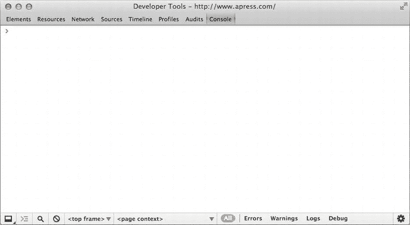
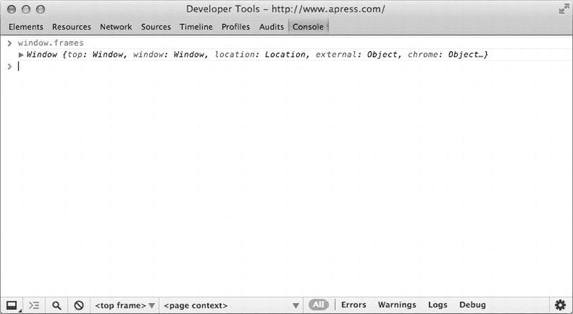
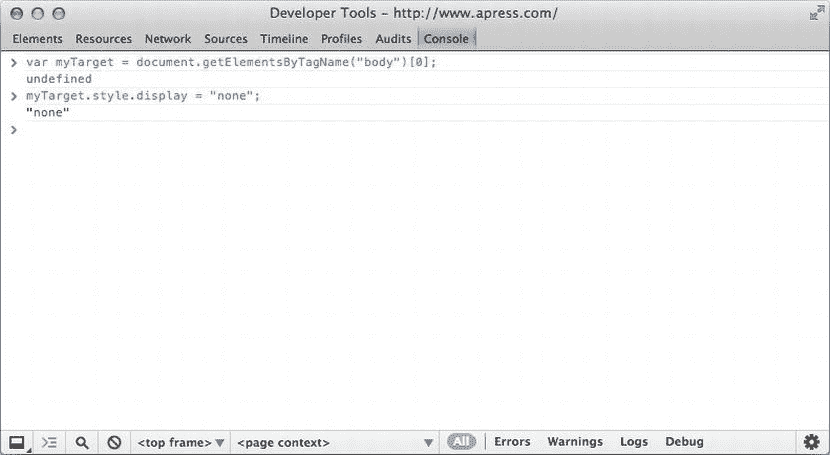

# 四、JavaScript 实战

现在我们已经介绍了 JavaScript 和 DOM 的基础知识，让我们使用新工具。在这一章中，我们挑选了七个项目，它们将帮助您构建自己的项目，并举例说明我们在其他章节中介绍过的许多技术和 JavaScript 特性:

*   使用 JavaScript
*   高效加载脚本
*   使用 XMLHttpRequest 的异步通信
*   跨领域技术
*   数据缓存
*   选择 JavaScript 库
*   使用 jQuery
*   构建自己的 JavaScript 库

使用 JavaScript

虽然从技术上来说不是一个“项目”，但我们想讨论使用 JavaScript 的一些重要方面。我们从 JavaScript 新手那里得到的最常见的问题可能与使用 JavaScript 有关:哪些编辑器是好的？你如何调试？最好的工作环境是什么？使用这种语言有什么诀窍吗？我们想借此机会回答这些问题。

多年来，我们已经在几乎所有可以想象的环境中编写了 JavaScript。JavaScript 的一大优点是，你不需要很多工具来使用它。一个简单的文本编辑器和一个浏览器就足以让你开始，对于基本的项目，这就是你所需要的。但是，一旦您开始从事稍微复杂的项目，您会很快发现自己想要更高级的工具。

在这一节中，我们将介绍 JavaScript 交易的基本工具。首先，我们想了解 JavaScript 开发工具的三位一体:集成开发环境、浏览器和个人 web 服务器。

我们先来谈谈一些比较流行的支持 JavaScript 的集成开发环境(ide)。拥有一个具有语法突出显示、代码完成、重构支持和协作功能等特性的坚实的 IDE 可以帮助驯服一个复杂的项目。可供选择的有很多，很难知道选哪个。

我们还想介绍 web 浏览器提供的开发人员支持。现代 web 浏览器提供了各种非常有用的工具来监控和调试它们运行的 JavaScript。

最后，我们将介绍最常用的个人 web 服务器。您可以使用浏览器的打开文件功能来测试您的脚本，这对于基础工作来说是没问题的。然而，异步通信是构建 JavaScript 应用的基石之一，它需要一个 web 服务器。(我们将在下面的与 XMLHttpRequest 的异步通信一节中介绍异步通信。)

一旦我们介绍了交易工具，我们将讨论如何使用它们。我们将提供一些使用 JavaScript 时常见工作流程的见解，然后谈一谈调试脚本的方法。

JavaScript ides〔t0〕

因为 JavaScript 本质上是文本，所以编写它真正需要的是一个文本编辑器。任何文本编辑器都可以满足这个目的，甚至像 Windows 上的记事本应用这样简单的东西。还有几个代码编辑器可以很好地处理 JavaScript，有些甚至提供了语法高亮等基本功能。我们已经使用 vi 创建项目，并且知道几个同事是 emacs 的死忠用户。我们也非常喜欢 TextMate 和 Sublime Edit，这两个伟大的编辑程序支持多种语言。

当您开始处理包含许多 JavaScript 文件的复杂项目时，您会很快发现您需要比简单的代码编辑器所能提供的更多的特性。这就是集成开发环境(ide)发挥作用的地方。(如果您已经熟悉其他语言的代码编辑环境，那么您的 JavaScript 项目也需要相同的特性。)

集成开发环境将代码编辑器提升到了一个新的层次。典型的 IDE 将提供管理多个文件和文件类型的功能，在项目或应用中将它们组合在一起(确切的术语各不相同)，并且通常提供与其他开发人员协作的功能，例如与源代码控制系统的集成。

有几种支持 JavaScript 开发的 ide。通常，它们都提供一组基本的编辑功能(例如，文件创建、删除、重命名、移动；在单个文件或多个文件中查找/替换；自动缩进)。更好的 ide 将提供更高级的功能，如 代码辅助(一个充当动态助手的功能，根据您键入的内容提供建议或自动完成)。

此外，很多时候你不会只使用 JavaScript。如果您正在处理一个典型的 web 项目，您还将处理 HTML 和 CSS，因此您将希望 IDE 也支持这些。然而，我们发现，如果 JavaScript 支持特别好，我们可以接受 IDE 中 HTML 和 CSS 功能较少的情况。

如果您完全是使用 ide 的新手，我们建议您浏览一下这个列表，并尝试几个选项。许多开发人员热衷于他们的 ide，并声称他们的选择是唯一符合逻辑的，但实际上这个选择是个人偏好。尝试几个 ide 将帮助你找出你的偏好——哪些特性是你真正喜欢的，哪些是你可以不要的——然后你就可以做出选择了。

aptana 工作室

```js
http://www.aptana.com
```

Aptana Studio 是我们首选的 IDE。它构建于 Eclipse 之上(见下文),既可以作为独立安装，也可以作为 Eclipse 插件。Aptana 具有基本 Eclipse IDE 的所有特性(构建集成、跨平台、可脚本化等)。此外，Aptana 还有几个对 web 开发非常有用的特性，特别是 JavaScript 开发:

*   JavaScript、HTML 和 CSS 的代码辅助。
*   代码辅助 jQuery(jQuery 有自己的语法，请参见下面的使用 jQuery)。
*   开箱即用的 Git 集成(Git 是一个非常流行的源代码控制系统；详见`http://git-scm.com/`)。
*   内置的 CLI，用于与 node(或者 ruby，如果您正在使用 Rails)之类的脚本解释器一起工作。
*   JSLint 集成(JSLint 是一个 JavaScript 语法和样式检查器；详见`http://www.jslint.com/lint.html`)。
*   开源，有活跃的社区。通过内部更新系统，Bug 报告会得到快速回复，补丁也会定期推送。
*   因为它是建立在 Eclipse 上的，所以许多现有的 Eclipse 插件将与 Aptana 一起工作(例如 SVN 插件)。
*   Aptana 是免费的。

Aptana 还拥有 Eclipse 的完全可配置的 UI，并且还提供了一个很好的预定义主题库，可以根据您的喜好进行尝试和更改。(我们非常喜欢“自由浓缩咖啡”这个主题。)

Aptana 由 Appcelerator 支持，Appcelerator 是一家专注于为构建移动应用创建工具的公司。详见`http://www.appcelerator.com`。

月食

```js
http://www.eclipse.org
```

Eclipse 是一个开源的 IDE。Eclipse 是为 Java 开发而构建的(它本身也是使用 Java 构建的)，但现在包括了对许多其他语言的支持:JavaScript、C/C++、Ruby、Python、PHP 等。Eclipse 是一个成熟的 IDE，因此它可以处理整个项目，甚至可以与 Ant 等流行的构建系统集成。此外:

*   Eclipse 是跨平台的。因为 Eclipse 是用 Java 构建的，所以它可以在许多操作系统上运行。这意味着您可以一次性学习 Eclipse，而不必担心从 Windows 转换到 Mac，也不必学习全新的 IDE。
*   Eclipse 支持插件。任何人都可以创建插件来扩展 Eclipse 的功能，从浏览器调试到单元测试，再到 SVN 和 Git 集成，都有许多插件。
*   Eclipse 是开源的，有一个活跃的社区。
*   Eclipse 是免费的。

Eclipse 为使用 JavaScript(或 HTML 或 CSS)提供了很少的支持。你可以通过插件增加不同程度的支持。支持 JavaScript 的最著名的 Eclipse 插件是 Aptana(见上文)，但是如果太多的话，还有两个其他的选择。

Amateras `http://amateras.sourceforge.jp/cgi-bin/fswiki_en/wiki.cgi?page=EclipseHTMLEditor`给我们带来了好运，它提供了基本的功能，包括代码高亮、内容辅助、概述和验证。如果你正在寻找轻量级插件中的基本编码支持，Amateras 是一个不错的选择。

Eclipse Web 工具平台是一个旨在为 Web 开发的所有方面提供工具的项目。可以在`http://www.eclipse.org/webtools/`了解更多。他们在`http://www.eclipse.org/webtools/jsdt/`有一个 JavaScript 开发者工具(JSDT)子项目，运行得非常好，提供了基本的代码编辑功能以及集成调试、浏览器依赖的代码辅助、代码概述和透视图等。当我们使用简单的 Eclipse 安装并且不能使用 Aptana 时，Eclipse Web Tools 平台是我们支持 JavaScript 的首选插件。

微软 Visual Web Developer 和 Visual Studio Express

```js
http://www.microsoft.com/visualstudio/eng/products/visual-studio-express-products
```

微软的 Visual Studio 是一个优秀的 IDE，但是对于一个完整的许可来说相当昂贵。为了使他们的工具(以及他们的平台)更容易访问，微软已经创建了一系列 Visual Studio 的“express”版本。Visual Studio Express for Web IDE 是创建 HTML/CSS/JavaScript 应用的绝佳环境。我们使用的是 2010 版本(名为 Visual Web Developer ),它提供了集成基于 Web 的 UI 工作所需的所有功能。NET 后端工作。特点:

*   集成了 Visual Studio 完整版本的工作流，允许您将昂贵的许可证保持在最低水平，而不会限制协作。
*   JavaScript 和 HTML 的代码突出显示和语法检查。
*   SVN 和 Git 集成。
*   单元测试集成。
*   活跃的用户社区，他们乐于回答问题并提供建议。
*   免费。

如果您将为 Windows 构建项目，或者将与这样做的人合作，Visual Studio 系列将是一个很好的选择。

网络形态

```js
http://www.jetbrains.com/webstorm
```

我们知道许多 JavaScript 开发者对 WebStorm 深信不疑，甚至不会考虑使用另一个 IDE。其特点包括:

*   代码突出显示和完成。
*   单元测试集成。
*   JSlint 集成。
*   内部调试器。
*   30 天免费试用，个人许可证 49 美元。

我们自己没有使用过 WebStorm，但是我们已经在同事们的肩膀上看到了足够多的 web storm，足以给我们留下深刻的印象。

浏览器

可能与您选择的 IDE 一样重要的是您选择的用于进行开发的浏览器。当然，您将在所有的目标浏览器中进行测试，但是您将有一个主浏览器，它将是您正在进行的工作的首选，它将始终在后台运行，等待您切换回它并点击刷新以查看您的最新更改。您选择哪个浏览器作为忠实的伙伴将在很大程度上取决于它对 JavaScript 开发的支持程度。

不久前，浏览器对开发者的支持还很少。你可以查看网页的来源，但仅此而已。JavaScript(或 HTML 或 CSS)中的错误会被忽略，除非会在应用中引发不可预知的行为。调试一个复杂的脚本既要遵循任何一种固定的模式，也要有防御性的编码和对浏览器神秘特质的了解。

今天，所有现代浏览器(Safari、Chrome、Firefox 和 Internet Explorer)都有支持开发的工具。一些浏览器提供了非常高级的特性，但是所有的浏览器都至少提供了一个 JavaScript 控制台和查看生成的源代码的能力。

*   JavaScript 控制台:它们都提供了一个控制台，浏览器可以在这里输出错误信息。浏览器还提供对脚本控制台的访问(请参见下面的使用控制台)。
*   查看生成的源代码:所有现代浏览器都为您提供了一种查看页面中所有 JavaScript 运行后生成的文档源代码的方式。如果 JavaScript 修改了 DOM，这些修改将会反映在标记中。这个特性对于确定您的 DOM 操作是否如您所期望的那样运行非常有帮助。每个浏览器对此功能的实现是不同的；请查阅您的浏览器文档以了解如何使用它。

大多数浏览器都有其他非常有用的功能，包括在发生时监控 HTTP 流量的能力(当您发出异步请求，并且想知道您查询的服务器是否返回了您期望的响应时，这很有帮助)，逐行遍历代码的能力，在应用运行时直接操作 HTML、CSS 甚至 JavaScript 的能力，等等。

除了本地开发支持之外，一些浏览器(最著名的是 Firefox)有一个丰富的第三方插件库，可以提供更多的功能。事实上，第三方插件是第一批可用的开发工具。它们的流行让浏览器制造商相信，提供本地工具是吸引开发者使用他们浏览器的好方法。

开发人员支持功能不断发展，因为现代浏览器也在发展，并推动定期和频繁的更新。例如，Firefox 最近在他们的开发工具中添加了一个 3d 视图，它提供了 DOM 的三维视图，你可以从不同的角度查看。

铬合金

谷歌浏览器是我们网络开发的首选浏览器。开发人员工具是健壮的，具有将断点应用于 JavaScript 代码、运行堆栈跟踪、分析效率等功能。我们每天都在使用 Chrome，还没有发现它的开发工具有所欠缺。

Firefox

Firefox 可能是最具扩展性的网络浏览器。最新版本包括一套令人印象深刻的开发工具，其中包括非常有用的 Scratchpad，它使您能够输入 JavaScript 代码并在当前选项卡的上下文中运行它。

然而，Firefox 并不总是内置如此强大的开发工具，因此多年来，web 开发人员不得不依赖插件来提供这种功能。可能最流行的是 Firebug ( `http://www.getfirebug.com`)，它提供了在 Firefox 中进行 web 开发所需的所有功能:DOM 检查器、脚本和网络监视器、JavaScript 控制台等等。

另一个受欢迎的 Firefox 扩展是 Web 开发者工具栏(`https://addons.mozilla.org/en-US/firefox/addon/web-developer/?redirectlocale=en-US&redirectslug=Web_Developer_Extension_%28external%29`)。这个扩展为 Firefox 添加了一个工具栏，具有许多有用的功能:能够选择性地启用或禁用脚本、图像显示或 Firefox 的本机弹出窗口阻止程序等功能；DOM、cookies、表单的检查员；验证工具等。

网络浏览器

Internet Explorer 的开发工具是一个相对较新的补充，但是从版本 10 开始已经相当广泛了。要访问 Internet Explorer 的开发工具，请在查看页面时按 F12。这将打开一个包含可用工具的窗口。

Internet Explorer 的工具包括所有的基本工具:控制台、向 JavaScript 添加断点的能力、效率分析、网络监控等。此外，它还提供了一些有用的特性，比如标准验证，将当前页面提交给各种验证器进行检查。IE 的开发者工具还包括一个可访问性验证器，它在`www.contentquality.com`将当前页面提交给验证器。

IE 的开发工具也可以帮助你管理一些 IE 浏览器更奇怪的方面。例如，使用条件注释，您可以编写针对特定版本的 Internet Explorer 的代码，这些工具提供了一种查看您当前使用的模式的方法。您还可以更改模式，以便在不同的查看模式下测试您的作品。(解释 IE 中的文档模式有点超出本节范围；要得到一个真正好的解释，请看`http://www.nczonline.net/blog/2010/01/19/internet-explorer-8-document-and-browser-modes/`。)

野生动物园

Safari 还有一套丰富的 web 开发工具。要使用它们，请进入首选项高级并选中“在菜单栏中显示开发菜单”选项。这将在主菜单栏中添加一个开发项目，这是您访问 Safari 开发工具的方式。

Safari 的开发者工具与 Chrome 非常相似，这是有意义的，因为它们共享一个共同的代码库。然而，两种浏览器的开发者工具确实不同。例如，Safari 有一个非常有用的代码片段编辑器:从“开发”菜单中选择“显示代码片段编辑器”来打开编辑器。代码片段编辑器实质上为您提供了一个精简的浏览器。在顶部窗格中键入 HTML、CSS 和 JavaScript，它会立即呈现在底部窗格中。Snippets 编辑器非常适合测试样式和原型交互，它为您提供了一个快速尝试代码的地方，而不必经历创建完整 HTML 文件的额外步骤。

网络服务器

现在您已经有了一个用于创建 JavaScript 的编辑器和一个运行它的浏览器，您需要一种方法将您的脚本放入浏览器。本书中的许多示例可以作为简单文件保存在硬盘上，然后直接在浏览器中打开，但是对于真正的 web 开发，您将希望运行自己的本地服务器来测试您的工作。每个操作系统都有自己的 web 服务器选项，甚至还有一个跨平台选项。

柔软

MacOS 内置了一个 Apache web 服务器，在 Mountain Lion 之前，你可以通过控制面板中的共享面板来激活它。苹果移除了控制面板界面，但保留了服务器的完整。你可以从命令行管理服务器，或者我们能够找到至少一个人张贴了一个自定义控制面板窗格，据称恢复了该功能。(我们没有尝试过，但是如果你想试试的话，去你最喜欢的搜索引擎，搜索“替换系统偏好设置面板网络共享”,你应该马上就能找到。)

Windows

Windows 有自己的 web 服务器，称为 Internet 信息服务，简称 IIS。默认情况下，Windows 7 和 Windows 8 的大多数版本都没有安装或启用 IIS，但您可以轻松地将其添加到您的安装中。我们不能在这里涵盖细节(这本身就是一个完整的章节)，但搜索“windows 7 IIS 安装”或“windows 8 IIS 安装”应该可以让你开始。

Xampp

```js
http://www.apachefriends.org/en/xampp.html
```

Xampp 是一个易于安装的跨平台版本的 Apache web 服务器(用 PHP 配置)，以及 MySQL 数据库和其他几个有用的工具。它适用于 Windows、MacOS、Linux 和 Solaris。Xampp 在 Windows 和 MacOS 上的表现都非常好，我们推荐它。

IDE 调试服务器

许多 ide 都有内置的调试服务器。这些将允许您从 IDE 中提供单个页面，或者可能是整个项目。除了简单地服务于文件之外，IDE 通常还提供用于调试代码的集成功能，如断点、堆栈跟踪和单步执行代码，所有这些都在同一个环境中。我们发现用于集成调试的 Visual Studio 工具特别好，但 Aptana 的工具也相当有用。有关如何配置和使用 IDE 集成服务器的详细信息，请参考工具的文档。

JavaScript 开发工作流程

现在，您已经选择了编辑器、浏览器和提供文件的方式，您已经准备好了。最简单地说，一个典型的 JavaScript 开发工作流看起来像任何其他语言的工作流(编写、测试、重复):

1.  写点代码。
2.  将其载入浏览器并观察结果。
3.  重复，修复出现的问题或添加更多功能。

当您编写更复杂的 JavaScript 时，您将需要在脚本执行时检查脚本的方法。一些 ide 和浏览器开发工具提供了一些有帮助的特性，比如检查器或断点，但是有一些基本的技术可以让你得到很多你需要的东西。

使用浏览器控制台

在本书中，我们一直使用警报来监控脚本的进度。警告是好的，但是它的缺点是在等待某人点击 OK 按钮时暂停脚本的执行。

幸运的是，在浏览器的 JavaScript 控制台中有一个强大的警报替代方案。所有现代浏览器都有一个你可以访问的 JavaScript 控制台，通常作为浏览器内置开发工具的一部分，见[图 4-1](#Fig1) 的例子。大多数浏览器都有一个键盘快捷键来调出控制台:对于 Chrome 是 Shift-Control-I，对于 Firefox 是 Shift-Control-J，IE 也有一个控制台；点击 F12 调出开发者工具，点击控制台标签。



[图 4-1](#_Fig1) 。Chrome 浏览器控制台的截图

现代浏览器以 `window.console`对象的形式将控制台的接口暴露给 JavaScript。每个浏览器的控制台不一样，所以每个浏览器的控制台对象也不一样。但是它们都提供了将您自己的文本输出到控制台的方法:

*   `console.log(strText)`:将指定的文本以简单日志的形式输出到控制台。
*   `console.warn(strText)`:将指定的文本输出到控制台作为警告。
*   `console.error(strText)`:将指定的文本作为错误输出到控制台。

Firefox 和 Chrome 都提供了过滤控制台输出的方法，这样你就可以只查看你想要的输出类型。

向控制台输出文本的优点是不会像警报那样中断脚本的执行。现在您已经了解了控制台，您可以执行本书中的任何示例，将 alert 调用替换为`console.log`,并在控制台上看到相同的输出，而不是警报。

将日志记录到控制台提供了一种很好的方式来监视脚本的状态。最常见的用途之一是在脚本执行的不同点输出变量值，以便您可以看到变量是如何变化的。在 Chrome 和 IE 中，你可以向控制台输出任何东西，而不仅仅是字符串。如果你输出一个对象，你会在控制台上看到它被枚举(见[图 4-2](#Fig2) ):



[图 4-2](#_Fig2) 。在 Chrome 浏览器控制台显示一个对象

在 Chrome 中，你甚至可以深入到一个对象的任意深度，包括它的原型继承。这是学习更多关于 JavaScript 和 DOM 的好方法；尝试将`window`对象输出到控制台，并在其中进行探索。

此外，还可以直接与控制台进行交互(参见[图 4-3](#Fig3) )。Firefox 控制台的顶部是一个输入框，有一个标签为“评估”的按钮在 IE 的控制台中，是窗口底部标有>T3 符号的输入框。在 Chrome 中，你只需点击控制台窗口。



[图 4-3](#_Fig3) 。在 Chrome 浏览器控制台输入 JavaScript 命令

我们正在获取对当前文档主体的引用，然后通过将其 display 属性设置为 none 来隐藏它。

您可以在这里输入任何有效的 JavaScript，它将在已经加载到浏览器窗口的页面的上下文中执行。作为一个实验，转到任何页面，在控制台中键入`alert(document.title)`。(通常你只需按下回车键就可以让控制台评估你的代码，但有时你必须在 Firefox 中点击评估按钮。)浏览器窗口应该提醒已加载页面的标题。如果在控制台中输入`window.document`并按 enter(或 evaluate)键，`document`对象应该会出现在控制台中。在 Chrome 中，当你深入这个对象时，你会看到 HTML 标记。。。当你将鼠标放在元素上时，Chrome 会高亮显示窗口中相应的元素。IE 只会枚举一个对象的前几个属性，Firefox 只会输出任何对象的 `toString()`方法的结果。

断点

调试脚本最有用的工具之一是在代码中设置断点的能力:指定浏览器停止执行脚本的点，并允许您检查脚本的当前状态，甚至更改内容。如果您从未在调试过程中使用过断点，我们强烈建议您尝试一下。它对于检查脚本以了解它们是如何工作的也很有用。

Chrome 的开发工具支持断点和逐行遍历 JavaScript 代码。优秀教程见`https://developers.google.com/chrome-developer-tools/docs/scripts-breakpoints`。

Firebug 还支持将断点作为脚本调试的一部分。详见`https://getfirebug.com/wiki/index.php/Script_Debugging`。

高效加载脚本

当您开始编写复杂的 JavaScript 应用时，您会很快发现最大的性能问题之一是应用第一次加载和初始化时速度很慢。有时这些问题是由于技术问题，如脚本阻塞或低效的下载顺序，有时这些问题纯粹是感性的:您可以从技术方面优化您的应用加载过程，但这有副作用(如未修改内容的短暂闪现)，导致您的应用看起来缓慢、低效或未经修饰。

在这一节中，我们将讨论一些技术，您可以使用这些技术来优化实际速度和感知速度。第一步是讨论浏览器如何下载和解析它们的资源，然后我们将提供四个常用技巧来提高应用的加载效率。

浏览器如何下载和处理内容

任何标准都没有规定下载和处理内容的细节，因此浏览器制造商可以自由地实施他们喜欢的任何方法。因此，不同的浏览器(甚至不同版本的浏览器)在实现方式上会有所不同。不过，总的来说，还是有一些共性的:

*   浏览器按顺序解析 HTML 文档。当浏览器解析文档时，它所解析的元素将在 DOM 中可用，并且它将开始下载指定的资源(图像、外部脚本、样式表等)。
*   浏览器可以并行下载多个资源。旧的浏览器只能并行下载两个资源，但是新的浏览器可以处理多达六个。
*   加载外部 JavaScript 文件将阻止其他资源下载。这是因为脚本可能会修改 DOM，甚至将浏览器重定向到不同的页面，因此为了避免不必要的下载，浏览器不会开始任何其他并行下载，直到脚本被加载、解析和执行。

在本书中，我们的例子通过总是将 JavaScript 放在 HTML 标记的末尾，就在`</body>`标签之前，来说明文档解析的顺序。这保证了浏览器在脚本试图访问元素之前已经解析了 HTML。如果您颠倒了顺序，您将最终得到一个试图访问尚不存在的元素的脚本，这通常会导致错误。为了演示，考虑第三章的[中的](3.html)[清单 3-3](#list1) :

[***清单 3-3。***](#_list1) 使用 getElementById()

```js
<!DOCTYPE html>
<html>
        <head>
               <title>JavaScript Developer’s Guide</title>
        </head>
        <body>
            <p id="myParagraph">This is my paragraph! <span class="hideme">Lorem ipsum</span> dolor            sit amet.<span></span></p>
            <p class="hideme">Another paragraph!</p>
            <script>
var myPar = document.getElementById("myParagraph"); // myPar is now a pointer to the paragraph.
myPar.innerText = "I have changed the content!";    // Change the text of the paragraph to "I have changed the content!"
            </script>
        </body>
</html>
```

这个简单的例子演示了如何使用`getElementByID()`方法来改变一个段落的文本。如果我们把`<script>`标签放在`<p>`标签之前，这个例子就不起作用了，如[清单 4-1](#list2) 所示:

[***清单 4-1。***](#_list2) 试图在 DOM 元素可用之前访问它

```js
<!DOCTYPE html>
<html>
        <head>
               <title>JavaScript Developer's Guide</title>
        </head>
        <body>
            <script>
var myPar = document.getElementById("myParagraph"); // myPar is now a pointer to the paragraph.
myPar.innerText = "I have changed the content!"; // Change the text of the paragraph to "I have changed the content!"
            </script>
            <p id="myParagraph">This is my paragraph! <span class="hideme">Lorem ipsum</span> dolor             sit amet.<span></span></p>
            <p class="hideme">Another paragraph!</p>
        </body>
</html>
```

脚本将无法访问该段落，因此`getElementById()`将返回 null。当我们试图改变`null`的`innerText`属性时，JavaScript 引擎会抛出一个错误，因为`null`没有属性。

此外，在我们所有的例子中，我们的脚本是内联的，这意味着它们实际上在文档本身中。当您编写更长更复杂的脚本时，您会发现将它们保存在单独的文件中比将它们内联更容易。单独的文件使维护和与其他程序员的协作更容易，并允许您利用内容分发网络等部署选项。

不幸的是，当您将脚本作为单独的文件加载时，这意味着它们会阻止文档中跟在它们后面的资源的并行下载。这让我们想到了优化应用的第一个技巧:在文档末尾加载脚本。

优化技巧 1:在文档末尾加载脚本

优化应用加载过程的一个关键技术(如果这么简单的想法也可以称为技术的话)是，在所有其他内容都已加载之后，在文档末尾加载脚本。那么他们就不能阻止任何其他的下载，脚本可能需要访问的任何元素都会出现在 DOM 中。

这种技术有时会产生不希望的副作用:假设您有一个简单的 HTML 文档，但您用复杂的 JavaScript 对其进行了大量修改。您已经设置了您的文档结构，这样您的所有脚本都在文档的末尾加载。这会导致一个简单的 HTML 文档加载并出现在浏览器中，然后浏览器开始加载、解析并执行您的脚本。当浏览器这样做的时候，你未修改的内容被显示给用户，甚至更糟，因为脚本加载是一个阻塞过程，如果用户试图与页面交互，什么也不会发生。然后，浏览器将完成加载、解析和执行您的脚本，突然之间，浏览器将显示您想要的应用。这种“未修改(或未样式化)内容的闪现”虽然短暂，但会使您的应用显得粗糙和低效，即使从技术上讲，您的应用已经针对加载效率进行了优化。

如果你发现自己在处理未经修改的内容，请记住这是一个感知问题。用户看到了一些他们没有预料到的东西，并且对他们没有帮助，这给人一种你的应用有问题的感觉。在感知效率低下的情况下，你通常可以通过向用户提供一些有用的东西，比如加载屏幕，将它转化为你的优势。加载屏幕告诉用户应用仍在运行；只是还没准备好。如果您的脚本加载和执行效率很高，这通常足以为您的应用赢得运行所需的时间。

创建负载指示器很容易；只需在文档的最开始包含它的标记，这样它就是第一个被解析和显示的东西。它可以是屏幕中间的一个简单的方框，显示“正在加载…”的信息，也可以是一个小图片。通常，加载指示器绝对位于屏幕中间，并阻止对其下方元素的访问。要消除它，您只需在最后一个脚本的末尾进行一个简单的调用，以访问 DOM 中的加载程序，或者删除它，或者，如果您以后想再次使用它，只需隐藏它。

这里有一个用定时器模拟加载延迟的例子。在[清单 4-2](#list3) 中，我们有一个简单的加载指示器，它覆盖了屏幕上的所有内容，然后当应用“就绪”时(在本例中，当定时器到时)，脚本隐藏它:

[***清单 4-2。***](#_list3) 简单装载指示器

```js
<!DOCTYPE html>
<html>
        <head>
               <title>JavaScript Developer's Guide</title>
               <style>
body, h1 {
    margin: 0;
    padding: 0;
}
#container-loading {
    position: absolute;
    /*
     * Radial gradient CSS generated by CSS Background Maker
     * http://ie.microsoft.com/testdrive/graphics/cssgradientbackgroundmaker/default.html
     */
    /* IE10 Consumer Preview */
    background-image: -ms-radial-gradient(center, circle farthest-corner, #9E9E9E 0%, #141414 100%);
    /* Mozilla Firefox */
    background-image: -moz-radial-gradient(center, circle farthest-corner, #9E9E9E 0%, #141414 100%);
    /* Opera */
    background-image: -o-radial-gradient(center, circle farthest-corner, #9E9E9E 0%, #141414 100%);
    /* Webkit (Safari/Chrome 10) */
    background-image: -webkit-gradient(radial, center center, 0, center center, 506,     color-stop(0, #9E9E9E), color-stop(1, #141414));
    /* Webkit (Chrome 11+) */
    background-image: -webkit-radial-gradient(center, circle farthest-corner, #9E9E9E 0%, #141414 100%);
    /* W3C Markup, IE10 Release Preview */
    background-image: radial-gradient(circle farthest-corner at center, #9E9E9E 0%, #141414 100%);
}

#container-loading div {
    width: 200px;
    height: 100px;
    border: 2px solid #ccc;
    background-color: #fff;
    text-align: center;
    line-height: 100px;
    font-family: arial, helvetica, sans-serif;
    font-weight: bold;
    font-size: 1.5em;
    border-radius: 20px;
    position: absolute;
}
               </style>
        <script>
function showLoading(boolShow) {
    var loadingIndicator = document.getElementById("container-loading"),
        loadingMessage = loadingIndicator.querySelector("div");
    if (boolShow === true) {
        // Show the loading indicator.
        // Position everything
        loadingIndicator.style.width = window.innerWidth + "px";
        loadingIndicator.style.height = window.innerHeight + "px";
        loadingMessage.style.left = ((window.innerWidth - 200) / 2) + "px";
        loadingMessage.style.top = ((window.innerHeight - 100) / 2) + "px";
        loadingIndicator.style.display = "block";
    } else {
        loadingIndicator.style.display = "none";
    }
}
        </script>
        </head>
        <body>

            <!-- Begin: Loading Indicator -->
            <div id="container-loading">
                <div>
                    Loading...
                </div>
            </div>
        <script>
// Initialize and show the loading indicator.
showLoading(true);
        </script>
            <!-- End: Loading Indicator -->

            <!-- Begin: Rest of document -->
            <h1>Hello World!</h1>
            <!-- Pretend complex markup goes here -->
            <!-- End: Rest of document -->

        <!-- Begin: loading scripts -->
        <!-- Script(s) loaded here -->
        <!-- End: loading scripts -->
        <script>
// Simulate a loading delay with a timer
setTimeout(function() {
    showLoading(false);
}, 2000);
        </script>
        </body>
</html>
```

请注意，在这个加载指示器中，我们包含了两位内联 JavaScript 来处理定位和布局，以及隐藏和显示指示器。内联 JavaScript 的第一部分在文档的头部，它设置了一个`showLoading()`函数，我们可以用它来显示或隐藏加载对话框。我们可以很容易地在主体中包含函数定义，在加载对话框标记之后，但是函数不需要跟随标记来定义，因为它在被调用之前不会访问元素。如果我们在头部定义了函数，但直到它访问的元素被解析后才调用它，它将按预期工作。如果我们愿意，我们甚至可以将这个简单的脚本提取到一个单独的文件中，并使用非阻塞技术加载它；参见提示 3。

内联 JavaScript 的另一部分只是调用`showLoading()`函数来初始化加载器并正确显示它。因为这个脚本只做一件事，为了提高效率，让它内联在文档中是有意义的，而不是把它提取到一个单独的文件中(把它提取到一个单独的文件中也会导致它阻止加载后面的复杂文档)。

加载屏幕是阻止脚本问题的一个简单解决方案，但是它们有几个警告。首先，它们并不真的适合所有情况。例如，如果你正在建立一个信息网站，你肯定不想让人们等待你的网站加载。另一方面，如果您正在构建一个复杂的数据驱动的 web 应用，加载指示器会非常有用。

其次，你应该尽量减少加载延迟，这样你就永远不需要加载指示器，或者它只在屏幕上出现尽可能短的时间。我们的下一个优化技巧将帮助您实现这一目标。

优化技巧#2: 合并、缩小和 GZip

提高 JavaScript 应用效率的一种常用技术是将脚本合并到尽可能少的文件中。这减少了浏览器必须发出的 HTTP 请求的数量，并且对应用的加载速度有很大的影响。即使您只有十几个 JavaScript 文件，浏览它们并决定哪些可以合并也是一个好主意。

如果您不愿意将脚本合并到一个文件中，因为这会使它们难以维护，这是一个合理的担忧。这就是为什么许多项目都有一个发布步骤，即获取应用的开发版本，并将 JavaScript 文件组合成一个文件。这样，开发人员可以保留更易于管理的独立文件，但用户不必承受额外的加载时间。请注意，当您这样做时，这意味着您和您的程序员同事工作的环境与您的用户将会经历的环境是不同的。用户将体验到一个更加优化的环境，这可能会导致一些您不会看到的问题。您应该在“编译”的产品版本中定期测试您的应用，以避免在部署时被错误吓到。

另一种常见的部署优化技术是缩小组合的 JavaScript 文件。缩小是一种方法，其中自动解析程序加载一个 JavaScript 文件，然后尝试通过删除注释、删除不必要的空格以及用较小的名称替换长的变量、属性和方法名称来减小文件的整体大小。结果是 JavaScript 对人来说很难阅读，但哪些浏览器理解起来没有问题，哪些文件大小明显更小，从而减少了下载时间。

最后，JavaScript 文件通常在部署之前使用 GZip 压缩算法进行压缩。浏览器能够接受 GZipped JavaScript 文件，并在处理它们之前在内部解压缩。尽管这为浏览器执行带来了额外的步骤，但它所花费的时间通常比将未压缩文件传输到浏览器所花费的时间要少得多，从而提高了整体性能。GZip 只适用于 100 字节左右以上的文件；小于这个值的文件实际上会变大，因为 gzip 压缩确实会增加文件的开销。但是，如果文件足够大，与节省的空间相比，开销并不明显。

您可以缩小或 GZip 您的 JavaScript 文件，但是最节省大小(以及网络传输时间)的方法是两者都做。有几个工具可用于缩小 JavaScript:

*   谷歌的闭包编译器:谷歌的闭包编译器不只是缩小你的 JavaScript，它还会优化它。它删除未使用的代码路径，重写低效代码，然后缩小结果。输出通常比简单的缩小要小得多，而且运行速度也快得多。参见`https://developers.google.com/closure/compiler/`了解在项目中使用闭包编译器的细节。
*   JSMin :最古老的迷你相机之一，但仍然非常好，是道格拉斯·克洛克福特的 JSMin，在`http://www.crockford.com/javascript/jsmin.html`有售。它只是缩小了代码，并没有像闭包编译器那样重写低效的代码，所以提供了一种稍微不那么粗暴的方法。它是用 C 编写的，但是很容易构建，并且可以很好地集成到部署脚本中。
*   YUI 压缩器:由雅虎构建，是他们 YUI 图书馆的一部分，YUI 压缩器是缩小你的 JavaScript 的一个很好的选择。作为一个额外的奖励，它也可以缩小 CSS 文件。YUI 压缩器也可以包含在节点脚本中，这使得使用 JavaScript 编写自己的部署脚本变得非常容易！关于 YUI 压缩机的详细信息，请参见`http://yui.github.com/yuicompressor/`。

gzip 文件可以在部署时手动压缩，也可以指示大多数现代 web 服务器在传输文件之前自动压缩某些类型的文件。Apache 模块`mod_deflate`(见`http://httpd.apache.org/docs/2.2/mod/mod_deflate.html`)使得指定要压缩的文件类型，或者甚至要为哪些浏览器压缩变得容易。如果您正在使用 Xampp，可以通过在配置文件中取消注释适当的指令，将其配置为使用`mod_deflate`，详细信息请参见`http://stackoverflow.com/questions/6993320/how-to-enable-gzip-compression-in-xampp-server`。对于其他服务器，查看文档，看看有什么可能。

优化技巧 3:使用非阻塞技术在文档头中加载脚本

在技巧 2 中，我们在文档的头部有一小段内联脚本，它定义了隐藏和显示加载指示器的函数。包含在文档的头部是安全的，因为它只是一个函数定义，并不将 DOM 作为其定义的一部分来访问。当您编写脚本时，您会发现它们中的很大一部分属于 JavaScript 类，可以加载到文档的头部，因为它在被调用之前不会访问 DOM。JavaScript 库通常属于这一类。

如果我们可以在头部加载这些脚本，我们就不必在文档的末尾加载它们，这将减少用户查看加载对话框的时间，甚至可能完全消除对加载对话框的需求。但是如果我们把它们作为单独的文件加载到头部，它们会阻止后面的任何东西。

幸运的是，有一种异步加载脚本的方法。脚本阻止加载其他素材的原因是因为它们是常规文档流的一部分。如果我们将脚本注入到文档中，它们将不会成为常规文档流的一部分。浏览器仍然会加载、解析和执行它们，但是它们不会阻止其他素材的加载。

脚本标签可以像任何其他 DOM 元素一样注入到文档中。您只需创建一个新的`<script>`标签，设置它的`src`属性，然后将它附加到 DOM 中。当您将它添加到 DOM 中时，浏览器将开始下载脚本。

举个例子，假设我们有几个想要定义的函数——可能是我们自己的 JavaScript 库。我们希望创建几个预定义的数据对象，这些对象在一个单独的文件中定义，我们可能希望加载一个分析包以及一个由内容分发网络提供的第三方库。这些脚本都不需要 DOM 就可以执行(虽然它们中的任何一个都可能定义了在被调用时访问 DOM 的方法——但是只要我们在 DOM 准备好之前不调用这些方法，我们就没事了),所以我们可以在头部加载它们。清单 4-3 是一个名为 manifest-loader.js 的示例脚本，它可以完成所有这些工作:

[***清单 4-3。***](#_list4) manifest-loader.js

```js
// Define a manifest array of scripts to load
var defaultManifest = [
  "scripts/js-lib.js",
  "scripts/js-objects.js",
  "scripts/third-party/omniture.js",
  "http://big.cdn.com/useful-library.js"
]

// Define a function to load a manifest array.
function loadManifest(arrManifest) {
    var i,
        arrManifestLength = arrManifest.length;

    for (i = 0; i < arrManifestLength; i++) {
        var newScript = document.createElement("script");
        newScript.src = arrManifest[i];
        document.getElementsByTagName("head")[0].appendChild(newScript);
    }
}
```

在这个例子中，我们首先创建一个包含所有想要异步加载的 URL 的清单数组。然后我们定义一个函数，当给定一个清单数组时，该函数将遍历数组，创建一个新的脚本标记，设置`src`属性，然后将脚本标记附加到文档的头部，从而导致脚本异步加载。

现在我们可以将这个脚本加载到我们假设的文档的头部。我们还可以包含一个更小的调用`loadManifest(defaultManifest)`的内联脚本，我们所有的脚本将开始加载而不会阻塞文档的其余部分，如[清单 4-4](#list5) 所示:

[***清单 4-4。***](#_list5) 使用载货单装载器

```js
<!DOCTYPE html>
<html>
    <head>
        <title>JavaScript Developer's Guide</title>
           <script src="scripts/js-loader.js"></script>
        <script>
loadManifest(defaultManifest);
        </script>
        </head>
        <body>

            <h1>Hello World!</h1>

        </body>
</html>
```

清单中的这些脚本都不需要准备好 DOM，这一点非常重要，因为当它们被加载时几乎肯定是不可用的。请注意，确定文档何时准备好是可能的，但是不同浏览器之间的细节差异很大，甚至给定浏览器的不同版本之间的细节差异也很大。然而，这是许多 JavaScript 库提供的一个常见功能(如 jQuery，见下文)。

如果您不想自己构建这种基础设施，您可以在现有的 JavaScript 库中寻找您需要的特性。例如，RequireJS ( `http://requirejs.org/`)将这种技术向前推进了一步，允许您在 JavaScript 文件中指定依赖关系，这些文件可以根据需要动态加载。

优化技巧 4: 适度是好的

不要陷入思维的陷阱，认为你绝对必须使用任何(或所有)这些技术。当您优化应用加载过程时，您应该始终考虑什么对您的特定情况最有意义。在上面的加载指示器示例中，我们将一些脚本内嵌在文档中，而不是从外部文件中加载。我们这样做是因为将它们放在它们应该在的地方保证了它们在我们需要的时候可用(就在浏览器解析文档的必要部分之后),并且因为它们足够小以至于没有必要对它们进行优化。

在你的项目中，你应该进行实验，看看什么样的技术组合能提供最好的结果。您可能会发现，您将使用这些技术的组合来平衡所有目标浏览器的开发需求和部署需求。

正如技巧 3 中提到的，如果你不想自己构建这种优化基础设施，你可以在 JavaScript 库或框架中寻找你需要的特性。

使用 XMLHttpRequest 的异步通信

除了基于用户请求(或 JavaScript 命令)加载和显示页面之外，浏览器还提供了另一种访问服务器的方法:XMLHttpRequest 对象。这个对象为 JavaScript 提供了一个接口，用于向 web 服务器发出请求，并根据需要处理响应。该界面与简单加载页面的主要区别在于，这些请求可以异步发出——它们在后台运行，不会阻止用户与主页面的交互。此外，这些请求的结果可以由 JavaScript 处理，并根据需要合并到当前文档中。因此，使用这种技术可以创建不需要页面刷新的用户交互，为 web 应用提供更像应用的外观和感觉。

从名称 XMLHttpRequest 可以看出，请求可能涉及 XML。事实上，当该技术首次实现时，XML 是编码信息的首选方式。但是，这种技术可以包含任何可以通过 HTTP: HTML、JSON 甚至纯文本传输的编码数据。这项技术还有另一个名字:异步 JavaScript 和 XML，简称 AJAX。

XMLHttpRequest 技术最初是由微软实现的，它非常有用，以至于其他浏览器很快也实现了它，现在它已经成为 DOM 标准的一部分

它是如何工作的

XMLHttpRequest 对象为您执行所有的网络访问，通过所有必要的步骤来联系服务器并与之正确通信。当它完成工作时，它会在不同的点分派事件——例如，当它完成与服务器的通信时，或者如果发生了错误。您为这些事件提供事件处理程序，以正确处理结果。

基本步骤如下:

*   创建所需的事件处理函数。
*   创建 XMLHttpRequest 对象的新实例，并对其进行配置以供使用(包括提供事件处理程序)。
*   指示 XMLHttpRequest 对象发出请求。在它工作的时候，它会在适当的时候分派事件。

让我们一次一个地检查这些步骤。

步骤 1: 事件处理程序

当 XMLHttpRequest 对象完成它的工作时，它将分派您可以为其提供处理程序的事件。与 DOM 交互事件(如 click 或 keypress)一样，事件处理程序将在事件发生时被调用，并将被传递一个包含事件信息的事件对象。事件类型包括:

*   `readystatechange`:这个事件在 XMLHttpRequest 对象工作时被多次触发。触发时，该事件将在事件对象上提供一个`readyState`属性，该属性将具有下列值之一:

*   0: Unsent，表示 XMLHttpRequest 对象已创建，但请求尚未发送。
*   1:已打开，意味着`open()`方法已被调用并成功完成(因此请求正在进行中)。
*   2: Headers received，表示已从服务器接收到所有头(这包括重定向头，如果有的话)。此时，事件对象的 status 属性现在是可用的，并将拥有来自服务器的 HTTP 响应代码。
*   3:正在加载，意味着正在加载响应。
*   4: Done，表示响应已成功加载。来自服务器的响应现在位于事件对象的`responseText`属性中。

*   `abort`:当请求被中止时触发(如调用`XMLHttpRequest.abort()`方法时)。
*   `error`:发生错误情况时触发。
*   `load`:当请求成功完成时触发。
*   `loadend`:当请求完成时触发，不管成功与否。
*   `loadstart`:发送请求时触发。
*   `progress`:加载过程中，随着加载的进行而触发。
*   `timeout`:如果在请求完成之前经过了指定的超时时间，则触发。

除了`readystatechange`事件之外，所有这些事件对于最新版本的 XMLHttpRequest 规范来说都是新的，因此它们可能无法在所有目标浏览器中完全实现。(比如 Webkit，只刚刚实现了`timeout`事件；参见`https://bugs.webkit.org/show_bug.cgi?id=74802`。)事件`readystatechange`是由原始规范指定的遗留事件，并被广泛实现，它提供了我们处理大多数成功和错误情况所需的所有信息。

一个好的`readystatechange`事件处理程序使用`readyState`属性来查看请求进展到什么程度，并据此采取相应的行动。它还将使用`status`属性来检查 HTTP 状态消息(比如文件未找到的状态 404)。我们可以在清单 4-5 中看到这一点:

[***清单 4-5。***](#_list6) 简单的 readystatechange 事件处理程序

```js
function handleReadyStateChange(objXHR) {
  if (objXHR.readyState === 4) {
    // Request is done.  Was the requested file found?
    If ((objXHR.status !== 200) && (objEvent.status !== 304)) {
      // Something happened..possibly the requested file wasn't found?
      // Tell the user that something went wrong.
      console.error("An error occurred while processing the request.");
    } else {
      // The requested file was found and sent and the content is now available in
      // the objXHR.responseText property:
      console.log(objXHR.responseText);
    }
  }
}
```

我们假设随着请求的进行，这个事件处理程序将被多次调用，但是我们唯一想做的事情是当`readyState`属性为 4 时，这意味着请求已经完成。然后我们检查服务器返回的 HTTP 状态，它位于`status`属性中。我们将假设除了 200(成功)或 304(资源未修改)之外的任何状态都是错误情况；但是，如果您愿意，您可以根据不同的状态代码进行更详细的错误处理。(参见`http://www.w3.org/Protocols/rfc2616/rfc2616-sec10.html`了解状态码的完整列表、含义以及何时提供。)假设请求成功，我们简单地将结果输出到控制台。(显然，除了将结果发送到控制台，您还可以做更多的事情；这是一个简单的例子来说明这个模式。)

步骤 2: 创建和配置 XMLHttpRequest 对象

浏览器的`XMLHttpRequest`对象是一个抽象对象，这意味着它不能被直接访问，而是被用作创建新实例的模式。您在脚本中使用这些新实例来执行异步请求。你甚至可以有不止一个。

要创建一个新的`XMLHttpRequest`对象，只需像使用任何 JavaScript 构造函数一样使用`new`关键字:

```js
var myXHR = new XMLHttpRequest();
```

此语法在所有支持此功能的浏览器中都有效，只有 Internet Explorer 6 例外。对于 IE6，这个特性仍然可用，但是需要调用一个新的 ActiveX 对象。

一旦有了新对象，就需要对其进行配置。至少，`XMLHttpRequest`对象需要知道要请求的 URL，使用什么 HTTP 方法来发出请求(通常是`GET`或`POST`，但是如果您只想检查 URL 的头而不实际获取它，您也可以发出`HEAD`请求)，任何需要的支持数据(例如，`POST`的表单数据)，以及至少一个在成功时要执行的事件处理程序。

首先使用`open()`方法打开对象:

```js
myXHR.open(strMethod, strURL, boolAsynchronous);
```

*   `strMethod`:请求使用的 HTTP 方法
*   `strURL`:想要使用的 URL
*   `boolAsynchronous`:一个布尔值，表示是否异步执行请求。该参数是可选的；如果省略，则默认为`true`。(如果设置为`false`，这将导致请求被同步执行，并且它将在请求期间暂停浏览器，就像常规的页面加载一样。)

然后，一旦打开了对象，就可以注册事件处理程序。最常见的选择是在`readystatechange`事件上注册一个事件处理程序:

```js
myXHR.onreadystatechange = function() {
    handleReadyStateChange(myXHR);
};
```

这将我们之前定义的`handleReadyStateChange()`函数注册为`readystatechange`事件的事件处理程序。(如果您只使用实现了最新版本标准的浏览器，您也可以使用`addEventListener()`方法，就像这是任何其他 DOM 事件一样。)

步骤 3: 发送请求

发送请求很容易。您所要做的就是在配置的对象上调用`send()`方法:

```js
myXHR.send(postData);
```

*   `postData`:来自作为请求的一部分被发布的表单的数据。在`GET`请求的情况下，这将总是空的。

此时，对象将执行请求并触发事件处理程序，如上所述。

 **注意**你可以向任何服务器发送一个 XHR 请求，甚至是一个与你的页面源在不同域的服务器。但是，对请求结果的访问受到同源策略的限制。除非响应的来源与您的脚本的来源匹配，否则您的脚本将无法访问响应。本章的“跨域方法”一节讨论了一些安全避开这些限制的技术。

把这一切放在一起

配置和发送 XMLHttpRequest 非常简单，但是如果我们创建一个函数来完成所有的工作，我们可以在脚本中使它变得更简单。

一个健壮的`XMLHttpRequest`对象需要很多东西:URL、方法、任何 post 数据，以及成功、错误和超时的回调。我们可以在一个单独的函数中提供每一个单独的参数，但是把它们都聚集到一个单独的对象中，然后把那个对象作为一个单独的参数提供给函数，会更有条理，如[清单 4-6](#list7) 所示:

[***清单 4-6。***](#_list7)XMLHttpRequest函数的配置对象

```js
var myXhrDefs = {
    strMethod : "GET",
    strUrl : "http://myhost.com/ajax-test.txt",
    intTimeout: 3000,
    postData: null,
    boolAsync: true,
    successCallback: function(objXHR) {
        // Do things when the request is successful
        console.log(objXHR.responseText);
    },
    errorCallback: function(objXHR) {
        // Do things when there is an error in the request.
        console.error("The XHR failed with error ", objXHR.status);
    },
    timeoutCallback: function() {
        // Do things when a timeout occurs.
        console.error("The XHR timed out.");
    }
}
```

这里我们把所有的东西都聚集到一个对象中，甚至是对象上的方法回调。在清单 4-7 的[中，我们可以构建一个函数，使用这个对象作为参数来处理我们的`XMLHttpRequests`:](#list8)

[***清单 4-7。***T5】一个 XMLHttpRequest 函数](#_list8)

```js
function doXHR(myXhrDefs) {

    // Create and configure a new XMLHttpRequest object
    var myXhr = new XMLHttpRequest(),
        myTimer = null;
    myXhr.open(myXhrDefs.strMethod, myXhrDefs.strUrl, myXhrDefs.boolAsync);

    // Register the error and success handlers
    myXhr.onreadystatechange = function() {

        // If readyState is 4, request is complete.
        if (myXhr.readyState === 4) {

            // Cancel the timeout timer if we set one.
            if (myTimer !== null) {
                clearTimeout(myTimer);
            }

            // If there's an error, call the error callback,
            // Otherwise call the success callback.
            if ((myXhr.status !== 200) && (myXhr.status !== 304)) {
                if (myXhrDefs.errorCallback != null) {
                    myXhrDefs.errorCallback(myXhr);
                }
            } else {
                myXhrDefs.successCallback(myXhr);
            }
        }
    }

    // Handle timeouts (set myXhrDefs.intTimeout to null to skip)
    // If we're working with a newer implementation, we can just set the
    // timeout property and register the timeout callback.
    // If not, we have to set a start running that will execute the
    // timeout callback. We can cancel the timer if/when the server responds.
    if (myXhrDefs.intTimeout !== null) {
        if (typeof myXhr.ontimeout !== "undefined") {
            myXhr.timeout = myXhrDefs.intTimeout;
            myXhr.ontimeout = myXhrDefs.timeoutCallback;
        } else {
            myTimer = setTimeout(myXhrDefs.timeoutCallback, myXhrDefs.intTimeout);
        }
    }

    // Send the request
    myXhr.send(myXhrDefs.postData);
}
```

在这个例子中，我们创建了一个可以处理所有 XMLHttpRequest 需求的函数。它创建并配置一个新的`XMLHttpRequest`对象，然后根据需要注册所提供的事件处理程序。对于尚未实现 XMLHttpRequest 的`timeout`特性的浏览器，它使用`setTimeout()`实现了一个计时器。然后它为我们发送请求。要使用该函数，我们只需设置一个对象，然后调用该函数:

```js
doXHR(myXhrDefs);
```

将我们所有的 XMLHttpRequest 代码放入一个函数中使得维护和升级更加容易；我们只在一个地方调用它，而不是在代码中可能的多个地方手动管理`XMLHttpRequest`对象。

跨领域技术

所有浏览器都实现了一种称为同源策略的安全措施。该策略允许页面上的脚本访问彼此的属性和方法，只要它们都来自相同的来源:相同的协议(http 或 https)、相同的主机名和相同的端口号(如果指定的话)。不同来源的脚本不允许相互交互。如果没有这个策略，恶意脚本可能会访问我们的页面和数据。

不幸的是，这种策略也阻碍了应用轻松处理来自多个来源的数据。但是，有一些方法可以绕过这个限制，因为这是 JavaScript 开发中的一个常见障碍，所以我们想在这里简单介绍一下。

请注意，所有这些技术都包含潜在的安全风险，所包含的风险将根据您如何使用它们而有所不同。在使用这些技术之前，您应该仔细评估它们的安全性问题，以避免恶意脚本访问您的页面或数据。

服务器端代理

最容易实现的解决方案之一是创建一个在您的域上运行的简单代理服务，并使用它来完成所有跨域查询。从浏览器的角度来看，所有请求都来自同一个来源，所以一切正常。

您可以用任何语言实现服务器端代理，包括 JavaScript(多亏了 node.js)。事实上，已经有几个使用 node 构建的代理服务器。我们已经使用 PHP 和 Java 构建了简单的代理。一个很好的例子，见 Ben Alman 的简单 PHP 代理，可在`http://benalman.com/projects/php-simple-proxy/`获得

JSONP

JSONP 代表“带填充的 JSON”，这是一种通过使用脚本注入绕过相同起源策略的技术的一个相当容易混淆的名称。

同源策略的一个例外是，通过带有`src`属性的`<script>`标签加载的脚本是豁免的，并且可以访问来自另一个源的脚本以及被来自另一个源的脚本访问。有关这方面的示例，请参见下面使用 jQuery 一节中的示例，我们从一个内容分发网络加载 jQuery，这个网络肯定与示例页面的来源不同。如果不是这个例外，我们不可能做到这一点。

通常，当您查询服务时，会得到一个 JSON 字符串作为响应。然后，您可以使用`JSON.parse()`将字符串反序列化为一个对象，然后访问对象的属性来做您需要的事情。如果服务与查询页面的来源不同，则同源策略会阻止这种情况。

但是，如果服务不返回简单的 JSON 字符串，而是返回一个可以注入查询页面的脚本，那该怎么办呢？如果我们这样做了，注入的脚本将不受同源策略的约束，我们将能够根据需要访问它的属性和方法。这是 JSONP 的关键:服务不直接返回 JSON 进行解析，而是返回 JSON 填充在注入主机文档的脚本中。

JSONP 中通常使用两种不同的填充。一种是返回的脚本简单地进行变量赋值，就像这样:

```js
myResponse = { "foo" : bar, "serial" : 238 };
```

如果通过脚本标签注入到宿主文档中，变量`myResponse`将在全局范围内可用，使您能够根据需要访问属性。

另一种方法是让返回的脚本执行函数调用，如下所示:

```js
responseHandler({ "foo" : bar, "serial" : 238 });
```

这将执行`responseHandler()`函数,将所需数据作为对象文字。(这假设您已经定义了一个函数`responseHandler()`，这样注入的脚本当然可以调用它。)

您需要的填充类型通常由目标服务指定。反过来，在注入脚本标记时，您将在对目标服务的查询中指定变量或函数的名称，如下所示:

```js
<script src="http://www.service.com/getserial?jsonp=myResponse"></script>
<script src="http://www.service.com/getserial?jsonp=responseHandler">>
```

确切的语法将由服务提供；可能不是“`jsonp=varname`”也不是“`jsonp=functionname`”。(比如 Twitter 规定格式应该是“`callback=functionname`”——见`https://dev.twitter.com/docs/things-every-developer-should-know#jsonp`。)

一步一步来看，事情是这样的:

*   如果服务指定用函数调用填充 JSON，那么创建一个可以用来处理数据的函数。如果服务指定它将为 JSON 填充一个变量赋值，如果您愿意，您可以命名该变量。
*   创建一个新的`<script>`标签。更新它的`src`属性，将目标 URL 格式化为服务指定的格式。
*   将`<script>`标签附加到文档中。这将导致浏览器获取其 URL，从而导致跨域调用。

注意，这意味着您将在每次 JSONP 调用时创建一个新的`<script>`标记。如果你只是打几个电话(可能十几个或更少)，那可能没问题。但是如果你非常依赖 JSONP，你会想要重用你的`<script>`标签，这样你就不会以一个臃肿的 DOM 和随之而来的内存问题而告终。最简单的方法是编写一个简单的函数来处理所有的 JSONP 调用，如[清单 4-8](#list9) 所示:

[***清单 4-8。***](#_list9) 执行 JSONP 的函数调用并回收脚本标签

```js
function executeJSONPQuery(strUrl) {
    // Check to see if a jsonp script tag has already been injected.
    // Also, create a new script tag with our new URL.
    var oldScript = document.getElementById("jsonp"),
        newScript = document.createElement("script");
    newScript.src = strUrl;
    newScript.id = "jsonp";

    // If there is already a jsonp script tag in the DOM we'll
    // replace it with the new one.
    // Otherwise, we'll just append the new script tag to the DOM.
    if (oldScript !== null) {
        document.body.replaceChild(newScript, oldScript);
    } else {
        document.body.appendChild(newScript);
    }
}
```

这个示例函数将一个 URL 作为参数。它创建一个新的脚本标签，将 URL 作为其属性，将“jsonp”作为其 ID。然后，它会查看是否存在另一个具有该 ID 的脚本标签。如果找到一个，就用新的替换它，否则就将新的脚本标签注入 DOM。无论哪种方式，向 DOM 添加新的脚本标记都会导致浏览器加载指定的 URL 作为脚本。

Twitter 就是一个很好的例子。它们为搜索 tweets 提供了一个健壮但简单的 API，该 API 将以 JSONP 格式提供响应。举个简单的例子，我们只展示作者乔恩·里德最近的 20 条推文。我们将构建一个名为`handlejsonpresults()` 的函数，它将接收一个对象文字作为其参数。根据 Twitter API 文档，该对象将拥有一个名为“results”的数组作为其属性之一。每个结果都是一个表示一条 tweet 的对象，并且有一个名为“text”的属性，包含 tweet 的文本。在[清单 4-9](#list10) 中，我们将遍历数组，为每条 tweet 创建一个列表项，然后将结果追加到文档中:

[***清单 4-9。***](#_list10) 从 Twitter API 获取 tweets 并显示在文档中

```js
<!DOCTYPE html>
<html>
        <head>
               <title>JavaScript Developer's Guide</title>
               <script src="http://code.jquery.com/jquery-1.9.1.min.js">>
        </head>
        <body>
               <h1>Hello World</h1>
               <p id="clickme">Click here for tweeting goodness!</p>
               <script>
// Attach a click event handler to the paragraph so that it will load
// the tweets.
var clickme = document.getElementById("clickme");
clickme.addEventListener("click", function(event) {
executeJSONPQuery("http://searcexact syntax will be provided by the servim:jreid01&callback=handlejsonpresults ");
});

// Execute a JSONP query, reusing the script tag.
function executeJSONPQuery(strUrl) {
    // Check to see if a jsonp script tag has already been injected.
    // Also, create a new script tag with our new URL.
    var oldScript = document.getElementById("jsonp"),
        newScript = document.createElement("script");
    newScript.src = strUrl;
    newScript.id = "jsonp";

    // If there is already a jsonp script tag in the DOM we'll
    // replace it with the new one.
    // Otherwise, we'll just append the new script tag to the DOM.
    if (oldScript !== null) {
        document.body.replaceChild(newScript, oldScript);
    } else {
        document.body.appendChild(newScript);
    }
}

// This function is called by the injected scripts.
function handlejsonpresults(objData) {
    var arrTweets = objData.results,
        arrTweetsLength = objData.results.length,
        i,
        myNewList = document.createElement("ul");

    // Loop through the results array and create a list item for
    // each tweet containing its text.
    for (i = 0; i < arrTweetsLength; i++ ) {
        var myLi = document.createElement("li"),
            myTextNode = document.createTextNode(arrTweets[i].text);
        myLi.appendChild(myTextNode);
        myNewList.appendChild(myLi);
    }

    // Now that all of the tweets have been compiled, append the list to the DOM.
    document.body.appendChild(myNewList);
}
               </script>
        </body>
</html>
```

在这个例子中，每次你点击段落时，脚本将使用我们的函数执行一个 JSONP 调用(从而回收脚本标签)并将结果附加到页面上。

JSONP 很有用，但是它也有缺点。最大的问题是，它必然涉及安全风险。您相信目标 URL 不会发送恶意脚本来响应您的请求。如果目标 URL 用一个恶意脚本来响应，你会把它注入到你自己的页面中，而你自己却不知道。目前没有有效的方法来关闭这个特殊的安全漏洞，所以一定要打开它。

颜色

CORS 是为了应对 JSONP 的安全问题而创建的，是一个正在获得一些关注的提议标准。CORS 是跨源资源共享的首字母缩略词，它规定了新的 HTTP 报头，浏览器和服务器必须提供这些报头作为它们相互通信的一部分。尽管许多最新版本的浏览器支持 CORS 标题，但旧版本不支持，这对于那些目标浏览器稍微有点过时的项目来说是个糟糕的选择。

发布消息

HTML 5 提供了一个可用于跨域通信的新特性:Post 消息标准。这个标准指定了一个新的 DOM 方法`window.postMessage()`和一个新的 DOM 事件`message`，用于 iframes 之间的通信。

iframe 可以从不同于宿主文档的来源加载文档，但是相同来源的策略会阻止任何一个文档的脚本相互交互。然而，Post 消息提供了一种在它们之间传输字符串的安全方法。

在发送文档中，您的脚本可以在指向目标文档的指针上调用`postMessage()`方法，目标文档可以是子文档，也可以是父文档。`postMessage()`方法将待传输到目标文档的字符串以及目标文档的期望来源作为参数。

当目标文档收到消息时，它触发一个 DOM `message`事件。您可以为该事件创建一个处理程序，并将其注册到`window`对象。传递到处理程序中的事件对象将包含与指定的原点一起发送的字符串。然后，您可以确保从预期的来源收到消息。

Post 消息方法在现代浏览器中得到广泛支持。旧的浏览器也支持它；Internet Explorer 8 及更高版本支持它，Firefox 16+、Chrome 23+和 Safari 5.1+也支持它。Post Message 在移动浏览器上享有更多支持:iOS 上的 Safari Mobile 从 3.2 开始支持它，Android 浏览器从 2.1 开始支持它。

我们将在`window.postMessage()`下的[第 8 章](8.html)中详细介绍`postMessage()`方法。有关语法和示例的详细信息，请参见该部分。

数据缓存

随着您使用`XMLHttpRequest`进行更多的异步编程，您经常会发现自己想要在本地缓存数据以提高速度和效率。对于移动应用来说尤其如此，在移动应用中，拥有本地数据缓存不仅可以加快应用的速度(因为访问缓存的数据比通过可能相当慢的网络更快)，还可以使应用使用更少的电池电量(因为访问网络需要电力)。即使对于桌面应用，想要缓存不经常更改的常用信息也是很常见的。

数据缓存非常简单，通常由代表服务或数据源的标识符、上次访问服务的时间戳以及上次访问服务时返回的数据组成。每次看缓存，都可以看到想要的数据是否缓存；如果不是，您可以简单地调用服务并用新的时间戳缓存它。如果缓存中有数据，就检查它的时间戳。如果它在很久以前被访问，您将知道您需要访问服务并缓存新的结果。但是如果它在很久以前没有被访问过，您可以只使用缓存的数据。

我们已经在上面的使用 XMLHttpRequest 的异步通信小节中构建了一个`doXHR()`函数。当我们调用该方法时，我们提供一个对象，该对象指定要调用的 URL 以及其他信息(例如要调用的成功方法或要调用的错误方法)。更好的是，如果我们指定一个时间长度作为属性， `doXHR()`函数将知道我们想要缓存来自该 URL 的数据，它可以如下执行:

*   检查我们假设的缓存中是否已经有数据。
*   如果缓存中不存在该数据，则从 URL 获取数据，并使用当前时间戳将其保存在缓存中。
*   如果数据确实存在于缓存中，检查时间戳。

*   如果时间戳太旧，从 URL 获取数据，并使用当前时间戳将其保存在缓存中。
*   如果时间戳不是太旧，就使用缓存中的数据。

我们可以很容易地扩展我们的`doXHR()`函数来处理缓存。在我们的例子中，我们将使用 HTML 5 定义的 localStorage 特性，因为它得到了广泛的支持(尤其是在移动浏览器中)。正如在[第 8 章](8.html)中详细介绍的那样，`window.localStorage`获取键/值对并将它们存储在一个缓存中，即使用户关闭浏览器或重启计算机，该缓存仍然存在，这使得它成为我们数据缓存的理想选择。

我们将从扩展清单 4-10 中的 XHR 定义对象开始，以包括两个新属性:我们正在缓存的服务的名称，以及缓存有效的持续时间:

[***清单 4-10。***](#_list11)XHR定义对象的更新版本

```js
var myXhrDefs = {
    intCacheDuration: 14400,
    cacheName: "ajax-test",
    strMethod : "GET",
    strUrl : "http://127.0.0.1:8020/developers-guide/chapter-4/ajax-test.txt",
    intTimeout: 3000,
    postData: null,
    boolAsync: true,
    successCallback: function(objEvent) {
        // Do things when the request is successful
        console.log(objEvent.responseText);
    },
    errorCallback: function(objEvent) {
        // Do things when there is an error in the request.
        console.error("The XHR failed with error ", objEvent.status);
    },
    timeoutCallback: function() {
        // Do things when a timeout occurs.
        console.error("The XHR timed out.");
    }
}
```

这两个新属性是 `intCacheDuration`(我们将以秒为单位指定；14400 秒是四个小时)，还有 `cacheName`，为缓存的数据提供一个基名。当我们缓存信息时，我们将把“-timestamp”附加到键的`cacheName`上，当我们缓存数据时，我们将把“-data”附加到键的`cacheName`上。(所以在这个例子中，ajax-test.txt 的示例 URL 将使用“ajax-test-timestamp”作为时间戳键，使用“ajax-test-data”作为数据键。)

为了利用这个新对象，在清单 4-11 的[中，我们将把现有的`doXHR()`方法包装在另一个方法中，我们称之为`doCachedXHR()`。这将采用相同的 XHR 定义对象，要么从缓存中读取，要么使用`doXHR()`获取新信息并缓存:](#list12)

[***清单 4-11。***](#_list12)`doCachedXHR()`法

```js
// Either perform an asynchronous call to a service and cache it with a timestamp,
// or if the service has already been called and cached, just use that if the data isn't
// too old.  If the data is too old, perform the asynchronous call again and cache the
// results with a new timestamp.
function cachedXHR(myXhrDefs) {
    var fetchNewData = false,
        now = new Date(),
        lastTimeStamp = localStorage.getItem(myXhrDefs.cacheName + "-timestamp");

    // Does the cache even have the specified item?
    if (lastTimeStamp == null) {
        fetchNewData = true;
    } else {
        // We've cached the service at least once. Check the last timestamp.
        var timeStamp = new Date(lastTimeStamp);
        if ((timeStamp.getTime() + (myXhrDefs.intCacheDuration * 1000)) < now.getTime()) {
          fetchNewData = true;
        }
    }

    // If we need to fetch new data, we need to extend the existing successCallback method
    // to cache the new results with a new timestamp.
    if (fetchNewData) {
        myXhrDefs.successCallback = (function(oldCallback) {
            function extendedCallback(objEvent) {
                localStorage.setItem(this.cacheName + "-data", objEvent.responseText);
                localStorage.setItem(this.cacheName + "-timestamp", now.toISOString());
                oldCallback(objEvent);
            }
            return extendedCallback;
        })(myXhrDefs.successCallback);

        // Perform the XHR request.
        doXHR(myXhrDefs);
    } else {
        // Just use the cached data.
        var cachedData = localStorage.getItem(myXhrDefs.cacheName + "-data"),
            fakeEvent = {
                responseText : cachedData
            };
        myXhrDefs.successCallback(fakeEvent);
    }
}
```

这个方法中有很多东西，包括一个扩展方法的技巧，所以让我们一步一步地来看。

该方法的核心是一个简单的检查:数据是否被缓存？如果它没有被缓存，该方法需要获取数据并缓存它。如果它被缓存但太旧，它需要刷新缓存。如果数据不是太旧，我们可以使用它。这个简单的逻辑构成了这个方法的框架。

我们需要做的第一件事是创建一个代表当前时间的新对象。然后，我们通过查找时间戳来检查数据是否已经被缓存。如果时间戳不存在，我们知道需要获取并缓存数据。

如果时间戳确实存在于缓存中，我们需要检查它是否太旧。首先，我们使用时间戳创建一个新的`Date`对象。然后我们可以使用 date 对象的 `getTime()`方法来执行我们的年龄比较——`getTime()`方法返回从 1970 年 1 月 1 日午夜开始的毫秒数，因此我们必须在将它们添加到时间戳之前将我们的`intCacheDuration`时间从秒转换成毫秒。(这是比较`Date`对象的值的一个很好的实际例子。)

如果数据不太旧，我们可以直接使用它。但是如果它太旧，我们必须获取新的数据。我们已经在 XHR 定义对象上定义了我们的 `successCallback()`方法，但是我们想要扩展该方法，以便它缓存 XHR 请求的结果。基本上，我们所做的是用从立即执行的函数表达式(IEFE) 返回的结果覆盖旧的`successCallback()`方法。我们将旧的`successCallback()`方法作为`oldCallback`参数传递给 IEFE。因此，在 IEFE 中，我们创建了一个缓存数据的新函数，然后调用`oldCallback`函数。然后，IEFE 返回这个新函数，它接管了`successCallback()`方法。

我们可以在我们的 XHR 定义对象中重写`successCallback()`方法，但是使用这种技术，您可以将新的`cachedXHR()` 方法添加到现有的代码中，而不必为了缓存而修改一堆方法。新方法将为您处理这些问题。

我们鼓励您测试此功能，以验证它是否按您预期的方式工作。您需要设置自己的个人 web 服务器——在本例中，我们只是使用 Aptana 附带的调试服务器，它运行在端口 8020 上。我们还使用了一个简单的 ajax-test.txt 文件，其中包含文本“hello world”但是您可以轻松地传输 JSON 格式的数据，或者 XML 格式的数据。

这个函数非常简单，可以使用更多的功能。比如浏览器不支持 localStorage 怎么办？在这种情况下，您可以很容易地扩展这个函数来使用`document.cookie`；有关使用 cookies 的详细信息，请参见第 8 章。

JavaScript 库和框架

像任何语言一样，JavaScript 有大量可以在项目中使用的库和框架。这些库可以是为做一件事而设计的高度专用的库，也可以是执行自己的语法的更通用的库，还可以是在现代浏览器中创建基于 web 的应用的完整框架。

一般来说，库是一个可重用代码的集合，通常很小并且经过优化，专注于一个特定的任务，比如为复杂的任务提供方便的例程，或者用新的特性扩展基本语言。常见的例子包括数学库、访问数据库的库和访问文件系统的库。

在 JavaScript 的具体例子中，库经常用新的特性(比如动画)以及更复杂任务的便利例程(比如异步通信)来扩展 JavaScript。此外，JavaScript 库还可以专注于克服各种标准实现中的不一致性，允许您编写在跨多个平台的多个浏览器中工作的代码。

框架这个术语有点难以确定，因为没有像库那样的传统定义。因此,“框架”可以有许多不同的含义，这取决于所讨论的语言和上下文。就 JavaScript 而言，我们喜欢将框架视为库和例程的复杂集合，它们提供了一个预定义的结构，供您根据需要填充。我们听到的一种解释是，“库是你的代码调用的东西，而框架是调用你的代码的东西。”

选择图书馆

说到选择库，第一步很简单:找到能满足你需要的库。但是很多库都有重叠的特性，那么如何选择哪个最适合你的项目呢？答案不是一成不变的，但是有一些简单的问题可以问自己来帮助你选择:

*   许可证:该库是否有符合您需求的许可证？大多数库是开源的，允许再分发，但其他的不允许。您应该仔细检查许可证，以确保它为您的项目提供了所需的自由。
*   支持:图书馆有什么样的支持？正在积极开发中吗？如果你需要帮助，你能得到帮助吗？一些库是由出售支持合同的公司支持的，但大多数是具有不同程度文档的开源项目。
*   风格:这个库适合你的编程风格吗？在您的项目中设置和维护有多容易？一些库(和许多框架)强制使用它们自己的语法和风格，您需要确保自己对此感到满意。
*   大小:图书馆有多大？图书馆可以缩小和压缩吗？库加载的时候有多贵，有没有造成明显的延迟？
*   安全性:该库满足您的安全性需求吗？如果它是一个开源库，你在这个库的代码中发现什么问题了吗？安全性经常被忽视，但它和其他任何考虑因素一样重要。
*   测试:这个库有自己的单元测试吗？您将如何为使用该库的代码编写测试？这对你现有的测试实践有用吗？

并非所有这些考虑都与你的情况相关。或许最重要的是许可和支持，但考虑所有这些因素将有助于您做出明智的选择。

下面是常见 JavaScript 库和框架的简要列表。这个列表并不是决定性的，甚至也不具有代表性，JavaScript 库的生态系统太庞大了，无法做出这样的声明。然而，这个列表确实代表了我们经常遇到和使用的库，并且是您探索 JavaScript 库的起点。

原型和脚本

`http://www.prototypejs.org/`和`http://script.aculo.us/`

Prototype 是最早的 JavaScript 库之一。它提供了对类、事件委托、AJAX 便利例程和 DOM 扩展的支持。Scriptaculous 建立在 Prototype 之上，为用户界面和交互提供了丰富的框架。它支持动画效果、DOM 元素的拖放和各种 DOM 实用工具。这两个库都得到了活跃社区的大力支持，并且正在积极开发中。这两个框架都有自己的单元测试，Scriptaculous 支持测试您自己的代码。

道场工具包

`http://www.dojotoolkit.org/`

Dojo Toolkit 是一个轻量级的库，它提供了对事件规范化、简化的 AJAX 交互和 DOM 操作的支持。此外，Dojo 内置了对模块的支持，允许您封装代码以便重用。Dojo 还支持动态加载模块，因此应用可以在需要时加载模块，而不是一次性加载。

jQuery

`http://www.jquery.org`

jQuery 可能是世界上使用最广泛的 JavaScript 库。jQuery 强制执行基于选择器的语法，并包含跨平台规范化事件、简化 AJAX 交互、基本动画和各种便利例程的特性。有关使用 jQuery 的详细信息，请参见下一节。

【sencha ext js】

`http://www.sencha.com/products/extjs/`

Sencha 的 ext JS 是一个专注于为 JavaScript 应用创建类似应用的用户界面的框架。它有一组丰富的 UI 小部件，并支持图表和绘图。该框架还包括一个高级布局引擎，允许您使用停靠和其他功能创建复杂的交互式布局。

YUI

`http://www.yuilibrary.com/`

YUI 是由雅虎建立和维护的一套开源 JavaScript 库。雅虎在他们的产品中使用了 YUI，因此它是高性能和久经考验的。它包括事件规范化、动画、一个轻量级应用框架、几个 UI 交互(如拖放和排序)和小部件(如富文本编辑器和数据网格)。YUI 有几个图书馆，加在一起相当广泛，但你可以挑选你需要的图书馆，并创建一个定制的较小的图书馆。YUI 也包括 CSS 库；我们在他们的字体和 CSS 标准化库方面运气非常好。

关闭

`https://developers.google.com/closure/`

Closure 是 Google 的 JavaScript 应用框架。它包括闭包 JavaScript 库、闭包编译器和闭包模板。Closure JavaScript 库包括 JavaScript 库的所有标准特性，以及各种各样的 UI 交互和小部件。Closure 使用严格命名空间的面向对象语法，对于从 C#、Java 或 C++等语言迁移到 JavaScript 的开发人员来说，这可能是最容易理解的。Closure 还包括 Closure 编译器，我们在本章前面已经提到过。它可以编译、优化和缩小任何 JavaScript，但是特别适合使用闭包库的 JavaScript。最后，闭包模板为 HTML 和 JavaScript 提供了模板化解决方案。整个框架是完全单元测试的，支持(并鼓励)你自己代码的单元测试。

Node.js

`http://www.nodejs.org`

Node 是一个服务器端的 JavaScript 平台。它基于 Chrome 的 V8 JavaScript 引擎，因此不仅非常符合 ECMA-262 标准，而且性能也很高。因为 Node 在浏览器上下文之外运行，所以它没有 JavaScript 库中的任何常见特性:它没有事件规范化或 DOM 操作特性。相反，它有一组用于构建服务器特性(如 web 服务器、访问文件系统、网络操作(包括原始套接字管理)和模块系统)的 API。

装配

`http://www.montagejs.org`

作为该领域的相对新人，Montage 是一个令人印象深刻的框架，它是围绕 JavaScript、HTML 和 CSS 的最新特性构建的。它专注于构建复杂的应用，包括围绕 HTML 和 CSS 构建的自己的模板系统，并有一系列令人印象深刻的预建 UI 组件，可在移动和桌面环境中工作。蒙太奇本身是使用 MVC 模式构建的，当您使用蒙太奇时，您会很自然地陷入这种模式，所以这是对用 JavaScript 构建的 MVC 应用的一个很好的介绍。最后，因为它在幕后为您做了大量繁重的工作，所以 Montage 允许您在没有任何强制语法(如选择器、任意名称空间或其他语法糖)的情况下用纯 JavaScript 进行编程。

微 JS

`http://www.microjs.com/`

MicroJS 实际上是小型 JavaScript 库的交换所，您可以根据需要组合这些库。该网站允许您根据需要的功能搜索库。所有的库都很小，但是它们的许可、支持、风格、安全性和测试各不相同，所以您必须自己探索各个库。我们在这里提到它是因为它是寻找专注于单一任务的库的一个很好的起点。

使用 jQuery

jQuery 由 John Resig 于 2006 年创建，是世界上使用最广泛的 JavaScript 库之一。有许多可用的库，但是 jQuery 是我们的首选。它为从动画到 AJAX 的所有内容提供了一个健壮的跨浏览器 API。

jQuery 最大的好处是:

*   jQuery 很小。只有 32kb (minified 和 GZipped ),对于这样一个全功能的库来说是非常小的。
*   jQuery 修复了许多依赖于浏览器的问题。创建 jQuery 的主要原因之一是帮助克服 JavaScript 和 DOM 标准的浏览器实现中的差异。如果您希望解决脚本中的跨浏览器问题，jQuery 是一个很好的选择。
*   jQuery 经过了很好的测试。jQuery 不仅通过自己的单元测试套件得到了很好的测试，而且 jQuery 在如此多的站点上被如此多的人使用，以至于错误很快被报告。
*   jQuery 很快。jQuery 的内部编码是高度优化和高效的。
*   编写 jQuery 代码很快。因为 jQuery 为如此多的常见任务提供了方便的速记方法，所以用 jQuery 编写代码比用普通 JavaScript 编写等价代码花费的时间更少。
*   jQuery 很容易使用。您所要做的就是将 jQuery 脚本包含在文档的头中，它的所有功能都将可供随后的任何脚本使用。

使用 jQuery 需要记住的一个主要注意事项是，因为它抽象掉了太多的 JavaScript 和 DOM，所以它倾向于执行自己的做事方式。这很好，但是这不一定适合用纯 JavaScript 处理同样的问题。我们通常建议 JavaScript 开发新手在使用 jQuery 时记住这一点，以避免潜在的有害习惯。(许多 JavaScript 库强制使用自己的语法，所以这个建议不仅仅适用于 jQuery。)

在本节中，我们不打算涵盖 jQuery 的所有内容——已经有整本书都在讨论这个问题。幸运的是，jQuery 的在线文档是最好的，你可以在`http://docs.jquery.com/`找到它，你会在那里找到完整的 jQuery API 的详细文档，以及几乎所有东西的例子。

它是如何工作的

jQuery 的工作方式是在全局范围内创建一个`jQuery()`函数对象(为了简洁起见，别名为`$()`；您可以使用这两种方法中的任何一种),然后您可以在自己的脚本中使用它们。`jQuery()`函数将 DOM 中元素的 CSS 选择器作为参数(就像 DOM 标准方法`querySelector()`和`querySelectorAll()`一样，并返回对包装在`jQuery`对象中的元素的引用(类似于 JavaScript 如何用`String`对象包装 string 原语以提供所需的功能)。产生的对象通常被称为“jQuery 选择器”，它有一组令人印象深刻的方法和属性，您可以访问这些方法和属性来影响它所引用的元素。

举个例子，假设你想要隐藏页面上的一个元素，如清单 4-12 中的[所示。在常规 JavaScript 中，您可能会编写如下代码:](#list13)

[***清单 4-12***](#_list13) 。使用 JavaScript 隐藏元素

```js
<!DOCTYPE html>
<html>
        <head>
               <title>JavaScript Developer's Guide</title>
        </head>
        <body>
               <h1>Hello World</h1>
               <script>
var myHeadline = document.querySelector("h1");
myHeadline.style.display = "none";
               </script>
        </body>
</html>
```

在这个例子中，我们使用`querySelector()`方法来获取对标题的引用，然后我们在标题上设置一个`display: none`的内联样式属性。一旦示例加载到您的浏览器中，标题就会消失(在标题消失之前，您甚至可能看不到它)。

在 jQuery 中，您将为`jQuery()`函数提供选择器(在这些例子中我们将使用`$()`),然后对结果调用`hide()`方法，如清单 4-13 中的[所示:](#list14)

[***清单 4-13。***](#_list14) 使用 jQuery 隐藏一个元素

```js
<!DOCTYPE html>
<html>
        <head>
               <title>JavaScript Developer's Guide</title>
               <script src="http://code.jquery.com/jquery-1.9.1.min.js">>
        </head>
        <body>
               <h1>Hello World</h1>
               <script>
$("h1").hide();
               </script>
        </body>
</html>
```

仅用一行代码就得到与上一个示例相同的结果。请注意，我们已经在示例的开头包含了 jQuery 库；在尝试使用该库之前，您必须将其包含在内。由于 MediaTemple 的慷慨，jQuery 可以通过内容分发网络(CDN)获得。您可以轻松下载 jQuery 并提供您自己的私有副本。详情和示例见`http://www.jquery.com/download`。

除了`hide()`方法，jQuery 还提供了一个`fadeOut()`方法，它可以让目标元素淡出人们的视线，如[清单 14](#list15) 所示:

[***清单 4-14。***](#_list15)jQueryfadeOut()方法

```js
<!DOCTYPE html>
<html>
        <head>
               <title>JavaScript Developer's Guide</title>
               <script src="http://code.jquery.com/jquery-1.9.1.min.js">>
        </head>
        <body>
               <h1>Hello World</h1>
               <script>
$("h1").fadeOut();
               </script>
        </body>
</html>
```

当你加载这个例子时，你会看到标题很快淡出。jQuery 还提供了一个`fadeIn()`方法，如[清单 4-15](#list16) 所示:

[***清单 4-15。***](#_list16)jQueryfade in()方法

```js
<!DOCTYPE html>
<html>
        <head>
               <title>JavaScript Developer's Guide</title>
               <script src="http://code.jquery.com/jquery-1.9.1.min.js"></script>
        </head>
        <body>
               <h1>Hello World</h1>
               <script>
$("h1").fadeOut();
$("h1").fadeIn();
               </script>
        </body>
</html>
```

在这个例子中，我们首先淡出标题，然后再淡入。您会注意到我们调用了两次`jQuery()`函数来选择元素，这有点低效。`jQuery()`函数有点贵；它必须去获取元素，然后将它包装在一个`jQuery`对象中。如果你要多次使用同一个选择器，你可以给它起一个变量的别名。同样，几乎所有的 jQuery 方法都返回原始的选择器，所以你可以像清单 4-16 中的[那样链接命令:](#list17)

[***清单 4-16。***](#_list17) 链接 jQuery 方法获得效率

```js
<!DOCTYPE html>
<html>
        <head>
               <title>JavaScript Developer's Guide</title>
               <script src="http://code.jquery.com/jquery-1.9.1.min.js"></script>
        </head>
        <body>
               <h1>Hello World</h1>
               <script>
$("h1").fadeOut().fadeIn();
               </script>
        </body>
</html>
```

这个例子的结果与上一个例子完全相同，但是它更有效(因为我们只调用了一次`jQuery()`函数来选择元素，然后使用链接),而且更小——少了 8 个字符。这并不是一个很大的节省，但是平均来说，您会发现 jQuery 代码非常简洁，从而产生更小的脚本。

jQuery 中的事件

jQuery 最初是作为一种为 JavaScript 开发人员提供跨浏览器功能的方式出现的，其中最重要的一种方式是提供一个事件系统，该系统在所有受支持的浏览器中都可以正常工作。如果你还记得第三章的话，DOM 事件模型在低于 9 版本的 ie 浏览器中不能正确实现。jQuery 为您处理这些问题，因此您的事件处理程序将在所有受支持的浏览器中按照您的预期执行。

从 1.7 版本开始，jQuery 使用 `on()`方法附加事件处理程序，使用`off()`方法移除事件处理程序。jQuery 的`on()`方法有一个简单的语法:

`$(targetSelector).on(events, filterSelector, data, handler);`

*   `targetSelector`:您希望将事件处理程序附加到的元素的选择器。
*   `events`:一个或多个事件类型；多个事件类型可以用空格分隔。例如，“click keydown”将指定每当用户单击目标元素时，或者每当用户在目标元素具有键盘焦点时按下某个键时，都应触发事件处理程序。您还可以通过将`.namespace`附加到事件类型(例如`click.kittenRescue`)来将名称空间应用到您的事件。这允许您在给定的`targetSelector`中添加和删除多个相同类型的事件处理程序。
*   `filterSelector`:一个 jQuery 选择器，指定只有当指定的事件类型源自匹配`filterSelector`(并且是`targetSelector`的子元素)的元素时，该事件处理程序才应该执行。此功能允许您在委派事件时有很大的灵活性。但是，请注意，每次指定的事件被分派到`targetSelector`时，都会检查选择器。对于大多数不经常发生的事件来说，这不是问题，但是对于很多次快速触发的事件(比如 mouseover 事件)来说，这可能会导致性能下降。
*   `data`:对象引用或对象文字。该对象将作为`event.data`属性在处理程序中的结果事件对象上可用。此功能允许您将任意数据传入事件处理程序。
*   `handler`:接受事件对象作为参数的函数表达式(可以是匿名内联函数)，当指定事件在`targetSelector`上触发时执行。

关于使用 jQuery 事件系统的例子，考虑我们在第三章中的[小猫营救游戏。在普通的 JavaScript 中，它看起来像这样:](3.html)

```js
<!DOCTYPE html>
<html>
    <head>
        <title>JavaScript Developer's Guide</title>
        <style>
.basket {
    width: 300px;
    height: 300px;
    position: absolute;
    top: 100px;
    right: 100px;
    border: 3px double #000000;
    border-radius: 10px;
}
        </style>
    </head>
    <body>
        <h3>Rescue the kittens!</h3>
        <p>Click on them to put them in their basket!</p>
        <ul id="kittens">
            <li>Rowly</li>
            <li>Fred</li>
            <li>Mittens</li>
            <li>Lenore</li>
        </ul>
        <ul class="basket"></ul>
        <script>
var basket = document.querySelector(".basket"),
    kittens = document.getElementById("kittens");

kittens.addEventListener("click", function(event) {
    basket.appendChild(event.target);
}, false);

        </script>
    </body>
</html>
```

这里，我们将 click 事件处理程序委托给无序列表，这样我们就不必为每个单独的列表项附加一个事件处理程序。

用 jQuery 编写，这个游戏看起来会像清单 4-17 中的:

[***清单 4-17。***](#_list18) 用 jQuery 写的小猫营救

```js
<!DOCTYPE html>
<html>
        <head>
               <title>JavaScript Developer's Guide</title>
               <script src="http://code.jquery.com/jquery-1.9.1.min.js"></script>
        <style>
.basket {
    width: 300px;
    height: 300px;
    position: absolute;
    top: 100px;
    right: 100px;
    border: 3px double #000000;
    border-radius: 10px;
}
        </style>
    </head>
    <body>
        <h3>Rescue the kittens!</h3>
        <p>Click on them to put them in their basket!</p>
        <ul id="kittens">
            <li>Rowly</li>
            <li>Fred</li>
            <li>Mittens</li>
            <li>Lenore</li>
        </ul>
        <ul class="basket"></ul>
        <script>
var $basket = $(".basket");
$("#kittens").on("click", function(event) {
   $basket.append(event.target);
});
        </script>
        </body>
</html>
```

在 jQuery 版本中，我们首先保存一个对`jQuery(".basket")`选择器的引用，这样我们就可以在每次事件处理程序触发时重用它——这样我们就不必在每次事件触发时都获取对购物篮的引用。然后，我们使用`on()`方法将事件处理程序附加到无序列表。我们可以指定一个“li”的`filterSelector`，但是在这个例子中没有必要，因为事件只能在列表项上产生。

使用 `off()`方法移除事件处理程序:

```js
$(targetSelector).off(events, filterSelector, handler);
```

*   `targetSelector`:指定要从中移除事件处理程序的元素的选择器。
*   `events`:要删除的事件处理程序的事件类型或名称空间的列表。
*   `filterSelector`:使用`on()`方法委托事件时指定的选择器。
*   `handler`:事件绑定时指定的函数。

注意，您可以只指定一个名称空间来删除所有在`targetSelector`上共享该名称空间的事件处理程序。例如，如果您添加了以下具有相同命名空间的假设事件处理程序:

```js
$(targetSelector).on("click.myEventHandler", "li", handleClickEvent);
$(targetSelector).on("focus.myEventHandler", handleFocusEvent);
```

您可以通过仅指定它们的名称空间来删除它们:

```js
$(targetSelector).off(".myEventHandler");
```

这将同时移除 click 事件处理程序和 focus 事件处理程序。

jQuery 提供的一个方便的事件是文档就绪事件，当给定文档的 DOM 已经被加载和解析并可用于操作时，就会触发该事件。此事件为您的脚本提供了额外的灵活性；有了它，你就不需要在文档末尾加载你的脚本了(详见本章前面关于优化技术的章节)。您监听文档上的`ready`事件，就像任何其他目标元素上的任何其他事件一样，如清单 4-18 中的[所示:](#list19)

[***清单 4-18。***](#_list19) 使用 jQuery 中的文档就绪事件

```js
<!DOCTYPE html>
<html>
        <head>
               <title>JavaScript Developer's Guide</title>
               <script src="http://code.jquery.com/jquery-1.9.1.min.js"></script>
               <script>
$(document).on("ready", function() {
  $("h1").fadeOut().fadeIn();
});
               </script>

        </head>
        <body>
               <h1>Hello World</h1>
        </body>
</html>
```

在这个例子中，我们在头部有一个访问 DOM 元素的脚本。通常，元素在脚本执行时不会准备好，所以我们为文档的`ready`事件创建一个事件处理程序。当该事件触发时，我们知道 DOM 已被解析并可用于操作，因此我们可以执行代码。

jQuery UI

jQuery UI 是由 jQuery group 维护的用户界面交互和主题小部件的库。它提供了一组易于使用的交互方式:

*   Draggable:允许您将元素指定为可拖动的，这意味着用户可以在页面上单击并拖动它们。
*   Droppable:允许您将元素指定为可拖放的，这意味着可以将可拖动的元素拖放到元素上。
*   Resizable:允许您将元素指定为 resizable，这意味着用户可以“抓取”一条边(您指定的边)并调整元素的大小。
*   可选择:允许您选择元素，使用修饰键进行多重选择，以及通过在目标元素周围拖动和绘制一个框来选择框。
*   Sortable:允许您指定一组可以使用拖放交互进行排序的元素。元素可以是简单的列表或网格。

jQuery UI 还有一整套有用的用户界面小部件，包括一个日期选择器和一个能够生成弹出窗口和模态的对话框系统。所有的部件在外观上都是完全可定制的。您可以使用 jQuery UI 站点上可用的 themeroller 来滚动自定义主题，或者您可以编写自定义 CSS 来使小部件完全按照您想要的方式出现。

有关 jQuery UI 的更多信息，请参见`http://jqueryui.com`。

jQuery 移动

jQuery Mobile 为开发移动 web 应用提供了一个基本框架。它提供了一系列事件，重点关注点击和滑动等触摸交互，以及移动设备特有的交互，如方向变化。jQuery Mobile 还提供了一组移动优化的用户界面小部件，这些小部件提供了移动应用中常见的 UI 特性，比如工具栏、可展开和可折叠的内容区域、滑块和列表视图。

jQuery Mobile 的工作方式与其他 jQuery 产品略有不同。jQuery Mobile 没有直接在 jQuery 选择器上操作，而是定义了一组可以应用于标记的数据属性。这些数据属性为您提供了一种方式来指定元素应该是什么:页眉、页脚、列表视图、面板、按钮、滑块等等。创建语义标记，将 jQuery Mobile 数据属性应用于元素，然后加载到 jQuery Mobile 中，它会为您初始化元素。

例如，考虑清单 4-19 中非常基本的两页移动应用:

[***清单 4-19。***](#_list20) 一个使用 jQuery Mobile 构建的两页移动应用

```js
<!DOCTYPE html>
<html>
        <head>
               <title>jJavaScript Developer's Guide</title>
        <link rel="stylesheet" href="http://code.jquery.com/mobile/1.3.0/jquery.mobile-1.3.0.min.css" />
        <script src="http://code.jquery.com/jquery-1.8.2.min.js"></script>
        <script src="http://code.jquery.com/mobile/1.3.0/jquery.mobile-1.3.0.min.js"></script>
        </head>
        <body>
               <section id="page1" data-role="page">
                       <header data-role="header"><h1>JavaScript Developer's Guide</h1></header>
                       <div class="content" data-role="content">
                              <p>Here is a sample jQuery Mobile application.</p>
                              <p><a href="#page2" data-transition="slide">Go to next page</a></p>
                       </div>
                       <footer data-role="footer" data-position="fixed"><h1>Apress</h1></footer>
               </section>

               <section id="page2" data-role="page">
                       <header data-role="header"><h1>JavaScript Developer's Guide</h1></header>
                       <div class="content" data-role="content">
                              <p>This is the second page.</p>
                              <p><a href="#page1" data-transition="slide"                               data-direction="reverse">Go to previous page</a></p>
                       </div>
                       <footer data-role="footer" data-position="fixed"><h1>Apress</h1></footer>
               </section>
        </body>
</html>
```

在这个例子中，我们从基本的语义 HTML 5 标记开始，包括节、页眉、页脚等。然后，使用 jQuery Mobile 预定义的数据属性，我们指定了页面、标题、内容区域等。我们甚至指定页面之间的过渡应该是从第 1 页到第 2 页的幻灯片过渡，以及从第 2 页回到第 1 页的反向幻灯片过渡。

当您将这个应用加载到浏览器中并初始化 jQuery Mobile 时，它会扫描数据属性，对它们进行必要的修改，并为您处理所有的页面管理。jQuery Mobile 通过数据属性公开其所有功能，因此只需语义 HTML 而无需编写一行 JavaScript 就可以创建相当复杂的移动应用。

这只是 jQuery Mobile 的皮毛。有关更多详细信息，请参见位于`http://jquerymobile.com`的 jQuery Mobile 文档。

建造图书馆

与任何语言一样，您使用 JavaScript 越多，您就会发现您在项目中重新创建的代码越多。也许你有你喜欢的枚举对象的特定方式。也许您有一种处理 DOM 事件的特殊方式。不管它们是什么，将这些常用的代码放到您自己的 JavaScript 库中可能是有意义的。到目前为止，在本章中，我们已经提供了一组有用的方法来执行异步请求、缓存数据和执行跨域请求。

在本章中，我们还向您介绍了 jQuery ，这是最常见的 JavaScript 库之一，因此您已经对一个好的库能为您做些什么有了一些了解。如果我们想创建自己的类似 jQuery 的库，包含我们在本章中构建的所有方法，会怎么样呢？我们希望我们的新库具有基于选择器的语法，并支持命令链，就像 jQuery 一样。

这实际上很容易做到。在这一节中，我们将创建一个名为“jkl”的新库(发音为“Jekyll”，以同名的好医生命名)，因为“jkl”很容易键入。创建我们的库的基本模式类似于清单 4-20 :

[***清单 4-20。***](#_list21) 基本库模式

```js
(function() {
    var window = this,
        undefined;

    jkl = window.jkl = function(selector) {
        return new jkl.jklm.init(selector);
    }

    jkl.jklm = jkl.prototype = {
        init: function(selector) {
            this.selector = selector;
            return this;
        }
    }
    jkl.jklm.init.prototype = jkl.jklm;
})();
```

这里，我们再次使用一个直接调用的函数表达式来创建一个闭包，我们可以将它用作我们自己的私有游乐场。我们希望我们的库完全存在于自己的名称空间中，并且在全局名称空间中只公开一个方法:`jkl()`函数。要做到这一点，我们必须做一点花哨的步法:

1.  我们在全局上下文中定义了`jkl()`函数(也就是`window`对象)。这个函数调用一个名为`init()`的构造函数，它位于`jkl`的子属性上。这个`jkl`的子属性，我们称之为`jklm`(也是为了方便输入)是我们将要添加方法的名称空间。
2.  到目前为止，我们所做的一切都相当简单，但这里是第一点令人费解的代码:我们将`jkl.jklm`设置为对`jkl`原型的引用。因此，我们添加到`jkl.jklm`的任何属性或方法都将被添加到`jkl`的原型中，从而可供`jkl()`使用。另一种方式是，我们在`jkl`内创建一个私有名称空间，它的属性和方法在`jkl`上公开，就像它们最初是在那里定义的一样。
3.  在`jkl.jklm`名称空间中，我们创建了我们的`init()`函数，它将作为我们库的构造函数。每次有人呼叫`jkl(selector)`就相当于呼叫`new jkl.jklm.init(selector)`。我们的`init()`函数将选择器添加到新构建的`jkl`副本中，然后将结果返回到全局范围。
4.  最后，我们将`jkl.jklm.init`的原型设置为对`jkl.jklm`(从而对`jkl.prototype`)的引用，这就结束了原型圈。

这个库目前不做任何事情，因为除了`init()`之外，它没有任何方法。我们通过扩展`jkl.jklm`来添加方法，如[清单 4-21](#list22) 所示:

[***清单 4-21。***](#_list22) 向库中添加几个基本方法

```js
(function() {
    var window = this,
        undefined;

    jkl = window.jkl = function(selector) {
        return new jkl.jklm.init(selector);
    }

    jkl.jklm = jkl.prototype = {
        init: function(selector) {
            this.selector = selector;
            return this;
        },

        // Hide the target element.
        hide : function() {
            document.querySelector(selector).style.display = "none";
            return this;
        },

        // Show the target element.
        show : function() {
            document.querySelector(selector).style.display = "inherit";
            return this;
        },

        // Make the target element red
        enredden : function() {
            document.querySelector(this.selector).style.backgroundColor = "#F00";
            return this;
        }
    }
    jkl.jklm.init.prototype = jkl.jklm;
})();
```

现在我们的库会有三种方法:`hide(), show()`和`enredden()`。注意，在每个方法的末尾，我们返回`this`，这允许方法链接，就像 jQuery 一样。我们可以像这样使用清单 4-22 中的库:

[***清单 4-22。***](#_list23) 使用 jkl 库

```js
<!DOCTYPE html>
<html>
    <head>
        <title>jJavaScript Developer's Guide</title>
        <script src="jkl-0.0.1.js"></script>
    </head>
    <body>
        <h1>Testing the jkl Library</h1>
        <script>
jkl("h1").enredden();
        </script>
    </body>
</html>
```

在这个简单的例子中，我们使用 `enredden()`方法将标题的背景改为红色。现在，在[清单 4-23](#list24) 中，我们可以向库中添加其他方法(执行 XHR 请求、执行 JSONP 查询和数据缓存):

[***清单 4-23。***](#_list24) 向 jkl 库中添加其他方法

```js
(function() {
    var window = this,
        undefined;

    jkl = window.jkl = function(selector) {
        return new jkl.jklm.init(selector);
    }

    jkl.jklm = jkl.prototype = {
        init: function(selector) {
            this.selector = selector;
            return this;
        },
        // Hide the target element.
        hide : function() {
            document.querySelector(selector).style.display = "none";
            return this;
        },

        // Show the target element.
        show : function() {
            document.querySelector(selector).style.display = "inherit";
            return this;
        },

        // Make the target element red
        enredden : function() {
            document.querySelector(this.selector).style.backgroundColor = "#F00";
            return this;
        },

        // Perform an asynchronous request defined by myXhrDefs object.
        doXHR : function(myXhrDefs) {
            // Create and configure a new XMLHttpRequest object
            var myXhr = new XMLHttpRequest(),
                myTimer = null;
            myXhr.open(myXhrDefs.strMethod, myXhrDefs.strUrl, myXhrDefs.boolAsync);
            // Register the error and success handlers
            myXhr.onreadystatechange = function(objEvent) {
                // If readyState is 4, request is complete.
                if (myXhr.readyState === 4) {
                    // Cancel the timeout timer if we set one.
                    if (myTimer !== null) {
                        clearTimeout(myTimer);
                    }
                    // If there’s an error, call the error callback,
                    // Otherwise call the success callback.
                    if ((myXhr.status !== 200) && (myXhr.status !== 304)) {
                        if (myXhrDefs.errorCallback != null) {
                            myXhrDefs.errorCallback(myXhr);
                        }
                    } else {
                        myXhrDefs.successCallback(myXhr);
                    }
                }
            }

            // Handle timeouts (set myXhrDefs.intTimeout to null to skip)
            // If we're working with a newer implementation, we can just set the
            // timeout property and register the timeout callback.
            // If not, we have to set a timer running that will execute the
            // timeout callback.
            if (myXhrDefs.intTimeout !== null) {
                if (typeof myXhr.ontimeout !== "undefined") {
                    myXhr.timeout = myXhrDefs.intTimeout;
                    myXhr.ontimeout = myXhrDefs.timeoutCallback;
                } else {
                    myTimer = setTimeout(myXhrDefs.timeoutCallback, myXhrDefs.intTimeout);
                }
            }

            // Send the request
            myXhr.send(myXhrDefs.postData);
            return this;
        },

        // Execute a cross-domain JSONP query.
        executeJSONPQuery : function(strUrl) {
            // Check to see if a jsonp script tag has already been injected.
            // Also, create a new script tag with our new URL.
            var oldScript = document.getElementById("jsonp"),
                newScript = document.createElement("script");
            newScript.src = strUrl;
            newScript.id = "jsonp";

            // If there is already a jsonp script tag in the DOM we’ll
            // replace it with the new one.
            // Otherwise, we'll just append the new script tag to the DOM.
            if (oldScript !== null) {
                document.body.replaceChild(newScript, oldScript);
            } else {
                document.body.appendChild(newScript);
            }
            return this;
        },

        // Perform a cached XHR request.
        cachedXHR : function(myXhrDefs) {
            var fetchNewData = false,
                now = new Date(),
                lastTimeStamp = localStorage.getItem(myXhrDefs.cacheName + "-timestamp");

            // Does the cache even have the specified item?
            if (lastTimeStamp == null) {
                fetchNewData = true;
            } else {
                // We've cached the service at least once. Check the last timestamp.
                var timeStamp = new Date(lastTimeStamp);
                if ((timeStamp.getTime() + (myXhrDefs.intCacheDuration * 1000)) < now.getTime()) {
                  fetchNewData = true;
                }
            }

            // If we need to fetch new data, we need to extend the existing successCallback method
            // to cache the new results with a new timestamp.
            if (fetchNewData) {
                myXhrDefs.successCallback = (function(oldCallback) {
                    function extendedCallback(objEvent) {
                        localStorage.setItem(this.cacheName + "-data", objEvent.responseText);
                        localStorage.setItem(this.cacheName + "-timestamp", now.toISOString());
                        oldCallback(objEvent);
                    }
                    return extendedCallback;
                })(myXhrDefs.successCallback);

                // Perform the XHR request.
                doXHR(myXhrDefs);
            } else {
                // Just use the cached data.
                var cachedData = localStorage.getItem(myXhrDefs.cacheName + "-data"),
                    fakeEvent = {
                        responseText : cachedData
                    };
                myXhrDefs.successCallback(fakeEvent);
            }
            return this;
        },

        // Perform an asynchronous call to the specified URL and load the results into
        // the target element.
        load : function(strUrl){
            var ptrTarget = document.querySelector(this.selector),
                myXhrDefs = {
                    strMethod : "GET",
                    strUrl : strUrl,
                    intTimeout: 3000,
                    postData: null,
                    boolAsync: true,
                    successCallback: function(objEvent) {
                        // Do things when the request is successful
                        ptrTarget.innerHTML = objEvent.responseText;
                    },
                    errorCallback: function(objEvent) {
                        // Do things when there is an error in the request.
                        console.error("The XHR failed with error ", objEvent.status);
                    },
                    timeoutCallback: function() {
                        // Do things when a timeout occurs.
                        console.error("The XHR timed out.");
                    }
                };

            this.doXHR(myXhrDefs);
            return this;
        }
    }
    jkl.jklm.init.prototype = jkl.jklm;
})();
```

这里我们添加了之前定义的`our` `doXHR(), cachedXHR()`和`executeJSONPQuery()`方法，基本上是通过将它们的代码复制并粘贴到我们的库中，只做了很少的修改。唯一的区别是，在每一个结束时，我们返回`this`，这样我们就可以链接方法。

此外，我们还添加了一个新方法:一个名为`load()`的简写方法，它将对指定的 URL 执行异步调用，并将结果作为 HTML 放入目标选择器中。假设在我们的本地开发服务器上，我们有一个名为`ajax-test.txt`的简单文本文件，其中包含文本“hello world”，我们可以在[清单 4-24](#list25) 中使用我们的新`load()`方法:

[***清单 4-24。***](#_list25) 使用新的加载()方法

```js
<!DOCTYPE html>
<html>
    <head>
        <title>jJavaScript Developer's Guide</title>
        <script src="jkl-0.0.1.js"></script>
    </head>
    <body>
        <h1>Testing The jkl Library</h1>
        <script>
jkl("h1").load("http://127.0.0.1:8020/developers-guide/chapter-4/ajax-test.txt").enredden();
        </script>
    </body>
</html>
```

当您加载这个示例时，标题将立即被替换为“hello world ”,然后其背景色将设置为红色。`load()`方法是一个很好的例子，说明了一个库可以帮你省去很多麻烦；想要从服务器获取信息并将其直接插入 DOM 中的目标元素是很常见的，现在我们的库将通过一个函数调用为我们做到这一点。我们甚至可以创建一个 `cachedLoad()`方法，它将使用我们的`cachedXHR()`方法来缓存结果。

摘要

在这一章中，我们试图解决使用 JavaScript 的实际问题。

*   我们首先概述了可用于处理 JavaScript 的流行工具，包括 ide 和个人服务器。我们还讨论了一些调试脚本的基本技术。
*   我们讨论了如何有效地加载脚本。我们还讨论了感知延迟和实际延迟之间的差异，并讨论了处理这两种延迟的技术。
*   我们讨论了使用 XMLHttpRequest 对象的异步通信，这种技术构成了许多 JavaScript 应用的基础。我们甚至构建了一个可重用的方法，在您自己的项目中轻松地使用 AJAX。
*   因为异步通信受到同源策略的限制，所以我们讨论了一些常见的跨域技术，这些技术将允许您相对安全地绕过该策略。作为该过程的一部分，我们构建了一个简单的方法来有效地执行 JSONP 请求。
*   为了提高效率和速度，我们探索了一种在浏览器中缓存数据的方法，并构建了一个函数来缓存您指定的异步请求。
*   我们讨论了如何选择 JavaScript 库，并回顾了一些更常见的 JavaScript 库。
*   我们快速概述了 jQuery 及其工作原理。我们不能深入研究 jQuery，因为它是一个非常有特色的库，但是我们希望我们激起了您的兴趣。我们还简要介绍了 jQuery UI 和 jQuery Mobile。
*   最后，我们讨论了如何构建自己的库。通过遵循一个简单的模式，很容易构建自己的常用方法库。

这些项目中的每一个都提供了本书涵盖的许多主题的具体例子:闭包、事件、原型继承、日期对象等。

本书的讨论章节到此结束。本书接下来的几章是参考章节，从 JavaScript 对象的完整参考开始。