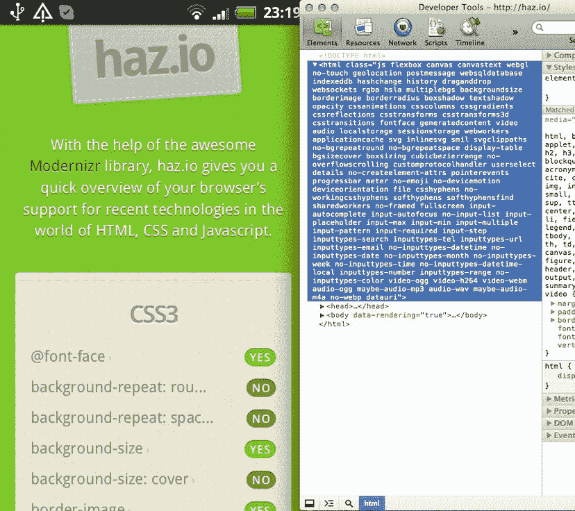
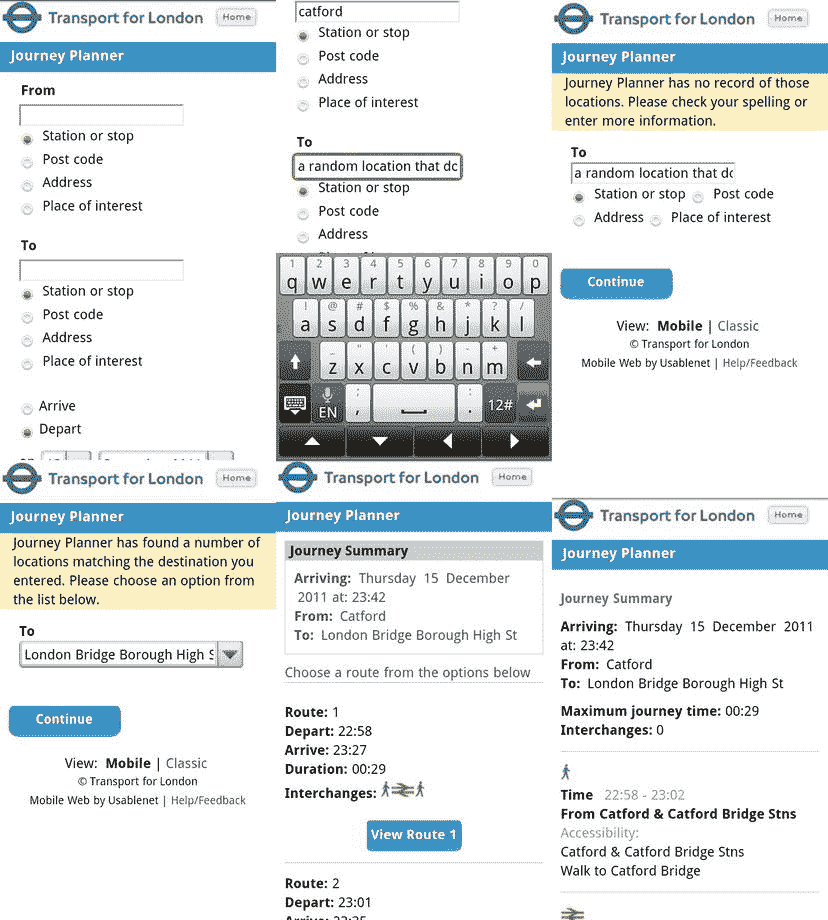
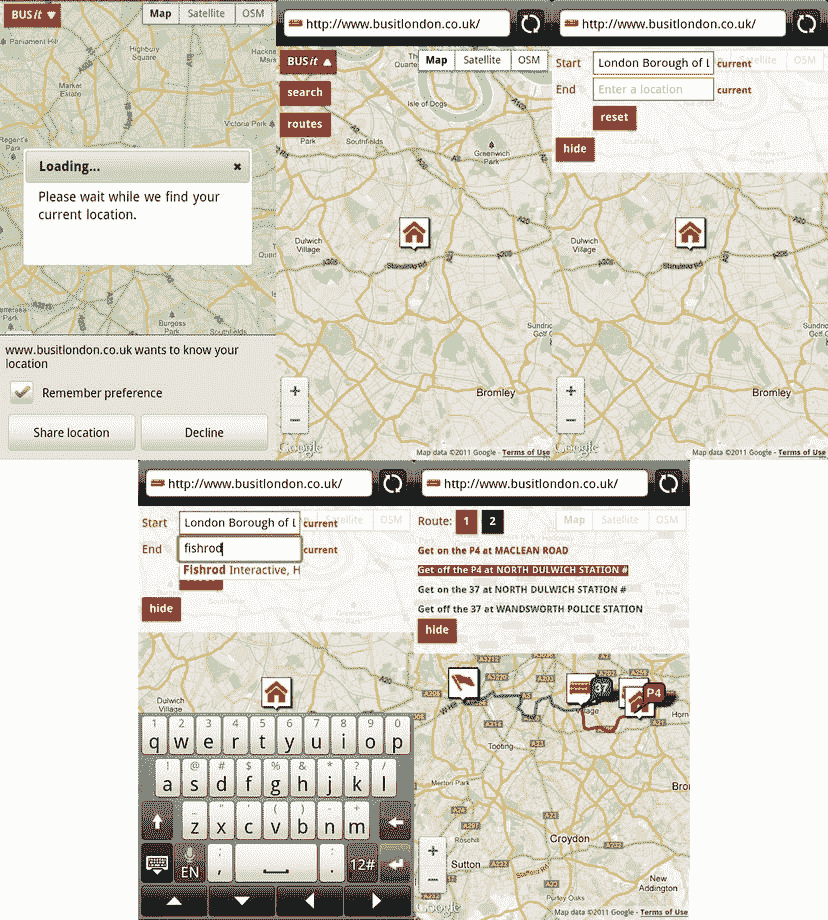
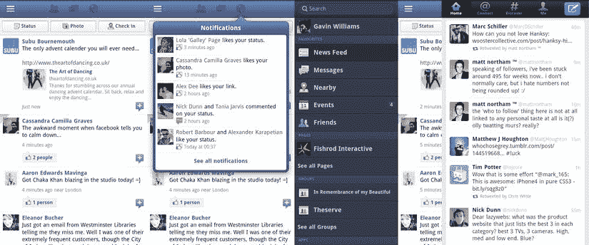
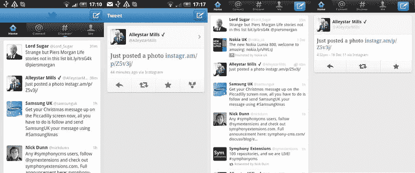
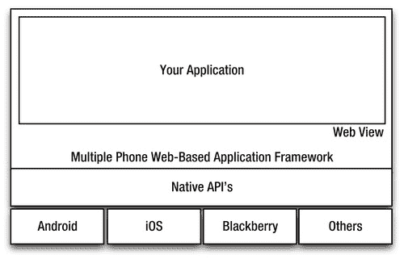
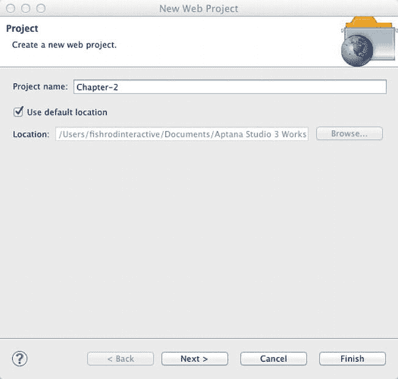
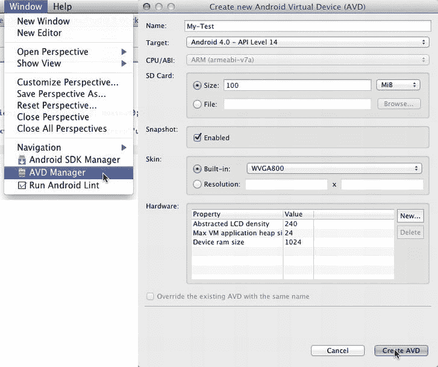
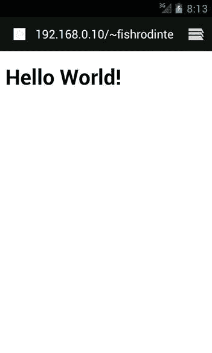

# 二、为 Android 创建移动 Web 应用

既然您的开发环境已经设置好了，那么您一定渴望深入研究一些代码！

在你开始之前，本章将带你了解移动网络与传统桌面环境相比的基本原理。

如果您可以一次构建和部署一个应用，并让它立即在所有设备上可用(不仅仅是 Android)，生活将会简单得多。移动网络旨在解决这个问题。原生应用有其优势，当它们需要大量的图形处理、CPU 和 RAM，以及访问 Android 操作系统的几乎所有方面时，它们就会发挥作用。

像 Mozilla 这样的浏览器供应商正试图改变这种情况，并向网络标准倾斜。通过利用 Android 的原生 API，并通过浏览器中的 JavaScript APIs 向 web 开发人员提供这些 API，我们有可能在不久的将来开发出与原生应用开发人员相同的 API。与此同时，将 HTML5 引入移动设备有助于填补我们等待的空白，并提供一个坚实的基础。诸如 PhoneGap、Rhomobile 和 Appcelerator 等多种基于手机网络的应用框架将取代未来浏览器目前为我们提供的草案规范。

通过认可 web 标准，我们应该可以说，我们为 Android 手机和平板电脑部署的相同 web 应用现在和将来也可以在 iOS 和 Windows Phone 7 手机和平板电脑上工作。

本章将带你了解一些关于移动网站设计和开发的基本原则。

*   What’s different about the mobile web?

    您将了解移动网络与桌面的不同之处，以及如何确保移动用户从他们可用的控件(他们的手指)中获得最佳体验！

*   Catering to your audience

    在这里，您将了解受众如何影响您设计和布局移动网站，如何区分内容的优先级，以及如何为目标受众提供最佳功能。

*   Web vs. native apps

    如果你对是否开发纯本地应用、混合应用或纯 web 应用犹豫不决，那么这将带你了解每种解决方案的优缺点。

*   The first line of code: Hello World

    这最后一节将带您了解应用的构建模块，例如设置 ANT 进行自动部署，以及构建和压缩 SASS/CSS 文件和 JavaScript。

### 移动网络有什么不同？

迎合 3.654 亿永久连接用户的潜在受众使移动网络成为最令人兴奋的开发平台之一。为桌面环境创建 web 应用是令人满意的。但是，用户只能使用一个指点设备和一个键盘来与您的作品进行交互。移动网络带来了一个全新的可能性世界。移动设备充当交互元素的空白画布，用户只需触摸即可与之交互。作为一名开发人员，你可以通过占据整个屏幕，让用户沉浸在你的移动网络应用的世界中，来创造一种更加亲密的体验。

不幸的是，尽管移动网络带来了现实世界中的所有优势，但在平台继续发展的同时，您也将面临桌面环境中同样的开发和用户体验绊脚石。

#### 物体/特征检测

移动网络上可供开发者使用的 API 的碎片化可能是一个问题。解决跨浏览器 API 差异的最常见解决方案是使用 JavaScript 来检测浏览器或设备，并根据使用的浏览器提供不同的样式表或执行特定的 JavaScript 片段。这种方法被称为*用户代理(UA)嗅探*或*浏览器嗅探*。[清单 2-1](#list_2_1) 显示了一个通用的 UA 嗅探脚本。

**清单 2-1。** *用于 UA 嗅探的 JavaScript 代码*

`// Get the user agent string
var browser = navigator.userAgent;

// Check to see whether Firefox is not in the string
if(browser.match(/Firefox/) === null){

   // If it's not Firefox, send the user to another page
   window.location.href = "sendstandardmessage.html";

} else {

   // If it is, use the Mozilla SMS API to send an SMS
   navigator.mozSms.send("01234567891", "My Message");

}`

UA 嗅探可能有什么问题？虽然您将为 Firefox 提供支持，并为其他浏览器提供后备，但您将无法支持可能与 Firefox 具有相同 API 的浏览器。

这个特殊的 API 也只在 Firefox 11+中可用，所以您还需要确保该版本包含在 UA 嗅探脚本中。

当您开始增加浏览器检测脚本的粒度时，由于必须不断更新嗅探代码以适应新的浏览器和版本，您也降低了可维护性并增加了复杂性。不知不觉中，您的 JavaScript 库变成了不可维护的意大利面条代码。

更好的方法是通过物体检测。修改后的代码可以在[清单 2-2](#list_2_2) 中看到。首先，我们发现 SMS API 是否存在。如果它不存在，我们将用户发送到另一个页面；如果是的话，我们就可以发送短信了。

**清单 2-2。** *用于对象检测的 JavaScript 代码*

`// Check to see whether navigator.mozSms is an object (if it exists)
if (typeof navigator.mozSms === "object"){

   // If it does, send a message using the built-in SMS API
   navigator.mozSms.send("01234567891", "My Message");

} else {

   // If it doesn't, send the user to another location
   window.location.href = "sendstandardmessage.html";

}`

对象检测的方法还允许我们为浏览器特定的 API 提供回退。Firefox 11 nightlies 目前只支持 SMS API，但未来可能会有其他浏览器和其他设备通过不同的方法或类支持相同的实现。

我们可以使用一个类将这变成我们应用的一个特性。我们可以在一个方法中委托消息的发送，如清单 2-3 所示。这在理论上应该允许我们使用自己的 API 在应用中发送消息。当浏览器供应商将 SMS API 添加到他们的浏览器中时，我们只需要将该方法添加到单个位置，而不是在整个应用中查找和替换它。

**清单 2-3。** *使用委托发送消息，用我们自己的 Web 服务作为后备*

`var Message = function Message(message, recipient){

   this.message = message;
   this.recipient = recipient;

   this.sendSMS = function sendSMS(recipient){

      if(typeof navigator.mozSms === "object"){

         // Send SMS using the user's mobile phone
         navigator.mozSms.send(this.recipient, this.message);

      } else if (typeof navigator.otherSms === "object") {

         // Use another browser's SMS implementation
         navigator.otherSms.sendMessage(this.message, this.recipient);

      } else {` `         // If sending via the user's mobile isn't possible,
         // send the message using a third-party web service
         this.ajaxSend(this.recipient, this.message);

      }

   }

   function ajaxSend(recipient, message){
      // Send the SMS using a web-based SMS gateway via Ajax
   }

}

var messageInst = new Message("my message!", "01234567891");
messageInst.sendSMS();`

正如你从[清单 2-3](#list_2_3) 中看到的，无论浏览器的功能是什么，我们都可以使用对象检测来确保用户获得相同或相似的体验，无论设备的功能是什么。

使用 JavaScript 检测这些利基特性非常容易。但是如何测试 CSS3 或 HTML5 的功能，并为 CSS3 动画和 3D 转换等功能提供向后兼容性呢？

一个名为 Modernizr 的 JavaScript 库可以帮助您实现这一点。它使用相同的对象检测方法来检测用户 web 浏览器的 HTML/CSS/JavaScript 功能。

它通过向 HTML 标签添加类来修改 DOM(文档对象模型),以便为您自己的 CSS 和 JavaScript 特性检测提供挂钩。[图 2-1](#fig_2_1) 显示了这在 haz.io 中的作用。这将在[第 7 章](07.html)中详细介绍。

**图 2-1。** *使用 Modernizr 检测 haz.io 上的特征*

#### 屏幕尺寸和像素密度

在开发移动 web 应用时，您可能希望创建一个对平板设备和移动设备具有相同功能的应用，但呈现不同的视图或布局，以利用设备的额外空间或方向。媒体查询有助于促进这一点。

使用媒体查询和弹性设计的组合，您可以生成响应用户显示的视图，而不是检测用户的设备类型并为其提供视图。这就是所谓的*响应式网页设计*。

这种开发方法比根据用户使用的设备的类型来决定用户应该如何浏览你的网站要优雅得多。相反，你应该关注可用的*空间*和可用的像素密度。

像素密度是一个概念，它允许具有相同物理尺寸屏幕的移动设备根据每平方英寸可用的像素数量而改变分辨率。

Android 设备分为三类像素密度:

*   低的
*   中等
*   高的

这对您的移动 web 应用有什么影响？当您为普通网站制作图像时，您制作的单个图像不能在所有屏幕类型上缩放和工作，因为布局将随图像本身缩放以适合固定宽度或弹性布局。

对于移动网站，您通常会创建一个移动应用来适应整个视窗，并具有相同的尺寸，而不管设备的像素密度如何。

例如，如果您为低像素密度屏幕制作 500 像素宽的图像，它在高密度屏幕上会显得更小。这是因为 500 px 在高密度屏幕上不会像在低密度屏幕上占用那么多空间。

移动浏览器的解决方案是根据目标密度放大或缩小图像。例如，如果您为中等密度的屏幕开发应用，浏览器将为低密度屏幕缩小图像，为高密度屏幕放大图像。无论以哪种方式缩放图像，都会导致开销，放大图像时会出现像素化，缩小图像时会出现潜在的失真。

为了解决这个问题，我们可以专门为高密度屏幕开发应用，并允许手机缩小图像。就 CPU/GPU 和网络活动而言，这可能非常昂贵。这两个因素都会对渲染时间产生影响，并且可能会影响下载不必要资源的用户口袋。或者，我们可以使用媒体查询来确保为正确的显示类型提供正确的内容。为此，您必须将`viewport`元标签的`target-densitydpi`属性设置为`device-dpi`，并使用媒体查询导入特定于像素密度的样式表，如[清单 2-4](#list_2_4) 所示。

**清单 2-4。** *使用媒体查询像素密度–特定样式*

`// Set the viewport to match the devices pixen density and width
<meta name="viewport" content="target-densitydpi=device-dpi, width=device-width"
/>

// Pull in the main stylesheet
<link rel="stylesheet" media="screen" href="mobile.css" />

// Pull in high, medium, and low stylesheets to provide pixel density
// specific images
<link rel="stylesheet" media="screen and (-webkit-device-pixel-ratio: 1.5)"
href="hdpi.css" />
<link rel="stylesheet" media="screen and (-webkit-device-pixel-ratio: 1.0)"
href="mdpi.css" />
<link rel="stylesheet" media="screen and (-webkit-device-pixel-ratio: 0.75)"
href="ldpi.css" />`

正如你在[清单 2-4](#list_2_4) 中看到的，每一类显示器的像素比率如下。

*   低:0.75
*   中等:1.0
*   高:1.5

我们使用通用的移动样式表，以便在设备不匹配任何像素比率的情况下，我们可以提供备用图像。然后，我们使用每个像素密度类别的样式表来覆盖图像。

像素密度可能是一个难题，因为这意味着对于您在应用中使用的每个图像，您必须生成两个不同大小的图像。这也意味着，即使您今天创建了最高像素密度的图形，明天您也可能不得不为另一台像素密度更高的显示器重新导出所有内容。在选择图形包来创建你的移动网页设计时，一定要记住这一点。

### 迎合你的观众

记住你为谁写你的应用和他们用什么来和你的工作互动一样重要。第一步是确保你理解你的用户会用你的应用做什么。为此，您必须对其进行分类。

对你的应用进行分类将有助于你根据你的类别中的其他应用是如何设计的以及它们有什么样的特性来制定通用的交互规则。这听起来像是复制，但是它将帮助用户根据他们以前的经验快速直观地了解如何使用您的应用，从而在最少的时间内启动并运行它。

重要的是要记住，你可以建立在这些规则之上，你不必坚持它们。只要你能让你的用户打开你的移动网络应用，玩几分钟，然后马上说“我明白了”，你就完成了你的工作。

移动 web 应用有许多种类，但大多数都可以归为以下几类。

*   基于任务
*   社会的
*   娱乐

#### 基于任务

基于任务的应用本质上非常简单。它们是为日常使用而制造的省时设备。这可以是从查找火车时刻到查找最近的酒吧或酒吧在哪里的任何事情。

有几次，我站在伦敦滑铁卢火车站的中央，盯着火车时刻表，看起来茫然和困惑，只是拿出手机启动火车时刻应用，以更快地找到火车时刻。

重要的是要记住，如果一个用户不能用你的应用在最短的时间内完成一项任务，他们会关闭你的浏览器窗口，另找一个能更快完成同样任务的浏览器。

对于基于任务的应用，有两条基本信息可以用来帮助用户更快地执行任务。

*   用户在哪里？
*   他们用的是什么设备？

这两条关键信息对您的应用来说很容易获得，了解它们将会带来很大的不同。

找出用户的物理位置和他们正在做什么将有助于你在用户访问你的移动网络应用时先发制人。

举例来说，如果你正在创建一个旅程规划器，有几件关于你的用户的事情你应该考虑。

*   用户在哪里？他们的网络连接是否有限(例如，3G/EDGE 或更糟的 GPRS)。
*   用户在移动吗？他们有时间边走边填表，用拇指输入数据吗？

这些因素不仅会影响交互元素(如输入表单)的呈现方式，还会影响如何编写代码来减少用户完成任务所需的工作量。

在[图 2-2](#fig_2_2) 和[图 2-3](#fig_2_3) 中，您可以看到在创建基于位置的工具时，了解和使用用户的位置并理解他们的情况会带来多大的不同。

**图 2-2。** *TFL 手机网站用户旅程*

在[图 2-2](#fig_2_2) 中，你可以看到 TFL 旅程规划移动网站。上面的用户旅程描述了最坏的情况。该用户在移动中，容易犯数据输入错误。因此，为了完成任务，用户必须通过两次额外的页面加载，加载更多的表单字段。

有两个额外的页面来帮助用户验证有什么问题？两个额外的页面相当于超过 3G 的 4 秒以上的加载时间。您还必须考虑用户处理页面和响应页面所需的时间。

我们如何改进 TFL 移动网站？

*   增加反馈回路。我们可以在用户使用自动完成功能输入出发地/目的地位置时向他们提供建议。然后，他们可以选择一个适合他们的建议来预填充旅程规划表单字段。
*   我们可以使用用户的当前位置作为他们旅程的起点/终点的建议。
*   如果我们使用本地存储，我们还可以向用户建议最近目的地的列表。例如，如果我们知道他们刚刚计划了去某个地方的旅行，那么当他们重新打开移动 web 应用时，很有可能会想知道如何返回。

**图 2-3。** *BUSit 移动网站用户旅程*

图 2-3 显示了一个来自 busitlondon.co.uk 的好例子。在第一次启动移动网络应用时，它会尝试查找您的当前位置。当用户键入开始和结束位置时，它会建议用户使用 Google Maps API 和自动完成来选择选项。您还可以随时选择用户的当前位置。

在你计划好你的目的地后，它会给你建议路线。所有这些信息都包含在一个页面上，无需重新加载页面。用户可以轻松地更改或修改视图，而不必等待图形(除了地图切片)加载。这提供了更多的“本地应用”的外观和感觉。

#### 社交

社交应用的主要目标是促进与朋友或其他感兴趣的人联系和交流的能力。与社交移动网络应用交互所花费的时间通常比使用基于工具的应用所花费的时间要多得多。

社交媒体应用的主要目标通常有三个。

*   用户通过访问来消费内容。
*   用户通过访问来贡献内容。
*   用户访问参与。

这三个基本规则支撑着当今几乎所有的社交移动应用。如果用户不贡献内容，就没有内容可供其他用户消费和参与。

仅仅因为用户在社交移动网络应用上花费更多的时间，并不意味着完成一项任务(比如分享内容)的途径应该与基于任务的应用有任何不同。应该考虑用户情况的相同因素。应该是既容易分享内容，又容易消费内容。

举个例子，Twitter 和脸书在功能集上截然不同，但这两个应用在移动网络上的主要目标都是让用户更容易消费、贡献和参与。

[图 2-4](#fig_2_4) 显示了脸书触摸式移动网站的三个屏幕(左侧)。登录后，您会看到脸书新闻提要，因此您可以立即使用内容。您还可以看到三个清晰而独特的按钮来分享内容，如您的状态、照片和当前位置(签到)。顶部还有一个工具栏，以模式菜单或弹出菜单的形式为您提供与您相关的内容和更新(好友请求、消息和通知)。更多的功能在隐藏菜单中，这为添加更多的次要功能和动作留下了余地，而不会弄乱应用的其余部分。

**图 2-4。** *脸书 Touch 和 Twitter 移动网站让分享和消费内容变得很容易。*

Twitter 的核心功能可以在它的顶部工具栏中找到。共享内容的清晰操作按钮以蓝色突出显示，带有独特的图标。登录后，如果用户使用过 twitter 网站，就会知道这是一个分享内容的按钮。同样的设计模式现在在 Twitter 的桌面、移动和网络版本中引起了共鸣。

#### 娱乐

基于娱乐的应用主要是为了满足某种形式的无聊而创建的。解决方案有多种形式，从显而易见的游戏到交付音乐和视频内容。娱乐应用通常被设计成让用户沉浸在应用的环境中。这甚至可以通过当今移动网络上最基本的 HTML5 游戏来实现。

### 网络应用与本地应用

在过去的几年中，一个很大的争论和讨论的原因是，是将一个项目构建为一个本地应用还是一个移动 web 应用。两者各有利弊。但是，重要的是要记住，您选择的解决方案应该基于特定项目的需求和您作为开发人员的能力。最重要的是，选择能最快完成项目的解决方案！

有几个因素将帮助您决定是创建移动 web 应用还是本地应用。

*   您是否已经知道如何为目标平台开发
*   您的应用是依赖网络连接还是某种形式的在线存储的动态数据
*   您的应用依赖哪种类型的设备功能(例如，GPS、加速度计、陀螺仪、地址簿、日历、密集的 CPU/GPU 操作)
*   您的项目现在或将来是否有机会将功能移植到其他平台(例如 iOS、Blackberry、Windows Phone、desktop)
*   您发布应用的频率，以及您将如何处理用户不在他们的设备上更新您的应用的情况
*   时间和预算

如果您已经知道如何使用 web 标准进行开发，那么移动 web 应用可能是最好的解决方案。但是，如果您已经可以针对目标平台进行开发，那么开发一个原生应用可能会更有优势。然而，这将稍微关闭一个可以在其他平台上运行的应用的大门，因为除非您使用一个跨平台的应用框架，如 Marmalade，否则需要为所有平台重新创建相同的应用。

制作一个移动 web 应用是一种经济有效的方法，在将应用本地化之前，可以在所有平台上对其进行测试或原型制作。通过使用分析，你可以看到你应该把哪些平台作为原生应用的目标。通过进行用户研究，您可以看到创建一个具有特定于平台的特性的原生应用是否对您的用户有利。

如果您的应用依赖于无法通过 web 浏览器访问的 API，如电话簿、日历、陀螺仪或加速度计，那么移动 web 应用可能是不可能的，因为这些 API 目前无法通过大多数移动 web 浏览器访问。

如果您的应用依赖于动态数据，那么使用 web 标准开发应用可能是一个明智的选择，因为您可以使用 Ajax 通过网络向应用快速交付内容。您还可以使用移动 web 应用缓存和存储文件，这样当没有网络连接时，您的应用仍然可以脱机使用。

如果您经常为移动应用提供更新，您可能会遇到用户没有像您希望的那样经常更新到最新版本的问题。通过创建一个移动网络应用，你可以简单地将更新推送到你的网络服务器，你的所有用户将立即拥有你的应用的最新版本。

在[图 2-5](#fig_2_5) 中，你可以看到 Twitter 原生应用(左)和移动网络应用(右)展示了作为原生应用的社交应用和作为移动网络应用的区别。如你所见，没有真正的区别。移动 web 应用中要放弃的主要特性是使用第三方本地应用共享内容的能力。Twitter 还取消了在移动网络应用上分享照片的功能。对象/特征检测可以提供在某些设备上上传照片的能力。

**图 2-5。** *Twitter 原生应用(左)和 Twitter 移动网络应用(右)*

到目前为止，本节收集的信息应该有助于您决定是使用本地网站还是移动网站。

然而，还有第三种选择。多种基于 web 的电话应用框架，如 PhoneGap、Appcelerator 和 Rhomobile，将允许您用 XHTML/JavaScript 和 CSS 构建应用，但利用一些可能只适用于本地 web 应用的 API。

这些框架为你开发应用提供了一个 web 视图，并通过使用 JavaScript 作为两者之间的桥梁，为移动 API 提供了一个代理。[图 2-6](#fig_2_6) 显示了多种手机网络应用框架的结构。

**图 2-6。** *一个多手机网络应用框架的结构*

以这种方式部署您的移动 web 应用会给您带来新的机会。我们知道，在某个时候，移动网络浏览器将提供 API 来与第三方应用进行交互，并利用移动设备的硬件，如 CPU/GPU 和摄像头。所以继续开发浏览器是有意义的。然而，多电话基于网络的应用框架有助于将本地应用可用的 API 和服务带到网络应用中。

通过以这种方式构建应用，您可以一次构建并部署一个功能有限的移动 web 应用。然后，您可以在基于 web 的多电话应用框架内使用对象/功能检测来逐步增强该应用，就像增强本地应用一样。这让你两全其美。

### 第一行代码:Hello World

现在是你写第一行代码的时候了。在这个 Hello World 应用中，您只需创建一个带有“Hello World！”并显示在 Android 虚拟设备上。

#### 设置

首先打开 Aptana Studio。您将需要创建一个新项目，因此转到文件新建 Web 项目。

您将看到一个类似于图 2-7 中[的屏幕。输入项目名称，然后单击完成。我选择了第二章作为我的。](#fig_2_7)

**图 2-7。** *Aptana 的新 Web 项目向导*

这将在 Aptana 中创建新的空项目。新项目将出现在左侧的应用浏览器面板中。

#### HTML

为移动网络编写与为桌面网络应用编写没有什么不同。我们将从创建一个基本的 HTML5 文档开始。

创建新文件的方式与创建新文件夹大致相同，只是选择文件而不是文件夹。将该文件命名为`index.html`。确保该文件存在于项目的根目录中是很重要的。下面的代码将构成我们的 HTML 文件的基础。

**清单 2-5。***Hello World 的 HTML 源代码！*

`<!DOCTYPE html>
<html lang="en-GB" dir="ltr">

   <head>

      <meta charset="UTF-8" />
      <meta name="viewport" content="width=device-width; initial-scale=1.0;
      maximum-scale=1.0; user-scalable=0; target-densitydpi=device-dpi;"/>
      <title>My First Mobile Web App</title>

   </head>

   <body>

      <h1>Hello World!</h1>

   </body>

</html>`

如果您不熟悉清单 2-5 中的一些 HTML 元素，第一行是新的 HTML5 doctype。在 HTML5 中，您不需要指定 DTD，这通常可以在 XHTML 1.1 页面中找到。[清单 2-6](#list_2_6) 展示了 XHTML 1.1 文档类型声明和 HTML5 文档类型声明的区别。

**清单 2-6。***XHTML 1.1 Doctype 声明和 HTML5 Doctype 声明的区别*

`<!-- HTML4 Doctype Decleration -->
<!DOCTYPE html PUBLIC "-//W3C//DTD XHTML 1.1//EN" "http://www.w3.org/TR/xhtml11/DTD/xhtml11.dtd">

<!-- HTML5 Doctype Decleration -->
<!DOCTYPE html>`

如您所见，现在不需要搜索或记忆 DTD 路径的位置，也不需要指定 HTML 版本。

在 HTML 标签中，我添加了两个属性:`<html lang="en-GB" dir="ltr">.` `lang`将指定文档中使用的语言，`dir`决定阅读方向。从左到右`dir`被设置为`ltr`，英国人`lang`被设置为`en-GB`。

前进到 head 元素，有两个 meta 标签，如清单 2-7 中的[所示。](#list_2_7)

**清单 2-7。**源代码中的*元元素*

`<meta charset="UTF-8" />
<meta name="viewport" content="width=device-width; initial-scale=1.0; maximum-scale=1.0; user-scalable=no; target-densitydpi=device-dpi;"/>`

第一个 meta 标记指定了文档中使用的字符集。这通常应该是 UTF 8，这将涵盖大多数语言字符。

第二个 meta 标记专门用于控制移动网站上的布局或视口。有了这个 meta 标签，我们可以使用`width`属性将页面的宽度设置为等于、小于或大于视窗(浏览器屏幕的可视区域)。

您还可以使用这个标签来控制用户通过`initial-scale`和`maximum-scale`属性放大您的 web 应用的程度。

`user-scalable`属性是一个标志，用于允许或禁止用户通过挤压或点击来放大或缩小您的移动 web 应用。

最后，`target-densitydpi`属性用于指示网页应该如何根据用户屏幕的像素密度进行缩放。将此属性设置为`device-dpi`将阻止图像自动放大高像素密度的设备或缩小低像素密度的设备。这有助于防止设备缩放图像时常见的图像像素化。在[第三章](03.html)中，你会发现如何使用媒体查询来防止图像在高/中、低密度设备上像素化。[清单 2-8](#list_2_8) 显示了 viewport meta 标签的完整定义。

**清单 2-8。** *全视区元标签定义*

`<meta name="viewport"
   content="
      height = [pixel_value | device-height] ,
      width = [pixel_value | device-width ] ,
      initial-scale = float_value ,
      minimum-scale = float_value ,
      maximum-scale = float_value ,
      user-scalable = [yes | no] ,
      target-densitydpi = [dpi_value | device-dpi |
                           high-dpi | medium-dpi | low-dpi]
   " />`

[清单 2-9](#list_2_9) 显示了`<title />`标签，它包含了页面的标题。

**清单 2-9。** *标题标签*

`<title>My First Mobile Web App</title>`

最后，如清单 2-10 所示，在主体中，有一个包含文本“Hello World！”的`<h1 />`标签。

**清单 2-10。** *标题和链接标签*

`<body>

   <h1>Hello World!</h1>

</body>`

#### 测试

在继续之前，您应该使用 Aptana 中的 Android SDK 创建一个 Android 虚拟设备(AVD ),以测试您的网站并查看其进度。出于本章的目的，您将创建一个功能最少的简单 AVD。

首先进入窗口 AVD 管理器，如图[图 2-8](#fig_2_8) 所示。

**图 2-8。** *创建新的 Android 虚拟设备*

当 AVD 对话窗口出现时，点击位于窗口右侧的新建。

在创建新的 Android 虚拟设备(AVD)对话框中，使用以下参数。

*   名称:我的测试
*   目标:Android 4.0–API 级别 14
*   SD 卡:大小:100 兆字节
*   快照:已启用
*   皮肤:内置:WVGA800
*   硬件:
    *   抽象液晶密度:240
    *   最大虚拟机应用堆大小:24
    *   设备 ram 大小:1024

设置好所有选项后，单击创建 AVD 按钮。您的新 AVD 将出现在 Android 虚拟设备管理器中。选择它并单击开始。将会出现一个新的对话框，您应该在其中接受默认值并单击 Launch。众所周知，avd 启动和运行极其缓慢。还有其他选择，但不会在本书中讨论。

几分钟后，您应该有一个虚拟 Android 设备启动并运行。单击互联网图标启动浏览器。

现在，您需要将应用部署到 web 服务器上。在第 3 章的[中，您将找到更多关于自动部署应用的信息，但是现在您可以使用 Aptana 将项目导出到适当的文件夹中。转到文件导出。在导出对话框中，选择通用文件系统并点击下一步。选择第 2 章，并在“至目录”中选择浏览。浏览到主目录中的站点文件夹，然后选择打开。单击 Finish，Aptana 将开始向该目录发布文档。](03.html)

你现在可以使用 AVD 的内置浏览器和你在[第 1 章](01.html) ( `[http://your-ip-address/~username/Chapter-2/](http://your-ip-address/~username/Chapter-2/)`)中记下的网址访问网站。如果一切正常，你应该会看到 AVD 屏幕上的[图 2-9](#fig_2_9) 中显示的内容。

**图 2-9。** *你好世界！*

### 总结

在这一章中，你应该已经了解了三种不同类型的 web 应用:基于任务的、社交的和娱乐的。

您应该了解用户如何与您的应用交互。除了本书之外，你应该了解在开发移动 web 应用时如何考虑用户的潜在情况，以及这将如何影响你的功能、设计和用户体验。

这一章应该让你深入了解 JavaScript 开发的最佳实践，以及响应式设计的皮毛。

最后，这一章应该已经给了你一些关于是否将你的项目作为一个本地的，web 的，或者多手机的基于 web 的应用框架项目来开始。