## 第三章

## HTML5

随着生产跨平台移动应用的需求，HTML5 对移动行业来说从未如此重要。它是创建简单但功能丰富的应用的最佳候选之一，这些应用可以构建和部署一次，以支持当今所有主要的智能手机和平板设备。

对基于 HTML5 的应用的常见误解是，它们可能很慢，没有响应，并且达不到用户对原生移动应用的预期速度和质量。这仅仅是对的一半，你可能已经从上一章看到了；这取决于正在构建的应用的类型。例如，App Store 上提供的英国《金融时报》应用似乎是一个原生应用。然而，如果你仔细观察，你会发现英国《金融时报》的应用只是英国《金融时报》的移动网络应用(`app.ft.com`)，包装在原生应用的网络视图中。

从[图 3-1](#fig_3_1) 中可以看到，iPhone 和 Android 的应用看起来都很相似。抛开 UI 带来的几个特定于平台的增强，它们实际上是同一个应用。

**注意:**使用 PhoneGap 等多种基于手机网络的应用框架，构建一个网络应用并将其展示给各种应用市场并没有错。它增加了您的应用的曝光率，并使您的用户更容易访问它。如果 App Store 的条款和条件变得对你不利，以这种方式制作你的应用也可以为你提供一个即时的解决方案。

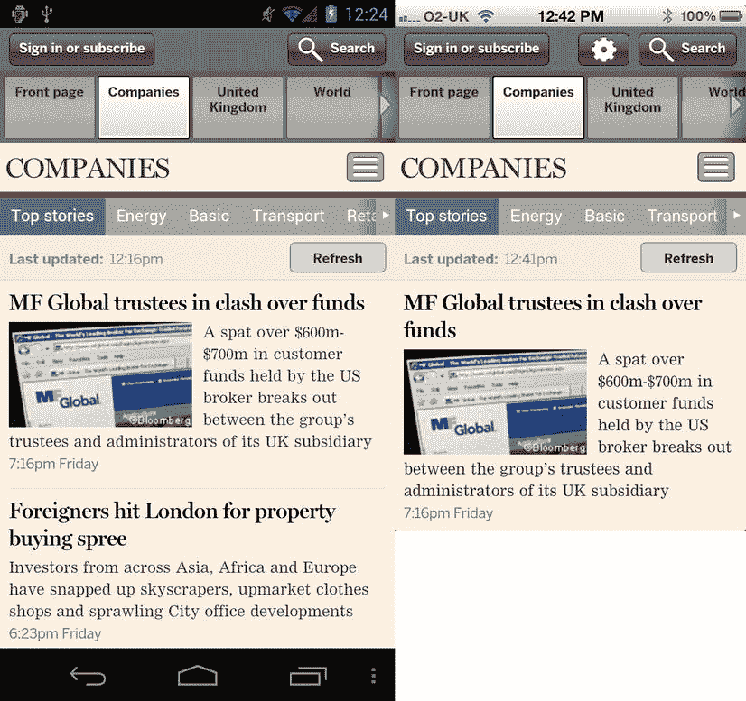

**图 3-1。** *原生《金融时报》安卓应用(左)和 iOS 网络应用(右)*

在这一章中，你将学习 HTML5 的关键基础知识，以及如何在移动网络中利用它。

您还将了解如何为移动设备编码视频和音频内容，以及有助于向用户交付这些内容的服务类型。

本章将更深入地介绍如何使用媒体查询来根据屏幕属性设计内容的样式。

最后，您将了解新的表单元素，以及如何提示某些类型的输入数据来影响浏览器中的键盘。

### 有什么新消息？

HTML5 在 HTML4/XHTML1.1 的基础上有了重大飞跃。它提供了新的 HTML 标签，如`header`、`footer`、`hgroup`、`nav`、`section`和`article`，进一步改进了我们标记文档的方式。这使我们能够生产更有意义和机器可读的内容。比如我们现在可以用`<`。除此之外，HTML5 还带来了 API 访问的标准化，比如地理定位、画布、web 套接字和 web 存储。

HTML5 规范中有许多新的变化，但在这一章中，我们将重点关注适用于移动设备的变化。

HTML5 规范中的变化将在提供的代码示例中显而易见。但你可能会问自己，这有什么意义？不管你是否使用新的 HTML5 元素，你的用户都会看到同样的东西。有几个原因可以解释为什么做出这样的改变会对你的用户产生影响。

*   您可以生成更清晰、更易于维护的代码。
*   机器消费者会更容易阅读和理解你的代码。机器包括搜索引擎机器人、浏览器插件和依赖于理解文档内容结构的功能。
*   您不必在文档中定义那么多的类和 id。您可以更多地依靠 cascade 来为您完成大部分工作。

**注意:**虽然示例中没有显示`<body />`、`<html />`或`<head />`标签，但是所有元素都可以放在文档的主体中，除非另有说明。

#### <条/ >

`<article />`元素用于表示页面上的独立内容，比如博客文章、新闻文章或评论。原则上，一篇文章应该包含自己的页眉、内容和页脚。您还可以在元素中嵌套关于文章作者的信息。您还可以将文章元素嵌套在另一个文章元素中，以帮助进一步组织内容，例如文章评论。

[图 3-2](#fig_3_2) 显示了一个`<article />`元素相对于一个 HTML5 文档的位置。[清单 3-1](#list_3_1) 显示了一些基本 HTML5 元素的结构，以及`<article />`元素在这个层次结构中的位置。

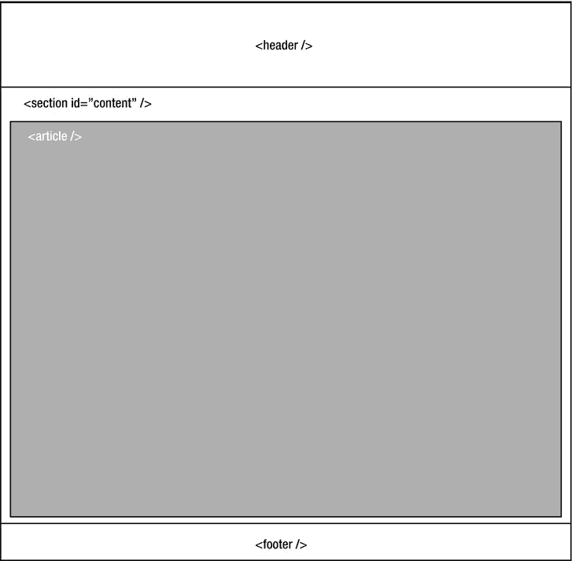

**图 3-2。** *`<article />`元素(以灰色突出显示)与在移动网站文档*中找到的元素相关

**清单 3-1。***html 5 中一篇文章的拟议结构*

`<article>

   <header>

      <h1>Article Title</h1>

      

          Created by Daniel Carpenter on
          <time pubdate="2012-03-15">March 15th 2012</time>

      

   </header>` `   
Article Content

   <footer>

      <address>

         

            Written by
            <a rel="author" href="mailto:daniel.carpenter@somewhere.com">
                Daniel Carpenter
            </a>

             

            Follow him on
            <a rel="author" href="http://www.twitter.com/mrdanc">Twitter</a>

         

      </address>

    </footer>

</article>`

清单 3-1 中显示的元素似乎有意义。`<header />`元素包含与文章相关的所有标题信息，比如标题、作者和发布时间。请注意，文章中的内容不需要包装在另一个元素中。最后，`<footer />`包含关于作者的信息，它嵌套在一个`<address />`元素中。

将此与清单 3-2 中的[进行比较，它显示了在以前的 HTML 版本中您可能是如何编写的。](#list_3_2)

**清单 3-2。***html 4 和 Prior* 中一篇文章的拟议结构

`

   

      <h1>Article Title</h1>

      

          Created by Daniel Carpenter on
          March 15th 2012

      

   

   
Article Content

   

      

         

            Written by
            <a rel="author" href="mailto:daniel.carpenter@somewhere.com">
                Daniel Carpenter
            </a>

             

            Follow him on
            <a rel="author" href="http://www.twitter.com/mrdanc">Twitter</a>

         

      

   

`

正如你从清单 3-2 中看到的，这个标记没有真正明显的结构。有许多 div 都有与之相关的类；然而，创建这样的文档并没有真正的标准。

#### <暂且不提/ >

`<aside />`元素可以用来表示与网站主要内容无关的内容，比如 tweets、相关链接、标签和导航元素。这些通常出现在文件的左侧或右侧，如图 3-3 中的[所示。](#fig_3_3)

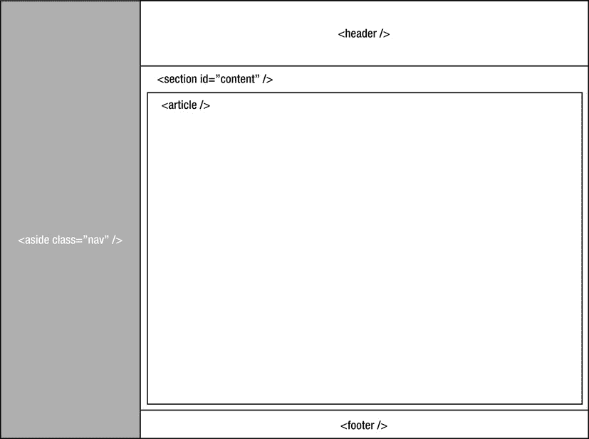

**图 3-3。** *具有`<aside />`元素的文档结构(以灰色突出显示)*

我们可以根据屏幕大小隐藏 aside 元素，并在用户单击按钮显示它时显示它，从而利用 aside 元素。这种设计模式可以在 facebook mobile web 应用中找到，并将在第 4 章的[研讨会中进行更深入的探讨。](04.html)

清单 3-3 展示了应该如何使用 aside 元素，而[清单 3-4](#list_3_4) 展示了如何在 HTML4 中编写相同的代码。

**清单 3-3。***html 5*中提出的结构

`<aside>

   <nav>

      <h2>Places To Go</h2>

      <ul>

         <li><a href="somewhere">Somewhere</a></li>

         <li><a href="somewhere-else">Somewhere Else</a></li>

      </ul>

   </nav>

</aside>

<section class="content">

   <!-- Your Content Goes Here -->

</section>`

从[清单 3-3](#list_3_3) 中可以看出，我们使用`<aside />`元素为网站导航，因为它存在于`<section class="content" />`元素定义的内容部分之外。`<aside />`元素将被浮动在内容的左边。

为 HTML4 编写的相同标记看起来像清单 3-4 中的。

**清单 3-4。** *提议在 HTML4 中搁置结构*

`

   

      <ul>

         <li><a href="somewhere">Somewhere</a></li>

         <li><a href="somewhere-else">Somewhere Else</a></li>

      </ul>

   

` `

   <!-- Your Content Goes Here -->

`

正如您所看到的，使用 div 而不是有意义的标记使得乍一看很难理解内容。

#### <音频/ >

元素用于在网页中嵌入音频内容。这是 HTML5 的新功能，在 HTML4 中没有。对于不支持 HTML5 音频的浏览器，可以在`<audio />`标签中提供一个 3gp 版本音频文件的链接。[清单 3-5](#list_3_5) 展示了如何嵌入一个音频文件。

**清单 3-5。** *如何在 HTML5 中使用音频标签*

`<audio controls="controls">

   <source src="media/audio.oga" type="application/ogg">

   <source src="media/audio.mp3" type="audio/mpeg">

   

      Your browser does not support HTML5 Audio,
      <a href="media/audio.3gp">click here to download</a>

   

</audio>`

这将为手机呈现本机音频播放器。在`<audio />`标签中，您将看到几个`<source />`元素。这些用于为浏览器提供不同的音频格式，如 MP3、OGG 或 WAV。您应该指定音频文件的 mime 类型，以便浏览器选择正确的音频文件。

图 3-4 展示了 Android 4 中的`<audio />`元素。

**图 3-4。** *`<audio />`安卓 4 冰淇淋三明治*中的元素

`<audio />`标签还支持几个额外的基于媒体的属性。表 3-1 显示了这些属性及其描述。

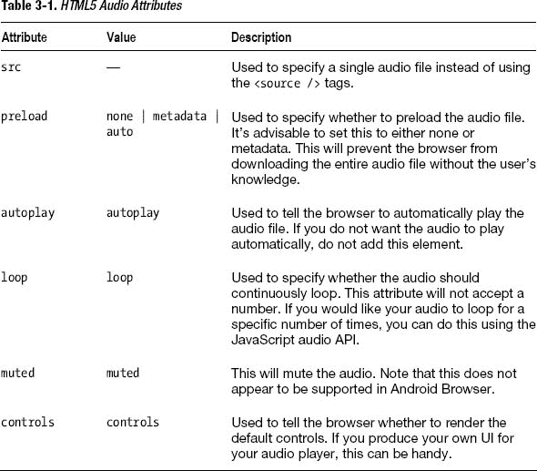

##### 支持的媒体格式

并非所有的媒体格式都能在 Android 上运行。表 3-2 显示了适用于大多数 Android 手机的格式。

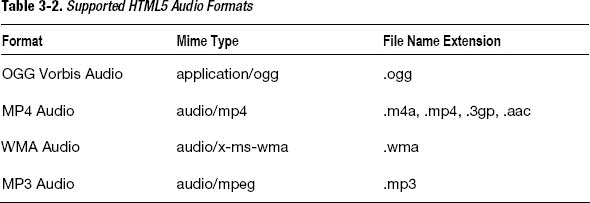

#### <画布/ >

元素为你在 HTML 中绘制形状提供了一个上下文/舞台。你将在第 7 章的[中学习如何使用 canvas JavaScript API 绘图。](07.html)

canvas API 将为您提供一种使用 DOM 元素制作图形密集型动画或绘图的替代方法。`<canvas />`元素支持`width`和`height`属性。元素中的任何文本都将显示给不支持它的浏览器。

清单 3-6 显示了如何使用画布绘制一个简单的半透明正方形。

**清单 3-6。** *在 HTML5 画布上画一个简单的正方形*

`<canvas id="test-canvas" width="400" height="400">
   
Your browser does not support HTML5 Canvas :(

</canvas>

`

如你所见，你使用`<canvas />`元素在 HTML 中定义了画布。对于不支持 canvas 的浏览器来说，`<canvas />`元素中的任何文本都是可见的。然后使用 JavaScript 在画布上绘制路径。[图 3-5](#fig_3_5) 显示了结果。

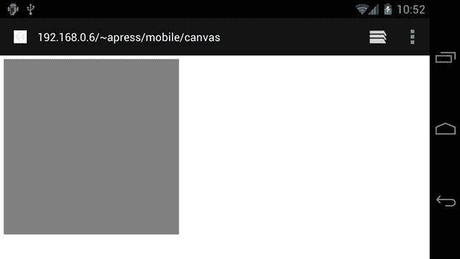

**图 3-5。**上的*渲染矩形`<canvas />`元素*

#### <图/ >和<图标题/ >

`<figure />`和`<figcaption />`元素用于标记网页上的图形，例如代码样本、图像或图表。[清单 3-7](#list_3_7) 展示了如何用 HTML5 编写 figcaption。

**清单 3-7。** *创建人物和标题*

`<figure id="figure-1">

   

   <figcaption>Figure 1\. Graph showing how amazing and awesome something
is</figcaption>

</figure>`

正如您在[清单 3-7](#list_3_7) 中所看到的，已经使用了`id`属性。这将允许你使用 URL 散列从一个链接直接跳转到一个图。例如，`<a href="#figure-1">Jump to Figure 1</a>`可以用来直接链接到页面内的一个图。

注意到`<figcaption />`已经嵌套在`<figure />`元素中。这允许您为用作图的项目提供标题。如果你引用文本，你也可以使用`<cite />`元素来引用文本的来源。[清单 3-8](#list_3_8) 展示了如何使用它。

**清单 3-8。** *援引消息来源*

`<figure id="figure-2">

   

   <figcaption>
      Figure 2\. A scan from my mothers magazine <cite>The Notebook</cite>
   </figcaption>

</figure>`

#### <页脚/ >

`<footer />`元素可以用来替换`
`元素，通常用于在文档中创建页脚。`<footer />`元素通常用于包含联系人和版权信息，以及隐私政策或条款和条件的链接。[清单 3-9](#list_3_9) 展示了如何创建一个`<footer />`。您也可以在一个文档中使用多个页脚，例如在一个节或一篇文章中。

**清单 3-9。** *在 HTML5 中创建页脚*

`<footer>

   
&copy; 2012 My Company

</footer>`

清单 3-10 显示了如何在 HTML4 中实现同样的事情。

**清单 3-10。** *在 HTML4 中创建页脚*

`

   
&copy; 2012 My Company

`

[图 3-6](#fig_3_6) 显示了`<footer />`通常在 DOM 中呈现的位置。

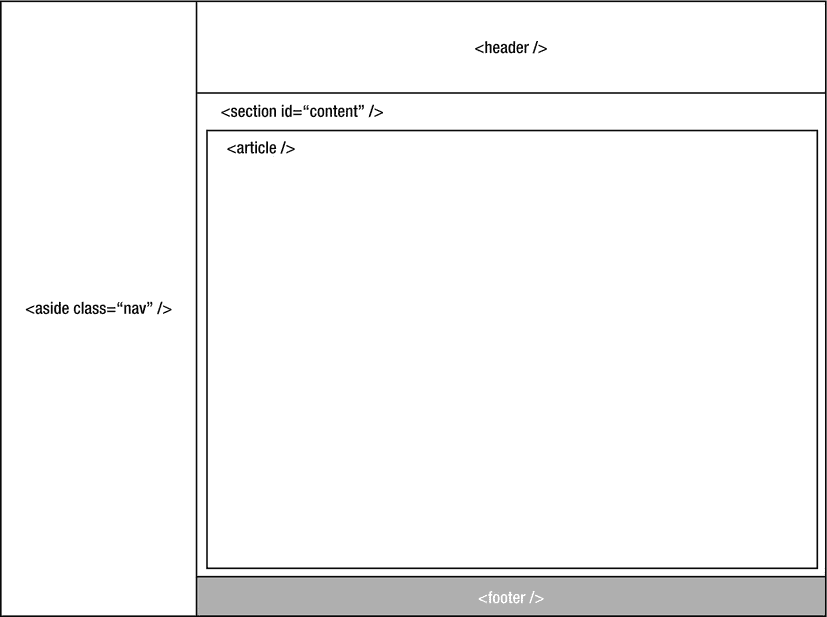

**图 3-6。** *具有`<footer />`元素的文档结构*

#### <表头/ >

元素可以用来在文档中创建一个标题。标签可以在一个文档中多次使用。它通常包含一个徽标和/或一组标题元素。`<header />`元素最常见的用途是在页面顶部添加徽标和导航。清单 3-11 展示了如何做到这一点。

虽然不是必需的，但是您可以用一个`<nav />`元素包装通常用于导航的`<ul />`。这使得消费者在阅读您的代码时清楚地知道它是一个导航元素。

**清单 3-11。** *在 HTML5 文档中创建标题*

`<header>

   

   <nav>` `      <ul>

         <li><a href="/home.html">Home</a></li>

         <li><a href="/about.html">About</a></li>

         <li><a href="/contact.html">Contact Us</a></li>

      </ul>

   </nav>

</header>`

您可以使用清单 3-12 中的代码在 HTML4 中获得相同的结果。

**清单 3-12。** *在 HTML4 中创建标题*

`

   

   <ul class="navigation">

      <li><a href="/home.html">Home</a></li>

      <li><a href="/about.html">About</a></li>

      <li><a href="/contact.html">Contact Us</a></li>

   </ul>

`

#### <【hgroup/>

`<hgroup />`元素可以用来将相关的标题组合在一起，比如标题的`<h1 />`元素和副标题的`<h2 />`元素。`<hgroup />`元素不应包含除标题元素之外的任何元素(即`<h1 />`、`<h2 />`、`<h3 />`、`<h4 />`等)。).

文档中`<hgroup />`的等级由该`<hgroup />`中等级最高的头元素定义。

清单 3-13 展示了如何在 HTML5 中使用一个`<hgroup />`，清单 3-14 展示了如何在 HTML4 中对标题进行分组。

**清单 3-13。** *使用 Hgroup 在 HTML5 中定义标题*

`<hgroup>

   <h1>My Header</h1>

   <h2>My Subheader</h2>

</hgroup>`

**清单 3-14。** *在 HTML4 中定义一组头*

`

   <h1>My Header</h1>

   <h2>My Subheader</h2>

`

#### <马克/ >

元素可以用来突出显示文档中的文本。[清单 3-15](#list_3_15) 展示了如何在 HTML5 中使用它，而[清单 3-16](#list_3_16) 展示了如何使用 CSS 和 HTML 的组合在 HTML4 中实现它。

**清单 3-15。** *在 HTML5 中使用 Mark 标签*

`
This is an <mark>important</mark> reminder for Inga Lyon
`

**清单 3-16。** *高亮显示 HTML4 中的文本*

`
This is an <em class="highlight">important</em> reminger for Inga Lyon

`

#### <导航/ >

元素可以用来定义页面中的导航链接。元素应该只用于定义页面中的主要导航元素，比如主导航或者侧边/子导航。您可以在`<nav />`元素中添加任何内容，只要它包含指向网站内容的链接。清单 3-17 展示了如何在 HTML5 中使用`<nav />`元素，清单 3-18 展示了如何在 HTML4 中定义一个导航。

**清单 3-17。** *在 HTML5 中创建导航*

`   <nav>

      <ul>

         <li><a href="/home.html">Home</a></li>

         <li><a href="/about.html">About</a></li>

         <li><a href="/contact.html">Contact Us</a></li>

      </ul>

   </nav>`

**清单 3-18。** *在 HTML4 中创建导航*

`<ul class="navigation">

   <li><a href="/home.html">Home</a></li>

   <li><a href="/about.html">About</a></li>

   <li><a href="/contact.html">Contact Us</a></li>

</ul>`

#### <输出/ >

元素可以用来显示计算的结果。当显示动态/AJAX 表单的结果时,`<output />`元素可以派上用场。不要通过修改``元素的内部 HTML 来显示结果，可以像设置任何其他基于 HTML 表单的输入元素一样设置值。

**注意:**提交带有`<output />`标签的表单不会发送输出的值。如果您希望这样做，您必须将隐藏字段的值设置为计算结果。

[清单 3-19](#list_3_19) 展示了如何在 HTML5 中实现这一点，[清单 3-20](#list_3_20) 展示了如何在 HTML4 中实现这一点。`for`属性可用于指定用于计算的相关输入。

**清单 3-19。** *使用 HTML5 中的输出元素*

`<form action="calculate.php" name="calculate">

   <input type="number" name="a" value="0" /> +
   <input type="number" name="b" value="0" /> =
   <output name="c" for="a b" />

</form>

`

**清单 3-20。** *在 HTML4 中创建类似输出的东西*

`<form action="calculate.php" name="calculate">

   <input type="number" name="a" value="0" /> +
   <input type="number" name="b" value="0" /> =
   

</form>

`

#### <章节/ >

元素可以用来定义 HTML5 文档中的一个部分。您可以使用`<section />`标签将常见的元素组合在一起，例如博客文章的章节或电子商务网站的产品信息。一个常见的误解是用`<section />`元素替换所有的`
`元素。如果您使用`<section />`元素来帮助样式化或脚本化，而不是创建语义文档，那么您可能应该使用带有类的`
`。

清单 3-21 展示了如何使用一个`<section />`元素将一篇博客文章上的评论组合在一起。

**清单 3-21。** *在 HTML5 中使用 Section 元素*

`<article>

   <header>

      <h1>Article Title</h1>

      

         Created by Daniel Carpenter on
         <time pubdate="2012-03-15">March 15th 2012</time>

      

   </header>

   
Article Content

   <section class="comments">

      <article id="comment-1">

      <header>
         

            From Becci Buckley on
            <time pubdate="2012-03-15">March 20th 2012</time>
         

      </header>

      
This is a great article Dan, it might need some work :D

      </article>

   </section>` `   <footer>

      <address>

         

            Written by
            <a rel="author" href="mailto:daniel.carpenter@somewhere.com">
               Daniel Carpenter
            </a>

             

            Follow him on
            <a rel="author" href="http://www.twitter.com/mrdanc">Twitter</a>

         

      </address>

   </footer>

</article>`

从清单 3-21 的[中可以看到，您可以在`<section />`元素中嵌套`<article />`元素。事实上，你可以在`<section />`标签中添加任何你喜欢的 HTML 元素。](#list_3_21)

#### <时间/ >

元素可以用来指定文档中的时间。除了为基于时间的元素提供语义标记之外，它目前似乎没有做太多事情。元素支持一个`datetime`属性，该属性可以用来以机器可读的格式给出日期或时间。它还支持与最近的父元素`<article />`相关的`pubdate`属性。清单 3-22 展示了如何使用`<time />`元素。

**清单 3-22。** *使用时间元素显示文章的发布时间*

`<article>

   <header>

      <h1>Article Title</h1>

      
` `         Created by Daniel Carpenter on
         <time pubdate="2012-03-15">March 15th 2012</time>

      

   </header>

</article>`

#### <视频/ >

元素可以用来在页面中嵌入视频。我将在本章后面的“用 HTML5 嵌入视频”一节中介绍这一点。

元素提供了一种使用 Flash 在 HTML 文档中嵌入视频的替代方法。它还有几个 JavaScript APIs 来控制视频的回放。

正在播放的视频在低于 Android 4 冰淇淋三明治的版本上会自动进入 Android 浏览器全屏，但在 Android 4 及以上版本会保持原位。

[表 3-3](#tab_3_3) 显示了`<video />`元素可用的属性。

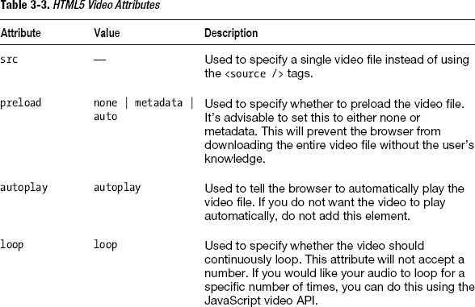

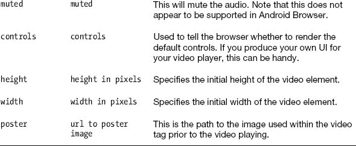

元素目前也支持最流行的视频容器和编解码器。

[表 3-4](#tab_3_4) 显示了 Android 浏览器目前支持的格式和 mime 类型。如何对这些格式进行编码将在本章后面讨论。

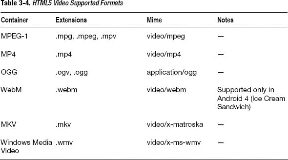

### 在 HTML5 中处理多媒体

随着移动设备速度的不断提高，以及移动 web 浏览器支持越来越多的视频和音频容器和编解码器，现在是探索向移动 web 应用添加视频的最佳时机。

向移动网站添加视频时，您需要考虑几个问题。不幸的是，这并不像为某个文件扩展名或格式编码视频和音频那么简单。

当编码 HTML5 的视频和音频时，有四件事你应该考虑。

*   设备支持的容器
*   设备上支持的编解码器和解码器
*   最终视频和音频的质量
*   最终视频和音频的文件大小

为了播放视频，您需要使用目标设备可以理解和播放的编解码器对视频和音频进行编码。

**注意:**编解码器由两部分组成:编码器和解码器。当您使用特定的编解码器压缩视频时，需要相同的编解码器来解压缩视频以备回放。不同的编解码器能够进行不同类型和质量的压缩(例如，H.264 将对视频进行不同于 VP8 的编码)。由于压缩视频的方式不同，不同的编解码器会对文件大小和质量产生影响。

编码视频的质量取决于您设置的比特率；这也会对文件大小产生直接影响。如果你有一个目标文件大小的想法，你可以计算视频的比特率应该是多少，并从那里开始工作。下面的公式应该可以帮助你解决这个问题。

**((视频比特率[Kb/秒] +音频比特率[Kb/秒]) *长度[秒]) * 0.125) =文件大小[Kb]**

网上有各种各样的比特率计算器，可以帮助你根据许多其他因素来计算视频或音频文件的比特率。这在使用命令行编码工具(如 FFMPEG 或美柯德)时会很有用。

围绕压缩/未压缩视频和音频的是一个容器。容器通常会为视频提供多个轨道的详细信息。一个轨道将用于视频本身，第二个轨道将用于视频的音频。容器不一定描述视频或音频文件是如何被编码的，但是可以定义关于视频应该如何被编码用于该特定容器的特定标准。

选择容器时，选择支持有限数量编解码器的容器很重要。这将使编码更加简单，因为您不必研究当前和更新的设备支持哪些编解码器。例如，Matroska (MKV)容器几乎支持目前可用的任何视频和音频编解码器，因此选择在容器中使用哪些编解码器是一项更大的任务；而 WebM 将仅支持 VP8 视频编解码器和 Vorbis 音频编解码器。这使得在为支持 WebM 容器的设备编码时任务变得更加简单。

为了避免混淆，[表 3-5](#tab_3_5) 显示了在为移动设备嵌入视频时您应该提供支持的最流行的编解码器和容器。

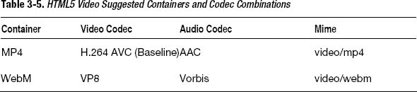

Android 文档还根据质量建议了以下分辨率，如[表 3-6](#tab_3_6) 所示。

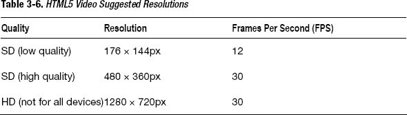

[表 3-7](#tab_3_7) 显示了 Android 上推荐的支持音频的容器和编解码器。

T2】

支持这两个容器和编解码器应该为所有 Android 设备提供足够的支持，而不需要您进行大量的批量编码和测试。

#### 为移动网络优化视频

现在，您应该对移动网络视频编码的复杂性有所了解。有许多应用可以让你为网络视频编码。其中一些是免费和开源的桌面应用(如用于 Mac/Windows 的 Easy HTML5 Video 和用于 Mac/Windows 的新 Miro Video Encoder)，其他是基于网络的托管解决方案，也提供对在线托管视频的支持(如 bitsontherun.com、zencoder.com 或 encoding.com)。

您应该使用最佳的编码解决方案来满足您的需求。

##### 托管解决方案

托管解决方案非常适合按需编码，如果您希望将大量网站流量卸载到另一台服务器上。大多数托管解决方案都提供 API，允许您通过 web 将视频推送到他们的服务。视频完成编码后，会给你一个 URL，可以用来嵌入你的视频。他们通常会消费以任何格式编码的视频，编码通常需要几分钟。托管解决方案还将提供基于设备或格式的常用编码选项列表。

使用这些托管解决方案最简单的是 bitsontherun.com，尽管 encoding.com 和 zencoder.com 对你如何编码你的视频提供了更多的控制，如图 3-7 所示。

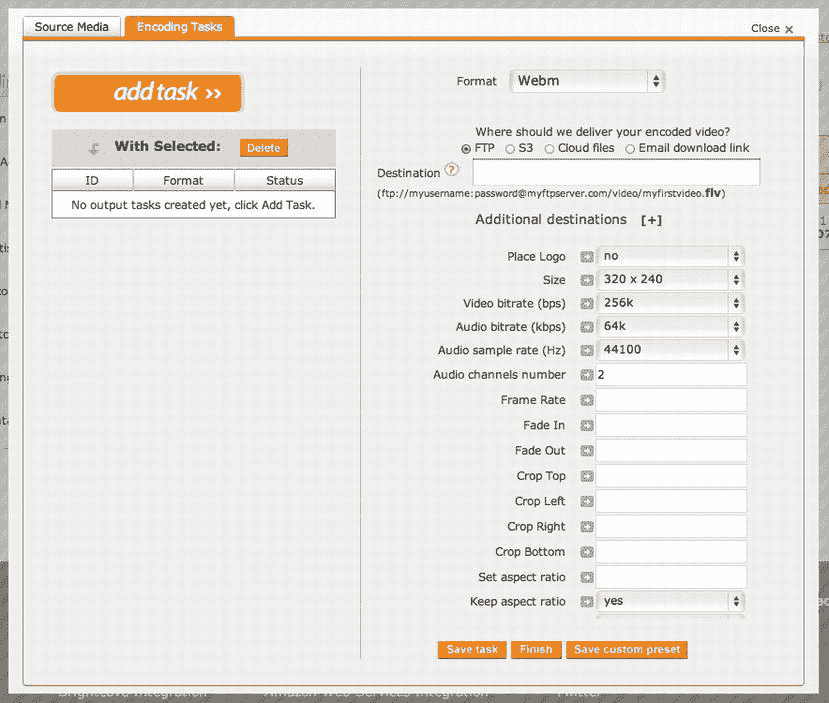

**图 3-7。encoding.com 上的**T3 编码选项

正如你所看到的，bitsontherun.com 通过提供基本选项来创建编码设置时要简单得多，如图 3-8 所示。如果你想对你的视频压缩选项有更多的控制，那么 encoding.com 和 zencoder.com 将提供最好的选择。如果你只是想编码视频，而不担心各种压缩选项，那么 bitsontherun.com 是最好的选择。如果您没有非常强大的机器，并且希望快速编码视频，或者如果您有大量视频要编码，托管编码解决方案是最佳解决方案。托管解决方案上可用的预设也在不断改进和调整。

使用托管解决方案的缺点是，你要根据上传和下载的数量付费，而在 zencoder.com，你要根据你编码的视频时长付费。

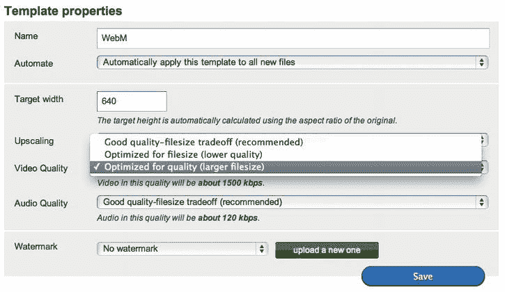

**图 3-8。bitsontherun.com 上的**T3 编码选项

##### 桌面解决方案

桌面编码解决方案非常适合小型编码运行。如果你有一台低规格的电脑，准备好去最近的酒吧喝一两杯啤酒，同时让你的电脑旁边的风扇开着以防止它过热！对视频进行编码需要大量的处理能力，并且可能需要几秒钟来渲染一帧。这个过程可能很耗时。电脑的处理器越好，编码时间就越短。

使用命令行工具，如 FFMPEG 和美柯德，而不是为它们提供接口的图形用户界面，会有它的优点。例如，它使您能够从用 Python、PHP 或 Ruby 编写的服务器端脚本中触发编码作业。您还可以在 bash 脚本中包装各种编码参数。这使您可以一次性对一个装满视频的文件夹进行批量编码。

Windows 和 Mac 最简单的免费桌面解决方案是 Miro Video Converter，如图[图 3-9](#fig_3_9) 所示。

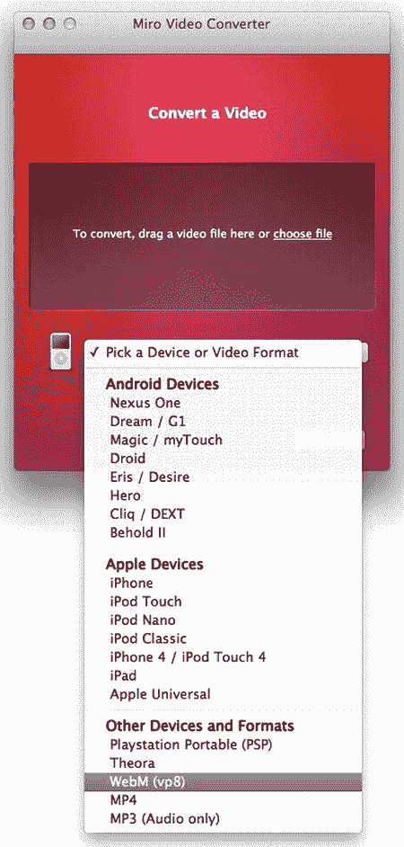

**图 3-9。**T3【米罗】Mac 视频转换器

如您所见，它有一个简单的拖放 UI，可以转换成许多不同的格式。当对基于桌面的 HTML5 网站的视频进行编码时，Miro 是完美的；然而，你会希望在不影响质量的前提下，尽可能多地从移动网络视频中挤出内容。米罗，目前，不允许你调整任何输出设置。

因此，目前最好的选择是使用 bitsontherun.com 为移动网络编码视频。

##### 用比特对视频进行编码

首先要做的是前往`[www.bitsontherun.com](http://www.bitsontherun.com)`创建一个免费账户。一个免费的帐户将会给你一个小时的视频存储和每月 20 小时的流媒体播放时间。这应该足够写这本书了。如果您需要更多，您可以随时升级到专业帐户。

创建帐户后，您需要为编码作业创建模板。

模板允许您为您的视频和音频创建自定义编码模板。您可以一次性创建一个模板，并将其用于所有视频和音频文件。

**注意:**不幸的是，如果你创建了一个模板，你必须用新模板手动重新编码任何视频。有一种方法可以通过使用 Run API 上的位来解决这个问题。

登录进入账户页面，如图[图 3-10](#fig_3_10) 所示。

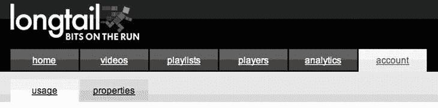

**图 3-10。bitsontherun.com 上的** *账户选项*

点击账户页面上的属性选项卡(也如[图 3-10](#fig_3_10) 所示)。在帐户属性下，单击模板选项卡。

从这里，您将创建两个模板。一个将用于 MP4 (H.264)，另一个将用于 WebM (VP8)。

点击页面下方的“添加新模板”按钮，如图[图 3-11](#fig_3_11) 所示。

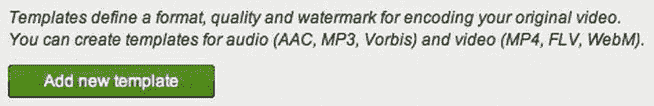

**图 3-11。** *【添加新模板】按钮*

然后你会看到一个类似于图 3-12 所示的“创建新模板”对话框。确保已经设置了以下设置:

*   名称:HTML5 MP4
*   格式:MP4 视频(H.264/AAC)

单击创建。

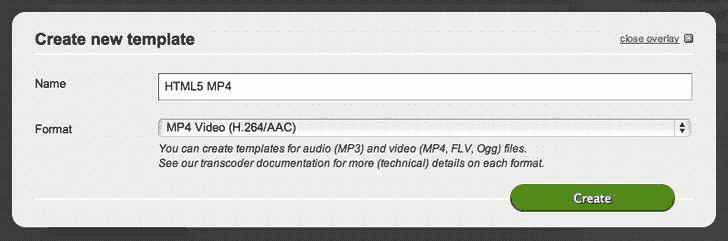

**图 3-12。** *【创建新模板】对话框*

类似于[图 3-13](#fig_3_13) 的“模板属性”页面将出现在您面前。确保设置了以下选项。

*   自动:自动将此模板应用到新视频
*   目标宽度:480
*   扩展:总是构建这个模板，即使原始模板更小
*   视频质量:良好的质量-文件大小权衡(推荐)
*   音频质量:良好的质量-文件大小权衡(推荐)
*   水印:无水印

单击保存。

您需要为 WebM 再次重复这个过程。除了在“创建新模板”对话框中输入以下信息。

*   名称:HTML5 WebM
*   格式:WebM 视频(VP8/Vorbis)

在“模板属性”页面上输入以下信息。

*   自动:自动将此模板应用到新视频
*   目标宽度:480
*   向上扩展:总是构建这个模板，即使原始模板更小
*   视频质量:良好的质量-文件大小权衡(推荐)
*   音频质量:良好的质量-文件大小权衡(推荐)
*   水印:无水印

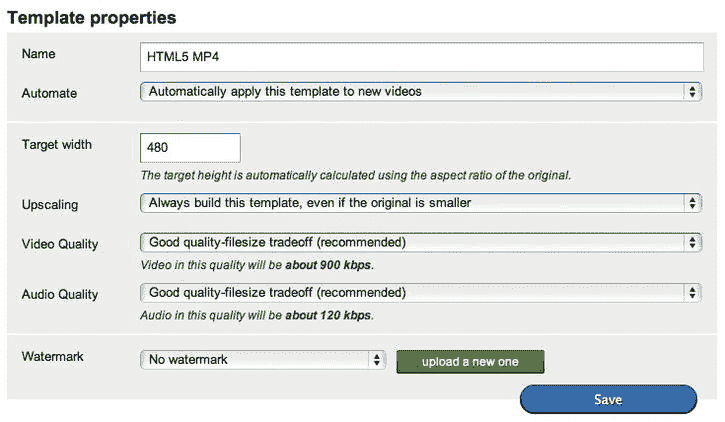

**图 3-13。** *模板属性*

现在，您应该可以开始将视频上传到您在 Run 帐户上的 Bits。为此，转到“视频”选项卡，点击右侧边栏中的“上传新视频”，如图 3-14 所示。

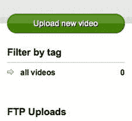

**图 3-14。** *【上传新视频】按钮*

你会看到“上传新视频:步骤 1”对话框，类似于[图 3-15](#fig_3_15) 所示。

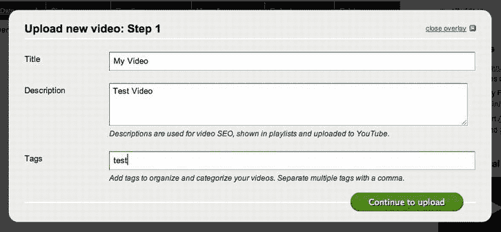

**图 3-15。** *“上传新视频:步骤 1”对话框*

在字段中输入适当的信息。由于这是一个测试视频，你可以选择任何你喜欢的。从这里开始，“我的视频”将指您刚刚上传的视频。点击“继续上传”按钮。

你现在应该在“上传新视频”对话框的第 2 步。点击浏览按钮，如图[图 3-16](#fig_3_16) 所示，选择您希望用作样本视频的任何视频。请确保您选择的视频小于 100 MB 否则，您可能需要等待一段时间才能上传测试视频。

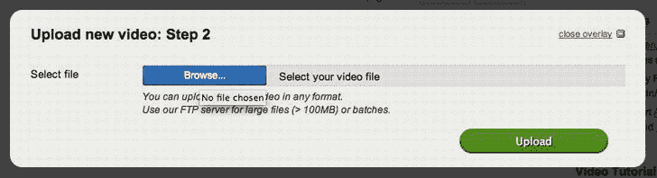

**图 3-16。** *“上传新视频:步骤 2”对话框*

上传完成后，运行中的 Bits 将开始编码过程。您的视频现在可以嵌入了。您可以下载视频并将其复制到您的移动 web 项目中，或者使用`<video />`元素中的`src`属性直接链接到该项目。下载它的好处是,不必担心当你达到极限时，运行中的数据会被删除。

#### 用 HTML5 嵌入视频

在网络上嵌入视频曾经是一个非常冗长的过程。在 Flash 流行之前，所有的浏览器、计算机，甚至同一操作系统的同一版本都有不同的编解码器和容器支持。没有真正的通用格式，你不能简单地将同一视频嵌入几种格式，这样浏览器就可以为用户选择正确的视频。

Flash 的出现解决了大部分问题。只需要一个插件就能播放所有格式的视频，这是网络视频的“闪亮盔甲骑士”。以至于几乎每个网站都用它来向用户发送视频。

然后智能手机出现了，Flash 移动版成了一场噩梦。它需要大量的 CPU，会像吸血鬼一样耗尽手机的电池。几乎任何便携式设备上的闪存也是如此，消耗了大量的 CPU 功率，这不仅影响了机器的性能，还影响了冷却 CPU 和供电的电池消耗。时至今日，Flash 仍然在 MAC 上消耗大量的 CPU。

除此之外，开发人员通常不会考虑手机来制作基于 Flash 的内容。因此，当在面向桌面的移动设备上观看视频时，你通常会得到一个 500 MB 的高清视频，但它并没有真正针对你的手机进行优化。这对用户的口袋也有影响，因为每月 500 MB 的数据计划将在几分钟内被一个视频消耗掉。

HTML5 出现了。最后，重点是浏览器、标准和硬件加速，不需要第三方插件。

HTML5 带来了 HTML5 视频。HTML5 视频为浏览器提供了一种支持在浏览器内解码视频的方式，而不管平台上支持的编解码器如何。这在现在意味着，如果一个用户在使用 Android 浏览器，他们肯定会有对 WebM 或 MP4 的支持；而且如果他们用的是 Safari 浏览器，肯定会支持 MP4 而不支持 WebM。不仅如此，HTML5 视频还支持多种不同类型的视频源。这意味着您可以提供针对每个编解码器和容器优化的视频文件。浏览器将从资源列表中选择最佳的编解码器和容器，对其进行流传输，并将其交付给用户的浏览器。

HTML5 规范的新特性还包括支持视频源中的媒体查询。这可以确保如果您使用平板设备，您可以获得更高分辨率的视频，而不必选择您希望观看的媒体质量。如果您使用的是移动手机，您将获得针对您的手机优化的视频，文件大小较小，因此它不会消耗您所有的数据许可。

**注意:**视频媒体查询存在于 HTML5 规范中，但似乎还没有任何浏览器支持它。

将你的视频嵌入 HTML5 相对简单。您使用`video`标签并指定视频的`width`和`height`属性。然后，您可以指定视频的标志帧。海报帧是视频中的一张静态图片，在用户单击播放按钮之前，您可以使用它向用户显示。

在 Aptana 中创建一个名为 tutorials 的新文件夹，并在其中创建一个名为 video 的文件夹。该文件夹将用于本练习。在 video 文件夹中，创建一个名为 media 的文件夹。将您已编码并从 Bits 下载的视频和海报图像文件复制到媒体文件夹，并按如下方式重命名。

*   video.webm
*   video.mp4
*   poster.jpg

在视频文件夹中创建一个名为`index.html`的新文件。您的文件夹结构应该如下所示:

*   教程
    *   录像
    *   媒体
        *   video.webm
        *   video.mp4
        *   poster.jpg
    *   index.html

在 Aptana 中打开`index.html`并输入来自清单 3-23 中[的 HTML。](#list_3_23)

**清单 3-23。** *在 HTML5 中嵌入视频*

`<!DOCTYPE html>
<html>

   <head>
      <meta charset="utf-8">
      <meta name="viewport" content="width=device-width, initial-scale=1,
maximum-scale=1">
      <title>Exercise Video</title>
   </head>

   <body>

      <video controls width="480" height="270" poster="media/poster.jpg">
         <source src="media/video.mp4" type="video/mp4">
         <source src="media/video.webm" type="video/webm">

         

            Your browser does not support HTML5 Video, <a
href="media/video.mkv">click here
            to download</a>
         

      </video>

   </body>

</html>`

保存并导出您的视频。在您的 Android 浏览器中找到该文件。网址应该是`[http://<your computer ip address>/tutorials/video/media/](http://<yourcomputeripaddress>/tutorials/video/media/)`。您应该会看到一个类似于[图 3-17](#fig_3_17) 的屏幕。

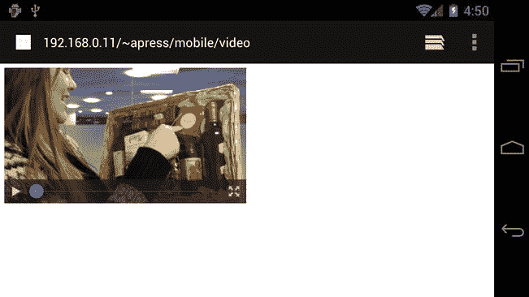

**图 3-17。** *HTML5 视频内嵌内容*

点击播放按钮，视频将开始缓冲和播放。从 Android 4+开始，Android 浏览器将与内容一起内联播放视频，而不是自动全屏。这带来了一个小问题，因为它在新旧设备处理视频的方式上存在不一致。这个问题的解决方案是使用 JavaScript video API 自动将视频放大到全屏。这将在第 7 章中介绍。

#### 为移动网络优化音频

幸运的是，Bits on the Run 还支持音频编码和网络托管。但是，由于编码音频比编码视频占用的 CPU 资源少得多，因此您可以使用桌面软件来完成这项工作。最流行的免费跨平台音频应用是 Audacity。您可以从 Audacity 网站的`[http://audacity.sourceforge.net/download/](http://audacity.sourceforge.net/download/)`下载并安装当前的稳定测试版。

当对移动网络的音频进行编码时，同样的规则也适用。

*   确保文件很小。
*   确保最终音频的质量足够好，可以通过耳机和小扬声器听到。

和视频编码一样，你需要在质量和文件大小之间找到一个合适的平衡点。不像视频，用户必须同时关注音频和视频，只有音频，用户将主要关注于听你的音频，所以音频的质量是最重要的。这意味着必须更加小心，以确保每个轨道都以正确的方式进行转码和压缩。

需要大量的试验和错误，但是根据您想要转码的音频类型，您可以开始在 Audacity 中构建预置。例如，与包含音乐曲目的音频内容相比，您将对仅包含声音的音频内容(如有声读物)使用不同的设置。例如，你从人声中听到的频率比从摇滚乐队中听到的频率要窄得多。这意味着有声读物的文件大小可能比使用有损压缩的音乐轨道的文件大小小。

**注意:**压缩类型有无损和有损两种。无损压缩试图以这样一种方式对音频进行编码，即在编码时它具有较小的文件大小，但在解码时它仍将与压缩前相同。有损压缩将分析音频内容，并删除可能听不到的部分。这意味着使用有损压缩时，无论解压缩技术如何，您都会丢失信息。

##### 大胆编码音频

用 Audacity 编码音频可能是一个简单的过程。在这个例子中，你需要下载一个未压缩的音频文件，所以直接下载 SoundCloud ( `[www.soundcloud.com](http://www.soundcloud.com)`)。使用 SoundCloud 搜索您喜欢的任何音乐曲目，并确保选择了以下选项，如图 3-18 所示。

*   未压缩的文件
*   曲目应为:可下载
*   仅搜索知识共享许可曲目
*   它们应该:可以自由地用于商业用途

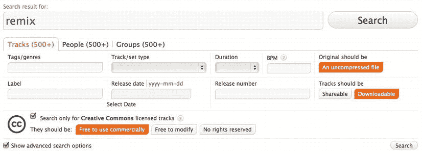

**图 3-18。*soundcloud.com***搜索选项

选择任何一首频率范围高的歌曲(从 dub step 流派中挑选一些会是一个不错的选择)并下载它。这应该给你一个未压缩的 WAV 或 AIFF 文件进行实验。

我们的目标是让每分钟的音频文件大小在 0.5 到 1 MB 之间。这相当于在 HSDPA 上加载 1 分钟的音频需要 4-8 秒，在 3G 上需要 1-2 秒。[当试图计算在移动数据网络上下载 1 MB 数据需要多长时间时，应使用表 3-8](#tab_3_8) 。

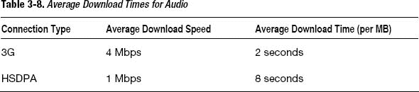

这本书的样本曲目是一个 WAV 文件，具有以下设置:86.1 MB，时间长度为 4:59，平均每分钟 18.75 MB。每种格式的目标文件大小在 4 到 5 MB 之间。

###### 编码 OGG

您将首先以 OGG 格式编码音频文件。这是两者中比较简单的一个，因为 Audacity 提供了一个单一的配置选项。打开 Audacity 并打开您的文件，方法是转到文件打开，并选择您刚刚下载的文件。如果出现图 3-19 所示的警告，确保“编辑前备份文件(更安全)”和“不再警告并总是使用我上面的选择”都被选中。

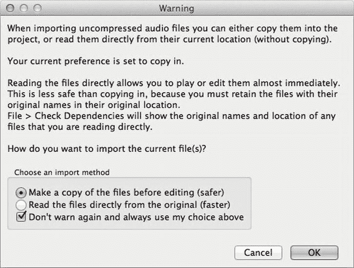

**图 3-19。**来自无畏的*警告对话框*

当文件处理完毕后，你会看到该文件的波形，类似于[图 3-20](#fig_3_20) 。

您现在可以将音频文件导出为 OGG Vorbis 音频文件。转到文件导出。在“格式”下，选择“Ogg Vorbis 文件”,然后单击选项右侧的“选项”按钮。

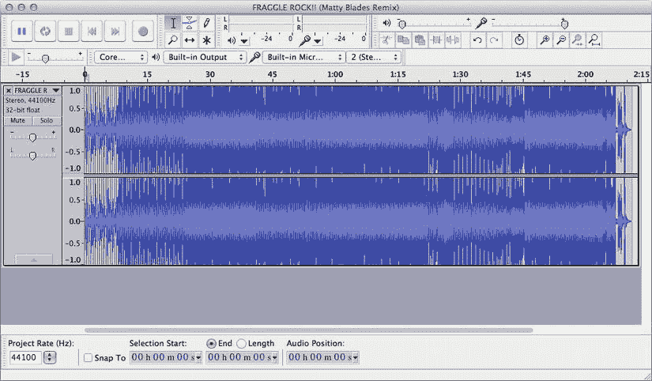

**图 3-20。** *轨迹的波形*

你将看到一个类似于[图 3-21](#fig_3_21) 的选项对话框。选择最低质量，然后单击确定。Vorbis 是可变比特率(VBR)编码的一种形式。VBR 将根据每段音频的复杂程度，在整个音轨中使用不同的比特率。与以恒定比特率编码的具有相同或更低质量的文件相比，这可能产生具有合理质量的非常小的文件，但是由于音频的复杂性，文件大小要大得多。

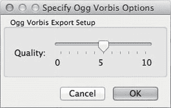

**图 3-21。** *Ogg Vorbis 输出选项*

这种编码的结果应该是一个音频轨道，听起来应该类似于原始的 WAV 文件，但文件大小小于 3 MB。在 OGG 的最低质量设置下编码时，本书使用的测试音轨的结果是文件大小为 2.5 MB，音质没有明显差异。

###### 编码 MP3

编码 MP3 音频的过程类似于为 Vorbis 导出音频。按照相同的步骤打开原始 WAV 文件，并转到文件导出。从格式下拉列表中选择 MP3 文件(而不是 Ogg Vorbis 文件)。单击选项…按钮。

您将看到一个类似于图 3-22 中[所示的导出对话框。MP3 VBR 编码的表现似乎不如 OGG Vorbis。即使在最高压缩设置下，音频文件大小仍然是 OGG Vorbis 压缩输出的两倍。使用 128 kbps 的平均位速率模式将为您提供与最低 OGG Vorbis 压缩选项相同或相似的质量，但文件大小更大，并且仍在可接受的文件大小范围内，即每分钟音频 0.5 到 1 MB。](#fig_3_22)

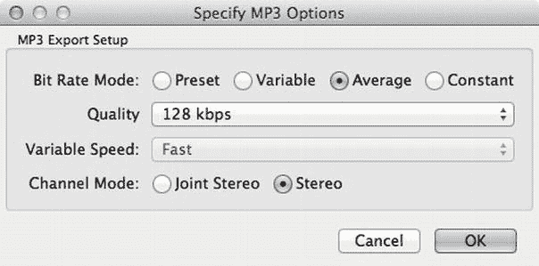

**图 3-22。** *MP3 导出选项*

单击确定并保存。如果您希望在下一个屏幕上输入元数据，请继续输入；否则，再次单击确定，音频文件将开始导出。

#### 用 HTML5 嵌入音频

用 HTML5 嵌入音频相当简单。在 HTML5 之前，没有真正的标准方法来用不同的编解码器嵌入音频，尤其是在移动设备中。对于 mobile，首选方式是使用 Flash 或提供一个 3GP 文件的链接，这是一种移动设备广泛支持的格式。随着在移动设备上传送和播放高质量音乐的能力变得越来越流行，音频标签将开始被广泛使用。

在 HTML5 中嵌入音频的过程类似于嵌入视频。您使用 audio 标记并指定几个来源，以便浏览器选择正确的来源。

在教程文件夹中新建一个名为 audio 的文件夹，然后在 audio 文件夹中新建一个名为 media 的文件夹，再新建一个名为`index.html`的文件。将您转换的音频文件复制到媒体文件夹，并将其重命名为`audio.ogg`和`audio.mpg`。

您的文件夹结构应该类似于此。

*   教程
    *   声音的
    *   媒体
        *   audio.mp3
        *   音频.ogg
    *   index.html

打开`index.html`文件，使用[清单 3-24](#list_3_24) 中的代码。

**清单 3-24。** *在 HTML5 中嵌入音频*

`<!DOCTYPE html>
<html>

   <head>

      <meta charset="utf-8">
      <meta name="viewport" content="width=device-width, initial-scale=1,
maximum-scale=1">
      <title>Testing Audio</title>

   </head>

   <body>

      <audio controls>

         <source src="media/audio.ogg" type="application/ogg">

         <source src="media/audio.mp3" type="audio/mpeg">

         

            Your browser does not support HTML5 Audio, <a
href="media/audio.mp3">click
            here to download</a>
         

      </audio>` `   </body>

</html>`

在您设备的浏览器中打开页面；你会看到类似于[图 3-23](#fig_3_23) 的东西。

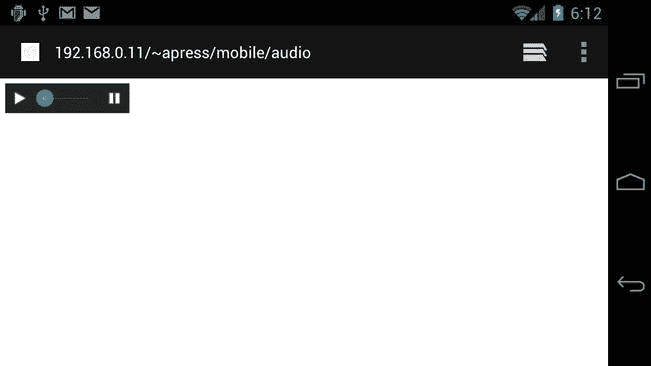

**图 3-23。***html 5 中的音频*

单击播放按钮，您将通过设备的扬声器或耳机听到音频。您可以使用 HTML5 音频标签创建一个带有自己的 UI 的自定义播放器。这将在第 7 章中介绍。

### HTML5 移动表单

对于填写表单的用户和创建表单的开发人员来说，表单可能是一个枯燥乏味的主题。还记得上次你在电脑上填写注册表格是多么令人恼火吗？现在想象一下，如果你在一个小屏幕、没有鼠标和键盘的设备上填写同样的表格，会是多么令人恼火。

使用移动表单与使用普通 web 表单没有什么不同。由于屏幕尺寸的限制，必须考虑表单的布局，以及您真正需要从用户那里收集多少信息。[图 3-24](#fig_3_24) 展示了 confused.com 手机版和桌面版车险报价表的区别。

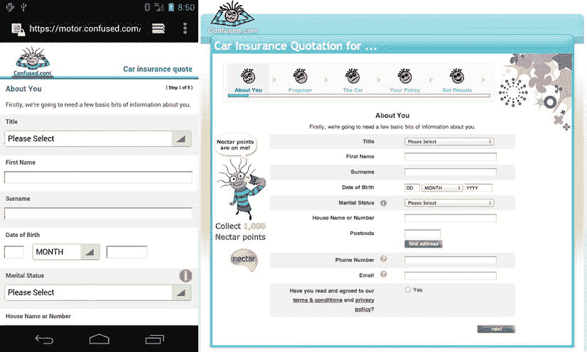

**图 3-24。** *汽车保险报价表手机版(左)和桌面版(右)*

正如您所看到的，问题是相同的，但是考虑到屏幕大小，通过重新定位字段标签和字段本身来利用窄而长的屏幕。

#### 不同数据类型的字段

根据所需字段和数据的类型，您可以为 Android 浏览器使用不同类型的输入字段。[表 3-9](#tab_3_9) 显示了 Android 浏览器目前支持哪些 HTML5 字段类型。

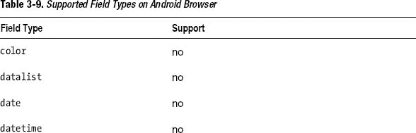

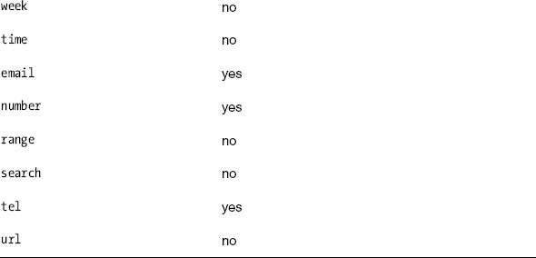

如你所见，Android 浏览器目前支持的字段类型只有电子邮件、号码和电话。其他字段类型应该在将来的某个时候实现。您可以选择现在实现它们并解决缺少支持的问题，但是您可能会在支持最终到达后遇到问题。

您可以在您的设备上对此进行测试，方法是在名为 forms 的项目中为此练习创建一个新文件夹。在名为`index.html`的文件中创建一个新文件。

清单 3-25 显示了产生三种不同输入表单类型的代码。

**清单 3-25。** *输入类型代码*

`<!DOCTYPE html>
<html>

   <head>
      <meta charset="utf-8">
      <title>Form Fields</title>
      <meta name="viewport" content="width=device-width, initial-scale=1,
maximum-scale=1">
   </head>
   <body>

      <form>

         <fieldset>

            <legend>HTML5 Input Types</legend>` `            

               <label for="email">Email</label>
               <input type="email" name="email"
placeholder="someone@somewhere.com">
            

            

               <label for="number">Number</label>
               <input type="number" name="number">
            

            

               <label for="telephone">Telephone</label>
               <input type="tel" name="telephone" placeholder="+44
012345678901">
            

         </fieldset>

      </form>

   </body>

</html>`

这只是一个标准的 HTML5 表单。您可能会注意到在一些字段中有一个名为`placeholder`的属性。属性允许您为表单输入显示有用的示例文本，以帮助用户弄清楚他们需要在表单字段中输入什么。当用户点击填写表单域时，占位符文本将会消失。

根据不同的输入类型，你会看到不同的键盘来帮助用户更快地输入信息。[图 3-25](#fig_3_25) 显示了用于三种支持的输入类型的不同键盘布局。

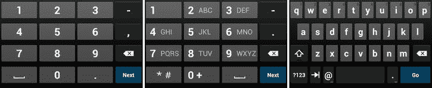

**图 3-25。** *数字(左)、电话(中)、电子邮件(右)的键盘布局*

在你手机的浏览器中加载新的网页进行测试。

### 总结

Android 版 HTML5 到此结束。从这一章中，你应该已经获得了大量关于为网络和移动网络编码视频和音频的知识。你现在应该对编码媒体的不同方式有了基本的了解，你不需要一台强大的机器来编码媒体，只需要一个快速的互联网连接。

本章已经带你了解了 Android 浏览器目前支持的所有新的 HTML5 元素，以及如何有效地使用它们。

希望这一章能让你为这本书的其余部分做好准备，因为我们开始更详细地探索交互性。HTML 本身提供了一个基础，我们可以在这本书中进一步使用 CSS 进行表示，使用 JavaScript 进行交互。

在下一章中，您将通过创建 HTML 框架来关注移动 web 应用的开端。在这本书里，你将学习移动网络开发的一个特殊方面，然后使用这些知识来构建和增强你的应用。这就是所谓的*渐进式增强*，这是一种为 web 所采用的实践，以确保您的应用能够跨所有平台工作，而不管它们的能力如何。

您还将学习三种不同类型的移动 web 表示解决方案，包括为应用的每个页面使用标准 HTML 页面，使用基于卡片的系统，其中所有页面都位于一个 HTML 文件中，以及使用 Ajax 加载每个页面。

下一章非常实用，所以加载 Aptana Studio，准备编码吧！