# 五、移动 CSS3

移动开发最令人兴奋的一个方面是在最新的智能手机上通过浏览器支持 CSS3。在 CSS3 之前，我们依赖于使用 JavaScript 来提供令人眼花缭乱的动画和过渡，只需将样式应用于 DOM 元素，如父元素中的最后一个元素或交替的表格行。

在这一章中，你将学习一些 CSS3 的新特性，比如动画和过渡。您将了解 CSS3 如何提供与最基本的动画概念相似的特性，称为*关键帧*。

您将学习如何在移动 web 应用中导入新的字体，这将为您的受众提供更广泛的字体集。您还将了解 CSS3 的一些关键特性，如文本阴影、选择器、渐变和新的边框属性。此外，您将简要地接触 CSS 媒体查询，这将帮助您应用基于屏幕分辨率和像素密度的样式。

最后，您将看到语法上非常棒的样式表(SASS)形式的 CSS 预编译器的强大功能，通过它您将了解如何简化您的 CSS 工作流并减少编码时间。

### 特定于供应商的属性

在撰写本文时，许多 CSS3 属性，如`border-radius`和`opacity`，已经被标准化。然而，浏览器制造商可以开发他们自己的新 CSS 属性的实现。为了避免语法差异引起的冲突，尚未标准化的新 CSS 属性通常会以供应商前缀开头。例如，在`border-radius`的标准化之前，在 CSS3 中有几种可能的方法来声明它。

*   `-moz-border-radius`
*   `-o-border-radius`
*   `-webkit-border-radius`
*   `border-radius`

正如你所看到的，这个列表中的最后一个声明是现在的标准化版本，对于基于 Gecko 的浏览器(Firefox)，特定于供应商的实现以`-moz-`为前缀；对于 Opera，以`-o-`为前缀；对于基于 Webkit 的浏览器(Chrome、Android 浏览器、Dolphin)，以`-webkit-`为前缀。

还有更多特定于厂商的前缀，但一般来说，对于 Android 来说，`-moz-`、`-o-`和`-webkit-`应该足够了。始终包括标准实现是很重要的。

有一些方法可以避免在需要时声明所有四个 CSS 属性，我将在本章后面的“CSS 预编译器(SASS)”一节中对此进行解释。

### CSS 动画和过渡

CSS3 引入了 DOM 元素的 CSS 过渡和转换。您可以使用这些来代替传统的动画 DOM 元素的方法，方法是使用 JavaScript 中的计时器来操纵它们的 CSS 属性。你可能会问自己，为什么我要用 CSS 做动画而不是 JavaScript？当然，CSS 应该用于样式，JavaScript 应该用于交互。事实是，通过使用 CSS3 制作动画，您可以将大量经常使用 JavaScript 传递给设备 CPU 的繁重工作卸载到设备的 GPU(如果它有 GPU 的话)。这可以使动画更加流畅。

#### 过渡

CSS 过渡允许您在两种 CSS 样式之间创建过渡。您可以通过创建一个 CSS 样式并向其添加另一个样式来调用转换。CSS 转换将处理两种状态之间的变化。

在 CSS3 中创建一个过渡非常简单。首先你创建你的`div`元素。

`

`

接下来，为 CSS 元素创建一个样式。在这个样式中，将`width`和`height`设置为`100px`，将`position`设置为`absolute`，因为您将把元素移动到页面上的不同位置。您也可以通过将`border-radius`设置为`50px`来将正方形变成圆形。您还明确地将`top`和`left`位置设置为`0px`，将`background-color`位置设置为`blue`。

`.test {
   width: 100px;
   height: 100px;
   position: absolute;
   top: 0px;
   left: 0px;
   border-radius: 50px;
   background-color: blue;
}`

这将呈现出类似于图 5-1 中[所示的图像。](#fig_5_1)

**图 5-1。** *渲染一个 CSS 圆圈*

现在你需要为球设置下一个状态。这就像创建一个具有不同属性的新样式一样简单。

`.second-position {
   left: 50%;
   background-color: yellow;
}`

正如您所看到的，新的属性将圆设置为位于屏幕的中间，其`background-color`为`yellow`。将这个 CSS 类添加到测试中`div`。

`

`

现在你会看到一个类似于图 5-2 中[所示的屏幕。](#fig_5_2)

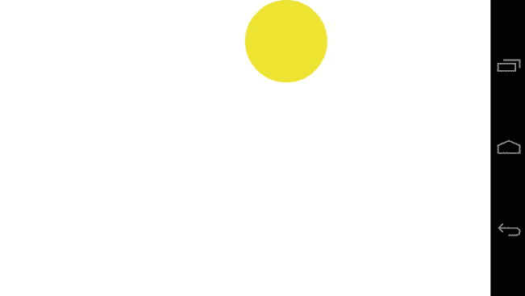

**图 5-2。** *测试分区最终位置*

最后要做的是给`.test`类添加一个过渡。这将规定应该如何过渡和过渡什么属性，以及过渡的时间。

过渡属性目前是特定于供应商的，并且，像往常一样，包含所有供应商属性是一种好的做法。下面的代码将为`test`元素的所有属性创建一个转换。

`.test {
   width: 100px;
   height: 100px;
   position: absolute;
   top: 0px;
   left: 0px;
   border-radius: 50px;
   background-color: blue;
   transition: all 2s;
   -moz-transition: all 2s;
   -webkit-transition: all 2s;
   -o-transition: all 2s;
}`

为了让转换工作，您需要动态地将`second-position`类添加到元素中。您可以使用 JavaScript 来做到这一点。下面的脚本将搜索类名为`test`的第一个元素，并将`second-position`类追加到其中。您应该将它放在测试元素的下面，如图所示。

`
&nbsp;

`

当您将页面加载到移动设备上时，圆圈应该会在屏幕的中心出现，并逐渐变为黄色。

还可以通过指定属性、持续时间、计时函数和延迟来控制应该转换哪些属性，如下面的示例所示。

`[-moz-|-o-|-webkit-]transition: property transition-duration transition-timing-
function transition-delay [, property duration timing-function delay]`

使用这种简单的方法，您可以指定任意多的属性来制作动画。表 5-1 列出了可能的值。

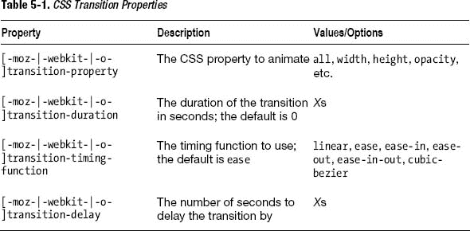

例如，您可能想要在颜色过渡开始五秒钟后开始过渡左侧位置，并减缓左侧位置。在这种情况下，您可以使用下面的代码。

`.test {
   width: 100px;
   height: 100px;
   position: absolute;
   top: 0px;
   left: 0px;
   border-radius: 50px;
   background-color: blue;
   transition: left 5s ease-out 5s, background-color 5s ease 0s;` `   -moz-transition: left 5s ease-out 5s, background-color 5s ease 0s;
   -webkit-transition: left 5s ease-out 5s, background-color 5s ease 0s;
   -o-transition: left 5s ease-out 5s, background-color 5s ease 0s;
}`

#### 动画

有时，您可能希望对动画有更多的控制。例如，如果您可以从一个位置到另一个位置制作动画，同时在动画中的某些点更改某些 CSS 属性，这不是很好吗？这被称为关键帧。如果您有 flash 动画方面的经验，您会更好地了解如何在 Flash 时间轴中对对象进行重大更改，并在它们之间创建补间动画。关键帧现在在 CSS 中可用。与往常一样，在撰写本文时，这是特定于供应商的，因此为了兼容，请使用所有可用的供应商。在这个演示中，您将在屏幕上制作一个圆圈的动画，并使其弹跳。

在开始创建弹跳球动画之前，请看图 5-3 中所示的动画。

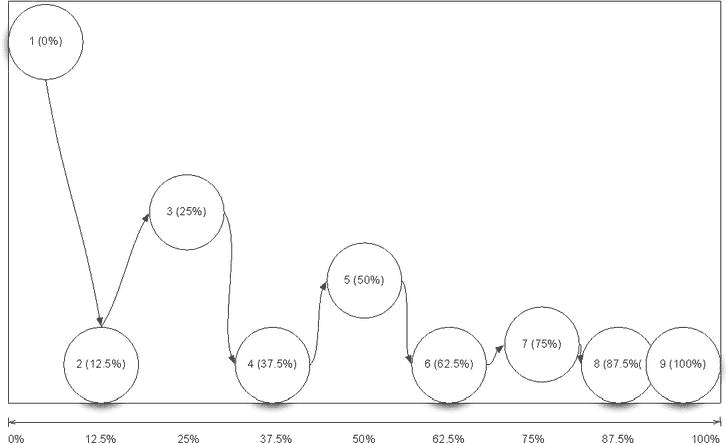

**图 5-3。** *期望的动画序列*

从[图 5-3](#fig_5_3) 中的动画序列可以看出，其目的是模仿一个弹跳的球。CSS 关键帧功能允许您指定您希望以百分比增量制作动画的 CSS 样式。我们可以使用图 5-3 中[所示的信息来创建关键帧规则。](#fig_5_3)

首先，使用`@keyframes`规则和关键帧的名称创建一个新的关键帧定义，如下面的代码所示。

`@keyframes bouncyball {
}`

接下来，使用百分比标记和 CSS 样式指定动画附加元素的开始位置。

`@keyframes bouncyball {
   0% { top: 0px; left: 0px; }
}`

这里，您已经指定了关联的元素应该从左上角开始。

接下来，指定动画中的各个分段。以[图 5-3](#fig_5_3) 为指导，有 0%、12.5%、25%、37.5%、50%、62.5%、75%、87.5%、100%的 CSS 规则。

`@keyframes bouncyball {
   0% { bottom: 100%; left: 0px; }
   12.5% { bottom: 0px; left: 12.5%; }
   25% { bottom: 50%; left: 25%; }
   37.5% { bottom: 0px; left: 37.5%; }
   50% { bottom: 25%; left: 50%; }
   62.5% { bottom: 0px; left: 62.5% }
   75% { bottom: 12.5%; left: 75% }
   87.5% { bottom: 0px; left: 87.5% }
   100% { bottom: 0px; left: 100% }
}`

现在是时候为你的球创建一个新的 CSS 规则了。下面的代码将从一个正方形创建一个圆，并将动画应用到元素。

`.ball {
   background: black;
   width: 100px;
   height: 100px;
   position: absolute;
   border-radius: 50px;
   animation: bouncyball 2s ease-in-out;
   -moz-animation: bouncyball 2s ease-in-out;
   -webkit-animation: bouncyball 2s ease-in-out;
}`

这个例子中的动画 CSS 属性是用速记写的，并且同样是特定于供应商的。[表 5-2](#tab_5_2) 列出了动画属性按顺序取的参数。

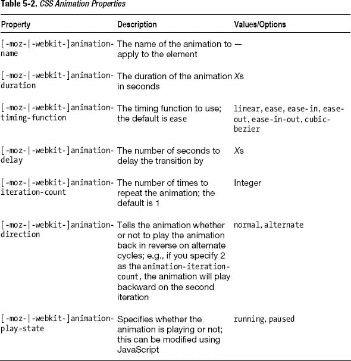

当您将动画加载到设备上时，它应该会自动播放。它不是一个非常平滑的弹跳球，但这只是为了证明 CSS 可以成为动画的一个非常强大的工具，不费吹灰之力。您还可以使用 JavaScript 来动态编写 CSS 动画脚本。对于更密集的动画，也有 HTML5 画布。

### CSS3 新特性

除了动画、转换和过渡，CSS3 规范还有几个值得注意的新特性。在本节中，您将学习如何使用`@font-face`通过导入字体文件将新的字体引入到您的移动 web 应用中。

您还将学习如何使用几个新的边框样式元素，比如`border-radius`(这将允许您在元素上创建圆形边框，而不需要额外的标记或 JavaScript)、`box-shadow`和`border-image`。您还将学习如何根据文档的大小创建可缩放的 CSS3 渐变，而不需要重复的背景图像并节省带宽。

这一节还介绍了几个新的 CSS3 选择器，它们使基于状态和层次的 DOM 元素样式化变得更加容易。

#### @font-face

`@font-face`是 CSS3 的一项新的标准化功能，允许您使用网页安全字体列表之外的字体(如 Arial 和 Times New Roman 等字体，它们通常在大多数设备上都能找到)。这给了你更多的自由去创造你的字体。在`@font-face`之前，使用非网页安全字体的非标准化方法包括 cufon(一种利用 Canvas 和 SVG 的技术)、sIFR(虽然现在不再保留，但 sIFR 使用了 Flash)和标准 CSS 图像替换(一种利用预先渲染的文本图像作为屏幕上应显示文本的背景图像的方法)。

重要的是要记住，虽然你对你使用的字体有完全的自由，但你必须确保字体确实与你的内容和受众相关。同样重要的是要记住，有些字体适用于标题，但不适用于正文，因为在较小的字体下会变得不可读(见[图 5-4](#fig_5_4) )。例如，对于正文来说，漫画 Sans 是一个糟糕的字体选择。

> 漫画无字体是独一无二的:在全世界都被使用，它是一种不想成为铅字的字体。它看起来很普通，是手写的，对于我们认为有趣和自由的事情来说是完美的。对玩具店的遮阳篷来说很好，但对新闻网站、墓碑和救护车的侧面来说就不那么好了。”

[www.bbc.co.uk/news/magazine-11582548](http://www.bbc.co.uk/news/magazine-11582548)

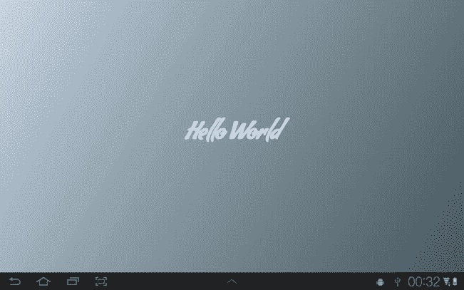

**图 5-4。** *Hello World with a web 字体*

在网络上使用`@font-face`有几个注意事项。最大的问题是关于许可。为了在浏览器中呈现字体，字体必须是可下载的。当使用可能附有许可证的购买字体时，这可能会带来潜在的问题。在您的项目中使用 web 字体之前，您应该检查许可证是否允许使用`@font-face`下载或交付字体。如果你不能使用你想要的字体，你可以使用谷歌字体目录，使用开源网络字体中的任何字体(见[图 5-5](#fig_5_5) )。谷歌还提供了一种便捷的方法来嵌入托管在其服务器上的网络字体。

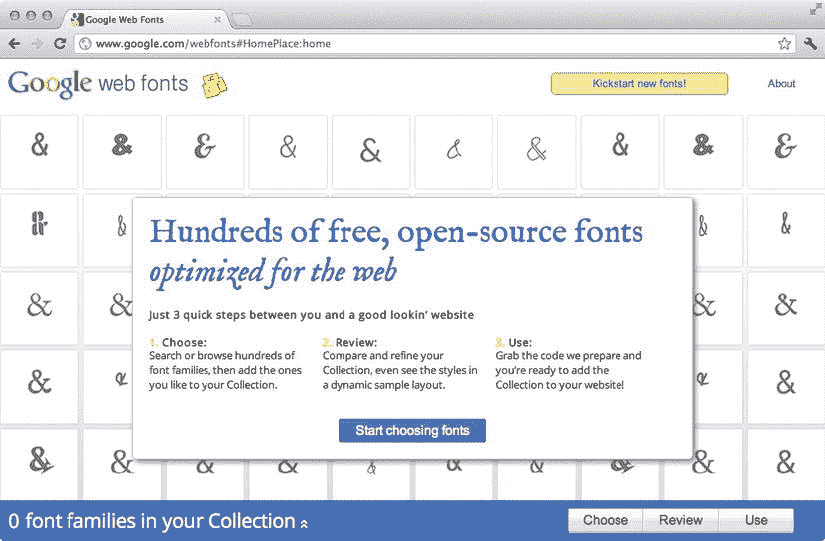

**图 5-5。** *谷歌网页字体*

网络字体的第二个警告是它们的文件大小。使用单一的 web 字体不会对加载时间产生太大的影响，但是如果您使用多种活动的 web 字体或具有多种字体样式的 web 字体，您可能会遇到页面加载时间缓慢的问题。因此，只包含 web 应用所需的字符集和字体样式很重要，这样可以减少字体的负载。

Android 浏览器足够智能，只在页面上实际使用时加载一个字体族。例如，如果您定义一个`h4`元素来使用 web 字体，那么除非该元素存在于页面上，否则 web 字体不会下载，即使 CSS 类中有该字体的定义。

在撰写本文时，Android 浏览器仅支持 TTF 和 SVG 字体，这是两种最大的未压缩字体格式。其他格式包括 EOT 和 WOFF。当声明`@font-face`支持其他浏览器和时，包含所有字体格式是很重要的，这样当 Android 浏览器开始支持其他格式时，它们可以被加载而不需要改变你的代码。顺序应该是大小优先(从最小的开始)，因为 Android 浏览器将选择第一个可用的格式来使用。万一 Android 可能已经包含了你想在设备上使用的字体，你也可以先指定字体的本地名称。如果找到了该字体，就不需要从网上加载和下载该字体。

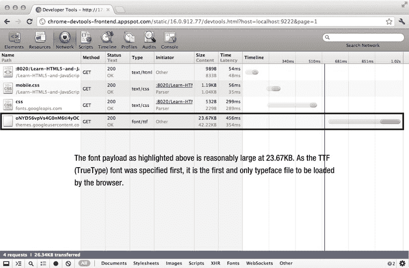

**图 5-6。***Android 版谷歌浏览器中的字体负载*

`@font-face`声明用于声明新字体。CSS 文档中的每个新字体声明都使用`@font-face {}`。

`@font-face {
   font-family: "MyFont";
   src: url(’/path/to/my/font.otf’);
}`

从这里开始，你可以定义`font-family`来引用 CSS 中的字体。最后，声明字体的来源。这可以是服务器上的路径，也可以是远程服务器上的字体。

然后，您可以使用传统方法在 CSS 中的任何地方自由使用该字体系列。

`h1 {
   font-family: "MyFont";
}`

下面的代码示例展示了如何使用`@font-face`的完整声明。

`@font-face {
   font-family: "My Font With Spaces";
   src: local("My Font With Spaces"),
      url("/path/to/fonts/my-font-with-spaces.woff") format("woff"),
      url("/path/to/fonts/my-font-with-spaces.eot") format("embedded-opentype"),
      url("/path/to/fonts/my-font-with-spaces.svg") format("svg"),
      url("/path/to/fonts/my-font-with-spaces.ttf") format("truetype");
   font-style: normal;
   font-weight: normal;
}`

#### 文本阴影和文本描边

允许你使用 CSS 在文本后面创建不同数量的阴影。`text-stroke`允许您在文本的内侧边缘绘制轮廓。`text-shadow`和`text-stroke`也可以用在`@font-face`字体上。

要在文本周围创建一个基本的阴影，只需在 CSS 中添加`text-shadow`属性。属性接受下列值和格式。

`text-shadow: horizontal-offset vertical-offset blur color;`

例如，下面的 CSS 样式将产生类似于图 5-7 所示的结果。

`h1 {
   text-shadow: 10px 10px 10px #000000;
}`

也可以使用负数表示阴影的位置。这将使水平偏移的阴影向左偏移，垂直偏移的阴影向上偏移。

通过以像素为单位指定笔画宽度及其颜色来定义`text-stroke`属性。`text-stroke`属性接受以下格式的值。

`text-stroke: width color;`

它的用法与`text-shadow`非常相似，如下面的代码片段所示。

`h1 {
   text-stroke: 1px #000000;
}` 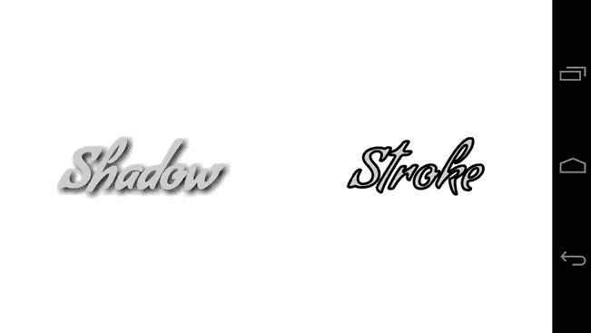

**图 5-7。** *文字阴影效果(左)和笔画效果(右)*

#### 选择器

选择器允许您使用 CSS 对 DOM 元素应用样式。通常有两种类型的选择器:常规的 CSS 类和元素和 ID 选择器，如`.elementclass`、`#elementid`和`element`。还有赝选者，比如`:link`、`:visited`、`:hover`、`:active`。

CSS3 引入了几个新的选择器，允许您根据属性值、输入状态和元素在 DOM 中的位置来选择元素。

##### 有用的表单选择器

表单选择器将使您能够根据表单输入的状态或类型来设计它们的样式。在 CSS3 之前，您需要手动将类分配给文本、复选框、单选按钮、提交字段和按钮，因为没有明确的方法将样式应用于这些字段。这是因为它们都是`<input />`元素，所以任何为输入元素创建全局样式的尝试都会使所有字段类型的样式完全相同。

使用 CSS3，您现在可以使用新的属性选择器将样式应用于特定的输入类型。[表 5-3](#tab_5_3) 给出了属性选择器格式。

T2】

您可以更改属性和值以匹配任何元素。例如，要选择表单中的所有文本字段，可以使用下面的 CSS。

`input[type="text"] {
   border: 1px solid #000000;
}`

这将在所有文本元素周围创建一个单像素的边框。

您也可以使用[表 5-4](#tab_5_4) 中给出的伪选择器选择所有被选中、启用或禁用的元素。

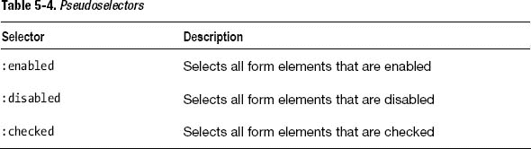

你可以组合和链接 CSS 选择器。例如，如果您想要选择所有被禁用的文本表单字段，您可以使用下面的 CSS。

`input[type="text"]:disabled {
   opacity: 0.5;
}`

##### 替代 JavaScript 的有用选择器

使用 JavaScript 选择另一个元素的最后一个子元素，并对其应用一个类来移除浮动元素的边距或填充，这是很常见的。如果您有一个多行的三列布局，您也可以使用 JavaScript 选择元素中的每三个子元素，并对其应用类。有了 CSS3，您不再需要这样做。

您可以使用`:last-child`伪类选择元素的最后一个子元素。例如，如果您想选择一个`ul`中的最后一个`li`，您可以使用下面的 CSS。

`ul li:last-child {
   margin-right: 0px;
}`

您也可以做同样的事情来选择任何元素的第 n 个子元素。使用`:nth-child`、`:nth-last-child`、`:nth-of-type`、`:nth-last-of-type`可以根据下级指标和下级类型及指标进行选择，如[表 5-5](#tab_5_5) 所示。

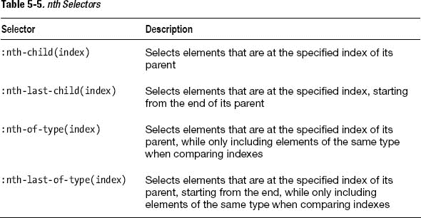

例如，如果您想选择一个`ul`中的每三个`li`并使文本变成灰色，您可以使用下面的 CSS 样式。

`ul li:nth-child(3) {
   color: #CCCCCC;
}`

正如您所看到的，有许多新的 CSS 选择器可以使您的移动 web 应用的样式更加简单。还有更高级的选择器可供选择。

#### 渐变

CSS3 渐变允许您向元素添加背景渐变，而无需使用重复的图像。这可以节省带宽，并允许您根据屏幕大小和方向创建可缩放的渐变背景。目前，CSS3 渐变是特定于供应商的。每个供应商似乎都有自己的方式来产生 CSS3 渐变。这一节将重点介绍 WebKit 的实现。

有两种类型的渐变你可以在 CSS3 中使用:线性和径向。线性渐变将从屏幕的一侧流向另一侧，径向渐变将从中心点向外发散，如图[图 5-8](#fig_5_8) 所示。

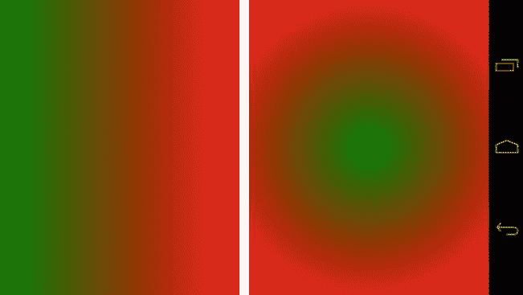

**图 5-8。** *线性(左)和径向(右)渐变*

##### 线性渐变

线性渐变具有以下语法，必须使用`background`属性作为背景应用。

`.box {
   background: -webkit-linear-gradient(start, start-color, end-color);
}`

您可以将起始位置指定为单个位置(左、上、右、下)或这些位置的组合。例如，要从左下角开始线性渐变，可以使用下面的代码。

`.box {
   background: -webkit-linear-gradient(bottom left, green, red);
}`

[图 5-9](#fig_5_9) 显示了这个代码片段的结果。

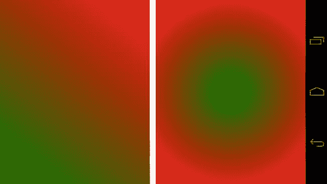

**图 5-9。** *从左下角开始的线性渐变*

您也可以用度数来指定渐变的起点。例如，将起点设置为`45deg`将与将起点设置为`bottom left`具有相同的结果。

`.box {
   background: -webkit-linear-gradient(45deg, green, red);
}`

除了标准的双色渐变，您还可以在渐变背景中使用多种颜色。您只需在位置后指定更多颜色。例如，下面的代码将使用线性渐变创建一面爱尔兰国旗，如图 5-10 所示。

`.box {
   background: -webkit-linear-gradient(left, green, white, orange);
}` 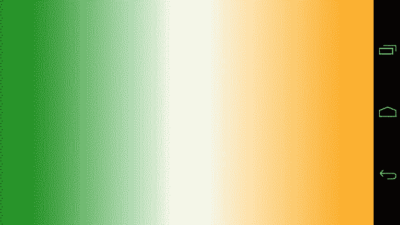

**图 5-10。** *使用 CSS3 渐变创建爱尔兰国旗*

CSS3 渐变也支持色标。色标允许您指定渐变在渐变线上的停止位置。例如，你可以在 CSS3 中创建一个真正的爱尔兰国旗，没有任何渐变，使用停止。为了做到这一点，您应该指定绿色将在元素的 33%(三分之一)处停止，然后白色将在 33%处开始并在 33%处停止。这将在绿色和白色之间创建一条直接的颜色线，而不是渐变。从这里开始，您将使用另一种白色，并指定在屏幕的 66%停止；最后是橙色，它将在 66%处停止，形成另一条颜色线。

代码如下所示，你可以在[图 5-11](#fig_5_11) 中看到结果。

`.box {
   background: -webkit-linear-gradient(left, green 33.3%, white 33.3%, white
66.6%, orange 66.6%);
}` 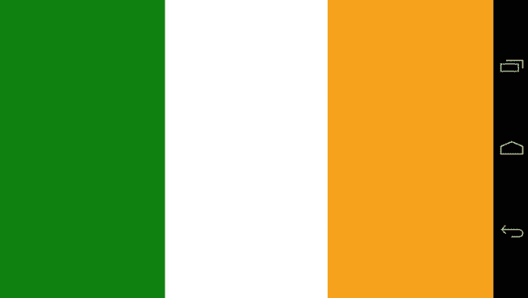

**图 5-11。** *使用 CSS3 渐变颜色创建爱尔兰国旗*

##### 径向梯度

径向渐变比线性渐变稍微复杂一些。您可以指定渐变的起始位置及其形状。径向渐变具有以下语法。

`.box {
   background: -webkit-radial-gradient(center, [circle|elipse]
   [closest-side|closest-corner|farthest-side|farthest-corner|contain|cover],
   start-color, stop-color);
}`

您可以以像素为单位指定中心位置，或者指定左侧和顶部位置的百分比。第二个参数接受 shape 关键字，它可以是圆形或椭圆形。第二个参数也接受一个 size 关键字，它们是`closest-side`、`closest-corner`、`farthest-side`、`farthest-corner`、`contain`和`cover`。最后，渐变还接受十六进制、关键字、RGB 或 RGBA 颜色作为开始和结束颜色。

例如，你可以使用以下代码用 CSS3 制作一面日本国旗，其结果可以在图 5-12 中看到。

`.box {
   background: -webkit-radial-gradient(center, circle contain, red, white);
}` 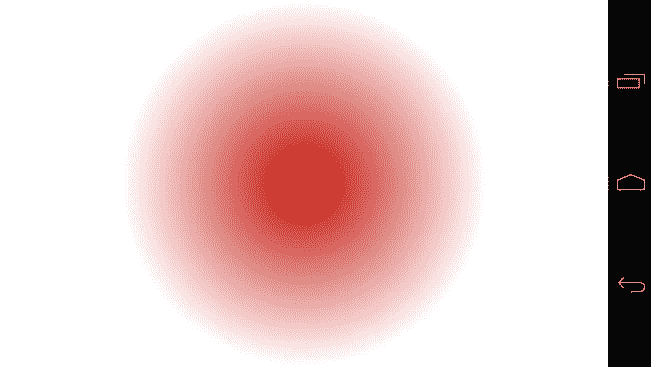

**图 5-12。** *带有放射状渐变的日本国旗*

您可以使用与线性渐变示例中相同的颜色停止技术来删除径向渐变上的渐变，并创建一个完整的圆。您可以使用以下代码来实现这一点，图 5-13 显示了结果。

`.box {
   background: -webkit-radial-gradient(center, circle contain, #C00C00 70%,
white 70%);
}` 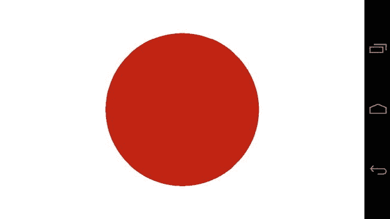

**图 5-13。** *移除径向渐变的日本国旗*

#### 边框

有了 CSS3，你现在可以应用新的边框样式，比如`border-radius`和`box-shadow`。

##### 边界半径

属性允许你在元素上创建圆角。在具备这种能力之前，为了制作具有圆角的灵活元素，您可以使用几个图像来模拟圆角，或者使用 JavaScript 助手，如 Curvy Corners，它将生成大量的`div`元素，并将它们定位以模拟圆角。

`border-radius`允许你使用 CSS3 生成圆角，无需任何图像或 JavaScript 的额外帮助。它现在是 CSS3 规范的一部分，使用下面的 CSS 可以创建一个圆角边框。

`.box {
   border-radius: 10px;
}`

这将创建一个半径为 10 像素的边界。你也可以使用下面的语法指定你的元素的每个角的半径，其结果你可以在图 5-14 中看到。

`.box {
   border: 1px solid #000000;
   border-top-left-radius: 5px;
   border-top-right-radius: 10px;
   border-bottom-left-radius: 15px;
   border-bottom-right-radius: 20px;
   width: 100px;
   height: 100px;
}
 ` 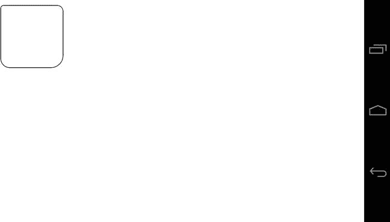

**图 5-14。**T3】边境半径

##### 箱形阴影

属性允许你在块级元素上创建阴影。当设计需要不同大小的投影时，这很方便。现在，您可以使用几行 CSS 代码，而不是使用几个图像来创建不同的阴影样式。

`box-shadow`属性具有以下格式。

`box-shadow: horizontal-offset vertical-offset blur spread color inset;`

`horizontal-offset`和`vertical-offset`属性以像素为单位指定阴影的位置，`blur`以像素为单位设置模糊量，`spread`以像素为单位设置阴影扩散，`color`设置阴影的颜色，`inset`设置阴影应该在元素的内部还是外部。`inset`属性的值为 inset 或 nothing。

例如，下面的 CSS 将产生类似于[图 5-15](#fig_5_15) 的结果。

`.box {
   width: 100px;
   height: 100px;
   border: 1px solid #000000;
   box-shadow: 10px 10px 20px 5px #000000;
}` 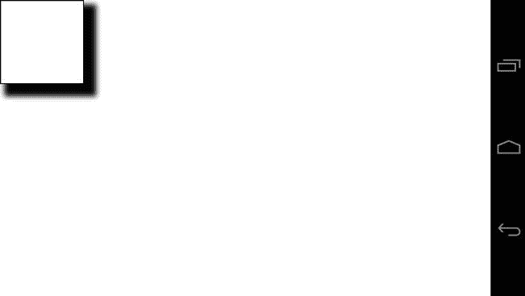

**图 5-15。** *框影*

`box-shadow`的值与`text-shadow`的作用相同，如果指定负偏移值，阴影将呈现在屏幕的左上方。

### CSS 媒体查询

CSS 媒体查询允许您根据特定条件获取 CSS 样式。这些条件可以包括表 5-3 中所示的条件。

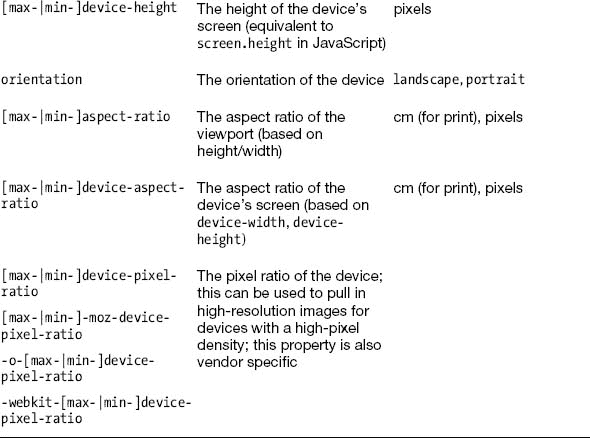

创建媒体查询背后的想法不一定是构建针对特定设备的媒体查询(例如，不专门针对平板电脑或手机)，而是迎合特定的屏幕尺寸并调整内容以适应它。

通过这样做，您可以确保您的 CSS 应用于可用空间，而不是目标设备。我们称之为*响应式网页设计*。

丹尼尔·文的网站(`[http://danielvane.com/](http://danielvane.com/)`)展示了一个响应式网页设计的很好的例子。通过提供所有视窗尺寸的样式、最大 480 像素的显示样式和最大 768 像素的显示样式，网站可以适当地响应任何手机或平板设备上的可用空间，如图 5-16 和图 5-17 所示。

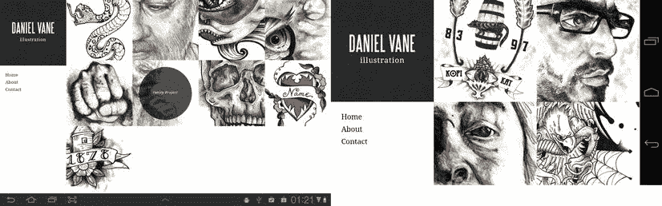

**图 5-16。** *Daniel Vane 的响应式网站(平板电脑在左边，手机在右边)*

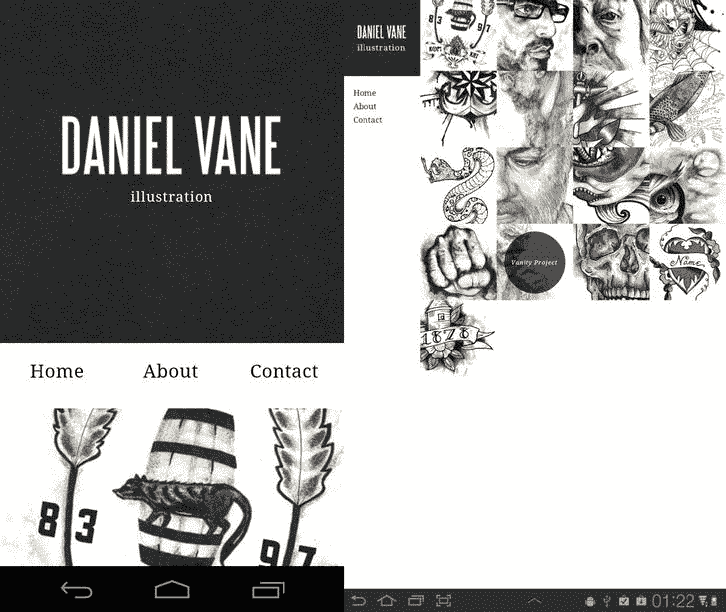

**图 5-17。** *Daniel Vane 的纵向响应网站(左边是平板电脑，右边是手机)*

安迪·克拉克和基思·克拉克设计了一套媒体查询，你可以用它来定位逐渐变大的显示器。这背后的想法是用颜色和排版为最小的屏幕尺寸设计样式，然后以特定的屏幕增量逐步增强网站，直到屏幕尺寸超过 992 像素。该组媒体查询还包括针对具有高像素密度的目标显示器的媒体查询。

`<!-- For all browsers -->
<link rel="stylesheet" href="css/style.css">
<link rel="stylesheet" media="print" href="css/print.css">
<!-- For progressively larger displays -->
<link rel="stylesheet" media="only screen and (min-width: 480px)"
href="css/480.css">
<link rel="stylesheet" media="only screen and (min-width: 600px)"
href="css/600.css">
<link rel="stylesheet" media="only screen and (min-width: 768px)"
href="css/768.css">
<link rel="stylesheet" media="only screen and (min-width: 992px)"
href="css/992.css">
<!-- For Retina displays -->
<link rel="stylesheet" media="only screen and (-webkit-min-device-pixel-ratio:
1.5), only screen and (-o-min-device-pixel-ratio: 3/2), only screen and (min-
device-pixel-ratio: 1.5)" href="css/2x.css">`

您应该检查他们的 GitHub 项目，查看在`[https://github.com/malarkey/320andup/](https://github.com/malarkey/320andup/)`找到的这组规则的更新。

### CSS 预编译器(SASS)

如果你过去有过使用 CSS 的经验，你就会知道它的一些局限性。例如，您不能定义可能影响 CSS 显示方式的变量，也不能重用代码元素。随着应用的增长，在 CSS 中生成和维护一个长的继承链也是一件痛苦的事情，如下面的代码所示，其中一个元素中有几个元素需要类似的样式。

`/**
 * A common way to style a block in CSS
 **/

.block {
   /** style your block here **/
}

.block h1.heading {
   /** style your header here **/
}

.block ul.alternating {
   /** style your block ul here **/
}

.block ul.alternating li {
   /** style your alternating li here **/
}` `.block ul.alternating li a {
   /** style your li link here **/
}

/** and the story continues **/`

语法上令人敬畏的样式表(SASS)通过使用嵌套、变量、混合和选择器继承来帮助摆脱这种麻烦。SASS 不是 CSS，需要编译器将其编译成 CSS。

从前面的 CSS 可以看出，很多代码是重复的。不幸的是，没有办法以一种浏览器可以识别的方式删除大块，但有一种方法可以做到这一点，即你编写的 CSS 更容易维护和移植。这在 SASS 中被称为*嵌套*。

在本节中，您将学习如何使用 SASS 来生成有组织的、可重用的、具体的 CSS。您将了解 SASS 如何改进您的开发工作流程并改变您对 CSS 的看法。

您还将了解 SASS 如何消除在整个样式表中使用类似 CSS 样式的大量重复工作，并为面向对象的 CSS 铺平道路，这是一种思考 CSS 和 HTML 之间关系的方式，它将每个设计元素视为其自己独立的设计对象。

#### 筑巢

嵌套允许你嵌套 CSS 样式。例如，前面的嵌套 SASS 代码如下所示。

`/**
 * The SASS way to style a block in CSS
 **/

.block {
   /** style your block here **/

   h1.heading {
      /** style your header here **/
   }

   ul.alternating {
      /** style your block ul here **/` `      li {
         /** style your alternating li here **/

         a {
            /** style your li link here **/
         }
      }
   }
}

/** and the story continues **/`

这段代码更容易维护。如果您要更改块的类名，只需在嵌套样式中更改一次类名。如果您需要添加更多的元素，您只需要在适当的位置添加另一个您想要样式化的类或元素。例如，如果您想在标题中设置链接的样式，您可以使用首选的 SCSS 格式执行以下操作。

`.block {
   /** style your block here **/

   h1.heading {
      /** style your header here **/
      a {
         /** style your heading link here **/
      }
   }

   ul.alternating {
      /** style your block ul here **/

      li {
         /** style your alternating li here **/

         a {
            /** style your li link here **/
         }
      }
   }
}`

#### 编译

前面的代码需要编译成 CSS，以便网络浏览器能够理解。不要将 SASS 文件直接链接到 HTML 文档中；相反，您可以链接生成的 CSS 文件。您可以使用内置工具直接从 Aptana Studio 编译 SASS 文件。

要在 Aptana Studio 中编译 SASS 文件，在项目中的任意位置创建一个名为`mobile.scss`的新文件(之后可以删除它)并添加以下代码。

`.test {
   background: #000000;

   .test2 {
      background: #FFFFFF;
   }
}`

点击命令 SASS 编译 Sass。这将在 SCSS 文件所在的位置生成一个新的 CSS 文件。您需要刷新应用浏览器才能看到新文件。编译 SASS 的捷径是 cmd+Shift+r(Windows 和 Linux 上的 CTRL + Shift + r)。当出现图 5-18 中[所示的对话框时，按 1。](#fig_5_18)

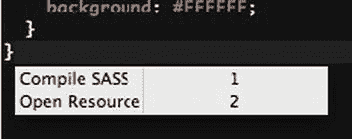

**图 5-18。** *使用 cmd + shift + r 命令编译 SASS】*

新的 CSS 文件出现后，打开它。您应该会看到下面的代码。

`.test {
   background: #000000; }
.test .test2 {
   background: #FFFFFF; }`

#### 偏音

一个大的 SASS 文件可能会变得很难维护，并且需要很长的滚动时间！在 Aptana Studio 中，可以使用代码折叠来显示和隐藏 SASS 样式，以便于浏览，如图[图 5-10](#fig_5_10) 所示。

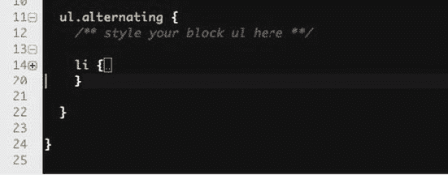

**图 5-19。** *代码折叠在阿普塔纳与 SCSS 的文件中*

虽然这很方便，但 SASS 也支持使用常规 CSS 中相同的`@import`语法从外部 SASS 文件导入部分样式表。SASS 实现和常规样式表中的实现之间的区别在于，SASS 将在编译时拉入文件，而不是使用 HTTP 请求将所有文件一个接一个地加载到常规 CSS 文件中。这为在编译时导入特定于对象或节的分部提供了空间。下面的代码显示了一个示例。

`/** mobile.scss **/

@import "partials/tablet";
@import "partials/phone";

/** partials/_tablet.scss **/

.test-tablet {
   background: url(’../themes/mytheme/common/logo.png’) no-repeat top left
#FFFFFF;
}

/** partials/_phone.scss **/
.test-phone {
   background: url(’../themes/mytheme/common/logo.png’) no-repeat top left
#FFFFFF;
}`

编译完成后，CSS 将如下所示。

`.test-tablet {
   background: url("../themes/mytheme/common/logo.png") no-repeat top left
white; }

.test-phone {
   background: url("../themes/mytheme/common/logo.png") no-repeat top left
white; }`

从这个例子中可以看出，每个部分的文件名都应该以 _(下划线)为前缀，导入中的引用应该包含相对文件夹和部分名称，而不包含 _ 前缀或 SCSS 文件名。您可能会注意到，SASS 还会将编译后的 CSS 中的`#FFFFF`转换为`white`。

#### 变量和插值

您最终必然会产生基于颜色/主题的样式表(例如，同一个样式表可能引用相同的图像，但是来自不同的图像文件夹，或者具有不同的颜色主题)。

传统上，您会使用 PHP、Python 或。NET 动态生成这些样式表。SASS 通过使用变量消除了这种需要。

SASS 中变量的行为与其他语言中的行为非常相似。它们可以是任何类型(字符串、CSS 属性值、整数、像素、em、%)并且可以添加到 SCSS 样式中以对样式表进行全局更改。

例如，以 partials 部分中的示例代码为例，我们可以对其进行修改，以便您可以从主(移动)样式表中更改主题文件夹和颜色。

`/** mobile.scss **/

$theme: "bentley";
$color: #000000;

@import "partials/tablet";
@import "partials/phone";

/** partials/_tablet.scss **/

.test-tablet {
   background: url(’../themes/**#{$theme}**/common/logo.png’) no-repeat top left
**$color**;
}

/** partials/_phone.scss **/

.test-phone {
   background: url(’../themes/**#{$theme}**/common/logo.png’) no-repeat top left
**$color**;
}`

正如你在`mobile.scss`中看到的，你用一串`"bentley"`定义了一个主题变量。然后在下面的线上定义一个黑色。`@import`则用来导入分音。在每个分部中，您会注意到背景声明被修改如下。

`background: url(’../themes/**#{$theme}**/common/logo.png’) no-repeat top left
**$color**;`

有两种方法可以将变量添加到 SASS 文件中。要将变量添加为 CSS 字符串的一部分，如背景图像路径，请使用以下语法。

`#{$myvariable}`

这就是所谓的*插值*，你也可以用它来改变一个 CSS 属性而不是它的值。例如，`border-#{$position}-radius:`其中`position`是由变量定义的位置。

第二种方法是简单地使用`$myvariable`重复变量名。这是您在定义颜色、宽度或高度等 CSS 属性值时应该使用的内容。

#### 混合蛋白

SASS 更受欢迎的特性之一是 mixins。Mixins 允许您在一个地方定义一段代码，并在 SASS 样式表的任何地方使用它。例如，您可能有一个跨浏览器渐变的大 CSS 声明，如下面的代码所示。

`.myelement {
   background: rgb(206,220,231);
   background: -moz-linear-gradient(-45deg, rgba(206,220,231,1) 0%,
      rgba(89,106,114,1) 100%);
   background: -webkit-gradient(linear, left top, right bottom,
      color-stop(0%,rgba(206,220,231,1)),
      color-stop(100%,rgba(89,106,114,1)));
   background: -o-linear-gradient(-45deg, rgba(206,220,231,1) 0%,
      rgba(89,106,114,1) 100%);
   background: -ms-linear-gradient(-45deg, rgba(206,220,231,1) 0%,
      rgba(89,106,114,1) 100%);
   background: linear-gradient(-45deg, rgba(206,220,231,1) 0%,
      rgba(89,106,114,1) 100%);
}`

代码太多了。如果你想用在别的地方呢？最有效的方法是简单地将更多的类添加到您想要使用它的定义中。

`.myelement, .mysecondelement {
   background: rgb(206,220,231);
   background: -moz-linear-gradient(-45deg,
      rgba(206,220,231,1) 0%, rgba(89,106,114,1) 100%);
   background: -webkit-gradient(linear, left top, right bottom,
      color-stop(0%,rgba(206,220,231,1)),
      color-stop(100%,rgba(89,106,114,1)));
   background: -o-linear-gradient(-45deg,
      rgba(206,220,231,1) 0%,rgba(89,106,114,1) 100%);
   background: -ms-linear-gradient(-45deg,
      rgba(206,220,231,1) 0%,rgba(89,106,114,1) 100%);
   background: linear-gradient(-45deg,
      rgba(206,220,231,1) 0%,rgba(89,106,114,1) 100%);
}`

您可以使用 mixin 来定义渐变，并使用以下代码将其包含在您的样式中。

`@mixin specialgradient {
   background: rgb(206,220,231);
   background: -moz-linear-gradient(-45deg,
      rgba(206,220,231,1) 0%, rgba(89,106,114,1) 100%);
   background: -webkit-gradient(linear, left top, right bottom,
      color-stop(0%,rgba(206,220,231,1)), color-stop(100%, rgba(89,106,114,1)));
   background: -o-linear-gradient(-45deg, rgba(206,220,231,1) 0%,
      rgba(89,106,114,1) 100%);
   background: -ms-linear-gradient(-45deg, rgba(206,220,231,1) 0%,
      rgba(89,106,114,1) 100%);
   background: linear-gradient(-45deg, rgba(206,220,231,1) 0%,
      rgba(89,106,114,1) 100%);
}

#my-first-element {
   @include specialgradient;
}

#my-second-element {
   @include specialgradient;
}`

然而，这将是一个坏主意，因为产生的 CSS 将在样式表中包含两次渐变，这增加了膨胀，并不是我们想要的。选择器继承应该是这方面的首选。当您有一大块 CSS 将在其他 CSS 规则中重复时，或者更好的是，当您有在整个样式表中重复的 CSS 时，例如特定于供应商的样式(例如，渐变和边框图像)需要为每个浏览器多次定义相同的 CSS 时，Mixins 就很方便了。

为了实现这一点，您可以将参数传递到 mixins 中。现在，您可以使用以下代码在一行中的任意位置生成 CSS 渐变。

`@mixin gradient($start, $stop, $degrees) {
   background: rgba($start, 1);
   background: -moz-linear-gradient($degrees, $start 0%, $stop 100%);
   background: -webkit-gradient(linear, left top, right bottom,
      color-stop(0%, $start), color-stop(100%, $stop));
   background: -o-linear-gradient($degrees, $start 0%,$stop 100%);
   background: -ms-linear-gradient($degrees, $start 0% $stop 100%);
   background: linear-gradient($degrees, $start 0%, $stop 100%);
}

#my-first-element {
   @include gradient(rgba(206,220,231,0.5), rgba(89,106,114,1), -45deg);
}

#my-second-element {
   @include gradient(rgba(206,220,231,1), rgba(89,106,114,1), -45deg);
}`

如您所见，首先定义一个名为`gradient`的 mixin，它有三个参数:`$start`、`$stop`和`$degrees`。在这个 mixin 中，首先为不支持渐变的设备定义标准背景。使用`rgba` SASS 函数定义背景颜色的值。在这里，您显式地将背景色设置为没有 alpha 透明度的起始色。使用下面几行，您只需将开始颜色、结束颜色和度数传递给适当的供应商渐变声明。现在，您可以使用`@include gradient(start-color, finish-color, degrees);`在样式表的任何地方使用参数来绘制渐变。生成的 CSS 如下所示。

`#my-first-element {
   background: #cedce7;
   background: -moz-linear-gradient(-45deg, rgba(206, 220, 231, 0.5) 0%, #596a72
100%);
   background: -webkit-gradient(linear, left top, right bottom,
      color-stop(0%, rgba(206, 220, 231, 0.5)), color-stop(100%, #596a72));
   background: -o-linear-gradient(-45deg, rgba(206, 220, 231, 0.5) 0%, #596a72
100%);
   background: -ms-linear-gradient(-45deg, rgba(206, 220, 231, 0.5) 0% #596a72
100%);
   background: linear-gradient(-45deg, rgba(206, 220, 231, 0.5) 0%, #596a72
100%); }

#my-second-element {
   background: #cedce7;
   background: -moz-linear-gradient(-45deg, #cedce7 0%, #596a72 100%);` `   background: -webkit-gradient(linear, left top, right bottom,
      color-stop(0%, #cedce7), color-stop(100%, #596a72));
   background: -o-linear-gradient(-45deg, #cedce7 0%, #596a72 100%);
   background: -ms-linear-gradient(-45deg, #cedce7 0% #596a72 100%);
   background: linear-gradient(-45deg, #cedce7 0%, #596a72 100%); }`

注意`#my-first-element`中的 CSS 在第一个描述符中将背景色作为常规的十六进制颜色，其余的是 RGBA 颜色。此外，即使在 mixin 调用中使用 RGBA 设置了停止颜色，它也是一种十六进制颜色，因为不透明度设置为 1，而开始颜色设置为 0.5。SASS 将选择最有效的方式输出您的颜色。

#### 选择器继承

当然，在整个 SASS 文件中使用 mixins 是很诱人的，即使 CSS 可能完全相同。选择器继承允许您在放置于 SASS 文件中的规则中使用相同的 CSS 规则。例如，在 CSS 中可以使用下面的代码。

`.my-element-one, .my-element-two, .my-element-three {
   /** insert common CSS style here **/
}`

虽然效率很高，但是很容易忘记哪些 CSS 规则与一组规则相关联。您可能需要在文档中搜寻，以找到那组规则以及与之相关联的元素、类和 id。更令人困惑的是，样式可能位于单独的 CSS 文件中。

选择器继承有助于克服这个问题。选择器继承允许您生成与刚才所示相同的代码，但是以一种对开发人员更加友好的方式。

使用 mixins 一节中的例子，您可以定义一种类型的渐变，并在 SASS 文件中的任何地方根据相关规则使用它，而不会在 CSS 文件中多次生成结果渐变。

`.block {
   @include gradient(rgba(206,220,231,0.5), rgba(89,106,114,1), -45deg);
}
.sidebar-block {
   border-radius: 10px;
   @extend .block;
}`

如您所见，`.sidebar-block`与`.block`规则相似，除了圆形的边框。生成的 CSS 如下所示。

`.block, .sidebar-block {
   background: #cedce7;
   background: -moz-linear-gradient(-45deg, rgba(206, 220, 231, 0.5) 0%, #596a72
100%);
   background: -webkit-gradient(linear, left top, right bottom,
      color-stop(0%, rgba(206, 220, 231, 0.5)), color-stop(100%, #596a72));
   background: -o-linear-gradient(-45deg, rgba(206, 220, 231, 0.5) 0%, #596a72
100%);
   background: -ms-linear-gradient(-45deg, rgba(206, 220, 231, 0.5) 0% #596a72
100%);
   background: linear-gradient(-45deg, rgba(206, 220, 231, 0.5) 0%, #596a72
100%); }

.sidebar-block {
   border-radius: 10px; }`

您可以看到 SASS 已经将`border-radius`属性分离出来，并将其放在自己的`.sidebar-block`CSS 规则中。

您还可以将链接的类添加到 block 元素中，它将为`.sidebar-block`和`.block`规则生成边界案例。

`/**
 * mobile.scss
 */

.block {
   @include gradient(rgba(206,220,231,0.5), rgba(89,106,114,1), -45deg);
}

.block.wide {
   width: 100px;
}

.sidebar-block {
   border-radius: 10px;
   @extend .block;
}

/**
 * mobile.css
 */

.block, .sidebar-block {
   background: #cedce7;
   background: -moz-linear-gradient(-45deg, rgba(206, 220, 231, 0.5) 0%, #596a72
100%);
   background: -webkit-gradient(linear, left top, right bottom,
      color-stop(0%, rgba(206, 220, 231, 0.5)), color-stop(100%, #596a72));` `   background: -o-linear-gradient(-45deg, rgba(206, 220, 231, 0.5) 0%, #596a72
100%);
   background: -ms-linear-gradient(-45deg, rgba(206, 220, 231, 0.5) 0% #596a72
100%);
   background: linear-gradient(-45deg, rgba(206, 220, 231, 0.5) 0%, #596a72
100%); }

.block.wide, .wide.sidebar-block {
   width: 100px; }

.sidebar-block {
   border-radius: 10px; }`

### 总结

从这一章开始，你应该对 CSS3 的新特性有了很好的理解。您应该准备好一个小工具箱，从中可以进行扩展，包括如何执行基本动画，如何为动画“补间”和创建关键帧，以及如何将它们应用到元素。您还应该了解，大多数浏览器都支持 CSS3 的一些特性，但它们仍处于草案阶段，这就是为什么有时您需要多次编写相同的代码。

您还应该对 SASS 有深入的了解，以及它如何通过大幅减少您必须编写的代码量来提高您的生产率。