# 六、移动 JavaScript

自 1999 年第一款消费者 WAP 手机 Nokia 7110 问世以来，移动 JavaScript 已经走过了漫长的道路。从完全不支持到完全支持，仅仅 10 年时间，JavaScript 已经让我们的移动网络体验变得更加互动、有趣和令人满意。

今天的问题是，有了这么多的 JavaScript 支持，我们如何利用它，使它不引人注目，并为我们的用户提供良好和流畅的体验？

本章将指导你如何将 JavaScript 集成到你的项目中，使用不同类型的库来使你更容易的开发出可以在任何平台上运行的移动网络应用。您还将了解新的 HTML5 JavaScript APIs(如地理定位)、存储，以及如何利用它使用 HTML5 Canvas 元素为 Android 绘制基于矢量的图形。

### 面向对象的 JavaScript

JavaScript 是一种处理移动网站中用户交互的极好的语言。就像你为桌面 web 编写 JavaScript 一样，你也可以利用同样的设计模式和方法为移动设备编写。您可以用两种方式之一编写 JavaScript。其中一个方法是程序性的，如下面的代码所示。

`function sayHelloWorld(foo){
   alert(foo);
}`

第二种方法是面向对象的，如下所示。

`var World = function(){
   this.say = function say(hello){
      alert(hello);
   }
}

var myworld = new World();
myworld.say('Hello');`

正如您所看到的，您可能需要为面向对象的方法编写更多的代码，但是有几个好处。

*   面向对象的方法允许扩展您的代码。
*   面向对象的方法可以更有组织性。
*   面向对象的方法允许封装，这意味着对象中的变量或属性可以是公共的或私有的。
*   面向对象的方法允许您将对象传递给其他对象。这通常被称为*对象依赖性*。

**注意:**在基于类的语言中，比如 Java、Objective-C 和 PHP，类在被使用`new ClassName`实例化之前是一个对象。一个对象是一个类被实例化后的实例。JavaScript 有创建对象的基本方法，不幸的是，它不完全支持封装、继承、抽象和开箱即用的接口。您可能需要创建自己的方法和实践来实现这一点。JavaScript 也是一种基于对象的语言，所以尽管感觉像是在创建类，但实际上是在代码中为对象创建结构。

前面的两个代码片段具有相同的结果；然而，面向对象的方法将`World`视为一个对象，并将该对象中的函数`this.say`视为可以在其上执行的方法。

面向对象的方法还允许您创建一个对象的多个实例。例如，你可以创建几个`World`实例，通过修改前面的代码，你可以开始创建只存在于每个`World object`范围内的实例变量，比如它的名字。

`var World = function(_name){

   var name = _name;

   this.greet = function(guest){
      alert('Hello ' + guest + ' my name is ' + name);
   }
}

var venus = new World('Venus');
var mars = new World('Mars');

venus.greet('Antony');
venus.greet('Dan');`

从前面的例子中，您可以看到，要在 JavaScript 中创建一个对象，就像创建一个函数一样简单。使用函数的参数，您创建了所谓的*构造函数*。构造函数是一种在实例化时向对象传递参数的方法。这些参数通常用于将变量赋给对象本身的属性。

在普通的面向对象中，属性可以声明为 public 或 private。在 JavaScript 中，属性没有这样的简化。因此，属性可以是实例变量(私有)或公共属性(公共)。在这个实例中，`name`属性是一个实例变量，这意味着您不能使用例如`venus.name`从对象外部访问它。这通常被称为*封装*。对象的属性是一个变量，既可以在对象范围内使用`this.propertyname`访问，也可以在对象外部使用`object.propertyname`访问。例如，如果您试图从对象外部访问`name`实例变量，您将得到`undefined`作为输出。

您还可以创建对象方法，即可以从对象内部或外部使用`this`或从外部分配给实例化对象的变量来访问的函数。使用前面的例子，`this.greet`是一个公共对象方法，可以在对象外部访问。

从这里，您可以看到对象允许更易维护的代码。对象的属性存在于全局名称空间之外，因此可以避免变量名和特定对象的其他细节发生冲突。除此之外，您还可以为应用对象创建自己的名称空间。这有助于避免其他 JavaScript 库覆盖它们。下面的例子展示了为对象创建应用级名称空间的最基本的方法。

`var app = app || {};
app.world = function(_name){

   var name = _name;

   this.greet = function(guest){
      alert('Hello ' + guest + ' my name is ' + name);
   }
}`

这允许您在单独的文件中创建属于您的应用的类。前面的代码示例中的第一行声明了全局名称空间中的变量`app`，如果它已经存在，则将`app`全局变量赋给它。如果它不存在，它会为您创建一个空对象，以便开始填充您的对象。如果您在开发过程中以这样一种方式组织您的对象，将它们保存在单独的文件中，然后在生产中合并，这将非常方便。您甚至可以更进一步，根据功能命名您的对象。

这些是现代移动浏览器支持的面向对象 JavaScript 的基础。

您以这种方式编码(而不是，例如，创建 jQuery 插件),因为它将您的应用代码与特定于供应商的代码分开，并减少了对第三方代码的依赖。您可以更进一步，遵循模型视图控制器(MVC)模式，将您的用户交互与您的域逻辑(真实世界的对象)和呈现给用户的结果视图分离开来。

与设计模式和面向对象一样，JavaScript 也是一种事件驱动的语言。这意味着在运行时，在应用的一个部分触发的事件可以在应用的完全不同的部分触发一段代码。

最简单的形式是，事件可以通过用户交互来触发。在移动领域，这通常被视为*触摸事件*，用户使用手指通过浏览器与你的应用进行交互。浏览器注册该事件，然后将该事件及其信息(如事件源自的元素)传递给应用中的任何订阅者。对于桌面环境，这些被称为*鼠标事件*。

### 处理触摸事件

JavaScript 在处理桌面事件方面毫不逊色，在移动领域也是如此。事件可以由用户级事件(如触摸和拖动)或设备级事件(如方向变化或设备位置变化)组成。最基本的事件是用户级事件。可以在任何 DOM 元素上跟踪它们。对于移动设备，有四种主要的触摸事件:

*   `touchstart`
*   `touchend`
*   `touchmove`
*   `touchcancel`

当用户触摸屏幕上的元素时，`touchstart`事件将被触发。当用户触摸屏幕上的某个元素后，将手指从该元素上移开时，将触发`touchend`事件。`touchmove`事件将跟踪用户的动作，并随着每个动作触发事件。当用户通过移动到目标边界之外并释放屏幕来取消触摸事件时，将触发`touchcancel`事件。这一事件似乎无法预测。

为了响应事件，您必须使用`element.addEventListener(event, callbackfunction);`为它们创建事件监听器。该方法采用事件名称(`touchstart`、`touchend`等)。)和回调函数。有时，您可能希望阻止触发事件的默认操作。例如，如果您向链接添加一个事件监听器，您可能不希望该链接在被点击时打开一个新页面。为此，您必须向名为`e`的回调函数添加一个参数，并在回调函数结束时调用`e.preventDefault()`。这也将防止元素滚动和干扰`touchmove`事件，如下面的代码片段所示。

`
x: 0 y: 0 - not touching

`

这段代码将用黑色填充屏幕，用白色文本包含用户手指的当前坐标以及用户是否正在触摸屏幕。您可以通过点击传递给`touchmove`事件监听器的事件的触摸列表来获取当前坐标。你可以从列表中获取第一次触摸，并使用`clientX`和`clientY`来检索 X 和 Y 坐标，就像这样:

`e.touches[0].clientX, e.touches[0].clientY`

如您所见，您可以通过调用`e.preventDefault()`来防止文档滚动。

当用户触摸并将手指抬离屏幕时，将调用 touchstart 和 touch end 的其他两个事件侦听器。

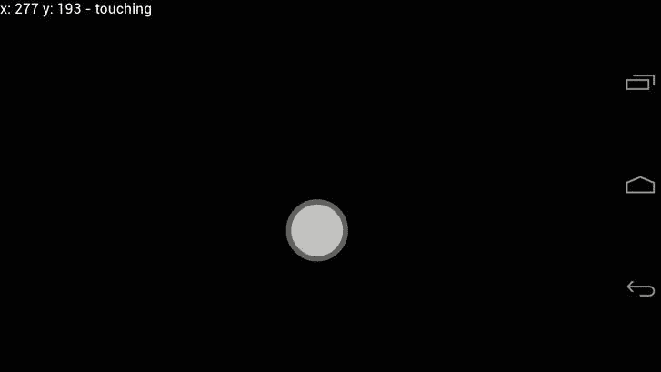

**图 7-1。** *检测触摸和移动*

### 获取用户的位置

当您知道用户需要将他们的当前位置输入到应用中时，获取用户的位置会很方便。这有助于查找和搜索他们周围的事物，如事件、地点和其他人。定位 API 非常简单，利用了移动设备内置的 GPS 芯片。

要获得用户的位置，可以使用下面的代码。它是异步的和非阻塞的，所以当设备搜索用户位置时，您可以继续在前台或后台处理 JavaScript 事件。

`var showCurrentPosition = function(position){
   alert('Lat: ' + position.coords.longitude + ' Lon: ' +
position.coords.latitude);
}`

这是在移动设备具有用户的位置之后将被调用的功能。传递回回调函数的参数是一个扩展了`Coordinates`接口的对象，其属性如[表 7-1](#tab_7_1) 所示。

T2】

要检索设备的坐标，只需在设备上查询用户的位置，如下所示:

`navigator.geolocation.getCurrentPosition(showCurrentPosition);`

如果用户尚未授权您的应用访问他们的位置，他们将首先被要求批准位置请求。图 7-2 显示了这个对话框的样子。

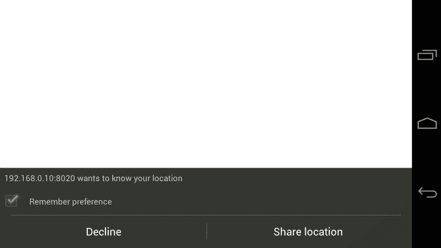

**图 7-2。** *位置请求*

这就出现了一个问题，因为你应该预料到一些用户可能不希望共享他们当前的位置，并可能点击拒绝按钮；或者可能只是检索用户当前位置的问题。这可以用一个错误事件处理程序来处理，它是`getCurrentPosition()`方法的第二个参数。为了处理检索用户当前位置的错误，您必须创建一个错误处理程序，它将接受 error 对象。

`var handleLocationError = function(error){
   alert(error.message);
}

navigator.geolocation.getCurrentPosition(showCurrentPosition,
handleLocationError);`

错误对象是`PositionError`接口的一部分，其属性如[表 7-2](#tab_7_2) 所示。

T2】

您应该使用`PositionError`常量`PERMISSION_DENIED`、`POSITION_UNAVAILABLE`和`TIMEOUT`来适当地处理错误，而不是依赖错误消息或将错误代码与硬编码的整数进行比较。下一个代码示例展示了如何使用`handleLocationError`函数和`switch`语句来处理错误。

`var handleLocationError = function(error){
   switch(error.code){
      case error.PERMISSION_DENIED:
         /**
          * Handle permission denied response here,
          * potentially display a dialog to the user
          */
         var confirmed = confirm("We really need your location!");
         if(confirmed){
            navigator.getCurrentPosition(showCurrentPosition,
handleLocationError);
         }
         break;
      case error.POSITON_UNAVAILABLE:
         /**
          * Handle position unavailable response here,
          * potentially display a dialog to the user and
          * ask them to enter their location manually
          */
         var tryagain = confirm("Sorry, something serious is wrong, would
            you like to try again?");
         if(tryagain){` `            navigator.getCurrentPosition(showCurrentPosition,
handleLocationError);
         }
         break;
      case error.TIMEOUT:
         /**
          * Appologizies to the user for the delay and attempts
          * to retrieve their location again
          */
         navigator.geolocation.getCurrentPosition(showCurrentPosition,
            handleLocationError);
         break;
   }
}`

这些都是非常简单的错误处理程序，如果发生错误，可以对它们进行扩展，为用户提供更好的体验。

然后，您可以将坐标传递给地图服务，如谷歌地图，以显示用户的当前位置。下面的例子使用 Google Maps 静态 API 来生成用户当前位置的图像，并显示在移动设备上。

``
``

结果如图 7-3 中的[所示。当然，您也可以订阅用户当前位置的重大变化。您可以使用`navigator.geolocation.watchPosition`方法来完成这项工作。这将监听用户当前位置的重大变化，并在每次用户位置变化时调用回调函数。`watchPosition`方法与`getCurrentPosition`方法采用相同的参数。](#fig_7_3)

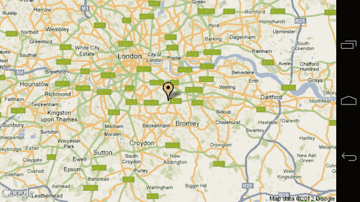

**图 7-3。** *显示用户在谷歌地图上的当前位置*

### 用画布画画

HTML5 Canvas 允许您使用 JavaScript 绘制基于矢量的形状。HTML5 Canvas 元素没有提供太多固有的功能，但是它为您开始绘制对象提供了一个基础。把它想象成你设备的白板。下一个练习将带您了解如何创建画布，如何开始使用 JavaScript 绘制基本形状，以及如何制作它们的动画。

首先，在这个名为`canvas`的章节文件夹中创建一个新文件夹。在`canvas`文件夹根目录下创建一个`js`文件夹，包含一个名为`canvas.js`的新 JavaScript 文件和一个`index.html`文件，内容如下。

`<!DOCTYPE html>
<html lang="en">
   <head>
      <meta charset="UTF-8" />
      <meta name="viewport" content="width=device-width; initial-scale=1.0;
         maximum-scale=1.0; user-scalable=0; target-densitydpi=device-dpi;"/>
      <title>Canvas</title>
      
   </head>
   <body>

      <canvas id="play" width="100" height="100"></canvas>
      

   </body>
</html>`

这将创建一个`id`为`play`的画布元素，宽 100 像素，高 100 像素。永远不要尝试使用 CSS 来调整 Canvas 元素的大小，因为它不会像预期的那样工作。这个 HTML 也将链接到`canvas.js`文件。

打开`canvas.js`文件，它将被用来控制你的画布。您将使用面向对象的 JavaScript 来创建和控制播放按钮。

在这个例子中，您将需要两个对象:一个`track`对象(它将模拟实际的音轨)和一个`playButton`对象(它将控制音轨进度的显示和音轨的播放/暂停)。`track`对象应负责以下内容:

*   记录轨道的总长度
*   保持曲目的当前状态(播放/暂停/停止)
*   如果曲目正在播放，则保留曲目的当前时间
*   播放、暂停和停止轨道

本例中的`playButton`对象将负责以下内容:

*   绘制播放按钮
*   显示播放进度
*   显示轨道回放状态
*   通过显示播放或停止符号来表示轨道的状态
*   通过移动播放头来表示音轨的播放进度

受 iTunes 播放控件的启发，如[图 7-4](#fig_7_4) 所示，你将创建类似的东西。

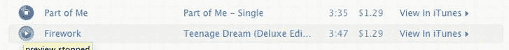

**图 7-4。** *iTunes 预览播放控件*

首先，在您的`canvas.js`文件中创建两个对象，如下面的代码片段所示:

`var app = app || {};

app.playButton = function(id, track){

}

app.track = function(length){

}`

如您所见，`playButton`的构造函数带有一个`id`，它将是画布元素的 ID，还有一个`track`，它将是`app.track`类的实例。`track`构造器简单地以秒为单位获取轨道的长度。

由于需要首先实例化`track`，您将从创建`track`类的代码开始。首先，在名为`this.state`的`track`类中创建一个新属性，如下所示:

`app.track = function(length){
**   this.state = {**
**      STOPPED: 0,**
**      PLAYING: 1,**
**      PAUSED: 2**
**   };**
}`

`state`属性包含可用于确定应用当前状态的变量。另一种方法是将当前状态存储为字符串(例如，播放、暂停或停止)。当您在应用中添加更多状态或更改状态名称时，这可能会有问题。通过这样做，改变应用的状态就像使用`state = this.state.STOPPED`一样简单。这也很有帮助，因为当你键入`this.state.`时，代码补全会向你显示可能的状态，这比你必须挖掘你的代码来找出可用的状态更好更有效。

接下来，在`track`类的范围内定义几个变量，如下面的代码片段所示:

`app.track = function(length){

   ...

**   var length = (length * 1000),**
**      currentTime = 0,**
**      interval,**
**      _self = this,**
**      state = this.state.STOPPED,**
**      updateInterval = 1000 / 30;**
}`

在 JavaScript 中，可以在一行中声明变量，用逗号分隔它们。这也适用于移动设备。

您的第一个变量`length`，通过乘以`1000`，将传递给该类的音轨长度从秒转换为毫秒。您还将`currentTime`设置为`0`，并声明一个名为`interval`的变量。`interval`变量负责保存对区间的引用，以重复调整轨道的定时。

这看起来很奇怪，但是你也声明了一个名为`_self`的变量，并将`this`赋给它。这创建了一个全局变量，这样事件监听器在对象范围之外调用的任何回调事件仍然能够访问父类，因为`this`将在回调事件或目标的范围内，而不是父类(在本例中是`track`)。

然后声明应用的当前状态，并将其默认状态设置为`this.state.STOPPED`。

最后，您创建一个名为`updateInterval`的新变量，它将用于设置时间每秒更新的次数。例如，如果您想每秒更新间隔 500 次，您可以将`updateInterval`设置为`updateInterval = 1000 / 500`。增加该时间将对性能产生影响，因为这会影响画布动画的帧速率。

您将需要更新`currentTime`。`setCurrentTime`是一个私有方法，允许您设置播放头的当前时间。它还将回调任何使用`_self.callbacks.didUpdateTime.call(_self, currentTime);`将其自身指定为该方法回调的函数或方法。`call`是一个允许你在另一个对象范围内调用一个函数的方法。这将允许回调函数在其代码中使用`this`，并且`this`将是对进行回调的对象的引用，而不是回调函数的父对象。`call`的第一个参数是您想要从中传递范围的对象。之后的参数是回调方法将接受的参数。

接下来，您必须创建名为`updateTime`的私有方法。这将更新音轨的当前播放时间。该方法还检查`currentTime`是否达到了总轨迹长度。如果有，那么它将停止跟踪。

`app.track = function(length){

   ...

**      var setCurrentTime = function(time){**
**         currentTime = time;**
**         _self.callbacks.didUpdateTime.call(_self, currentTime);**
**      };**

**      var updateTime = function(){**

**         if(currentTime < length){**
**            setCurrentTime(currentTime + updateInterval);**
**         } else {**
**            _self.stop();**
**         }**

**   };**
}`

你会注意到这里使用了`_self`。这不是一个全局 JavaScript 变量，而是您之前声明的`_self`变量。`updateTime`在跟踪类/对象的范围之外被调用，所以`_self`维护一个对它的引用。这被更好地称为*关闭*。

接下来，您将声明几个 getter 和 setter。创建它是为了能够访问对象范围之外的私有变量。当您不希望对象更改另一个对象的属性时，这很方便。例如，`currentTime`不应该在对象之外被操作，但是外部对象应该能够找出音轨的当前播放时间。使用不带 setter 的 getter 可以防止外部对象更改该值。

`app.track = function(length){

   ...

**   this.getCurrentTime = function(){**
**      return currentTime;**
**   };**

**   this.getLength = function(){**
**      return length;**
**   };**` `**   this.getState = function(){**
**      return state;**
**   };**
}`

本例中的 getters 将简单地返回私有变量；但是，您可以定义一个 getter，比如`getCurrentTimeInSeconds`，它将修改返回值，以便函数返回以秒为单位的回放时间。例如:

`this.getCurrentTimeInSeconds = function(){
   return (currentTime / 1000);
}`

接下来，您必须定义轨道的控件，例如播放、暂停和停止。

`app.track = function(length){

   ...

**   this.stop = function(){**
**      window.clearInterval(interval);**
**      state = _self.state.STOPPED;**
**      setCurrentTime(0);**
**      _self.callbacks.didStop.call(_self);**
**   };**

**   this.play = function(){**
**      if(state != _self.state.PLAYING){**
**         interval = window.setInterval(updateTime, updateInterval);**
**         state = _self.state.PLAYING;**
**         _self.callbacks.didStartPlaying.call(_self);**
**      }**
**   };**

**   this.pause = function(){**
**      window.clearInterval(interval);**
**      state = _self.state.PAUSED;**
**      _self.callbacks.didPause.call(_self);**
**   };**
}`

`this.stop`将停止跟踪，并使用`window.clearInterval(interval)`清除间隔计时器。`stop`方法还会使用`state = _self.state.STOPPED`将轨道的当前状态设置为`0`或`STOPPED`。该方法还将重置当前时间，并调用`didStop`回调方法。

`this.play`将通过检查当前状态来查看曲目是否正在播放。如果曲目没有播放，那么它将创建一个新的间隔计时器。`window.setInterval`采用两个参数:回调方法和以毫秒为单位的间隔时间。如果您希望分配一个从设置初始间隔的函数中获取参数的回调，您可以使用以下方法:

`var globalParam = 'foo';
window.setInterval(function(){
   callbackFunction.call(this, globalParam);
}, intervaltime);`

记住`globalParam`必须用`var`声明，这样它才能存在于闭包中。

最后，定义默认的回调函数。

`app.track = function(length){
   ...
**   this.callbacks = {**
**      didUpdateTime: function(time){},**
**      didStartPlaying: function(){},**
**      didPause: function(){},**
**      didStop: function(){}**
**   };**
};`

如您所见，这些都是空函数。这允许你调用回调函数，即使它们没有被赋值。有四个回调函数:`this.callbacks.didUpdateTime`、`this.callbacks.didStartPlaying`、`this.callbacks.didPause`和`this.callbacks.didStop`。

现在是时候开始创建播放按钮并深入画布了！在开始之前，了解 Canvas 的实际工作方式是很重要的。为了在画布上绘图，您需要获得它的*上下文*。如果你不熟悉什么是上下文，它就像一个隐藏的空间，你可以在那里画画。在您完成绘制后，上下文将呈现给用户。Canvas API 中目前只有一个上下文，所有的形状都绘制在它上面。在理想的情况下，您应该有几个上下文，在它们上面绘制单独的组件，并将每个上下文合并成一个上下文。目前，这是不可能的，将在本章中进一步解释。

画布上下文在一个基于坐标的系统上工作，从左上角开始，如图 7-5 所示。

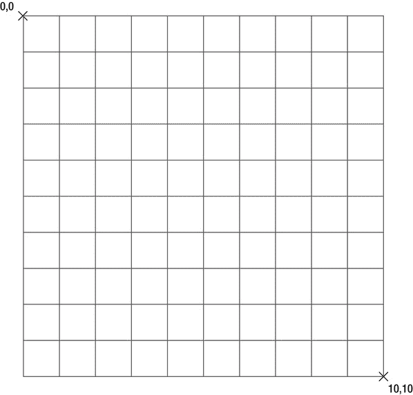

**图 7-5。** *画布网格*

首先，您需要定义几个全局变量。

`app.playButton = function(id, track){
**   var canvas = document.getElementById(id),**
**   context = canvas.getContext('2d'),**
**   track = track,**
**   _self = this;**
}`

如您所见，您通过使用`getElementById`获得了 Canvas 元素。然后通过使用`canvas.getContext('2d')`获得画布上下文，这将返回一个 2d 画布上下文供您绘制。然后显式声明 track 变量，并再次为任何回调方法将`_self`定义为`this`。

通过为 canvas 元素创建新的属性，可以更容易地计算画布的某些方面。这是使用以下代码完成的:

`app.playButton = function(id, track){

   ...

**   canvas.center = {**
**      x: (canvas.offsetHeight / 2),**
**      y: (canvas.offsetHeight / 2)**
**   };**` `**   canvas.dimensions = {**
**      width: (canvas.offsetWidth),**
**      height: (canvas.offsetHeight)**
**   };**
}`

这将允许您快速检索中心坐标以及画布的宽度和高度，而无需将它们存储在全局变量中。例如，您可以简单地使用`canvas.center.x`来获取画布的中心 x 坐标。

接下来，您将需要为跟踪更新其计时器和跟踪暂停分配回调。

`app.playButton = function(id, track){

   ...

**   track.callbacks.didUpdateTime = function(time){**
**      _self.draw();**
**   };**

**   track.callbacks.didPause = function(){**
**      _self.draw();**
**   }**

}`

如您所见，两个回调都只是调用了`playButton`类中的`draw`方法。

接下来，您需要创建播放控制方法。这将用于通过播放按钮播放和停止曲目。这也允许其他对象或功能通过播放按钮开始或停止音轨。

`app.playButton = function(id, track){

   ...

   **this.togglePlay = function(){**

**      switch(track.getState()){**
**         case track.state.STOPPED:**
**         case track.state.PAUSED:**
**            _self.play();**
**            break;**
**         case track.state.PLAYING:**
**            _self.stop();**
**            break;**
**      }**

**   };**` `**   this.play = function(){**
**      track.play();**
**   };**

**   this.stop = function(){**
**      track.pause();**
**   };**
}`

如你所见，有一个方法叫做`this.togglePlay`。切换播放方法将检查音轨的状态。如果停止或暂停，会触发`play`方法；如果它正在播放，就会触发`stop`方法。这些条件包含在一个`switch`语句中。为了减少混乱，`switch`语句是使用`if`语句的一个很好的选择。该声明由以下内容组成:

`switch(**value**){
   case **condition**:
      /** condition code **/
      break;
   case **condition**:
      /** condition code **/
      break;
   default:
      /** default code **/
      break;
}`

如你所见，这需要一个`value`。每个`case`代表一个`condition`来与`value`进行比较。如果`condition`匹配，则执行`case`内的代码，然后跳出`switch`。如果没有一个`condition`匹配，您可以使用`default`指定一个默认的动作。最佳实践是只比较`switch`语句中的整数值。

随着`togglePlay`方法的完成，`this.play`和`this.stop`方法都作为暂停或播放音轨的包装器。

音轨的完整代码如下:

`app.track = function(length){

   this.state = {
      STOPPED: 0,
      PLAYING: 1,
      PAUSED: 2
   };` `var length = (length * 1000),
      currentTime = 0,
      interval,
      _self = this,
      state = this.state.STOPPED,
      updateInterval = 1000 / 30;

   var setCurrentTime = function(time){
      currentTime = time;
      _self.callbacks.didUpdateTime.call(_self, currentTime);
   };

   var updateTime = function(){

      if(currentTime < length){
         setCurrentTime(currentTime + updateInterval);
      } else {
         _self.stop();
      }

   };

   this.getCurrentTime = function(){
      return currentTime;
   };

   this.getLength = function(){
      return length;
   };

   this.getState = function(){
      return state;
   };

   this.stop = function(){
      window.clearInterval(interval);
      state = _self.state.STOPPED;
      _self.setCurrentTime(0);
      _self.callbacks.didStop.call(_self);
   };

   this.play = function(){
      if(state != _self.state.PLAYING){
         interval = window.setInterval(updateTime, updateInterval);
         state = _self.state.PLAYING;
         _self.callbacks.didStartPlaying.call(_self);
      }
   };` `   this.pause = function(){
      window.clearInterval(interval);
      state = _self.state.PAUSED;
      _self.callbacks.didPause.call(_self);
   };

   this.callbacks = {
      didUpdateTime: function(time){},
      didStartPlaying: function(){},
      didPause: function(){},
      didStop: function(){}
   };

};`

现在该画停止按钮了。draw 方法在`this.draw`方法中被调用，上下文取自类中的私有变量。

#### 绘制停止图标

停止按钮为 20px × 20px，应为实心矩形。要绘制任意比例的矩形，可以使用`context.fillRect()`方法。`fillRect`方法采用[表 7-3](#tab_7_3) 中所示的四个参数。

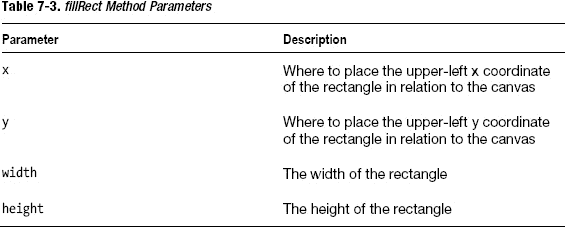

要绘制一个 20px × 20px 的简单矩形，可以使用以下代码:

`context.fillStyle = '#000000';
context.fillRect(0, 0, 20, 20);`

这将产生一个类似于图 7-6 所示的矩形。

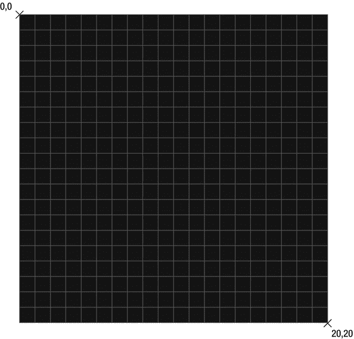

**图 7-6。** *一个 20px × 20px 的长方形*

`context.fillStyle`将任何新闭合形状的填充设置为黑色或#000000，如矩形或圆形。

在为停止符号在播放按钮上绘制矩形的代码中，您需要考虑停止符号相对于画布的位置。您需要将停止符号直接放在画布的中心。要使停止符号居中，您需要计算停止符号左上角的 x 和 y 偏移量。要计算这一点，您需要将画布的宽度和高度分成两半，以得到偏移量。然后，您可以从形状的中心减去画布中心，得到 x 和 y 坐标。这个方法简单地将要绘制的形状的中心与画布的中心对齐。

下面的代码将使停止图标相对于画布本身的大小居中。

`app.playButton = function(id, track){

   ...` `**   this.drawStop = function(){**
**      var width = 20,**
**         height = 20,**
**         x = canvas.center.x - (width / 2),**
**         y = canvas.center.y - (height / 2);**

**      context.beginPath();**
**      context.fillStyle = '#A0A0A0';**
**      context.fillRect(x, y, width, height);**

**   };**
}`

正如您所看到的，您将停止图标的`width`和`height`声明为`20`，以便以后可以引用它们。您还可以通过获得画布的中心 x 坐标减去矩形宽度的一半来计算 x 坐标。这将使停止图标水平居中。

接下来，y 坐标的设置方式也差不多，将画布(其中心)的高度减半，并减去停止图标高度的一半。然后将停止图标垂直放置在画布的中心，如图[图 7-7](#fig_7_7) 所示。结合这两种计算方法将使停止图标在画布中完全居中。

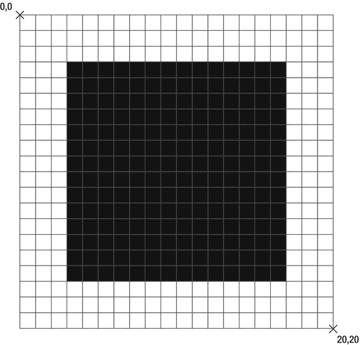

**图 7-7。** *将停止图标沿 x 轴和 y 轴居中*

在开始在画布上绘制新形状之前，调用`context.beginPath()`是个好主意。这将在上下文中创建一个新路径，以便您开始绘制。这相当于在你在纸上画一个新的形状之前，把你的笔从纸上拿开。

接下来，你需要设置你要画的形状的`fillStyle`。2D 上下文 API 有几种绘图方法。API 最基本的方法和属性如[表 7-4](#tab_7_4) 和[表 7-5](#tab_7_5) 所示。

T2】

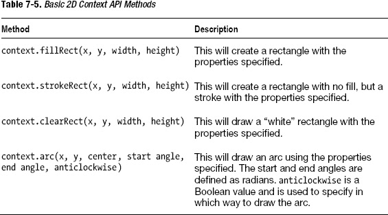

设置好样式属性后，您现在可以使用`context.fillRect()`绘制停止图标。

定义的方法将在当前上下文中绘制一个矩形。接下来，您需要创建一个方法来绘制播放按钮。

#### 绘制播放图标

播放按钮稍微复杂一些。要绘制播放按钮，您需要下拉到上下文中的绘制路径。

为了绘制路径，您使用了`moveTo`和`lineTo`方法。这些方法允许你在不画线的情况下移动到某一点，在两点之间画一条线。

`app.playButton = function(id, track){

   ...

**   this.drawPlay = function(){**
**      var width = 20,**
**         height = 20,**
**         x = canvas.center.x - (width / 2),**
**         y = canvas.center.y - (height / 2);**

**      context.beginPath();**
**      context.moveTo(x, y);**
**      context.lineTo(x + width, y + (height / 2));**
**      context.lineTo(x, (y + height))**
**      context.fillStyle = '#A0A0A0';**
**      context.fill();**
**   };**
}`

首先，将播放图标的`width`和`height`设置为`20`(即 20px × 20px)。然后，将中心点设置为画布宽度的一半，减去播放按钮宽度的一半。您也可以对 y 轴进行同样的操作，就像您对停止图标所做的一样。

为了绘制 play 按钮，您需要在画布上预先映射三个点，以绘制起点和终点的直线。[图 7-8](#fig_7_8) 显示了在 20px × 20px 绘图环境中的大概坐标。

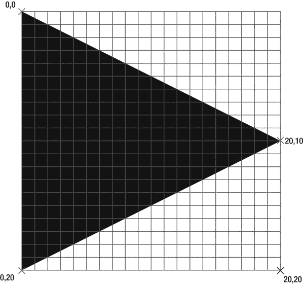

**图 7-8。** *画一个三角形*

如你所见，三角形有三个点:(0，0)，(20，10)，和(0，20)。就像你在正方形上做的一样，你必须根据它的宽度和高度来计算三角形上的点应该在哪里。你知道第一个点应该从 0，0 开始。第二个点应位于 x =形状宽度，y =形状高度/ 2 的位置。记住这一点，第三个也是最后一个点应该定位在 x =原点 x，y =造型高度的地方。这将创建一个等边三角形。下面的代码将创建这个:

`var width = 20, height = 20, startx = 0, starty = 0;
context.beginPath();
context.fillStyle = '#A0A0A0';

context.moveTo(startx, starty);
context.lineTo((startx + width), (starty + (height / 2)));
context.lineTo(startx, (starty + height));
context.fill();`

正如你所看到的，你画了两条线形成等边三角形。您不必绘制另一条线来连接最终位置和原始位置。通过调用`context.fill()`，你将自动闭合原点和终点之间的间隙，并用`context.fillStyle`颜色填充矩形。前面的方法也考虑了绘制形状的起点。你可以改变`startx`或`starty`的值，它将总是在那个位置画一个等边三角形。

随着图标的创建，现在是时候设置播放头了。播放头简直就是一个逐渐打开的圆圈。半圆下面是另一个圆圈，有对比色帮助区分音频播放的进度，如图[图 7-9](#fig_7_9) 所示。

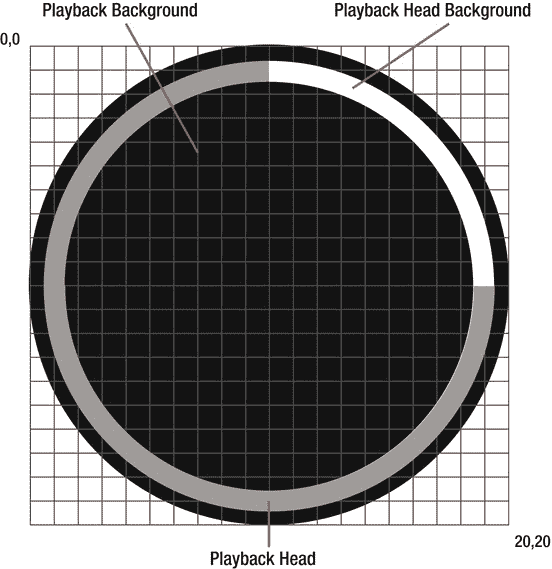

**图 7-9。** *回放头*

#### 绘制播放头

Canvas 的问题是你不能单独为每个形状制作动画。移动或激活画布元素需要完全重绘画布。在 Canvas 中制作动画需要在 JavaScript 中跟踪每个对象的状态，然后在每次调用`draw`时渲染它。这是一个漫长而费力的过程，但是通过正确的实现，可以减少耗时..

要跟踪跟踪的进度，您首先需要计算出其当前进度的百分比。

`app.playButton = function(id, track){
   ...
**   this.draw = function(){**
**      var percentage = 100 - ((track.getCurrentTime() / track.getLength())**
*** 100);**

**   };**
}`

这简单地计算为(当前时间/长度)* 100。这将给你一个介于 1 和 100 之间的可预测的数字。您需要返回一个百分比，其中 100%表示音轨开始时，0%表示音轨结束时。为此，您只需从 100 中减去已播放的百分比，即可得到剩余曲目的百分比。

下一步是根据剩余曲目的百分比计算播放头的角度。你知道 2 * π (PI)的结果将等于以弧度表示的整圆的角度。0 * π (PI)会得出 0，会得出一个空圆。

`app.playButton = function(id, track){
   ...
   this.draw = function(){
      var percentage = 100 - ((track.getCurrentTime() / track.getLength()) *
100);
**      var endradians = (percentage * (2 / 100)) * Math.PI;**

   };
}`

[图 7-10](#fig_7_10) 显示了 PI 计算的重要位置。

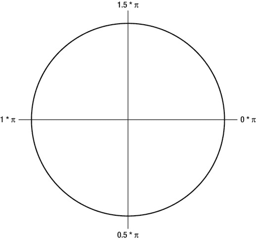

**图 7-10。** *n * π弧度*

如您所见，0 从圆的右侧开始，2 也将导致相同的位置。如果将圆弧的起始位置设置为 0，结束位置设置为 2 * PI，结果将是空的，因为圆由于角度为 0 而没有圆周。

您将定期重绘画布，因此每次重绘时都需要清除画布，以防止在新的上下文形状下面显示以前的上下文形状。这可以通过调用`context.clearRect(0, 0, canvas width, canvas height);`来实现。这将在整个画布上绘制一个清晰的矩形。您不必担心矩形绘制后存在的内存或形状，因为只有当前上下文保存在内存中。

`app.playButton = function(id, track){
   ...
   this.draw = function(){
      var percentage = 100 - ((track.getCurrentTime() / track.getLength()) *
100);
      var endradians = (percentage * (2 / 100)) * Math.PI;

**      context.clearRect(0, 0, canvas.dimensions.width,**
**canvas.dimensions.height);**
   };
}`

下一步是画一个圆圈，作为播放按钮的背景。画一个完整的圆，然后用黑色填充，就可以做到这一点。

`app.playButton = function(id, track){
   ...
   this.draw = function(){
      var percentage = 100 - ((track.getCurrentTime() / track.getLength()) *
100);
      var endradians = (percentage * (2 / 100)) * Math.PI;

      context.clearRect(0, 0, canvas.dimensions.width,
canvas.dimensions.height);

**      /****
**       * Draw the play button backdrop**
**       */**
**      context.beginPath();**
**      context.fillStyle = '#000000';**
**      context.arc(canvas.center.x, canvas.center.y,**
**         canvas.center.x - 10, 0, 2 * Math.PI, false);**
**      context.fill();**

   };
}`

下一步是画一个没有填充的圆，并对其应用一个笔画，以提供当游戏头移动时显示的背景。

`app.playButton = function(id, track){
   ...
   this.draw = function(){
      var percentage = 100 - ((track.getCurrentTime() / track.getLength()) *
100);
      var endradians = (percentage * (2 / 100)) * Math.PI;

      context.clearRect(0, 0, canvas.dimensions.width,
canvas.dimensions.height);

      /**
       * Draw the play button backdrop
       */
      context.beginPath();
      context.fillStyle = '#000000';
      context.arc(canvas.center.x, canvas.center.y,
         canvas.center.x - 10, 0, 2 * Math.PI);
      context.fill();

**      /****
**       * Draw the background for the play head**
**       */**
**      context.beginPath();**` `**      context.arc(canvas.center.x, canvas.center.y,**
**         canvas.center.x - 20, 0, 2 * Math.PI);**
**      context.lineWidth = 5;**
**      context.strokeStyle = "#FFFFFF";**
**      context.stroke();**

   };
}`

最后，这是一个根据音轨的当前播放位置绘制播放头的例子。代码与为播放头绘制背景的代码相同，除了结束角度被设置为代码中先前声明的`endradians`来表示轨道的进度。

`app.playButton = function(id, track){
   ...
   this.draw = function(){
      var percentage = 100 - ((track.getCurrentTime() / track.getLength()) *
100);
      var endradians = (percentage * (2 / 100)) * Math.PI;

      context.clearRect(0, 0, canvas.dimensions.width,
canvas.dimensions.height);

      /**
       * Draw the play button backdrop
       */
      context.beginPath();
      context.fillStyle = '#000000';
      context.arc(canvas.center.x, canvas.center.y,
         canvas.center.x - 10, 0, 2 * Math.PI);
      context.fill();

      /**
       * Draw the background for the play head
       */
      context.beginPath();
      context.lineWidth = 5;
      context.strokeStyle = "#FFFFFF";

      context.arc(canvas.center.x, canvas.center.y,
         canvas.center.x - 20, 0, 2 * Math.PI);

      context.stroke();

      **/****
       *** Draw the progress head**
       ***/**
      **context.beginPath();**
      **context.lineWidth = 5;**` `      **context.strokeStyle = "#A8A8A8";**
      **context.arc(canvas.center.x, canvas.center.y,**
**         canvas.center.x - 20, 0, endradians);**
      **context.stroke();**

   };
}`

该方法的最后一步是决定每次重绘画布时是在按钮上绘制停止图标还是播放图标。这是通过一个`switch`语句实现的。

`app.playButton = function(id, track){
   ...
   this.draw = function(){
      var percentage = 100 - ((track.getCurrentTime() / track.getLength()) *
100);
      var endradians = (percentage * (2 / 100)) * Math.PI;

      context.clearRect(0, 0, canvas.dimensions.width,
canvas.dimensions.height);

      /**
       * Draw the play button backdrop
       */
      context.beginPath();
      context.fillStyle = '#000000';
      context.arc(canvas.center.x, canvas.center.y,
         canvas.center.x - 10, 0, 2 * Math.PI);
      context.fill();

      /**
       * Draw the background for the play head
       */
      context.beginPath();
      context.lineWidth = 5;
      context.strokeStyle = "#FFFFFF";

      context.arc(canvas.center.x, canvas.center.y,
         canvas.center.x - 20, 0, 2 * Math.PI);

      context.stroke();

      /**
       * Draw the progress head
       */
      context.beginPath();
      context.lineWidth = 5;
      context.strokeStyle = "#A8A8A8";
      context.arc(canvas.center.x, canvas.center.y,` `         canvas.center.x - 20, 0, endradians);
      context.stroke();

      **/****
       *** Decide whether to draw the play or the stop button**
       ***/**
      **switch(track.getState()){**
         **case track.state.PAUSED:**
         **case track.state.STOPPED:**
            **this.drawPlay();**
            **break;**
         **case track.state.PLAYING:**
            **this.drawStop();**
            **break;**
      **}**

   };
}`

可以看到，如果曲目状态是暂停或停止，会绘制播放图标；如果曲目正在播放，则会绘制停止图标。

`playButton`的完整代码如下。您会注意到，在代码示例的底部，有一个事件侦听器为画布绑定触摸事件。这将触发`togglePlay()`方法。

`app.playButton = function(id, track){

   var canvas = document.getElementById(id),
      context = canvas.getContext('2d'),
      track = track,
      _self = this;

   canvas.center = {
      x: (canvas.offsetHeight / 2),
      y: (canvas.offsetHeight / 2)
   };

   canvas.dimensions = {
      width: (canvas.offsetWidth),
      height: (canvas.offsetHeight)
   };

   /**
    * Track callback methods
    */
   track.callbacks.didUpdateTime = function(time){
      _self.draw();
   };` `track.callbacks.didPause = function(){
      _self.draw();
   }

   /**
    * Track controls
    */

   this.togglePlay = function(){

      switch(track.getState()){
         case track.state.STOPPED:
         case track.state.PAUSED:
            _self.play();
            break;
         case track.state.PLAYING:
            _self.stop();
            break;
      }

   }

   this.play = function(){
      track.play();
   };

   this.stop = function(){
      track.pause();
   };

   this.drawStop = function(){
      var width = 20,
         height = 20,
         x = canvas.center.x - (width / 2),
         y = canvas.center.y - (height / 2);

      context.beginPath();
      context.fillStyle = '#A0A0A0';
      context.fillRect(x, y, width, height);

   };

   this.drawPlay = function(){
      var width = 20,
         height = 20,
         x = canvas.center.x - (width / 2),
         y = canvas.center.y - (height / 2);

      context.beginPath();
      context.moveTo(x, y);` `context.lineTo(x + width, y + (height / 2));
      context.lineTo(x, (y + height))
      context.fillStyle = '#A0A0A0';

      context.fill();

   };

   this.draw = function(){
      // Draw the progress bar based on the
      // current time and total time of the track
      var percentage = 100 - ((track.getCurrentTime() / track.getLength()) *
100);
      var endradians = (percentage * (2 / 100)) * Math.PI;

      context.clearRect(0, 0, canvas.dimensions.width,
canvas.dimensions.height);

      context.beginPath();
      context.fillStyle = '#000000';
      context.arc(canvas.center.x, canvas.center.y,
         canvas.center.x - 10, 0, 2 * Math.PI);
      context.fill();

      context.beginPath();
      context.arc(canvas.center.x, canvas.center.y,
         canvas.center.x - 20, 0, 2 * Math.PI);
      context.lineWidth = 5;
      context.strokeStyle = "#FFFFFF";
      context.stroke();

      context.beginPath();
      context.arc(canvas.center.x, canvas.center.y,
         canvas.center.x - 20, 0, endradians);
      context.lineWidth = 5;
      context.strokeStyle = "#A8A8A8";
      context.stroke();

      switch(track.getState()){
         case track.state.PAUSED:
         case track.state.STOPPED:
            this.drawPlay();
            break;
         case track.state.PLAYING:
            this.drawStop();
            break;
      }

   };` `   canvas.addEventListener('touchend', function(e){
      _self.togglePlay();
      e.preventDefault();
   });

   this.draw();
};` 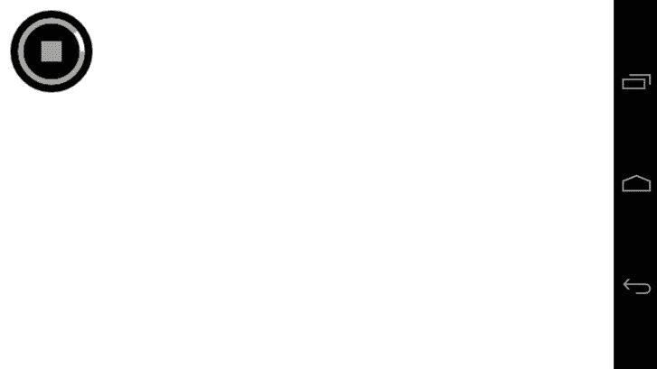

**图 7-11。** *最终播放按钮*

### 存储数据

传统上，要在移动 web 应用中持久化数据(如用户名),需要将这些信息存储在 cookie 中。cookies 的问题在于，虽然它们非常适合存储少量数据，但对于大量数据，例如 JavaScript 对象，它们很快就变得难以管理。当您希望存储应用的当前状态时，这可能是完美的，以便当用户返回时，他们可以从他们离开的地方继续，就像本机应用一样。

不幸的是，本地存储不支持存储对象，只支持字符串值。但是您可以使用 JSON.stringify 将对象转换为字符串，然后使用 JSON.parse 将它们转换回对象。

要使用本地存储来存储数据，只需使用`localStorage`API。这些包括[表 7-6](#tab_7_6) 中所示的属性和方法。

T2】

例如，如果您想存储一个包含用户名、电子邮件地址和联系电话号码的对象，您可以创建如下内容:

`var user = {name: "John Seagate", email: "john.seagate@hello.com",
contactNumber: "012345678910"}
localStorage.setItem('user', JSON.stringify(user));`

要检索该项，您可以使用以下代码:

`var user = JSON.parse(localStorage.getItem('user'));`

### 移动 JavaScript 库

JavaScript 库可以帮助减轻任何类型的前端开发的负担。它们可以帮助提供一致的 API，从 DOM 操作一直到厨房水槽。本章将使用三个库作为示例。

*   李荣
*   移动 jQuery
*   煎茶触摸

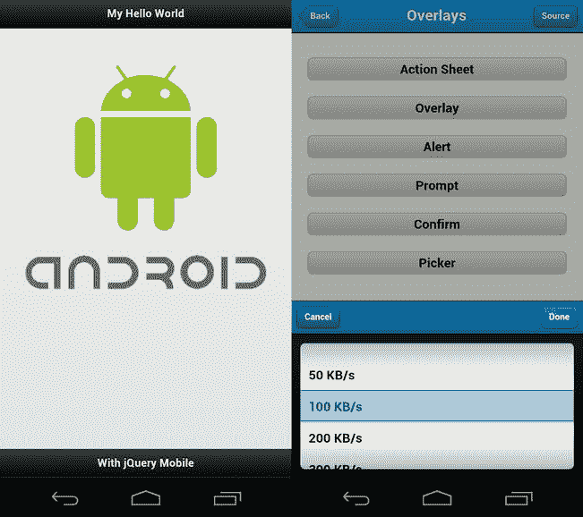

**图 7-12。***【jQuery Mobile】(左)，和*的 Sencha Touch(右)

XUI 是专门针对移动设备的，它提供了类似 jQuery 的语法和轻量级的 DOM 操作，简单的 API 抽象来生成和处理 Ajax 请求，并执行基本的基于 JavaScript 的动画。它有一个很像 jQuery 的插件架构，所以你可以扩展 XUI 来满足你的需要，并为你的项目创建额外的插件。

jQuery Mobile 和 Sencha Touch 都是重量级产品，从某种意义上来说，它们不仅提供了一个你可能称之为“普通 JavaScript”的抽象，而且还提供了一个你可以轻松构建移动 web 应用的框架。

jQuery mobile 可以帮助您快速构建项目的原型，然后进一步对它们进行皮肤处理。它的用户界面依赖于传统的简单 HTML (POSH)。然后用 CSS 和 JavaScript 增强了这种时髦。jQuery 通过使用 CSS 媒体查询来改变布局，可以在基于手机和平板电脑的设备上运行。

Sencha Touch 提供了一种更复杂、功能更全的开发方法。你不用 HTML 写卡片或页面。相反，您通过 JavaScript 配置每个页面并提供内容。Sencha Touch 提供了许多 UI 增强和小部件，包括离线存储数据的能力和通过使用代理开箱即用的在线。这允许您通过一个通用界面存储和检索数据，并指定您在配置中使用的存储类型。

jQuery 和 Sencha Touch 都很棒；然而，您最终创建的是用 jQuery mobile 或 Sencha 思维方式构建的应用。使用移动库来完成一个基于移动的项目并没有错，但是在选择一个框架或库的时候，你应该注意你应该寻找的东西。

#### 文件大小

确保任何库都具有较小的占用空间是很重要的。不幸的是，一些移动运营商不提供无限制的数据计划，所以确保访问你的移动网站不会对你的用户的口袋产生大的影响是很重要的。同样重要的是要记住，尽管 3G 和 LTE 提供相对较高的数据速度，但并非所有用户都可以随时访问 3G 或 LTE。这对加载时间有影响，因为 500kB 的库以及整个应用的图像和 CSS 素材可能需要几秒钟才能通过 3G/LTE 下载；这可能需要更长的时间。因此，迎合最小公分母，这将是优势，在这种情况下。

#### 文件数量

在撰写本文时，移动浏览器可以发出的请求数量非常有限。这意味着，如果您有许多资源要下载到浏览器，这会影响加载时间。您可以通过确保您使用的 JavaScript 库提供以下功能来克服这个问题:

*   源的缩小和连接版本
*   图标和按钮等东西的 sprite 表
*   内容交付网络(CDN)托管版本的库

#### 活动

您应该查看库的最新更新是什么时候，以及新版本发布的频率(发布周期)。这对您的开发有影响，如果您是一个关注 bug 修复和主要发布版本的人，您可能会发现自己一直在用最新的发布版本更新代码；或者更糟糕的是，如果这个库被废弃并且不再被维护，这意味着你将不得不学习一个新的库或者维护刚刚被废弃的库。

#### CSS3 支持

许多库现在正在更新他们的代码，以利用 GPU 对 CSS3 动画和过渡支持的增强。您应该检查您的库，以确保它支持 CSS3 过渡和动画，或者具有针对 JavaScript 动画和过渡的路线图。这将为您的应用提供性能增强。

### 总结

从这一章开始，你应该对 JavaScript 和移动给你带来的新功能有了更深的理解。

您应该能够区分过程 JavaScript 和面向对象 JavaScript 之间的区别，并且将对象相互传递是一个比在全局名称空间中调用函数好得多的概念和原则。

您还应该对 JavaScript 中的作用域有一个简单的了解，以及如何通过闭包和使用`_self = this`在对象之间维护它。

您还应该对如何在 JavaScript 中处理触摸事件有一个简单的了解，通过利用这一点，您可以生成更加丰富的应用。

这一章非常详细地谈到了画布。你应该了解 HTML5 Canvas 是如何工作的，以及上下文和绘图 API 背后的想法，如`arc`、`fillRect`，以及样式 API，如`lineStyle`和`fillStyle`。