## 第八章

## JavaScript:模型、视图和控制器

有许多开发设计模式。MVC(模型视图控制器)是一个真正脱颖而出并可以应用于几乎所有编程语言的工具。MVC 将应用程序分解为不同的责任层。

作为开发人员，我们在没有真正了解项目最终将如何发展或成长的情况下，就开始着手一个项目，这种情况太普遍了。例如，我们使用 Ajax 从外部资源获取数据，然后在同一个代码块中用 HTML 简单地呈现这些数据。如果您想在应用程序的另一部分使用相同的 HTML，但是出于不同的目的，使用不同的数据源，会发生什么情况呢？最快的方法是复制粘贴代码并修改变量。

当你开始以这种方式将更多的特性加入到你的应用程序中时，它可能看起来更像是你用果冻和巧克力而不是代码和逻辑构建的应用程序。这听起来很有趣，但关键是如果你从一开始就以一种以后可以很容易地构建的方式构建你的应用程序，那么将来添加更多的特性将花费更少的时间和金钱。

实现这一点的一部分是为应用程序的某些方面标准化或创建规则。这可以使代码写起来更长，但更容易被开发人员而不是你自己使用。通过采用 MVC，你采用了一种易于理解的工作方法。你的技能水平不应该决定你是否应该学习设计模式。你可以用你喜欢的任何方式实现 MVC 然而，本章将只向你展示一种在 JavaScript 中使用 MVC 的方法。

通过这一章，你将学习如何创建和实现你自己的 MVC 框架。您将了解什么是模型，以及它们如何作为应用程序的生命线。您将了解控制器如何帮助绑定和管理应用程序中的事件，以及如何构建视图以供重用。

**注意:**在开始之前，你需要一个烂番茄开发者账户。要创建一个，请前往`[http://developer.rottentomatoes.com](http://developer.rottentomatoes.com)`并按照步骤创建一个开发者帐户并获得一个 API 密钥。

### 清理你的代码

在你开始为这一章写任何代码之前，你需要清理你为第四章的[创建的应用程序的根目录下的`index.html`。大多数 HTML，比如收藏夹列表和电影预览列表，现在将使用 JavaScript 生成。我们将在这一章中涉及相当多的内容；为了详细关注所有这些问题，寻找电影院和播放音轨将从最终的功能列表中删除。](04.html)

打开`index.html`并确保你的 HTML 看起来像下面的代码。

`<!DOCTYPE html>
<html lang="en-GB" dir="ltr">

   <head>

      <meta charset="UTF-8" />
      <meta name="viewport" content="width=device-width; initial-scale=1.0;
         maximum-scale=1.0; user-scalable=0; target-densitydpi=device-dpi;"/>
      <title>Mo Memo</title>
      <link rel="stylesheet" type="text/css" href="css/mobile.css" />
      <link rel="apple-touch-icon-precomposed" href="img/home-screen-icon.png">
   </head>

   <body>

      

         <!-- Begin Taskbar -->

         <header id="taskbar" class="screenbar">
            <h1 class="branding">Mo Memo</h1>
            <!-- Taskbar Search form -->
            <form method="post" id="add-movie" class="horizontal">
               <input type="text" class="full-width search" name="query"
                  placeholder="enter your movie name&hellip;" />` `            </form>

         </header>

         <!-- End Taskbar -->

         <!-- Begin Movie List Deck -->

         

            

            

            

            

            

            

         

         <!-- End Movie List Deck -->

      

   </body>

</html>`

正如您在前面的代码中看到的，对`
`id 和类有几处更改。个别卡片上的内容也被删除了。这是因为，在本章中，你将学习如何用 JavaScript 创建可重用的 HTML 片段，称为*视图*。这将允许您将 HTML 和视图逻辑放在应用程序的主代码之外，放在它自己的可维护文件中。

### MVC 和 JavaScript 初级读本

JavaScript 基于 ECMAScript 标准。我们有幸在二十世纪末看到了 JavaScript 的流行，当时 dynamicdrive.com 网站将 JavaScript 带到了网络的前沿。然后，正如 Web 2.0 是几年前流行的 Web 技术(如 Ajax、JavaScript、CSS 和 HTML)和概念(包括 API、RSS、社交媒体和大规模内容生产和消费)集合的流行语一样，d HTML 成为利用 JavaScript、DOM 操纵和 CSS(例如，制作雪花漂浮在其上的网页)的流行语。

很快，JavaScript 变得越来越流行，在拥有 Java 和 C/C++等语言的企业软件开发经验的专业开发人员手中，JavaScript 成熟了。然而，浏览器在实现上不一致；JavaScript 开发人员经常在仇恨中编码，他们知道其他浏览器对 Ajax/XMLHttpRequest 的实现与当时流行的 Internet Explorer 完全不同(与我们今天看到的相反)。即使像绑定事件或选择元素这样简单的任务也可能是一种痛苦，因为您必须做两次——一次是针对 Internet Explorer，一次是针对其他所有人。

后来，我们有了 MooTools、DoJo、JQuery 和 YUI 等库，让我们摆脱了许多繁重的工作。这些解决了许多浏览器不一致的问题，为我们提供了一种执行简单任务(比如 DOM 选择和操作)的方法，这种方法适用于所有浏览器。例如，与其编写几行代码来创建一个兼容 Internet Explorer 和 Firefox 的 Ajax 请求，不如用 jQuery 一次覆盖两者，如下所示。

`$.ajax('/my/data/provider.json');`

不幸的是，留给我们的是一群新开发人员，他们完全有理由相信 jQuery、DoJo、MooTools 或 YUI 是真正的 JavaScript——因为这是他们被教导或自学的方式。

混合了库代码的过程化 JavaScript 成为了标准，用意大利面条式的代码来填充`$(document).ready(function(){});`最终会变得难以为不断增长的 web 应用程序所维护。

这些工具令人惊叹，功能强大，但人们很容易依赖它们，却不明白它们到底是如何工作的，也不明白为什么你应该或不应该在手机上使用其中一个。如果您主要使用 jQuery，那很好。我从 2007 年/1.1 版本开始作为开发人员使用 jQuery，从 2005 年开始使用 script.aculo.us(虽然我不愿意承认)。但是，我是先学 JavaScript 的，甚至在开始使用之前，我就翻看了 jQuery 和 script.aculo.us 的代码。

这在移动中甚至更重要，因为库中的大部分代码几乎不会被您的移动 web 应用程序使用。至少，您可能会使用 DOM 选择器、遍历、事件绑定和 Ajax，这些只占库代码的一小部分。也就是说，对于一个已经在供需矛盾中挣扎的网络来说，把整个事情拉下来是没有意义的。

相反，有时候开发自己的迷你 JavaScript 库或框架实际上更有益。你永远不会是一个新手来学习如何做这件事；事实上，最好现在就开始习惯自己的方式。

框架只是一种处理代码的方法、标准或实践。您创建了一个框架来分离应用程序的重要部分，以便在应用程序增长时更容易管理它们。该框架还管理数据如何流经您的应用程序。您将主要看到 JavaScript 对象从一个方法传递到另一个方法进行表示。这些对象通常代表某种形式的实体，被称为*模型*。模型通常会被传递给一个方法或函数，然后显示给用户。在 MVC 中，处理和操纵模型以进行展示的方法被称为*控制器*，生成包含模型的 HTML 的代码被称为*视图*。图 8-1 显示了 MVC 框架是如何构建的。

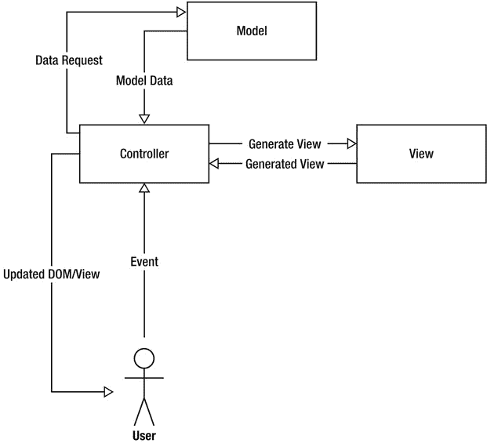

**图 8-1。***JavaScript 的 MVC 图*

### 模型

MVC 中的 M 代表模型。模型是应用程序的一部分，它规定了如何处理不同类型的数据。模型只是一个 JavaScript 对象，可以表示某种类型的实体。例如，您可以在应用程序中为用户创建一个模型，如下所示:

`var user = function user(){}`

提示:你会注意到我已经命名了这个函数，并把它赋给了一个变量。这实质上创建了一个命名函数，而不是一个匿名函数。这在很多情况下都很有用，比如调试，因为您可以在堆栈跟踪中看到方法名。

用户通常有一些属性，比如名字、密码和宠物。最好通过使用实例变量(只能从对象/模型内部访问的变量)来创建这些属性，然后创建特权 getters 和 setters 来修改或检索这些值。这允许您围绕这些属性创建规则。例如，您可以有一个密码设置器，它接受一个纯文本密码，然后在对象中加密它的值。通过省略 getter，还可以防止另一段代码从用户对象中检索用户的密码。下一个代码示例展示了用户模型的演变。

`var user = function user(name, password, pet){

   var _name = null,
   _password = null,
   _pet = null,
   _self = this;

   this.setName(name);
   this.setPassword(password);
   this.setPet(pet);

   name = null;
   password = null;
   pet = null;

   /**
    * Returns the user's name
    */
   this.getName = function(){
      return _name;
   }` `   /**
    * Sets the user's name
    */
   this.setName = function(name){
      _name = name;
   }

   /**
    * Sets the user's password and encrypts it before assignment
    */
   this.setPassword = function(password){
      _password = password.encrypt(); // .encrypt() doesn’t really exist!
   }
      /**
    * Returns the user's favorite pet
    */
   this.getPet = function(){
      return _pet;
   }

   /**
    * Sets the user's favorite pet
    */
   this.setPet = function(pet){
      _pet = pet;
   }

}`

如您所见，这里有大量的代码来实现看起来很少的功能。但是，这个想法是，您可以在应用程序的任何地方使用这个新的用户模型，无论您向它提供什么数据，它都会在整个应用程序中以可预测的方式运行。

使用模型的美妙之处在于，您可以在它们之间创建关系。例如，使用前面的例子，每个用户都有一只宠物，但是找到一种方法来描述这只宠物不是很好吗？为此，您可以创建一个宠物模型。

您可以很容易地将宠物属性添加到用户模型中，但是如果您将来需要更详细地描述宠物，您最终会得到一个混乱的用户模型。拥有一个独立的模型允许你在将来创建新的宠物属性，而不会破坏你的应用程序的完整性。宠物模型如下。

`var pet = function pet(name, type){
   var _name = null,
      _type = null;` `   this.setName(name);
   this.setType(type);

   /**
    * Gets the pet's name
    */
   this.getName = function(){
      return _name;
   }

   /**
    * Sets the pet's name
    */
   this.setName = function(name){
      _name = name;
   }

   /**
    * Gets the pet's type
    */
   this.getType = function(){
      return type;
   }

   /**
    * Sets the pet's type
    */
   this.setType = function(type){
      _type = type;
   }
}`

如您所见，宠物模型遵循与用户模型完全相同的结构。要一起使用这些，您可以执行以下操作。

`var sue = new user('Suzanne', 'password', null); // First create a new user with
no pet
var jack = new pet('Jack', 'dog'); // Create a new pet
sue.setPet(jack); // Assign the new pet to the user

/**
 * By calling getPet, you now have access to all of the pet's methods and
 * attributes from the user
 */

alert(sue.getName() + 'has a favorite ' + sue.getPet().getType() + ' called ' +
sue.getPet().getName());`

你可能想更进一步，允许用户拥有许多宠物。您可以通过在用户模型中创建一组宠物来实现这一点。您必须创建几个新方法来从用户对象外部管理 pets 数组。

*   `addPet`将单个宠物添加到宠物数组中。
*   从宠物数组中获取一个特定索引的宠物。
*   使用索引值删除单个宠物。
*   使用宠物数组设置宠物数组，覆盖现有的宠物数组。
*   `getPets`检索分配给用户对象的所有宠物。

用户对象的新变化如下。

`/**
 * Now that you can have multiple pets, it doesn't make sense to add it to
 * the constructor
 */
var user = function user(name, password){

   var _name = null,
      _password = null,
      _pets = [], // The default value is now an array instead of null
      _self = this;

   this.setName(name);
   this.setPassword(password);
   // favoritePet is not part of the constructor anymore, so it doesn't need to
be set

   name = null;
   password = null;

   ...

   /**
    * Adds a pet to the pet array
    */
   this.addPet = function(pet){
      // You can add object validation here before adding to the pet array
      _pets.push(pet);
   }

   /**
    * Gets a pet from the array at a specific index
    */
   this.getPet = function(index){
      return _pets[index];` `   }

   /**
    * Removes a pet from the array
    */
   this.removePet = function(index){
      /**
       * Splice can remove items from an array. It accepts a start index
       * and number of items
       */
      _pets.splice(index, 1);
   }

   /**
    * Sets the pet array
    */
   this.setPets = function(pets){
      /**
       * Clear the pets array, using Array.length = 0 will remove
       * every element in the array as apposed to creating a new array
       * using _pets = [];
       */
      _pets.length = 0;

      /**
       * Instead of completely replacing the pets array with the new array,
       * each pet should go through the same validation in the addPet method.
       * Instead of duplicating any validation code, it makes sense to just
       * call the addPet method for every pet using a for loop.
       */
      for(var i = 0; i < pets.length; i++){
         _self.addPet(pets[i]);
      }
   }

   /**
    * Gets the pet array
    */
   this.getPets = function(){
      return _pets;
   }

}`

从前面的代码中可以看出，除了`setPets`方法之外，大多数方法都是显而易见的。从`setPets`代码中，您可以看到您必须首先使用`_pets.length = 0`清除 pets 数组。这比使用`_pets = []`给`_pets`变量分配一个新的空数组要慢；然而，它将简单地删除所有的数组元素，而不是创建一个新的空数组。不是将传递给方法的 pets 数组分配给 pets 对象中的`_pets`数组，而是遍历新数组中的每个宠物并调用`addPet`方法。这样做的原因是为了确保任何新宠物仍然通过用于将宠物添加到用户对象的相同代码，该代码可能包含验证或修改每个宠物对象。要使用新代码，您可以做一些类似于下面的 JavaScript 代码的事情。

`var user = new user('Suzanne', 'password');
var pet1 = new pet('Jack', 'dog');
var pet2 = new pet('Snoop', 'dog');
user.appPet(pet1);
user.addPet(pet2);

var message = user.name + ' has ' + user.getPets().length + ' pets. ' +
user.name + ' has';
for(var i = 0; i < user.getPets().length; i++){
   message += ' a ' user.getPet(i).getType() + ' called ' +
user.getPet(i).getName();
}

alert(message);`

这应该会输出类似“Suzanne 有两只宠物。她有一只叫杰克的狗，一只叫史努比的狗。

重要的是要记住，你的模型只是 JavaScript 对象，所以你可以添加任何方法来操作其中的变量或者以某种方式输出东西。

MoMemo 内部没有那么多模型。解释模型如何相互协作的最好方式是通过类图。

尽管 JavaScript 是一种无类语言，但是您仍然可以使用类类比来描述如何通过在对象中创建构造函数、方法和实例变量来形成对象。

类图显示了一个类将拥有的方法和属性，以及它们如何与其他类交互。

**注意:**为了使本书尽可能简单，我将只讲述如何阅读基本的 UML 类图，包括属性、方法和常见的关联。如果你想学习更多关于 UML 和不同可用图表的知识，请随意查看`[www.agilemodeling.com/essays/umlDiagrams.htm](http://www.agilemodeling.com/essays/umlDiagrams.htm)`。

MoMemo 的基本类图如图[图 8-2](#fig_8_2) 所示。

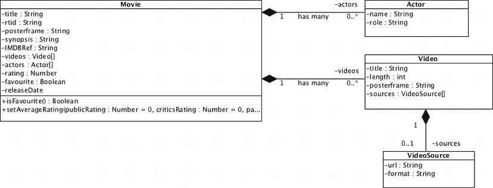

**图 8-2。** *类图中的班级*

从[图 8-2](#fig_8_2) 中可以看到，每个框的顶部都显示了一个名称(如`Movie`、`Actor`等)。)，它代表每个类的名称。在框名的正下方是几行前缀为-符号的行。这些是类的属性。属性名称前的符号指示属性应该是公共(+)还是私有(-)。您可以在 UML 类图中为属性指定类型以及其他属性。

就在属性下面，有一行后跟一个方法名。在[图 8-2](#fig_8_2) 的例子中，你可以看到`Movie`的唯一方法是`isFavorite,`，它返回一个布尔值并确定电影是否是一个收藏。

类旁边的黑色菱形表示`Movie`类与`Actor`和`Video`类之间存在关联。黑色菱形告诉您关联是复合的，这意味着`Movie`类拥有一个`Actor`和`Video`，并且在这个应用程序的上下文中，没有`Movie`,`Actor`和/或`Video`就不能存在。复合关联还表示，如果父代(`Movie`，在本例中)死亡，那么子代(`Actor` / `Video`)将不再存在。重要的是要记住，当创建类之间的关联时，它们是在应用程序的上下文中创建的。还有其他类型的关联，在[表 8-1](#tab_8_1) 中列出。

T2】

在关联线旁边，您会看到 1 或 0..*.这叫做*多重性*。它指示每个类之间的关联类型。1 表示只有一个关联对象 0..*表示有零个或多个关联对象。

在[图 8-2](#fig_8_2) 的例子中，一个`Actor`只有一个`Movie`，但是一个`Movie`有零个或多个`Actor`，一个`Movie`有零个或多个`Video`，但是一个`Video`只能有一个`Movie`。

通常，UML 图也不会显示属性的 getters 和 setters。使用前面的模型，您可以开始为 MoMemo 创建您的模型。

先说最小最不重要的型号，`VideoSource`。

#### 视频源模式

视频源模型是 MoMemo 应用程序中使用的所有模型中最简单的。视频源模型用于存储视频的不同视频格式。与其将 webm、mp4 和 ogv 属性添加到`Video`模型中，不如将视频与视频源相关联以获得灵活性。

想象一下，一个新的移动网络浏览器刚刚发布，支持几种新的格式。如果你想支持这些格式，你需要修改`Video`模型，这会对你的应用程序产生负面影响。通过创建与视频源的关联，如果出现新的格式，您不必担心修改代码，因为您可以简单地为新的视频格式创建新的实例，然后将它们添加到与`Video`模型的关联中。为了使生活更容易，你可以在你的视图中创建一个循环(这将在本章中进一步讨论),这样你就不必修改应用程序来支持新的视频格式。

首先，在`js/app/model/`文件夹中为视频源模型创建一个名为`videosource.js`的新 JavaScript 文件。您现在可以开始使用下面的代码来定义您的模型的结构。

`var app = app || {};

app.model = app.model || {};

/**
 * A video source used within a video
 * You must add this object to a video once instantiated
 * @param {String} url
 * @param {app.type.format} format
 */
app.model.videosource = function appModelVideoSource(url, format){
   // Your implementation goes here
}`

如您所见，该模型的声明方式与 pets 模型基本相同，只是您对所有模型都使用了`app.model`名称空间。

构造函数接受视频的 URL 和格式，可以是 webm、ogv、mp4 等等。

接下来要做的是声明实例变量。简单重述一下，实例变量是只存在于对象实例范围内的变量。除非为实例变量创建了 getter 或 setter，否则实例变量在实例外部是不可访问或修改的。

`...
app.model.videosource = function appModelVideoSource(url, format){

   /**
    * The video source's instance variables
    */
   var _url,
      _format,
      _self = this;

}`

如您所见，只有两个实例变量对应于构造函数参数。实例变量以下划线(`_`)为前缀，这样它们就不会与通过构造函数传递的变量冲突。您还使用`_self = this`声明了对实例的引用，因为`this`关键字引用的是特权方法而不是对象。

接下来要做的事情是创建一个实例化方法，该方法在模型的末尾被调用。代码如下。

`...
app.model.videosource = function appModelVideoSource(url, format){
...

   /**
    * Set the instance variables using the constructor's arguments
    */
   this.init = function(){
      this.setUrl(url);
      this.setFormat(format);
   }

   // Insert getters and setters

   this.init();

}`

如您所见，`init`方法只是调用通过构造函数传递的属性的设置器。

**注意:**通过构造函数传递的变量在构造函数和包含在构造函数中的特权方法的范围内。这意味着可以在特权方法中使用和修改构造函数参数。当在特权方法中创建新变量时，使用`var`声明它们以防止特权方法修改构造函数参数是很重要的。

这可以防止代码重复，因为在从对象外部修改实例变量时，您可能会执行其他操作，如错误检查或根据条件更改值。

您可能会想，为什么不简单地调用 setters，而不像前面的代码示例那样在 JavaScript 对象的顶部用`init`方法包装它们呢？简单的答案是 setters 还没有声明，所以调用这些方法会产生一个 JavaScript 错误。

当您在 JavaScript 中声明一个普通的命名函数时，解释器将在调用该函数时寻找它，而不管它在脚本中的位置。然而，当你把一个函数赋给一个变量时，你必须等到赋值发生后才能调用这个函数。

要解决这个问题，您必须将所有初始化代码放在对象的末尾，或者将它包装在顶部的方法中，并从底部调用它。我选择了后者，因为 getters 和 setters 往往会产生大量的白噪声，并且滚动大量看起来毫无意义的代码来找到您的主代码有点烦人。您可以看到在前面的例子中，`init`方法被调用到对象的末尾。

接下来要做的是创建 getters 和 setters。这是一个非常简单的任务。简单回顾一下，getters 返回一个实例变量，setters 给实例变量赋值，因为对象外部的任何东西都不能从对象外部修改实例变量。

getters 和 setters 非常简单，您可以在下面的代码中看到。

`...
app.model.videosource = function appModelVideoSource(url, format){
...
   /**
    * Getters and setters
    */

   /**
    * Gets the url of the video source
    * @return {String}
    */
   this.getUrl = function(){
      return _url;
   }

   /**
    * Sets the url of the video source
    * @param {String} url
    */
   this.setUrl = function(url){
      _url = url;
   }

   /**
    * Gets the mimetype of the video source
    * @return {app.type.format}` `    */
   this.getFormat = function(){
      return _format;
   }

   /**
    * Sets the mimetype of the video source
    * @param {app.type.format} format
    */
   this.setFormat = function(format){
      _format = format;
   }
...
}`

这就结束了`VideoSource`模式。如你所见，这很简单。接下来，您将创建`Video`模型，这也是相对简单的。

#### 视频模式

`Video`模型也相对简单，除了它与`VideoSource`模型有一个复合关联，其中它可以由许多视频源组成。

在`js/app/model`中创建一个名为`video.js`的新的空文件。这将包含新的视频模型。

构造函数接受一个标题、以毫秒为单位的长度和一个指向 posterframe 或 preview frame 的 URL，这将是一个图像。

`var app = app || {};

app.model = app.model || {};

/**
 * A video associated with a movie
 * You must add video sources in order for videos to play
 * @param {String} title
 * @param {Integer} length
 * @param {String} posterframe
 */
app.model.video = function appModelVideo(title, length, posterframe){
  // Code implementation goes here
}`

这个对象的实例变量是`title`、`length`、`posterframe`和一个源数组。从下面的代码片段中可以看出，`sources`变量不是构造函数参数的一部分。

`app.model.video = function appModelVideo(title, length, posterframe){
   /**
    * The video's instance variables
    */
   var _title,
      _length,
      _posterframe,
      _sources = [],
      self = this;
}`

您可以为`_sources`实例变量创建访问器。因为它对于对象的直接实例的函数不是强制性的，所以它不需要在构造函数中。

`_sources`实例变量的访问器由一个方法组成，该方法用于添加单个源实例、基于索引从数组中移除和获取实例、检索整个数组或者用新数组覆盖该数组。在下面的代码片段中可以看到这些访问器。

 `app.model.video = function appModelVideo(title, length, posterframe){
   ...

   /**
    * Gets all of the video sources used for embedding video
    * in POSH
    * @return {Array}
    */
   this.getSources = function(){
      return _sources;
   }

   /**
    * Sets all video sources using an array
    * @param {Array} sources
    */
   this.setSources = function(sources){

      /**
       * Clears the sources array
       */
      __sources.length = 0;

      /**
       * Rather than setting the sources all in one go,
       * you use the addSource method, which can handle
       * any validation for each source before it's
       * added to the object` `       */
      for(var i = 0; i < sources.length; i++){
        _self.addSource(sources[i]);
      }
   }

   /**
    * Adds a source to the sources array
    * @param {app.model.videosource} source
    */
   this.addSource = function(source){
      _sources.push(source);
   }

   ...
}`

正如您所看到的，访问器遵循了本章前面显示的 pet 示例中的相同实现。

您可能还想在`_length` setter 上添加某种类型的过滤，以便将任何值解析为整数，从而防止模型中出现任何问题。您可以在 setter 的实现中使用`parseInt`方法。这将确保传递给模型的任何值都是整数或零。在下面的代码片段中可以看到 setter。

 `app.model.video = function appModelVideo(title, length, posterframe){
   ...
   /**
    * Sets the length of the video in milliseconds
    * @param {Integer} length
    */
   this.setLength = function(length){
      /**
       * Use parseInt here just to ensure the length
       * is an integer. If it's not, then it will
       * return NaN. The isNaN method will check to
       * see whether the value is not a number.
       */
      _length = parseInt(length);

      if(isNaN(_length)){
         _length = 0;
      }
   }
   ...
}`

您现在可以完成`Video`模型，它应该看起来像下面这样。

`var app = app || {};

app.model = app.model || {};

/**
 * A video associated with a movie
 * You must add video sources in order for videos to play
 * @param {String} title
 * @param {Integer} length
 * @param {String} posterframe
 */

app.model.video = function appModelVideo(title, length, posterframe){

   /**
    * The video's instance variables
    */
   var _title,
      _length,
      _posterframe,
      _sources = [],
      _self = this;

   /**
    * Set the instance variables using the constructor's arguments
    */

   this.init = function(){
      this.setTitle(title);
      this.setLength(length);
      this.setPosterframe(posterframe);
   }

   /**
    * The getters and setters
    */

   /**
    * Gets the title of the video
    * @return {String}
    */
   this.getTitle = function(){
      return _title;
   }

   /**
    * Sets the title of the video
    * @param {String} title
    */
   this.setTitle = function(title){` `_title = title;
   }

   /**
    * Gets the length of the video in milliseconds
    * @return {Integer}
    */
   this.getLength = function(){
      return _length;
   }

   /**
    * Sets the length of the video in milliseconds
    * @param {Integer} length
    */
   this.setLength = function(length){
      /**
       * Use parseInt here just to ensure the length
       * is an integer. If it's not, then it will
       * return NaN. The isNaN method will check to
       * see whether the value is not a number.
       */
      _length = parseInt(length);

      if(isNaN(_length)){
         _length = 0;
      }
   }

   /**
    * Gets all of the video sources used for embedding video
    * in POSH
    * @return {Array}
    */
   this.getSources = function(){
      return _sources;
   }

   /**
    * Sets all video sources using an array
    * @param {Array} sources
    */
   this.setSources = function(sources){

      _sources.length = 0;

      /**
       * Rather than setting the sources all in one go,
       * you use the addSource method, which can handle
       * any validation for each source before it's` `       * added to the object
       */
      for(var i = 0; i < sources.length; i++){
         _self.addSource(sources[i]);
      }
   }

   /**
    * Gets the source at a specific index
    * @param {Integer} index
    * @return {app.model.videosource} source
    */
   this.getSource = function(index){
      return _sources[index];
   }

   /**
    * Removes a source at a specific index
    * @param {Integer} index
    */
   this.removeSource = function(index){
      _sources.splice(index, 1);
   }

   /**
    * Adds a source to the sources array
    * @param {app.model.videosource} source
    */
   this.addSource = function(source){
      _sources.push(source);
   }

   this.init();

}`

完成`Video`模型后，您可以进入最后一个小模型，即`Actor`模型。

#### 演员模特

`Actor`模型是另一个简单的对象，它只包含`Movie`中参与者的名字和角色。在`js/app/models/`中创建一个名为`actor.js`的新文件。这里没有太多要解释的，所以继续创建模型。它应该有两个通过构造函数设置的名为`_name`和`_role`的实例变量。您的完整代码将如下所示。

`var app = app || {};

app.model = app.model || {};

/**
 * The actor object handles the actors for a movie
 * Actors should only be included in a full movie listing
 * @param {String} name
 * @param {String} role
 */
app.model.actor = function appModelActor(name, role){

   /**
    * The actor's instance variables
    */
   var _name,
      _role,
      _self = this;

   /**
    * Set the instance variables using the constructor's arguments
    */
   this.init = function(){
      this.setName(name);
      this.setRole(role);
   }

   /**
    * Getters and setters
    */

   /**
    * Returns the full name of the actor
    * @return {String}
    */
   this.getName = function(){
      return _name;
   }

   /**
    * Sets the actor's full name
    * @param {String} name
    */
   this.setName = function(name){
      _name = name;
   }

   /**
    * Gets the role of the actor in
    * relation to the associated film` `    * @return {String}
    */
   this.getRole = function(){
      return _role;
   }

   /**
    * Sets the actor's role in relation
    * to the associated film
    * @param {String} role
    */
   this.setRole = function(role){
      _role = role;
   }

   this.init();

}`

#### 电影模式

`Movie`模型是 MoMemo 应用程序中最大的模型之一。它与`Actor`和`Video`模型有复合关联，所以如果电影被销毁，关联的对象实例也会被销毁。关联的属性也是数组，所以您需要为数组对象创建添加和删除方法，UML 类图中没有列出这些方法。

首先，在`js/app/model/`中创建`movie.js`模型文件。`Movie`模型将模仿烂番茄 API 的一些可用属性。

**注意:**本书只涉及部分烂番茄原料药。您可以在`[http://developer.rottentomatoes.com/](http://developer.rottentomatoes.com/)`找到关于 API 能力的更多信息。

下面的代码片段显示了需要为其创建访问器的实例变量。

`var app = app || {};

app.model = app.model || {};

/**
 * A movie model used for all movies within the application
 *` ` * @alias app.model.movie
 * @constructor
 * @param {String} title
 * @param {String} rtid
 * @param {String} posterframe
 * @param {String} synopsis
 */
app.model.movie = function appModelMovie(title, rtid, posterframe, synopsis) {

   /**
    * The video's instance variables
    */
   var _title,
      _rtid,
      _posterframe,
      _synopsis,
      _releaseDate,
      _videos = [],
      _actors = [],
      _rating,
      _favorite = false,
      _self = this;

}`

您完整的`Movie`模型应该看起来像附录中列出 A-1 的[中的代码片段。](10.html#list_A_1)

这个模型的代码非常简单。对于对应用程序非常重要的东西，验证传递给访问器的值是有意义的，这样可以防止应用程序在错误的类型传递给模型时崩溃。

#### 验证

不幸的是，JavaScript 不支持所谓的*类型提示*。类型提示是指定方法可以接受的参数类型的过程。其他语言中的类型提示将允许您在方法声明中指定方法的参数应该是某种类型。例如，在 PHP 中，您可以指定参数应该是数组或对象类型，如下面的代码片段所示。

`function doSomething(MyObject $object, array $myarray){
   /** some implementation **/
}`

这减轻了执行大量验证来检查传递给方法的对象是否是某种类型的需要，因为在执行时，如果不是，方法将自动抛出异常或错误。

为了解决这个问题，您需要验证传递给访问器的参数。最常见的验证类型是根据类型进行验证。您可以检查一个值是对象、数组、数字还是字符串。

您可能希望不止一次地使用这些验证器，所以创建一个对象来存储所有的验证方法是值得的。为此，在`js/app/utility`文件夹中创建一个名为`validator.js`的新 JavaScript 文件(如果该文件夹不存在，则创建它)。

您将创建一个无构造器的对象。这将允许您使用对象的方法，而不必实例化它。使用下面的代码片段开始创建您的验证对象。

`var app = app || {};

app.utility = app.utility || {};

/**
 * Validator object has static methods
 * to check to easily validate values
 */

app.utility.validator = {}`

有了 validator 实用程序，我们就可以开始创建验证方法了。

##### 伊西普西伊普西伊普西伊普西伊普西伊普西伊普西伊普西伊普西伊普西伊普西伊普西伊普西伊普西伊普西伊普西

第一个简单的验证方法是检查一个值是否为空。在验证器中创建一个名为`isEmpty`的新方法，如下面的代码示例所示。

`...
app.utility.validator = {

   /**
    * Checks to see whether a value is empty or not
    * Returns true if it is, or false if it isn't
    * @param {String|Object} value
    * @return {Bool}
    */
   isEmpty: function(value){
      return false;
   }` `}`

如您所见，`isEmpty`方法接受单个参数，即要验证的值。默认情况下，它将返回 false，除非实现的其余部分返回 true。

使用下面的验证代码来完成验证器。

`...
app.utility.validator = {

   /**
    * Checks to see whether a value is empty or not
    * Returns true if it is, or false if it isn't
    * @param {String|Object} value
    * @return {Bool}
    */
   isEmpty: function(value){
      if(value == '' || value == null || value === false){
         return true;` `      }
      return false;
   }

}`

从前面的实现中，您可以看到，如果值为空字符串、null 或 false，条件语句将返回 true。

**注:**如你所见，我已经用`===`比较了值与 false。一个`==`比较松散地比较值。例如，`0 == false`将返回 true。0 不一定是空值，所以使用`0 === false`会返回 false，因为 0 和 false 是两种完全不同的类型。

##### isTypeOf

下一个验证器将检查一个值是否是一个对象类型。这是一个比较简单的方法。它使用`instanceof`来查看一个对象是否是另一个对象的实例。该方法接受值和类型。但是，类型不能是字符串，而是原始对象，如下面的代码片段所示。

`...
app.utility.validator = {
   ...
   /**
    * Checks to see whether a value is a type of object
    * Returns true if it is, or false if it isn't
    * @param {Object} value
    * @param {Object} type
    * @return {Bool}
    */
   isTypeOf: function(value, type){

      if(value instanceof type){
         return true;
      }

      return false;
   }
}`

这很好，但是当您想要检查像布尔值、字符串和数字这样的基本类型时会发生什么呢？创建一个新的方法来检查这些将会令人困惑并且有点烦人。要解决这个问题，您可以使用`typeof`操作符。这将检查变量的类型。因为字符串、数字和布尔值都是基本类型，所以可以通过允许 type 参数接受字符串来检查它们。为此，只需添加以下代码。

`...
app.utility.validator = {
   ...
   /**
    * Checks to see whether a value is a type of object
    * Returns true if it is, or false if it isn't
    * @param {Object} value
    * @param {Object} type
    * @return {Bool}
    */
   isTypeOf: function(value, type){

      // First check to see if the type is a string
      if(typeof type == "string"){
         // If it is, we're probably checking against a primative type
         if(typeof value == type){
            return true;
         }
      } else {
         // We're dealing with an object comparison
         if(value instanceof type){
            return true;
         }
      }
      return false;
   }
}`

从前面的代码中可以看出，主要的变化是`isTypeOf`方法检查类型参数是否是字符串类型。如果它是一个字符串，假设你想检查一个原始类型；否则，您将检查对象类型。如果原始类型与您需要的类型相同，它将返回 true。

这绝不是一个防弹的解决方案。有一些库可以做更好的类型检查。其思想是，当您开始需要更多的验证技术时，您可以在需要时添加验证对象。如果您创建的验证方法不完全符合特定的边缘情况，您可以进行调整以进行补偿。有了这些，我们现在可以基于 UML 类图在模型的访问器方法中强制类型。

### 对模型进行验证

当您对模型应用验证时，您有两种选择:要么在验证失败时静默失败，要么抛出一个异常并允许调用者处理它。我更喜欢后者。最令人沮丧的事情莫过于当应用程序中发生了非常糟糕的事情，而您对此一无所知，因此无法在代码中对其做出反应。

#### 抛出和处理异常

异常应该被认为是由用户代码抛出的严重错误。您不应该在编写的每一段代码中都抛出异常，因为您必须将来自调用者的代码包装在调用它的代码的`try` / `catch`块中。浏览器的控制台中将出现一个未捕获的异常。抛出异常相当简单。它由 throw 操作符和一个字符串、布尔值、整数或(信不信由你)一个对象组成。

`// Throwing a string
if(true !== false){
   throw "True definitely isn't equal to false"
}

// Throwing an object
if(true !== false){
   throw {
      message: "True definitely isn't equal to false",` `      type: "pointless_exception",
      code: 1000
   }
}`

如果你想知道抛出了什么类型的异常，通常最好抛出一个对象。正如您在前面的代码中看到的，您可以在其中放入几乎任何东西，包括代码、类型和消息。如果你抛出一个原始类型的异常(字符串、布尔值、整数)，除了你之外，没有人能够弄清楚这个异常是什么，它意味着什么，最重要的是，如何处理它。通过使用对象，您能够检查代码或类型，而不是尝试比较复杂的字符串。

下一步是在抛出异常后捕捉它。这是一项简单的任务。为了测试这一点，您可以将您的条件语句包装在一个函数中，并从`try` / `catch`块中调用它，只是为了向您展示它在现实世界中是如何工作的。

`function doSomething(){
if(true !== false){
   throw {
      message: "True definitely isn't equal to false",
      type: "pointless_exception",
      code: 1000
   }
}
}

try {
   doSomething();
} catch (e){
   alert(e.message);
}`

如果您尝试这段代码，您会发现抛出了异常，`e.message`将为您检索消息并发出警告。

重要的是要明白，只有当没有其他方法来处理代码块中的错误时，才应该使用异常。

下一节将向您介绍如何强化模型，以便设置器在传递错误类型的值时抛出异常。为了便于阅读，已经省略了 getters。

#### 强化模型

新的验证规则(在下面的代码中以粗体显示)只是检查类型。如果值不属于某个类型，它将抛出一个验证异常，然后中断该方法。这可以防止实例变量被无效值设置。

此外，为了方便起见，`app.utility.validator`对象被分配给了 validator 变量。这使得访问验证方法变得稍微容易一些，而不是必须不断地键入极长的名称空间。因为它是一个实例变量，所以特权方法也可以访问它。

`app.model.videosource = function appModelVideoSource(url, format){

/**
 * The video source's instance variables
 */
var _url,
   _format,
   _self = this,
   validator = app.utility.validator;

...
   /**
    * Sets the url of the video source
    * @param {String} url
    */
   this.setUrl = function(url){

      **// Check to see whether the value is a primitive string type**
**      if(!validator.isTypeOf(url, "string")){**
**         throw {**
**            message: "The url property in the videosource model requires**
**a 'string' type",**
**            type: "validation_exception"**
**         }**
**         return;**
**      }**

      _url = url;
   }

   ...
   /**
    * Sets the mimetype of the video source
    * @param {app.type.format} format
    */
   this.setFormat = function(format){

**      // Check to see whether the value is an app.type.format**
**      if(!validator.isTypeOf(format, app.type.format)){**
**         throw {**` `**            message: "The format property in the videosource model requires**
**a 'app.type.format' type",**
**            type: "validation_exception"**
**         }**
**         return;**
**      }**

      _format = format;
   }

   this.init();

}`

基于这个例子，您现在应该能够根据本书中的代码注释向您的 setters 添加验证。请随意为每个型号添加它们。

### 创建新类型

JavaScript 中目前可用的类型非常好。然而，有时您可能会发现自己处于这样一种情况，您想要将一个结构化的对象传递给一个模型，而这个模型本身不一定是模型。这些通常被称为*类型*，并且在整个应用程序中具有相同的结构。例如，您可能希望创建一个新的位置类型来存储位置信息，并以可预测的方式检索它。

从模型的注释中，您会看到应用程序中有两个定制类型:`format`和`releaseDate`。`format`简单地允许你存储一个视频格式，这样很容易得到 mime 类型，文件格式(如 mp4，webm 等。)，以及格式的名称以供参考。`releaseDate`类型只是存储电影的影院发行日期和 DVD 发行日期。

要创建新类型，只需在`js/app/type`目录下创建两个新文件，分别名为`format.js`和`releaseDate.js`。(如果该目录不存在，您应该创建它。)

在`format.js`文件中，添加以下代码。

`var app = app || {};

app.type = app.type || {};

/**
 * The media type, can be used to
 * define mime types of objects
 * @param {String} name` `* @param {String} format
 * @param {String} mime
 */

app.type.format = function(name, format, mime){

   /**
    * The media's instance variables
    */
   var _name,
      _format,
      _mime,
      _self = this;

   /**
    * Set the instance variables using the constructor's arguments
    */
   this.setName(name);
   this.setFormat(format);
   this.setMime(mime);

   /**
    * Getters and setters
    */

   /**
    * Gets the name of the media type
    * @return {String}
    */
   this.getName = function(){
      return _name;
   }

   /**
    * Sets the name of the media type
    * @param {String} name
    */
   this.setName = function(name){
      _name = name;
   }

   /**
    * Gets the format of the media (e.g., webm, ogv)
    * @return {String}
    */
   this.getFormat = function(){
   return _format;
   }

   /**` `    * Sets the format of the media
    * @param {String} format
    */
   this.setFormat = function(format){
      _format = format;
   }

   /**
    * Gets the mime type of the media
    * @return {String}
    */
   this.getMime = function(){
      return _mime;
   }

   /**
    * Sets the mime type of the media
    * @param {String} mime
    */
   this.setMime = function(mime){
      _mime = mime;
   }

}`

正如您所看到的，只有三个实例变量叫做`mime`、`format`和`name`。使用访问器，这就是创建新类型所需的全部内容。您可以用同样的方式创建发布类型，将下面的代码添加到`releaseDate.js.`

`var app = app || {};

app.type = app.type || {};

/**
 * The movie release date
 * The constructor takes the cinema release date and dvd release date
 * @param {Date} cinema
 * @param {Date} dvd
 */
app.type.releaseDate = function(cinema, dvd){

   /**
    * The release date instance variables
    */
   var _dvd,
      _cinema;

   /**
    * Sets the instance variables using setters` `    */
   this.setDvd(_dvd);
   this.setCinema(_cinema);

   /**
    * Gets the DVD release date
    */
   this.getDvd = function(){
      return _dvd;
   }

   /**
    * Sets the DVD release date
    */
   this.setDvd = function(dvd){
      _dvd = dvd;
   }

   /**
    * Gets the cinema release date
    */
   this.getCinema = function(){
      return _cinema;
   }

   /**
    * Sets the cinema release date
    */
   this.setCinema = function(cinema){
      _cinema = cinema;
   }

}`

同样，该模型的工作方式与`format`型完全相同。

### 应用实用程序

正如您从 validator 实用程序中看到的，实用程序允许您将不一定属于控制器、模型、视图或类型的代码放入它自己的对象中。实用程序对象通常会执行某种重复的动作。在这个应用程序中，除了 validator 实用程序之外，还有其他三个实用程序。这些是:

*   `deck.js`—此实用程序用于管理一副牌中的牌。它允许你显示和隐藏卡片。
*   `layout.js`—该实用程序允许您在设备方向改变时刷新布局。有些元素需要动态的宽度和高度，这个实用程序提供了便利。
*   `jsonp.js`—该实用程序允许您对支持 JSONP(带填充的 JavaScript 对象符号)格式的 web 服务进行跨站点请求。

#### 管理甲板

卡片组管理器是一个简单的对象，用于显示和隐藏卡片。创建这个实用程序是为了避免在应用程序的主代码中重复输入类名。这是因为类名可能会改变，这意味着必须在整个应用程序中更新类名，并重新测试所有代码。这样做的另一个原因是，您可能想要更改卡片显示或隐藏的方式。例如，您可以使用 CSS3 动画来翻转卡片、淡出卡片等等。

在`js/app/utility`中创建一个名为`deck.js`的新文件，其中包含以下代码。

`var app = app || {};

app.utility = app.utility || {};

app.utility.deck = (function(){

   // Keep all of the cards in a local scope
   var _cards = document.getElementsByClassName('card');

   // Return an object with methods
   return {
      // Shows a card by adding the active class
      showCard: function(id){
         document.getElementById(id).classList.add('active');
      },
      // Hides a card by removing the active class
      hideCard: function(id){
         document.getElementById(id).classList.remove('active');
      },
      /*
       * Hides all cards by iterating through the card list
       * and removing the active classname
       */
      hideAllCards: function(){
         for(var i = 0; i < _cards.length; i++){` `            _cards[i].classList.remove('active');
         }
      }
   }

})();`

这个对象只是公开一些方法，这些方法允许您在具有特定 ID 的元素中添加或移除活动类名。还有一种方法便于隐藏所有的卡片。`_cards`实例变量保存了该副牌中所有牌的列表。

正如您所看到的，函数本身被放在括号中，而不是创建一个匿名函数，函数本身返回一个带有方法的对象。这被称为*揭示模块模式*。它不同于 JavaScript 中创建对象的正常方式，它创建一个函数并使用`this.methodName`来创建方法。当脚本加载时，函数中的代码会自动执行，并返回一个对象。

`var myObject = (function(){
   return {
      sayHi: function(){
         alert('Hi!');
      }
   }
})();`

这意味着您不必使用`new`操作符创建一个新对象。您可以简单地通过使用对象的赋值变量(在本例中为`myObject`)来调用该对象，因为构造函数已经执行过了。然后，您可以像访问任何对象一样访问“公共”方法。

`myObject.sayHi();`

这种方法的缺点是没有明显的方法来创建一个新对象并将其赋给一个新变量。

#### 发送跨站点请求

有时候，您可能需要从外部 web 服务而不是自己的 web 服务中获取数据。为此，您通常会使用 Ajax。如果另一个服务器支持跨源资源共享(CORS)，您将能够发出远程 Ajax 请求。不幸的是，并不是所有的 web 服务都支持这一点。

为了解决这个问题，一些 web 服务支持 JSONP。JSONP 允许您向 web 服务发送回调参数。通常，您会收到一个 JSON 对象，作为 JSON 请求的一部分，就像下面这样。

`{
   " name": " Dave",
   "occupation": " General Manager"
}`

使用 JSONP，由于创建请求所用的方法，这些数据变得不可访问。

对于 Ajax 请求，您发送请求并创建一个回调方法作为事件监听器。使用 JSONP，您实际上将请求作为一个``

这将加载脚本，web 服务将结果包装在方法中，响应如下所示。

`showProfile({
   "name": "Dave",
   "occupation": " General Manager"
});`

然后将数据作为参数执行`showProfile`功能。

创建一个 JSONP 请求可能是一项费力的任务，而这个任务`jsonp.js`可以为您处理。

首先在`js/app/utility/`中创建一个名为`jsonp.js`的新 JavaScript 文件。添加以下代码。

`var app = app || {};

app.utility = app.utility || {};

app.utility.jsonp = function(url, callbackmethod){

   /**
    *  Create a new _src variable to append the callback param to the url
    */
   var _src = url + '&callback=' + callbackmethod;

   /**
    * Create the script element
    */
   var _script = document.createElement('script');

   /**
    * Set the source of the script element to be the same as the one specified
above` `    */
   _script.src = _src;

   /**
    * To prevent the script from blocking other requests, load it
    * asynchronously where possible
    */
   _script.async = "async";

   /**
    * Once the script has loaded, the function will execute and the
    * script tag can be removed from the head of the document
    */
   _script.onload = _script.onreadystatechange = function(load){
      var script = document.head.removeChild(load.target);
      script = null;
   }

   /**
    * This privileged method will send the request by appending the script to
the
    * DOM
    */
   this.send = function(){
      document.head.appendChild(_script);
   }
}`

这个工具本身并不复杂。它只是创建一个脚本元素并将其嵌入到文档中。脚本加载完成后，`onload`事件监听器会自动将它从 DOM 中移除。

提出要求，就像打电话一样简单。

`var request = new app.utility.jsonp(“http://myservice.com/staff/101/”,
“showProfile”);
request.send();`

JSONP 的问题是，与 Ajax 不同，您不能取消请求。因此，如果您经常发送对自动完成字段的请求，您可能会发现发送了几个请求，但是它们并没有按照您期望的顺序返回。如何处理这个问题将在本章后面的电影控制器中讨论。

#### 控制布局和处理大小调整

有时，您可能会发现单独使用 CSS 无法产生您想要的布局。例如，页面上可能有三个高度不可预测的元素。使用 JavaScript 来处理这个问题应该被视为最后的手段，因为在页面加载和布局实用程序调整元素尺寸之间可能会有延迟。

该实用程序的代码看起来与其他对象略有不同。它使用一个自执行函数，这样一旦脚本完成加载，它就会自动执行。在`js/app/utility/`中创建一个名为`layout.js`的新文件，其中包含以下代码。

`var app = app || {};

app.utility = app.utility || {};

app.utility.layout = (function(){

   /**
    * This method will adjust the height of all decks
    * so that there is space at the top for the taskbar,
    * which has an unpredictable height
    */
   var fixdeckheight = function(){

      /**
       * First loop through each deck
       */
      [].forEach.call(document.getElementsByClassName('deck'), function(el){
         /**
          * And set the height of the deck by subtracting the height of
          * the taskbar from the height of the document body
          */
         el.style.height = (document.body.offsetHeight –
            document.getElementById('taskbar').offsetHeight) + 'px';
      });

   };

   /**
    * Create a timeout variable, as it may take a while
    * for the new sizes to update in some browsers
    */
   var timeout;` `   /**
    * Add an event listener to the window so that when
    * it's resized, it will clear the timeout
    */
   window.addEventListener('resize', function(){
      // Clear the timeout just in case it's set, to prevents multiple calls
      clearTimeout(timeout);
      /*
       * Set the timeout to 100ms and execute fixdeckheight at the end of
       * the timeout
       */
      timeout = setTimeout(function(){ fixdeckheight(); }, 100);
   });

   // Call fixdeckheight for the first time
   fixdeckheight();

})();`

从代码注释中可以看出，自执行函数包含一个名为`fixdeckheight`的方法。考虑到任务栏的大小，这只是将面板的高度设置为视口的大小。事件监听器将监听 resize 事件的触发，并调用`fixdeckheight`函数。使用了一个计时器，因为当`resize`事件被触发时，视窗大小并不立即可用。

### 景色

当我第一次在 MVC for JavaScript 中遇到视图时，我假设视图只是在 HTML 网页上定义的一段 HTML，就像 PHP 中的 MVC 一样。从那以后，我对观点的看法发生了变化。对于 JavaScript MVC 中的视图，我能给出的最好解释是，它是一段 HTML，将在您的应用程序中重用。

视图可能包含某种逻辑，但不多。视图背后的思想是，在模型或控制器中，HTML 的任何部分都是不可见的。考虑到这一点，视图通常是一段 HTML，封装在一个 JavaScript 对象中，在呈现之前有修改它的逻辑。控制器将创建一个新的视图对象，并将适当的变量传递给构造函数。视图对象的一个例子如下。

`var view = function(name){

   /**
    * Create a root element. This allows you to add to it using innerHTML
    * so that you don't need to manually create new DOM elements for large
    * chunks of HTML.` `    */
   var _rootElement = document.createElement('div');

   /**
    * You can use innerHTML here to add content to the root element. As you can
see,
    * rather than concatenating a very long string, an array is used. This is
    * cleaner and easier to read than a long string. .join('') is used to merge
the
    * array into a string with no spaces.
    */
   _rootElement.innerHTML = [
      '
Hello, my name is ', name, '
'
   ].join('');

   this.render = function(){
      return _rootElement;
   }
}`

如您所见，构造函数接受了一个名为`name`的参数。您可以拥有任意数量的参数，这些参数可以在视图本身中使用。

第二行创建一个新元素，并将其赋给`_rootElement`实例变量。这很有用，因为对于添加到根元素的任何新元素，不需要 DOM 解析器来遍历 DOM。

第三行代码使用数组设置根元素的`innerHTML`。这比使用长字符串更可取，因为它更容易阅读和维护。`join('')`用于将数组合并成一个字符串，以便`innerHTML`可以接受它。

视图中唯一有特权的方法是`this.render`，它只是返回`_rootElement`。您可以在实例化视图后添加方法来操作视图。要检索完整的视图，可以从控制器中对对象运行`render`方法，这将返回一个 DOM 对象。

重要的是要记住，在一副牌中使用视图并不一定是完整的牌；它们也可以是在其他视图中使用的局部视图。例如，在 MoMemo 中，有两种类型的电影列表:最喜欢的电影和电影搜索结果。

列表本身的表示可能有所不同，但是因为各个电影行是相同的，所以为每个电影列表项复制 HTML 是没有意义的。这就是在视图中使用视图的方便之处。我们的控制器不需要知道每种类型的列表是如何呈现的；视图对此负责。

我们可以使用原始 HTML 文件中使用的 HTML 来为我们创建视图。MoMemo 应用程序中有三个视图:`movielistitem`、`movielist`和`movie`。我们接下来会讨论这些。

#### 电影列表项视图

电影列表项视图非常简单。不必在将来为各种电影列表创建相同的电影列表项，电影列表项视图可用于不同的电影列表中，以避免必须为每个视图重写 POSH。

在`js/app/view`中创建一个名为`movielistitem.js`的新文件。(如果该文件夹不存在，则创建它。)

将以下代码添加到文件中。

`var app = app || {};
app.view = app.view || {};

/**
 * Creates a new view for a movie list item
 * @param {app.model.movie} movie
 */
app.view.movielistitem = function(movie){

   var _movie = movie,
      _rootElement = document.createElement('li');
      _rootElement.innerHTML = [
         '<a data-controller="movies" data-action="find"
            data-params="{&quot;id&quot;: &quot;', movie.getRtid() ,'&quot;}"
            class="more" href="movie/view/", movie.getRtid() ,'">',
            '
',
               '',
            '
',
            '<h2>', movie.getTitle(), '</h2>',
            '
', movie.getSynopsis(), '
',
         '</a>'
      ].join('');

   this.render = function(){
      return _rootElement;
   }
}`

如您所见，它遵循与常规视图相同的标准结构。根元素是一个列表项(`li`)，视图接受一个电影模型。在 POSH 的数组中，您可以看到数组值分隔符(逗号)被用于来分隔电影访问器和 POSH 本身。这比使用串联字符串更容易阅读和维护。在电影的链接中，您可以看到已经创建了各种数据属性。

`<a data-controller="movies" data-action="find"
   data-params="{&quot;id&quot;: &quot;', movie.getRtid() ,'&quot;}"
   class="more" href="movie/view/", movie.getRtid() ,'">`

`params`将用于应用程序的事件委托，以触发控制器事件/动作并将参数传递给它们。

代码的其余部分非常简单，创建一个列表项来保存电影的标题、概要和预览图像/海报帧。

#### 电影列表视图

电影列表视图只是一个无序的列表，用于保存各种电影。在这个应用程序中，电影列表视图一次用于收藏夹列表，一次用于搜索结果列表。这再次概括了使用视图的好处。如果没有创建这个视图，就必须在应用程序的两个地方创建和维护相同的 POSH。

在名为`movielist.js`的`js/app/view/`文件夹中创建一个新文件，并添加以下代码。

`var app = app || {};

app.view = app.view || {};

/**
 * Creates a new view based on the search results
 * @param {Array} results
 */
app.view.movielist = function(results){

   var _results = results,
      _rootElement;

   // Create the root UL element
   _rootElement = document.createElement('ul');
   _rootElement.classList.add('list');
   _rootElement.classList.add('movie-list');

   for(var i = 0; i < results.length; i++){
      var itemView = new app.view.movielistitem(results[i]);
      _rootElement.appendChild(itemView.render());
   }` `   this.render = function(){
      return _rootElement;
   }

}`

如您所见，视图构造函数接受一组结果。在这个视图中没有进行错误检查来验证数组中的每个模型，但是您可以使用 validator 实用程序来执行这个操作。从代码中，您可以看到根元素是一个无序列表。

`_rootElement = document.createElement('ul');
_rootElement.classList.add('list');
_rootElement.classList.add('movie-list');`

从这里开始，添加几个类用于以后的样式化。

然后遍历数组中的每个模型，并用该模型创建一个新的`movielistitem`对象。然后，通过调用`appendChild`方法并呈现列表项来添加`movielistitem`就很简单了。

`for(var i = 0; i < results.length; i++){
   var itemView = new app.view.movielistitem(results[i]);
   _rootElement.appendChild(itemView.render());
}`

结果是一个用电影列表填充的无序列表。

#### 电影观

当用户从他们的收藏夹或搜索中点击一个电影项目时，电影视图简单地保存电影的完整视图。它比其他视图稍微复杂一点，因为它侧边滚动，这样用户可以获得关于电影的更多信息。当您想要为一个模型添加新的内容块时，这种方法特别有效。然而，这是有限制的，因为添加太多的块和永远的侧滚对用户来说是痛苦的。

由于这是一个相当大的视图，我们将逐行浏览。

首先，用下面的代码在`js/app/view/movie.js`中创建标准视图对象布局。

`var app = app || {};
app.view = app.view || {};

/**
 * Creates a new view for a movie list item
 * @param {app.model.movie} movie
 */` `app.view.movie = function(movie){

   var _rootElement = document.createElement('div');
   _rootElement.innerHTML = [].join('');

   this.render = function(){
      return _rootElement;
   }

}`

如您所见，根元素是一个`div`。应该创建的第一个部分是电影视图的标题。这包括海报框架、电影标题、从收藏夹中添加/删除电影的按钮以及电影上映日期。

`...
app.view.movie = function(movie){

   ...
   _rootElement.innerHTML = [
      '<header class="movie-header">',
      '',
      '<hgroup class="movie-title">',
      '<a href="#" class="btn-favorite add" data-controller="favorites"
         data-action="add" data-params=\'{"id": "', movie.getRtid() ,'",
"title": "',
         escape(movie.getTitle()) ,'", "synopsis": "',
escape(movie.getSynopsis()) ,
         '", "posterframe": "', movie.getPosterframe() ,'"}\'>favorite</a>',
      '<h2>', movie.getTitle(),'</h2>',
      '
Cinematic Release - ',
         movie.getReleaseDate().getCinema().getDate(), '/',  
         movie.getReleaseDate().getCinema().getMonth() + 1 , '/',  
         movie.getReleaseDate().getCinema().getFullYear() ,'
',
      '</hgroup>',
      '</header>',
   ].join('');
   ...
}`

正如你所看到的，电影标题`<header />`包含了海报帧，它跨越了标题的宽度。它还包含电影信息，如标题和上映日期。`Date`对象返回一个从零开始的月份数，所以您需要将它的值加 1 以获得正确的月份数。

`movie.getReleaseDate().getCinema().getMonth() + 1 , '/',`

下一个要创建的是电影内容块。这些块包含电影信息，如概要、演员和视频。

`...
app.view.movie = function(movie){

   ...
   _rootElement.innerHTML = [
   ...
   '
',
      '
',
         '<section class="block" id="block-synopsis">',
            '
',
               '
', movie.getSynopsis() ,'
',
            '
',
         '</section>',

         '<section class="block" id="block-cast">',
            '
',
               '<h3>Cast List</h3>',
               '<ul class="list"></ul>',
            '
',
         '</section>',

         '<section class="block" id="block-video">',
            '
',
               '<h3>Video Clips</h3>',
               '<ul class="list grid"></ul>',
            '
',
         '</section>',
      '
',
   '
',
   ].join(‘’);
   ...
}`

对这一部分来说，豪华是相当简单的；它只是输出电影的概要。演员表和视频剪辑仍然为空，因为稍后会填充这些内容。

最后，您需要创建一个页脚导航按钮来返回到收藏夹屏幕。

`...
app.view.movie = function(movie){

   ...
   _rootElement.innerHTML = [
   ...
   '<footer class="footer screenbar">',` `      '<a class="back" href="/" data-controller="favorites" data-
action="list">my favorites</a>',
   '</footer>'
   ].join('');
   ...
}`

接下来的几行代码将检查一部电影是否在用户的收藏夹中。如果是，它将改变收藏夹按钮中的状态、数据属性和文本。

`...
app.view.movie = function(movie){

   ...
   // Check to see whether the movie is in the user's favorites
   if(movie.isFavorite()){
      var _favoriteButton = _rootElement.querySelector('a.btn-favorite');
      _favoriteButton.setAttribute('data-action', 'remove');
      _favoriteButton.classList.remove('add');
      _favoriteButton.classList.add('remove');
      _favoriteButton.textContent = 'un-favorite';
   }
   ...
}`

最后但同样重要的是，您需要遍历电影中的所有演员，并将他们添加到演员列表中。

`...
app.view.movie = function(movie){

   ...
   for(var i = 0; i < movie.getActors().length; i++){
      var actor = movie.getActor(i);
      var element = document.createElement('li');
      element.innerHTML = [
         '
', actor.getName(), ' ',
         '<em>', actor.getRole(), '</em>
'
      ].join('');
      _rootElement.querySelector('#block-cast ul.list').appendChild(element);
   }
   ...
}`

### 自举和控制器

与其他 MVC 框架不同，控制器不一定要分配给 JavaScript 中的路由或 URI/URL。在本书中，控制器也可以分配给事件。控制器管理应用程序中的数据流，将信息传递给视图，然后负责使用 DOM 操作将信息呈现给用户。控制器还负责处理用户事件。在我以前为 JavaScript 创建 MVC 框架的尝试中，事件是在控制器之外处理的，这变得很混乱。常见事件(比如绑定到链接来触发控制器动作)应该在一个地方处理；但是，其他独特的事件(如窗体事件)应该由控制器本身绑定。还有其他更有效的方法，但是对于为这本书开发的应用程序来说，这样做是有意义的。其他替代方法包括使用名为`Sammy.js`的库，它可以用来创建基于 hashbangs 的 restful URLs(例如`index.html#/mypage`)。Sammy 可以获取这些 URL，然后根据路由规则执行 JavaScript。如果你想了解更多关于`Sammy.js`的信息，请前往`[http://sammyjs.org](http://sammyjs.org)`。

控制器的构造非常简单；它只是一个具有特权方法的对象，作为事件动作。控制器可以与应用程序中的特定实体相关联。在 MoMemo 中，有一个控制器管理电影，一个控制器管理您的收藏夹。

#### 自举

bootstrap 是一个大对象，因为它处理将链接事件委托给应用程序的各个部分。它负责初始化所有的控制器，并成为从应用程序的其余部分访问控制器的一个地方。

首先用下面的代码在`js/`中创建新文件`bootstrap.js`。

`var app = app || {};

app.bootstrap = (function(){

})();`

首先声明一个名为`_controller`的实例变量。

`var app = app || {};` `app.bootstrap = (function(){

   /**
    * Create the controller object
    * You explicitly declare the movies and favorites
    * controllers
    */
   var _controller = {
      movies: null,
      favorites: null
   }

})();`

这将保存控制器对象。显式地创建它是一个好主意，这样您就知道哪些控制器应该存在于您的应用程序中。

下一步是为整个文档创建一个 click 事件侦听器。这将拾取任何点击，并检查被点击的元素是否是与触发控制器内的动作的请求的链接。

`var app = app || {};

app.bootstrap = (function(){
   ...
   /**
    * Add a click event listener over the entire document
    * It will delegate clicks for controllers to the
    * controller and action
    */
   document.addEventListener("click", function(event){
   });

})();`

当您点击屏幕上的一个项目时，事件监听器不一定会返回您点击的链接；它很可能会返回链接本身中的一个元素。因为您希望从链接本身获取数据，所以您需要遍历 DOM 树来获取链接并将其设置为目标，或者如果用户没有点击链接，则将目标设置为 null。

为此，您需要创建一个`while`循环。这将把目标分配给当前目标的父目标，并逐步循环遍历 DOM 树。如果目标是一个链接，包含数据控制器属性，并且有一个数据动作属性，那么它将跳出`while`循环并继续执行。如果 DOM 元素是 HTML 元素(在 DOM 树的顶端),它将跳出 while 循环，并将目标赋给一个空值，因为没有找到链接。

`var app = app || {};` `app.bootstrap = (function(){
   ...
   /**
    * Add a click event listener over the entire document
    * It will delegate clicks for controllers to the
    * controller and action
    */
   document.addEventListener("click", function(event){
      var target = event.target;

      /**
       * Crawl up the DOM tree from the target element until
       * the link surrounding the target element is found
       */

      while(target.nodeName !== "A" && target.getAttribute('data-controller')
         == null && target.getAttribute('data-action') == null){
         // We've reached the body element break!
         if(target.parentNode.nodeName == 'HTML'){
            target = null;
            break;
         }

      // Assign the target.paretNode to the target variable
      target = target.parentNode;
      }

   });
})();`

如果你有一个目标，你现在需要调用控制器的动作并传递参数(如果有的话)给它。

`var app = app || {};

app.bootstrap = (function(){
   ...
   /**
    * If there's a target, then process the link action
    */
   if(target){

      /**
       * You have the target link, so it makes sense to prevent the
       * link from following through now.
       * This will allow any JavaScript to fail silently!
       */

      event.preventDefault();
   }` `   ...

})();`

首先要做的是防止浏览器处理该事件。这将防止浏览器试图加载一个死链接。然后，您需要从元素中获取控制器、动作和参数数据属性。

`var app = app || {};

app.bootstrap = (function(){
   ...
   /**
    * If there's a target, then process the link action
    */
   if(target){
   ...

      // Get the controller, action, and params from the element
      var controller = target.getAttribute('data-controller'),
         action = target.getAttribute('data-action'),
         params = target.getAttribute('data-params');

   }
   ...

})();`

然后，您需要验证控制器和操作是否存在。检查控制器是否存在于`_controller`实例变量中，以及动作是否存在于控制器中，如下面的条件语句所示。

`var app = app || {};

app.bootstrap = (function(){
   ...
   /**
    * If there's a target, then process the link action
    */
   if(target){
      ...
      /*
       * Check to see whether the controller exists in
       * the bootstrap and the action is available
       */

      if(typeof _controller[controller] === 'undefined'
         || typeof _controller[controller][action] === 'undefined'){` `         // If they don't exist, throw an exception
         throw "Action " + action + " for controller " + controller + " doesn't
appear to exist";
         return;
      }
   }
   ...

})();`

您可以像访问数组一样访问对象中的属性。除了传递一个索引，你还可以传递一个字符串或者一个变量。例如:

`_controller["movie"]["show"]`

和打电话一样

`_controller.movie.show`

除了您现在可以使用变量在第一个示例的括号内进行调用。

传递给控制器动作的参数需要从字符串转换成 JSON 对象。您可以使用`JSON.parse()`方法来实现这一点，如下面的代码所示。

`var app = app || {};

app.bootstrap = (function(){
   ...
   /**
    * If there's a target, then process the link action
    */
   if(target){
      ...
      // Check to see whether the params exist
      if(params){
         try {
         // If they do, then parse them as JSON
         params = JSON.parse(params);
         } catch (e) {

            /*
             * If there's a parsing exception, set the
             * params to be null
             */
            params = null;
               return;
         }` `      }
   }
   ...

})();`

如果 JSON 验证失败，将抛出一个异常。您需要捕捉这个并将`params`设置为空。

最后要做的是执行控制器动作。

`app.bootstrap = (function(){
   ...
   /**
    * If there's a target, then process the link action
    */
   if(target){
      ...
      /**
       * Execute the controller within the context of the target.
       * This will allow you to access the original element from
       * the controller action. Also pass the parameters from the
       * data-params attribute.
       */
      _controller[controller][action].call(target, params);

   }
   ...

})();`

因为应用程序使用`localStorage`来存储电影收藏夹，所以您需要初始化本地存储变量。

`app.bootstrap = (function(){
   ...
   /**
    * Set up the local storage by checking to see whether
    * the favorites item exists
    */
   if(!localStorage.getItem('favorites')){
      // if it doesn't, create an empty array and assign it to the storage
      var favorites = [];
      localStorage.favorites = JSON.stringify(favorites);
   }

})();`

如前所述，您需要创建访问控制器并初始化它们的方法。

`getController`方法接受一个字符串参数，表示控制器的名称及其命名空间。它将使用点字符(fullstop)将字符串分成几部分，然后遍历各个名称空间，逐渐将它构建成一个对象。

`app.bootstrap = (function(){
   ...
   return {
   /**
    * Create an accessor for the controller,
    * which accepts a string representation of the
    * controller's namespace
    */
   getController: function(name){

      /**
       * Split the string into an array using the .
       * character to separate the string
       */
      var parts = name.split('.');

      /**
       * Initially set the returned controller to null
       */
      var returnController = null;

      /**
       * If the number of parts is greater than 0
       */
      if(parts.length > 0){
         /**
          * Set the return controller to the parent object
          */
         returnController = _controller;
         /**
          * Loop through each part, gradually assigning the
          * action to the return controller
          */
         for(var i = 0; i < parts.length; i++){
            returnController = returnController[parts[i]];
         }
      }

      /**
       * Return the controller
       */
      return returnController;
   },

   /**` `    * Initializes all of the controllers. You might not want to do this
    * automatically, so you can use the initScripts method to execute it.
    */
   initScripts: function(){
      _controller.movies = new app.controller.movies();
      _controller.favorites = new app.controller.favorites();
      _controller.favorites.list();
      }
   }
})();`

`init`方法将简单地初始化所有的控制器并加载第一个控制器。

为了方便起见，下面显示了完整的引导程序。

`var app = app || {};

app.bootstrap = (function(){

   /**
    * Create the controller object
    * You explicitly declare the movies and favorites
    * controllers
    */
   var _controller = {
      movies: null,
      favorites: null
   }

   /**
    * Add a click event listener over the entire document
    * It will delegate clicks for controllers to the
    * controller and action
    */
   document.addEventListener("click", function(event){

      var target = event.target;

      /**
       * Crawl up the DOM tree from the target element until
       * the link surrounding the target element is found
       */
      while(target.nodeName !== "A" && target.getAttribute('data-controller')
         == null && target.getAttribute('data-action') == null){

         // We've reached the body element break!
         if(target.parentNode.nodeName == 'HTML'){
            target = null;
            break;
         }` `// Assign the target.paretNode to the target variable
         target = target.parentNode;
      }

      /**
       * If there's a target, then process the link action
       */
      if(target){

         /**
          * You have the target link, so it makes sense to prevent the link from
following through now.
          * This will allow any JavaScript to fail silently!
          */
         event.preventDefault();

         // Get the controller, action, and params from the element
         var controller = target.getAttribute('data-controller'),
            action = target.getAttribute('data-action'),
            params = target.getAttribute('data-params');

         // Check to see whether the controller exists in the bootstrap and the
action is available
         if(typeof _controller[controller] === 'undefined'
            || typeof _controller[controller][action] === 'undefined'){
            // If they don't exist, throw an exception
            throw "Action " + action + " for controller " + controller + " doesn't appear to exist";
            return;
         }

         // Check to see whether the params exist
         if(params){
            try {
               // If they do, then parse them as JSON
               params = JSON.parse(params);
            } catch (e) {
               // If there's a parsing exception, set the params to be null
               params = null;
               return;
            }

         /**
          * Execute the controller within the context of the target.
          * This will allow you to access the original element from
          * the controller action. Also pass the parameters from the
          * data-params attribute.
          */
         _controller[controller][action].call(target, params);` `}

   });

   /**
    * Set up the local storage by checking to see whether
    * the favorites item exists
    */
   if(!localStorage.getItem('favorites')){
      // if it doesn't, create an empty array and assign it to the storage
      var favorites = [];
      localStorage.favorites = JSON.stringify(favorites);
   }

   return {
      /**
       * Create an accessor for the controller,
       * which accepts a string representation of the
       * controller's namespace
       */
      getController: function(name){

         /**
          * Split the string into an array using the .
          * character to separate the string
          */
         var parts = name.split('.');

         /**
          * Initially set the returned controller to null
          */
         var returnController = null;

         /**
          * If the number of parts is greater than 0
          */
         if(parts.length > 0){
            /**
             * Set the return controller to the parent object
             */
            returnController = _controller;
            /**
             * Loop through each part, gradually assigning the action to the
             * return controller
             */
            for(var i = 0; i < parts.length; i++){
               returnController = returnController[parts[i]];
            }
         }` `         /**
          * Return the controller
          */
         return returnController;
      },

      /**
       * Initializes all of the controllers. You might not want to do this
       * automatically, so you can use the initScripts method to execute it.
       */
      initScripts: function(){
         _controller.movies = new app.controller.movies();
         _controller.favorites = new app.controller.favorites();
         _controller.favorites.list();
      }
   }

})();`

#### 电影控制器

电影控制器相当复杂，因为它通过烂番茄 API 处理电影搜索，并在用户通过 JSONP 输入时提供结果列表。

首先，用下面的代码在`js/app/controller`中创建一个名为`movies.js`的新控制器。

`var app = app || {};

app.controller = app.controller || {};

app.controller.movies = function(){

this.init = function(){}

this.init();

}`

所有控制器都包含一个在对象结束时执行的`init`方法。

您将需要声明几个实例变量。

*   `_searchfield`—包含搜索字段的 DOM 元素
*   `_searchform`—包含搜索表单的 DOM 元素
*   `_searchresultcard`—包含搜索结果卡的 DOM 元素
*   `_searchTimeout`—包含搜索超时定时器
*   `_viewScrolls`—包含视图的 iScroll 对象
*   `_searchScroll`—包含搜索结果的 iScroll 对象

使用以下代码声明这些实例变量。

`var app = app || {};

app.controller = app.controller || {};

app.controller.movies = function(){

var _self = this,
   _searchfield = document.querySelector('#add-movie input[name="query"]'),
   _searchform = document.getElementById('add-movie'),
   _searchresultscard = document.getElementById('card-movie_search_results'),
   _searchTimeout,
   _viewScrolls = [],
   _searchScroll = null;

this.init = function(){}

this.init();

}`

##### 绑定搜索表单

您将创建的第一个方法会将事件侦听器绑定到搜索表单。

`var app = app || {};

app.controller = app.controller || {};

app.controller.movies = function(){

   ...
   /**
    * Binds the search form
    */
   this.bindSearchForm = function(){

   }
   ...` `}`

当用户关注搜索字段时，如果文本框中有搜索查询，您会希望使用 deck 实用程序向用户显示当前结果。

`var app = app || {};

app.controller = app.controller || {};

app.controller.movies = function(){

   ...
   /**
   * Binds the search form
   */
   this.bindSearchForm = function(){
      /**
       * Here you add an event listener to the search filed using
       * the focus event listener. If there's a value, then show the
       * results.
       */
      _searchfield.addEventListener('focus', function(){
         if(this.value.length > 0){
            app.utility.deck.showCard('card-movie_search_results');
         }
      });

   }
   ...
}`

您需要绑定的下一个事件是表单的提交。这是为了防止用户意外地按下 Android 键盘上的 go 按钮并通过浏览器提交表单。相反，将执行搜索，应用程序将不再等待输入超时。

`var app = app || {};

app.controller = app.controller || {};

app.controller.movies = function(){

   ...
   /**
    * Add an event listener to the submission of the form.
    * This will prevent the form from being submitted
    * and sent to another page. Instead, we capture the
    * event and trigger the search action.` `    */
   _searchform.addEventListener('submit', function(e){

      e.preventDefault();

      // Clear the _searchTimeout timeout
      clearTimeout(_searchTimeout);

      var value = _searchfield.value;

      if(value.length > 0){
         _self.search(value);
      }

   });

   ...
}`

最后，您需要将事件绑定到实际的输入字段。这将从字段中获取值，清除`searchtimeout`(如果设置了的话)，检查值的字符串长度是否大于零，然后设置一个超时来执行搜索。

`var app = app || {};

app.controller = app.controller || {};

app.controller.movies = function(){

   ...
   _searchfield.addEventListener('input', function(){

      /**
       * This is the value of the input field
       */
      var value = this.value;

      /**
       * This will clear the search timeout
       */
      clearTimeout(_searchTimeout);

      /**
       * You don't want to run search straight after every
       * key press. This will set a timeout of 1 second
       * (1000 ms) before the search function is called.
       */` `      if(value.length > 0){
         document.getElementById('taskbar').classList.add('searchactive');
      } else {
         document.getElementById('taskbar').classList.remove('searchactive');
      }

      _searchTimeout = setTimeout(function(){
         _self.search(value);
      }, 1000);
   });
   ...
}`

对输入设置超时的原因是，用户一输入字母，请求就不会立即被发送。因为您不能取消 JSONP 请求，并且请求可能会以随机的顺序返回，所以最好通过设置一秒钟的计时器来避免同时发出大量请求的情况。

接下来可以看到 bind 方法的完整代码。

`/**
 * Binds the search form
 */
this.bindSearchForm = function(){

      /**
       * Here you add an event listener to the search filed using
       * the focus event listener. If there's a value, then show the
       * results.
       */
      _searchfield.addEventListener('focus', function(){
         if(this.value.length > 0){
            app.utility.deck.showCard('card-movie_search_results');
         }
      });

      /**
       * Add an event listener to the submission of the form.
       * This will prevent the form from being submitted
       * and sent to another page. Instead, we capture the
       * event and trigger the search action.
       */
      _searchform.addEventListener('submit', function(e){

         e.preventDefault();

         clearTimeout(_searchTimeout);

         var value = _searchfield.value;` `         if(value.length > 0){
            _self.search(value);
         }

      });

      _searchfield.addEventListener('input', function(){

         /**
          * This is the value of the input field
          */
         var value = this.value;

         /**
          * This will clear the search timeout
          */
         clearTimeout(_searchTimeout);

         /**
          * You don't want to run search straight after every key press.
          * This will set a timeout of 1 second (1000 ms) before the
          * search function is called.
         */

         if(value.length > 0){
            document.getElementById('taskbar').classList.add('searchactive');
         } else {
            document.getElementById('taskbar').classList.remove('searchactive');
         }

         _searchTimeout = setTimeout(function(){
            _self.search(value);
         }, 1000);
      });

}`

##### 执行搜索

搜索操作将用于根据搜索值执行对烂番茄的 JSONP 请求。

`var app = app || {};

app.controller = app.controller || {};

app.controller.movies = function(){` `   ...
   this.search = function(query){
      // Check to see whether the query length is longer than 0 characters
      if(query.length > 0){

         /*
          * Encode the query so that it can be passed
          * through the URL
          */
         query = encodeURIComponent(query);

         /**
          * Create a new JSONP request
          */
         var jsonp = new app.utility.jsonp(
            'http://api.rottentomatoes.com/api/public/v1.0/movies.json?apikey=
            YOURAPIKEY&q=' + query, 'app.bootstrap.getController(
            "movies").showSearchResults');

         /**
          * Send the request
          */
         jsonp.send();

         /**
          * Add the loading class to the search field
          */
         _searchfield.classList.add('loading');
      }

   }
   ...
}`

您需要用您的烂番茄 API 密钥替换 JSONP 请求 URI 中的`YOURAPIKEY`。如您所见，您使用引导程序来获取电影控制器，并在结果加载后执行`showSearchResults`。

##### 显示结果

`showSearchResults`动作/事件接受一个烂番茄结果集。

**注意:**如果您想查看烂番茄 API 结果集中的所有值，请查看位于`[http://developer.rottentomatoes.com/docs/read/json/v10/Movies_Search](http://developer.rottentomatoes.com/docs/read/json/v10/Movies_Search)`的 API 文档。

接下来，它将遍历结果，并根据数据创建要在应用程序中使用的电影模型。然后它将为结果创建视图，然后用结果 HTML 替换搜索结果`div`的内容。

`var app = app || {};

app.controller = app.controller || {};

app.controller.movies = function(){

   ...
   /**
    * Shows the search results in the search results card
    */
   this.showSearchResults = function(rtresults){

      /**
       * This is the Rotten Tomatoes API data.
       * The following code will process the data
       * returned and convert it to models
       * that the application will understand.
       * You could wrap these API calls into
       * a separate library, but for now having
       * them in the controller will suffice.
       */

      // First, create an empty array to hold the results
      var results = [];

      // Next, loop through the results from Rotten Tomatoes
      for(var i = 0; i < rtresults.movies.length; i++){
         var rtmovie = rtresults.movies[i];
         // For every result you create a new movie object
         var title = rtmovie.title || '', rtid = rtmovie.id, posterframe =
            rtmovie.posters.original || '', synopsis = rtmovie.synopsis || '';
         results.push(new app.model.movie(title, rtid, posterframe, synopsis));
      }

      // Create the view using the data
      var view = new app.view.movielist(results);` `      // Set the contents of the search results div
      _searchresultscard.innerHTML = '';
      _searchresultscard.appendChild(view.render());
      // Controlling page needs to be handled by it's own utility or class
      _searchresultscard.classList.add('active');
      _searchfield.classList.remove('loading');
      results = null;

      // Check to see whether the search scroll is null
      if(_searchScroll !== null){
         // If it isn't, destroy it
         _searchScroll.destroy();
         _searchScroll = null;
      }

      // Initialize the search scroll for the results card
      _searchScroll = new iScroll(_searchresultscard);

   }
   ...
}`

如您所见，一个名为 iScroll 的 JavaScript 库处理滚动功能。蜂巢下面的安卓浏览器不支持溢出，隐藏在 CSS 中，所以用 iScroll 来方便这个。您需要下载最新版本的 iScroll，并将其放在`js/lib/cubiq`文件夹中(如果该目录不存在，请创建它)。将文件命名为`iscroll.js`。

##### 观看电影

为了观看电影，您需要从烂番茄请求电影信息，然后用控制器中的事件处理程序处理结果。将以下代码添加到控制器中。

`var app = app || {};

app.controller = app.controller || {};

app.controller.movies = function(){

   ...

   this.find = function(data){

      // Check to see whether the ID exists in the action params/data
      if(typeof data.id === 'undefined'){
         throw "No ID supplied to find action in view controller";
            return;` `}

      // Create a new JSONP request
      var jsonp = new app.utility.jsonp(
         'http://api.rottentomatoes.com/api/public/v1.0/movies/' +
         data.id + '.json?apikey=YOURAPIKEY,
'app.bootstrap.getController("movies").view');

      // Send the request
      jsonp.send();
   }

   this.view = function(rtresult){

      // Check to see whether an object has been returned
      if(!app.utility.validator.isTypeOf(reresult, 'object')){
         // If it's not an object, don't show the movie
            return;
      }

      // Create a new movie object
      var movie = new app.model.movie(rtresult.title,
         rtresult.id, rtresult.posters.original, rtresult.synopsis),
      // Get the movie info card
      viewcard = document.getElementById('card-movie_info');

      /**
       * Set the DVD and cinema release dates
       */

      var releaseDate = new app.type.releaseDate(
         new Date(rtresult.release_dates.theater),
         new Date(rtresult.release_dates.dvd));
      movie.setReleaseDate(releaseDate);

      /**
       * Set the movie's rating
       */
      movie.setRating(rtresult.mpaa_rating);

      /**
       * Check to see whether the movie is in the user's favorites
       * by looping over the favorites localStorage object
       */
      var _favorites = JSON.parse(localStorage.favorites);

      for(var i = 0; i < _favorites.length; i++){
         if(_favorites[i].id == movie.getRtid()){
            /**` `* If a match is found, set the
             * favorite flag to true
             */
            movie.setFavorite(true);
         }
      }

      /**
       * Add actors to the movie
       */
      for(var i = 0; i < rtresult.abridged_cast.length; i++){
         var cast = rtresult.abridged_cast[i],
            character = (typeof cast.characters === 'undefined') ? '' :
cast.characters[0];
         var actor = new app.model.actor(cast.name, character);
         movie.addActor(actor);
      }

      // Create the movie view
      var view = new app.view.movie(movie);
      viewcard.innerHTML = view.render().innerHTML;

      // Intialize iScroll
      _viewScrolls.push(new iScroll(viewcard.querySelector('.movie-content'),
            {vScroll: false, vScrollbar: false}));

      [].forEach.call(viewcard.getElementsByClassName('block'), function(el){

         _viewScrolls.push(new iScroll(el, {hScroll: false, hScrollbar:
false}));

      });

      /**
       * Add an event listener to the window. If it resizes,
       * reset the iScroll so that it adjusts to the new size.
       */

      window.addEventListener('resize', function(){
         setTimeout(function(){

            _searchScroll.refresh();

            for(var i = 0; i < _scrolls.length; i++){
               _viewScrolls[i].refresh();
            }

         }, 100);
      });` `      /**
       * Hide all of the cards
       */
      app.utility.deck.hideAllCards();

      /**
       * Show the movie info card
       */
      app.utility.deck.showCard('card-movie_info');

   }

   ...
}`

最后，您需要将`this.bindSearchForm();`调用添加到`init`方法中。

`var app = app || {};

app.controller = app.controller || {};

app.controller.movies = function(){

   ...

   this.init = function(){
**`      this.bindSearchForm();`**
   }

   ...

   this.init();

}`

#### 收藏夹控制器

收藏夹控制器比电影控制器简单得多。它将简单地处理列出用户的收藏夹，在`localStorage`中添加和删除用户收藏夹中的项目。

首先用下面的代码在`js/app/controller`中创建新文件`favorite.js`。

`var app = app || {};

app.controller = app.controller || {};` `app.controller.favorites = function(){

   var _listScroll = null;
   this.init = function(){}

   this.init();

}`

`_listScroll`实例变量将保存用于收藏夹滚动的 iScroll 对象。

##### 列出收藏夹

您需要创建的第一个动作/事件是`list`动作。这将为用户列出所有收藏夹。

首先在收藏夹控制器中创建一个名为`list`的新动作。

`var app = app || {};

app.controller = app.controller || {};

app.controller.favorites = function(){` `   ...
   this.list = function(){

   }
   ...

}`

接下来你需要做的是从`localStorage`中抓取收藏夹。正如您在引导文件中看到的，您用一个空数组创建了一个空的 favorites `localStorage`属性。这将允许您获取应用程序的收藏夹，而不必检查该属性是否存在，然后在整个代码中创建它。创建一个`localStorage`工具来存储你的数据可能是个好主意；这将不在本书中讨论，因为您将只在应用程序的三个地方存储和检索`localStorage`属性。

`var app = app || {};

app.controller = app.controller || {};

app.controller.favorites = function(){

   ...
   this.list = function(){
      // Get the favorites from local storage
      var _favorites = JSON.parse(localStorage.favorites),
      // Create an empty movies variable
      _movies = [],
      // Get the favoritesList card from the DOM
      _favoriteslist = document.getElementById('card-favorite_list');
   }
   ...

}`

从代码中可以看出，您还创建了一个空的 movies 数组。这将用于将从用户收藏夹创建的所有电影模型保存到代码中。您还将获得最喜爱的卡片列表 DOM 元素。

接下来要做的是遍历从`localStorage`中检索到的每个收藏夹。`for`循环可能看起来有点奇怪，因为每次运行`for`循环时，迭代器都会减去一个值。这实质上是反转数组，所以最后/最近的元素首先循环。

`var app = app || {};

app.controller = app.controller || {};

app.controller.favorites = function(){

   ...
   this.list = function(){
      ...
      /**
       * Loop through each of the favorites backward
       * to ensure that the most recent favorite
       * is displayed at the top of the list
       */

      for(var i = _favorites.length; i > 0; i--){
         var _favorite = _favorites[i - 1];

         // Push the movie model to the movies array

         _movies.push(new app.model.movie(unescape(_favorite.title),
            _favorite.id, _favorite.posterframe, unescape(_favorite.synopsis)))
      }
      ...
   }
   ...

}`

从代码中可以看出，`unescape`方法用于对每个收藏夹属性所用的字符进行转义。这是因为`add`方法对每个属性值进行了转义，以便将对象存储在本地存储中。

下一步是从电影数组中创建一个电影视图。

`var app = app || {};

app.controller = app.controller || {};

app.controller.favorites = function(){

   ...
   this.list = function(){
      ...
      /**
       * Create a new movielist view with the _movies model
       */
      var view = new app.view.movielist(_movies);

      // Set the contents of the search results div
      _favoriteslist.innerHTML = '';

      // Append the view to the favorites list
      _favoriteslist.appendChild(view.render());
      ...
   }
   ...

}`

最后，您需要为视图创建一个新的 iScroll 对象并显示它。这将允许比 Honeycomb 更老的设备上的用户能够滚动长列表。

`var app = app || {};

app.controller = app.controller || {};

app.controller.favorites = function(){

   ...
   this.list = function(){
      ...

      // Destroy the listScroll if it exists
      if(_listScroll !== null){
         _listScroll.destroy();
         _listScroll = null;` `      }

      // Create a new one
      _listScroll = new iScroll(_favoriteslist);

      // Hide all of the cards
      app.utility.deck.hideAllCards();
      // Show only the favorites card
      app.utility.deck.showCard('card-favorite_list');

      ...
   }
   ...

}`

您的最终列表方法应该类似于下面的代码。

`var app = app || {};

app.controller = app.controller || {};

app.controller.favorites = function(){

   ...
   this.list = function(){

      // Get the favorites from local storage
      var _favorites = JSON.parse(localStorage.favorites),
      // Create an empty movies variable
      _movies = [],
      // Get the favoritesList card from the DOM
      _favoriteslist = document.getElementById('card-favorite_list');

      /**
       * Loop through each of the favorites backward
       * to ensure that the most recent favorite
       * is displayed at the top of the list
       */

      for(var i = _favorites.length; i > 0; i--){
         var _favorite = _favorites[i - 1];

      // Push the movie model to the movies array

      _movies.push(new app.model.movie(unescape(_favorite.title),
         _favorite.id, _favorite.posterframe, unescape(_favorite.synopsis)))
      }

      /**
       * Create a new movielist view with the _movies model` `       */
      var view = new app.view.movielist(_movies);

      // Set the contents of the search results div
      _favoriteslist.innerHTML = '';
      // Append the view to the favorites list
      _favoriteslist.appendChild(view.render());

      // Destroy the listScroll if it exists
      if(_listScroll !== null){
         _listScroll.destroy();
         _listScroll = null;
      }

      // Create a new one
      _listScroll = new iScroll(_favoriteslist);

      // Hide all of the cards
      app.utility.deck.hideAllCards();
      // Show only the favorites card
      app.utility.deck.showCard('card-favorite_list');

   }
   ...

}`

##### 添加收藏夹

完成电影列表后，您现在需要一个操作来将收藏夹添加到列表中。这是一个非常简单的动作，因为它将从`localStorage`开始遍历用户的收藏夹，以检查它是否存在。如果没有，它将继续将电影添加到用户的收藏夹，并更改调用它的按钮的状态，这样用户就可以将电影从收藏夹中删除，而不必刷新页面。

`var app = app || {};

app.controller = app.controller || {};

app.controller.favorites = function(){
   ...
   this.add = function(data){

      // Get the movie data
      var _movie = data;
      // Load the favorites from localStorage
      var _favorites = JSON.parse(localStorage.favorites);` `      /**
       * Check to see whether the movie
       * is already in the user's favorites
       */
      for(var i = 0; i < _favorites.length; i++){
         if(_favorites[i].id == _movie.id){
            return;
         }
      }

      /**
       * Change the button’s attributes
       */
      if(this.nodeName == 'A'){
         this.setAttribute('data-action', 'remove');
         this.classList.remove('add');
         this.classList.add('remove');
         this.textContent = 'un-favorite';
      }

      // Push the movie to the favorites array
      _favorites.push(_movie);

      // Save it back to localStorage
      localStorage.favorites = JSON.stringify(_favorites);

   }
   ...
}`

##### 移除收藏夹

现在添加已经就绪，您将需要编写从用户的收藏夹中删除项目的操作。这是一个非常简单的过程，方法看起来类似于`add`动作。不同之处在于，当你循环检查一个收藏夹是否已经存在时，如果该收藏夹存在于数组中，你将删除它。代码可以在这里看到。

`var app = app || {};

app.controller = app.controller || {};

app.controller.favorites = function(){
   ...
   this.remove = function(data){
      // Get the ID of the favorite to remove
      var _id = data.id;` `      // Get the user's favorites from localStorage
      var _favorites = JSON.parse(localStorage.favorites);

      // Loop through the favorites
      for(var i = 0; i < _favorites.length; i++){
         // If there's a match
         if(_favorites[i].id == _id){
            // Remove the item from the favorites using splice
            _favorites.splice(i, 1);
         }
      }

      // Save the changed favorites object back to localStorage
      localStorage.favorites = JSON.stringify(_favorites);

      /**
       * Change the add/remove favorites button
       * so that it will either add/remote the item
       * from the favorites
       */
      if(this.nodeName == 'A'){
         this.setAttribute('data-action', 'add');
         this.classList.remove('remove');
         this.classList.add('add');
         this.textContent = 'favorite';
      }

   }
   ...
}`

### 设计内容的样式

即使你为 JavaScript 框架付出了这么多努力，MoMemo 看起来还是很难看。在第 6 章中，我们提到了使用 SASS 来创建一个基本的工作框架。我们现在将把它付诸实践，进一步设计应用程序的各种元素。

我们将从设计电影列表开始，因为这是用户将与之交互的第一件事。

#### 设计电影列表

MoMemo 应用程序中有两个地方会用到电影列表。其中一个地方将出现在搜索结果中，第二个将出现在主屏幕的收藏夹列表中。由于有两个列表，您可能希望对这些进行不同的样式化。我们可以分解列表的公共样式，比如每个列表项的大小和它的公共子元素在“全局”列表类中的位置，这些可以使用特殊性来覆盖。

首先，为列表创建全局样式。

`.list {

   margin: 0;
   padding: 0;

   li {

      padding: 10px;
      overflow: hidden;
      height: 82px;
      display: block;
      border-bottom: 1px solid #CCCCCC;
      background: #FFFFFF;

      .preview-image {
         float: left;
         width: 60px;
         height: 82px;
         text-align: center;
         margin-right: 10px;
      }

   }

}`

`.list`样式将为所有要被样式化的列表提供一个框架。如果您知道某个特定的设计组件可能会多次使用，但看起来不一定相同，那么这是设计 web 应用程序的好方法。您可以只创建一个电影列表样式，然后使用特殊性来覆盖它，但是在您的新样式中可能有您不想要的某些 CSS 样式，这将意味着需要额外的代码来重置它们。将前面代码片段中的 SASS 样式添加到`css/partials/_layout.scss` SASS 文件中 deck 样式的正下方。

重新编译 SASS 文件，并在手机浏览器中重新加载 web 应用程序，然后搜索电影。结果应该看起来像[图 8-3](#fig_8_3) 。

**图 8-3。** *香草搜索结果*

接下来要做的是设计电影列表的样式，使它看起来更好一些。在电影列表的视图中，您可以看到有多个类被分配给它，如下所示。

`_rootElement.classList.add('list');
_rootElement.classList.add('movie-list');`

这些提供了 CSS 样式可以锁定的基本钩子。下面的 SASS/CSS 样式将对每个列表项中的附加内容进行样式化，比如截断大纲，使其不会超出列表项的高度。

`.movie-list {

   li {

      background: #A5CCEB;
      border-bottom-colour: #FFFFFF;

      .more {

         display: block;
         height: 100%;
         overflow: hidden;
         text-decoration: none;

         h2 {
           margin: 0 0 10px;
           color: #BF2628;
         }` `         p {
            margin: 0;
            color: #000000;
         }

      }

   }

   li:nth-child(odd) {
      background: #97B2D9;
   }

}`

将前面的代码添加到 SASS 文件中的`.list`样式下。如果你把它放在`.list`样式之前，你想要覆盖的样式将被放置在`.movie-list`样式下面的样式覆盖，在这个例子中是`.list`。如你所见，有一个`li:nth-child(odd)`样式，它将样式化每一个奇怪的列表项。这将使每个奇数列表项的背景颜色不同，以帮助用户区分列表中的不同项，并使他们更容易找到点击的位置。

您的最终`movie-list`和`list` SASS 应该类似于下面的代码。

`/**
 *   Standard list
 */

.list {

   margin: 0;
   padding: 0;

   li {

      padding: 10px;
      overflow: hidden;
      height: 82px;
      display: block;
      border-bottom: 1px solid #CCCCCC;

      .preview-image {
         float: left;
         width: 60px;
         height: 82px;
         text-align: center;
         margin-right: 10px;
      }` `   }

}

/**
 *   Movie list
 */

.movie-list {

   li {

      background: #A5CCEB;
      border-bottom-color: #FFFFFF;

      .more {

         display: block;
         height: 100%;
         overflow: hidden;
         text-decoration: none;

         h2 {
            margin: 0 0 10px;
            color: #BF2628;
         }

         p {
            margin: 0;
            color: #000000;
         }

      }

   }

   li:nth-child(odd) {
      background: #97B2D9;
   }

}`

准备就绪后，重新加载您的移动浏览器并执行另一次搜索。结果视图将类似于[图 8-4](#fig_8_4) 。现在，您可以开始设置电影视图的样式了。

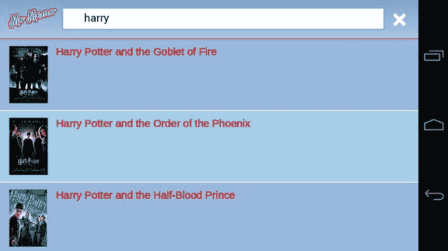

**图 8-4。** *最终搜索结果查看*

#### 设定电影视图的样式

电影视图与电影列表视图略有不同，因为它稍微复杂一些。这个想法是你可以使用 iScroll 来侧滚浏览内容。当内容对于视窗的尺寸来说太长时，用户可以向下滚动。

为了让用户理解有更多的内容，每个内容块的宽度必须小于屏幕的大小，因此下一个内容元素从左侧或右侧突出一点。

我们还将使用 CSS 使海报图像在标题中具有动画效果。这将使视图更有趣一点。

让我们从设计标题开始。在`movie-list`样式下声明一个新的样式，如下面的代码所示。

`.movie-header {

   position: relative;
   overflow: hidden;
   height: 20%;

}`

这段代码将相对于它的父元素定位电影标题，任何绝对定位的元素都将包含在`.movie-header`中。`height`被设置为`20%`，这将确保它在平板设备上看起来和在移动设备上一样大。`overflow`已经被设置为`hidden`以防止海报在元素之外可见，因为它相当大。

在电影风格中，我们可以开始设计海报。在`.movie-header`样式中创建一个新的样式，如下面的代码所示。

`.movie-header {
   ...
   .poster {
      position: absolute;
      top: 0%;
      @include animation(posteranimation 10s ease 0 infinite alternate);
   }

}`

这将把海报图像放在元素的顶部。你可以看到它附带了一个动画。我们一会儿会谈到这一点。现在，是时候对电影标题元素进行样式化了。在`.movie-header`样式中添加以下代码。

`.movie-header {
   ...
   .movie-title {
       position: absolute;
       bottom: 0px;
       background: rgba(255, 255, 255, 0.75);
       padding: 5px;
       bottom: 0;
       left: 0;
       width: 100%;
       @include box-sizing(border-box);
   }

}`

这将使电影标题位于电影标题的`bottom`处。它将占据页眉的`width`的`100%`，并具有略微透明的白色背景色，以便即使在深色海报图像上也能看到文本。你可以看到我们还使用了`box-sizing`技巧来确保填充不会影响元素的指定宽度。

在`.movie-title`中，您还需要设计收藏夹按钮的样式。这可以使用下面突出显示的代码来完成。

`.movie-header {
   ...
   .movie-title {` `       ...
      .btn-favorite {
         float: right;
         padding: 10px;
         color: #FFFFFF;
         background: #7D9DCE;
         font-weight: bold;
         border-radius: 5px;
         text-decoration: none;
         border: 1px solid #A5CCEB;
      }
   }

}`

这将创建一个蓝色按钮，浮动在电影标题的右边。你可能还想稍微修改一下上映日期，这样它就能从电影的标题中脱颖而出。接下来您可以看到新增内容。

`.movie-header {
   ...
   .movie-title {
       ...
       .movie-release-date {
          text-transform: uppercase;
          font-weight: bold;
      }
   }

}`

完整的电影标题样式应该类似于下面的代码。

`.movie-header {

   position: relative;
   overflow: hidden;
   height: 20%;

   .poster {
      position: absolute;
      top: 0%;
      @include animation(posteranimation 10s ease 0 infinite alternate);
   }

   .movie-title {
      position: absolute;
      bottom: 0px;
      background: rgba(255, 255, 255, 0.75);
      padding: 5px;
      bottom: 0;` `      left: 0;
      width: 100%;
      @include box-sizing(border-box);

      .btn-favorite {
         float: right;
         padding: 10px;
         color: #FFFFFF;
         background: #7D9DCE;
         font-weight: bold;
         border-radius: 5px;
         text-decoration: none;
         border: 1px solid #A5CCEB;
      }

      .movie-release-date {
         text-transform: uppercase;
         font-weight: bold;
      }

   }

}`

刷新您的移动浏览器，通过搜索电影并录制来观看。它现在应该看起来像[图 8-5](#fig_8_5) 。

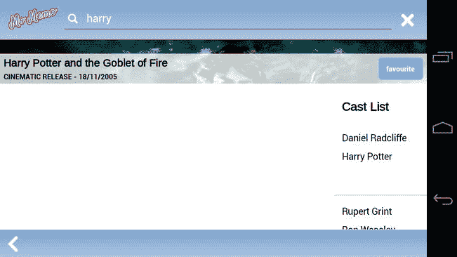

**图 8-5。** *电影片头*

下一个任务是为电影本身设计实际内容的样式。因为这些块相对来说是相同的，所以实现这一点不需要太多代码。

让我们从设计`.movie-content`元素开始。

`.movie-content {
   height: 80%;
   width: 100%;
   padding-bottom: 40px;
   @include box-sizing(border-box);  
}`

这里没什么特别可看的。我们只是将`height`设置为屏幕高度的`80%`,以适应电影标题 20%的高度。

还有一个`40px`的`padding-bottom`允许电影页脚位于底部，后面没有内容出现。

容纳所有块元素的块容器需要是屏幕的宽度×元素的数量——每个块元素的宽度之差。这在 SASS 中很容易做到，因为您可以创建一个变量来保存每个 block 元素的宽度，然后创建一个等式来设置容器元素的宽度，如下所示。

`   $blockWidth: 33%;
   $blocks: 3;
   ...
   .block-container {
      width: (100% * $blocks) - (100% - 33%);
   ...`

我们现在可以设置块及其内容的样式。这部分真的很简单，唯一复杂的事情是确保块的宽度是根据先前设置的变量设置的。将以下代码添加到`movie-content`样式中。

`.movie-content {
   ...
   .block-container {

      $blockWidth: 33%;
      $blocks: 3;

      width: (100% * $blocks) - (100% - 33%);
      height: 100%;

      .block {
         width: 33%;
         float: left;
         height: 100%;

         font-size: 1.3em;
         line-height: 2em;` `         .content {
            @include box-sizing(border-box);
         }

         h3 {
            padding: 10px 10px 0 10px;
         }

         .content {
            padding: 10px;
         }

      }

   }
}`

刷新你的浏览器，你的网络应用程序应该看起来像图 8-6 。

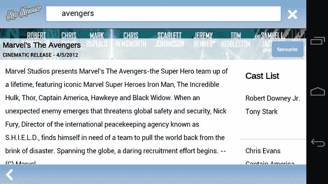

**图 8-6。** *电影大片造型*

您需要为标题动画创建关键帧。所有这些只是反复上下移动海报图像。我们使用百分比，以便根据屏幕大小，图像将按比例移动。将以下代码添加到您的 SASS 文件中。

`@keyframes posteranimation {
   0% { top: 0%; }
   100% { top: -80%; }
}` `@-moz-keyframes posteranimation {
   0% { top: 0%; }
   100% { top: -80%; }
}

@-webkit-keyframes posteranimation {
   0% { top: 0%; }
   100% { top: -80%; }
}`

最后但同样重要的是，我们需要设计电影页脚的样式，这是一个非常简单的样式。它会将页脚定位在视图的底部。页脚也可以包含一个后退按钮，需要用一个图像的风格。将附录中的清单 A-2 中的代码放在 SASS 文件的末尾。

你最终的电影视图应该看起来像[图 8-7](#fig_8_7) 。

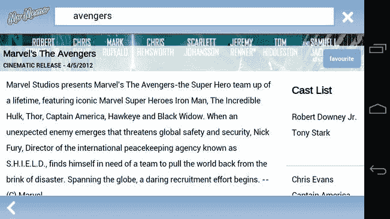

**图 8-7。** *最终电影信息页面*

### 把所有这些放在一起

准备好所有的 JavaScript 和 SASS 文件后，现在是时候更新 HTML 以利用所有的新代码了。

这是一个非常简单的过程。打开`index.html`文件，将下面的代码添加到底部，就在结束 body 标签之前。

`...
      <!-- Load all of the JavaScript dependencies -->` `      <!-- Load any lib files -->
      
      

      <!-- Load the utility files -->
      
      
      
      

      <!-- Load the custom types -->
      
      

      <!-- Load the models -->
      
      
      
      

      <!-- Load the views -->
      
      
      

      <!-- Load the controllers -->
      
      

      <!-- Bootstrap the application -->
      
      
   </body>
</html>`

你还需要从谷歌的字体目录中加载一种新字体。这是一个足够简单的任务。在`<head />`标签中，在`mobile.css`链接声明之后添加以下代码。

`<!DOCTYPE html>
<html lang="en-GB" dir="ltr">
   <head>

      <meta charset="UTF-8" />
      <meta name="viewport" content="width=device-width; initial-scale=1.0;
         maximum-scale=1.0; user-scalable=0; target-densitydpi=device-dpi;"/>
      <title>Mo Memo</title>
      <link rel="stylesheet" type="text/css" href="css/mobile.css?v=22" />` `      <link href='http://fonts.googleapis.com/css?family=Arimo' rel='stylesheet'
         type='text/css'>
      <link rel="apple-touch-icon-precomposed" href="img/home-screen-icon.png">
   </head>
   ...`

重新加载您的移动网络浏览器，一切都应该像预期的那样工作。

### 连接、缩小和缓存

尽管拥有多个 JavaScript 文件对于开发和调试非常有用，但是在生产过程中向用户发送每个 JavaScript 文件并不是一个好主意，因为这可能会在应用程序中造成加载瓶颈。为了解决这个问题并获得最佳性能，最好将所有 JavaScript 文件连接成一个 JS 文件，就像我们使用 SASS 处理 CSS 文件一样。

为了提高性能，您还可以缩小 JavaScript 和 CSS 文件。这是一个删除尽可能多的未使用数据(如空格和回车)以创建一个更紧凑的文件的过程。

为了进一步提高性能，您需要更新缓存的清单文件。这将允许您的应用程序在用户的移动设备上存储 JavaScript 和图像，减少了每次加载页面时不断从服务器获取它们的需要。这也允许用户在没有连接到网络或服务器的情况下使用 web 应用程序的一部分。

#### 串联

可以通过几种方式连接 JavaScript。最流行的是使用服务器端脚本自动合并所有文件，并将最终结果缓存在服务器上。最不流行的方法是通过将所有文件复制到一个 JavaScript 文件中来手动合并所有文件。本节将介绍如何手动连接应用程序的 JavaScript 文件。

在`js`目录下创建一个名为`app.dev.js`的新文件。首先，按照以下顺序将代码从应用程序的 JavaScript 文件复制并粘贴到`app.dev.js`中，列表顶部的 JavaScript 文件出现在文件的顶部。

*   `js/lib/eligrey/classlist.js`
*   `js/lib/cubiq/iscroll.js`
*   `js/app/utility/validator.js`
*   `js/app/utility/layout.js`
*   `js/app/utility/deck.js`
*   `js/app/utility/jsonp.js`
*   `js/app/type/format.js`
*   `js/app/type/releaseDate.js`
*   `js/app/model/actor.js`
*   `js/app/model/movie.js`
*   `js/app/model/video.js`
*   `js/app/model/videosource.js`
*   `js/app/view/movie.js`
*   `js/app/view/movielistitem.js`
*   `js/app/view/movielist.js`
*   `js/app/controller/movies.js`
*   `js/app/controller/favorites.js`
*   `js/app/bootstrap.js`

保存文件并从`index.html`底部删除当前的 JavaScript 文件列表。

下面的代码片段显示了这应该是什么样子。

`   ...
      <!-- Load the applications JavaScript -->
      
      
   </body>
</html>`

如果你刷新你的手机浏览器，一切都应该正常工作。

#### 缩小

缩小/缩小是从代码中删除尽可能多的空白和注释的过程。这听起来很傻，但是额外的数据会占 JavaScript 文件大小的很大一部分。

在 Aptana 中右键单击`app.dev.js`文件并选择 Properties，查看其大小。它的重量应该在 54，000 字节左右，大约是 53KB。您可以通过缩小脚本来运行文件，从而进一步减小生产文件的大小。

就像连接一样，你也可以在服务器端自动缩小你的 JavaScript 或者使用 YUI 压缩器。对于本书中的例子，您将使用在`[http://jscompress.com](http://jscompress.com)`找到的在线 JavaScript 压缩工具。

在`js/`中创建一个名为`app.min.js`的新文件。这将包含您的生产就绪的精简代码。从`app.dev.js`复制代码，粘贴到`[http://jscompress.com](http://jscompress.com)`的“Javascript 代码输入”文本框中。然后按下“压缩 Javascript”按钮。

复制压缩输出并粘贴到`app.min.js`中。保存文件，然后在应用浏览器中右键单击该文件并选择属性。您应该会看到文件大小大大减小，从大约 54，000 字节减少到大约 24，318 字节。这意味着文件大小减少了大约一半。

您还可以利用- style compress 选项，使用 SASS 来压缩您的 CSS 文件。为此，从应用程序文件夹打开终端并输入以下命令。

`sass ./css/*.scss ./css/mobile.min.css --style compress`

这将输出一个缩小版本的 CSS 文件到 CSS 目录。要使用它，将`index.html`头部 CSS 样式表的`href`从`mobile.css`改为`mobile.min.css`。您的新头部现在应该看起来像下面的代码。

`<head>
   <meta charset="UTF-8" />
   <meta name="viewport" content="width=device-width; initial-scale=1.0;
      maximum-scale=1.0; user-scalable=0; target-densitydpi=device-dpi;"/>
   <title>Mo Memo</title>
   <link rel="stylesheet" type="text/css" href="css/mobile.min.css" />
   <link href='http://fonts.googleapis.com/css?family=Arimo' rel='stylesheet'
type='text/css'>
   <link rel="apple-touch-icon-precomposed" href="img/home-screen-icon.png">
</head>`

#### 缓存

所有文件保存技术都可以完美地减少应用程序在每次页面加载时占用的带宽。现在，如果用户只需要请求那些千载难逢才发生一次变化的素材，这不是很好吗？您可以使用缓存清单来做到这一点。

我们在第四章中简要提到了这一点。缓存可能是有用的，但是当你需要清除它的时候也可能是痛苦的。幸运的是，应用程序缓存有一个 JavaScript API，允许您动态清除它。

您不仅可以缓存来自 web 应用程序的文件，还可以缓存从外部网站获取的文件，例如用户最喜欢的电影图像。但是，请注意，在某些设备上，应用程序的缓存可能会被限制在一定的大小。

打开您在[第 4 章](04.html)中创建的`momemo.cache`文件。我们知道应用程序文件(比如图像、JavaScript 文件和 CSS)需要缓存，所以更新`momemo.cache`以便缓存下面的文件。

*   `index.html`
*   `css/mobile.min.css`
*   `js/app.min.css`
*   `img/`

您的清单文件现在应该类似于下面的代码。

`CACHE MANIFEST

# We'll make these files cachable
CACHE:
index.html
css/mobile.min.css
js/app.min.js
img/momemo.png
img/momemo.png
img/back.png
img/clear.png
img/loading.gif
img/search.png`

可以看到，每个需要缓存的文件都被明确指定了。不幸的是，您不能使用通配符，因为浏览器缓存将在页面加载之前缓存清单文件中的所有文件。它不知道哪些文件存在于您的服务器上，所以使用通配符(*)不会有任何效果。

我们缓存缩小的 CSS 和 JS 文件，而不是没有缩小的 JavaScript 和 CSS 文件。这将防止在您需要为开发而更改文件时遇到挫折，这样您就不必手动更改清单文件来引入已更改的文件。

使用缓存清单，您还可以指定哪些文件需要网络连接。我们当然希望烂番茄空气污染指数有最新的数据。为此，您必须将文件的 URL 或位置放在清单文件中的网络定义下。您的新缓存文件应该如下所示。

`CACHE MANIFEST

# We'll make these files available offline
CACHE:
index.html
css/mobile.min.css
js/app.min.js
img/momemo.png
img/momemo.png
img/back.png
img/clear.png
img/loading.gif
img/search.png

# These files require a network connection
NETWORK:
http://api.rottentomatoes.com/`

如果你缓存一个文件，你必须记住它必须存在于服务器上；否则，应用程序缓存不会缓存您的任何文件。

要重新加载缓存，只需更改/修改缓存文件。

### Android 版 Chrome 的调试

如果你有创建网站的经验，你就会知道在 IE6 中调试任何东西是多么令人沮丧。没有 JavaScript 控制台、DOM 检查器、分析器等等。到目前为止，对于移动设备来说也是如此，因为还没有一种本地方法可以轻松地运行和调试移动 web 应用程序。最后，Chrome for Android 引入了一种聪明的方法来调试你的移动网络应用，就像你的桌面网络应用一样。

使用 Chrome for Android，您可以从控制台启动远程调试会话，并使用电脑上的 web inspector 与 Android 设备上的网页进行交互。不幸的是，这仅适用于 Android 4+(冰淇淋三明治)，因为 Chrome 仅支持该版本的 Android。

要做到这一点，去你手机上的 Play Store，下载免费的谷歌 Chrome 浏览器。请记住，只有在 Android 4+上才能找到该应用程序。

你需要启用 Web 调试，因此在应用程序中转至设置开发人员工具启用 USB Web 调试。

将您的 Android 设备插入电脑，并在 Aptana 中启动终端。导航到 Android SDK 目录，它通常在`~/android-sdks/platform-tools/`中。运行以下命令。

`./adb forward tcp:9222 localabstract:chrome_devtools_remote`

这是一个端口转发，将允许您从计算机的浏览器访问 Chrome 检查器。

在 Chrome for Android 中打开任何网页，并在您的桌面浏览器中转至以下 URL:localhost:9222。你会看到一个类似于[图 8-8](#fig_8_8) 的屏幕。

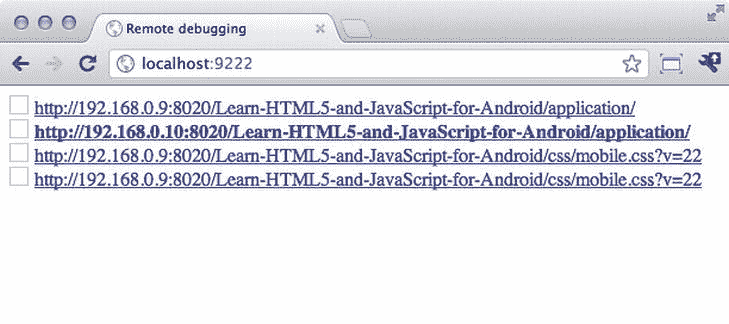

**图 8-8。** *Chrome 页面调试选择*

选择突出显示的页面，将出现类似于[图 8-9](#fig_8_9) 的屏幕。

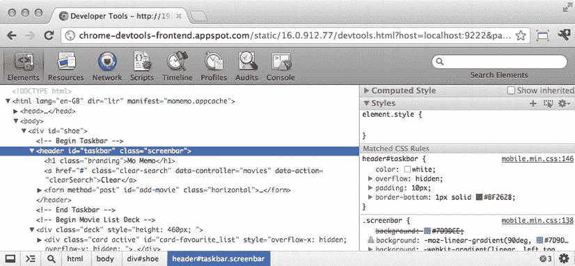

**图 8-9。** *调试控制台*

如果您现在选择调试控制台中的某个元素或将鼠标悬停在该元素上，并查看您的移动设备，该元素应该会高亮显示。你可以看到它的大小和属性，如图[图 8-10](#fig_8_10) 所示。您也可以双击 CSS 规则来更改它们的值，它们将出现在设备上。

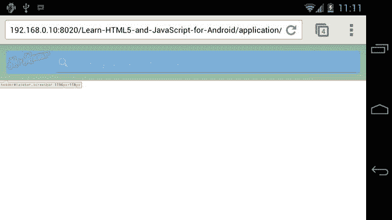

**图 8-10。** *高亮元素*

你甚至可以调出 JavaScript 控制台，在手机上键入将直接影响页面的 JavaScript 代码，如图[图 8-11](#fig_8_11) 和[图 8-12](#fig_8_12) 所示。

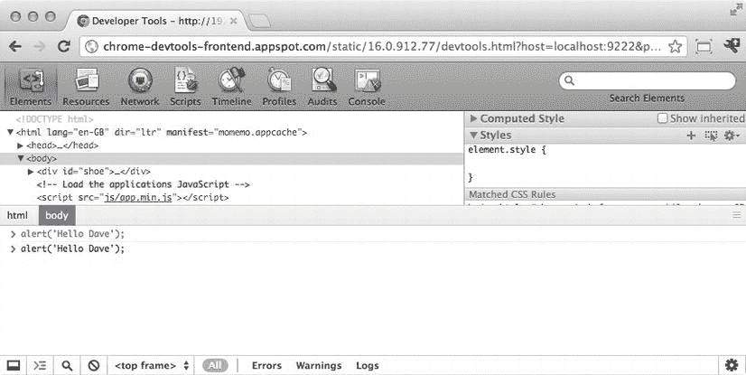

**图 8-11。** *JavaScript 控制台*

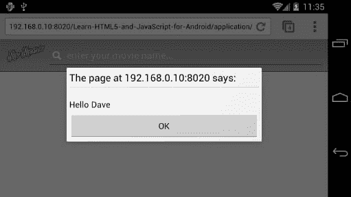

**图 8-12。** *Chrome 警报*

这是一个非常好的工具。如果你想快速调试或者测试你的 CSS 的变化，直接在浏览器中调整它们要快得多，而不是不断地保存和重新加载你的移动网络应用。

**注:**由于 Android 版 Chrome 仍处于测试阶段，你最终调试的方式可能会改变。要获得最新的说明，请前往`[https://developers.google.com/chrome/mobile/docs/debugging](https://developers.google.com/chrome/mobile/docs/debugging)`。

### 总结

这是一个非常深入的章节，讲述了在过程语言的世界之外，使用 JavaScript 可以真正实现什么。

您现在应该已经真正掌握了 MVC，以及如何使用它来提供一个坚实的工作框架。把它背后的原则带在身边真的很重要，因为这将帮助你进一步理解其他 JavaScript 框架和设计模式，它们可以让你的生活变得更加轻松。

本章还向您介绍了如何在实用程序对象中将代码组合在一起，以减少代码重复。

您还应该对 JavaScript 对象和范围有更好的理解，以及如何利用这一点。