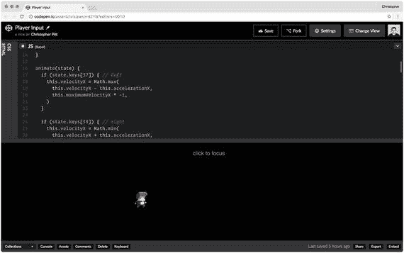

# 三、玩家输入

电影和游戏有什么区别？玩家输入！事实上，这是游戏设计中如此关键的一部分，以至于游戏经常被定义为如何接受玩家的输入。

赛车游戏依赖于持续的、微妙的输入。如果你把手指从键盘上抬起来，或者把脚从踏板上抬起来，你就失去了动量。如果您没有输入正确的组合键，您的飞行模拟将会崩溃。

平台游戏，比如我们正在开发的这个，需要双手参与。通常键盘的右手边是用来移动的。通常键盘的左手边是玩家的动作，比如射击或开门。

也许你想设计一个类似 Terraria ( [`https://terraria.org`](https://terraria.org) )的平台游戏，它使用鼠标进行玩家动作和投射瞄准。也许你想用 WASD 在屏幕上移动你的玩家。我们开始工作吧！

## 检测输入

当我第一次尝试检测输入时，我试图给所有东西添加事件监听器。我尝试向播放器添加事件侦听器，向舞台添加事件侦听器。事情失去了控制。

诀窍是检测最高级别的事件，并将它们的细节保存到游戏状态对象中。上次我们创建了这种状态对象，并将其传递给了播放器的`animate`方法。让我们扩展一下这个状态:

```js
let state = {
  "renderer": renderer,
  "stage": stage,
  "keys": {},
  "clicks": {},
  "mouse": {},
}

window.addEventListener("keydown", function(event) {
  state.keys[event.keyCode] = true
})

window.addEventListener("keyup", function(event) {
  state.keys[event.keyCode] = false
})

window.addEventListener("mousedown", function(event) {
  state.clicks[event.which] = {
    "clientX": event.clientX,
    "clientY": event.clientY,
  }
})

window.addEventListener("mouseup", function(event) {
  state.clicks[event.which] = false
})

window.addEventListener("mousemove", function(event) {
  state.mouse.clientX = event.clientX
  state.mouse.clientY = event.clientY
})

```

这是出自 [`http://codepen.io/assertchris/pen/rrdZYB`](http://codepen.io/assertchris/pen/rrdZYB) 。

我们首先向游戏状态对象添加渲染器和状态。现在我们已经添加了`keys`、`clicks`和`mouse`属性，它们跟踪按钮和动作。

Note

对于下一个部分，我必须调整`index.html`的 CSS，以便画布被绝对定位。这使得更准确地跟踪鼠标运动成为可能。签出源代码以查看更改。

随着我们向游戏中添加更多的对象，我们将把游戏状态对象传递给每个对象。当玩家与游戏互动时，他们可以用它来计算他们应该做什么。让我们移除当前的玩家移动，并添加输入驱动的移动:

```js
animate(state) {
  if (state.keys[37]) { // left
    this.x = Math.max(
      0, this.x - 5
    )
  }

  if (state.keys[39]) { // right
    this.x = Math.min(
      window.innerWidth - 64, this.x + 5
    )
  }

  if (state.clicks[1]) { // left click
    this.x = state.clicks[1].clientX
  }

  this.sprite.x = this.x
  this.sprite.y = this.y
}

```

这是出自 [`http://codepen.io/assertchris/pen/rrdZYB`](http://codepen.io/assertchris/pen/rrdZYB) 。

在`animate`方法中几乎没有什么变化。我们检查两个箭头键，如果玩家按下其中一个就移动。我们还检查玩家是否点击了鼠标，如果是，就立即移动。

Tip

不要理会`Math`功能和幻数`64`。这些只是为了防止玩家精灵离开屏幕。当我们开始建墙的时候，我们会移除这些东西…



图 3-1。

Player input

## 自然球员运动

玩家现在可以移动一点了。虽然感觉不太好。当我们放开箭头键时，动作就嘎然而止了。游戏只有一个速度:慢。

我们需要的是一些加速度，让玩家在给定的方向上加速。当玩家不再加速时，我们也可以利用摩擦力让他们慢下来。让我们加上这些:

```js
class Player {
  constructor(sprite, x, y) {
    this.sprite = sprite
    this.x = x
    this.y = y

    this.velocityX = 0
    this.maximumVelocityX = 8
    this.accelerationX = 2
    this.frictionX = 0.9

    this.sprite.x = this.x
    this.sprite.y = this.y
  }

  animate(state) {
    if (state.keys[37]) { // left
      this.velocityX = Math.max(
        this.velocityX - this.accelerationX,
        this.maximumVelocityX * -1
      )
    }

    if (state.keys[39]) { // right
      this.velocityX = Math.min(
        this.velocityX + this.accelerationX,
        this.maximumVelocityX
      )
    }

    this.velocityX *= this.frictionX

    this.x += this.velocityX

    // if (state.clicks[1]) { // left click
    //   this.x = state.clicks[1].clientX
    // }

    this.sprite.x = this.x
    this.sprite.y = this.y
  }
}

```

这是出自 [`http://codepen.io/assertchris/pen/rrdZYB`](http://codepen.io/assertchris/pen/rrdZYB) 。

哇哦，老虎！让我们逐步回顾一下:

1.  我们已经创建了一些属性:速度、最大速度、加速度和摩擦力。我们已经将它们设置为合理的默认值。随意试验他们的价值观，直到你欣赏他们的所作所为。
2.  我们可以开始追踪玩家在任一方向上的加速度。如果我们按下左键，我们开始让玩家向那个方向加速。玩家可以有一个最大加速度，这样他们就不会继续加速。
3.  如果没有某种反作用力，玩家会继续朝同一个方向移动。这就像在太空中没有空气阻力或重力来抵消动量一样。我们把这个反作用力定义为摩擦力，并用它乘以速度。没有加速度，这意味着动量趋向于零。这给人一种玩家已经停止的感觉。

## 摘要

我们已经开始让我们的游戏变得互动。我们现在可以按下箭头键，看到我们的球员的精灵顺利地在场景中移动。

我们还通过给精灵的运动增加加速和减速来使事情不那么不和谐。这个逻辑将告诉我们如何创造其他力学(如重力)。

花一点时间来调整你的加速属性，这样你的玩家精灵的移动就正好适合你的游戏。您也可以尝试将其他键映射到左右动作。