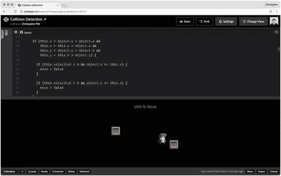

# 4.冲突检出

我们该谈谈碰撞检测了。它影响了我们游戏中明显的部分，比如我们无法穿过的墙。就像我们不会掉下去的地板。它还会影响到我们游戏中模糊的部分，比如武器发射和关卡。

我们还没到达重力。我们也不会关注玩家的健康和重生。地板、投射物和检查站很有趣，但是它们应该有自己的部分。在这一章中，我们将创建不可逾越的对象。我们将学习知道两个物体是否占据同一个空间的方法。

我花了一些时间研究这个话题。似乎有很多方法可以计算出两个物体是否占据相同的空间。其中一些很容易解释和实现。我们会看的。其他方式都不容易。不过，他们还是很酷。

## 创建盒子

玩家只是同时存在于屏幕上的众多对象中的一个。我们的游戏是一个平台游戏，所以我们可以期待在任何给定的时间屏幕上至少有一个平台。

平台有一些有趣的特征。有时他们会让玩家摔倒。就像当你站在一个平台上，你按住并按下跳跃(同时)。一些游戏认为这个顺序意味着你想从平台上掉下去。

同样，一些游戏允许玩家在平台底部跳跃。这使得垂直移动在高架平台上没有间隙。

有时候平台甚至会动！

平台是如此的特殊，以至于我们将花几个小节来实现它们不同的行为。但是现在我们要关注另一个常见的物体。通用盒子。

把这个盒子想象成平台的祖先。它可能会共享一些平台功能，但它存在的主要原因是为了与它发生冲突。尤其是像播放器这样的东西。

我们要做的盒子可能看起来都不像盒子。当我们开始实现重力时，我们需要一个又宽又薄的盒子来防止玩家从世界中掉出来。我们还需要又高又薄的盒子来防止球员从地板上跑出来。我们会用它们做墙。我们甚至可以用盒子做盒子。又大又木的“跳到我身上去够更高的东西”的盒子。

好了，说够了。

```js
class Box {
  constructor(sprite, x, y, w, h) {
    this.sprite = sprite
    this.x = x
    this.y = y
    this.w = w
    this.h = h

    this.sprite.x = this.x
    this.sprite.y = this.y
  }

  animate(state) {
    this.sprite.x = this.x
    this.sprite.y = this.y
  }
}

```

这是出自 [`http://codepen.io/assertchris/pen/qaokJj`](http://codepen.io/assertchris/pen/qaokJj) 。

为了制作这个类，我复制粘贴了`Player`类，删除了一堆东西。我确实需要给它添加宽度和高度属性。我们一会儿会谈到这一点。

接下来，我们需要在舞台上添加两个这样的盒子:

```js
const playerSprite = new PIXI.Sprite.fromImage(
  "path/to/sprites/player-idle.png",
)

const player = new Player(
  playerSprite,
  window.innerWidth / 2,
  window.innerHeight / 2,
  44,
  56,
)

const blob1Sprite = new PIXI.Sprite.fromImage(
  "path/to/sprites/blob-idle-1.png",
)

const blob1 = new Player(
  blob1Sprite,
  (window.innerWidth / 2) - 150,
  (window.innerHeight / 2) - 35,
  48,
  48,
)

const blob2Sprite = new PIXI.Sprite.fromImage(
  "path/to/sprites/blob-idle-2.png",
)

const blob2 = new Player(
  blob2Sprite,
  (window.innerWidth / 2) + 150,
  (window.innerHeight / 2) + 35,
  48,
  48,
)

const stage = new PIXI.Container()
stage.addChild(playerSprite)
stage.addChild(blob1Sprite)
stage.addChild(blob2Sprite)

let state = {
  "renderer": renderer,
  "stage": stage,
  "keys": {},
  "clicks": {},
  "mouse": {},
  "objects": [
    player,
    blob1,
    blob2,
  ],
}

```

这是出自 [`http://codepen.io/assertchris/pen/qaokJj`](http://codepen.io/assertchris/pen/qaokJj) 。

那就奇怪了！我已经创建了两个新的`Box`实例，并将其命名为`blob` s。这是因为我们即将看到…

## 检测圆形碰撞

我要你为这几个盒子画圈。我们首先要做的碰撞检测类型是圆形。盒子有宽度和高度而不是半径是没问题的。你不会经常用这种碰撞检测，除非你的平台游戏里面有很多圈。

让我们看看这种检测是如何工作的:

```js
class Player {
  constructor(sprite, x, y, w, h) {
    this.sprite = sprite
    this.x = x
    this.y = y
    this.w = w
    this.h = h

    this.velocityX = 0
    this.maximumVelocityX = 8
    this.accelerationX = 2
    this.frictionX = 0.9

    this.sprite.x = this.x
    this.sprite.y = this.y
  }

  animate(state) {
    if (state.keys[37]) { // left
      this.velocityX = Math.max(
        this.velocityX - this.accelerationX,
        this.maximumVelocityX * -1,
      )
    }

    if (state.keys[39]) { // right
      this.velocityX = Math.min(
        this.velocityX + this.accelerationX,
        this.maximumVelocityX,
      );

    }

    this.velocityX *= this.frictionX

    let move = true

    state.objects.forEach((object) => {
      if (object === this) {
        return
      }

      var deltaX = this.x - object.x
      var deltaY = this.y - object.y

      var distance = Math.sqrt(
        deltaX * deltaX + deltaY * deltaY,
      );

      if (distance < this.w / 2 + object.w / 2) {
        if (this.velocityX < 0 && object.x <= this.x) {
          move = false
        }

        if (this.velocityX > 0 && object.x >= this.x) {
          move = false
        }
      }
    });

    if (move) {
      this.x += this.velocityX
    }

    this.sprite.x = this.x
    this.sprite.y = this.y
  }
}

```

这是出自 [`http://codepen.io/assertchris/pen/qaokJj`](http://codepen.io/assertchris/pen/qaokJj) 。

我们需要做的第一件事是定义宽度和高度。虽然我们假装我们的玩家和盒子是圆，但我们只需要半个宽度作为半径。

接下来，我们检查状态中的每个对象。我们可以忽略玩家对象，因为我们不需要知道什么时候有东西和自己碰撞。不过，我们确实需要检查其他的东西。

当圆的原点之间的距离小于它们的组合半径时，圆会发生碰撞。它们的中点如此接近，以至于它们的线必须重叠。

我们快速检查玩家移动的方向是否是盒子所在的位置。如果是这种情况，那么我们阻止玩家向那个方向移动。

试一试。看到非正方形如何互相阻挡是相当有趣的。当然，为了这个简单的算法，它们都必须是正圆。

## 检测矩形碰撞

检测矩形的碰撞几乎和圆一样容易。继续把斑点图像换成方框图像。你甚至可以调整精灵的名字来反映你的盒子的方形。

这一次，我们将把玩家视为一个矩形。代替半径，我们需要检查玩家矩形和任一框之间是否有间隙。我们称之为轴对齐包围盒碰撞检测(简称 AABB)。

如果没有间隙，玩家想要向盒子的方向移动，那么我们会阻止这种情况发生:

```js
let move = true

state.objects.forEach((object) => {
  if (object === this) {
    return
  }

  if (this.x < object.x + object.w &&
      this.x + this.w > object.x &&
      this.y < object.y + object.h &&
      this.y + this.h > object.y) {

    if (this.velocityX < 0 && object.x <= this.x) {
      move = false
    }

    if (this.velocityX > 0 && object.x >= this.x) {
      move = false
    }
  }
})

if (move) {
  this.x += this.velocityX
}

```

这是出自 [`http://codepen.io/assertchris/pen/qaokJj`](http://codepen.io/assertchris/pen/qaokJj)

这些是检测碰撞的简单方法，但还有其他方法。有一种使用基于投影的矢量数学(`www.sevenson.com.au/actionscript/sat`)来确定重叠。还有一个检查几个多边形中的每条线，看看是否有任何线相交( [`http://stackoverflow.com/questions/9043805/test-if-two-lines-intersect-javascript-function`](http://stackoverflow.com/questions/9043805/test-if-two-lines-intersect-javascript-function) )。太疯狂了。

你甚至可以用几组圆碰撞在一起做实验。那可能会很有趣。在图 [4-1](#Fig1) 中，我将这个小角色放进这些小盒子里一会儿…



图 4-1。

Players and boxes

## 摘要

在这一章中，我们看了一些方法，可以用来检测游戏中玩家唾液和各种其他物体之间的碰撞。

花些时间重新排列方块和斑点，这样你就能感觉到你的第一关会是什么样子。