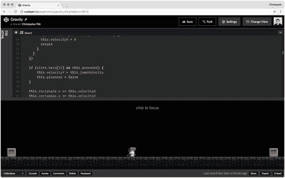

# 五、重力

在这一章中，我们将致力于我们的代码结构，并为我们的游戏增加重力。我们已经完成了重力的大部分工作，所以完成它应该相对简单。

## 清理我们现有的代码

我们需要清理一些东西！先把`x`、`y`、`w`、`h`(都在`Box`、`Player`)换成`PIXI.Rectangle`。他们有这些属性，但他们也以有趣的方式与 PIXI 其他地方互动。

```js
class Player {
  constructor(sprite, rectangle) {
    this.sprite = sprite
    this.rectangle = rectangle

    this.velocityX = 0
    this.maximumVelocityX = 8
    this.accelerationX = 2
    this.frictionX = 0.9
  }

  animate(state) {
    if (state.keys[37]) { // left
      this.velocityX = Math.max(
        this.velocityX - this.accelerationX,
        this.maximumVelocityX * -1,
      )
    }

    if (state.keys[39]) { // right
      this.velocityX = Math.min(
        this.velocityX + this.accelerationX,
        this.maximumVelocityX,
      );
    }

    this.velocityX *= this.frictionX

    let move = true

    state.objects.forEach((object) => {
      if (object === this) {
        return
      }

      const me = this.rectangle
      const you = object.rectangle

      if (me.x < you.x + you.width &&
          me.x + me.width > you.x &&
          me.y < you.y + you.height &&

          me.y + me.height > you.y) {

        if (this.velocityX < 0 && you.x <= me.x) {
          move = false
        }

        if (this.velocityX > 0 && you.x >= me.x) {
          move = false
        }
      }
    })

    if (move) {
      this.rectangle.x += this.velocityX
    }

    this.sprite.x = this.rectangle.x
    this.sprite.y = this.rectangle.y
  }
}

class Box {
  constructor(sprite, rectangle) {
    this.sprite = sprite
    this.rectangle = rectangle
  }

  animate(state) {
    this.sprite.x = this.rectangle.x
    this.sprite.y = this.rectangle.y
  }

}

```

这是出自 [`http://codepen.io/assertchris/pen/ALyXKq`](http://codepen.io/assertchris/pen/ALyXKq) 。

注意我们可以删除多少代码？比较有点冗长，但是没有一两个局部变量不能解决的问题。我还意识到我们可以将初始的`x`和`y`集合操作移到`animate`。

接下来，我想将事件、渲染器和舞台逻辑封装到一个`Game`类中:

```js
class Game {
  constructor() {
    this.state = {
      "keys": {},
      "clicks": {},
      "mouse": {},
      "objects": [],
    }

    this.animate = this.animate.bind(this)
  }

  get stage() {
    if (!this._stage) {
      this._stage = this.newStage()
    }

    return this._stage
  }

  set stage(stage) {
    this._stage = stage
  }

  newStage() {
    return new PIXI.Container()
  }

  get renderer() {
    if (!this._renderer) {
      this._renderer = this.newRenderer()
    }

    return this._renderer
  }

  set renderer(renderer) {
    this._renderer = renderer
  }

  newRenderer() {
    return new PIXI.autoDetectRenderer(
      window.innerWidth,
      window.innerHeight,
      this.newRendererOptions(),
    )
  }

  newRendererOptions() {
    return {
      "antialias": true,
      "autoResize": true,
      "transparent": true,
      "resolution": 2,
    }
  }

  animate() {
    requestAnimationFrame(this.animate)

    this.state.renderer = this.renderer
    this.state.stage = this.stage

    this.state.objects.forEach((object) => {
      console.log(object)
      object.animate(this.state)
    })

    this.renderer.render(this.stage)
  }

  addEventListenerTo(element) {
    element.addEventListener("keydown", (event) => {
      this.state.keys[event.keyCode] = true
    })

    element.addEventListener("keyup", (event) => {
      this.state.keys[event.keyCode] = false
    })

    element.addEventListener("mousedown", (event) => {
      this.state.clicks[event.which] = {
        "clientX": event.clientX,
        "clientY": event.clientY,
      }
    })

    element.addEventListener("mouseup", (event) => {
      this.state.clicks[event.which] = false
    })

    element.addEventListener("mousemove", (event) => {
      this.state.mouse.clientX = event.clientX
      this.state.mouse.clientY = event.clientY
    })
  }

  addRendererTo(element) {
    element.appendChild(this.renderer.view)
  }

  addObject(object) {
    this.state.objects.push(object)

    this.stage.addChild(object.sprite)
  }
}

```

这是出自 [`http://codepen.io/assertchris/pen/ALyXKq`](http://codepen.io/assertchris/pen/ALyXKq) 。

注意类的 getters 和 setters。它们对于根据需要填充可选的依赖项很有用。如果需要，我们可以覆盖`renderer`和`stage`，但是它们也有合理的默认值。

这里唯一值得注意的区别是，我们不再要求将精灵添加到舞台上，与将对象添加到状态分开。

我对此犹豫不决。一方面，如果我们手动将精灵添加到舞台上，那么发生的事情会清楚得多。另一方面，我们会添加精灵(连接到对象)而不添加对象吗？我不这么认为。

也许我们以后会回来改变这一点。现在，它让事情变得更干净了。让我们添加之前的精灵:

```js
const game = new Game()

game.addObject(
  new Box(
    new PIXI.Sprite.fromImage(
      "path/to/sprites/box.png",
    ),
    new PIXI.Rectangle(
      (window.innerWidth / 2) - 150,
      (window.innerHeight / 2) - 35,
      44,
      44,
    ),
  ),
)

game.addObject(
  new Box(
    new PIXI.Sprite.fromImage(

      "path/to/sprites/box.png",
    ),
    new PIXI.Rectangle(
      (window.innerWidth / 2) + 150,
      (window.innerHeight / 2) + 35,
      44,
      44,
    ),
  ),
)

game.addObject(
  new Player(
    new PIXI.Sprite.fromImage(
      "path/to/sprites/player-idle.png",
    ),
    new PIXI.Rectangle(
      window.innerWidth / 2,
      window.innerHeight / 2,
      44,
      56,
    ),
  ),
)

game.addEventListenerTo(window)
game.addRendererTo(document.body)
game.animate()

```

这是出自 [`http://codepen.io/assertchris/pen/ALyXKq`](http://codepen.io/assertchris/pen/ALyXKq) 。

这样看起来好多了！我们现在有足够的控制来设置每个游戏对象的起点。但是你会看到在第一帧之后，`animate`方法接管了。像重力和碰撞这样的事情将开始控制游戏的进程。然而，它一直都是这样的，所以这个文件现在感觉也是这样的。

此时，我们可以将事件和呈现器限制在一个较小的元素集合中。我们也可以从这里添加任意数量的物体到游戏中。其他与游戏相关的东西都在`Game`类中。其他所有与玩家或盒子相关的东西都在这些类中。很整洁！

## 给世界增加重力

让平台游戏变得有趣的一件事是适度的物理量在起作用。首先，让我们添加墙壁和地板:

```js
const game = new Game()

game.addObject

(
  new Box(
    new PIXI.extras.TilingSprite.fromImage(
      "path/to/sprites/floor-tile.png",
      window.innerWidth,
      64,
    ),
    new PIXI.Rectangle(
      0,
      window.innerHeight - 64,
      window.innerWidth,
      64,
    ),
  ),
)

game.addObject(
  new Box(
    new PIXI.Sprite.fromImage(
      "path/to/sprites/box.png",
    ),
    new PIXI.Rectangle(
      0 + 32,
      window.innerHeight - 44 - 64,
      44,
      44,
    ),
  ),
)

game.addObject(
  new Box(
    new PIXI.Sprite.fromImage(
      "path/to/sprites/box.png",
    ),
    new PIXI.Rectangle(
      window.innerWidth - 32 - 44,
      window.innerHeight - 44 - 64,
      44,
      44,
    ),
  ),
)

game.addObject(
  new Player(
    new PIXI.Sprite.fromImage(
      "path/to/sprites/player-idle.png",
    ),
    new PIXI.Rectangle(
      window.innerWidth / 2,
      window.innerHeight / 2,
      44,
      56,
    ),
  ),
)

```

这是出自 [`http://codepen.io/assertchris/pen/ALyXKq`](http://codepen.io/assertchris/pen/ALyXKq) 。

在这里，我们添加了一个与整个场景一样宽的地板。我使用了平铺纹理和`new PIXI.extras.` `TilingSprite.fromImage`在场景中渲染它。我还移动了两个板条箱来阻止玩家从地板边缘跑出来。它们以和以前一样的方式碰撞。现在，让我们看看如何添加重力:

```js
class Player {
  constructor(sprite, rectangle) {
    this.sprite = sprite
    this.rectangle = rectangle

    this.velocityX = 0
    this.maximumVelocityX = 8
    this.accelerationX = 2
    this.frictionX = 0.9

    this.velocityY = 0
    this.maximumVelocityY = 30
    this.accelerationY = 3
    this.jumpVelocity = -30

    this.isOnGround = false
  }

  animate(state) {
    if (state.keys[37]) { // left
      this.velocityX = Math.max(
        this.velocityX - this.accelerationX,
        this.maximumVelocityX * -1,
      )
    }

    if (state.keys[39]) { // right
      this.velocityX = Math.min(
        this.velocityX + this.accelerationX,
        this.maximumVelocityX,
      )
    }

    this.velocityX *= this.frictionX

    this.velocityY = Math.min(
      this.velocityY + this.accelerationY,
      this.maximumVelocityY,
    )

    state.objects.forEach((object) => {
      if (object === this) {
        return
      }

      var me = this.rectangle
      var you = object.rectangle

      if (me.x < you.x + you.width &&
          me.x + me.width > you.x &&
          me.y < you.y + you.height &&
          me.y + me.height > you.y) {

        if (this.velocityY > 0 && you.y >= me.y) {
          this.velocityY = 0
          return
        }

        if (this.velocityY < 0 && you.y <= me.y) {
          this.velocityY = this.accelerationY
          return
        }

        if (this.velocityX < 0 && you.x <= me.x) {
          this.velocityX = 0
          return
        }

        if (this.velocityX > 0 && you.x >= me.x) {
          this.velocityX = 0
          return
        }
      }
    })

    this.rectangle.x += this.velocityX

    this.rectangle.y += this.velocityY

    this.sprite.x = this.rectangle.x
    this.sprite.y = this.rectangle.y
  }
}

```

这是出自 [`http://codepen.io/assertchris/pen/ALyXKq`](http://codepen.io/assertchris/pen/ALyXKq) 。

我们首先创建一组属性来匹配我们用来跟踪水平运动的属性。我们不需要垂直摩擦，因为平台游戏经常忽略这种细节。

我们还必须跟踪垂直和水平碰撞。当碰撞发生在玩家和平台/地板之间时，我们停止向下的速度。当它碰到天花板时，我们用重力代替向上的速度。

## 允许玩家跳跃

跳跃只是在短时间内逆转重力:

```js
animate(state) {
  if (state.keys[37]) { // left
    this.velocityX = Math.max(
      this.velocityX - this.accelerationX,
      this.maximumVelocityX * -1,
    )
  }

  if (state.keys[39]) { // right
    this.velocityX = Math.min(
      this.velocityX + this.accelerationX,
      this.maximumVelocityX,
    )
  }

  this.velocityX *= this.frictionX

  this.velocityY = Math.min(
    this.velocityY + this.accelerationY,
    this.maximumVelocityY,
  )

  state.objects.forEach((object) => {
    if (object === this) {
      return
    }

    var me = this.rectangle
    var you = object.rectangle

    // ...snip

  if (state.keys[32] && this.isOnGround) {
      this.velocityY = this.jumpVelocity
      this.isOnGround = false
  }

  this.rectangle.x += this.velocityX
  this.rectangle.y += this.velocityY

  this.sprite.x = this.rectangle.x

  this.sprite.y = this.rectangle.y
}

```

这是出自 [`http://codepen.io/assertchris/pen/ALyXKq`](http://codepen.io/assertchris/pen/ALyXKq) 。

通过这段代码，我们将空格键映射为跳跃。我们在碰撞检查后添加了键盘检查，因为我们只希望玩家站在平台或地板上时能跳起来。



图 5-1。

Adding gravity

现在可以用盒子创建关卡，给它们一些可见的纹理，并在它们周围跳跃。花点时间做个关卡，在里面跳来跳去！

## 摘要

在这一章中，我们清理了游戏代码。每个部分现在都是独立的——从盒子到玩家到游戏本身。这将使单个游戏对象更容易管理自己。

我们还创造了一个地板和基本的墙壁(用板条箱)，这样玩家就不会从世界上掉下来。最后，我们增加了玩家跳跃的能力。现在可以建造一个可穿越的关卡了！